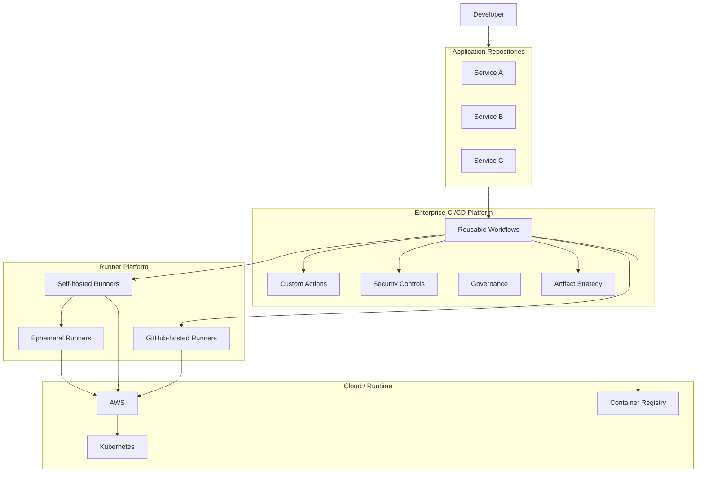
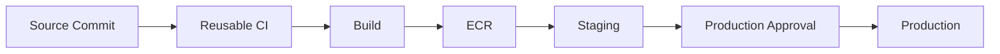
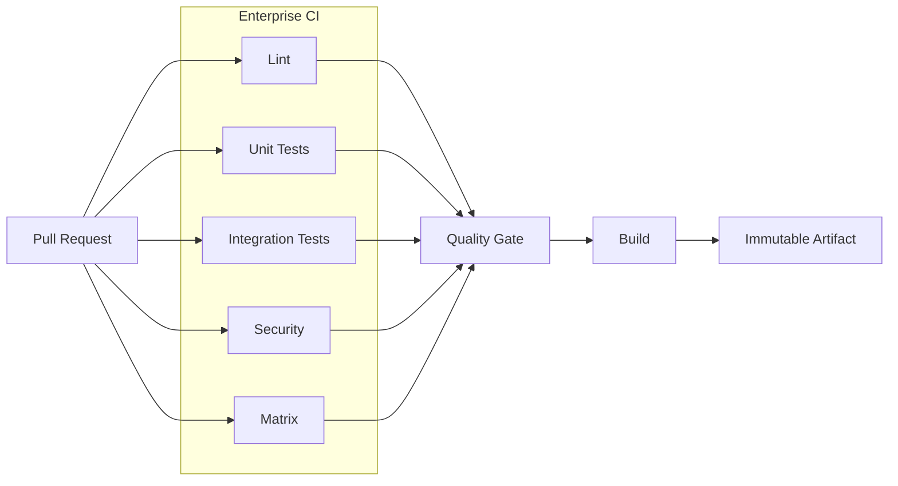

# 05- Enterprise Workflow Architecture

## Overview

Enterprise GitHub Actions architecture is the design of CI/CD workflows, reusable workflows, actions, runners, security controls, environments, artifacts, and governance as a shared engineering platform rather than as isolated repository automation.

At small scale, a repository can own its entire workflow:

```text
Repository
    ↓
Workflow
    ↓
Runner
    ↓
Build / Test / Deploy
```

At enterprise scale, hundreds or thousands of repositories may require common capabilities:

```text
                    Enterprise Platform
                           │
        ┌──────────────────┼──────────────────┐
        ↓                  ↓                  ↓
   Reusable CI       Security Controls    Deployment
        │                  │                  │
        └──────────────────┼──────────────────┘
                           ↓
                  Application Repositories
```

The architectural challenge is balancing:

- Standardization.
- Team autonomy.
- Security.
- Reliability.
- Scalability.
- Cost.
- Developer experience.
- Governance.
- Blast-radius control.

A good enterprise design centralizes **platform capabilities** while allowing application teams to retain ownership of application-specific configuration and code.

---

## Enterprise GitHub Actions Architecture

A production enterprise platform typically has several layers:

```text
Application Layer
    ↓
Repository Workflows
    ↓
Reusable Workflow Layer
    ↓
Custom Action Layer
    ↓
Runner Layer
    ↓
Infrastructure / Cloud
```

Cross-cutting these layers are:

```text
Security
Governance
Observability
Artifact Management
Environment Management
Identity
Cost Management
```

A more complete architecture is:



---

## Enterprise Design Principles

Enterprise workflow architecture should follow several principles.

### Standardize the Platform, Not Every Application

Centralize:

- Security controls.
- Authentication patterns.
- Runner standards.
- Common CI behavior.
- Docker build conventions.
- Artifact handling.
- Deployment mechanics.
- Observability.
- Governance.

Allow teams to control:

- Application-specific tests.
- Service-specific build configuration.
- Deployment parameters.
- Application architecture.
- Release cadence.

The goal is a paved road, not a rigid pipeline that cannot accommodate legitimate differences.

---

## Platform Team vs Application Team

A useful ownership model is:

| Concern | Platform Team | Application Team |
|---|---|---|
| Reusable workflows | Own | Consume |
| Shared actions | Own | Consume |
| Runner platform | Own | Consume |
| AWS identity patterns | Own | Request/use |
| Application tests | Provide standards | Own |
| Dockerfile | Standards | Own |
| Service configuration | Standards | Own |
| Deployment strategy | Platform capability | Service choice |
| Production approval | Policy | Service ownership |
| Incident response | Platform failures | Application failures |
| Workflow exceptions | Govern | Request |

This separation prevents application teams from independently reinventing infrastructure while preserving application ownership.

---

## Enterprise Workflow Layers

A mature platform can be divided into layers.

### Repository Layer

Contains:

```text
.github/workflows/
```

The repository workflow should primarily express:

- Trigger.
- Application-specific inputs.
- Pipeline dependencies.
- Environment intent.
- Service-specific configuration.

Example:

```yaml
name: Orders CI

on:
  pull_request:

jobs:
  ci:
    uses: organization/platform/.github/workflows/python-ci.yml@v1
    with:
      python-version: "3.12"
      run-integration-tests: true
```

---

### Reusable Workflow Layer

Reusable workflows provide organization-wide orchestration.

Examples:

```text
python-ci.yml
docker-build.yml
security.yml
aws-deploy.yml
terraform.yml
release.yml
```

They should provide stable interfaces.

---

### Custom Action Layer

Custom actions package reusable steps.

Examples:

```text
setup-python-environment
generate-version
publish-metadata
configure-aws
generate-deployment-summary
```

Use actions for focused capabilities rather than entire pipeline orchestration.

---

### Runner Layer

The runner platform provides execution capacity:

```text
GitHub-hosted
Self-hosted
Ephemeral
Specialized
Private-network
Deployment
```

Runner selection should be capability-based.

---

### Infrastructure Layer

The workflow platform interacts with:

- AWS.
- Kubernetes.
- Container registries.
- Private networks.
- Databases.
- Internal APIs.
- Artifact systems.

The infrastructure layer should not become tightly coupled to individual application repositories.

---

## Enterprise Workflow Flow

A standardized production flow might be:

```text
Pull Request
     ↓
Trigger Validation
     ↓
Reusable CI
     ├── Lint
     ├── Unit Tests
     ├── Integration Tests
     ├── Matrix Tests
     └── Security
     ↓
Build
     ↓
Immutable Artifact
     ↓
Registry
     ↓
Staging
     ↓
Approval
     ↓
Production
     ↓
Monitoring
     ↓
Rollback if required
```

---

## Repository Workflow Design

Application repositories should remain relatively small.

Example:

```yaml
name: CI

on:
  pull_request:
  push:
    branches:
      - main

permissions:
  contents: read

jobs:
  ci:
    uses: organization/platform/.github/workflows/python-ci.yml@v1
    with:
      python-version: "3.12"
      run-integration-tests: true
```

The repository declares intent without duplicating the implementation.

---

## Reusable Workflow Contracts

A reusable workflow is effectively an internal API.

Example:

```yaml
on:
  workflow_call:
    inputs:
      python-version:
        required: false
        type: string
        default: "3.12"

      run-integration-tests:
        required: false
        type: boolean
        default: true

    outputs:
      test-result:
        description: "CI result"
        value: ${{ jobs.test.outputs.result }}
```

The contract should remain:

- Explicit.
- Minimal.
- Typed.
- Documented.
- Backward-compatible where possible.

---

## Enterprise Workflow Versioning

Shared workflows are dependencies.

Possible references include:

```text
@main
@v1
@v1.4.0
@<commit-sha>
```

A practical enterprise model is:

```text
v1
 ├── Backward-compatible improvements
 └── Security fixes

v2
 └── Breaking contract changes
```

Consumers should not be forced to migrate immediately because an internal platform implementation changed.

---

## Why Versioning Matters

Suppose:

```text
500 repositories
      ↓
python-ci.yml@v1
```

A breaking change to the shared workflow can create:

```text
One Platform Change
        ↓
500 Pipeline Failures
```

Versioning limits blast radius.

A controlled rollout can look like:

```text
v1
 ↓
Test consumers
 ↓
Release v1.x
 ↓
Optional migration
 ↓
v2 for breaking changes
```

---

## Enterprise Workflow Governance

Governance should define:

- Who can create workflows.
- Who can modify reusable workflows.
- Which actions are allowed.
- Which runners may execute privileged jobs.
- Which permissions are permitted.
- How secrets are managed.
- How environments are protected.
- How workflow versions are maintained.
- How exceptions are approved.
- How security incidents are handled.

Governance should be implemented through automation where possible rather than relying entirely on documentation.

---

## Enterprise Action Governance

Third-party actions introduce a supply-chain boundary.

A shared platform should define:

```text
Approved Action
      ↓
Approved Version
      ↓
Approved Source
      ↓
Approved Permissions
```

Controls can include:

- SHA pinning.
- Trusted publishers.
- Internal action registry.
- Action allowlists.
- Dependency review.
- Security review.
- CODEOWNERS.
- Automated policy checks.

---

## Action Allowlist Model

A centralized policy can define:

```text
Allowed
 ├── actions/checkout
 ├── actions/setup-python
 └── organization/internal-action

Review Required
 ├── External Marketplace Action
 └── Docker-based Action

Blocked
 └── Unknown / unapproved source
```

The exact policy depends on organizational risk tolerance.

---

## GITHUB_TOKEN Governance

Every workflow should receive only the permissions it needs.

Organization-wide defaults should favor least privilege.

Example:

```yaml
permissions:
  contents: read
```

Deployment jobs can request additional permissions:

```yaml
jobs:
  deploy:
    permissions:
      contents: read
      id-token: write
```

Avoid:

```yaml
permissions: write-all
```

unless there is a documented and justified requirement.

---

## Job-Level Permission Isolation

Different jobs should not automatically share the same privilege level.

Example:

```text
Lint
 ↓
contents: read

Build
 ↓
contents: read

Deploy
 ↓
contents: read
id-token: write
```

This reduces blast radius if a lower-trust job is compromised.

---

## AWS Identity Architecture

For AWS deployments, use short-lived identity where appropriate.

```text
GitHub Actions
      ↓
OIDC Token
      ↓
AWS STS
      ↓
IAM Role
      ↓
AWS Service
```

For example:

```text
GitHub
 ↓
OIDC
 ↓
STS AssumeRoleWithWebIdentity
 ↓
Deployment Role
 ↓
ECR / ECS
```

Avoid distributing long-lived AWS access keys to hundreds of repositories.

---

## Enterprise AWS Account Separation

Large organizations may use:

```text
AWS Organization
    ├── Development Account
    ├── Staging Account
    ├── Production Account
    └── Security Account
```

GitHub environments can map to these boundaries:

```text
development → Development Account
staging     → Staging Account
production  → Production Account
```

The identity policy should restrict which repository and environment may assume each role.

---

## OIDC Trust Boundaries

An enterprise IAM trust policy should constrain claims where practical.

Conceptually:

```text
Repository
   ↓
Workflow
   ↓
Branch / Environment
   ↓
OIDC Claim
   ↓
IAM Trust Policy
   ↓
Role
```

Production roles should not be universally assumable by every repository.

---

## Environment Governance

Enterprise environments commonly include:

```text
development
staging
production
```

Production can enforce:

- Required reviewers.
- Deployment branch restrictions.
- Environment secrets.
- Deployment history.
- Approval policies.
- Deployment concurrency.

The environment becomes a security and operational boundary.

---

## Environment Promotion

Prefer:

```text
Build
 ↓
Immutable Artifact
 ↓
Development
 ↓
Staging
 ↓
Production
```

over:

```text
Build Development
 ↓
Rebuild Staging
 ↓
Rebuild Production
```

Rebuilding can introduce differences between environments.

Build once and promote the same artifact whenever the deployment model permits it.

---

## Artifact Architecture

A production artifact should have a stable identity.

For Docker:

```text
orders-api
    ↓
commit SHA
    ↓
image digest
```

Example:

```text
123456789.dkr.ecr.us-east-1.amazonaws.com/orders-api@sha256:...
```

Deployment workflows should preferably consume immutable artifact identifiers.

---

## Artifact Promotion



The artifact should remain unchanged throughout promotion.

---

## Docker Enterprise Architecture

A centralized Docker workflow can standardize:

- Buildx.
- Multi-stage builds.
- Layer caching.
- Metadata.
- Image tagging.
- Vulnerability scanning.
- SBOM generation.
- Provenance.
- Registry authentication.
- Image publishing.

Example:

```text
Application Repository
        ↓
Reusable Docker Build
        ↓
Buildx
        ↓
Cache
        ↓
Security Scan
        ↓
SBOM / Provenance
        ↓
ECR
```

---

## Docker Image Tagging

Use tags for human-oriented references:

```text
orders-api:1.4.0
orders-api:abc1234
```

Use digests for immutable identity:

```text
orders-api@sha256:...
```

A production deployment should not depend on a mutable tag such as:

```text
latest
```

as its sole artifact identity.

---

## Artifact Security

Enterprise artifact controls should consider:

- Registry permissions.
- Immutable identity.
- Vulnerability scanning.
- SBOM.
- Provenance.
- Attestations.
- Signing.
- Retention.
- Rollback availability.

The artifact registry is part of the production security boundary.

---

## Security Architecture

Enterprise GitHub Actions security should be layered:

```text
Source Protection
      ↓
Workflow Protection
      ↓
Action Governance
      ↓
Least Privilege
      ↓
Secret Protection
      ↓
Runner Isolation
      ↓
Artifact Integrity
      ↓
Environment Protection
      ↓
Deployment Controls
```

No single control should be treated as sufficient.

---

## Untrusted Input

GitHub metadata can contain attacker-controlled values.

Examples include:

- Pull request titles.
- Branch names.
- Commit messages.
- Issue content.
- Manual inputs.
- External payloads.

Avoid:

```yaml
run: echo "${{ github.event.pull_request.title }}"
```

when the value can reach a shell context unsafely.

Prefer passing data through environment variables:

```yaml
- name: Process title
  env:
    PR_TITLE: ${{ github.event.pull_request.title }}
  run: |
    printf '%s\n' "$PR_TITLE"
```

Validate values before using them as commands, paths, identifiers, or configuration.

---

## `pull_request` vs `pull_request_target`

Enterprise workflows must distinguish trust boundaries.

```text
pull_request
    ↓
PR code context
    ↓
Lower trust

pull_request_target
    ↓
Base repository context
    ↓
Higher privilege potential
```

`pull_request_target` requires particular caution because privileged workflow execution combined with untrusted code or untrusted inputs can create a security boundary failure.

Do not use privileged credentials merely to make fork-based CI convenient.

---

## Self-Hosted Runner Architecture

Self-hosted runners are useful when workflows need:

- Private network access.
- Custom software.
- Specialized hardware.
- Internal services.
- Controlled execution environments.

Architecture:

```text
GitHub Actions
      ↓
Runner Group
      ↓
Self-Hosted Runner
      ↓
Private VPC
      ↓
Internal Services
```

They also increase the security responsibility of the organization.

---

## Persistent vs Ephemeral Runners

Persistent runners:

```text
Runner
 ↓
Job A
 ↓
Job B
 ↓
Job C
```

can retain:

- Workspace files.
- Credentials.
- Docker layers.
- Temporary files.
- Process state.

Ephemeral runners:

```text
Provision
 ↓
One Job
 ↓
Destroy
```

provide stronger isolation.

For high-trust production deployment workloads, ephemeral runners can reduce persistent-state risk.

---

## Runner Groups

Runner groups provide access boundaries.

Example:

```text
Default Group
    ↓
General CI

Private Network Group
    ↓
Internal Integration Tests

Production Deployment Group
    ↓
Production Deployments
```

Combine runner groups with:

- Labels.
- Repository access restrictions.
- Environment protection.
- Least-privilege credentials.

---

## Private Network Architecture

A private deployment may require:

```text
GitHub
  ↓
Self-hosted Runner
  ↓
VPC
  ├── Private API
  ├── RDS
  ├── Redis
  └── Internal Service
```

Network controls can include:

- Security groups.
- NACLs.
- VPC endpoints.
- NAT.
- VPN.
- Transit Gateway.
- Private DNS.

Do not place public GitHub-hosted runners into workflows that require direct private-network access unless an appropriate connectivity architecture exists.

---

## Runner Autoscaling

Enterprise runner demand can vary significantly:

```text
Normal Traffic
    ↓
Small Runner Pool

Release
    ↓
High Queue
    ↓
Autoscaling
    ↓
Additional Runners
```

Autoscaling must consider:

- Startup time.
- Maximum capacity.
- Cloud quotas.
- IP availability.
- Runner registration.
- Cleanup.
- Job duration.
- Cost.

Ephemeral runner autoscaling is particularly useful for bursty CI workloads.

---

## Enterprise Matrix Strategy

Matrices can multiply workload rapidly.

Example:

```yaml
strategy:
  matrix:
    python: ["3.11", "3.12"]
    database: ["postgres", "mysql"]
```

This creates:

```text
2 × 2 = 4 jobs
```

Adding operating systems:

```yaml
os: [ubuntu, windows, macos]
```

creates:

```text
2 × 2 × 3 = 12 jobs
```

Enterprise workflows should control:

- Matrix dimensions.
- `max-parallel`.
- `fail-fast`.
- Required compatibility combinations.
- Cost.

Do not create large matrices without a testing objective.

---

## Dynamic Matrices

For monorepos:

```text
Planning Job
    ↓
Changed Services
    ↓
JSON
    ↓
Dynamic Matrix
    ↓
Parallel CI
```

Example:

```yaml
- id: services
  run: |
    echo 'services=["orders","payments"]' >> "$GITHUB_OUTPUT"
```

Then:

```yaml
strategy:
  matrix:
    service: ${{ fromJSON(needs.plan.outputs.services) }}
```

Dynamic matrices can significantly reduce unnecessary CI execution.

---

## Fan-Out and Fan-In

Enterprise workflows often use dependency graphs.

```text
                 ┌── Unit
                 │
Planning ────────┼── Integration
                 │
                 ├── Security
                 │
                 └── Lint
                        ↓
                    Quality Gate
                        ↓
                      Build
```

Independent jobs should execute concurrently where possible.

Dependent jobs should use `needs`.

---

## Concurrency Architecture

Concurrency prevents overlapping operations on shared resources.

For CI:

```yaml
concurrency:
  group: ci-${{ github.workflow }}-${{ github.ref }}
  cancel-in-progress: true
```

For production:

```yaml
concurrency:
  group: production-${{ inputs.service }}
  cancel-in-progress: false
```

The policies differ because canceling an old CI run is usually different from canceling an active deployment.

---

## Deployment Race Prevention

Without concurrency:

```text
Deployment A ────────┐
                     ├── Production
Deployment B ────────┘
```

Potential outcomes depend on timing.

With a deployment group:

```text
Deployment A
     ↓
Production Lock
     ↓
Complete
     ↓
Deployment B
```

Concurrency should be combined with idempotent deployment logic.

---

## Approval Architecture

Production deployment can be structured as:

```text
Build
 ↓
Staging
 ↓
Validation
 ↓
Production Environment
 ↓
Required Reviewer
 ↓
Deploy
```

Approvals should occur after the artifact has been produced and validated.

This avoids approving a conceptual build and then rebuilding a different artifact.

---

## Rolling Deployment

Rolling deployments gradually replace running instances.

```text
Version A: A A A A
Version B: B A A A
Version B: B B A A
Version B: B B B A
Version B: B B B B
```

Important considerations:

- Health checks.
- Capacity.
- Connection draining.
- Graceful shutdown.
- Database compatibility.
- Rollback.

---

## Blue-Green Deployment

```text
                Load Balancer
                     │
          ┌──────────┴──────────┐
          ↓                     ↓
       Blue                  Green
      Current                 New
```

Traffic switches after validation.

Advantages:

- Fast rollback.
- Clear environment separation.
- Strong deployment isolation.

Trade-offs:

- Higher infrastructure cost.
- Database compatibility remains important.
- Two environments may need to run simultaneously.

---

## Canary Deployment

Canary deployment sends a limited percentage of traffic to the new version.

```text
Users
  ↓
Load Balancer
  ├── 95% → Stable
  └── 5%  → Canary
```

Monitor:

- Error rate.
- Latency.
- Saturation.
- Business metrics.
- Logs.
- Traces.

Promotion should be based on predefined health criteria.

---

## Zero-Downtime Deployment

Zero-downtime deployment requires more than a CI workflow.

It depends on:

- Health checks.
- Readiness.
- Graceful shutdown.
- Connection draining.
- Backward-compatible schema changes.
- Capacity.
- Load balancing.
- Rollback.

For Django/FastAPI applications, application startup and shutdown behavior should be compatible with the chosen deployment strategy.

---

## Database Migration Architecture

Database migrations can become the hardest part of deployment.

Prefer:

```text
Expand
 ↓
Deploy Compatible Application
 ↓
Migrate Data
 ↓
Contract
```

Avoid tightly coupling an irreversible schema change to an application rollout when rollback is required.

Example:

```text
Old App
  ↓
New Nullable Column
  ↓
New App Uses Column
  ↓
Backfill
  ↓
Remove Old Column Later
```

This supports safer rolling and blue-green deployments.

---

## Celery and Kafka Considerations

Backend systems may contain asynchronous workers:

```text
Django / FastAPI
      ↓
Celery
      ↓
Redis
```

or:

```text
Producer
   ↓
Kafka
   ↓
Consumer
```

Deployment compatibility must account for:

- Message schemas.
- Consumer compatibility.
- Worker versioning.
- Queue draining.
- Long-running tasks.
- Consumer lag.

A workflow that deploys only the HTTP application may still produce an inconsistent system.

---

## Enterprise Release Architecture

Release workflows can standardize:

```text
Git Tag
 ↓
Version Validation
 ↓
Build
 ↓
Artifact
 ↓
Release Metadata
 ↓
Environment Promotion
```

Semantic versioning may be used:

```text
MAJOR.MINOR.PATCH
```

GitHub Releases can provide human-readable release metadata while the artifact registry provides deployable artifacts.

---

## Release Promotion

A release should preferably identify:

```text
Commit SHA
Image Digest
Version
Build Run
SBOM
Provenance
Deployment History
```

This provides traceability:

```text
Production
   ↓
Image Digest
   ↓
Build Run
   ↓
Commit
   ↓
Pull Request
```

---

## Observability Architecture

Enterprise CI/CD needs observability at multiple levels.

### Workflow Metrics

Track:

- Workflow duration.
- Queue time.
- Failure rate.
- Cancellation rate.
- Retry rate.
- Runner utilization.

### Deployment Metrics

Track:

- Deployment frequency.
- Deployment duration.
- Failure rate.
- Rollback frequency.
- Time to recovery.

### Infrastructure Metrics

Track:

- Runner capacity.
- CPU.
- Memory.
- Disk.
- Network.
- Queue depth.

---

## Step Summaries

Shared workflows should expose useful execution metadata.

Example:

```yaml
- name: Deployment summary
  env:
    IMAGE: ${{ inputs.image }}
    ENVIRONMENT: ${{ inputs.environment }}
  run: |
    {
      echo "## Deployment"
      echo ""
      echo "- Environment: $ENVIRONMENT"
      echo "- Image: $IMAGE"
    } >> "$GITHUB_STEP_SUMMARY"
```

Avoid exposing:

- Tokens.
- Passwords.
- Secret values.
- Sensitive infrastructure details.

---

## Enterprise Troubleshooting Model

Use a failure-domain approach:

```text
Symptom
  ↓
Possible Causes
  ↓
Isolation Strategy
  ↓
Commands / Checks
  ↓
Root Cause
  ↓
Corrective Action
  ↓
Prevention
```

Useful failure domains include:

```text
Workflow
Trigger
Expression
Context
Permissions
Secrets
Matrix
Reusable Workflow
Action
Runner
Container
Artifact
Cache
OIDC
AWS
Docker
Registry
Deployment
Concurrency
Security
```

---

## Enterprise Workflow Failure

### Symptom

Multiple repositories fail simultaneously.

### Possible Causes

- Shared reusable workflow changed.
- Third-party action changed.
- Runner image changed.
- Organization policy changed.
- GitHub platform issue.

### Isolation Strategy

Determine whether failures share:

```text
Workflow Version
Action Version
Runner Group
Environment
Organization Policy
```

### Prevention

Use:

- Versioned workflows.
- Action pinning.
- Change management.
- Consumer testing.
- Monitoring.

---

## Runner Failure

### Symptom

Jobs remain queued.

### Possible Causes

- No matching labels.
- Runner offline.
- Runner group access restriction.
- Capacity exhaustion.
- Autoscaling failure.

### Checks

```bash
gh run list
```

Inspect runner availability through the GitHub Actions runner management interface or API.

### Prevention

- Monitor queue depth.
- Maintain capacity.
- Test autoscaling.
- Remove stale runners.
- Use appropriate labels.

---

## AWS Authentication Failure

### Symptom

Deployment fails with an authorization error.

### Isolation

Check:

```bash
aws sts get-caller-identity
```

Then verify:

```text
GitHub permissions
 ↓
OIDC token
 ↓
IAM trust policy
 ↓
Role ARN
 ↓
IAM permissions
 ↓
Target resource
```

### Prevention

- Use OIDC.
- Restrict trust policies.
- Separate environments.
- Minimize role permissions.
- Monitor CloudTrail.

---

## Artifact Failure

### Symptom

Production receives an unexpected image.

### Possible Causes

- Mutable tag.
- Wrong registry.
- Incorrect workflow output.
- Rebuild during deployment.
- Incorrect environment configuration.

### Corrective Action

Resolve and promote an immutable artifact:

```text
Image Digest
```

rather than:

```text
latest
```

---

## Security Incident Architecture

If a shared workflow is compromised:

```text
Detect
 ↓
Identify Workflow Version
 ↓
Identify Consumers
 ↓
Disable / Restrict
 ↓
Revoke Credentials
 ↓
Inspect Workflow Changes
 ↓
Inspect Runs
 ↓
Inspect AWS CloudTrail
 ↓
Restore Trusted Version
 ↓
Rotate Credentials
 ↓
Review Blast Radius
```

The platform team should maintain a break-glass incident procedure.

---

## Break-Glass Operations

Emergency controls may be required to:

- Disable a compromised workflow.
- Restrict runner groups.
- Block a malicious action.
- Rotate credentials.
- Disable deployment.
- Freeze production promotion.

Break-glass access should be:

- Restricted.
- Audited.
- Time-bounded where possible.
- Documented.
- Reviewed afterward.

---

## Enterprise Governance Exceptions

Organizations will encounter legitimate exceptions.

Example:

```text
Standard Platform
      ↓
Service Requirement
      ↓
Exception Request
      ↓
Security Review
      ↓
Time-Bounded Exception
```

Avoid permanent undocumented exceptions.

An exception should define:

- Owner.
- Reason.
- Risk.
- Compensating controls.
- Expiration.
- Review date.

---

## Policy Enforcement

Governance can operate at several levels:

```text
Enterprise
   ↓
Organization
   ↓
Repository
   ↓
Environment
   ↓
Workflow
   ↓
Job
```

Examples:

```text
Enterprise
 → Allowed Actions

Organization
 → Runner Groups

Repository
 → Workflow Permissions

Environment
 → Production Approval

Job
 → AWS OIDC Permission
```

This layered model reduces the need for every repository to independently implement the same security controls.

---

## Central Platform vs Repository Ownership

Two extremes should be avoided.

### Fully Centralized

```text
Platform Team Controls Everything
```

Problems:

- Slow application changes.
- Reduced team autonomy.
- Platform bottlenecks.

### Fully Decentralized

```text
Every Repository Builds Everything
```

Problems:

- Security inconsistency.
- Duplication.
- Operational drift.
- High maintenance cost.

A practical enterprise model is:

```text
Centralized Platform Capabilities
+
Decentralized Application Ownership
```

---

## Enterprise CI Architecture



This provides a standard CI architecture while allowing service-specific configuration.

---

## Enterprise CD Architecture


The deployment system should know exactly which artifact was promoted.

---

## Failure Domains

Enterprise architecture should isolate failure domains.

```text
                Enterprise Platform
                       │
        ┌──────────────┼──────────────┐
        ↓              ↓              ↓
     Workflow        Runner         Cloud
      Failure        Failure        Failure
        │              │              │
   Repository       Execution      Deployment
     Impact           Impact         Impact
```

Examples:

- A runner failure should not corrupt workflow definitions.
- A staging deployment failure should not automatically modify production.
- A service-specific workflow failure should not break unrelated repositories.
- A compromised action should not receive unrestricted enterprise credentials.

---

## High Availability

CI/CD availability depends on multiple components:

```text
GitHub
 ↓
Workflow Repository
 ↓
Runner Capacity
 ↓
Artifact Registry
 ↓
Cloud APIs
 ↓
Deployment Platform
```

Mitigations include:

- Multiple runner capacity pools.
- Autoscaling.
- Ephemeral runners.
- Artifact retention.
- Infrastructure-as-code.
- Multiple deployment paths where justified.
- Documented manual recovery.

Do not confuse CI/CD availability with application availability.

---

## Disaster Recovery

The CI/CD platform should preserve enough information to recover deployment capability.

Keep:

```text
Workflow Source
Reusable Workflow Versions
Infrastructure Code
Artifact Registry
Deployment Configuration
Environment Configuration
Consumer Inventory
Operational Runbooks
```

A disaster recovery plan should answer:

```text
Can we rebuild the runner platform?
Can we identify the last production artifact?
Can we redeploy it?
Can we recover workflow definitions?
Can we revoke compromised credentials?
```

---

## Cost Optimization

Enterprise CI/CD cost is driven by:

```text
Runner Minutes
+
Storage
+
Artifact Retention
+
Cache Usage
+
Matrix Size
+
Autoscaling
+
External Services
```

Optimize through:

- Selective testing.
- Dynamic matrices.
- Dependency caching.
- Docker layer caching.
- Appropriate artifact retention.
- Parallel execution.
- Autoscaling.
- Cancelling obsolete PR runs.
- Separating required and optional checks.

Do not optimize by removing tests that provide important production confidence.

---

## Workflow Limits and Quotas

Enterprise designs must account for GitHub Actions constraints.

Examples include:

- Concurrent jobs.
- Matrix expansion.
- Artifact storage.
- Workflow execution time.
- Runner availability.
- API rate limits.
- Repository and organization policies.

Architectural controls should prevent workloads from unintentionally exceeding platform limits.

---

## Enterprise Monorepo Architecture

A monorepo may contain:

```text
services/
    orders/
    payments/
    users/

libraries/
    auth/
    common/
```

A planning workflow can identify affected components:

```text
Commit
 ↓
Change Detection
 ↓
Affected Services
 ↓
Dynamic Matrix
 ↓
Reusable CI
```

This avoids running every service pipeline for every change.

---

## Enterprise Microservice Architecture

For microservices:

```text
Orders ─────┐
Payments ───┼──→ Shared CI/CD Platform
Users ──────┤
Catalog ────┘
```

Each service can use:

```text
Reusable CI
Reusable Build
Reusable Security
Reusable Deploy
```

while retaining service-specific configuration.

---

## Enterprise Security Architecture

A production platform should implement defense in depth:

```text
Repository Protection
        ↓
Workflow Review
        ↓
Action Governance
        ↓
Least Privilege
        ↓
Secret Isolation
        ↓
Runner Isolation
        ↓
Artifact Integrity
        ↓
Environment Protection
        ↓
Deployment Concurrency
        ↓
Monitoring
```

Compromise of one layer should not automatically provide unrestricted access to the next.

---

## Supply Chain Security

The CI/CD supply chain includes:

```text
Source
 ↓
Workflow
 ↓
Actions
 ↓
Dependencies
 ↓
Runner
 ↓
Build
 ↓
Artifact
 ↓
Registry
 ↓
Deployment
```

Controls should include where appropriate:

- Dependency review.
- Dependabot.
- SHA pinning.
- SBOM.
- Provenance.
- Attestations.
- Signing.
- Immutable artifacts.
- Restricted runners.
- Least-privilege credentials.

---

## Production Workflow Reference

A complete enterprise pipeline can be represented as:

```text
Pull Request
    ↓
Repository Workflow
    ↓
Reusable CI
    ├── Lint
    ├── Unit
    ├── Integration
    ├── Security
    └── Matrix
    ↓
Reusable Build
    ↓
Docker / Buildx
    ↓
SBOM / Provenance
    ↓
ECR
    ↓
Staging
    ↓
Health Validation
    ↓
Production Approval
    ↓
Production
    ↓
Monitoring
    ↓
Rollback
```

Each stage should have a clear owner and failure boundary.

---

## Enterprise Platform Repository

A possible platform repository structure is:

```text
.github/
    workflows/
        python-ci.yml
        docker-build.yml
        security.yml
        aws-deploy.yml
        release.yml

actions/
    setup-python/
    docker-metadata/
    deployment-summary/

docs/
    workflows/
    runners/
    security/
    operations/

policies/
    actions/
    permissions/
    runners/
```

The exact structure can vary, but the platform should remain discoverable and maintainable.

---

## Workflow Naming

Use names based on capabilities:

```text
python-ci.yml
docker-build.yml
security-scan.yml
aws-deploy.yml
release.yml
```

Avoid implementation-specific names:

```text
run-steps-final-v3.yml
special-ci-new.yml
deploy-production-script.yml
```

Stable naming improves discoverability for hundreds of consumers.

---

## Enterprise Workflow Documentation

Every shared workflow should document:

```text
Purpose
Inputs
Secrets
Outputs
Permissions
Supported environments
Runner requirements
Artifact behavior
Versioning
Security assumptions
Failure behavior
Example invocation
```

Example:

```markdown
## Required Permissions

```yaml
permissions:
  contents: read
```

## Deployment Permissions

```yaml
permissions:
  contents: read
  id-token: write
```
```

This prevents hidden dependencies.

---

## Operational Metadata

A production workflow should make deployment traceability easy.

Useful metadata:

```text
Repository
Commit SHA
Workflow
Workflow Version
Run ID
Environment
Artifact
Image Digest
Deployment Time
Actor
Runner
```

This information supports incident investigation.

---

## GitHub CLI Operations

List workflows:

```bash
gh workflow list
```

View a workflow:

```bash
gh workflow view python-ci.yml
```

Run a workflow:

```bash
gh workflow run python-ci.yml
```

List recent runs:

```bash
gh run list
```

Inspect a run:

```bash
gh run view <run-id>
```

View logs:

```bash
gh run view <run-id> --log
```

Rerun a failed workflow:

```bash
gh run rerun <run-id>
```

Download artifacts:

```bash
gh run download <run-id>
```

List repository secrets:

```bash
gh secret list
```

List repository variables:

```bash
gh variable list
```

Create a release:

```bash
gh release create v1.4.0 --generate-notes
```

These commands are useful for operational workflows, incident response, and automation.

---

## Enterprise Operational Runbook

When a production pipeline fails:

```text
1. Identify affected repository.
2. Identify workflow and version.
3. Identify failed job.
4. Identify runner.
5. Identify artifact.
6. Identify environment.
7. Check recent workflow/platform changes.
8. Determine whether the issue is isolated or systemic.
9. Protect production if necessary.
10. Correct or roll back.
11. Validate the deployment.
12. Record the incident.
```

The first objective is to establish the failure boundary.

---

## Systemic vs Repository Failure

This distinction is critical.

### Repository-Specific

```text
One Repository
One Workflow
One Service
```

Likely causes:

- Application code.
- Repository configuration.
- Service-specific dependency.
- Local workflow change.

### Systemic

```text
Many Repositories
Same Workflow Version
Same Runner Pool
Same Action
```

Likely causes:

- Platform change.
- Shared workflow.
- Runner infrastructure.
- Organization policy.
- Third-party dependency.
- GitHub platform issue.

Systemic failures should be investigated at the platform layer first.

---

## Enterprise Incident Response

For a shared workflow incident:

```text
Detect
 ↓
Scope
 ↓
Contain
 ↓
Investigate
 ↓
Recover
 ↓
Validate
 ↓
Document
 ↓
Prevent
```

Scope should identify:

- Affected repositories.
- Affected workflow versions.
- Affected environments.
- Affected artifacts.
- Credential exposure.
- Deployment impact.

---

## Break-Glass Deployment

If the standard platform is unavailable, a controlled recovery path may be required.

Example:

```text
Standard Pipeline
      ↓
Unavailable
      ↓
Approved Break-Glass Workflow
      ↓
Known-Good Artifact
      ↓
Production
```

Break-glass workflows should not bypass security entirely.

They should normally have:

- Strong authentication.
- Restricted access.
- Auditability.
- Manual approval.
- Known artifact selection.
- Post-incident review.

---

## Enterprise Reliability Model

Reliability requires:

```text
Deterministic Workflows
+
Immutable Artifacts
+
Idempotent Deployments
+
Controlled Concurrency
+
Reliable Runners
+
Observable Pipelines
+
Rollback
+
Recovery Procedures
```

Retries alone do not make a CI/CD platform reliable.

---

## Reliability Anti-Patterns

Avoid:

```text
latest
```

as the only deployment identity.

Avoid:

```text
write-all
```

permissions.

Avoid:

```text
@main
```

for critical dependencies when uncontrolled changes are unacceptable.

Avoid:

```text
Persistent Runner
+
Production Secrets
+
Untrusted PR
```

Avoid:

```text
Rebuild for Every Environment
```

when immutable promotion is practical.

Avoid:

```text
One Giant Workflow
```

for unrelated platform capabilities.

---

## Maintainability Model

A maintainable enterprise platform has:

```text
Stable Contracts
+
Small Responsibilities
+
Versioned Workflows
+
Clear Ownership
+
Good Documentation
+
Automated Testing
+
Observability
```

The objective is not to minimize the number of workflows.

The objective is to minimize unnecessary duplication and operational ambiguity.

---

## Senior Architecture Trade-Offs

### Centralization vs Autonomy

Centralization improves consistency but increases platform blast radius.

### GitHub-Hosted vs Self-Hosted

GitHub-hosted runners reduce infrastructure management.

Self-hosted runners provide private network access and customization but increase security and operational responsibility.

### Persistent vs Ephemeral

Persistent runners can be faster but retain state.

Ephemeral runners provide stronger isolation but increase provisioning complexity.

### One Workflow vs Multiple Workflows

One workflow may simplify orchestration.

Multiple workflows can provide clearer boundaries and independent lifecycle management.

### Strict Policies vs Exceptions

Strict controls improve consistency.

Controlled exceptions are necessary for legitimate technical requirements.

---

## Enterprise Design Questions

When designing an enterprise GitHub Actions platform, ask:

- What should be centralized?
- What should remain repository-owned?
- What is the workflow API?
- What is the security boundary?
- Which jobs require elevated permissions?
- Which workloads require private networks?
- Which runners are trusted with production access?
- How are actions approved?
- How are workflows versioned?
- How are breaking changes rolled out?
- How are artifacts promoted?
- How is production concurrency enforced?
- How is rollback performed?
- How are failures detected?
- How is platform capacity scaled?
- How is cost measured?
- How is the platform recovered after an incident?

These questions are more important than individual YAML syntax details.

---

## Senior Interview Scenarios

### Design CI/CD for 500 Repositories

Discuss:

```text
Reusable Workflows
+
Action Governance
+
Runner Platform
+
OIDC
+
Environment Protection
+
Artifact Promotion
+
Observability
```

Explain how you prevent a platform change from breaking all repositories simultaneously.

### Production Must Never Receive Two Concurrent Deployments

Design:

```text
Deployment
 ↓
Concurrency Group
 ↓
Environment Protection
 ↓
Deployment
```

Discuss idempotency, health checks, and rollback.

### Multiple Teams Need Private AWS Access

Design:

```text
GitHub
 ↓
Ephemeral Self-Hosted Runner
 ↓
Runner Group
 ↓
Private VPC
 ↓
AWS Resources
```

Explain why the runner should not be broadly accessible to untrusted workflows.

### A Shared Workflow Needs AWS Access Without Long-Lived Secrets

Design:

```text
GitHub OIDC
 ↓
STS
 ↓
Environment-Specific IAM Role
 ↓
AWS
```

Discuss trust policy restrictions and least privilege.

### A Third-Party Action Is Compromised

Explain:

- Action pinning.
- Permissions.
- Secret exposure.
- Runner isolation.
- Consumer blast radius.
- Incident response.
- Credential rotation.
- Artifact integrity.

### Production Needs Rollback

Design:

```text
Immutable Artifact
 ↓
Deployment
 ↓
Health Validation
 ↓
Failure
 ↓
Known-Good Artifact
 ↓
Rollback
```

Discuss database compatibility and asynchronous workers.

### CI Cost Is Increasing Rapidly

Investigate:

```text
Runner Minutes
Matrix Size
Workflow Duplication
Cache Efficiency
Artifact Retention
E2E Frequency
Autoscaling
```

Optimize without removing controls that provide meaningful production confidence.

---

## Enterprise Production Checklist

### Architecture

- [ ] Platform responsibilities are clearly defined.
- [ ] Repository and platform ownership boundaries are explicit.
- [ ] Reusable workflows have stable contracts.
- [ ] Composite actions are used for step-level reuse.
- [ ] CI and CD responsibilities are separated where appropriate.

### Security

- [ ] Least-privilege permissions are enforced.
- [ ] Production roles use restricted OIDC trust.
- [ ] Secrets are environment-scoped.
- [ ] Untrusted PRs cannot access production credentials.
- [ ] Third-party actions are governed.
- [ ] Runner groups enforce trust boundaries.

### Runners

- [ ] Runner labels represent capabilities.
- [ ] Sensitive workloads use appropriate isolation.
- [ ] Ephemeral runners are used where beneficial.
- [ ] Runner capacity is monitored.
- [ ] Autoscaling limits are defined.
- [ ] Private network access is controlled.

### Artifacts

- [ ] Builds produce immutable artifacts.
- [ ] Docker images have traceable identities.
- [ ] Artifact promotion does not rebuild the application.
- [ ] SBOM/provenance controls exist where required.
- [ ] Rollback artifacts are retained.

### Environments

- [ ] Development, staging, and production are separated.
- [ ] Production requires appropriate approval.
- [ ] Deployment concurrency is configured.
- [ ] Environment secrets are protected.
- [ ] Deployment history is auditable.

### Governance

- [ ] Shared workflows have owners.
- [ ] Workflow versions are managed.
- [ ] Breaking changes have migration paths.
- [ ] Exceptions are documented.
- [ ] Action policies are enforced.
- [ ] Platform changes are reviewed.

### Operations

- [ ] Workflow failures are observable.
- [ ] Runner health is monitored.
- [ ] Queue capacity is monitored.
- [ ] Deployment metadata is traceable.
- [ ] Incident procedures exist.
- [ ] Break-glass procedures exist.
- [ ] Disaster recovery is documented.

## Key Takeaways

- Enterprise GitHub Actions should be designed as a **CI/CD platform**, with reusable workflows, actions, runners, identity, artifacts, environments, security, and governance forming separate but coordinated layers.
- The strongest operating model is **centralized platform capabilities with decentralized application ownership**, avoiding both uncontrolled repository duplication and excessive platform rigidity.
- Enterprise security depends on **least-privilege permissions, OIDC-based AWS identity, protected environments, governed actions, isolated runners, immutable artifacts, and strict trust boundaries for untrusted code**.
- Shared workflows create significant blast radius, so **versioning, contract testing, ownership, observability, controlled rollout, and rollback** are essential platform capabilities.
- A production enterprise architecture should support the complete lifecycle: **PR → CI → security → build → immutable artifact → staging → approval → production → monitoring → rollback**, while remaining scalable, recoverable, and operationally auditable.