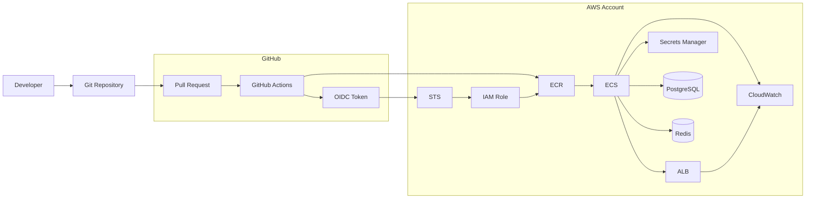
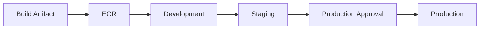
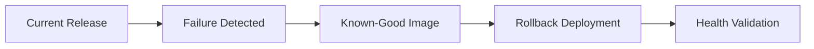
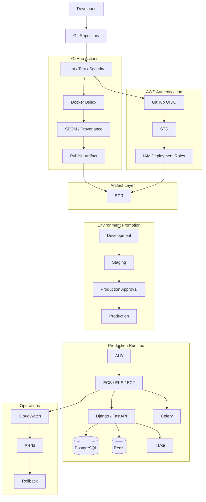

# 07- AWS Deployment Architecture

## Overview

AWS deployment architecture defines how GitHub Actions moves validated application artifacts into AWS environments while maintaining security, reproducibility, reliability, observability, and rollback capability.

For a production backend platform, GitHub Actions should act as the orchestration layer rather than becoming tightly coupled to a single AWS runtime.

A typical architecture is:

```text
Git Repository
      ↓
GitHub Actions
      ↓
CI Validation
      ↓
Immutable Artifact
      ↓
AWS Authentication via OIDC
      ↓
AWS Deployment
      ↓
Health Validation
      ↓
Monitoring
      ↓
Rollback
```

The AWS runtime may be:

- Amazon ECS
- Amazon EKS
- Amazon EC2
- AWS Lambda
- S3-based applications
- Infrastructure managed through CloudFormation or Terraform

The architectural principle remains the same:

> **Build once, produce an immutable artifact, authenticate securely, promote the artifact through environments, validate the deployment, and retain a known-good rollback path.**

---

## GitHub Actions and AWS Responsibilities

A clean architecture separates responsibilities.

| Layer | Responsibility |
|---|---|
| GitHub | Source control and workflow orchestration |
| GitHub Actions | CI/CD execution |
| OIDC | Short-lived AWS authentication |
| IAM | Authorization |
| STS | Temporary credentials |
| ECR | Container artifact storage |
| S3 | Object/artifact storage |
| ECS/EKS/EC2/Lambda | Application runtime |
| CloudFormation/Terraform | Infrastructure provisioning |
| CloudWatch | Monitoring and logs |
| ALB/NLB | Traffic distribution |
| Secrets Manager/Parameter Store | Runtime secrets/configuration |

This separation prevents the CI pipeline from becoming responsible for every runtime concern.

---

## Reference AWS CI/CD Architecture



The key security boundary is:

```text
GitHub
   ↓
OIDC
   ↓
AWS STS
   ↓
IAM Role
   ↓
AWS Resources
```

---

## CI/CD Lifecycle

A production AWS deployment can follow:

```text
Pull Request
     ↓
Lint
     ↓
Unit Tests
     ↓
Integration Tests
     ↓
Security Scan
     ↓
Matrix Tests
     ↓
Docker Build
     ↓
Image Scan
     ↓
ECR
     ↓
Staging
     ↓
Health Validation
     ↓
Production Approval
     ↓
Production
     ↓
Monitoring
     ↓
Rollback if required
```

CI produces the release artifact.

CD promotes and deploys that artifact.

---

## Build Once, Deploy Many

A production pipeline should avoid rebuilding the application separately for staging and production.

Preferred:

```text
Source
  ↓
Build
  ↓
Image Digest
  ↓
Staging
  ↓
Production
```

Avoid:

```text
Source
  ├── Build Staging Image
  └── Build Production Image
```

The second model can produce two different artifacts.

The first model guarantees that production receives the same artifact that was validated in staging.

---

## Immutable Artifact Identity

For Docker-based applications, use image digests as the strongest artifact identity.

```text
orders-api@sha256:abc123...
```

A useful release chain is:

```text
Git Commit
    ↓
GitHub Actions Run
    ↓
Docker Image
    ↓
Image Digest
    ↓
ECR
    ↓
ECS Deployment
```

This makes it possible to answer:

- Which commit produced this image?
- Which workflow built it?
- Which image digest is running?
- Which deployment introduced it?

---

## AWS Authentication from GitHub Actions

GitHub Actions should preferably use OpenID Connect rather than long-lived AWS access keys.

Architecture:

```text
GitHub Actions
      ↓
OIDC Identity Token
      ↓
AWS STS
      ↓
AssumeRoleWithWebIdentity
      ↓
Temporary AWS Credentials
      ↓
AWS API
```

The workflow requests an OIDC token:

```yaml
permissions:
  contents: read
  id-token: write
```

Then:

```yaml
- name: Configure AWS credentials
  uses: aws-actions/configure-aws-credentials@v5
  with:
    role-to-assume: ${{ vars.AWS_DEPLOY_ROLE }}
    aws-region: us-east-1
```

The resulting credentials are temporary.

---

## Why OIDC Is Preferred

Long-lived credentials stored as GitHub secrets create a credential lifecycle problem.

OIDC provides:

- Short-lived credentials.
- No static AWS access key in GitHub.
- IAM-based authorization.
- Repository/environment restrictions through trust policies.
- Easier credential rotation.
- Better separation between CI identities.

The security model becomes:

```text
GitHub Identity
       ↓
IAM Trust Policy
       ↓
Temporary Session
       ↓
IAM Permissions
```

---

## IAM Trust Policy

The trust policy controls who can assume the deployment role.

A conceptual trust policy is:

```json
{
  "Version": "2012-10-17",
  "Statement": [
    {
      "Effect": "Allow",
      "Principal": {
        "Federated": "arn:aws:iam::123456789012:oidc-provider/token.actions.githubusercontent.com"
      },
      "Action": "sts:AssumeRoleWithWebIdentity",
      "Condition": {
        "StringEquals": {
          "token.actions.githubusercontent.com:aud": "sts.amazonaws.com"
        },
        "StringLike": {
          "token.actions.githubusercontent.com:sub": "repo:example/platform-api:environment:production"
        }
      }
    }
  ]
}
```

The exact subject restriction should reflect the organization's repository and environment model.

---

## IAM Permissions vs Trust Policy

These are different controls.

| Control | Answers |
|---|---|
| Trust policy | Who may assume this role? |
| Permissions policy | What may the role do? |

For example:

```text
OIDC Token
   ↓
Trust Policy
   ↓
Can assume role?
   ↓
Permissions Policy
   ↓
What AWS APIs are allowed?
```

A permissive permissions policy cannot compensate for an overly broad trust policy.

---

## Least Privilege

A build workflow may only need:

```text
ECR Push
```

A deployment workflow may need:

```text
ECS Update
ECS Describe
IAM PassRole
```

An infrastructure workflow may need broader CloudFormation or Terraform permissions.

Do not give every workflow:

```text
AdministratorAccess
```

A useful identity separation is:

```text
CI Role
 └── Build / Push

Staging Deploy Role
 └── Staging Resources

Production Deploy Role
 └── Production Resources

Infrastructure Role
 └── CloudFormation / Terraform
```

---

## AWS Account Separation

Enterprise environments can use separate AWS accounts:

```text
AWS Organization
    ├── Development
    ├── Staging
    └── Production
```

The deployment identity is then environment-specific.

```text
GitHub
 ├── Development Role → Dev Account
 ├── Staging Role     → Staging Account
 └── Production Role  → Production Account
```

This reduces blast radius and creates stronger environment boundaries.

---

## Environment Promotion Architecture



The artifact remains unchanged.

Only the deployment environment changes.

---

## GitHub Environments

GitHub Environments can provide:

- Environment-specific secrets.
- Environment-specific variables.
- Required reviewers.
- Deployment restrictions.
- Deployment history.

A common structure is:

```text
development
staging
production
```

Production should normally have stronger protection than development.

---

## Production Approval

A deployment can be modeled as:

```text
Build
 ↓
Staging
 ↓
Automated Validation
 ↓
Production Approval
 ↓
Production Deployment
```

The approval should happen after sufficient evidence is available.

Useful evidence includes:

- Image digest.
- Test status.
- Security scan status.
- Staging health.
- Change description.
- Release version.

---

## AWS Account and Environment Mapping

A practical enterprise mapping is:

| GitHub Environment | AWS Account | Role |
|---|---|---|
| development | Dev | DevDeployRole |
| staging | Staging | StagingDeployRole |
| production | Production | ProductionDeployRole |

This avoids accidentally deploying a production artifact with a development identity.

---

## Amazon ECR Architecture

ECR acts as the container artifact registry.

```text
GitHub Actions
      ↓
Docker Buildx
      ↓
Security Validation
      ↓
ECR
      ↓
ECS / EKS / EC2 / Lambda
```

The CI role pushes.

The runtime identity pulls.

These should be separate permissions.

---

## ECR Push Flow

```yaml
- name: Configure AWS credentials
  uses: aws-actions/configure-aws-credentials@v5
  with:
    role-to-assume: ${{ vars.AWS_CI_ROLE }}
    aws-region: us-east-1

- name: Login to ECR
  id: login-ecr
  uses: aws-actions/amazon-ecr-login@v2

- name: Build and push
  uses: docker/build-push-action@v6
  with:
    context: .
    push: true
    tags: ${{ steps.login-ecr.outputs.registry }}/orders-api:${{ github.sha }}
```

Production deployment should resolve the resulting immutable image identity.

---

## ECR Image Tagging

A useful tagging model is:

```text
orders-api:abc1234
orders-api:1.8.0
```

The digest remains the strongest immutable reference:

```text
orders-api@sha256:...
```

Avoid using:

```text
orders-api:latest
```

as the production deployment identity.

---

## ECS Deployment Architecture

A common AWS backend architecture is:

```text
Internet
   ↓
Application Load Balancer
   ↓
ECS Service
   ├── Task
   ├── Task
   └── Task
        ↓
     ECR Image
```

The ECS tasks may connect to:

```text
PostgreSQL
Redis
Kafka
Secrets Manager
Other AWS Services
```

---

## ECS Task Definition

A simplified container definition:

```json
{
  "name": "orders-api",
  "image": "123456789012.dkr.ecr.us-east-1.amazonaws.com/orders-api@sha256:abc123",
  "essential": true,
  "portMappings": [
    {
      "containerPort": 8000,
      "protocol": "tcp"
    }
  ]
}
```

Using an immutable digest makes the deployment deterministic.

---

## ECS Execution Role vs Task Role

These roles serve different purposes.

| Role | Purpose |
|---|---|
| Task execution role | ECS infrastructure operations such as pulling images and sending logs |
| Task role | Permissions available to the application |

For example:

```text
ECS
 ├── Execution Role
 │    ├── Pull from ECR
 │    └── Send logs
 │
 └── Task Role
      ├── Read S3
      ├── Read Secrets Manager
      └── Publish to SQS
```

Do not put application permissions into the execution role unnecessarily.

---

## ECS Deployment Flow

```text
GitHub Actions
      ↓
OIDC
      ↓
Production IAM Role
      ↓
Register Task Definition
      ↓
Update ECS Service
      ↓
ECS Pulls Image
      ↓
Start New Tasks
      ↓
Health Check
      ↓
Traffic Shift
      ↓
Old Tasks Drain
```

---

## ECS Health Validation

Health validation can include:

```text
Task Running
      ↓
Container Health
      ↓
Target Group Health
      ↓
Application Readiness
      ↓
Smoke Test
```

A deployment should not be considered successful merely because ECS accepted the task definition.

---

## ECS Rolling Deployment

A rolling deployment gradually replaces old tasks.

```text
Version A
A A A A

      ↓

A A B B

      ↓

A B B B

      ↓

B B B B
```

Important parameters include:

- Desired count.
- Minimum healthy percentage.
- Maximum percentage.
- Health checks.
- Grace periods.
- Deployment circuit breaker.

---

## ECS Blue-Green Deployment

Blue-green maintains two environments:

```text
Blue
 └── Current

Green
 └── New
```

Traffic can be switched after validation.

```text
ALB
 ↓
Blue

      ↓ switch

ALB
 ↓
Green
```

Benefits include:

- Fast rollback.
- Strong environment separation.
- Pre-traffic validation.

Costs include additional infrastructure capacity.

---

## ECS Canary Deployment

Canary exposes a limited portion of traffic to the new version.

```text
Traffic
 ├── 95% → Stable
 └── 5%  → Canary
```

After validation:

```text
50% → Stable
50% → Canary
```

Eventually:

```text
100% → New
```

Canary requires meaningful monitoring and objective promotion criteria.

---

## EC2 Deployment Architecture

For Dockerized applications on EC2:

```text
GitHub Actions
      ↓
ECR
      ↓
EC2
      ↓
Docker
      ↓
Container
      ↓
Nginx
      ↓
Django / FastAPI
```

The EC2 instance should use an IAM instance profile where AWS access is required.

---

## EC2 Deployment Identity

Prefer:

```text
EC2
 ↓
Instance Profile
 ↓
IAM Role
 ↓
AWS APIs
```

rather than placing AWS access keys inside:

- Environment files.
- Docker images.
- Deployment scripts.
- GitHub repository files.

---

## EC2 Deployment Strategies

Possible approaches include:

### In-Place Deployment

```text
EC2
 ↓
Pull Image
 ↓
Stop Old Container
 ↓
Start New Container
```

Simple but can introduce downtime.

### Rolling EC2 Deployment

```text
Instance A → New
Instance B → Old

Instance B → New
```

Requires multiple instances and traffic management.

### Immutable AMI

Build a new AMI and replace instances.

This provides stronger infrastructure immutability.

---

## Lambda Deployment Architecture

Lambda can use:

- ZIP artifacts.
- Container images.

For container-based Lambda:

```text
GitHub Actions
      ↓
Docker Build
      ↓
ECR
      ↓
Lambda
```

The deployment workflow should validate:

- Image identity.
- Function configuration.
- Permissions.
- Runtime health.
- Invocation behavior.

---

## S3 Deployment Architecture

S3 can store:

- Static application artifacts.
- Deployment packages.
- Configuration artifacts.
- Build outputs.

Example:

```text
GitHub Actions
      ↓
Build
      ↓
Artifact
      ↓
S3
      ↓
CloudFront / Application
```

The artifact should be versioned or otherwise identified immutably where rollback matters.

---

## CloudFormation Architecture

CloudFormation manages AWS infrastructure declaratively.

```text
Git
 ↓
CloudFormation Template
 ↓
GitHub Actions
 ↓
Change Set
 ↓
Approval
 ↓
Stack Update
 ↓
AWS Resources
```

A production workflow can validate the template before deployment.

---

## CloudFormation Deployment

Example:

```bash
aws cloudformation deploy \
  --template-file infrastructure.yaml \
  --stack-name orders-api-production \
  --capabilities CAPABILITY_IAM \
  --parameter-overrides \
    Environment=production
```

For sensitive or high-risk infrastructure changes, change sets provide a useful review boundary.

---

## Terraform Architecture

Terraform provides another infrastructure-as-code model.

```text
Git
 ↓
Terraform
 ↓
Plan
 ↓
Review
 ↓
Apply
 ↓
AWS
```

A production workflow should separate:

```text
Plan
```

from:

```text
Apply
```

and protect production state and credentials.

---

## Infrastructure vs Application Deployment

Keep these concepts separate:

```text
Infrastructure Deployment
 ├── VPC
 ├── IAM
 ├── ECS
 ├── ALB
 └── Databases

Application Deployment
 ├── Docker Image
 ├── Task Definition
 └── Runtime Release
```

Infrastructure does not necessarily need to change for every application release.

---

## Database Deployment Considerations

Application deployments often depend on PostgreSQL schema changes.

A safer pattern is:

```text
Expand
 ↓
Deploy
 ↓
Migrate / Backfill
 ↓
Switch Application Behavior
 ↓
Contract
```

Avoid destructive schema changes that make immediate rollback impossible.

---

## Django AWS Deployment

A typical architecture:

```text
ALB
 ↓
ECS
 ├── Django
 └── Celery Worker
      ↓
PostgreSQL
Redis
```

The image may contain:

```text
Python
Django
Application
Dependencies
```

Environment configuration provides:

```text
DATABASE_URL
REDIS_URL
DJANGO_SECRET_KEY
ALLOWED_HOSTS
```

Secrets should come from an appropriate runtime secret store.

---

## FastAPI AWS Deployment

```text
ALB
 ↓
ECS
 ↓
FastAPI
 ├── PostgreSQL
 ├── Redis
 └── Kafka
```

The CI pipeline should test:

- API behavior.
- Database integration.
- Redis integration.
- Container startup.
- Health endpoints.

---

## Celery Deployment

Web and worker processes can use the same application image.

```text
orders-api image
      ├── Web Container
      └── Celery Worker
```

Deployment must account for:

- Graceful worker shutdown.
- In-flight jobs.
- Queue depth.
- Retry behavior.
- Worker concurrency.

Stopping a worker does not necessarily mean all background work has completed.

---

## Kafka Deployment Considerations

Kafka consumers introduce state external to the container.

Deployment should account for:

- Consumer groups.
- Consumer lag.
- Graceful shutdown.
- Offset management.
- Message compatibility.
- Schema evolution.

A rolling deployment should avoid unnecessarily disrupting the consumer group.

---

## Redis Deployment Considerations

Redis may be used for:

- Caching.
- Sessions.
- Distributed locks.
- Celery broker/backend.

A deployment should distinguish Redis availability from application correctness.

Do not treat cached data as durable application state unless the architecture explicitly requires it.

---

## Nginx and AWS

Nginx may be used:

```text
ALB
 ↓
Nginx
 ↓
Django / FastAPI
```

or:

```text
Internet
 ↓
ALB
 ↓
Application
```

The additional Nginx layer should have a specific reason such as:

- Reverse proxy behavior.
- Static file handling.
- Internal routing.
- Protocol handling.

Avoid adding infrastructure layers without an operational requirement.

---

## gRPC and AWS Deployment

For gRPC services:

```text
Client
 ↓
Load Balancer
 ↓
gRPC Service
 ↓
Microservice
```

Deployment health checks and load-balancing behavior must account for long-lived HTTP/2 connections.

Rolling deployments should support graceful connection draining.

---

## Microservices Deployment Architecture

For multiple services:

```text
GitHub
  ↓
Service-specific CI
  ├── orders
  ├── payments
  ├── users
  └── notifications
       ↓
     ECR
       ↓
     ECS / EKS
```

Each service should have:

- Independent artifact identity.
- Independent deployment lifecycle.
- Appropriate IAM identity.
- Service-specific health checks.

Shared platform capabilities should be standardized through reusable workflows.

---

## Monorepo AWS Deployment

For a monorepo:

```text
services/
 ├── orders/
 ├── payments/
 └── users/
```

Use change detection:

```text
Commit
 ↓
Change Detection
 ↓
Affected Services
 ↓
Dynamic Matrix
 ↓
Build
 ↓
Deploy
```

This reduces unnecessary builds.

---

## Reusable AWS Deployment Workflow

A platform repository can provide:

```yaml
name: Reusable ECS Deployment

on:
  workflow_call:
    inputs:
      service:
        required: true
        type: string
      image-digest:
        required: true
        type: string
      environment:
        required: true
        type: string
    secrets:
      aws-role:
        required: true
```

Application repositories then provide deployment intent without duplicating infrastructure logic.

---

## AWS Deployment Concurrency

Production deployments should normally prevent concurrent deployments to the same service.

```yaml
concurrency:
  group: production-${{ inputs.service }}
  cancel-in-progress: false
```

This prevents:

```text
Deployment A
     ↓
Deployment B
     ↓
Race
```

The exact policy depends on whether newer deployments should queue behind or replace older ones.

---

## Deployment Race Conditions

Consider:

```text
Run A → Image A
Run B → Image B

A starts deployment
B starts deployment
```

Without concurrency controls, the final state may depend on timing.

A deployment architecture should define:

- Which deployment may proceed.
- Whether older deployments are cancelled.
- Whether production deployments queue.
- Which artifact is considered current.

---

## Health Checks

Health validation should exist at multiple layers:

```text
Infrastructure
    ↓
Container
    ↓
Load Balancer
    ↓
Application
    ↓
Dependency
```

For example:

```text
ECS Task Healthy
+
ALB Target Healthy
+
GET /health = 200
+
Error Rate Normal
```

The depth should match the deployment risk.

---

## Observability

A production deployment should generate useful evidence.

Monitor:

- Deployment duration.
- Task startup failures.
- HTTP errors.
- Latency.
- CPU.
- Memory.
- Container restarts.
- Database connections.
- Redis failures.
- Kafka lag.
- Queue depth.

CloudWatch can provide AWS-native logs and metrics.

---

## Deployment Metadata

Store or expose:

```text
Service
Environment
Version
Commit SHA
Image Digest
Workflow Run
Deployment Time
Deployer
```

This allows an operator to correlate:

```text
Production Incident
       ↓
Deployment
       ↓
Image Digest
       ↓
Git Commit
       ↓
Workflow
```

---

## Rollback Architecture

Rollback should use an existing known-good artifact.



Do not rebuild the old release merely to perform a rollback.

---

## ECS Rollback

Possible rollback mechanisms include:

- Previous task definition.
- Previous image digest.
- ECS deployment circuit breaker.
- Blue-green traffic switch.

The rollback procedure should be tested rather than documented only theoretically.

---

## Database Rollback

Application rollback does not automatically mean database rollback.

For example:

```text
Application V2
 ↓
Schema V2
```

Rolling back only the application:

```text
Application V1
 ↓
Schema V2
```

may or may not be safe.

This is why expand-contract migration strategies are important.

---

## Blue-Green AWS Architecture

```text
                  ALB
                   |
          ┌────────┴────────┐
          ↓                 ↓
       Blue              Green
      Version A          Version B
          │                 │
          └────── ECR ──────┘
```

Deployment:

```text
Build B
 ↓
Deploy B
 ↓
Validate B
 ↓
Switch Traffic
 ↓
Monitor
```

Rollback:

```text
Switch Traffic Back
```

---

## Canary AWS Architecture

```text
                 ALB
                  ↓
          ┌───────┴───────┐
          ↓               ↓
       Stable           Canary
        95%               5%
```

Promotion should be based on measurable signals.

Examples:

```text
Error Rate
Latency
Availability
Application Metrics
Business Metrics
```

---

## Rolling AWS Architecture

```text
Version A
A A A A

Replace
 ↓

A A A B

Replace
 ↓

A A B B

Replace
 ↓

A B B B

Replace
 ↓

B B B B
```

Rolling deployments use fewer resources than blue-green but generally provide a less immediate rollback path.

---

## Deployment Strategy Comparison

| Strategy | Capacity | Rollback | Complexity | Typical Use |
|---|---|---|---|---|
| Rolling | Lower | Moderate | Moderate | Standard releases |
| Blue-Green | Higher | Fast | Higher | High-risk releases |
| Canary | Moderate | Fast | High | Progressive validation |
| Recreate | Low | Slow | Low | Non-production/simple workloads |

The appropriate strategy depends on application risk and infrastructure capabilities.

---

## Zero-Downtime Deployment

Zero downtime requires more than keeping two Docker containers running.

Consider:

```text
Load Balancer
+
Health Checks
+
Graceful Shutdown
+
Connection Draining
+
Backward-Compatible Schema
+
Deployment Strategy
+
Capacity
```

Long-lived connections such as gRPC require additional draining considerations.

---

## AWS Deployment Security

Production deployment roles should:

- Use OIDC.
- Use least privilege.
- Be environment-specific.
- Restrict trust conditions.
- Avoid static credentials.
- Avoid administrator permissions.
- Separate build and deployment permissions.

---

## `iam:PassRole`

AWS deployments sometimes require `iam:PassRole`.

For example, updating an ECS task definition may require the deployment identity to pass an ECS task role.

A deployment can therefore fail even when the caller has permissions to update ECS.

The relevant chain is:

```text
GitHub Actions Role
      ↓
iam:PassRole
      ↓
ECS Task Role
      ↓
Application Runtime
```

`iam:PassRole` should be restricted to the required role ARNs.

---

## AWS Organizations and SCPs

In enterprise AWS environments, IAM permissions may not be the only authorization boundary.

An AWS Organizations Service Control Policy can restrict actions even when the IAM role appears to allow them.

Therefore:

```text
GitHub OIDC
 ↓
IAM Trust
 ↓
IAM Permissions
 ↓
Resource Policy
 ↓
SCP
```

may all participate in authorization.

---

## AWS Networking

A private production runtime commonly uses:

```text
VPC
 ├── Public Subnets
 │    └── ALB
 │
 └── Private Subnets
      ├── ECS / EC2
      ├── Application
      └── Workers
```

Databases should generally not be directly exposed to the public internet.

---

## Private ECR Access

A private AWS runtime may need access to ECR without routing all traffic through the public internet.

VPC endpoints can provide private connectivity to supported AWS services.

The architecture can become:

```text
Private Subnet
      ↓
VPC Endpoint
      ↓
ECR / AWS Services
```

This can improve network isolation and reduce dependency on NAT for supported service access.

---

## Self-Hosted Runner in AWS

A self-hosted runner may require access to private resources.

```text
GitHub
   ↓
Self-Hosted Runner
   ↓
VPC
 ├── Private API
 ├── ECR
 ├── Database
 └── Internal Services
```

This introduces significant security responsibility.

Do not give untrusted pull request code access to a runner with production network privileges.

---

## Ephemeral AWS Runners

For stronger isolation:

```text
Job
 ↓
Provision Runner
 ↓
Execute
 ↓
Destroy
```

Advantages:

- Reduced state persistence.
- Reduced cross-job contamination.
- Easier lifecycle management.
- Better isolation.

Costs:

- Startup latency.
- Infrastructure complexity.
- Autoscaling requirements.

---

## Runner Autoscaling

Enterprise CI demand may vary:

```text
Low Demand
 ↓
2 Runners

High Demand
 ↓
20 Runners
```

Autoscaling should consider:

- Workflow queue depth.
- Runner startup time.
- AWS quotas.
- IP capacity.
- Instance capacity.
- Cost.

---

## AWS Deployment Cost

Cost should be evaluated across:

```text
GitHub Runner Time
+
ECR Storage
+
ECR Data Transfer
+
ECS / EC2 / EKS
+
NAT Gateway
+
Load Balancer
+
CloudWatch
+
Database
+
Redis
+
Kafka
```

CI/CD architecture can indirectly create significant AWS costs.

---

## Reliability

A reliable deployment pipeline should:

- Use immutable artifacts.
- Use deterministic builds.
- Use explicit deployment states.
- Use health checks.
- Control concurrency.
- Have bounded retries.
- Support rollback.
- Preserve deployment history.
- Separate failure domains.

---

## High Availability

AWS application HA commonly requires:

```text
Multiple Availability Zones
        ↓
Load Balancer
        ↓
Multiple Runtime Instances
        ↓
Highly Available Dependencies
```

The CI/CD system should deploy across the same HA topology rather than assuming a single runtime instance.

---

## Disaster Recovery

A deployment architecture should define:

```text
RTO
RPO
Artifact Recovery
Infrastructure Recovery
Database Recovery
Secrets Recovery
DNS Recovery
Rollback
```

An ECR image alone cannot restore a complete production system.

---

## Failure Domains

Troubleshooting should classify failures:

```text
GitHub
 ↓
OIDC
 ↓
AWS IAM
 ↓
Network
 ↓
Registry
 ↓
Runtime
 ↓
Application
 ↓
Dependency
```

This prevents random changes across unrelated layers.

---

## AWS Authentication Troubleshooting

### Symptom

`AccessDenied` while assuming an AWS role.

### Possible Causes

- Missing `id-token: write`.
- Incorrect trust policy.
- Incorrect OIDC subject.
- Wrong audience.
- Wrong repository/environment.
- Wrong AWS account.

### Checks

```bash
aws sts get-caller-identity
```

Inspect the GitHub workflow permissions:

```yaml
permissions:
  contents: read
  id-token: write
```

Then inspect the IAM trust policy.

### Prevention

Keep repository and environment restrictions explicit.

---

## ECR Troubleshooting

### Symptom

Docker push fails.

### Isolation

Verify identity:

```bash
aws sts get-caller-identity
```

Verify repository:

```bash
aws ecr describe-repositories \
  --repository-names orders-api \
  --region us-east-1
```

Verify login:

```bash
aws ecr get-login-password \
  --region us-east-1 |
docker login \
  --username AWS \
  --password-stdin <account>.dkr.ecr.us-east-1.amazonaws.com
```

Then inspect IAM permissions.

---

## ECS Deployment Troubleshooting

### Symptom

Deployment succeeds but tasks never become healthy.

Check:

```text
ECS Task Events
Task Definition
Container Logs
Image Pull
Security Groups
Target Group Health
Health Check Path
Environment Variables
Secrets
CPU / Memory
```

AWS CLI:

```bash
aws ecs describe-services \
  --cluster production \
  --services orders-api
```

Inspect running tasks:

```bash
aws ecs list-tasks \
  --cluster production \
  --service-name orders-api
```

---

## EC2 Deployment Troubleshooting

Check:

```text
Instance State
IAM Instance Profile
Docker Daemon
Image Pull
Container Logs
Ports
Security Groups
Nginx
Systemd
Disk
Memory
```

Useful commands:

```bash
docker ps
docker logs <container>
docker inspect <container>
df -h
free -m
systemctl status docker
systemctl status nginx
```

---

## Lambda Deployment Troubleshooting

Check:

```text
ECR Image
Image Architecture
Lambda Configuration
Execution Role
Environment Variables
CloudWatch Logs
Invocation Errors
Timeout
Memory
```

A successful image push does not guarantee a successful Lambda invocation.

---

## CloudFormation Troubleshooting

Inspect:

```bash
aws cloudformation describe-stack-events \
  --stack-name orders-api-production
```

Look for:

```text
CREATE_FAILED
UPDATE_FAILED
DELETE_FAILED
ROLLBACK_IN_PROGRESS
ROLLBACK_COMPLETE
```

The first meaningful failure often provides the most useful root-cause signal.

---

## Terraform Troubleshooting

Start with:

```bash
terraform fmt -check
terraform validate
terraform plan
```

Then investigate:

- State.
- Provider credentials.
- IAM permissions.
- Resource dependencies.
- AWS quotas.
- Drift.
- Concurrent state operations.

Do not blindly run `terraform apply` repeatedly against an unclear failure.

---

## GitHub CLI for AWS Deployments

Useful GitHub Actions operations include:

```bash
gh workflow list
```

Run a workflow:

```bash
gh workflow run deploy.yml \
  -f environment=staging
```

List runs:

```bash
gh run list
```

Inspect a run:

```bash
gh run view <run-id>
```

View logs:

```bash
gh run view <run-id> --log
```

Rerun:

```bash
gh run rerun <run-id>
```

These commands are useful during deployment incidents.

---

## GitHub CLI Artifact Operations

List artifacts:

```bash
gh run view <run-id> --json artifacts
```

Download artifacts:

```bash
gh run download <run-id>
```

Artifacts can contain:

- Test reports.
- Deployment metadata.
- Build information.
- Debug output.

Avoid storing secrets in artifacts.

---

## GitHub CLI Environment Operations

Inspect repository environments:

```bash
gh api repos/{owner}/{repo}/environments
```

This is useful for operational investigation of:

- Environment configuration.
- Deployment restrictions.
- Environment state.

---

## Production Deployment Runbook

A production deployment can follow:

```text
1. Validate commit
2. Run CI
3. Build immutable artifact
4. Scan artifact
5. Publish artifact
6. Record digest
7. Deploy to staging
8. Run health checks
9. Validate metrics
10. Request production approval
11. Acquire production AWS role through OIDC
12. Deploy exact artifact
13. Validate health
14. Monitor
15. Complete or rollback
```

---

## Deployment Metadata Example

A deployment can record:

```json
{
  "service": "orders-api",
  "environment": "production",
  "version": "1.8.0",
  "commit": "abc1234",
  "image_digest": "sha256:abcdef...",
  "workflow_run": "123456789",
  "deployed_at": "2026-09-30T12:00:00Z"
}
```

This makes incident investigation significantly easier.

---

## Production Workflow Example

```yaml
name: Production Deployment

on:
  workflow_dispatch:
    inputs:
      image-digest:
        required: true
        type: string

permissions:
  contents: read
  id-token: write

concurrency:
  group: production-orders-api
  cancel-in-progress: false

jobs:
  deploy:
    runs-on: ubuntu-latest
    environment:
      name: production

    steps:
      - name: Configure AWS credentials
        uses: aws-actions/configure-aws-credentials@v5
        with:
          role-to-assume: ${{ vars.AWS_PRODUCTION_ROLE }}
          aws-region: us-east-1

      - name: Deploy
        run: |
          echo "Deploying image digest:"
          echo "${{ inputs.image-digest }}"

          # Update ECS task definition/service here.

      - name: Deployment summary
        run: |
          {
            echo "## Production Deployment"
            echo ""
            echo "- Service: orders-api"
            echo "- Image: ${{ inputs.image-digest }}"
            echo "- Environment: production"
          } >> "$GITHUB_STEP_SUMMARY"
```

The deployment workflow should resolve and deploy the exact immutable artifact rather than rebuilding it.

---

## Enterprise AWS Deployment Architecture



---

## Enterprise Ownership Model

A scalable organization can divide ownership.

| Area | Platform Team | Application Team |
|---|---|---|
| Reusable workflows | Own | Consume |
| AWS role standards | Own | Request/use |
| ECR standards | Own | Use |
| Dockerfile | Govern | Own |
| Application tests | Standardize | Own |
| Deployment configuration | Provide framework | Configure |
| Runtime behavior | Platform standards | Own |
| Security controls | Define/enforce | Implement |
| Monitoring standards | Define | Service-specific metrics |
| Rollback mechanism | Provide | Validate service behavior |

This avoids both extremes:

```text
Every team builds everything
```

and:

```text
Platform team controls every application detail
```

---

## Common AWS CI/CD Mistakes

### Using Long-Lived AWS Access Keys

This increases credential exposure and rotation burden.

Prefer OIDC.

### Using One IAM Role for Everything

This creates excessive blast radius.

Separate CI, deployment, and runtime identities.

### Using AdministratorAccess

This hides authorization design problems and increases incident impact.

### Rebuilding for Production

This breaks build-once/deploy-many.

### Deploying `latest`

The deployed artifact can change without an obvious workflow change.

### Confusing IAM Trust and Permissions

Trust determines who can assume a role.

Permissions determine what that role can do.

### Ignoring `iam:PassRole`

ECS and other AWS services may need to assume runtime roles.

### Treating a Successful Deployment Command as Success

The runtime must become healthy.

### Ignoring Database Compatibility

Application rollback may be unsafe after incompatible schema changes.

### Giving Production Network Access to PR Runners

Untrusted code can become a path into private infrastructure.

### Running All Deployments Concurrently

Two releases can race and produce unexpected final state.

---

## Senior Architecture Trade-Offs

### ECS vs EKS

| Consideration | ECS | EKS |
|---|---|---|
| Operational complexity | Lower | Higher |
| Kubernetes ecosystem | Limited | Strong |
| AWS integration | Strong | Strong |
| Control | Moderate | High |
| Platform overhead | Lower | Higher |

The choice should depend on organizational requirements rather than Kubernetes adoption alone.

### ECS vs EC2

| Consideration | ECS | EC2 |
|---|---|---|
| Container orchestration | Managed | Application-owned |
| Infrastructure management | Lower | Higher |
| Flexibility | High | Very high |
| Operational overhead | Lower | Higher |
| Scaling | Service-based | Instance-based |

### Rolling vs Blue-Green

Rolling reduces capacity overhead.

Blue-green provides a clearer traffic switch and rollback model but usually requires additional capacity.

### GitHub-Hosted vs Self-Hosted Runners

GitHub-hosted runners reduce infrastructure management.

Self-hosted runners can provide:

- Private network access.
- Custom tooling.
- Specialized compute.
- Internal infrastructure connectivity.

They also introduce runner security and lifecycle responsibilities.

---

## Senior Design Questions

### How Would You Design a Production AWS Deployment Pipeline?

Discuss:

```text
PR
 ↓
CI
 ↓
Security
 ↓
Docker Build
 ↓
Immutable ECR Artifact
 ↓
Staging
 ↓
Approval
 ↓
Production
 ↓
Monitoring
 ↓
Rollback
```

Then explain:

- OIDC.
- IAM.
- Environments.
- Concurrency.
- Health validation.
- Artifact identity.

### How Would You Prevent Production From Running an Untrusted Image?

Require:

```text
Approved Repository
+
Approved Workflow
+
Trusted Build
+
Security Validation
+
Expected Image Digest
+
Production Environment Approval
```

### How Would You Deploy Without Long-Lived AWS Credentials?

Use:

```text
GitHub OIDC
 ↓
STS
 ↓
IAM Role
 ↓
Temporary Credentials
```

### How Would You Support Multiple Microservices?

Use:

```text
Reusable CI Workflow
Reusable Docker Workflow
Reusable Deployment Workflow
```

while retaining service-specific:

- Tests.
- Dockerfiles.
- Configuration.
- Deployment parameters.
- Runtime health checks.

### How Would You Roll Back an ECS Deployment?

Prefer a known-good task definition and image digest.

Do not rebuild the previous application version during the incident.

### How Would You Protect Production From a Compromised GitHub Action?

Use:

- SHA pinning.
- Least-privilege permissions.
- Separate deployment jobs.
- OIDC trust restrictions.
- Protected environments.
- Trusted runners.
- Action allowlists.
- Artifact provenance.

### How Would You Debug an `AccessDenied` Error?

Follow:

```text
GitHub Permissions
 ↓
OIDC Token
 ↓
IAM Trust Policy
 ↓
STS
 ↓
IAM Permissions
 ↓
Resource Policy
 ↓
SCP
 ↓
AWS Service
```

Do not immediately broaden permissions.

### How Would You Design a Private AWS Deployment Runner?

Consider:

```text
Ephemeral Runner
 ↓
Private Subnet
 ↓
Runner Group
 ↓
Restricted Security Group
 ↓
VPC Endpoints / Controlled Egress
 ↓
Private AWS Resources
```

Then explicitly prevent untrusted workflows from selecting that runner.

---

## Production Checklist

### Authentication

- [ ] GitHub OIDC is used.
- [ ] Long-lived AWS credentials are avoided.
- [ ] IAM trust policy is restrictive.
- [ ] Environment-specific roles are used.
- [ ] Deployment roles use least privilege.

### Artifacts

- [ ] Images are immutable.
- [ ] ECR is used as the approved registry.
- [ ] Image digests are recorded.
- [ ] SBOM/provenance requirements are defined.
- [ ] Rollback artifacts are retained.

### Deployment

- [ ] Build and deployment are separated.
- [ ] The same artifact is promoted.
- [ ] Production requires appropriate protection.
- [ ] Deployment concurrency is controlled.
- [ ] Health validation is implemented.
- [ ] Rollback is documented and tested.

### AWS Runtime

- [ ] Runtime identities are separate from deployment identities.
- [ ] ECS execution and task roles are separated where applicable.
- [ ] Network boundaries are defined.
- [ ] Private resources are not unnecessarily exposed.
- [ ] Database and dependency capacity is considered.

### Operations

- [ ] Deployment metadata is recorded.
- [ ] CloudWatch logs and metrics are available.
- [ ] Application health is monitored.
- [ ] Alerts exist for deployment failures.
- [ ] Incident runbooks exist.
- [ ] Disaster recovery procedures are tested.

## Key Takeaways

- **GitHub Actions should orchestrate AWS deployments through short-lived OIDC-authenticated IAM roles**, with trust policies and permissions designed independently using least privilege.
- **Build once and promote the same immutable artifact** through development, staging, and production; Docker image digests provide stronger deployment identity than mutable tags.
- **Separate CI, deployment, and runtime identities** across ECR, ECS/EKS/EC2/Lambda, and infrastructure tooling to reduce blast radius and simplify authorization.
- Production AWS deployments require more than successful API calls: **health validation, deployment concurrency, observability, database compatibility, rollback, and disaster recovery** are part of the architecture.
- A scalable enterprise design combines **reusable GitHub workflows, protected environments, AWS account separation, immutable artifacts, controlled runners, centralized governance, and service-specific deployment behavior**.