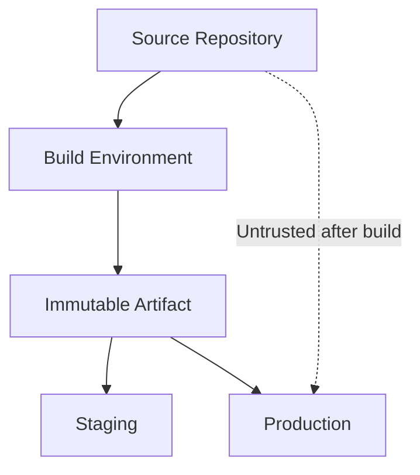
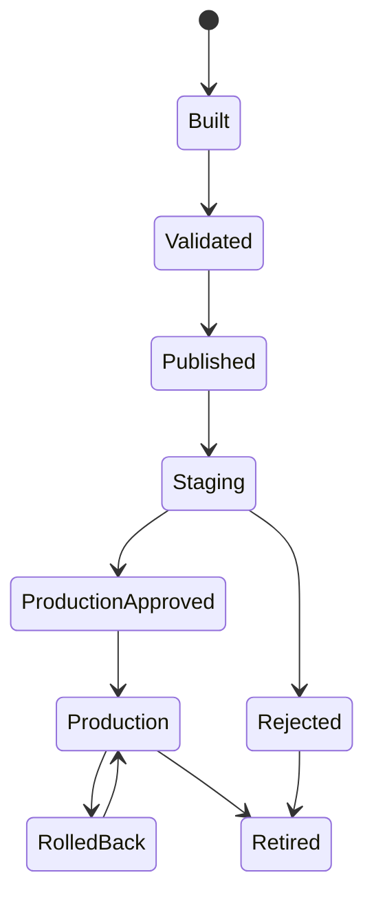
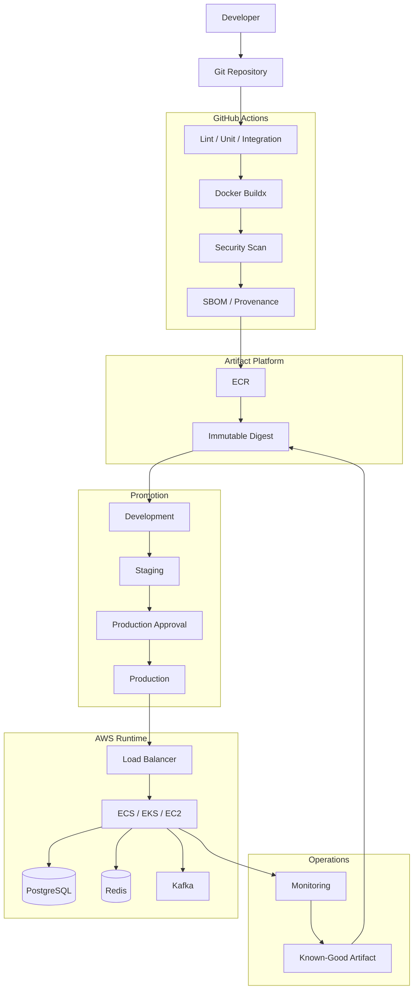

# 08- Artifact Promotion Architecture

## Overview

Artifact promotion is the CI/CD architecture pattern in which a validated artifact is built once and then promoted through environments without being rebuilt.

For production systems, the artifact should have a stable identity throughout its lifecycle:

```text
Source Commit
    ↓
CI Validation
    ↓
Build
    ↓
Immutable Artifact
    ↓
Development
    ↓
Staging
    ↓
Production Approval
    ↓
Production
```

The central principle is:

> **Build once, validate once, promote the same artifact.**

This is especially important for Docker-based Python, Django, and FastAPI systems deployed to AWS through GitHub Actions.

A production artifact may be:

- Docker image
- Python package
- Lambda deployment package
- Static application bundle
- Binary
- Infrastructure package
- Helm chart
- Terraform module or generated deployment bundle

For containerized AWS workloads, the most common implementation is:

```text
GitHub Actions
      ↓
Docker Buildx
      ↓
ECR
      ↓
Artifact Digest
      ↓
Staging
      ↓
Production
```

---

## Why Artifact Promotion Matters

A common but unsafe deployment model is:

```text
Source
 ├── Build → Staging
 └── Build → Production
```

Even when the source commit is identical, the two builds can differ because of:

- Dependency resolution.
- Base image changes.
- Build timestamps.
- External package changes.
- Build environment differences.
- Generated files.
- Compiler/runtime differences.
- Network-dependent build steps.

A promotion architecture instead creates one artifact:

```text
Source
   ↓
Build
   ↓
Artifact A
   ├── Staging
   └── Production
```

The artifact tested in staging is therefore the artifact deployed to production.

---

## Artifact Lifecycle

A production artifact has a lifecycle:

```text
Created
   ↓
Validated
   ↓
Published
   ↓
Promoted
   ↓
Deployed
   ↓
Retained
   ↓
Retired
```

Each state should have clear ownership and operational meaning.

| State | Meaning |
|---|---|
| Created | Build produced an artifact |
| Validated | Tests and security checks passed |
| Published | Artifact stored in registry/repository |
| Promoted | Artifact approved for another environment |
| Deployed | Artifact is running |
| Retained | Artifact remains available for rollback |
| Retired | Artifact is no longer part of the release lifecycle |

---

## Artifact Identity

An artifact should have a stable identity.

For Docker, the strongest identity is the digest:

```text
orders-api@sha256:abcdef123456...
```

Tags are useful for human-readable references:

```text
orders-api:1.8.0
orders-api:abc1234
```

But tags can be mutable.

The digest identifies the exact content.

---

## Tag vs Digest

| Property | Tag | Digest |
|---|---|---|
| Human-readable | Yes | Less readable |
| Mutable | Potentially | No |
| Exact artifact identity | Weak | Strong |
| Good for deployment identity | With controls | Yes |
| Good for release display | Yes | Yes |
| Rollback reference | Possible | Preferred |

A production deployment should record the digest even when tags are also used.

---

## Git Commit to Artifact Mapping

A useful release chain is:

```text
Git Commit
    ↓
GitHub Actions Run
    ↓
Build
    ↓
Image
    ↓
Digest
    ↓
ECR
    ↓
Environment Deployment
```

For example:

```text
Commit:
abc1234

Image:
orders-api:abc1234

Digest:
sha256:9c7...
```

The deployment record should preserve this relationship.

---

## Artifact Metadata

A release can maintain metadata such as:

```json
{
  "service": "orders-api",
  "version": "1.8.0",
  "commit": "abc1234",
  "image": "orders-api",
  "digest": "sha256:abcdef...",
  "workflow_run": "123456789",
  "built_at": "2026-09-30T12:00:00Z"
}
```

Useful metadata answers:

- What was deployed?
- Which commit produced it?
- Which workflow built it?
- Which artifact digest was used?
- Which environment received it?
- When was it deployed?

---

## Artifact Promotion Architecture

```mermaid
flowchart LR
    SOURCE[Git Commit]
    CI[GitHub Actions CI]
    BUILD[Build]
    SCAN[Tests / Security]
    REGISTRY[Artifact Registry]
    DEV[Development]
    STAGING[Staging]
    APPROVAL[Production Approval]
    PROD[Production]
    MONITOR[Monitoring]
    ROLLBACK[Rollback]

    SOURCE --> CI
    CI --> BUILD
    BUILD --> SCAN
    SCAN --> REGISTRY
    REGISTRY --> DEV
    DEV --> STAGING
    STAGING --> APPROVAL
    APPROVAL --> PROD
    PROD --> MONITOR
    MONITOR --> ROLLBACK
    ROLLBACK --> REGISTRY
```



The registry is the source of truth for the immutable release artifact.

---

## Build Once, Promote Many

The desired model is:

```text
                  ┌── Development
                  │
Build → Artifact ─┼── Staging
                  │
                  └── Production
```

Not:

```text
Build → Development
Build → Staging
Build → Production
```

The second approach creates unnecessary variability.

---

## Artifact Registry as the Promotion Boundary

A registry such as Amazon ECR provides a durable location for the artifact.

```text
GitHub Actions
      ↓
     ECR
      ↓
 ┌────┴────┐
 ↓         ↓
Staging  Production
```

This separates:

```text
Artifact creation
```

from:

```text
Artifact deployment
```

That separation is one of the most important architectural properties of a mature CI/CD system.

---

## ECR Architecture

For a Docker-based backend:

```text
GitHub Actions
      ↓
Docker Buildx
      ↓
Security Scan
      ↓
ECR Repository
      ↓
Image Digest
      ↓
Environment Promotion
```

Example repository:

```text
123456789012.dkr.ecr.us-east-1.amazonaws.com/orders-api
```

Artifact:

```text
orders-api@sha256:abc123...
```

---

## Artifact Promotion vs Artifact Copying

Promotion does not necessarily mean copying the artifact into another repository.

For example:

```text
ECR
 └── orders-api@sha256:abc123
```

The same digest can be deployed to multiple environments.

An alternative architecture uses separate repositories or accounts:

```text
Dev ECR
   ↓
Staging ECR
   ↓
Production ECR
```

This can strengthen account isolation but introduces artifact replication and lifecycle complexity.

---

## Single Registry Model

A single registry model can look like:

```text
ECR
 └── orders-api
      ├── sha256:A
      ├── sha256:B
      └── sha256:C

Development → Digest A
Staging     → Digest A
Production  → Digest A
```

Advantages:

- Simple artifact identity.
- No unnecessary copying.
- Easy promotion.
- Centralized retention.

Limitations:

- Stronger repository/account isolation may require additional controls.
- Registry compromise has a wider blast radius.

---

## Multi-Account Promotion

Enterprise AWS architectures may use separate accounts:

```text
Development Account
        ↓
Staging Account
        ↓
Production Account
```

Artifacts may be replicated or made accessible across accounts.

The security model becomes:

```text
GitHub
  ↓
CI Role
  ↓
Artifact Registry
  ↓
Environment-Specific Deployment Role
```

This provides stronger environment isolation.

---

## Artifact Promotion Across AWS Accounts

A common architecture is:

```text
GitHub Actions
      ↓
Build Account
      ↓
ECR
      ↓
Staging Account
      ↓
Production Account
```

The production account should not need access to GitHub source code merely to deploy an already validated artifact.

This reinforces separation between:

- Source trust.
- Build trust.
- Artifact trust.
- Deployment trust.

---

## Artifact Trust Boundary



Production should consume the approved artifact rather than rebuilding source code.

---

## Artifact Promotion with GitHub Environments

GitHub Environments can represent deployment boundaries:

```text
development
staging
production
```

A promotion workflow can use:

```text
Artifact
   ↓
Development Environment
   ↓
Staging Environment
   ↓
Production Environment
```

Production may require:

- Required reviewers.
- Branch restrictions.
- Environment-specific configuration.
- Environment-specific AWS role.

---

## Environment Configuration

The artifact should contain application code and runtime dependencies.

Environment-specific configuration should generally remain outside the artifact.

For example:

```text
Artifact
 ├── Python
 ├── Django
 ├── Application
 └── Dependencies

Environment
 ├── Database endpoint
 ├── Redis endpoint
 ├── AWS region
 └── Runtime secrets
```

This allows the same artifact to run in different environments.

---

## Configuration Anti-Pattern

Avoid building:

```text
orders-api-staging
orders-api-production
```

when the only difference is configuration.

Prefer:

```text
orders-api@sha256:abc...
```

with different runtime configuration.

---

## Secrets and Promotion

Secrets should not normally be baked into artifacts.

Avoid:

```dockerfile
ENV DATABASE_PASSWORD=...
```

or:

```text
secret.json
```

inside the image.

Prefer runtime secret injection through services such as:

- AWS Secrets Manager.
- AWS Systems Manager Parameter Store.
- ECS task configuration.
- Kubernetes Secrets or external secret integrations.

---

## AWS OIDC During Promotion

GitHub Actions can authenticate separately for each environment.

```text
GitHub
  ↓
OIDC
  ├── Staging Role
  └── Production Role
```

The production role can have permissions limited to production resources.

Example:

```yaml
permissions:
  contents: read
  id-token: write
```

Then:

```yaml
- name: Configure AWS credentials
  uses: aws-actions/configure-aws-credentials@v5
  with:
    role-to-assume: ${{ vars.AWS_PRODUCTION_ROLE }}
    aws-region: us-east-1
```

---

## Promotion Authorization

Promotion should be treated as an authorization event.

```text
Artifact Validated
       ↓
Promotion Request
       ↓
Policy Check
       ↓
Approval
       ↓
Production Deployment
```

The authorization decision should be independent from artifact creation.

---

## Approval Architecture

A production workflow may use:

```text
Build
 ↓
Security
 ↓
Staging
 ↓
Smoke Tests
 ↓
Production Environment
 ↓
Required Reviewer
 ↓
Deploy
```

The reviewer should approve the release based on evidence rather than simply approving an opaque workflow.

Useful evidence includes:

- Commit.
- Artifact digest.
- Version.
- Test results.
- Security results.
- Staging status.
- Change description.

---

## Promotion State Model

An artifact can be modeled as:



This makes promotion state explicit instead of relying only on Git tags.

---

## Artifact Immutability

An immutable artifact should not change after publication.

For example:

```text
orders-api:abc1234
```

should always resolve to the same content.

If the registry permits mutable tags, use digest-based deployment references.

A release system should never silently replace an artifact that has already been promoted.

---

## Mutable Tag Risks

Consider:

```text
orders-api:production
```

If the tag is moved:

```text
Digest A → production
Digest B → production
```

then the same deployment configuration can produce different runtime behavior.

This complicates:

- Rollback.
- Auditing.
- Incident investigation.
- Reproducibility.

---

## Release Tags vs Artifact Tags

Git tags and Docker tags serve different purposes.

| Identifier | Purpose |
|---|---|
| Git commit SHA | Source identity |
| Git release tag | Human release identity |
| Docker SHA tag | Artifact convenience |
| Docker digest | Exact artifact identity |
| Environment state | Current deployment state |

A mature system can use all of them without confusing their responsibilities.

---

## Semantic Versioning

A release may use:

```text
v1.8.0
```

with an artifact:

```text
orders-api:1.8.0
```

and digest:

```text
orders-api@sha256:abc...
```

The digest remains the immutable content identity.

Semantic versioning provides human-readable release semantics.

---

## Promotion Metadata

A deployment record might contain:

```json
{
  "artifact": "orders-api",
  "version": "1.8.0",
  "commit": "abc1234",
  "digest": "sha256:abcdef...",
  "environment": "production",
  "workflow_run": "123456789",
  "promoted_at": "2026-09-30T12:00:00Z"
}
```

This can be stored alongside release metadata or exposed through deployment tooling.

---

## Artifact Attestations

Artifact promotion should be compatible with supply-chain security.

Useful metadata includes:

- SBOM.
- Build provenance.
- Artifact attestations.
- Signatures.
- Build workflow identity.
- Source commit.

Conceptually:

```text
Source
 ↓
Trusted Build
 ↓
Artifact
 ├── SBOM
 ├── Provenance
 ├── Attestation
 └── Signature
 ↓
Promotion
```

The deployment system can then establish stronger confidence in artifact origin.

---

## SBOM and Promotion

An SBOM identifies the components contained in an artifact.

For a Python application:

```text
orders-api
 ├── Django
 ├── psycopg
 ├── requests
 ├── Celery
 └── Redis client
```

The SBOM can be generated during build and retained with the artifact.

Promotion should not discard this metadata.

---

## Vulnerability Scanning

A production pipeline can scan:

```text
Source Dependencies
        ↓
Container Image
        ↓
Artifact
```

A policy can define whether identified vulnerabilities:

- Block the build.
- Block promotion.
- Require an exception.
- Generate an alert.

The policy should be explicit rather than dependent on individual engineers.

---

## Artifact Promotion and Security Gates

A promotion pipeline can look like:

```text
Build
 ↓
Unit Tests
 ↓
Integration Tests
 ↓
Dependency Scan
 ↓
Container Scan
 ↓
SBOM
 ↓
Provenance
 ↓
Publish
 ↓
Staging
 ↓
Approval
 ↓
Production
```

Security controls should be placed before the artifact becomes eligible for production.

---

## Promotion and Docker Buildx

Buildx can provide:

- Multi-stage builds.
- Multi-platform builds.
- BuildKit caching.
- Reproducible build patterns.
- Registry-based caching.

Example:

```yaml
- name: Build and push image
  uses: docker/build-push-action@v6
  with:
    context: .
    push: true
    tags: |
      ${{ steps.meta.outputs.tags }}
    labels: ${{ steps.meta.outputs.labels }}
    platforms: linux/amd64,linux/arm64
```

The resulting image should be identified by digest.

---

## Docker Layer Cache vs Artifact

Caching and artifacts have different responsibilities.

| Mechanism | Purpose |
|---|---|
| Docker cache | Accelerate future builds |
| GitHub cache | Reuse reusable build data |
| Artifact | Preserve release output |
| ECR image | Store deployable container |
| Digest | Identify exact image |

A cache should never be treated as the authoritative production artifact.

---

## Promotion and Cache Security

Caches can become problematic when untrusted workflows can influence reusable build state.

Production deployments should rely on the published immutable artifact, not on a cache.

The architecture should assume:

```text
Cache = optimization
Artifact = release
```

---

## Artifact Promotion with Reusable Workflows

A platform team can centralize promotion logic.

Example:

```yaml
jobs:
  promote:
    uses: company/platform-workflows/.github/workflows/promote.yml@v1
    with:
      service: orders-api
      image-digest: ${{ needs.build.outputs.digest }}
      environment: production
    secrets: inherit
```

The reusable workflow can standardize:

- AWS authentication.
- Environment selection.
- Deployment concurrency.
- Validation.
- Audit metadata.

---

## Reusable Workflow Contract

A promotion workflow should have an explicit contract.

Example:

```yaml
on:
  workflow_call:
    inputs:
      service:
        required: true
        type: string
      image-digest:
        required: true
        type: string
      environment:
        required: true
        type: string
    secrets:
      aws-role:
        required: true
```

Avoid allowing arbitrary callers to control sensitive deployment behavior without validation.

---

## Artifact Promotion and Matrices

A multi-service repository may use a matrix:

```yaml
strategy:
  matrix:
    service:
      - orders
      - payments
      - users
```

Each service can produce its own artifact:

```text
orders@sha256:A
payments@sha256:B
users@sha256:C
```

Promotion must preserve the mapping between service and artifact.

---

## Structured Artifact Metadata

A planning job can generate JSON:

```json
{
  "orders": "sha256:aaa",
  "payments": "sha256:bbb",
  "users": "sha256:ccc"
}
```

A later job can consume this as structured workflow data.

This is safer than reconstructing artifact identity from mutable tags.

---

## Fan-Out and Fan-In Promotion

For multiple services:

```text
                 ┌── Orders Build ──┐
                 │                  │
Commit → Plan ───┼── Payments Build ┼──→ Promotion
                 │                  │
                 └── Users Build ───┘
```

A promotion gate can require all required services to pass before production.

---

## Artifact Promotion in Monorepos

For a monorepo:

```text
services/
 ├── orders/
 ├── payments/
 └── users/
```

A workflow can:

```text
Detect Changes
      ↓
Build Affected Services
      ↓
Produce Digests
      ↓
Test
      ↓
Promote Selected Artifacts
```

This avoids rebuilding unaffected services.

---

## Microservice Artifact Promotion

Each service should maintain independent artifact identity:

```text
orders
 └── sha256:A

payments
 └── sha256:B

users
 └── sha256:C
```

Do not use a single generic release tag as the only identity for all services.

---

## Cross-Service Compatibility

Artifact promotion does not eliminate runtime compatibility concerns.

For example:

```text
orders v2
payments v1
```

may require compatible:

- REST APIs.
- gRPC contracts.
- Kafka schemas.
- Database schemas.
- Event formats.

Promotion should therefore consider system-level compatibility.

---

## Database Migration Compatibility

A safe deployment may require:

```text
Schema V1
 ↓
Backward-Compatible Schema V2
 ↓
Application V2
 ↓
Remove V1 Compatibility
```

This allows old and new application versions to coexist during rolling or blue-green deployment.

---

## Kafka Compatibility

For Kafka-based systems, artifact promotion should account for:

- Event schema compatibility.
- Consumer compatibility.
- Producer compatibility.
- Consumer lag.
- Deployment ordering.

For example:

```text
Producer V2
      ↓
Kafka
      ↓
Consumer V1
```

must be safe if the deployment temporarily creates mixed versions.

---

## Celery Compatibility

For Celery workers:

```text
Worker V1
Worker V2
```

may coexist during rolling deployment.

Task payload compatibility should be maintained until old workers have drained.

---

## Redis Compatibility

Application releases should not assume that Redis contains only the new format.

If cached structures change:

```text
V1 Cache
 ↓
V2 Application
```

the application may need:

- Versioned cache keys.
- Backward-compatible reads.
- Graceful cache invalidation.

---

## Promotion and Concurrency

Production promotion should be serialized per service/environment when required.

```yaml
concurrency:
  group: promote-production-${{ inputs.service }}
  cancel-in-progress: false
```

This prevents two promotion workflows from changing the same production service simultaneously.

---

## Promotion Race Example

Without concurrency:

```text
Run A
Artifact A
 ↓
Production

Run B
Artifact B
 ↓
Production
```

If A finishes after B, production may unexpectedly return to artifact A.

The deployment system must control this race.

---

## Promotion Ordering

A production release might require:

```text
Build
 ↓
Test
 ↓
Publish
 ↓
Development
 ↓
Staging
 ↓
Approval
 ↓
Production
```

Do not allow production to bypass required validation unless there is an explicit and controlled emergency process.

---

## Emergency Promotion

A break-glass deployment path may exist for incidents.

It should still preserve:

- Artifact identity.
- Authentication controls.
- Auditability.
- Minimal permissions.
- Deployment metadata.
- Post-incident review.

Emergency access should not become the normal deployment mechanism.

---

## Rollback Architecture

Rollback should promote a previously validated artifact.

```text
Production
    ↓
Failure
    ↓
Known-Good Artifact
    ↓
Promotion
    ↓
Production
```

For example:

```text
Current:
orders-api@sha256:B

Rollback:
orders-api@sha256:A
```

No rebuild is necessary.

---

## Rollback Safety

Rollback depends on compatibility.

A rollback may be unsafe if:

- Database schema is incompatible.
- Kafka event formats changed.
- Redis data format changed.
- External APIs changed.
- Secrets/configuration changed incompatibly.

Therefore rollback design must include dependencies, not only application images.

---

## Artifact Retention

Retain enough historical artifacts for:

- Rollback.
- Incident investigation.
- Compliance requirements.
- Release comparison.

Retention should balance availability against storage cost.

A useful policy is:

```text
Recent releases → Long retention
Older releases  → Shorter retention
Critical releases → Explicit retention
```

---

## Artifact Cleanup

Do not delete an artifact that is still referenced by production.

A cleanup process should understand:

```text
Currently Deployed
Recently Deployed
Rollback Candidate
Unreferenced
Expired
```

Blind registry cleanup can destroy rollback capability.

---

## Artifact Promotion and Disaster Recovery

A DR strategy should preserve access to deployable artifacts.

If production fails completely, recovery may require:

```text
Infrastructure
+
Artifact
+
Configuration
+
Secrets
+
Database Recovery
```

An artifact registry is therefore part of the recovery chain.

---

## High Availability

Artifact promotion itself should not become a production single point of failure.

For critical systems consider:

- Durable artifact storage.
- Multi-account architecture.
- Registry availability.
- Infrastructure-as-code.
- Reproducible deployment workflows.
- Documented emergency procedures.

---

## Promotion and Infrastructure as Code

Infrastructure and application artifacts have different lifecycles.

```text
Infrastructure
 ├── VPC
 ├── ECS
 ├── ALB
 └── IAM

Application
 └── Docker Image
```

A normal application release should not require rebuilding the infrastructure.

Terraform or CloudFormation can establish the deployment platform independently.

---

## Promotion Workflow Example

```yaml
name: Promote Artifact

on:
  workflow_dispatch:
    inputs:
      environment:
        required: true
        type: choice
        options:
          - staging
          - production
      image-digest:
        required: true
        type: string

permissions:
  contents: read
  id-token: write

jobs:
  promote:
    runs-on: ubuntu-latest

    environment:
      name: ${{ inputs.environment }}

    concurrency:
      group: deployment-${{ inputs.environment }}
      cancel-in-progress: false

    steps:
      - name: Configure AWS credentials
        uses: aws-actions/configure-aws-credentials@v5
        with:
          role-to-assume: ${{ vars.AWS_DEPLOY_ROLE }}
          aws-region: us-east-1

      - name: Validate artifact
        run: |
          test -n "${{ inputs.image-digest }}"
          echo "Promoting ${{ inputs.image-digest }}"

      - name: Deploy
        run: |
          echo "Deploying immutable artifact"
          # Update the target runtime with the supplied digest.

      - name: Record deployment
        run: |
          {
            echo "## Artifact Promotion"
            echo ""
            echo "- Environment: ${{ inputs.environment }}"
            echo "- Image digest: ${{ inputs.image-digest }}"
          } >> "$GITHUB_STEP_SUMMARY"
```

The important property is that the workflow accepts an existing artifact identity rather than rebuilding the application.

---

## Promotion Verification

Before production deployment, verify:

```text
Artifact Exists
+
Digest Matches Expected Value
+
Security Requirements Passed
+
Staging Validation Passed
+
Environment Authorization Passed
```

For example:

```bash
aws ecr describe-images \
  --repository-name orders-api \
  --image-ids imageDigest=sha256:abc123 \
  --region us-east-1
```

---

## Artifact Provenance Verification

A mature platform can verify:

```text
Artifact
 ↓
Source Repository
 ↓
Commit
 ↓
Workflow
 ↓
Build Identity
 ↓
Attestation
```

This reduces the risk of deploying an artifact whose origin cannot be established.

---

## Production Monitoring After Promotion

Promotion should not end when the deployment command succeeds.

Monitor:

```text
Deployment
 ↓
Task Health
 ↓
Application Health
 ↓
Error Rate
 ↓
Latency
 ↓
Resource Utilization
 ↓
Business Metrics
```

If validation fails, rollback should be immediately available.

---

## Deployment Health Gates

A production gate may evaluate:

```text
HTTP 5xx
Latency
CPU
Memory
Task Count
Target Health
Application Health
```

For higher-risk systems, business-level indicators can also be included.

---

## Artifact Promotion Failure Domains

```text
Build
 ↓
Artifact
 ↓
Registry
 ↓
Authorization
 ↓
Environment
 ↓
Runtime
 ↓
Application
 ↓
Dependency
```

Examples:

| Failure Domain | Example |
|---|---|
| Build | Docker build failure |
| Artifact | Incorrect digest |
| Registry | ECR push failure |
| Authorization | IAM AccessDenied |
| Environment | Approval blocked |
| Runtime | ECS task crash |
| Application | Django startup failure |
| Dependency | Database unavailable |

Troubleshooting should isolate the domain before changing configuration.

---

## Troubleshooting: Wrong Artifact Deployed

### Symptom

Production appears to be running an unexpected version.

### Possible Causes

- Mutable tag.
- Incorrect digest.
- Incorrect task definition.
- Concurrent deployment.
- Old task still serving traffic.

### Isolation

Inspect the deployed runtime:

```bash
aws ecs describe-services \
  --cluster production \
  --services orders-api
```

Inspect the task definition and running task image.

### Corrective Action

Deploy using the exact expected digest.

### Prevention

Use immutable artifact identity and deployment concurrency.

---

## Troubleshooting: Artifact Missing

### Symptom

Deployment cannot find the image.

### Possible Causes

- Artifact retention.
- Wrong repository.
- Wrong account.
- Wrong region.
- Incorrect digest.
- Cross-account permissions.

### Checks

```bash
aws sts get-caller-identity

aws ecr describe-images \
  --repository-name orders-api \
  --image-ids imageDigest=sha256:abc123 \
  --region us-east-1
```

---

## Troubleshooting: Staging and Production Differ

### Symptom

Staging works but production behaves differently.

### Possible Causes

- Different configuration.
- Different secrets.
- Different runtime capacity.
- Different dependencies.
- Different infrastructure.
- Different artifact.

### First Check

Verify the artifact digest.

```text
Staging Digest
      =
Production Digest
```

If not, the promotion model is already broken.

---

## Troubleshooting: Production Rollback Fails

### Possible Causes

- Previous artifact deleted.
- Database schema incompatible.
- Configuration changed.
- Runtime dependency changed.
- Old image unavailable.
- Deployment concurrency blocked rollback.

Rollback must be treated as a first-class production workflow.

---

## GitHub CLI Operations

List workflows:

```bash
gh workflow list
```

Inspect runs:

```bash
gh run list
```

Inspect a run:

```bash
gh run view <run-id>
```

View logs:

```bash
gh run view <run-id> --log
```

Rerun:

```bash
gh run rerun <run-id>
```

Run a promotion workflow:

```bash
gh workflow run promote.yml \
  -f environment=staging \
  -f image-digest=sha256:abc123
```

---

## GitHub CLI and Release Inspection

List releases:

```bash
gh release list
```

Inspect a release:

```bash
gh release view v1.8.0
```

This is useful when release tags are part of the artifact promotion process.

---

## Artifact Promotion Governance

Enterprise governance should define:

- Approved artifact registries.
- Artifact retention.
- Required security checks.
- Promotion rules.
- Environment ownership.
- Required reviewers.
- Rollback requirements.
- Artifact provenance requirements.
- Action allowlists.
- Deployment identity standards.

---

## Platform Team Responsibilities

A central platform team can provide:

```text
Reusable CI
Reusable Promotion
AWS OIDC Standards
ECR Standards
Security Gates
Deployment Templates
Monitoring Standards
Rollback Mechanisms
```

Application teams should retain ownership of:

```text
Application Code
Tests
Dockerfile
Service Configuration
Runtime Health Checks
Service-Specific Deployment Parameters
```

---

## Promotion Architecture for Python Backend Services

A practical Django/FastAPI architecture is:

```text
GitHub
  ↓
Lint
  ↓
pytest
  ↓
Integration Tests
  ↓
Security Scan
  ↓
Docker Buildx
  ↓
ECR
  ↓
Digest
  ↓
Staging ECS
  ↓
Smoke Tests
  ↓
Production Approval
  ↓
Production ECS
```

Supporting services may include:

```text
PostgreSQL
Redis
Celery
Kafka
```

The application image remains unchanged between environments.

---

## Production Artifact Checklist

### Artifact Creation

- [ ] Build happens once.
- [ ] Artifact has a unique identity.
- [ ] Artifact is immutable.
- [ ] Artifact metadata is recorded.
- [ ] Security validation completes before promotion.

### Registry

- [ ] Artifact is stored in an approved registry.
- [ ] Digest is recorded.
- [ ] Retention policy exists.
- [ ] Cleanup does not remove rollback candidates.
- [ ] Cross-account access is controlled.

### Promotion

- [ ] Staging uses the published artifact.
- [ ] Production uses the same artifact.
- [ ] Environment configuration remains external.
- [ ] Production approval is protected.
- [ ] Deployment concurrency is controlled.

### Security

- [ ] AWS authentication uses OIDC.
- [ ] IAM roles are environment-specific.
- [ ] Artifact provenance is available where required.
- [ ] Secrets are not embedded in artifacts.
- [ ] Deployment permissions are least-privileged.

### Reliability

- [ ] Health checks exist.
- [ ] Monitoring is available.
- [ ] Rollback artifacts are retained.
- [ ] Database compatibility is considered.
- [ ] Recovery procedures are tested.

---

## Common Mistakes

### Rebuilding for Each Environment

Creates artifact drift.

### Using `latest`

Makes artifact identity ambiguous.

### Promoting Tags Instead of Digests

A mutable tag can point to different content.

### Baking Secrets Into Images

Creates a long-lived secret exposure.

### Deleting Old Images Aggressively

Can remove rollback candidates.

### Treating Staging as Proof of Production Success

Production configuration, capacity, and dependencies may differ.

### Ignoring Concurrent Promotions

Can cause older releases to overwrite newer releases.

### Coupling Infrastructure and Application Releases

Creates unnecessary deployment scope and increases risk.

### Assuming Rollback Means Reverting Git

A production rollback should usually deploy a known-good artifact rather than rebuild source code.

---

## Senior-Level Design Principles

### Artifact Identity Is More Important Than Artifact Naming

Names and tags help humans.

Digests provide exact identity.

### Promotion Is an Authorization Boundary

Moving an artifact from staging to production is a controlled release decision.

### Build Systems Should Be Separate From Runtime Systems

CI produces the artifact.

AWS runs the artifact.

### Configuration Should Vary, Artifacts Should Not

Environment-specific values belong outside the immutable artifact whenever practical.

### Rollback Must Be Designed Before Deployment

If a release cannot be safely rolled back, the deployment architecture should explicitly document why.

### Promotion Must Be Observable

Operators need to know:

```text
What
When
Where
Why
Who
Which artifact
```

### Security Should Follow the Artifact

The system should preserve:

```text
Source
 ↓
Build
 ↓
Artifact
 ↓
Provenance
 ↓
Promotion
 ↓
Runtime
```

---

## Interview Scenarios

### A Docker Image Was Built in CI and Needs to Reach Production Without Rebuilding

Explain:

```text
Build
 ↓
Push to ECR
 ↓
Capture Digest
 ↓
Deploy to Staging
 ↓
Validate
 ↓
Promote Same Digest
 ↓
Production
```

### How Do You Guarantee Staging and Production Use the Same Artifact?

Use immutable artifact identity, preferably a digest, and pass that identity explicitly between workflow stages.

### Why Not Rebuild for Production?

Because the resulting artifact may differ due to dependencies, base images, build environment, generated files, or external state.

### How Do You Roll Back?

Redeploy a previously validated artifact digest.

### How Do You Prevent Two Production Releases From Racing?

Use deployment concurrency keyed by service and environment.

### How Do You Protect AWS Credentials?

Use GitHub OIDC with environment-specific IAM roles and short-lived STS credentials.

### How Do You Handle Multiple AWS Accounts?

Separate environment accounts and use environment-specific deployment roles while preserving artifact identity across accounts.

### How Do You Prove Which Source Produced a Production Artifact?

Maintain the relationship:

```text
Artifact Digest
 ↓
Build Run
 ↓
Commit SHA
 ↓
Repository
```

Add provenance and attestations where required.

### What Happens if the Previous Artifact Was Deleted?

Rollback may become impossible through the normal path. Artifact retention must therefore be designed around the required rollback window.

### How Do You Handle Database Changes?

Use backward-compatible migrations, such as expand-contract, so multiple application versions can coexist during promotion and rollback.

---

## Reference Production Architecture



The resulting architecture has a clear separation:

```text
Source Control
      ↓
CI Validation
      ↓
Artifact Creation
      ↓
Artifact Registry
      ↓
Artifact Promotion
      ↓
AWS Runtime
      ↓
Monitoring
      ↓
Rollback
```

## Key Takeaways

- **Build once and promote the same immutable artifact** across environments; do not rebuild separately for staging and production.
- **Use immutable artifact identity, preferably a Docker digest**, and preserve the relationship between the artifact, Git commit, workflow run, and deployment.
- **Treat promotion as an authorization boundary** with protected environments, environment-specific AWS OIDC roles, approvals, and deployment concurrency.
- **Keep application artifacts immutable and environment configuration external**, while retaining sufficient artifact history for rollback and disaster recovery.
- **Design promotion together with security, observability, compatibility, and rollback**, because a production release is a system lifecycle rather than merely a deployment command.