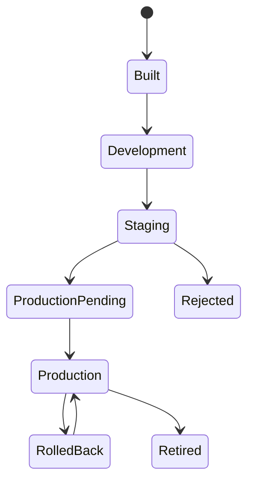
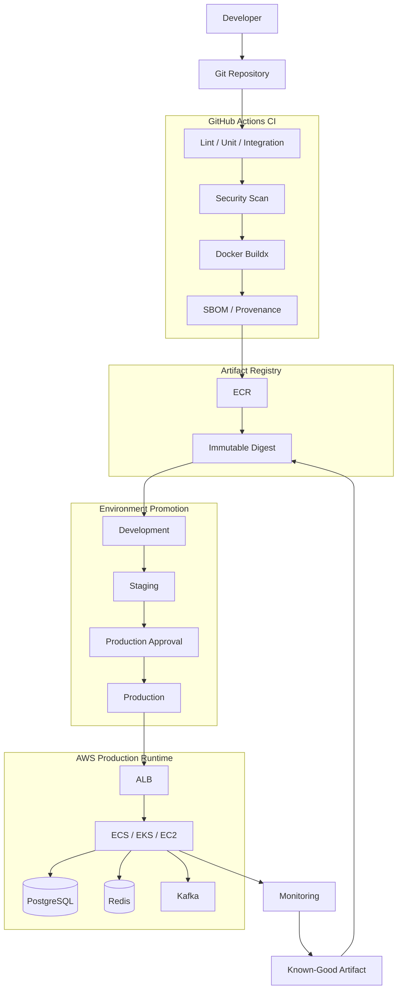

# 09- Environment Promotion Architecture

## Overview

Environment promotion is the controlled movement of a validated software release through environments such as development, staging, and production.

A mature CI/CD system separates **artifact creation** from **artifact promotion**:

```text
Source
  ↓
CI Validation
  ↓
Build
  ↓
Immutable Artifact
  ↓
Development
  ↓
Staging
  ↓
Production Approval
  ↓
Production
  ↓
Monitoring
  ↓
Rollback
```

The core principle is:

> **Build once, validate the artifact, and promote the same artifact across environments.**

Environment promotion is broader than deploying an application. It also involves:

- Configuration.
- Secrets.
- IAM roles.
- Network boundaries.
- Database compatibility.
- Deployment strategy.
- Approvals.
- Concurrency.
- Health validation.
- Rollback.
- Observability.
- Governance.

For a Python/Django/FastAPI service deployed with Docker and AWS, environment promotion should provide a predictable path from a pull request to production without rebuilding the application for every environment.

---

## Environment Promotion vs Artifact Promotion

These concepts are related but different.

**Artifact promotion** answers:

> Which exact software artifact is moving?

**Environment promotion** answers:

> Which environment is allowed to receive that artifact, under which controls?

```text
Artifact
   │
   ├── Development
   │
   ├── Staging
   │
   └── Production
```

The artifact should remain immutable while the environment supplies its runtime configuration.

---

## Environment Model

A common environment model is:

| Environment | Purpose | Typical Controls |
|---|---|---|
| Development | Rapid integration | Minimal approval |
| Test/QA | Functional validation | Automated validation |
| Staging | Production-like validation | Stronger controls |
| Production | Customer traffic | Approval + protection |

Not every organization needs all of these.

The important requirement is that each environment has a clearly defined purpose.

---

## Environment Responsibilities

### Development

Development environments optimize for feedback speed.

Typical characteristics:

- Frequent deployments.
- Automated deployment.
- Lower infrastructure cost.
- Relaxed approval requirements.
- Representative but non-production data.

### Staging

Staging validates the release in an environment close to production.

Typical checks include:

- Integration tests.
- Smoke tests.
- Database migrations.
- API validation.
- Infrastructure compatibility.
- Container startup.
- Health checks.

### Production

Production prioritizes:

- Reliability.
- Security.
- Availability.
- Controlled changes.
- Observability.
- Rollback.
- Auditability.

---

## Environment Promotion Architecture

```mermaid
flowchart LR
    SOURCE[Git Commit]
    CI[CI Validation]
    BUILD[Build]
    ARTIFACT[Immutable Artifact]

    DEV[Development]
    STAGING[Staging]
    APPROVAL[Production Approval]
    PROD[Production]

    HEALTH1[Validation]
    HEALTH2[Smoke Tests]
    MONITOR[Monitoring]
    ROLLBACK[Rollback]

    SOURCE --> CI
    CI --> BUILD
    BUILD --> ARTIFACT
    ARTIFACT --> DEV
    DEV --> HEALTH1
    HEALTH1 --> STAGING
    STAGING --> HEALTH2
    HEALTH2 --> APPROVAL
    APPROVAL --> PROD
    PROD --> MONITOR
    MONITOR --> ROLLBACK
    ROLLBACK --> ARTIFACT
```



---

## Build Once, Promote Many

The preferred model is:

```text
Build
  ↓
Artifact A
  ├── Development
  ├── Staging
  └── Production
```

Avoid:

```text
Build → Development
Build → Staging
Build → Production
```

Rebuilding can produce different results because of:

- Dependency changes.
- Base image changes.
- Build environment differences.
- Generated files.
- External package availability.
- Build-time configuration.
- Compiler/runtime differences.

---

## Immutable Artifact Identity

Docker images should preferably be promoted using immutable digests.

Example:

```text
orders-api@sha256:abc123...
```

Human-readable tags can still be used:

```text
orders-api:1.8.0
orders-api:abc1234
```

But the digest provides the strongest artifact identity.

```text
Git Commit
    ↓
Docker Image
    ↓
Image Digest
    ↓
Development
    ↓
Staging
    ↓
Production
```

---

## Environment Configuration

The artifact should contain the application and its dependencies.

Environment-specific configuration should normally remain external.

```text
Artifact
 ├── Python
 ├── Django/FastAPI
 ├── Application Code
 └── Dependencies

Environment
 ├── Database Endpoint
 ├── Redis Endpoint
 ├── AWS Region
 ├── Feature Configuration
 └── Secrets
```

This allows one artifact to operate in multiple environments.

---

## Configuration Categories

| Configuration | Typical Location |
|---|---|
| Application code | Artifact |
| Python dependencies | Artifact |
| Database endpoint | Environment configuration |
| Redis endpoint | Environment configuration |
| AWS role | Environment |
| API credentials | Secret store |
| Feature flags | Runtime configuration |
| Debug setting | Environment |
| Logging level | Environment |

Do not rebuild the image merely because the database hostname changes.

---

## GitHub Environments

GitHub Actions environments provide a useful deployment boundary.

Example:

```yaml
environment:
  name: production
```

An environment can be associated with:

- Environment secrets.
- Environment variables.
- Required reviewers.
- Deployment protection rules.
- Branch/tag restrictions.
- Deployment history.

A typical workflow may use:

```text
development
staging
production
```

---

## Environment Protection

Production should normally have stronger controls than development.

```text
Development
    ↓
Automatic

Staging
    ↓
Automated validation

Production
    ↓
Required approval
    ↓
Deployment
```

Protection should be based on release risk rather than ceremony.

---

## Environment-Specific Secrets

Secrets should be scoped to the environment that requires them.

For example:

```text
staging:
  DATABASE_PASSWORD
  AWS_ROLE
  API_KEY

production:
  DATABASE_PASSWORD
  AWS_ROLE
  API_KEY
```

The production workflow should not expose production credentials to ordinary CI jobs.

---

## AWS OIDC and Environment Promotion

Long-lived AWS credentials should not be stored as GitHub secrets when OIDC can be used.

The architecture can be:

```text
GitHub Actions
      ↓
OIDC Token
      ↓
AWS STS
      ↓
Environment-Specific IAM Role
      ↓
AWS Resources
```

For example:

```text
GitHub
 ├── Staging Role
 │     └── Staging AWS Account
 │
 └── Production Role
       └── Production AWS Account
```

This provides environment-specific authorization.

---

## Least-Privilege Environment Roles

Avoid one deployment role with unrestricted access to every environment.

Prefer:

```text
CI
 ├── AssumeRole → StagingDeploymentRole
 │
 └── AssumeRole → ProductionDeploymentRole
```

The production role should have only the permissions required to perform production deployment.

---

## Environment Account Separation

Enterprise systems may isolate environments into AWS accounts:

```text
AWS Organization
│
├── Development Account
├── Staging Account
└── Production Account
```

This reduces the blast radius of accidental or malicious changes.

A compromised development workflow should not automatically gain production permissions.

---

## Account and Environment Mapping

A clear mapping avoids ambiguity:

| Environment | AWS Account | IAM Role |
|---|---|---|
| Development | Development | DevDeploymentRole |
| Staging | Staging | StagingDeploymentRole |
| Production | Production | ProductionDeploymentRole |

The exact account structure depends on organizational requirements.

---

## Environment Promotion State

A release can be represented as:



The important property is that promotion is explicit.

---

## Promotion Gates

A promotion gate determines whether the artifact can move forward.

Examples:

```text
Unit Tests
      ↓
Integration Tests
      ↓
Security Scan
      ↓
Build
      ↓
Staging
      ↓
Smoke Tests
      ↓
Approval
      ↓
Production
```

Gates can be:

- Automated.
- Manual.
- Policy-based.
- Health-based.
- Security-based.

---

## Automated Promotion

Development can often be automatically promoted:

```text
Merge
 ↓
CI
 ↓
Build
 ↓
Development
```

This optimizes developer feedback.

---

## Controlled Production Promotion

Production usually requires stronger controls:

```text
Staging
 ↓
Validation
 ↓
Production Environment
 ↓
Required Reviewer
 ↓
Deployment
```

The approval should happen after the release candidate has been validated.

---

## Approval Evidence

A production approval should expose useful release information:

- Git commit.
- Release version.
- Artifact digest.
- Test status.
- Security scan status.
- Staging deployment status.
- Change description.

GitHub Actions step summaries can expose this information:

```yaml
- name: Release summary
  run: |
    {
      echo "## Release"
      echo ""
      echo "- Version: $VERSION"
      echo "- Commit: $GITHUB_SHA"
      echo "- Artifact: $IMAGE_DIGEST"
      echo "- Environment: production"
    } >> "$GITHUB_STEP_SUMMARY"
```

---

## Promotion and Deployment Concurrency

Two production deployments should not normally modify the same service simultaneously.

Example:

```yaml
concurrency:
  group: production-orders-api
  cancel-in-progress: false
```

This prevents deployment races.

---

## Why Concurrency Matters

Without concurrency:

```text
Deployment A → Production
Deployment B → Production
Deployment A finishes later
```

The resulting production state may not match the intended release order.

With controlled concurrency:

```text
Deployment A
    ↓
Deployment B waits
    ↓
Deployment A completes
    ↓
Deployment B executes
```

---

## Cancellation Policy

Production and pull requests often need different policies.

| Workflow | Typical Policy |
|---|---|
| PR validation | Cancel obsolete runs |
| Development deployment | Often cancel obsolete runs |
| Staging | Depends on release model |
| Production | Usually do not cancel an active deployment |

An interrupted production deployment can leave infrastructure in an uncertain state.

---

## Environment Promotion and Rollback

Rollback should deploy a known-good artifact.

```text
Production
    ↓
Problem
    ↓
Known-Good Digest
    ↓
Production Deployment
```

Example:

```text
Current:
orders-api@sha256:B

Rollback:
orders-api@sha256:A
```

The old artifact should not need to be rebuilt.

---

## Rollback Dependencies

Application rollback is not always sufficient.

Consider:

```text
Application V2
     ↓
Database Schema V2
```

Rolling back only the application may fail if:

```text
Application V1
     ↓
Database Schema V2
```

is incompatible.

Use backward-compatible database migration patterns such as expand-contract.

---

## Expand-Contract Migration

A safer lifecycle is:

```text
Old Application
      ↓
Add Compatible Schema
      ↓
Deploy New Application
      ↓
Migrate Data
      ↓
Remove Old Schema
```

This supports rolling deployments and reduces rollback risk.

---

## Django Promotion Considerations

For Django applications:

```text
Docker Image
    ↓
ECS / Kubernetes / EC2
    ↓
Django Application
    ↓
PostgreSQL
    ↓
Redis
```

Promotion should consider:

- Django migrations.
- Static files.
- Application configuration.
- Secret management.
- Celery workers.
- Cache compatibility.
- Database compatibility.

---

## FastAPI Promotion Considerations

For FastAPI:

```text
Docker Image
    ↓
Load Balancer
    ↓
FastAPI
    ↓
PostgreSQL / Redis
```

Production validation should include:

- Health endpoint.
- Readiness checks.
- API smoke tests.
- Dependency connectivity.
- Startup behavior.
- Graceful shutdown.

---

## Celery During Promotion

If Django/FastAPI services use Celery, application and worker versions may temporarily coexist.

```text
Worker V1
Worker V2
     ↓
Redis / Broker
     ↓
Tasks
```

Task payloads should remain compatible during the transition.

Avoid deploying a worker that cannot process tasks generated by the currently running application.

---

## Kafka During Promotion

Kafka-based systems need event compatibility.

```text
Producer V2
     ↓
Kafka
     ↓
Consumer V1
```

Event schemas should support the coexistence of versions during deployment.

Promotion therefore needs to consider service contracts, not only container images.

---

## Redis During Promotion

Changing cache structures can break older application instances.

Safer patterns include:

```text
cache:v1:user:123
cache:v2:user:123
```

or backward-compatible serialization.

Avoid assuming that all instances switch versions simultaneously.

---

## Environment Parity

Staging should resemble production sufficiently to catch meaningful failures.

Important parity dimensions include:

- Runtime version.
- Container image.
- Database engine/version.
- Redis version.
- Networking.
- TLS.
- Authentication.
- IAM.
- Deployment platform.
- Health checks.

Perfect parity is often too expensive, but critical production behavior should be represented.

---

## Environment Drift

Environment drift occurs when environments evolve differently.

Example:

```text
Staging
 └── PostgreSQL 16

Production
 └── PostgreSQL 15
```

The application may pass staging but fail in production.

Infrastructure as Code can reduce this drift.

---

## Infrastructure as Code

Terraform or CloudFormation can define environment infrastructure.

```text
Terraform
 ├── Development
 ├── Staging
 └── Production
```

Environment-specific values can be supplied through controlled variables.

The infrastructure deployment lifecycle should remain distinguishable from application artifact promotion.

---

## Ephemeral Environments

Pull requests may use temporary environments:

```text
PR #123
   ↓
Ephemeral Environment
   ↓
Integration Tests
   ↓
Destroy
```

This is useful for:

- End-to-end testing.
- Feature validation.
- API review.
- Integration testing.

The trade-off is increased infrastructure cost and lifecycle complexity.

---

## Cost Considerations

Environment promotion can become expensive when every PR creates persistent infrastructure.

Control cost through:

- Ephemeral environments with automatic cleanup.
- Smaller non-production instances.
- Scheduled shutdown.
- Shared development infrastructure where appropriate.
- Appropriate artifact retention.
- Efficient Docker caching.
- Limited test matrix size.

Do not optimize away environments that provide important production safety.

---

## Zero-Downtime Promotion

Production promotion should account for active traffic.

Common deployment strategies include:

- Rolling.
- Blue-green.
- Canary.
- Zero-downtime deployment.

The choice depends on:

- Risk.
- Traffic volume.
- Infrastructure.
- Rollback requirements.
- Capacity.
- Application architecture.

---

## Rolling Deployment

```text
V1 V1 V1 V1
 ↓
V2 V1 V1 V1
 ↓
V2 V2 V1 V1
 ↓
V2 V2 V2 V1
 ↓
V2 V2 V2 V2
```

Advantages:

- Lower additional infrastructure cost.
- Native support in many platforms.

Risks:

- Multiple versions coexist.
- Backward compatibility is required.
- Rollback can be more complicated.

---

## Blue-Green Promotion

```text
             Load Balancer
                   |
          ┌────────┴────────┐
          ↓                 ↓
       Blue V1           Green V2
       Active            Standby
```

After validation:

```text
Traffic → Green
```

Rollback:

```text
Traffic → Blue
```

This can simplify rollback but requires additional capacity.

---

## Canary Promotion

```text
Traffic
  ↓
 ┌──────────────┐
 │              │
95% V1         5% V2
```

Monitor V2 before increasing traffic.

Canary promotion is useful when production behavior needs validation with real traffic.

---

## Health Validation

A deployment is not complete simply because the deployment command succeeded.

Validate:

```text
Infrastructure
    ↓
Container
    ↓
Application
    ↓
Dependencies
    ↓
Traffic
```

Useful checks include:

- HTTP health endpoint.
- Load balancer target health.
- Container readiness.
- Error rate.
- Latency.
- CPU/memory.
- Database connectivity.
- Redis connectivity.

---

## Smoke Tests

Example:

```bash
curl --fail \
  --silent \
  --show-error \
  https://api.example.com/health
```

API smoke tests can validate important endpoints after promotion.

---

## Environment Promotion with ECS

A common architecture is:

```text
GitHub Actions
      ↓
ECR
      ↓
Image Digest
      ↓
ECS Task Definition
      ↓
ECS Service
      ↓
ALB
      ↓
Django / FastAPI
```

The task definition should reference the intended image identity.

---

## Environment Promotion with EC2

For EC2-based deployments:

```text
GitHub Actions
      ↓
Artifact
      ↓
S3 / ECR
      ↓
EC2
      ↓
Release Directory
      ↓
Atomic Activation
```

A release directory pattern can support rollback:

```text
/opt/orders/releases/
 ├── 20260930-120000/
 ├── 20260929-180000/
 └── 20260928-140000/

current → /opt/orders/releases/20260930-120000/
```

Rollback changes the active release rather than rebuilding it.

---

## Environment Promotion with Lambda

Lambda deployments can use immutable deployment artifacts and controlled aliases:

```text
Artifact
   ↓
Lambda Version
   ↓
Staging
   ↓
Production Alias
```

Traffic shifting can be used where appropriate.

---

## Environment Promotion with Kubernetes

A typical flow is:

```text
ECR
 ↓
Deployment Manifest
 ↓
Kubernetes Deployment
 ↓
Pods
 ↓
Service
 ↓
Ingress
```

The image digest should remain consistent across environments.

---

## Promotion and Nginx

For Nginx-based architectures:

```text
Client
  ↓
Nginx
  ↓
Application
  ↓
PostgreSQL / Redis
```

Promotion should validate:

- Routing.
- Upstream health.
- TLS.
- Connection behavior.
- Application readiness.

---

## Promotion and gRPC

For gRPC services, promotion must consider:

- Protocol compatibility.
- Protobuf schema compatibility.
- Client/server version coexistence.
- Long-lived connections.

A deployment that replaces servers while clients maintain persistent connections needs graceful connection handling.

---

## Environment Ownership

Each environment should have clear ownership.

| Area | Typical Owner |
|---|---|
| Application | Application team |
| CI platform | Platform team |
| Deployment workflow | Platform/application shared |
| Production approval | Service/operations ownership |
| AWS account | Cloud/platform team |
| Secrets | Security/platform + service owner |
| Infrastructure | Platform/cloud team |
| Monitoring | Service + platform/operations |

Ambiguous ownership creates operational gaps.

---

## Environment Governance

Enterprise governance may define:

- Approved environments.
- Required production approvals.
- Deployment windows.
- IAM role standards.
- Runner restrictions.
- Action allowlists.
- Artifact requirements.
- Security gates.
- Retention policies.
- Rollback requirements.

Governance should standardize safety controls without unnecessarily centralizing application logic.

---

## Environment Promotion Security

Important controls include:

### Least Privilege

Deployment jobs should receive only the permissions they need.

### Environment Secrets

Production secrets should not be available to PR validation jobs.

### OIDC

Use short-lived AWS credentials.

### Untrusted Code

Do not execute untrusted PR code on privileged production runners.

### Third-Party Actions

Pin and govern third-party actions.

### Artifact Integrity

Promote verified artifacts rather than rebuilding arbitrary source.

---

## `pull_request` and Production Security

A normal PR workflow should not receive production credentials simply because it can access the repository.

Keep:

```text
PR Validation
```

separate from:

```text
Production Deployment
```

A production deployment should occur only through a controlled trust boundary.

---

## Self-Hosted Runners

A self-hosted runner may be required for:

- Private databases.
- Private APIs.
- Internal networks.
- Custom software.
- Private registries.

Architecture:

```text
GitHub Actions
      ↓
Runner Group
      ↓
Private Network
      ↓
AWS Resources
```

Privileged deployment runners should be isolated from untrusted workloads.

---

## Ephemeral Production Runners

For high-security environments, deployment jobs can use ephemeral runners.

```text
Provision
   ↓
Register
   ↓
Run Deployment
   ↓
Collect Logs
   ↓
Destroy
```

This reduces persistent-state risk.

---

## Environment Promotion Observability

Record:

```text
Commit
Artifact
Digest
Environment
Workflow Run
Deployment Time
Actor
Approval
Result
```

These records make production incidents easier to investigate.

---

## Deployment Step Summary

A useful GitHub Actions summary:

```yaml
- name: Deployment summary
  run: |
    {
      echo "## Deployment"
      echo ""
      echo "| Field | Value |"
      echo "|---|---|"
      echo "| Environment | production |"
      echo "| Commit | $GITHUB_SHA |"
      echo "| Artifact | $IMAGE_DIGEST |"
      echo "| Workflow | $GITHUB_RUN_ID |"
    } >> "$GITHUB_STEP_SUMMARY"
```

---

## Promotion Failure Domains

```text
Source
  ↓
CI
  ↓
Artifact
  ↓
Registry
  ↓
Authorization
  ↓
Environment
  ↓
Deployment
  ↓
Runtime
  ↓
Application
  ↓
Dependencies
```

Troubleshooting should identify the first failed boundary rather than changing multiple components simultaneously.

---

## Troubleshooting: Wrong Environment

### Symptom

A deployment appears to target the wrong environment.

### Possible Causes

- Incorrect workflow input.
- Incorrect environment variable.
- Reusable workflow input mismatch.
- Wrong IAM role.
- Incorrect AWS account.

### Checks

```bash
aws sts get-caller-identity
```

Verify:

```text
Environment
→ AWS Account
→ IAM Role
→ Target Resource
```

### Prevention

Use explicit environment names and environment-specific roles.

---

## Troubleshooting: Production Uses the Wrong Image

### Possible Causes

- Mutable tag.
- Incorrect task definition.
- Wrong digest.
- Concurrent deployment.
- Stale task.

### Checks

Inspect the runtime deployment and compare the running digest with the expected digest.

### Prevention

Use immutable digests and deployment concurrency.

---

## Troubleshooting: Staging Passes but Production Fails

### Possible Causes

- Configuration drift.
- Different database version.
- Different IAM permissions.
- Different network.
- Different secrets.
- Different capacity.
- Different dependency versions.

### Isolation Strategy

Compare:

```text
Artifact
Configuration
Infrastructure
Identity
Network
Dependencies
Capacity
```

Do not assume that staging failure implies an application-code defect.

---

## Troubleshooting: Approval Never Completes

### Possible Causes

- Required reviewer unavailable.
- Branch restriction mismatch.
- Environment protection configuration.
- Deployment waiting on another run.

### Checks

Inspect:

- Environment configuration.
- Pending deployments.
- Workflow run status.
- Concurrency group.

---

## Troubleshooting: Deployment Race

### Symptom

Production changes unexpectedly between releases.

### Possible Causes

- Missing concurrency.
- Multiple workflows deploy the same service.
- Manual and automated workflows overlap.
- Rollback races with forward deployment.

### Corrective Action

Define a single deployment concurrency domain:

```yaml
concurrency:
  group: production-${{ inputs.service }}
  cancel-in-progress: false
```

---

## Troubleshooting: Rollback Fails

### Possible Causes

- Artifact expired.
- ECR image deleted.
- Database incompatible.
- Old configuration unavailable.
- Deployment workflow changed.

### Prevention

Regularly test rollback rather than assuming it works.

---

## GitHub CLI for Environment Operations

List workflows:

```bash
gh workflow list
```

List recent runs:

```bash
gh run list
```

Inspect a run:

```bash
gh run view <run-id>
```

Inspect logs:

```bash
gh run view <run-id> --log
```

Rerun:

```bash
gh run rerun <run-id>
```

Trigger a promotion:

```bash
gh workflow run promote.yml \
  -f environment=staging \
  -f image-digest=sha256:abc123
```

---

## GitHub CLI for Deployment Investigation

When debugging an environment deployment:

```bash
gh run list --workflow=deploy.yml
```

Then:

```bash
gh run view <run-id> --log
```

Combine this with AWS identity checks:

```bash
aws sts get-caller-identity
```

and service-specific inspection.

---

## Environment Promotion Workflow

A simplified production promotion workflow:

```yaml
name: Promote to Production

on:
  workflow_dispatch:
    inputs:
      image-digest:
        description: Immutable image digest
        required: true
        type: string

permissions:
  contents: read
  id-token: write

concurrency:
  group: production-orders-api
  cancel-in-progress: false

jobs:
  deploy:
    runs-on: ubuntu-latest

    environment:
      name: production

    steps:
      - name: Configure AWS credentials
        uses: aws-actions/configure-aws-credentials@v5
        with:
          role-to-assume: ${{ vars.AWS_PRODUCTION_ROLE }}
          aws-region: us-east-1

      - name: Validate artifact
        env:
          IMAGE_DIGEST: ${{ inputs.image-digest }}
        run: |
          set -euo pipefail

          [[ "$IMAGE_DIGEST" == sha256:* ]] || {
            echo "Invalid image digest"
            exit 1
          }

      - name: Deploy
        env:
          IMAGE_DIGEST: ${{ inputs.image-digest }}
        run: |
          echo "Deploying $IMAGE_DIGEST"

      - name: Record deployment
        env:
          IMAGE_DIGEST: ${{ inputs.image-digest }}
        run: |
          {
            echo "## Production Deployment"
            echo ""
            echo "- Artifact: $IMAGE_DIGEST"
            echo "- Commit: $GITHUB_SHA"
            echo "- Run: $GITHUB_RUN_ID"
          } >> "$GITHUB_STEP_SUMMARY"
```

The production workflow consumes an artifact identity instead of rebuilding the application.

---

## Promotion Architecture with Reusable Workflows

Centralized deployment logic can be exposed through reusable workflows:

```text
Application Repository
        ↓
Reusable Deployment Workflow
        ↓
Environment Controls
        ↓
AWS OIDC
        ↓
Target Environment
```

The reusable workflow can standardize:

- Authentication.
- Deployment concurrency.
- Validation.
- Deployment metadata.
- Health checks.
- Rollback behavior.

---

## Environment Promotion and Reusable Workflows

A reusable workflow might accept:

```yaml
on:
  workflow_call:
    inputs:
      environment:
        required: true
        type: string
      image-digest:
        required: true
        type: string
```

The workflow should validate allowed environments.

For example:

```text
development
staging
production
```

Do not allow arbitrary caller-controlled values to select privileged resources.

---

## Promotion Matrix

For independent services:

```text
                  Development   Staging   Production
Orders                 ✓           ✓          ✓
Payments               ✓           ✓          ✓
Users                  ✓           ✓          ✓
```

A release may promote only the services that changed.

Each service should retain its own artifact identity.

---

## Monorepo Promotion

A monorepo may use:

```text
Changed Services
      ↓
Build
      ↓
Test
      ↓
Publish
      ↓
Promote
```

For example:

```text
services/
├── orders/
├── payments/
└── users/
```

If only `orders` changes, there may be no reason to rebuild `payments` or `users`.

---

## Environment Promotion for Microservices

Microservice deployments introduce coordination concerns.

```text
Orders
Payments
Users
Inventory
```

Services can be independently promoted, but compatibility must be preserved.

Important contracts include:

- REST APIs.
- gRPC interfaces.
- Kafka events.
- Database schemas.
- Shared authentication.
- External APIs.

---

## Promotion and API Compatibility

During rolling deployment:

```text
API V1
API V2
```

may coexist.

Therefore:

- New clients should not require unavailable old servers.
- Old clients should remain compatible with new servers where necessary.
- Contract changes should be versioned when backward compatibility cannot be maintained.

---

## Promotion and Feature Flags

Feature flags can decouple deployment from feature activation.

```text
Deploy Code
     ↓
Feature Disabled
     ↓
Validate
     ↓
Enable Feature
```

This is useful for high-risk changes.

It also provides an additional rollback mechanism:

```text
Disable Feature
```

without necessarily redeploying the application.

---

## Promotion and Secrets Rotation

A deployment may coincide with secret rotation.

Avoid tightly coupling application deployment and irreversible credential rotation unless necessary.

For critical systems:

```text
Introduce New Credential
        ↓
Deploy Application
        ↓
Validate
        ↓
Remove Old Credential
```

This preserves rollback options.

---

## Disaster Recovery

Environment promotion should be compatible with disaster recovery.

A recovery environment needs:

```text
Infrastructure
Artifact
Configuration
Secrets
Database
Deployment Workflow
Monitoring
```

Infrastructure as Code and immutable artifacts make recovery more predictable.

---

## Recovery Environment

A DR environment might be:

```text
Production
    ↓
Failure
    ↓
DR Infrastructure
    ↓
Known-Good Artifact
    ↓
Configuration
    ↓
Database Recovery
    ↓
Traffic
```

Do not treat the CI pipeline as disposable infrastructure if it is required for recovery.

---

## High Availability

High-availability promotion requires:

- Multiple runtime instances.
- Load balancing.
- Health checks.
- Graceful shutdown.
- Connection draining.
- Deployment concurrency.
- Automated rollback.
- Monitoring.

The CI/CD system should avoid reducing application availability during deployment.

---

## Cost vs Safety

Environment architecture involves trade-offs.

| Strategy | Safety | Cost | Complexity |
|---|---:|---:|---:|
| Shared development | Lower | Low | Low |
| Dedicated staging | Higher | Medium | Medium |
| Dedicated production | High | High | Medium |
| Ephemeral PR environments | High isolation | Variable | High |
| Separate AWS accounts | High isolation | Higher | High |

There is no universal environment structure.

The correct design depends on risk, scale, compliance, and operational requirements.

---

## Common Mistakes

### Rebuilding Per Environment

Breaks artifact consistency.

### Using Environment Names as Artifact Identity

`production` describes where the artifact runs, not what the artifact contains.

### Storing Production Secrets in Repository Secrets Used by CI

This expands the blast radius of ordinary workflows.

### One IAM Role for Every Environment

Removes an important security boundary.

### No Deployment Concurrency

Allows release races.

### Treating Staging as Identical to Production

Staging can still differ in configuration, capacity, data, or infrastructure.

### Ignoring Database Compatibility

Can make application rollback unsafe.

### Deleting Rollback Artifacts

Turns a theoretical rollback process into an unavailable one.

### Running Privileged Deployment Logic on Untrusted PR Runners

Creates a serious security boundary violation.

### No Health Validation

A successful deployment command does not prove that the application is healthy.

---

## Senior Design Principles

### Environment Is a Security Boundary

Production should have stronger authentication, authorization, secrets, and approval controls.

### Artifact and Environment Have Different Lifecycles

The artifact should remain stable while environment state changes.

### Configuration Should Not Define a New Build

Environment differences should generally be represented as runtime configuration.

### Promotion Must Be Observable

Operators should always know:

```text
What was deployed?
Where?
When?
By which workflow?
Using which artifact?
With which approval?
```

### Rollback Must Be an Operational Capability

A rollback procedure should be executable during an incident, not merely documented.

### Environment Promotion Must Preserve Compatibility

Application, database, event, cache, and API compatibility must be considered together.

---

## Production Reference Architecture



---

## Production Promotion Checklist

### Artifact

- [ ] Build happens once.
- [ ] Artifact has immutable identity.
- [ ] Digest is recorded.
- [ ] Artifact provenance is available where required.
- [ ] Rollback artifacts are retained.

### Environments

- [ ] Development has a clear purpose.
- [ ] Staging provides meaningful production-like validation.
- [ ] Production is protected.
- [ ] Environment ownership is defined.
- [ ] Environment drift is controlled.

### Security

- [ ] Production credentials are isolated.
- [ ] AWS authentication uses OIDC where applicable.
- [ ] IAM roles are environment-specific.
- [ ] PR workflows cannot access production credentials.
- [ ] Deployment actions have least-privilege permissions.

### Deployment

- [ ] Same artifact is promoted between environments.
- [ ] Deployment concurrency is defined.
- [ ] Health checks exist.
- [ ] Rollback is tested.
- [ ] Database compatibility is considered.

### Operations

- [ ] Deployment metadata is recorded.
- [ ] Monitoring exists.
- [ ] Logs are available.
- [ ] Artifact retention supports rollback.
- [ ] DR procedures include artifact recovery.

---

## Interview Scenarios

### How Would You Design Development → Staging → Production?

Describe:

```text
Build
 ↓
Immutable Artifact
 ↓
Development
 ↓
Validation
 ↓
Staging
 ↓
Smoke Tests
 ↓
Approval
 ↓
Production
```

Then explain environment-specific configuration, IAM, secrets, concurrency, monitoring, and rollback.

### Why Should You Not Rebuild for Production?

Because rebuilding can produce a different artifact from the one tested in staging.

### How Do You Guarantee Production Uses the Staging Artifact?

Record and pass the immutable artifact identity, preferably the image digest, rather than resolving a mutable tag again.

### How Would You Secure Production AWS Access?

Use GitHub OIDC and an environment-specific IAM role with least privilege.

### How Do You Prevent a PR From Accessing Production?

Separate PR validation from deployment workflows and prevent untrusted code from accessing production secrets or privileged runners.

### What Happens if Two Developers Trigger Production Deployment?

Use deployment concurrency to serialize deployments for the same service/environment.

### How Would You Roll Back a Docker Deployment?

Deploy a previously validated image digest.

### What Can Make Rollback Unsafe?

Database schema changes, incompatible Kafka events, cache formats, external APIs, secrets, and other stateful dependencies.

### How Would You Handle a Database Migration?

Use backward-compatible migrations such as expand-contract so old and new application versions can coexist.

### How Would You Design Environment Isolation in AWS?

Use separate accounts or tightly scoped resources and environment-specific IAM roles where the operational and security requirements justify the additional complexity.

### How Would You Handle Multiple Microservices?

Maintain independent artifact identity per service while enforcing API, event, database, and deployment compatibility.

### How Would You Reduce PR Environment Cost?

Use ephemeral environments with automatic cleanup and limit their lifetime and resource size.

## Key Takeaways

- **Environment promotion moves a validated immutable artifact through controlled deployment boundaries; it should not rebuild the application for each environment.**
- **Separate artifact identity from environment configuration** so the same Docker image or release artifact can safely run in development, staging, and production.
- **Treat production as a security and authorization boundary** using protected environments, least-privilege IAM, AWS OIDC, isolated secrets, and controlled deployment workflows.
- **Design promotion together with concurrency, health validation, database compatibility, observability, and rollback**, because deployment safety depends on the entire runtime system.
- **Use environment isolation and parity deliberately**, balancing security, reliability, operational complexity, and infrastructure cost.