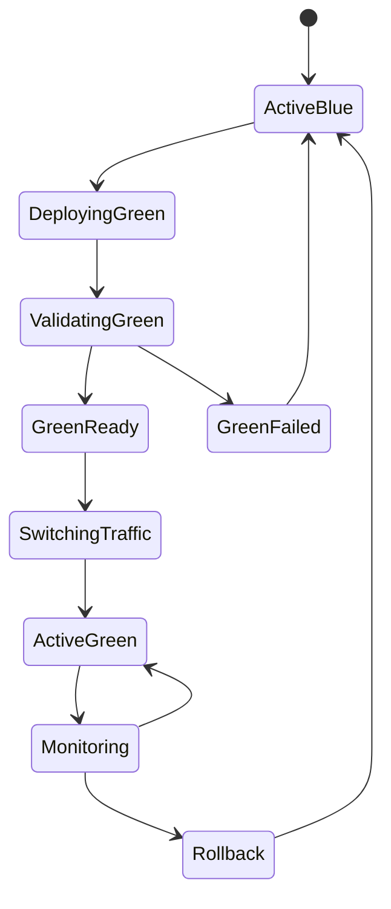
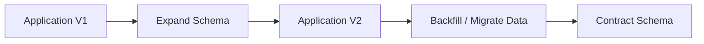
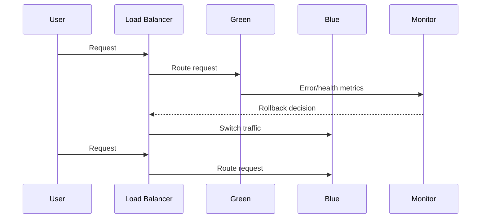
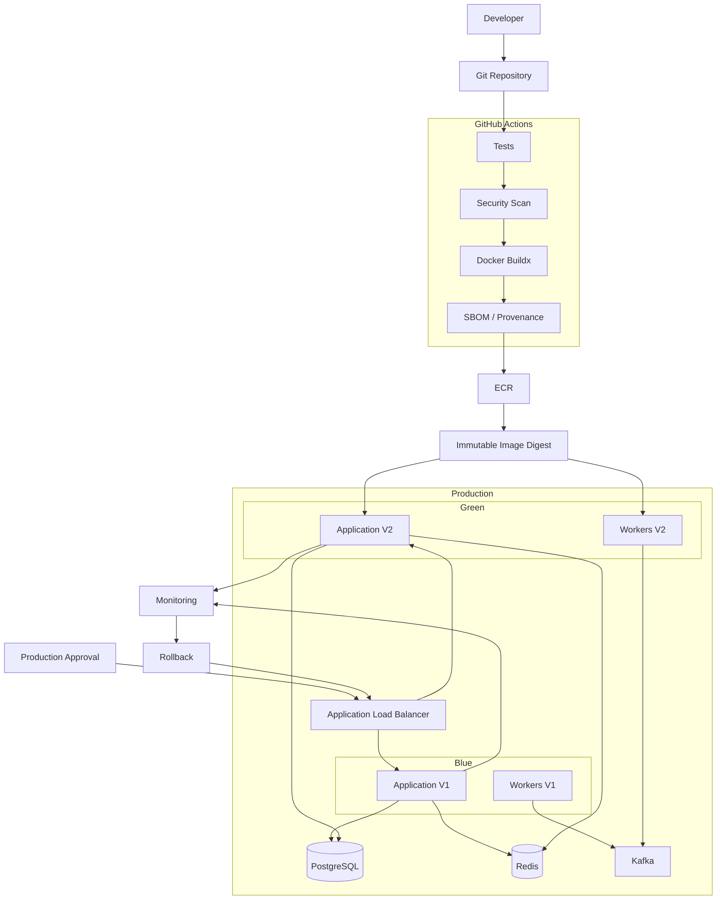

# 10- Blue Green Deployment Architecture

## Overview

Blue-green deployment is a release architecture in which two production environments or runtime versions exist simultaneously:

- **Blue** — the currently active version.
- **Green** — the candidate version being deployed and validated.

Traffic is directed to only one environment at a time. A release is promoted by switching traffic from Blue to Green after Green has been deployed and validated.

```text
                    ┌──────────────┐
                    │    Client    │
                    └──────┬───────┘
                           │
                           ▼
                  ┌─────────────────┐
                  │ Load Balancer   │
                  │ / Traffic Layer │
                  └───────┬─────────┘
                          │
                ┌─────────┴─────────┐
                │                   │
                ▼                   ▼
          ┌───────────┐       ┌───────────┐
          │  Blue V1  │       │  Green V2 │
          │  Active   │       │  Standby  │
          └───────────┘       └───────────┘
```

The key property is that the new release can be deployed independently of the currently serving release.

This provides a controlled path for:

- Zero-downtime releases.
- Production validation before traffic migration.
- Fast application rollback.
- Reduced deployment blast radius.
- Explicit release promotion.

Blue-green deployment is not simply "run two containers." It is a complete deployment architecture involving traffic routing, artifact identity, environment state, health validation, database compatibility, observability, rollback, and CI/CD controls.

---

## Why Blue-Green Deployment Exists

Traditional in-place deployment changes the active runtime directly:

```text
Production V1
     ↓
Stop / Replace
     ↓
Production V2
```

This can create:

- Downtime.
- Partial deployment states.
- Difficult rollback.
- Version mixing.
- Reduced ability to test the new version before exposing traffic.

Blue-green deployment changes the model:

```text
Production V1
     ↓
Deploy V2 separately
     ↓
Validate V2
     ↓
Switch traffic
     ↓
Production V2
```

The old version remains available until the new version has been accepted.

---

## Blue-Green Terminology

| Term | Meaning |
|---|---|
| Blue | Current active production environment |
| Green | New candidate environment |
| Active | Environment receiving production traffic |
| Standby | Environment not currently receiving normal traffic |
| Traffic switch | Change that makes the candidate active |
| Promotion | Accepting the candidate as the production version |
| Rollback | Redirecting traffic back to the previous environment |
| Deployment artifact | Immutable application package/image being deployed |

The names are arbitrary. After promotion, Green becomes active and the next release may use Blue as the new standby environment.

---

## Core Architecture

A simple architecture is:

```text
                   Production Traffic
                          │
                          ▼
                  ┌───────────────┐
                  │ Load Balancer │
                  └───────┬───────┘
                          │
                    Active Target
                          │
             ┌────────────┴────────────┐
             │                         │
             ▼                         ▼
       ┌───────────┐             ┌───────────┐
       │ Blue V1   │             │ Green V2  │
       │ Active    │             │ Standby   │
       └─────┬─────┘             └─────┬─────┘
             │                         │
             └────────────┬────────────┘
                          ▼
                    Shared Services
                 ┌────────┼─────────┐
                 ▼        ▼         ▼
             PostgreSQL Redis     Kafka
```

The traffic layer may be:

- AWS Application Load Balancer.
- Kubernetes Service/Ingress.
- Nginx.
- Service mesh.
- DNS.
- Cloud-based traffic management.

The routing mechanism determines how quickly and safely traffic can be switched.

---

## Blue-Green Deployment Lifecycle

```mermaid
flowchart LR
    SOURCE[Source Commit]
    CI[CI Validation]
    BUILD[Build Artifact]
    REGISTRY[Artifact Registry]

    BLUE[Blue Active]
    GREEN[Green Standby]

    DEPLOY[Deploy Green]
    HEALTH[Health Validation]
    SMOKE[Smoke Tests]
    APPROVAL[Approval]
    SWITCH[Switch Traffic]
    MONITOR[Monitor]
    ROLLBACK[Rollback]

    SOURCE --> CI
    CI --> BUILD
    BUILD --> REGISTRY
    REGISTRY --> DEPLOY
    BLUE --> DEPLOY
    DEPLOY --> GREEN
    GREEN --> HEALTH
    HEALTH --> SMOKE
    SMOKE --> APPROVAL
    APPROVAL --> SWITCH
    SWITCH --> MONITOR
    MONITOR --> ROLLBACK
    ROLLBACK --> BLUE
```



A production deployment should normally follow:

```text
Build
→ Produce immutable artifact
→ Deploy Green
→ Validate Green
→ Approve
→ Switch traffic
→ Monitor
→ Roll back if required
```

---

## Build Once, Deploy Many

The application should be built once.

```text
Git Commit
    ↓
CI
    ↓
Docker Build
    ↓
Image Digest
    ↓
ECR
    ↓
Green
    ↓
Production
```

Do not rebuild the application specifically for the production environment.

A rebuild can introduce:

- Different dependency versions.
- Different base images.
- Different generated artifacts.
- Different build-time configuration.
- Different compiler/runtime behavior.

The artifact tested in the deployment pipeline should be the artifact promoted to production.

---

## Immutable Artifact Identity

Docker tags such as:

```text
orders-api:latest
```

are mutable references and are therefore weak deployment identifiers.

Prefer:

```text
orders-api:8f3a2d1
```

and, for the strongest identity:

```text
orders-api@sha256:abc123...
```

The deployment system should record the digest.

```text
Git SHA
   ↓
Docker Image
   ↓
Image Digest
   ↓
Green
   ↓
Blue-Green Promotion
```

---

## Artifact Registry

A registry such as Amazon ECR can provide the artifact boundary:

```text
GitHub Actions
      ↓
Docker Buildx
      ↓
ECR
      ↓
Image Digest
      ↓
Green Environment
```

The registry should retain the artifacts necessary for rollback.

Artifact retention should therefore be designed around operational recovery requirements rather than only storage cost.

---

## Blue-Green State Model

The deployment system can model the two environments as:

```text
Blue:
  state = ACTIVE
  version = 1.8.0

Green:
  state = CANDIDATE
  version = 1.9.0
```

After promotion:

```text
Blue:
  state = STANDBY
  version = 1.8.0

Green:
  state = ACTIVE
  version = 1.9.0
```

The next release can then use Blue as the candidate environment.

---

## State Transitions



A failed candidate should not automatically become active.

---

## Traffic Switching

Traffic switching is the defining operation of blue-green deployment.

Conceptually:

```text
Before:

Traffic → Blue


After:

Traffic → Green
```

The old environment remains available:

```text
Traffic → Green

Blue → Standby
```

Traffic can be switched using:

- Load balancer target groups.
- Listener rules.
- Kubernetes services.
- Ingress configuration.
- DNS.
- Service mesh routing.

---

## AWS ALB Architecture

A common AWS implementation uses two target groups:

```text
                    ALB
                     │
             Listener :443
                     │
             ┌───────┴────────┐
             │                │
             ▼                ▼
      Blue Target Group   Green Target Group
             │                │
             ▼                ▼
        ECS/EC2 V1        ECS/EC2 V2
```

The listener determines which target group receives production traffic.

Green can be validated before the listener is changed.

---

## AWS ECS Blue-Green

A typical ECS architecture is:

```text
                 ALB
                  │
             Listener
                  │
        ┌─────────┴─────────┐
        ▼                   ▼
 Blue Target Group    Green Target Group
        │                   │
        ▼                   ▼
 ECS Service V1       ECS Service V2
```

The deployment system can:

1. Build the image.
2. Push it to ECR.
3. Deploy the new task definition.
4. Start Green tasks.
5. Validate health.
6. Shift traffic.
7. Monitor.
8. Roll back if required.

---

## Kubernetes Blue-Green

Kubernetes can implement blue-green deployment using separate workloads and controlled Service routing.

```text
Ingress
   ↓
Service
   ↓
Blue Deployment
```

During deployment:

```text
Ingress
   ↓
Service
   ↓
Green Deployment
```

The Service selector can be changed from:

```yaml
app: orders
version: blue
```

to:

```yaml
app: orders
version: green
```

The exact implementation depends on the Kubernetes deployment tooling and traffic-management layer.

---

## Nginx Blue-Green

Nginx can route traffic to one of two upstream groups.

Conceptually:

```nginx
upstream orders_backend {
    server blue.internal:8000;
}
```

After promotion:

```nginx
upstream orders_backend {
    server green.internal:8000;
}
```

The configuration change must be validated and reloaded safely.

For larger production environments, a load balancer or orchestration platform may provide better deployment automation.

---

## DNS-Based Blue-Green

DNS can direct traffic between environments:

```text
api.example.com
       ↓
DNS
       ↓
Blue
```

Then:

```text
api.example.com
       ↓
DNS
       ↓
Green
```

DNS-based switching has an important limitation: clients and intermediate resolvers may cache DNS responses.

Therefore, DNS is generally less deterministic for rapid rollback than a traffic layer that can switch targets immediately.

---

## Traffic Switching Strategies

| Strategy | Traffic Control | Rollback Speed | Complexity |
|---|---|---|---|
| Load balancer | High | Fast | Medium |
| Kubernetes Service | High | Fast | Medium |
| Service mesh | Very high | Fast | High |
| Nginx | High | Fast | Medium |
| DNS | Lower | Variable | Low |

The appropriate mechanism depends on infrastructure and operational requirements.

---

## Pre-Switch Validation

Green should be validated before receiving normal production traffic.

Typical validation:

```text
Green Started
    ↓
Container Healthy
    ↓
Application Ready
    ↓
Dependency Connectivity
    ↓
Smoke Tests
    ↓
Security Checks
    ↓
Ready for Promotion
```

---

## Health Checks

A health endpoint should represent meaningful application readiness.

Example FastAPI endpoint:

```python
from fastapi import FastAPI

app = FastAPI()


@app.get("/health")
def health() -> dict[str, str]:
    return {"status": "ok"}
```

For more advanced systems, readiness may also verify required dependencies.

Do not make a health endpoint unnecessarily dependent on every external service if that causes healthy instances to be removed during transient dependency failures. Define liveness and readiness semantics deliberately.

---

## Smoke Testing Green

Green should receive controlled validation before promotion.

Example:

```bash
curl --fail \
  --silent \
  --show-error \
  https://green.example.internal/health
```

For APIs:

```bash
curl --fail \
  --silent \
  --show-error \
  https://green.example.internal/api/v1/orders
```

Tests should target meaningful production behavior without creating destructive side effects.

---

## Production-Like Validation

Green should be tested against production-like conditions where practical:

- Same runtime.
- Same container image.
- Same database engine.
- Similar networking.
- Similar IAM.
- Similar TLS configuration.
- Similar resource limits.
- Similar observability.

A Green environment that differs substantially from production can provide false confidence.

---

## Database Architecture

Database design is the most important complication in blue-green deployment.

A naive model is:

```text
Blue V1 → Database
Green V2 → Database
```

Both versions may access the same database simultaneously.

Therefore, schema changes must be compatible with both application versions.

---

## Database Compatibility

Suppose V2 introduces:

```sql
ALTER TABLE users
ADD COLUMN display_name TEXT NOT NULL;
```

If V1 does not know how to handle the new schema, immediate rollback may become unsafe.

A safer approach is:

```text
1. Add compatible schema
2. Deploy V2
3. Migrate data
4. Switch traffic
5. Remove obsolete schema later
```

---

## Expand-Contract Pattern



The important property is that the intermediate database state remains compatible with both versions.

---

## Django Database Migrations

Django migrations should be designed for coexistence.

Prefer:

```text
Migration A:
Add nullable field
       ↓
Deploy V2
       ↓
Populate field
       ↓
Enforce constraint
       ↓
Remove old field
```

Avoid making irreversible schema changes part of the same deployment as the traffic switch unless the application architecture explicitly supports them.

---

## PostgreSQL Considerations

PostgreSQL changes may involve:

- Columns.
- Indexes.
- Constraints.
- Enums.
- Functions.
- Large table rewrites.

Large schema operations can create locks or performance impact even when application deployment itself is zero downtime.

Database migration performance must therefore be treated as a separate deployment concern.

---

## Redis Compatibility

Blue and green versions may temporarily run simultaneously.

Both versions may access the same Redis instance.

Avoid incompatible cache formats:

```text
V1 → user:123
V2 → user:123
```

Prefer versioned cache structures when compatibility is uncertain:

```text
v1:user:123
v2:user:123
```

Cache invalidation can also be part of the promotion process.

---

## Celery Compatibility

A blue-green deployment may temporarily run:

```text
Web V1
Web V2
Worker V1
Worker V2
```

Celery task payloads must remain compatible across versions during the transition.

A new application should not immediately emit task formats that old workers cannot process.

A safer sequence is:

```text
Deploy backward-compatible worker
        ↓
Deploy application
        ↓
Promote traffic
        ↓
Retire old worker
```

---

## Kafka Compatibility

Kafka consumers and producers can also coexist across versions.

```text
Producer V1 ─┐
             ├── Kafka ── Consumer V1
Producer V2 ─┘           Consumer V2
```

Event schema changes should be backward compatible where coexistence is required.

Avoid assuming that a traffic switch instantly removes all old producers or consumers.

---

## API Compatibility

Blue and green versions may coexist during deployment.

For REST APIs:

```text
Client
  ↓
V1 or V2
```

For gRPC:

```text
Client
  ↓
V1 / V2 servers
```

API and protobuf changes should preserve compatibility during the transition.

---

## Long-Lived Connections

Blue-green switching is more complicated for:

- WebSockets.
- Server-Sent Events.
- Long-lived gRPC streams.

Existing connections may remain attached to Blue after new traffic starts going to Green.

The system needs:

- Connection draining.
- Graceful shutdown.
- Appropriate timeout handling.
- Client reconnect behavior.

---

## Connection Draining

A safe switch may look like:

```text
Stop New Traffic → Blue
           ↓
Allow Existing Requests
           ↓
Drain Connections
           ↓
Terminate Blue
```

Immediately terminating Blue after changing the routing rule can break active requests.

---

## Traffic Switching with ALB

Conceptually:

```text
Before:

ALB
 └── Blue 100%
     └── Green 0%


After:

ALB
 └── Green 100%
     └── Blue 0%
```

For systems supporting weighted routing, traffic can also be transitioned gradually, although that becomes closer to a canary/progressive delivery model.

---

## Blue-Green vs Canary

| Property | Blue-Green | Canary |
|---|---|---|
| Main idea | Switch between complete environments | Gradually expose new version |
| Initial traffic to new version | Usually 0% | Small percentage |
| Rollback | Usually fast traffic switch | Reduce/stop canary traffic |
| Capacity | Often requires duplicate capacity | Can require less duplicate capacity |
| Production validation | Pre-switch + post-switch | Real traffic during progression |
| Complexity | Medium | Higher |

Blue-green can be combined with controlled traffic percentages, but the architectural goal remains maintaining distinct release environments.

---

## Blue-Green vs Rolling

| Property | Blue-Green | Rolling |
|---|---|---|
| Old/new environments | Separate | Same deployment pool |
| Version coexistence | Controlled | Normal |
| Rollback | Traffic switch | Replace instances again |
| Capacity | Higher | Lower |
| Pre-production validation | Strong | More limited |
| Deployment complexity | Medium | Lower |

Rolling deployments are often more cost-efficient, while blue-green provides stronger isolation between release environments.

---

## Blue-Green vs Recreate

A recreate deployment stops the old version before starting the new version:

```text
V1
 ↓
STOP
 ↓
V2
```

This creates downtime unless another availability layer exists.

Blue-green instead keeps the active environment available while preparing the candidate.

---

## Promotion Approval

Production promotion can include a manual approval.

```text
Green Ready
    ↓
Automated Validation
    ↓
Production Approval
    ↓
Traffic Switch
```

The approval should provide enough information to make the deployment decision:

- Version.
- Commit.
- Image digest.
- Test results.
- Security scan.
- Green health.
- Change description.

---

## GitHub Environment Protection

A GitHub Actions production job can use:

```yaml
environment:
  name: production
```

The `production` environment can be configured with required reviewers and other deployment protections.

This creates an explicit deployment boundary between CI validation and production promotion.

---

## Production Deployment Concurrency

Blue-green deployment does not remove the need for concurrency control.

Example:

```yaml
concurrency:
  group: production-orders-api
  cancel-in-progress: false
```

Without concurrency:

```text
Release A → Green
Release B → Green
Release A → Traffic Switch
Release B → Traffic Switch
```

The resulting environment state may be ambiguous.

---

## Environment Identity

If Blue and Green are independently managed, the deployment system should know:

```text
Active Environment = Blue
Candidate Environment = Green
```

After promotion:

```text
Active Environment = Green
Candidate Environment = Blue
```

This state should be observable rather than maintained only in human knowledge.

---

## Deployment Metadata

Record:

```text
Service
Environment
Color
Version
Git SHA
Image Digest
Deployment Time
Workflow Run
Operator / Actor
Approval
Health Result
```

This makes incident investigation significantly easier.

---

## Blue-Green Deployment with GitHub Actions

A simplified workflow structure is:

```yaml
name: Blue Green Deployment

on:
  workflow_dispatch:
    inputs:
      image-digest:
        description: Image digest to deploy
        required: true
        type: string

permissions:
  contents: read
  id-token: write

concurrency:
  group: production-orders-api
  cancel-in-progress: false

jobs:
  deploy-green:
    runs-on: ubuntu-latest

    environment:
      name: production

    steps:
      - name: Validate artifact
        env:
          IMAGE_DIGEST: ${{ inputs.image-digest }}
        run: |
          set -euo pipefail

          [[ "$IMAGE_DIGEST" == sha256:* ]] || {
            echo "Invalid image digest"
            exit 1
          }

      - name: Deploy green
        env:
          IMAGE_DIGEST: ${{ inputs.image-digest }}
        run: |
          echo "Deploying Green with $IMAGE_DIGEST"

      - name: Validate green
        run: |
          curl --fail \
            --silent \
            --show-error \
            https://green.example.internal/health

      - name: Switch traffic
        run: |
          echo "Switching production traffic to Green"

      - name: Record deployment
        env:
          IMAGE_DIGEST: ${{ inputs.image-digest }}
        run: |
          {
            echo "## Blue-Green Deployment"
            echo ""
            echo "- Environment: production"
            echo "- Candidate: green"
            echo "- Artifact: $IMAGE_DIGEST"
            echo "- Commit: $GITHUB_SHA"
            echo "- Workflow: $GITHUB_RUN_ID"
          } >> "$GITHUB_STEP_SUMMARY"
```

The actual traffic-switch implementation should be delegated to the target platform, such as AWS ECS/ALB, Kubernetes, or another routing system.

---

## AWS OIDC Authentication

Production deployment should avoid long-lived AWS access keys.

The flow should be:

```text
GitHub Actions
      ↓
GitHub OIDC
      ↓
AWS STS
      ↓
Production IAM Role
      ↓
ECS / ALB / ECR
```

The deployment role should have only the required permissions.

---

## Example AWS Identity Check

During troubleshooting:

```bash
aws sts get-caller-identity
```

Verify:

```text
Account
ARN
UserId
```

If the wrong role or account is returned, stop the deployment investigation there rather than debugging the target service first.

---

## ECR Image Promotion

The recommended flow is:

```text
Build
 ↓
Push to ECR
 ↓
Record Digest
 ↓
Deploy Green
 ↓
Validate
 ↓
Promote
```

Do not pull source code and rebuild the image on the Green environment.

---

## Docker Buildx

Buildx can produce the deployment image:

```bash
docker buildx build \
  --platform linux/amd64 \
  --tag "$IMAGE_URI:$GITHUB_SHA" \
  --push \
  .
```

The resulting registry digest should be recorded and used for deployment.

---

## Image Security

Before promotion, consider:

- Vulnerability scanning.
- SBOM generation.
- Provenance.
- Artifact attestations.
- Signature verification.
- Trusted base images.
- Dependency integrity.

The Green environment should not be treated as a reason to bypass artifact security controls.

---

## Rollback

Rollback is the strongest operational advantage of blue-green deployment.

If Green is active:

```text
Traffic → Green
```

and a severe issue occurs:

```text
Traffic → Blue
```

The old environment can remain available until confidence in Green is established.

---

## Rollback Flow



Rollback should be an explicit operational procedure.

---

## Rollback Limitations

Blue-green does not make every rollback safe.

Rollback can still fail because of:

- Incompatible database schema.
- Irreversible data migrations.
- Kafka event incompatibility.
- Redis schema changes.
- External API changes.
- Secret rotation.
- Infrastructure changes.
- Stateful background jobs.

Therefore:

> Blue-green provides fast application rollback, not automatic system-wide rollback.

---

## Database Rollback Strategy

Prefer forward-compatible schema evolution.

```text
Release N
   ↓
Expand
   ↓
Release N+1
   ↓
Migrate
   ↓
Release N+2
   ↓
Contract
```

This allows application rollback without requiring an immediate database rollback.

---

## Background Job Rollback

Background jobs may continue after a traffic switch.

For Celery:

```text
Web V2
 ↓
Queue
 ↓
Worker V1/V2
```

For Kafka:

```text
Producer V2
 ↓
Kafka
 ↓
Consumer V1/V2
```

Rollback planning must include these asynchronous components.

---

## Monitoring After Promotion

Do not immediately destroy Blue after switching traffic.

Monitor:

- HTTP 5xx rate.
- Latency.
- Request volume.
- CPU.
- Memory.
- Database errors.
- Redis errors.
- Kafka lag.
- Celery failures.
- Container restarts.
- Load balancer health.
- Application logs.

A stabilization window can provide additional confidence.

---

## Automated Rollback

Automated rollback can be triggered by objective signals:

```text
Traffic Switch
     ↓
Monitor
     ↓
Error Rate > Threshold
     ↓
Rollback
```

Automation should be conservative.

An overly sensitive rollback mechanism can produce deployment loops:

```text
Deploy
 ↓
Rollback
 ↓
Deploy
 ↓
Rollback
```

Use clear thresholds and cooldowns.

---

## Rollback Decision Example

A rollback policy might consider:

```text
5xx rate
Latency
Health checks
Dependency failures
Business-critical errors
```

The exact thresholds should be defined according to service objectives rather than copied blindly between services.

---

## Observability Architecture

```text
                    Production Traffic
                           │
                           ▼
                         Green
                           │
              ┌────────────┼────────────┐
              ▼            ▼            ▼
            Logs        Metrics       Traces
              │            │            │
              └────────────┼────────────┘
                           ▼
                    Monitoring System
                           │
                    ┌──────┴──────┐
                    ▼             ▼
                 Healthy       Rollback
```

Deployment state should be correlated with application telemetry.

---

## Deployment Markers

Monitoring systems should record:

```text
deployment.start
deployment.green.ready
deployment.traffic.switch
deployment.complete
deployment.rollback
```

This allows operators to correlate an increase in errors with a specific deployment.

---

## Security Boundaries

Blue-green deployments should preserve CI/CD security boundaries.

Important boundaries include:

```text
Pull Request
     ↓
CI Validation
     ↓
Trusted Build
     ↓
Artifact Registry
     ↓
Production Deployment
     ↓
Runtime
```

Do not allow arbitrary PR code to control production traffic switching.

---

## Untrusted Pull Requests

A PR workflow should not receive:

- Production AWS credentials.
- Production environment secrets.
- Privileged deployment runner access.

Use separate workflows and permissions for validation and deployment.

---

## Self-Hosted Runners

If a deployment runner needs private network access:

```text
GitHub
  ↓
Runner Group
  ↓
Private VPC
  ↓
ALB / ECS / Kubernetes / Database
```

Deployment runners should be isolated from runners executing untrusted code.

Ephemeral runners can reduce persistent-state risk.

---

## Infrastructure as Code

Blue-green infrastructure can be represented using Terraform or CloudFormation.

For example:

```text
Terraform
 ├── ALB
 ├── Blue Target Group
 ├── Green Target Group
 ├── ECS Services
 └── IAM Roles
```

Application deployment and infrastructure lifecycle should remain logically separate even when orchestrated by the same CI/CD platform.

---

## Terraform Considerations

Terraform should manage infrastructure state, while the deployment system should manage application promotion.

Avoid using Terraform state as the sole source of truth for runtime deployment state if the deployment platform has its own rollout state.

---

## CloudFormation Considerations

CloudFormation can manage:

- ALB.
- Target groups.
- ECS services.
- IAM roles.
- Networking.

The deployment workflow can then perform application-level promotion using the infrastructure.

---

## High Availability

Blue-green improves deployment availability only if the surrounding architecture supports it.

Required components may include:

- Multiple application instances.
- Load balancing.
- Health checks.
- Multi-AZ deployment.
- Graceful shutdown.
- Database availability.
- Redis availability where required.
- Monitoring.
- Tested rollback.

Running Blue and Green on one host does not provide meaningful high availability.

---

## Capacity Planning

Blue-green commonly requires additional capacity because Blue and Green coexist.

If production normally requires:

```text
10 application instances
```

a full blue-green deployment may temporarily require:

```text
10 Blue + 10 Green = 20 instances
```

Capacity planning must account for this.

---

## Cost Optimization

Ways to reduce cost include:

- Right-size Green resources.
- Use existing autoscaling.
- Remove old environments after stabilization.
- Use scheduled non-production environments.
- Avoid unnecessarily duplicating expensive stateful infrastructure.
- Keep Blue only as long as rollback requirements justify it.

Do not reduce Green capacity so aggressively that validation becomes unrepresentative.

---

## Failure Domains

Blue-green should isolate failures where practical.

```text
CI Failure
   ↓
No Production Change

Green Deployment Failure
   ↓
Blue Remains Active

Traffic Switch Failure
   ↓
Blue Remains / Restore Routing

Green Runtime Failure
   ↓
Rollback to Blue

Database Failure
   ↓
May Affect Both Blue and Green
```

The last case is important: shared dependencies can remain a common failure domain.

---

## Shared Database Failure Domain

If both environments use the same PostgreSQL database:

```text
Blue ──┐
       ├── PostgreSQL
Green ─┘
```

The database remains a shared dependency.

Blue-green therefore does not isolate database failures automatically.

---

## Shared Redis Failure Domain

Similarly:

```text
Blue ──┐
       ├── Redis
Green ─┘
```

Redis failures can affect both environments.

Where necessary, stateful dependencies need their own availability and recovery architecture.

---

## Shared Kafka Failure Domain

For Kafka:

```text
Blue ──┐
       ├── Kafka
Green ─┘
```

A Kafka outage can affect both application versions.

Blue-green should therefore be understood as an application deployment strategy, not a complete disaster-isolation strategy.

---

## Disaster Recovery

Blue-green is not equivalent to disaster recovery.

| Capability | Blue-Green | Disaster Recovery |
|---|---|---|
| Application rollback | Strong | Possible |
| Deployment safety | Strong | Not primary purpose |
| Region failure | No | Yes |
| Data recovery | No | Yes |
| Infrastructure recovery | Limited | Yes |
| RTO/RPO | Not sufficient | Core concern |

A DR strategy still needs:

- Backups.
- Replication.
- Infrastructure recovery.
- Artifact recovery.
- Configuration recovery.
- Database restoration.
- DNS/traffic recovery.

---

## Blue-Green and Multi-Region Systems

A multi-region architecture can extend the model:

```text
Global Traffic
      │
 ┌────┴─────┐
 ▼          ▼
Region A   Region B
```

Each region may independently use blue-green deployment.

This increases complexity significantly because deployment state, data replication, traffic routing, and rollback must remain coordinated.

---

## Blue-Green and Microservices

For microservices:

```text
Orders
Payments
Users
Inventory
```

Each service can have its own Blue/Green lifecycle.

```text
Orders:
  Blue V1 → Green V2

Payments:
  Blue V3 → Green V4
```

This supports independent releases but increases operational state.

Central deployment tooling should therefore standardize:

- Artifact identity.
- Promotion.
- Health checks.
- Concurrency.
- Rollback.
- Observability.

---

## Blue-Green and API Gateway

With an API gateway:

```text
Client
  ↓
API Gateway
  ↓
Routing Layer
  ↓
Blue / Green
```

The gateway can provide an additional routing abstraction.

This is useful when multiple services need controlled traffic management.

---

## Blue-Green and gRPC

For gRPC:

```text
Client
  ↓
Load Balancer
  ↓
Blue / Green gRPC servers
```

Long-lived streams require special attention.

A traffic switch may only affect new connections while existing streams remain attached to Blue.

Graceful draining is therefore essential.

---

## Blue-Green and Feature Flags

Feature flags can complement blue-green:

```text
Deploy Green
    ↓
Feature Disabled
    ↓
Validate
    ↓
Switch Traffic
    ↓
Enable Feature
```

This separates deployment from feature activation.

It can also reduce rollback frequency for high-risk application behavior.

---

## Blue-Green Governance

Enterprise governance should define:

- Who can trigger production promotion.
- Which workflows may switch traffic.
- Which IAM roles can modify routing.
- Which runners can access production.
- Which actions are permitted.
- Required approvals.
- Required health checks.
- Artifact retention.
- Rollback requirements.

The traffic-switch operation should be treated as a privileged action.

---

## Operational Runbook

A production blue-green runbook should contain:

### Before Deployment

- Confirm artifact digest.
- Confirm CI status.
- Confirm security checks.
- Confirm database compatibility.
- Confirm capacity.
- Confirm rollback artifact.
- Confirm monitoring.

### Deploy Green

- Deploy candidate.
- Verify task/pod health.
- Verify application readiness.
- Run smoke tests.
- Verify logs.

### Promote

- Obtain required approval.
- Verify Green remains healthy.
- Switch traffic.
- Verify production health.

### Stabilize

- Monitor error rate.
- Monitor latency.
- Monitor infrastructure.
- Monitor dependencies.

### Rollback

- Switch traffic back to Blue.
- Validate Blue.
- Record incident.
- Investigate Green.
- Preserve evidence.

### Retire

- Keep Blue for the required rollback window.
- Remove obsolete resources.
- Record final deployment state.

---

## Troubleshooting: Green Will Not Become Healthy

### Symptom

Green tasks or pods fail health checks.

### Possible Causes

- Application startup failure.
- Incorrect environment variables.
- Database connectivity.
- Redis connectivity.
- Port mismatch.
- Security group rules.
- Missing secrets.
- Incorrect container command.

### Isolation Strategy

Test the layers in order:

```text
Container
 ↓
Process
 ↓
Port
 ↓
Application
 ↓
Dependencies
```

### Commands

For AWS identity:

```bash
aws sts get-caller-identity
```

For Docker:

```bash
docker ps
docker logs <container>
```

For Kubernetes:

```bash
kubectl get pods
kubectl describe pod <pod>
kubectl logs <pod>
```

### Prevention

Use readiness checks and production-like staging validation.

---

## Troubleshooting: Traffic Did Not Switch

### Possible Causes

- Incorrect target group.
- Listener rule failure.
- Deployment permission failure.
- Health checks preventing registration.
- Concurrency conflict.
- Wrong environment.

### Isolation Strategy

Verify:

```text
Expected Target
→ Actual Target
→ Listener
→ Target Group
→ Healthy Instances
```

---

## Troubleshooting: Green Receives No Traffic

### Possible Causes

- Routing still points to Blue.
- Green targets unhealthy.
- Listener configuration incorrect.
- Security group or network issue.
- DNS cache when DNS switching is used.

### Prevention

Validate the routing state explicitly before declaring promotion successful.

---

## Troubleshooting: Rollback Does Not Restore Service

### Possible Causes

- Blue was terminated too early.
- Database schema incompatible.
- Shared dependency changed.
- Configuration changed.
- Old artifact unavailable.
- Traffic routing failed.

### Prevention

Keep Blue available through the stabilization period and design database changes for backward compatibility.

---

## Troubleshooting: Green Works Internally but Fails Through the Load Balancer

### Possible Causes

- TLS mismatch.
- Host header differences.
- Security group rules.
- Target group health path.
- Listener configuration.
- Proxy configuration.
- Application base URL behavior.

Test both paths:

```text
Direct Green
    ↓
Load Balancer
    ↓
Green
```

The difference isolates the routing layer.

---

## Troubleshooting: Application Works but Background Jobs Fail

### Possible Causes

- Celery task incompatibility.
- Kafka schema incompatibility.
- Worker version mismatch.
- Queue configuration.
- Redis state incompatibility.

Do not consider a blue-green deployment successful until asynchronous processing has also been validated when it is part of the service.

---

## GitHub CLI Operations

List workflows:

```bash
gh workflow list
```

List recent deployment runs:

```bash
gh run list --workflow=deploy.yml
```

Inspect a run:

```bash
gh run view <run-id>
```

Inspect logs:

```bash
gh run view <run-id> --log
```

Rerun a failed workflow:

```bash
gh run rerun <run-id>
```

Trigger a workflow:

```bash
gh workflow run deploy.yml \
  -f environment=production \
  -f image-digest=sha256:abc123
```

---

## AWS CLI Diagnostics

Check identity:

```bash
aws sts get-caller-identity
```

Inspect ECS services:

```bash
aws ecs describe-services \
  --cluster production \
  --services orders-api
```

Inspect task definitions:

```bash
aws ecs describe-task-definition \
  --task-definition orders-api
```

Inspect ECR images:

```bash
aws ecr describe-images \
  --repository-name orders-api
```

These commands help determine whether the deployment failure is related to identity, artifact, runtime, or traffic configuration.

---

## Common Mistakes

### Destroying Blue Immediately

This removes the easiest rollback path.

### Using Mutable Image Tags

A tag can point to a different image later.

### Rebuilding Green

Green should use the validated artifact.

### Ignoring Database Compatibility

The application can roll back while the database cannot.

### Switching Traffic Without Health Checks

A running container is not necessarily a healthy application.

### Forgetting Background Workers

Web traffic may be healthy while Celery or Kafka processing is broken.

### Ignoring Long-Lived Connections

Existing gRPC or WebSocket connections may remain on Blue.

### No Concurrency Control

Multiple promotions can corrupt deployment state.

### Treating Blue-Green as DR

Both environments may share the same database, region, network, or cloud account.

### Overbuilding the Architecture

Not every service needs full duplicate infrastructure. The deployment strategy should match service risk and availability requirements.

---

## Production Design Principles

### Keep the Artifact Immutable

The image digest should not change between environments.

### Keep Configuration External

Environment differences should normally be runtime configuration rather than different builds.

### Keep Blue Available During Stabilization

Rollback is most useful when it is immediate.

### Validate Before Switching

Green should be healthy before production traffic is moved.

### Make Database Changes Compatible

Application rollback is only useful if the database remains compatible.

### Control Traffic Explicitly

The routing layer should provide an observable and deterministic promotion mechanism.

### Protect the Switch

Traffic switching is a privileged production operation and should require appropriate authentication, authorization, and approval.

### Make Rollback Routine

A rollback should be executable through the same controlled deployment system rather than through ad hoc production changes.

---

## Production Architecture Example



---

## Production Checklist

### Architecture

- [ ] Blue and Green have clearly defined roles.
- [ ] Traffic switching is deterministic.
- [ ] The routing layer supports rollback.
- [ ] Capacity supports simultaneous environments.
- [ ] Shared dependencies are understood.

### Artifact

- [ ] Build occurs once.
- [ ] Image digest is recorded.
- [ ] Artifact is immutable.
- [ ] SBOM/provenance requirements are satisfied.
- [ ] Rollback artifacts are retained.

### Deployment

- [ ] Green is deployed independently.
- [ ] Health checks are available.
- [ ] Smoke tests run before promotion.
- [ ] Production approval is protected.
- [ ] Deployment concurrency is configured.

### Application Compatibility

- [ ] Database schema is backward compatible.
- [ ] Redis changes are compatible.
- [ ] Celery tasks are compatible.
- [ ] Kafka events are compatible.
- [ ] REST/gRPC contracts support coexistence.
- [ ] Long-lived connections are handled.

### Security

- [ ] AWS authentication uses OIDC where appropriate.
- [ ] Deployment IAM is least privilege.
- [ ] PR workflows cannot access production credentials.
- [ ] Traffic switching is privileged.
- [ ] Production runners are isolated.

### Operations

- [ ] Deployment metadata is recorded.
- [ ] Metrics and logs are available.
- [ ] Deployment markers exist.
- [ ] Rollback has been tested.
- [ ] Blue remains available for the required stabilization period.
- [ ] DR is addressed separately from deployment rollback.

---

## Senior Interview Scenarios

### Why Use Blue-Green Instead of Rolling Deployment?

Discuss the trade-off between stronger release isolation and higher infrastructure capacity.

### How Do You Guarantee That Green Uses the Artifact Tested in CI?

Use immutable artifact identity, preferably a container image digest, and pass that identity through the promotion workflow.

### What Is the Biggest Challenge With Blue-Green Deployment?

The application is not the only stateful component. Database schemas, caches, queues, events, and external contracts must remain compatible while both versions can coexist.

### How Would You Roll Back?

Switch production traffic back to Blue using the routing layer, validate Blue, and investigate Green separately.

### Why Can Rollback Still Fail?

Because the database or other shared dependencies may have already changed in a way that is incompatible with the old application.

### How Would You Implement Blue-Green on AWS ECS?

Use ECR for immutable images, ECS for the two runtime versions, ALB target groups for traffic routing, GitHub Actions for orchestration, and OIDC for AWS authentication.

### How Would You Secure the Deployment?

Separate CI from production deployment, use least-privilege permissions, protected environments, OIDC, restricted runners, trusted actions, and controlled traffic-switch permissions.

### What Happens to Existing gRPC Connections During a Switch?

Existing connections may remain attached to Blue. Graceful draining and client reconnect behavior must therefore be designed explicitly.

### Does Blue-Green Provide Disaster Recovery?

No. It primarily provides deployment isolation and fast application rollback. DR requires independent infrastructure, data recovery, replication, and recovery procedures.

### How Would You Handle a Django Migration?

Use backward-compatible expand-contract migrations so both Blue and Green can operate against the intermediate database schema.

### How Would You Handle Celery or Kafka?

Maintain compatibility between old and new task/event formats while both versions coexist, and retire the old consumers/producers only after the migration is complete.

### How Would You Prevent Two Production Promotions From Running Together?

Use a production-specific GitHub Actions concurrency group and make the traffic-switch operation part of that serialized deployment boundary.

## Key Takeaways

- **Blue-green deployment maintains separate active and candidate environments so a new release can be validated before production traffic is switched.**
- **Build once and promote an immutable artifact**, preferably identified by a Docker image digest, rather than rebuilding the application for Green.
- **The hardest blue-green problems are usually state and compatibility problems** involving databases, Redis, Celery, Kafka, APIs, gRPC, and long-lived connections.
- **Fast rollback depends on keeping the previous environment available**, controlling traffic explicitly, validating health, and preventing concurrent production promotions.
- **Blue-green improves deployment safety but is not disaster recovery**; shared databases, networks, regions, and other dependencies remain potential common failure domains.