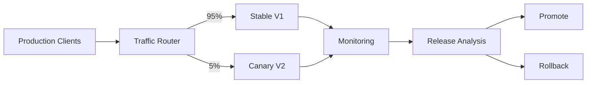
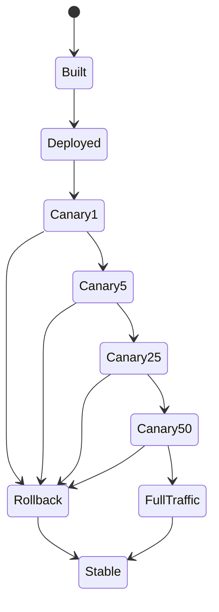
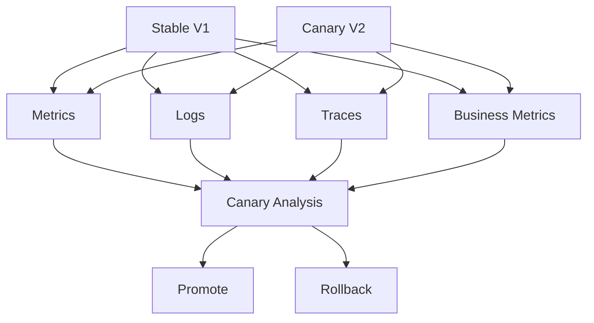
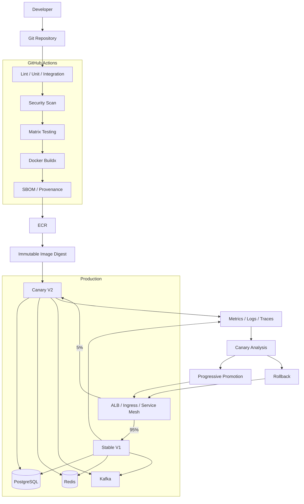

# 11- Canary Deployment Architecture

## Overview

Canary deployment is a progressive delivery strategy in which a new application version is exposed to a small portion of production traffic before being promoted to the full production population.

A typical progression is:

```text
Production V1
     ↓
Deploy V2
     ↓
1% Traffic → V2
     ↓
Validate
     ↓
5% Traffic → V2
     ↓
Validate
     ↓
25% Traffic → V2
     ↓
Validate
     ↓
50% Traffic → V2
     ↓
Validate
     ↓
100% Traffic → V2
```

The defining characteristic is **controlled exposure to real production traffic**.

Unlike blue-green deployment, where a complete candidate environment is commonly validated before a traffic switch, canary deployment intentionally exposes the new version to a limited production population while the old version remains active.

Canary deployment is particularly useful when the primary risk is uncertainty about how a release behaves under real production traffic.

---

## Why Canary Deployment Exists

A release can pass:

- Unit tests.
- Integration tests.
- End-to-end tests.
- Security scans.
- Staging validation.

and still fail in production because production traffic contains behavior that test environments cannot fully reproduce.

Examples include:

- Unexpected request patterns.
- Large payloads.
- Rare API combinations.
- Traffic spikes.
- Production data characteristics.
- Unexpected client behavior.
- Dependency latency.
- Cache behavior.
- Resource contention.

Canary deployment reduces the blast radius by exposing the new version gradually.

```text
Traditional:

100% V1
   ↓
100% V2


Canary:

99% V1
 1% V2
   ↓
95% V1
 5% V2
   ↓
75% V1
25% V2
   ↓
0% V1
100% V2
```

---

## Canary Deployment vs Blue-Green

| Property | Blue-Green | Canary |
|---|---|---|
| New version | Separate environment | Separate release/runtime |
| Initial production traffic | Usually 0% | Small percentage |
| Production validation | Mostly before switch | During progressive exposure |
| Rollback | Traffic switch | Reduce/remove canary traffic |
| Blast radius | Low after controlled switch | Low during initial stages |
| Capacity | Often duplicate environment | Depends on canary size |
| Routing complexity | Medium | Higher |
| Real production traffic | Usually after promotion | From the beginning |
| Automated analysis | Optional | Often valuable |

Blue-green answers:

> Can the new environment become the production environment?

Canary answers:

> How does the new version behave with a controlled amount of real production traffic?

---

## Canary Deployment vs Rolling Deployment

Rolling deployment replaces instances gradually:

```text
V1 V1 V1 V1
 ↓
V2 V1 V1 V1
 ↓
V2 V2 V1 V1
 ↓
V2 V2 V2 V1
 ↓
V2 V2 V2 V2
```

Canary deployment instead explicitly controls traffic exposure:

```text
V1 → 99%
V2 → 1%
```

The two approaches can overlap technically, but their operational goals differ.

Rolling deployment focuses primarily on replacing runtime instances.

Canary deployment focuses on **progressive traffic exposure and release validation**.

---

## Canary Architecture



The routing layer determines which requests reach the canary.

The monitoring system determines whether the canary is behaving acceptably.

---

## Core Canary Components

A production canary system normally contains:

```text
Application Artifact
        ↓
Canary Runtime
        ↓
Traffic Router
        ↓
Production Traffic

             ↓
          Metrics
             ↓
       Release Analysis
             ↓
     Promote / Rollback
```

Typical components include:

- CI/CD system.
- Artifact registry.
- Deployment platform.
- Traffic router.
- Observability platform.
- Automated analysis.
- Promotion controller.
- Rollback mechanism.

---

## Canary Lifecycle

A complete lifecycle can be represented as:

```text
Build
  ↓
Test
  ↓
Publish Artifact
  ↓
Deploy Canary
  ↓
Health Check
  ↓
1% Traffic
  ↓
Observe
  ↓
5% Traffic
  ↓
Observe
  ↓
25% Traffic
  ↓
Observe
  ↓
50% Traffic
  ↓
Observe
  ↓
100% Traffic
```

At every stage, the release should satisfy predefined success criteria.

---

## Canary State Model



The actual traffic percentages depend on the service and risk profile.

---

## Canary Stages

A canary does not have to use fixed percentages.

Example:

```text
1% → 5% → 10% → 25% → 50% → 100%
```

Another service may use:

```text
5% → 25% → 100%
```

A high-risk system may use:

```text
0.5% → 1% → 2% → 5% → 10% → 25% → 50% → 100%
```

The more sensitive the system, the smaller the initial exposure can be.

---

## Choosing Canary Traffic Percentage

Traffic percentage should consider:

- Total request volume.
- User population.
- Business criticality.
- Error sensitivity.
- Expected traffic distribution.
- Canary capacity.
- Observability quality.

For a service receiving 10 requests per minute, 1% may provide too little statistical information.

For a service receiving millions of requests per minute, even 1% can represent substantial production traffic.

---

## Canary Duration

Each stage needs enough observation time to produce meaningful evidence.

Example:

```text
1% traffic
   ↓
Observe 10 minutes

5% traffic
   ↓
Observe 15 minutes

25% traffic
   ↓
Observe 30 minutes
```

Duration should be based on the service's traffic patterns and failure modes rather than an arbitrary timer.

---

## Success Criteria

A canary should have explicit promotion criteria.

Examples:

```text
5xx rate < 0.5%
p95 latency < 300 ms
CPU < 70%
Memory < 80%
No critical exceptions
Kafka consumer lag within baseline
```

A production system should define thresholds based on its normal operating behavior.

---

## Baseline Comparison

Absolute thresholds are not always enough.

Suppose:

```text
Stable V1:
p95 latency = 200 ms

Canary V2:
p95 latency = 280 ms
```

Even though 280 ms may be below a global 300 ms threshold, the regression may be significant.

Compare:

```text
Canary
   vs
Stable Baseline
```

Useful comparisons include:

- Error rate.
- Latency.
- Throughput.
- Resource usage.
- Dependency failures.
- Business metrics.

---

## Statistical Considerations

Canary analysis requires enough traffic to distinguish normal variation from release-induced changes.

A tiny sample can produce misleading conclusions.

Consider:

```text
Stable:
10,000 requests
20 errors

Canary:
100 requests
0 errors
```

Zero observed errors in the canary does not prove that the new release has zero error probability.

Production analysis should account for sample size, confidence, traffic distribution, and natural variability.

---

## Representative Traffic

The canary population should ideally represent the production population.

A poor canary selection can hide defects.

For example:

```text
Canary = internal employees only
```

may not represent:

- Mobile users.
- Large customers.
- High-volume clients.
- Different geographic regions.
- Different API consumers.

Traffic selection should match the risk being evaluated.

---

## User-Based Canary

Traffic can be assigned by user:

```text
User ID hash
    ↓
Routing decision
    ↓
Canary or Stable
```

Example:

```text
hash(user_id) % 100 < 5
```

routes approximately 5% of users to the canary.

This can provide stable user assignment.

---

## Request-Based Canary

Traffic can also be distributed per request.

```text
Request
   ↓
Random / weighted routing
   ↓
V1 or V2
```

This may expose a user to both versions during a session.

That can be undesirable when application behavior must remain consistent across requests.

---

## Sticky Canary Routing

Sticky assignment can keep users on one version:

```text
User A → V1
User B → V2
User C → V1
```

This is useful when:

- Sessions are stateful.
- Caches are version-specific.
- User experience should remain consistent.

However, sticky routing can make traffic distribution less uniform.

---

## Header-Based Canary

Internal testing can use a request header:

```http
X-Canary: true
```

The routing layer can send these requests to the canary.

This is useful for controlled testing but should not be considered equivalent to representative public traffic.

---

## Cookie-Based Canary

A routing layer may use a cookie to persist assignment:

```text
canary=green
```

This can provide stable user exposure without requiring application changes.

---

## Geographic Canary

Traffic can be limited to a region:

```text
Region A → V2
Other Regions → V1
```

This can reduce the initial blast radius.

However, geographic differences may mean that the canary does not represent the entire global population.

---

## Canary Capacity

The canary must have enough capacity to handle its assigned traffic.

If:

```text
Production traffic = 100,000 requests/minute
Canary = 10%
```

then the canary must support approximately:

```text
10,000 requests/minute
```

plus appropriate headroom.

Do not intentionally under-provision the canary and then interpret resource saturation as an application defect.

---

## Canary and Autoscaling

Autoscaling can complicate analysis.

Suppose:

```text
V1 → 95%
V2 → 5%
```

V2 may initially have fewer instances and different scaling behavior.

Monitor:

- Request rate.
- Instance count.
- CPU.
- Memory.
- Queue depth.
- Scaling latency.

Canary capacity should be sufficient to avoid resource-induced false positives.

---

## Docker Image Promotion

The canary should use the same immutable artifact that will eventually reach full production.

```text
Git Commit
    ↓
Docker Buildx
    ↓
ECR
    ↓
Image Digest
    ↓
Canary
    ↓
Production
```

Do not rebuild the image after the canary succeeds.

---

## Build Once, Promote Many

Preferred lifecycle:

```text
Build V2
   ↓
Image Digest D
   ↓
Canary D
   ↓
25% D
   ↓
50% D
   ↓
100% D
```

Every stage should use the same artifact.

This prevents the system from validating one build and deploying another.

---

## AWS Canary Architecture

A common AWS architecture is:

```text
                    Internet
                       │
                       ▼
                     ALB
                       │
              ┌────────┴────────┐
              │                 │
              ▼                 ▼
          Stable V1         Canary V2
          95% traffic        5% traffic
              │                 │
              ▼                 ▼
             ECS              ECS
              │                 │
              └────────┬────────┘
                       ▼
                 Shared Services
```

The exact implementation can use AWS traffic-routing capabilities or a deployment service depending on the target architecture.

---

## ECS Canary Deployment

For ECS:

```text
ALB
 │
 ├── Stable Target Group
 │
 └── Canary Target Group
```

The routing layer controls the relative traffic distribution.

A typical sequence is:

```text
Deploy V2
   ↓
Wait for healthy tasks
   ↓
Route small percentage
   ↓
Monitor
   ↓
Increase traffic
```

---

## Kubernetes Canary

Kubernetes can implement canary routing using:

- Ingress controllers.
- Service meshes.
- Gateway implementations.
- Progressive delivery controllers.

Conceptually:

```text
Ingress
   ↓
Traffic Router
   ├── Stable Deployment
   └── Canary Deployment
```

The routing layer determines the traffic percentage.

---

## Nginx Canary

Nginx can implement controlled routing using routing rules.

Conceptually:

```text
Client
  ↓
Nginx
  ├── Stable
  └── Canary
```

Canary selection can be based on:

- Cookies.
- Headers.
- Client attributes.
- Weights.

For complex progressive delivery, dedicated traffic-management tooling may be more appropriate.

---

## Service Mesh Canary

A service mesh can provide more granular traffic control.

```text
Client
  ↓
Gateway
  ↓
Service Mesh
  ├── V1 95%
  └── V2 5%
```

This can support:

- Weighted routing.
- Header-based routing.
- Retries.
- Timeouts.
- Metrics.
- Progressive traffic changes.

The trade-off is increased platform complexity.

---

## Canary and API Gateways

An API gateway can route traffic:

```text
Client
  ↓
API Gateway
  ↓
Canary Rule
  ├── V1
  └── V2
```

This is useful when the application already has centralized routing.

The gateway should not become a single point of failure.

---

## Canary and gRPC

gRPC can be canaried, but long-lived connections require special consideration.

A client may establish a connection to V1 and continue sending requests over that connection.

Therefore:

```text
New connection → Canary routing
Existing connection → Stable V1
```

may occur simultaneously.

Traffic shifting must account for connection lifecycle.

---

## Canary and WebSockets

WebSockets introduce similar challenges.

A connection can remain open for minutes or hours.

Switching the routing rule does not necessarily move an existing connection.

Use:

- Connection draining.
- Graceful shutdown.
- Client reconnect.
- Appropriate timeouts.

---

## Canary and Django

For Django applications:

```text
Client
  ↓
ALB / Nginx
  ↓
Stable / Canary
  ↓
Django
  ↓
PostgreSQL
```

Important considerations include:

- Database migrations.
- Session storage.
- Cache compatibility.
- Celery tasks.
- Authentication.
- Static assets.
- Feature flags.

---

## Canary and FastAPI

For FastAPI:

```text
Client
  ↓
Load Balancer
  ↓
FastAPI Stable / Canary
  ↓
PostgreSQL
Redis
```

Validate:

- Startup.
- Readiness.
- API latency.
- Error rates.
- Dependency connectivity.
- Async task behavior.

---

## Database Compatibility

Both versions may access the same database:

```text
V1 ──┐
     ├── PostgreSQL
V2 ──┘
```

Therefore schema changes must support coexistence.

Use expand-contract patterns:

```text
Expand
  ↓
Deploy V2
  ↓
Migrate
  ↓
Contract
```

Avoid destructive schema changes during the initial canary stage.

---

## Django Migration Example

Instead of:

```text
Deploy V2
    ↓
Remove old column
```

prefer:

```text
Migration 1:
Add new nullable column

Deploy V2:
Write both fields if required

Backfill:
Populate new field

Later:
Remove old column
```

This keeps Stable and Canary compatible.

---

## Redis Compatibility

Both versions may share Redis:

```text
V1 ──┐
     ├── Redis
V2 ──┘
```

If V2 changes serialization or key structures, V1 may fail.

Version cache keys where necessary:

```text
user:v1:123
user:v2:123
```

---

## Celery Canary

Canary web servers may enqueue tasks that stable workers process.

```text
Canary V2
   ↓
Queue
   ↓
Worker V1
```

Therefore task payload compatibility matters.

A safe deployment may require:

```text
Compatible Worker
      ↓
Canary Application
      ↓
Traffic Promotion
      ↓
Retire Old Worker
```

---

## Kafka Canary

Kafka introduces producer/consumer compatibility requirements.

```text
Producer V2
     ↓
Kafka
     ↓
Consumer V1
```

The event schema should remain compatible while both versions coexist.

For schema changes, use backward-compatible evolution and explicit schema governance.

---

## Canary and Feature Flags

Feature flags can complement canary deployment:

```text
Deploy V2
    ↓
Feature Disabled
    ↓
Canary Traffic
    ↓
Validate
    ↓
Enable Feature
```

This separates:

- Code deployment.
- Traffic exposure.
- Feature activation.

For high-risk functionality, this can provide another control layer.

---

## Canary Promotion Gates

A promotion gate can evaluate:

```text
Health
Error Rate
Latency
Resource Usage
Business Metrics
Security Events
```

Example:

```text
Canary 5%
   ↓
5xx < threshold
AND
p95 latency within baseline
AND
No critical alerts
   ↓
Promote to 25%
```

---

## Automated Analysis

Automated analysis can compare:

```text
Stable Metrics
       vs
Canary Metrics
```

Example:

```text
Stable 5xx = 0.20%
Canary 5xx = 0.18%
```

The canary may proceed.

But:

```text
Stable 5xx = 0.20%
Canary 5xx = 2.40%
```

should normally trigger investigation or rollback according to the service's defined policy.

---

## Business Metrics

Technical metrics are not always sufficient.

For an ecommerce API, monitor:

- Checkout success.
- Payment failure.
- Order creation.
- Cart conversion.
- Request error rate.

For a backend service:

```text
HTTP 200 rate
```

may remain healthy while:

```text
Payment authorization failures
```

increase.

Canary analysis should therefore include business-critical signals where appropriate.

---

## Canary Monitoring

Important metrics include:

### Traffic

- Requests per second.
- Requests by endpoint.
- Requests by status.

### Reliability

- 4xx.
- 5xx.
- Exceptions.
- Timeouts.

### Latency

- p50.
- p95.
- p99.

### Resources

- CPU.
- Memory.
- Network.
- Container restarts.

### Dependencies

- Database latency.
- Redis errors.
- Kafka lag.
- External API errors.

---

## Canary Logs

Logs should include release identity:

```text
service=orders-api
version=2.4.0
commit=8f3a2d1
deployment=canary
```

This makes it easier to isolate errors generated by the new version.

---

## Canary Tracing

Distributed tracing can compare:

```text
Stable Request Trace
```

with:

```text
Canary Request Trace
```

For microservices, this is particularly useful because a canary may alter downstream behavior.

---

## Canary and Microservices

A canary service may interact with stable versions of other services:

```text
Orders V2
   ↓
Payments V1
   ↓
Inventory V1
```

Therefore API compatibility is essential.

A canary of one service should not assume that every downstream service has already been upgraded.

---

## API Contract Compatibility

For REST:

```text
Orders V2 → Payments V1
```

For gRPC:

```text
Orders V2 → Inventory V1
```

For Kafka:

```text
Orders V2 → Kafka → Billing V1
```

Contracts should support mixed-version operation during progressive delivery.

---

## Canary Traffic Selection Risks

A canary can produce misleading results if the traffic selection is biased.

Examples:

```text
Canary = internal employees
```

or:

```text
Canary = low-value requests
```

A release may appear healthy because the canary never receives the traffic patterns that cause the defect.

---

## Canary by Customer Segment

Some systems intentionally canary a controlled customer segment:

```text
Internal Users
   ↓
Selected Customers
   ↓
5% Customers
   ↓
25%
   ↓
100%
```

This can be useful when the organization needs stronger control over which users receive the release.

---

## Canary by Region

A release can start in one region:

```text
Region A → V2
Region B → V1
Region C → V1
```

After validation:

```text
Region A → V2
Region B → V2
Region C → V2
```

This reduces the geographic blast radius.

---

## Canary Blast Radius

The blast radius depends on:

```text
Traffic Percentage
×
Traffic Volume
×
User Impact
×
Failure Severity
```

A 1% canary is not necessarily low risk if that 1% includes a critical business workflow.

---

## Canary Risk Matrix

| Canary Strategy | Blast Radius | Observability | Complexity |
|---|---:|---:|---:|
| 1% random traffic | Low | Medium | Low |
| 5% random traffic | Low | Medium | Low |
| Selected users | Low | High | Medium |
| Selected region | Medium | High | Medium |
| Header-based | Very low | High | Medium |
| Service mesh weighted | Controlled | High | High |

---

## Canary and Security

Canary deployment must preserve the same security controls as stable production.

Validate:

- Authentication.
- Authorization.
- TLS.
- IAM.
- Secrets.
- Network policies.
- WAF behavior.
- Dependency security.

Do not use a less-secure canary configuration merely because it receives less traffic.

---

## GitHub Actions Security

The deployment workflow should use least privilege.

Example:

```yaml
permissions:
  contents: read
  id-token: write
```

The deployment job should receive only the permissions it requires.

Production secrets should be protected by the production environment rather than exposed to ordinary CI jobs.

---

## AWS OIDC

The recommended authentication model is:

```text
GitHub Actions
      ↓
OIDC Token
      ↓
AWS STS
      ↓
Canary Deployment Role
      ↓
ECS / ALB / ECR
```

Use environment-specific IAM roles where appropriate.

---

## Canary IAM Separation

A production deployment role may need to:

- Read ECR.
- Update ECS.
- Modify deployment configuration.
- Change traffic routing.

Avoid granting unrelated permissions such as unrestricted IAM administration.

---

## Untrusted Pull Requests

PR workflows should not be allowed to directly control production canary routing.

Keep:

```text
PR Validation
```

separate from:

```text
Production Canary Promotion
```

A production promotion should consume a trusted, already-built artifact.

---

## Third-Party Actions

Canary deployment workflows are production workflows and therefore should be treated as high-value targets.

Use:

- Trusted action sources.
- SHA pinning where appropriate.
- Least-privilege permissions.
- Controlled action allowlists.
- Dependency review.
- Regular updates.

---

## Self-Hosted Runner Security

If canary deployment requires private network access:

```text
GitHub
   ↓
Deployment Runner
   ↓
Private VPC
   ↓
ALB / ECS / Kubernetes
```

Do not run untrusted PR workloads on the same privileged runner.

Ephemeral runners can reduce persistent-state risk.

---

## Canary Concurrency

Only one production rollout should normally control a given service at a time.

```yaml
concurrency:
  group: production-orders-api
  cancel-in-progress: false
```

This prevents:

```text
Release A → Canary 10%
Release B → Canary 5%
Release A → Promote
Release B → Rollback
```

from producing an ambiguous production state.

---

## Canary State Management

The deployment system should record:

```text
Service
Stable Version
Canary Version
Traffic Percentage
Stage
Start Time
Metrics
Promotion Decision
```

Example:

```text
orders-api

Stable: 2.3.1
Canary: 2.4.0
Traffic: 10%
Stage: observation
```

---

## Canary Promotion State

A release might progress through:

```text
CANDIDATE
   ↓
DEPLOYED
   ↓
1%
   ↓
5%
   ↓
25%
   ↓
50%
   ↓
100%
   ↓
PROMOTED
```

Failure can transition from any stage to:

```text
ROLLBACK
```

---

## Canary Deployment with GitHub Actions

A simplified orchestration workflow:

```yaml
name: Canary Deployment

on:
  workflow_dispatch:
    inputs:
      image-digest:
        description: Immutable image digest
        required: true
        type: string

permissions:
  contents: read
  id-token: write

concurrency:
  group: production-orders-api
  cancel-in-progress: false

jobs:
  deploy-canary:
    runs-on: ubuntu-latest

    environment:
      name: production

    steps:
      - name: Validate image digest
        env:
          IMAGE_DIGEST: ${{ inputs.image-digest }}
        run: |
          set -euo pipefail

          [[ "$IMAGE_DIGEST" == sha256:* ]] || {
            echo "Invalid image digest"
            exit 1
          }

      - name: Deploy canary
        env:
          IMAGE_DIGEST: ${{ inputs.image-digest }}
        run: |
          echo "Deploying canary: $IMAGE_DIGEST"

      - name: Validate canary health
        run: |
          curl --fail \
            --silent \
            --show-error \
            https://canary.example.internal/health

      - name: Route initial traffic
        run: |
          echo "Routing 5% traffic to canary"

      - name: Record deployment
        env:
          IMAGE_DIGEST: ${{ inputs.image-digest }}
        run: |
          {
            echo "## Canary Deployment"
            echo ""
            echo "- Environment: production"
            echo "- Canary: 5%"
            echo "- Artifact: $IMAGE_DIGEST"
            echo "- Commit: $GITHUB_SHA"
            echo "- Run: $GITHUB_RUN_ID"
          } >> "$GITHUB_STEP_SUMMARY"
```

The actual traffic-routing operation should be implemented using the target platform rather than represented by a shell `echo`.

---

## Progressive Promotion

A mature deployment workflow can separate stages into jobs:

```text
deploy
  ↓
health-check
  ↓
canary-1
  ↓
analyze-1
  ↓
canary-5
  ↓
analyze-5
  ↓
canary-25
  ↓
analyze-25
  ↓
canary-100
```

The analysis jobs should consume measured deployment state rather than simply sleeping for a fixed period.

---

## Approval vs Automated Promotion

Two common models exist.

### Manual Promotion

```text
5%
 ↓
Human Review
 ↓
25%
```

### Automated Promotion

```text
5%
 ↓
Automated Analysis
 ↓
25%
```

Manual approval provides stronger human control.

Automated promotion provides faster release velocity.

A mature platform can support both depending on release risk.

---

## Risk-Based Promotion

Not every service requires the same progression.

Example:

```text
Low-risk internal API:
10% → 50% → 100%

Critical payment service:
0.5% → 1% → 5% → 10% → 25% → 50% → 100%
```

Promotion policy should reflect:

- Business criticality.
- Traffic.
- Change risk.
- Observability.
- Rollback capability.

---

## Canary and Zero Downtime

Canary deployment can support zero-downtime releases, but only if:

- New instances become ready before receiving traffic.
- Existing connections are handled correctly.
- Database changes are compatible.
- Health checks are meaningful.
- Capacity is sufficient.

Traffic shifting alone does not guarantee zero downtime.

---

## Canary and Database Migrations

A safe sequence is:

```text
Expand Database
      ↓
Deploy Canary
      ↓
Validate
      ↓
Promote
      ↓
Backfill
      ↓
Contract Database
```

Avoid destructive changes before the canary has been fully validated.

---

## Canary and Rollback

Rollback should reduce canary exposure:

```text
50% V1
50% V2

        ↓ failure

100% V1
0% V2
```

The canary runtime can then be investigated independently.

---

## Rollback Timing

Rollback should be fast enough to meet the service's operational objectives.

The rollback mechanism should not depend on rebuilding the old release.

Preferred:

```text
Current Stable Digest
        ↓
Canary Digest
        ↓
Failure
        ↓
Restore Stable Routing
```

---

## Automated Rollback

A deployment controller may automatically roll back if:

```text
Canary 5xx rate > threshold
```

or:

```text
Canary p95 latency > baseline + threshold
```

or:

```text
Critical alert triggered
```

Automated rollback must have safeguards against repeated deployment/rollback loops.

---

## Rollback and Stateful Systems

Rollback is more difficult when V2 changes:

- Database data.
- Cache formats.
- Queue messages.
- Event schemas.
- External resources.

Therefore application rollback should always be evaluated against the complete system state.

---

## Monitoring Architecture



---

## Deployment Markers

Observability should record deployment transitions:

```text
canary.deploy
canary.traffic.1
canary.traffic.5
canary.traffic.25
canary.traffic.50
canary.promoted
canary.rollback
```

This allows operators to correlate application behavior with release stages.

---

## Canary Metrics by Stage

| Stage | Important Signals |
|---|---|
| 1% | Startup, errors, basic latency |
| 5% | Errors, latency, dependency health |
| 25% | Capacity, throughput, business metrics |
| 50% | Full performance behavior |
| 100% | Production stabilization |

The exact signals should be service-specific.

---

## Reliability Considerations

Canary deployment introduces additional operational states:

```text
Stable
Canary
Promotion
Rollback
```

Each state must be observable.

A poorly designed canary can become less reliable than a conventional deployment because the routing and analysis logic itself becomes a new failure domain.

---

## Canary Controller Failure

Consider:

```text
Application healthy
Canary controller unhealthy
```

The deployment system should fail safely.

For example:

```text
Controller unavailable
       ↓
Do not increase traffic
       ↓
Keep current stable state
```

A failure of the deployment system should not automatically promote the candidate.

---

## Safe Default

For uncertain states:

```text
Do not promote
```

is generally safer than:

```text
Promote anyway
```

The routing system should have a known stable configuration.

---

## High Availability

A canary architecture should avoid creating a single point of failure in the traffic-routing layer.

Use:

- Highly available load balancers.
- Multiple availability zones.
- Redundant routing infrastructure.
- Multiple application instances.
- Health checks.
- Monitoring.

---

## Cost Considerations

Canary deployment may require additional capacity.

At 5% traffic, the canary may not need 5% of the infrastructure if autoscaling has minimum instance requirements.

Example:

```text
Stable:
10 instances

Canary:
2 instances
```

The canary still needs enough capacity for its traffic and safe failover behavior.

---

## Cost Optimization

Use:

- Autoscaling.
- Right-sized canary capacity.
- Appropriate stage duration.
- Automatic cleanup.
- Efficient Docker images.
- Shared infrastructure where safe.

Do not terminate the stable environment too early if rollback requires it.

---

## Disaster Recovery

Canary deployment is not disaster recovery.

It provides controlled software rollout, not independent infrastructure recovery.

A DR strategy still needs:

- Backups.
- Replication.
- Recovery infrastructure.
- Artifact storage.
- Configuration recovery.
- Database recovery.
- DNS/traffic recovery.

---

## Canary Failure Domains

```text
CI
 ↓
Artifact
 ↓
Canary Deployment
 ↓
Traffic Routing
 ↓
Application
 ↓
Dependencies
 ↓
Analysis
 ↓
Promotion
```

Each layer can fail independently.

Troubleshooting should identify the first failed boundary.

---

## Troubleshooting: Canary Is Unhealthy

### Symptom

Canary instances fail readiness or health checks.

### Possible Causes

- Startup failure.
- Incorrect environment variables.
- Missing secret.
- Database connection.
- Redis connection.
- Wrong port.
- Security group.
- Container image issue.

### Isolation Strategy

Check:

```text
Image
→ Container
→ Process
→ Port
→ Application
→ Dependency
```

### Commands

```bash
docker ps
docker logs <container>
```

For Kubernetes:

```bash
kubectl get pods
kubectl describe pod <pod>
kubectl logs <pod>
```

### Prevention

Use production-like configuration and meaningful readiness checks.

---

## Troubleshooting: Canary Error Rate Is High

### Possible Causes

- Application bug.
- Production-only data.
- Incorrect routing.
- Dependency incompatibility.
- Resource saturation.
- Configuration difference.

### Isolation Strategy

Compare:

```text
Canary
vs
Stable
```

for:

- Same endpoint.
- Same traffic class.
- Same dependency.
- Same region.
- Same time window.

---

## Troubleshooting: Canary Latency Is Higher

### Possible Causes

- CPU saturation.
- Memory pressure.
- Slow database queries.
- Cache misses.
- Dependency latency.
- Different code path.

### Checks

Compare:

```text
p50
p95
p99
CPU
Memory
Database latency
External API latency
```

Do not diagnose latency from a single percentile alone.

---

## Troubleshooting: Canary Receives No Traffic

### Possible Causes

- Incorrect routing rule.
- Canary targets unhealthy.
- Traffic percentage is zero.
- Listener configuration.
- Service mesh configuration.
- DNS caching.

### Isolation Strategy

Verify:

```text
Desired Percentage
→ Routing Configuration
→ Healthy Targets
→ Actual Request Distribution
```

---

## Troubleshooting: Canary Receives Too Much Traffic

### Possible Causes

- Incorrect weight.
- Multiple routing layers.
- Sticky sessions.
- Cache behavior.
- Incorrect traffic calculation.
- Another deployment changed the routing state.

### Prevention

Record and validate routing state before every promotion.

---

## Troubleshooting: Metrics Are Inconclusive

### Possible Causes

- Too little traffic.
- Too short observation period.
- Non-representative users.
- High natural variance.
- Poor baseline.

### Corrective Action

Increase:

- Sample size.
- Observation period.
- Traffic representativeness.
- Metric quality.

Do not promote based on insufficient evidence.

---

## Troubleshooting: Rollback Does Not Work

### Possible Causes

- Stable environment unavailable.
- Database incompatibility.
- Shared state changed.
- Routing system failed.
- Old artifact unavailable.

### Prevention

Keep stable capacity available and design state changes for backward compatibility.

---

## Troubleshooting: Deployment Races

### Symptom

Multiple canary releases appear active simultaneously.

### Possible Causes

- Missing concurrency.
- Multiple deployment workflows.
- Manual deployment overlaps with automated deployment.
- Rollback overlaps with promotion.

### Corrective Action

Use a service/environment concurrency group:

```yaml
concurrency:
  group: production-orders-api
  cancel-in-progress: false
```

---

## Troubleshooting: AWS Authentication Failure

Check the assumed identity:

```bash
aws sts get-caller-identity
```

Then verify:

- OIDC permission.
- IAM trust policy.
- Role ARN.
- AWS account.
- Environment configuration.

The canary deployment should not proceed with an unexpected AWS identity.

---

## Troubleshooting: ECR Image Mismatch

Inspect ECR:

```bash
aws ecr describe-images \
  --repository-name orders-api
```

Compare the expected digest with the deployed image.

The deployment should consume an immutable digest rather than relying on a mutable tag.

---

## GitHub CLI Operations

List workflows:

```bash
gh workflow list
```

List deployment runs:

```bash
gh run list --workflow=canary.yml
```

Inspect a run:

```bash
gh run view <run-id>
```

Inspect logs:

```bash
gh run view <run-id> --log
```

Rerun:

```bash
gh run rerun <run-id>
```

Trigger manually:

```bash
gh workflow run canary.yml \
  -f image-digest=sha256:abc123
```

---

## Canary Deployment Runbook

### Before Deployment

- Confirm artifact digest.
- Confirm CI validation.
- Confirm security checks.
- Confirm database compatibility.
- Confirm rollback artifact.
- Confirm monitoring.
- Confirm routing state.
- Confirm sufficient capacity.

### Deploy Canary

- Deploy the candidate.
- Validate readiness.
- Validate health.
- Run smoke tests.
- Verify logs.

### Initial Exposure

- Route a small traffic percentage.
- Monitor errors.
- Monitor latency.
- Monitor dependencies.
- Monitor business metrics.

### Progressive Promotion

```text
5%
 ↓
Validate
 ↓
25%
 ↓
Validate
 ↓
50%
 ↓
Validate
 ↓
100%
```

### Rollback

If promotion criteria fail:

```text
Stop Promotion
      ↓
Reduce Canary Traffic
      ↓
Restore Stable Traffic
      ↓
Validate Stable
      ↓
Preserve Evidence
```

---

## Production Checklist

### Artifact

- [ ] Build happens once.
- [ ] Artifact has immutable identity.
- [ ] Canary uses the same artifact that will reach production.
- [ ] Image digest is recorded.
- [ ] Artifact security checks have completed.

### Traffic

- [ ] Canary traffic percentage is explicitly controlled.
- [ ] Routing state is observable.
- [ ] Canary population is representative.
- [ ] Long-lived connections are considered.
- [ ] Rollback routing is tested.

### Validation

- [ ] Health checks exist.
- [ ] Smoke tests exist.
- [ ] Error-rate thresholds are defined.
- [ ] Latency thresholds are defined.
- [ ] Baseline comparison exists.
- [ ] Business-critical metrics are considered.

### Application Compatibility

- [ ] Database schema supports coexistence.
- [ ] Redis changes are compatible.
- [ ] Celery tasks are compatible.
- [ ] Kafka events are compatible.
- [ ] REST/gRPC contracts support mixed versions.

### Security

- [ ] Production deployment is protected.
- [ ] OIDC is used for AWS authentication where appropriate.
- [ ] IAM permissions are least privilege.
- [ ] Production secrets are isolated.
- [ ] Privileged runners are protected.
- [ ] Third-party actions are governed.

### Reliability

- [ ] Deployment concurrency is configured.
- [ ] Rollback is tested.
- [ ] Stable capacity remains available.
- [ ] Monitoring is integrated with deployment state.
- [ ] Canary controller failure has a safe default.

---

## Senior Design Principles

### Canary Is a Risk-Control Mechanism

The primary purpose is not faster deployment.

It is controlled exposure of release risk.

### Production Traffic Is the Test Signal

The canary should receive traffic representative of the behavior being evaluated.

### Small Percentage Does Not Automatically Mean Low Risk

A small percentage of critical users or high-value transactions can still represent significant business risk.

### Build Once

Every promotion stage should use the same immutable artifact.

### Measure Against a Baseline

Absolute thresholds and stable-version comparisons should be considered together.

### Promotion Should Be Evidence-Driven

Do not increase traffic simply because a timer expired.

Use:

```text
Health
+
Metrics
+
Logs
+
Traces
+
Business Signals
```

### Rollback Must Be Fast

A canary system is only useful if it can quickly reduce exposure when the release behaves unexpectedly.

### Compatibility Matters More Than Routing

Traffic routing can be perfect while the deployment still fails because of database, cache, event, or API incompatibility.

### The Deployment System Is Part of Production

Canary controllers, routing configuration, CI workflows, IAM roles, and monitoring are production infrastructure and should receive the same engineering discipline as the application.

---

## Production Reference Architecture



---

## Interview Scenarios

### What Is Canary Deployment?

Explain it as progressive exposure of a new release to controlled production traffic while the stable version remains available.

### Why Use Canary Instead of Blue-Green?

Because canary allows the new version to be evaluated using real production traffic before exposing the entire user population.

### How Would You Choose 1%, 5%, or 25%?

Consider traffic volume, business risk, sample size, capacity, observability, and the severity of possible failures.

### How Do You Know Whether the Canary Is Healthy?

Compare health checks, error rates, latency, resource usage, dependency metrics, traces, logs, and relevant business metrics against stable baselines.

### Why Is Sample Size Important?

A very small number of requests can make metrics statistically unreliable and produce false confidence.

### How Would You Roll Back?

Stop promotion and restore traffic to the stable version without rebuilding the previous artifact.

### What If the Database Migration Is Not Backward Compatible?

The canary cannot safely coexist with the stable version. Use backward-compatible expand-contract migration patterns before progressive traffic exposure.

### How Would You Canary a Django Application?

Deploy the new immutable Docker image, route a small percentage of production traffic to it, validate application and dependency metrics, progressively increase traffic, and preserve compatibility with PostgreSQL, Redis, and Celery.

### How Would You Canary a FastAPI Service?

Use a load balancer, ingress, or service mesh to route a controlled percentage of traffic to the new FastAPI instances while monitoring latency, errors, dependency behavior, and resource usage.

### How Would You Handle Kafka?

Ensure the new producer/consumer event schemas remain compatible with existing versions during the transition.

### How Would You Handle gRPC?

Account for long-lived connections and protocol compatibility. New routing decisions may not immediately move existing streams.

### How Would You Secure the Canary Pipeline?

Use protected production environments, least-privilege permissions, OIDC for AWS, isolated secrets, trusted actions, and privileged deployment runners.

### How Would You Prevent Concurrent Canary Releases?

Use a production/service-specific concurrency group so only one deployment controls the routing state at a time.

### What If the Canary Controller Fails?

The safe default should be to stop promotion and preserve the last known-good traffic state rather than automatically increasing exposure.

### How Would You Automate Canary Promotion?

Define explicit promotion gates based on health, error rate, latency, dependency health, and business metrics, then increase traffic only when the gates pass.

### What Is the Difference Between Canary and Rolling Deployment?

Rolling deployment primarily replaces instances gradually. Canary deployment explicitly controls traffic exposure and uses production behavior as a release-validation signal.

### Does Canary Deployment Provide Disaster Recovery?

No. It controls software-release risk. Disaster recovery requires separate infrastructure, data recovery, replication, backups, and recovery procedures.

## Key Takeaways

- **Canary deployment progressively exposes a new release to controlled production traffic**, allowing real-world validation while the stable version remains available.
- **Build once and promote the same immutable artifact** through every canary stage; do not rebuild after validation.
- **Promotion should be evidence-driven**, using representative traffic, stable baselines, error rates, latency, dependency health, traces, logs, and business metrics.
- **Backward compatibility is essential** because stable and canary versions may simultaneously access PostgreSQL, Redis, Kafka, Celery, REST APIs, and gRPC services.
- **A production canary system needs safe concurrency, protected deployment permissions, deterministic rollback, observable routing state, and a fail-safe promotion model.**