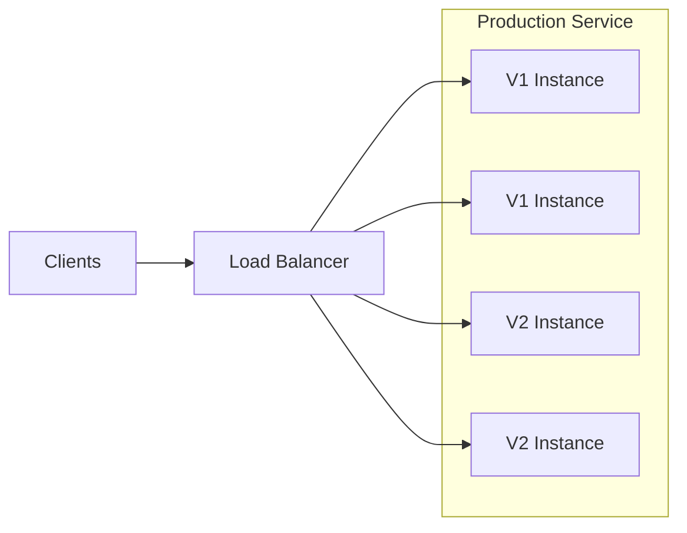
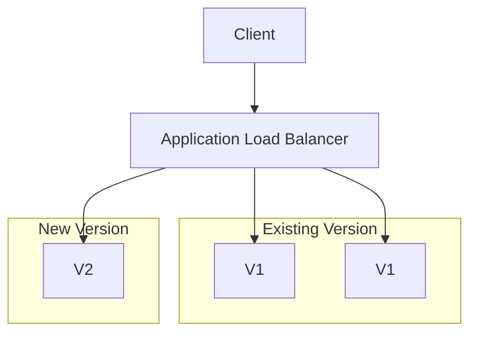
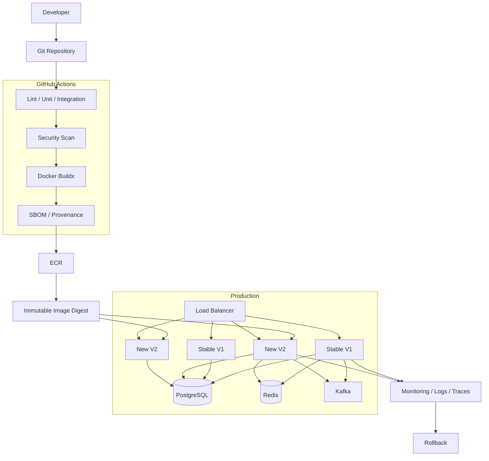

# 12- Rolling Deployment Architecture

## Overview

Rolling deployment replaces an application's existing production instances with a new version gradually rather than replacing the entire fleet at once.

A typical progression is:

```text
V1 V1 V1 V1
   ↓
V2 V1 V1 V1
   ↓
V2 V2 V1 V1
   ↓
V2 V2 V2 V1
   ↓
V2 V2 V2 V2
```

During the transition, both versions may serve production traffic simultaneously.

Rolling deployment is widely used with:

- Kubernetes Deployments.
- Amazon ECS services.
- VM-based applications behind load balancers.
- Auto Scaling Groups.
- Container platforms.
- Managed deployment platforms.

The key engineering challenge is **safe coexistence between old and new application versions**.

---

## Why Rolling Deployment Exists

A naive deployment can stop the existing application and then start the new version:

```text
Stop V1
  ↓
Deploy V2
  ↓
Start V2
```

This creates a potential availability gap.

A rolling deployment instead maintains enough healthy capacity while replacing instances:

```text
Existing Capacity
      ↓
Start V2
      ↓
Validate V2
      ↓
Remove V1
      ↓
Repeat
```

This reduces deployment downtime and avoids requiring a completely separate production environment.

---

## Rolling Deployment Architecture



During deployment, the load balancer sends traffic only to healthy instances.

As V2 instances become healthy, V1 instances can be removed progressively.

---

## Rolling Deployment Lifecycle

```text
Build
  ↓
Test
  ↓
Publish Immutable Artifact
  ↓
Start V2 Instance
  ↓
Health Check
  ↓
Route Traffic
  ↓
Remove V1 Instance
  ↓
Repeat
  ↓
Deployment Complete
```

A production rollout should never assume that "process started" means "application is ready."

---

## Core Components

A production rolling deployment normally includes:

| Component | Responsibility |
|---|---|
| CI/CD | Orchestrates deployment |
| Artifact Registry | Stores immutable application artifacts |
| Deployment Controller | Replaces instances |
| Load Balancer | Routes traffic |
| Health Checks | Determines readiness |
| Application Runtime | Executes the new version |
| Monitoring | Detects regressions |
| Rollback Mechanism | Restores stable version |

---

## Rolling Deployment vs Other Strategies

| Strategy | Deployment Model | Typical Strength | Main Trade-off |
|---|---|---|---|
| Rolling | Replace instances gradually | Efficient capacity usage | Mixed versions |
| Blue-Green | Separate full environments | Fast traffic switch | Higher infrastructure cost |
| Canary | Progressive traffic exposure | Controlled production exposure | Routing/analysis complexity |
| Recreate | Stop old, start new | Simple | Downtime |

Rolling deployment is particularly attractive when infrastructure capacity should remain efficient and the application can safely run multiple versions simultaneously.

---

## Rolling Deployment and Version Coexistence

During deployment:

```text
V1 ──┐
     ├── Shared Database
V2 ──┘
```

This means V1 and V2 may execute concurrently.

Therefore, application changes must generally be backward compatible during the transition.

This is one of the most important senior-level considerations.

---

## Backward Compatibility

A rolling deployment is unsafe if V2 immediately introduces changes that V1 cannot tolerate.

Examples:

- Removing a database column used by V1.
- Changing a Redis value format.
- Changing a Kafka event incompatibly.
- Removing an API field still used by V1.
- Changing authentication behavior.
- Replacing a shared configuration format.

Prefer additive changes first.

---

## Database Migration Strategy

Use an expand-contract pattern.

```text
Expand
  ↓
Deploy Compatible Application
  ↓
Migrate / Backfill
  ↓
Switch Application Behavior
  ↓
Contract
```

Example:

```text
Step 1:
Add new nullable column

Step 2:
Deploy V2

Step 3:
V2 starts using new column

Step 4:
Backfill data

Step 5:
Remove old column in a later release
```

Avoid destructive schema changes during the same rollout that introduces the application dependency.

---

## Django Rolling Deployment

A Django application may run:

```text
Load Balancer
      ↓
┌─────────────┐
│ Django V1   │
│ Django V1   │
│ Django V2   │
│ Django V2   │
└─────────────┘
      ↓
 PostgreSQL
      ↓
    Redis
```

Important considerations include:

- Django migrations.
- Session storage.
- Cache compatibility.
- Static assets.
- Celery workers.
- Application configuration.
- Database connection handling.

---

## FastAPI Rolling Deployment

For FastAPI:

```text
ALB / Nginx
      ↓
FastAPI V1 / V2
      ↓
PostgreSQL
      ↓
Redis
```

Readiness checks should verify that the application can actually serve requests.

A process listening on port `8000` is not necessarily ready to serve production traffic.

---

## Health Checks

Health checks typically operate at multiple levels.

### Liveness

Determines whether the process is alive.

```text
Is the application process running?
```

### Readiness

Determines whether the instance can safely receive traffic.

```text
Can this instance serve requests?
```

### Dependency Health

Determines whether required dependencies are available.

```text
Application
 ├── PostgreSQL
 ├── Redis
 └── External APIs
```

Do not blindly make every dependency mandatory for readiness. A dependency that is intentionally degraded may need different handling depending on the service's architecture.

---

## Example FastAPI Health Endpoints

```python
from fastapi import FastAPI

app = FastAPI()


@app.get("/health/live")
async def liveness():
    return {"status": "ok"}


@app.get("/health/ready")
async def readiness():
    # Production implementations should perform only
    # the checks required to establish serving readiness.
    return {"status": "ready"}
```

The load balancer should normally use the readiness endpoint for traffic decisions.

---

## Readiness Before Traffic

The desired sequence is:

```text
Start V2
   ↓
Application starts
   ↓
Readiness passes
   ↓
Load balancer marks healthy
   ↓
Traffic reaches V2
```

Avoid:

```text
Start V2
   ↓
Immediately send traffic
   ↓
Application still initializing
```

---

## Graceful Shutdown

When removing V1:

```text
Stop accepting new traffic
        ↓
Drain existing requests
        ↓
Finish in-flight work
        ↓
Shutdown process
```

This is particularly important for:

- Long-running HTTP requests.
- gRPC connections.
- WebSockets.
- Background workers.

---

## Connection Draining

A load balancer may stop sending new requests while existing connections continue.

Conceptually:

```text
V1
 │
 ├── Existing request ──→ complete
 │
 └── New request ──X
```

Only after draining should the instance be terminated.

---

## Long-Lived Connections

Rolling deployments are more complicated when applications use:

- WebSockets.
- Server-sent events.
- gRPC streams.
- Long polling.

A deployment may replace the underlying process while clients still have active connections.

Design for:

- Graceful shutdown.
- Connection draining.
- Client reconnection.
- Reasonable timeouts.
- Retry behavior.

---

## Rolling Deployment Parameters

A deployment controller commonly exposes parameters such as:

- Minimum healthy capacity.
- Maximum capacity.
- Batch size.
- Maximum unavailable instances.
- Maximum surge.
- Health-check grace period.
- Deployment timeout.

These parameters determine the rollout speed and availability characteristics.

---

## Capacity Model

Suppose production has:

```text
10 instances
```

A rollout might maintain:

```text
Minimum healthy = 8
```

This allows some instances to be replaced while maintaining sufficient capacity.

Another strategy may temporarily create additional instances:

```text
Existing: 10
Surge:     2
Total:    12
```

Then:

```text
Start V2
 ↓
Wait for healthy
 ↓
Remove V1
```

---

## Maximum Surge

Maximum surge determines how much additional capacity can be temporarily created.

Example:

```text
Desired = 10
Max Surge = 2
```

During deployment:

```text
10 V1
 ↓
10 V1 + 2 V2
 ↓
8 V1 + 2 V2
 ↓
...
```

Surge can improve availability but increases resource cost.

---

## Maximum Unavailable

Maximum unavailable determines how much existing capacity can be temporarily unavailable.

A larger value can accelerate deployment but increase availability risk.

A smaller value:

- Protects capacity.
- Slows deployment.
- Requires more deployment time.

---

## Deployment Speed vs Availability

Rolling deployments involve a trade-off:

```text
Faster rollout
     ↕
Lower temporary capacity
     ↕
Higher availability protection
```

Production values should be based on:

- Traffic.
- Capacity.
- Service criticality.
- Startup time.
- Health-check reliability.

---

## Load Balancer Architecture



As V2 becomes healthy, more V1 instances are replaced.

---

## AWS ECS Rolling Deployment

A common ECS architecture is:

```text
GitHub Actions
      ↓
ECR
      ↓
ECS Service
      ↓
Task Definition
      ↓
ECS Tasks
      ↓
ALB
```

The ECS service manages the desired task count and replaces tasks according to its deployment configuration.

---

## ECS Deployment Flow

```text
Build Docker Image
      ↓
Push Image to ECR
      ↓
Create New Task Definition Revision
      ↓
Update ECS Service
      ↓
Start New Tasks
      ↓
Health Checks
      ↓
Route Traffic
      ↓
Stop Old Tasks
```

The exact rollout behavior depends on the ECS deployment configuration and service setup.

---

## ECS Task Definition

The application image should be identified immutably where possible.

For example:

```text
123456789012.dkr.ecr.ap-south-1.amazonaws.com/orders-api@sha256:...
```

This is preferable to depending solely on a mutable tag such as:

```text
orders-api:latest
```

---

## Build Once, Deploy Many

The preferred CI/CD lifecycle is:

```text
Git Commit
   ↓
Build
   ↓
Test
   ↓
Docker Image
   ↓
ECR
   ↓
Immutable Digest
   ↓
Staging
   ↓
Production Rolling Deployment
```

Do not rebuild the application separately for production after validating another artifact.

---

## GitHub Actions Rolling Deployment

A simplified deployment workflow can look like:

```yaml
name: Deploy

on:
  workflow_dispatch:
    inputs:
      image-digest:
        description: Immutable ECR image digest
        required: true
        type: string

permissions:
  contents: read
  id-token: write

concurrency:
  group: production-orders-api
  cancel-in-progress: false

jobs:
  deploy:
    runs-on: ubuntu-latest

    environment:
      name: production

    steps:
      - name: Validate image digest
        env:
          IMAGE_DIGEST: ${{ inputs.image-digest }}
        run: |
          set -euo pipefail

          [[ "$IMAGE_DIGEST" == sha256:* ]] || {
            echo "Invalid image digest"
            exit 1
          }

      - name: Deploy ECS service
        env:
          IMAGE_DIGEST: ${{ inputs.image-digest }}
        run: |
          echo "Deploying $IMAGE_DIGEST"
          # Update the ECS task definition and service here.

      - name: Wait for deployment
        run: |
          aws ecs wait services-stable \
            --cluster production \
            --services orders-api

      - name: Record deployment
        env:
          IMAGE_DIGEST: ${{ inputs.image-digest }}
        run: |
          {
            echo "## Production Rolling Deployment"
            echo ""
            echo "- Artifact: $IMAGE_DIGEST"
            echo "- Commit: $GITHUB_SHA"
            echo "- Run: $GITHUB_RUN_ID"
          } >> "$GITHUB_STEP_SUMMARY"
```

The actual deployment implementation should update the ECS task definition with the validated artifact.

---

## AWS OIDC Authentication

GitHub Actions should avoid long-lived AWS credentials where possible.

The authentication flow is:

```text
GitHub Actions
      ↓
OIDC Token
      ↓
AWS STS
      ↓
IAM Role
      ↓
ECR / ECS
```

Typical permissions:

```yaml
permissions:
  contents: read
  id-token: write
```

The IAM trust policy should restrict which GitHub repository, branch, or environment can assume the role.

---

## ECS Health Validation

A successful ECS task launch is not sufficient.

Validate:

```text
Task Running
    ↓
Container Healthy
    ↓
Target Healthy
    ↓
Application Ready
    ↓
Traffic
```

Monitor:

- Target health.
- HTTP 5xx.
- Latency.
- Task restarts.
- CPU.
- Memory.
- Application logs.

---

## Kubernetes Rolling Deployment

Kubernetes provides a native rolling update mechanism for Deployments.

Example:

```yaml
apiVersion: apps/v1
kind: Deployment
metadata:
  name: orders-api
spec:
  replicas: 6
  strategy:
    type: RollingUpdate
    rollingUpdate:
      maxUnavailable: 1
      maxSurge: 1
  selector:
    matchLabels:
      app: orders-api
  template:
    metadata:
      labels:
        app: orders-api
    spec:
      containers:
        - name: orders-api
          image: example/orders-api@sha256:abc123
          ports:
            - containerPort: 8000
          readinessProbe:
            httpGet:
              path: /health/ready
              port: 8000
```

The controller gradually replaces old Pods with new ones.

---

## Kubernetes `maxUnavailable`

```yaml
maxUnavailable: 1
```

allows at most one desired replica to be unavailable during the update, subject to Kubernetes rollout semantics.

For a six-replica deployment:

```text
6 V1
 ↓
5 V1 + 1 V2
 ↓
4 V1 + 2 V2
 ↓
...
```

---

## Kubernetes `maxSurge`

```yaml
maxSurge: 1
```

allows an additional Pod above the desired replica count during the rollout.

This can provide additional capacity while the new version becomes ready.

---

## Kubernetes Readiness

A readiness probe is critical.

Without appropriate readiness behavior:

```text
Pod starts
 ↓
Marked available too early
 ↓
Traffic arrives
 ↓
Application not ready
```

With readiness:

```text
Pod starts
 ↓
Readiness fails
 ↓
No traffic
 ↓
Application becomes ready
 ↓
Traffic begins
```

---

## Rolling Deployment on EC2

For VM-based deployments:

```text
ALB
 ↓
Target Group
 ├── EC2 V1
 ├── EC2 V1
 ├── EC2 V2
 └── EC2 V2
```

The deployment system can:

1. Provision or update an instance.
2. Deploy the artifact.
3. Start the application.
4. Run health checks.
5. Register it with the target group.
6. Drain an old instance.
7. Terminate or retire the old instance.
8. Continue until the fleet is replaced.

---

## EC2 Release Directory Pattern

A useful deployment pattern is immutable release directories:

```text
/opt/orders-api/releases/
├── 20260930-120000/
├── 20260930-130000/
└── 20260930-140000/

current -> /opt/orders-api/releases/20260930-140000
```

The service points to the current release.

An atomic symlink switch can reduce partial deployment states.

---

## Systemd and Rolling Deployment

A Python service can run under systemd:

```ini
[Unit]
Description=Orders API
After=network.target

[Service]
User=orders
WorkingDirectory=/opt/orders-api/current
ExecStart=/opt/orders-api/current/.venv/bin/gunicorn \
    config.wsgi:application \
    --bind 127.0.0.1:8000
Restart=always

[Install]
WantedBy=multi-user.target
```

The deployment process should ensure the new release is healthy before removing the old serving capacity.

---

## Rolling Deployment with Nginx

A VM-based architecture might be:

```text
Internet
   ↓
Nginx / Load Balancer
   ↓
Application Instances
 ├── V1
 ├── V1
 └── V2
```

Nginx should only route traffic to instances that are ready.

---

## Rolling Deployment with Celery

Web application rollout and worker rollout should be considered separately.

```text
Django V2
   ↓
Celery Queue
   ↓
Worker V1 / Worker V2
```

Task payloads should remain compatible across versions during the transition.

A safer sequence may be:

```text
Deploy compatible worker
   ↓
Deploy application
   ↓
Promote application
   ↓
Remove old worker
```

---

## Kafka During Rolling Deployment

Kafka consumers may run mixed versions:

```text
Consumer V1
Consumer V2
     ↓
   Kafka
```

Event schemas must remain compatible.

Avoid simultaneously introducing:

```text
Producer V2
+
Consumer V2
+
Breaking schema
```

while V1 consumers are still active.

---

## API Compatibility

Suppose V1 returns:

```json
{
  "id": 100,
  "name": "Order"
}
```

Adding a field is generally easier to roll out safely:

```json
{
  "id": 100,
  "name": "Order",
  "status": "paid"
}
```

Removing or changing the meaning of existing fields can break clients still interacting with V1.

---

## gRPC Compatibility

gRPC rolling deployments require compatible protobuf contracts.

Prefer additive schema evolution.

Avoid immediately removing fields still used by older application instances.

Long-lived gRPC connections also require graceful draining.

---

## Redis During Rolling Deployment

Avoid incompatible cache serialization.

For significant format changes, use versioned keys:

```text
orders:v1:123
orders:v2:123
```

This prevents V2 from interpreting V1 data incorrectly.

---

## Session Management

A rolling deployment becomes more complicated when sessions are stored locally.

Avoid:

```text
Session stored only in local memory
```

because a request may move between versions or instances.

Prefer shared session storage such as Redis or a database when application requirements demand centralized session state.

---

## Static Assets

For Django deployments, static assets should be versioned or deployed in a way that remains compatible with both application versions.

A common architecture is:

```text
Application
   ↓
Object Storage / CDN
```

rather than relying on one local filesystem shared by all instances.

---

## Configuration Compatibility

Configuration changes should be backward compatible during the rollout.

For example:

```text
V1 understands:
FEATURE_MODE=v1

V2 understands:
FEATURE_MODE=v1
FEATURE_MODE=v2
```

This allows configuration to transition independently from application deployment.

---

## Feature Flags

Feature flags can reduce rollout coupling.

```text
Deploy V2
   ↓
Feature disabled
   ↓
Rolling replacement
   ↓
Enable feature
```

This separates:

- Code deployment.
- Runtime activation.

Feature flags should have ownership, expiration, and cleanup processes to avoid permanent configuration complexity.

---

## Rolling Deployment and Concurrency

Only one production deployment should normally control a service at a time.

```yaml
concurrency:
  group: production-orders-api
  cancel-in-progress: false
```

This prevents overlapping deployment controllers from modifying the same service simultaneously.

---

## Why `cancel-in-progress: false` for Production?

Suppose:

```text
Deployment A
   ↓
50% complete

Deployment B starts
```

Automatically cancelling A may leave the service in an intermediate state.

For production deployments, serializing deployments is often safer.

The exact policy depends on the deployment platform and whether a newer release can safely supersede an older one.

---

## Rolling Deployment State

A useful conceptual model is:

```text
Stable V1
   ↓
Rolling
   ↓
Mixed V1/V2
   ↓
Mostly V2
   ↓
Stable V2
```

Failure can transition to:

```text
Mixed V1/V2
      ↓
Rollback
      ↓
Stable V1
```

---

## Rollback Strategy

Rollback should use the previously validated immutable artifact.

```text
Current V2
   ↓
Failure
   ↓
Deploy V1 Artifact
   ↓
Health Check
   ↓
Restore Traffic
```

Do not depend on rebuilding the old source code during an incident.

---

## Fast Rollback

A good rollback mechanism should already know:

```text
Previous Artifact
Previous Configuration
Previous Deployment Metadata
```

This reduces recovery time.

---

## Database Rollback

Application rollback does not automatically mean database rollback.

Example:

```text
V1
 ↓
Schema Expand
 ↓
V2
 ↓
Rollback V2
```

If the schema expansion was backward compatible, V1 may continue working.

This is why expand-contract migrations are preferable.

---

## Rolling Deployment and Zero Downtime

Rolling deployment can support zero downtime when:

- Sufficient healthy capacity remains.
- New instances pass readiness checks.
- Old instances drain connections.
- Database changes are compatible.
- Load balancing is correct.
- Monitoring detects failures.

It is not automatically zero-downtime merely because instances are replaced gradually.

---

## Monitoring

Monitor both the deployment and application.

### Deployment Metrics

- Deployment duration.
- Number of healthy instances.
- Number of unhealthy instances.
- Replacement rate.
- Rollback count.

### Application Metrics

- Request rate.
- Error rate.
- p50 latency.
- p95 latency.
- p99 latency.
- CPU.
- Memory.
- Restarts.

### Dependency Metrics

- Database latency.
- Redis errors.
- Kafka lag.
- External API failures.

---

## Deployment Markers

Record deployment events:

```text
deployment.started
deployment.instance_replaced
deployment.health_check_passed
deployment.completed
deployment.rollback
```

Include:

```text
service
version
commit
artifact digest
environment
deployment ID
```

This makes production incidents easier to correlate with releases.

---

## Logs

Application logs should include release identity where practical:

```text
service=orders-api
version=2.4.0
commit=8f3a2d1
instance=i-012345
```

This helps identify whether an error is specific to V1 or V2.

---

## Distributed Tracing

For microservices, compare traces across deployment versions.

```text
API V2
 ↓
Orders V1
 ↓
Payments V1
 ↓
Database
```

Tracing can expose version-specific latency or dependency failures.

---

## Failure Domains

A rolling deployment can fail at multiple layers:

```text
CI
 ↓
Artifact
 ↓
Deployment Controller
 ↓
Instance Startup
 ↓
Health Check
 ↓
Load Balancer
 ↓
Application
 ↓
Database / Redis / Kafka
```

Troubleshoot from the first failed boundary rather than assuming the application code is responsible.

---

## Troubleshooting: New Instances Never Become Healthy

### Symptom

V2 instances start but remain unhealthy.

### Possible Causes

- Application startup failure.
- Incorrect environment variable.
- Missing secret.
- Wrong port.
- Failed database connection.
- Readiness probe failure.
- Security group issue.
- Incorrect container configuration.

### Isolation Strategy

```text
Instance
 → Process
 → Port
 → Health Endpoint
 → Dependency
 → Load Balancer
```

### Checks

```bash
docker ps
docker logs <container>
curl http://localhost:8000/health/ready
```

For Kubernetes:

```bash
kubectl get pods
kubectl describe pod <pod-name>
kubectl logs <pod-name>
```

---

## Troubleshooting: Deployment Causes 5xx Errors

### Possible Causes

- Application regression.
- Missing configuration.
- Database incompatibility.
- Redis incompatibility.
- Incorrect routing.
- Dependency failure.

### Isolation Strategy

Compare:

```text
V1 error rate
vs
V2 error rate
```

Then correlate errors with:

- Deployment timestamp.
- Endpoint.
- Instance.
- Dependency.
- Release version.

---

## Troubleshooting: Capacity Drops During Deployment

### Possible Causes

- Excessive `maxUnavailable`.
- Insufficient surge capacity.
- Slow application startup.
- Incorrect health checks.
- Autoscaling limits.
- Instance provisioning delays.

### Corrective Action

Review:

```text
Desired Capacity
Minimum Healthy Capacity
Max Surge
Max Unavailable
Startup Time
```

---

## Troubleshooting: Traffic Reaches Unhealthy Instances

### Possible Causes

- Incorrect health-check path.
- Health check returns success too early.
- Load balancer configuration.
- Readiness not implemented.
- Dependency failures not represented appropriately.

### Prevention

Use a readiness endpoint that reflects actual serving capability.

---

## Troubleshooting: Old Instances Never Terminate

### Possible Causes

- New instances are not healthy.
- Deployment controller is waiting.
- Health check configuration is incorrect.
- Capacity constraints prevent replacement.
- Deployment timeout.

The first question should be:

```text
Why does the controller believe the new capacity is not ready?
```

---

## Troubleshooting: Deployment Stalls

Check:

```text
Deployment Controller
      ↓
Instance State
      ↓
Health State
      ↓
Load Balancer
      ↓
Autoscaling
      ↓
Resource Quotas
```

For AWS:

```bash
aws ecs describe-services \
  --cluster production \
  --services orders-api
```

For Kubernetes:

```bash
kubectl rollout status deployment/orders-api
kubectl rollout history deployment/orders-api
```

---

## Troubleshooting: ECS Deployment

Inspect service:

```bash
aws ecs describe-services \
  --cluster production \
  --services orders-api
```

Inspect task:

```bash
aws ecs describe-tasks \
  --cluster production \
  --tasks <task-arn>
```

Check target health:

```bash
aws elbv2 describe-target-health \
  --target-group-arn <target-group-arn>
```

---

## Troubleshooting: Kubernetes Deployment

Check rollout:

```bash
kubectl rollout status deployment/orders-api
```

Inspect:

```bash
kubectl describe deployment orders-api
```

Inspect Pods:

```bash
kubectl get pods
```

Read logs:

```bash
kubectl logs <pod-name>
```

Rollback:

```bash
kubectl rollout undo deployment/orders-api
```

---

## Troubleshooting: EC2 Deployment

Check service:

```bash
sudo systemctl status orders-api
```

Read logs:

```bash
journalctl -u orders-api --since "10 minutes ago"
```

Check listening ports:

```bash
ss -lntp
```

Check health endpoint:

```bash
curl --fail http://127.0.0.1:8000/health/ready
```

---

## GitHub CLI Operations

List workflows:

```bash
gh workflow list
```

List deployment runs:

```bash
gh run list --workflow=deploy.yml
```

Inspect a run:

```bash
gh run view <run-id>
```

Inspect logs:

```bash
gh run view <run-id> --log
```

Trigger deployment:

```bash
gh workflow run deploy.yml \
  -f image-digest=sha256:abc123
```

Rerun a failed workflow:

```bash
gh run rerun <run-id>
```

---

## Security Considerations

Rolling deployments do not reduce the security requirements of production deployment.

Protect:

- Deployment workflows.
- AWS credentials.
- IAM roles.
- Production environments.
- Artifact registries.
- Self-hosted runners.
- Deployment APIs.

Use:

- Least-privilege permissions.
- OIDC for AWS.
- Protected environments.
- Trusted actions.
- SHA pinning where appropriate.
- Immutable artifacts.
- Audit logging.

---

## GitHub Actions Permissions

A deployment workflow might require:

```yaml
permissions:
  contents: read
  id-token: write
```

Avoid broad permissions such as unrestricted repository write access unless required.

Separate build permissions from deployment permissions when possible.

---

## Environment Protection

Production should generally be represented as a protected environment.

Conceptually:

```text
Build
 ↓
Staging
 ↓
Production Environment
 ↓
Approval / Protection
 ↓
Rolling Deployment
```

Environment protection provides an explicit boundary between CI and production deployment.

---

## Self-Hosted Runners

If deployment requires access to a private network:

```text
GitHub Actions
      ↓
Self-hosted Runner
      ↓
Private Network
      ↓
ECS / EC2 / Kubernetes
```

Use dedicated deployment runners rather than allowing untrusted PR workloads to execute on privileged production-connected machines.

Ephemeral runners can reduce persistent-state and credential risks.

---

## Artifact Security

The deployment should verify that the artifact being deployed is the intended artifact.

Record:

```text
Commit SHA
Artifact Digest
Build ID
Workflow Run
Deployment ID
```

This supports traceability.

---

## Supply Chain Security

A production rolling deployment should ideally have:

- Dependency scanning.
- Container scanning.
- SBOM generation.
- Artifact provenance.
- Attestations.
- Controlled action dependencies.

The deployment system should not blindly trust a mutable artifact tag.

---

## Immutable Image Identity

Prefer:

```text
image@sha256:<digest>
```

over:

```text
image:latest
```

A digest identifies the exact artifact.

Tags remain useful for human-oriented release management, but deployment identity should be immutable.

---

## Reliability Considerations

A rolling deployment introduces a temporary mixed-version state.

The system must remain correct during:

```text
V1 + V2
```

This affects:

- Database schemas.
- APIs.
- Events.
- Cache formats.
- Background tasks.
- Configuration.
- Authentication.

Compatibility should be treated as a deployment requirement rather than an optional optimization.

---

## High Availability

Production rolling deployments should:

- Spread instances across availability zones.
- Maintain sufficient healthy capacity.
- Use redundant load balancing.
- Avoid single-instance bottlenecks.
- Use readiness and health checks.
- Support graceful shutdown.
- Preserve rollback capacity.

---

## Cost Considerations

Rolling deployments can be cheaper than blue-green because they may not require a complete duplicate environment.

However, surge capacity can temporarily increase costs.

Example:

```text
Desired = 20
Max Surge = 4
```

The deployment may temporarily require up to 24 instances.

Balance:

```text
Deployment Speed
+
Availability
+
Capacity Cost
```

---

## Disaster Recovery

Rolling deployment is not a disaster recovery strategy.

DR still requires:

- Backups.
- Replication.
- Recovery procedures.
- Infrastructure recovery.
- Artifact availability.
- Configuration recovery.
- Database recovery.

A deployment rollback cannot recover infrastructure destroyed by a regional outage.

---

## Multi-Region Rolling Deployment

For multi-region systems:

```text
Region A
 ├── V1
 └── V2

Region B
 └── V1

Region C
 └── V1
```

A region can be upgraded and validated before continuing to other regions.

This reduces geographic blast radius.

---

## Regional Rollout Strategy

A production rollout can use:

```text
Region A
   ↓
Validate
   ↓
Region B
   ↓
Validate
   ↓
Region C
```

This resembles canary at the regional level while still using rolling replacement within each region.

---

## Rolling Deployment for Microservices

A microservice deployment should consider service dependencies:

```text
Orders V2
   ↓
Payments V1
   ↓
Inventory V1
```

The deployment must not assume that every dependent service is upgraded simultaneously.

Prefer backward-compatible API and event contracts.

---

## Monorepo Considerations

A monorepo may contain:

```text
services/
├── orders/
├── payments/
├── inventory/
└── users/
```

Only affected services should normally be deployed.

Change detection can determine:

```text
orders/ changed
     ↓
Deploy orders
```

Avoid unnecessarily rolling unrelated services.

---

## Deployment Observability

A production deployment dashboard should expose:

```text
Deployment
├── Version
├── Commit
├── Artifact Digest
├── Desired Capacity
├── Healthy Capacity
├── Deployment Progress
├── Error Rate
├── Latency
├── CPU
├── Memory
└── Rollback Status
```

This lets operators understand both deployment state and application health.

---

## Deployment Metadata

Record:

```text
service=orders-api
environment=production
version=2.4.0
commit=8f3a2d1
image=sha256:abc123
deployment_id=deploy-20260930-001
```

This metadata should be searchable in logs and monitoring systems.

---

## Production Deployment Runbook

### Pre-Deployment

- [ ] CI completed successfully.
- [ ] Integration tests passed.
- [ ] Security checks passed.
- [ ] Immutable artifact exists.
- [ ] Artifact digest verified.
- [ ] Database compatibility confirmed.
- [ ] Rollback artifact available.
- [ ] Monitoring is healthy.
- [ ] Production capacity is sufficient.

### Deployment

- [ ] Start new instances.
- [ ] Wait for readiness.
- [ ] Validate health.
- [ ] Route traffic.
- [ ] Drain old instances.
- [ ] Repeat replacement.

### Validation

- [ ] Error rate normal.
- [ ] Latency normal.
- [ ] Dependency health normal.
- [ ] Resource usage normal.
- [ ] No unexpected restarts.
- [ ] Business metrics normal where applicable.

### Completion

- [ ] All instances run the intended artifact.
- [ ] Old instances are removed.
- [ ] Deployment metadata recorded.
- [ ] Monitoring remains healthy.

### Failure

- [ ] Stop rollout.
- [ ] Preserve evidence.
- [ ] Restore stable artifact if required.
- [ ] Validate health.
- [ ] Investigate root cause.
- [ ] Record incident findings.

---

## Common Mistakes

### Treating Process Startup as Readiness

```text
Process running ≠ Application ready
```

Use readiness checks.

### Making Destructive Database Changes

V1 may still be running when V2 starts.

Use expand-contract migrations.

### Deploying Mutable Tags

```text
latest
```

can point to different artifacts.

Use immutable digests.

### Ignoring Connection Draining

Abruptly terminating instances can break active requests.

Use graceful shutdown and draining.

### Assuming Rollback Means Git Revert

A source-code revert does not automatically restore:

- Artifact.
- Database.
- Cache.
- Queue.
- Infrastructure.

Rollback should be an explicit operational capability.

### Allowing Concurrent Production Deployments

Two deployment controllers can corrupt the intended rollout state.

Use deployment concurrency.

### Ignoring Worker Compatibility

Celery and Kafka workloads may continue processing messages during application deployment.

Design mixed-version compatibility.

### Insufficient Capacity

Replacing too many instances at once can cause an availability incident.

Tune deployment capacity parameters.

---

## Senior Design Trade-offs

### Rolling vs Blue-Green

Rolling generally uses less duplicate infrastructure but requires mixed-version compatibility.

Blue-green provides cleaner environment separation but often requires additional capacity.

### Rolling vs Canary

Rolling replaces instances gradually.

Canary explicitly controls traffic exposure and is better suited to progressive production validation.

### Faster vs Safer Rollout

A large replacement batch:

```text
Fast
+
Lower deployment duration
-
Higher temporary risk
```

A small batch:

```text
Slower
+
Smaller failure domain
```

### Surge vs Cost

More surge capacity can improve availability and deployment speed but increases temporary infrastructure cost.

### Health Checks vs Startup Time

Very aggressive health checks can incorrectly terminate slow-starting but healthy instances.

Very permissive health checks can route traffic to unhealthy instances.

---

## Interview Scenarios

### What Is Rolling Deployment?

Explain that instances are replaced gradually while maintaining sufficient healthy capacity.

### How Is Rolling Deployment Different From Canary?

Rolling focuses on replacing runtime instances progressively. Canary focuses on progressively exposing traffic to a new version.

### How Do You Achieve Zero Downtime?

Use sufficient healthy capacity, readiness checks, connection draining, graceful shutdown, backward-compatible changes, and correct load-balancer behavior.

### Why Must Database Changes Be Backward Compatible?

Because V1 and V2 may run simultaneously and access the same database.

### How Would You Deploy a Django Application?

Build an immutable image, run tests, publish it, update the deployment, wait for readiness, progressively replace old instances, monitor health, and retain the previous artifact for rollback.

### How Would You Deploy a FastAPI Application?

Use readiness probes, graceful shutdown, appropriate worker configuration, immutable artifacts, and controlled instance replacement behind a load balancer.

### How Would You Handle Celery?

Ensure task payloads remain compatible while old and new workers coexist.

### How Would You Handle Kafka?

Maintain compatible event schemas while old and new consumers or producers coexist.

### How Would You Prevent Concurrent Production Deployments?

Use a production-specific concurrency group:

```yaml
concurrency:
  group: production-orders-api
  cancel-in-progress: false
```

### How Would You Roll Back?

Restore the previously validated immutable artifact and roll it out using the same deployment mechanism.

### Why Is `latest` Dangerous?

The tag is mutable and does not uniquely identify the artifact that was validated.

### What Happens If New Instances Never Become Healthy?

Investigate the failure boundary:

```text
Process
→ Port
→ Health Endpoint
→ Dependency
→ Load Balancer
→ Deployment Controller
```

### How Does Rolling Deployment Work on Kubernetes?

A Deployment gradually replaces Pods according to `maxUnavailable` and `maxSurge`, while readiness probes determine whether new Pods can receive traffic.

### How Does Rolling Deployment Work on ECS?

The ECS service starts replacement tasks, validates their health, shifts service capacity toward the new task definition revision, and retires old tasks according to deployment configuration.

### How Does OIDC Fit Into the Pipeline?

GitHub Actions obtains an OIDC token and exchanges it through AWS STS for temporary credentials associated with a restricted IAM role.

### What Is the Biggest Rolling Deployment Risk?

Mixed-version incompatibility. The application, database, cache, API, event, and background-task contracts must remain compatible during the rollout.

## Production Reference Architecture



## Key Takeaways

- **Rolling deployment replaces production instances progressively**, maintaining enough healthy capacity while old and new versions coexist.
- **Backward compatibility is the central design requirement** because V1 and V2 can simultaneously interact with databases, caches, APIs, Kafka, and Celery.
- **Readiness checks, graceful shutdown, connection draining, and capacity controls are essential** for reliable zero-downtime rollouts.
- **Build once and deploy the same immutable artifact**, preferably identified by a digest, across staging and production; retain the previous artifact for fast rollback.
- **Production rolling deployments require controlled concurrency, least-privilege deployment access, strong observability, and explicit rollback procedures.**