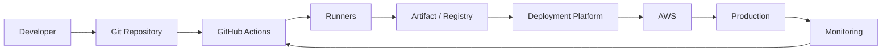
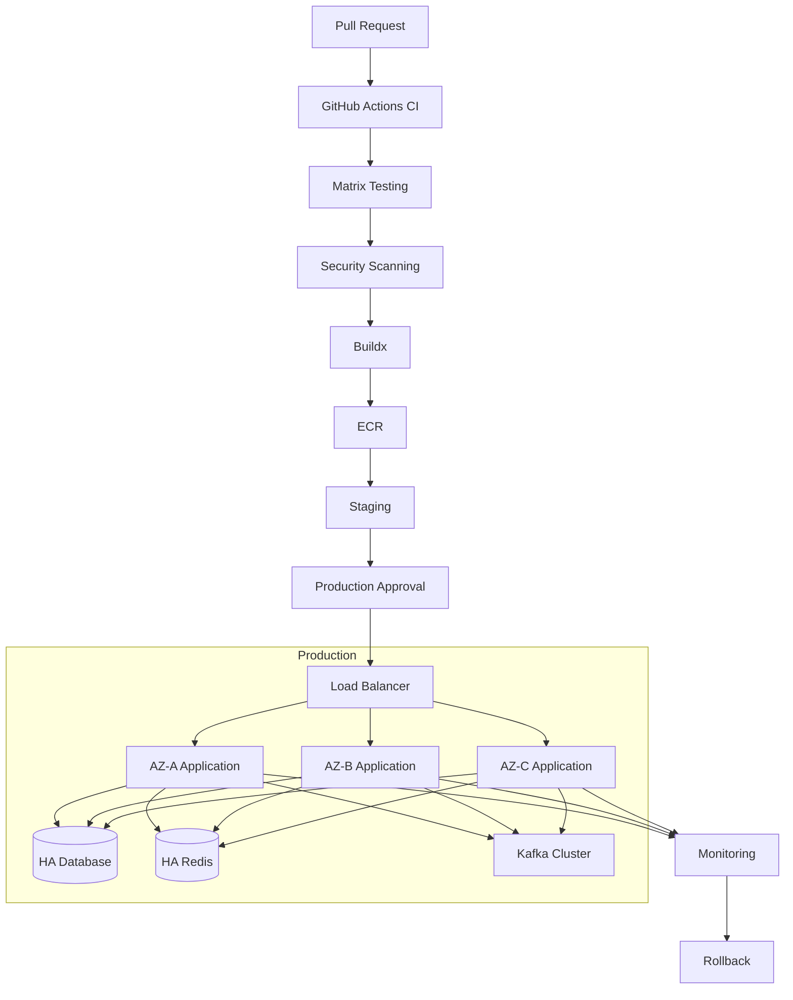

# 13- High Availability CI CD Design

## Overview

High availability (HA) in CI/CD means designing the delivery system so that software can continue to be built, validated, promoted, and recovered even when individual components fail.

A production CI/CD platform should not depend on a single:

- Runner.
- Workflow execution.
- Artifact store.
- Deployment path.
- AWS account or region.
- Deployment controller.
- External dependency.
- Human operator.

A useful production pipeline is:

```text
Pull Request
    ↓
Lint
    ↓
Unit Tests
    ↓
Integration Tests
    ↓
Security Scan
    ↓
Matrix Testing
    ↓
Build
    ↓
Immutable Artifact
    ↓
Registry
    ↓
Staging
    ↓
Approval
    ↓
Production
    ↓
Monitoring
    ↓
Rollback
```

High availability does **not** mean that every component must be multi-region or duplicated indefinitely. It means identifying critical failure domains, defining acceptable recovery behavior, and removing unnecessary single points of failure.

---

## What High Availability Means in CI/CD

For a backend system, application HA usually means that production traffic can continue when infrastructure components fail.

For CI/CD, HA additionally means that the organization can continue to:

- Validate code.
- Produce trusted artifacts.
- Deploy approved releases.
- Roll back failed releases.
- Recover the delivery platform itself.

A CI/CD system can therefore have several availability dimensions:

| Dimension | Question |
|---|---|
| CI availability | Can developers run builds and tests? |
| Artifact availability | Can validated artifacts be retrieved? |
| Deployment availability | Can production deployments execute? |
| Credential availability | Can workflows authenticate securely? |
| Runner availability | Is execution capacity available? |
| Observability availability | Can operators determine deployment state? |
| Recovery availability | Can the system recover after failure? |

---

## Availability vs Reliability

These concepts are related but different.

### Availability

Availability asks:

```text
Can the system perform the required operation now?
```

### Reliability

Reliability asks:

```text
Does the system continue performing correctly over time?
```

A CI pipeline that is available but produces inconsistent artifacts is not reliable.

A deployment platform that is reliable but unavailable for several hours is also operationally problematic.

Production CI/CD requires both.

---

## CI/CD Failure Domains

A useful architecture begins by identifying failure domains.



Each boundary can fail independently.

For example:

```text
GitHub available
      ↓
Runner unavailable
      ↓
Workflow queued
```

or:

```text
CI successful
      ↓
Artifact unavailable
      ↓
Deployment cannot start
```

or:

```text
Deployment successful
      ↓
Application unhealthy
      ↓
Rollback required
```

---

## Single Points of Failure

A single point of failure is a component whose failure can prevent the required CI/CD operation.

Common examples include:

- One persistent self-hosted runner.
- One deployment server.
- One artifact repository.
- One private network path.
- One manually maintained deployment credential.
- One production deployment workflow owned by a single repository.
- One region for critical deployment dependencies.
- One database migration operator.
- One undocumented rollback procedure.

The objective is not to eliminate every possible failure. The objective is to eliminate **unacceptable** single points of failure.

---

## HA Design Principles

A production CI/CD platform should generally follow these principles:

1. Remove unnecessary single points of failure.
2. Keep artifacts immutable.
3. Make workflow execution repeatable.
4. Make deployments idempotent.
5. Separate CI from privileged CD.
6. Use temporary credentials.
7. Use redundant runner capacity where self-hosted infrastructure is required.
8. Preserve deployment history.
9. Make rollback independent from rebuilding source code.
10. Monitor the delivery system itself.
11. Define recovery procedures.
12. Control deployment concurrency.
13. Isolate failure domains.
14. Prefer automation over manual recovery.

---

## GitHub Actions Availability Model

GitHub Actions provides managed workflow orchestration, but enterprise architectures may still depend on:

- GitHub repository availability.
- GitHub Actions execution capacity.
- GitHub-hosted runners.
- Self-hosted runners.
- Package registries.
- Artifact storage.
- Container registries.
- AWS APIs.
- Private networks.
- DNS.
- Authentication systems.

The CI/CD architecture should distinguish between dependencies controlled by the organization and dependencies provided externally.

---

## GitHub-Hosted vs Self-Hosted Runners

| Characteristic | GitHub-hosted | Self-hosted |
|---|---|---|
| Infrastructure management | Low | High |
| Custom software | Limited to configured job/runtime | Full control |
| Private network access | Requires supported connectivity architecture | Directly possible |
| Capacity management | Mostly managed | Organization responsibility |
| Persistent state risk | Lower | Higher |
| Autoscaling responsibility | Lower | Higher |
| Security responsibility | Lower infrastructure responsibility | Higher |
| Operational complexity | Lower | Higher |

For many CI workloads, GitHub-hosted runners reduce infrastructure failure domains.

Self-hosted runners are useful when private network access, custom software, specialized hardware, or internal infrastructure is required.

---

## Self-Hosted Runner HA

A production self-hosted runner architecture should not look like:

```text
GitHub Actions
      ↓
Runner-01
```

Instead:

```text
GitHub Actions
      ↓
Runner Group
 ├── Runner-01
 ├── Runner-02
 ├── Runner-03
 └── Runner-04
```

If one runner fails, another can execute the workflow.

---

## Runner Groups

Runner groups provide an organizational boundary around execution capacity.

Typical groups might include:

```text
ci-linux
ci-windows
private-network
production-deployment
security
specialized-build
```

Deployment runners should normally be separated from general-purpose CI runners.

---

## Ephemeral Runners

Persistent runners can retain:

- Source code.
- Credentials.
- Build artifacts.
- Temporary files.
- Docker layers.
- Package caches.

An ephemeral runner can instead follow:

```text
Provision
   ↓
Register
   ↓
Execute One Workload
   ↓
Collect Required Output
   ↓
Destroy
```

This reduces persistent-state and cross-job contamination risks.

---

## Runner Autoscaling

Self-hosted capacity should scale with workload where appropriate.

```text
Workflow Queue
      ↓
Capacity Controller
      ↓
Runner Provisioning
      ↓
Runner Group
 ├── Runner
 ├── Runner
 └── Runner
```

Important parameters include:

- Minimum runners.
- Maximum runners.
- Scale-up threshold.
- Scale-down threshold.
- Provisioning time.
- Warm capacity.
- Resource class.

---

## Runner Failure Handling

A runner should be considered disposable infrastructure when practical.

If a runner becomes unhealthy:

```text
Detect
  ↓
Drain
  ↓
Stop Scheduling
  ↓
Replace
  ↓
Validate
  ↓
Return Capacity
```

Do not depend on manually repairing a corrupted runner indefinitely.

---

## Runner Capacity Planning

Runner capacity should account for:

```text
Peak Concurrent Jobs
+
Deployment Workloads
+
Retry Capacity
+
Failure Capacity
```

For example, if normal demand is 20 concurrent jobs, operating exactly 20 runners leaves no capacity for failures or bursts.

Capacity planning should consider the workload's actual concurrency and provisioning model rather than using an arbitrary fixed buffer.

---

## CI Availability

CI should continue operating when an individual test job fails.

This is different from infrastructure failure.

For example:

```text
Matrix
 ├── Python 3.11 → Pass
 ├── Python 3.12 → Pass
 ├── Python 3.13 → Fail
 └── Python 3.14 → Pass
```

The workflow should preserve enough information to identify the failed compatibility dimension.

---

## Matrix Failure Isolation

A matrix should avoid unnecessarily coupling unrelated jobs.

Example:

```yaml
strategy:
  fail-fast: false
  matrix:
    python-version:
      - "3.11"
      - "3.12"
      - "3.13"
```

`fail-fast: false` allows remaining matrix jobs to complete after one job fails.

This is particularly useful when complete diagnostic information is more valuable than immediate cancellation.

---

## Fan-Out and Fan-In

A production CI pipeline can use:

```text
             ┌── Unit Tests ───────┐
             │                     │
Commit ──────┼── Integration ──────┼── Build
             │                     │
             └── Security ────────┘
```

The build stage should depend on the required validation jobs.

Example:

```yaml
build:
  needs:
    - unit
    - integration
    - security
```

This prevents an artifact from being promoted before required validation completes.

---

## Failure Isolation

A strong CI/CD system isolates failures.

For example:

```text
Unit Test Failure
      ↓
Build Not Promoted
      ↓
Existing Production Unchanged
```

The failure should not affect already deployed production artifacts.

This is an important property of safe CI/CD architecture.

---

## Artifact Availability

Artifacts are critical infrastructure.

A production deployment should not depend on rebuilding the application from source during an incident.

Preferred model:

```text
Source
  ↓
Build
  ↓
Immutable Artifact
  ↓
Artifact Registry
  ↓
Staging
  ↓
Production
```

The same artifact should be promoted between environments.

---

## Artifact Immutability

An artifact should have a stable identity.

For container images:

```text
repository/image@sha256:<digest>
```

For release artifacts:

```text
orders-api-2.4.0.tar.gz
```

Avoid replacing an artifact with different contents under the same production identity.

---

## Artifact Replication

For critical systems, consider the availability of the artifact registry itself.

Conceptually:

```text
Build
  ↓
Primary Registry
  ↓
Replication
  ├── Region A
  └── Region B
```

The exact replication mechanism depends on the registry and organizational architecture.

The important property is that an unavailable registry location should not permanently eliminate the ability to deploy a previously validated release.

---

## Artifact Retention

Retain enough release history to support operational rollback.

A useful retention policy should consider:

- Release frequency.
- Compliance.
- Storage cost.
- Rollback requirements.
- Incident investigation.
- Disaster recovery.

Deleting the previous production artifact immediately after deployment can make rollback unnecessarily difficult.

---

## Artifact vs Cache

Artifacts and caches have different reliability requirements.

| Property | Artifact | Cache |
|---|---|---|
| Purpose | Preserve output | Improve speed |
| Reproducibility | Required | Not required |
| Loss impact | Potential deployment failure | Usually performance degradation |
| Identity | Stable | Key-based |
| Retention | Release-driven | Optimization-driven |

A deployment must never depend on a cache being available.

---

## Build Reproducibility

A reliable build should be reproducible from:

```text
Source Commit
+
Dependency Locks
+
Build Configuration
+
Known Toolchain
```

Avoid hidden dependencies on:

- Local developer machines.
- Mutable external downloads.
- Unpinned dependencies.
- Persistent runner state.

---

## Docker Build HA

Docker builds should use:

- Deterministic inputs.
- BuildKit / Buildx.
- Dependency lock files.
- Controlled base images.
- Appropriate cache configuration.
- Immutable artifact identity.

Example:

```text
Git Commit
    ↓
Buildx
    ↓
Image
    ↓
Scan
    ↓
SBOM / Provenance
    ↓
ECR
```

---

## Docker Cache Failure

A cache should accelerate a build but should not be required for correctness.

```text
Cache available
   ↓
Fast build

Cache unavailable
   ↓
Slower build
   ↓
Still succeeds
```

This is an important HA property.

---

## CI Dependency Failures

CI frequently depends on external services:

- Python package indexes.
- npm registries.
- Docker registries.
- GitHub APIs.
- AWS APIs.
- Security scanners.

Do not treat every external dependency as equally critical.

Use:

- Dependency caching.
- Internal mirrors where appropriate.
- Retry policies for transient failures.
- Explicit timeouts.
- Fallback strategies where justified.

Avoid unlimited retries.

---

## Retry Design

Retries are useful for transient failures.

They are dangerous when used to hide deterministic failures.

Bad pattern:

```text
Failure
 ↓
Retry forever
```

Better:

```text
Failure
 ↓
Classify
 ├── Transient → bounded retry
 └── Deterministic → fail fast
```

---

## Idempotency

Deployment operations should be safe to retry.

For example:

```text
Update ECS service to artifact X
```

should converge toward the same desired state when executed more than once.

Idempotency is essential for recovery because operators frequently rerun failed deployment workflows.

---

## Deployment Availability

Production deployment availability depends on:

```text
Workflow
  ↓
Runner
  ↓
AWS Authentication
  ↓
Artifact
  ↓
Deployment API
  ↓
Production Infrastructure
```

Every dependency must either be reliable enough for the required objective or have an explicit recovery path.

---

## AWS OIDC

GitHub Actions should use OIDC rather than long-lived AWS access keys where appropriate.

```text
GitHub Actions
      ↓
OIDC Token
      ↓
AWS STS
      ↓
IAM Role
      ↓
ECR / ECS / EC2 / S3
```

Typical permissions:

```yaml
permissions:
  contents: read
  id-token: write
```

The IAM trust policy should restrict the repository and relevant branch or environment.

---

## AWS Account Separation

For larger organizations:

```text
Management
    │
    ├── Development Account
    ├── Staging Account
    └── Production Account
```

A compromise of a development workflow should not automatically provide production deployment privileges.

Account separation reduces blast radius.

---

## Deployment Role Separation

Separate build and deployment permissions where practical.

Example:

```text
Build Role
 ├── ECR Push
 └── Artifact Operations

Production Role
 ├── ECS Update
 └── Deployment Validation
```

The production role should not automatically receive broad administrative access.

---

## Environment Protection

Production deployments should use environment protection where appropriate.

```text
Build
 ↓
Staging
 ↓
Production Environment
 ↓
Approval / Protection
 ↓
Deploy
```

This creates a deliberate control point before production mutation.

---

## Deployment Concurrency

Only one deployment should normally modify a production service at a time.

```yaml
concurrency:
  group: production-orders-api
  cancel-in-progress: false
```

This prevents:

```text
Deployment A
      +
Deployment B
      ↓
Conflicting Desired State
```

---

## Why Cancellation Policy Matters

For pull requests, cancelling older runs is often useful:

```yaml
concurrency:
  group: pr-${{ github.event.pull_request.number }}
  cancel-in-progress: true
```

For production deployment, cancellation requires more caution:

```yaml
concurrency:
  group: production-orders-api
  cancel-in-progress: false
```

A production deployment should generally complete or explicitly roll back rather than being arbitrarily interrupted by another deployment.

---

## Rolling Deployment HA

A rolling deployment can maintain application availability by keeping healthy capacity during replacement.

```text
V1 V1 V1 V1
 ↓
V2 V1 V1 V1
 ↓
V2 V2 V1 V1
 ↓
V2 V2 V2 V1
 ↓
V2 V2 V2 V2
```

Required controls include:

- Readiness checks.
- Health checks.
- Graceful shutdown.
- Connection draining.
- Capacity constraints.
- Deployment timeouts.
- Rollback.

---

## Blue-Green HA

Blue-green maintains two environments.

```text
              Load Balancer
                   ↓
             Active Environment
              /           \
           Blue           Green
```

Deployment:

```text
Blue V1
  ↓
Deploy Green V2
  ↓
Validate
  ↓
Switch Traffic
```

The unused environment can provide a fast rollback target.

The primary trade-off is additional infrastructure capacity.

---

## Canary HA

Canary deployment gradually exposes traffic.

```text
V1 ─────────────── 95%
V2 ───────────────  5%
```

If metrics remain healthy:

```text
V1 ─────────────── 75%
V2 ─────────────── 25%
```

Then:

```text
V1 ─────────────── 0%
V2 ─────────────── 100%
```

Canary reduces the immediate blast radius of a new release but requires stronger traffic management and analysis.

---

## Rolling vs Blue-Green vs Canary

| Property | Rolling | Blue-Green | Canary |
|---|---|---|---|
| Duplicate capacity | Lower | Higher | Variable |
| Mixed versions | Yes | Usually isolated | Yes |
| Traffic control | Instance-level | Environment switch | Traffic percentage |
| Rollback | Moderate | Fast | Progressive |
| Infrastructure cost | Lower | Higher | Variable |
| Operational complexity | Moderate | Moderate | Higher |
| Blast-radius control | Moderate | Environment-level | Strong progressive control |

---

## Database HA

CI/CD availability is meaningless if the deployment process depends on an unavailable database.

Production database architecture should consider:

- Multi-AZ deployment.
- Backups.
- Replication.
- Connection pooling.
- Failover.
- Recovery procedures.

CI/CD workflows should avoid unnecessary direct database dependencies.

---

## Database Migration Availability

Migrations should be designed around rolling deployments.

Prefer:

```text
Expand
 ↓
Deploy Compatible Code
 ↓
Backfill
 ↓
Switch Behavior
 ↓
Contract
```

Avoid:

```text
Drop Column
 ↓
Deploy Application
```

when old application instances may still reference the column.

---

## Redis HA

If Redis is part of the production architecture, consider:

- Replication.
- Automatic failover.
- Appropriate persistence.
- Connection handling.
- Client retry behavior.
- Cache-vs-state semantics.

Do not assume cache loss is harmless if Redis is actually being used as durable application state.

---

## Kafka HA

Kafka-based systems should consider:

- Multiple brokers.
- Replication factor.
- Consumer group behavior.
- Partition availability.
- Consumer lag.
- Schema compatibility.

A deployment should not create a consumer outage merely because workers are being replaced.

---

## Celery HA

A Celery architecture should consider:

```text
Django / FastAPI
      ↓
Broker
      ↓
Worker Pool
 ├── Worker
 ├── Worker
 └── Worker
```

Worker capacity should tolerate individual worker failures.

Task processing should be designed around idempotency where retries can occur.

---

## Nginx and Load Balancer HA

Avoid:

```text
Internet
   ↓
One Nginx Server
   ↓
Application
```

For critical systems, use redundant load-balancing infrastructure.

The exact architecture may use:

- AWS load balancers.
- Multiple Nginx instances.
- Kubernetes ingress.
- Service mesh components.

The important property is that one proxy instance should not become the entire production availability boundary.

---

## Private Network HA

Self-hosted runners may need access to:

- Private databases.
- Internal APIs.
- ECS.
- Kubernetes.
- Internal package registries.

A private CI/CD path should consider:

```text
Runner
 ↓
Network
 ├── DNS
 ├── Routing
 ├── Security Groups
 ├── NAT / VPC Endpoints
 └── Service
```

A network dependency can become a CI/CD single point of failure.

---

## DNS Dependency

CI/CD and deployment systems frequently depend on DNS.

Failures can affect:

- Package downloads.
- Container registries.
- AWS APIs.
- Internal services.
- Database endpoints.

Private runners should have resilient DNS configuration.

---

## Security and HA

Security controls should not be bypassed simply to recover availability.

Avoid emergency patterns such as:

```text
Deployment failing
 ↓
Disable IAM restrictions
 ↓
Use permanent administrator credentials
```

Prefer a documented break-glass mechanism with:

- Restricted access.
- Temporary credentials.
- Audit logging.
- Explicit ownership.
- Post-incident review.

---

## Break-Glass Access

A break-glass procedure should answer:

```text
Who can activate it?
Why?
How?
For how long?
What permissions are granted?
How is it audited?
How are credentials revoked?
```

Break-glass access should be treated as an exceptional operational path.

---

## Secrets Availability

A deployment may fail because a required secret is unavailable.

Separate:

```text
Secret existence
Secret authorization
Secret retrieval
Secret rotation
```

Do not solve secret availability by copying production secrets into CI logs, workflow files, or repository variables unnecessarily.

---

## Monitoring the CI/CD Platform

CI/CD itself should be observable.

Useful metrics include:

### Workflow Metrics

- Workflow success rate.
- Workflow failure rate.
- Workflow duration.
- Queue time.
- Retry count.
- Cancellation count.

### Runner Metrics

- Runner availability.
- Runner utilization.
- Provisioning latency.
- Disk usage.
- CPU.
- Memory.
- Registration failures.

### Deployment Metrics

- Deployment frequency.
- Deployment duration.
- Rollback count.
- Deployment failure rate.
- Time to recovery.

---

## Deployment Health Signals

A deployment should be considered healthy based on more than workflow success.

Useful signals include:

```text
Deployment Completed
        +
Targets Healthy
        +
HTTP 5xx Normal
        +
Latency Normal
        +
Resource Usage Normal
        +
Business Metrics Normal
```

---

## CI/CD SLO Thinking

An organization may define internal objectives such as:

```text
CI:
95% of normal workflows start within an acceptable queue time.

Deployment:
Production deployments complete within an expected duration.

Recovery:
Rollback can be initiated within an operational target.
```

The exact values depend on business requirements.

The important point is to define measurable objectives rather than saying "CI should be highly available."

---

## Disaster Recovery

HA and DR solve different problems.

### High Availability

Protects against expected component failures.

```text
Runner-01 fails
 ↓
Runner-02 continues
```

### Disaster Recovery

Protects against larger failures.

```text
Region unavailable
 ↓
Recover in alternate environment
```

A highly available CI system can still require a separate DR strategy.

---

## CI/CD Disaster Recovery

A DR plan should preserve:

- Source repository access.
- Workflow definitions.
- Reusable workflows.
- Infrastructure definitions.
- Deployment configuration.
- Artifact history.
- Container images.
- Secrets recovery procedures.
- IAM configuration.
- Monitoring configuration.
- Runbooks.

---

## Recovery Priority

Not every CI/CD capability has the same recovery priority.

Example:

| Capability | Recovery Priority |
|---|---|
| Production rollback | Very high |
| Production deployment | Very high |
| Security validation | High |
| CI builds | High |
| Integration tests | High |
| Non-production environments | Medium |
| Historical cache | Low |

This helps prioritize DR investment.

---

## RTO and RPO

### RTO

Recovery Time Objective answers:

```text
How quickly must the capability be restored?
```

### RPO

Recovery Point Objective answers:

```text
How much recoverable state can be lost?
```

For CI/CD, RPO is often less important for ephemeral execution state but highly relevant for:

- Release artifacts.
- Deployment metadata.
- Infrastructure state.
- Configuration.
- Audit information.

---

## Terraform and CI/CD HA

Terraform state is critical infrastructure.

A production setup should use a remote backend with appropriate locking and access controls.

Conceptually:

```text
GitHub Actions
      ↓
Terraform
      ↓
Remote State
      ↓
AWS Infrastructure
```

The state backend itself becomes a critical dependency and should be protected accordingly.

---

## CloudFormation and CI/CD HA

CloudFormation deployment workflows should preserve:

- Stack state.
- Template versions.
- Change history.
- Deployment outputs.
- Rollback behavior.

A failed stack update should not be treated as a generic CI failure.

Investigate the CloudFormation state and resource-level failure.

---

## Infrastructure Drift

HA architecture depends on infrastructure remaining consistent.

Drift can occur when:

- Engineers manually modify resources.
- Runner images are patched inconsistently.
- Security groups diverge.
- Deployment configuration changes outside IaC.

Use infrastructure-as-code and drift detection where appropriate.

---

## Immutable Infrastructure

Immutable infrastructure replaces rather than mutates runtime infrastructure.

```text
Old Image
   ↓
New Image
   ↓
New Instance
   ↓
Validate
   ↓
Retire Old Instance
```

This reduces configuration drift and simplifies rollback.

---

## Production Deployment Architecture



---

## Enterprise CI/CD Architecture

At enterprise scale, separate platform ownership from application ownership.

```text
                    CI/CD Platform
                         │
        ┌────────────────┼────────────────┐
        │                │                │
 Reusable Workflows   Runner Platform   Governance
        │                │                │
        └────────────────┼────────────────┘
                         │
          ┌──────────────┼──────────────┐
          │              │              │
       Service A      Service B      Service C
          │              │              │
       Pipeline       Pipeline       Pipeline
```

The platform should provide standardized capabilities while application teams retain ownership of application-specific behavior.

---

## Platform Team Responsibilities

A central platform team may own:

- Reusable workflows.
- Approved actions.
- Runner infrastructure.
- Deployment primitives.
- Security standards.
- OIDC integration.
- Artifact standards.
- Observability.
- Governance.
- Documentation.

Application teams may own:

- Application tests.
- Dockerfiles.
- Service-specific deployment configuration.
- Health checks.
- Application rollback decisions.
- Service-level alerts.

---

## Reusable Workflow HA

Reusable workflows reduce duplication:

```yaml
jobs:
  ci:
    uses: organization/platform/.github/workflows/python-ci.yml@v1
```

A shared workflow becomes an important organizational dependency.

Therefore:

- Version it.
- Test it.
- Document it.
- Maintain compatibility.
- Avoid unnecessary breaking changes.
- Monitor adoption.
- Maintain a rollback path.

---

## Shared Workflow Failure

If every repository depends on one broken reusable workflow:

```text
Shared Workflow Failure
        ↓
Hundreds of Pipelines Fail
```

This is a platform-level blast radius.

Mitigate with:

- Versioned workflows.
- Automated tests.
- Controlled releases.
- Compatibility periods.
- Rollback versions.
- Consumer visibility.

---

## Action Governance

Third-party actions can become CI/CD dependencies.

Prefer:

```text
Approved Action
      ↓
Pinned Version
      ↓
Controlled Update
      ↓
Validation
```

For sensitive workloads, SHA pinning can provide stronger immutability than mutable tags.

---

## Supply Chain Availability

Security and availability intersect.

If a compromised or unavailable dependency is required for every build, it can affect the delivery platform.

Use:

- Dependency caching.
- Controlled package sources.
- SBOMs.
- Provenance.
- Trusted actions.
- Artifact retention.

---

## Failure Injection

Senior CI/CD platforms should test failure behavior.

Examples:

- Disable one runner.
- Simulate an unavailable cache.
- Fail a deployment health check.
- Interrupt a rollout.
- Reject an AWS role assumption.
- Make an artifact unavailable.
- Simulate a registry failure.
- Force a rollback.

The goal is to validate the recovery architecture rather than merely document it.

---

## Chaos Testing for CI/CD

A controlled experiment might be:

```text
Runner Pool
 ├── Runner A
 ├── Runner B
 └── Runner C

Terminate Runner B
      ↓
Submit Workload
      ↓
Runner A/C Execute
```

For production deployment:

```text
Deploy V2
   ↓
Inject Health Failure
   ↓
Deployment Stops
   ↓
Rollback
   ↓
V1 Healthy
```

The test should have explicit scope and recovery criteria.

---

## Common HA Mistakes

### One Self-Hosted Runner

```text
Runner failure
 ↓
Entire CI system blocked
```

Use multiple runners or a managed execution model.

### Shared Persistent Runner State

A failed or contaminated workspace can affect subsequent builds.

Prefer ephemeral runners where practical.

### Treating Cache as Required Infrastructure

Cache loss should normally slow CI rather than break correctness.

### No Artifact Retention

Without previous artifacts, rollback may require rebuilding during an incident.

### Concurrent Production Deployments

Overlapping deployments create race conditions.

### Rebuilding During Rollback

A rollback should use a previously validated artifact whenever possible.

### Long-Lived AWS Credentials

Long-lived credentials increase security and operational risk.

Use OIDC and temporary credentials where appropriate.

### One Region for Everything

Regional failure can eliminate both deployment and recovery capability.

### No Monitoring of CI/CD

A broken deployment platform may remain unnoticed until a production incident occurs.

### Manual Recovery Only

If recovery depends on one engineer remembering undocumented commands, the system has an operational availability problem.

---

## Production Troubleshooting Model

Use:

```text
Symptom
  ↓
Possible Causes
  ↓
Isolation Strategy
  ↓
Commands / Checks
  ↓
Root Cause
  ↓
Corrective Action
  ↓
Prevention
```

This avoids jumping directly to configuration changes.

---

## Failure: No Runner Capacity

### Symptom

Workflow remains queued.

### Possible Causes

- Runner offline.
- Runner group restriction.
- Incorrect labels.
- Autoscaling failure.
- Maximum capacity reached.
- Network failure.

### Checks

```bash
gh run list
```

Then inspect:

- Runner status.
- Runner group.
- Labels.
- Capacity controller.
- Provisioning logs.

### Prevention

Use multiple runners and monitor queue time.

---

## Failure: Artifact Cannot Be Retrieved

### Symptom

Deployment cannot find the expected artifact.

### Possible Causes

- Incorrect artifact identity.
- Retention expired.
- Registry outage.
- Permission failure.
- Wrong AWS account or region.

### Isolation

```text
Artifact Exists?
    ↓
Accessible?
    ↓
Correct Digest?
    ↓
Correct Account?
    ↓
Correct Region?
```

---

## Failure: AWS Authentication

### Symptom

Deployment receives `AccessDenied`.

### Possible Causes

- Incorrect IAM trust policy.
- Wrong OIDC subject.
- Missing `id-token: write`.
- Incorrect role ARN.
- Incorrect AWS account.
- Insufficient permissions.
- SCP or permission boundary.

### Diagnostic

```bash
aws sts get-caller-identity
```

The first objective is to establish which AWS identity the workflow actually received.

---

## Failure: Deployment Stalls

### Symptom

Deployment remains partially complete.

### Possible Causes

- New instances unhealthy.
- Health check failure.
- Insufficient capacity.
- Resource quota.
- Deployment timeout.
- Network failure.

### Isolation

```text
Workflow
 ↓
Deployment API
 ↓
Desired State
 ↓
Instance State
 ↓
Health State
 ↓
Application
```

---

## Failure: Rollback Cannot Start

### Possible Causes

- Previous artifact deleted.
- Registry unavailable.
- IAM role unavailable.
- Deployment workflow broken.
- Previous configuration not retained.

### Prevention

Continuously verify that rollback prerequisites exist.

A rollback path that has never been tested should not be assumed to work.

---

## GitHub CLI for HA Operations

List workflows:

```bash
gh workflow list
```

Inspect runs:

```bash
gh run list
```

Inspect a run:

```bash
gh run view <run-id>
```

Inspect logs:

```bash
gh run view <run-id> --log
```

Rerun:

```bash
gh run rerun <run-id>
```

Run a deployment workflow:

```bash
gh workflow run deploy.yml
```

List artifacts associated with a run:

```bash
gh run view <run-id>
```

The CLI should complement operational runbooks rather than replace them.

---

## AWS CLI Diagnostics

Check identity:

```bash
aws sts get-caller-identity
```

Inspect ECS service:

```bash
aws ecs describe-services \
  --cluster production \
  --services orders-api
```

Inspect ECR image:

```bash
aws ecr describe-images \
  --repository-name orders-api
```

Inspect CloudFormation stack:

```bash
aws cloudformation describe-stack-events \
  --stack-name production
```

---

## Production Checklist

### CI

- [ ] Workflows are version-controlled.
- [ ] Required jobs are explicit.
- [ ] Matrix failures are isolated appropriately.
- [ ] Builds are reproducible.
- [ ] Dependencies are controlled.
- [ ] Caches are optional optimizations.
- [ ] Security scanning is integrated.

### Runners

- [ ] No unnecessary single runner dependency.
- [ ] Runner groups are defined.
- [ ] Sensitive workloads use isolated runners.
- [ ] Ephemeral runners are considered.
- [ ] Capacity is monitored.
- [ ] Autoscaling limits are defined.
- [ ] Runner replacement is automated.

### Artifacts

- [ ] Artifacts are immutable.
- [ ] Production artifacts have stable identity.
- [ ] Previous production artifacts are retained.
- [ ] Artifact integrity is validated.
- [ ] Registry availability is understood.

### Deployment

- [ ] Production deployments are serialized.
- [ ] Environment protection is configured.
- [ ] AWS authentication uses appropriate temporary credentials.
- [ ] Health checks are meaningful.
- [ ] Rollback is automated or operationally simple.
- [ ] Database changes are backward compatible.
- [ ] Deployment metadata is recorded.

### Production

- [ ] Application capacity is redundant.
- [ ] Load balancing is redundant.
- [ ] Database HA is configured where required.
- [ ] Redis/Kafka/Celery failure behavior is understood.
- [ ] Monitoring covers deployment and application health.
- [ ] DR procedures exist.
- [ ] Recovery procedures are tested.

---

## Senior Design Questions

### How would you design HA for GitHub Actions?

Discuss:

- Managed vs self-hosted runners.
- Runner groups.
- Ephemeral runners.
- Autoscaling.
- Failure domains.
- Artifact availability.
- OIDC.
- Deployment concurrency.
- Observability.
- DR.

### What happens if every self-hosted runner fails?

The design should have a recovery path such as:

```text
Primary Runner Pool
       ↓
Failure
       ↓
Replacement Capacity
       ↓
Workflow Retry
```

Critical organizations may also maintain a separate execution path for emergency deployment operations.

### How do you prevent CI failures from affecting production?

Use:

```text
Failed Validation
      ↓
Artifact Not Promoted
      ↓
Production Remains Unchanged
```

CI should produce artifacts rather than directly mutating production unless the workflow explicitly represents a deployment stage.

### How do you design rollback?

Use:

```text
Validated Artifact History
        ↓
Select Stable Artifact
        ↓
Deploy
        ↓
Health Validation
        ↓
Restore Service
```

Do not require source reconstruction during the incident.

### What happens if the artifact registry is unavailable?

The answer depends on recovery objectives.

A mature architecture should retain enough artifact history and have a documented recovery path rather than assuming the registry is always available.

### Why are ephemeral runners useful?

They reduce persistent state, cross-job contamination, and long-lived runner compromise risk.

### How do you handle an AWS region failure?

Separate CI/CD control-plane concerns from runtime recovery.

A DR architecture may preserve:

- Infrastructure definitions.
- Artifact copies.
- Deployment workflows.
- IAM configuration.
- Configuration.
- Recovery runbooks.

### How do you prevent a compromised CI workflow from deploying to production?

Use multiple boundaries:

```text
Least Privilege
      +
OIDC Trust Restrictions
      +
Environment Protection
      +
Approval
      +
Artifact Integrity
      +
Deployment Concurrency
      +
Dedicated Runners
```

No single control should be the entire security boundary.

### How do you make deployments idempotent?

Define the desired state explicitly:

```text
Service X
Artifact = sha256:abc123
Replicas = 6
Environment = production
```

Repeated execution should converge toward that state rather than produce additional side effects.

---

## Reference HA Model

```text
                    Git Repository
                         │
                         ▼
                  GitHub Actions
                         │
              ┌──────────┴──────────┐
              │                     │
         GitHub Hosted        Self-Hosted Pool
          Runners             ┌─────┼─────┐
                              │     │     │
                           Runner Runner Runner
                              │
                              ▼
                     Build / Test / Scan
                              │
                              ▼
                     Immutable Artifact
                              │
                              ▼
                           ECR
                        ┌─────┴─────┐
                        │           │
                     Region A    Region B
                        │           │
                     Staging     DR/Recovery
                        │
                     Approval
                        │
                        ▼
                  Production
                        │
            ┌───────────┼───────────┐
            │           │           │
           AZ-A        AZ-B        AZ-C
            │           │           │
          App A       App B       App C
            │           │           │
            └───────────┼───────────┘
                        │
                  HA Dependencies
                  ├── PostgreSQL
                  ├── Redis
                  └── Kafka
                        │
                        ▼
                  Observability
                        │
                        ▼
                    Rollback
```

## Key Takeaways

- **CI/CD HA is about eliminating unacceptable failure domains**, not blindly duplicating every component; runner capacity, artifacts, credentials, deployment paths, and recovery procedures all require deliberate availability design.
- **Immutable artifacts, idempotent deployments, environment protection, and deployment concurrency form the foundation of reliable production delivery.**
- **Self-hosted runners require their own HA architecture** using runner groups, multiple workers, isolation, ephemeral infrastructure, monitoring, and capacity management where appropriate.
- **High availability must extend beyond the workflow into AWS, Docker, databases, Redis, Kafka, Celery, networking, observability, and rollback.**
- **A production CI/CD platform is only as resilient as its recovery path**: previous artifacts, temporary credentials, infrastructure definitions, deployment metadata, monitoring, and tested runbooks must remain available when the normal deployment path fails.