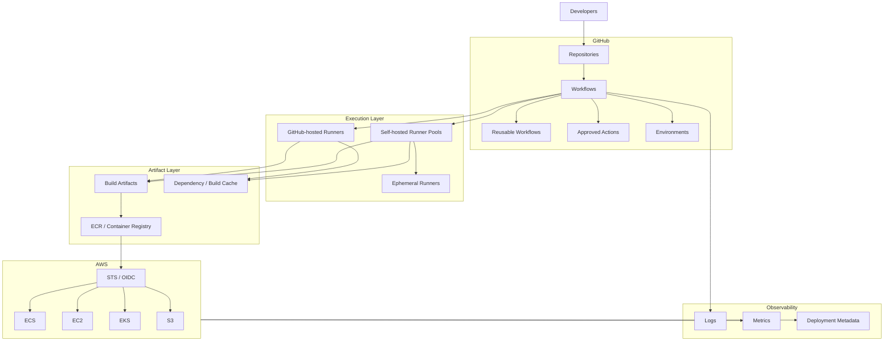
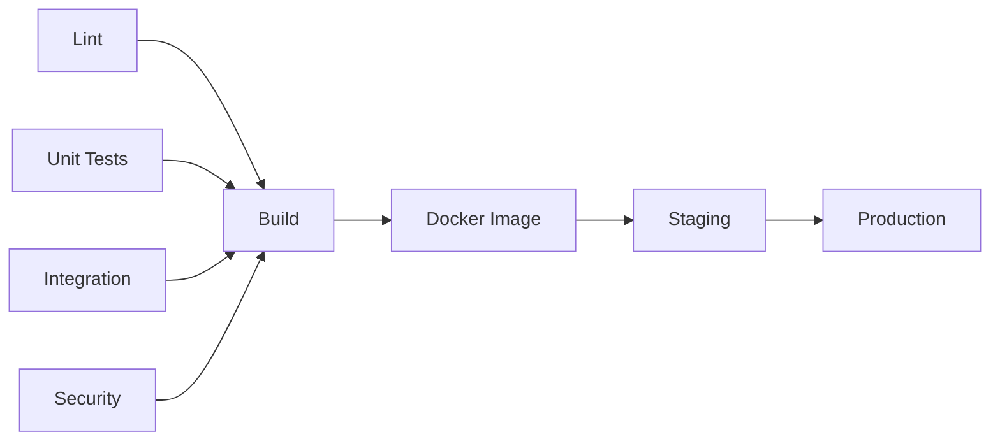
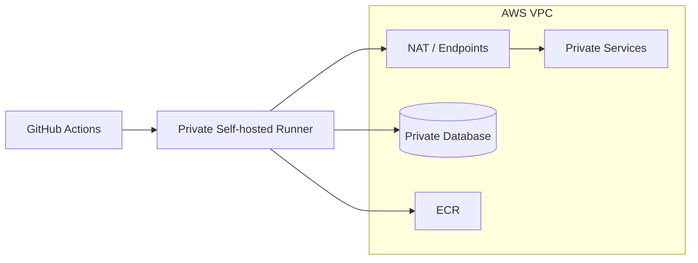
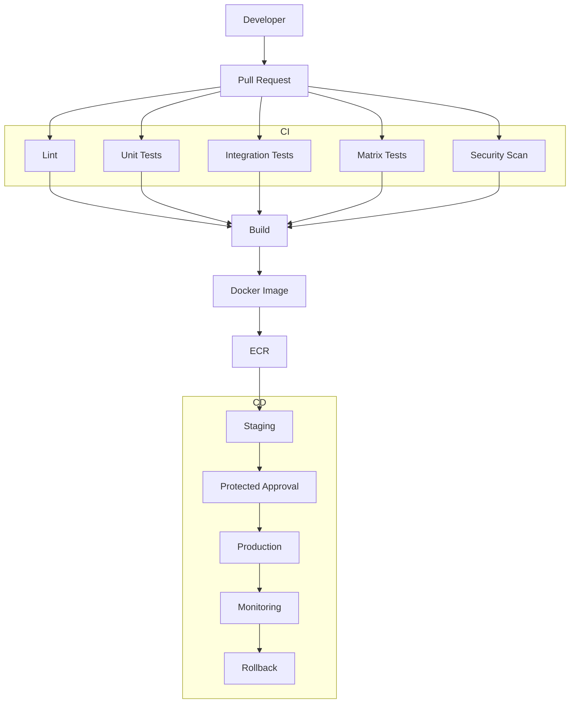
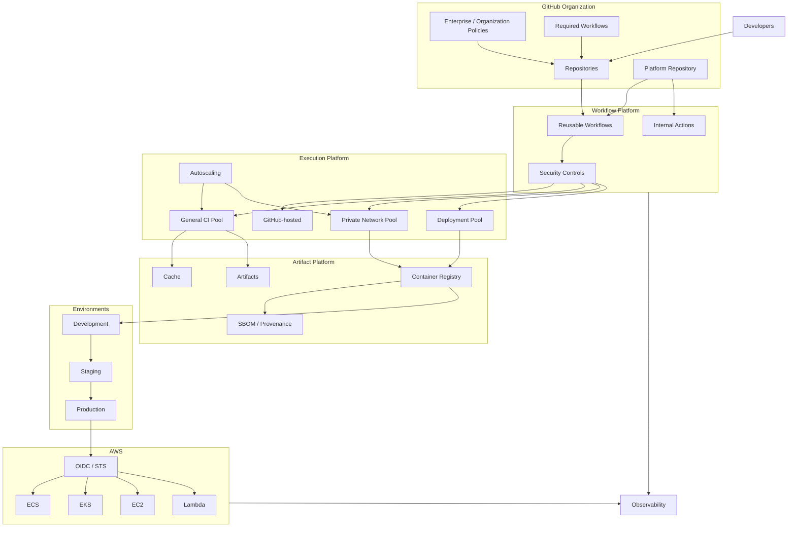

# 14- Scalable GitHub Actions Architecture

## Overview

A scalable GitHub Actions architecture is designed to support increasing numbers of repositories, workflows, developers, deployments, and concurrent jobs without turning CI/CD into a bottleneck or an operational risk.

A small repository can operate with:

```text
Repository
    ↓
One Workflow
    ↓
GitHub-hosted Runner
```

An enterprise platform may need:

```text
Enterprise
    │
    ├── Hundreds of Repositories
    │
    ├── Shared Reusable Workflows
    │
    ├── Organization Action Standards
    │
    ├── Multiple Runner Pools
    │
    ├── Parallel CI
    │
    ├── Production Deployment Controls
    │
    ├── Artifact Registries
    │
    ├── AWS Accounts / Regions
    │
    └── Central Governance
```

The scalability problem is therefore not simply "how many jobs can run?"

It includes:

- Workflow execution capacity.
- Runner capacity.
- Queue latency.
- Artifact throughput.
- Dependency caching.
- AWS API capacity.
- Deployment concurrency.
- Repository growth.
- Monorepo complexity.
- Reusable workflow dependencies.
- Security boundaries.
- Governance.
- Operational ownership.
- Cost.

A scalable CI/CD architecture should allow teams to add services and repositories without proportionally increasing platform complexity.

---

## What Scalability Means in GitHub Actions

Scalability has several dimensions.

| Dimension | Scaling Question |
|---|---|
| Repository scale | Can more repositories use the platform? |
| Workflow scale | Can workflows become more complex without becoming unmanageable? |
| Job scale | Can more jobs execute concurrently? |
| Runner scale | Can execution capacity expand with demand? |
| Artifact scale | Can build outputs and images be stored and retrieved reliably? |
| Deployment scale | Can many services deploy safely? |
| Organization scale | Can standards be centrally maintained? |
| Security scale | Can permissions remain controlled as usage grows? |
| Operational scale | Can failures be diagnosed efficiently? |
| Cost scale | Does CI/CD cost remain predictable? |

---

## Scalability vs High Availability

Scalability and availability solve different problems.

### Scalability

```text
More Work
   ↓
More Capacity
```

### High Availability

```text
Component Failure
   ↓
Service Continues
```

A runner pool can be highly available but unable to handle a large workload spike.

Conversely, a highly scalable system may still have a critical single point of failure.

Production CI/CD requires both properties.

---

## GitHub Actions Architecture

The fundamental execution relationship is:

```text
Workflow
   ↓
Job
   ↓
Step
   ↓
Action / Command
   ↓
Runner
```

At enterprise scale:

```text
Repositories
      ↓
Workflows
      ↓
Jobs
      ↓
Runner Pools
      ↓
Artifacts / Registries
      ↓
Deployment Platforms
```

GitHub provides orchestration, while the organization controls workflow design, application behavior, deployment architecture, and any self-hosted infrastructure.

---

## Scalable Architecture Model



---

## Scaling Strategy

A useful approach is to scale each layer independently:

```text
Repository Layer
      ↓
Workflow Layer
      ↓
Execution Layer
      ↓
Artifact Layer
      ↓
Deployment Layer
      ↓
Observability Layer
```

Do not solve every scaling problem by adding more runners.

For example:

```text
Slow build
```

may actually be caused by:

- Poor dependency caching.
- Inefficient Docker layers.
- Excessive test duplication.
- Large build contexts.
- Serial workflow dependencies.

Adding runners will not fix these problems.

---

## Repository Scale

As the number of repositories increases, duplicated workflows become difficult to maintain.

Without standardization:

```text
Repo A → Workflow A
Repo B → Workflow B
Repo C → Workflow C
...
Repo N → Workflow N
```

A security or reliability improvement then requires modifying many repositories.

A scalable architecture instead provides shared building blocks.

```text
                 Platform Workflows
                /        |        \
             Repo A    Repo B    Repo C
```

---

## Reusable Workflows

Reusable workflows are a major scaling mechanism.

Example:

```yaml
jobs:
  ci:
    uses: organization/platform-workflows/.github/workflows/python-ci.yml@v1
```

The shared workflow can standardize:

- Python setup.
- Dependency installation.
- Linting.
- Unit tests.
- Coverage.
- Security scanning.
- Artifact publishing.

---

## Why Reusable Workflows Scale

Without reuse:

```text
100 repositories
×
1 CI workflow
=
100 implementations
```

With a shared workflow:

```text
100 repositories
      ↓
1 standardized workflow
```

The platform team can improve the implementation centrally while maintaining a stable interface.

---

## Reusable Workflow Contract

A reusable workflow should have an explicit API.

```yaml
on:
  workflow_call:
    inputs:
      python-version:
        required: true
        type: string

      run-integration-tests:
        required: false
        type: boolean
        default: true

    secrets:
      database-url:
        required: false
```

The contract should define:

- Inputs.
- Defaults.
- Secrets.
- Outputs.
- Supported versions.
- Compatibility expectations.

---

## Versioning Shared Workflows

Do not make every repository consume an unversioned moving target.

Prefer:

```yaml
uses: organization/platform/.github/workflows/python-ci.yml@v2
```

rather than relying on an uncontrolled branch.

For security-sensitive workflows, stronger reference integrity controls may also be appropriate.

---

## Shared Workflow Blast Radius

A shared workflow creates a dependency concentration point.

```text
Shared Workflow
      ↓
┌─────┼─────┬─────┐
A     B     C     D
```

A breaking change can affect every consumer.

Mitigate with:

- Versioning.
- Contract testing.
- Compatibility windows.
- Controlled rollout.
- Release notes.
- Consumer inventory.
- Rollback versions.

---

## Central Platform vs Repository Ownership

A scalable architecture should not centralize everything.

### Platform Team

Typically owns:

- Reusable workflows.
- Runner platform.
- Approved actions.
- Security standards.
- Deployment primitives.
- OIDC integration.
- Artifact standards.

### Application Team

Typically owns:

- Application tests.
- Service-specific configuration.
- Dockerfile.
- Health checks.
- Deployment parameters.
- Application rollback decisions.

This creates:

```text
Centralized Standards
        +
Distributed Application Ownership
```

---

## Workflow Layering

A scalable workflow architecture can use multiple layers.

```text
Repository Workflow
       ↓
Reusable Workflow
       ↓
Composite / JavaScript Action
       ↓
CLI / Tool
```

For example:

```text
orders-api
    ↓
python-ci.yml
    ↓
setup-python
run-tests
publish-report
```

Each layer should have a focused responsibility.

---

## Reusable Workflow vs Composite Action

These are not interchangeable.

| Feature | Reusable Workflow | Composite Action |
|---|---|---|
| Multiple jobs | Yes | No |
| Job orchestration | Yes | No |
| Fan-out/fan-in | Yes | No |
| Environment deployment | Yes | Limited |
| Step reuse | Yes | Yes |
| Runs inside job | No | Yes |
| Workflow-level concurrency | Yes | No |
| Best use | Pipeline architecture | Step packaging |

A scalable platform uses each at the appropriate abstraction level.

---

## Custom Action Strategy

Custom actions should solve repeated execution patterns.

Examples:

```text
setup-python-environment
run-security-scan
publish-test-report
configure-aws-oidc
build-container
```

Avoid creating an action for every single shell command.

Too many tiny abstractions create:

- Dependency overhead.
- Debugging complexity.
- Versioning burden.
- Hidden behavior.

---

## Action Governance

At organization scale, actions should have a trust model.

```text
Approved Actions
      ↓
Versioned
      ↓
Reviewed
      ↓
Pinned where appropriate
      ↓
Used by Workflows
```

Control:

- Marketplace actions.
- Internal actions.
- Private actions.
- Action versions.
- SHA pinning.
- Ownership.
- Deprecation.

---

## Execution Capacity

Runner capacity is often the first obvious scaling problem.

For a self-hosted architecture:

```text
Workflow Queue
      ↓
Runner Controller
      ↓
Runner Group
 ┌────┼────┬────┐
 R1   R2   R3   R4
```

The capacity model should account for:

```text
Average Demand
+
Peak Demand
+
Retry Demand
+
Failure Capacity
```

---

## Queue Time

Queue time is an important scalability signal.

```text
Workflow Triggered
      ↓
Queued
      ↓
Runner Assigned
      ↓
Job Starts
```

If queue time grows continuously while job duration remains stable, execution capacity may be insufficient.

If queue time is low but total workflow duration grows, the bottleneck may be the workflow itself.

---

## Runner Pool Design

Do not create one giant pool for unrelated workloads.

Prefer specialized pools:

```text
Runner Groups
├── general-ci
├── private-network
├── production-deployment
├── security
├── windows
└── specialized-build
```

Benefits include:

- Security isolation.
- Predictable capacity.
- Different software stacks.
- Better cost allocation.
- Reduced blast radius.

---

## Runner Labels

Labels allow workflows to select appropriate execution capacity.

Example:

```yaml
runs-on:
  - self-hosted
  - linux
  - private-network
```

Labels should describe actual capabilities rather than arbitrary team names.

Good:

```text
linux
docker
private-network
python-3.12
```

Potentially problematic:

```text
team-a-runner-1
```

The latter creates unnecessary coupling to individual infrastructure.

---

## Ephemeral Runners at Scale

Ephemeral runners are useful for workloads that require:

- Isolation.
- Custom dependencies.
- Private network access.
- Sensitive deployment credentials.
- Large build environments.

Architecture:

```text
Job Queued
   ↓
Provision Runner
   ↓
Initialize
   ↓
Execute Job
   ↓
Collect Outputs
   ↓
Destroy Runner
```

---

## Ephemeral Runner Image Strategy

Use an immutable runner image where possible.

```text
Base OS
  +
Python
  +
Docker
  +
AWS CLI
  +
Security Tools
  ↓
Runner Image
```

Version the image.

```text
runner-image:v2026.09
```

This reduces configuration drift.

---

## Runner Autoscaling

A scalable self-hosted platform should provision capacity based on demand.

Conceptually:

```text
Queue Length
     ↓
Capacity Controller
     ↓
Desired Runners
     ↓
Infrastructure Provisioning
```

Scale-out considerations:

- Maximum capacity.
- Provisioning latency.
- Cloud quotas.
- IP availability.
- Startup time.
- Warm pools.

---

## Warm Pools

Ephemeral runners can introduce cold-start latency.

A warm pool can maintain a small number of ready instances:

```text
Warm Capacity
 ├── Ready
 ├── Ready
 └── Ready

Burst
 ↓
Provision Additional Capacity
```

This balances latency and cost.

---

## Runner Resource Classes

Different workloads have different requirements.

Examples:

| Workload | Resource Profile |
|---|---|
| Lint | Small |
| Unit tests | Medium |
| Integration tests | Medium/Large |
| Docker build | CPU / disk intensive |
| E2E browser tests | CPU / memory intensive |
| Large builds | Large |
| Deployment | Small/medium |
| GPU workload | Specialized |

Do not run every job on the largest runner class.

---

## Concurrency as a Scaling Control

Unlimited parallelism can overload downstream systems.

Example:

```text
100 Matrix Jobs
      ↓
100 PostgreSQL Connections
```

The database may become the bottleneck.

Use:

```yaml
strategy:
  max-parallel: 5
```

when downstream capacity requires controlled fan-out.

---

## Matrix Explosion

A matrix can multiply workload rapidly.

For example:

```text
4 Python versions
×
3 databases
×
2 operating systems
=
24 jobs
```

Adding another dimension:

```text
24 × 3
=
72 jobs
```

Matrix design must consider:

- Execution time.
- Runner capacity.
- Database capacity.
- Cost.
- Diagnostic value.

---

## Selective Matrix Testing

Not every combination must necessarily run for every pull request.

Possible strategy:

```text
Pull Request
 ├── Supported Python versions
 └── Primary database

Nightly
 ├── All Python versions
 ├── All supported databases
 └── All supported platforms
```

This preserves broad compatibility coverage without making every PR unnecessarily expensive.

---

## Dynamic Matrices

A planning job can generate a matrix dynamically.

```yaml
jobs:
  plan:
    runs-on: ubuntu-latest
    outputs:
      services: ${{ steps.plan.outputs.services }}

    steps:
      - id: plan
        shell: bash
        run: |
          services='["orders","payments","inventory"]'
          echo "services=$services" >> "$GITHUB_OUTPUT"

  test:
    needs: plan
    strategy:
      matrix:
        service: ${{ fromJSON(needs.plan.outputs.services) }}
    runs-on: ubuntu-latest

    steps:
      - run: echo "Testing ${{ matrix.service }}"
```

This is useful for:

- Monorepos.
- Changed-service detection.
- Dynamic environments.
- Selective deployments.

---

## Monorepo Scalability

A monorepo can become expensive if every change triggers every service pipeline.

Example:

```text
services/
├── orders/
├── payments/
├── inventory/
└── users/
```

A change only to:

```text
services/orders/
```

should not necessarily rebuild unrelated services.

A planning job can identify affected components:

```text
Git Diff
   ↓
Change Detection
   ↓
Affected Services
   ↓
Dynamic Matrix
   ↓
Selective CI
```

---

## Change Detection

Conceptually:

```text
PR
 ↓
Changed Paths
 ↓
Service Map
 ↓
Affected Services
 ↓
Tests / Build / Deploy
```

This can significantly reduce monorepo CI cost.

However, dependency relationships must be modeled correctly.

A shared library change may affect multiple services even when their own directories are unchanged.

---

## Dependency Graphs

A scalable pipeline should model dependencies explicitly.



Avoid unnecessary sequential dependencies.

---

## Parallel Execution

Bad:

```text
Lint
 ↓
Unit
 ↓
Integration
 ↓
Security
 ↓
Build
```

when these stages are independent.

Better:

```text
        ┌── Lint ──────────┐
        ├── Unit ──────────┤
Commit ─┼── Integration ───┼── Build
        └── Security ──────┘
```

Parallel execution reduces wall-clock time.

---

## Fan-Out / Fan-In

A common scalable pattern is:

```text
             ┌── Unit ───────┐
             │               │
             ├── Integration ┤
Commit ──────┤               ├── Build
             ├── Security ───┤
             │               │
             └── Matrix ─────┘
```

The build waits for required validation while independent checks execute concurrently.

---

## Build Once, Promote Many

A scalable CD architecture should avoid rebuilding for each environment.

Preferred:

```text
Source
  ↓
Build
  ↓
Image Digest
  ↓
Staging
  ↓
Production
```

Avoid:

```text
Source
 ├── Build → Staging
 └── Build → Production
```

The second model can produce different artifacts.

---

## Artifact Promotion

Artifact identity should remain stable:

```text
orders-api@sha256:abc123
```

Promotion changes the environment, not the artifact.

```text
Artifact
  ↓
Development
  ↓
Staging
  ↓
Production
```

This improves:

- Reproducibility.
- Rollback.
- Auditability.
- Debugging.

---

## Docker Build Scalability

Docker builds can become a major CI bottleneck.

Optimize:

- Build context.
- Dockerfile layer ordering.
- Dependency installation.
- `.dockerignore`.
- BuildKit caching.
- Multi-stage builds.
- Base image strategy.

Example:

```dockerfile
FROM python:3.12-slim AS runtime

WORKDIR /app

COPY requirements.txt .
RUN pip install --no-cache-dir -r requirements.txt

COPY src/ ./src/

CMD ["python", "-m", "src"]
```

Place stable dependency layers before frequently changing application source when appropriate.

---

## Docker Buildx

Buildx provides modern BuildKit-based build capabilities.

Typical architecture:

```text
GitHub Actions
      ↓
Buildx
      ↓
BuildKit
      ├── Cache
      ├── Multi-platform Build
      └── Registry
```

For multi-platform images:

```bash
docker buildx build \
  --platform linux/amd64,linux/arm64 \
  --tag "$IMAGE" \
  --push .
```

---

## Docker Layer Cache

A cache can reduce build time.

```text
Dockerfile
    ↓
BuildKit
    ↓
Existing Layers
    ↓
Rebuild Only Changed Layers
```

Cache loss should not make the build incorrect.

---

## Cache Strategy

Cache keys should reflect meaningful inputs.

For Python dependencies:

```yaml
- name: Cache pip
  uses: actions/cache@v4
  with:
    path: ~/.cache/pip
    key: ${{ runner.os }}-pip-${{ hashFiles('**/requirements*.txt', '**/pyproject.toml') }}
```

The cache key should change when dependency inputs change.

---

## Cache as a Performance Layer

The correct mental model is:

```text
Cache Hit
  ↓
Fast Build

Cache Miss
  ↓
Correct but Slower Build
```

If a cache miss causes a pipeline failure, the workflow is incorrectly depending on the cache.

---

## Artifact and Cache Scaling

Artifacts and caches should be designed separately.

```text
Build Output
    ↓
Artifact / Registry

Temporary Optimization Data
    ↓
Cache
```

Do not use caches as long-term artifact storage.

---

## Test Infrastructure Scaling

Integration tests may require:

- PostgreSQL.
- MySQL.
- Redis.
- Kafka.
- External APIs.
- Browser infrastructure.

Example:

```text
Python Application
      ↓
┌──────────────┐
│ PostgreSQL   │
│ Redis        │
│ Kafka        │
└──────────────┘
      ↓
pytest
```

At scale, parallel test jobs can overload shared infrastructure.

Prefer isolated service containers or controlled dedicated test infrastructure where practical.

---

## Service Containers

Service containers can provide isolated dependencies.

```yaml
services:
  postgres:
    image: postgres:16
    env:
      POSTGRES_PASSWORD: postgres
      POSTGRES_DB: app
```

This allows integration tests to run against known dependency versions.

---

## Database Capacity During CI

Suppose:

```text
30 parallel jobs
×
PostgreSQL
×
10 connections
=
300 potential connections
```

The database may become the bottleneck.

Control:

- Matrix parallelism.
- Connection pool size.
- Test database resources.
- Service container sizing.
- Test duration.

---

## Test Isolation

Tests should avoid sharing mutable state unnecessarily.

Prefer:

```text
Job A → Database A
Job B → Database B
Job C → Database C
```

or appropriately isolated schemas/databases.

Shared test infrastructure can create:

- Race conditions.
- Flaky tests.
- Cross-job contamination.
- Difficult debugging.

---

## Security Scalability

Security controls must remain manageable as repository count grows.

Centralize where appropriate:

- Approved actions.
- Permissions standards.
- Reusable workflows.
- OIDC patterns.
- Runner policies.
- Secret management standards.

But preserve application-level ownership where required.

---

## GITHUB_TOKEN Permissions

Use least privilege.

Example:

```yaml
permissions:
  contents: read
```

Deployment workflows may require:

```yaml
permissions:
  contents: read
  id-token: write
```

Do not grant broad permissions to every workflow simply because one deployment workflow needs them.

---

## Job-Level Permissions

Sensitive permissions can be restricted to specific jobs.

```yaml
jobs:
  test:
    permissions:
      contents: read

  deploy:
    permissions:
      contents: read
      id-token: write
```

This reduces the blast radius of a compromised test step.

---

## Pull Request Security

A scalable organization may receive code from:

- Internal branches.
- External contributors.
- Forks.

Do not expose production credentials to untrusted code.

Be especially careful with:

```text
pull_request
pull_request_target
```

and workflows that execute repository-controlled scripts.

---

## Untrusted Input

GitHub metadata can become dangerous when inserted directly into shell commands.

Unsafe pattern:

```yaml
run: echo "${{ github.event.pull_request.title }}"
```

The value is controlled by a user.

Prefer passing it through an environment variable:

```yaml
env:
  PR_TITLE: ${{ github.event.pull_request.title }}

run: |
  printf '%s\n' "$PR_TITLE"
```

The same principle applies to:

- Branch names.
- Commit messages.
- Issue content.
- Manual inputs.

---

## OIDC at Scale

OIDC removes the need to distribute long-lived AWS credentials across repositories.

A scalable model is:

```text
GitHub Repository
       ↓
Environment
       ↓
OIDC Token
       ↓
Restricted IAM Role
       ↓
AWS Account
```

Production repositories should not all share one unrestricted deployment role.

---

## AWS Account Architecture

Large environments may use:

```text
Organization
│
├── Development
│
├── Testing
│
├── Staging
│
└── Production
```

This provides stronger isolation than placing every environment in one account.

---

## IAM Role Strategy

Use role separation:

```text
CI Role
 ├── Read dependencies
 └── Publish artifacts

Staging Deploy Role
 ├── ECR
 └── Staging Runtime

Production Deploy Role
 ├── ECR Read
 └── Production Runtime
```

Each role should contain only the permissions required by its workload.

---

## Deployment Strategy at Scale

Multiple services may require different deployment strategies.

| Service | Strategy |
|---|---|
| Low-risk internal API | Rolling |
| Critical customer API | Canary |
| Large infrastructure migration | Blue-green |
| Stateful service | Controlled rolling |
| High-risk release | Progressive deployment |

The platform should provide reusable deployment primitives rather than forcing every service into one strategy.

---

## Deployment Concurrency at Scale

A single global concurrency group is usually too broad.

Bad:

```yaml
concurrency:
  group: production
```

This serializes unrelated services.

Prefer service-scoped groups:

```yaml
concurrency:
  group: production-${{ inputs.service }}
  cancel-in-progress: false
```

This allows:

```text
orders deployment
+
payments deployment
```

while preventing two deployments of the same service from racing.

---

## Environment Concurrency

Environment protection should correspond to actual deployment boundaries.

Examples:

```text
production-orders
production-payments
production-inventory
```

rather than treating the entire organization as one deployment lock.

---

## Release Architecture

A scalable release pipeline can be:

```text
Commit
 ↓
CI
 ↓
Build
 ↓
Artifact
 ↓
Release Candidate
 ↓
Staging
 ↓
Validation
 ↓
Approval
 ↓
Production
```

Release identity should remain stable throughout promotion.

---

## Semantic Versioning

Semantic versioning can provide human-readable release identity:

```text
2.4.0
```

while the artifact remains immutable:

```text
orders-api:2.4.0
orders-api@sha256:abc123
```

The digest should remain the authoritative artifact identity for deployment.

---

## Git Tags

A release workflow may be triggered by tags:

```yaml
on:
  push:
    tags:
      - "v*.*.*"
```

A tag can initiate:

```text
Release
 ↓
Build
 ↓
Test
 ↓
Publish
```

Production promotion should still validate and deploy the intended immutable artifact.

---

## Workflow Observability

At scale, logs alone are insufficient.

Use:

- Step summaries.
- Deployment metadata.
- Structured logs.
- Metrics.
- Alerts.
- Release identifiers.

Example:

```bash
{
  echo "## Deployment"
  echo ""
  echo "- Service: orders-api"
  echo "- Environment: production"
  echo "- Commit: $GITHUB_SHA"
  echo "- Run: $GITHUB_RUN_ID"
} >> "$GITHUB_STEP_SUMMARY"
```

---

## CI/CD Metrics

Useful platform metrics include:

| Metric | Meaning |
|---|---|
| Queue time | Execution capacity pressure |
| Workflow duration | Pipeline efficiency |
| Success rate | Pipeline reliability |
| Failure rate | Quality / infrastructure problems |
| Retry rate | Transient failure frequency |
| Runner utilization | Capacity efficiency |
| Deployment frequency | Delivery throughput |
| Change failure rate | Release quality |
| Rollback rate | Deployment risk |
| Recovery time | Operational resilience |

---

## Queue Time Analysis

Queue time can identify scaling problems.

```text
Low Queue + High Duration
→ Workflow efficiency problem

High Queue + Normal Duration
→ Runner capacity problem

High Queue + High Duration
→ Capacity + workflow optimization problem
```

This distinction prevents indiscriminate scaling.

---

## Workflow Duration Optimization

Measure each stage:

```text
Lint       20s
Unit       90s
Integration 5m
Security   3m
Build      4m
```

If integration tests consume most of the pipeline duration, adding more runner capacity may not reduce the critical path unless those tests can be parallelized.

---

## Critical Path

Workflow completion time is largely determined by the longest dependency path.

Example:

```text
Lint ────────┐
Unit ────────┤
Integration ─┼── Build ── Deploy
Security ────┘
```

The critical path is approximately:

```text
max(Lint, Unit, Integration, Security)
+
Build
+
Deploy
```

Optimize the critical path rather than optimizing every job equally.

---

## Dependency Graph Optimization

Avoid unnecessary `needs`.

Bad:

```yaml
unit:
  needs: lint

integration:
  needs: unit

security:
  needs: integration
```

when these jobs are independent.

Better:

```yaml
unit:
  needs: []

integration:
  needs: []

security:
  needs: []
```

Then:

```yaml
build:
  needs:
    - unit
    - integration
    - security
```

---

## Cost Optimization

CI/CD cost can grow quickly with:

```text
Repositories
×
Workflow Runs
×
Jobs
×
Runtime
```

Control costs through:

- Caching.
- Selective testing.
- Matrix optimization.
- Parallelism limits.
- Right-sized runners.
- Ephemeral capacity.
- Build optimization.
- Monorepo change detection.
- Artifact retention policies.

---

## Cost vs Speed

More parallelism generally reduces wall-clock time but increases concurrent resource consumption.

```text
More Parallelism
      ↓
Lower Duration
      +
Higher Cost
      +
Higher Downstream Load
```

Optimize for business requirements rather than maximum parallelism.

---

## Cost Allocation

At enterprise scale, track cost by:

- Organization.
- Repository.
- Team.
- Service.
- Environment.
- Runner class.

Useful metadata includes:

```text
team=payments
service=orders-api
environment=production
```

This allows platform teams to identify expensive workloads.

---

## Artifact Storage Cost

Artifact retention should match operational requirements.

For example:

```text
PR artifacts
→ Short retention

Release artifacts
→ Longer retention

Production rollback artifacts
→ Retain according to recovery policy
```

Do not retain every temporary test artifact indefinitely.

---

## Governance at Scale

A scalable platform requires governance without making every repository manually managed.

Useful controls include:

- Organization policies.
- Enterprise policies.
- Action allowlists.
- Required workflows.
- Runner groups.
- Permissions standards.
- Environment protection.
- Security scanning.
- Reusable workflow standards.

---

## Action Allowlists

An enterprise can restrict which actions repositories may use.

A scalable action governance process should define:

```text
Request
 ↓
Security Review
 ↓
Approval
 ↓
Version / SHA Selection
 ↓
Allowlist
 ↓
Monitoring
```

Ownership should be explicit.

---

## Required Workflows

Central workflows can enforce baseline controls such as:

```text
Lint
+
Security Scan
+
Dependency Review
```

The application workflow can then add service-specific stages.

This creates:

```text
Mandatory Platform Controls
+
Application-Specific CI
```

---

## Governance Without Central Bottlenecks

Over-centralization can create a platform team bottleneck.

Bad:

```text
Every deployment
      ↓
Platform Team Manual Approval
```

for routine low-risk changes.

Prefer automated controls for normal operation and human intervention for risk-sensitive actions.

---

## Platform API Thinking

Treat shared CI/CD capabilities as internal platform APIs.

Example:

```text
python-ci@v2
docker-build@v3
aws-deploy@v4
```

Each should have:

- Inputs.
- Outputs.
- Version.
- Documentation.
- Ownership.
- Compatibility expectations.
- Deprecation process.

---

## Failure Domains

A scalable platform should isolate:

### Repository Failure

```text
One repository
   ↓
One workflow fails
```

Other repositories remain unaffected.

### Runner Failure

```text
One runner fails
   ↓
Runner pool continues
```

### Shared Workflow Failure

```text
One version fails
   ↓
Other versions remain available
```

### Region Failure

```text
Region A unavailable
   ↓
Recovery path available
```

---

## Blast Radius

Every shared component increases potential blast radius.

| Component | Potential Blast Radius |
|---|---|
| Repository workflow | One repository |
| Composite action | Consumers of action |
| Reusable workflow | Many repositories |
| Organization runner pool | Many workflows |
| Central deployment workflow | Many services |
| Shared AWS role | Potentially many environments |

The more centralized a component is, the stronger its testing and change-control requirements should be.

---

## Progressive Platform Rollouts

Do not immediately migrate every repository to a new workflow version.

Prefer:

```text
New Workflow v2
      ↓
Pilot Repositories
      ↓
Validation
      ↓
Early Adopters
      ↓
Broader Rollout
      ↓
Default
      ↓
Deprecate v1
```

This reduces enterprise-wide blast radius.

---

## Backward Compatibility

A shared workflow should avoid unnecessary breaking changes.

For example:

```yaml
inputs:
  python-version:
    required: false
    type: string
    default: "3.12"
```

Adding an optional input is usually less disruptive than changing an existing required input's semantics.

---

## Deprecation

A scalable platform needs a lifecycle for shared components:

```text
Active
  ↓
Maintenance
  ↓
Deprecated
  ↓
Retired
```

Consumers should receive:

- Migration guidance.
- Deprecation timelines.
- Replacement versions.
- Compatibility information.

---

## Security Boundary Architecture

A scalable platform should separate:

```text
Untrusted CI
      ↓
Build
      ↓
Artifact
      ↓
Protected Deployment
      ↓
Production
```

Production credentials should not be available to every CI job.

---

## Privilege Zoning

Example:

```text
Zone 1: PR Validation
- Read repository
- No production credentials

Zone 2: Build
- Publish artifact
- Limited registry access

Zone 3: Staging
- Staging deployment role

Zone 4: Production
- Protected environment
- Production deployment role
```

This is more scalable than giving all workflows the same permissions.

---

## Artifact Provenance

A production artifact should be traceable to:

```text
Repository
+
Commit
+
Workflow
+
Build Run
+
Dependencies
+
Build Environment
```

For container workloads, combine:

- Image digest.
- SBOM.
- Provenance.
- Attestation.
- Release metadata.

---

## Supply Chain Scalability

As the number of repositories grows, manually reviewing every dependency becomes impractical.

Automate:

- Dependency updates.
- Vulnerability scanning.
- Action version monitoring.
- SBOM generation.
- Provenance.
- Policy enforcement.

Automation should produce actionable exceptions rather than simply generating large volumes of alerts.

---

## Private Network Architecture

Some workloads require private AWS access.



A private runner pool should be separated from untrusted workloads.

---

## Private Runner Security

Avoid running untrusted pull-request code on a runner that can access:

```text
Production Database
Production AWS APIs
Internal Secrets
Private Network
```

Use separate runner groups and trust boundaries.

---

## Kubernetes Integration

A scalable architecture can use GitHub Actions for orchestration and Kubernetes for runtime scheduling.

```text
GitHub Actions
      ↓
Container Registry
      ↓
Kubernetes
      ↓
Deployment
      ↓
Pods
```

The workflow should not need to understand every application runtime detail.

Reusable deployment workflows can encapsulate common behavior.

---

## ECS Integration

A scalable AWS container platform may use:

```text
GitHub Actions
      ↓
Buildx
      ↓
ECR
      ↓
ECS Task Definition
      ↓
ECS Service
      ↓
ALB
```

Multiple services can share deployment primitives while retaining independent service configuration.

---

## EC2 Integration

For VM-based deployments:

```text
GitHub Actions
      ↓
Artifact
      ↓
SSM / Deployment Mechanism
      ↓
EC2 Fleet
```

Avoid making one EC2 host the deployment control plane.

Use Auto Scaling Groups or equivalent fleet management when appropriate.

---

## Lambda Integration

Lambda deployments can use the same artifact-promotion principles.

```text
Build
 ↓
Package
 ↓
Artifact
 ↓
Staging
 ↓
Validation
 ↓
Production
```

Versioned Lambda deployments can support controlled traffic shifting and rollback strategies.

---

## Terraform Integration

Terraform workflows should separate:

```text
Plan
 ↓
Review
 ↓
Apply
```

Avoid allowing arbitrary pull-request code to directly mutate production infrastructure.

Use protected environments and restricted AWS roles.

---

## CloudFormation Integration

A scalable workflow may use:

```text
Validate
 ↓
Change Set
 ↓
Review
 ↓
Deploy
 ↓
Monitor
```

Infrastructure deployment should remain separate from application artifact creation where practical.

---

## Production CI/CD Architecture



---

## Scalable Production Workflow

```yaml
name: Production Pipeline

on:
  pull_request:
  push:
    branches:
      - main

permissions:
  contents: read

jobs:
  lint:
    runs-on: ubuntu-latest
    steps:
      - uses: actions/checkout@v4
      - run: python -m ruff check .

  unit:
    runs-on: ubuntu-latest
    steps:
      - uses: actions/checkout@v4
      - run: pytest tests/unit

  integration:
    runs-on: ubuntu-latest
    steps:
      - uses: actions/checkout@v4
      - run: pytest tests/integration

  security:
    runs-on: ubuntu-latest
    steps:
      - uses: actions/checkout@v4
      - run: python -m pip install -r requirements.txt
      - run: python -m pip check

  build:
    needs:
      - lint
      - unit
      - integration
      - security
    runs-on: ubuntu-latest

    permissions:
      contents: read
      id-token: write

    steps:
      - uses: actions/checkout@v4

      - name: Build image
        run: |
          docker buildx build \
            --tag orders-api:${GITHUB_SHA} \
            --load .

  deploy:
    needs: build
    runs-on: ubuntu-latest

    permissions:
      contents: read
      id-token: write

    environment:
      name: production

    concurrency:
      group: production-orders-api
      cancel-in-progress: false

    steps:
      - name: Deploy
        run: echo "Deploy immutable artifact"
```

The example demonstrates the architectural structure. Production implementations should use approved, pinned action references and an actual registry-backed immutable artifact.

---

## Scalable Workflow Naming

Consistent naming helps operations.

Examples:

```text
ci.yml
security.yml
release.yml
deploy-staging.yml
deploy-production.yml
```

For reusable workflows:

```text
python-ci.yml
docker-build.yml
aws-deploy.yml
terraform-plan.yml
terraform-apply.yml
```

Names should communicate intent rather than implementation details.

---

## Repository Structure

A scalable repository might use:

```text
.github/
├── workflows/
│   ├── ci.yml
│   ├── release.yml
│   └── deploy-production.yml
│
├── actions/
│   └── setup-python/
│       └── action.yml
│
└── dependabot.yml
```

Shared enterprise workflows can live in a dedicated platform repository.

---

## Platform Repository

A central platform repository might contain:

```text
platform-workflows/
├── .github/
│   └── workflows/
│       ├── python-ci.yml
│       ├── docker-build.yml
│       ├── aws-deploy.yml
│       └── terraform.yml
│
├── actions/
│   ├── setup-python/
│   ├── security-scan/
│   └── docker-build/
│
└── docs/
```

This creates a clear ownership boundary.

---

## Operational Metadata

Every production deployment should record:

```text
Service
Environment
Commit SHA
Artifact Digest
Workflow Run
Deployment ID
Actor
Timestamp
Previous Version
New Version
```

This supports:

- Incident investigation.
- Auditing.
- Rollback.
- Change correlation.

---

## GitHub Step Summary

Use step summaries for concise operational information.

```bash
{
  echo "## Deployment"
  echo ""
  echo "| Field | Value |"
  echo "| --- | --- |"
  echo "| Service | orders-api |"
  echo "| Environment | production |"
  echo "| Commit | $GITHUB_SHA |"
  echo "| Run | $GITHUB_RUN_ID |"
} >> "$GITHUB_STEP_SUMMARY"
```

This is often more useful than forcing operators to search through thousands of log lines.

---

## Troubleshooting at Scale

A scalable troubleshooting process should begin by determining whether the problem is:

```text
Repository-specific
        or
Platform-wide
```

For example:

```text
One repository failing
→ Inspect workflow

100 repositories failing
→ Inspect shared platform
```

This distinction dramatically reduces investigation time.

---

## Failure: All Repositories Fail

### Symptom

Many repositories fail simultaneously.

### Possible Causes

- Shared reusable workflow.
- Organization policy.
- Runner pool.
- External registry.
- Authentication provider.
- GitHub Actions incident.
- Shared dependency.

### Isolation Strategy

Compare:

```text
Different repositories
+
Different workflows
+
Different runner pools
```

If all fail at the same shared boundary, investigate that component first.

---

## Failure: Queue Time Increases

### Possible Causes

- Insufficient runners.
- Autoscaling failure.
- Large matrix.
- Unexpected workload spike.
- Runner registration failure.

### Checks

Measure:

```text
Queued Jobs
+
Available Runners
+
Provisioning Rate
+
Job Duration
```

---

## Failure: Workflow Duration Increases

### Possible Causes

- Dependency installation slowdown.
- Cache misses.
- Larger Docker builds.
- New integration tests.
- External API latency.
- Increased matrix dimensions.

### Isolation Strategy

Compare stage durations over time.

```text
Historical Duration
        vs
Current Duration
```

---

## Failure: Shared Workflow Breaks Consumers

### Symptom

Multiple repositories begin failing after a workflow update.

### Root Cause

Potential incompatible reusable workflow change.

### Corrective Action

Rollback consumers to the previous workflow version.

### Prevention

Use:

- Versioned reusable workflows.
- Contract tests.
- Staged rollout.
- Consumer compatibility testing.

---

## Failure: Runner Pool Saturation

### Symptom

Jobs remain queued while runners are fully occupied.

### Corrective Action

Determine whether to:

- Increase capacity.
- Reduce unnecessary parallelism.
- Optimize workflow duration.
- Separate workload classes.
- Improve autoscaling.

Do not simply scale indefinitely if downstream systems are already saturated.

---

## Failure: Database Overload

### Symptom

Integration test jobs fail intermittently.

### Possible Causes

- Too much matrix parallelism.
- Shared database.
- Connection exhaustion.
- Resource contention.

### Corrective Action

Reduce:

```yaml
max-parallel
```

or isolate test databases.

---

## Failure: Registry Bottleneck

### Symptom

Docker builds succeed but image push/pull becomes slow.

### Possible Causes

- Registry throughput.
- Large images.
- Multi-platform builds.
- Excessive concurrent pushes.

### Corrective Action

Optimize:

- Image size.
- Layer reuse.
- Build cache.
- Push concurrency.
- Registry architecture.

---

## Failure: AWS API Throttling

### Symptom

Highly parallel workflows receive throttling responses.

### Possible Causes

- Large matrix.
- Excessive deployment concurrency.
- Polling loops.
- Multiple repositories deploying simultaneously.

### Prevention

Use:

- Bounded concurrency.
- Exponential backoff.
- Efficient polling.
- Service-level deployment locks.

---

## Failure: Deployment Race

### Symptom

The wrong application version ends up deployed.

### Possible Cause

Two workflows update the same service simultaneously.

### Prevention

Use:

```yaml
concurrency:
  group: production-${{ inputs.service }}
  cancel-in-progress: false
```

and deploy immutable artifacts.

---

## Failure: Cache Corruption

### Symptom

Multiple jobs fail after a cache change.

### Corrective Action

Bypass or invalidate the cache and rebuild from source dependencies.

### Prevention

Treat caches as disposable optimization data.

---

## Failure: Self-Hosted Runner Compromise

### Symptom

Unexpected files, processes, or credentials appear on a runner.

### Corrective Action

```text
Stop Scheduling
      ↓
Isolate Runner
      ↓
Preserve Evidence
      ↓
Revoke Credentials
      ↓
Destroy / Rebuild Runner
      ↓
Validate Replacement
```

Do not simply clean suspicious files and return the runner to production.

---

## GitHub CLI Operations

List workflows:

```bash
gh workflow list
```

List recent runs:

```bash
gh run list
```

Inspect a run:

```bash
gh run view <run-id>
```

Inspect logs:

```bash
gh run view <run-id> --log
```

Rerun:

```bash
gh run rerun <run-id>
```

Run a workflow manually:

```bash
gh workflow run deploy-production.yml
```

View repository:

```bash
gh repo view
```

These commands are useful for operational workflows without turning GitHub CLI into a separate course.

---

## Release Operations

List releases:

```bash
gh release list
```

View a release:

```bash
gh release view <tag>
```

Create a release:

```bash
gh release create v2.4.0 \
  --generate-notes
```

Production deployment should still reference the immutable artifact associated with the release rather than rebuilding arbitrary source.

---

## Secrets and Variables Operations

Repository secret operations:

```bash
gh secret list
```

Repository variables:

```bash
gh variable list
```

Environment secrets:

```bash
gh secret list --env production
```

Use these commands for operational inspection and controlled management.

Do not print secret values.

---

## Scaling Checklist

### Workflow Architecture

- [ ] Workflows have clear responsibilities.
- [ ] Independent jobs execute in parallel.
- [ ] `needs` reflects actual dependencies.
- [ ] Matrix dimensions are controlled.
- [ ] Dynamic matrices are used where appropriate.
- [ ] Reusable workflows have stable contracts.

### Runner Platform

- [ ] Runner pools are separated by workload.
- [ ] Capacity is monitored.
- [ ] Autoscaling is available where needed.
- [ ] Ephemeral runners are considered.
- [ ] Runner images are versioned.
- [ ] Private-network runners are isolated.

### Artifact Platform

- [ ] Artifacts are immutable.
- [ ] Container images use stable identities.
- [ ] Production rollback artifacts are retained.
- [ ] Cache is treated as optional.
- [ ] Registry capacity is monitored.

### Deployment

- [ ] Build once, promote many.
- [ ] Production deployments use protected environments.
- [ ] Deployment concurrency is service-scoped.
- [ ] OIDC is used for AWS where appropriate.
- [ ] Rollback is tested.
- [ ] Health validation is automated.

### Governance

- [ ] Approved actions are controlled.
- [ ] Shared workflows are versioned.
- [ ] Permissions follow least privilege.
- [ ] Runner groups are governed.
- [ ] Exceptions are documented.
- [ ] Ownership is explicit.

### Operations

- [ ] Queue time is monitored.
- [ ] Workflow duration is measured.
- [ ] Runner utilization is visible.
- [ ] Deployment metadata is recorded.
- [ ] Platform-wide failures can be distinguished from repository failures.
- [ ] Recovery procedures are documented and tested.

---

## Common Mistakes

### Scaling Runners Before Optimizing Workflows

More runners do not fix:

- Serial dependency graphs.
- Slow tests.
- Large Docker builds.
- Poor caching.

Measure first.

### One Runner Pool for Everything

Combining:

```text
PR CI
+
Security
+
Production Deployment
```

in one pool increases security and capacity coupling.

### One Global Concurrency Group

This can unnecessarily serialize unrelated services.

Use service-scoped groups.

### Unlimited Matrix Parallelism

This can overload:

- Runners.
- PostgreSQL.
- Redis.
- Kafka.
- AWS APIs.

### Unversioned Shared Workflows

A change can unexpectedly affect hundreds of repositories.

### Centralizing Too Much

If every application change requires the platform team, the platform becomes a bottleneck.

### Treating Cache as Durable State

Caches can disappear.

Correctness must not depend on them.

### Rebuilding Per Environment

This weakens reproducibility and complicates rollback.

### Giving Every Workflow Production Credentials

This dramatically increases blast radius.

### Using Persistent Privileged Runners for PRs

Untrusted code can potentially interact with persistent state or privileged network access.

### Ignoring Cost

A technically scalable architecture can become financially unsustainable if every workflow runs a large matrix on large runners.

---

## Senior Design Principles

### Prefer Horizontal Scaling

```text
More Jobs
   ↓
More Independent Runners
```

rather than continuously increasing the size of one runner.

### Minimize Shared Mutable State

Prefer:

```text
Immutable Artifact
+
Ephemeral Runner
+
Declarative Deployment
```

over shared mutable infrastructure.

### Separate Control Planes

Keep:

```text
CI
CD
Runtime
```

logically separated.

### Design for Failure

Assume:

- Runner failure.
- Registry failure.
- AWS API throttling.
- Cache loss.
- Workflow failure.
- Network failure.
- Deployment failure.

### Make Recovery Boring

The ideal incident procedure is:

```text
Select Stable Artifact
      ↓
Run Rollback
      ↓
Validate Health
      ↓
Restore Service
```

rather than reconstructing infrastructure manually.

---

## Interview Scenarios

### How Would You Scale GitHub Actions to Hundreds of Repositories?

Discuss:

- Reusable workflows.
- Composite/custom actions.
- Runner groups.
- Managed vs self-hosted runners.
- Workflow versioning.
- Governance.
- Action allowlists.
- Observability.
- Cost control.

### How Would You Scale a Monorepo?

Discuss:

```text
Change Detection
 ↓
Affected Services
 ↓
Dynamic Matrix
 ↓
Selective Testing
 ↓
Selective Build
 ↓
Selective Deployment
```

Also discuss shared-library dependency graphs.

### How Would You Handle 1,000 Concurrent Jobs?

Discuss:

- Runner capacity.
- Queue latency.
- Autoscaling.
- Matrix control.
- Downstream dependency capacity.
- Cost.
- API throttling.
- Failure isolation.

### How Would You Prevent a Shared Workflow From Becoming a Single Point of Failure?

Use:

- Versioning.
- Compatibility testing.
- Staged rollout.
- Multiple supported versions.
- Rollback.
- Consumer inventory.

### Why Not Use One Huge Runner?

Because:

- It is a single point of failure.
- It limits concurrency.
- It increases blast radius.
- It creates resource contention.
- It creates a security boundary problem.

### How Would You Prevent 100 Parallel Tests From Overloading PostgreSQL?

Use:

- `max-parallel`.
- Isolated test databases.
- Service containers.
- Appropriate connection limits.
- Test sharding.
- Database resource sizing.

### How Would You Design Production Deployment for 50 Microservices?

Use:

```text
Shared CI Primitives
        +
Service-Specific Configuration
        +
Immutable Artifacts
        +
Service-Scoped Concurrency
        +
Environment Protection
        +
Independent Deployment
```

### How Would You Reduce CI Cost?

Measure first, then optimize:

- Critical path.
- Matrix dimensions.
- Change detection.
- Dependency caching.
- Docker layer caching.
- Runner sizing.
- Artifact retention.
- Workflow frequency.

### How Would You Secure a Scalable Platform?

Use layered controls:

```text
Least Privilege
+
Protected Environments
+
OIDC
+
Action Governance
+
SHA Pinning
+
Ephemeral Runners
+
Artifact Provenance
+
Network Isolation
```

### How Would You Design a Self-Hosted Runner Platform?

Discuss:

```text
Runner Groups
 ↓
Ephemeral Instances
 ↓
Autoscaling
 ↓
Immutable Runner Images
 ↓
Private Network
 ↓
Monitoring
 ↓
Automated Replacement
```

### How Do You Identify Whether a CI Problem Is Platform-Wide?

Compare:

```text
Multiple repositories
+
Multiple workflows
+
Multiple runner pools
```

If unrelated workloads fail at the same shared dependency, investigate the platform boundary first.

---

## Scalable Architecture Decision Framework

When designing a GitHub Actions platform, ask:

```text
1. What is the workload volume?
2. What is the concurrency requirement?
3. What needs private network access?
4. Which jobs are trusted?
5. Which jobs execute untrusted code?
6. What artifacts must be retained?
7. What must be deployed independently?
8. What can be standardized?
9. What must remain service-specific?
10. What happens when each dependency fails?
11. What is the acceptable queue time?
12. What is the acceptable deployment time?
13. What is the rollback requirement?
14. What is the cost envelope?
15. How will the platform be monitored?
```

---

## Reference Scalable Enterprise Architecture



## Key Takeaways

- **Scalable GitHub Actions architecture requires independent scaling of workflows, runners, artifacts, deployments, and downstream infrastructure rather than simply adding more runners.**
- **Reusable workflows, versioned internal actions, dynamic matrices, selective testing, and service-scoped concurrency provide the main mechanisms for scaling GitHub Actions across many repositories and services.**
- **Runner pools should be workload-aware and, where appropriate, ephemeral and autoscaled; untrusted CI workloads must remain separated from privileged production deployment capacity.**
- **Build once, promote immutable artifacts, and protect production with least-privilege OIDC roles, environments, concurrency controls, and rollback mechanisms.**
- **At enterprise scale, observability, governance, cost control, failure-domain isolation, and controlled platform rollouts are as important as workflow execution capacity.**