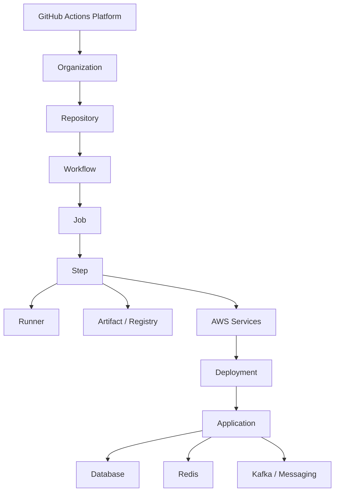
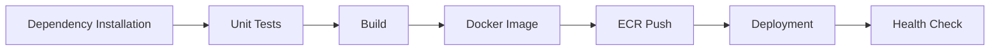
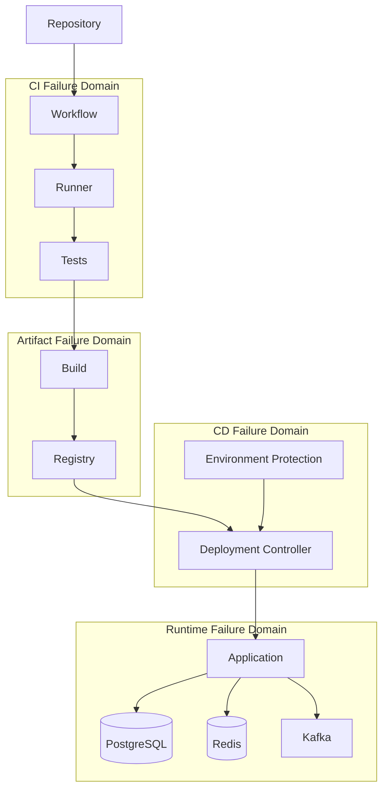
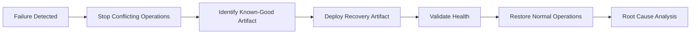

# 15- Failure Domains and Recovery

## Overview

Failure-domain design is the practice of identifying where a CI/CD system can fail, isolating failures so that they do not unnecessarily propagate, and providing deterministic recovery paths.

For GitHub Actions, failures can originate at many layers:

```text
Developer / Repository
        ↓
Workflow Configuration
        ↓
GitHub Actions Control Plane
        ↓
Runner
        ↓
Build / Test Environment
        ↓
Artifact / Registry
        ↓
AWS Authentication
        ↓
Deployment Platform
        ↓
Application Runtime
        ↓
Database / Cache / Messaging
```

A production CI/CD platform should not treat every failure as a generic "workflow failed" event.

Instead, it should answer:

- Which failure domain is affected?
- Is the failure isolated or systemic?
- Is the failure transient or deterministic?
- What evidence identifies the failure?
- Can the workflow be safely retried?
- Should the deployment stop?
- What is the recovery path?
- How can recurrence be prevented?

The objective is not to eliminate all failures. The objective is to **contain failures, detect them quickly, recover safely, and prevent repeated systemic failures**.

---

## Failure Domain

A failure domain is a component or boundary within which a failure can occur without necessarily affecting unrelated components.

Examples:

| Failure Domain | Example Failure | Expected Blast Radius |
|---|---|---|
| Repository | Invalid workflow YAML | One repository |
| Workflow | Incorrect expression | One workflow |
| Job | Test failure | One workflow run |
| Matrix | One Python version fails | One matrix leg |
| Runner | Runner becomes unavailable | Jobs assigned to runner |
| Runner pool | Autoscaling failure | Workloads using pool |
| Artifact | Upload failure | Dependent workflow |
| Registry | ECR unavailable | Image publication/deployment |
| OIDC | Token exchange failure | AWS jobs |
| AWS account | IAM or service failure | Environment/account |
| Deployment | ECS rollout failure | Service/environment |
| Database | Migration failure | Application deployment |
| GitHub platform | Actions outage | Potentially organization-wide |

The smaller and better-isolated the failure domain, the lower the potential blast radius.

---

## Failure Domain Hierarchy

A useful hierarchy is:



The further a failure can propagate through this hierarchy, the greater the operational impact.

---

## Why Failure Domains Matter

Without failure isolation:

```text
One Failure
    ↓
Shared Dependency
    ↓
Many Workflows
    ↓
Organization-wide Impact
```

With isolation:

```text
Service A Failure
      ↓
Service A Pipeline
      ↓
Service A Deployment

Service B
Service C
Service D
      ↓
Continue Independently
```

This is especially important in organizations with:

- Many repositories.
- Microservices.
- Shared reusable workflows.
- Multiple runner pools.
- Multiple AWS accounts.
- High deployment frequency.

---

## Failure Classification

A useful first classification is:

| Classification | Description | Example |
|---|---|---|
| Deterministic | Fails consistently | Invalid Python syntax |
| Transient | May succeed on retry | Network timeout |
| Infrastructure | Execution environment problem | Runner disk full |
| Configuration | Incorrect setup | Missing secret |
| Dependency | External dependency failure | Registry unavailable |
| Security | Authorization or trust failure | OIDC `AccessDenied` |
| Data | Invalid state/data | Migration failure |
| Capacity | Resource exhaustion | Runner saturation |
| Concurrency | Conflicting operations | Two deployments racing |
| Human | Operational mistake | Wrong environment |

Classification determines the recovery strategy.

---

## Transient vs Permanent Failures

Retries are appropriate primarily for transient failures.

### Potentially Transient

```text
Network timeout
Temporary DNS failure
Registry timeout
AWS API throttling
Temporary runner startup failure
```

### Usually Permanent

```text
Invalid YAML
Python test failure
Missing required input
Invalid IAM trust policy
Broken Dockerfile
Application configuration error
```

Retrying a deterministic failure only adds delay and noise.

---

## Failure Lifecycle

A production failure should move through a defined lifecycle:

```text
Failure
  ↓
Detection
  ↓
Classification
  ↓
Isolation
  ↓
Diagnosis
  ↓
Recovery
  ↓
Validation
  ↓
Prevention
```

This is more useful than simply rerunning the workflow.

---

## General Troubleshooting Model

For each failure domain use:

```text
Symptom
   ↓
Possible Causes
   ↓
Isolation Strategy
   ↓
Commands / Checks
   ↓
Root Cause
   ↓
Corrective Action
   ↓
Prevention
```

This model should be applied consistently across CI, CD, runners, AWS, Docker, and deployment systems.

---

## Failure Evidence

Before changing anything, collect evidence.

Useful evidence includes:

- Workflow run ID.
- Job name.
- Step name.
- Commit SHA.
- Workflow version.
- Runner type.
- Runner label.
- Environment.
- Artifact digest.
- AWS account and region.
- Deployment ID.
- Relevant timestamps.
- Error messages.
- Recent configuration changes.

Avoid repeatedly rerunning a failing deployment without recording the original failure.

---

## First Failure Principle

When multiple steps fail, identify the earliest meaningful failure.

Example:

```text
Step A → FAILED
Step B → FAILED
Step C → FAILED
```

If B and C depend on A, fixing B and C independently is unnecessary.

The first failure may have caused the rest.

---

## Failure Dependency Graph



If dependency installation fails, later failures may simply be consequences.

---

## Workflow Configuration Failures

### Symptom

The workflow does not start or is rejected before execution.

### Possible Causes

- Invalid YAML.
- Invalid workflow syntax.
- Unsupported field.
- Incorrect indentation.
- Invalid event configuration.
- Invalid expression.

### Isolation Strategy

Validate the workflow structure before debugging runtime behavior.

### Checks

```bash
gh workflow list
```

Inspect the workflow file directly:

```bash
git diff -- .github/workflows/
```

### Corrective Action

Fix the workflow definition and commit the change.

### Prevention

- Keep workflows small.
- Use reusable workflows.
- Review workflow changes.
- Validate changes before rollout.

---

## Trigger Failures

### Symptom

A workflow does not run when expected.

### Possible Causes

- Wrong event.
- Branch filter mismatch.
- Path filter mismatch.
- Tag filter mismatch.
- Workflow disabled.
- Workflow file not present on the expected branch.
- Event-specific behavior.

### Isolation Strategy

Determine:

```text
Was the event emitted?
        ↓
Did the workflow match the event?
        ↓
Did filters exclude it?
        ↓
Was the workflow enabled?
```

### Example

```yaml
on:
  push:
    branches:
      - main
```

A push to:

```text
feature/payment
```

will not trigger this workflow.

---

## Branch and Path Filters

Filters are useful for reducing unnecessary execution.

```yaml
on:
  pull_request:
    paths:
      - "services/orders/**"
      - "shared/**"
```

However, incorrect filters can silently prevent validation.

Production repositories should document important trigger boundaries.

---

## Job Failures

A job can fail because of:

- Runner problems.
- Missing tools.
- Dependency installation.
- Test failures.
- Permission failures.
- Network failures.
- Incorrect environment variables.

Start with:

```text
Job
 ↓
First Failed Step
 ↓
Underlying Command
```

Do not treat the job-level failure message as the root cause.

---

## Step Failures

A failed shell command normally propagates its exit status.

Example:

```yaml
- name: Run tests
  run: pytest
```

If `pytest` exits non-zero, the step fails.

Debug the actual command:

```bash
pytest -vv
```

rather than only examining GitHub's generic failure status.

---

## Expression Failures

GitHub expressions and shell commands are different evaluation systems.

Example:

```yaml
if: ${{ github.ref == 'refs/heads/main' }}
```

The expression is evaluated by GitHub Actions.

By contrast:

```yaml
run: |
  if [ "$BRANCH" = "main" ]; then
    echo "production"
  fi
```

is evaluated by the shell.

Confusing these layers causes many debugging problems.

---

## Context Failures

Important contexts include:

```text
github
env
vars
secrets
steps
needs
job
runner
matrix
strategy
inputs
```

A useful debugging approach is to inspect non-sensitive metadata:

```yaml
- name: Debug context
  env:
    REF: ${{ github.ref }}
    SHA: ${{ github.sha }}
    RUN_ID: ${{ github.run_id }}
  run: |
    printf 'ref=%s\n' "$REF"
    printf 'sha=%s\n' "$SHA"
    printf 'run_id=%s\n' "$RUN_ID"
```

Never dump the entire `secrets` context.

---

## Environment Variable Failures

### Common Causes

- Wrong scope.
- Incorrect variable name.
- Environment variable not propagated.
- Shell syntax differences.
- Confusion between `env` and `vars`.

### Scopes

```text
Workflow
  ↓
Job
  ↓
Step
```

A step-specific variable does not automatically exist in unrelated jobs.

---

## `$GITHUB_ENV` Failures

Use `$GITHUB_ENV` to make an environment variable available to subsequent steps in the same job.

```yaml
- name: Set version
  run: echo "APP_VERSION=2.4.0" >> "$GITHUB_ENV"

- name: Use version
  run: echo "$APP_VERSION"
```

The value is not automatically a cross-job variable.

For cross-job communication, use job outputs.

---

## Output Failures

Step output:

```yaml
- id: version
  run: echo "value=2.4.0" >> "$GITHUB_OUTPUT"
```

Job output:

```yaml
jobs:
  build:
    outputs:
      version: ${{ steps.version.outputs.value }}
```

Consumer:

```yaml
needs: build

run: echo "${{ needs.build.outputs.version }}"
```

When debugging output failures, verify each boundary:

```text
Step
 ↓
Job
 ↓
needs
```

---

## Secret Failures

### Symptom

A command receives an empty credential or authentication fails.

### Possible Causes

- Secret not configured.
- Wrong scope.
- Environment protection.
- Secret name mismatch.
- Fork workflow restrictions.
- Secret inheritance not configured.

### Checks

Verify that the secret exists without printing its value.

```bash
gh secret list
```

For environment-scoped secrets:

```bash
gh secret list --env production
```

Never debug by printing:

```bash
echo "$AWS_SECRET_ACCESS_KEY"
```

---

## Secret Exposure Failure

A secret can leak through:

- Command arguments.
- Logs.
- Artifacts.
- Generated files.
- Docker build arguments.
- Debug output.

Masking reduces accidental exposure but is not a substitute for correct secret handling.

---

## Permission Failures

### Symptom

GitHub API returns:

```text
403 Forbidden
```

### Possible Causes

- Insufficient `GITHUB_TOKEN` permissions.
- Repository policy.
- Organization policy.
- Pull-request trust boundary.
- Environment protection.
- Action permissions.

Example:

```yaml
permissions:
  contents: read
```

If a job needs an OIDC token:

```yaml
permissions:
  contents: read
  id-token: write
```

Grant only the required permissions.

---

## Matrix Failures

### Symptom

Only some matrix jobs fail.

Example:

```text
Python 3.10 → PASS
Python 3.11 → PASS
Python 3.12 → FAIL
```

Investigate the failing combination first.

Possible causes:

- Runtime incompatibility.
- Dependency version.
- OS differences.
- Database version.
- Test assumptions.

---

## Matrix Explosion

A matrix can unintentionally multiply failures and infrastructure load.

```text
Python × OS × Database × Service
```

Before adding a dimension, ask whether it provides meaningful coverage.

Use `max-parallel` when downstream capacity is limited.

```yaml
strategy:
  max-parallel: 4
```

---

## Dynamic Matrix Failures

Dynamic matrices commonly fail because the generated JSON is invalid.

Example:

```yaml
strategy:
  matrix:
    service: ${{ fromJSON(needs.plan.outputs.services) }}
```

Verify the producer output before consuming it.

A useful diagnostic is to print the non-sensitive JSON:

```yaml
- run: |
    printf '%s\n' '${{ needs.plan.outputs.services }}'
```

---

## Reusable Workflow Failures

### Symptom

A repository cannot invoke a reusable workflow.

### Possible Causes

- Incorrect repository reference.
- Wrong workflow path.
- Unsupported input.
- Missing secret.
- Permission mismatch.
- Incorrect workflow version.
- Incompatible contract.

### Isolation Strategy

Validate:

```text
Repository
 ↓
Workflow Path
 ↓
Reference
 ↓
Inputs
 ↓
Secrets
 ↓
Permissions
```

Version reusable workflows so that consumers can roll back.

---

## Artifact Failures

### Symptom

Artifact upload or download fails.

### Possible Causes

- Incorrect path.
- File was never generated.
- Artifact name mismatch.
- Conditional job skipped.
- Retention expired.
- Consumer uses wrong run.

### Diagnostic Pattern

```text
Was artifact produced?
        ↓
Does path exist?
        ↓
Was upload step executed?
        ↓
What artifact name was used?
        ↓
Is consumer using the correct run?
```

---

## Artifact Integrity

For deployment artifacts, verify identity.

For container images:

```text
Repository
+
Tag
+
Digest
```

The digest is the immutable identity.

Do not assume:

```text
latest
```

always refers to the version originally tested.

---

## Cache Failures

### Symptom

Build becomes slow or behaves unexpectedly after cache changes.

### Possible Causes

- Incorrect cache key.
- Stale dependency cache.
- Cache miss.
- Corrupted cached data.
- Different dependency lock file.

### Recovery

Temporarily bypass the cache and rebuild.

The workflow must remain correct without cached data.

---

## Container Failures

### Common Causes

- Incorrect image.
- Missing executable.
- Wrong working directory.
- Environment variable mismatch.
- Network configuration.
- Permission issue.
- Architecture mismatch.

Inspect:

```bash
docker image inspect <image>
docker run --rm <image> <command>
```

When possible, reproduce the container behavior locally.

---

## Service Container Failures

A common mistake is assuming:

```text
localhost
```

always means the service container.

Networking depends on whether the job itself runs in a container or directly on the runner.

For containerized jobs:

```text
Job Container
    ↓
Service Name
    ↓
PostgreSQL
```

For runner-based jobs:

```text
Runner
    ↓
Published Port
    ↓
Service Container
```

Always verify the networking model before debugging credentials.

---

## PostgreSQL Failures

Typical causes:

- Database not ready.
- Wrong hostname.
- Wrong port.
- Wrong credentials.
- Migration failure.
- Connection exhaustion.

Check readiness before running integration tests.

Example:

```bash
pg_isready \
  --host="$DB_HOST" \
  --port="$DB_PORT"
```

---

## Redis Failures

Typical causes:

- Incorrect hostname.
- Service not ready.
- Wrong port.
- Connection refused.
- Resource exhaustion.

Validate connectivity independently from the application test.

---

## MySQL Failures

Typical causes:

- Initialization not complete.
- Incorrect authentication.
- Character set/collation mismatch.
- Port mismatch.
- Migration failure.

Treat service readiness and application configuration as separate failure domains.

---

## Kafka Failures

Kafka introduces additional startup and dependency complexity.

Potential causes:

- Broker not ready.
- Incorrect bootstrap server.
- Topic missing.
- Authentication failure.
- Consumer group state.
- Network connectivity.

Do not immediately classify a test failure as an application defect if Kafka startup is incomplete.

---

## Custom Action Failures

Custom actions can fail because of:

- Incorrect `action.yml`.
- Missing input.
- Runtime incompatibility.
- Packaging problem.
- Dependency issue.
- Output handling.
- API authentication.

Identify the action implementation and version first.

For JavaScript actions, inspect:

```text
action.yml
package.json
package-lock.json
dist/
```

For Docker actions, inspect:

```text
Dockerfile
action.yml
entrypoint
```

---

## Runner Failures

### Symptoms

- Jobs remain queued.
- Runner disconnects.
- Tools are missing.
- Disk fills.
- Network requests fail.
- Docker commands fail.

### Failure Domains

```text
Registration
Connectivity
Scheduling
Operating System
Resources
Toolchain
Network
Security
```

Investigate the smallest relevant domain first.

---

## Runner Resource Exhaustion

### Disk

Check:

```bash
df -h
```

### Memory

```bash
free -h
```

### CPU

```bash
nproc
```

### Processes

```bash
ps aux
```

### Docker

```bash
docker system df
```

A persistent runner can accumulate:

- Docker layers.
- Workspaces.
- Temporary files.
- Package caches.
- Logs.

Ephemeral runners reduce long-term state accumulation.

---

## Self-Hosted Runner Failure

A self-hosted runner may fail because of:

- Registration token problems.
- Network connectivity.
- Proxy configuration.
- Service failure.
- Label mismatch.
- Runner offline state.
- Broken runner image.
- IAM permissions.
- Private DNS.

Inspect runner state through GitHub and the underlying host.

---

## Runner Pool Failure

If multiple runners fail simultaneously, investigate shared dependencies:

```text
Runner Image
Network
Provisioning
IAM
Cloud Quota
Autoscaling
```

Do not debug each runner independently until shared infrastructure has been eliminated as the cause.

---

## OIDC Failures

### Symptom

AWS authentication fails.

Typical error:

```text
AccessDenied
```

### Failure Domains

```text
GitHub Permission
      ↓
OIDC Token
      ↓
IAM OIDC Provider
      ↓
Trust Policy
      ↓
STS
      ↓
IAM Permissions
```

Check each boundary separately.

---

## OIDC Permission

The workflow must request:

```yaml
permissions:
  id-token: write
  contents: read
```

`id-token: write` permits requesting an OIDC token; it does not grant AWS permissions.

---

## IAM Trust Policy Failure

A trust policy determines whether GitHub's OIDC identity can assume the role.

Common problems:

- Wrong repository.
- Wrong branch.
- Wrong environment.
- Wrong audience.
- Incorrect `sub` claim.
- Overly restrictive condition.
- Incorrect OIDC provider.

A trust-policy failure is different from an IAM permissions failure.

---

## STS Failure

The flow is:

```text
GitHub Actions
      ↓
OIDC Token
      ↓
AWS STS
      ↓
AssumeRoleWithWebIdentity
      ↓
Temporary Credentials
```

If STS fails, determine whether the problem is:

- OIDC token.
- Trust policy.
- Provider.
- Role ARN.
- Session configuration.

---

## AWS Identity Diagnostics

Use:

```bash
aws sts get-caller-identity
```

This is one of the most useful diagnostics after authentication.

It answers:

```text
Which AWS principal am I actually using?
```

---

## Credential Source Confusion

AWS authentication can fail because another credential source takes precedence.

Inspect environment configuration:

```bash
env | grep '^AWS_' | sort
```

Do not print secret values.

Common causes include:

- Stale environment variables.
- Incorrect profile.
- Instance role.
- OIDC credentials not being used.
- Local development credentials accidentally reused.

---

## AWS Region Failures

A workflow can authenticate successfully but still fail because it uses the wrong region.

Check:

```bash
aws configure get region
```

and explicitly configure the intended region in CI.

---

## ECR Failures

Typical failure sequence:

```text
OIDC
 ↓
STS
 ↓
IAM
 ↓
ECR Login
 ↓
Docker Push
```

A failure at each stage has a different diagnosis.

For example:

```text
STS succeeds
ECR login succeeds
Push fails
```

points toward ECR repository permissions or registry/image issues rather than OIDC.

---

## Docker Build Failures

### Common Causes

- Invalid Dockerfile.
- Missing build context.
- Missing dependency.
- Architecture mismatch.
- Network failure.
- Cache failure.
- Build secret handling.
- Disk exhaustion.

Reproduce the exact build locally when possible:

```bash
docker buildx build --progress=plain .
```

Verbose BuildKit output can reveal the first failing layer.

---

## Registry Failures

Separate:

```text
Authentication
      ↓
Authorization
      ↓
Network
      ↓
Registry
      ↓
Repository
      ↓
Image Push
```

Do not treat every Docker push error as a Docker build problem.

---

## Deployment Failures

Deployment failures should be classified separately from build failures.

```text
Build
  ↓
Artifact
  ↓
Registry
  ↓
Deployment
  ↓
Runtime
```

If the image exists and is verified, debugging should move to the deployment platform.

---

## ECS Deployment Failure

Potential domains:

- Task definition.
- Image pull.
- IAM execution role.
- Task role.
- Security groups.
- Subnets.
- ALB target health.
- Container startup.
- Application health check.
- Capacity.

Do not immediately roll back if the deployment never successfully started due to infrastructure configuration.

---

## EC2 Deployment Failure

Potential domains:

- Network.
- SSM/SSH.
- IAM instance profile.
- Disk.
- Systemd.
- Application process.
- Reverse proxy.
- File permissions.

A useful production flow is:

```text
Deployment Command
 ↓
Host Reachability
 ↓
Artifact Verification
 ↓
Process Start
 ↓
Health Check
```

---

## Kubernetes Deployment Failure

Potential domains:

- Image pull.
- Pod scheduling.
- Resource limits.
- ConfigMap/Secret.
- Readiness probe.
- Liveness probe.
- Service routing.
- Ingress.
- Network policy.

Useful commands include:

```bash
kubectl get pods
kubectl describe pod <pod>
kubectl logs <pod>
```

---

## Deployment Health Validation

A deployment should not be considered successful merely because the deployment command returned zero.

Validate:

```text
Deployment accepted
      ↓
New instances started
      ↓
Readiness successful
      ↓
Traffic healthy
      ↓
Error rate acceptable
```

---

## Health Check Failure

A health check can fail because:

- Application did not start.
- Database unavailable.
- Redis unavailable.
- Configuration missing.
- Wrong port.
- Security group issue.
- Dependency timeout.

Health checks should distinguish application health from dependency health where possible.

---

## Database Migration Failures

Database migrations are a special failure domain because they can change persistent state.

Never assume application rollback automatically means database rollback is safe.

Prefer backward-compatible migration strategies such as:

```text
Expand
 ↓
Deploy Compatible Application
 ↓
Migrate Data
 ↓
Contract
```

This supports safer rolling and zero-downtime deployments.

---

## Celery Failure During Deployment

Celery workers can continue processing tasks while application code changes.

Consider:

- Task backward compatibility.
- Worker deployment ordering.
- Long-running tasks.
- Queue draining.
- Retry behavior.

A deployment is not isolated from asynchronous workers simply because the API deployment succeeded.

---

## Kafka Failure During Deployment

Kafka consumers require attention to:

- Consumer compatibility.
- Schema changes.
- Offset management.
- Consumer group behavior.
- Message replay.
- Producer/consumer rollout order.

Schema evolution should be compatible with the deployment strategy.

---

## Concurrency Failures

### Symptom

Two workflows modify the same resource.

Example:

```text
Workflow A → Production
Workflow B → Production
```

Both may race.

Use concurrency groups:

```yaml
concurrency:
  group: production-orders
  cancel-in-progress: false
```

For production deployments, cancellation must be chosen carefully because cancelling an active deployment may leave the environment in an intermediate state.

---

## Race Conditions

Common CI/CD races include:

- Two deployments.
- Shared artifact names.
- Mutable image tags.
- Shared test databases.
- Terraform state operations.
- Concurrent migrations.
- Release creation.

Mitigate with:

- Immutable identifiers.
- Concurrency controls.
- State locking.
- Idempotent operations.
- Environment protection.

---

## Retry Strategy

Retries should be:

- Bounded.
- Delayed.
- Applied only to transient failures.
- Observable.

Conceptually:

```text
Attempt 1
   ↓
Failure
   ↓
Backoff
   ↓
Attempt 2
   ↓
Failure
   ↓
Backoff
   ↓
Attempt 3
   ↓
Fail
```

Avoid infinite retries.

---

## Exponential Backoff

For external APIs, use increasing delays:

```text
1s
2s
4s
8s
```

with an upper bound and appropriate jitter where supported.

This prevents many workflows from retrying simultaneously.

---

## Idempotency

A retry-safe deployment operation should produce the same intended state when executed multiple times.

For example:

```text
Deploy image digest abc123
```

is more deterministic than:

```text
Deploy latest
```

Idempotency is particularly important for:

- AWS deployments.
- Infrastructure changes.
- Database operations.
- Artifact publication.
- Rollbacks.

---

## Rollback Architecture

A rollback should select a known-good immutable artifact.

```text
Production
    ↓
Failure
    ↓
Identify Previous Artifact
    ↓
Deploy Previous Artifact
    ↓
Health Validation
    ↓
Recovered
```

Example:

```text
Current:
orders-api@sha256:new

Rollback:
orders-api@sha256:known-good
```

---

## Rollback vs Roll Forward

Rollback:

```text
Version 5
 ↓
Version 4
```

Roll forward:

```text
Version 5
 ↓
Version 6-fixed
```

The correct choice depends on:

- Failure severity.
- Data compatibility.
- Time to fix.
- Deployment safety.
- Database changes.

---

## When Rollback Is Unsafe

Rollback can be dangerous when:

- Database schema changed incompatibly.
- Data migrations are irreversible.
- External systems changed state.
- Messages were produced in a new incompatible format.
- Secrets/configuration changed incompatibly.

In these situations, a compatible forward fix may be safer.

---

## Blue-Green Recovery

```text
        Load Balancer
             |
       ┌─────┴─────┐
       ↓           ↓
     Blue        Green
    Current       New

Healthy Green
      ↓
Switch Traffic
      ↓
Green Active
```

If Green fails before traffic switch, Blue remains active.

This creates a strong deployment isolation boundary.

---

## Canary Recovery

```text
100% Blue
   ↓
5% Canary
   ↓
25%
   ↓
50%
   ↓
100%
```

At each stage validate:

- Error rate.
- Latency.
- Saturation.
- Business metrics.
- Logs.

If the canary fails, stop promotion and route traffic back.

---

## Zero-Downtime Recovery

Zero-downtime deployment depends on more than the deployment mechanism.

Consider:

- Readiness probes.
- Graceful shutdown.
- Connection draining.
- Backward-compatible APIs.
- Database compatibility.
- Queue behavior.
- Long-lived connections.

---

## Recovery Point Objective

RPO describes how much data loss is acceptable after a failure.

For CI/CD:

```text
Artifact
+
Configuration
+
Infrastructure State
+
Deployment Metadata
```

should be recoverable according to operational requirements.

---

## Recovery Time Objective

RTO describes the target recovery time.

Example:

```text
Failure detected
      ↓
10 min diagnosis
      ↓
5 min rollback
      ↓
5 min validation

RTO ≈ 20 minutes
```

CI/CD architecture should be designed around the required recovery objectives rather than arbitrary tooling choices.

---

## Disaster Recovery

A production CI/CD platform should consider:

- GitHub availability.
- Runner availability.
- Artifact registry availability.
- AWS account availability.
- Region availability.
- DNS.
- Deployment state.
- Infrastructure state.
- Recovery credentials.

CI/CD disaster recovery is not only about rebuilding the application.

---

## GitHub Actions as a Control Plane Dependency

If GitHub Actions is unavailable, normal deployments may stop.

Mitigate operational dependency where required through:

- Documented manual procedures.
- Existing production artifacts.
- Independent runtime operation.
- Emergency deployment procedures.
- Break-glass access.

Do not assume that an application failure and a CI/CD failure have the same recovery path.

---

## Break-Glass Access

Break-glass access should be:

- Rare.
- Strongly authenticated.
- Audited.
- Time-limited where possible.
- Separate from normal CI credentials.

It should not become an alternative permanent deployment workflow.

---

## Failure Isolation Between CI and CD

Prefer:

```text
CI
 ↓
Immutable Artifact
 ↓
CD
```

rather than coupling production deployment directly to every test execution environment.

This allows a previously validated artifact to be redeployed even if CI infrastructure is temporarily degraded.

---

## Artifact-Based Recovery

If the source repository is healthy but CI is unavailable, previously published immutable artifacts can still support recovery.

```text
Known-Good Artifact
       ↓
Deployment System
       ↓
Production
```

This is one reason artifact retention and provenance matter operationally.

---

## Security During Recovery

Recovery procedures must not bypass security controls unnecessarily.

Avoid:

```text
Incident
 ↓
Disable IAM
 ↓
Use Shared Admin Credentials
```

Prefer:

```text
Incident
 ↓
Use Audited Break-Glass Role
 ↓
Deploy Known-Good Artifact
 ↓
Validate
 ↓
Revoke / Close Access
```

---

## Observability for Recovery

Recovery requires evidence.

Monitor:

- Deployment status.
- Application health.
- HTTP error rate.
- Latency.
- CPU.
- Memory.
- Database health.
- Queue depth.
- Kafka lag.
- Redis availability.
- Runner queue time.
- Workflow failure rate.

---

## Deployment Correlation

Use the same release identity across systems:

```text
Git SHA
   ↓
Workflow Run
   ↓
Image Digest
   ↓
Deployment
   ↓
Application Logs
```

This allows operators to answer:

```text
Which deployment introduced this behavior?
```

---

## Monitoring Workflow Health

A CI/CD platform should itself be monitored.

Useful signals:

```text
Workflow Success Rate
Runner Availability
Queue Time
Average Duration
Artifact Failures
Registry Failures
OIDC Failures
Deployment Failures
Rollback Rate
```

A platform can be considered unhealthy even when application runtime systems are healthy.

---

## Failure Budget

If CI reliability is poor, teams spend increasing amounts of time rerunning jobs and diagnosing infrastructure.

A useful operational goal is to minimize:

```text
False Failures
+
Flaky Tests
+
Transient Infrastructure Failures
+
Manual Recovery
```

This increases developer throughput without requiring unlimited compute.

---

## Flaky Test Failure Domain

Flaky tests should not be normalized as harmless.

Investigate:

- Shared state.
- Race conditions.
- Timing.
- External services.
- Test order.
- Resource contention.
- Dependency startup.

Retries can temporarily reduce noise but should not hide systemic test instability.

---

## Failure Injection

Mature CI/CD platforms should test recovery paths.

Examples:

- Kill a runner.
- Interrupt deployment.
- Simulate registry failure.
- Simulate AWS API throttling.
- Break a health check.
- Introduce a failed migration.
- Remove a dependency.
- Exhaust test database capacity.

The purpose is to verify recovery rather than assume it works.

---

## Recovery Runbook

A production deployment incident runbook should contain:

```text
1. Detect incident
2. Identify affected service
3. Identify current artifact
4. Stop conflicting deployments
5. Inspect health signals
6. Determine rollback vs roll forward
7. Select known-good artifact
8. Execute recovery
9. Validate runtime
10. Restore normal deployment flow
11. Preserve evidence
12. Document root cause
```

---

## Incident Severity

A practical classification might be:

| Severity | Example | Response |
|---|---|---|
| Low | One PR workflow failure | Developer investigation |
| Medium | Shared CI failure | Platform investigation |
| High | Production deployment failure | Incident response |
| Critical | Production outage with failed recovery | Emergency response |

Severity should reflect impact, not simply the presence of an error.

---

## Root Cause Analysis

A root cause analysis should distinguish:

```text
Trigger
↓
Immediate Cause
↓
Contributing Factors
↓
Systemic Cause
↓
Preventive Control
```

Example:

```text
Deployment failed
    ↓
Health check failed
    ↓
Application could not connect to Redis
    ↓
Redis endpoint configuration changed
    ↓
Environment configuration lacked validation
```

The root cause is not necessarily the final error message.

---

## Corrective vs Preventive Actions

### Corrective

Fix the current incident.

```text
Restore previous artifact
```

### Preventive

Reduce recurrence.

```text
Validate configuration before deployment
```

Both should be tracked.

---

## Failure Domain Ownership

Ownership should be explicit.

| Domain | Typical Owner |
|---|---|
| Workflow | Application / Platform |
| Reusable Workflow | Platform |
| Runner Platform | Platform |
| Docker Build | Application / Platform |
| Artifact Registry | Platform |
| AWS Identity | Platform / Cloud |
| Application Deployment | Application / Platform |
| Database | Application / Data |
| Runtime | Application / Infrastructure |

Without ownership, failures tend to become organizational rather than technical problems.

---

## Failure Domain Architecture

A mature architecture isolates critical dependencies.



A failure in the runtime should not require rebuilding the artifact.

A failure in the runner platform should not invalidate existing production artifacts.

---

## High Availability for CI/CD

HA can be applied at multiple layers.

### Runner HA

```text
Runner A
Runner B
Runner C
```

### Artifact HA

Use a reliable registry and retained immutable artifacts.

### Deployment HA

Use multiple deployment paths where operational requirements justify them.

### Runtime HA

Use:

- Multiple application instances.
- Load balancing.
- Multi-AZ infrastructure.
- Database redundancy.

CI/CD HA and application HA are related but independent.

---

## Recovery Architecture



---

## Preventing Cascading Failures

A failure can cascade when one dependency failure blocks many independent workloads.

Example:

```text
Shared Runner Pool
       ↓
All CI Jobs
       ↓
All Deployments
```

Reduce the blast radius with:

- Multiple runner pools.
- Workload isolation.
- Independent artifacts.
- Versioned reusable workflows.
- Service-scoped concurrency.
- Environment isolation.

---

## Shared Dependency Failure

Suppose a reusable workflow is consumed by 200 repositories.

A bad release can cause:

```text
Workflow v2
    ↓
200 repositories
    ↓
CI failures
```

Use:

```text
Workflow v1
Workflow v2
```

during migration and gradually move consumers.

---

## Registry Failure Recovery

If ECR is temporarily unavailable:

```text
Existing Production Artifact
        ↓
Continue Runtime
```

Existing production workloads should not normally require registry availability for every request.

For deployment recovery:

```text
Known-Good Artifact
        ↓
Retry Registry Access
        ↓
Deploy
```

If registry access remains unavailable, follow the documented break-glass or alternate recovery process.

---

## Database Failure Recovery

Database failures require special caution because state is persistent.

Recovery may involve:

- Replica promotion.
- Point-in-time recovery.
- Restore.
- Application failover.
- Read-only mode.
- Traffic reduction.

CI/CD should not automatically execute destructive database recovery actions unless explicitly designed and heavily protected.

---

## Redis Failure Recovery

For cache workloads, recovery may be simpler if Redis is truly disposable.

```text
Redis Lost
 ↓
Application Continues
 ↓
Cache Rebuilt
```

But if Redis is being used for:

- Sessions.
- Distributed locks.
- Celery queues.
- Critical state.

then it is no longer merely a cache from an availability perspective.

---

## Kafka Failure Recovery

Kafka recovery must consider:

- Message durability.
- Replication.
- Consumer offsets.
- Consumer lag.
- Producer retries.
- Duplicate processing.

A CI/CD rollback does not automatically undo messages already published.

---

## Production Failure Decision Tree

```text
Deployment Failed
       |
       v
Is Production Healthy?
   /           \
 Yes            No
 |               |
Stop             Is rollback safe?
promotion        /          \
               Yes           No
                |             |
           Roll back       Roll forward
                |             |
                └──────┬──────┘
                       v
                 Validate Health
                       |
                       v
                  Close Incident
```

---

## Recovery Validation

A successful rollback command does not prove recovery.

Validate:

### Infrastructure

- Deployment state.
- Instance/task health.
- Network connectivity.

### Application

- Readiness.
- Error rate.
- Latency.
- Critical endpoints.

### Dependencies

- PostgreSQL.
- Redis.
- Kafka.
- External APIs.

### Business Signals

- Request success.
- Queue processing.
- Transaction completion.

---

## Common Recovery Mistakes

### Rerunning Without Diagnosis

A retry may hide the actual cause.

### Rebuilding Instead of Redeploying

A new build may not reproduce the tested artifact.

### Rolling Back Only Application Code

Database or message-schema changes may remain incompatible.

### Disabling Security Controls

Emergency recovery should not become uncontrolled administrative access.

### Ignoring Concurrent Deployments

A rollback can be immediately overwritten by another deployment.

### Deleting Evidence

Logs and deployment metadata are essential for root-cause analysis.

### Treating Every Failure as Transient

Some failures require code or configuration changes.

### No Tested Rollback

A rollback procedure that has never been tested is an assumption, not a recovery capability.

---

## Production Recovery Checklist

### Detection

- [ ] Failure detected quickly.
- [ ] Affected service identified.
- [ ] Failure domain identified.
- [ ] Impact assessed.

### Isolation

- [ ] Conflicting deployments stopped.
- [ ] Failure contained.
- [ ] Unrelated services remain operational.

### Diagnosis

- [ ] Workflow run identified.
- [ ] Commit SHA identified.
- [ ] Artifact digest identified.
- [ ] Runner and environment identified.
- [ ] First meaningful failure identified.

### Recovery

- [ ] Recovery strategy selected.
- [ ] Known-good artifact identified.
- [ ] Rollback safety evaluated.
- [ ] Deployment executed.
- [ ] Health validated.

### Prevention

- [ ] Root cause documented.
- [ ] Corrective action implemented.
- [ ] Preventive control identified.
- [ ] Monitoring improved if required.
- [ ] Recovery procedure tested.

---

## Senior Engineering Principles

### Isolate Before Scaling

Understand the failure domain before increasing capacity.

### Retry Only Transient Failures

Retries should reduce transient noise, not hide deterministic defects.

### Prefer Immutable Recovery

Recover using known-good immutable artifacts rather than rebuilding under pressure.

### Separate CI, CD, and Runtime Failure Domains

A CI failure should not automatically become a runtime failure.

### Make Deployment Idempotent

Repeated execution should converge toward the intended state.

### Preserve Evidence

Logs, artifacts, metadata, and deployment history are operational assets.

### Design Recovery Before Deployment

Every production deployment should have an explicit recovery strategy.

---

## Interview Scenarios

### A Production Deployment Fails After the Image Is Successfully Published. How Do You Debug It?

Separate:

```text
Build
 ↓
Registry
 ↓
Deployment
 ↓
Runtime
```

Since the image exists, investigate deployment and runtime failure domains rather than rebuilding immediately.

### All Repositories Suddenly Fail CI. What Do You Check?

Look for shared dependencies:

- GitHub Actions availability.
- Organization policies.
- Reusable workflow changes.
- Runner platform.
- Registry.
- Common authentication services.

The failure pattern suggests a shared failure domain.

### How Do You Prevent a Runner Failure From Affecting Production Deployments?

Use:

- Multiple runners.
- Runner groups.
- Ephemeral runners.
- Autoscaling.
- Separate deployment pools.
- Capacity monitoring.

### How Would You Design Rollback for a Dockerized Django Application?

Use:

```text
Immutable Image Digest
        ↓
Protected Deployment
        ↓
Health Validation
        ↓
Known-Good Digest for Rollback
```

Evaluate database migration compatibility before rolling back application code.

### What Happens if CI Is Down but Production Is Unhealthy?

Use the documented operational recovery path.

If an immutable known-good artifact already exists, the deployment platform may be able to redeploy it independently of a fresh build.

### Why Is a Database Migration a Different Failure Domain?

Because application code can often be replaced, while database state persists.

A migration may have irreversible effects and therefore requires compatibility planning and a dedicated recovery strategy.

### How Would You Handle a Self-Hosted Runner Compromise?

```text
Isolate
 ↓
Stop Scheduling
 ↓
Revoke Credentials
 ↓
Preserve Evidence
 ↓
Destroy / Rebuild
 ↓
Validate
 ↓
Restore Capacity
```

Do not trust a potentially compromised persistent runner merely because the visible process was stopped.

### How Do You Distinguish a CI Failure From a Platform Failure?

Compare:

```text
One repository
vs
Multiple repositories
vs
Multiple runner pools
```

The wider the failure pattern, the more likely a shared platform dependency is involved.

---

## Key Takeaways

- **Failure-domain isolation limits blast radius; GitHub Actions workflows, runners, artifacts, AWS authentication, deployments, and runtime dependencies should not be treated as one undifferentiated failure surface.**
- **Troubleshooting should follow a consistent model: Symptom → Possible Causes → Isolation Strategy → Commands / Checks → Root Cause → Corrective Action → Prevention.**
- **Retries are appropriate for bounded transient failures, while deterministic failures require diagnosis and correction; immutable artifacts and idempotent deployments make recovery safer.**
- **Production recovery must account for persistent state, especially database migrations, Redis usage, Kafka messages, infrastructure changes, and external system effects; application rollback alone is not always safe.**
- **A mature CI/CD platform continuously measures failure patterns, isolates shared dependencies, tests recovery procedures, preserves operational evidence, and treats rollback and disaster recovery as designed capabilities rather than emergency improvisation.**