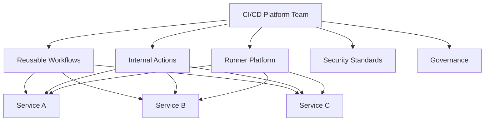
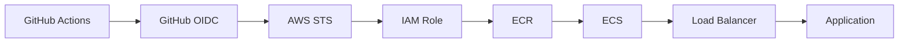
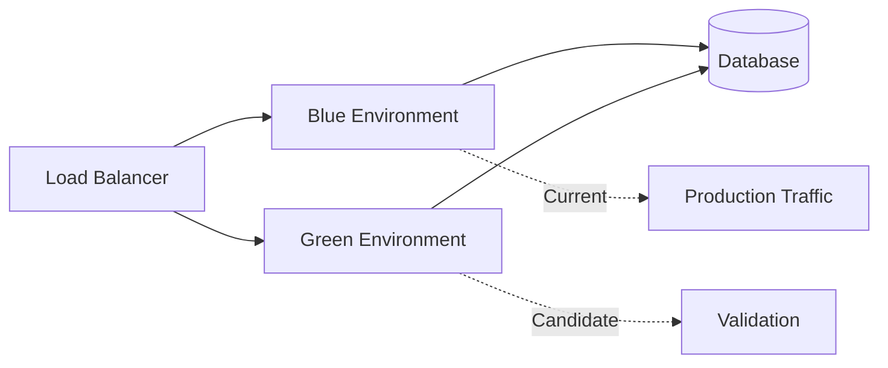
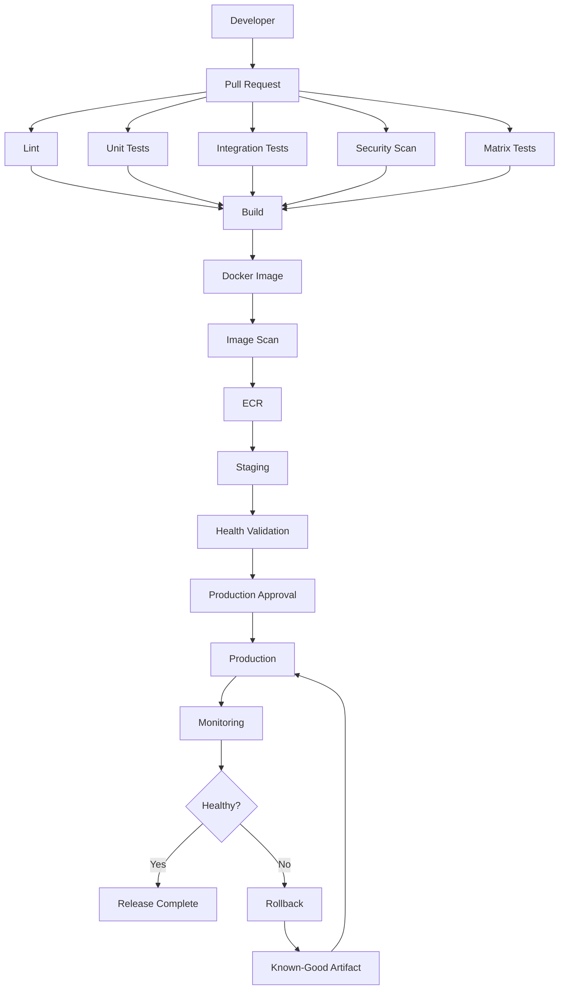

# README

## Overview

The `10- Architecture` section documents GitHub Actions as a production-grade CI/CD platform rather than a collection of YAML files.

The focus is system-level design:

```text
Repository
    ↓
CI Architecture
    ↓
Build
    ↓
Immutable Artifact
    ↓
Artifact Registry
    ↓
Environment Promotion
    ↓
Deployment
    ↓
Monitoring
    ↓
Rollback / Recovery
```

The documentation in this section connects workflow mechanics with the engineering concerns that matter at scale:

- Reliability
- Failure isolation
- Security
- Scalability
- Maintainability
- Deployment safety
- Artifact integrity
- Environment promotion
- Runner architecture
- Recovery
- Governance
- Operational visibility

The intended outcome is the ability to design, operate, troubleshoot, and evolve a production GitHub Actions platform for Python, Docker, AWS, and distributed backend systems.

---

## Section Scope

This section focuses on **architecture and system-level CI/CD design**.

It builds on the lower-level GitHub Actions concepts covered elsewhere in the playbook and explains how those capabilities should be combined into production architectures.

The major areas are:

| Area | Focus |
|---|---|
| CI Architecture | Test, build, validation, and artifact creation |
| CD Architecture | Artifact promotion and deployment |
| Production Architecture | End-to-end CI/CD platform design |
| Reusable Workflows | Shared pipeline architecture |
| Enterprise Architecture | Centralized governance and platform ownership |
| Docker Architecture | Container build and publication |
| AWS Architecture | OIDC, ECR, ECS, EC2, Lambda, and IaC |
| Artifact Promotion | Build once, promote many |
| Environment Promotion | Staging and production boundaries |
| Deployment Strategies | Rolling, blue-green, canary, zero downtime |
| Failure Domains | Isolation and blast-radius control |
| Recovery | Rollback and disaster recovery |
| Scalability | Workflow, runner, and platform scaling |
| Reliability | Deterministic and resilient pipelines |

---

## Architecture Learning Flow

The recommended progression is:

```text
Fundamentals
      ↓
Workflow Configuration
      ↓
Advanced Workflows
      ↓
Custom Actions
      ↓
Containers and Testing
      ↓
Security
      ↓
CI/CD and Deployment
      ↓
Runners and Operations
      ↓
Troubleshooting
      ↓
Architecture
      ↓
CLI
      ↓
Interview Preparation
```

The architecture section should be studied after understanding the individual GitHub Actions building blocks.

---

## Architecture Documents

### CI/CD Architecture

| Document | Purpose |
|---|---|
| `01- CI Pipeline Architecture.md` | Design CI workflows for linting, testing, security checks, matrices, builds, and artifacts |
| `02- CD Pipeline Architecture.md` | Design deployment pipelines around immutable artifacts and controlled environments |
| `03- Build Once Deploy Many.md` | Establish artifact immutability and environment-independent builds |
| `05- Environment Promotion.md` | Design controlled promotion across development, staging, and production |
| `06- Deployment Approvals.md` | Implement human approval and deployment protection |
| `08- Deployment Concurrency.md` | Prevent deployment races and conflicting production operations |

A typical production pipeline is:

```text
Pull Request
    ↓
Lint
    ↓
Unit Tests
    ↓
Integration Tests
    ↓
Security Scan
    ↓
Matrix Testing
    ↓
Build
    ↓
Docker Image
    ↓
ECR
    ↓
Staging
    ↓
Approval
    ↓
Production
    ↓
Monitoring
    ↓
Rollback
```

---

## Artifact and Container Architecture

| Document | Purpose |
|---|---|
| `09- Docker Image Build and Publishing.md` | Build and publish production Docker images |
| `11- Docker Layer Caching.md` | Design efficient and secure Docker build caching |
| `12- Amazon ECR Deployment.md` | Integrate GitHub Actions with Amazon ECR |
| `14- Amazon ECS Deployment.md` | Deploy containerized services to ECS |
| `15- Amazon EC2 Deployment.md` | Deploy backend applications to EC2 |
| `17- CloudFormation Deployment.md` | Integrate CloudFormation infrastructure deployment |
| `18- Terraform Deployment.md` | Integrate Terraform with CI/CD |

The architecture principle is:

```text
Source Code
    ↓
Build
    ↓
Test
    ↓
Scan
    ↓
Immutable Artifact
    ↓
Registry
    ↓
Promote
    ↓
Deploy
```

Production environments should preferably consume the **same artifact that was validated earlier**, rather than rebuilding separately for each environment.

---

## Deployment Strategy Architecture

| Document | Purpose |
|---|---|
| `20- Blue Green Deployment.md` | Active/standby deployment architecture |
| `21- Canary Deployment.md` | Progressive traffic-based deployment |
| `23- Zero Downtime Deployment.md` | Deployment architecture that preserves service availability |
| `24- Rollback Strategies.md` | Recovery using known-good versions |
| `26- Semantic Versioning and Releases.md` | Release identity and lifecycle management |

Deployment strategy selection depends on:

- Application architecture.
- Traffic characteristics.
- Infrastructure capabilities.
- Database compatibility.
- Rollback requirements.
- Operational maturity.
- Cost.
- Risk tolerance.

---

## Failure and Recovery Architecture

| Document | Purpose |
|---|---|
| `15- Failure Domains and Recovery.md` | Identify failure boundaries and design recovery paths |

Failure domains should be explicit:

```text
GitHub Platform
      ↓
Organization
      ↓
Repository
      ↓
Workflow
      ↓
Job
      ↓
Runner
      ↓
Artifact / Registry
      ↓
AWS Authentication
      ↓
Deployment
      ↓
Application
      ↓
Database / Redis / Kafka
```

A failure in one domain should not unnecessarily propagate to unrelated domains.

The recovery model should be:

```text
Failure
   ↓
Detection
   ↓
Classification
   ↓
Isolation
   ↓
Diagnosis
   ↓
Recovery
   ↓
Validation
   ↓
Prevention
```

---

## Scalable GitHub Actions Architecture

The architecture should evolve as repository and deployment volume increases.

A scalable model separates:

```text
Application Teams
       ↓
Reusable Workflows
       ↓
Platform Standards
       ↓
Runner Infrastructure
       ↓
Artifact Infrastructure
       ↓
Deployment Infrastructure
```

### Application Teams

Own:

- Application code.
- Application tests.
- Service-specific configuration.
- Deployment requirements.
- Application-level observability.

### Platform Team

Owns:

- Reusable workflows.
- Shared actions.
- Runner infrastructure.
- Security standards.
- Action governance.
- Artifact standards.
- Deployment patterns.
- CI/CD observability.

This creates a platform model without forcing every repository to duplicate infrastructure logic.

---

## Reusable Workflow Architecture

Reusable workflows provide the orchestration layer for shared CI/CD behavior.

```text
Repository A ─┐
Repository B ─┼──> Reusable CI Workflow
Repository C ─┘
```

For deployment:

```text
Service A ─┐
Service B ─┼──> Reusable Deployment Workflow
Service C ─┘
```

Reusable workflows are appropriate when multiple jobs must be coordinated.

Composite actions are better suited to packaging reusable steps within a job.

```text
Reusable Workflow
    ├── Job
    ├── Job
    └── Job

Composite Action
    └── Step 1
        Step 2
        Step 3
```

---

## Enterprise Workflow Architecture

At larger scale, centralization should happen at the right abstraction level.



The objective is not maximum centralization.

The objective is:

```text
Centralize Standards
+
Centralize Infrastructure
+
Decentralize Application Logic
```

---

## Docker CI/CD Architecture

A production Docker pipeline typically follows:

```text
Git Commit
    ↓
Checkout
    ↓
Dependency Installation
    ↓
Tests
    ↓
Docker Buildx
    ↓
Layer Cache
    ↓
Security Scan
    ↓
SBOM / Provenance
    ↓
Push to ECR
    ↓
Record Image Digest
```

Use immutable identity such as:

```text
orders-api:git-8f2c91a
```

and preferably retain the resulting digest:

```text
sha256:...
```

The digest provides stronger artifact identity than mutable tags.

---

## AWS Deployment Architecture

A common AWS model is:



The authentication flow is:

```text
GitHub Actions
    ↓
OIDC Token
    ↓
AWS STS
    ↓
AssumeRoleWithWebIdentity
    ↓
Temporary AWS Credentials
    ↓
ECR / ECS / S3 / Other AWS Services
```

Long-lived AWS access keys should not be the default authentication mechanism for GitHub Actions when OIDC is available.

---

## Artifact Promotion Architecture

The preferred model is:

```text
Build Once
    ↓
Immutable Artifact
    ↓
Test
    ↓
Staging
    ↓
Approval
    ↓
Production
```

Not:

```text
Build for Development
    ↓
Build for Staging
    ↓
Build for Production
```

Rebuilding introduces the possibility that different environments receive different binaries or container layers.

---

## Environment Promotion Architecture

A typical environment model is:

```text
Development
     ↓
Integration / QA
     ↓
Staging
     ↓
Production
```

Production should have stronger controls:

- Protected environment.
- Required reviewers where appropriate.
- Restricted deployment branches/tags.
- Dedicated secrets.
- AWS account or role isolation.
- Deployment concurrency.
- Health validation.
- Rollback capability.

---

## Environment Configuration

Application artifacts should remain environment-independent where practical.

Separate:

```text
Artifact
```

from:

```text
Environment Configuration
```

For example:

```text
Docker Image
    +
Production Database URL
    +
Production Redis URL
    +
Production Feature Configuration
```

This supports build-once/deploy-many.

---

## Blue-Green Architecture



The deployment process is:

```text
Current Blue
    ↓
Deploy Green
    ↓
Validate Green
    ↓
Switch Traffic
    ↓
Green Active
    ↓
Keep Blue Available for Recovery
```

Advantages:

- Fast traffic switching.
- Clear rollback path.
- Strong deployment isolation.

Limitations:

- Requires additional capacity.
- Database compatibility remains important.
- Stateful components require careful design.

---

## Canary Architecture

Canary deployment progressively exposes traffic:

```text
100% Current
     ↓
5% Canary
     ↓
25%
     ↓
50%
     ↓
100%
```

Promotion should depend on observable signals:

- Error rate.
- Latency.
- Resource utilization.
- Health checks.
- Business metrics.

If validation fails:

```text
Stop Promotion
      ↓
Route Traffic Back
      ↓
Investigate
```

---

## Rolling Deployment Architecture

Rolling deployments replace instances gradually.

```text
Old Old Old Old
      ↓
New Old Old Old
      ↓
New New Old Old
      ↓
New New New Old
      ↓
New New New New
```

Important considerations include:

- Readiness.
- Graceful shutdown.
- Connection draining.
- Capacity.
- Backward compatibility.
- Database schema compatibility.

---

## Zero-Downtime Architecture

Zero downtime requires coordination across multiple layers:

```text
Load Balancer
      ↓
Readiness
      ↓
Application
      ↓
Database
      ↓
Cache
      ↓
Messaging
```

A deployment mechanism alone cannot guarantee zero downtime.

The application must tolerate version overlap.

---

## Database Compatibility

For rolling and blue-green deployments, prefer expand-and-contract migrations:

```text
Expand
  ↓
Deploy Compatible Application
  ↓
Backfill / Migrate
  ↓
Switch Usage
  ↓
Contract
```

Avoid deploying code that immediately requires a schema that older instances cannot understand.

---

## Failure Domains

Architecture should explicitly identify:

| Domain | Typical Failure |
|---|---|
| Workflow | Invalid configuration |
| Runner | Capacity or host failure |
| Test Infrastructure | PostgreSQL/Redis unavailable |
| Artifact | Upload failure |
| Registry | ECR unavailable |
| Authentication | OIDC/IAM failure |
| Deployment | ECS/EC2/Kubernetes failure |
| Runtime | Application startup failure |
| Database | Migration or availability failure |
| Messaging | Kafka failure |
| Governance | Policy or permission failure |

This classification accelerates troubleshooting.

---

## High Availability for CI/CD

CI/CD availability can be improved with:

- Multiple runner instances.
- Runner autoscaling.
- Ephemeral runners.
- Multiple runner groups.
- Reliable artifact storage.
- Immutable artifacts.
- Independent environments.
- Versioned reusable workflows.
- Deployment concurrency.
- Documented recovery procedures.

Do not confuse CI/CD availability with application availability.

A production service can remain healthy even while CI is unavailable if the runtime is already deployed.

---

## Runner Architecture

Runner architecture should match workload requirements.

| Runner Model | Typical Use |
|---|---|
| GitHub-hosted | Standard CI workloads |
| Persistent self-hosted | Specialized controlled environments |
| Ephemeral self-hosted | High-isolation workloads |
| Autoscaled runners | Variable workloads |
| Dedicated deployment runners | Sensitive production operations |

Production runner architecture should consider:

- Isolation.
- Network access.
- Capacity.
- Software versions.
- Security.
- Lifecycle.
- Monitoring.

---

## Private Network Architecture

Some workflows require access to:

- Private PostgreSQL.
- Private Redis.
- Internal APIs.
- Kafka.
- Private package registries.
- AWS private services.

A common architecture is:

```text
GitHub
   ↓
Ephemeral Self-Hosted Runner
   ↓
Private Network
   ├── PostgreSQL
   ├── Redis
   ├── Kafka
   └── Internal APIs
```

The runner becomes a security boundary and must therefore be hardened and isolated.

---

## Security Architecture

Security controls should exist at multiple layers:

```text
Repository
   ↓
Workflow
   ↓
Permissions
   ↓
Secrets
   ↓
Actions
   ↓
Runner
   ↓
Artifact
   ↓
Registry
   ↓
Deployment
   ↓
Runtime
```

Important controls include:

- Least-privilege `GITHUB_TOKEN`.
- Job-level permissions.
- Environment protection.
- OIDC for AWS.
- SHA-pinned actions.
- Trusted action sources.
- Ephemeral runners.
- Artifact provenance.
- SBOM.
- Signing/attestations.
- Restricted production access.

---

## Production CI/CD Reference Architecture



---

## Platform Ownership Model

A practical ownership model is:

| Capability | Platform | Application |
|---|---|---|
| Reusable workflows | Own | Consume |
| Internal actions | Own | Consume |
| Runner platform | Own | Request capacity |
| Security standards | Own | Follow |
| Application tests | Standardize | Own |
| Dockerfile | Guidelines | Own |
| Deployment configuration | Provide framework | Own service specifics |
| Environment protection | Own standards | Participate |
| Application monitoring | Standards | Own |
| Release strategy | Provide patterns | Select appropriate pattern |

This prevents both extremes:

```text
Everything centralized
```

and:

```text
Every repository reinvents CI/CD
```

---

## Governance Architecture

Enterprise governance should cover:

- Approved actions.
- SHA pinning.
- Permissions.
- Reusable workflows.
- Runner groups.
- Production environments.
- Secrets.
- OIDC roles.
- Artifact standards.
- Deployment controls.

A mature model is:

```text
Policy
  ↓
Reusable Platform Components
  ↓
Repository Adoption
  ↓
Monitoring
  ↓
Exception Management
```

---

## Architecture Decision Criteria

When designing a CI/CD system, evaluate:

| Concern | Questions |
|---|---|
| Reliability | What happens when a dependency fails? |
| Security | What can a compromised workflow access? |
| Scalability | What happens when repository count increases? |
| Performance | What is the critical path? |
| Cost | Which workloads consume the most compute? |
| Maintainability | How many workflows require changes for one policy update? |
| Recovery | Can production be restored using a known-good artifact? |
| Governance | Can unsafe configurations be prevented centrally? |
| Observability | Can failures be diagnosed from available evidence? |
| Availability | What happens if runners or CI infrastructure fail? |

---

## Common Architecture Mistakes

### Treating GitHub Actions as Only YAML

A production CI/CD system is a distributed platform involving:

```text
GitHub
+
Runners
+
Artifacts
+
Registries
+
Cloud IAM
+
Deployment Platforms
+
Runtime Systems
```

### Rebuilding for Every Environment

This weakens artifact consistency.

Prefer:

```text
Build Once → Promote
```

### Using Mutable Deployment Tags

Prefer immutable image identity.

### Sharing Excessive Permissions

A workflow should not receive production-level permissions simply because one step needs them.

### One Shared Persistent Runner

A compromised or broken runner can affect many workloads.

### No Deployment Concurrency

Two production deployments can race.

### No Recovery Path

A deployment process without rollback or recovery procedures is incomplete.

### Centralizing Everything

Platform teams should provide standards and reusable infrastructure without owning every application decision.

---

## Cost and Performance Architecture

CI/CD cost is driven by:

```text
Workflow Frequency
×
Execution Duration
×
Runner Cost
×
Parallelism
```

Optimize by:

- Avoiding unnecessary workflow triggers.
- Using path filtering.
- Caching dependencies.
- Caching Docker layers.
- Right-sizing runners.
- Using matrices selectively.
- Avoiding excessive parallelism.
- Reusing workflows.
- Separating fast PR validation from slower scheduled testing.

Do not optimize cost by removing required production controls.

---

## Observability Architecture

Track the CI/CD platform itself.

Recommended metrics include:

```text
Workflow Success Rate
Workflow Duration
Queue Time
Runner Utilization
Runner Failure Rate
Cache Hit Rate
Artifact Failure Rate
Deployment Failure Rate
Rollback Rate
Mean Recovery Time
```

A useful deployment trace is:

```text
Commit SHA
    ↓
Workflow Run
    ↓
Artifact
    ↓
Image Digest
    ↓
Environment
    ↓
Deployment
    ↓
Runtime
```

This allows operators to correlate a production issue with the exact CI/CD execution that produced the deployed artifact.

---

## CLI Operations

GitHub CLI should be used as an operational interface for Actions.

### List Workflows

```bash
gh workflow list
```

### List Recent Runs

```bash
gh run list
```

### Inspect a Run

```bash
gh run view <run-id>
```

### View Logs

```bash
gh run view <run-id> --log
```

### Rerun a Failed Run

```bash
gh run rerun <run-id> --failed
```

### Run a Workflow Manually

```bash
gh workflow run deploy.yml --ref main
```

### List Artifacts

```bash
gh run view <run-id> --json artifacts
```

### List Repository Secrets

```bash
gh secret list
```

### List Repository Variables

```bash
gh variable list
```

The CLI is most valuable for repeatable operational workflows and incident diagnosis.

---

## Architecture Troubleshooting

When debugging a production pipeline, avoid jumping directly to the last failed command.

Use:

```text
Trigger
  ↓
Workflow
  ↓
Job
  ↓
Step
  ↓
Runner
  ↓
Dependency
  ↓
Artifact
  ↓
Authentication
  ↓
Deployment
  ↓
Runtime
```

For each layer ask:

1. Did this layer execute?
2. Did it receive the expected inputs?
3. Did it produce the expected outputs?
4. Did the next layer consume those outputs?
5. Is the failure isolated or shared?

---

## Architecture Troubleshooting Matrix

| Symptom | First Failure Domain to Investigate |
|---|---|
| Workflow never starts | Trigger / repository |
| Workflow starts but job is skipped | Conditions / dependencies |
| All jobs fail to start | Runner / platform |
| One matrix leg fails | Runtime / dependency |
| Artifact missing | Build / artifact |
| ECR push fails | AWS / registry |
| `AccessDenied` | IAM / OIDC |
| Deployment races | Concurrency |
| Deployment accepted but application unhealthy | Runtime |
| Rollback fails | Artifact / deployment / compatibility |
| Multiple repositories fail | Shared platform dependency |
| CI suddenly becomes slow | Runner capacity / queue / dependency |

---

## Senior Design Principles

### Build Once, Promote Many

The artifact should be the stable boundary between CI and CD.

### Separate Control Planes

CI, deployment orchestration, and runtime systems should have clear responsibilities.

### Minimize Blast Radius

A failure should affect the smallest practical scope.

### Prefer Immutable State

Immutable artifacts and explicit versions simplify diagnosis and rollback.

### Make Recovery First-Class

Recovery should be designed alongside deployment.

### Centralize Repeated Engineering

Reusable workflows and actions should remove duplication without hiding application-specific behavior.

### Secure Every Boundary

Authentication, authorization, artifacts, runners, actions, and environments all require explicit controls.

### Optimize the Critical Path

Parallelize independent work while protecting constrained dependencies.

### Treat Observability as Architecture

Without deployment and workflow telemetry, production CI/CD becomes difficult to operate reliably.

---

## Senior Interview Scenarios

### Design a CI/CD Platform for 100+ Backend Repositories

Discuss:

- Reusable workflows.
- Internal actions.
- Runner architecture.
- Action governance.
- Artifact standards.
- OIDC.
- Environment protection.
- Central platform ownership.
- Versioning and rollout strategy.

### Production Must Never Have Two Deployments Running Simultaneously

Use:

```yaml
concurrency:
  group: production
  cancel-in-progress: false
```

Then combine it with environment protection and deployment health validation.

### How Would You Promote a Docker Image From Staging to Production Without Rebuilding?

Use the immutable image digest:

```text
Build
 ↓
Push to ECR
 ↓
Staging
 ↓
Validate
 ↓
Record Digest
 ↓
Production Deploy Same Digest
```

### How Would You Design GitHub Actions for a Private AWS VPC?

Use controlled self-hosted runners or an appropriate private connectivity architecture, with:

- Runner groups.
- Private networking.
- Least privilege.
- OIDC.
- Ephemeral execution where appropriate.
- Network segmentation.

### A Shared Reusable Workflow Breaks 200 Repositories. How Do You Prevent This?

Use:

- Versioned workflows.
- Backward-compatible interfaces.
- Consumer testing.
- Progressive rollout.
- Change ownership.
- Deprecation periods.
- Rollback to the previous workflow version.

### How Do You Design CI/CD Recovery if GitHub Actions Becomes Unavailable?

Separate:

```text
CI Availability
```

from:

```text
Runtime Availability
```

Maintain known-good immutable artifacts and documented operational recovery procedures.

### A Deployment Fails After a Database Migration. Should You Roll Back?

Not automatically.

First determine:

- Whether the migration is backward compatible.
- Whether data was transformed.
- Whether rollback is reversible.
- Whether old application versions can operate against the current schema.

A roll-forward fix may be safer than application rollback.

---

## Production Readiness Checklist

### Workflow Architecture

- [ ] Workflow responsibilities are clearly separated.
- [ ] Reusable workflows eliminate significant duplication.
- [ ] Workflow versions are controlled.
- [ ] Dependencies are explicit.
- [ ] Concurrency is configured where required.

### Security

- [ ] `GITHUB_TOKEN` uses least privilege.
- [ ] AWS authentication uses OIDC where appropriate.
- [ ] Production permissions are isolated.
- [ ] Third-party actions are governed.
- [ ] Actions are pinned according to organizational policy.
- [ ] Secrets are not exposed through logs or artifacts.

### Artifacts

- [ ] Builds produce immutable artifacts.
- [ ] Docker images have traceable identity.
- [ ] Artifact provenance is available where required.
- [ ] Production uses the validated artifact.
- [ ] Artifact retention meets recovery requirements.

### Runners

- [ ] Runner pools are appropriately isolated.
- [ ] Capacity is monitored.
- [ ] Sensitive workloads use appropriate runner isolation.
- [ ] Runner lifecycle is managed.
- [ ] Private network access is controlled.

### Deployment

- [ ] Environments are protected.
- [ ] Production deployment concurrency is controlled.
- [ ] Health validation exists.
- [ ] Rollback is documented.
- [ ] Database compatibility is considered.
- [ ] Deployment strategy matches application requirements.

### Recovery

- [ ] Failure domains are documented.
- [ ] Known-good artifacts are retained.
- [ ] Recovery procedures are documented.
- [ ] Rollback has been tested.
- [ ] Incident evidence is preserved.
- [ ] Root-cause analysis feeds preventive improvements.

### Operations

- [ ] Workflow failures are observable.
- [ ] Runner capacity is monitored.
- [ ] Deployment metrics are available.
- [ ] Artifact and registry failures are visible.
- [ ] CI/CD cost is monitored.
- [ ] Operational ownership is clear.

---

## Completion Criteria

A senior backend engineer should be able to use this section to reason about a complete production CI/CD platform:

```text
Repository
    ↓
Trigger
    ↓
Workflow
    ↓
Reusable Components
    ↓
Runner
    ↓
Lint / Test / Security
    ↓
Build
    ↓
Immutable Artifact
    ↓
Registry
    ↓
Environment Promotion
    ↓
Approval
    ↓
Deployment
    ↓
Health Validation
    ↓
Monitoring
    ↓
Rollback / Recovery
```

The engineer should also be able to explain:

- Where failures can occur.
- How failures are isolated.
- How artifacts move through environments.
- How GitHub Actions authenticates with AWS.
- How runners scale.
- How deployments avoid race conditions.
- How production deployments are protected.
- How immutable artifacts enable rollback.
- How reusable workflows support organizational scale.
- How CI/CD infrastructure itself is monitored.
- How to recover when a dependency or deployment mechanism fails.

## Key Takeaways

- **The architecture section treats GitHub Actions as a production CI/CD platform composed of workflows, runners, artifacts, registries, cloud identity, deployment systems, and runtime dependencies.**
- **Build once, produce immutable artifacts, and promote the same artifact through environments to improve consistency, traceability, and rollback safety.**
- **Reusable workflows, controlled runner architecture, environment protection, OIDC, concurrency, and governance provide the foundation for scalable enterprise CI/CD.**
- **Failure domains should be explicit so that workflow, runner, artifact, authentication, deployment, and runtime failures can be isolated and recovered independently.**
- **A production-ready CI/CD architecture must include observability, security, scalability, cost controls, deployment validation, rollback, and tested recovery procedures—not just successful workflow execution.**