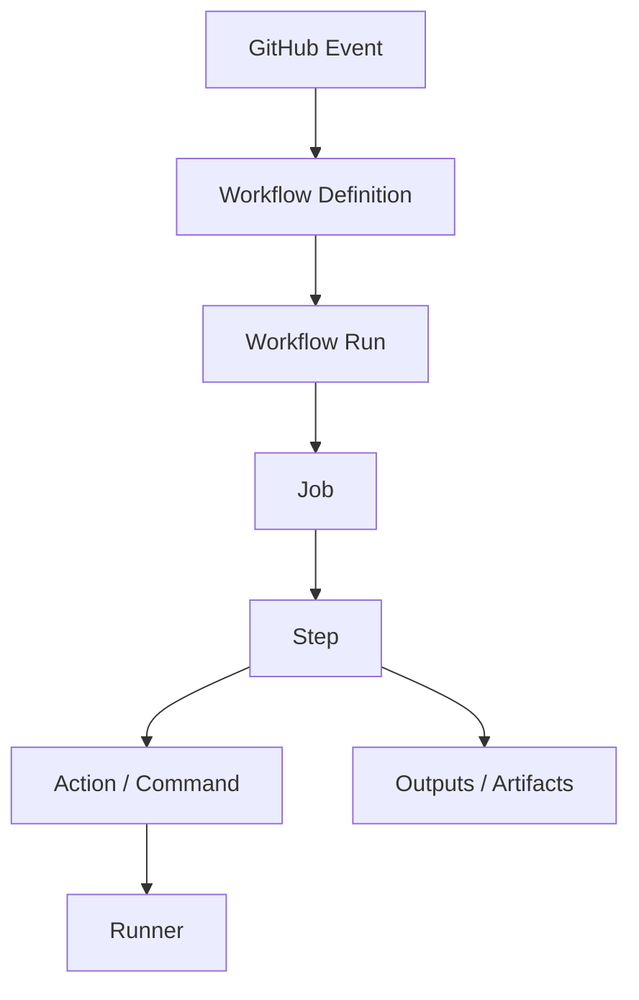
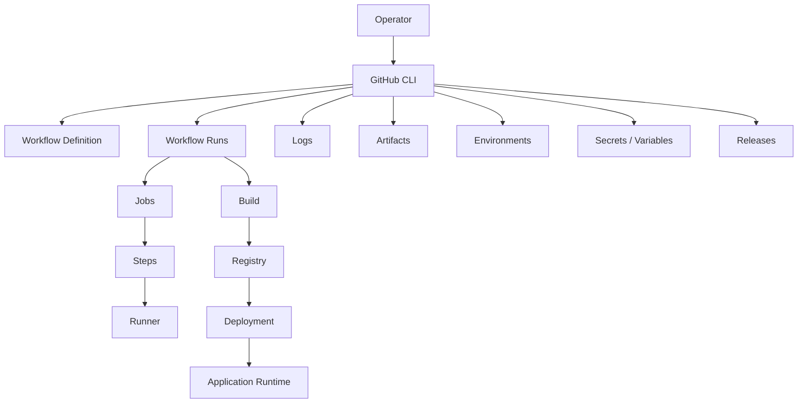

# 02- Workflow Inspection

## Overview

Workflow inspection is the process of examining GitHub Actions workflow definitions and their executions to understand what ran, why it ran, what succeeded or failed, and what operational state it produced.

For CI/CD operations, inspection should distinguish between:

```text
Workflow Definition
        ↓
Workflow Trigger
        ↓
Workflow Run
        ↓
Jobs
        ↓
Steps
        ↓
Artifacts / Outputs
        ↓
Deployment
```

GitHub CLI (`gh`) provides the command-line interface for this inspection.

Typical operational questions include:

- Which workflows exist?
- Is the workflow enabled?
- When did it last run?
- What triggered the run?
- Which commit was tested?
- Which jobs ran?
- Which job failed?
- Which step failed?
- What logs explain the failure?
- Was the run cancelled or skipped?
- Which artifact was produced?
- Was the deployment actually completed?
- Can the run be safely rerun?

The goal is not simply to retrieve logs. It is to reconstruct the execution path and identify the actual failure domain.

---

## Workflow Definition vs Workflow Run

These concepts must remain separate.

### Workflow Definition

A workflow is the automation configuration stored under:

```text
.github/workflows/
```

For example:

```text
.github/workflows/ci.yml
.github/workflows/deploy.yml
.github/workflows/security.yml
```

The workflow defines:

- Events.
- Jobs.
- Steps.
- Permissions.
- Matrices.
- Concurrency.
- Environments.
- Dependencies.

### Workflow Run

A run is one execution of that workflow.

```text
deploy.yml
    ↓
Run #12345
```

One workflow can therefore have many runs.

```text
Workflow
 ├── Run 100
 ├── Run 101
 ├── Run 102
 └── Run 103
```

This distinction is fundamental when diagnosing CI/CD failures.

---

## GitHub Actions Execution Model

A useful inspection model is:



When investigating a failure, move through these layers rather than jumping directly to the final error message.

---

## Why Workflow Inspection Matters

A workflow can fail at several independent layers:

```text
Trigger
  ↓
Workflow Configuration
  ↓
Job Scheduling
  ↓
Runner
  ↓
Step
  ↓
Dependency
  ↓
Artifact
  ↓
Deployment
  ↓
Runtime
```

The visible error may occur late in the chain while the actual problem originated earlier.

For example:

```text
AWS deployment failed
        ↓
Image unavailable
        ↓
ECR push failed
        ↓
AWS authentication failed
        ↓
OIDC trust policy incorrect
```

Inspecting only the deployment error would miss the root cause.

---

## Installing and Authenticating GitHub CLI

Verify the CLI:

```bash
gh --version
```

Authenticate:

```bash
gh auth login
```

Check authentication:

```bash
gh auth status
```

For automation, GitHub CLI can use `GH_TOKEN`:

```bash
export GH_TOKEN="$CI_GITHUB_TOKEN"
```

Never print the token during troubleshooting.

---

## Repository Context

Most `gh` commands can operate against the current repository.

Inspect the repository:

```bash
gh repo view
```

For explicit cross-repository operations:

```bash
gh run list --repo acme/orders-api
```

Using `--repo OWNER/REPOSITORY` is preferable for platform automation operating across many repositories because it avoids ambiguity about the current working directory.

---

## Listing Workflows

List configured workflows:

```bash
gh workflow list
```

For a specific repository:

```bash
gh workflow list --repo acme/orders-api
```

A workflow list helps establish the available automation surface before inspecting individual runs.

Typical workflows may include:

```text
CI
Security
Integration Tests
Deploy Staging
Deploy Production
Release
```

---

## Workflow Status

A workflow definition can be active or disabled.

Do not confuse workflow availability with workflow execution.

```text
Workflow Exists
       ↓
Workflow Enabled
       ↓
Trigger Occurs
       ↓
Run Created
```

If a workflow does not appear to execute, inspect these stages separately.

---

## Inspecting a Workflow

A workflow can be referenced by:

- File name.
- Workflow identifier.
- Repository context.

For example:

```bash
gh workflow view ci.yml
```

The exact options available depend on the installed GitHub CLI version.

The purpose of workflow inspection is to understand the configured automation before investigating a particular run.

---

## Listing Workflow Runs

List recent runs:

```bash
gh run list
```

Limit the output:

```bash
gh run list --limit 20
```

For a specific workflow:

```bash
gh run list --workflow ci.yml
```

For a branch:

```bash
gh run list --branch main
```

For a specific repository:

```bash
gh run list --repo acme/orders-api
```

---

## Filtering Workflow Runs

Useful filters include:

```bash
gh run list --workflow ci.yml --status failure
```

```bash
gh run list --workflow deploy.yml --branch main
```

```bash
gh run list --status success --limit 20
```

For production investigations:

```bash
gh run list \
  --workflow deploy.yml \
  --branch main \
  --status failure \
  --limit 10
```

This quickly narrows the search space.

---

## Run Status vs Conclusion

A workflow run has an execution state and a final result.

Conceptually:

```text
Status
    ↓
queued
in_progress
completed
```

After completion, a conclusion may indicate:

```text
success
failure
cancelled
skipped
```

These represent different operational situations.

For example:

```text
in_progress
```

means the workflow has not finished.

Whereas:

```text
completed + failure
```

means execution finished unsuccessfully.

---

## Inspecting a Run

Once a run ID is known:

```bash
gh run view <run-id>
```

Example:

```bash
gh run view 123456789
```

Inspecting a run should establish:

- Workflow name.
- Run identifier.
- Commit SHA.
- Branch.
- Trigger.
- Overall status.
- Jobs.
- Job conclusions.

---

## Run Inspection Flow

A practical investigation looks like:

```text
Run
 ↓
Commit
 ↓
Event
 ↓
Jobs
 ↓
Failed Job
 ↓
Failed Step
 ↓
Command
 ↓
Error
```

This is more useful than treating the run's overall conclusion as the root cause.

---

## Inspecting Jobs

A workflow can contain multiple jobs:

```yaml
jobs:
  lint:
    ...

  unit-tests:
    ...

  integration-tests:
    ...

  build:
    ...
```

The run can therefore produce:

```text
lint                → success
unit-tests          → success
integration-tests   → failure
build               → skipped
```

Inspection should identify the first meaningful failure.

---

## First Failure Principle

Suppose:

```text
lint              → PASS
unit-tests        → PASS
integration-tests → FAIL
build             → SKIPPED
deploy            → SKIPPED
```

The important failure is:

```text
integration-tests
```

The skipped downstream jobs are consequences rather than independent failures.

---

## Job Dependency Graph

A workflow may contain:

```yaml
jobs:
  test:
    ...

  build:
    needs: test

  deploy:
    needs: build
```

The execution graph is:

```text
test
 ↓
build
 ↓
deploy
```

If `test` fails:

```text
test → failure
build → skipped
deploy → skipped
```

When inspecting a run, understand `needs` relationships before interpreting skipped jobs.

---

## Matrix Job Inspection

Matrix workflows can produce many job instances.

Example:

```yaml
strategy:
  matrix:
    python-version:
      - "3.11"
      - "3.12"
```

The execution may appear as:

```text
test (3.11) → success
test (3.12) → failure
```

The workflow itself is not enough to identify the failing configuration.

Inspect the matrix combination.

---

## Matrix Failure Diagnosis

For a matrix failure, determine:

```text
Which dimension?
        ↓
Which value?
        ↓
Which job?
        ↓
Which step?
        ↓
Which command?
```

For example:

```text
Python 3.12
+
PostgreSQL 16
+
Ubuntu
```

may fail while another combination succeeds.

This often indicates a compatibility issue rather than a general workflow problem.

---

## Viewing Logs

View complete run logs:

```bash
gh run view <run-id> --log
```

For failed jobs:

```bash
gh run view <run-id> --log-failed
```

During incidents, `--log-failed` is often the fastest starting point because it focuses attention on failed execution paths.

---

## Log Investigation Strategy

Do not read large logs linearly unless necessary.

Use:

```text
Workflow
 ↓
Failed Job
 ↓
Failed Step
 ↓
First Error
 ↓
Relevant Context
```

Look for:

- First non-zero exit.
- Authentication errors.
- Connection failures.
- Missing files.
- Missing environment variables.
- Permission errors.
- Dependency failures.
- Timeout messages.

---

## First Meaningful Error

The last error is not always the root cause.

Example:

```text
Database connection failed
      ↓
Migration failed
      ↓
Tests failed
      ↓
Deployment failed
```

The database connectivity problem is likely more useful than the final test or deployment failure.

---

## Inspecting Logs for Python Applications

A Python backend workflow might contain:

```yaml
- name: Install dependencies
  run: pip install -r requirements.txt

- name: Run tests
  run: pytest

- name: Build
  run: docker build -t orders-api .
```

If the run fails, determine whether the problem is:

```text
Dependency installation
        ↓
Python environment
        ↓
pytest
        ↓
Docker build
```

For Django or FastAPI, also inspect:

- Environment variables.
- Database connectivity.
- Migration behavior.
- Service containers.
- Application startup.

---

## Inspecting Integration Test Failures

A typical pipeline may be:

```text
Python
 ↓
PostgreSQL
 ↓
Redis
 ↓
pytest
```

If tests fail, inspect whether:

```text
PostgreSQL started
Redis started
Application configured correctly
Migrations completed
Tests executed
```

A test failure is not automatically an application-code defect.

---

## Service Container Inspection

A workflow might define:

```yaml
services:
  postgres:
    image: postgres:16

  redis:
    image: redis:7
```

When integration tests fail, determine whether the service containers were:

- Started.
- Reachable.
- Ready.
- Correctly configured.

A common diagnostic mistake is debugging application credentials before confirming service readiness.

---

## Expression and Condition Inspection

Jobs and steps may use:

```yaml
if: ${{ success() }}
```

or:

```yaml
if: ${{ github.ref == 'refs/heads/main' }}
```

If a step is skipped, inspect:

- `if` condition.
- `needs`.
- Previous job status.
- Event context.
- Branch/path filters.
- Status functions.

Do not interpret every skipped step as a failure.

---

## Status Functions

GitHub Actions supports status-check functions including:

```text
success()
failure()
cancelled()
always()
```

They affect conditional execution.

For example:

```yaml
- name: Upload test report
  if: ${{ !cancelled() }}
  uses: actions/upload-artifact@...
```

This can allow report collection after ordinary failures while still respecting cancellation behavior.

Use status functions deliberately because cleanup and reporting steps have different operational requirements.

---

## `continue-on-error`

A step or job can be configured to continue despite a failure.

This changes the interpretation of workflow state.

For example:

```yaml
- name: Experimental analysis
  continue-on-error: true
  run: ./experimental-check.sh
```

A successful workflow conclusion does not necessarily mean every command executed successfully when tolerated failures exist.

During inspection, identify any use of:

```yaml
continue-on-error: true
```

---

## Environment Inspection

Deployment workflows may target:

```text
development
staging
production
```

When inspecting a deployment run, determine:

- Target environment.
- Environment protection.
- Environment-specific configuration.
- Required approvals.
- Deployment history.

A successful staging deployment does not imply production deployment occurred.

---

## Secrets and Variables

Workflow behavior may depend on:

```text
env
vars
secrets
```

Inspection should confirm that configuration is present without exposing sensitive values.

Safe diagnostic pattern:

```yaml
- name: Debug configuration
  env:
    APP_ENV: ${{ vars.APP_ENV }}
    AWS_REGION: ${{ vars.AWS_REGION }}
  run: |
    printf 'APP_ENV=%s\n' "$APP_ENV"
    printf 'AWS_REGION=%s\n' "$AWS_REGION"
```

Never print secret values.

---

## Permission Inspection

A run can fail because of:

```text
GITHUB_TOKEN
permissions
environment protection
AWS IAM
```

Inspect the workflow's permission configuration:

```yaml
permissions:
  contents: read
  id-token: write
```

The required permissions depend on what the workflow performs.

A `403` from GitHub or `AccessDenied` from AWS should be treated as an authorization problem until proven otherwise.

---

## OIDC and AWS Inspection

A deployment may use:

```text
GitHub Actions
    ↓
OIDC
    ↓
AWS STS
    ↓
IAM Role
    ↓
ECR / ECS / EC2 / S3
```

When inspection shows AWS authentication failure, separate:

```text
GitHub permission
        ↓
OIDC token
        ↓
IAM trust policy
        ↓
STS
        ↓
IAM permissions
```

A failure at one layer does not imply the others are incorrect.

---

## AWS Identity Verification

When AWS authentication appears successful, verify the actual identity:

```bash
aws sts get-caller-identity
```

This confirms which AWS principal is being used.

It is particularly valuable when troubleshooting:

- OIDC.
- Multiple AWS accounts.
- Multiple roles.
- Self-hosted runners.
- Stale credentials.

---

## Docker Build Inspection

A CI workflow may build:

```bash
docker buildx build .
```

If the build fails, inspect:

```text
Dockerfile
Build context
Dependencies
Build arguments
Secrets
Cache
Architecture
Runner resources
```

For local reproduction:

```bash
docker buildx build --progress=plain .
```

Verbose BuildKit output can reveal the first failing build layer.

---

## ECR Inspection

A typical flow is:

```text
Docker Build
 ↓
AWS Authentication
 ↓
ECR Login
 ↓
Docker Push
 ↓
Image Digest
```

If deployment fails after the image was published, inspect the ECR image identity before rebuilding.

The preferred deployment reference is an immutable digest:

```text
sha256:...
```

rather than relying only on:

```text
latest
```

---

## Artifact Inspection

Artifacts are useful for:

- Test reports.
- Coverage reports.
- Build outputs.
- Debugging files.
- Generated packages.

Inspect the workflow run:

```bash
gh run view <run-id>
```

Determine:

```text
Was artifact generation executed?
        ↓
Was the file created?
        ↓
Was upload executed?
        ↓
Was upload successful?
        ↓
Is the consumer using the correct run?
```

---

## Artifact vs Cache During Inspection

Do not confuse artifacts with caches.

### Artifact

Represents a deliberate workflow output.

```text
Build
 ↓
Artifact
 ↓
Later Job / Consumer
```

### Cache

Optimizes repeated work.

```text
Previous Dependencies
 ↓
Cache
 ↓
Faster Build
```

A cache miss should normally not invalidate correctness.

An expected artifact missing may indicate a pipeline failure.

---

## Workflow Outputs

Data may move between jobs through outputs:

```text
Step Output
    ↓
Job Output
    ↓
needs.<job>.outputs
```

For example:

```yaml
- id: version
  run: echo "value=2.4.0" >> "$GITHUB_OUTPUT"
```

A downstream job may consume:

```yaml
${{ needs.build.outputs.version }}
```

When inspecting dynamic workflows, verify these data boundaries.

---

## Dynamic Matrix Inspection

A planning job may generate JSON:

```yaml
outputs:
  services: ${{ steps.plan.outputs.services }}
```

A later job may use:

```yaml
matrix:
  service: ${{ fromJSON(needs.plan.outputs.services) }}
```

If matrix creation fails, inspect:

```text
Planning job
 ↓
Step output
 ↓
JSON validity
 ↓
Job output
 ↓
fromJSON()
 ↓
Matrix expansion
```

This is a common advanced workflow failure domain.

---

## Reusable Workflow Inspection

A repository may call:

```yaml
uses: acme/platform/.github/workflows/ci.yml@v2
```

When inspection shows unexpected behavior, determine:

- Referenced repository.
- Workflow path.
- Workflow version/ref.
- Inputs.
- Secrets.
- Permissions.
- Environment.
- Outputs.

A reusable workflow update can affect many repositories.

---

## Versioned Workflow Investigation

For a shared workflow:

```text
Repository A
Repository B
Repository C
      ↓
Reusable Workflow v2
```

If all repositories begin failing after a shared change, investigate the shared workflow before changing every consumer.

Versioning reduces blast radius:

```text
v1 → Existing Consumers
v2 → New Consumers
```

---

## Concurrency Inspection

Production workflows may use:

```yaml
concurrency:
  group: production
  cancel-in-progress: false
```

If a run is queued or cancelled unexpectedly, inspect concurrency configuration.

Potential causes include:

- Another deployment already running.
- Same concurrency group.
- `cancel-in-progress`.
- Multiple branches using the same group.
- Reusable workflow behavior.

Concurrency failures are often mistaken for runner or workflow failures.

---

## Deployment Inspection

A production deployment should be inspected as a lifecycle:

```text
Build
 ↓
Artifact
 ↓
Registry
 ↓
Deployment
 ↓
Health Check
 ↓
Traffic
```

A workflow ending in `success` does not necessarily mean the application is healthy unless the workflow explicitly validates runtime health.

---

## Health Validation

Deployment workflows should ideally validate:

- Task/pod/instance health.
- Readiness.
- HTTP health endpoints.
- Error rates.
- Application startup.
- Critical dependencies.

For a Django or FastAPI application:

```text
Deployment
 ↓
Application Startup
 ↓
/health
 ↓
Dependency Validation
 ↓
Traffic
```

---

## Production Deployment Inspection

Use:

```bash
gh run list \
  --workflow deploy.yml \
  --branch main \
  --limit 10
```

Then:

```bash
gh run view <run-id>
```

Then:

```bash
gh run view <run-id> --log-failed
```

If the run succeeded, continue inspecting the actual deployment target when required.

For AWS:

```bash
aws sts get-caller-identity
```

and then use the appropriate service-specific commands.

---

## Workflow Inspection With Structured JSON

GitHub CLI supports JSON output for many resources.

Example:

```bash
gh run list \
  --workflow deploy.yml \
  --json databaseId,status,conclusion,headSha \
  --limit 20
```

This is preferable for automation because JSON is machine-readable.

Example with `jq`:

```bash
gh run list \
  --workflow deploy.yml \
  --json databaseId,status,conclusion,headSha \
  --limit 20 |
  jq '.[] | select(.conclusion == "failure")'
```

---

## Programmatic Inspection

A Python operational tool can consume structured output:

```python
from __future__ import annotations

import json
import subprocess


result = subprocess.run(
    [
        "gh",
        "run",
        "list",
        "--workflow",
        "deploy.yml",
        "--json",
        "databaseId,status,conclusion,headSha",
        "--limit",
        "20",
    ],
    check=True,
    capture_output=True,
    text=True,
)

runs = json.loads(result.stdout)

for run in runs:
    if run["conclusion"] == "failure":
        print(
            f"Run {run['databaseId']} failed "
            f"for {run['headSha']}"
        )
```

Production automation should additionally implement:

- Timeouts.
- Retry limits.
- Structured error handling.
- Repository validation.
- Authentication validation.

---

## Inspecting Multiple Repositories

At organizational scale, platform teams may need to inspect many repositories.

A safe model is:

```text
Repository Inventory
       ↓
Workflow Inventory
       ↓
Recent Run Inventory
       ↓
Failure Detection
       ↓
Failure Classification
```

Do not assume every repository uses the same:

- Workflow names.
- Branch names.
- Environments.
- Runner labels.
- Deployment systems.

Use explicit configuration rather than brittle assumptions.

---

## Workflow Health Metrics

Inspection becomes more useful when historical behavior is measured.

Useful metrics include:

| Metric | Meaning |
|---|---|
| Success rate | Percentage of successful runs |
| Failure rate | Percentage of failed runs |
| Queue time | Time waiting for execution |
| Duration | Execution time |
| Rerun rate | Frequency of reruns |
| Flaky failure rate | Failures that disappear on retry |
| Deployment failure rate | Failed deployments |
| Rollback rate | Deployments requiring recovery |

A workflow that is technically successful but frequently requires manual reruns may have a reliability problem.

---

## Inspecting Flaky Failures

Suppose:

```text
Run 101 → failure
Run 102 → success
Run 103 → failure
Run 104 → success
```

This pattern suggests investigation into:

- Race conditions.
- External dependencies.
- Shared test state.
- Resource contention.
- Timing.
- Network instability.

Do not automatically classify intermittent failures as harmless.

---

## Comparing Workflow Runs

Comparing runs can reveal changes.

Track:

```text
Commit SHA
Workflow version
Runner
Branch
Duration
Failure
```

Example:

```text
Commit A → 4 min → success
Commit B → 4 min → success
Commit C → 18 min → failure
```

The change introduced around Commit C becomes an important investigation boundary.

---

## Inspecting Workflow Changes

Use Git to identify workflow changes:

```bash
git diff HEAD~1 -- .github/workflows/
```

Or inspect recent workflow history:

```bash
git log -- .github/workflows/
```

This is useful when a previously stable workflow suddenly begins failing.

---

## Failure Domain Model

Workflow inspection should classify failures into domains:

```text
Configuration
Trigger
Expression
Job
Step
Runner
Dependency
Artifact
Cache
Container
Custom Action
Authentication
AWS
Registry
Deployment
Concurrency
Security
Runtime
```

This prevents random troubleshooting.

---

## Troubleshooting Model

Use:

```text
Symptom
   ↓
Possible Causes
   ↓
Isolation Strategy
   ↓
Commands / Checks
   ↓
Root Cause
   ↓
Corrective Action
   ↓
Prevention
```

Example:

```text
ECS deployment failed
   ↓
Image unavailable
   ↓
Inspect ECR
   ↓
Verify image digest
   ↓
ECR push failed
   ↓
Fix AWS permissions
   ↓
Add pre-deployment image validation
```

---

## Common Inspection Mistakes

### Looking Only at the Final Workflow Status

`failure` does not identify the failure domain.

### Reading Logs From the Bottom Up

The last error may be a consequence.

Start from the first meaningful failure.

### Ignoring Skipped Jobs

Skipped jobs are often expected consequences of `needs` failures.

### Treating a Rerun as a Diagnosis

A successful rerun can indicate a transient failure, but it does not explain why the original run failed.

### Printing Secrets During Debugging

Never trade security for diagnostic convenience.

### Assuming a Successful Deployment Step Means a Healthy Application

Deployment success and runtime health are different states.

### Ignoring Concurrency

A queued or cancelled deployment may be caused by a concurrency group rather than runner capacity.

### Rebuilding an Existing Artifact

If the artifact already exists and is known-good, investigate why it was not consumed before rebuilding.

---

## Security Considerations

Workflow inspection itself can expose sensitive operational information.

Be careful with:

- Logs.
- Artifact contents.
- Environment configuration.
- Repository variables.
- Deployment metadata.
- AWS account information.
- Internal URLs.

Never expose:

- Secrets.
- Access tokens.
- Private keys.
- Passwords.
- Temporary credentials.

Log inspection should preserve evidence while minimizing unnecessary disclosure.

---

## Production Reliability

A reliable inspection process should be:

- Repeatable.
- Scriptable.
- Evidence-driven.
- Repository-aware.
- Environment-aware.
- Safe to execute during incidents.

Prefer:

```text
Structured Data
+
Explicit Identifiers
+
Bounded Automation
```

over manual assumptions.

---

## Scalability

At larger scale, inspection itself becomes an engineering problem.

Consider:

```text
100 repositories
×
10 workflows
×
100 runs
```

Manually inspecting each workflow does not scale.

Use:

- `gh --json`.
- `jq`.
- Python automation.
- Central metrics.
- Standard workflow metadata.
- Consistent naming.
- Reusable workflows.

The goal is to make CI/CD state queryable.

---

## Cost Considerations

Inspection should not create unnecessary workflow execution.

For example:

```bash
gh workflow run expensive-e2e.yml
```

should not be used merely to determine whether a workflow is configured correctly.

Inspect the workflow definition and existing runs first.

Operational tooling should minimize unnecessary:

- Runner consumption.
- Matrix executions.
- Docker builds.
- Integration environments.
- AWS resources.

---

## High Availability and Recovery

Workflow inspection is particularly important during CI/CD degradation.

If the CI platform is partially unavailable, operators should still be able to determine:

```text
What was the last known-good deployment?
What artifact was used?
Which commit produced it?
What was the last successful workflow?
```

This information supports rollback and recovery.

---

## Artifact Traceability

A production deployment should be traceable through:

```text
Commit SHA
    ↓
Workflow Run
    ↓
Build
    ↓
Image Digest
    ↓
Environment
    ↓
Deployment
```

This allows an operator to answer:

> Which exact source and artifact are running in production?

The GitHub CLI is one component of that traceability chain.

---

## Recovery Workflow

During a failed deployment:

```text
Identify Failed Run
       ↓
Inspect Logs
       ↓
Identify Artifact
       ↓
Check Current Production State
       ↓
Determine Rollback Safety
       ↓
Select Known-Good Artifact
       ↓
Recover
       ↓
Validate Health
```

Do not rerun production deployment blindly.

---

## Production Inspection Checklist

### Workflow

- [ ] Correct repository identified.
- [ ] Correct workflow identified.
- [ ] Workflow is enabled.
- [ ] Trigger understood.
- [ ] Relevant branch/ref identified.

### Run

- [ ] Run ID recorded.
- [ ] Commit SHA recorded.
- [ ] Event identified.
- [ ] Overall status inspected.
- [ ] Jobs inspected.
- [ ] Matrix combinations inspected.

### Failure

- [ ] First meaningful failure identified.
- [ ] Failed step identified.
- [ ] Logs inspected.
- [ ] Failure domain classified.
- [ ] Configuration changes checked.

### Deployment

- [ ] Artifact identity known.
- [ ] Registry state verified.
- [ ] Environment identified.
- [ ] Concurrency checked.
- [ ] Runtime health validated.

### Recovery

- [ ] Rerun safety evaluated.
- [ ] Known-good artifact identified.
- [ ] Rollback strategy understood.
- [ ] Evidence preserved.

---

## Interview Scenarios

### A Workflow Is Green, but Production Is Broken. What Do You Inspect?

Separate:

```text
Workflow Success
        ↓
Deployment Success
        ↓
Runtime Health
```

A green workflow may only indicate that its configured steps completed successfully.

Inspect deployment state and application health independently.

### A Workflow Has 20 Matrix Jobs and One Failed. How Do You Investigate?

Identify:

```text
Failed matrix combination
        ↓
Runner
        ↓
Failed step
        ↓
First meaningful error
```

Compare the failing dimensions against successful combinations.

### A Deployment Workflow Is Queued for a Long Time. What Do You Check?

Investigate:

- Runner availability.
- Runner labels.
- Runner groups.
- Concurrency.
- Matrix size.
- Organization capacity.
- Autoscaling.

### A Rerun Passes Without Code Changes. What Does That Tell You?

It suggests a possible transient or nondeterministic failure, but does not prove the root cause.

Investigate:

- Network dependencies.
- External services.
- Resource contention.
- Test isolation.
- Runner state.
- Race conditions.

### How Would You Find the Last Successful Production Deployment?

Use the workflow and branch filters:

```bash
gh run list \
  --workflow deploy.yml \
  --branch main \
  --status success \
  --limit 10
```

Then inspect the relevant run and record its commit and artifact identity.

### How Do You Investigate an AWS Deployment Failure?

Start with the GitHub Actions run:

```bash
gh run view <run-id> --log-failed
```

Then separate:

```text
OIDC
 ↓
STS
 ↓
IAM
 ↓
ECR
 ↓
Deployment Service
 ↓
Runtime
```

Use AWS CLI commands to inspect AWS-side state.

---

## Operational Command Reference

| Task | Command |
|---|---|
| Authenticate | `gh auth login` |
| Check authentication | `gh auth status` |
| Inspect repository | `gh repo view` |
| List workflows | `gh workflow list` |
| Inspect workflow | `gh workflow view <workflow>` |
| List runs | `gh run list` |
| Filter workflow | `gh run list --workflow <workflow>` |
| Filter branch | `gh run list --branch <branch>` |
| Filter status | `gh run list --status <status>` |
| Inspect run | `gh run view <run-id>` |
| View all logs | `gh run view <run-id> --log` |
| View failed logs | `gh run view <run-id> --log-failed` |
| Rerun workflow | `gh run rerun <run-id>` |
| Rerun failures | `gh run rerun <run-id> --failed` |
| JSON output | `gh run list --json ...` |
| List secrets | `gh secret list` |
| List variables | `gh variable list` |
| List releases | `gh release list` |

---

## Reference Inspection Architecture



The inspection process should connect configuration to execution and execution to deployment.

---

## Senior Engineering Principles

### Inspect Before Modifying

Understand the current state before changing configuration or rerunning workflows.

### Find the First Meaningful Failure

Downstream errors are frequently consequences.

### Separate State From Action

Querying a workflow run is different from triggering or rerunning it.

### Treat Reruns as Controlled Operations

A rerun is an operational action, not merely a diagnostic command.

### Preserve Artifact Identity

Commit SHA, run ID, and image digest provide the traceability needed for production diagnosis.

### Automate Inspection at Scale

Structured CLI output enables reliable platform tooling.

### Keep Security Boundaries Intact

Debugging must never require exposing secrets or weakening production permissions.

## Key Takeaways

- **Workflow inspection requires separating the workflow definition, workflow run, jobs, steps, runners, artifacts, and deployment state rather than treating a workflow status as the complete diagnosis.**
- **Use `gh run list`, `gh run view`, and `gh run view <run-id> --log-failed` to move from recent execution history to the first meaningful failure.**
- **For matrix, reusable workflow, AWS, Docker, artifact, and concurrency failures, inspect the relevant execution boundary before making configuration changes or rerunning the workflow.**
- **A successful workflow or rerun does not automatically prove production health; deployment state, artifact identity, and runtime health must be validated independently.**
- **At scale, structured `gh --json` output, explicit repository context, bounded automation, and consistent traceability from commit SHA to workflow run to artifact digest make CI/CD inspection reliable and operationally useful.**