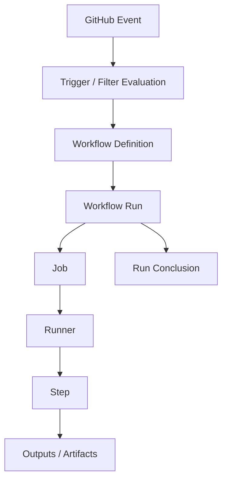
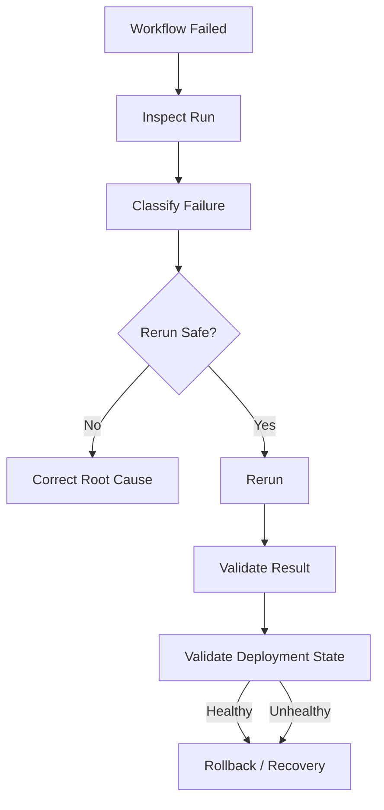

# 03- Workflow Execution and Reruns

## Overview

GitHub Actions workflow execution is the operational lifecycle through which a workflow definition becomes a running workflow, executes jobs and steps on runners, produces outputs and artifacts, and eventually reaches a conclusion.

Understanding execution and reruns is different from understanding YAML syntax. A production engineer needs to answer:

- Why did this workflow run?
- Which commit and event produced the run?
- Where is the run in its lifecycle?
- Which jobs executed?
- Which jobs were skipped?
- Which step failed first?
- Was the failure deterministic or transient?
- Is rerunning the workflow safe?
- Should only failed jobs be rerun?
- Could a rerun create a duplicate deployment?
- Which artifact or image will be deployed?
- What happens if a deployment is already in progress?

A useful mental model is:

```text
Event
  ↓
Workflow Selection
  ↓
Workflow Run
  ↓
Job Scheduling
  ↓
Runner Assignment
  ↓
Step Execution
  ↓
Outputs / Artifacts
  ↓
Workflow Conclusion
  ↓
Optional Rerun
```

For production systems, a rerun is an operational action rather than merely a debugging convenience.

---

## Workflow Definition vs Workflow Execution

A workflow definition is the YAML configuration stored under:

```text
.github/workflows/
```

For example:

```text
.github/workflows/ci.yml
.github/workflows/deploy.yml
.github/workflows/release.yml
```

A workflow run is a concrete execution of one of those definitions.

```text
ci.yml
 ├── Run 101
 ├── Run 102
 ├── Run 103
 └── Run 104
```

The definition describes what should happen.

The run records what actually happened.

This distinction is essential when investigating production failures.

---

## GitHub Actions Execution Architecture



The workflow execution system should be understood as a distributed execution platform rather than a simple YAML interpreter.

---

## Workflow Run Lifecycle

A workflow run generally progresses through states such as:

```text
queued
   ↓
in_progress
   ↓
completed
```

Once completed, the run has a conclusion such as:

```text
success
failure
cancelled
skipped
```

The distinction matters.

For example:

```text
status: in_progress
```

means the run is still executing.

Whereas:

```text
status: completed
conclusion: failure
```

means execution has finished unsuccessfully.

---

## What Causes a Workflow Run?

A workflow can be started by events such as:

```yaml
on:
  push:
  pull_request:
  workflow_dispatch:
  schedule:
  workflow_call:
  workflow_run:
  repository_dispatch:
  release:
```

The event becomes part of the run's execution context.

For example:

```text
Pull Request #42
      ↓
pull_request event
      ↓
CI workflow
      ↓
Run
```

A manual execution has a different event context:

```text
workflow_dispatch
      ↓
Run
```

This difference can affect:

- Permissions.
- Available context.
- Secrets.
- Branch/ref.
- Deployment behavior.
- Security boundaries.

---

## Trigger Evaluation

Before a run exists, GitHub evaluates whether the workflow should respond to the event.

For example:

```yaml
on:
  push:
    branches:
      - main
    paths:
      - "src/**"
```

A push to:

```text
main
```

may still not trigger the workflow if the changed paths do not match.

Therefore:

```text
Event occurred
```

does not necessarily mean:

```text
Workflow run created
```

---

## Manual Workflow Execution

A workflow can expose:

```yaml
on:
  workflow_dispatch:
    inputs:
      environment:
        description: "Deployment environment"
        required: true
        type: choice
        options:
          - staging
          - production
```

The workflow can then be executed manually with GitHub CLI:

```bash
gh workflow run deploy.yml \
  --ref main \
  -f environment=staging
```

Manual execution is useful for:

- Operational workflows.
- Controlled deployments.
- Recovery procedures.
- Administrative tasks.
- Reprocessing known-good artifacts.

Production deployments should validate inputs and environment protection before performing destructive operations.

---

## Listing Workflow Runs

List recent runs:

```bash
gh run list
```

Limit results:

```bash
gh run list --limit 20
```

Inspect a particular workflow:

```bash
gh run list --workflow ci.yml
```

Filter by branch:

```bash
gh run list --workflow deploy.yml --branch main
```

Filter by status:

```bash
gh run list --workflow deploy.yml --status failure
```

For another repository:

```bash
gh run list --repo acme/orders-api
```

---

## Inspecting a Workflow Run

Once the run ID is known:

```bash
gh run view <run-id>
```

For example:

```bash
gh run view 123456789
```

A run inspection should establish:

- Workflow.
- Run ID.
- Branch/ref.
- Commit SHA.
- Trigger event.
- Status.
- Conclusion.
- Jobs.
- Job conclusions.
- Relevant execution metadata.

---

## Inspecting a Run as an Execution Graph

A useful investigation model is:

```text
Run
 ↓
Commit
 ↓
Event
 ↓
Jobs
 ↓
Needs Dependencies
 ↓
Failed Job
 ↓
Failed Step
 ↓
Command
 ↓
First Meaningful Error
```

This prevents the common mistake of treating the overall workflow conclusion as the root cause.

---

## Job Scheduling

A workflow may contain multiple jobs:

```yaml
jobs:
  lint:
    ...

  unit:
    ...

  integration:
    needs: unit

  build:
    needs:
      - lint
      - unit
      - integration
```

The execution graph becomes:

```text
       lint ──────┐
                  ├──> build
       unit ──────┤
         ↓        │
    integration ──┘
```

Independent jobs can execute concurrently.

Dependent jobs wait for their required dependencies.

---

## Job Lifecycle

A simplified job lifecycle is:

```text
Queued
  ↓
Runner Selected
  ↓
Runner Preparation
  ↓
Job Environment Created
  ↓
Steps Execute
  ↓
Post-Job Processing
  ↓
Completed
```

Potential failures can occur at every stage.

For example:

```text
Runner unavailable
Dependency installation failed
Test failed
Artifact upload failed
Post-job cleanup failed
```

Do not assume that a failure necessarily occurred inside the main application step.

---

## Step Execution

Within a job:

```yaml
steps:
  - name: Checkout
    uses: actions/checkout@v4

  - name: Install dependencies
    run: pip install -r requirements.txt

  - name: Run tests
    run: pytest
```

Execution is normally sequential unless the workflow uses separate jobs for parallelism.

A failure can prevent later steps from executing.

```text
Checkout       → success
Dependencies   → success
Tests          → failure
Build          → skipped
```

---

## `needs` and Downstream Jobs

Consider:

```yaml
jobs:
  test:
    ...

  build:
    needs: test
```

If `test` fails:

```text
test  → failure
build → skipped
```

The skipped build is usually a consequence rather than an independent failure.

When inspecting a run, identify the earliest meaningful failure in the dependency graph.

---

## Conditional Execution

A step or job may have:

```yaml
if: ${{ github.ref == 'refs/heads/main' }}
```

or:

```yaml
if: ${{ success() }}
```

or:

```yaml
if: ${{ failure() }}
```

Therefore, a skipped step may be intentional.

Inspect:

- `if`.
- `needs`.
- Event context.
- Branch/ref.
- Previous job status.
- Status functions.

---

## Status Functions

Important status functions include:

```text
success()
failure()
cancelled()
always()
```

They influence conditional execution.

For example:

```yaml
- name: Upload test report
  if: ${{ !cancelled() }}
  uses: actions/upload-artifact@v4
  with:
    name: test-report
    path: reports/
```

The exact behavior of status functions matters during failure and cancellation handling.

---

## `continue-on-error`

Consider:

```yaml
- name: Experimental check
  continue-on-error: true
  run: ./experimental-check.sh
```

The step may fail without causing the surrounding execution to fail in the normal way.

This matters when interpreting a green workflow.

A workflow conclusion should therefore not be interpreted as:

> Every command executed successfully.

Instead, inspect whether failures were explicitly tolerated.

---

## Matrix Execution

A matrix expands one job definition into multiple executions.

```yaml
strategy:
  matrix:
    python-version:
      - "3.11"
      - "3.12"
```

The resulting execution may look like:

```text
test (3.11) → success
test (3.12) → failure
```

The matrix dimensions become part of the operational context.

---

## Matrix Failures

For matrix failures, identify:

```text
Matrix Job
    ↓
Dimension
    ↓
Specific Combination
    ↓
Runner
    ↓
Failed Step
    ↓
Error
```

For example:

```text
Python 3.12
PostgreSQL 16
Ubuntu
```

may fail while:

```text
Python 3.11
PostgreSQL 16
Ubuntu
```

passes.

This can indicate compatibility rather than a general pipeline problem.

---

## `fail-fast`

Matrix strategies can use:

```yaml
strategy:
  fail-fast: true
  matrix:
    python-version:
      - "3.11"
      - "3.12"
      - "3.13"
```

With fail-fast enabled, an unsuccessful matrix job can cause in-progress matrix jobs to be cancelled according to the matrix strategy behavior.

This affects interpretation of:

```text
success
failure
cancelled
```

A cancelled matrix job may not itself contain a defect.

---

## `max-parallel`

Matrix execution can also limit concurrency:

```yaml
strategy:
  max-parallel: 2
  matrix:
    python-version:
      - "3.11"
      - "3.12"
      - "3.13"
      - "3.14"
```

This controls how many matrix jobs execute simultaneously.

The trade-off is:

```text
Higher parallelism
    ↓
Lower wall-clock time
    ↓
Higher runner demand
```

and potentially:

```text
More downstream pressure
    ↓
Database / registry / API saturation
```

---

## Dynamic Matrices

A planning job can produce JSON:

```yaml
jobs:
  plan:
    runs-on: ubuntu-latest
    outputs:
      services: ${{ steps.plan.outputs.services }}
    steps:
      - id: plan
        run: |
          echo 'services=["orders","payments"]' >> "$GITHUB_OUTPUT"

  test:
    needs: plan
    strategy:
      matrix:
        service: ${{ fromJSON(needs.plan.outputs.services) }}
```

The execution path becomes:

```text
Planning
   ↓
GITHUB_OUTPUT
   ↓
Job Output
   ↓
needs.plan.outputs
   ↓
fromJSON()
   ↓
Matrix Expansion
```

When inspecting such workflows, failure may occur before matrix jobs are even created.

---

## Workflow Outputs and Execution Data

Values can move between steps and jobs.

A step can write:

```bash
echo "image_tag=$GITHUB_SHA" >> "$GITHUB_OUTPUT"
```

A job can expose that value:

```yaml
outputs:
  image-tag: ${{ steps.build.outputs.image_tag }}
```

A downstream job can consume it:

```yaml
${{ needs.build.outputs.image-tag }}
```

When debugging, inspect every boundary:

```text
Step
 ↓
Step Output
 ↓
Job Output
 ↓
needs
 ↓
Downstream Job
```

---

## Artifacts During Execution

Artifacts represent workflow outputs such as:

- Test reports.
- Coverage reports.
- Packages.
- Debug files.
- Build outputs.

Example:

```yaml
- name: Upload test report
  if: ${{ !cancelled() }}
  uses: actions/upload-artifact@v4
  with:
    name: pytest-report
    path: reports/
```

Artifact generation should be treated as part of workflow execution, not as a replacement for logs.

---

## Artifacts vs Caches

| Characteristic | Artifact | Cache |
|---|---|---|
| Primary purpose | Preserve workflow output | Accelerate repeated work |
| Correctness dependency | Often yes | Normally no |
| Typical use | Reports, packages, builds | Dependencies, build layers |
| Consumer | Later job/release/operator | Future workflow execution |
| Identity | Explicit output | Cache key |
| Debugging role | Evidence/output | Performance optimization |

A cache miss should generally cause slower execution.

A missing deployment artifact can block the pipeline.

---

## Cache Behavior During Execution

A dependency cache may use:

```yaml
key: ${{ runner.os }}-python-${{ hashFiles('**/requirements*.txt') }}
restore-keys: |
  ${{ runner.os }}-python-
```

Inspect:

```text
Cache key
 ↓
Exact hit?
 ↓
Partial restore?
 ↓
Miss?
 ↓
Dependencies installed
```

Do not treat cache behavior as proof of application correctness.

---

## Step Summaries and Annotations

Modern GitHub Actions workflows can use:

```bash
echo "## Test Results" >> "$GITHUB_STEP_SUMMARY"
```

This can make run inspection easier by surfacing important operational information.

Annotations can also highlight warnings and errors.

For production workflows, useful summaries include:

- Artifact identity.
- Test counts.
- Deployment environment.
- Image digest.
- Health-check result.
- Rollback reference.

Avoid placing secrets or sensitive infrastructure details in summaries.

---

## Viewing Logs

View complete logs:

```bash
gh run view <run-id> --log
```

View only failed logs:

```bash
gh run view <run-id> --log-failed
```

During an incident, start with:

```bash
gh run view <run-id> --log-failed
```

Then expand to complete logs if required.

---

## Log Investigation Strategy

Use:

```text
Failed Job
   ↓
Failed Step
   ↓
First Non-Zero Result
   ↓
First Meaningful Error
   ↓
Relevant Context
```

Do not automatically trust the last line in a log.

For example:

```text
AWS authentication failed
        ↓
ECR login failed
        ↓
Docker push failed
        ↓
Deployment failed
```

The ECR and deployment errors are downstream symptoms.

---

## Rerunning a Workflow

A completed workflow can be rerun with:

```bash
gh run rerun <run-id>
```

For example:

```bash
gh run rerun 123456789
```

A rerun should be treated as a new execution attempt associated with the original workflow run.

The key operational question is not:

> Can this run be rerun?

It is:

> Is rerunning this execution safe and meaningful?

---

## Rerunning Failed Jobs Only

GitHub CLI supports rerunning failed portions:

```bash
gh run rerun <run-id> --failed
```

This can be useful for:

- Transient test failures.
- Temporary network failures.
- Runner interruptions.
- External service instability.

It should not be used blindly when the underlying configuration or application code is known to be broken.

---

## Rerun Decision Model

Use:

```text
Failure
  ↓
Classify Failure
  ↓
Transient?
 ┌───────┴────────┐
Yes               No
 ↓                 ↓
Is rerun safe?    Fix root cause
 ↓
Yes
 ↓
Rerun
 ↓
Validate result
```

Examples of potentially transient failures:

- Temporary network timeout.
- Runner infrastructure interruption.
- External service outage.

Examples where rerunning is unlikely to help:

- Syntax error.
- Invalid YAML.
- Broken application code.
- Missing required configuration.
- Incorrect IAM policy.
- Deterministic test failure.

---

## Safe Reruns for CI

Rerunning a test workflow is usually lower risk than rerunning a deployment workflow.

For CI:

```text
Checkout
 ↓
Install
 ↓
Test
```

A rerun generally does not modify production state.

For deployment:

```text
Build
 ↓
Deploy
 ↓
Migrate
 ↓
Switch Traffic
```

a rerun can have side effects.

---

## Safe Reruns for Deployments

Before rerunning a deployment, inspect:

- Current deployment state.
- Whether the first run partially succeeded.
- Artifact identity.
- Database migration state.
- Deployment locks/concurrency.
- Target environment.
- Health status.
- Idempotency of deployment commands.

A deployment may have failed after the application was already updated.

Blindly rerunning can therefore create another state transition.

---

## Idempotency

A deployment operation is safer to rerun when repeated execution produces the same intended state.

For example:

```text
Ensure ECS service uses image digest X
```

is easier to reason about than:

```text
Create another deployment
```

Similarly, infrastructure operations should be designed around desired state where possible.

---

## Database Migrations and Reruns

Database migrations require additional caution.

Suppose:

```text
Deploy Application
        ↓
Run Migration
        ↓
Migration Partially Completes
        ↓
Workflow Fails
```

A rerun may encounter:

```text
Already applied migration
```

or another state-dependent condition.

Production migration design should therefore favor:

- Idempotent operations where possible.
- Expand/contract migration strategy.
- Backward-compatible application versions.
- Explicit migration state.
- Independent migration observability.

---

## Docker Image Reruns

Consider:

```text
Build Image
 ↓
Push ECR
 ↓
Deploy
```

If the deployment fails after ECR push, rebuilding may be unnecessary.

Prefer preserving the original image identity:

```text
Commit SHA
    ↓
Image Digest
    ↓
Deploy
```

This supports build-once/deploy-many.

---

## Rerun and Artifact Identity

Suppose:

```text
Run 100
Commit abc123
Image sha256:AAA
```

A later rerun should not silently cause a different artifact to become the production deployment target unless that behavior is explicitly intended.

For production pipelines, artifact identity should be explicit.

---

## Concurrency and Reruns

Consider:

```yaml
concurrency:
  group: production
  cancel-in-progress: false
```

If Run 100 is executing production deployment and an operator reruns it, Run 101 may be prevented from executing concurrently.

This protects against:

```text
Run 100 → deploy production
Run 101 → deploy production
```

executing simultaneously.

---

## Deployment Race Conditions

Without deployment concurrency:

```text
Run A
   ↓
Build A
   ↓
Deploy A

Run B
   ↓
Build B
   ↓
Deploy B
```

The deployments can overlap.

The resulting production state may depend on timing.

Use environment-specific concurrency groups where appropriate:

```yaml
concurrency:
  group: production
  cancel-in-progress: false
```

---

## PR Concurrency vs Production Concurrency

These usually have different policies.

### Pull Requests

It is often reasonable to cancel obsolete runs:

```yaml
concurrency:
  group: pr-${{ github.event.pull_request.number }}
  cancel-in-progress: true
```

### Production

Cancelling a deployment may be dangerous:

```yaml
concurrency:
  group: production
  cancel-in-progress: false
```

Production execution should be treated as a state transition rather than disposable computation.

---

## Cancellation

A workflow can be cancelled manually or due to workflow behavior such as concurrency configuration.

Cancellation is different from failure.

```text
failure
```

means execution completed with a failure.

```text
cancelled
```

means execution was intentionally or automatically stopped.

When inspecting cancelled workflows, determine why cancellation occurred.

---

## Reruns and Environments

Production environments may require:

- Required reviewers.
- Deployment protection.
- Branch restrictions.
- Environment secrets.

A rerun does not mean the deployment should bypass these controls.

Treat environment protection as a security boundary.

---

## Reruns and Secrets

A rerun may execute with the workflow's applicable secret and permission configuration.

Never assume that a rerun is equivalent to manually copying credentials into the workflow.

If a workflow requires:

```yaml
permissions:
  id-token: write
```

the rerun still needs the appropriate permissions.

---

## Reruns and `GITHUB_TOKEN`

`GITHUB_TOKEN` is automatically provided to the workflow execution according to its permissions.

A workflow may use:

```yaml
permissions:
  contents: read
```

or:

```yaml
permissions:
  contents: read
  id-token: write
```

When a rerun fails with authorization errors, inspect permissions rather than assuming the token itself is invalid.

---

## OIDC and Reruns

AWS authentication may use:

```text
GitHub Actions
    ↓
OIDC token
    ↓
AWS STS
    ↓
IAM role
```

A deployment rerun should be evaluated against:

- Workflow permissions.
- IAM trust policy.
- Repository/ref restrictions.
- Environment restrictions.
- AWS account/role.

Avoid falling back to long-lived AWS credentials simply to make a rerun work.

---

## Rerun and `pull_request`

Security behavior depends on the event that produced the workflow.

For pull requests, especially forked pull requests, inspect:

- Event type.
- Repository trust boundary.
- Available secrets.
- Token permissions.
- Workflow ref.

Do not assume that a rerun can safely execute arbitrary pull request code with production credentials.

---

## `pull_request_target` Caution

`pull_request_target` executes in a different security context from `pull_request`.

It can have access to trusted workflow configuration and secrets in situations where `pull_request` does not.

Therefore, combining it with untrusted checkout or execution can create a dangerous boundary:

```text
Trusted Workflow Context
        +
Untrusted PR Code
        ↓
Potential Secret / Token Exposure
```

Rerunning such workflows requires the same security scrutiny as the original execution.

---

## Rerun After Code Changes

A rerun generally means:

> Execute the workflow again under its rerun semantics.

It should not be confused with:

> Execute the latest version of the workflow against new code.

If the intended operation is to test a new commit, create a new workflow run by pushing or dispatching against the appropriate ref rather than assuming a rerun is equivalent.

---

## Rerun After Workflow Changes

Suppose:

```text
Run 100
 ↓
workflow.yml version A
 ↓
failure

workflow.yml changed
 ↓
version B
```

Do not assume rerunning Run 100 means:

```text
Run 100 + workflow.yml version B
```

When debugging configuration changes, create or trigger an execution that clearly represents the new workflow state.

This distinction is important when analyzing historical incidents.

---

## Operational Rerun Workflow

A production-safe process is:



The `RECOVER` node represents operational recovery decisions and is not necessarily required after every successful rerun.

---

## Inspecting a Failed Run

A practical sequence is:

```bash
gh run list \
  --workflow ci.yml \
  --status failure \
  --limit 10
```

Then:

```bash
gh run view <run-id>
```

Then:

```bash
gh run view <run-id> --log-failed
```

Classify the failure before deciding whether to rerun.

---

## Inspecting Recent Production Runs

For a deployment workflow:

```bash
gh run list \
  --workflow deploy.yml \
  --branch main \
  --limit 10
```

Inspect the selected run:

```bash
gh run view <run-id>
```

Inspect failures:

```bash
gh run view <run-id> --log-failed
```

This creates a repeatable operational workflow.

---

## JSON-Based Inspection

For automation:

```bash
gh run list \
  --workflow deploy.yml \
  --json databaseId,status,conclusion,headSha,event \
  --limit 20
```

Example:

```bash
gh run list \
  --workflow deploy.yml \
  --json databaseId,status,conclusion,headSha,event \
  --limit 20 |
  jq '.[] | {
    run: .databaseId,
    status: .status,
    conclusion: .conclusion,
    commit: .headSha,
    event: .event
  }'
```

This is useful for operational scripts and CI/CD dashboards.

---

## Python-Based Operational Inspection

A Python tool can invoke GitHub CLI:

```python
from __future__ import annotations

import json
import subprocess


def list_failed_runs(workflow: str) -> list[dict]:
    result = subprocess.run(
        [
            "gh",
            "run",
            "list",
            "--workflow",
            workflow,
            "--status",
            "failure",
            "--json",
            "databaseId,status,conclusion,headSha,event",
            "--limit",
            "20",
        ],
        check=True,
        capture_output=True,
        text=True,
    )

    return json.loads(result.stdout)


for run in list_failed_runs("ci.yml"):
    print(
        f"Run {run['databaseId']} "
        f"failed for {run['headSha']}"
    )
```

Production tooling should add:

- Timeouts.
- Error handling.
- Repository validation.
- Authentication checks.
- Rate-limit awareness.
- Structured logging.

---

## Operational Rerun Automation

Automated reruns should be constrained.

Avoid:

```text
Failure
 ↓
Automatic rerun
 ↓
Failure
 ↓
Automatic rerun
 ↓
...
```

This can create:

- Runner consumption.
- Cost.
- Duplicate side effects.
- Hidden flaky tests.
- Deployment races.

Use bounded retries:

```text
Initial Run
 ↓
One Controlled Retry
 ↓
Escalate
```

For production deployments, prefer explicit operational decisions unless the deployment system is designed for safe automated rollback/retry.

---

## Workflow Execution Monitoring

Important execution metrics include:

| Metric | Operational meaning |
|---|---|
| Queue time | Runner/capacity pressure |
| Execution duration | Pipeline efficiency |
| Failure rate | Workflow reliability |
| Rerun rate | Flakiness or instability |
| Cancellation rate | Concurrency or operational behavior |
| Matrix duration | Parallel execution cost |
| Deployment duration | Release efficiency |
| Rollback frequency | Deployment reliability |

A rising rerun rate is a useful reliability signal even when overall workflow success remains high.

---

## Queue Time

A workflow can be slow without its steps being slow.

For example:

```text
Queue          → 8 min
Execution      → 4 min
Total          → 12 min
```

If execution time is stable but queue time increases, investigate:

- Runner capacity.
- Runner groups.
- Autoscaling.
- Matrix size.
- Organization capacity.
- Concurrency.

Do not optimize application commands when the actual bottleneck is scheduling.

---

## Runner Failures

Execution can fail before meaningful application steps run.

Typical causes include:

- Runner unavailable.
- Runner offline.
- Incorrect labels.
- Insufficient capacity.
- Disk exhaustion.
- Memory pressure.
- Network problems.
- Toolchain mismatch.
- Self-hosted runner drift.

Inspect the job and runner before modifying application code.

---

## Containerized Job Execution

Jobs may execute inside containers:

```yaml
jobs:
  test:
    runs-on: ubuntu-latest
    container:
      image: python:3.12-slim
```

The execution environment is then different from the host runner.

Potential failure domains include:

```text
Runner
 ↓
Container
 ↓
Dependencies
 ↓
Service Containers
 ↓
Tests
```

This matters when reproducing failures locally.

---

## Service Containers

Integration testing may use:

```yaml
services:
  postgres:
    image: postgres:16

  redis:
    image: redis:7
```

A Python backend pipeline may therefore execute:

```text
Django / FastAPI
      ↓
PostgreSQL
      ↓
Redis
      ↓
pytest
```

When rerunning a failed integration test, verify whether the failure is:

- Application-level.
- Database-level.
- Redis-level.
- Readiness-related.
- Network-related.

---

## External Dependencies

A workflow may depend on:

- Package registries.
- Docker registries.
- AWS APIs.
- External APIs.
- GitHub APIs.
- Internal services.

A transient external failure can make rerunning useful.

However, repeated failures should be investigated rather than hidden through automatic retries.

---

## Docker Build Execution

A production build may be:

```text
Checkout
 ↓
Dependency Setup
 ↓
Docker Buildx
 ↓
Cache
 ↓
Image
 ↓
Registry
```

If the registry push fails, rerunning the entire build may waste resources.

Where possible, inspect whether the image was already produced and whether the failure occurred during push or deployment.

---

## Build Once, Promote Many

A robust deployment model is:

```text
Source
 ↓
Build
 ↓
Immutable Artifact
 ↓
Staging
 ↓
Approval
 ↓
Production
```

Do not rebuild the application independently for each environment unless the architecture explicitly requires it.

This makes reruns and rollbacks easier to reason about.

---

## Deployment Reruns

A deployment workflow should ideally target an explicit artifact:

```text
image digest
```

rather than:

```text
latest
```

For example:

```text
orders-api@sha256:abc123...
```

This provides deterministic deployment behavior.

---

## Rolling Deployment Reruns

For rolling deployments:

```text
Old Instances
      ↓
New Instances
      ↓
Health Validation
      ↓
Traffic
```

A failed run may have already replaced some instances.

Before rerunning, inspect the actual service state.

---

## Blue-Green Deployment Reruns

For blue-green:

```text
Blue → Active
Green → New
```

A failed workflow might leave:

```text
Blue → Active
Green → Partially Deployed
```

Rerunning without understanding the state can produce unnecessary or conflicting changes.

Deployment systems should make the active and candidate environments observable.

---

## Canary Deployment Reruns

For canary deployments:

```text
Stable 95%
Canary 5%
```

A workflow failure may happen after traffic has already shifted.

Before rerunning:

- Determine current traffic distribution.
- Inspect health metrics.
- Determine whether promotion occurred.
- Decide whether rollback or continuation is safer.

---

## Rollback vs Rerun

These are different operations.

### Rerun

Attempts the same workflow execution again.

### Rollback

Moves the environment toward a previously known-good state.

```text
Failure
 ├── Rerun → Try operation again
 └── Rollback → Restore known-good state
```

A failed deployment does not automatically imply that rerunning is the correct recovery strategy.

---

## Production Incident Example

Suppose:

```text
Run 500
 ↓
Build successful
 ↓
ECR push successful
 ↓
Staging successful
 ↓
Production deployment started
 ↓
Health check failed
```

The correct first question is not:

> Should we rerun Run 500?

Instead determine:

```text
Did production receive the new artifact?
Did traffic switch?
Are instances healthy?
Was the failure before or after the state transition?
```

If production is partially updated, rollback may be safer than rerunning.

---

## Rerun Safety Matrix

| Failure | Rerun consideration |
|---|---|
| Lint failure | Usually fix first |
| Deterministic unit-test failure | Fix first |
| Temporary package registry outage | Rerun may help |
| Runner interruption | Rerun may help |
| Transient network timeout | Rerun may help |
| Invalid IAM policy | Fix first |
| ECR push timeout | Inspect registry state first |
| Database migration failure | Inspect database state first |
| Partial production deployment | Inspect deployment state first |
| Failed health check | Evaluate rollback vs rerun |
| Concurrency cancellation | Inspect concurrency policy |

---

## Common Mistakes

### Blindly Rerunning Failed Production Deployments

A deployment may have partially succeeded.

### Treating Every Failure as Transient

Deterministic failures will remain deterministic.

### Using Reruns to Hide Flaky Tests

Rerun frequency should be measured and investigated.

### Ignoring Concurrency

A rerun may compete with an existing deployment.

### Rebuilding Instead of Reusing an Artifact

This weakens reproducibility.

### Ignoring Database State

Database migrations can make reruns nontrivial.

### Assuming Cancelled Means Failed

Cancellation has a different operational meaning.

### Assuming Skipped Means Broken

Skipped jobs are often consequences of `needs` or conditions.

### Printing Secrets While Debugging

Never weaken security to obtain diagnostic information.

### Automatically Retrying Everything

Unbounded retries increase cost and can create duplicate side effects.

---

## Security Considerations

Execution and reruns operate inside security boundaries.

Inspect:

- `GITHUB_TOKEN` permissions.
- Job-level permissions.
- Environment protection.
- Secrets.
- OIDC permissions.
- AWS IAM trust policies.
- Third-party actions.
- Fork behavior.
- Self-hosted runner isolation.

A rerun should not become a mechanism for bypassing security controls.

---

## Third-Party Actions During Reruns

A workflow may execute third-party actions:

```yaml
- uses: vendor/action@<ref>
```

The action executes again during the rerun.

Therefore:

- Pin trusted actions appropriately.
- Minimize permissions.
- Avoid unnecessary secrets.
- Review action provenance.
- Treat self-hosted runners as sensitive execution environments.

A rerun does not make an untrusted action trustworthy.

---

## Supply Chain Considerations

A production pipeline may contain:

```text
Source
 ↓
Actions
 ↓
Dependencies
 ↓
Build
 ↓
Artifact
 ↓
Registry
 ↓
Deployment
```

Every execution repeats these trust relationships.

Production pipelines should therefore use:

- Dependency pinning.
- Action SHA pinning where appropriate.
- Least-privilege permissions.
- Immutable artifacts.
- SBOMs.
- Provenance.
- Artifact attestations.
- Controlled deployment environments.

---

## High Availability

CI/CD availability depends on more than GitHub Actions itself.

Important dependencies include:

```text
GitHub
Runner Capacity
Package Registry
Container Registry
AWS APIs
Database
Deployment Platform
Monitoring
```

A highly available pipeline should identify these failure domains and avoid making one transient dependency failure indistinguishable from an application failure.

---

## Cost and Scalability

Reruns consume resources.

A large matrix:

```text
5 Python versions
×
3 databases
×
2 operating systems
= 30 executions
```

Repeated reruns can multiply this cost.

Use:

- Appropriate matrix scope.
- `max-parallel`.
- Caching.
- Efficient Docker layers.
- Selective test execution.
- Bounded retries.
- Reusable workflows.

Reliability should not be achieved by indiscriminate execution.

---

## Disaster Recovery

During a major deployment failure, workflow history can provide critical evidence:

```text
Last successful commit
        ↓
Last successful workflow
        ↓
Artifact digest
        ↓
Production deployment
```

This information supports recovery and rollback.

Maintain sufficient artifact retention and operational metadata to reconstruct the last known-good state.

---

## Production Workflow

A mature pipeline can be represented as:

```mermaid
flowchart LR
    PR[Pull Request]
    LINT[Lint]
    UNIT[Unit Tests]
    INT[Integration Tests]
    SEC[Security Scan]
    MATRIX[Matrix Tests]
    BUILD[Build]
    IMAGE[Docker Image]
    ECR[ECR]
    STAGING[Staging]
    APPROVAL[Approval]
    PROD[Production]
    MONITOR[Monitoring]
    ROLLBACK[Rollback]

    PR --> LINT
    LINT --> UNIT
    UNIT --> INT
    INT --> SEC
    SEC --> MATRIX
    MATRIX --> BUILD
    BUILD --> IMAGE
    IMAGE --> ECR
    ECR --> STAGING
    STAGING --> APPROVAL
    APPROVAL --> PROD
    PROD --> MONITOR
    MONITOR --> ROLLBACK
```



Execution and rerun design should preserve the properties of this architecture:

- Immutable artifacts.
- Controlled promotion.
- Environment protection.
- Deployment concurrency.
- Health validation.
- Explicit rollback.

---

## Practical Operational Runbook

### Identify the Run

```bash
gh run list \
  --workflow deploy.yml \
  --branch main \
  --limit 10
```

### Inspect It

```bash
gh run view <run-id>
```

### Inspect Failures

```bash
gh run view <run-id> --log-failed
```

### Classify the Failure

Determine whether it is:

```text
Configuration
Trigger
Expression
Job
Step
Runner
Dependency
Artifact
Cache
Container
AWS
Registry
Deployment
Concurrency
Security
```

### Decide on Recovery

Choose between:

```text
Fix
Rerun
Rollback
Escalate
```

### Rerun When Safe

```bash
gh run rerun <run-id>
```

or:

```bash
gh run rerun <run-id> --failed
```

### Validate

After rerunning, verify:

- Workflow result.
- Artifact identity.
- Deployment state.
- Runtime health.

---

## Interview Scenarios

### Production Deployment Failed. Would You Rerun It?

First determine:

- Whether deployment partially completed.
- Whether the operation is idempotent.
- Whether a database migration ran.
- Whether traffic switched.
- Whether another deployment is active.
- Whether the same artifact can be reused.

The correct engineering decision depends on the deployment state, not simply the workflow conclusion.

### A Matrix Job Failed, but the Rerun Passed. What Do You Investigate?

Investigate:

- Matrix combination.
- External dependencies.
- Resource contention.
- Test isolation.
- Race conditions.
- Runner differences.
- Timing-sensitive code.

A successful rerun is evidence of possible nondeterminism, not proof of a root cause.

### How Would You Prevent Two Production Deployments From Running Together?

Use deployment concurrency:

```yaml
concurrency:
  group: production
  cancel-in-progress: false
```

Then ensure deployments use immutable artifacts and are idempotent.

### Why Is Rerunning a Deployment More Dangerous Than Rerunning Unit Tests?

Unit tests normally produce ephemeral results.

Deployments modify external state:

```text
Infrastructure
Application
Database
Traffic
Queues
External Systems
```

Repeated execution can therefore create duplicate or conflicting state transitions.

### How Would You Diagnose a Workflow That Takes 20 Minutes?

Separate:

```text
Queue time
+
Execution time
```

Then inspect:

- Matrix size.
- Runner capacity.
- Dependency installation.
- Cache hit rate.
- Docker builds.
- Integration tests.
- External services.
- Deployment steps.

### A Deployment Failed After Pushing the Docker Image. Would You Rebuild?

Not necessarily.

First identify the existing image digest and determine whether the same immutable artifact can be promoted or redeployed.

---

## Senior Design Principles

### Rerunability Is a Design Property

A pipeline should be designed so that operators can understand what happens when an operation executes twice.

### Idempotency Reduces Operational Risk

Prefer desired-state operations and deterministic artifact references.

### Artifact Identity Must Be Explicit

Commit SHA and image digest should be traceable through deployment.

### Concurrency Protects Shared State

Production deployment concurrency prevents multiple workflow executions from modifying the same environment simultaneously.

### Failure Classification Comes Before Recovery

Do not choose rerun, rollback, or fix until the failure domain is understood.

### Observability Enables Safe Reruns

Logs, summaries, artifacts, deployment history, and runtime health information should provide enough evidence to make recovery decisions.

### Automation Should Be Bounded

Automatic retries should have clear limits and should never hide persistent failures.

## Key Takeaways

- **A workflow run is a concrete execution of a workflow definition, and effective diagnosis follows the execution path from event to run to job to step to artifact or deployment.**
- **Rerunning a workflow is an operational action; determine whether the failure is transient, whether execution is idempotent, and whether the original run partially changed external state before rerunning.**
- **Use `gh run view`, `gh run view --log-failed`, `gh run rerun`, and structured `gh --json` output to inspect and operate workflow executions systematically.**
- **Production reruns require special care around concurrency, database migrations, immutable Docker artifacts, AWS authentication, environment protection, deployment state, and rollback.**
- **A reliable CI/CD system makes execution traceable, rerunnable where safe, resistant to duplicate deployments, and observable enough to distinguish fixing, rerunning, and rolling back.**