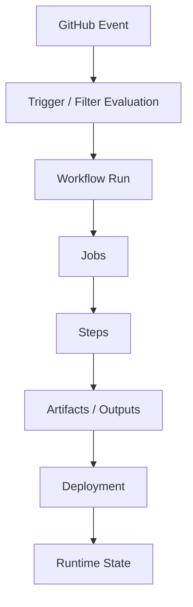
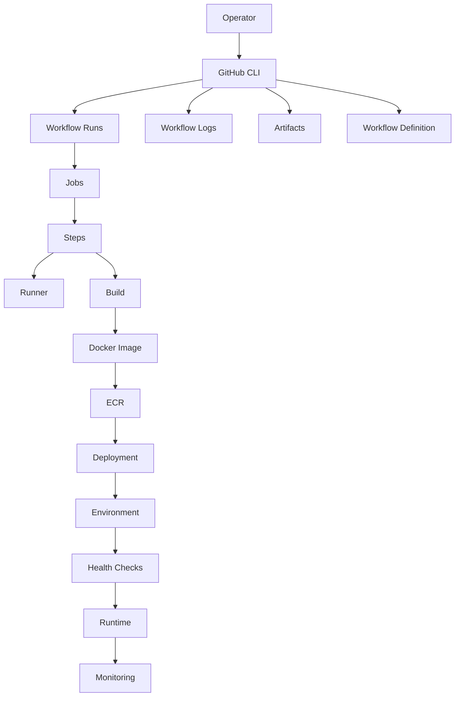

# 04- Workflow Run Inspection

## Overview

Workflow run inspection is the operational process of examining a specific GitHub Actions execution to determine what happened, why it happened, which parts succeeded or failed, and what state the pipeline left behind.

A workflow definition explains what should happen. A workflow run records what actually happened.

```text
Workflow Definition
        ↓
Trigger
        ↓
Workflow Run
        ↓
Jobs
        ↓
Steps
        ↓
Artifacts / Outputs
        ↓
Deployment
        ↓
Runtime State
```

For production CI/CD, run inspection should answer:

- Which workflow executed?
- Which commit and ref were involved?
- What event triggered the run?
- When did execution start?
- Was the run queued, running, completed, cancelled, or skipped?
- Which jobs executed?
- Which jobs were skipped?
- Which matrix combination failed?
- Which step failed first?
- What does the log show?
- Which artifact or Docker image was produced?
- Which environment was targeted?
- Did deployment actually complete?
- Is rerunning the run safe?
- Is rollback required?

The objective is not simply to find an error message. It is to reconstruct the execution path and isolate the actual failure domain.

---

## Workflow Run Mental Model

A useful operational model is:



Each layer can fail independently.

For example:

```text
Workflow Run
    ↓
Build Job
    ↓
Docker Build
    ↓
ECR Push
    ↓
ECS Deployment
    ↓
Health Check
```

A production incident can occur at any point in this chain.

---

## Workflow Definition vs Run

A workflow definition is stored in:

```text
.github/workflows/
```

For example:

```text
.github/workflows/ci.yml
.github/workflows/deploy.yml
.github/workflows/release.yml
```

A workflow run is one execution of that definition.

```text
deploy.yml
 ├── Run 100
 ├── Run 101
 ├── Run 102
 └── Run 103
```

The same workflow can therefore have different outcomes for different:

- Commits.
- Branches.
- Events.
- Inputs.
- Matrix combinations.
- Runner environments.
- External dependencies.

---

## Why Run Inspection Matters

A workflow can report:

```text
failure
```

without immediately revealing the root cause.

The actual chain might be:

```text
Deployment failed
    ↓
ECS could not start task
    ↓
Container failed health check
    ↓
Application could not connect to Redis
    ↓
Redis configuration was incorrect
```

The final deployment failure is a symptom.

Run inspection should move backward through the execution graph until the earliest meaningful failure is found.

---

## Workflow Run Lifecycle

A simplified lifecycle is:

```text
queued
   ↓
in_progress
   ↓
completed
```

A completed run can have a conclusion such as:

```text
success
failure
cancelled
skipped
```

These states have different operational meanings.

| State | Meaning |
|---|---|
| `queued` | Waiting for execution capacity |
| `in_progress` | Execution is currently running |
| `completed + success` | Workflow completed successfully |
| `completed + failure` | Workflow completed with failure |
| `completed + cancelled` | Execution was stopped |
| `completed + skipped` | Execution did not run as normal |

Do not treat `cancelled` as equivalent to `failure`.

---

## Identifying the Run

Start with:

```bash
gh run list
```

Limit the number of runs:

```bash
gh run list --limit 20
```

Filter by workflow:

```bash
gh run list --workflow ci.yml
```

Filter by branch:

```bash
gh run list --workflow deploy.yml --branch main
```

Filter by status:

```bash
gh run list --workflow deploy.yml --status failure
```

For another repository:

```bash
gh run list --repo acme/orders-api
```

This establishes the candidate run before deeper inspection.

---

## Run Identification Data

When investigating a production run, record:

```text
Repository
Workflow
Run ID
Commit SHA
Branch / Ref
Event
Status
Conclusion
Started At
Completed At
```

A useful machine-readable query is:

```bash
gh run list \
  --workflow deploy.yml \
  --json databaseId,status,conclusion,headSha,event \
  --limit 20
```

Use structured output for operational tooling rather than parsing human-oriented CLI output.

---

## Inspecting a Specific Run

Once the run ID is known:

```bash
gh run view <run-id>
```

For example:

```bash
gh run view 123456789
```

The inspection should establish:

- Workflow name.
- Run number or ID.
- Commit SHA.
- Branch/ref.
- Trigger event.
- Overall status.
- Jobs.
- Job conclusions.
- Relevant execution information.

---

## Inspection Flow

A reliable investigation follows:

```text
Run
 ↓
Commit
 ↓
Event
 ↓
Jobs
 ↓
Job Dependencies
 ↓
Failed Job
 ↓
Failed Step
 ↓
Command
 ↓
First Meaningful Error
```

Do not begin by randomly searching logs.

Start with the execution structure.

---

## Inspecting the Commit

The commit is one of the most important pieces of run metadata.

For example:

```text
Run 500
Commit abc123
Branch main
```

This establishes the source state that the workflow executed against.

If the workflow suddenly started failing, compare the failing commit with the previous known-good commit.

Useful Git commands include:

```bash
git log --oneline --decorate -20
```

and:

```bash
git diff <known-good-sha>..<failed-sha>
```

For workflow-specific changes:

```bash
git diff <known-good-sha>..<failed-sha> -- .github/workflows/
```

---

## Inspecting the Trigger Event

The event affects workflow behavior.

Common events include:

```text
push
pull_request
pull_request_target
workflow_dispatch
schedule
workflow_call
workflow_run
repository_dispatch
release
```

The event can influence:

- Branch/ref.
- Permissions.
- Available secrets.
- Security context.
- Inputs.
- Conditional logic.
- Deployment behavior.

When two apparently identical runs behave differently, compare their events.

---

## Branch and Ref Inspection

A deployment workflow may be intended only for:

```text
main
```

while CI may run for:

```text
feature/*
```

Inspect the actual ref used by the run.

A production failure investigation should confirm:

```text
Expected branch
        =
Actual branch
```

Do not infer the deployment target from the workflow filename.

---

## Jobs in a Workflow Run

A workflow can contain:

```yaml
jobs:
  lint:
    ...

  unit-tests:
    ...

  integration-tests:
    needs: unit-tests

  build:
    needs:
      - lint
      - integration-tests

  deploy:
    needs: build
```

The resulting graph is:

```text
lint ────────────────┐
                     │
unit-tests → integration-tests
                     │
                     ├──> build → deploy
                     │
                     └───────────
```

Run inspection should account for these dependencies.

---

## First Failure Principle

Suppose:

```text
lint               → success
unit-tests         → success
integration-tests  → failure
build              → skipped
deploy             → skipped
```

The primary failure is:

```text
integration-tests
```

The skipped jobs are downstream consequences.

A common troubleshooting mistake is to investigate the skipped deployment instead of the integration-test failure.

---

## Job Failure vs Step Failure

A job is a container for steps.

```yaml
jobs:
  test:
    runs-on: ubuntu-latest
    steps:
      - name: Checkout
        uses: actions/checkout@v4

      - name: Install
        run: pip install -r requirements.txt

      - name: Test
        run: pytest
```

If `pytest` fails:

```text
Job: test
Step: Test
```

The job is the failure boundary, but the step usually provides the actionable diagnosis.

---

## Inspecting Job Dependencies

When a job fails or is skipped, inspect:

- `needs`.
- `if`.
- Status functions.
- Matrix strategy.
- Environment.
- Runner.
- Permissions.

For example:

```yaml
build:
  needs:
    - lint
    - test
```

If either dependency fails, `build` may not execute.

---

## Conditional Jobs

A job may have:

```yaml
if: ${{ github.ref == 'refs/heads/main' }}
```

or:

```yaml
if: ${{ needs.test.result == 'success' }}
```

A skipped job is therefore not necessarily broken.

Inspect its condition before treating it as a failure.

---

## Status Functions During Inspection

Common functions include:

```text
success()
failure()
always()
cancelled()
```

For example:

```yaml
- name: Upload reports
  if: ${{ !cancelled() }}
  uses: actions/upload-artifact@v4
```

Status functions can intentionally allow reporting or cleanup after a failure.

When inspecting a skipped step, check whether its condition explains the behavior.

---

## `continue-on-error`

Consider:

```yaml
- name: Optional static analysis
  continue-on-error: true
  run: ./analysis.sh
```

The command can fail without causing the same workflow outcome as an ordinary failed step.

This means:

```text
Workflow success
```

does not necessarily imply:

```text
Every command returned zero
```

Inspect the workflow configuration when the result appears inconsistent with individual step outcomes.

---

## Matrix Run Inspection

Matrix jobs create multiple execution instances.

Example:

```yaml
strategy:
  matrix:
    python-version:
      - "3.11"
      - "3.12"
```

A run may show:

```text
test (3.11) → success
test (3.12) → failure
```

The matrix combination is part of the failure context.

---

## Multi-Dimensional Matrix

Consider:

```yaml
strategy:
  matrix:
    python:
      - "3.11"
      - "3.12"
    database:
      - postgres
      - mysql
```

This creates:

```text
3.11 + postgres
3.11 + mysql
3.12 + postgres
3.12 + mysql
```

When inspecting a failure, identify the exact combination.

A failure in:

```text
Python 3.12 + MySQL
```

does not establish that every test configuration is broken.

---

## Matrix `fail-fast`

With:

```yaml
strategy:
  fail-fast: true
```

a failure in one matrix job can cause in-progress matrix jobs to be cancelled.

Therefore:

```text
cancelled
```

does not necessarily mean:

```text
test itself failed
```

The cancellation may be a consequence of another matrix failure.

---

## Matrix `max-parallel`

For:

```yaml
strategy:
  max-parallel: 2
```

only a limited number of matrix jobs execute concurrently.

If matrix jobs appear delayed, distinguish:

```text
Runner capacity
```

from:

```text
Configured matrix parallelism
```

This distinction matters when optimizing CI duration.

---

## Dynamic Matrix Inspection

Dynamic matrices may be generated by an earlier job:

```text
Plan
 ↓
Generate JSON
 ↓
Job Output
 ↓
fromJSON()
 ↓
Matrix
```

Example:

```yaml
jobs:
  plan:
    runs-on: ubuntu-latest
    outputs:
      services: ${{ steps.plan.outputs.services }}
    steps:
      - id: plan
        run: |
          echo 'services=["orders","payments"]' >> "$GITHUB_OUTPUT"

  test:
    needs: plan
    strategy:
      matrix:
        service: ${{ fromJSON(needs.plan.outputs.services) }}
```

If the matrix jobs never appear, inspect the planning job first.

---

## Step Outputs

A step can produce data using:

```bash
echo "image_tag=$GITHUB_SHA" >> "$GITHUB_OUTPUT"
```

A later step in the same job can consume the output.

When debugging, inspect the producer before debugging the consumer.

```text
Producer
 ↓
GITHUB_OUTPUT
 ↓
Consumer
```

---

## Job Outputs

A job can expose a step output:

```yaml
jobs:
  build:
    runs-on: ubuntu-latest
    outputs:
      image-tag: ${{ steps.metadata.outputs.image_tag }}
    steps:
      - id: metadata
        run: echo "image_tag=$GITHUB_SHA" >> "$GITHUB_OUTPUT"
```

A downstream job can use:

```yaml
${{ needs.build.outputs.image-tag }}
```

The inspection path is:

```text
Step Output
 ↓
Job Output
 ↓
needs.<job>.outputs
 ↓
Consumer
```

---

## Artifacts in a Run

Artifacts may contain:

- Test reports.
- Coverage reports.
- Build packages.
- Debug files.
- Generated configuration.
- Diagnostic information.

A workflow may upload:

```yaml
- name: Upload reports
  if: ${{ !cancelled() }}
  uses: actions/upload-artifact@v4
  with:
    name: test-reports
    path: reports/
```

During run inspection, determine whether the artifact:

1. Was generated.
2. Was uploaded.
3. Has the expected contents.
4. Belongs to the correct run.

---

## Artifact vs Cache

| Property | Artifact | Cache |
|---|---|---|
| Purpose | Preserve workflow output | Accelerate repeated work |
| Typical contents | Reports, packages, builds | Dependencies, build layers |
| Correctness | Often part of workflow output | Usually optimization only |
| Lifecycle | Explicit output | Key-based reuse |
| Debugging | Evidence/output | Performance behavior |
| Deployment use | Common | Not normally a deployment source |

A cache miss should normally reduce performance.

A missing artifact can indicate an execution failure.

---

## Inspecting Test Reports

For Python applications, a pipeline may generate:

```text
pytest
 ↓
JUnit XML
 ↓
Coverage XML
 ↓
HTML Report
 ↓
Artifact
```

When a test job fails, reports can provide information that raw logs do not.

Typical reports include:

```text
pytest.xml
coverage.xml
htmlcov/
```

Avoid placing secrets or production credentials in generated reports.

---

## Logs

View complete logs:

```bash
gh run view <run-id> --log
```

View only failed logs:

```bash
gh run view <run-id> --log-failed
```

Start with:

```bash
gh run view <run-id> --log-failed
```

and expand to full logs when necessary.

---

## Log Investigation Method

Use:

```text
Failed Job
 ↓
Failed Step
 ↓
First Error
 ↓
Relevant Context
 ↓
Root Cause
```

Avoid reading only the final lines.

For example:

```text
Could not authenticate with AWS
        ↓
ECR login failed
        ↓
Docker push failed
        ↓
Deployment failed
```

The deployment failure is downstream.

---

## Expression Failures

Expressions use:

```yaml
${{ ... }}
```

For example:

```yaml
if: ${{ github.ref == 'refs/heads/main' }}
```

Potential problems include:

- Wrong context.
- Incorrect property.
- Unexpected null/empty value.
- Incorrect boolean logic.
- Invalid JSON.
- Incorrect `fromJSON()` input.

During inspection, compare the expression's expected input with the actual run context.

---

## Context Inspection

Important contexts include:

```text
github
env
vars
secrets
steps
needs
job
runner
matrix
strategy
inputs
```

A workflow should not expose sensitive context values merely to debug execution.

For safe debugging, inspect non-sensitive metadata.

Example:

```yaml
- name: Inspect execution metadata
  run: |
    echo "ref=$GITHUB_REF"
    echo "sha=$GITHUB_SHA"
    echo "run_id=$GITHUB_RUN_ID"
```

Do not dump the complete `github` or `secrets` context into logs.

---

## Environment Variables

A value may come from:

```text
workflow env
job env
step env
repository variables
organization variables
environment variables
```

Inspect the source and precedence when behavior differs between environments.

For safe diagnostics:

```yaml
- name: Inspect environment
  env:
    APP_ENV: ${{ vars.APP_ENV }}
  run: |
    printf 'APP_ENV=%s\n' "$APP_ENV"
```

Never print secret values.

---

## Secret Inspection

A secret should be verified indirectly.

Do not use:

```bash
echo "$SECRET"
```

Instead inspect whether a dependent operation succeeds.

For example:

```bash
aws sts get-caller-identity
```

is more useful than printing AWS credentials.

Secret masking is a defense mechanism, not a reason to intentionally log sensitive values.

---

## Permissions Inspection

A workflow can fail because of insufficient permissions.

Example:

```yaml
permissions:
  contents: read
  id-token: write
```

Potential symptoms include:

```text
403 Forbidden
Resource not accessible
AccessDenied
OIDC token unavailable
```

Determine whether the problem is:

```text
GitHub permission
        ↓
AWS trust policy
        ↓
AWS IAM permissions
```

Do not conflate these layers.

---

## `GITHUB_TOKEN` Inspection

The workflow token is governed by:

```yaml
permissions:
```

Permissions can also be defined at job scope.

For example:

```yaml
jobs:
  build:
    permissions:
      contents: read
```

and:

```yaml
jobs:
  deploy:
    permissions:
      contents: read
      id-token: write
```

This separation is useful because build and deployment jobs usually have different trust requirements.

---

## OIDC Run Inspection

A typical AWS flow is:

```text
GitHub Actions
      ↓
OIDC
      ↓
AWS STS
      ↓
IAM Role
      ↓
AWS Service
```

When the workflow fails at AWS authentication, inspect each boundary separately.

Useful diagnostic command:

```bash
aws sts get-caller-identity
```

This confirms the AWS principal currently being used.

---

## AWS Failure Domains

Classify AWS failures into:

```text
OIDC Token
Trust Policy
STS
IAM Permissions
Service Permissions
Resource Policy
Service Configuration
Runtime
```

For example:

```text
AccessDenied
```

does not automatically mean the GitHub workflow lacks permissions.

It may be caused by an IAM trust policy or service-level resource policy.

---

## Docker Run Inspection

A container build may execute:

```text
Checkout
 ↓
Docker Buildx
 ↓
Cache
 ↓
Image
 ↓
ECR
```

Inspect the stage that failed.

For build failures:

```bash
docker buildx build --progress=plain .
```

can provide more detailed BuildKit output when reproducing locally.

---

## Docker Artifact Identity

A deployment should preferably reference:

```text
image digest
```

rather than a mutable tag such as:

```text
latest
```

For example:

```text
orders-api@sha256:abc123...
```

During run inspection, establish:

```text
Commit SHA
    ↓
Image Tag
    ↓
Image Digest
    ↓
Deployment
```

This provides traceability.

---

## ECR Inspection

A common deployment path is:

```text
GitHub Actions
 ↓
OIDC
 ↓
STS
 ↓
IAM
 ↓
ECR Login
 ↓
Docker Push
 ↓
ECS / EC2 / EKS
```

If the run reports an ECR failure, determine whether the failure happened during:

- Authentication.
- Repository access.
- Image push.
- Tagging.
- Manifest creation.
- Deployment consumption.

---

## Container and Service Container Inspection

Integration tests may use:

```yaml
services:
  postgres:
    image: postgres:16

  redis:
    image: redis:7
```

A Python backend may then execute:

```text
Django / FastAPI
      ↓
PostgreSQL
      ↓
Redis
      ↓
pytest
```

If tests fail, inspect:

- Service startup.
- Readiness.
- Networking.
- Ports.
- Credentials.
- Database migrations.
- Application configuration.

Do not assume the test code is the failure source.

---

## Reusable Workflow Inspection

A workflow may call:

```yaml
uses: acme/platform/.github/workflows/ci.yml@v2
```

When the behavior is unexpected, inspect:

- Referenced repository.
- Workflow path.
- Version/ref.
- Inputs.
- Secrets.
- Permissions.
- Outputs.
- Environment.

A reusable workflow can affect many repositories, so shared workflow failures should be investigated at the correct abstraction level.

---

## Custom Action Inspection

Custom actions may be:

- Composite.
- JavaScript.
- Docker-based.

If an action fails, inspect:

```text
Action Version
 ↓
Inputs
 ↓
Environment
 ↓
Permissions
 ↓
Runtime
 ↓
Dependencies
 ↓
Action Output
```

For third-party actions, also inspect the pinned reference and trust boundary.

---

## Runner Inspection

A job can fail because the runner is unavailable or unhealthy.

Potential causes:

- Runner offline.
- Incorrect labels.
- Runner group restrictions.
- Disk exhaustion.
- Memory pressure.
- Network failure.
- Missing software.
- Toolchain mismatch.
- Self-hosted runner drift.

Separate:

```text
Application Failure
```

from:

```text
Execution Environment Failure
```

---

## Self-Hosted Runner Inspection

For self-hosted runners, additional concerns include:

- Persistent state.
- Workspace contamination.
- Installed tool versions.
- Docker daemon state.
- Credentials.
- Private network access.
- Disk usage.
- Security isolation.

A persistent runner can carry state from an earlier job into a later job.

Ephemeral runners reduce this class of risk.

---

## Concurrency Inspection

Production workflows may use:

```yaml
concurrency:
  group: production
  cancel-in-progress: false
```

If a run is queued or cancelled unexpectedly, inspect:

- Concurrency group.
- Existing runs.
- `cancel-in-progress`.
- Workflow-level concurrency.
- Job-level concurrency.

Concurrency problems are often mistaken for runner problems.

---

## Deployment Inspection

A production deployment should be inspected as:

```text
Build
 ↓
Artifact
 ↓
Registry
 ↓
Deployment
 ↓
Health Check
 ↓
Traffic
```

A successful deployment command does not necessarily prove that the application is healthy.

---

## Environment Inspection

For:

```text
development
staging
production
```

inspect:

- Target environment.
- Environment variables.
- Environment secrets.
- Required reviewers.
- Branch restrictions.
- Deployment history.
- Protection rules.

An environment is a security and operational boundary, not merely a label.

---

## Production Deployment Run Inspection

A useful sequence is:

```bash
gh run list \
  --workflow deploy.yml \
  --branch main \
  --limit 10
```

Then:

```bash
gh run view <run-id>
```

Then:

```bash
gh run view <run-id> --log-failed
```

Then verify the deployment target independently.

For AWS:

```bash
aws sts get-caller-identity
```

followed by service-specific inspection.

---

## Deployment State vs Workflow State

These are different.

```text
Workflow State
    ↓
success
```

does not necessarily mean:

```text
Application State
    ↓
healthy
```

Similarly:

```text
Workflow State
    ↓
failure
```

does not necessarily mean:

```text
Deployment State
    ↓
unchanged
```

A deployment may partially succeed before a later workflow step fails.

This distinction is critical during incidents.

---

## Health Validation

A production workflow may deploy successfully but fail health validation.

For example:

```text
Image pushed
 ↓
ECS deployment started
 ↓
New task launched
 ↓
Container starts
 ↓
/health fails
 ↓
Deployment fails
```

The image and infrastructure may be correct while the application is unhealthy.

Inspect:

- Application logs.
- Readiness.
- Dependency connectivity.
- Database.
- Redis.
- External APIs.
- Runtime configuration.

---

## Rollback Inspection

When a production deployment fails, determine:

```text
Was traffic switched?
Was the new artifact active?
Was the old version still available?
Did migrations execute?
Are background workers updated?
```

Then determine whether the correct action is:

```text
Fix
Rerun
Rollback
```

Do not rerun blindly.

---

## Rolling Deployment Inspection

For rolling deployment:

```text
Old Instances
      ↓
New Instances
      ↓
Health Checks
      ↓
Traffic
```

A failure may leave the environment partially updated.

Inspect the actual deployment state before attempting another deployment.

---

## Blue-Green Inspection

For blue-green:

```text
Blue → Active
Green → Candidate
```

If deployment fails:

```text
Blue → Active
Green → Partially Updated
```

The workflow status alone does not describe the actual state.

Inspect:

- Active environment.
- Candidate environment.
- Traffic routing.
- Health.
- Artifact identity.

---

## Canary Inspection

For canary:

```text
Stable → 95%
Canary → 5%
```

A failed workflow may occur after traffic has already shifted.

Inspect:

- Current traffic percentage.
- Canary health.
- Error rate.
- Promotion status.
- Rollback state.

A rerun is not automatically equivalent to continuing the canary.

---

## Artifact Traceability

A production run should provide a traceable chain:

```text
Commit SHA
    ↓
Workflow Run
    ↓
Build
    ↓
Artifact / Image
    ↓
Registry
    ↓
Environment
    ↓
Deployment
```

For Docker:

```text
Commit SHA
    ↓
Image Tag
    ↓
Image Digest
    ↓
ECS / EKS / EC2
```

This makes incident investigation substantially easier.

---

## Workflow Run Inspection With JSON

Use structured output:

```bash
gh run list \
  --workflow deploy.yml \
  --json databaseId,status,conclusion,headSha,event \
  --limit 20
```

Then filter with `jq`:

```bash
gh run list \
  --workflow deploy.yml \
  --json databaseId,status,conclusion,headSha,event \
  --limit 20 |
  jq '.[] | select(.conclusion == "failure")'
```

Structured output is preferable for scripts, dashboards, and operational tooling.

---

## Python Operational Inspection

A Python script can consume GitHub CLI output:

```python
from __future__ import annotations

import json
import subprocess


def failed_runs(workflow: str) -> list[dict]:
    result = subprocess.run(
        [
            "gh",
            "run",
            "list",
            "--workflow",
            workflow,
            "--status",
            "failure",
            "--json",
            "databaseId,status,conclusion,headSha,event",
            "--limit",
            "20",
        ],
        check=True,
        capture_output=True,
        text=True,
    )

    return json.loads(result.stdout)


for run in failed_runs("deploy.yml"):
    print(
        f"run={run['databaseId']} "
        f"commit={run['headSha']} "
        f"event={run['event']}"
    )
```

Production automation should add:

- Timeouts.
- Authentication checks.
- Explicit repository selection.
- Error handling.
- Rate-limit awareness.
- Structured logs.

---

## Inspecting Historical Runs

Historical run inspection is useful for identifying regressions.

Compare:

```text
Last known-good run
        ↓
First failing run
        ↓
Changed commit
        ↓
Workflow change
        ↓
Dependency change
```

For example:

```text
Run 200 → success
Run 201 → success
Run 202 → failure
Run 203 → failure
```

The transition between Runs 201 and 202 is a useful investigation boundary.

---

## Comparing Workflow Changes

Inspect recent workflow history:

```bash
git log -- .github/workflows/
```

Compare workflow changes:

```bash
git diff <known-good-sha>..<failed-sha> -- .github/workflows/
```

This is especially useful when:

- A previously stable workflow starts failing.
- Permissions changed.
- Runner labels changed.
- A reusable workflow changed.
- An action version changed.
- Environment configuration changed.

---

## Flaky Run Detection

Consider:

```text
Run 100 → failure
Run 101 → success
Run 102 → failure
Run 103 → success
```

Possible causes include:

- Race conditions.
- External dependencies.
- Timing.
- Resource contention.
- Shared state.
- Service readiness.
- Network instability.

Do not treat intermittent success as proof that the pipeline is healthy.

---

## Queue Time vs Execution Time

A workflow can be slow because of queueing rather than execution.

Example:

```text
Queue time     → 8 minutes
Execution time → 4 minutes
Total          → 12 minutes
```

If execution remains stable while queue time grows, inspect:

- Runner capacity.
- Runner groups.
- Autoscaling.
- Matrix size.
- Concurrency.
- Organization limits.

Optimizing Python tests will not solve a runner-capacity problem.

---

## Run Duration Analysis

Track:

| Metric | What it indicates |
|---|---|
| Queue time | Capacity pressure |
| Setup time | Runner/environment overhead |
| Dependency installation | Dependency/cache efficiency |
| Test duration | Test-suite performance |
| Build duration | Docker/build performance |
| Deployment duration | Infrastructure/application rollout |
| Total duration | End-to-end delivery speed |

Historical duration trends are more useful than inspecting one run in isolation.

---

## Reliability Signals

Useful operational signals include:

```text
Failure Rate
Rerun Rate
Cancellation Rate
Queue Time
Execution Time
Deployment Failure Rate
Rollback Rate
```

A workflow with a high rerun rate may appear successful while still being operationally unreliable.

---

## Troubleshooting Model

Use the following structure for each failure:

```text
Symptom
   ↓
Possible Causes
   ↓
Isolation Strategy
   ↓
Commands / Checks
   ↓
Root Cause
   ↓
Corrective Action
   ↓
Prevention
```

This prevents trial-and-error debugging.

---

## Failure Domain Matrix

| Failure domain | Initial inspection |
|---|---|
| Workflow syntax | Workflow definition |
| Trigger | Event and filters |
| Branch/path filters | Changed files and ref |
| Job | `needs`, `if`, runner |
| Step | Step logs |
| Expression | Context and expression |
| Environment | `env`, `vars`, environment |
| Secret | Secret scope and dependent operation |
| Permission | `permissions`, token |
| Matrix | Matrix combination |
| Reusable workflow | Referenced workflow/ref |
| Artifact | Generation and upload |
| Cache | Key and restore behavior |
| Container | Image, runtime, networking |
| Service container | Readiness and connectivity |
| Custom action | Action ref, inputs, runtime |
| Runner | Availability and capacity |
| OIDC | Token, trust policy, STS |
| AWS | IAM/resource configuration |
| Docker | Build context, BuildKit, registry |
| Deployment | Target state and health |
| Concurrency | Group and active runs |
| Security | Trust boundary and permissions |

---

## Security During Run Inspection

Logs and artifacts can contain sensitive information.

Protect:

- Secrets.
- Tokens.
- Private keys.
- Temporary credentials.
- Internal URLs.
- Database connection strings.
- Infrastructure details.

Do not use broad context dumps such as:

```bash
env
```

or:

```bash
printenv
```

in workflows containing sensitive configuration.

Prefer targeted diagnostics.

---

## Untrusted Pull Request Inspection

For pull request workflows, determine:

```text
Event
 ↓
Repository
 ↓
Head Repository
 ↓
Trust Boundary
 ↓
Secrets
 ↓
Token Permissions
 ↓
Runner
```

Forked pull requests require additional scrutiny.

Never assume that a failing PR workflow is safe to rerun with production credentials.

---

## `pull_request_target` Inspection

`pull_request_target` operates in a different security context from `pull_request`.

The dangerous pattern is combining trusted workflow privileges with untrusted code:

```text
Trusted Workflow
       +
Untrusted Checkout / Execution
       ↓
Potential Secret or Token Exposure
```

When inspecting such a run, determine exactly which repository/ref was checked out and which code executed.

---

## Third-Party Action Inspection

If a run fails inside an action, inspect:

- Action repository.
- Version/ref.
- SHA pinning.
- Inputs.
- Permissions.
- Secrets.
- Dependencies.
- Runner type.

A third-party action should not automatically receive broad permissions simply because the workflow is trusted.

---

## Supply Chain Inspection

A CI/CD run can be represented as:

```text
Source
 ↓
Workflow
 ↓
Actions
 ↓
Dependencies
 ↓
Build
 ↓
Artifact
 ↓
Registry
 ↓
Deployment
```

An incident may originate from any dependency in this chain.

Useful controls include:

- SHA pinning.
- Dependency review.
- Dependabot.
- SBOM.
- Artifact provenance.
- Attestations.
- Signing.
- Least privilege.

---

## High Availability and Recovery

During a CI/CD incident, the run history should provide enough information to identify the last known-good state.

Useful evidence includes:

```text
Last successful commit
Last successful run
Artifact digest
Deployment environment
Deployment time
Health state
```

This supports rollback and disaster recovery.

---

## Cost Considerations

Deep inspection should not create unnecessary execution.

For example, do not trigger a large matrix simply to test whether a workflow can start.

Prefer:

```text
Inspect existing run
        ↓
Inspect logs
        ↓
Reproduce locally if needed
        ↓
Rerun selectively
```

This reduces:

- Runner usage.
- AWS resource consumption.
- Docker builds.
- Matrix costs.
- External API traffic.

---

## Production Inspection Runbook

### Identify the Workflow

```bash
gh workflow list
```

### Find Relevant Runs

```bash
gh run list \
  --workflow deploy.yml \
  --branch main \
  --limit 10
```

### Inspect the Run

```bash
gh run view <run-id>
```

### Inspect Failed Logs

```bash
gh run view <run-id> --log-failed
```

### Inspect the Source

```bash
git show <commit-sha>
```

### Compare With Known-Good State

```bash
git diff <known-good-sha>..<failed-sha>
```

### Inspect AWS Identity When Applicable

```bash
aws sts get-caller-identity
```

### Determine Recovery

```text
Fix
Rerun
Rollback
Escalate
```

Do not perform the recovery operation until the current deployment state is understood.

---

## Production CI/CD Inspection Architecture



The operator should be able to move in both directions:

```text
Source → Run → Artifact → Deployment → Runtime
```

and:

```text
Runtime Incident → Deployment → Artifact → Run → Commit
```

That bidirectional traceability is a senior-level CI/CD capability.

---

## Interview Scenarios

### A Workflow Is Red. Where Do You Start?

Start with:

```text
Run ID
 ↓
Commit
 ↓
Event
 ↓
Failed Job
 ↓
Failed Step
 ↓
First Meaningful Error
```

Do not immediately modify the workflow.

### A Job Is Skipped. Is That a Failure?

Not necessarily.

Inspect:

- `needs`.
- `if`.
- Branch/ref.
- Event.
- Status functions.

A skipped job can be an expected consequence of another job's result.

### One Matrix Job Failed and All Others Passed. What Do You Inspect?

Identify:

- Exact matrix combination.
- Runner.
- Failed step.
- Dependency versions.
- External service state.
- Differences from successful combinations.

### The Workflow Is Green but Production Is Broken. Why?

Separate:

```text
Workflow State
```

from:

```text
Deployment State
```

and:

```text
Runtime State
```

A successful workflow does not automatically establish application health.

### An AWS Deployment Fails With `AccessDenied`. What Do You Check?

Separate:

```text
GitHub OIDC permission
 ↓
OIDC trust policy
 ↓
STS
 ↓
IAM permissions
 ↓
AWS resource policy
```

Use:

```bash
aws sts get-caller-identity
```

to establish the active AWS identity.

### A Deployment Failed After ECR Push. Should You Rebuild?

Not automatically.

First establish:

```text
Image exists?
Image digest?
Deployment state?
Traffic state?
```

If the image is valid, reuse the immutable artifact.

### A Rerun Passes. Is the Problem Solved?

Not necessarily.

A successful rerun may indicate:

- Transient network failure.
- Runner problem.
- Race condition.
- External service instability.
- Flaky test.

The underlying failure should still be investigated if it can recur.

### How Would You Design a Production Pipeline for Easy Incident Investigation?

Ensure every deployment is traceable through:

```text
Commit SHA
 ↓
Workflow Run
 ↓
Build
 ↓
Artifact Digest
 ↓
Environment
 ↓
Deployment
 ↓
Health Metrics
```

Use structured logs, immutable artifacts, deployment metadata, concurrency controls, and explicit rollback mechanisms.

---

## Common Mistakes

### Inspecting Only the Workflow Conclusion

`failure` tells you the result, not the root cause.

### Treating Skipped Jobs as Independent Failures

Downstream jobs may be skipped because an upstream dependency failed.

### Ignoring Matrix Context

The failing matrix combination can contain the actual clue.

### Dumping All Contexts During Debugging

This can expose sensitive information.

### Assuming `AccessDenied` Always Means GitHub Permissions

AWS trust policies and resource policies may be responsible.

### Assuming a Green Workflow Means Production Is Healthy

Runtime validation is separate from workflow execution.

### Rebuilding an Existing Artifact

This weakens reproducibility and complicates incident analysis.

### Rerunning Without Checking Deployment State

A failed deployment may have partially changed production.

### Ignoring Concurrency

Another workflow may already be modifying the same environment.

### Treating a Successful Rerun as Root-Cause Analysis

Intermittent success does not explain intermittent failure.

---

## Senior Engineering Principles

### Inspect the Execution Graph, Not Just the Log

The relationship between jobs, steps, conditions, and dependencies provides context that raw logs do not.

### Find the Earliest Meaningful Failure

Later failures are often consequences.

### Preserve Traceability

A production system should connect:

```text
Source → Run → Artifact → Deployment → Runtime
```

### Separate Workflow State From System State

CI/CD success and application health are different signals.

### Make Recovery Evidence-Driven

Use run metadata, logs, artifacts, deployment state, and health metrics before choosing fix, rerun, or rollback.

### Design for Operability

A mature workflow should make failures observable, artifacts identifiable, deployments controlled, and recovery repeatable.

## Key Takeaways

- **Workflow run inspection should reconstruct the execution path from event and commit through jobs, steps, artifacts, deployment, and runtime state rather than relying only on the final workflow conclusion.**
- **The first meaningful failure is usually more important than downstream failed or skipped jobs; inspect `needs`, conditions, matrix combinations, and step logs to establish causality.**
- **Use GitHub CLI commands such as `gh run list`, `gh run view`, and `gh run view --log-failed`, preferably with structured JSON output for repeatable operational tooling.**
- **Production investigations must distinguish workflow state from deployment and runtime state, especially when Docker images, ECR, AWS OIDC, database migrations, concurrency, or health checks are involved.**
- **Senior-level CI/CD operations require traceability from commit SHA to workflow run to immutable artifact to deployment and runtime health, enabling evidence-based recovery, reruns, and rollbacks.**