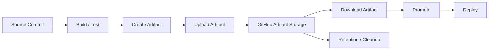
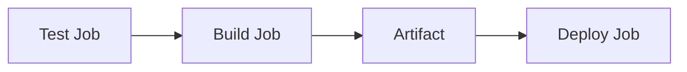
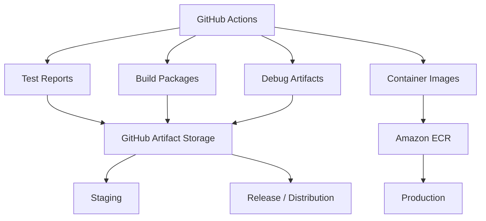
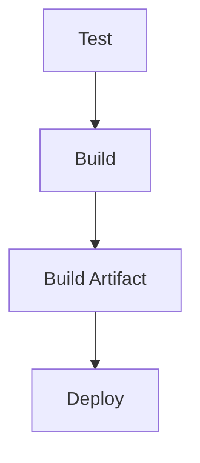
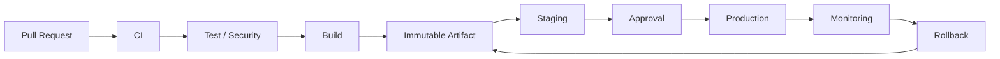

# 05- Artifact Management

## Overview

Artifacts are persistent outputs produced by a GitHub Actions workflow and made available for later jobs, workflows, releases, debugging, or operational recovery.

In a production CI/CD system, artifacts are more than uploaded files. They form part of the delivery chain:

```text
Source
  ↓
Workflow Run
  ↓
Build / Test
  ↓
Artifact
  ↓
Promotion
  ↓
Deployment
  ↓
Production
```

Typical artifacts include:

- Test reports.
- Coverage reports.
- Build packages.
- Compiled frontend assets.
- Python distributions.
- Deployment manifests.
- Debug logs.
- Configuration generated during CI.
- Infrastructure plans.
- Release packages.

Artifacts should be distinguished clearly from caches.

```text
Artifact → Preserve a workflow output
Cache    → Accelerate future execution
```

For production systems, artifact management should provide:

- Clear artifact identity.
- Controlled retention.
- Integrity.
- Traceability.
- Appropriate access.
- Predictable naming.
- Reliable transfer between jobs.
- Safe promotion.
- Efficient storage.
- Operational recoverability.

---

## Artifact Lifecycle

A typical artifact lifecycle is:



The important property is that the artifact represents a concrete output from a specific workflow execution.

---

## What Is a GitHub Actions Artifact?

A GitHub Actions artifact is data uploaded during a workflow run and retained by GitHub for later retrieval according to the configured retention policy.

Example:

```yaml
- name: Upload test reports
  if: ${{ !cancelled() }}
  uses: actions/upload-artifact@v4
  with:
    name: test-reports
    path: reports/
```

The workflow produces:

```text
reports/
├── junit.xml
├── coverage.xml
└── html/
```

The artifact becomes:

```text
test-reports
```

and can later be downloaded.

---

## Why Artifacts Exist

Artifacts solve a common CI/CD problem:

```text
Job A
  ↓
Produces output
  ↓
Job A finishes
  ↓
Job B needs output
```

The runner filesystem should not be treated as a durable communication mechanism between jobs.

Artifacts provide a persistent transfer mechanism:

```text
Job A
  ↓
Artifact Storage
  ↓
Job B
```

This is particularly useful when jobs run on different runners.

---

## Artifact Storage vs Runner Filesystem

A runner workspace is temporary from the workflow's perspective.

For example:

```text
Runner A
 └── workspace/
      └── build.zip
```

A later job may execute on:

```text
Runner B
```

and cannot assume that:

```text
workspace/build.zip
```

exists.

Instead:

```text
Runner A
    ↓
Upload Artifact
    ↓
Artifact Storage
    ↓
Runner B
    ↓
Download Artifact
```

---

## Uploading Artifacts

The standard pattern is:

```yaml
- name: Build package
  run: |
    mkdir -p dist
    python -m build

- name: Upload package
  uses: actions/upload-artifact@v4
  with:
    name: python-package
    path: dist/
```

The important relationship is:

```text
Build
 ↓
dist/
 ↓
Upload
 ↓
python-package
```

---

## Artifact Names

Artifact names should be:

- Deterministic.
- Meaningful.
- Unique where required.
- Easy to identify operationally.

Good examples:

```text
test-reports
coverage-report
python-package
deployment-manifest
docker-metadata
```

For matrix jobs, include dimensions when necessary:

```yaml
- name: Upload test results
  uses: actions/upload-artifact@v4
  with:
    name: test-results-python-${{ matrix.python-version }}
    path: reports/
```

This produces:

```text
test-results-python-3.11
test-results-python-3.12
test-results-python-3.13
```

---

## Artifact Naming and Matrix Jobs

Matrix jobs can execute concurrently.

Consider:

```yaml
strategy:
  matrix:
    python-version:
      - "3.11"
      - "3.12"
```

Avoid designing artifact names that make it impossible to distinguish outputs from different matrix combinations.

Use:

```yaml
name: test-results-${{ matrix.python-version }}
```

For multidimensional matrices:

```yaml
name: test-${{ matrix.python-version }}-${{ matrix.database }}
```

This makes artifacts easier to inspect and aggregate.

---

## Artifact Paths

The `path` identifies what should be uploaded.

Example:

```yaml
with:
  name: coverage
  path: coverage.xml
```

Multiple paths can be specified using a multiline value:

```yaml
with:
  name: reports
  path: |
    reports/junit.xml
    reports/coverage.xml
```

Directory uploads are also common:

```yaml
with:
  name: test-reports
  path: reports/
```

---

## Empty Artifact Problems

A frequent CI failure is assuming a file exists when the producing step failed or generated output elsewhere.

For example:

```yaml
- name: Upload report
  uses: actions/upload-artifact@v4
  with:
    name: report
    path: reports/
```

Potential causes of missing content include:

- Test command failed before generating reports.
- Incorrect path.
- Wrong working directory.
- Conditional generation.
- Matrix-specific path.
- Report generation tool misconfiguration.

Inspect the filesystem before uploading:

```yaml
- name: Inspect reports
  if: ${{ !cancelled() }}
  run: |
    pwd
    find reports -maxdepth 2 -type f -print
```

Avoid using broad filesystem dumps when sensitive files may be present.

---

## Conditional Artifact Uploads

Reports often need to be uploaded even when tests fail.

For example:

```yaml
- name: Run tests
  run: pytest --junitxml=reports/junit.xml

- name: Upload test report
  if: ${{ !cancelled() }}
  uses: actions/upload-artifact@v4
  with:
    name: test-report
    path: reports/
```

The important distinction is:

```text
failure → preserve diagnostic evidence
cancelled → do not necessarily perform additional work
```

Use conditions deliberately rather than blindly applying `always()` everywhere.

---

## `always()` and Artifact Collection

A common pattern is:

```yaml
if: ${{ always() }}
```

This can make diagnostic collection execute after failures.

However, `always()` has important cancellation implications and should not be used indiscriminately for steps that could perform destructive operations.

For artifact collection, prefer a condition appropriate to the desired behavior, such as:

```yaml
if: ${{ !cancelled() }}
```

when the goal is to preserve reports without continuing work after cancellation.

---

## Artifact Download

A downstream job can download an artifact:

```yaml
- name: Download build artifact
  uses: actions/download-artifact@v5
  with:
    name: python-package
    path: dist/
```

The resulting flow is:

```text
Build Job
    ↓
python-package
    ↓
Deploy Job
    ↓
dist/
```

This allows jobs to run on different runners while sharing explicit outputs.

---

## Job-to-Job Artifact Flow

A common production pattern is:



The artifact becomes the boundary between build and deployment.

This is especially valuable when deployment should not rebuild application code.

---

## Build Once, Deploy Many

A strong production pattern is:

```text
Build Once
    ↓
Immutable Artifact
    ↓
Staging
    ↓
Approval
    ↓
Production
```

Instead of:

```text
Build for Staging
    ↓
Deploy

Build again for Production
    ↓
Deploy
```

The second model can produce different binaries or Docker images.

Artifact promotion avoids that problem.

---

## Immutable Artifact Identity

A production artifact should have an identifiable origin.

For example:

```text
Commit:
abc123

Artifact:
orders-api-build-abc123

Docker Image:
orders-api:abc123

Digest:
sha256:...
```

The traceability chain becomes:

```text
Commit SHA
   ↓
Workflow Run
   ↓
Artifact
   ↓
Image Digest
   ↓
Deployment
```

This is useful for incident investigation and rollback.

---

## Artifact vs Docker Image

Artifacts and container images serve related but different purposes.

| Artifact | Docker Image |
|---|---|
| Generic workflow output | Container runtime package |
| Stored as workflow artifact | Stored in container registry |
| Useful for reports/packages | Used directly by container platforms |
| GitHub Actions transfer mechanism | Deployment/runtime distribution mechanism |
| Often temporary | Often retained as release history |

A Docker image should generally be stored in a registry such as Amazon ECR rather than treated as the primary production runtime artifact in GitHub Actions artifact storage.

---

## Artifact vs Cache

Caches are designed to accelerate future work.

Artifacts preserve outputs.

Example:

```text
pip cache
→ Cache

pytest report
→ Artifact

Docker BuildKit cache
→ Cache

Python wheel for deployment
→ Artifact
```

A cache should normally be disposable.

A deployment artifact should be reproducible and identifiable.

---

## Cache Miss vs Artifact Failure

A cache miss:

```text
Cache miss
 ↓
Download dependencies
 ↓
Build continues
```

An artifact failure:

```text
Artifact missing
 ↓
Deployment cannot continue
```

Therefore, artifact availability is usually a correctness concern while caching is primarily a performance concern.

---

## Artifact Retention

Artifacts consume storage.

Retention should match the purpose of the artifact.

Examples:

| Artifact | Typical retention strategy |
|---|---|
| PR test reports | Short |
| Coverage reports | Short to moderate |
| Build packages | Based on release policy |
| Production deployment artifacts | Longer |
| Debug artifacts | Short |
| Release artifacts | Long-term |

Use explicit retention where appropriate:

```yaml
- name: Upload test report
  uses: actions/upload-artifact@v4
  with:
    name: test-report
    path: reports/
    retention-days: 7
```

Retention should be aligned with operational and compliance requirements.

---

## Retention and Cost

Artifact storage can become expensive at scale.

Suppose:

```text
100 runs/day
×
500 MB/run
=
50 GB/day
```

Long retention can accumulate significant storage.

Control cost through:

- Appropriate retention periods.
- Smaller artifacts.
- Compression.
- Selective uploads.
- Matrix artifact reduction.
- Release-specific retention policies.
- Avoiding unnecessary duplicate artifacts.

Do not upload entire workspaces.

---

## Artifact Size

Avoid uploading:

```text
.git/
node_modules/
.venv/
Docker layers/
Large dependency caches/
Temporary files/
Secrets
```

unless they are explicitly required.

Instead upload the smallest useful output:

```text
dist/
reports/
coverage.xml
build/package.whl
```

Smaller artifacts improve:

- Upload time.
- Download time.
- Storage cost.
- Workflow duration.

---

## Artifact Compression

Artifact systems generally package uploaded files for storage and transfer.

However, explicit compression can still be useful when the application output is already naturally compressible or when a single release package is desired.

For example:

```bash
tar -czf release.tar.gz dist/
```

Then:

```yaml
- name: Upload release package
  uses: actions/upload-artifact@v4
  with:
    name: release-package
    path: release.tar.gz
```

Avoid compressing already-compressed formats unnecessarily.

---

## Artifact Structure

A production package should have a predictable structure.

Example:

```text
release/
├── app/
├── migrations/
├── static/
├── config/
└── VERSION
```

Or:

```text
dist/
├── orders_api-1.4.2-py3-none-any.whl
└── orders_api-1.4.2.tar.gz
```

Predictability simplifies deployment automation.

---

## Downloading Multiple Artifacts

A downstream job may need several artifacts:

```yaml
- name: Download build artifact
  uses: actions/download-artifact@v5
  with:
    name: application
    path: build/

- name: Download deployment metadata
  uses: actions/download-artifact@v5
  with:
    name: deployment-metadata
    path: metadata/
```

Keep artifact responsibilities clear.

---

## Downloading All Artifacts

A workflow may download multiple artifacts:

```yaml
- name: Download artifacts
  uses: actions/download-artifact@v5
  with:
    path: artifacts/
```

This can produce a structure similar to:

```text
artifacts/
├── test-python-3.11/
├── test-python-3.12/
├── coverage/
└── build/
```

This is useful for aggregation jobs but can become inefficient for large matrices.

---

## Aggregating Matrix Artifacts

Suppose each matrix job produces:

```text
test-python-3.11
test-python-3.12
test-python-3.13
```

A final job can collect them:

```yaml
aggregate:
  needs: test
  runs-on: ubuntu-latest
  steps:
    - name: Download all test artifacts
      uses: actions/download-artifact@v5
      with:
        path: artifacts/

    - name: Inspect reports
      run: find artifacts -type f -print
```

This supports centralized report generation.

---

## Artifact Naming for Aggregation

A useful pattern is:

```text
<purpose>-<matrix-dimension>
```

For example:

```text
pytest-python-3.11
pytest-python-3.12
pytest-python-3.13
```

For multiple dimensions:

```text
pytest-python-3.12-postgres-16
```

Avoid ambiguous names such as:

```text
test-output
```

for multiple concurrent producers.

---

## Artifact Collisions

When multiple matrix jobs write to the same artifact name, the workflow design may become difficult to reason about.

Prefer unique names for independent producers:

```yaml
name: report-${{ matrix.python-version }}
```

Then aggregate them explicitly.

This makes ownership and failure diagnosis clearer.

---

## Artifact Metadata

Useful metadata includes:

```text
Commit SHA
Workflow Run ID
Build Version
Application Version
Build Timestamp
Artifact Type
Environment
```

For example:

```json
{
  "application": "orders-api",
  "version": "1.4.2",
  "commit": "abc123",
  "run_id": "123456789",
  "artifact": "orders-api-1.4.2"
}
```

Metadata can make production debugging substantially easier.

Do not include secrets or sensitive infrastructure credentials.

---

## Artifact Manifest

A manifest can make artifact contents explicit.

Example:

```json
{
  "application": "orders-api",
  "version": "1.4.2",
  "commit": "abc123",
  "files": [
    "orders_api-1.4.2-py3-none-any.whl"
  ]
}
```

The manifest itself can be uploaded as an artifact:

```yaml
- name: Upload release metadata
  uses: actions/upload-artifact@v4
  with:
    name: release-metadata
    path: release.json
```

---

## Artifact Integrity

Artifacts should be protected against accidental or malicious modification.

Useful controls include:

- Immutable artifact identity.
- Checksums.
- Provenance.
- Attestations.
- Signing.
- Controlled permissions.
- Restricted deployment workflows.

For example:

```bash
sha256sum release.tar.gz
```

can produce a digest for verification.

For container deployments, image digests provide stronger identity than mutable tags.

---

## Artifact Provenance

Provenance answers:

```text
Where did this artifact come from?
```

A useful chain is:

```text
Repository
 ↓
Commit
 ↓
Workflow
 ↓
Runner
 ↓
Build
 ↓
Artifact
```

This becomes increasingly important for production and regulated systems.

---

## SBOM and Artifacts

Software Bills of Materials can describe dependencies included in a build.

For example:

```text
Application
 ↓
Python dependencies
 ↓
Docker base image
 ↓
System packages
 ↓
SBOM
```

The SBOM can be retained alongside the artifact.

This supports:

- Vulnerability analysis.
- Incident response.
- Dependency inventory.
- Compliance.
- Supply-chain investigations.

---

## Artifact Attestations

Attestations can provide verifiable metadata about how an artifact was produced.

Conceptually:

```text
Source
 ↓
Trusted Workflow
 ↓
Build
 ↓
Artifact
 ↓
Attestation
```

This strengthens the relationship between artifact identity and build provenance.

---

## Artifact Signing

Signing can establish integrity and authenticity.

Conceptually:

```text
Artifact
 ↓
Digest
 ↓
Signature
 ↓
Verification
```

A deployment system can verify the artifact before allowing it into production.

Signing is particularly valuable when artifacts move across trust boundaries.

---

## Security Considerations

Artifacts can contain sensitive information.

Potential accidental leaks include:

```text
.env
Private keys
Cloud credentials
Database dumps
Debug logs
Temporary tokens
Internal configuration
```

Never upload broad directories without inspecting their contents.

Dangerous:

```yaml
path: .
```

Safer:

```yaml
path: |
  dist/
  reports/
```

---

## Secret Exposure Through Reports

A failing test may include configuration values in:

```text
tracebacks
logs
screenshots
HTTP dumps
debug reports
```

Therefore:

```text
Secret masking
```

does not eliminate the need for artifact hygiene.

Review what diagnostic tooling writes to disk before uploading it.

---

## Fork Pull Requests

Artifacts generated by untrusted pull requests should be treated carefully.

Consider:

```text
Fork PR
 ↓
Untrusted Code
 ↓
Artifact
 ↓
Trusted Workflow
```

Do not automatically trust artifact contents merely because they were uploaded by GitHub Actions.

Artifact consumption can become a supply-chain boundary.

---

## Artifact Poisoning

An artifact can be malicious or incorrect even if the workflow technically succeeded.

For example:

```text
Compromised build step
 ↓
Malicious package
 ↓
Artifact
 ↓
Production deployment
```

Mitigations include:

- Least privilege.
- Trusted actions.
- SHA pinning.
- Dependency controls.
- Build isolation.
- Provenance.
- Attestations.
- Artifact verification.
- Controlled promotion.

---

## Build Artifact Promotion

A production pipeline should preferably use:

```text
Build
 ↓
Artifact
 ↓
Staging
 ↓
Approval
 ↓
Production
```

rather than:

```text
Build
 ↓
Staging

Build Again
 ↓
Production
```

The promoted artifact should retain the same identity.

---

## Docker Image Promotion

For containerized applications:

```text
Source
 ↓
Docker Buildx
 ↓
Image
 ↓
ECR
 ↓
Staging
 ↓
Approval
 ↓
Production
```

Use an immutable image digest:

```text
sha256:...
```

rather than rebuilding the image for production.

---

## Python Backend Example

A Django or FastAPI application might use:

```text
Pull Request
 ↓
Lint
 ↓
pytest
 ↓
Coverage
 ↓
Build Python package
 ↓
Upload artifact
```

Example:

```yaml
- name: Install build tooling
  run: python -m pip install build

- name: Build package
  run: python -m build

- name: Upload Python package
  uses: actions/upload-artifact@v4
  with:
    name: python-package
    path: dist/
```

The package can then be consumed by a downstream release workflow.

---

## Django Test Artifacts

A Django CI pipeline can produce:

```text
pytest
 ↓
JUnit XML
 ↓
Coverage XML
 ↓
HTML Coverage
 ↓
Artifact
```

Example:

```yaml
- name: Run tests
  run: |
    mkdir -p reports
    pytest \
      --junitxml=reports/junit.xml \
      --cov=. \
      --cov-report=xml:reports/coverage.xml \
      --cov-report=html:reports/htmlcov

- name: Upload test reports
  if: ${{ !cancelled() }}
  uses: actions/upload-artifact@v4
  with:
    name: django-test-reports
    path: reports/
```

---

## FastAPI Test Artifacts

FastAPI projects can use the same pattern:

```text
pytest
 ↓
JUnit
 ↓
Coverage
 ↓
Artifact
```

Example test output can include:

```text
reports/
├── junit.xml
├── coverage.xml
└── htmlcov/
```

The artifact can be inspected without rerunning the test suite.

---

## Integration Test Artifacts

A backend integration pipeline might use:

```text
FastAPI / Django
        ↓
PostgreSQL
        ↓
Redis
        ↓
pytest
        ↓
Reports
        ↓
Artifacts
```

Artifacts can include:

- Test reports.
- Application logs.
- Database diagnostics.
- Coverage.
- HTTP traces.

Avoid uploading full database contents or secrets.

---

## Celery and Kafka Diagnostics

For asynchronous systems, diagnostic artifacts may include:

```text
Celery task logs
Kafka consumer logs
Test reports
Message-processing diagnostics
```

These can be valuable when integration tests fail intermittently.

Be careful not to include:

- Production credentials.
- Sensitive message payloads.
- Personal data.
- Authentication tokens.

---

## Artifact Retention Strategy

A production policy might look like:

```text
Pull Request Artifacts
    ↓
7 days

CI Build Artifacts
    ↓
14–30 days

Production Deployment Artifacts
    ↓
Longer retention

Release Artifacts
    ↓
Release lifecycle
```

The exact policy should reflect:

- Recovery requirements.
- Compliance.
- Cost.
- Release frequency.
- Audit needs.

---

## Artifact Storage Architecture

A mature CI/CD system can separate artifact classes:



Not every artifact belongs in GitHub Actions artifact storage.

Production runtime images generally belong in a container registry.

---

## Artifact Management Commands

GitHub CLI can support artifact-related operations.

List artifacts for a workflow run:

```bash
gh run view <run-id>
```

For API-level operational tooling:

```bash
gh api \
  repos/{owner}/{repo}/actions/runs/{run_id}/artifacts
```

For example:

```bash
gh api \
  repos/acme/orders-api/actions/runs/123456789/artifacts
```

This is useful when building operational scripts around artifact metadata.

---

## Downloading Artifacts Operationally

The GitHub CLI API can also be used when automation requires artifact retrieval.

For example:

```bash
gh api \
  repos/acme/orders-api/actions/artifacts
```

Use structured JSON processing when building scripts:

```bash
gh api \
  repos/acme/orders-api/actions/runs/123456789/artifacts |
  jq '.artifacts[] | {
    id: .id,
    name: .name,
    size: .size_in_bytes,
    expired: .expired
  }'
```

Operational tooling should handle:

- Authentication.
- Rate limits.
- Missing artifacts.
- Expired artifacts.
- Repository permissions.

---

## Artifact Expiration

An artifact may become unavailable after its retention period.

This matters for:

- Rollback.
- Incident investigation.
- Compliance.
- Historical debugging.

Do not make long-term recovery depend exclusively on short-lived CI artifacts.

For release artifacts, use an appropriate durable artifact repository when required.

---

## Artifacts and Disaster Recovery

Artifacts can contribute to recovery by preserving:

```text
Known-good build
Deployment package
Metadata
Test evidence
```

However, disaster recovery should not depend solely on GitHub Actions artifact retention.

For critical production systems, consider durable storage and artifact registries appropriate to the deployment platform.

---

## Reliability Considerations

Artifact handling can fail independently of application execution.

Potential failures include:

```text
Upload failure
Download failure
Missing path
Expired artifact
Incorrect artifact name
Corrupted output
Permission failure
Storage limitations
```

Treat artifact transfer as an explicit dependency in the workflow graph.

---

## Artifact Upload Failure

Example:

```text
Tests → success
Build → success
Artifact upload → failure
```

The application build may be correct even though the workflow is not operationally complete.

If the artifact is required for deployment:

```text
Artifact upload failure
        ↓
Deployment blocked
```

If the artifact is only diagnostic:

```text
Artifact upload failure
        ↓
Workflow may still be technically usable
```

Design the workflow accordingly.

---

## Artifact Download Failure

Potential causes include:

- Incorrect artifact name.
- Artifact belongs to another run.
- Artifact expired.
- Upstream job did not produce it.
- Permissions.
- Wrong workflow dependency.
- Incorrect download path.

Inspect the producer job before changing the consumer.

---

## Artifact Dependency Graph

A production workflow might look like:



The artifact is a dependency boundary.

If the artifact is missing:

```text
Deploy
  ↓
Cannot proceed
```

This is different from a cache miss.

---

## Artifact and Job Outputs

Small metadata values should usually be passed using outputs.

For example:

```text
image_digest
version
artifact_name
```

Use:

```yaml
echo "artifact_name=orders-api-${GITHUB_SHA}" >> "$GITHUB_OUTPUT"
```

Large files should use artifacts.

Therefore:

```text
Small structured value → Output
Large/persistent file   → Artifact
Reusable dependency     → Cache
```

---

## Artifact vs Output vs Cache

| Mechanism | Best use |
|---|---|
| Environment variable | Step/job configuration |
| Step output | Small value within job |
| Job output | Small value between jobs |
| Artifact | Files produced by workflow |
| Cache | Reusable data for performance |
| Registry | Durable deployable images/packages |

Choosing the correct mechanism keeps workflow architecture understandable.

---

## Artifact Security Boundary

Treat artifacts as data crossing a trust boundary.

For example:

```text
Untrusted PR
    ↓
Artifact
    ↓
Trusted workflow
```

The consumer should validate what it receives.

Do not blindly execute scripts from an artifact generated by untrusted code.

---

## Artifact Verification

Before deploying a critical artifact, validate:

```text
Expected artifact?
Expected commit?
Expected version?
Expected digest?
Expected provenance?
Expected environment?
```

For example:

```text
Deployment requested:
orders-api@sha256:abc123
```

The deployment system should verify that the artifact identity matches the intended release.

---

## Artifact Governance

Organizations should define:

- Naming conventions.
- Retention policies.
- Approved artifact locations.
- Artifact ownership.
- Release artifact policy.
- Sensitive-data restrictions.
- Production promotion rules.
- Provenance requirements.
- Cleanup procedures.

Without governance, artifact storage becomes difficult to operate at scale.

---

## Common Mistakes

### Uploading the Entire Workspace

Bad:

```yaml
path: .
```

This can expose unnecessary files and secrets.

### Using Artifacts as Caches

Artifacts are not intended to replace dependency caches.

### Rebuilding for Every Environment

This weakens build reproducibility.

### Using Ambiguous Artifact Names

Matrix jobs become difficult to distinguish.

### Ignoring Retention

Storage grows unnecessarily.

### Uploading Secrets in Debug Artifacts

Diagnostic output can contain sensitive values.

### Treating a Cache Miss as a Build Failure

Caches are performance optimizations.

### Treating a Missing Artifact as a Cache Problem

Deployment artifacts are correctness dependencies.

### Using Mutable Tags for Deployment Identity

Prefer immutable image digests.

### Trusting Artifacts From Untrusted Code

Artifact contents can become part of a supply-chain attack.

---

## Troubleshooting Artifact Problems

Use the standard model:

```text
Symptom
 ↓
Possible Causes
 ↓
Isolation Strategy
 ↓
Commands / Checks
 ↓
Root Cause
 ↓
Corrective Action
 ↓
Prevention
```

### Artifact Was Not Created

**Possible causes**

- Producing step failed.
- Incorrect path.
- Conditional step skipped.
- Matrix-specific path mismatch.

**Checks**

```bash
pwd
find reports -maxdepth 3 -type f -print
```

**Corrective action**

Fix the producing step or artifact path.

**Prevention**

Validate expected files before upload.

---

### Artifact Upload Failed

**Possible causes**

- Storage issue.
- Invalid path.
- Permission problem.
- Artifact configuration issue.

**Isolation**

Determine whether the failure occurs during:

```text
File generation
    or
Artifact upload
```

**Prevention**

Keep artifacts small and paths explicit.

---

### Downstream Job Cannot Find Artifact

**Possible causes**

- Wrong name.
- Wrong run.
- Producer job did not complete.
- Artifact expired.

**Checks**

```bash
gh run view <run-id>
```

Then inspect artifact metadata.

---

### Matrix Artifacts Overlap

**Symptom**

Artifacts from different matrix jobs are difficult to distinguish.

**Root cause**

Non-unique artifact naming.

**Corrective action**

Include matrix dimensions:

```yaml
name: test-${{ matrix.python-version }}
```

**Prevention**

Define artifact naming conventions.

---

### Artifact Contains Sensitive Data

**Symptom**

Secrets or internal data appear in uploaded files.

**Root cause**

Broad path selection or verbose diagnostics.

**Corrective action**

Rotate exposed credentials if necessary and remove unnecessary artifact generation.

**Prevention**

Use explicit paths and review diagnostic output.

---

## Monitoring Artifact Operations

Useful metrics include:

```text
Artifact upload failures
Artifact download failures
Artifact size
Artifact count
Storage usage
Artifact retention
Build-to-artifact duration
```

A sudden increase in artifact size can indicate:

- Accidental workspace uploads.
- Debug logging changes.
- Dependency packaging changes.
- Build output growth.

---

## Performance Optimization

Optimize artifact handling by:

- Uploading only required files.
- Avoiding duplicate artifacts.
- Compressing appropriate data.
- Reducing matrix duplication.
- Aggregating reports efficiently.
- Separating large deployable packages from small diagnostics.
- Using a registry for container images.

Avoid optimizing by removing artifacts that are required for incident investigation.

---

## Scalability

At small scale:

```text
Few workflows
Few artifacts
Short retention
```

At organizational scale:

```text
Hundreds of repositories
Thousands of runs
Large matrices
Multiple environments
Long-lived releases
```

Artifact governance becomes important.

Use consistent:

- Naming.
- Retention.
- Ownership.
- Promotion.
- Provenance.

---

## High Availability

Artifact storage is part of the CI/CD dependency chain.

If deployment requires:

```text
Build Artifact
```

then artifact availability directly affects deployment availability.

Reduce risk through:

- Durable release storage where required.
- Immutable artifact identity.
- Controlled retention.
- Independent artifact registries for production workloads.
- Recovery procedures.

---

## Disaster Recovery

For production recovery, identify:

```text
Last Known-Good Commit
        ↓
Artifact
        ↓
Image Digest
        ↓
Deployment
```

The system should be able to answer:

> Which exact artifact was running successfully before the incident?

If that answer cannot be established, rollback becomes more uncertain.

---

## Production Reference Architecture



The important property is that the same artifact can move through environments.

---

## Production Example

A Python backend pipeline can be structured as:

```text
Pull Request
    ↓
Lint
    ↓
Unit Tests
    ↓
Integration Tests
    ↓
Security Scan
    ↓
Matrix Testing
    ↓
Build Python Package
    ↓
Build Docker Image
    ↓
Push Image to ECR
    ↓
Generate Metadata / SBOM
    ↓
Staging
    ↓
Approval
    ↓
Production
    ↓
Monitoring
    ↓
Rollback if required
```

Artifacts and registries provide the boundaries between these stages.

---

## Senior Design Principles

### Artifacts Represent Outputs

Do not use artifacts merely because they are convenient. Define what output the artifact represents and who consumes it.

### Artifact Identity Must Be Explicit

A production deployment should be traceable to a specific commit, workflow run, and immutable artifact.

### Build Once, Promote Many

Reusing the same artifact reduces differences between environments and simplifies rollback.

### Artifacts Are Not Caches

Artifacts preserve outputs. Caches optimize repeated computation.

### Minimize Artifact Surface Area

Upload only what is needed. This improves security, performance, and cost.

### Treat Artifacts as Trust Boundaries

Artifacts can contain untrusted or compromised content. Validate provenance and identity before using them in privileged workflows.

### Retention Should Reflect Recovery Requirements

Short-lived diagnostic artifacts and long-lived release artifacts have different retention needs.

### Production Recovery Requires Traceability

A mature CI/CD platform should make it possible to move from:

```text
Production
 ↓
Deployment
 ↓
Artifact
 ↓
Workflow Run
 ↓
Commit
```

without ambiguity.

## Interview Scenarios

### Why Should You Use an Artifact Between Build and Deploy Jobs?

Because jobs can execute on different runners and should not depend on a shared runner filesystem.

The artifact provides an explicit and persistent transfer boundary.

### What Is the Difference Between an Artifact and a Cache?

An artifact preserves workflow output for later consumption.

A cache exists primarily to accelerate future workflow execution.

### Why Is Build Once, Deploy Many Important?

Rebuilding separately for staging and production can produce different outputs.

Promoting the same immutable artifact provides stronger reproducibility and traceability.

### How Would You Handle Artifacts From Matrix Jobs?

Give each matrix combination a unique artifact name:

```yaml
name: test-${{ matrix.python-version }}-${{ matrix.database }}
```

Then aggregate them explicitly in a downstream job.

### A Production Deployment Failed After the Image Was Pushed. Would You Rebuild?

Not automatically.

First identify the existing image digest and deployment state. If the artifact is valid, promote or redeploy the same immutable artifact.

### How Would You Prevent Secrets From Entering Artifacts?

Use explicit upload paths, avoid uploading the workspace, review generated reports, sanitize diagnostics, and never assume masking protects files stored as artifacts.

### How Would You Design Artifact Retention?

Base it on artifact purpose:

```text
PR diagnostics → short
CI outputs → moderate
Production release → longer
Release packages → lifecycle-driven
```

Balance recovery requirements against storage cost.

### Why Should Production Images Usually Be Stored in ECR Rather Than GitHub Actions Artifacts?

A container registry is designed for durable image storage and runtime distribution. GitHub Actions artifacts are primarily workflow outputs and transfer mechanisms.

### What Makes an Artifact Production-Ready?

A production artifact should be:

- Identifiable.
- Reproducible.
- Traceable to source.
- Appropriately retained.
- Protected from unauthorized modification.
- Safe to promote.
- Suitable for rollback.

## Production Checklist

### Artifact Creation

- [ ] Artifact purpose is clearly defined.
- [ ] Upload paths are explicit.
- [ ] Required files are validated.
- [ ] Matrix artifacts have unique names.
- [ ] Diagnostic artifacts are collected after test failures where appropriate.

### Artifact Security

- [ ] No secrets are uploaded.
- [ ] Untrusted artifact contents are treated carefully.
- [ ] Artifact provenance is available where required.
- [ ] Production artifacts have controlled access.
- [ ] Artifact identity is immutable or otherwise verifiable.

### Artifact Promotion

- [ ] Build artifacts are created once.
- [ ] The same artifact is promoted between environments.
- [ ] Docker images use immutable identity.
- [ ] Deployment records reference the artifact.
- [ ] Rollback can identify a known-good artifact.

### Operations

- [ ] Retention policies are defined.
- [ ] Artifact storage is monitored.
- [ ] Large or unnecessary artifacts are avoided.
- [ ] Release artifacts have appropriate long-term storage.
- [ ] Recovery procedures can locate known-good artifacts.

### Troubleshooting

- [ ] Producer job is inspected before consumer job.
- [ ] Artifact path is validated.
- [ ] Artifact name is verified.
- [ ] Matrix dimensions are checked.
- [ ] Expiration is considered.
- [ ] Workflow and deployment state are inspected separately.

## Key Takeaways

- **Artifacts are persistent workflow outputs that provide an explicit boundary for moving build, test, diagnostic, and release data between GitHub Actions jobs and environments.**
- **Artifacts and caches serve different purposes: artifacts preserve outputs and support delivery, while caches primarily improve execution performance.**
- **Production pipelines should build once, create an identifiable immutable artifact, and promote that same artifact through staging and production rather than rebuilding for each environment.**
- **Artifact security requires explicit upload paths, appropriate retention, provenance, controlled access, and protection against secrets, untrusted content, and artifact poisoning.**
- **Strong artifact management creates traceability from commit SHA to workflow run to artifact or image digest to deployment, making rollback, incident investigation, and recovery significantly more reliable.**