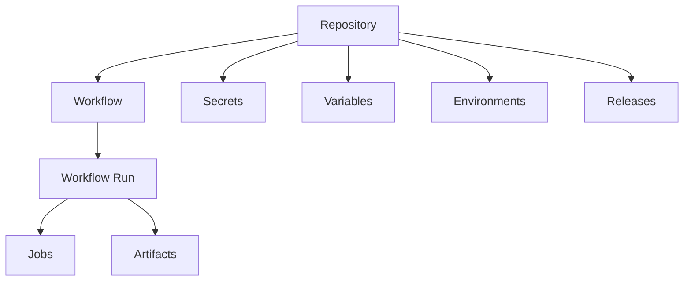
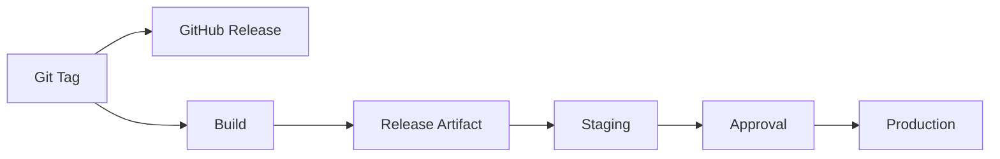
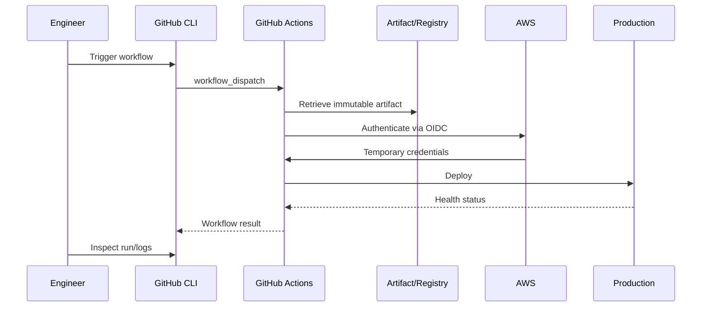

# 06- Repository and Actions Management

## Overview

GitHub CLI (`gh`) provides an operational interface for managing GitHub repositories and GitHub Actions without relying exclusively on the web UI.

For CI/CD engineering, the useful scope is not generic repository administration. The important capabilities are:

- Inspecting repository configuration relevant to CI/CD.
- Listing and inspecting workflows.
- Triggering and rerunning workflows.
- Inspecting workflow runs and failures.
- Managing Actions-related secrets and variables.
- Managing environments.
- Inspecting releases and deployment-related state.
- Automating operational workflows through scripts and CI jobs.

The distinction between Git and GitHub CLI is important:

```text
Git
 ↓
Version-control operations
 ↓
clone / commit / branch / merge / push
```

while:

```text
GitHub CLI
 ↓
GitHub platform operations
 ↓
repositories / Actions / runs / secrets / variables / environments / releases
```

A production engineer should be able to move from:

```text
Repository
   ↓
Workflow
   ↓
Run
   ↓
Job
   ↓
Failure
   ↓
Configuration
   ↓
Correction
   ↓
Rerun
```

using the CLI when operational automation or repeatability makes it preferable to the web interface.

---

## GitHub CLI in CI/CD

The `gh` CLI is particularly useful for:

| Area | Typical operation |
|---|---|
| Repository | Inspect repository state and configuration |
| Workflows | List and inspect workflows |
| Runs | View, monitor, rerun, cancel |
| Logs | Retrieve failed workflow logs |
| Artifacts | Inspect workflow artifacts |
| Secrets | Create, update, delete repository secrets |
| Variables | Manage repository Actions variables |
| Environments | Inspect and manage deployment environments |
| Releases | Create and inspect releases |
| Automation | Build operational scripts |

A useful mental model is:



---

## Authentication

Before using GitHub CLI against a repository, authenticate:

```bash
gh auth login
```

Verify the current authentication:

```bash
gh auth status
```

For automation, use a non-interactive token rather than an interactive login.

For example:

```bash
export GH_TOKEN="$GITHUB_TOKEN"
```

Then:

```bash
gh repo view
```

The token must have sufficient permissions for the operation being performed.

---

## Authentication in GitHub Actions

GitHub Actions already provides `GITHUB_TOKEN`.

A workflow can expose it to `gh` through `GH_TOKEN`:

```yaml
permissions:
  contents: read
  actions: read

steps:
  - name: Inspect workflows
    env:
      GH_TOKEN: ${{ github.token }}
    run: gh workflow list
```

This is preferable to creating a long-lived personal access token for routine workflow operations.

---

## Least Privilege

CLI authentication does not bypass GitHub's authorization model.

If a command fails with a permission error, inspect:

- Token permissions.
- Repository access.
- Organization policies.
- Actions permissions.
- Environment protection.
- Resource ownership.

For example:

```yaml
permissions:
  contents: read
  actions: read
```

is safer than granting broad write permissions when the job only needs to inspect workflow runs.

For a workflow that triggers another workflow, additional permissions or an appropriate authentication mechanism may be required depending on the operation and repository configuration.

---

## Repository Context

Most `gh` commands can infer the repository from the current Git remote.

For example:

```bash
cd orders-api
gh repo view
```

You can also specify the repository explicitly:

```bash
gh repo view acme/orders-api
```

Explicit repository references are useful in operational scripts because they avoid dependence on the current working directory.

---

## Repository Inspection

View repository information:

```bash
gh repo view acme/orders-api
```

Open the repository in a browser:

```bash
gh repo view acme/orders-api --web
```

For automation, structured output is often more useful:

```bash
gh repo view acme/orders-api --json nameWithOwner,defaultBranchRef,isPrivate
```

This allows scripts to consume repository metadata without parsing human-readable output.

---

## Repository Metadata

Repository metadata can be useful when diagnosing CI/CD behavior.

Examples include:

```bash
gh repo view acme/orders-api \
  --json nameWithOwner,defaultBranchRef,isPrivate
```

A script can inspect:

- Repository name.
- Owner.
- Default branch.
- Visibility.
- Repository URL.

Avoid depending on formatted CLI output when building automation.

Prefer:

```bash
--json
```

where supported.

---

## Repository Listing

List repositories available to the authenticated user:

```bash
gh repo list acme
```

For automation:

```bash
gh repo list acme --limit 100
```

This can be useful for organization-wide CI/CD inventory.

However, repository enumeration should be used deliberately because large organizations may contain hundreds or thousands of repositories.

---

## Repository Creation

Create a repository:

```bash
gh repo create acme/orders-api
```

For a backend project:

```bash
gh repo create acme/orders-api \
  --private \
  --source=. \
  --remote=origin \
  --push
```

Repository creation is usually an administrative operation rather than a routine deployment operation.

Production organizations should enforce repository governance separately through organization policies and templates.

---

## Repository Configuration and CI/CD Governance

Repository-level settings influence Actions behavior.

Examples include:

- Actions availability.
- Workflow permissions.
- Fork behavior.
- Repository secrets.
- Repository variables.
- Environments.
- Branch protection.
- Deployment configuration.

The CLI can automate parts of repository administration, but organization and enterprise policies may still take precedence.

---

## GitHub Actions Workflow Model

A repository may contain:

```text
.github/
└── workflows/
    ├── ci.yml
    ├── cd.yml
    └── release.yml
```

The CLI treats each workflow as an executable unit.

```text
Workflow
   ↓
Workflow Run
   ↓
Jobs
   ↓
Steps
```

The CLI commands most relevant to this model are:

```bash
gh workflow
gh run
```

---

## Listing Workflows

List workflows:

```bash
gh workflow list
```

For a specific repository:

```bash
gh workflow list --repo acme/orders-api
```

This is one of the fastest ways to answer:

> Which workflows are configured in this repository?

---

## Workflow Status

A workflow can have states such as:

- Active.
- Disabled.
- Other repository-specific workflow states exposed by the CLI.

Inspect workflow details:

```bash
gh workflow view ci.yml
```

For another repository:

```bash
gh workflow view ci.yml --repo acme/orders-api
```

---

## Workflow Files vs Workflow IDs

A workflow can be referenced by:

- Workflow filename.
- Workflow ID.

For example:

```bash
gh workflow run ci.yml
```

or:

```bash
gh workflow run 12345678
```

Using an ID can be useful in automation when the workflow identity is already known.

Using the filename is often easier to read in operational scripts.

---

## Running a Workflow Manually

A workflow must support an appropriate manual trigger, typically:

```yaml
on:
  workflow_dispatch:
```

Then:

```bash
gh workflow run ci.yml
```

For another branch:

```bash
gh workflow run ci.yml --ref main
```

This is useful for:

- Manual deployments.
- Operational workflows.
- Release pipelines.
- Recovery procedures.
- Re-running controlled processes.

---

## Workflow Inputs

A workflow can define manual inputs:

```yaml
on:
  workflow_dispatch:
    inputs:
      environment:
        description: Deployment environment
        required: true
        type: choice
        options:
          - staging
          - production
```

Then trigger it:

```bash
gh workflow run deploy.yml \
  --ref main \
  -f environment=staging
```

Inputs should be validated inside the workflow.

Do not assume that a CLI-provided value is automatically trustworthy.

---

## Triggering Production Workflows

Production workflows should have strong safeguards.

A safer architecture is:

```text
gh workflow run
       ↓
Workflow validation
       ↓
Environment protection
       ↓
Approval
       ↓
Deployment
```

The CLI should not become a mechanism for bypassing production controls.

Environment protection, branch restrictions, permissions, concurrency, and artifact validation should remain part of the deployment design.

---

## Listing Workflow Runs

List recent runs:

```bash
gh run list
```

For a specific workflow:

```bash
gh run list --workflow ci.yml
```

For a repository:

```bash
gh run list \
  --repo acme/orders-api \
  --workflow ci.yml
```

Limit results:

```bash
gh run list \
  --repo acme/orders-api \
  --workflow ci.yml \
  --limit 20
```

---

## Filtering Workflow Runs

Useful filters include:

```bash
gh run list --status failure
```

and:

```bash
gh run list --status success
```

You can also filter by workflow:

```bash
gh run list \
  --workflow deploy.yml \
  --status failure
```

This is useful during incident investigation.

---

## Inspecting a Workflow Run

Inspect a specific run:

```bash
gh run view 123456789
```

For another repository:

```bash
gh run view 123456789 \
  --repo acme/orders-api
```

This provides a high-level view of:

- Workflow.
- Commit.
- Branch.
- Jobs.
- Status.
- Duration.
- Conclusions.

---

## Inspecting Run Jobs

For operational debugging:

```bash
gh run view 123456789 --verbose
```

This is useful when determining which job failed before retrieving detailed logs.

A good debugging sequence is:

```text
Run
 ↓
Failed Job
 ↓
Failed Step
 ↓
Logs
 ↓
Root Cause
```

Avoid immediately rerunning a failed production workflow before understanding the failure.

---

## Workflow Logs

View logs for a run:

```bash
gh run view 123456789 --log
```

View failed logs only:

```bash
gh run view 123456789 --log-failed
```

The latter is particularly useful when a workflow has many successful jobs.

---

## Downloading Logs

Logs can be redirected for local investigation:

```bash
gh run view 123456789 --log-failed > failed-run.log
```

Then inspect:

```bash
grep -n "ERROR" failed-run.log
```

or:

```bash
less failed-run.log
```

Be careful when sharing logs because they may contain sensitive operational information.

---

## Rerunning Workflows

Rerun an entire workflow:

```bash
gh run rerun 123456789
```

Rerun only failed jobs:

```bash
gh run rerun 123456789 --failed
```

Rerunning should be a deliberate troubleshooting action.

A retry is appropriate when the failure is transient.

It is not a substitute for diagnosing deterministic failures.

---

## Rerun Decision

Use this reasoning:

```text
Failure
 ↓
Is it deterministic?
 ├── Yes → Diagnose and fix
 │
 └── No
      ↓
   Investigate transient cause
      ↓
   Retry if appropriate
```

Examples of potentially transient failures:

- Temporary network failure.
- External service outage.
- Runner infrastructure issue.
- Registry timeout.

Examples of deterministic failures:

- Syntax error.
- Failed test.
- Missing secret.
- Invalid IAM policy.
- Incorrect Dockerfile.
- Invalid workflow expression.

---

## Cancelling a Workflow Run

Cancel a running workflow:

```bash
gh run cancel 123456789
```

This can be useful when:

- A duplicate deployment is running.
- A runaway workflow is consuming resources.
- A deployment must be stopped.
- An incorrect workflow was triggered.

Cancellation should be coordinated with deployment concurrency controls.

---

## Workflow Watch

Watch a workflow run until it completes:

```bash
gh run watch 123456789
```

This is useful for operational workflows where an engineer wants synchronous feedback.

For example:

```text
Trigger deployment
      ↓
gh run watch
      ↓
Deployment result
```

---

## Operational Workflow Pattern

A deployment script can use:

```bash
gh workflow run deploy.yml \
  --ref main \
  -f environment=staging
```

Then retrieve the run:

```bash
gh run list \
  --workflow deploy.yml \
  --limit 1
```

Then watch it:

```bash
gh run watch <run-id>
```

This creates a CLI-driven operational workflow without requiring the engineer to manually navigate the web UI.

---

## JSON Output

For automation, prefer structured output.

Example:

```bash
gh run list \
  --workflow ci.yml \
  --json databaseId,status,conclusion,headSha
```

A script can process this data with `jq`:

```bash
gh run list \
  --workflow ci.yml \
  --json databaseId,status,conclusion,headSha |
  jq '.[] | {
    run: .databaseId,
    status: .status,
    conclusion: .conclusion,
    sha: .headSha
  }'
```

This is significantly more robust than parsing formatted terminal output.

---

## Repository-Level Actions Configuration

Actions behavior can be influenced by repository settings and policies.

Operational concerns include:

- Workflow permissions.
- Allowed actions.
- Workflow execution.
- Fork behavior.
- Secrets.
- Variables.
- Environments.
- Runner access.

A senior engineer should distinguish:

```text
Workflow YAML configuration
```

from:

```text
Repository / Organization / Enterprise policy
```

A correct YAML file can still fail because a higher-level policy prevents its execution.

---

## Actions Permissions

Workflow permissions should follow least privilege.

Example:

```yaml
permissions:
  contents: read
```

A deployment workflow might require additional permissions:

```yaml
permissions:
  contents: read
  id-token: write
```

when using GitHub OIDC with AWS.

The exact permissions should be determined by the workflow's operations rather than copied from another repository.

---

## Repository Secrets

GitHub CLI can manage repository secrets.

Set a secret interactively:

```bash
gh secret set DATABASE_PASSWORD
```

Set from standard input:

```bash
printf '%s' "$DATABASE_PASSWORD" |
  gh secret set DATABASE_PASSWORD
```

Specify a repository:

```bash
printf '%s' "$DATABASE_PASSWORD" |
  gh secret set DATABASE_PASSWORD \
  --repo acme/orders-api
```

This avoids placing the secret directly in shell arguments.

---

## Secret Management Security

Prefer:

```bash
printf '%s' "$SECRET" | gh secret set NAME
```

over:

```bash
gh secret set NAME --body "$SECRET"
```

when the shell history, process arguments, or command auditing could expose command-line values.

The broader principle is:

```text
Secret
 ↓
stdin / secure secret channel
 ↓
GitHub
```

rather than:

```text
Secret
 ↓
Shell argument
 ↓
Process metadata / history risk
```

---

## Listing Repository Secrets

List secret names:

```bash
gh secret list \
  --repo acme/orders-api
```

GitHub does not expose the secret value through the normal management interface.

The operational purpose of listing secrets is to verify presence and metadata rather than retrieve secret contents.

---

## Deleting Repository Secrets

Remove a secret:

```bash
gh secret delete DATABASE_PASSWORD \
  --repo acme/orders-api
```

Deletion should be coordinated with:

- Workflow references.
- Secret rotation.
- Deployment configuration.
- Application runtime configuration.

Do not delete a production secret blindly because a workflow appears unused.

---

## Organization Secrets

Organization-level secrets can support shared CI/CD workflows.

For example:

```bash
gh secret list \
  --org acme
```

Organization secrets should be used carefully because their scope can be much broader than repository secrets.

Prefer the smallest scope required.

---

## Environment Secrets

Production deployments frequently use environment-specific secrets.

Conceptually:

```text
Repository
 ├── staging
 │    └── staging secrets
 │
 └── production
      └── production secrets
```

Environment protection can additionally require reviewers before deployment proceeds.

This creates a security boundary:

```text
CI
 ↓
Production Environment
 ↓
Approval / Protection
 ↓
Secret availability
 ↓
Deployment
```

---

## Repository Variables

Actions variables are suitable for non-sensitive configuration.

Set a repository variable:

```bash
gh variable set API_TIMEOUT \
  --body "30" \
  --repo acme/orders-api
```

List variables:

```bash
gh variable list \
  --repo acme/orders-api
```

Delete a variable:

```bash
gh variable delete API_TIMEOUT \
  --repo acme/orders-api
```

Do not store credentials in variables.

---

## Secrets vs Variables

| Resource | Sensitive? | Example |
|---|---:|---|
| Secret | Yes | API token |
| Variable | No | API timeout |
| Environment secret | Yes | Production credential |
| Environment variable | Usually no | Deployment region |

A value should not be moved into a variable merely because it is easier to manage.

---

## Environment Management

GitHub Environments represent deployment targets such as:

```text
development
staging
production
```

They can provide:

- Environment secrets.
- Environment variables.
- Required reviewers.
- Deployment protection.
- Deployment history.
- Branch/tag restrictions.

The CLI can be used to inspect environment configuration through GitHub APIs when direct high-level CLI support is insufficient.

---

## GitHub API Through `gh`

The `gh api` command is important for advanced CI/CD administration.

Example:

```bash
gh api repos/acme/orders-api
```

The same mechanism can query Actions-related endpoints.

For example:

```bash
gh api \
  repos/acme/orders-api/actions/runs
```

This is useful when a high-level `gh` command does not expose the exact operational data required.

---

## Repository Actions API

List workflow runs:

```bash
gh api \
  repos/acme/orders-api/actions/runs
```

Use JSON filtering:

```bash
gh api \
  repos/acme/orders-api/actions/runs |
  jq '.workflow_runs[] | {
    id: .id,
    name: .name,
    status: .status,
    conclusion: .conclusion
  }'
```

This is useful for organization-wide reporting and operational tooling.

---

## Repository Artifacts

Inspect workflow artifacts through the API:

```bash
gh api \
  repos/acme/orders-api/actions/artifacts
```

Inspect artifacts associated with a run:

```bash
gh api \
  repos/acme/orders-api/actions/runs/123456789/artifacts
```

This is particularly useful when investigating:

- Missing artifacts.
- Expired artifacts.
- Artifact retention.
- Storage growth.
- Matrix output.

---

## Releases

List releases:

```bash
gh release list \
  --repo acme/orders-api
```

View a release:

```bash
gh release view v1.4.2 \
  --repo acme/orders-api
```

Create a release:

```bash
gh release create v1.4.2 \
  --repo acme/orders-api
```

A release workflow can connect:

```text
Git Tag
 ↓
Release
 ↓
Build
 ↓
Artifact
 ↓
Deployment
```

---

## Release Artifacts

A release can contain files associated with a version.

For example:

```bash
gh release upload v1.4.2 \
  dist/orders-api-1.4.2.tar.gz \
  --repo acme/orders-api
```

This is appropriate for release-oriented distribution.

For runtime container deployment, a registry such as Amazon ECR is generally the more appropriate durable image store.

---

## Release Automation

A production release flow may be:



The release should identify the exact source revision and deployable artifact.

---

## Repository Actions Inventory

For a repository, an operational inventory can include:

```text
Repository
 ├── Workflows
 ├── Recent Runs
 ├── Failed Runs
 ├── Artifacts
 ├── Secrets
 ├── Variables
 ├── Environments
 ├── Releases
 └── Deployment State
```

A platform engineering team can automate collection of this information across repositories.

---

## Organization-Wide CI/CD Inventory

At enterprise scale, the CLI can support inventory workflows.

Example:

```bash
gh repo list acme --limit 1000
```

Then for each repository:

```text
Repository
 ↓
Workflow inventory
 ↓
Actions usage
 ↓
Secrets / variables
 ↓
Runner configuration
 ↓
Environment configuration
 ↓
Deployment workflows
```

This can identify:

- Repositories without CI.
- Deprecated workflows.
- Inconsistent action versions.
- Missing security controls.
- Excessive permissions.
- Legacy deployment patterns.

---

## Operational Automation With Shell

A simple health report can use:

```bash
#!/usr/bin/env bash
set -euo pipefail

repo="acme/orders-api"

echo "Repository:"
gh repo view "$repo" --json nameWithOwner,defaultBranchRef

echo
echo "Workflows:"
gh workflow list --repo "$repo"

echo
echo "Recent runs:"
gh run list --repo "$repo" --limit 10
```

This is useful for repeatable operational checks.

---

## Operational Automation With Python

For more complex reporting, Python can consume structured CLI output:

```python
import json
import subprocess


def run_gh(*args: str) -> object:
    result = subprocess.run(
        ["gh", *args],
        check=True,
        capture_output=True,
        text=True,
    )
    return json.loads(result.stdout)


runs = run_gh(
    "run",
    "list",
    "--repo",
    "acme/orders-api",
    "--limit",
    "20",
    "--json",
    "databaseId,status,conclusion,headSha",
)

for run in runs:
    print(
        run["databaseId"],
        run["status"],
        run["conclusion"],
        run["headSha"],
    )
```

For production tooling:

- Validate inputs.
- Handle authentication failures.
- Handle API rate limits.
- Implement retries where appropriate.
- Avoid logging secrets.
- Return meaningful exit codes.

---

## CI/CD Health Checks

A platform team can define checks such as:

```text
Latest CI run
 ↓
Success?
 ├── Yes → Healthy
 └── No
      ↓
   Inspect failed run
```

Example:

```bash
gh run list \
  --repo acme/orders-api \
  --workflow ci.yml \
  --limit 1 \
  --json databaseId,status,conclusion
```

The result can feed monitoring or reporting systems.

---

## Failed Deployment Investigation

A production incident can be investigated through:

```text
Repository
 ↓
Latest deployment run
 ↓
Run status
 ↓
Failed job
 ↓
Failed step
 ↓
Logs
 ↓
Artifact / image
 ↓
Deployment target
```

CLI example:

```bash
gh run list \
  --repo acme/orders-api \
  --workflow deploy.yml \
  --limit 5
```

Then:

```bash
gh run view <run-id> --repo acme/orders-api
```

Then:

```bash
gh run view <run-id> \
  --repo acme/orders-api \
  --log-failed
```

---

## Production Deployment Investigation

When a deployment fails, do not immediately rerun it.

First determine:

```text
Was the artifact valid?
        ↓
Was authentication valid?
        ↓
Was authorization valid?
        ↓
Did deployment start?
        ↓
Did health validation fail?
        ↓
Was rollback triggered?
```

Useful commands include:

```bash
gh run view <run-id>
gh run view <run-id> --log-failed
gh run watch <run-id>
```

AWS-specific investigation may then continue with AWS CLI commands.

---

## GitHub CLI and AWS OIDC

A deployment workflow may authenticate with AWS using OIDC:

```text
GitHub Actions
      ↓
OIDC Token
      ↓
AWS STS
      ↓
IAM Role
      ↓
ECR / ECS / EC2 / S3
```

The GitHub CLI itself does not replace AWS authentication.

Keep the trust boundaries separate:

```text
GitHub API
    ↓
GH_TOKEN

AWS API
    ↓
AWS OIDC / STS credentials
```

Do not use one credential model indiscriminately across both platforms.

---

## GitHub CLI in Production Workflows

The CLI can be useful for orchestration, but it should not become a hidden dependency for every workflow.

Good use cases:

- Triggering another workflow.
- Querying deployment metadata.
- Creating release records.
- Inspecting workflow state.
- Building operational automation.

Avoid unnecessarily coupling application deployment to CLI calls when a direct deployment action or API integration provides a simpler architecture.

---

## Repository Management and Branch Strategy

A repository may contain:

```text
main
develop
feature/*
release/*
```

CI/CD workflows should explicitly define which branches trigger which operations.

For example:

```yaml
on:
  push:
    branches:
      - main
```

Production deployment should generally not be triggered merely because a repository exists.

The repository's branch strategy and deployment strategy should agree.

---

## Actions Workflow Permissions

Repository configuration should align with workflow permissions.

A common baseline:

```yaml
permissions:
  contents: read
```

Then grant additional permissions only to jobs that need them.

For example:

```yaml
permissions:
  contents: read
  id-token: write
```

for an AWS deployment job using OIDC.

This limits the blast radius of a compromised action or script.

---

## Third-Party Actions

Repository management includes controlling what Actions can execute.

A production organization should consider:

- Approved action sources.
- SHA pinning.
- Version management.
- Action allowlists.
- Dependabot.
- Dependency review.
- Internal reusable workflows.
- CODEOWNERS and review requirements.

A repository with unrestricted third-party action usage has a larger supply-chain attack surface.

---

## Repository and Action Governance

A mature organization can establish:

```text
Enterprise Policy
       ↓
Organization Policy
       ↓
Repository Configuration
       ↓
Workflow Permissions
       ↓
Job Permissions
       ↓
Action Permissions
```

Each layer should reduce unnecessary privileges rather than assume that lower layers will compensate for broad access.

---

## Common Mistakes

### Treating `gh` Like Git

Incorrect mental model:

```text
gh = replacement for git
```

Instead:

```text
git → source control
gh  → GitHub platform operations
```

### Using Human-Readable Output in Scripts

Fragile:

```bash
gh run list | grep success
```

Prefer structured output:

```bash
gh run list \
  --json databaseId,status,conclusion
```

### Using Excessive Token Permissions

Do not grant broad permissions simply because one CLI command failed.

Determine exactly which resource requires access.

### Storing Secrets in Shell Arguments

Avoid exposing credentials through process arguments or shell history.

### Rerunning Every Failure

A rerun does not fix deterministic failures.

### Bypassing Environment Protection

CLI-triggered workflows should still respect deployment protection.

### Using Personal Tokens for Routine CI

Prefer `GITHUB_TOKEN` or appropriate short-lived authentication where supported.

### Ignoring Organization Policies

Repository configuration can be overridden or constrained by organization or enterprise governance.

### Treating Workflow Success as Deployment Success

A workflow can complete while the application remains unhealthy.

Deployment health checks must be part of the pipeline.

---

## Troubleshooting Repository and Actions Management

### Workflow Does Not Appear

**Symptom**

```bash
gh workflow list
```

does not show the expected workflow.

**Possible causes**

- Workflow file is not present on the expected branch.
- Workflow YAML is invalid.
- Workflow is disabled.
- Repository context is wrong.
- Repository Actions policy prevents execution.

**Isolation**

```bash
gh repo view
gh workflow list
```

Then inspect the workflow file in the repository.

**Prevention**

Validate workflow files and maintain workflow inventory.

---

### Workflow Cannot Be Triggered

**Symptom**

```bash
gh workflow run deploy.yml
```

fails.

**Possible causes**

- Workflow does not define `workflow_dispatch`.
- Invalid workflow reference.
- Branch/ref does not contain the workflow.
- Permissions or repository policy.
- Required inputs are missing.

**Isolation**

```bash
gh workflow view deploy.yml
```

Verify the workflow trigger and inputs.

---

### Run Exists but Deployment Did Not Start

**Possible causes**

- Deployment job was skipped.
- `if` condition evaluated false.
- `needs` dependency failed.
- Environment approval is pending.
- Concurrency prevented execution.
- Deployment protection blocked progress.

**Isolation**

```bash
gh run view <run-id> --verbose
```

Then inspect the relevant job.

---

### CLI Authentication Failure

**Symptom**

```text
HTTP 401 / HTTP 403
```

**Possible causes**

- Missing token.
- Expired authentication.
- Insufficient token permissions.
- Repository access restriction.
- Organization policy.

**Checks**

```bash
gh auth status
```

For Actions:

```yaml
env:
  GH_TOKEN: ${{ github.token }}
```

Verify the workflow `permissions` block.

---

### Secret Operation Fails

**Possible causes**

- Incorrect repository.
- Insufficient permissions.
- Organization policy.
- Environment-level secret rather than repository secret.
- Secret name mismatch.

**Isolation**

```bash
gh secret list --repo acme/orders-api
```

Do not attempt to retrieve secret values.

---

### Variable Not Available in Workflow

Check:

```text
Repository variable
Organization variable
Environment variable
Workflow env
Job env
Step env
```

Then verify the workflow references the correct context:

```yaml
${{ vars.API_TIMEOUT }}
```

versus:

```yaml
${{ env.API_TIMEOUT }}
```

These are not interchangeable.

---

### Artifact Investigation

List recent runs:

```bash
gh run list --repo acme/orders-api --limit 10
```

Inspect the relevant run:

```bash
gh run view <run-id>
```

Query artifacts:

```bash
gh api \
  repos/acme/orders-api/actions/runs/<run-id>/artifacts
```

Determine whether the problem is:

```text
Artifact generation
or
Artifact upload
or
Artifact retention
or
Artifact download
```

---

## Failure Domains

Repository and Actions troubleshooting should be separated by failure domain.

| Domain | Typical issue |
|---|---|
| Repository | Wrong repository/ref |
| Workflow | Invalid YAML |
| Trigger | Workflow not triggered |
| Permissions | 403 / access denied |
| Authentication | Token failure |
| Secrets | Missing or inaccessible secret |
| Variables | Incorrect scope/context |
| Run | Job or step failure |
| Artifact | Missing/expired artifact |
| Environment | Approval/protection issue |
| Runner | Offline/unavailable runner |
| Concurrency | Deployment blocked or cancelled |
| AWS | OIDC/IAM/STS failure |
| Deployment | Application rollout failure |

This prevents random changes across unrelated parts of the system.

---

## Production CI/CD Operational Flow

A production engineer can use the CLI as follows:

```text
1. Identify repository
       ↓
2. Identify workflow
       ↓
3. Inspect recent runs
       ↓
4. Inspect failed run
       ↓
5. Inspect failed logs
       ↓
6. Inspect artifact/deployment state
       ↓
7. Correct root cause
       ↓
8. Rerun or trigger workflow
       ↓
9. Watch execution
       ↓
10. Validate deployment
```

Example:

```bash
gh repo view acme/orders-api

gh workflow list \
  --repo acme/orders-api

gh run list \
  --repo acme/orders-api \
  --workflow deploy.yml \
  --limit 10

gh run view <run-id> \
  --repo acme/orders-api \
  --log-failed
```

After remediation:

```bash
gh run rerun <run-id> \
  --repo acme/orders-api \
  --failed
```

Then:

```bash
gh run watch <run-id> \
  --repo acme/orders-api
```

---

## Production Deployment Workflow

A CLI-driven deployment architecture can look like:



The CLI is the operational interface; GitHub Actions remains the workflow execution engine.

---

## Scalability Considerations

At small scale, manual CLI commands are sufficient.

At organizational scale, build reusable tooling around:

```text
gh CLI
 ↓
JSON
 ↓
Python / Shell
 ↓
Reporting / Automation
```

Examples:

- Organization-wide failed workflow reports.
- Repository CI inventory.
- Action version audits.
- Deployment history reports.
- Artifact retention audits.
- Workflow health dashboards.

Avoid building large automation systems around fragile terminal text parsing.

---

## Reliability Considerations

Operational CLI tooling should account for:

- API failures.
- Network failures.
- Rate limits.
- Authentication expiration.
- Eventual state changes.
- Workflow queue delays.
- Concurrent runs.
- Deployment approvals.
- Cancellation.

For example, after triggering a workflow, do not assume the newest run is immediately available.

Use identifiers and explicit filtering rather than assuming:

```text
latest run = the run just triggered
```

---

## Concurrency and Race Conditions

Consider:

```text
Engineer A
  ↓
Deploy workflow

Engineer B
  ↓
Deploy workflow
```

Without deployment concurrency:

```text
Production
 ├── Deployment A
 └── Deployment B
```

This can create race conditions.

Use workflow concurrency:

```yaml
concurrency:
  group: production-deployment
  cancel-in-progress: false
```

The CLI should complement this protection, not replace it.

---

## Security Model

The security boundary should be:

```text
Engineer
 ↓
GitHub CLI Authentication
 ↓
GitHub Authorization
 ↓
Repository / Actions Permissions
 ↓
Workflow Permissions
 ↓
Job Permissions
 ↓
Deployment Environment
 ↓
AWS OIDC / IAM
```

Every boundary should enforce least privilege.

---

## Enterprise Governance

A mature GitHub Actions platform should define:

- Repository standards.
- Workflow standards.
- Action allowlists.
- SHA pinning requirements.
- Permission policies.
- Secret management standards.
- Environment protection.
- Runner governance.
- Reusable workflow standards.
- Artifact retention.
- Deployment controls.

CLI automation should operate within these controls.

---

## Cost Optimization

CLI-based management can help identify cost drivers.

Useful signals include:

```text
Workflow frequency
Run duration
Matrix size
Runner type
Artifact storage
Cache storage
Failed/repeated runs
```

For example, excessive reruns can indicate:

```text
Flaky tests
 ↓
Repeated workflows
 ↓
Runner consumption
 ↓
Higher CI cost
```

The correct solution is usually improving reliability rather than merely suppressing reruns.

---

## High Availability

CI/CD availability matters when deployments are operationally critical.

Reduce operational dependency on a single engineer by providing:

- Documented CLI workflows.
- Reusable scripts.
- Standard workflow names.
- Clear runbooks.
- Reliable authentication.
- Controlled rollback procedures.
- Artifact traceability.

An operational process should be repeatable by another engineer.

---

## Disaster Recovery

For production recovery, the CLI can help identify:

```text
Repository
 ↓
Release
 ↓
Workflow run
 ↓
Artifact/image
 ↓
Deployment
```

For example:

```bash
gh release list --repo acme/orders-api
```

and:

```bash
gh run list \
  --repo acme/orders-api \
  --workflow deploy.yml \
  --limit 20
```

The recovery procedure should then identify the last known-good immutable artifact.

---

## Command Reference

| Task | Command |
|---|---|
| Authenticate | `gh auth login` |
| Check authentication | `gh auth status` |
| View repository | `gh repo view` |
| List repositories | `gh repo list` |
| List workflows | `gh workflow list` |
| View workflow | `gh workflow view <workflow>` |
| Trigger workflow | `gh workflow run <workflow>` |
| List runs | `gh run list` |
| View run | `gh run view <run-id>` |
| View failed logs | `gh run view <run-id> --log-failed` |
| View full logs | `gh run view <run-id> --log` |
| Watch run | `gh run watch <run-id>` |
| Rerun run | `gh run rerun <run-id>` |
| Rerun failed jobs | `gh run rerun <run-id> --failed` |
| Cancel run | `gh run cancel <run-id>` |
| List secrets | `gh secret list` |
| Set secret | `gh secret set <name>` |
| Delete secret | `gh secret delete <name>` |
| List variables | `gh variable list` |
| Set variable | `gh variable set <name>` |
| Delete variable | `gh variable delete <name>` |
| List releases | `gh release list` |
| View release | `gh release view <tag>` |
| Create release | `gh release create <tag>` |
| GitHub API | `gh api <endpoint>` |

---

## Senior-Level Design Principles

### Use the CLI as an Operational Interface

The CLI should make known operational procedures repeatable.

### Prefer Structured Data

Use:

```bash
--json
```

and:

```bash
gh api
```

when automation needs machine-readable data.

### Keep Permissions Narrow

The ability to inspect workflows does not imply the ability to modify secrets or deploy production.

### Preserve Deployment Controls

CLI-triggered deployments should still pass through:

- Environment protection.
- Approval.
- Concurrency.
- Artifact validation.
- Health checks.
- Rollback mechanisms.

### Separate GitHub and Cloud Credentials

Use GitHub authentication for GitHub operations and AWS OIDC/STS for AWS operations.

### Make Recovery Repeatable

A production engineer should be able to identify:

```text
Commit
 ↓
Workflow Run
 ↓
Artifact
 ↓
Deployment
```

using standard operational commands.

## Interview Scenarios

### How Would You Investigate a Failed GitHub Actions Deployment From the CLI?

Start with:

```bash
gh run list
```

Identify the failed run:

```bash
gh run view <run-id>
```

Inspect failed logs:

```bash
gh run view <run-id> --log-failed
```

Then determine whether the failure is related to:

- Workflow logic.
- Permissions.
- Secrets.
- Runner.
- Artifact.
- AWS authentication.
- Deployment health.

Only rerun after understanding the failure.

### How Would You Trigger a Deployment Without Giving Engineers Direct AWS Credentials?

Use:

```text
GitHub CLI
 ↓
workflow_dispatch
 ↓
GitHub Actions
 ↓
OIDC
 ↓
AWS STS
 ↓
IAM Role
 ↓
Deployment
```

The engineer needs permission to trigger the workflow, not long-lived AWS credentials.

### How Would You Prevent Two Engineers From Deploying Production Simultaneously?

Use GitHub Actions concurrency:

```yaml
concurrency:
  group: production-deployment
  cancel-in-progress: false
```

The CLI can trigger workflows, but the workflow itself must enforce the deployment serialization rule.

### How Would You Determine Which Artifact Was Used by a Deployment?

Trace:

```text
Deployment Run
 ↓
Workflow Outputs / Metadata
 ↓
Artifact or Image
 ↓
Commit SHA
```

For container deployments, prefer the immutable image digest as the deployment identity.

### Why Use `gh api` Instead of Only High-Level CLI Commands?

High-level commands provide convenient interfaces for common operations.

`gh api` is useful when operational tooling needs:

- An endpoint not exposed by a high-level command.
- Additional metadata.
- Organization-wide automation.
- Structured API responses.

### How Would You Automate CI Health Across Hundreds of Repositories?

Use:

```text
Repository inventory
 ↓
Workflow inventory
 ↓
Recent run status
 ↓
Failure classification
 ↓
Structured report
```

Use `gh` with JSON/API output and process the results with Python or another automation layer.

### What Is the Security Risk of Giving a Workflow Broad `GITHUB_TOKEN` Permissions?

A compromised dependency, third-party action, or untrusted script could potentially use the token's granted permissions.

Therefore:

```text
Minimum required permissions
```

should be granted at the workflow or job level.

## Production Checklist

### Repository

- [ ] Repository context is explicit in operational scripts where appropriate.
- [ ] Default branch and repository identity are known.
- [ ] Actions policies are understood.
- [ ] Repository-level permissions follow least privilege.

### Workflows

- [ ] Workflows have clear names.
- [ ] Manual workflows use validated inputs.
- [ ] Production workflows have appropriate protection.
- [ ] Workflow concurrency prevents deployment races.
- [ ] Reruns are performed deliberately.

### Authentication

- [ ] CLI authentication is configured securely.
- [ ] `GH_TOKEN` is used appropriately in automation.
- [ ] Long-lived personal tokens are avoided where short-lived authentication is sufficient.
- [ ] GitHub and AWS credentials are kept conceptually separate.

### Secrets and Variables

- [ ] Secrets are stored as secrets.
- [ ] Non-sensitive configuration uses variables.
- [ ] Secret values are never printed.
- [ ] Environment-specific secrets use GitHub Environments where appropriate.
- [ ] Secret operations follow least privilege.

### Operations

- [ ] Workflow runs can be inspected from the CLI.
- [ ] Failed logs can be retrieved.
- [ ] Artifacts can be located.
- [ ] Releases can be inspected.
- [ ] Operational scripts use structured output.
- [ ] API failures and rate limits are handled.

### Production

- [ ] Deployments use immutable artifacts.
- [ ] Production deployments are serialized.
- [ ] Environment approvals remain enforced.
- [ ] AWS deployments use OIDC where appropriate.
- [ ] Rollback procedures identify a known-good artifact.
- [ ] Production incidents can be investigated without relying solely on the web UI.

## Key Takeaways

- **GitHub CLI complements Git by providing an operational interface for repositories, GitHub Actions workflows, runs, artifacts, secrets, variables, environments, and releases.**
- **Use `gh workflow` and `gh run` to create a repeatable workflow lifecycle: inspect, trigger, monitor, diagnose, rerun, or cancel.**
- **Prefer structured `--json` output and `gh api` for automation instead of parsing human-readable terminal output.**
- **CLI-triggered deployments must still respect least-privilege permissions, environment protection, concurrency, artifact integrity, and AWS OIDC security boundaries.**
- **A production-ready CLI workflow should make CI/CD operations repeatable and traceable from repository and commit through workflow run, artifact, deployment, and rollback.**