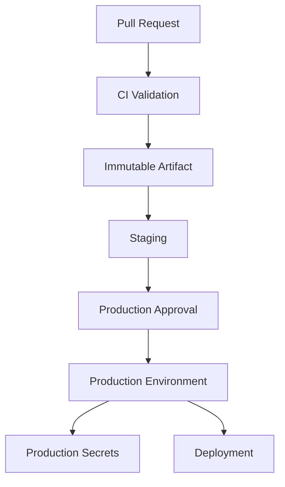
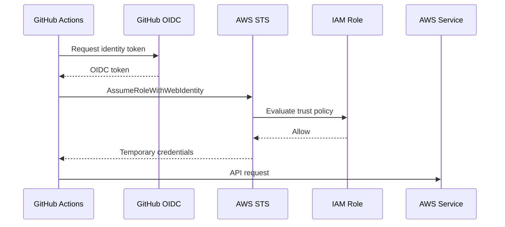
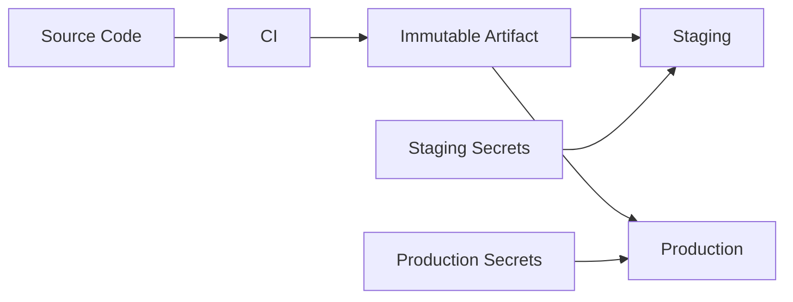
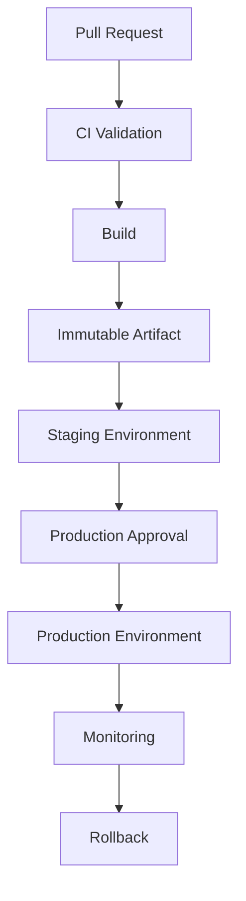
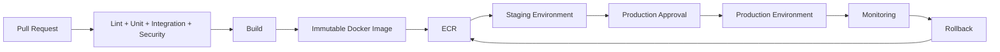

# 07- Secrets and Variables Management

## Overview

GitHub Actions separates configuration into several mechanisms:

- `env` — workflow, job, or step environment variables.
- `vars` — non-sensitive configuration variables.
- `secrets` — sensitive values intended for protected configuration.
- `$GITHUB_ENV` — passes environment variables from one step to later steps in the same job.
- `$GITHUB_OUTPUT` — passes step outputs to later steps and, through job outputs, to downstream jobs.
- GitHub Environments — deployment boundaries such as `staging` and `production` with their own variables, secrets, and protection rules.

The distinction matters because configuration scope, security, availability, and lifecycle are different for each mechanism.

A production CI/CD system should make the flow explicit:

```text
Source Code
    ↓
Workflow Configuration
    ↓
Non-sensitive Variables
    ↓
Secrets
    ↓
Environment Protection
    ↓
Deployment
```

For a backend application such as Django or FastAPI, the pipeline should avoid embedding credentials directly in YAML, source code, Dockerfiles, or shell commands.

A useful production model is:

```text
Code
  │
  ├── Static configuration
  │       └── Workflow / vars
  │
  ├── Sensitive configuration
  │       └── Secrets
  │
  └── Environment-specific configuration
          └── GitHub Environment
                  ├── Variables
                  ├── Secrets
                  └── Protection rules
```

---

## Configuration Mechanisms

| Mechanism | Sensitive | Scope | Typical use |
|---|---:|---|---|
| `env` | Usually no | Workflow/job/step | Runtime environment variables |
| `vars` | No | Repository/org/environment | Non-sensitive configuration |
| `secrets` | Yes | Repository/org/environment | Credentials and tokens |
| `$GITHUB_ENV` | Depends on value | Job | Passing environment values between steps |
| `$GITHUB_OUTPUT` | Depends on value | Step/job | Passing structured results |
| Environment | Depends | Deployment boundary | Staging/production configuration |

Do not choose a mechanism only because it is convenient. Choose it based on:

- Sensitivity.
- Scope.
- Lifecycle.
- Required permissions.
- Deployment environment.
- Whether the value needs to cross jobs.

---

## `env`

`env` defines environment variables for workflow execution.

### Workflow-Level Environment

```yaml
name: CI

on:
  pull_request:

env:
  PYTHONUNBUFFERED: "1"
  APP_NAME: orders-api

jobs:
  test:
    runs-on: ubuntu-latest

    steps:
      - uses: actions/checkout@v4

      - name: Show application name
        run: echo "$APP_NAME"
```

Workflow-level variables are inherited by jobs unless overridden.

### Job-Level Environment

```yaml
jobs:
  test:
    runs-on: ubuntu-latest

    env:
      DJANGO_SETTINGS_MODULE: config.settings.test

    steps:
      - name: Run tests
        run: pytest
```

### Step-Level Environment

```yaml
steps:
  - name: Run migrations
    env:
      DATABASE_URL: ${{ secrets.TEST_DATABASE_URL }}
    run: python manage.py migrate
```

Step-level configuration is useful when a sensitive or specialized value is needed by only one operation.

---

## Environment Variable Precedence

When the same variable is defined at multiple levels, the more specific scope can override the broader scope.

Conceptually:

```text
Workflow env
    ↓
Job env
    ↓
Step env
```

For example:

```yaml
env:
  APP_ENV: default

jobs:
  test:
    env:
      APP_ENV: test

    steps:
      - name: Check environment
        env:
          APP_ENV: integration
        run: echo "$APP_ENV"
```

The step receives:

```text
integration
```

Avoid repeatedly overriding the same variable because it makes configuration difficult to reason about.

---

## `vars`

GitHub Actions variables are intended for non-sensitive configuration.

Example:

```yaml
env:
  API_TIMEOUT: ${{ vars.API_TIMEOUT }}
```

A variable might contain:

```text
API_TIMEOUT=30
```

Suitable examples include:

- Application environment names.
- Non-sensitive feature configuration.
- Region identifiers.
- Timeout values.
- Service names.
- Deployment metadata.

Do not store passwords, tokens, private keys, or credentials in `vars`.

---

## Repository Variables

Repository variables are available to workflows in a repository.

Example:

```yaml
env:
  DEPLOY_REGION: ${{ vars.DEPLOY_REGION }}
```

A repository variable is appropriate when:

```text
orders-api
    ↓
all workflows
    ↓
same non-sensitive configuration
```

It avoids repeating the same value across multiple workflow files.

---

## Organization Variables

Organization variables allow shared non-sensitive configuration.

Conceptually:

```text
Organization
   │
   ├── orders-api
   ├── payments-api
   └── inventory-api
          ↓
     shared variable
```

Examples:

```text
DOCKER_REGISTRY
AWS_REGION
COMPANY_ARTIFACT_DOMAIN
```

Organization variables should still be used deliberately.

A variable that differs between environments should generally be modeled at the environment level rather than hardcoded as an organization-wide value.

---

## Environment Variables

GitHub Environments can contain environment-specific variables.

For example:

```text
staging
 ├── API_URL
 └── AWS_REGION

production
 ├── API_URL
 └── AWS_REGION
```

A workflow can reference:

```yaml
jobs:
  deploy:
    environment: production

    env:
      API_URL: ${{ vars.API_URL }}

    steps:
      - run: echo "Deploying to $API_URL"
```

This keeps deployment configuration associated with the deployment environment.

---

## `vars` vs `env`

These mechanisms solve different problems.

```text
vars
 ↓
GitHub-managed configuration

env
 ↓
Environment variables available to workflow processes
```

For example:

```yaml
env:
  API_TIMEOUT: ${{ vars.API_TIMEOUT }}
```

Here:

- `vars.API_TIMEOUT` is the GitHub configuration source.
- `API_TIMEOUT` is the environment variable exposed to the process.

---

## Secrets

Secrets are intended for sensitive configuration.

Examples:

- Database passwords.
- API credentials.
- Private tokens.
- Signing keys.
- External service credentials.

Example:

```yaml
steps:
  - name: Run integration tests
    env:
      DATABASE_PASSWORD: ${{ secrets.DATABASE_PASSWORD }}
    run: pytest tests/integration
```

The secret should not be written directly into the workflow file.

---

## Repository Secrets

Repository secrets are scoped to a repository.

Example:

```yaml
env:
  SENTRY_AUTH_TOKEN: ${{ secrets.SENTRY_AUTH_TOKEN }}
```

Use repository secrets when the credential is required by workflows within that repository and does not need broader organizational scope.

---

## Organization Secrets

Organization secrets can be shared with selected repositories.

Conceptually:

```text
Organization Secret
        ↓
Allowed repositories
        ↓
Workflows
```

This can reduce duplication but increases the potential blast radius.

A shared credential should not automatically become an organization secret.

Use the smallest practical scope.

---

## Environment Secrets

Environment secrets are associated with a GitHub Environment.

Example:

```yaml
jobs:
  deploy:
    environment: production

    steps:
      - name: Deploy
        env:
          DEPLOY_TOKEN: ${{ secrets.DEPLOY_TOKEN }}
        run: ./scripts/deploy.sh
```

This is especially useful when:

```text
staging
    ↓
staging credentials

production
    ↓
production credentials
```

must remain separate.

---

## Environment Protection

An environment can provide additional deployment controls.

A production deployment can require:

- Required reviewers.
- Branch restrictions.
- Deployment protection.
- Environment-specific secrets.
- Environment-specific variables.
- Deployment history.

The security model becomes:



The environment is therefore more than a configuration container. It can be a deployment security boundary.

---

## Secret Masking

GitHub Actions attempts to mask registered secret values in logs.

However, masking is not a substitute for secure handling.

Do not assume:

```text
Secret
 ↓
echo secret
 ↓
always safely hidden
```

A secret can still be exposed through:

- Command arguments.
- Generated files.
- Artifacts.
- Docker layers.
- Encoded or transformed output.
- External services.
- Debug output.
- Application logs.

The safest approach is not to print the secret at all.

---

## Avoid Printing Secrets

Avoid:

```yaml
- run: echo "${{ secrets.API_TOKEN }}"
```

Even when masking is expected, deliberately printing secrets creates unnecessary exposure.

Instead, validate presence without revealing the value:

```yaml
- name: Validate token exists
  env:
    API_TOKEN: ${{ secrets.API_TOKEN }}
  run: |
    if [ -z "$API_TOKEN" ]; then
      echo "API_TOKEN is not configured"
      exit 1
    fi
```

---

## Avoid Secrets in Command Arguments

Avoid patterns such as:

```yaml
run: curl -H "Authorization: Bearer ${{ secrets.API_TOKEN }}" https://api.example.com
```

Prefer passing the value through the environment:

```yaml
env:
  API_TOKEN: ${{ secrets.API_TOKEN }}
run: |
  curl \
    -H "Authorization: Bearer ${API_TOKEN}" \
    https://api.example.com
```

Even then, ensure the invoked tool does not echo or persist the credential.

---

## Secrets in Python

For a Django or FastAPI application, inject secrets through the environment.

```yaml
- name: Run application tests
  env:
    DATABASE_URL: ${{ secrets.TEST_DATABASE_URL }}
    REDIS_URL: ${{ secrets.TEST_REDIS_URL }}
  run: pytest
```

Python can consume them:

```python
import os

database_url = os.environ["DATABASE_URL"]
redis_url = os.environ["REDIS_URL"]
```

The workflow should not modify source code to inject credentials.

---

## Django Example

A Django application can read deployment configuration from environment variables:

```python
import os

DATABASE_URL = os.environ["DATABASE_URL"]
SECRET_KEY = os.environ["DJANGO_SECRET_KEY"]
```

The CI workflow supplies the values:

```yaml
env:
  DATABASE_URL: ${{ secrets.TEST_DATABASE_URL }}
  DJANGO_SECRET_KEY: ${{ secrets.TEST_DJANGO_SECRET_KEY }}
```

This keeps application code independent from GitHub Actions.

---

## FastAPI Example

A FastAPI service can use environment-based configuration:

```python
from pydantic_settings import BaseSettings


class Settings(BaseSettings):
    database_url: str
    redis_url: str


settings = Settings()
```

Workflow configuration:

```yaml
env:
  DATABASE_URL: ${{ secrets.TEST_DATABASE_URL }}
  REDIS_URL: ${{ secrets.TEST_REDIS_URL }}

steps:
  - name: Run integration tests
    run: pytest tests/integration
```

The application remains portable across local development, CI, containers, and production.

---

## `$GITHUB_ENV`

`$GITHUB_ENV` allows a step to create or modify environment variables for subsequent steps in the same job.

Example:

```yaml
steps:
  - name: Determine version
    run: echo "APP_VERSION=$(git rev-parse --short HEAD)" >> "$GITHUB_ENV"

  - name: Use version
    run: echo "Version: $APP_VERSION"
```

The important scope is:

```text
Step A
   ↓
$GITHUB_ENV
   ↓
Step B
   ↓
Step C
```

It does not automatically create a variable for another job.

---

## `$GITHUB_ENV` Limitations

Do not use `$GITHUB_ENV` as a general cross-job data transport.

For cross-job data use:

```text
Step output
   ↓
Job output
   ↓
needs.<job>.outputs
```

For files or large data:

```text
Artifact
```

may be more appropriate.

---

## `$GITHUB_OUTPUT`

Use `$GITHUB_OUTPUT` for step outputs.

```yaml
- name: Generate image tag
  id: metadata
  run: |
    echo "tag=${GITHUB_SHA}" >> "$GITHUB_OUTPUT"

- name: Use tag
  run: echo "${{ steps.metadata.outputs.tag }}"
```

This is preferable to using `$GITHUB_ENV` when the value represents the result of a step.

---

## Passing Outputs Between Jobs

A job can expose a step output:

```yaml
jobs:
  build:
    runs-on: ubuntu-latest

    outputs:
      image_tag: ${{ steps.metadata.outputs.tag }}

    steps:
      - id: metadata
        run: echo "tag=${GITHUB_SHA}" >> "$GITHUB_OUTPUT"

  deploy:
    needs: build
    runs-on: ubuntu-latest

    steps:
      - run: echo "Deploying ${{ needs.build.outputs.image_tag }}"
```

The data flow is:

```text
Step
 ↓
GITHUB_OUTPUT
 ↓
Step Output
 ↓
Job Output
 ↓
needs.<job>.outputs
 ↓
Downstream Job
```

---

## Structured Data

Outputs can transport structured JSON.

Example:

```yaml
- name: Generate deployment metadata
  id: metadata
  run: |
    echo 'config={"environment":"staging","region":"eu-west-1"}' >> "$GITHUB_OUTPUT"
```

A downstream job can consume it using `fromJSON()` when appropriate.

This is useful for dynamic matrices and deployment planning.

---

## Secrets Are Not Outputs

Do not use outputs as a mechanism for transporting secrets.

Avoid:

```yaml
echo "token=${{ secrets.API_TOKEN }}" >> "$GITHUB_OUTPUT"
```

Outputs can appear in workflow metadata and downstream processing.

Secrets should remain scoped to the job or step that needs them.

---

## Secret Inheritance

Reusable workflows can receive secrets explicitly or through:

```yaml
secrets: inherit
```

Example:

```yaml
jobs:
  deploy:
    uses: acme/platform/.github/workflows/deploy.yml@v1
    secrets: inherit
```

`secrets: inherit` is convenient but should not be treated as the default for every reusable workflow.

Prefer explicit secret interfaces when practical.

```text
Caller
 ↓
Explicit secret contract
 ↓
Reusable workflow
```

This makes dependencies visible and reduces accidental secret exposure.

---

## Reusable Workflow Secret Design

A reusable workflow can declare expected secrets:

```yaml
on:
  workflow_call:
    secrets:
      deploy_token:
        required: true
```

The caller then provides the secret:

```yaml
jobs:
  deploy:
    uses: acme/platform/.github/workflows/deploy.yml@v1
    secrets:
      deploy_token: ${{ secrets.DEPLOY_TOKEN }}
```

This creates a clearer API contract.

---

## Secret Scope Strategy

A practical hierarchy is:

```text
Repository secret
    ↓
Use when one repository owns the credential

Organization secret
    ↓
Use when multiple approved repositories need the same credential

Environment secret
    ↓
Use when the credential belongs to a deployment environment
```

Do not use organization-wide secrets merely to avoid configuring repository-specific secrets.

---

## Development, Staging, and Production

A mature deployment model separates environments:

```text
development
    ↓
staging
    ↓
production
```

Example:

```yaml
jobs:
  deploy-staging:
    environment: staging
    steps:
      - run: ./deploy.sh

  deploy-production:
    environment: production
    steps:
      - run: ./deploy.sh
```

Each environment can expose different:

- Variables.
- Secrets.
- Deployment protection.
- Branch restrictions.

---

## Environment Configuration Model

For a Python backend:

```text
Application
    │
    ├── DATABASE_URL
    ├── REDIS_URL
    ├── API_URL
    └── LOG_LEVEL
```

These values can vary by environment:

```text
Staging
 ├── DATABASE_URL → staging DB
 ├── REDIS_URL → staging Redis
 └── API_URL → staging API

Production
 ├── DATABASE_URL → production DB
 ├── REDIS_URL → production Redis
 └── API_URL → production API
```

The application should not need different source code for each environment.

---

## AWS OIDC and Secret Reduction

For AWS deployments, avoid storing long-lived AWS access keys as GitHub secrets when OIDC is appropriate.

Instead:



The resulting model is:

```text
GitHub identity
 ↓
OIDC
 ↓
STS
 ↓
Temporary AWS credentials
 ↓
ECR / ECS / S3 / EC2 / Lambda
```

This reduces the need for long-lived cloud credentials in GitHub secrets.

---

## OIDC Permissions

A workflow using GitHub OIDC generally requires:

```yaml
permissions:
  contents: read
  id-token: write
```

Keep the permission scope as narrow as possible.

The AWS IAM trust policy should additionally constrain the GitHub identity.

For example:

```text
Repository
 +
Branch / Environment
 +
OIDC audience
```

should be part of the trust design.

---

## Secret Rotation

Secrets are operational dependencies and should have a lifecycle.

```text
Create
 ↓
Distribute
 ↓
Use
 ↓
Monitor
 ↓
Rotate
 ↓
Revoke
```

Rotation should be planned rather than performed only after an incident.

For example:

```text
Old database password
       ↓
Create new credential
       ↓
Validate new credential
       ↓
Update GitHub secret
       ↓
Deploy
       ↓
Revoke old credential
```

Applications should tolerate controlled credential rotation where possible.

---

## Secret Rotation Without Downtime

For credentials used by production applications, a safer model is often:

```text
Credential A active
Credential B created
       ↓
Application supports A + B
       ↓
Deploy B configuration
       ↓
Verify
       ↓
Revoke A
```

This is particularly relevant to:

- Database credentials.
- API credentials.
- Signing credentials.
- External service authentication.

The exact strategy depends on the external system.

---

## Secret Exposure Through Logs

A common failure pattern is:

```yaml
- run: |
    echo "Deploying with token $TOKEN"
```

Even if GitHub masks a recognized value, logging sensitive information is unnecessary.

Prefer:

```yaml
- run: |
    echo "Deploying application"
```

If diagnostic output is required, log:

```text
credential configured: yes
```

rather than the credential itself.

---

## Secret Exposure Through Artifacts

Never package secret-bearing files into artifacts unintentionally.

Dangerous example:

```text
.env
credentials.json
private-key.pem
debug-output.txt
```

then:

```yaml
- uses: actions/upload-artifact@v4
  with:
    path: .
```

A broad artifact path can capture files that were never intended to leave the runner.

Prefer explicit paths:

```yaml
- uses: actions/upload-artifact@v4
  with:
    name: test-report
    path: |
      reports/junit.xml
      reports/coverage.xml
```

---

## Secrets and Docker Builds

Do not embed secrets into Docker image layers.

Avoid:

```dockerfile
ARG API_TOKEN
RUN curl -H "Authorization: Bearer ${API_TOKEN}" ...
```

Build arguments can become part of build metadata or layers depending on how they are used.

Use BuildKit secret mechanisms when a build genuinely needs a secret, and prefer architectures where production secrets are supplied at runtime rather than during image creation.

---

## Build Once, Deploy Many

Production pipelines should separate:

```text
Build configuration
```

from:

```text
Runtime environment configuration
```

For example:

```text
Source
 ↓
Build image
 ↓
Immutable image
 ↓
Staging
 ↓
Production
```

The same image should be promoted rather than rebuilt with different secrets.

Environment-specific values should be injected during deployment/runtime.

---

## Secret Handling Across the Pipeline

A strong architecture looks like:



Secrets do not become part of the artifact.

---

## Python Dependency Configuration

Python applications commonly need configuration for:

```text
PostgreSQL
Redis
Celery
External APIs
Kafka
Django
FastAPI
```

Example:

```yaml
env:
  PYTHONUNBUFFERED: "1"

jobs:
  integration:
    runs-on: ubuntu-latest
    env:
      DATABASE_URL: ${{ secrets.TEST_DATABASE_URL }}
      REDIS_URL: ${{ secrets.TEST_REDIS_URL }}

    steps:
      - uses: actions/checkout@v4

      - name: Run integration tests
        run: pytest tests/integration
```

The same application configuration model can be reused across local development, CI, containers, and production.

---

## PostgreSQL and Redis

A realistic integration test environment might contain:

```text
Python Application
       │
       ├── PostgreSQL
       │
       └── Redis
```

Workflow configuration:

```yaml
services:
  postgres:
    image: postgres:16
    env:
      POSTGRES_USER: app
      POSTGRES_PASSWORD: test-password
      POSTGRES_DB: app_test

  redis:
    image: redis:7
```

For production-like workflows, credentials should be handled separately from service configuration.

For disposable CI service containers, test credentials can be non-sensitive values when the services are isolated and ephemeral.

---

## Secret Scope and Job Isolation

Avoid exposing production secrets to jobs that do not require them.

Poor architecture:

```text
Lint Job
 ├── production secrets
 ├── AWS credentials
 └── source analysis
```

Better:

```text
Lint Job
 └── no secrets

Test Job
 └── test credentials

Deploy Job
 └── production environment
        ├── production secrets
        └── OIDC
```

This reduces blast radius.

---

## Job-Level Permissions and Secrets

Secrets and permissions should align with the job's responsibility.

```yaml
jobs:
  test:
    permissions:
      contents: read

  deploy:
    permissions:
      contents: read
      id-token: write
    environment: production
```

The test job does not need deployment permissions merely because the workflow contains a deployment job.

---

## Fork Pull Requests

Forked pull requests are an important security boundary.

A workflow processing untrusted code should not automatically expose privileged secrets.

Conceptually:

```text
Fork PR
 ↓
Untrusted source
 ↓
CI
 ↓
No production credentials
```

Production credentials should be available only after the workflow crosses an explicitly trusted boundary.

---

## `pull_request` vs `pull_request_target`

`pull_request` is generally used when testing pull request code in the context of the pull request.

`pull_request_target` runs with the base repository context and therefore requires particular caution.

A dangerous pattern is combining:

```text
pull_request_target
+
checkout attacker-controlled code
+
execute scripts
+
privileged secrets
```

This can create a path from untrusted source code to trusted credentials.

---

## Untrusted Input

GitHub-provided values can be attacker-controlled.

Examples include:

- Pull request titles.
- Branch names.
- Commit messages.
- Issue content.
- Workflow inputs.
- Repository dispatch payloads.

Avoid directly embedding such values into shell code.

Dangerous:

```yaml
- run: echo "PR: ${{ github.event.pull_request.title }}"
```

A safer pattern is to pass the value through an environment variable:

```yaml
- name: Process title
  env:
    PR_TITLE: ${{ github.event.pull_request.title }}
  run: |
    printf '%s\n' "$PR_TITLE"
```

The distinction is important because GitHub expression interpolation occurs before the shell receives the command.

---

## Shell Injection Model

The dangerous flow is:

```text
Untrusted GitHub Data
       ↓
Expression Interpolation
       ↓
Generated Shell Script
       ↓
Shell Interpretation
       ↓
Command Execution
```

The safer flow is:

```text
Untrusted GitHub Data
       ↓
Environment Variable
       ↓
Process Argument / Variable
       ↓
Application Handles Data
```

Never assume GitHub metadata is trusted merely because GitHub generated it.

---

## Command-Line Arguments

Passing a secret or untrusted value through command arguments requires care.

For example:

```bash
python deploy.py "$DEPLOY_ENV"
```

is generally preferable to constructing a shell command from untrusted text.

For Python subprocess execution, avoid:

```python
subprocess.run(command, shell=True)
```

when the command contains untrusted input.

Prefer argument arrays:

```python
subprocess.run(
    ["python", "deploy.py", deploy_env],
    check=True,
)
```

---

## Secret Handling With External Secret Managers

For larger production systems, GitHub secrets may not be the final secret-management layer.

Common architectures include:

```text
GitHub Actions
      ↓
OIDC
      ↓
AWS IAM
      ↓
AWS Secrets Manager
```

or:

```text
GitHub Actions
      ↓
Workload Identity
      ↓
External Secret Manager
```

This can provide centralized:

- Rotation.
- Auditing.
- Access control.
- Secret lifecycle management.

GitHub Actions should not become a permanent secret database when a dedicated runtime secret manager is more appropriate.

---

## Secrets and Kubernetes

For Kubernetes deployments, avoid baking production credentials into container images.

A deployment can reference runtime secret infrastructure:

```text
GitHub Actions
     ↓
Immutable Image
     ↓
Kubernetes Deployment
     ↓
Kubernetes Secret / External Secret
     ↓
Pod
```

The CI pipeline should normally deploy the image and configuration reference rather than embed application credentials into the image.

---

## Secrets and AWS ECS

For ECS:

```text
GitHub Actions
      ↓
ECR image
      ↓
ECS task definition
      ↓
Runtime secret reference
      ↓
Container
```

Secrets can be supplied through AWS-managed secret mechanisms rather than being stored directly inside the container image.

This supports build-once/deploy-many.

---

## Monitoring and Auditing

Secret management should be observable without exposing secret values.

Monitor:

- Secret rotation events.
- Failed deployments caused by missing configuration.
- Authentication failures.
- AWS STS failures.
- Environment approval failures.
- Unexpected permission changes.
- Repository configuration changes.

Do not log secret values as part of the monitoring process.

---

## Failure Domains

Secrets and variables failures should be isolated by domain.

| Failure domain | Example |
|---|---|
| Scope | Secret exists but is not available to the job |
| Naming | Workflow references incorrect secret name |
| Environment | Production secret unavailable because environment is wrong |
| Permission | Workflow cannot access required resource |
| Authentication | Credential rejected |
| Rotation | Old credential revoked before application update |
| Logging | Secret accidentally exposed |
| Artifact | Secret included in artifact |
| Docker | Secret embedded in image layer |
| Fork security | Privileged secret exposed to untrusted execution |

This makes troubleshooting more systematic.

---

## Troubleshooting Secret and Variable Issues

### Secret Is Empty

**Symptom**

```text
Application reports missing credential.
```

**Possible causes**

- Secret does not exist.
- Wrong secret name.
- Environment mismatch.
- Workflow does not target the expected environment.
- Secret unavailable to the event context.
- Reusable workflow did not receive the secret.

**Isolation**

Check secret metadata:

```bash
gh secret list --repo acme/orders-api
```

Then verify:

```yaml
environment: production
```

and:

```yaml
${{ secrets.DEPLOY_TOKEN }}
```

**Corrective action**

Fix the scope or secret interface.

**Prevention**

Use explicit environment and reusable-workflow contracts.

---

## Variable Has the Wrong Value

**Possible causes**

- Workflow-level `env`.
- Job-level `env`.
- Step-level `env`.
- Repository variable.
- Organization variable.
- Environment variable.

**Isolation strategy**

Trace the configuration:

```text
vars
 ↓
env
 ↓
job
 ↓
step
 ↓
process
```

Avoid defining the same name at multiple levels unless overriding is intentional.

---

## Secret Works in One Environment but Not Another

Check:

```text
Job environment
Environment secret
Environment variable
Branch restriction
Deployment protection
Secret name
```

For example:

```yaml
jobs:
  deploy:
    environment: production
```

must actually reference the environment containing the expected secret.

---

## Reusable Workflow Does Not Receive a Secret

Check whether the caller uses:

```yaml
secrets:
  deploy_token: ${{ secrets.DEPLOY_TOKEN }}
```

or:

```yaml
secrets: inherit
```

Then verify that the reusable workflow declares the expected secret under `workflow_call`.

---

## Secret Appears in Logs

Immediately determine:

```text
Where was it printed?
 ↓
Which step produced the output?
 ↓
Was it transformed or encoded?
 ↓
Was it included in an artifact?
 ↓
Was it passed to an external command?
```

Corrective actions may include:

- Remove the logging.
- Rotate the credential.
- Remove compromised artifacts where possible.
- Review workflow history.
- Audit downstream systems.
- Replace the credential.

If a production credential may have been exposed, treat it as potentially compromised rather than relying only on masking.

---

## Secret Appears in Docker Image

If a secret was included during an image build:

```text
Stop promotion
 ↓
Identify image/tag/digest
 ↓
Determine whether secret entered a layer
 ↓
Rotate credential
 ↓
Build clean image
 ↓
Scan/verify
 ↓
Promote clean artifact
```

Do not assume deleting the Dockerfile reference removes the credential from previously built images.

---

## GitHub CLI Management

Repository secrets:

```bash
gh secret list --repo acme/orders-api
```

Set:

```bash
printf '%s' "$VALUE" |
  gh secret set API_TOKEN \
  --repo acme/orders-api
```

Delete:

```bash
gh secret delete API_TOKEN \
  --repo acme/orders-api
```

Repository variables:

```bash
gh variable list --repo acme/orders-api
```

Set:

```bash
gh variable set API_TIMEOUT \
  --body "30" \
  --repo acme/orders-api
```

Delete:

```bash
gh variable delete API_TIMEOUT \
  --repo acme/orders-api
```

Use CLI operations as controlled administrative operations rather than embedding them into arbitrary application scripts.

---

## Operational Secret Rotation

A rotation script might conceptually perform:

```text
1. Create replacement credential
2. Validate replacement
3. Update GitHub secret
4. Trigger deployment
5. Verify health
6. Revoke previous credential
7. Record rotation event
```

The deployment should use the same immutable application artifact before and after rotation whenever possible.

Credential rotation should not require rebuilding the application image.

---

## Configuration and Artifact Boundaries

A strong CI/CD architecture separates:

```text
Artifact
 ├── Application code
 ├── Dependencies
 └── Build metadata

Environment
 ├── URLs
 ├── Runtime configuration
 └── Secrets
```

This enables:

```text
Build once
   ↓
Staging
   ↓
Production
```

without creating environment-specific application binaries or container images.

---

## Production Pipeline Example

```yaml
name: Deploy

on:
  workflow_dispatch:

permissions:
  contents: read
  id-token: write

jobs:
  deploy:
    runs-on: ubuntu-latest
    environment: production

    env:
      AWS_REGION: ${{ vars.AWS_REGION }}
      SERVICE_NAME: ${{ vars.SERVICE_NAME }}

    steps:
      - uses: actions/checkout@v4

      - name: Configure AWS credentials
        uses: aws-actions/configure-aws-credentials@v5
        with:
          role-to-assume: ${{ secrets.AWS_DEPLOY_ROLE_ARN }}
          aws-region: ${{ env.AWS_REGION }}

      - name: Deploy
        env:
          DEPLOY_TOKEN: ${{ secrets.DEPLOY_TOKEN }}
        run: ./scripts/deploy.sh
```

The workflow demonstrates:

- Repository configuration.
- Environment configuration.
- Non-sensitive variables.
- Environment secrets.
- OIDC-compatible AWS authentication.
- Job-level permissions.
- Runtime secret injection.

---

## Recommended Production Configuration Model

For a Python backend:

```text
                 GitHub Actions
                       │
        ┌──────────────┼──────────────┐
        │              │              │
     Source          vars           secrets
        │              │              │
        │              │              │
        └──────────────┼──────────────┘
                       ↓
                 CI / Build
                       │
                Immutable Image
                       │
            ┌──────────┴──────────┐
            ↓                     ↓
         Staging              Production
            │                     │
       staging vars          prod vars
       staging secrets       prod secrets
            │                     │
            ↓                     ↓
        Runtime                Runtime
```

The application artifact remains identical across environments.

---

## Security Best Practices

### Minimize Secret Scope

Only expose a secret to the job that needs it.

### Prefer Environment Secrets for Deployments

Production credentials should generally be associated with the production deployment boundary.

### Prefer OIDC for AWS

Use short-lived credentials rather than long-lived AWS access keys where OIDC is appropriate.

### Never Commit Secrets

Do not place secrets in:

- Source code.
- Workflow YAML.
- Dockerfiles.
- `.env` files committed to Git.
- Test fixtures.
- Documentation.
- Artifacts.

### Do Not Depend on Masking

Masking reduces accidental log exposure but does not make unsafe secret handling safe.

### Protect Fork Workflows

Never assume pull request code from a fork is trusted.

### Avoid `pull_request_target` Misuse

Do not execute untrusted code with privileged repository secrets.

### Keep Production Secrets Out of CI Tests

A test job should not receive production credentials simply because the workflow also contains a production deployment.

---

## Scalability Considerations

As the number of repositories grows, configuration management becomes an architectural concern.

A mature organization can standardize:

```text
Organization
 ├── Shared variables
 ├── Shared secrets
 ├── Reusable workflows
 ├── Environment standards
 └── Security policies
```

Repositories then consume controlled interfaces.

However, centralization should not become unrestricted secret sharing.

The goal is:

```text
Central standards
+
Minimal repository access
+
Explicit environment boundaries
```

---

## Reliability Considerations

Configuration failures can cause otherwise healthy applications to fail deployment.

Improve reliability through:

- Configuration validation.
- Explicit secret contracts.
- Environment-specific smoke tests.
- Pre-deployment checks.
- Secret rotation procedures.
- OIDC instead of static cloud credentials.
- Immutable application artifacts.
- Deployment health checks.

A deployment should fail early when required configuration is missing.

---

## Cost Considerations

Poor configuration design can increase CI/CD cost.

Examples:

```text
Incorrect configuration
 ↓
Failed deployment
 ↓
Repeated reruns
 ↓
Additional runner usage
```

Another example:

```text
Environment-specific rebuild
 ↓
Repeated Docker builds
 ↓
Additional compute
```

Build-once/deploy-many reduces unnecessary rebuilds and improves artifact consistency.

---

## High Availability

Configuration should not create a single point of operational failure.

For production systems:

- Maintain documented secret rotation procedures.
- Keep deployment configuration reproducible.
- Avoid manually configured runner state.
- Separate production credentials from development credentials.
- Use multiple deployment mechanisms where required by the application's availability model.
- Keep rollback artifacts available for the required retention period.

---

## Disaster Recovery

Recovery requires both:

```text
Application artifact
+
Configuration
```

A recovery plan should identify:

- Last known-good image.
- Required environment variables.
- Required secrets.
- AWS IAM role.
- Database configuration.
- Redis configuration.
- External service credentials.
- Deployment environment.
- Rollback procedure.

An artifact without its required runtime configuration is not sufficient for recovery.

---

## Common Mistakes

### Treating `env`, `vars`, and `secrets` as Equivalent

They have different scopes and security properties.

### Putting Secrets in Variables

Non-sensitive variables are not a replacement for secrets.

### Using Repository Secrets for Everything

Environment-specific credentials should not necessarily be repository-wide.

### Exposing Secrets to Every Job

This increases blast radius.

### Printing Secrets for Debugging

Use presence checks and controlled diagnostics instead.

### Passing Secrets Through Outputs

Outputs are not intended to be secret transport channels.

### Rebuilding Images Per Environment

This breaks build-once/deploy-many and can produce configuration drift.

### Embedding Secrets in Docker Images

Runtime secrets should normally be injected at runtime.

### Using Long-Lived AWS Keys

Prefer OIDC and short-lived AWS credentials when appropriate.

### Using `secrets: inherit` Without Reviewing Scope

Secret inheritance can hide the dependency contract of a reusable workflow.

### Trusting Forked Pull Request Code

Untrusted code should not receive privileged credentials.

---

## Interview Scenarios

### How Would You Separate Staging and Production Secrets?

Use GitHub Environments:

```text
staging
 └── staging secrets

production
 └── production secrets
```

Then bind deployment jobs explicitly:

```yaml
environment: production
```

This also allows production-specific protection rules.

### Why Use `vars` Instead of `env`?

`vars` provides GitHub-managed non-sensitive configuration.

`env` exposes values to workflow processes.

A common pattern is:

```yaml
env:
  AWS_REGION: ${{ vars.AWS_REGION }}
```

### Why Should Secrets Not Be Passed Through Outputs?

Outputs are workflow data transport mechanisms rather than secret stores. Passing credentials through them can broaden exposure and makes secret lifecycle and auditing harder.

### How Would You Handle AWS Credentials?

Prefer:

```text
GitHub Actions
 ↓
OIDC
 ↓
STS
 ↓
IAM Role
 ↓
AWS
```

instead of long-lived access keys stored in GitHub secrets.

### How Would You Prevent Production Credentials From Reaching Unit Tests?

Separate jobs and scopes:

```text
Unit Tests
 └── contents: read

Integration Tests
 └── test credentials

Production Deployment
 └── production environment
       ├── production secrets
       └── id-token: write
```

### What Happens If a Production Secret Is Rotated While an Old Deployment Is Running?

The deployment and runtime behavior depend on how the credential is consumed. A safe rotation strategy should support overlap where necessary:

```text
New credential
 ↓
Deploy/update consumers
 ↓
Validate
 ↓
Revoke old credential
```

### Why Is `pull_request_target` Dangerous?

It executes in the context of the base repository and can have access to privileged resources. Combining it with execution of attacker-controlled pull request code can create a path to repository secrets or elevated permissions.

### How Would You Design Secret Management for Hundreds of Repositories?

Use:

```text
Organization standards
        ↓
Reusable workflows
        ↓
Environment-specific secrets
        ↓
OIDC / external secret managers
```

while keeping access narrowly scoped and auditable.

---

## Production Checklist

### Configuration

- [ ] `env`, `vars`, and `secrets` are used for their intended purposes.
- [ ] Variable scope is explicit.
- [ ] Environment-specific configuration is modeled through GitHub Environments where appropriate.
- [ ] Duplicate variable definitions are minimized.

### Secrets

- [ ] No secrets are committed to source control.
- [ ] Secrets are not printed.
- [ ] Secrets are not stored in variables.
- [ ] Secrets are not passed through outputs unnecessarily.
- [ ] Secrets are not embedded into Docker images.
- [ ] Secret scope is minimized.
- [ ] Rotation procedures are documented.

### Security

- [ ] Fork workflows cannot access privileged credentials unnecessarily.
- [ ] `pull_request_target` is used only with a clear trust model.
- [ ] Job permissions follow least privilege.
- [ ] AWS deployments use OIDC where appropriate.
- [ ] Production credentials are isolated from CI tests.

### Deployment

- [ ] Staging and production use separate configuration.
- [ ] Production uses environment protection.
- [ ] Immutable artifacts are promoted across environments.
- [ ] Runtime secrets are injected separately from application artifacts.
- [ ] Rollback configuration is documented.

### Operations

- [ ] Secret and variable inventory is available.
- [ ] CLI-based management is controlled.
- [ ] Configuration failures are observable.
- [ ] Rotation is tested.
- [ ] Recovery procedures identify both artifacts and required configuration.

## Key Takeaways

- **Use `env`, `vars`, and `secrets` according to their different scope, lifecycle, and security responsibilities rather than treating them as interchangeable configuration mechanisms.**
- **Keep secrets narrowly scoped, avoid exposing them through logs, outputs, artifacts, Docker images, or unnecessary jobs, and use GitHub Environments for production-specific protection and credentials.**
- **Prefer build-once/deploy-many: immutable application artifacts should move between environments while runtime configuration and secrets are injected separately.**
- **For AWS deployments, OIDC with STS and IAM provides a short-lived authentication model that avoids unnecessary long-lived cloud credentials in GitHub secrets.**
- **Treat secret management as an operational lifecycle—creation, controlled distribution, monitoring, rotation, revocation, and recovery—not merely as storing values in GitHub.**
You said:
Pasted text(20260930-175824).txt
Document
ChatGPT said:
Code
# 08- Environment Management

## Overview

GitHub Actions Environments provide a deployment boundary for environment-specific configuration and protection controls.

A typical production pipeline separates:

```text
Pull Request
    ↓
CI Validation
    ↓
Build
    ↓
Immutable Artifact
    ↓
Staging Environment
    ↓
Production Approval
    ↓
Production Environment
```

An environment can provide:

- Environment-specific variables.
- Environment-specific secrets.
- Required reviewers.
- Deployment protection.
- Branch or tag restrictions.
- Deployment history.

For backend systems, this separation is important because the application artifact should normally remain the same while runtime configuration changes between environments.

A useful production model is:

```text
                 GitHub Actions
                       │
                Immutable Artifact
                       │
             ┌─────────┴─────────┐
             ↓                   ↓
         Staging             Production
             │                   │
       Staging Config       Production Config
       Staging Secrets      Production Secrets
             │                   │
             ↓                   ↓
        AWS / Runtime        AWS / Runtime
```

The goal is not simply to create `dev`, `staging`, and `production` labels. The goal is to establish explicit security, configuration, promotion, and operational boundaries.

---

## What Is a GitHub Environment?

A GitHub Environment represents a named deployment target.

Typical environments include:

```text
development
staging
production
```

A job references an environment with:

```yaml
jobs:
  deploy:
    environment: production
```

Once a job targets an environment, that environment's configuration and protection rules become relevant to the deployment.

For example:

```yaml
jobs:
  deploy-staging:
    environment: staging
    runs-on: ubuntu-latest

    steps:
      - run: ./deploy.sh

  deploy-production:
    environment: production
    runs-on: ubuntu-latest

    steps:
      - run: ./deploy.sh
```

The deployment code can remain identical while the environment determines the target configuration.

---

## Why Environments Exist

Without explicit environments, deployment configuration can become scattered across workflow files.

For example:

```text
deploy.yml
 ├── production URL
 ├── staging URL
 ├── production credentials
 ├── staging credentials
 └── branch-specific conditions
```

This becomes difficult to audit and maintain.

With environments:

```text
staging
 ├── variables
 ├── secrets
 └── protection

production
 ├── variables
 ├── secrets
 └── protection
```

The deployment boundary becomes explicit.

---

## Environment Architecture



The important architectural property is that the artifact is produced before environment promotion.

---

## Environment Configuration

An environment can contain non-sensitive variables.

For example:

```text
staging
 ├── AWS_REGION
 ├── ECS_CLUSTER
 ├── ECS_SERVICE
 └── API_BASE_URL

production
 ├── AWS_REGION
 ├── ECS_CLUSTER
 ├── ECS_SERVICE
 └── API_BASE_URL
```

Workflow:

```yaml
jobs:
  deploy:
    environment: production

    env:
      AWS_REGION: ${{ vars.AWS_REGION }}
      ECS_CLUSTER: ${{ vars.ECS_CLUSTER }}
      ECS_SERVICE: ${{ vars.ECS_SERVICE }}

    steps:
      - name: Deploy
        run: ./scripts/deploy.sh
```

The application source code does not need to contain environment-specific infrastructure details.

---

## Environment Secrets

Sensitive configuration should be stored as environment secrets when it belongs specifically to that deployment environment.

Example:

```yaml
jobs:
  deploy:
    environment: production

    steps:
      - name: Deploy
        env:
          DEPLOY_TOKEN: ${{ secrets.DEPLOY_TOKEN }}
        run: ./scripts/deploy.sh
```

A useful separation is:

```text
staging
 └── staging credentials

production
 └── production credentials
```

This prevents a staging deployment from unnecessarily receiving production credentials.

---

## Environment Variables vs Secrets

| Configuration | Mechanism |
|---|---|
| AWS region | Environment variable |
| ECS cluster name | Environment variable |
| Service name | Environment variable |
| API URL | Environment variable |
| Database password | Secret |
| External API token | Secret |
| Signing key | Secret |
| Deployment credential | Secret |

The deciding factor is sensitivity.

Do not store secrets as ordinary environment variables managed through non-secret configuration.

---

## Environment Protection

Production environments can enforce deployment controls.

A typical production workflow is:

```text
Build
 ↓
Staging
 ↓
Validation
 ↓
Required Reviewer
 ↓
Production
```

The protection boundary prevents a successful CI run from automatically becoming an unrestricted production deployment.

This is especially useful for:

- Production infrastructure.
- Database migrations.
- Customer-facing releases.
- High-risk configuration changes.
- Compliance-sensitive deployments.

---

## Required Reviewers

A production environment can require approval before a deployment proceeds.

Conceptually:

```text
GitHub Actions
      ↓
production environment
      ↓
approval required
      ↓
authorized reviewer
      ↓
deployment
```

The approval should be treated as a deployment control rather than as a substitute for automated validation.

A strong pipeline still performs:

```text
Lint
 ↓
Unit Tests
 ↓
Integration Tests
 ↓
Security Scan
 ↓
Build
 ↓
Staging
 ↓
Approval
 ↓
Production
```

---

## Branch Restrictions

Production deployments should generally be constrained to trusted branches or release mechanisms.

For example:

```text
main
 ↓
production deployment
```

or:

```text
release/*
 ↓
production deployment
```

The exact branch strategy depends on the repository's release model.

Branch restrictions should complement:

- Branch protection.
- Required checks.
- Environment protection.
- Deployment concurrency.
- Artifact integrity.

They should not be treated as the only security control.

---

## Deployment History

Environment deployments provide operational visibility into which workflows deployed to an environment.

This is useful when investigating:

```text
What changed?
Who approved it?
Which workflow executed?
Which deployment occurred?
Which artifact was deployed?
```

For production incident response, deployment history should be correlated with:

- Git commit.
- Docker image digest.
- Release version.
- Workflow run.
- Deployment timestamp.
- Environment.
- Monitoring events.

---

## Environment Promotion

A production pipeline should normally promote an existing artifact.

```text
Source
 ↓
CI
 ↓
Build
 ↓
Docker Image
 ↓
ECR
 ↓
Staging
 ↓
Approval
 ↓
Production
```

Avoid:

```text
Source
 ├── Build staging image
 └── Build production image
```

The second approach can produce different artifacts from the same source because:

- Dependencies may change.
- Base images may change.
- Build-time configuration may differ.
- External package repositories may return different versions.
- Build environments may differ.

---

## Build Once, Deploy Many

A production-oriented model is:

```text
Build once
    ↓
Immutable artifact
    ↓
Promote
 ┌──┴────┐
 ↓       ↓
Stage   Prod
```

The Docker image should ideally be identified by its immutable digest.

For example:

```text
123456789012.dkr.ecr.eu-west-1.amazonaws.com/orders-api@sha256:...
```

Environment-specific configuration is injected at deployment or runtime.

---

## Environment-Specific Configuration

Consider a Django application:

```text
Application
 ├── DATABASE_URL
 ├── REDIS_URL
 ├── ALLOWED_HOSTS
 └── API_BASE_URL
```

Staging:

```text
DATABASE_URL → staging PostgreSQL
REDIS_URL    → staging Redis
API_BASE_URL → staging API
```

Production:

```text
DATABASE_URL → production PostgreSQL
REDIS_URL    → production Redis
API_BASE_URL → production API
```

The Docker image remains unchanged.

---

## AWS Environment Separation

A mature AWS deployment can use separate accounts:

```text
AWS Organization
      │
      ├── Development Account
      │
      ├── Staging Account
      │
      └── Production Account
```

GitHub Environments can then map to AWS roles:

```text
staging
   ↓
GitHub OIDC
   ↓
Staging IAM Role
   ↓
Staging AWS Account

production
   ↓
GitHub OIDC
   ↓
Production IAM Role
   ↓
Production AWS Account
```

This creates a stronger isolation boundary than merely changing an environment variable.

---

## OIDC and Environments

For AWS deployment, GitHub Actions can use OIDC instead of long-lived access keys.

```yaml
permissions:
  contents: read
  id-token: write

jobs:
  deploy:
    environment: production

    steps:
      - name: Configure AWS credentials
        uses: aws-actions/configure-aws-credentials@v5
        with:
          role-to-assume: ${{ vars.AWS_DEPLOY_ROLE_ARN }}
          aws-region: ${{ vars.AWS_REGION }}
```

The AWS IAM trust policy should restrict which GitHub identities can assume the role.

Environment identity can be incorporated into the trust design where appropriate.

---

## Environment and IAM Boundaries

Avoid a model where one AWS role can deploy everywhere:

```text
GitHub
  ↓
One IAM Role
  ↓
Dev + Staging + Production
```

A stronger model is:

```text
GitHub Environment
       │
       ├── Development → Dev Role
       ├── Staging     → Staging Role
       └── Production  → Production Role
```

This limits blast radius.

If staging credentials are compromised, they should not automatically provide production access.

---

## Environment Deployment Workflow

```yaml
name: Deploy

on:
  workflow_dispatch:

permissions:
  contents: read
  id-token: write

jobs:
  deploy-staging:
    runs-on: ubuntu-latest
    environment: staging

    steps:
      - uses: actions/checkout@v4

      - name: Deploy staging
        run: ./scripts/deploy.sh

  deploy-production:
    needs: deploy-staging
    runs-on: ubuntu-latest
    environment: production

    steps:
      - uses: actions/checkout@v4

      - name: Deploy production
        run: ./scripts/deploy.sh
```

For a production-grade pipeline, the deployment should use an immutable artifact generated earlier rather than rebuilding from source in the production job.

---

## Environment Promotion With Docker

A stronger workflow is:

```text
Build
 ↓
Tag with commit SHA
 ↓
Push to ECR
 ↓
Scan
 ↓
Deploy digest to staging
 ↓
Validate
 ↓
Approval
 ↓
Deploy same digest to production
```

Example:

```yaml
env:
  IMAGE_TAG: ${{ github.sha }}
```

The commit SHA gives the artifact a deterministic identifier.

For the strongest artifact identity, use the registry digest as the deployment reference.

---

## Environment and ECS

For ECS:

```text
GitHub Actions
      ↓
ECR
      ↓
ECS Task Definition
      ↓
ECS Service
      ↓
Load Balancer
      ↓
Application
```

Environment-specific values can determine:

- ECS cluster.
- ECS service.
- AWS account.
- Region.
- Runtime secrets.
- Scaling parameters.

The image itself should remain unchanged.

---

## Environment and EC2

For EC2 deployments:

```text
GitHub Environment
       ↓
AWS IAM Role
       ↓
EC2 / SSM
       ↓
Deployment
```

The production environment can determine which AWS role and infrastructure target are used.

Avoid embedding production SSH keys directly in workflow files.

Where possible, AWS Systems Manager can reduce direct SSH dependency.

---

## Environment and Lambda

Lambda deployments can use the same promotion model:

```text
Build
 ↓
Package
 ↓
Immutable artifact
 ↓
Staging Lambda
 ↓
Validation
 ↓
Production Lambda
```

Environment-specific configuration should be supplied separately from the artifact.

---

## Environment and Infrastructure as Code

For Terraform:

```text
GitHub Actions
      ↓
Plan
      ↓
Approval
      ↓
Apply
```

Environment-specific infrastructure should be represented explicitly.

Example:

```text
environments/
├── staging/
└── production/
```

The production GitHub Environment can protect the Terraform apply step.

For CloudFormation, a similar model applies:

```text
Validate
 ↓
Change Set
 ↓
Review
 ↓
Execute
```

---

## Database Configuration

Database configuration is one of the most important environment boundaries.

```text
Development
 → local PostgreSQL

Staging
 → staging PostgreSQL

Production
 → production PostgreSQL
```

Never allow a staging deployment to accidentally point to production.

Use explicit environment configuration and validate it before deployment.

For Django:

```bash
python manage.py check --deploy
```

can be part of production validation.

---

## Database Migrations

Environment management becomes particularly important when deploying schema changes.

A safer lifecycle is:

```text
Backward-compatible migration
        ↓
Deploy application
        ↓
Validate
        ↓
Remove old compatibility later
```

For destructive schema changes, consider the expand-contract approach.

Example:

```text
Expand
 ↓
Deploy compatible application
 ↓
Backfill
 ↓
Switch application
 ↓
Contract
```

Do not assume a production deployment is safe simply because the application image is immutable.

Database state is external to the image.

---

## Redis and Celery

Environment separation also applies to asynchronous infrastructure.

```text
Staging
 ├── staging Redis
 └── staging Celery workers

Production
 ├── production Redis
 └── production Celery workers
```

A common operational mistake is accidentally pointing staging workers at production Redis.

Configuration validation should make the environment identity explicit.

---

## Kafka

Kafka environments should similarly be separated where isolation is required:

```text
staging
 └── staging Kafka cluster/topics

production
 └── production Kafka cluster/topics
```

If the same Kafka cluster is intentionally shared, topic naming and access control should still prevent accidental cross-environment writes.

---

## API and gRPC Services

Microservices should not accidentally mix environment endpoints.

For example:

```text
orders-staging
   ↓
payments-staging

orders-production
   ↓
payments-production
```

Configuration should make these dependencies explicit.

The same principle applies to:

- REST APIs.
- gRPC services.
- Nginx routes.
- Service discovery.
- Internal load balancers.

---

## Environment Parity

The goal is not necessarily to make staging identical to production in capacity.

Instead, preserve important behavioral characteristics:

```text
Same application artifact
Same configuration model
Same deployment mechanism
Same security boundaries
Same health checks
Same operational workflow
```

Differences can exist in:

- Instance count.
- Database size.
- Traffic volume.
- Scaling limits.
- Cost constraints.

---

## Configuration Drift

Environment drift occurs when staging and production evolve independently.

Example:

```text
Staging
 ├── Docker image v2
 ├── Terraform version X
 └── API configuration A

Production
 ├── Docker image v2
 ├── Terraform version Y
 └── API configuration B
```

Some differences are intentional.

The problem is undocumented or accidental differences.

Reduce drift through:

- Infrastructure as code.
- Reusable workflows.
- Shared deployment scripts.
- Immutable artifacts.
- Explicit environment configuration.
- Configuration validation.

---

## Ephemeral Environments

For pull requests, temporary environments can be useful:

```text
Pull Request #123
       ↓
Ephemeral Environment
       ↓
Integration / E2E Tests
       ↓
Destroy
```

These environments are useful for:

- Preview deployments.
- Integration testing.
- API testing.
- End-to-end testing.

However, ephemeral environments can increase:

- AWS cost.
- Resource consumption.
- Networking complexity.
- Secret management complexity.
- Cleanup requirements.

Every temporary environment needs a deterministic cleanup strategy.

---

## Environment Cleanup

A common failure pattern is:

```text
Create preview environment
       ↓
PR closed
       ↓
Environment remains
```

This creates resource leaks.

A production implementation should define:

```text
Create
 ↓
Use
 ↓
PR closed / TTL reached
 ↓
Destroy
 ↓
Verify cleanup
```

Monitor for orphaned:

- ECS services.
- EC2 instances.
- Load balancers.
- EBS volumes.
- S3 resources.
- Security groups.
- Terraform state.

---

## Deployment Concurrency

Production environments should normally prevent simultaneous deployments to the same target.

Example:

```yaml
concurrency:
  group: production
  cancel-in-progress: false
```

This prevents:

```text
Deployment A
       ↓
Production
       ↑
Deployment B
```

from modifying the same environment concurrently.

For production, cancelling an in-progress deployment may be undesirable if it leaves the system between states.

The exact policy depends on the deployment mechanism.

---

## Environment and Rollback

A production environment should support rollback to a known-good artifact.

```text
Current
  ↓
Release N
  ↓
Problem detected
  ↓
Rollback
  ↓
Release N-1
```

The rollback should reuse an existing immutable artifact rather than rebuilding an older commit.

For Docker:

```text
ECR
 ├── image digest A
 ├── image digest B
 └── image digest C
```

Production can be switched back to a previously validated digest.

---

## Blue-Green Deployment

Environment management naturally maps to blue-green deployment.

```text
Production Environment
        │
   ┌────┴────┐
   ↓         ↓
  Blue      Green
 Active    Standby
```

Deployment:

```text
Build
 ↓
Deploy Green
 ↓
Health Checks
 ↓
Switch Traffic
 ↓
Monitor
 ↓
Rollback to Blue if required
```

The environment boundary remains production while the runtime deployment strategy changes internally.

---

## Canary Deployment

Canary deployment introduces gradual exposure:

```text
Production
   │
   ├── 95% → Stable
   │
   └── 5%  → Canary
```

The canary can be promoted based on:

- Error rate.
- Latency.
- Saturation.
- Business metrics.
- Health checks.

Environment protection and deployment concurrency still apply.

---

## Zero-Downtime Deployment

Environment management should support deployments that preserve service availability.

Important considerations include:

- Health checks.
- Readiness checks.
- Graceful shutdown.
- Connection draining.
- Database compatibility.
- Rolling deployment behavior.
- Queue consumers.
- Long-lived connections.

For Django/FastAPI applications behind Nginx or an AWS load balancer:

```text
Load Balancer
      ↓
Healthy instances
      ↓
Application
```

New instances should become eligible for traffic only after readiness validation.

---

## Monitoring Environment Deployments

Monitor deployments using:

- Deployment status.
- Application error rate.
- HTTP latency.
- Health checks.
- CPU/memory.
- Database connections.
- Redis availability.
- Celery queue depth.
- Kafka consumer lag.
- Load balancer target health.

A deployment is not complete merely because GitHub reports that the workflow succeeded.

The runtime system must also be healthy.

---

## Environment Health Validation

A deployment can include:

```bash
curl --fail --silent \
  https://staging.example.com/health
```

For production:

```bash
curl --fail --silent \
  https://api.example.com/health
```

A more complete validation can check:

```text
HTTP health
 ↓
Application readiness
 ↓
Database connectivity
 ↓
Critical dependency health
 ↓
Business smoke test
```

Avoid making health checks depend on sensitive information.

---

## Environment Ownership

Every production environment should have clear ownership.

Define:

```text
Environment Owner
Deployment Owner
Application Owner
Infrastructure Owner
Security Owner
```

The exact organizational model varies, but unclear ownership makes incident response slower.

---

## Environment Governance

At organizational scale:

```text
Enterprise
    ↓
Organization
    ↓
Repository
    ↓
Environment
    ↓
Deployment
```

Governance can standardize:

- Naming.
- Protection requirements.
- Reviewer rules.
- Secret policies.
- OIDC roles.
- Runner groups.
- Deployment workflows.
- Artifact requirements.
- Audit requirements.

Reusable workflows are useful for enforcing common deployment behavior.

---

## Reusable Deployment Workflow

A shared deployment workflow can expose:

```yaml
on:
  workflow_call:
    inputs:
      environment:
        required: true
        type: string
      image_digest:
        required: true
        type: string
```

Repositories then call it:

```yaml
jobs:
  deploy:
    uses: acme/platform/.github/workflows/deploy.yml@v1
    with:
      environment: production
      image_digest: ${{ needs.build.outputs.image_digest }}
```

The reusable workflow can centralize:

- AWS authentication.
- Deployment commands.
- Health checks.
- Rollback logic.
- Logging.
- Deployment metadata.

---

## Environment Security Boundaries

A strong security architecture looks like:

```text
Untrusted PR
    │
    └── CI only

Trusted Build
    │
    └── Immutable Artifact

Staging
    │
    └── Staging credentials

Production Approval
    │
    └── Authorized reviewer

Production
    │
    └── Production credentials
```

The closer a job gets to production, the stronger its trust requirements should become.

---

## Environment and Third-Party Actions

A third-party action used in a production deployment can potentially access:

- Job permissions.
- Environment secrets.
- Filesystem.
- Network.
- AWS credentials.

Therefore:

```text
Third-party action
       +
Production environment
       +
Privileged credentials
```

requires careful trust evaluation.

Use trusted sources and pin actions appropriately, particularly in privileged deployment workflows.

---

## Environment and Self-Hosted Runners

Production deployments may require private network access.

For example:

```text
Self-hosted runner
       ↓
Private VPC
       ↓
Internal ECS / EC2 / Database
```

The runner should be dedicated to the required trust boundary.

Do not allow untrusted pull request workloads to share a privileged persistent runner.

A production deployment runner may require:

- Dedicated runner group.
- Restricted labels.
- Private network access.
- Hardened image.
- Ephemeral lifecycle.
- Limited repository access.

---

## Environment and Runner Groups

A useful model is:

```text
Runner Groups
 ├── ci-linux
 ├── integration-private
 └── production-deployment
```

Production jobs can target a dedicated runner:

```yaml
runs-on:
  - self-hosted
  - production-deployment
```

This helps separate deployment workloads from general CI.

---

## CLI Operations

GitHub CLI can be used for environment-related administration through the GitHub API.

List repository environments:

```bash
gh api \
  repos/OWNER/REPO/environments
```

Inspect one environment:

```bash
gh api \
  repos/OWNER/REPO/environments/production
```

List environment secrets:

```bash
gh secret list \
  --repo OWNER/REPO \
  --env production
```

Set an environment secret:

```bash
printf '%s' "$VALUE" |
  gh secret set DEPLOY_TOKEN \
  --repo OWNER/REPO \
  --env production
```

List environment variables:

```bash
gh variable list \
  --repo OWNER/REPO \
  --env production
```

Set an environment variable:

```bash
gh variable set AWS_REGION \
  --body "eu-west-1" \
  --repo OWNER/REPO \
  --env production
```

For advanced environment administration, `gh api` is useful because it exposes GitHub's REST API directly.

---

## Troubleshooting Environment Issues

### Deployment Job Does Not Start

**Symptom**

The workflow reaches the production job but the deployment does not execute immediately.

**Possible causes**

- Required approval is pending.
- Environment protection rules are blocking deployment.
- Branch restrictions are not satisfied.
- Deployment concurrency is holding the job.
- Workflow permissions are insufficient.

**Isolation strategy**

Inspect the workflow run:

```bash
gh run view RUN_ID
```

Inspect the environment configuration:

```bash
gh api repos/OWNER/REPO/environments/production
```

**Corrective action**

Identify whether the block is:

```text
Protection
Permissions
Concurrency
Configuration
```

Do not disable environment protection merely to make the workflow proceed.

---

## Production Secret Is Missing

**Symptom**

The production job cannot authenticate.

**Possible causes**

- Secret is not configured for the production environment.
- Job does not specify `environment: production`.
- Secret name is incorrect.
- Reusable workflow does not receive the secret.
- Environment protection has not been satisfied.

**Check**

```yaml
jobs:
  deploy:
    environment: production
```

Then verify secret metadata:

```bash
gh secret list \
  --repo OWNER/REPO \
  --env production
```

Never print the secret value while debugging.

---

## Staging Accidentally Uses Production Resources

**Symptom**

A staging deployment connects to a production database, Redis cluster, Kafka topic, or API.

**Possible causes**

- Shared variables.
- Incorrect environment configuration.
- Hardcoded endpoint.
- Incorrect AWS account.
- Incorrect IAM role.
- Configuration drift.

**Isolation strategy**

Trace:

```text
GitHub Environment
 ↓
vars
 ↓
env
 ↓
Deployment command
 ↓
Runtime configuration
 ↓
Target resource
```

For AWS:

```bash
aws sts get-caller-identity
```

Confirm both account and role.

**Prevention**

Use separate AWS accounts or tightly separated roles where appropriate.

---

## Production Uses the Wrong Docker Image

**Symptom**

Production does not contain the expected release.

**Possible causes**

- Mutable image tag.
- Deployment points to `latest`.
- Artifact promotion failed.
- Incorrect digest.
- Deployment workflow rebuilt the image.

**Preferred model**

```text
Build
 ↓
Digest
 ↓
Staging
 ↓
Approval
 ↓
Same Digest
 ↓
Production
```

Store and propagate the image digest through workflow outputs or deployment metadata.

---

## Deployment Runs Twice

**Symptom**

Two production deployments overlap.

**Possible causes**

- No concurrency group.
- Different workflow triggers.
- Manual and automatic workflows target the same environment.
- Multiple repositories deploy the same shared resource.

**Prevention**

Use concurrency:

```yaml
concurrency:
  group: production
  cancel-in-progress: false
```

For larger systems, concurrency may need to be enforced outside GitHub Actions as well.

---

## Environment Configuration Drift

**Symptom**

Staging works but production behaves differently.

**Possible causes**

- Different runtime configuration.
- Different infrastructure.
- Different secret versions.
- Different dependency versions.
- Different deployment artifacts.
- Manual infrastructure changes.

**Isolation**

Compare:

```text
Artifact digest
Configuration
IAM role
Infrastructure state
Environment variables
Secret versions
Runtime versions
```

**Prevention**

Use infrastructure as code and immutable artifact promotion.

---

## Secret Rotation Breaks Production

**Symptom**

Applications fail after a credential rotation.

**Possible causes**

- Consumers were not updated.
- Old credential was revoked too early.
- Long-running workers retained stale configuration.
- Multiple services use different credential versions.

**Corrective action**

Use an overlap strategy where supported:

```text
Create new credential
 ↓
Update consumers
 ↓
Deploy/restart where required
 ↓
Validate
 ↓
Revoke old credential
```

---

## Environment Failure-Domain Matrix

| Symptom | Likely domain | First check |
|---|---|---|
| Job waiting | Protection/concurrency | Environment/run status |
| Secret missing | Scope | Environment secret list |
| Wrong endpoint | Configuration | `vars` and runtime env |
| Wrong AWS account | Authentication | `aws sts get-caller-identity` |
| Wrong image | Artifact promotion | Image digest |
| Duplicate deployment | Concurrency | Concurrency configuration |
| Staging affects production | Isolation | AWS/resource identity |
| Rotation outage | Credential lifecycle | Consumer rollout |
| Preview resources remain | Cleanup | Infrastructure inventory |
| Deployment succeeds but service fails | Runtime | Health/metrics/logs |

---

## Production Environment Architecture

A mature backend deployment can look like:



Environment configuration is applied at the deployment boundary rather than embedded into the image.

---

## Production Environment Design

A strong production environment typically has:

```text
Production
├── Protection rules
├── Required reviewers
├── Branch restrictions
├── Production variables
├── Production secrets
├── Dedicated deployment runner where required
├── AWS IAM role
├── Deployment concurrency
├── Health validation
├── Monitoring
└── Rollback procedure
```

This creates an explicit operational boundary.

---

## High Availability Considerations

GitHub Environment configuration alone does not provide application high availability.

The runtime system still needs:

- Multiple application instances.
- Load balancing.
- Health checks.
- Multi-AZ infrastructure where appropriate.
- Database availability strategy.
- Redis availability strategy.
- Queue durability.
- Deployment rollback.
- Graceful shutdown.

The environment controls the deployment boundary; AWS or Kubernetes provides the runtime availability model.

---

## Disaster Recovery

Environment recovery should be reproducible.

Maintain:

```text
Infrastructure as Code
+
Immutable artifacts
+
Environment configuration
+
Secret recovery procedure
+
IAM configuration
+
Deployment workflow
```

A disaster recovery process should be able to reconstruct the production deployment without relying on undocumented manual configuration.

---

## Cost Considerations

Environment separation can increase cost.

Examples:

- Dedicated staging databases.
- Persistent preview environments.
- Dedicated production runners.
- Duplicate Redis/Kafka infrastructure.
- Additional AWS accounts.
- Ephemeral environments.

Balance isolation with cost.

For example:

```text
Production
 → Strong isolation

Staging
 → Production-like behavior

Preview
 → Ephemeral and lightweight
```

Not every environment needs production-scale infrastructure.

---

## Common Mistakes

### Treating Environments as Simple Labels

An environment should represent a meaningful deployment boundary, not merely a string such as `prod`.

### Sharing Production Secrets With Staging

This increases blast radius.

### Rebuilding for Production

Promote the same immutable artifact whenever practical.

### Using `latest`

Mutable image tags weaken deployment traceability.

### Ignoring Concurrency

Two deployments can race against each other.

### Hardcoding Environment Endpoints

Configuration should be environment-specific and explicit.

### Allowing Staging to Access Production

This defeats environment isolation.

### Putting Secrets in Docker Images

Runtime secrets should normally be injected separately.

### Treating Approval as Validation

Human approval does not replace automated tests and health checks.

### Leaving Preview Environments Running

Ephemeral infrastructure requires deterministic cleanup.

### Using One AWS Role Everywhere

Separate environment permissions reduce blast radius.

### Sharing Privileged Self-Hosted Runners

Untrusted CI workloads should not share runners that have production network or credential access.

---

## Senior Design Considerations

A senior engineer should ask:

### What Defines an Environment?

Is it:

```text
GitHub Environment
AWS Account
Kubernetes Cluster
Namespace
Database
Network
```

Usually, several of these combine to form the actual isolation boundary.

### Where Should Configuration Live?

Use:

```text
Source code
 → application defaults

GitHub vars
 → non-sensitive CI/CD configuration

GitHub secrets
 → sensitive CI/CD values

AWS Secrets Manager / runtime secret store
 → application runtime secrets

Infrastructure as Code
 → infrastructure configuration
```

### Should Staging and Production Share AWS Accounts?

This depends on organizational risk, cost, and operational requirements. Higher isolation requirements generally favor separate accounts.

### Should Production Use a Dedicated Runner?

If deployment requires private network access or sensitive infrastructure access, a dedicated runner group or ephemeral runner architecture may be appropriate.

### How Is Rollback Performed?

Rollback should identify an immutable artifact and redeploy it without rebuilding.

### How Is Configuration Audited?

Track:

```text
Environment
Configuration
Deployment
Artifact
Approval
Runtime health
```

---

## Interview Scenarios

### Design a Staging and Production Pipeline

A strong answer should include:

```text
PR
 ↓
CI
 ↓
Build
 ↓
Immutable artifact
 ↓
Staging
 ↓
Automated validation
 ↓
Production approval
 ↓
Production
 ↓
Monitoring
 ↓
Rollback
```

Then explain:

- Environment-specific secrets.
- Environment-specific variables.
- OIDC.
- IAM roles.
- Concurrency.
- Health checks.
- Artifact promotion.

### How Would You Prevent Staging From Accessing Production?

Use multiple controls:

```text
Separate environment configuration
+
Separate credentials
+
Separate IAM roles
+
Separate AWS accounts where appropriate
+
Network isolation
+
Automated validation
```

### Why Should the Docker Image Not Change Between Staging and Production?

Because rebuilding introduces a second build process and can produce a different artifact.

Instead:

```text
Build once
 ↓
Immutable digest
 ↓
Staging
 ↓
Production
```

### How Would You Implement Production Approval?

Use a protected GitHub Environment with required reviewers, while keeping automated validation before the approval boundary.

### How Would You Handle a Production Rollback?

Store immutable artifact identities:

```text
Release A
Release B
Release C
```

If Release C fails:

```text
Production
 ↓
Rollback to Release B digest
 ↓
Health validation
 ↓
Monitor
```

### How Would You Manage Secrets Across Hundreds of Repositories?

Use a combination of:

- Organization-level standards.
- Repository-level secrets where ownership is local.
- Environment-level secrets for deployment boundaries.
- Reusable workflows.
- OIDC.
- External secret managers where appropriate.
- Central governance.

Avoid creating one global credential with unrestricted access.

### How Would You Deploy to a Private Production Network?

A possible architecture is:

```text
GitHub Actions
      ↓
Dedicated / Ephemeral Self-Hosted Runner
      ↓
Private VPC
      ↓
ECS / EC2 / Kubernetes
```

The runner should have narrowly scoped permissions and should not execute untrusted pull request code.

---

## Production Checklist

### Environment Design

- [ ] Development, staging, and production boundaries are explicit.
- [ ] Each deployment job declares its target environment.
- [ ] Environment-specific configuration is centralized.
- [ ] Production has appropriate protection rules.
- [ ] Production branch restrictions are configured.

### Secrets

- [ ] Production secrets are isolated.
- [ ] Staging does not use production credentials.
- [ ] Secret rotation is documented.
- [ ] Secrets are not embedded into Docker images.
- [ ] Secrets are not exposed to unnecessary jobs.

### AWS

- [ ] OIDC is used where appropriate.
- [ ] Environment-specific IAM roles are defined.
- [ ] AWS account boundaries are intentional.
- [ ] `aws sts get-caller-identity` can be used for diagnostics.
- [ ] Production roles follow least privilege.

### Artifacts

- [ ] Artifacts are immutable.
- [ ] Docker images are identified by commit or digest.
- [ ] The same artifact is promoted from staging to production.
- [ ] Production does not rebuild independently.

### Deployment

- [ ] Production deployments require appropriate approval.
- [ ] Deployment concurrency prevents races.
- [ ] Health checks run after deployment.
- [ ] Rollback artifacts are available.
- [ ] Deployment history is auditable.

### Operations

- [ ] Monitoring covers application and infrastructure health.
- [ ] Configuration drift is detected or minimized.
- [ ] Ephemeral environments are cleaned up.
- [ ] Recovery procedures are documented.
- [ ] Environment ownership is clear.

## Key Takeaways

- **GitHub Environments should represent real deployment boundaries, combining environment-specific configuration with protection and approval controls.**
- **Keep staging and production configuration, credentials, IAM roles, and infrastructure appropriately isolated; environment names alone do not provide security.**
- **Build once and promote the same immutable artifact across environments instead of rebuilding separately for staging and production.**
- **Use OIDC, least-privilege IAM, deployment concurrency, health validation, and protected production environments to control the path from CI to production.**
- **Treat environment management as an operational system covering configuration, deployment, monitoring, rollback, cost, reliability, and disaster recovery.**