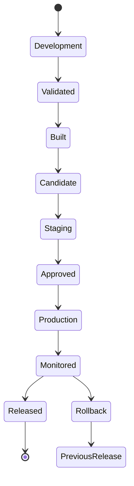
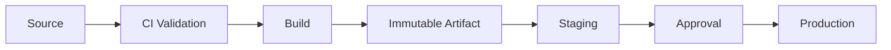
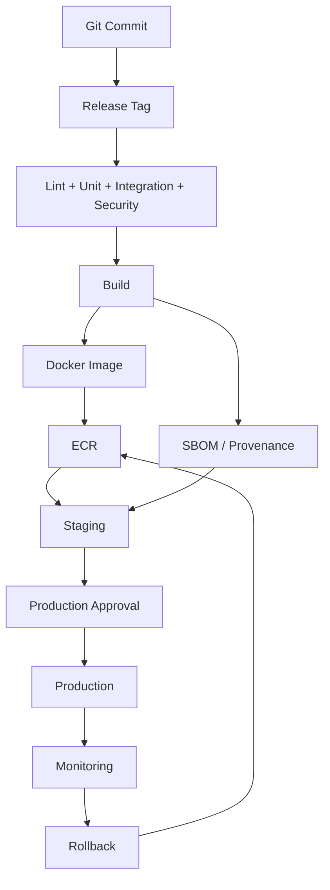

# 09- Release Management

## Overview

Release management is the process of turning validated source code into a controlled, traceable, deployable software release.

In GitHub Actions, release management connects:

```text
Code
 ↓
Validation
 ↓
Build
 ↓
Immutable Artifact
 ↓
Version
 ↓
Release
 ↓
Environment Promotion
 ↓
Deployment
 ↓
Monitoring
 ↓
Rollback
```

A production-grade release process should answer:

- What changed?
- Which commit produced the release?
- Which artifact was built?
- Which version represents the release?
- Which environments received it?
- Who approved production?
- Which artifact is currently running?
- Can the release be rolled back?
- Can the release be reproduced or audited?

For backend systems such as Django, FastAPI, and microservices, release management becomes particularly important when Docker, ECR, ECS, Kubernetes, Terraform, database migrations, and multiple environments are involved.

The central principle is:

> **Build once, identify the artifact immutably, and promote the same artifact through environments.**

---

## Release vs Deployment

Release and deployment are related but not identical.

| Concept | Meaning |
|---|---|
| Build | Produce an executable artifact |
| Version | Identify a software state |
| Release | Declare and package a version for distribution or promotion |
| Deployment | Place a release into a runtime environment |
| Promotion | Move an existing artifact to another environment |
| Rollback | Restore a previously validated release |

For example:

```text
Git commit
    ↓
Build Docker image
    ↓
v2.4.0
    ↓
ECR image digest
    ↓
Staging deployment
    ↓
Production deployment
```

The release identifies the software version. The deployment determines where that version runs.

---

## Release Lifecycle

A production release can follow:



The important distinction is between a release candidate and a production deployment.

A build can be technically valid without being approved for production.

---

## Release Identity

Every release should have a stable identity.

Common identifiers include:

- Git commit SHA.
- Git tag.
- Semantic version.
- Docker image digest.
- GitHub Release.
- Build number.

A strong production model combines them:

```text
Release
 ├── Version: v2.4.0
 ├── Commit: abc123...
 ├── Image: orders-api@sha256:...
 └── Workflow Run: 123456
```

This allows an operator to trace production back to the exact source and build.

---

## Git Tags

Git tags are commonly used to identify releases.

Example:

```bash
git tag -a v2.4.0 -m "Release v2.4.0"
git push origin v2.4.0
```

A tag provides a stable Git reference to a specific commit.

A release workflow can trigger on tags:

```yaml
name: Release

on:
  push:
    tags:
      - "v*.*.*"
```

This makes the version itself part of the workflow trigger.

---

## Tag-Driven Releases

A typical flow is:

```text
Developer
   ↓
Merge to main
   ↓
Create v2.4.0 tag
   ↓
GitHub Actions
   ↓
Validate
   ↓
Build
   ↓
Publish artifacts
   ↓
Create GitHub Release
```

Tag-driven releases work well when the team uses explicit release versions.

---

## Manual Releases

Not every organization uses automatic tag-driven releases.

A manual workflow can use `workflow_dispatch`:

```yaml
name: Release

on:
  workflow_dispatch:
    inputs:
      version:
        description: Release version
        required: true
        type: string
```

The release job can then validate the supplied version before creating the release.

Manual releases should still enforce:

- Version validation.
- Required checks.
- Artifact integrity.
- Permissions.
- Production protection.

Manual does not mean uncontrolled.

---

## Release Version Validation

If the repository follows semantic versioning, validate versions before creating a release.

Example:

```text
v2.4.0
```

is structurally different from:

```text
release-final
```

A release workflow should reject ambiguous or malformed versions.

A Python implementation can validate the expected pattern:

```python
import re
import sys

version = sys.argv[1]

if not re.fullmatch(r"v\d+\.\d+\.\d+", version):
    raise SystemExit(f"Invalid release version: {version}")
```

For more advanced release automation, use a dedicated semantic-versioning library rather than maintaining complex parsing logic manually.

---

## Semantic Versioning

Semantic Versioning generally follows:

```text
MAJOR.MINOR.PATCH
```

For example:

```text
2.4.0
```

The intended interpretation is:

| Component | Typical meaning |
|---|---|
| MAJOR | Breaking compatibility change |
| MINOR | Backward-compatible feature |
| PATCH | Backward-compatible fix |

Pre-release versions can also be represented:

```text
2.4.0-alpha.1
2.4.0-beta.1
2.4.0-rc.1
```

The exact release policy should be defined by the project.

---

## Semantic Versioning and APIs

For REST and gRPC services, version changes should consider compatibility.

For example:

```text
Existing client
     ↓
API v1
```

A breaking API change may require a major version or another explicit compatibility strategy.

However, semantic versioning alone does not guarantee runtime compatibility.

A release may also involve:

- Database schemas.
- Kafka events.
- Redis data.
- External APIs.
- Background workers.
- Infrastructure.

---

## Python Package Releases

For a Python library:

```text
Source
 ↓
Tests
 ↓
Build wheel + sdist
 ↓
Publish
 ↓
Version
 ↓
Release
```

Typical artifacts include:

```text
package_name-2.4.0-py3-none-any.whl
package_name-2.4.0.tar.gz
```

The package version should be derived from a controlled source of truth rather than manually changed inconsistently across files.

---

## Docker Release Identity

Docker images should not rely only on mutable tags.

Example:

```text
orders-api:v2.4.0
```

is useful for humans, while:

```text
orders-api@sha256:...
```

provides immutable artifact identity.

A production release can record both:

```text
Version: v2.4.0
Tag: v2.4.0
Commit: abc123
Digest: sha256:...
```

---

## Commit SHA Tags

A common CI strategy is:

```yaml
env:
  IMAGE_TAG: ${{ github.sha }}
```

This produces an image such as:

```text
orders-api:abc123...
```

The SHA provides a direct relationship between source and image.

A semantic release tag can also be applied:

```text
orders-api:v2.4.0
```

Both references can point to the same immutable image digest.

---

## Immutable Artifact Strategy

A production pipeline should preferably follow:

```text
Source
 ↓
Build
 ↓
Artifact
 ↓
Digest
 ↓
Staging
 ↓
Approval
 ↓
Production
```

Not:

```text
Source
 ├── Build staging
 └── Build production
```

Rebuilding can introduce differences in:

- Dependencies.
- Base images.
- Build tools.
- Network state.
- Build configuration.

The artifact promoted to production should be the artifact that passed validation.

---

## Build Once, Deploy Many

The model is:



Environment-specific configuration is injected separately.

For Docker:

```text
Image
 └── Application + Dependencies

Environment
 ├── URLs
 ├── Secrets
 ├── Runtime configuration
 └── Infrastructure target
```

---

## GitHub Releases

GitHub Releases provide a human-readable release record associated with a Git tag.

A release can contain:

- Release version.
- Release notes.
- Source tag.
- Binary artifacts.
- Checksums.
- Documentation.
- Links to deployment information.

A release workflow might create a GitHub Release after validation.

Using GitHub CLI:

```bash
gh release create v2.4.0 \
  --title "v2.4.0" \
  --generate-notes
```

Artifacts can also be attached:

```bash
gh release upload v2.4.0 \
  dist/orders-api.tar.gz
```

---

## Release Artifacts

A release can contain multiple artifacts.

For example:

```text
v2.4.0
├── orders-api.tar.gz
├── orders-api.sha256
├── sbom.spdx.json
└── release-metadata.json
```

For containerized applications, the registry image is often the primary deployment artifact while GitHub Release assets provide additional metadata or distributable files.

---

## Checksums

Checksums provide integrity verification.

Example:

```bash
sha256sum orders-api.tar.gz > orders-api.tar.gz.sha256
```

Verification:

```bash
sha256sum --check orders-api.tar.gz.sha256
```

A checksum confirms that a file matches the expected content.

It does not by itself prove who produced the file.

For stronger supply-chain guarantees, use provenance and signing mechanisms.

---

## Release Metadata

A useful release metadata file might contain:

```json
{
  "version": "v2.4.0",
  "commit": "abc123",
  "image_digest": "sha256:...",
  "workflow_run": "123456",
  "created_at": "2026-09-30T12:00:00Z"
}
```

This creates an auditable relationship between:

```text
Version
 ↓
Source
 ↓
Build
 ↓
Artifact
 ↓
Workflow
```

Do not put secrets into release metadata.

---

## Changelog Generation

A release should communicate what changed.

A changelog can contain:

```markdown
## v2.4.0

### Added
- New order search API.

### Changed
- Improved Redis caching.

### Fixed
- Corrected pagination behavior.

### Security
- Updated vulnerable dependency.
```

Automated changelog generation can use commit conventions or pull request metadata.

Automation is useful, but generated release notes should still be reviewed for accuracy.

---

## Conventional Commits

Teams may standardize commit messages:

```text
feat: add order search
fix: handle duplicate order events
docs: update deployment guide
refactor: simplify payment client
```

These conventions can support automated release classification.

For example:

```text
feat
 ↓
MINOR

fix
 ↓
PATCH
```

The exact release rules should be defined by the project rather than inferred blindly from every commit.

---

## Release Candidates

A release candidate allows production-like validation before final release.

Example:

```text
v2.4.0-rc.1
```

Lifecycle:

```text
Development
 ↓
Release Candidate
 ↓
Staging
 ↓
Validation
 ↓
Production
```

Release candidates are useful when:

- Releases are high risk.
- Multiple teams consume the artifact.
- Extensive integration testing is required.
- Production deployment requires explicit approval.

---

## Pre-Releases

Pre-release versions communicate that an artifact is not the final stable release.

Examples:

```text
2.4.0-alpha.1
2.4.0-beta.1
2.4.0-rc.1
```

They should not accidentally become the default production artifact.

Deployment workflows should explicitly distinguish stable and pre-release versions.

---

## Release Promotion

Promotion means moving an existing artifact between environments.

```text
Release Candidate
      ↓
Staging
      ↓
Approved
      ↓
Production
```

Promotion should not modify the artifact.

For Docker:

```text
ECR digest
    ↓
Staging
    ↓
Production
```

The digest should remain unchanged.

---

## Release and GitHub Environments

GitHub Environments can protect the production promotion.

```yaml
jobs:
  deploy-production:
    environment: production

    steps:
      - name: Deploy release
        run: ./scripts/deploy.sh
```

The environment can provide:

- Required reviewers.
- Production secrets.
- Production variables.
- Branch restrictions.
- Deployment history.

---

## Release and Deployment Approvals

A release should not automatically imply production deployment.

A useful model is:

```text
Release Created
      ↓
Staging Deployment
      ↓
Validation
      ↓
Production Approval
      ↓
Production Deployment
```

This separates release creation from production authorization.

---

## Release Concurrency

Production releases should not overlap unexpectedly.

Example:

```yaml
concurrency:
  group: production-release
  cancel-in-progress: false
```

This protects against:

```text
Release A → Production
Release B → Production
```

running concurrently.

For production, allowing two release workflows to modify the same deployment target can create difficult-to-debug race conditions.

---

## Release Ordering

Consider:

```text
Release A
 ↓
Deploying

Release B
 ↓
Created
```

Release B should not automatically overwrite A while A is still deploying unless the deployment architecture explicitly supports that behavior.

Concurrency should establish a deterministic deployment order.

---

## Release Rollback

Rollback should target a previously known-good artifact.

Example:

```text
Production
    ↓
v2.4.0
    ↓
Failure
    ↓
v2.3.2
```

The rollback should preferably reuse the existing `v2.3.2` artifact.

Avoid:

```text
Checkout old commit
 ↓
Rebuild
 ↓
Deploy
```

when an immutable artifact already exists.

---

## Rollback and Database Migrations

Application rollback and database rollback are different problems.

Example:

```text
Application v2.4.0
      ↓
Database migration
      ↓
Production
```

If the application is rolled back:

```text
v2.3.2
```

the old application must still be compatible with the current database schema.

Use backward-compatible migration patterns such as:

```text
Expand
 ↓
Deploy compatible application
 ↓
Migrate data
 ↓
Switch behavior
 ↓
Contract later
```

Avoid destructive migrations that make immediate application rollback impossible.

---

## Release and Celery

For Celery-based systems:

```text
Application Release
      ↓
Web Workers
      +
Celery Workers
```

A release may require both application and worker compatibility.

Consider:

- Task serialization.
- Task names.
- Function signatures.
- Queue names.
- Retry behavior.
- Long-running tasks.

A new application release should not immediately invalidate tasks already waiting in the queue.

---

## Release and Kafka

Kafka introduces another compatibility boundary.

A release can change:

```text
Producer
 ↓
Kafka event
 ↓
Consumer
```

The producer and consumer may not deploy simultaneously.

Use backward-compatible event schemas when rolling releases across services.

A release strategy should consider:

- Schema compatibility.
- Consumer lag.
- Old consumers.
- New producers.
- Replay behavior.

---

## Release and Redis

Redis may contain state that survives application releases.

Consider:

- Cache key changes.
- Serialization changes.
- Session formats.
- Distributed locks.
- Feature flags.
- Queue state.

Avoid incompatible cache or state formats that prevent rollback.

---

## Release and External APIs

A new release may depend on an external service version.

Track:

```text
Application
 ↓
External API
 ↓
API contract
```

A release should validate compatibility before production deployment.

For critical integrations, use contract or integration tests in CI.

---

## Release Workflow Example

```yaml
name: Release

on:
  push:
    tags:
      - "v*.*.*"

permissions:
  contents: write
  packages: write

jobs:
  test:
    runs-on: ubuntu-latest

    steps:
      - uses: actions/checkout@v4

      - name: Set up Python
        uses: actions/setup-python@v6
        with:
          python-version: "3.12"

      - name: Install dependencies
        run: pip install -r requirements.txt

      - name: Run tests
        run: pytest

  release:
    needs: test
    runs-on: ubuntu-latest

    steps:
      - uses: actions/checkout@v4

      - name: Create release
        env:
          GH_TOKEN: ${{ github.token }}
        run: |
          gh release create "${GITHUB_REF_NAME}" \
            --generate-notes
```

The release is created only after the test job succeeds.

---

## Release Workflow With Docker

A stronger production flow separates release creation from deployment.

```text
Tag
 ↓
Validate
 ↓
Build Docker image
 ↓
Push ECR
 ↓
Record digest
 ↓
Create release metadata
 ↓
Deploy staging
 ↓
Validate
 ↓
Production approval
 ↓
Deploy same digest
```

Example image tag:

```yaml
env:
  IMAGE_TAG: ${{ github.sha }}
```

The release version can additionally be associated with the Git tag.

---

## Release Metadata as an Output

A build job can expose the artifact identity:

```yaml
jobs:
  build:
    runs-on: ubuntu-latest

    outputs:
      image_digest: ${{ steps.image.outputs.digest }}

    steps:
      - id: image
        run: |
          echo "digest=sha256:..." >> "$GITHUB_OUTPUT"
```

The deployment job can consume:

```yaml
jobs:
  deploy:
    needs: build

    steps:
      - name: Deploy exact artifact
        run: |
          echo "Deploying ${{ needs.build.outputs.image_digest }}"
```

In a real implementation, the digest should come from the registry/build tooling rather than being manually constructed.

---

## Release Provenance

A production release should be traceable:

```text
Git Tag
   ↓
Commit
   ↓
Workflow Run
   ↓
Build
   ↓
Artifact Digest
   ↓
Staging Deployment
   ↓
Approval
   ↓
Production Deployment
```

This allows incident responders to answer:

```text
What is running?
```

and:

```text
How was it produced?
```

---

## SBOM and Release Security

A release can include a Software Bill of Materials:

```text
Source
 ↓
Build
 ↓
SBOM
 ↓
Artifact
 ↓
Provenance
 ↓
Release
```

For Python applications, the SBOM can identify:

- Python dependencies.
- Package versions.
- Transitive dependencies.

For Docker images, it can also represent:

- Base image.
- OS packages.
- Application dependencies.

The release process should preserve the relationship between the SBOM and the exact artifact.

---

## Artifact Attestations

An attestation can provide metadata about how an artifact was produced.

Conceptually:

```text
Artifact
 +
Build identity
 +
Source
 +
Workflow
 ↓
Attestation
```

This provides stronger supply-chain evidence than a simple version string.

For security-sensitive production environments, release policy can require verified artifact provenance before promotion.

---

## Artifact Signing

Signing provides authenticity and integrity guarantees.

A simplified model is:

```text
Build
 ↓
Artifact
 ↓
Sign
 ↓
Registry
 ↓
Verify
 ↓
Deploy
```

A digest identifies content, while a signature provides evidence that an authorized signer produced or approved that artifact.

These controls complement each other.

---

## Release Security

Release workflows often have elevated permissions.

For example:

```yaml
permissions:
  contents: write
  packages: write
```

Only grant permissions required by the workflow.

A release job should not automatically have:

```text
id-token: write
administration
issues: write
pull-requests: write
```

unless those permissions are genuinely required.

Separate jobs can also reduce privilege:

```text
Test Job
 └── contents: read

Build Job
 └── packages: write

Deploy Job
 └── id-token: write
```

---

## Third-Party Actions in Release Workflows

Release workflows are high-value targets.

A compromised third-party action could potentially access:

- Release permissions.
- Registry credentials.
- Environment secrets.
- AWS credentials.
- Repository contents.

Prefer trusted actions and appropriate version or SHA pinning.

Minimize the number of third-party actions in privileged jobs.

---

## Release Branch Security

If releases are created from tags:

```text
main
 ↓
approved commit
 ↓
protected tag
 ↓
release
```

The process should prevent unauthorized users from creating production release references.

Combine:

- Branch protection.
- Tag protection or repository policy where applicable.
- Required checks.
- Least-privilege permissions.
- Environment protection.

---

## GitHub CLI Release Operations

List releases:

```bash
gh release list
```

View a release:

```bash
gh release view v2.4.0
```

Create a release:

```bash
gh release create v2.4.0 \
  --generate-notes
```

Upload an artifact:

```bash
gh release upload v2.4.0 \
  dist/orders-api.tar.gz
```

Delete a release:

```bash
gh release delete v2.4.0
```

Deleting a release is an operationally significant action and should not be used as a substitute for rollback.

---

## Inspecting Release Tags

List tags:

```bash
git tag --list
```

Inspect a tag:

```bash
git show v2.4.0
```

Verify the commit:

```bash
git rev-list -n 1 v2.4.0
```

The result should match the source commit recorded in release metadata.

---

## Release Automation With GitHub CLI

A controlled release script can validate:

```text
1. Current branch
2. Working tree
3. Version format
4. Existing tag
5. Required checks
6. Release existence
7. Artifact availability
```

Example:

```bash
set -euo pipefail

VERSION="${1:?version required}"

if ! [[ "$VERSION" =~ ^v[0-9]+\.[0-9]+\.[0-9]+$ ]]; then
  echo "Invalid version: $VERSION" >&2
  exit 1
fi

if git rev-parse "$VERSION" >/dev/null 2>&1; then
  echo "Tag already exists: $VERSION" >&2
  exit 1
fi

git tag -a "$VERSION" -m "Release $VERSION"
git push origin "$VERSION"
```

Release automation should fail early rather than creating partially valid releases.

---

## Release Governance

At organizational scale, define:

```text
Release policy
 ├── Versioning policy
 ├── Branch policy
 ├── Tag policy
 ├── Approval policy
 ├── Artifact policy
 ├── Security policy
 ├── Rollback policy
 └── Audit policy
```

For example:

```text
Production release
 ├── Immutable artifact required
 ├── Security checks required
 ├── SBOM required
 ├── Approval required
 ├── Deployment concurrency required
 └── Rollback artifact retained
```

Governance should standardize critical controls without making every repository identical.

---

## Release Cadence

Different systems can use different release models.

| Model | Characteristics |
|---|---|
| Continuous | Frequent automated releases |
| Scheduled | Releases at fixed intervals |
| Manual | Explicit release initiation |
| Tag-driven | Git tag starts release |
| Trunk-based | Frequent main-branch releases |
| Release branch | Dedicated release stabilization |

The correct model depends on:

- Risk.
- Team size.
- Regulatory requirements.
- Deployment maturity.
- Customer expectations.
- Runtime architecture.

---

## Continuous Delivery vs Continuous Deployment

Continuous Delivery means the software is always in a deployable state, while production deployment may require approval.

```text
Continuous Delivery

Build
 ↓
Validate
 ↓
Deployable
 ↓
Approval
 ↓
Production
```

Continuous Deployment automatically promotes validated changes:

```text
Build
 ↓
Validate
 ↓
Production
```

Release management must align with the organization's risk and approval model.

---

## Release Reliability

A reliable release process should minimize unnecessary state.

Prefer:

```text
Immutable artifact
+
Explicit version
+
Deterministic promotion
+
Protected production
+
Health validation
+
Known rollback
```

Avoid:

```text
Mutable artifact
+
Manual server changes
+
Rebuild during rollback
+
Shared credentials
+
Untracked configuration
```

---

## Release Failure Domains

Release failures can be classified as:

| Domain | Example |
|---|---|
| Versioning | Invalid or duplicate version |
| Source | Incorrect commit/tag |
| Build | Artifact cannot be produced |
| Registry | Image push fails |
| Provenance | Artifact cannot be verified |
| Staging | Release fails validation |
| Approval | Production approval unavailable |
| Deployment | Runtime deployment fails |
| Database | Migration incompatibility |
| Dependency | External service incompatibility |
| Concurrency | Multiple releases overlap |
| Rollback | Previous artifact unavailable |
| Security | Insufficient permissions or compromised action |

This classification helps incident responders isolate the failure quickly.

---

## Release Troubleshooting

### Release Workflow Did Not Trigger

**Symptom**

Creating a tag does not start the release workflow.

**Possible causes**

- Tag does not match the trigger.
- Workflow file is not present on the triggering ref.
- YAML syntax error.
- Repository Actions configuration prevents execution.

**Check**

```bash
gh workflow list
```

Inspect the workflow:

```bash
gh workflow view release.yml
```

List recent runs:

```bash
gh run list --workflow release.yml
```

**Prevention**

Test release workflows before relying on them for production releases.

---

## Release Tag Already Exists

**Symptom**

Release creation fails because the version already exists.

**Possible causes**

- Previous release partially succeeded.
- Tag was created manually.
- Release was deleted but tag remains.
- CI was rerun.

**Isolation**

```bash
git rev-parse v2.4.0
gh release view v2.4.0
```

Determine whether the existing tag points to the intended commit.

Do not blindly delete and recreate production release identifiers.

---

## Wrong Commit Was Released

**Symptom**

The release version exists but contains unexpected source.

**Check**

```bash
git rev-list -n 1 v2.4.0
```

Compare it with:

```text
Expected commit
Actual tagged commit
Build commit
Deployment artifact
```

The release should be traced through the full provenance chain.

---

## Release Built Successfully but Deployment Failed

Separate:

```text
Release failure
```

from:

```text
Deployment failure
```

If the artifact exists and passed validation:

```text
Release
  ↓
Artifact
  ↓
Deployment failure
```

Do not rebuild the artifact simply because deployment failed.

Investigate:

- AWS authentication.
- Registry access.
- ECS/EC2/Kubernetes configuration.
- Environment variables.
- Health checks.
- Database compatibility.

---

## Production Is Running the Wrong Version

Check:

```text
Git tag
 ↓
Commit SHA
 ↓
Image tag
 ↓
Image digest
 ↓
Deployment metadata
 ↓
Runtime
```

For AWS:

```bash
aws sts get-caller-identity
```

Then inspect the deployment target and compare its image digest with the release metadata.

---

## Rollback Artifact Is Missing

This indicates a release retention problem.

A production system should retain enough historical artifacts to satisfy its rollback requirements.

Recovery options may include:

- Registry retention.
- Release assets.
- Artifact storage.
- Rebuilding from source when absolutely necessary.

Rebuilding should be treated differently from deploying the original immutable artifact because the result may not be byte-for-byte identical.

---

## Release and Database Failure

If a deployment fails after migration:

```text
Application
 +
Database
```

must be investigated together.

Ask:

- Is the migration backward compatible?
- Can the previous application version run?
- Did data transformation occur?
- Can the migration be safely reversed?
- Is a forward fix safer than a database rollback?

Do not automatically run `migrate down` in production without understanding the data implications.

---

## Release Observability

Track release-specific metadata:

```text
release.version
release.commit
release.image_digest
release.environment
deployment.id
deployment.timestamp
```

This allows dashboards and logs to answer:

```text
Which release is producing these errors?
```

For distributed systems, propagate release metadata into:

- Application logs.
- Metrics.
- Traces.
- Deployment events.

---

## Release Monitoring

After deployment, monitor:

```text
Error rate
Latency
Traffic
CPU
Memory
Database connections
Redis health
Celery queue depth
Kafka consumer lag
External API errors
```

Compare against the previous release where possible.

A release is not operationally successful merely because the deployment command exited with code `0`.

---

## Release Health Gates

A deployment can include automated health gates:

```text
Deploy
 ↓
Wait for readiness
 ↓
Check HTTP health
 ↓
Check error rate
 ↓
Check latency
 ↓
Check critical dependency health
 ↓
Promote / Rollback
```

For canary deployments, the gate can evaluate a smaller traffic percentage before promotion.

---

## Release and High Availability

A release strategy should preserve availability through:

- Rolling deployments.
- Blue-green deployments.
- Canary releases.
- Load balancer health checks.
- Graceful shutdown.
- Connection draining.
- Backward-compatible database changes.

The release mechanism should not force all instances offline simultaneously unless downtime is explicitly acceptable.

---

## Release and Disaster Recovery

A release process contributes to disaster recovery by preserving:

```text
Source
+
Version
+
Artifact
+
Infrastructure configuration
+
Environment configuration
+
Deployment history
```

A recovery process can then select a known-good release:

```text
Production Incident
       ↓
Identify known-good release
       ↓
Retrieve immutable artifact
       ↓
Deploy
       ↓
Validate
       ↓
Monitor
```

---

## Cost Considerations

Release automation can increase cost through:

- Repeated builds.
- Large Docker images.
- Excessive release artifacts.
- Long retention periods.
- Duplicate environment deployments.
- Large test matrices.

Build-once/deploy-many reduces redundant builds.

Retention should match rollback and compliance requirements rather than retaining everything indefinitely.

---

## Common Release Mistakes

### Using Only `latest`

It makes artifact identity ambiguous.

### Rebuilding During Promotion

This can produce a different artifact.

### Rebuilding During Rollback

The original artifact may no longer be reproducible.

### Releasing Without Required Checks

A tag should not automatically bypass CI validation.

### Treating Git Tags as the Entire Release Record

A tag identifies source, but production also needs artifact and deployment metadata.

### Ignoring Database Compatibility

Application rollback may fail against a newer schema.

### Releasing With Mutable Dependencies

Unpinned dependencies can make builds non-reproducible.

### Giving Release Jobs Excessive Permissions

Release workflows are high-value targets.

### Skipping Post-Deployment Monitoring

Deployment success does not guarantee application health.

### Deleting Releases to Fix Mistakes

Release identifiers and tags can become part of audit and operational history.

---

## Production Release Architecture

A mature backend release system can look like:



The release system should preserve artifact identity throughout the lifecycle.

---

## Recommended Release Metadata

For each production release, record at least:

| Field | Example |
|---|---|
| Version | `v2.4.0` |
| Commit | `abc123...` |
| Image | `orders-api:v2.4.0` |
| Digest | `sha256:...` |
| Workflow run | `123456` |
| Environment | `production` |
| Deployment time | ISO-8601 timestamp |
| Approver | Deployment reviewer |
| Previous release | `v2.3.2` |

This information dramatically improves incident response.

---

## Release Design for Microservices

For multiple services:

```text
orders
payments
inventory
notifications
```

each service may have its own release identity.

Example:

```text
orders:v2.4.0
payments:v5.1.2
inventory:v3.8.0
notifications:v1.9.1
```

Do not assume every service needs to share one global version.

A platform may additionally maintain a system-level release manifest:

```yaml
orders: v2.4.0
payments: v5.1.2
inventory: v3.8.0
notifications: v1.9.1
```

This can describe a tested combination of service versions.

---

## Release Manifest

A release manifest can be useful for coordinated deployments:

```json
{
  "release": "2026.09.30-01",
  "services": {
    "orders": "sha256:...",
    "payments": "sha256:...",
    "inventory": "sha256:..."
  }
}
```

The manifest should reference immutable artifacts.

This provides a system-level deployment identity without requiring every service to use the same semantic version.

---

## GitHub CLI Operational Reference

| Operation | Command |
|---|---|
| List releases | `gh release list` |
| View release | `gh release view v2.4.0` |
| Create release | `gh release create v2.4.0 --generate-notes` |
| Upload asset | `gh release upload v2.4.0 file` |
| List workflows | `gh workflow list` |
| View workflow | `gh workflow view release.yml` |
| List runs | `gh run list --workflow release.yml` |
| View run | `gh run view RUN_ID` |
| View logs | `gh run view RUN_ID --log` |
| Rerun | `gh run rerun RUN_ID` |

Use `gh` for operational visibility and controlled release management rather than replacing the release architecture with ad-hoc shell commands.

---

## Senior Release Design Principles

A senior engineer should optimize for:

### Traceability

Every production artifact should map to source and release metadata.

### Immutability

The artifact promoted to production should not change.

### Separation of Concerns

Separate:

```text
Build
Release
Promotion
Deployment
Monitoring
Rollback
```

### Least Privilege

Release jobs should receive only the permissions they require.

### Compatibility

Release planning must consider:

```text
Application
Database
Queues
Events
External APIs
Infrastructure
```

### Reversibility

Every production release should have a defined recovery path.

### Observability

Operators should be able to identify the release responsible for runtime behavior quickly.

---

## Production Release Checklist

### Source and Version

- [ ] Release version follows the repository's versioning policy.
- [ ] Release tag points to the intended commit.
- [ ] Required checks have passed.
- [ ] Release branch/tag controls are enforced.

### Artifact

- [ ] Artifact is immutable.
- [ ] Docker image has a deterministic identity.
- [ ] Image digest is recorded.
- [ ] Build provenance is available where required.
- [ ] SBOM is generated where required.

### Promotion

- [ ] Staging uses the intended artifact.
- [ ] Production promotes the same artifact.
- [ ] Production deployment requires appropriate approval.
- [ ] Deployment concurrency prevents conflicting releases.

### Security

- [ ] Release workflow uses least-privilege permissions.
- [ ] Third-party actions are trusted and appropriately pinned.
- [ ] AWS authentication uses OIDC where appropriate.
- [ ] Production secrets are protected by the environment boundary.

### Runtime

- [ ] Health checks are executed.
- [ ] Database compatibility has been evaluated.
- [ ] Celery/Kafka/Redis compatibility has been evaluated where relevant.
- [ ] Monitoring is active after deployment.

### Recovery

- [ ] Previous known-good artifact is available.
- [ ] Rollback procedure is documented.
- [ ] Database rollback implications are understood.
- [ ] Release metadata is retained for incident response.

## Key Takeaways

- **A production release should have a traceable identity connecting version, commit, workflow run, immutable artifact, deployment, and environment.**
- **Use build-once/deploy-many so the exact artifact validated in staging is promoted to production without rebuilding.**
- **Semantic versions and Git tags identify releases, while Docker digests and artifact provenance establish the precise deployable artifact.**
- **Release management must account for database schemas, Celery, Kafka, Redis, external APIs, deployment concurrency, security, monitoring, and rollback—not just application code.**
- **A mature release process makes production changes controlled and reversible through validation, protected promotion, observability, and known-good immutable artifacts.**