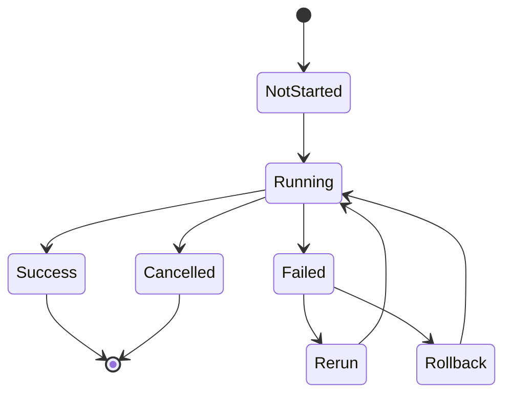
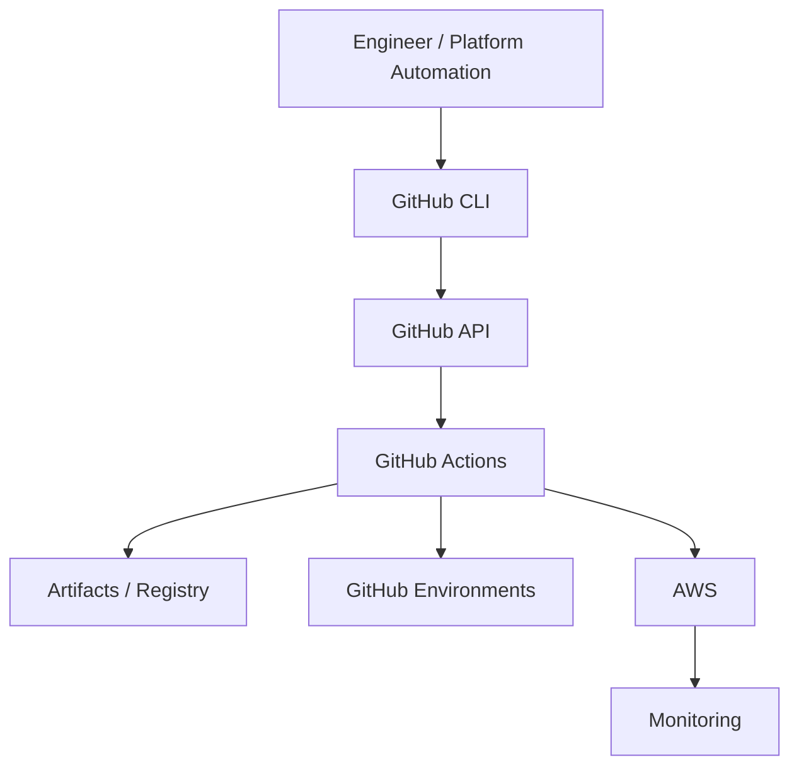

# 10- Operational CLI Workflows

## Overview

GitHub CLI (`gh`) provides a practical command-line interface for operating GitHub Actions and the surrounding CI/CD lifecycle.

For production engineering, the value of `gh` is not learning every GitHub API command. It is being able to answer operational questions quickly:

```text
What workflows exist?
        ↓
What is running?
        ↓
Why did it fail?
        ↓
What artifact was produced?
        ↓
Can I rerun or cancel it?
        ↓
What environment was deployed?
        ↓
Which release is active?
```

A useful operational model is:

```text
Repository
   ↓
Workflow
   ↓
Workflow Run
   ↓
Jobs
   ↓
Steps
   ↓
Artifacts
   ↓
Environment / Deployment
   ↓
Release
```

GitHub CLI is particularly useful for:

- Workflow inspection.
- Manual workflow execution.
- Run monitoring.
- Log retrieval.
- Reruns and cancellation.
- Artifact inspection.
- Repository Actions administration.
- Secrets and variables operations.
- Environment operations.
- Release management.
- Incident investigation.
- CI/CD automation scripts.

The CLI should complement the GitHub Actions workflow architecture rather than replace it with ad-hoc operational commands.

---

## GitHub CLI Authentication

GitHub CLI uses an authenticated GitHub session for operations that require repository access.

Check authentication:

```bash
gh auth status
```

Authenticate interactively:

```bash
gh auth login
```

For CI automation, prefer the provided token:

```bash
export GH_TOKEN="$GITHUB_TOKEN"
```

Then:

```bash
gh run list
```

GitHub Actions commonly exposes the workflow token through:

```yaml
env:
  GH_TOKEN: ${{ github.token }}
```

For automation outside GitHub Actions, use an appropriately scoped authentication mechanism rather than embedding credentials in scripts.

---

## Authentication and Security

The CLI inherits the permissions of the authenticated identity.

Therefore:

```text
gh command
   ↓
GitHub authentication
   ↓
GitHub authorization
   ↓
Repository / Actions operation
```

A successful authentication does not mean every command is authorized.

For production automation:

- Use least-privilege credentials.
- Avoid storing tokens in scripts.
- Avoid printing tokens.
- Prefer short-lived credentials where supported.
- Use `GITHUB_TOKEN` for repository-local Actions operations when sufficient.
- Use OIDC for AWS authentication rather than long-lived AWS access keys.

---

## Repository Context

Many `gh` commands infer the repository from the current Git checkout.

Check the repository:

```bash
gh repo view
```

Explicitly specify a repository when operating from another directory:

```bash
gh run list --repo OWNER/REPO
```

This is safer for automation because the target repository becomes explicit.

For scripts:

```bash
REPO="acme/orders-api"

gh run list --repo "$REPO"
```

Avoid accidentally operating against whichever repository happens to be the current working directory.

---

## Repository Inspection

View repository information:

```bash
gh repo view OWNER/REPO
```

View repository details as JSON:

```bash
gh repo view OWNER/REPO \
  --json name,defaultBranchRef,isPrivate,url
```

This is useful for automation that needs repository metadata before performing an Actions operation.

---

## Repository Management for CI/CD

Create a repository:

```bash
gh repo create acme/orders-api \
  --private
```

Clone it:

```bash
gh repo clone acme/orders-api
```

View repository:

```bash
gh repo view acme/orders-api
```

List repositories:

```bash
gh repo list acme
```

Repository creation is generally an administrative operation. CI/CD automation should avoid creating repositories dynamically unless that behavior is explicitly part of the platform architecture.

---

## GitHub Actions Operational Model

A workflow file defines automation:

```text
.github/workflows/
├── ci.yml
├── release.yml
└── deploy.yml
```

A workflow can create multiple runs:

```text
ci.yml
 ├── Run #100
 ├── Run #101
 └── Run #102
```

Each run can contain jobs:

```text
Run #102
 ├── lint
 ├── unit-tests
 ├── integration-tests
 ├── build
 └── deploy
```

`gh` operates at these different levels.

---

## Workflow Listing

List workflows:

```bash
gh workflow list
```

For a specific repository:

```bash
gh workflow list \
  --repo OWNER/REPO
```

This quickly answers:

- Which workflows exist?
- Are they enabled?
- What are their names?
- What identifiers can be used with other commands?

Example:

```text
CI
Deploy
Release
Security Scan
```

---

## Workflow Inspection

View a workflow:

```bash
gh workflow view ci.yml
```

View a workflow in another repository:

```bash
gh workflow view ci.yml \
  --repo OWNER/REPO
```

This is useful when diagnosing whether a workflow contains the expected triggers and recent execution information.

---

## Workflow Status

A common operational question is:

```text
Is CI currently healthy?
```

Start with:

```bash
gh run list \
  --workflow ci.yml
```

For a repository:

```bash
gh run list \
  --repo OWNER/REPO \
  --workflow ci.yml
```

Filter by branch:

```bash
gh run list \
  --workflow ci.yml \
  --branch main
```

Filter by status:

```bash
gh run list \
  --workflow ci.yml \
  --status failure
```

---

## Workflow Run Inspection

Inspect a specific run:

```bash
gh run view RUN_ID
```

For example:

```bash
gh run view 123456789
```

This provides a high-level view of:

- Run status.
- Commit.
- Branch.
- Jobs.
- Steps.
- Conclusion.

A useful incident workflow is:

```text
gh run list
    ↓
Identify failed run
    ↓
gh run view RUN_ID
    ↓
Identify failed job
    ↓
Inspect logs
```

---

## Workflow Run Logs

Retrieve logs:

```bash
gh run view RUN_ID --log
```

This is useful when the failure can be diagnosed directly from step output.

For larger runs, avoid blindly dumping all logs into terminals or automation systems.

Start with run metadata and identify the failed job first.

---

## Failed Job Investigation

View the run:

```bash
gh run view RUN_ID
```

Identify:

```text
Job
 ↓
Failed step
 ↓
Error message
```

Then retrieve logs:

```bash
gh run view RUN_ID --log
```

The goal is to locate the first meaningful failure rather than the last cascading error.

For example:

```text
PostgreSQL startup failed
 ↓
Integration tests failed
 ↓
Coverage failed
 ↓
Artifact upload skipped
```

The root cause is likely the PostgreSQL failure, not the later test result.

---

## Watch a Workflow Run

For a currently executing run:

```bash
gh run watch RUN_ID
```

This provides a convenient operational view without repeatedly querying the run manually.

Useful scenarios include:

- Production deployment.
- Release workflow.
- Manual infrastructure deployment.
- Long-running integration tests.

---

## Triggering a Manual Workflow

A workflow can expose `workflow_dispatch`:

```yaml
on:
  workflow_dispatch:
    inputs:
      environment:
        required: true
        type: choice
        options:
          - staging
          - production
```

Trigger it with:

```bash
gh workflow run deploy.yml \
  --ref main
```

With an input:

```bash
gh workflow run deploy.yml \
  --ref main \
  -f environment=staging
```

The workflow must support manual dispatch for this operation.

---

## Manual Deployment Workflow

A production deployment may look like:

```yaml
name: Deploy

on:
  workflow_dispatch:
    inputs:
      environment:
        required: true
        type: choice
        options:
          - staging
          - production
      image_digest:
        required: true
        type: string
```

Trigger:

```bash
gh workflow run deploy.yml \
  --ref main \
  -f environment=staging \
  -f image_digest='sha256:...'
```

The deployment workflow should validate the input before using it.

Do not allow arbitrary user input to become shell code.

---

## Waiting for a Workflow

After triggering a workflow, retrieve the latest run:

```bash
gh run list \
  --workflow deploy.yml \
  --limit 1
```

Then:

```bash
gh run watch RUN_ID
```

A script can use this pattern to implement an operational workflow:

```text
Trigger
 ↓
Find run
 ↓
Watch
 ↓
Inspect result
 ↓
Exit based on conclusion
```

---

## Rerunning a Workflow

Rerun a failed workflow:

```bash
gh run rerun RUN_ID
```

Rerun failed jobs only:

```bash
gh run rerun RUN_ID --failed
```

Rerunning is useful when:

- A transient network dependency failed.
- A runner failed.
- A third-party service had a temporary outage.
- A test was flaky and the failure is understood.

Do not use repeated reruns as a substitute for root-cause analysis.

---

## Rerun Strategy

A good operational process is:

```text
Failure
 ↓
Inspect logs
 ↓
Determine transient vs deterministic
 ↓
Rerun if justified
 ↓
Compare results
 ↓
Fix root cause if reproducible
```

A deterministic failure such as:

```text
SyntaxError
Permission denied
Missing environment variable
```

should not simply be rerun repeatedly.

---

## Cancelling a Run

Cancel a running workflow:

```bash
gh run cancel RUN_ID
```

This is useful when:

- A deployment was triggered accidentally.
- A duplicate CI run is consuming resources.
- A workflow is stuck.
- A deployment must be stopped before a conflicting operation.

Be careful when cancelling production deployments.

A deployment may be in the middle of changing infrastructure or application state.

---

## Production Cancellation

Consider:

```text
Deploy
 ↓
Infrastructure changed
 ↓
Application partially updated
 ↓
Run cancelled
```

The workflow cancellation state does not necessarily imply runtime rollback.

For production:

```text
Cancellation
```

and:

```text
Rollback
```

are different operations.

A cancellation policy should be designed together with deployment idempotency and rollback.

---

## Workflow Run JSON

For automation, use structured output instead of parsing human-readable text.

Example:

```bash
gh run list \
  --workflow ci.yml \
  --json databaseId,status,conclusion,headSha
```

The result can be processed with `jq`:

```bash
gh run list \
  --workflow ci.yml \
  --json databaseId,status,conclusion \
  --jq '.[] | "\(.databaseId) \(.status) \(.conclusion)"'
```

This is much more reliable than parsing terminal formatting.

---

## Operational Run Detection

A script can identify the latest failed run:

```bash
gh run list \
  --workflow ci.yml \
  --status failure \
  --limit 1 \
  --json databaseId,headSha,createdAt \
  --jq '.[0]'
```

Use structured fields whenever building automation around `gh`.

---

## Workflow Failure Gate

A deployment script can inspect a run:

```bash
RUN_ID="$1"

CONCLUSION="$(
  gh run view "$RUN_ID" \
    --json conclusion \
    --jq '.conclusion'
)"

if [[ "$CONCLUSION" != "success" ]]; then
  echo "Workflow failed: $CONCLUSION" >&2
  exit 1
fi
```

This makes the workflow result an explicit machine-readable decision.

---

## Artifact Operations

Artifacts are outputs produced by workflow runs.

Typical artifacts:

```text
test-reports/
coverage/
logs/
build packages/
deployment metadata/
```

List artifacts for a run:

```bash
gh run download RUN_ID
```

For selective downloads:

```bash
gh run download RUN_ID \
  -n test-reports
```

Artifacts should be treated differently from caches.

---

## Artifacts vs Caches

| Property | Artifact | Cache |
|---|---|---|
| Purpose | Preserve output | Speed up future builds |
| Typical content | Reports/builds | Dependencies |
| Expected reproducibility | Yes | No |
| Deployment use | Common | Generally no |
| Debugging use | Common | Limited |
| Lifecycle | Retained according to policy | Replaced/evicted |

Do not use a dependency cache as the source of truth for a production deployment artifact.

---

## Downloading Build Artifacts

A build workflow may produce:

```text
orders-api.tar.gz
release-metadata.json
sbom.json
```

Download:

```bash
gh run download RUN_ID \
  -n release-artifacts \
  -D ./artifacts
```

Then inspect:

```bash
ls -la ./artifacts
```

Verify checksums or provenance before using artifacts in sensitive workflows.

---

## Test Report Operations

A failed CI run may produce:

```text
pytest.xml
coverage.xml
screenshots/
logs/
```

Download them:

```bash
gh run download RUN_ID \
  -n test-reports
```

This is useful when the GitHub log does not contain enough context.

---

## Release Artifact Inspection

For release assets:

```bash
gh release view v2.4.0
```

Download release assets:

```bash
gh release download v2.4.0
```

This can be useful during rollback or incident investigation.

---

## Repository Actions Management

The GitHub CLI can be combined with GitHub's API for Actions administration.

For example:

```bash
gh api \
  repos/OWNER/REPO/actions/permissions
```

This can be used to inspect repository Actions configuration.

For advanced administration, `gh api` provides access to endpoints that do not have a dedicated high-level `gh` command.

---

## Actions Permissions

A production repository should explicitly control workflow permissions.

A workflow may define:

```yaml
permissions:
  contents: read
```

A deployment job may require:

```yaml
permissions:
  contents: read
  id-token: write
```

Avoid granting broad permissions at workflow level when only one job needs them.

A useful architecture is:

```text
CI
 └── read-only permissions

Build
 └── registry permissions

Deploy
 └── OIDC permission
```

---

## Repository Actions Policy

Actions governance can be inspected through API operations:

```bash
gh api \
  repos/OWNER/REPO/actions/permissions
```

At enterprise scale, Actions policy should control:

- Which actions are permitted.
- Whether third-party actions are allowed.
- Whether actions must be pinned.
- Which repositories can use Actions.
- Which runners are available.

CLI access makes these policies scriptable and auditable.

---

## Secrets Operations

List repository secrets:

```bash
gh secret list \
  --repo OWNER/REPO
```

Set a repository secret:

```bash
printf '%s' "$VALUE" |
  gh secret set API_TOKEN \
  --repo OWNER/REPO
```

The secret value should never be passed through a command argument when avoidable.

Prefer stdin:

```bash
printf '%s' "$VALUE" | gh secret set API_TOKEN
```

---

## Environment Secrets

List environment secrets:

```bash
gh secret list \
  --repo OWNER/REPO \
  --env production
```

Set one:

```bash
printf '%s' "$VALUE" |
  gh secret set DEPLOY_TOKEN \
  --repo OWNER/REPO \
  --env production
```

Environment-scoped secrets are appropriate when the credential belongs specifically to a deployment boundary.

---

## Organization Secrets

Organization-level secrets can be useful when the same controlled credential is intentionally shared across repositories.

The operational principle should be:

```text
Shared only when necessary
+
Explicit repository access
+
Least privilege
```

Avoid creating a single organization-wide credential with unrestricted production access.

---

## Secret Rotation Workflow

A practical rotation process:

```text
Generate new credential
        ↓
Store new secret
        ↓
Deploy / restart consumers
        ↓
Validate
        ↓
Revoke old credential
        ↓
Monitor
```

CLI can automate the configuration portion, but application/runtime behavior still needs validation.

---

## Variables Operations

List repository variables:

```bash
gh variable list \
  --repo OWNER/REPO
```

Set a variable:

```bash
gh variable set AWS_REGION \
  --body "eu-west-1" \
  --repo OWNER/REPO
```

Environment variable:

```bash
gh variable set ECS_CLUSTER \
  --body "orders-production" \
  --repo OWNER/REPO \
  --env production
```

Variables are appropriate for non-sensitive configuration.

Do not use variables as a substitute for secrets.

---

## Secrets and Variables in Operational Scripts

Avoid:

```bash
gh secret set PASSWORD --body "$PASSWORD"
```

when the surrounding execution environment could expose command arguments through process inspection or logs.

Prefer:

```bash
printf '%s' "$PASSWORD" |
  gh secret set PASSWORD
```

For CI workflows, also ensure that the secret is not accidentally written to:

- Logs.
- Artifacts.
- Step summaries.
- Generated files.
- Docker build arguments.

---

## Environment Operations

Inspect an environment:

```bash
gh api \
  repos/OWNER/REPO/environments/production
```

List environments:

```bash
gh api \
  repos/OWNER/REPO/environments
```

This is useful for diagnosing:

- Missing environment.
- Protection configuration.
- Deployment restrictions.
- Environment-specific settings.

---

## Environment Deployment Investigation

When a deployment is waiting:

```text
Workflow Run
 ↓
Production Job
 ↓
Environment
 ↓
Protection Rule
 ↓
Approval / Restriction
```

Start with:

```bash
gh run view RUN_ID
```

Then inspect:

```bash
gh api \
  repos/OWNER/REPO/environments/production
```

Do not disable protection merely because a deployment is blocked.

---

## Repository Variables and Environments

A mature configuration model might be:

```text
Repository
 ├── Shared non-sensitive configuration
 │
 ├── staging environment
 │    ├── staging variables
 │    └── staging secrets
 │
 └── production environment
      ├── production variables
      └── production secrets
```

This makes environment boundaries explicit.

---

## Release Operations

List releases:

```bash
gh release list
```

View a release:

```bash
gh release view v2.4.0
```

Create:

```bash
gh release create v2.4.0 \
  --generate-notes
```

Upload an asset:

```bash
gh release upload v2.4.0 \
  dist/orders-api.tar.gz
```

Download:

```bash
gh release download v2.4.0
```

These commands are useful for release operations and incident response.

---

## Release and Deployment Separation

Do not confuse:

```text
GitHub Release
```

with:

```text
Production Deployment
```

A release can exist without being deployed to production.

A production workflow might be:

```text
Release v2.4.0
      ↓
Staging
      ↓
Validation
      ↓
Production Approval
      ↓
Production
```

This separation makes promotion explicit.

---

## Release Rollback With CLI

Identify releases:

```bash
gh release list
```

Inspect a known-good release:

```bash
gh release view v2.3.2
```

Retrieve the corresponding deployment artifact or metadata.

Then trigger the deployment workflow:

```bash
gh workflow run deploy.yml \
  --ref main \
  -f environment=production \
  -f image_digest='sha256:...'
```

The deployment workflow should validate that the supplied artifact is allowed before deploying it.

---

## Operational Workflow: Failed CI

A practical incident workflow:

```text
1. List recent runs
2. Identify failed run
3. Inspect run
4. Inspect logs
5. Identify first meaningful failure
6. Download artifacts if needed
7. Determine transient vs deterministic
8. Rerun only when justified
9. Fix root cause
10. Verify new run
```

Commands:

```bash
gh run list --workflow ci.yml --limit 10

gh run view RUN_ID

gh run view RUN_ID --log

gh run download RUN_ID
```

---

## Operational Workflow: Failed Deployment

For a deployment failure:

```text
Deployment failed
       ↓
Inspect workflow run
       ↓
Identify failed job
       ↓
Inspect logs
       ↓
Check environment
       ↓
Check artifact identity
       ↓
Check AWS authentication
       ↓
Check runtime health
       ↓
Rollback if required
```

Useful commands:

```bash
gh run view RUN_ID

gh run view RUN_ID --log

gh api \
  repos/OWNER/REPO/environments/production
```

For AWS:

```bash
aws sts get-caller-identity
```

---

## Operational Workflow: AWS OIDC Failure

A GitHub Actions deployment may fail to authenticate with AWS.

First inspect the workflow:

```bash
gh run view RUN_ID
```

Then inspect logs:

```bash
gh run view RUN_ID --log
```

Look for:

```text
AccessDenied
InvalidIdentityToken
Not authorized to perform sts:AssumeRoleWithWebIdentity
```

Check the workflow permission:

```yaml
permissions:
  contents: read
  id-token: write
```

Then verify the IAM trust policy and AWS identity.

CLI diagnostics:

```bash
aws sts get-caller-identity
```

The key distinction is:

```text
GitHub OIDC token
       ↓
STS
       ↓
IAM trust policy
       ↓
IAM permissions
       ↓
AWS service
```

---

## Operational Workflow: Docker Registry Failure

If a Docker deployment fails:

```text
Build
 ↓
Registry authentication
 ↓
Push
 ↓
Artifact digest
 ↓
Deployment
```

Inspect the workflow logs:

```bash
gh run view RUN_ID --log
```

Check:

- Registry authentication.
- Repository name.
- Image tag.
- Image digest.
- AWS account.
- Region.
- ECR permissions.

For AWS:

```bash
aws sts get-caller-identity
```

For ECR:

```bash
aws ecr describe-repositories \
  --repository-names orders-api
```

---

## Operational Workflow: Production Deployment Status

A useful production operator sequence is:

```bash
gh run list \
  --workflow deploy.yml \
  --branch main \
  --limit 10
```

Identify the relevant run:

```bash
gh run view RUN_ID
```

Watch if active:

```bash
gh run watch RUN_ID
```

Inspect logs if needed:

```bash
gh run view RUN_ID --log
```

Then verify application health independently.

The workflow result is only one signal.

---

## Operational Workflow: Cancel Duplicate Deployment

If two production deployments are accidentally running:

```text
Deployment A
Deployment B
```

First inspect both:

```bash
gh run list \
  --workflow deploy.yml \
  --branch main
```

Then identify which run should continue.

Cancel the unnecessary run:

```bash
gh run cancel RUN_ID
```

The safer long-term solution is workflow concurrency:

```yaml
concurrency:
  group: production
  cancel-in-progress: false
```

Operational cancellation is a recovery action, not a replacement for proper concurrency design.

---

## Operational Workflow: Investigate Flaky Tests

List recent failures:

```bash
gh run list \
  --workflow ci.yml \
  --status failure \
  --limit 20
```

Inspect multiple runs:

```bash
gh run view RUN_ID
```

Look for:

```text
Same test?
Same environment?
Same runner?
Same dependency?
Same service container?
Same timing?
```

A rerun can provide evidence:

```bash
gh run rerun RUN_ID --failed
```

If the failure disappears, classify it as potentially transient rather than declaring the test fixed.

---

## Operational Workflow: Integration Test Failure

For a Python backend:

```text
GitHub Actions
 ↓
PostgreSQL service
 ↓
Redis service
 ↓
Django/FastAPI
 ↓
pytest
```

When tests fail:

```bash
gh run view RUN_ID --log
```

Inspect:

- PostgreSQL readiness.
- Redis connectivity.
- DNS.
- Ports.
- Environment variables.
- Migration status.
- Test isolation.
- Connection limits.

Download test reports:

```bash
gh run download RUN_ID \
  -n test-reports
```

---

## Operational Workflow: Inspect Artifacts After Failure

A useful pattern is:

```text
Failed run
 ↓
Logs
 ↓
Test report
 ↓
Coverage
 ↓
Screenshots / debug output
```

Commands:

```bash
gh run view RUN_ID --log

gh run download RUN_ID \
  -n test-reports
```

This is particularly useful for:

- Selenium.
- Playwright.
- API integration tests.
- Django integration tests.
- FastAPI end-to-end tests.

---

## Operational Workflow: Release Investigation

Suppose production reports a regression.

Start with the release:

```bash
gh release list
```

Inspect:

```bash
gh release view v2.4.0
```

Identify deployment run:

```bash
gh run list \
  --workflow deploy.yml \
  --branch main
```

Inspect:

```bash
gh run view RUN_ID
```

Then trace:

```text
Release
 ↓
Commit
 ↓
Workflow
 ↓
Image digest
 ↓
Production deployment
```

This establishes whether the deployed artifact corresponds to the expected release.

---

## Operational Workflow: Rollback

A safe rollback flow is:

```text
Detect incident
 ↓
Identify known-good release
 ↓
Identify immutable artifact
 ↓
Trigger deployment workflow
 ↓
Production environment protection
 ↓
Deploy
 ↓
Health validation
 ↓
Monitor
```

CLI:

```bash
gh release list
```

Then:

```bash
gh workflow run deploy.yml \
  --ref main \
  -f environment=production \
  -f image_digest='sha256:KNOWN_GOOD'
```

The workflow should enforce authorization and artifact validation.

---

## Operational Workflow: Emergency Release

Emergency releases should still preserve the normal safety boundaries.

Example:

```text
Critical fix
 ↓
Focused CI
 ↓
Security validation
 ↓
Build
 ↓
Immutable artifact
 ↓
Staging / smoke test where practical
 ↓
Production approval
 ↓
Production
 ↓
Monitoring
```

Avoid creating an undocumented manual deployment path just because the change is urgent.

Break-glass procedures should be explicitly designed and audited.

---

## Operational Workflow: Check Production Release

A practical release validation script can combine GitHub CLI and AWS CLI:

```bash
set -euo pipefail

REPO="acme/orders-api"
WORKFLOW="deploy.yml"

gh run list \
  --repo "$REPO" \
  --workflow "$WORKFLOW" \
  --branch main \
  --limit 5

echo "AWS identity:"
aws sts get-caller-identity
```

The output gives both:

```text
GitHub deployment activity
+
AWS execution identity
```

This is useful during deployment investigations.

---

## Operational Workflow: CI Health Check

A lightweight operational check:

```bash
gh run list \
  --workflow ci.yml \
  --branch main \
  --limit 10 \
  --json databaseId,status,conclusion,headSha,createdAt
```

Then inspect the most recent failed run if one exists.

This can be incorporated into scheduled operational tooling.

---

## Operational Workflow: Repository CI Inventory

For an organization, identify repositories:

```bash
gh repo list OWNER \
  --limit 100
```

Then inspect workflows per repository:

```bash
gh workflow list \
  --repo OWNER/REPO
```

This can support platform engineering tasks such as:

- Workflow inventory.
- Migration planning.
- Security reviews.
- Deprecated action detection.
- CI standardization.

Do not blindly modify every repository from an administrative script.

---

## Operational Workflow: Action Governance

A platform team may periodically inspect workflow repositories for:

```text
Third-party actions
Action versions
SHA pinning
Permissions
Self-hosted runner usage
Production deployment workflows
```

The workflow files themselves can be inspected through repository operations or GitHub APIs.

The purpose is governance and inventory, not indiscriminate automation.

---

## Using `gh api`

`gh api` is the escape hatch when a high-level command does not expose the required operation.

Example:

```bash
gh api \
  repos/OWNER/REPO/actions/permissions
```

Repository environments:

```bash
gh api \
  repos/OWNER/REPO/environments
```

Environment details:

```bash
gh api \
  repos/OWNER/REPO/environments/production
```

Use API calls carefully because:

- Endpoint behavior depends on GitHub's API.
- Permissions still apply.
- Response schemas can change.
- Scripts should validate important fields.

---

## Structured API Automation

Use `--jq` to extract only the required field:

```bash
gh api \
  repos/OWNER/REPO/environments/production \
  --jq '.protection_rules'
```

This is preferable to parsing full JSON with fragile shell tools when the query can be expressed directly.

For complex transformations:

```bash
gh api \
  repos/OWNER/REPO/actions/permissions |
  jq '.'
```

---

## CLI Automation With Python

For complex CI/CD operations, Python can orchestrate `gh` rather than implementing GitHub API authentication from scratch.

Example:

```python
import subprocess


def run_gh(*args: str) -> str:
    result = subprocess.run(
        ["gh", *args],
        check=True,
        capture_output=True,
        text=True,
    )
    return result.stdout


output = run_gh(
    "run",
    "list",
    "--workflow",
    "ci.yml",
    "--json",
    "databaseId,status,conclusion",
)

print(output)
```

This is useful when operational logic becomes too complex for shell scripting.

Validate and constrain all inputs before passing them to subprocesses.

---

## Safe Shell Automation

Avoid:

```bash
sh -c "$USER_INPUT"
```

Do not turn GitHub-controlled values into executable shell code.

Prefer explicit arguments:

```bash
gh workflow run deploy.yml \
  --ref "$BRANCH"
```

If the value is expected to be a branch, validate it before use.

For example:

```bash
if [[ ! "$BRANCH" =~ ^[A-Za-z0-9._/-]+$ ]]; then
  echo "Invalid branch name" >&2
  exit 1
fi
```

Validation should reflect the actual allowed input rather than relying only on generic escaping.

---

## Untrusted GitHub Data

Values such as:

- Pull request titles.
- Branch names.
- Commit messages.
- Issue content.
- Workflow inputs.

can be attacker-controlled.

Do not construct shell commands such as:

```yaml
run: echo "${{ github.event.pull_request.title }}"
```

without considering shell interpretation.

A safer pattern is to pass data through environment variables:

```yaml
env:
  PR_TITLE: ${{ github.event.pull_request.title }}

run: |
  printf '%s\n' "$PR_TITLE"
```

The same trust model applies when operational scripts consume `gh` output.

---

## Operational CLI Security

The CLI can perform high-impact actions:

```text
Cancel workflow
Rerun workflow
Create release
Modify secrets
Modify variables
Change environments
```

Therefore:

- Authenticate with minimum required permissions.
- Separate read-only and write operations.
- Require explicit production parameters.
- Validate user input.
- Log operational metadata without secrets.
- Protect scripts from shell injection.
- Avoid storing credentials in repositories.

---

## Production Release Guardrails

An operational script should validate:

```text
Repository
 ↓
Workflow
 ↓
Branch/ref
 ↓
Environment
 ↓
Artifact
 ↓
Authorization
```

For example:

```bash
case "$ENVIRONMENT" in
  staging|production)
    ;;
  *)
    echo "Invalid environment" >&2
    exit 1
    ;;
esac
```

Do not accept arbitrary environment names and assume they are safe deployment targets.

---

## Operational Idempotency

CLI workflows should be safe to repeat where possible.

For example:

```text
Check release
 ↓
Does it already exist?
 ├── Yes → Inspect
 └── No  → Create
```

Similarly:

```text
Check workflow state
 ↓
Already running?
 ├── Yes → Watch
 └── No  → Trigger
```

Idempotency prevents operators and automation from creating duplicate resources or deployments.

---

## Operational State Machine

A deployment script can reason about states:



This is more reliable than treating every CLI command as an independent action.

---

## Concurrency and CLI Operations

Suppose two operators execute:

```bash
gh workflow run deploy.yml \
  -f environment=production
```

at nearly the same time.

Without workflow concurrency:

```text
Operator A → Deployment A
Operator B → Deployment B
```

Both may execute.

The durable solution is to enforce concurrency inside the workflow:

```yaml
concurrency:
  group: production
  cancel-in-progress: false
```

CLI procedures should not be the only concurrency control.

---

## Operational Monitoring

CLI can provide workflow-level visibility:

```bash
gh run list
```

But production monitoring must also cover runtime systems.

```text
GitHub Actions
      ↓
Deployment
      ↓
AWS / Kubernetes
      ↓
Application
      ↓
Metrics / Logs / Traces
```

Use:

- GitHub CLI for workflow state.
- AWS CLI for AWS state.
- Docker CLI for container state.
- Kubernetes CLI for Kubernetes state.
- Application observability for runtime state.

No single CLI provides the complete production picture.

---

## Cost Management

Operational CLI workflows can help identify waste:

```text
Repeated CI failures
Long-running workflows
Excessive matrix jobs
Duplicate deployments
Unused artifacts
Unused runners
```

Examples:

```bash
gh run list \
  --workflow ci.yml \
  --limit 50
```

Review:

- Failure frequency.
- Repeated reruns.
- Duplicate executions.
- Large test matrices.
- Long-running jobs.

Cost optimization should preserve required coverage and reliability rather than simply cancelling expensive jobs.

---

## Artifact Retention

Artifacts consume storage.

Operational policies should define:

```text
PR artifacts
 → Short retention

Release artifacts
 → Longer retention

Production rollback artifacts
 → Retain according to RTO/RPO and release policy
```

Do not delete artifacts required for rollback.

---

## Operational Reliability

A reliable CLI-based process should:

- Fail fast on invalid input.
- Use explicit repository references.
- Use structured JSON output.
- Check command exit codes.
- Avoid parsing human-readable output.
- Be idempotent where possible.
- Respect workflow concurrency.
- Record relevant identifiers.
- Never expose secrets.
- Separate diagnosis from remediation.

---

## Failure-Domain Troubleshooting

### Workflow Failure

**Symptom**

Workflow failed.

**Possible causes**

- Job failure.
- Step failure.
- Dependency failure.
- Runner failure.

**Isolation**

```bash
gh run view RUN_ID
```

**Commands**

```bash
gh run view RUN_ID --log
```

**Corrective action**

Fix the identified failure rather than immediately rerunning the entire workflow.

**Prevention**

Use deterministic tests, pinned dependencies, appropriate retries, and clear failure reporting.

---

### Trigger Failure

**Symptom**

Expected workflow did not run.

**Possible causes**

- Event mismatch.
- Branch filter.
- Path filter.
- Tag filter.
- Workflow disabled.

**Isolation**

```bash
gh workflow list
gh workflow view WORKFLOW
```

Review the workflow trigger configuration.

---

### Permission Failure

**Symptom**

Workflow receives `403` or authorization errors.

**Possible causes**

- Insufficient `GITHUB_TOKEN` permission.
- Repository Actions policy.
- Job-level permission override.
- Environment protection.
- API permission requirement.

**Isolation**

Inspect workflow permissions and repository Actions configuration:

```bash
gh api \
  repos/OWNER/REPO/actions/permissions
```

**Prevention**

Define explicit least-privilege permissions.

---

### Secret Failure

**Symptom**

Deployment cannot authenticate.

**Possible causes**

- Missing secret.
- Wrong environment.
- Incorrect secret name.
- Rotation issue.

**Isolation**

```bash
gh secret list \
  --repo OWNER/REPO \
  --env production
```

Never print the secret value.

---

### Environment Failure

**Symptom**

Deployment is blocked or uses unexpected configuration.

**Possible causes**

- Protection rule.
- Wrong environment.
- Missing variable.
- Missing secret.
- Branch restriction.

**Isolation**

```bash
gh api \
  repos/OWNER/REPO/environments/production
```

---

### Artifact Failure

**Symptom**

Deployment cannot find the expected artifact.

**Possible causes**

- Wrong run.
- Wrong artifact name.
- Artifact expired.
- Wrong digest.
- Incorrect download path.

**Isolation**

```bash
gh run view RUN_ID
gh run download RUN_ID
```

Confirm the artifact identity before deployment.

---

### Runner Failure

**Symptom**

Job cannot start or runner becomes unavailable.

**Possible causes**

- Runner offline.
- Capacity exhausted.
- Label mismatch.
- Private network issue.
- Self-hosted runner failure.

Inspect the workflow run:

```bash
gh run view RUN_ID
```

Then investigate the runner infrastructure separately.

---

### OIDC Failure

**Symptom**

AWS authentication fails.

**Possible causes**

- Missing `id-token: write`.
- IAM trust policy mismatch.
- Wrong repository or branch condition.
- Wrong environment subject.
- Incorrect role ARN.

**Isolation**

Inspect workflow logs:

```bash
gh run view RUN_ID --log
```

Then validate AWS identity and IAM configuration.

---

### Concurrency Failure

**Symptom**

Unexpected deployment ordering.

**Possible causes**

- Missing concurrency group.
- Different group names.
- Multiple workflows target the same environment.

**Corrective action**

Define a shared deployment concurrency policy.

---

### Production Failure

**Symptom**

Workflow succeeds but application is unhealthy.

**Possible causes**

- Deployment succeeded but runtime failed.
- Incorrect configuration.
- Database migration problem.
- Dependency failure.
- Health check insufficient.

**Isolation**

```text
GitHub run
 ↓
Deployment metadata
 ↓
Runtime version
 ↓
Application health
 ↓
Dependencies
```

CLI is only one part of the investigation.

---

## Production Incident Runbook

A concise incident sequence:

```text
1. Identify affected environment.
2. Identify current release.
3. Identify deployment run.
4. Inspect workflow status.
5. Inspect failed job/step.
6. Retrieve logs.
7. Check artifact identity.
8. Check runtime health.
9. Determine rollback requirement.
10. Execute controlled rollback if necessary.
11. Monitor recovery.
12. Preserve incident evidence.
```

GitHub CLI commands:

```bash
gh run list --workflow deploy.yml --branch main

gh run view RUN_ID

gh run view RUN_ID --log

gh release list
```

AWS deployments can additionally use:

```bash
aws sts get-caller-identity
```

---

## Operational CLI Architecture

A mature platform can provide small operational commands around `gh`:

```text
ci-status
ci-failed
ci-rerun
deploy-staging
deploy-production
release-create
release-status
rollback-production
```

Each command should internally use:

```text
Validation
 ↓
GitHub CLI
 ↓
Structured result
 ↓
Audit metadata
```

The goal is to standardize safe operations rather than hide GitHub Actions completely.

---

## Example Operational Wrapper

A simple deployment wrapper:

```bash
#!/usr/bin/env bash

set -euo pipefail

REPO="acme/orders-api"
WORKFLOW="deploy.yml"
ENVIRONMENT="${1:?environment required}"
IMAGE_DIGEST="${2:?image digest required}"

case "$ENVIRONMENT" in
  staging|production)
    ;;
  *)
    echo "Invalid environment: $ENVIRONMENT" >&2
    exit 1
    ;;
esac

gh workflow run "$WORKFLOW" \
  --repo "$REPO" \
  --ref main \
  -f environment="$ENVIRONMENT" \
  -f image_digest="$IMAGE_DIGEST"
```

The workflow itself should enforce authorization, environment protection, artifact validation, and concurrency.

---

## Example CI Status Script

```bash
#!/usr/bin/env bash

set -euo pipefail

REPO="acme/orders-api"
WORKFLOW="ci.yml"

gh run list \
  --repo "$REPO" \
  --workflow "$WORKFLOW" \
  --branch main \
  --limit 10 \
  --json databaseId,status,conclusion,headSha,createdAt \
  --jq '.[] |
    {
      id: .databaseId,
      status: .status,
      conclusion: .conclusion,
      sha: .headSha,
      created: .createdAt
    }'
```

Structured output makes the script easier to integrate with other tooling.

---

## Operational CLI and CI/CD Architecture

A production platform can use:



The CLI is the operator interface. GitHub Actions remains the controlled execution engine.

---

## Operational Separation of Duties

A useful separation is:

```text
Engineer
 ↓
Trigger / inspect workflow

Workflow
 ↓
Perform deployment

Environment
 ↓
Protect production

AWS IAM
 ↓
Authorize infrastructure operation

Monitoring
 ↓
Validate runtime health
```

This prevents a CLI command from becoming an uncontrolled direct production access mechanism.

---

## CLI vs Direct AWS Operations

Prefer the GitHub Actions deployment workflow for standard deployments:

```text
gh workflow run deploy.yml
```

rather than bypassing CI/CD with:

```bash
aws ecs update-service ...
```

The workflow provides:

- Audit trail.
- Artifact validation.
- Environment protection.
- Approval.
- Concurrency.
- Standardized deployment logic.
- Rollback integration.

Direct AWS CLI operations are still valuable for diagnostics and explicitly designed emergency procedures.

---

## CLI vs Git Operations

Git is responsible for source control:

```bash
git tag
git push
git log
```

GitHub CLI is responsible for GitHub platform operations:

```bash
gh workflow
gh run
gh release
gh secret
gh variable
gh api
```

AWS CLI handles AWS infrastructure:

```bash
aws sts
aws ecr
aws ecs
aws ec2
```

Use the tool that matches the control plane being operated.

---

## Operational Workflow: Complete Production Pipeline

A complete production workflow can be operated as:

```text
Pull Request
    ↓
Lint
    ↓
Unit Tests
    ↓
Integration Tests
    ↓
Security Scan
    ↓
Matrix Tests
    ↓
Build
    ↓
Docker Image
    ↓
ECR
    ↓
Staging
    ↓
Validation
    ↓
Production Approval
    ↓
Production
    ↓
Monitoring
    ↓
Rollback if required
```

CLI supports the operator at each control point:

```text
gh run list
gh run view
gh run watch
gh run download
gh workflow run
gh run rerun
gh run cancel
gh release view
gh release list
gh secret list
gh variable list
gh api
```

---

## Production Best Practices

### Prefer Explicit Repository References

Use:

```bash
gh run list --repo OWNER/REPO
```

in automation instead of relying on the current working directory.

### Prefer Structured Output

Use:

```bash
--json
--jq
```

instead of parsing formatted terminal output.

### Keep Deployment Logic in Workflows

Use CLI to initiate or inspect controlled workflows rather than reproducing deployment logic in ad-hoc shell commands.

### Use Immutable Artifact Identity

Promote:

```text
Digest
```

rather than:

```text
latest
```

### Make Operations Idempotent

Check state before creating, rerunning, cancelling, or deploying.

### Use Least Privilege

The identity executing `gh` should have only the permissions required.

### Protect Production

Combine:

```text
Environment protection
+
Approval
+
Concurrency
+
Artifact validation
```

### Preserve Auditability

Record:

```text
Run ID
Release
Commit
Artifact digest
Environment
Deployment time
```

---

## Common Mistakes

### Treating `gh run rerun` as a Fix

A rerun only makes sense when the failure may be transient or the underlying issue has been addressed.

### Parsing Human-Readable Output

Terminal formatting can change.

Prefer:

```bash
--json
--jq
```

### Hardcoding Tokens

Use secure authentication mechanisms.

### Passing Secrets as Arguments

Prefer stdin for secret input where supported.

### Bypassing the Deployment Workflow

Direct production changes can bypass approvals, artifact checks, concurrency, and audit controls.

### Ignoring Workflow Concurrency

CLI-triggered deployments can still race.

### Cancelling Production Blindly

Cancellation does not automatically restore the previous runtime state.

### Using Mutable Artifact Tags

A tag such as `latest` does not provide immutable release identity.

### Trusting Workflow Success Alone

A successful workflow does not guarantee healthy application behavior.

### Using `pull_request_target` Without Understanding Trust Boundaries

This can expose elevated workflow permissions to unsafe execution patterns if untrusted code is checked out or executed incorrectly.

---

## Senior Engineering Considerations

### When Should CLI Trigger a Workflow?

Use CLI when the workflow is the authoritative execution mechanism and an operator needs explicit control.

### When Should CLI Be Read-Only?

During normal incident investigation:

```text
List
 ↓
Inspect
 ↓
Download evidence
 ↓
Diagnose
```

Prefer read-only operations until the remediation is understood.

### When Should a Workflow Be Rerun?

When evidence indicates a transient failure.

Examples:

- Runner failure.
- Temporary registry outage.
- Transient external API error.

Do not rerun deterministic failures repeatedly.

### Should CLI Directly Deploy to AWS?

Normally, the standard deployment path should remain the controlled GitHub Actions workflow. Direct AWS CLI deployment should be reserved for explicitly designed operational or break-glass procedures.

### How Should Large Organizations Use CLI?

Provide standardized operational tooling around:

```text
Workflow status
Deployment status
Release status
Rollback
Incident diagnostics
```

while keeping authorization and deployment policy centralized.

---

## Interview Scenarios

### A Production Deployment Is Running Twice

Explain how you would investigate:

```bash
gh run list --workflow deploy.yml
```

Then:

```bash
gh run view RUN_ID
```

Determine which workflows are active and why.

The long-term solution should use workflow concurrency rather than relying on operators to cancel duplicate runs manually.

---

### CI Failed During Integration Tests

Use:

```bash
gh run view RUN_ID
gh run view RUN_ID --log
gh run download RUN_ID
```

Determine whether the failure is:

- Application.
- PostgreSQL.
- Redis.
- Network.
- Runner.
- Test isolation.

Then rerun only when the evidence suggests a transient failure.

---

### Production Deployment Requires a Manual Approval

Explain:

```text
gh workflow run
        ↓
production environment
        ↓
protection rule
        ↓
required reviewer
        ↓
deployment
```

The CLI triggers the workflow; the environment remains responsible for the production approval boundary.

---

### AWS Authentication Fails

Investigate:

```text
GitHub permissions
 ↓
OIDC token
 ↓
IAM trust policy
 ↓
STS
 ↓
IAM permissions
```

Use:

```bash
gh run view RUN_ID --log
```

and:

```bash
aws sts get-caller-identity
```

when AWS credentials are available.

---

### A Docker Image Must Be Promoted Without Rebuilding

Explain:

```text
Build
 ↓
ECR
 ↓
Digest
 ↓
Staging
 ↓
Approval
 ↓
Production
```

Use CLI to inspect workflow and release state, but make the immutable digest the artifact identity.

---

### A Third-Party Action Is Compromised

The investigation should consider:

- Which workflows use it?
- Which repositories use it?
- What permissions did those workflows have?
- Could it access secrets?
- Could it access AWS through OIDC?
- Which artifacts were produced?
- Which production deployments occurred?

GitHub CLI and API operations can support inventory and run investigation, while security response may require broader repository and infrastructure controls.

---

### A Self-Hosted Runner Is Offline

Investigate the workflow:

```bash
gh run view RUN_ID
```

Determine whether the job is waiting because:

- Runner is offline.
- Labels do not match.
- Runner group blocks access.
- Capacity is exhausted.

Then investigate the runner infrastructure.

The GitHub CLI identifies the workflow-side symptom; runner management tooling diagnoses the infrastructure.

---

## Production Operational Checklist

### Workflow Operations

- [ ] `gh workflow list` can identify production workflows.
- [ ] Operators can inspect workflow runs.
- [ ] Logs can be retrieved quickly.
- [ ] Failed runs can be rerun intentionally.
- [ ] Duplicate runs can be identified and cancelled safely.
- [ ] Production workflows use concurrency.

### Deployment Operations

- [ ] Deployments are triggered through controlled workflows.
- [ ] Production environments are protected.
- [ ] Artifact digests are recorded.
- [ ] Rollback uses known-good immutable artifacts.
- [ ] Deployment health is validated independently.

### Secrets

- [ ] Secrets are never printed.
- [ ] Environment secrets are scoped correctly.
- [ ] Secret rotation is documented.
- [ ] Operational scripts do not expose credentials.
- [ ] OIDC is preferred over long-lived AWS credentials.

### Automation

- [ ] Scripts use explicit repository references.
- [ ] Structured JSON output is used.
- [ ] Inputs are validated.
- [ ] Operations are idempotent where possible.
- [ ] CLI exit codes are checked.

### Security

- [ ] CLI identities use least privilege.
- [ ] Production operations require appropriate authorization.
- [ ] Untrusted GitHub data is not executed as shell code.
- [ ] Third-party Actions are governed.
- [ ] Audit metadata is retained.

### Incident Response

- [ ] Run IDs are recorded.
- [ ] Release and commit identity are traceable.
- [ ] Artifacts can be downloaded for investigation.
- [ ] Previous production artifacts are retained.
- [ ] Rollback procedures are tested.

## Key Takeaways

- **Use GitHub CLI as the operational interface for inspecting, triggering, monitoring, rerunning, cancelling, and diagnosing GitHub Actions workflows.**
- **Keep deployment execution inside controlled workflows; use CLI to operate those workflows rather than bypassing CI/CD with ad-hoc production changes.**
- **Prefer structured `--json`/`--jq` output, explicit repository references, validated inputs, least-privilege authentication, and idempotent operational scripts.**
- **Production operations should combine workflow status, immutable artifact identity, environment protection, concurrency, AWS diagnostics, monitoring, and rollback rather than relying on GitHub run status alone.**
- **The senior-level skill is not memorizing `gh` commands; it is using them to reason systematically across workflow, artifact, runner, environment, security, deployment, and runtime failure domains.**