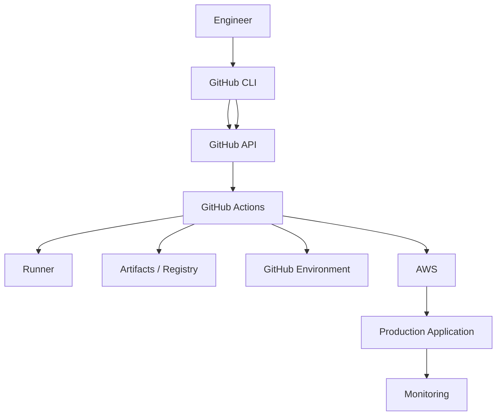

# README

## Overview

This section documents GitHub Actions operations through the GitHub CLI (`gh`).

The goal is not to learn GitHub CLI as a general-purpose GitHub administration tool. The focus is operational CI/CD work:

```text
Inspect
   ↓
Trigger
   ↓
Monitor
   ↓
Diagnose
   ↓
Rerun / Cancel
   ↓
Inspect Artifacts
   ↓
Manage Environments
   ↓
Manage Secrets / Variables
   ↓
Manage Releases
   ↓
Operate Production Safely
```

For a senior backend engineer, CLI knowledge becomes valuable when a GitHub Actions workflow is already part of a production system and fast operational feedback is required.

A typical production pipeline may look like:

```text
Pull Request
    ↓
Lint
    ↓
Unit Tests
    ↓
Integration Tests
    ↓
Security Scan
    ↓
Matrix Testing
    ↓
Build
    ↓
Docker Image
    ↓
Amazon ECR
    ↓
Staging
    ↓
Approval
    ↓
Production
    ↓
Monitoring
    ↓
Rollback
```

The CLI provides an operational interface around this pipeline without replacing the workflow architecture itself.

## Navigation

| # | File | Description |
|---|---|---|
| 01 | [01- GitHub CLI Basics](./01-%20GitHub%20CLI%20Basics.md) | GitHub CLI (`gh`) is the command-line interface for GitHub. For CI/CD engineering, it provides an operational interface for managing workflows, artifacts, environments, secrets, and releases. |
| 02 | [02- Workflow Inspection](./02-%20Workflow%20Inspection.md) | Workflow inspection is the process of examining GitHub Actions workflow definitions and their executions to understand what is happening inside a CI/CD system. |
| 03 | [03- Workflow Execution and Reruns](./03-%20Workflow%20Execution%20and%20Reruns.md) | GitHub Actions workflow execution is the operational lifecycle through which a workflow definition becomes a running CI/CD job on a GitHub Actions runner. |
| 04 | [04- Workflow Run Inspection](./04-%20Workflow%20Run%20Inspection.md) | Workflow run inspection is the operational process of examining a specific GitHub Actions execution to determine what happened, why it failed, and how to resolve it. |
| 05 | [05- Artifact Management](./05-%20Artifact%20Management.md) | Artifacts are persistent outputs produced by a GitHub Actions workflow and made available for later jobs, workflows, or manual download. |
| 06 | [06- Repository and Actions Management](./06-%20Repository%20and%20Actions%20Management.md) | GitHub CLI (`gh`) provides an operational interface for managing GitHub repositories and GitHub Actions without relying on the web UI. |
| 07 | [07- Secrets and Variables Management](./07-%20Secrets%20and%20Variables%20Management.md) | GitHub Actions separates configuration into secrets for sensitive values and variables for non-sensitive configuration accessible to workflow steps. |
| 08 | [08- Environment Management](./08-%20Environment%20Management.md) | GitHub Actions separates configuration into environments that provide controlled deployment boundaries, protection rules, and environment-scoped secrets. |
| 09 | [09- Release Management](./09-%20Release%20Management.md) | Release management is the process of turning validated source code into a controlled, traceable, deployable software release. |
| 10 | [10- Operational CLI Workflows](./10-%20Operational%20CLI%20Workflows.md) | GitHub CLI (`gh`) provides a practical command-line interface for operating GitHub Actions and the surrounding CI/CD infrastructure. |

---

## Scope

This section focuses on:

- GitHub Actions workflow operations.
- Workflow run inspection.
- Workflow execution.
- Workflow reruns and cancellation.
- Log retrieval.
- Artifact operations.
- Repository Actions operations.
- Secrets and variables.
- GitHub Environments.
- Release management.
- Operational CI/CD workflows.
- Incident investigation.
- Production deployment support.
- GitHub CLI automation.
- CLI security and least privilege.

It intentionally does not attempt to cover GitHub CLI comprehensively.

---

## Recommended Learning Path

The CLI material should be studied after understanding GitHub Actions fundamentals.

```text
GitHub Actions Fundamentals
        ↓
Workflow Configuration
        ↓
Jobs / Steps / Contexts
        ↓
Outputs / Artifacts / Caching
        ↓
Reusable Workflows
        ↓
Concurrency
        ↓
Security
        ↓
Deployment
        ↓
Runners / Operations
        ↓
Troubleshooting
        ↓
GitHub CLI
        ↓
Production Operations
```

The most important transition is from:

```text
"I know the command"
```

to:

```text
"I know when and why to use the command."
```

---

## CLI and GitHub Actions Architecture

GitHub CLI should be viewed as an operational interface around GitHub's control plane.



The important distinction is:

| Component | Responsibility |
|---|---|
| Git | Source control |
| GitHub CLI | Operational interface |
| GitHub API | GitHub control plane |
| GitHub Actions | CI/CD execution |
| Runner | Executes jobs |
| Artifact/Registry | Stores build outputs |
| Environment | Protects deployment targets |
| AWS | Runtime/infrastructure |
| Monitoring | Runtime health |

---

## Core Command Areas

| Area | Primary Commands |
|---|---|
| Authentication | `gh auth` |
| Repository | `gh repo` |
| Workflows | `gh workflow` |
| Workflow runs | `gh run` |
| Releases | `gh release` |
| Secrets | `gh secret` |
| Variables | `gh variable` |
| API access | `gh api` |

These commands cover most operational CI/CD workflows.

---

## Authentication

Check authentication:

```bash
gh auth status
```

Authenticate interactively:

```bash
gh auth login
```

Inside GitHub Actions, the workflow token can often be exposed to `gh` through:

```yaml
env:
  GH_TOKEN: ${{ github.token }}
```

Then:

```bash
gh run list
```

### Production Considerations

Authentication should follow least privilege.

Avoid:

- Hardcoded tokens.
- Tokens committed to repositories.
- Long-lived credentials where short-lived credentials are available.
- Printing authentication information.
- Sharing a highly privileged administrative token with CI jobs unnecessarily.

---

## Repository Operations

View repository information:

```bash
gh repo view OWNER/REPO
```

Clone:

```bash
gh repo clone OWNER/REPO
```

List repositories:

```bash
gh repo list OWNER
```

For CI/CD automation, explicitly specifying the repository is often safer:

```bash
gh run list \
  --repo OWNER/REPO
```

This avoids accidentally operating on the repository associated with the current working directory.

---

## Workflow Operations

List workflows:

```bash
gh workflow list
```

View a workflow:

```bash
gh workflow view ci.yml
```

Run a workflow:

```bash
gh workflow run deploy.yml \
  --ref main
```

The workflow must expose `workflow_dispatch` for manual execution.

---

## Workflow Runs

List recent runs:

```bash
gh run list
```

List runs for a workflow:

```bash
gh run list \
  --workflow ci.yml
```

List runs for a branch:

```bash
gh run list \
  --workflow ci.yml \
  --branch main
```

List failed runs:

```bash
gh run list \
  --workflow ci.yml \
  --status failure
```

This is the primary starting point for CI/CD operational investigation.

---

## Run Inspection

Inspect a specific run:

```bash
gh run view RUN_ID
```

A run provides information about:

- Commit.
- Branch.
- Status.
- Conclusion.
- Jobs.
- Steps.
- Execution timing.

A useful investigation pattern is:

```text
gh run list
    ↓
Identify RUN_ID
    ↓
gh run view RUN_ID
    ↓
Identify failed job
    ↓
Inspect logs
```

---

## Logs

View complete run logs:

```bash
gh run view RUN_ID --log
```

Logs should normally be inspected after identifying the relevant job rather than immediately dumping every log line.

The operational principle is:

```text
Run
 ↓
Job
 ↓
Step
 ↓
First meaningful error
```

Avoid focusing only on the final cascading failure.

---

## Watching Runs

Monitor an active run:

```bash
gh run watch RUN_ID
```

Useful for:

- Production deployments.
- Release workflows.
- Manual deployments.
- Long-running integration tests.

A production operator can therefore trigger and monitor a deployment without continuously refreshing the GitHub UI.

---

## Manual Workflow Execution

A workflow can define:

```yaml
on:
  workflow_dispatch:
    inputs:
      environment:
        required: true
        type: choice
        options:
          - staging
          - production
```

Trigger:

```bash
gh workflow run deploy.yml \
  --ref main \
  -f environment=staging
```

For multiple inputs:

```bash
gh workflow run deploy.yml \
  --ref main \
  -f environment=production \
  -f image_digest='sha256:...'
```

Manual inputs should always be validated inside the workflow.

---

## Rerunning Workflows

Rerun a workflow:

```bash
gh run rerun RUN_ID
```

Rerun only failed jobs:

```bash
gh run rerun RUN_ID --failed
```

Reruns are appropriate for potentially transient failures such as:

- Temporary runner failure.
- Transient network problems.
- Temporary external service failures.
- Known flaky infrastructure conditions.

A rerun is not a substitute for fixing deterministic failures.

---

## Cancelling Runs

Cancel a run:

```bash
gh run cancel RUN_ID
```

Typical reasons:

- Accidental workflow execution.
- Duplicate deployment.
- Stuck workflow.
- Unnecessary resource consumption.

Production cancellation requires caution because cancellation does not imply rollback.

```text
Cancel workflow
≠
Restore previous application state
```

---

## Artifacts

Download workflow artifacts:

```bash
gh run download RUN_ID
```

Download a specific artifact:

```bash
gh run download RUN_ID \
  -n test-reports
```

Download to a specific directory:

```bash
gh run download RUN_ID \
  -n release-artifacts \
  -D ./artifacts
```

Typical artifacts include:

- Test reports.
- Coverage reports.
- Debug logs.
- Screenshots.
- Build packages.
- SBOMs.
- Release metadata.

---

## Artifacts vs Caches

| Property | Artifacts | Caches |
|---|---|---|
| Primary purpose | Preserve outputs | Accelerate builds |
| Typical content | Reports, packages | Dependencies |
| Deployment source | Yes | No |
| Retention | Explicit retention policy | Eviction-based |
| Reproducibility | Expected | Not guaranteed |
| Rollback value | High | Low |

A production deployment should use an immutable artifact rather than a dependency cache.

---

## Secrets

List repository secrets:

```bash
gh secret list \
  --repo OWNER/REPO
```

Set a secret:

```bash
printf '%s' "$API_TOKEN" |
  gh secret set API_TOKEN \
  --repo OWNER/REPO
```

Environment-scoped secret:

```bash
printf '%s' "$PRODUCTION_TOKEN" |
  gh secret set PRODUCTION_TOKEN \
  --repo OWNER/REPO \
  --env production
```

Never print the secret value.

---

## Variables

List repository variables:

```bash
gh variable list \
  --repo OWNER/REPO
```

Set a repository variable:

```bash
gh variable set AWS_REGION \
  --body "eu-west-1" \
  --repo OWNER/REPO
```

Set an environment variable:

```bash
gh variable set ECS_CLUSTER \
  --body "orders-production" \
  --repo OWNER/REPO \
  --env production
```

Use variables for non-sensitive configuration.

Use secrets for sensitive values.

---

## Environments

List environments:

```bash
gh api \
  repos/OWNER/REPO/environments
```

Inspect production:

```bash
gh api \
  repos/OWNER/REPO/environments/production
```

Environment operations are particularly useful when diagnosing:

- Deployment approvals.
- Branch restrictions.
- Environment secrets.
- Environment variables.
- Deployment protection.

---

## Release Operations

List releases:

```bash
gh release list
```

Inspect a release:

```bash
gh release view v2.4.0
```

Create a release:

```bash
gh release create v2.4.0 \
  --generate-notes
```

Upload release assets:

```bash
gh release upload v2.4.0 \
  dist/orders-api.tar.gz
```

Download release assets:

```bash
gh release download v2.4.0
```

---

## Release vs Deployment

A GitHub Release and a production deployment are different concepts.

```text
Git Tag
   ↓
GitHub Release
   ↓
Artifact
   ↓
Staging
   ↓
Approval
   ↓
Production
```

This separation allows an artifact to exist independently from its deployment state.

It also makes rollback easier because the release can identify a known-good artifact.

---

## Structured CLI Output

Operational scripts should prefer structured output.

Example:

```bash
gh run list \
  --workflow ci.yml \
  --json databaseId,status,conclusion,headSha
```

Extract specific values:

```bash
gh run list \
  --workflow ci.yml \
  --json databaseId,status,conclusion \
  --jq '.[] | "\(.databaseId) \(.status) \(.conclusion)"'
```

Structured output is preferable to parsing human-readable command output.

---

## `gh api`

`gh api` provides access to GitHub API endpoints that do not have dedicated high-level CLI commands.

Example:

```bash
gh api \
  repos/OWNER/REPO/actions/permissions
```

Environment information:

```bash
gh api \
  repos/OWNER/REPO/environments
```

Specific environment:

```bash
gh api \
  repos/OWNER/REPO/environments/production
```

Use API calls when the required operational information is not exposed directly through a higher-level command.

---

## CI/CD Troubleshooting Workflow

A consistent CLI troubleshooting model is:

```text
Symptom
   ↓
Possible Causes
   ↓
Isolation Strategy
   ↓
Commands / Checks
   ↓
Root Cause
   ↓
Corrective Action
   ↓
Prevention
```

Typical commands:

```bash
gh run list
gh run view RUN_ID
gh run view RUN_ID --log
gh run download RUN_ID
gh workflow view WORKFLOW
```

---

## Common Failure Domains

### Workflow Failure

```bash
gh run view RUN_ID
```

Determine whether the problem is in:

- Workflow configuration.
- Job.
- Step.
- Action.
- Runner.

### Trigger Failure

Check:

```bash
gh workflow list
gh workflow view ci.yml
```

Investigate:

- Event.
- Branch filter.
- Path filter.
- Tag filter.
- Workflow state.

### Permission Failure

Inspect:

```bash
gh api \
  repos/OWNER/REPO/actions/permissions
```

Then inspect workflow-level and job-level permissions.

### Artifact Failure

Inspect:

```bash
gh run view RUN_ID
gh run download RUN_ID
```

Verify artifact name, retention, producing run, and artifact identity.

### Environment Failure

Inspect:

```bash
gh api \
  repos/OWNER/REPO/environments/production
```

### OIDC / AWS Failure

Inspect the workflow logs:

```bash
gh run view RUN_ID --log
```

Then verify AWS identity:

```bash
aws sts get-caller-identity
```

---

## Production Deployment Operations

A production deployment should normally follow:

```text
Trigger
   ↓
Workflow validation
   ↓
Immutable artifact selection
   ↓
Environment protection
   ↓
Approval
   ↓
Deployment
   ↓
Health validation
   ↓
Monitoring
```

CLI can operate the workflow:

```bash
gh workflow run deploy.yml \
  --ref main \
  -f environment=production \
  -f image_digest='sha256:...'
```

The workflow remains responsible for:

- Authorization.
- Environment protection.
- Artifact validation.
- Deployment logic.
- Concurrency.
- Health checks.
- Rollback.

---

## Build Once, Promote Many

A production CI/CD system should preferably use:

```text
Build
 ↓
Immutable artifact
 ↓
Staging
 ↓
Production
```

rather than:

```text
Build for staging
 ↓
Build again for production
```

CLI operations should therefore identify the artifact explicitly.

For Docker:

```text
Image
 ↓
Digest
 ↓
ECR
 ↓
Staging
 ↓
Production
```

The digest is the immutable deployment identity.

---

## Concurrency

CLI-triggered deployments can still race.

For example:

```bash
gh workflow run deploy.yml -f environment=production
```

run twice can produce:

```text
Deployment A
Deployment B
```

The workflow should enforce concurrency:

```yaml
concurrency:
  group: production
  cancel-in-progress: false
```

CLI should not be the only mechanism preventing deployment races.

---

## Rollback Operations

A rollback should identify a known-good artifact.

```text
Incident
   ↓
Identify known-good release
   ↓
Identify immutable artifact
   ↓
Trigger deployment
   ↓
Production approval
   ↓
Health validation
   ↓
Monitor
```

Inspect releases:

```bash
gh release list
```

Inspect the release:

```bash
gh release view v2.3.2
```

Trigger deployment using the known-good artifact:

```bash
gh workflow run deploy.yml \
  --ref main \
  -f environment=production \
  -f image_digest='sha256:KNOWN_GOOD'
```

---

## Incident Investigation

A production incident should establish:

```text
Current release
      ↓
Commit
      ↓
Workflow run
      ↓
Artifact
      ↓
Deployment
      ↓
Runtime
```

Useful commands:

```bash
gh release list

gh run list \
  --workflow deploy.yml \
  --branch main

gh run view RUN_ID

gh run view RUN_ID --log
```

For AWS:

```bash
aws sts get-caller-identity
```

The objective is to reconstruct the deployment chain rather than simply find a failed command.

---

## CI Health Inspection

A lightweight CI health check:

```bash
gh run list \
  --workflow ci.yml \
  --branch main \
  --limit 10 \
  --json databaseId,status,conclusion,headSha,createdAt
```

This can identify:

- Recent failures.
- Repeated failures.
- Stuck runs.
- Recent successful commits.
- Potential CI regressions.

---

## Release Investigation

A release investigation can follow:

```text
Release
   ↓
Commit
   ↓
Workflow Run
   ↓
Build Artifact
   ↓
Image Digest
   ↓
Deployment
```

Commands:

```bash
gh release view v2.4.0

gh run list \
  --workflow deploy.yml \
  --branch main

gh run view RUN_ID
```

This provides traceability across the CI/CD lifecycle.

---

## Operational Security

The CLI can perform high-impact operations:

```text
Cancel
Rerun
Deploy
Create Release
Modify Secrets
Modify Variables
Inspect Environments
```

Therefore:

- Use least-privilege credentials.
- Validate all user-controlled inputs.
- Never expose secrets in logs.
- Avoid embedding tokens in scripts.
- Use explicit repository and environment values.
- Protect production with GitHub Environments.
- Use OIDC for AWS authentication where appropriate.
- Keep deployment authorization inside the workflow.

---

## Untrusted Input

GitHub data can be attacker-controlled.

Examples:

- Pull request titles.
- Branch names.
- Commit messages.
- Issue content.
- Manual workflow inputs.

Avoid:

```yaml
run: echo "${{ github.event.pull_request.title }}"
```

Prefer passing data through environment variables:

```yaml
env:
  PR_TITLE: ${{ github.event.pull_request.title }}

run: |
  printf '%s\n' "$PR_TITLE"
```

The same principle applies to shell scripts that consume `gh` output.

Do not transform untrusted data into executable shell code.

---

## Operational Automation

A small deployment wrapper can standardize safe CLI operations:

```bash
#!/usr/bin/env bash

set -euo pipefail

REPO="acme/orders-api"
WORKFLOW="deploy.yml"
ENVIRONMENT="${1:?environment required}"
IMAGE_DIGEST="${2:?image digest required}"

case "$ENVIRONMENT" in
  staging|production)
    ;;
  *)
    echo "Invalid environment: $ENVIRONMENT" >&2
    exit 1
    ;;
esac

gh workflow run "$WORKFLOW" \
  --repo "$REPO" \
  --ref main \
  -f environment="$ENVIRONMENT" \
  -f image_digest="$IMAGE_DIGEST"
```

The wrapper validates inputs but does not bypass the deployment workflow's security controls.

---

## Operational Python Automation

For more complex automation, Python can invoke `gh`:

```python
import subprocess


def run_gh(*args: str) -> str:
    result = subprocess.run(
        ["gh", *args],
        check=True,
        capture_output=True,
        text=True,
    )
    return result.stdout


output = run_gh(
    "run",
    "list",
    "--workflow",
    "ci.yml",
    "--json",
    "databaseId,status,conclusion",
)

print(output)
```

Use argument arrays rather than constructing shell commands from strings.

This avoids unnecessary shell interpretation.

---

## Runner Operations

GitHub CLI helps identify workflow-side runner problems.

Inspect the run:

```bash
gh run view RUN_ID
```

Possible runner-related causes include:

- Runner unavailable.
- Label mismatch.
- Runner group restriction.
- Capacity exhaustion.
- Private network failure.
- Self-hosted runner failure.

Runner infrastructure itself must be managed separately.

For production systems, consider:

```text
Ephemeral runners
+
Runner groups
+
Labels
+
Autoscaling
+
Private network controls
```

---

## Artifact Operations and Rollback

Artifacts should have clear ownership and retention policies.

```text
PR artifacts
 → Short retention

Release artifacts
 → Longer retention

Production rollback artifacts
 → Retain according to recovery requirements
```

Do not delete an artifact required to satisfy the production rollback strategy.

---

## Cost Optimization

CLI can help identify waste through workflow history.

```bash
gh run list \
  --workflow ci.yml \
  --limit 50
```

Look for:

- Frequent reruns.
- Duplicate workflows.
- Excessive matrix combinations.
- Long-running tests.
- Repeated failed deployments.

Cost optimization should not simply reduce CI coverage.

Optimize:

```text
Execution time
+
Parallelism
+
Caching
+
Matrix size
+
Runner capacity
```

while maintaining required reliability.

---

## High Availability and Disaster Recovery

GitHub CLI itself is not the disaster recovery system.

CI/CD recovery should account for:

- Source availability.
- Workflow availability.
- Artifact availability.
- Registry availability.
- AWS infrastructure availability.
- Runner availability.
- Deployment history.
- Rollback artifacts.

A recovery process should preserve enough information to reconstruct:

```text
What was deployed?
When?
From which commit?
Using which artifact?
To which environment?
```

---

## CLI Operational Reference

| Operation | Command |
|---|---|
| Check authentication | `gh auth status` |
| List workflows | `gh workflow list` |
| View workflow | `gh workflow view WORKFLOW` |
| Trigger workflow | `gh workflow run WORKFLOW` |
| List runs | `gh run list` |
| Inspect run | `gh run view RUN_ID` |
| View logs | `gh run view RUN_ID --log` |
| Watch run | `gh run watch RUN_ID` |
| Rerun run | `gh run rerun RUN_ID` |
| Rerun failures | `gh run rerun RUN_ID --failed` |
| Cancel run | `gh run cancel RUN_ID` |
| Download artifacts | `gh run download RUN_ID` |
| List secrets | `gh secret list` |
| Set secret | `gh secret set NAME` |
| List variables | `gh variable list` |
| Set variable | `gh variable set NAME` |
| List releases | `gh release list` |
| View release | `gh release view TAG` |
| Create release | `gh release create TAG` |
| Download release | `gh release download TAG` |
| API access | `gh api ENDPOINT` |

---

## Production Command Sequences

### Inspect Failed CI

```bash
gh run list \
  --workflow ci.yml \
  --status failure \
  --limit 5

gh run view RUN_ID

gh run view RUN_ID --log

gh run download RUN_ID
```

### Trigger and Monitor Deployment

```bash
gh workflow run deploy.yml \
  --ref main \
  -f environment=staging
```

Then:

```bash
gh run list \
  --workflow deploy.yml \
  --branch main \
  --limit 1
```

Then:

```bash
gh run watch RUN_ID
```

### Inspect Production

```bash
gh run list \
  --workflow deploy.yml \
  --branch main \
  --limit 10
```

```bash
gh api \
  repos/OWNER/REPO/environments/production
```

### Inspect Release

```bash
gh release list

gh release view v2.4.0
```

---

## Recommended Operational Patterns

### Read Before Write

Prefer:

```text
List
 ↓
Inspect
 ↓
Validate
 ↓
Modify
```

rather than immediately executing a production operation.

### Use Explicit Targets

Prefer:

```bash
--repo OWNER/REPO
```

and explicit:

```text
workflow
branch
environment
artifact
```

### Use Immutable Identity

Prefer:

```text
commit SHA
image digest
release tag
```

over mutable references such as:

```text
latest
```

### Preserve Auditability

Record:

```text
Run ID
Commit SHA
Release
Artifact digest
Environment
Operator
Timestamp
```

### Keep Policy in GitHub Actions

CLI should trigger and inspect the controlled process rather than becoming an independent deployment engine.

---

## Interview Preparation

The CLI section should be evaluated through production scenarios rather than command memorization.

### Scenario: Production Deployment Runs Twice

Explain:

- How you identify both runs.
- How you inspect their states.
- How you safely stop one.
- How workflow concurrency prevents recurrence.

Useful commands:

```bash
gh run list --workflow deploy.yml
gh run view RUN_ID
gh run cancel RUN_ID
```

---

### Scenario: CI Fails During Integration Tests

Explain how you would determine whether the failure comes from:

- Python application.
- PostgreSQL.
- Redis.
- Network.
- Service readiness.
- Runner.
- Test isolation.

Use:

```bash
gh run view RUN_ID --log
gh run download RUN_ID
```

---

### Scenario: AWS Authentication Fails

Reason through:

```text
GitHub permission
 ↓
OIDC token
 ↓
IAM trust policy
 ↓
STS
 ↓
IAM permissions
 ↓
AWS service
```

Use:

```bash
gh run view RUN_ID --log
aws sts get-caller-identity
```

---

### Scenario: Production Needs Rollback

Explain:

```text
Incident
 ↓
Known-good release
 ↓
Immutable artifact
 ↓
Deployment workflow
 ↓
Production approval
 ↓
Health validation
```

CLI:

```bash
gh release list
gh release view TAG
gh workflow run deploy.yml ...
```

---

### Scenario: Docker Image Must Not Be Rebuilt

The expected architecture is:

```text
Build
 ↓
Image
 ↓
ECR
 ↓
Digest
 ↓
Staging
 ↓
Approval
 ↓
Production
```

The CLI should help identify the correct workflow and artifact rather than initiate a second build.

---

### Scenario: Self-Hosted Runner Cannot Execute a Job

Investigate:

```text
Workflow
 ↓
Runner label
 ↓
Runner group
 ↓
Runner availability
 ↓
Network
 ↓
Capacity
```

Start with:

```bash
gh run view RUN_ID
```

Then investigate the runner infrastructure.

---

## Senior Design Principles

A senior backend engineer should treat GitHub CLI as part of the operational control plane.

The important design principles are:

```text
Explicit targets
+
Least privilege
+
Structured output
+
Immutable artifacts
+
Idempotent operations
+
Concurrency protection
+
Environment protection
+
Auditability
+
Controlled rollback
+
Runtime validation
```

The CLI is most useful when these principles already exist in the CI/CD architecture.

---

## Completion Criteria

After completing this section, the engineer should be able to:

- Authenticate GitHub CLI securely.
- List and inspect GitHub Actions workflows.
- Identify and inspect workflow runs.
- Retrieve workflow logs.
- Watch active workflows.
- Trigger manual workflows.
- Rerun appropriate failures.
- Cancel workflows safely.
- Download artifacts.
- Manage repository and environment secrets.
- Manage variables.
- Inspect environments.
- Create and inspect releases.
- Use `gh api` for operational information.
- Investigate CI/CD failures systematically.
- Support production deployment operations.
- Trace releases to workflow runs and artifacts.
- Operate rollback workflows using immutable artifacts.
- Integrate GitHub CLI into safe operational scripts.
- Explain CLI operations in senior-level CI/CD interviews.

## Key Takeaways

- **GitHub CLI should be treated as an operational interface around GitHub Actions, not as a replacement for the CI/CD architecture.**
- **The core operational flow is inspect → diagnose → validate → operate, using structured output and explicit repository, workflow, environment, and artifact identities.**
- **Production deployments should remain protected by workflow concurrency, GitHub Environments, approvals, least-privilege permissions, immutable artifacts, and controlled rollback.**
- **Secrets, untrusted GitHub data, OIDC credentials, self-hosted runners, and production operations require the same security discipline through CLI automation as through YAML workflows.**
- **Senior-level CLI proficiency means using commands to reason across workflows, runners, artifacts, releases, environments, AWS, failures, and production recovery—not memorizing commands in isolation.**