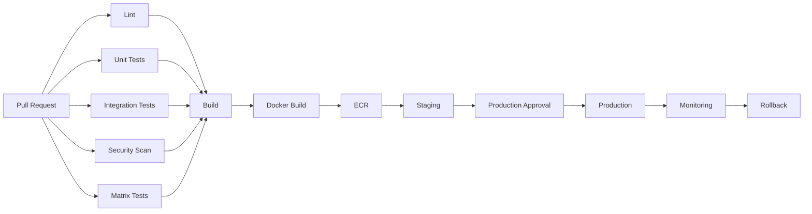
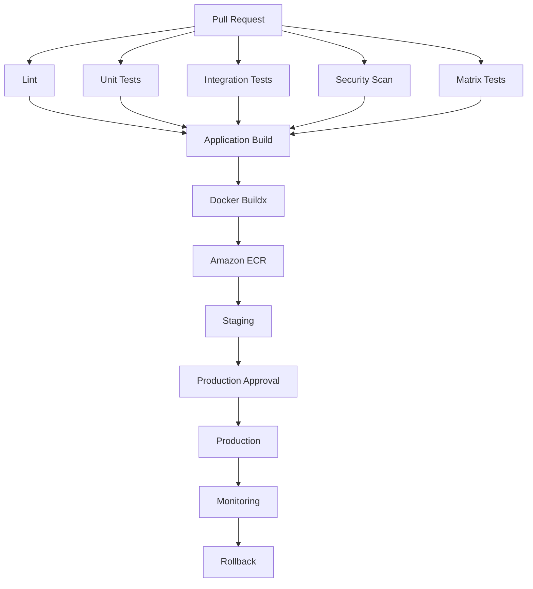

# 01- Core GitHub Actions Questions

## Overview

This document provides interview questions and senior-level answers covering the core GitHub Actions concepts required for backend engineering and production CI/CD.

The focus is not memorizing YAML syntax. Interview discussions should demonstrate that you understand:

```text
Workflow Architecture
        ↓
Execution Model
        ↓
Triggers
        ↓
Jobs / Steps / Runners
        ↓
Contexts / Expressions
        ↓
Artifacts / Caching / Outputs
        ↓
Security
        ↓
Deployment
        ↓
Reliability / Operations
```

The questions progress from foundational GitHub Actions concepts to production-oriented engineering scenarios.

---

## GitHub Actions Fundamentals

### What is GitHub Actions?

GitHub Actions is a CI/CD and workflow automation platform integrated with GitHub repositories.

It allows repository events or external triggers to execute workflows composed of jobs and steps on runners.

A simplified execution model is:

```text
GitHub Event
     ↓
Workflow
     ↓
Job
     ↓
Steps
     ↓
Actions / Commands
     ↓
Runner
```

Typical backend use cases include:

- Linting Python code.
- Running pytest.
- Testing Django or FastAPI applications.
- Running PostgreSQL and Redis integration tests.
- Building Docker images.
- Publishing images to Amazon ECR.
- Deploying to ECS, EC2, Lambda, or Kubernetes.
- Running security scans.
- Creating releases.

---

### What is CI/CD?

**Continuous Integration (CI)** validates changes continuously.

Typical CI stages:

```text
Pull Request
    ↓
Lint
    ↓
Unit Tests
    ↓
Integration Tests
    ↓
Security Scan
    ↓
Build
```

**Continuous Delivery/Deployment (CD)** moves validated artifacts toward runtime environments.

```text
Build
 ↓
Immutable Artifact
 ↓
Staging
 ↓
Approval
 ↓
Production
 ↓
Monitoring
```

A strong production architecture separates validation from deployment while maintaining a clear artifact identity.

---

### What are the main components of GitHub Actions?

The core components are:

| Component | Purpose |
|---|---|
| Workflow | Defines an automation process |
| Job | Groups steps executed on a runner |
| Step | Individual execution unit |
| Action | Reusable packaged automation |
| Runner | Machine executing a job |
| Event | Trigger that starts a workflow |

The relationship is:

```text
Workflow
 ├── Job
 │    ├── Step
 │    │    └── Action / Shell command
 │    └── Step
 │
 └── Job
      └── Step
```

---

### What is a workflow?

A workflow is a YAML-defined automation process stored under:

```text
.github/workflows/
```

Example:

```yaml
name: CI

on:
  pull_request:

jobs:
  test:
    runs-on: ubuntu-latest

    steps:
      - uses: actions/checkout@v4

      - name: Set up Python
        uses: actions/setup-python@v5
        with:
          python-version: "3.12"

      - name: Install dependencies
        run: pip install -r requirements.txt

      - name: Run tests
        run: pytest
```

A workflow can contain multiple jobs with dependencies, conditions, matrices, environments, permissions, and concurrency rules.

---

### What is a job?

A job is a collection of steps executed on a runner.

Example:

```yaml
jobs:
  unit-tests:
    runs-on: ubuntu-latest

    steps:
      - uses: actions/checkout@v4

      - run: pip install -r requirements.txt

      - run: pytest
```

Jobs are independent by default.

Use `needs` to create dependencies:

```yaml
jobs:
  build:
    runs-on: ubuntu-latest

  deploy:
    needs: build
    runs-on: ubuntu-latest
```

The second job will not run until the required dependency completes successfully unless its condition explicitly changes that behavior.

---

### What is a step?

A step is an individual operation within a job.

It can execute:

- A shell command.
- A JavaScript action.
- A composite action.
- A Docker action.

Example:

```yaml
steps:
  - uses: actions/checkout@v4

  - name: Install dependencies
    run: pip install -r requirements.txt

  - name: Run tests
    run: pytest
```

Steps in the same job share the runner environment and workspace.

---

### What is an action?

An action is reusable automation packaged for GitHub Actions.

Examples include:

```yaml
- uses: actions/checkout@v4
```

```yaml
- uses: actions/setup-python@v5
```

Actions can be:

- Marketplace actions.
- Internal actions.
- Private actions.
- Composite actions.
- JavaScript actions.
- Docker actions.

An action packages implementation details so workflows can reuse functionality without duplicating steps.

---

### What is a runner?

A runner is the execution environment where a job runs.

Common options include:

```yaml
runs-on: ubuntu-latest
```

or:

```yaml
runs-on: self-hosted
```

A runner provides:

- CPU.
- Memory.
- Filesystem.
- Operating system.
- Network connectivity.
- Toolchain.

The runner executes the workflow steps.

---

### GitHub-hosted vs self-hosted runners

| Characteristic | GitHub-hosted | Self-hosted |
|---|---|---|
| Infrastructure management | GitHub | Organization |
| Maintenance | Lower | Higher |
| Custom software | Limited to image/tooling | Full control |
| Private network access | Limited by architecture | Strong fit |
| Isolation | Managed | Must be designed |
| Scaling | Managed | Organization responsibility |
| Security responsibility | Lower | Higher |

Self-hosted runners are useful when workloads require private network access, custom infrastructure, or specialized tooling.

They also increase the security responsibility of the platform team.

---

## Workflow Execution Model

### How does a GitHub Actions workflow execute?

A simplified lifecycle is:

```text
Event
 ↓
Workflow selected
 ↓
Jobs evaluated
 ↓
Runner assigned
 ↓
Job environment initialized
 ↓
Steps executed
 ↓
Outputs/artifacts generated
 ↓
Job completes
 ↓
Dependent jobs become eligible
```

For example:

```text
Pull Request
      ↓
CI Workflow
      ↓
 ┌─────────────┐
 │ lint        │
 └─────────────┘
      ↓
 ┌─────────────┐
 │ unit tests  │
 └─────────────┘
      ↓
 ┌─────────────┐
 │ integration │
 └─────────────┘
      ↓
 ┌─────────────┐
 │ build       │
 └─────────────┘
```

---

### Are jobs executed sequentially?

No.

Independent jobs can execute in parallel.

```yaml
jobs:
  lint:
    runs-on: ubuntu-latest

  unit-tests:
    runs-on: ubuntu-latest

  security:
    runs-on: ubuntu-latest
```

These jobs can run concurrently.

Use `needs` when ordering is required:

```yaml
jobs:
  build:
    runs-on: ubuntu-latest

  deploy:
    needs: build
    runs-on: ubuntu-latest
```

The ability to model dependency graphs is important for CI performance.

---

### How does `needs` work?

`needs` establishes job dependencies.

```yaml
jobs:
  test:
    runs-on: ubuntu-latest

  build:
    needs: test
    runs-on: ubuntu-latest
```

The dependency graph becomes:

```text
test
 ↓
build
```

For multiple dependencies:

```yaml
deploy:
  needs:
    - unit-tests
    - integration-tests
    - security
```

The deployment waits for all required jobs to satisfy their dependency conditions.

---

## Workflow Triggers

### What is `on` in GitHub Actions?

`on` defines the events that can trigger a workflow.

Example:

```yaml
on:
  push:
    branches:
      - main
```

The workflow runs when changes are pushed to `main`.

---

### What is the difference between `push` and `pull_request`?

`push` executes when commits are pushed.

```yaml
on:
  push:
    branches:
      - main
```

`pull_request` executes in response to pull request activity.

```yaml
on:
  pull_request:
    branches:
      - main
```

Typical architecture:

```text
Pull Request
 → CI validation

Push to main
 → Build / Release / Deployment
```

---

### What is `workflow_dispatch`?

`workflow_dispatch` enables manual workflow execution.

```yaml
on:
  workflow_dispatch:
```

It is useful for:

- Manual deployments.
- Rollbacks.
- Operational tasks.
- Controlled administrative workflows.

Inputs can be provided:

```yaml
on:
  workflow_dispatch:
    inputs:
      environment:
        required: true
        type: choice
        options:
          - staging
          - production
```

---

### What is `schedule`?

`schedule` runs workflows according to a cron expression.

Example:

```yaml
on:
  schedule:
    - cron: "0 2 * * *"
```

Typical use cases:

- Scheduled security scans.
- Dependency maintenance.
- Periodic integration tests.
- Operational reports.

Scheduled workflows should be designed with failure handling because no developer may be actively watching them.

---

### What is `workflow_call`?

`workflow_call` allows a workflow to be reused by another workflow.

Example:

```yaml
on:
  workflow_call:
    inputs:
      environment:
        required: true
        type: string
```

It is useful for:

- Shared CI pipelines.
- Shared deployment workflows.
- Organization-wide standards.

Reusable workflows can orchestrate multiple jobs.

---

### What is `workflow_run`?

`workflow_run` allows one workflow to respond to another workflow's execution.

Conceptually:

```text
CI Workflow
    ↓
workflow_run
    ↓
Deployment / Reporting Workflow
```

It can be useful for separating workflow responsibilities, but security boundaries must be carefully evaluated when privileged workflows consume data from less-trusted workflows.

---

### What is `repository_dispatch`?

`repository_dispatch` allows an external system or workflow to trigger a repository workflow through a repository dispatch event.

It is useful when an external platform needs to initiate CI/CD behavior.

For example:

```text
External System
      ↓
repository_dispatch
      ↓
GitHub Actions
      ↓
Deployment
```

Inputs should be validated because externally supplied data can be untrusted.

---

### What is the `release` event?

A workflow can respond to GitHub release events:

```yaml
on:
  release:
    types:
      - published
```

This is useful for release-driven automation.

A mature release architecture can use:

```text
Git tag
 ↓
Release
 ↓
Artifact
 ↓
Deployment
```

---

## Branch and Path Filters

### Why use branch filters?

Branch filters prevent unnecessary workflow executions.

```yaml
on:
  push:
    branches:
      - main
      - develop
```

For deployment workflows, branch restrictions can provide an additional control boundary.

---

### Why use path filters?

Path filters are useful in monorepos.

```yaml
on:
  pull_request:
    paths:
      - "services/orders/**"
```

A change outside the service does not necessarily need to execute that service's complete pipeline.

However, path-based optimization should not accidentally skip shared dependency validation.

---

### What is the risk of excessive filtering?

A workflow may silently stop running for changes that actually affect it.

For example:

```text
services/orders/
shared/
infrastructure/
```

If the workflow only watches:

```text
services/orders/**
```

a change in:

```text
shared/
```

could bypass required validation.

Senior engineers should treat change detection as part of correctness, not just optimization.

---

## Expressions and Contexts

### What are GitHub Actions expressions?

Expressions allow workflow values to be evaluated dynamically.

Syntax:

```yaml
${{ ... }}
```

Example:

```yaml
if: ${{ github.ref == 'refs/heads/main' }}
```

Expressions are used for:

- Conditions.
- Dynamic configuration.
- Context access.
- Matrix generation.
- Outputs.
- Environment values.

---

### What is the difference between expressions and shell commands?

This is a common interview topic.

GitHub expression:

```yaml
if: ${{ github.ref == 'refs/heads/main' }}
```

Shell command:

```yaml
run: echo "$BRANCH"
```

The expression is evaluated by GitHub Actions.

The shell command is executed by the runner's shell.

Conceptually:

```text
Workflow processing
      ↓
Expression evaluation
      ↓
Runner
      ↓
Shell execution
```

Confusing these layers can produce unexpected behavior and security issues.

---

### What are contexts?

Contexts expose runtime information to workflows.

Important contexts include:

| Context | Purpose |
|---|---|
| `github` | Repository/event metadata |
| `env` | Environment variables |
| `vars` | Configuration variables |
| `secrets` | Secrets |
| `steps` | Step outputs/status |
| `needs` | Dependency job outputs/status |
| `job` | Current job information |
| `runner` | Runner information |
| `matrix` | Current matrix values |
| `strategy` | Matrix strategy |
| `inputs` | Workflow/action inputs |

Example:

```yaml
run: echo "${{ github.sha }}"
```

---

### What is the `github` context?

It provides information about the workflow execution and GitHub event.

Examples:

```yaml
${{ github.repository }}
```

```yaml
${{ github.sha }}
```

```yaml
${{ github.ref }}
```

```yaml
${{ github.actor }}
```

Be careful when using event-derived values because some can be controlled by users.

---

### What is the `needs` context?

`needs` provides information from dependent jobs.

Example:

```yaml
jobs:
  build:
    runs-on: ubuntu-latest
    outputs:
      image: ${{ steps.meta.outputs.image }}

    steps:
      - id: meta
        run: echo "image=orders:abc123" >> "$GITHUB_OUTPUT"

  deploy:
    needs: build
    runs-on: ubuntu-latest

    steps:
      - run: echo "${{ needs.build.outputs.image }}"
```

This allows data to move between jobs.

---

## Conditional Execution

### What does `if` do?

`if` controls whether a job or step runs.

Example:

```yaml
if: ${{ github.ref == 'refs/heads/main' }}
```

Step-level:

```yaml
- name: Deploy
  if: ${{ github.ref == 'refs/heads/main' }}
  run: ./deploy.sh
```

Job-level:

```yaml
deploy:
  if: ${{ github.ref == 'refs/heads/main' }}
```

---

### What does `success()` mean?

`success()` evaluates whether the preceding relevant execution state is successful.

Example:

```yaml
- name: Publish
  if: ${{ success() }}
  run: ./publish.sh
```

It is commonly used to make success-dependent operations explicit.

---

### What does `failure()` mean?

`failure()` allows a step or job to execute when an earlier dependency has failed.

Example:

```yaml
- name: Collect diagnostics
  if: ${{ failure() }}
  run: ./collect-diagnostics.sh
```

This is useful for debugging artifacts.

---

### What does `always()` mean?

`always()` allows a step to run regardless of the success or failure state of previous steps.

Example:

```yaml
- name: Upload test reports
  if: ${{ always() }}
  uses: actions/upload-artifact@v4
```

It should be used carefully.

An `always()` step can run even when cancellation or failure makes the intended operation unsafe.

---

### What does `cancelled()` mean?

`cancelled()` identifies cancellation state.

For example:

```yaml
if: ${{ cancelled() }}
```

This can be useful when cleanup or reporting logic needs to distinguish cancellation from ordinary failure.

A senior engineer should understand that cancellation can interact with job dependencies and status functions, so `always()` should not automatically be used for every cleanup operation.

---

### What is `continue-on-error`?

It allows a step or job to fail without necessarily causing the overall workflow to fail in the normal way.

Example:

```yaml
- name: Experimental check
  continue-on-error: true
  run: ./experimental-check.sh
```

Use it carefully.

Overusing it can turn real failures into apparent successes.

---

## Environment Variables, Variables, and Secrets

### What is `env`?

`env` defines environment variables.

Workflow-level:

```yaml
env:
  APP_ENV: test
```

Job-level:

```yaml
jobs:
  test:
    env:
      APP_ENV: test
```

Step-level:

```yaml
- name: Test
  env:
    APP_ENV: test
  run: pytest
```

Scope determines where the value is available.

---

### What is the `vars` context?

`vars` exposes GitHub configuration variables.

Example:

```yaml
env:
  AWS_REGION: ${{ vars.AWS_REGION }}
```

Variables are appropriate for non-sensitive configuration.

---

### What is the difference between variables and secrets?

| Feature | Variables | Secrets |
|---|---|---|
| Sensitive values | No | Yes |
| Configuration | Yes | Sometimes |
| Masking | Not intended as secret protection | Supported masking |
| Example | AWS region | API token |

Never put passwords or access keys in ordinary variables.

---

### What are secrets?

Secrets provide protected sensitive values.

Typical scopes include:

- Repository.
- Organization.
- Environment.

Example:

```yaml
env:
  DATABASE_PASSWORD: ${{ secrets.DATABASE_PASSWORD }}
```

Secrets should be scoped to the smallest appropriate boundary.

---

### What is `secrets: inherit`?

Reusable workflows can receive secrets from the caller using:

```yaml
secrets: inherit
```

This can reduce configuration duplication but increases the amount of secret material available to the called workflow.

Use it only when the called workflow is trusted and actually requires those secrets.

---

## Matrices

### What is a matrix strategy?

A matrix allows a job to run across multiple combinations of parameters.

Example:

```yaml
strategy:
  matrix:
    python-version:
      - "3.11"
      - "3.12"
      - "3.13"
```

This creates separate job executions.

---

### Why use matrices?

Matrices are useful for compatibility testing.

Example:

```text
Python 3.11
Python 3.12
Python 3.13
```

or:

```text
Python × PostgreSQL
Python × MySQL
```

They provide broader coverage without duplicating workflow definitions.

---

### What is `fail-fast`?

`fail-fast` controls whether in-progress matrix jobs are cancelled when a matrix job fails.

Example:

```yaml
strategy:
  fail-fast: false
```

This can be useful when you want complete compatibility information across all matrix combinations.

---

### What is `max-parallel`?

It limits how many matrix jobs can execute concurrently.

```yaml
strategy:
  max-parallel: 2
```

This can protect:

- Runner capacity.
- Database capacity.
- API rate limits.
- Cost.

---

### What are `include` and `exclude`?

`exclude` removes combinations:

```yaml
matrix:
  python:
    - "3.11"
    - "3.12"
  database:
    - postgres
    - mysql

  exclude:
    - python: "3.11"
      database: mysql
```

`include` adds or enriches combinations.

These features are useful for expressing compatibility constraints without duplicating jobs.

---

### What is a dynamic matrix?

A planning job can generate JSON:

```yaml
jobs:
  plan:
    runs-on: ubuntu-latest
    outputs:
      matrix: ${{ steps.matrix.outputs.matrix }}

    steps:
      - id: matrix
        run: |
          echo 'matrix={"service":["orders","payments"]}' >> "$GITHUB_OUTPUT"

  test:
    needs: plan
    strategy:
      matrix: ${{ fromJSON(needs.plan.outputs.matrix) }}
    runs-on: ubuntu-latest
```

This pattern is useful for monorepos and selective testing.

---

## Outputs

### How do steps communicate values?

Modern GitHub Actions uses `GITHUB_OUTPUT`.

```yaml
- id: version
  run: |
    echo "version=1.2.3" >> "$GITHUB_OUTPUT"

- run: echo "${{ steps.version.outputs.version }}"
```

---

### How do jobs communicate values?

Expose a step output as a job output:

```yaml
jobs:
  build:
    runs-on: ubuntu-latest

    outputs:
      version: ${{ steps.version.outputs.version }}

    steps:
      - id: version
        run: echo "version=1.2.3" >> "$GITHUB_OUTPUT"

  deploy:
    needs: build
    runs-on: ubuntu-latest

    steps:
      - run: echo "${{ needs.build.outputs.version }}"
```

This is useful for passing:

- Version.
- Image tag.
- Image digest.
- Environment metadata.
- Dynamic matrix configuration.

---

## Artifacts vs Outputs

Outputs are intended for small values used in workflow execution.

Artifacts are intended for files.

```text
Output
 → image digest
 → version
 → matrix JSON

Artifact
 → test report
 → package
 → SBOM
 → debug logs
```

Do not use artifacts when a small structured output is sufficient.

Do not try to move large files through job outputs.

---

## Caching

### Why use caching?

Caching reduces repeated dependency downloads and build work.

Python example:

```yaml
- uses: actions/setup-python@v5
  with:
    python-version: "3.12"
    cache: pip
```

Caching can improve:

- Build speed.
- CI throughput.
- Network usage.
- Cost.

---

### What makes a good cache key?

A cache should change when its underlying dependencies change.

For example:

```text
Python version
+
OS
+
Dependency lock file
```

The dependency file should participate in the cache identity.

---

### What is `hashFiles()`?

`hashFiles()` can generate a value based on matching files.

Example:

```yaml
key: ${{ runner.os }}-pip-${{ hashFiles('**/requirements*.txt') }}
```

This allows dependency changes to invalidate the cache.

---

## GitHub Actions Communication Mechanisms

Modern workflows commonly use:

```text
$GITHUB_ENV
$GITHUB_OUTPUT
$GITHUB_PATH
```

### `GITHUB_ENV`

Persist environment variables for later steps in the same job.

```yaml
- run: echo "APP_ENV=test" >> "$GITHUB_ENV"
```

### `GITHUB_OUTPUT`

Create step outputs:

```yaml
- id: build
  run: echo "image=orders:abc123" >> "$GITHUB_OUTPUT"
```

### `GITHUB_PATH`

Add executable paths:

```yaml
- run: echo "$HOME/.local/bin" >> "$GITHUB_PATH"
```

---

## Step Summaries

Step summaries can make workflow results easier to understand.

Example:

```yaml
- name: Publish summary
  run: |
    {
      echo "## Test Results"
      echo ""
      echo "- Tests: 842"
      echo "- Failed: 0"
      echo "- Coverage: 91%"
    } >> "$GITHUB_STEP_SUMMARY"
```

This is useful for:

- Deployment summaries.
- Test results.
- Release metadata.
- Operational information.

---

## Reusable Workflows

### What is a reusable workflow?

A reusable workflow is a workflow invoked by another workflow through `workflow_call`.

It can encapsulate multiple jobs.

Example:

```yaml
on:
  workflow_call:
    inputs:
      python-version:
        required: true
        type: string
```

Caller:

```yaml
jobs:
  ci:
    uses: ./.github/workflows/reusable-ci.yml
    with:
      python-version: "3.12"
```

---

### Reusable Workflow vs Composite Action

| Feature | Reusable Workflow | Composite Action |
|---|---|---|
| Invocation | Job level | Step level |
| Multiple jobs | Yes | No |
| Job orchestration | Yes | No |
| Packages steps | Yes | Yes |
| Matrix orchestration | Yes | No |
| Environment/deployment flow | Strong fit | Limited |
| Step reuse | Possible | Primary purpose |

A useful rule:

```text
Need multiple jobs?
→ Reusable workflow

Need reusable steps inside a job?
→ Composite action
```

---

## Concurrency

### Why is concurrency important?

Without concurrency controls, multiple workflows can modify the same production resource simultaneously.

Example:

```text
Deployment A
     ↓
Production

Deployment B
     ↓
Production
```

This can create race conditions.

Use:

```yaml
concurrency:
  group: production
  cancel-in-progress: false
```

---

### Where should concurrency be used?

Common cases:

- Production deployments.
- Staging deployments.
- PR validation.
- Infrastructure changes.
- Release workflows.

A deployment concurrency policy should reflect the semantics of the target resource.

---

## Security

### What is `GITHUB_TOKEN`?

`GITHUB_TOKEN` is a token provided to GitHub Actions for interacting with GitHub.

Permissions should be explicitly restricted.

Example:

```yaml
permissions:
  contents: read
```

A deployment job might need:

```yaml
permissions:
  contents: read
  id-token: write
```

Avoid broad permissions by default.

---

### What is least privilege?

Grant only the permissions required by a job.

Instead of:

```yaml
permissions: write-all
```

prefer:

```yaml
permissions:
  contents: read
```

and elevate specific jobs only when necessary.

This limits the blast radius of:

- Malicious dependencies.
- Compromised actions.
- Script injection.
- Workflow mistakes.

---

### Why are third-party actions a security concern?

An action executes code inside the workflow environment.

If a workflow gives that action:

```text
Secrets
+
Write permissions
+
AWS OIDC
```

a compromised action may gain access to all of them.

Use:

- Trusted actions.
- SHA pinning.
- Least-privilege permissions.
- Restricted secrets.
- Job isolation.

---

### What is SHA pinning?

Instead of:

```yaml
uses: vendor/action@v4
```

pin to a commit SHA:

```yaml
uses: vendor/action@<commit-sha>
```

A tag can move.

A commit SHA identifies a specific commit.

SHA pinning improves supply-chain integrity, although the referenced commit still needs to be trusted.

---

## `pull_request` vs `pull_request_target`

### Why is this important?

Pull requests can contain untrusted code.

`pull_request` generally evaluates the workflow in the pull request context.

`pull_request_target` runs with the base repository context and can have access to privileges unavailable to ordinary fork pull requests.

This makes it dangerous if untrusted code is checked out and executed with those privileges.

A dangerous pattern is conceptually:

```text
pull_request_target
        ↓
Checkout attacker-controlled code
        ↓
Execute code
        ↓
Secrets / write permissions exposed
```

Treat `pull_request_target` as a security boundary, not simply an alternative trigger.

---

## Script Injection

GitHub event data can be user-controlled.

Potentially unsafe:

```yaml
run: echo "${{ github.event.pull_request.title }}"
```

Safer:

```yaml
env:
  PR_TITLE: ${{ github.event.pull_request.title }}

run: |
  printf '%s\n' "$PR_TITLE"
```

The same principle applies to:

- Branch names.
- Commit messages.
- Issue content.
- Manual inputs.

Never assume GitHub metadata is trusted merely because it comes from GitHub.

---

## OIDC and AWS

### Why use OIDC?

GitHub Actions can authenticate to AWS without storing long-lived AWS access keys as GitHub secrets.

Conceptually:

```text
GitHub Actions
      ↓
OIDC Token
      ↓
AWS STS
      ↓
IAM Role
      ↓
AWS Credentials
      ↓
ECR / ECS / EC2 / S3 / Lambda
```

The workflow commonly needs:

```yaml
permissions:
  contents: read
  id-token: write
```

The IAM trust policy should restrict which GitHub workflows can assume the role.

---

## Production Deployment Architecture

A mature backend pipeline can look like:



The important production principle is:

```text
Build once
 ↓
Produce immutable artifact
 ↓
Promote the same artifact
```

rather than rebuilding separately for each environment.

---

## Docker and GitHub Actions

A typical Docker pipeline includes:

```text
Source
 ↓
Docker Buildx
 ↓
Multi-stage build
 ↓
Layer cache
 ↓
Image
 ↓
Registry
 ↓
Digest
 ↓
Deployment
```

Example:

```yaml
- name: Build image
  uses: docker/build-push-action@v6
  with:
    context: .
    push: true
    tags: ${{ env.IMAGE }}
```

Production systems should additionally consider:

- Image scanning.
- SBOM.
- Provenance.
- Attestations.
- Signing.
- Immutable digests.
- Registry lifecycle policies.

---

## Integration Testing

For a Python backend, GitHub Actions can provide service containers.

Example architecture:

```text
GitHub Actions Job
 ├── Python
 ├── pytest
 ├── PostgreSQL
 └── Redis
```

Typical flow:

```text
Python application
      ↓
PostgreSQL
      ↓
Redis
      ↓
pytest
      ↓
Coverage
      ↓
Artifacts
```

This is particularly useful for Django and FastAPI integration tests.

---

## Matrix Testing Example

A backend project may test multiple Python versions:

```yaml
strategy:
  matrix:
    python-version:
      - "3.11"
      - "3.12"
      - "3.13"
```

For database compatibility:

```yaml
strategy:
  matrix:
    python-version:
      - "3.12"
    database:
      - postgres
      - mysql
```

Matrix size should be intentional.

If:

```text
4 Python versions
×
3 databases
×
3 operating systems
```

the workflow produces:

```text
36 combinations
```

Large matrices increase cost and execution time.

---

## Common Mistakes

### Treating GitHub Actions as Only YAML

A production pipeline is a distributed execution system involving:

- Events.
- Runners.
- Dependencies.
- Artifacts.
- Credentials.
- Environments.
- Registries.
- Deployment targets.

### Making Everything One Job

A monolithic job reduces parallelism and makes failure isolation harder.

### Creating Too Many Jobs

Excessive job fragmentation introduces:

- Startup overhead.
- Artifact transfer.
- Complexity.
- More failure points.

Design job boundaries around meaningful isolation and dependency relationships.

### Using `always()` Everywhere

This can cause operations to execute after cancellation or failure when they should not.

### Ignoring Concurrency

This can create production deployment races.

### Using Mutable Docker Tags

Prefer immutable digests for deployment identity.

### Storing AWS Access Keys as Long-Lived Secrets

Prefer OIDC when the deployment architecture supports it.

### Giving All Jobs Write Permissions

Permissions should be scoped to the minimum required operation.

### Trusting Pull Request Data

Pull request metadata can be attacker-controlled.

### Rebuilding for Every Environment

This weakens artifact consistency.

Prefer:

```text
Build once
+
Promote many
```

---

## Troubleshooting Framework

When a GitHub Actions workflow fails, use:

```text
Symptom
 ↓
Possible Causes
 ↓
Isolation Strategy
 ↓
Commands / Checks
 ↓
Root Cause
 ↓
Corrective Action
 ↓
Prevention
```

Example:

### Symptom

Integration tests fail.

### Possible Causes

- PostgreSQL unavailable.
- Redis unavailable.
- Application configuration incorrect.
- Migration failure.
- Test failure.
- Network issue.

### Isolation

Inspect:

```text
Job
 ↓
Failed step
 ↓
Service logs
 ↓
Environment
 ↓
Application logs
```

### Prevention

Use:

- Service health checks.
- Deterministic tests.
- Proper test isolation.
- Clear diagnostics.
- Appropriate timeouts.

---

## Senior-Level Design Questions

### How would you design CI for a Django application?

A strong answer should discuss:

```text
Pull Request
 ↓
Lint
 ↓
Unit Tests
 ↓
PostgreSQL Integration Tests
 ↓
Redis Integration Tests
 ↓
Security Scan
 ↓
Build
```

Consider:

- Python version matrix.
- Dependency caching.
- Test reports.
- Coverage.
- Parallelism.
- Artifact handling.
- Least-privilege permissions.

---

### How would you prevent production deployments from running simultaneously?

Use:

```yaml
concurrency:
  group: production
  cancel-in-progress: false
```

Then combine it with:

- Environment protection.
- Approvals.
- Immutable artifacts.
- Idempotent deployment logic.

---

### How would you deploy a Dockerized FastAPI service to AWS?

A strong architecture is:

```text
Pull Request
 ↓
CI
 ↓
Docker Buildx
 ↓
ECR
 ↓
Immutable Digest
 ↓
Staging
 ↓
Approval
 ↓
ECS
 ↓
Health Validation
 ↓
Monitoring
```

Authenticate GitHub Actions to AWS using OIDC rather than long-lived credentials where appropriate.

---

### How would you support multiple Python versions?

Use a matrix:

```yaml
strategy:
  matrix:
    python-version:
      - "3.11"
      - "3.12"
      - "3.13"
```

Then consider:

- Dependency compatibility.
- Database compatibility.
- Matrix size.
- Execution cost.
- Required support policy.

---

### How would you make a reusable CI pipeline for many repositories?

Use a reusable workflow:

```text
Repository A ─┐
Repository B ─┼──> Central CI Workflow
Repository C ─┘
```

Define explicit:

- Inputs.
- Outputs.
- Secrets.
- Permissions.
- Versioning policy.

Avoid excessive `secrets: inherit` unless the called workflow is trusted and needs those secrets.

---

### How would you protect a workflow from a compromised third-party action?

Use defense in depth:

```text
SHA pinning
+
Least privilege
+
Minimal secrets
+
Job isolation
+
Trusted action sources
+
Dependency review
+
Supply-chain controls
```

A pinned action is not automatically safe; the referenced commit must also be trusted.

---

### How would you design rollback?

Use immutable artifacts:

```text
Release
 ↓
Artifact digest
 ↓
Deployment
```

If the current version is unhealthy:

```text
Current Artifact
      ↓
Incident
      ↓
Known-good Artifact
      ↓
Deployment
      ↓
Health Validation
```

Avoid rebuilding the previous version during rollback if the original immutable artifact is still available.

---

## Senior Interview Traps

| Question | Weak Answer | Strong Answer |
|---|---|---|
| Why use `needs`? | "To run jobs in order." | Defines explicit dependency relationships and enables controlled execution graphs. |
| Why use matrices? | "To run multiple tests." | Expresses compatibility dimensions while controlling parallelism and cost. |
| Why use reusable workflows? | "To avoid YAML duplication." | Standardizes multi-job CI/CD contracts across repositories. |
| Why use OIDC? | "It is more secure." | Replaces long-lived AWS credentials with short-lived identity-based authentication. |
| Why pin actions? | "For versioning." | Reduces mutable-reference and supply-chain risk. |
| Why use concurrency? | "To avoid duplicate jobs." | Prevents conflicting operations against shared resources such as production. |
| Why use artifacts? | "To store files." | Preserves outputs across jobs and provides traceable build/debug/release evidence. |
| Why not rebuild production? | "It is faster." | Promotion of the same immutable artifact improves consistency and rollback reliability. |
| Why be careful with `pull_request_target`? | "It is different from PR." | It changes the trust and privilege boundary and can become dangerous when untrusted code is executed. |

---

## Production Scenario Questions

### Scenario: Production Deployment Must Not Run Twice

Discuss:

- Concurrency groups.
- Environment protection.
- Idempotency.
- Deployment locks.
- Rollback.
- Monitoring.

---

### Scenario: PostgreSQL and Redis Are Required

Discuss:

- Service containers.
- Readiness.
- Network configuration.
- Credentials.
- Database migrations.
- Test isolation.
- Parallel matrix behavior.

---

### Scenario: AWS Credentials Must Not Be Long-Lived

Discuss:

- GitHub OIDC.
- `id-token: write`.
- IAM trust policies.
- STS.
- Least-privilege IAM roles.
- Separate roles for environments.

---

### Scenario: A Docker Image Must Move From Staging to Production

Discuss:

```text
Build
 ↓
Push
 ↓
Digest
 ↓
Staging
 ↓
Validation
 ↓
Approval
 ↓
Production
```

Do not rebuild the image for production.

---

### Scenario: A Self-Hosted Runner Requires Private Network Access

Discuss:

- Runner groups.
- Labels.
- Private VPC networking.
- Security groups.
- DNS.
- Egress.
- Ephemeral runners.
- Runner isolation.
- Secret exposure.
- Untrusted pull requests.

---

### Scenario: CI Is Too Slow

Investigate:

```text
Dependency installation
 ↓
Test execution
 ↓
Matrix size
 ↓
Runner startup
 ↓
Docker builds
 ↓
Artifact transfer
```

Potential improvements:

- Dependency caching.
- Docker layer caching.
- Parallel jobs.
- Matrix optimization.
- Test partitioning.
- Faster runners.
- Better job boundaries.

Do not blindly add parallelism if downstream systems such as PostgreSQL, Redis, or external APIs become bottlenecks.

---

### Scenario: Workflow Succeeds but Production Is Unhealthy

A successful workflow only means the defined workflow completed successfully.

Investigate:

```text
Deployment result
 ↓
Runtime version
 ↓
Health checks
 ↓
Application metrics
 ↓
Logs
 ↓
Database
 ↓
Redis / Kafka
 ↓
External dependencies
```

Production health must be validated independently of workflow status.

---

## Reference Production Pipeline

A senior backend engineer should be able to design a pipeline like:



The design should preserve:

- Immutable artifact identity.
- Secure credentials.
- Least privilege.
- Deployment concurrency.
- Environment protection.
- Health validation.
- Rollback capability.
- Traceability.

---

## Interview Answer Framework

For senior-level GitHub Actions questions, structure answers around:

```text
What
 ↓
Why
 ↓
How
 ↓
Trade-offs
 ↓
Security
 ↓
Failure Modes
 ↓
Production Example
```

For example, when asked about concurrency:

```text
What:
Prevents conflicting workflow executions.

Why:
Production deployments share mutable runtime resources.

How:
Use concurrency groups.

Trade-off:
Cancellation can discard useful work.

Security:
Protect deployment environments separately.

Failure mode:
Incorrect grouping can still permit races.

Production:
Use a stable group per environment.
```

This demonstrates engineering reasoning rather than syntax memorization.

## Key Takeaways

- **Understand GitHub Actions as an execution platform composed of workflows, jobs, steps, actions, runners, events, artifacts, environments, and deployment controls.**
- **Senior-level answers should explain why a feature exists, how it behaves, its trade-offs, security implications, and how it fits into a production CI/CD architecture.**
- **Production pipelines should emphasize immutable artifacts, least-privilege permissions, OIDC-based AWS authentication, protected environments, concurrency, reliable testing, and controlled rollback.**
- **Security boundaries around `GITHUB_TOKEN`, secrets, third-party actions, untrusted pull requests, `pull_request_target`, and self-hosted runners are core interview topics.**
- **Strong interview performance comes from designing complete CI/CD systems and reasoning about failure, scale, reliability, security, and operations rather than memorizing YAML syntax.**