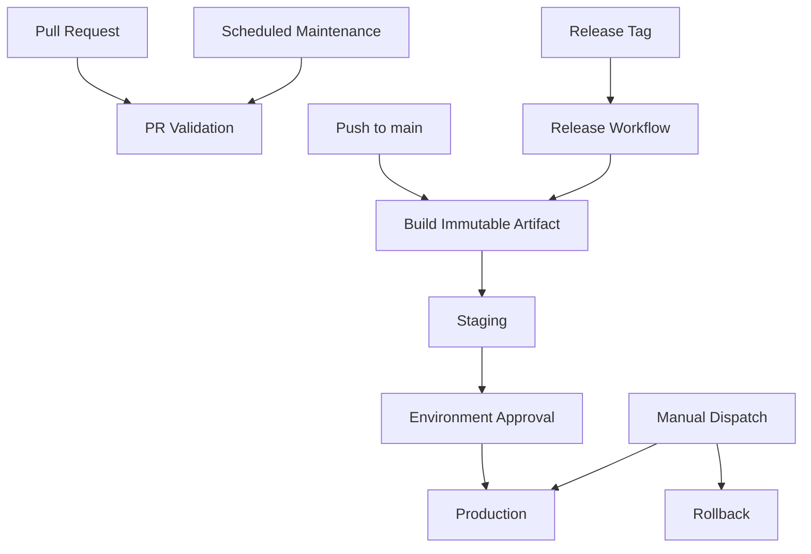

# 02- Workflow and Event Questions

## Overview

Workflow and event design is one of the most important GitHub Actions interview areas because the trigger determines **when automation executes, under which security context it executes, and what repository state the workflow can access**.

A production GitHub Actions design must reason about:

```text
Event
 ↓
Workflow Selection
 ↓
Branch / Path / Tag Filters
 ↓
Event Context
 ↓
Expression Evaluation
 ↓
Job Conditions
 ↓
Runner Execution
```

The key interview distinction is that a workflow trigger is not merely a scheduling mechanism. It is part of the CI/CD architecture and, for events such as `pull_request_target`, a security boundary.

This document focuses on workflow and event questions from fundamentals through senior production scenarios.

---

## GitHub Actions Event Model

### What is a GitHub Actions event?

An event is something that can cause a workflow to run.

Examples include:

- `push`
- `pull_request`
- `pull_request_target`
- `workflow_dispatch`
- `schedule`
- `workflow_call`
- `workflow_run`
- `repository_dispatch`
- `release`

The event provides context that can be consumed by the workflow.

```text
GitHub Event
     ↓
Workflow Trigger
     ↓
Event Payload / Context
     ↓
Jobs
     ↓
Steps
```

For example, a pull request event can expose information about:

- Source branch.
- Target branch.
- Pull request number.
- Author.
- Changed files.
- Commit SHA.
- Repository.

---

### What is the difference between an event and a workflow?

An **event** is something that happens.

A **workflow** is the automation that responds to it.

For example:

```text
Developer opens PR
        ↓
pull_request event
        ↓
CI workflow
        ↓
Lint + Unit Tests + Integration Tests
```

The event does not define what the workflow does. It determines when the workflow becomes eligible to execute.

---

## `push`

### What is the `push` event?

`push` triggers a workflow when commits are pushed to the repository.

```yaml
name: CI

on:
  push:
    branches:
      - main
```

This workflow executes for pushes to `main`.

---

### When should `push` be used?

Common use cases include:

- CI after changes land on a protected branch.
- Building release artifacts.
- Deploying from `main`.
- Publishing packages.
- Updating environments.

A common production model is:

```text
Pull Request
    ↓
Validation

Merge to main
    ↓
Build
    ↓
Artifact
    ↓
Deployment
```

---

### What is the difference between `push` and `pull_request`?

| Characteristic | `push` | `pull_request` |
|---|---|---|
| Trigger | Commit pushed | PR activity |
| Typical use | Post-merge CI/CD | Pre-merge validation |
| Fork security model | Not applicable in same way | Important |
| Deployment | Common | Usually restricted |
| Validation | Possible | Primary use case |

A typical backend repository uses both:

```yaml
on:
  push:
    branches:
      - main

  pull_request:
    branches:
      - main
```

---

## `pull_request`

### What is `pull_request`?

`pull_request` triggers workflows based on pull request activity.

Example:

```yaml
on:
  pull_request:
    branches:
      - main
```

It is commonly used for:

- Linting.
- Unit tests.
- Integration tests.
- Security scanning.
- Build validation.

---

### What activities can trigger `pull_request`?

You can control activity types.

```yaml
on:
  pull_request:
    types:
      - opened
      - synchronize
      - reopened
```

Typical meanings:

| Activity | Meaning |
|---|---|
| `opened` | PR created |
| `synchronize` | New commits pushed to PR |
| `reopened` | Previously closed PR reopened |

Avoid enabling every activity unless the workflow actually needs them.

---

### What is `synchronize`?

`synchronize` occurs when the pull request's source branch receives new commits.

This makes it particularly useful for CI:

```text
Developer pushes commit
        ↓
PR updated
        ↓
synchronize
        ↓
CI runs again
```

---

## Pull Requests From Forks

### Why are fork pull requests important?

A fork may belong to an untrusted user.

The workflow therefore needs to distinguish:

```text
Internal branch
vs
External fork
```

The pull request may contain attacker-controlled:

- Source code.
- Workflow-related changes.
- Branch names.
- Commit messages.
- Pull request titles.
- Test dependencies.

This is particularly important when workflows have access to:

- Secrets.
- Write permissions.
- AWS OIDC.
- Self-hosted runners.

---

### What is the security principle for fork PRs?

Treat fork pull requests as potentially untrusted code.

A safe architecture generally separates:

```text
Untrusted PR validation
        ↓
Restricted permissions
        ↓
No privileged secrets
```

from:

```text
Trusted branch
        ↓
Privileged deployment
        ↓
AWS / Production
```

---

## `pull_request` vs `pull_request_target`

### What is `pull_request_target`?

`pull_request_target` runs in the context of the base repository rather than the pull request's execution context.

It can therefore have access to privileges that are intentionally restricted from ordinary fork-based `pull_request` workflows.

This makes it useful for carefully designed workflows that need trusted repository context, but it also creates a significant security boundary.

---

### Why is `pull_request_target` dangerous?

Consider:

```text
Attacker Fork
     ↓
Malicious PR
     ↓
pull_request_target
     ↓
Checkout attacker-controlled code
     ↓
Execute code
     ↓
Repository secrets / write permissions
```

If untrusted code is checked out and executed in a privileged workflow, the attacker-controlled code may execute with the workflow's privileges.

The dangerous combination is:

```text
pull_request_target
+
checkout untrusted code
+
execute untrusted code
+
secrets/write permissions
```

---

### When can `pull_request_target` be appropriate?

It can be useful when the workflow needs trusted base-repository context and does **not** execute untrusted pull request code with elevated privileges.

Examples may include carefully designed metadata or labeling workflows.

The important rule is:

> Do not treat `pull_request_target` as a safer replacement for `pull_request`.

It changes the trust model.

---

### How should a senior engineer answer a `pull_request_target` interview question?

Discuss:

- Trust boundaries.
- Fork repositories.
- Workflow permissions.
- Secret availability.
- Checkout behavior.
- Untrusted code execution.
- Third-party actions.
- Self-hosted runners.
- AWS OIDC.
- Least privilege.

The strongest answer explains the security model rather than simply saying "`pull_request_target` is dangerous."

---

## `workflow_dispatch`

### What is `workflow_dispatch`?

`workflow_dispatch` allows a workflow to be started manually.

```yaml
on:
  workflow_dispatch:
```

It is useful for:

- Production deployment.
- Rollback.
- Operational maintenance.
- Manual recovery.
- Controlled data operations.

---

### How do manual inputs work?

```yaml
on:
  workflow_dispatch:
    inputs:
      environment:
        description: Deployment environment
        required: true
        type: choice
        options:
          - staging
          - production
```

The input can then be consumed:

```yaml
jobs:
  deploy:
    runs-on: ubuntu-latest

    steps:
      - name: Show environment
        run: echo "Deploying to ${{ inputs.environment }}"
```

---

### Should manual inputs be trusted?

No.

Manual inputs are user-controlled input.

Validate them using:

- Typed inputs.
- Explicit allowed values.
- Job-level conditions.
- Environment protection.
- IAM restrictions.
- Deployment approval.

For example, do not assume an arbitrary input such as:

```text
environment=production
```

automatically means the user is authorized to deploy to production.

Authorization should be enforced separately.

---

## `schedule`

### What is the `schedule` event?

`schedule` runs a workflow according to a cron expression.

```yaml
on:
  schedule:
    - cron: "0 2 * * *"
```

Typical use cases:

- Scheduled dependency checks.
- Nightly integration tests.
- Security scans.
- Periodic maintenance.
- Operational reports.

---

### What are the production considerations of scheduled workflows?

Scheduled workflows should account for:

- Missed or delayed execution.
- Repository state at execution time.
- Duplicate execution.
- Long-running jobs.
- External dependency failures.
- Cost.
- Notifications.

A scheduled workflow should be observable because there may be no developer actively watching it.

---

## `workflow_call`

### What is `workflow_call`?

`workflow_call` makes a workflow reusable.

```yaml
on:
  workflow_call:
```

A reusable workflow can accept:

- Inputs.
- Secrets.
- Outputs.

Example:

```yaml
on:
  workflow_call:
    inputs:
      python-version:
        required: true
        type: string

    secrets:
      deployment-token:
        required: true
```

---

### Why use reusable workflows?

They allow organizations to standardize CI/CD behavior.

For example:

```text
Repository A ─┐
Repository B ─┼──> Shared CI Workflow
Repository C ─┘
```

The central workflow can implement:

```text
Lint
 ↓
Unit Tests
 ↓
Security
 ↓
Build
```

This reduces duplication and allows platform teams to enforce common standards.

---

### Reusable workflow vs composite action

| Characteristic | Reusable Workflow | Composite Action |
|---|---|---|
| Invocation | Job | Step |
| Multiple jobs | Yes | No |
| Job dependencies | Yes | No |
| Pipeline orchestration | Yes | No |
| Reusable steps | Yes | Yes |
| Deployment pipeline | Strong fit | Usually not |
| Small step abstraction | Possible | Primary use |

A useful interview rule:

```text
Reusable workflow
→ Reuse a pipeline

Composite action
→ Reuse steps
```

---

## `workflow_run`

### What is `workflow_run`?

`workflow_run` allows a workflow to respond to another workflow completing.

Conceptually:

```text
CI Workflow
    ↓
workflow_run
    ↓
Deployment / Reporting
```

It can be useful for separating CI and privileged post-CI workflows.

---

### What security issue should you consider?

Do not blindly trust artifacts, outputs, or source code produced by an untrusted workflow.

A privileged workflow that consumes attacker-controlled outputs can create an indirect privilege escalation path.

The security model should consider:

```text
Untrusted Workflow
       ↓
Artifact / Output
       ↓
Privileged Workflow
       ↓
Production Credentials
```

Treat workflow-to-workflow communication as a trust boundary.

---

## `repository_dispatch`

### What is `repository_dispatch`?

`repository_dispatch` allows an external system to trigger a workflow.

Conceptually:

```text
External System
       ↓
repository_dispatch
       ↓
GitHub Actions
```

Potential use cases include:

- External deployment orchestration.
- Internal platform systems.
- Release systems.
- Cross-system automation.

Payload data should be treated as external input.

---

## `release`

### What is the `release` event?

A workflow can respond to GitHub release activity.

```yaml
on:
  release:
    types:
      - published
```

This is useful for release-oriented automation.

A typical flow is:

```text
Git Tag
 ↓
Release
 ↓
Release Artifact
 ↓
Deployment
```

---

## Branch Filters

### Why use branch filters?

Branch filters constrain when a workflow executes.

```yaml
on:
  push:
    branches:
      - main
      - develop
```

This is useful for separating environments:

```text
develop → staging
main    → production
```

However, branch naming should not be the only production security control.

---

### What are `branches` and `branches-ignore`?

Example:

```yaml
on:
  push:
    branches:
      - main
```

Only `main` matches.

Ignoring a branch:

```yaml
on:
  push:
    branches-ignore:
      - experimental/**
```

Use the most explicit filter that reflects the repository's actual delivery model.

---

### What is the danger of relying only on branch names?

Branch names can be changed, recreated, or used incorrectly.

Production authorization should additionally consider:

- Branch protection.
- Environments.
- Required reviewers.
- IAM.
- Repository permissions.
- Deployment policies.

The trigger selects execution; it should not be treated as the complete authorization model.

---

## Tag Filters

### Why use tag filters?

Tags are useful for release workflows.

```yaml
on:
  push:
    tags:
      - "v*"
```

This can implement:

```text
v1.2.0
 ↓
Release workflow
 ↓
Build
 ↓
Publish
```

---

### Why are tags useful for releases?

Tags provide a stable reference to source state.

For example:

```text
v1.4.2
 ↓
Git commit
 ↓
Build
 ↓
Docker image
 ↓
Artifact digest
```

A mature release process can maintain traceability between source, artifact, and deployment.

---

## Path Filters

### What are path filters?

Path filters restrict workflows based on changed files.

```yaml
on:
  pull_request:
    paths:
      - "services/orders/**"
```

This is useful in monorepos.

---

### How should shared dependencies be handled?

Consider:

```text
services/
  orders/
  payments/

shared/
  auth/
  database/
```

If `orders` depends on `shared/auth`, a change to:

```text
shared/auth/**
```

may need to trigger the orders pipeline.

Therefore, selective CI requires a dependency-aware change detection strategy.

---

### What is the trade-off?

Path filtering improves:

- Execution time.
- Cost.
- Runner utilization.

But incorrect filters can reduce validation coverage.

A senior design should optimize CI without compromising correctness.

---

## Event-Specific Filters

Different events expose different filtering mechanisms.

For example:

```yaml
on:
  pull_request:
    branches:
      - main
    paths:
      - "backend/**"
```

A good workflow design treats:

```text
Event
+
Branch
+
Path
+
Activity
```

as a combined trigger policy.

---

## Expression Evaluation

### What are GitHub Actions expressions?

Expressions use:

```yaml
${{ ... }}
```

Example:

```yaml
if: ${{ github.ref == 'refs/heads/main' }}
```

They are used for:

- Conditions.
- Context access.
- Dynamic values.
- Matrix generation.
- Outputs.

---

### What operators are commonly used?

Examples include:

```yaml
${{ github.ref == 'refs/heads/main' }}
```

```yaml
${{ github.event_name != 'pull_request' }}
```

```yaml
${{ github.ref == 'refs/heads/main' && github.event_name == 'push' }}
```

Logical operators should be used to express workflow policy clearly rather than creating deeply nested conditions.

---

## Important Expression Functions

### `contains()`

Useful for checking whether a value contains another value.

```yaml
if: ${{ contains(github.event.pull_request.labels.*.name, 'deploy') }}
```

Use carefully with event structures because the available data depends on the event type.

---

### `startsWith()`

```yaml
if: ${{ startsWith(github.ref, 'refs/tags/v') }}
```

Useful for release tag patterns.

---

### `endsWith()`

```yaml
if: ${{ endsWith(github.ref, '/main') }}
```

Use it only when the string structure is well understood.

---

### `format()`

Useful for generating structured values:

```yaml
env:
  IMAGE_TAG: ${{ format('{0}-{1}', github.ref_name, github.sha) }}
```

---

### `fromJSON()`

Converts JSON into a workflow value.

A common use is dynamic matrices:

```yaml
strategy:
  matrix: ${{ fromJSON(needs.plan.outputs.matrix) }}
```

---

### `toJSON()`

Useful for converting structured context data into JSON.

It can help with diagnostics:

```yaml
- name: Inspect context
  env:
    EVENT: ${{ toJSON(github.event) }}
  run: printf '%s\n' "$EVENT"
```

Do not dump sensitive contexts indiscriminately.

---

### `hashFiles()`

Generates a hash based on matching files.

Example:

```yaml
key: ${{ runner.os }}-${{ hashFiles('**/poetry.lock') }}
```

It is commonly used for dependency cache invalidation.

---

## Contexts

### What is the `github` context?

It contains GitHub-related execution metadata.

Examples:

```yaml
${{ github.repository }}
```

```yaml
${{ github.sha }}
```

```yaml
${{ github.ref }}
```

```yaml
${{ github.event_name }}
```

The exact available information depends on the event.

---

### What is the `env` context?

It represents environment variables available through workflow configuration.

```yaml
env:
  APP_ENV: test
```

The variable can then be referenced through the appropriate workflow expression or shell environment.

---

### What is the `vars` context?

It exposes GitHub configuration variables.

```yaml
${{ vars.AWS_REGION }}
```

Use it for non-sensitive configuration.

---

### What is the `secrets` context?

It exposes configured secrets.

```yaml
${{ secrets.DATABASE_PASSWORD }}
```

Secrets should be minimized and scoped appropriately.

---

### What is the `steps` context?

It exposes information from steps in the current job.

For example:

```yaml
- id: metadata
  run: echo "version=1.2.3" >> "$GITHUB_OUTPUT"

- run: echo "${{ steps.metadata.outputs.version }}"
```

---

### What is the `needs` context?

It exposes information from dependent jobs.

```yaml
${{ needs.build.outputs.image }}
```

This is essential for passing deployment metadata between jobs.

---

### What is the `job` context?

It exposes information about the current job execution.

It is useful when workflows need job-level runtime information.

---

### What is the `runner` context?

It exposes information about the runner.

Examples can include:

- Operating system.
- Architecture.
- Runner name.
- Runner environment.

This can be useful when troubleshooting or implementing platform-specific behavior.

---

### What are `matrix` and `strategy` contexts?

`matrix` represents the current matrix combination.

```yaml
${{ matrix.python-version }}
```

`strategy` provides information about the matrix strategy.

These contexts are useful for dynamic test and deployment logic.

---

### What is the `inputs` context?

It exposes inputs supplied to:

- Manually dispatched workflows.
- Reusable workflows.

Example:

```yaml
${{ inputs.environment }}
```

Inputs should still be treated as user-controlled data.

---

## Job and Step Conditions

### What is `if`?

`if` conditionally executes a job or step.

Example:

```yaml
- name: Deploy
  if: ${{ github.ref == 'refs/heads/main' }}
  run: ./deploy.sh
```

Job-level:

```yaml
deploy:
  if: ${{ github.ref == 'refs/heads/main' }}
  runs-on: ubuntu-latest
```

---

### What is the difference between a trigger and an `if` condition?

A trigger determines whether a workflow is eligible to start.

An `if` condition determines whether a job or step executes after the workflow has started.

```text
Event
 ↓
Trigger filters
 ↓
Workflow starts
 ↓
Job condition
 ↓
Step condition
```

This distinction is important.

---

## Status Functions

### What does `success()` do?

`success()` evaluates whether preceding execution has succeeded.

Example:

```yaml
- name: Publish
  if: ${{ success() }}
  run: ./publish.sh
```

It is useful when success should be an explicit prerequisite.

---

### What does `failure()` do?

`failure()` can be used for diagnostics:

```yaml
- name: Collect diagnostics
  if: ${{ failure() }}
  run: ./collect-diagnostics.sh
```

Typical uses include:

- Uploading logs.
- Capturing service state.
- Collecting test reports.

---

### What does `always()` do?

`always()` makes a step eligible to run regardless of earlier success/failure state.

```yaml
- name: Upload reports
  if: ${{ always() }}
  uses: actions/upload-artifact@v4
```

It should not be treated as a universal cleanup mechanism.

If a workflow is cancelled, an `always()` step may not have the operational semantics you intended.

---

### What does `cancelled()` do?

`cancelled()` evaluates cancellation state.

Example:

```yaml
- name: Cancellation diagnostics
  if: ${{ cancelled() }}
  run: ./capture-cancel-state.sh
```

A senior engineer should understand cancellation separately from ordinary failure.

---

### What is `continue-on-error`?

It allows a step or job to tolerate an error without necessarily causing the normal failure behavior.

```yaml
- name: Non-blocking compatibility check
  continue-on-error: true
  run: ./compatibility-check.sh
```

Use it for intentionally non-blocking checks.

Do not use it to hide unstable or broken CI.

---

## Event Design for Backend CI

A typical backend repository may use:

```yaml
name: Backend CI

on:
  pull_request:
    branches:
      - main

  push:
    branches:
      - main

  workflow_dispatch:
```

The architecture can be:

```text
pull_request
    ↓
Lint
Unit
Integration
Security
    ↓
Validation

push → main
    ↓
Build
    ↓
Docker
    ↓
ECR
    ↓
Staging
```

Production deployment can then be protected by:

- Environment approvals.
- Concurrency.
- Immutable artifacts.
- OIDC.
- Health validation.

---

## Event Design for a Monorepo

Consider:

```text
services/
    orders/
    payments/
    users/

shared/
    auth/
    database/
```

A naive design runs every service pipeline for every change.

A selective design uses:

```text
Changed files
      ↓
Dependency analysis
      ↓
Affected services
      ↓
Dynamic matrix
      ↓
Parallel tests
```

Example:

```yaml
strategy:
  matrix:
    service:
      - orders
      - payments
```

A planning job can dynamically produce the affected services using JSON and `fromJSON()`.

The senior-level concern is not simply reducing runtime. The dependency analysis must remain correct.

---

## Event Design for Production Deployment

A production workflow should generally separate validation from deployment.

```text
Pull Request
 ↓
Validation
 ↓
Merge
 ↓
Build
 ↓
Immutable Artifact
 ↓
Staging
 ↓
Approval
 ↓
Production
```

A production deployment should not rely solely on:

```yaml
if: github.ref == 'refs/heads/main'
```

Instead combine:

```text
Trusted source
+
Environment protection
+
Permissions
+
Artifact identity
+
Concurrency
+
Deployment authorization
```

---

## Event Security Matrix

| Event | Typical Trust Consideration | Common Use |
|---|---|---|
| `push` | Repository-controlled branch | Post-merge CI/CD |
| `pull_request` | PR code may be untrusted | Validation |
| `pull_request_target` | Privileged base context | Carefully controlled metadata workflows |
| `workflow_dispatch` | User input | Manual operations |
| `schedule` | Repository state at runtime | Periodic jobs |
| `workflow_call` | Caller/called workflow trust | Shared pipelines |
| `workflow_run` | Previous workflow outputs/artifacts | Workflow orchestration |
| `repository_dispatch` | External input | External automation |
| `release` | Release lifecycle | Release automation |

The exact security posture depends on the workflow configuration, permissions, runner type, secrets, and code being executed.

---

## Duplicate Workflow Runs

### Why can duplicate runs happen?

A repository may have both:

```yaml
on:
  push:
    branches:
      - main

  pull_request:
    branches:
      - main
```

A workflow can execute during PR validation and then again after the merge push.

This may be intentional.

The problem occurs when both workflows perform expensive or conflicting operations unnecessarily.

---

### How do you reduce duplicate work?

Use:

- Appropriate event separation.
- Branch/path filters.
- Concurrency.
- Job conditions.
- Separate CI and deployment workflows.

For example:

```text
PR
 ↓
Validation only

main push
 ↓
Build + Deployment
```

---

## Concurrency and Events

### Why does event design interact with concurrency?

Multiple events can create overlapping executions.

Example:

```text
Commit A → workflow run
Commit B → workflow run
Commit C → workflow run
```

If every run deploys production:

```text
A ────────→ Production
B ────────→ Production
C ────────→ Production
```

This creates a deployment race.

Use concurrency:

```yaml
concurrency:
  group: production
  cancel-in-progress: false
```

For PR validation, cancellation may be appropriate:

```yaml
concurrency:
  group: pr-${{ github.event.pull_request.number }}
  cancel-in-progress: true
```

The policy should reflect the workload.

---

## Event and Artifact Promotion

A mature workflow does not rebuild an artifact merely because a different event triggered deployment.

For example:

```text
push main
 ↓
Build
 ↓
Docker image
 ↓
ECR digest
 ↓
Staging
```

After approval:

```text
Same ECR digest
 ↓
Production
```

This separates:

```text
Event
```

from:

```text
Artifact identity
```

That distinction is important for reliable rollback and auditability.

---

## Event-Driven Release Architecture

A release pipeline can use tags:

```text
git tag v1.5.0
       ↓
push tag event
       ↓
Release workflow
       ↓
Build
       ↓
Docker image
       ↓
ECR
       ↓
Staging
       ↓
Production
```

This provides a clear release identity.

For production systems, also record:

- Git SHA.
- Release version.
- Docker digest.
- Build metadata.
- Deployment environment.
- Deployment timestamp.

---

## Workflow Inputs and Security

### How should workflow inputs be handled?

Use typed inputs where possible.

```yaml
on:
  workflow_dispatch:
    inputs:
      environment:
        type: choice
        required: true
        options:
          - staging
          - production
```

Do not directly insert arbitrary inputs into shell commands.

Unsafe pattern:

```yaml
run: ./deploy.sh ${{ inputs.environment }}
```

Safer approach:

```yaml
env:
  DEPLOY_ENV: ${{ inputs.environment }}

run: |
  case "$DEPLOY_ENV" in
    staging|production)
      ./deploy.sh "$DEPLOY_ENV"
      ;;
    *)
      echo "Invalid environment"
      exit 1
      ;;
  esac
```

The exact validation strategy should match the operation's risk.

---

## Event Context and Script Injection

This is a common senior interview topic.

Potentially unsafe:

```yaml
run: echo "${{ github.event.pull_request.title }}"
```

A safer pattern is to pass the value through the environment:

```yaml
env:
  PR_TITLE: ${{ github.event.pull_request.title }}

run: |
  printf '%s\n' "$PR_TITLE"
```

The same principle applies to:

- Branch names.
- Commit messages.
- Issue titles.
- PR titles.
- Repository dispatch payloads.
- Manual inputs.

GitHub metadata should not automatically be considered trusted input.

---

## Event Design With AWS OIDC

A production deployment may use:

```text
push to main
      ↓
Trusted workflow
      ↓
id-token: write
      ↓
GitHub OIDC
      ↓
AWS STS
      ↓
IAM Role
      ↓
ECR / ECS
```

The IAM trust policy should restrict the identities that can assume the role.

The event should therefore be considered together with:

- Repository.
- Branch.
- Environment.
- Workflow identity.
- IAM trust policy.
- Job permissions.

An event filter alone should not be treated as AWS authorization.

---

## Event Design With Environments

For production:

```yaml
jobs:
  deploy:
    environment:
      name: production
```

The environment can provide:

- Required reviewers.
- Environment secrets.
- Deployment protection.
- Deployment history.

A typical architecture is:

```text
main
 ↓
Build
 ↓
Staging
 ↓
Health Check
 ↓
Production Environment
 ↓
Approval
 ↓
Production
```

This creates a stronger control boundary than simply checking the branch name.

---

## Event Design and Self-Hosted Runners

Self-hosted runners require additional caution.

A workflow triggered by untrusted code should generally not have unrestricted access to a privileged persistent self-hosted runner.

Consider:

```text
Untrusted PR
      ↓
GitHub-hosted runner
      ↓
Restricted permissions
```

versus:

```text
Production workflow
      ↓
Protected runner group
      ↓
Private VPC
      ↓
Production resources
```

Runner groups and labels should reflect trust boundaries.

---

## Workflow Trigger Troubleshooting

Use the following model:

```text
Symptom
 ↓
Possible Causes
 ↓
Isolation Strategy
 ↓
Commands / Checks
 ↓
Root Cause
 ↓
Corrective Action
 ↓
Prevention
```

### Symptom: Workflow Did Not Run

Possible causes:

- Wrong event.
- Branch filter mismatch.
- Path filter mismatch.
- Tag filter mismatch.
- Event activity mismatch.
- Workflow file location issue.
- Repository policy.
- Workflow disabled.

Isolation:

```text
Event
 ↓
Workflow trigger
 ↓
Branch
 ↓
Path
 ↓
Activity
 ↓
Repository policy
```

---

### Symptom: Workflow Runs Unexpectedly

Possible causes:

- Multiple events.
- Broad branch filters.
- Broad path filters.
- `workflow_run`.
- Scheduled execution.
- Manual dispatch.
- Repository dispatch.

First inspect:

```text
github.event_name
github.ref
github.ref_name
github.sha
```

Example:

```yaml
- name: Debug event
  env:
    EVENT_NAME: ${{ github.event_name }}
    REF: ${{ github.ref }}
    SHA: ${{ github.sha }}
  run: |
    printf 'event=%s\n' "$EVENT_NAME"
    printf 'ref=%s\n' "$REF"
    printf 'sha=%s\n' "$SHA"
```

---

### Symptom: PR Workflow Does Not Run for a Fork

Check:

- Event type.
- Target branch.
- Activity type.
- Repository policies.
- Workflow configuration.
- Fork behavior.
- Required permissions.

Do not immediately solve the problem by switching to `pull_request_target`.

First understand why the existing event is not behaving as expected.

---

### Symptom: Production Workflow Runs From an Unexpected Branch

Check:

```text
Trigger filters
 ↓
Job if condition
 ↓
Environment protection
 ↓
Deployment authorization
 ↓
IAM trust policy
```

A branch condition should not be the only authorization mechanism.

---

## GitHub CLI for Event Investigation

GitHub CLI can help inspect workflow behavior.

List workflows:

```bash
gh workflow list
```

Run a workflow manually:

```bash
gh workflow run deploy.yml
```

List runs:

```bash
gh run list
```

Inspect a run:

```bash
gh run view <run-id>
```

View logs:

```bash
gh run view <run-id> --log
```

Rerun a workflow:

```bash
gh run rerun <run-id>
```

These commands are particularly useful when diagnosing trigger and execution problems.

---

## Senior Interview Questions

### How would you design triggers for a production backend?

A strong answer:

```text
Pull Request
 → validation

Push to protected main
 → build/release

Tag
 → release workflow

Manual dispatch
 → controlled operational actions

Schedule
 → periodic maintenance
```

Then explain:

- Branch filters.
- Path filters.
- Concurrency.
- Environments.
- Permissions.
- OIDC.
- Artifact promotion.

---

### When would you use `workflow_dispatch` instead of `push`?

Use `workflow_dispatch` when an operation requires deliberate human initiation.

Examples:

- Rollback.
- Manual production deployment.
- Database maintenance.
- Recovery operation.

A manual trigger should still enforce authorization and validation.

---

### When would you use `schedule`?

Use it for recurring tasks that are independent of source-code changes.

Examples:

- Nightly security scans.
- Periodic integration tests.
- Dependency maintenance.
- Operational reports.

---

### When would you use `workflow_call`?

Use it when multiple repositories need a common pipeline contract.

For example:

```text
Repo A
Repo B
Repo C
  ↓
Reusable CI Workflow
```

This is preferable to copying the same complex YAML into every repository.

---

### When would you use `workflow_run`?

Use it when a workflow needs to respond to the completion of another workflow.

However, carefully evaluate the trust relationship between the producing and consuming workflows.

---

### When would you use `repository_dispatch`?

Use it when an external system needs to initiate GitHub Actions execution.

Validate external payloads and avoid allowing arbitrary payload data to directly control privileged operations.

---

### How would you design CI for a monorepo?

Start with:

```text
Changed files
      ↓
Dependency graph
      ↓
Affected components
      ↓
Dynamic matrix
      ↓
Parallel validation
```

Then consider:

- Shared libraries.
- Infrastructure changes.
- Cross-service dependencies.
- Database migrations.
- Global configuration changes.

The objective is selective execution without creating false negatives.

---

### How would you prevent two production deployments from executing concurrently?

Use:

```yaml
concurrency:
  group: production
  cancel-in-progress: false
```

Then add:

- Environment protection.
- Immutable artifacts.
- Idempotent deployment logic.
- Health checks.
- Rollback.

Concurrency prevents workflow-level races; it does not replace deployment correctness.

---

### How would you secure a workflow triggered by a fork?

Treat the code as untrusted.

Use:

- `pull_request` for validation.
- Minimal `GITHUB_TOKEN` permissions.
- No production credentials.
- No unnecessary secrets.
- GitHub-hosted or isolated runners.
- Trusted dependency installation.
- Safe handling of event data.

Privileged deployment should happen only after code reaches a trusted workflow boundary.

---

### Why should you avoid checking out PR code in a privileged `pull_request_target` workflow?

Because the checked-out code can be attacker-controlled.

If the workflow has:

```text
Secrets
+
Write permissions
+
AWS credentials
+
Self-hosted runner access
```

the attacker-controlled code may inherit those privileges.

This is a classic CI/CD privilege-escalation risk.

---

## Production Event Architecture



The architecture separates:

- Validation.
- Build.
- Release.
- Deployment.
- Operations.

Each event has a specific purpose rather than causing every workflow to execute every operation.

---

## Common Event Design Mistakes

### Using `pull_request_target` as a Drop-In Replacement

It changes the privilege and trust model.

### Deploying Directly From Every `push`

This can make deployment behavior difficult to control.

### Using Branch Names as Authorization

Branch filters are useful controls but should not replace environment protection and IAM authorization.

### Ignoring Fork Security

Fork code should be treated as potentially untrusted.

### Using Excessively Broad Path Filters

This increases cost and runtime.

### Using Overly Narrow Path Filters

This can silently skip required validation.

### Treating Manual Inputs as Trusted

Inputs should be validated.

### Ignoring Duplicate Events

Multiple triggers can create duplicate CI or deployment executions.

### Using `always()` Without Understanding Cancellation

This can result in steps executing when the workflow's state is not suitable for the intended operation.

### Dumping Entire Event Payloads

Event payloads can contain sensitive or untrusted information.

Only inspect the fields needed for debugging.

---

## Senior-Level Trade-Offs

| Design Decision | Benefit | Risk / Trade-Off |
|---|---|---|
| Path filtering | Lower CI cost | Can skip required validation |
| Branch filtering | Clear environment mapping | Not sufficient authorization |
| `pull_request` | Strong fit for untrusted PR validation | Limited privileged access |
| `pull_request_target` | Trusted base context | Privilege escalation if misused |
| Manual dispatch | Controlled operations | Human error |
| Scheduled workflows | Predictable recurring automation | Delayed detection if monitoring is weak |
| Reusable workflows | Standardization | Centralized blast radius |
| Dynamic matrices | Efficient monorepo CI | More planning complexity |
| Concurrency | Prevents races | Can cancel or serialize useful work |
| Self-hosted runners | Private network/custom tooling | Greater security and operational responsibility |

---

## Complete Production Example

```yaml
name: Backend CI/CD

on:
  pull_request:
    branches:
      - main

  push:
    branches:
      - main

  workflow_dispatch:
    inputs:
      environment:
        description: Deployment environment
        required: true
        type: choice
        options:
          - staging
          - production

permissions:
  contents: read

concurrency:
  group: production-deployment
  cancel-in-progress: false

jobs:
  test:
    runs-on: ubuntu-latest

    steps:
      - uses: actions/checkout@v4

      - name: Set up Python
        uses: actions/setup-python@v5
        with:
          python-version: "3.12"
          cache: pip

      - name: Install dependencies
        run: pip install -r requirements.txt

      - name: Run tests
        run: pytest

  build:
    if: ${{ github.event_name == 'push' && github.ref == 'refs/heads/main' }}
    needs: test
    runs-on: ubuntu-latest

    permissions:
      contents: read

    steps:
      - uses: actions/checkout@v4

      - name: Build application
        run: ./build.sh

  deploy:
    if: ${{ github.event_name == 'push' && github.ref == 'refs/heads/main' }}
    needs: build
    runs-on: ubuntu-latest

    environment:
      name: production

    permissions:
      contents: read
      id-token: write

    steps:
      - name: Deploy
        run: ./deploy.sh
```

The important part is not the exact YAML. It is the architecture:

```text
PR
 ↓
Validation

main push
 ↓
Validated build
 ↓
Deployment environment
 ↓
Protected production
```

---

## Interview Answer Framework

For event-related interview questions, use:

```text
Event
 ↓
Trigger Scope
 ↓
Trust Boundary
 ↓
Permissions
 ↓
Job Conditions
 ↓
Concurrency
 ↓
Deployment Impact
 ↓
Failure Handling
```

For example, if asked:

> "How would you trigger a production deployment?"

A senior answer should cover:

- Which event triggers it.
- Which branches/tags are trusted.
- Whether the artifact is already built.
- How the production environment is protected.
- Which permissions are required.
- How AWS authentication works.
- How concurrent deployments are prevented.
- How health checks work.
- How rollback is performed.

---

## Production Scenario: Multiple Python Versions

Requirement:

> Test Python 3.11, 3.12, and 3.13 on every pull request.

Design:

```yaml
on:
  pull_request:

jobs:
  test:
    strategy:
      matrix:
        python-version:
          - "3.11"
          - "3.12"
          - "3.13"

    runs-on: ubuntu-latest
```

Then consider:

- Dependency compatibility.
- Cache keys.
- Matrix execution cost.
- Database service requirements.
- Fail-fast policy.
- Artifact naming.

---

## Production Scenario: Production Deployment Requires Approval

Architecture:

```text
main
 ↓
Build
 ↓
Immutable Docker Image
 ↓
Staging
 ↓
Validation
 ↓
Production Environment
 ↓
Required Reviewer
 ↓
Production
```

The approval belongs at the deployment boundary, not after rebuilding the application.

---

## Production Scenario: Docker Image Promotion

Requirement:

> Promote the staging image to production without rebuilding.

Use:

```text
Git SHA
 ↓
Docker Build
 ↓
Registry
 ↓
Image Digest
 ↓
Staging
 ↓
Approval
 ↓
Same Image Digest
 ↓
Production
```

This prevents environment-specific rebuilds from producing a different artifact.

---

## Production Scenario: Private Network Deployment

Requirement:

> Deploy to a service accessible only inside an AWS VPC.

Consider:

```text
GitHub Actions
      ↓
OIDC
      ↓
AWS IAM
      ↓
Private Deployment Path
      ↓
ECS / EC2 / Kubernetes
      ↓
Private Services
```

Depending on the architecture, the deployment job may require:

- Self-hosted runner.
- Private networking.
- Security groups.
- DNS.
- Controlled egress.
- Runner groups.
- Ephemeral runners.

Do not expose private services merely to make GitHub-hosted runners reach them.

---

## Production Scenario: Monorepo With Multiple Services

Consider:

```text
services/
    orders/
    payments/
    users/
```

A sophisticated pipeline can use:

```text
Pull Request
 ↓
Change Detection
 ↓
Affected Services
 ↓
Dynamic Matrix
 ↓
Parallel Tests
 ↓
Build Affected Services
```

The design must also account for shared dependencies:

```text
services/orders
       ↓
shared/auth
```

A change to `shared/auth` may require orders validation even when no file under `services/orders` changed.

---

## Production Scenario: Rollback

A manual rollback workflow may use:

```yaml
on:
  workflow_dispatch:
    inputs:
      image_digest:
        description: Image digest to deploy
        required: true
        type: string
```

The deployment should validate the requested artifact before deployment.

A production rollback architecture is:

```text
Manual Trigger
      ↓
Validate Artifact
      ↓
Environment Protection
      ↓
Deploy Known-Good Digest
      ↓
Health Check
      ↓
Monitoring
```

Rollback should use a known immutable artifact rather than rebuilding source code.

---

## What Interviewers Are Really Testing

Workflow and event questions often test whether you understand:

### Execution

Can you explain when and why a workflow executes?

### Security

Can you identify trust boundaries and privilege escalation risks?

### Architecture

Can you separate CI, build, release, and deployment responsibilities?

### Reliability

Can you prevent duplicate or conflicting executions?

### Scalability

Can you design selective and parallel CI?

### Operations

Can you diagnose why a workflow did not run?

### Maintainability

Can you avoid duplicating workflow logic across repositories?

### Production Thinking

Can you connect events to:

```text
Artifacts
+
Environments
+
Permissions
+
AWS
+
Docker
+
Monitoring
+
Rollback
```

---

## Key Takeaways

- **Workflow events determine when automation becomes eligible to run, while filters and job conditions determine which execution paths actually proceed.**
- **`pull_request`, `pull_request_target`, manual dispatch, reusable workflows, scheduled workflows, and workflow-to-workflow triggers have different trust and operational models; event selection is an architectural decision.**
- **Branch and path filters improve efficiency but should not be treated as complete authorization controls; production deployments need environments, permissions, artifact controls, concurrency, and appropriate AWS IAM policies.**
- **Senior CI/CD design separates untrusted PR validation from privileged deployment workflows and treats event payloads, workflow inputs, artifacts, and cross-workflow data as potential trust boundaries.**
- **Reliable event-driven pipelines combine correct triggers with immutable artifact promotion, concurrency control, least privilege, observability, and explicit rollback paths.**