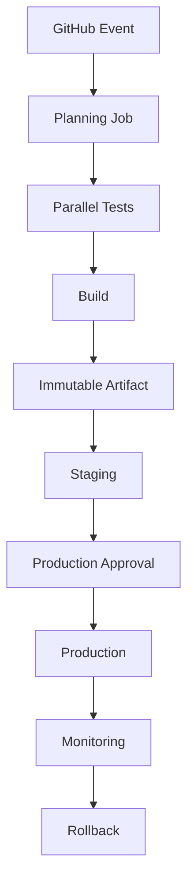

# 04- Expressions and Context Questions

## Overview

GitHub Actions expressions and contexts are the mechanism used to make workflows dynamic.

They allow a workflow to answer questions such as:

- Which event triggered this workflow?
- Which branch or tag is being built?
- Did a previous job succeed?
- What value did another step produce?
- Which matrix combination is executing?
- Which environment was selected?
- Should this deployment run?
- What output did a planning job generate?
- Which repository, commit, actor, or pull request is involved?

The important distinction is:

```text
GitHub Actions Expression
        ↓
Evaluated by GitHub Actions
        ↓
Produces a value / condition
        ↓
Shell command executes separately
```

For example:

```yaml
if: ${{ github.ref == 'refs/heads/main' }}
```

is an Actions expression.

Whereas:

```yaml
run: |
  if [ "$APP_ENV" = "production" ]; then
    ./deploy.sh
  fi
```

is shell logic executed on the runner.

Confusing these two execution environments causes many CI/CD bugs and security vulnerabilities.

At senior level, expressions and contexts should be understood as part of the workflow's **execution model, dependency graph, security model, and deployment architecture**.

---

## Expressions vs Shell Commands

### GitHub Actions Expressions

Expressions use:

```yaml
${{ ... }}
```

Example:

```yaml
if: ${{ github.ref == 'refs/heads/main' }}
```

They are evaluated by GitHub Actions.

Common uses include:

- Conditions.
- Dynamic configuration.
- Context access.
- Matrix generation.
- Job outputs.
- Environment values.
- Cache keys.

---

### Shell Commands

Shell commands execute on the runner.

```yaml
- name: Run tests
  run: pytest
```

The shell is responsible for:

- Process execution.
- Exit codes.
- Environment variables.
- Filesystem operations.
- Command pipelines.
- Shell expansion.

Example:

```yaml
- name: Test environment
  env:
    APP_ENV: test
  run: |
    if [ "$APP_ENV" = "test" ]; then
      pytest
    fi
```

The expression engine and shell are different execution environments.

---

## Expression Evaluation Model

Consider:

```yaml
- name: Deploy
  if: ${{ github.ref == 'refs/heads/main' }}
  run: ./deploy.sh
```

Conceptually:

```text
Workflow definition
       ↓
GitHub evaluates expression
       ↓
true / false
       ↓
Step selected or skipped
       ↓
Runner executes shell command
```

The runner does not evaluate:

```text
github.ref
```

as a shell variable.

Likewise, the shell does not understand:

```text
${{ github.ref }}
```

as native shell syntax.

---

## When Is `${{ }}` Required?

GitHub Actions automatically evaluates expressions in many workflow expression-capable fields.

For example:

```yaml
if: github.ref == 'refs/heads/main'
```

is commonly accepted without explicitly writing `${{ }}` in `if`.

For clarity, explicit expressions are useful in many other contexts:

```yaml
env:
  APP_VERSION: ${{ github.sha }}
```

A good rule is:

> Understand whether the field expects an Actions expression or a shell command before deciding how interpolation should happen.

---

## Expression Operators

Common operators include:

| Operator | Purpose |
|---|---|
| `==` | Equality |
| `!=` | Inequality |
| `&&` | Logical AND |
| `||` | Logical OR |
| `!` | Logical NOT |
| `>` | Greater than |
| `<` | Less than |
| `>=` | Greater than or equal |
| `<=` | Less than or equal |

Example:

```yaml
if: ${{ github.event_name == 'push' && github.ref == 'refs/heads/main' }}
```

This means:

```text
Event is push
AND
Branch is main
```

---

## Comparisons

A common production condition is:

```yaml
if: ${{ github.ref == 'refs/heads/main' }}
```

Another example:

```yaml
if: ${{ github.event_name != 'pull_request' }}
```

For deployment:

```yaml
if: ${{ github.event_name == 'push' && github.ref == 'refs/heads/main' }}
```

Keep complex conditions readable. If a condition becomes difficult to reason about, move decision-making into a dedicated planning job and expose a small output.

---

## Logical Operators

### AND

```yaml
if: ${{ github.event_name == 'push' && github.ref == 'refs/heads/main' }}
```

Both conditions must be true.

---

### OR

```yaml
if: ${{ github.ref == 'refs/heads/main' || github.ref == 'refs/heads/develop' }}
```

Either condition can be true.

---

### NOT

```yaml
if: ${{ !cancelled() }}
```

This is useful for reporting or cleanup logic that should not run after cancellation.

---

## Important Expression Functions

GitHub Actions provides functions that are frequently used in production workflows.

Important functions include:

```text
success()
failure()
always()
cancelled()
contains()
startsWith()
endsWith()
format()
fromJSON()
toJSON()
hashFiles()
```

Each has a different purpose.

---

## `success()`

`success()` evaluates whether the relevant preceding execution has succeeded.

Example:

```yaml
- name: Publish artifact
  if: ${{ success() }}
  run: ./publish.sh
```

It is useful when successful completion is an explicit prerequisite.

In many ordinary sequential steps, success is already the default behavior, so adding `success()` unnecessarily can create noise.

---

## `failure()`

`failure()` is useful for failure-specific handling.

```yaml
- name: Collect diagnostics
  if: ${{ failure() }}
  run: ./collect-diagnostics.sh
```

Typical uses:

- Collect logs.
- Capture test reports.
- Gather container state.
- Export debugging information.

Example:

```yaml
- name: Upload diagnostics
  if: ${{ failure() }}
  uses: actions/upload-artifact@v4
  with:
    name: diagnostics
    path: diagnostics/
```

---

## `always()`

`always()` makes a step or job eligible to execute regardless of normal success/failure state.

Example:

```yaml
- name: Publish test report
  if: ${{ always() }}
  uses: actions/upload-artifact@v4
  with:
    name: test-report
    path: reports/
```

However, `always()` should be used carefully.

It does not mean:

> This step is guaranteed to run under every possible runner, infrastructure, or cancellation condition.

A cancelled job may not provide an execution opportunity for every later operation.

For many reporting scenarios, this distinction matters.

---

## `cancelled()`

`cancelled()` allows cancellation-specific behavior.

```yaml
- name: Record cancellation
  if: ${{ cancelled() }}
  run: ./record-cancellation.sh
```

Cancellation is different from failure.

For example:

```text
Failure
→ execution ended because something failed

Cancellation
→ execution was intentionally or externally stopped
```

This distinction matters for:

- Deployment workflows.
- Concurrency.
- Cleanup.
- Operational reporting.

---

## `!cancelled()`

A useful pattern for publishing reports is:

```yaml
if: ${{ !cancelled() }}
```

Example:

```yaml
- name: Upload test reports
  if: ${{ !cancelled() }}
  uses: actions/upload-artifact@v4
  with:
    name: test-reports
    path: reports/
```

This allows reporting after success or failure while avoiding execution after cancellation.

The exact condition should reflect the desired operational semantics.

---

## Status Functions and `needs`

Status functions become more interesting when jobs depend on each other.

Consider:

```yaml
jobs:
  test:
    ...

  build:
    needs: test
    ...
```

If `test` fails:

```text
test: failure
build: skipped
```

A downstream job can explicitly alter this behavior when there is a legitimate reason.

For example, a diagnostics job can be designed to execute when an earlier dependency fails.

The important interview concept is:

> `needs` defines the dependency graph; status functions influence whether conditional execution occurs within that graph.

---

## `continue-on-error`

`continue-on-error` changes failure handling.

Example:

```yaml
- name: Experimental check
  continue-on-error: true
  run: ./experimental-check.sh
```

This can be appropriate for:

- Experimental compatibility testing.
- Transitional checks.
- Non-blocking diagnostics.

It is dangerous when used to hide failures in:

- Unit tests.
- Security scans.
- Production deployments.
- Database migrations.

Bad pattern:

```yaml
- name: Unit tests
  continue-on-error: true
  run: pytest
```

This turns a critical quality gate into informational output.

---

## Contexts

Contexts provide structured information about the current workflow execution.

Common contexts include:

```text
github
env
vars
secrets
steps
needs
job
runner
matrix
strategy
inputs
```

They answer different questions and are available at different stages of workflow execution.

---

## `github` Context

The `github` context provides information about the workflow execution and repository event.

Common values include:

```yaml
${{ github.repository }}
```

```yaml
${{ github.sha }}
```

```yaml
${{ github.ref }}
```

```yaml
${{ github.ref_name }}
```

```yaml
${{ github.event_name }}
```

```yaml
${{ github.actor }}
```

For pull requests, event-specific data may be available under:

```yaml
github.event
```

Example:

```yaml
- name: Show execution metadata
  env:
    REPOSITORY: ${{ github.repository }}
    SHA: ${{ github.sha }}
    EVENT: ${{ github.event_name }}
    REF: ${{ github.ref }}
  run: |
    printf 'repository=%s\n' "$REPOSITORY"
    printf 'sha=%s\n' "$SHA"
    printf 'event=%s\n' "$EVENT"
    printf 'ref=%s\n' "$REF"
```

---

## `github.ref`

`github.ref` contains the full Git ref.

For a branch:

```text
refs/heads/main
```

For a tag:

```text
refs/tags/v1.5.0
```

Therefore:

```yaml
if: ${{ github.ref == 'refs/heads/main' }}
```

is different from:

```yaml
if: ${{ github.ref_name == 'main' }}
```

The former compares the complete ref; the latter compares the short name.

---

## `github.sha`

`github.sha` identifies the commit associated with the workflow execution.

It is extremely useful for immutable artifact identity.

Example:

```yaml
env:
  IMAGE_TAG: ${{ github.sha }}
```

Docker architecture:

```text
Git Commit SHA
      ↓
Docker Image Tag
      ↓
Registry
      ↓
Deployment
```

For production deployment, the image digest provides an even stronger artifact identity than a mutable tag.

---

## `github.event_name`

Provides the event that triggered the workflow.

Example:

```yaml
if: ${{ github.event_name == 'pull_request' }}
```

Useful when a workflow intentionally handles multiple events.

---

## `github.event`

`github.event` contains the event payload.

For example, pull request information can be accessed through event-specific fields.

However, event payloads should not automatically be treated as trusted input.

Potentially attacker-controlled values can include:

- Pull request title.
- Branch name.
- Commit message.
- Issue content.
- Repository dispatch payload.

---

## Secure Event Data Handling

Avoid directly inserting untrusted GitHub data into shell syntax.

Risky pattern:

```yaml
- name: Print PR title
  run: echo "${{ github.event.pull_request.title }}"
```

A safer pattern is:

```yaml
- name: Print PR title
  env:
    PR_TITLE: ${{ github.event.pull_request.title }}
  run: printf '%s\n' "$PR_TITLE"
```

The environment variable keeps the value separate from the shell program text.

This is especially important when data may contain:

```text
$
`
;
&&
|
>
<
```

or other shell-significant characters.

---

## `env` Context

The `env` context relates to environment variables configured through workflow configuration.

Example:

```yaml
env:
  APP_ENV: test

jobs:
  test:
    runs-on: ubuntu-latest

    steps:
      - run: echo "${{ env.APP_ENV }}"
```

The same value is available to the shell as:

```bash
echo "$APP_ENV"
```

These are two different interpolation layers.

```text
${{ env.APP_ENV }}
        ↓
GitHub expression evaluation

$APP_ENV
        ↓
Shell environment expansion
```

---

## Environment Variable Scope

Environment variables can be declared at:

```text
Workflow
 ↓
Job
 ↓
Step
```

Example:

```yaml
env:
  LOG_LEVEL: INFO

jobs:
  test:
    env:
      APP_ENV: test

    steps:
      - name: Run tests
        env:
          DATABASE_NAME: test_db
        run: pytest
```

The narrowest scope should generally be preferred for sensitive or highly specific values.

---

## Variable Precedence

When the same variable is defined at different scopes, the more specific scope can override the broader scope.

Conceptually:

```text
Workflow env
      ↓
Job env
      ↓
Step env
```

For example:

```yaml
env:
  APP_ENV: production

jobs:
  deploy:
    env:
      APP_ENV: staging

    steps:
      - name: Deploy
        env:
          APP_ENV: production
        run: echo "$APP_ENV"
```

The step-level value is the effective value for that step.

Avoid intentionally shadowing variables unless the behavior is obvious.

---

## `vars` Context

GitHub configuration variables are accessed through:

```yaml
${{ vars.NAME }}
```

Example:

```yaml
env:
  AWS_REGION: ${{ vars.AWS_REGION }}
```

Variables are appropriate for non-sensitive configuration.

Examples:

- AWS region.
- Application identifier.
- Non-secret environment configuration.
- Deployment metadata.

Do not use `vars` as a replacement for secrets.

---

## `vars` vs `env`

| Feature | `vars` | `env` |
|---|---|---|
| Purpose | GitHub configuration | Workflow runtime environment |
| Sensitive data | No | Not inherently safe |
| Repository/org/environment scope | Yes | Configured in workflow |
| Context | `vars` | `env` |
| Runtime shell variable | Not directly | Yes |

A common architecture is:

```text
GitHub vars
    ↓
Workflow configuration
    ↓
env
    ↓
Application / CLI
```

---

## Repository Variables

Repository variables are useful for repository-specific configuration.

Example:

```yaml
env:
  AWS_REGION: ${{ vars.AWS_REGION }}
```

They should not contain secrets.

---

## Organization Variables

Organization variables allow common non-sensitive configuration across repositories.

Example:

```text
Organization
 ├── Repository A
 ├── Repository B
 └── Repository C
```

A shared variable can reduce duplication.

However, centralized configuration creates governance and blast-radius considerations.

---

## Environment Variables

GitHub Environments can also provide environment-specific configuration.

For example:

```text
staging
  AWS_REGION
  API_URL

production
  AWS_REGION
  API_URL
```

This supports environment promotion without embedding production values directly into workflow YAML.

---

## `secrets` Context

Secrets are accessed through:

```yaml
${{ secrets.NAME }}
```

Example:

```yaml
env:
  DATABASE_PASSWORD: ${{ secrets.DATABASE_PASSWORD }}
```

Secrets can exist at:

- Repository scope.
- Organization scope.
- Environment scope.

Production secrets should generally be associated with the protected environment that requires them.

---

## Secrets and Forks

Fork pull requests require particular caution.

A secure architecture should generally ensure:

```text
Fork PR
 ↓
Untrusted code
 ↓
Restricted permissions
 ↓
No production secrets
```

Do not solve secret-access requirements by casually switching from:

```text
pull_request
```

to:

```text
pull_request_target
```

without analyzing the resulting trust boundary.

---

## `secrets: inherit`

Reusable workflows can inherit secrets.

Example caller:

```yaml
jobs:
  ci:
    uses: organization/platform/.github/workflows/ci.yml@v1
    secrets: inherit
```

This is convenient but broad.

Use explicit secret passing when the reusable workflow only needs a small subset.

Example:

```yaml
jobs:
  deploy:
    uses: organization/platform/.github/workflows/deploy.yml@v1
    secrets:
      deployment-token: ${{ secrets.DEPLOYMENT_TOKEN }}
```

Explicit contracts make security boundaries easier to understand.

---

## Secret Masking

GitHub attempts to mask secrets in logs.

However:

> Secret masking is not a substitute for preventing secret exposure.

Potential leakage paths include:

- Command arguments.
- Generated files.
- Artifacts.
- Encoded values.
- Error messages.
- Docker build arguments.
- Debug output.
- Third-party tools.

Avoid printing secrets even if masking is expected.

---

## `steps` Context

The `steps` context provides information and outputs from earlier steps in the same job.

Example:

```yaml
steps:
  - id: metadata
    name: Generate version
    run: echo "version=1.5.0" >> "$GITHUB_OUTPUT"

  - name: Use version
    run: echo "${{ steps.metadata.outputs.version }}"
```

Important:

```text
steps
```

is scoped to the current job.

You cannot use a step output directly from another job without exposing it as a job output.

---

## `needs` Context

The `needs` context provides outputs and status information from dependent jobs.

Example:

```yaml
jobs:
  build:
    runs-on: ubuntu-latest

    outputs:
      image: ${{ steps.meta.outputs.image }}

    steps:
      - id: meta
        run: echo "image=my-app:${GITHUB_SHA}" >> "$GITHUB_OUTPUT"

  deploy:
    needs: build
    runs-on: ubuntu-latest

    steps:
      - run: echo "${{ needs.build.outputs.image }}"
```

Data flow:

```text
Build
 ├── Step output
 │
 └── Job output
       ↓
Deploy
       ↓
needs.build.outputs.image
```

---

## `job` Context

The `job` context provides information about the current job execution.

It can be useful for:

- Job-level status.
- Runtime metadata.
- Debugging.
- Conditional workflow behavior.

It should not be confused with:

```yaml
needs.<job-id>
```

which refers to dependency information from another job.

---

## `runner` Context

The `runner` context provides information about the runner executing the job.

It can help diagnose environment-specific behavior.

Examples include:

```yaml
${{ runner.os }}
```

```yaml
${{ runner.arch }}
```

This is useful when a matrix spans multiple operating systems or architectures.

---

## `matrix` Context

The `matrix` context contains values for the current matrix combination.

Example:

```yaml
strategy:
  matrix:
    python:
      - "3.11"
      - "3.12"

steps:
  - name: Test
    run: python${{ matrix.python }} -m pytest
```

Each matrix execution receives its own value.

Conceptually:

```text
Job 1 → matrix.python = 3.11
Job 2 → matrix.python = 3.12
```

---

## `strategy` Context

The `strategy` context provides information associated with the matrix strategy.

It should be distinguished from:

```text
matrix
```

which represents the current matrix combination.

The distinction matters when designing complex matrix workflows.

---

## `inputs` Context

Inputs are available for:

- `workflow_dispatch`.
- Reusable workflows.

Example:

```yaml
on:
  workflow_dispatch:
    inputs:
      environment:
        required: true
        type: choice
        options:
          - staging
          - production
```

Then:

```yaml
${{ inputs.environment }}
```

can be used.

Inputs are still user-controlled data and should be validated before being used in privileged operations.

---

## Context Availability

Not every context is meaningful in every location.

For example:

```text
matrix
```

only makes sense when a matrix strategy is active.

Similarly:

```text
steps
```

is associated with steps in the current job.

A common interview mistake is assuming every context is available everywhere.

Always reason about:

```text
Context
+
Scope
+
Evaluation time
+
Execution phase
```

---

## Expression Evaluation Timing

This is an important senior-level concept.

Consider:

```yaml
jobs:
  build:
    outputs:
      image: ${{ steps.meta.outputs.image }}
```

The workflow definition references a value that is only produced after a step executes.

GitHub therefore evaluates workflow expressions according to the execution phase and context in which they are used.

Conceptually:

```text
Workflow definition
        ↓
Static workflow metadata
        ↓
Job execution
        ↓
Step execution
        ↓
Step outputs
        ↓
Job outputs
        ↓
Downstream job
```

A value cannot be consumed before it exists.

---

## Common Expression Mistake: Confusing Shell and Expression Syntax

Incorrect:

```yaml
- run: |
    if ${{ github.ref == 'refs/heads/main' }}
    then
      ./deploy.sh
    fi
```

This mixes two languages.

Prefer either workflow-level conditions:

```yaml
- name: Deploy
  if: ${{ github.ref == 'refs/heads/main' }}
  run: ./deploy.sh
```

or pass the value into the shell explicitly:

```yaml
- name: Deploy
  env:
    IS_MAIN: ${{ github.ref == 'refs/heads/main' }}
  run: |
    if [ "$IS_MAIN" = "true" ]; then
      ./deploy.sh
    fi
```

The first is generally clearer when the condition is purely workflow logic.

---

## Expression Functions for String Matching

### `contains()`

```yaml
if: ${{ contains(github.ref, 'release/') }}
```

Useful for substring checks.

---

### `startsWith()`

```yaml
if: ${{ startsWith(github.ref, 'refs/tags/v') }}
```

Useful for release tag detection.

---

### `endsWith()`

```yaml
if: ${{ endsWith(github.ref_name, '-rc') }}
```

Useful for identifying release candidates.

---

## `format()`

`format()` can construct strings.

```yaml
env:
  IMAGE_TAG: ${{ format('{0}-{1}', github.ref_name, github.sha) }}
```

Result:

```text
main-<sha>
```

This is useful for:

- Artifact names.
- Image tags.
- Environment identifiers.
- Cache keys.

---

## `toJSON()`

`toJSON()` converts structured context information to JSON.

Useful for controlled debugging:

```yaml
- name: Inspect event
  env:
    EVENT: ${{ toJSON(github.event) }}
  run: |
    printf '%s\n' "$EVENT"
```

Do not dump sensitive contexts indiscriminately.

Avoid:

```yaml
${{ toJSON(secrets) }}
```

or similar secret-exposing patterns.

---

## `fromJSON()`

`fromJSON()` converts JSON into a workflow object/value.

One of its most important uses is dynamic matrices.

Planning job:

```yaml
jobs:
  plan:
    runs-on: ubuntu-latest

    outputs:
      services: ${{ steps.plan.outputs.services }}

    steps:
      - id: plan
        run: |
          echo 'services=["orders","payments"]' >> "$GITHUB_OUTPUT"
```

Consumer:

```yaml
  test:
    needs: plan

    strategy:
      matrix:
        service: ${{ fromJSON(needs.plan.outputs.services) }}

    runs-on: ubuntu-latest

    steps:
      - run: echo "Testing ${{ matrix.service }}"
```

This allows the workflow graph to adapt to repository state.

---

## `hashFiles()`

`hashFiles()` calculates a hash based on matching files.

A common cache pattern is:

```yaml
key: ${{ runner.os }}-pip-${{ hashFiles('**/requirements.lock') }}
```

If the dependency lock file changes, the cache key changes.

Conceptually:

```text
requirements.lock
       ↓
hashFiles()
       ↓
Cache key
       ↓
Cache hit / miss
```

This prevents stale dependency caches from being treated as valid indefinitely.

---

## Cache Key Design

A good cache key often includes:

```text
Operating System
+
Runtime Version
+
Dependency Lock Hash
```

Example:

```yaml
key: ${{ runner.os }}-python-3.12-${{ hashFiles('**/requirements.lock') }}
```

For multiple Python versions:

```yaml
key: ${{ runner.os }}-${{ matrix.python }}-${{ hashFiles('**/requirements.lock') }}
```

This prevents incompatible dependency environments from sharing the same cache.

---

## Expressions and Dynamic Deployment

Consider:

```yaml
if: >
  ${{ github.event_name == 'push' &&
      github.ref == 'refs/heads/main' }}
```

This is useful for controlling deployment behavior.

However, production deployment should additionally use:

```text
Protected environment
+
Required approval
+
Least-privilege permissions
+
OIDC/IAM
+
Concurrency
+
Immutable artifact
```

Expressions provide workflow logic; they are not a complete authorization system.

---

## Expressions and AWS OIDC

A deployment job may use:

```yaml
permissions:
  contents: read
  id-token: write
```

The job can then authenticate with AWS using OIDC.

Conceptually:

```text
GitHub Workflow
      ↓
Expression / Job Conditions
      ↓
Trusted Deployment Job
      ↓
OIDC Token
      ↓
AWS STS
      ↓
IAM Role
      ↓
ECR / ECS / EC2 / Lambda
```

Expressions may restrict which branch or environment can enter the deployment path, while AWS IAM trust policies provide the cloud-side authorization boundary.

---

## Expressions and Docker Image Identity

A common pattern is:

```yaml
env:
  IMAGE_TAG: ${{ github.sha }}
```

Build:

```bash
docker buildx build \
  -t "$IMAGE_REPOSITORY:$IMAGE_TAG" \
  --push \
  .
```

The Git SHA provides a deterministic reference to the source revision.

For production promotion:

```text
SHA
 ↓
Image
 ↓
Digest
 ↓
Staging
 ↓
Production
```

Prefer the immutable digest as the final deployment identity.

---

## Expressions and Matrix Testing

Example:

```yaml
strategy:
  fail-fast: false

  matrix:
    python:
      - "3.11"
      - "3.12"

    database:
      - postgres
      - mysql
```

Use:

```yaml
env:
  PYTHON_VERSION: ${{ matrix.python }}
```

and:

```yaml
env:
  DATABASE: ${{ matrix.database }}
```

This allows one workflow definition to represent many compatibility environments.

---

## Expressions and `needs`

A deployment can consume build metadata:

```yaml
deploy:
  needs: build

  env:
    IMAGE_DIGEST: ${{ needs.build.outputs.image_digest }}
```

Data flow:

```text
Build Job
    ↓
GITHUB_OUTPUT
    ↓
Job Output
    ↓
needs.build.outputs.image_digest
    ↓
Deployment
```

This is preferable to reconstructing the value independently in the deployment job.

---

## Expressions and Job Conditions

Example:

```yaml
deploy-production:
  needs:
    - test
    - build

  if: >
    ${{ github.event_name == 'push' &&
        github.ref == 'refs/heads/main' }}

  environment:
    name: production
```

This creates multiple controls:

```text
Correct event
      ↓
Correct branch
      ↓
Dependencies succeeded
      ↓
Production environment
      ↓
Approval / protection
```

---

## Expression Security

Expressions can become dangerous when their results are inserted into shell code.

### Risky

```yaml
run: |
  ./deploy.sh "${{ inputs.environment }}"
```

If the input is not appropriately constrained, shell interpretation can become an attack vector.

### Safer

```yaml
env:
  DEPLOY_ENV: ${{ inputs.environment }}

run: |
  case "$DEPLOY_ENV" in
    staging|production)
      ./deploy.sh "$DEPLOY_ENV"
      ;;
    *)
      echo "Invalid deployment environment"
      exit 1
      ;;
  esac
```

The broader principle is:

> Keep data separate from executable code.

---

## Expressions and Pull Request Security

Potentially untrusted data includes:

```text
github.event.pull_request.title
github.head_ref
commit messages
issue titles
manual inputs
repository_dispatch payloads
```

Do not assume GitHub metadata is safe simply because GitHub generated it.

Example:

```yaml
env:
  BRANCH_NAME: ${{ github.head_ref }}

run: |
  printf 'branch=%s\n' "$BRANCH_NAME"
```

This separates the value from the shell source.

---

## Expression Debugging

When debugging an expression, inspect the smallest useful context.

Example:

```yaml
- name: Debug execution
  env:
    EVENT: ${{ github.event_name }}
    REF: ${{ github.ref }}
    REF_NAME: ${{ github.ref_name }}
    SHA: ${{ github.sha }}
  run: |
    printf 'event=%s\n' "$EVENT"
    printf 'ref=%s\n' "$REF"
    printf 'ref_name=%s\n' "$REF_NAME"
    printf 'sha=%s\n' "$SHA"
```

Avoid dumping the entire event payload unless required.

---

## Expression Troubleshooting Model

Use:

```text
Symptom
 ↓
Possible Causes
 ↓
Isolation Strategy
 ↓
Commands / Checks
 ↓
Root Cause
 ↓
Corrective Action
 ↓
Prevention
```

### Symptom: Condition Evaluates Unexpectedly

Check:

- Event name.
- Branch/ref.
- Context availability.
- String comparison.
- Boolean/string conversion.
- Operator precedence.
- Job dependencies.
- Matrix values.

---

### Symptom: `needs.<job>.outputs` Is Empty

Check:

1. Does the upstream job define the output?
2. Does the step have an `id`?
3. Is the step writing to `$GITHUB_OUTPUT`?
4. Is the job output referencing the correct step output?
5. Does the downstream job declare `needs`?
6. Did the upstream job execute successfully?

Example:

```yaml
jobs:
  build:
    outputs:
      version: ${{ steps.meta.outputs.version }}

    steps:
      - id: meta
        run: echo "version=1.2.3" >> "$GITHUB_OUTPUT"
```

Then:

```yaml
deploy:
  needs: build
```

---

### Symptom: `matrix` Value Is Empty

Check:

- Is a matrix defined?
- Is the field name correct?
- Is the current job actually a matrix job?
- Is the dynamic JSON valid?
- Is `fromJSON()` being used correctly?

---

### Symptom: `github.ref` Is Not What You Expected

Inspect:

```yaml
- name: Debug ref
  env:
    REF: ${{ github.ref }}
    REF_NAME: ${{ github.ref_name }}
  run: |
    printf 'ref=%s\n' "$REF"
    printf 'ref_name=%s\n' "$REF_NAME"
```

Different events can expose different ref semantics.

Do not assume:

```text
github.ref == branch name
```

---

### Symptom: Step Executes Despite an Earlier Failure

Inspect:

- `if`.
- `failure()`.
- `always()`.
- `continue-on-error`.
- Job dependency behavior.

A condition such as:

```yaml
if: ${{ always() }}
```

intentionally changes normal failure propagation.

---

## Expression Design Guidelines

Prefer:

```yaml
if: ${{ github.ref == 'refs/heads/main' }}
```

over deeply nested shell logic when the condition is workflow-level policy.

Prefer a planning job when the decision becomes complex:

```text
Planning
 ↓
Structured Outputs
 ↓
Jobs
```

This improves:

- Readability.
- Testability.
- Debugging.
- Reuse.
- Architecture clarity.

---

## Planning Job Pattern

A planning job can centralize workflow decisions.

```yaml
jobs:
  plan:
    runs-on: ubuntu-latest

    outputs:
      deploy: ${{ steps.plan.outputs.deploy }}

    steps:
      - id: plan
        env:
          EVENT: ${{ github.event_name }}
          REF: ${{ github.ref }}
        run: |
          if [ "$EVENT" = "push" ] && [ "$REF" = "refs/heads/main" ]; then
            echo "deploy=true" >> "$GITHUB_OUTPUT"
          else
            echo "deploy=false" >> "$GITHUB_OUTPUT"
          fi

  deploy:
    needs: plan
    if: ${{ needs.plan.outputs.deploy == 'true' }}
    runs-on: ubuntu-latest

    steps:
      - run: ./deploy.sh
```

This separates:

```text
Decision
```

from:

```text
Execution
```

This can be valuable in complex pipelines.

---

## Context Selection Guide

| Requirement | Context |
|---|---|
| Repository name | `github` |
| Commit SHA | `github` |
| Event name | `github` |
| Workflow environment variable | `env` |
| GitHub configuration variable | `vars` |
| Secret | `secrets` |
| Previous step output | `steps` |
| Previous job output | `needs` |
| Current runner information | `runner` |
| Current matrix value | `matrix` |
| Matrix strategy information | `strategy` |
| Manual/reusable workflow input | `inputs` |
| Current job metadata | `job` |

---

## Expression vs Context vs Environment Variable

These concepts are related but different.

```text
Context
   ↓
Expression
   ↓
Environment Variable
   ↓
Shell
```

Example:

```yaml
env:
  IMAGE_TAG: ${{ github.sha }}

steps:
  - run: docker build -t "my-app:$IMAGE_TAG" .
```

Here:

```text
github.sha
```

is context data.

```text
${{ github.sha }}
```

is an Actions expression.

```text
IMAGE_TAG
```

is an environment variable.

```text
$IMAGE_TAG
```

is shell expansion.

This distinction is fundamental.

---

## Expression vs Output

An expression reads a value:

```yaml
${{ needs.build.outputs.image }}
```

An output is produced by workflow execution:

```yaml
echo "image=$IMAGE" >> "$GITHUB_OUTPUT"
```

The lifecycle is:

```text
Command
 ↓
GITHUB_OUTPUT
 ↓
Step Output
 ↓
Job Output
 ↓
needs Context
 ↓
Expression
```

---

## Expression vs Cache Key

Expressions are frequently used to construct cache keys.

```yaml
key: ${{ runner.os }}-${{ hashFiles('**/requirements.lock') }}
```

This combines:

```text
Runner metadata
+
Dependency state
```

to produce a deterministic cache identifier.

---

## Expression vs Artifact Name

Matrix jobs can create unique artifact names:

```yaml
name: coverage-${{ matrix.python }}
```

Without unique naming, matrix jobs may produce confusing artifact structures.

A better pattern is:

```text
coverage-python-3.11
coverage-python-3.12
coverage-python-3.13
```

---

## Expression and Step Summary

Expressions can feed operational summaries:

```yaml
- name: Deployment summary
  env:
    ENVIRONMENT: ${{ inputs.environment }}
    SHA: ${{ github.sha }}
  run: |
    {
      echo "## Deployment"
      echo "- Environment: $ENVIRONMENT"
      echo "- SHA: $SHA"
    } >> "$GITHUB_STEP_SUMMARY"
```

Step summaries should contain useful operational information without exposing secrets.

---

## Expression and Reusable Workflows

Reusable workflows receive inputs:

```yaml
on:
  workflow_call:
    inputs:
      python-version:
        required: true
        type: string
```

Caller:

```yaml
jobs:
  ci:
    uses: organization/platform/.github/workflows/python-ci.yml@v1
    with:
      python-version: "3.12"
```

Inside the reusable workflow:

```yaml
- uses: actions/setup-python@v5
  with:
    python-version: ${{ inputs.python-version }}
```

This creates a clear workflow contract.

---

## Expression and Reusable Workflow Outputs

Reusable workflows can expose outputs.

Conceptually:

```text
Caller
 ↓
Reusable Workflow
 ↓
Job
 ↓
Step Output
 ↓
Job Output
 ↓
Workflow Output
 ↓
Caller
```

This is useful for:

- Image digests.
- Release versions.
- Deployment identifiers.
- Generated matrices.
- Artifact metadata.

---

## Expression and Environment Protection

A condition can select a deployment path:

```yaml
if: ${{ github.ref == 'refs/heads/main' }}
```

The environment can then enforce the actual deployment protection:

```yaml
environment:
  name: production
```

The architecture becomes:

```text
Expression
 ↓
Select deployment path
 ↓
Environment
 ↓
Approval / protection
 ↓
Deployment
```

This is stronger than embedding all authorization logic into expressions.

---

## Senior Architecture Pattern

For a production backend:



Expressions and contexts participate throughout:

```text
EVENT
 ↓
github context
 ↓
PLAN
 ↓
needs outputs
 ↓
matrix
 ↓
BUILD metadata
 ↓
artifact identity
 ↓
environment
 ↓
deployment
```

This is why expression knowledge matters beyond YAML syntax.

---

## Common Mistakes

### Treating `${{ }}` as Shell Syntax

GitHub evaluates expressions before or during workflow execution according to the field and execution context.

### Treating `$VARIABLE` as a GitHub Expression

Shell variables are expanded by the shell.

### Assuming Every Context Is Available Everywhere

Context availability depends on execution scope and phase.

### Using `github.ref` as a Short Branch Name

`github.ref` is a full ref.

Use `github.ref_name` when the short name is what you need.

### Dumping Entire Contexts

This can expose sensitive or untrusted data.

### Passing Untrusted Values Directly Into Shell Commands

Use environment variables and validation.

### Using `continue-on-error` to Hide Broken Tests

This destroys the value of the CI quality gate.

### Using `always()` for Everything

It can change failure and cancellation behavior in ways that are difficult to reason about.

### Recomputing Values Instead of Passing Outputs

Use job outputs when downstream jobs need data produced upstream.

### Using Secrets for Non-Sensitive Configuration

Use variables for non-secret configuration.

---

## Interview Questions

### What is the difference between a context and an expression?

A context is a structured source of workflow information.

An expression is the syntax used to evaluate or combine values from contexts.

Example:

```yaml
${{ github.sha }}
```

Here:

```text
github
```

is the context.

```text
github.sha
```

is the context property.

```text
${{ ... }}
```

is the expression syntax.

---

### What is the difference between `github.ref` and `github.ref_name`?

`github.ref` contains the full Git ref:

```text
refs/heads/main
```

`github.ref_name` provides the shorter name:

```text
main
```

Use the form appropriate to the comparison.

---

### How do you pass data from one job to another?

Use job outputs.

```yaml
outputs:
  image: ${{ steps.meta.outputs.image }}
```

Then:

```yaml
needs.build.outputs.image
```

---

### How do you pass a file between jobs?

Use artifacts.

Do not depend on the filesystem surviving between jobs.

---

### How do you create a dynamic matrix?

Use:

```text
Planning Job
 ↓
JSON Output
 ↓
fromJSON()
 ↓
Matrix
```

Example:

```yaml
matrix:
  service: ${{ fromJSON(needs.plan.outputs.services) }}
```

---

### What is the difference between `vars` and `secrets`?

`vars` are intended for non-sensitive configuration.

`secrets` are intended for sensitive values.

Do not put credentials into `vars`.

---

### What is the difference between `env` and `vars`?

`vars` represents GitHub configuration variables.

`env` represents environment variables configured for workflow execution.

A common pattern is:

```yaml
env:
  AWS_REGION: ${{ vars.AWS_REGION }}
```

---

### Why is directly interpolating PR data into `run` dangerous?

Because the value may be attacker-controlled and can alter shell interpretation.

Safer:

```yaml
env:
  VALUE: ${{ github.event.pull_request.title }}

run: printf '%s\n' "$VALUE"
```

---

### What is `fromJSON()` useful for?

A major use case is converting generated JSON into structured workflow data, especially dynamic matrices.

---

### What is `toJSON()` useful for?

It converts structured data into JSON and is particularly useful for controlled debugging or passing structured values.

---

### What is `hashFiles()` useful for?

It is commonly used to generate cache keys based on dependency files.

Example:

```yaml
key: ${{ runner.os }}-${{ hashFiles('**/requirements.lock') }}
```

---

### When would you use `failure()`?

For failure-specific operations such as collecting diagnostics or uploading failure reports.

---

### When would you use `always()`?

When an operation should be attempted regardless of ordinary success/failure state, such as certain reporting operations.

Cancellation behavior must still be considered.

---

### When would you use `cancelled()`?

When workflow logic needs to distinguish explicit cancellation from ordinary failure.

---

### Why is `needs` important for expressions?

Because downstream jobs can use:

```yaml
needs.<job>.outputs.<output>
```

and inspect the dependency relationship.

It creates the data-flow boundary between jobs.

---

## Senior Scenario: Design a Production Deployment Condition

Requirement:

> Deploy only when code reaches `main`, tests pass, and the production environment is approved.

A good architecture is:

```text
Push main
   ↓
Test Jobs
   ↓
Build
   ↓
Immutable Artifact
   ↓
Production Job
   ↓
Environment Protection
   ↓
Approval
   ↓
Deploy
```

Example:

```yaml
deploy:
  needs:
    - test
    - build

  if: >
    ${{ github.event_name == 'push' &&
        github.ref == 'refs/heads/main' }}

  environment:
    name: production
```

The expression determines whether the deployment path is eligible.

The environment provides the protection boundary.

---

## Senior Scenario: Dynamic Monorepo Testing

Requirement:

> Only test services affected by a pull request.

Architecture:

```text
PR
 ↓
Planning Job
 ↓
Changed Files
 ↓
Dependency Analysis
 ↓
JSON Service List
 ↓
fromJSON()
 ↓
Dynamic Matrix
 ↓
Parallel Tests
```

Example:

```yaml
jobs:
  plan:
    outputs:
      services: ${{ steps.detect.outputs.services }}

    steps:
      - id: detect
        run: |
          echo 'services=["orders","payments"]' >> "$GITHUB_OUTPUT"

  test:
    needs: plan

    strategy:
      matrix:
        service: ${{ fromJSON(needs.plan.outputs.services) }}

    steps:
      - run: pytest "services/${{ matrix.service }}/tests"
```

The important senior consideration is correctness of dependency analysis, not merely reducing CI time.

---

## Senior Scenario: Production Artifact Identity

Requirement:

> Staging and production must use exactly the same Docker image.

Use:

```yaml
env:
  IMAGE_TAG: ${{ github.sha }}
```

Build:

```text
Git SHA
 ↓
Docker Buildx
 ↓
ECR
 ↓
Image Digest
 ↓
Staging
 ↓
Approval
 ↓
Production
```

Pass the digest using a job output:

```yaml
outputs:
  image-digest: ${{ steps.push.outputs.digest }}
```

Then consume:

```yaml
${{ needs.build.outputs.image-digest }}
```

This is more reliable than rebuilding during deployment.

---

## Senior Scenario: Secure AWS Deployment

A deployment job might use:

```yaml
permissions:
  contents: read
  id-token: write
```

Then:

```text
GitHub Actions
 ↓
OIDC
 ↓
STS
 ↓
IAM Role
 ↓
ECR / ECS / EC2 / Lambda
```

The workflow expressions can restrict:

```text
event
branch
environment
```

while AWS IAM controls:

```text
role trust
+
resource permissions
```

This is defense in depth.

---

## Senior Scenario: Debugging a False Condition

Suppose:

```yaml
if: ${{ github.ref == 'refs/heads/main' }}
```

does not execute.

Inspect:

```yaml
- name: Debug context
  env:
    EVENT: ${{ github.event_name }}
    REF: ${{ github.ref }}
    REF_NAME: ${{ github.ref_name }}
  run: |
    printf 'event=%s\n' "$EVENT"
    printf 'ref=%s\n' "$REF"
    printf 'ref_name=%s\n' "$REF_NAME"
```

Then determine:

```text
Was the expected event triggered?
        ↓
Is the ref what you expected?
        ↓
Is the job skipped because of needs?
        ↓
Is another condition overriding execution?
```

This is more reliable than changing the expression blindly.

---

## Senior Scenario: Third-Party Action With Elevated Permissions

Suppose a third-party security action only needs to read repository contents.

Do not give the entire workflow:

```yaml
permissions:
  write-all
```

Prefer:

```yaml
permissions:
  contents: read
```

If a deployment job separately requires AWS OIDC:

```yaml
deploy:
  permissions:
    contents: read
    id-token: write
```

The expression and context model therefore connects directly to least-privilege workflow architecture.

---

## Production Checklist

### Expressions

- [ ] Expression and shell syntax are clearly distinguished.
- [ ] Conditions are readable.
- [ ] Complex decisions are moved into planning jobs where appropriate.
- [ ] Status functions are used intentionally.
- [ ] `always()` behavior is understood.
- [ ] Cancellation behavior is considered.

### Contexts

- [ ] Correct context is used for each requirement.
- [ ] Context availability is understood.
- [ ] `github.ref` and `github.ref_name` are not confused.
- [ ] `steps` is used for same-job outputs.
- [ ] `needs` is used for cross-job outputs.
- [ ] `matrix` is used only in matrix jobs.

### Variables and Secrets

- [ ] `vars` is used for non-sensitive configuration.
- [ ] Secrets are scoped appropriately.
- [ ] Environment-specific secrets are protected.
- [ ] Variable precedence is understood.
- [ ] Secrets are not printed.
- [ ] Secret values are not passed unnecessarily through command arguments.

### Security

- [ ] Untrusted event data is not directly embedded in shell code.
- [ ] Fork PRs are treated as untrusted.
- [ ] `pull_request_target` is used only with a deliberate trust model.
- [ ] Permissions are least privilege.
- [ ] Production credentials are isolated.
- [ ] AWS OIDC trust is restricted.

### Data Flow

- [ ] Step outputs use `$GITHUB_OUTPUT`.
- [ ] Job outputs are used for cross-job metadata.
- [ ] Artifacts are used for files.
- [ ] Caches are not treated as release artifacts.
- [ ] Dynamic matrices validate their JSON input.

### Production

- [ ] Artifact identity is immutable.
- [ ] Deployment conditions are explicit.
- [ ] Environments protect production.
- [ ] Deployment concurrency is configured.
- [ ] Health validation exists.
- [ ] Rollback can reference a known-good artifact.

## Key Takeaways

- **GitHub Actions expressions are evaluated by the workflow engine, while shell variables and commands execute on the runner; keeping these execution models separate prevents many workflow and security bugs.**
- **Contexts such as `github`, `steps`, `needs`, `matrix`, `vars`, `secrets`, `runner`, and `inputs` provide different data at different scopes, so context availability and evaluation timing must be understood.**
- **Use `$GITHUB_OUTPUT` and job outputs for structured workflow data, artifacts for files, caches for reusable dependencies, and environment variables for runtime configuration rather than treating these mechanisms interchangeably.**
- **Untrusted GitHub event data must be kept separate from executable shell code, and expressions should not be treated as a substitute for authorization, environment protection, or AWS IAM.**
- **Senior-level expression design uses clear conditions, planning jobs, dynamic matrices, immutable artifact metadata, least-privilege permissions, concurrency, and protected deployment environments to make CI/CD behavior predictable and secure.**