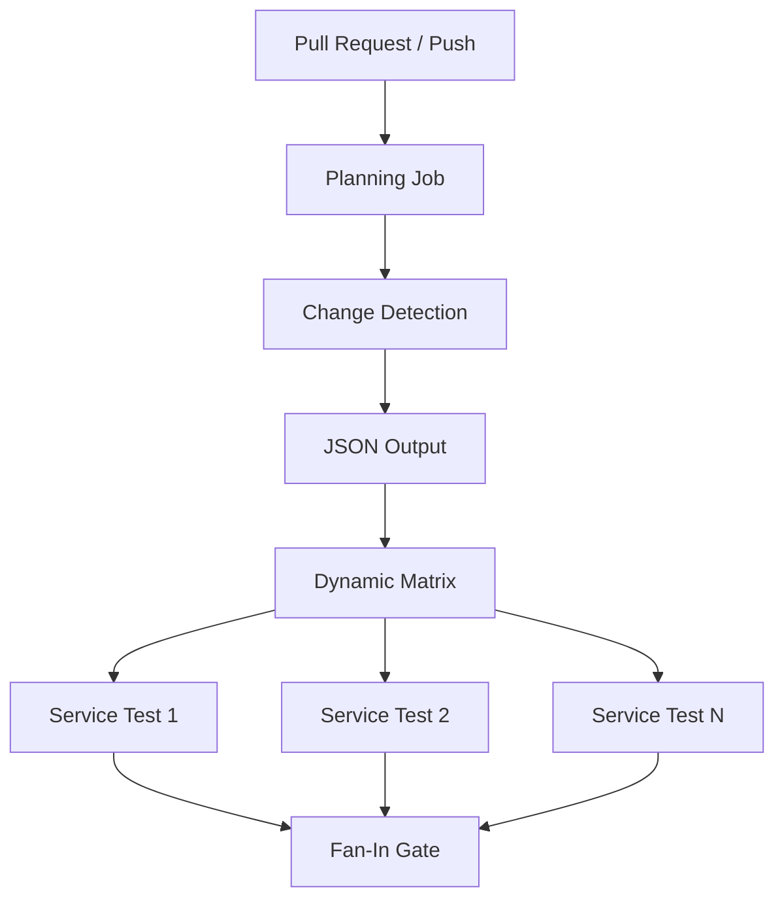
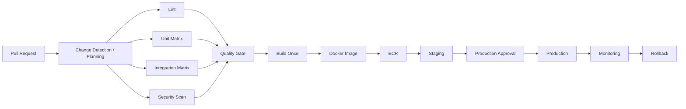

# 05- Matrix Strategy Questions

## Overview

GitHub Actions matrix strategies provide a declarative way to execute the same job across multiple combinations of inputs.

They are commonly used for:

- Testing multiple Python versions.
- Testing multiple database engines.
- Validating multiple operating systems.
- Building multiple architectures.
- Testing multiple application versions.
- Deploying multiple services.
- Running compatibility suites.
- Generating parallel CI workloads.

A matrix is more than a YAML convenience. At production scale, it becomes a **workload-generation mechanism** that directly affects:

- CI duration.
- Runner capacity.
- Cost.
- Failure isolation.
- Artifact management.
- Cache design.
- Dependency graphs.
- Security boundaries.
- Deployment behavior.

For a senior backend engineer, the important question is not simply:

> "How do I define a matrix?"

It is:

> "How do I design a matrix that provides meaningful coverage without creating unnecessary execution, cost, complexity, or security risk?"

---

## Matrix Execution Model

A normal job executes once:

```text
Job
 ↓
One runner
 ↓
One execution
```

A matrix expands one job definition into multiple job executions:

```text
Matrix Definition
       ↓
Combination Expansion
       ↓
┌──────────────┬──────────────┬──────────────┐
│ Combination 1│ Combination 2│ Combination 3│
└──────────────┴──────────────┴──────────────┘
       ↓              ↓              ↓
    Runner          Runner          Runner
```

For example:

```yaml
jobs:
  test:
    runs-on: ubuntu-latest

    strategy:
      matrix:
        python:
          - "3.11"
          - "3.12"
          - "3.13"

    steps:
      - uses: actions/checkout@v5

      - uses: actions/setup-python@v6
        with:
          python-version: ${{ matrix.python }}

      - run: pytest
```

This produces three job executions:

```text
Python 3.11
Python 3.12
Python 3.13
```

The workflow definition remains a single job.

---

## Why Matrix Strategies Exist

Without a matrix, engineers often duplicate jobs:

```yaml
test-python-311:
  ...

test-python-312:
  ...

test-python-313:
  ...
```

This creates:

- YAML duplication.
- Configuration drift.
- More maintenance.
- More opportunities for inconsistent behavior.

A matrix expresses the invariant once:

```text
Test procedure
+
Variable
=
Matrix
```

The test logic remains centralized while the compatibility dimension changes.

---

## Basic Matrix

```yaml
jobs:
  test:
    runs-on: ubuntu-latest

    strategy:
      matrix:
        python:
          - "3.11"
          - "3.12"
          - "3.13"

    steps:
      - uses: actions/checkout@v5

      - uses: actions/setup-python@v6
        with:
          python-version: ${{ matrix.python }}

      - run: python --version
      - run: pytest
```

Each execution can access:

```yaml
${{ matrix.python }}
```

---

## Multiple Matrix Dimensions

A matrix can contain multiple dimensions.

```yaml
strategy:
  matrix:
    python:
      - "3.11"
      - "3.12"

    database:
      - postgres
      - mysql
```

This creates:

```text
Python 3.11 + PostgreSQL
Python 3.11 + MySQL
Python 3.12 + PostgreSQL
Python 3.12 + MySQL
```

The number of combinations is approximately:

```text
2 × 2 = 4
```

For:

```text
Python = 3
Database = 3
OS = 2
Architecture = 2
```

the full Cartesian product becomes:

```text
3 × 3 × 2 × 2 = 36 jobs
```

This multiplication effect is one of the most important matrix design considerations.

---

## Matrix Cardinality

Matrix cardinality means the total number of generated combinations.

For dimensions:

```text
D1 × D2 × D3 × ... × Dn
```

the total number of combinations is the Cartesian product of the dimensions before `include`/`exclude` adjustments.

Example:

```yaml
matrix:
  python: ["3.11", "3.12", "3.13"]
  database: ["postgres", "mysql"]
  os: [ubuntu-latest, windows-latest]
```

Cardinality:

```text
3 × 2 × 2 = 12
```

A matrix that starts with a small number of dimensions can become expensive very quickly.

---

## Matrix Cardinality Is a Design Decision

Do not automatically test every possible combination.

For example:

```text
3 Python versions
× 3 databases
× 3 operating systems
× 2 architectures
× 2 dependency modes
=
108 combinations
```

If each job consumes 8 minutes:

```text
108 × 8 = 864 runner-minutes
```

Parallelism may reduce wall-clock duration, but it does not eliminate:

- Runner consumption.
- Queue pressure.
- Storage.
- Artifact volume.
- Dependency download traffic.
- Cost.

The right matrix is based on **meaningful compatibility coverage**, not maximum possible combinations.

---

## Matrix Design Strategy

A production matrix should answer:

1. What compatibility dimension is important?
2. Which combinations are actually supported?
3. Which combinations catch real regressions?
4. Which combinations belong in PR CI?
5. Which combinations belong in nightly CI?
6. Which combinations belong in release validation?
7. What is the runner capacity?
8. What is the expected execution cost?

A useful model is:

```text
Coverage Value
      ÷
Execution Cost
```

The goal is not mathematical optimization but intentional test selection.

---

## Matrix + `fail-fast`

Example:

```yaml
strategy:
  fail-fast: true

  matrix:
    python:
      - "3.11"
      - "3.12"
      - "3.13"
```

`fail-fast` controls whether GitHub Actions cancels in-progress and queued matrix jobs when a matrix job fails.

With:

```yaml
fail-fast: true
```

an early failure can cause other matrix executions to be cancelled.

With:

```yaml
fail-fast: false
```

the other combinations continue.

---

## When to Use `fail-fast: true`

Useful when:

- Fast feedback matters.
- Matrix combinations are equivalent.
- One failure indicates that additional combinations provide little immediate value.
- The matrix is used for exploratory compatibility testing.

Example:

```text
Python 3.11 fails
      ↓
PR feedback already actionable
      ↓
Cancel remaining combinations
```

---

## When to Use `fail-fast: false`

Useful when every matrix combination provides independent information.

For example:

```yaml
strategy:
  fail-fast: false

  matrix:
    python:
      - "3.11"
      - "3.12"
      - "3.13"
    database:
      - postgres
      - mysql
```

You may want all combinations to complete so the team knows whether the failure is:

```text
Python-specific
Database-specific
Cross-product compatibility issue
```

---

## `continue-on-error` with Matrices

Matrix entries can represent experimental or non-blocking combinations.

Example:

```yaml
strategy:
  matrix:
    python:
      - "3.11"
      - "3.12"
      - "3.13"

    include:
      - python: "3.13"
        experimental: true

continue-on-error: ${{ matrix.experimental }}
```

The important distinction is:

```text
fail-fast
```

controls matrix cancellation behavior.

Whereas:

```text
continue-on-error
```

controls whether a job failure is treated as allowed.

These are separate concepts.

---

## Production Caution with `continue-on-error`

Do not make critical production compatibility tests non-blocking without a deliberate reason.

Bad design:

```yaml
continue-on-error: true
```

for every matrix combination.

This can turn CI into a reporting system rather than a quality gate.

A better approach is to explicitly mark experimental combinations:

```yaml
include:
  - python: "3.13"
    experimental: true
```

and keep stable supported combinations blocking.

---

## `max-parallel`

`max-parallel` controls how many matrix jobs can execute concurrently.

Example:

```yaml
strategy:
  max-parallel: 3

  matrix:
    python:
      - "3.11"
      - "3.12"
      - "3.13"
      - "3.14"
```

There may be four combinations, but only three are allowed to execute concurrently.

This is useful when:

- Runner capacity is limited.
- PostgreSQL instances are overloaded.
- Integration tests consume significant resources.
- External APIs impose rate limits.
- Self-hosted runners have finite capacity.

---

## `max-parallel` vs Runner Capacity

Consider:

```text
Matrix jobs = 50
Runner capacity = 10
max-parallel = 20
```

The matrix cannot actually execute 20 jobs simultaneously if only 10 suitable runners are available.

Therefore:

```text
Matrix size
≠
Actual parallelism
```

Actual throughput depends on:

```text
Matrix size
+
max-parallel
+
Runner availability
+
Runner labels/groups
+
Repository/organization capacity
```

---

## Matrix with PostgreSQL

A realistic backend test matrix can test multiple Python versions against PostgreSQL.

```yaml
jobs:
  integration:
    runs-on: ubuntu-latest

    strategy:
      fail-fast: false

      matrix:
        python:
          - "3.11"
          - "3.12"
        postgres:
          - "16"
          - "17"

    services:
      postgres:
        image: postgres:${{ matrix.postgres }}
        env:
          POSTGRES_USER: test
          POSTGRES_PASSWORD: test
          POSTGRES_DB: app_test
        ports:
          - 5432:5432
        options: >-
          --health-cmd="pg_isready -U test -d app_test"
          --health-interval=10s
          --health-timeout=5s
          --health-retries=5

    steps:
      - uses: actions/checkout@v5

      - uses: actions/setup-python@v6
        with:
          python-version: ${{ matrix.python }}

      - run: pip install -r requirements.txt
      - run: pytest
```

This produces four independent environments.

---

## Matrix with PostgreSQL and Redis

For a Django or FastAPI application:

```yaml
strategy:
  matrix:
    python:
      - "3.11"
      - "3.12"

services:
  postgres:
    image: postgres:17
    env:
      POSTGRES_USER: test
      POSTGRES_PASSWORD: test
      POSTGRES_DB: app_test
    ports:
      - 5432:5432

  redis:
    image: redis:7
    ports:
      - 6379:6379
```

Environment:

```text
Matrix Job
 ├── Python
 ├── PostgreSQL
 ├── Redis
 └── pytest
```

This is particularly useful for integration testing.

---

## Matrix + Django

A Django compatibility matrix might look like:

```yaml
strategy:
  matrix:
    python:
      - "3.11"
      - "3.12"
      - "3.13"

env:
  DJANGO_SETTINGS_MODULE: config.settings.test

steps:
  - uses: actions/checkout@v5

  - uses: actions/setup-python@v6
    with:
      python-version: ${{ matrix.python }}

  - run: pip install -r requirements.txt
  - run: python manage.py migrate
  - run: pytest
```

The application code remains unchanged.

Only the runtime dimension changes.

---

## Matrix + FastAPI

A FastAPI service can use the same model:

```yaml
strategy:
  matrix:
    python:
      - "3.11"
      - "3.12"

steps:
  - uses: actions/checkout@v5

  - uses: actions/setup-python@v6
    with:
      python-version: ${{ matrix.python }}

  - run: pip install -r requirements.txt
  - run: pytest tests/
```

The matrix should test meaningful compatibility dimensions rather than simply increasing job count.

---

## Matrix + Operating Systems

Example:

```yaml
strategy:
  matrix:
    os:
      - ubuntu-latest
      - windows-latest

runs-on: ${{ matrix.os }}
```

This is useful for software that supports multiple operating systems.

For a Linux-only backend service, adding Windows simply because it is technically possible provides little value.

---

## Matrix + Architecture

A build pipeline may test:

```yaml
strategy:
  matrix:
    architecture:
      - amd64
      - arm64
```

This is particularly useful for:

- Docker images.
- Native Python dependencies.
- Multi-platform deployments.
- ARM-based cloud infrastructure.

Architecture testing becomes important when packages contain native extensions.

---

## Matrix + Docker Buildx

A production image pipeline may build multiple platforms:

```yaml
strategy:
  matrix:
    platform:
      - linux/amd64
      - linux/arm64
```

However, multi-platform Docker builds often benefit from Buildx's native multi-platform capabilities rather than creating independent matrix jobs unnecessarily.

The decision should consider:

- Build duration.
- Builder capacity.
- Cache reuse.
- Registry behavior.
- Image manifest creation.
- Cost.

---

## Matrix `include`

`include` allows additional or modified combinations.

Example:

```yaml
strategy:
  matrix:
    python:
      - "3.11"
      - "3.12"

    database:
      - postgres
      - mysql

    include:
      - python: "3.13"
        database: postgres
        experimental: true
```

The exact resulting combinations depend on whether the included values match or extend existing combinations.

Use `include` deliberately rather than treating it as an arbitrary configuration bucket.

---

## Adding Metadata with `include`

A useful pattern is attaching metadata:

```yaml
strategy:
  matrix:
    python:
      - "3.11"
      - "3.12"

    include:
      - python: "3.13"
        experimental: true
```

Then:

```yaml
continue-on-error: ${{ matrix.experimental }}
```

This allows matrix entries to carry behavior alongside the primary dimension.

---

## `include` for Special Configurations

Example:

```yaml
strategy:
  matrix:
    python:
      - "3.11"
      - "3.12"

    database:
      - postgres

    include:
      - python: "3.13"
        database: postgres
        experimental: true
```

This is useful when one configuration differs from the standard support matrix.

---

## Matrix `exclude`

`exclude` removes combinations that should not run.

Example:

```yaml
strategy:
  matrix:
    python:
      - "3.11"
      - "3.12"
      - "3.13"

    database:
      - postgres
      - mysql

    exclude:
      - python: "3.13"
        database: mysql
```

The resulting matrix excludes that unsupported combination.

---

## When to Use `exclude`

Use `exclude` when the Cartesian product is generally valid but specific combinations are unsupported.

Example:

```text
Python 3.13
+
MySQL
=
Unsupported dependency combination
```

Rather than duplicating the entire matrix, remove the invalid combination.

---

## Matrix Expressions

Matrix values can be used throughout the job.

```yaml
name: test-${{ matrix.python }}

runs-on: ${{ matrix.os }}

env:
  DATABASE: ${{ matrix.database }}
```

They can also participate in:

```text
Cache keys
Artifact names
Docker tags
Environment variables
Conditional logic
Action inputs
Service configuration
```

---

## Matrix + `needs`

Matrix jobs can depend on a previous planning or build job.

```yaml
jobs:
  plan:
    runs-on: ubuntu-latest
    outputs:
      services: ${{ steps.plan.outputs.services }}

    steps:
      - id: plan
        run: |
          echo 'services=["orders","payments"]' >> "$GITHUB_OUTPUT"

  test:
    needs: plan

    strategy:
      matrix:
        service: ${{ fromJSON(needs.plan.outputs.services) }}

    runs-on: ubuntu-latest

    steps:
      - run: echo "Testing ${{ matrix.service }}"
```

This creates:

```text
Plan
 ↓
JSON output
 ↓
Dynamic matrix
 ↓
Parallel jobs
```

---

## Dynamic Matrix

Static matrix:

```yaml
matrix:
  service:
    - orders
    - payments
```

Dynamic matrix:

```yaml
matrix:
  service: ${{ fromJSON(needs.plan.outputs.services) }}
```

Dynamic matrices are useful when the set of work items depends on:

- Changed files.
- Repository configuration.
- Service inventory.
- Supported versions.
- Generated metadata.
- Environment configuration.

---

## Dynamic Matrix Architecture



The planning job should produce a well-defined contract.

---

## Dynamic Matrix Validation

Do not blindly trust generated JSON.

A planning step should ensure:

- Valid JSON.
- Expected schema.
- Allowed values.
- Reasonable cardinality.
- No unexpected deployment targets.

For example, a service list should not unexpectedly contain:

```text
production
```

when the workflow is intended only to test:

```text
orders
payments
inventory
```

Dynamic workflow generation should be treated as a security and reliability boundary.

---

## Matrix Outputs

Matrix outputs require careful design because multiple matrix executions can produce multiple values.

For example:

```yaml
strategy:
  matrix:
    service:
      - orders
      - payments
```

If every matrix job writes:

```text
result=...
```

the workflow must have a clear strategy for associating each result with the corresponding matrix combination.

A better pattern is often:

```text
Matrix
 ↓
Artifacts named by matrix key
 ↓
Fan-in aggregation job
```

rather than trying to force many independent results into one scalar output.

---

## Matrix Artifacts

Use unique artifact names.

Good:

```yaml
name: coverage-${{ matrix.python }}
```

Bad:

```yaml
name: coverage
```

when multiple jobs independently produce an artifact with the same conceptual name.

For multiple dimensions:

```yaml
name: coverage-${{ matrix.python }}-${{ matrix.database }}
```

This creates traceable outputs.

---

## Matrix Test Reports

Example:

```yaml
- name: Run tests
  run: |
    pytest \
      --junitxml="reports/junit-${{ matrix.python }}-${{ matrix.database }}.xml"
```

Then:

```yaml
- name: Upload report
  if: ${{ !cancelled() }}
  uses: actions/upload-artifact@v4
  with:
    name: test-report-${{ matrix.python }}-${{ matrix.database }}
    path: reports/
```

This makes failures attributable to specific combinations.

---

## Matrix + Coverage

Each matrix execution can produce separate coverage:

```text
coverage-python-3.11
coverage-python-3.12
coverage-python-3.13
```

For a final aggregated report:

```text
Matrix Jobs
    ↓
Coverage Artifacts
    ↓
Aggregation Job
    ↓
Combined Report
```

Do not assume coverage files from separate runners automatically exist in a shared filesystem.

---

## Matrix and Caching

A matrix can accidentally create cache fragmentation.

Example:

```yaml
key: ${{ runner.os }}-${{ matrix.python }}-${{ hashFiles('**/requirements.lock') }}
```

This may create separate caches for each Python version.

That may be correct if dependencies differ by runtime.

But if the dependency environment is identical, excessive cache dimensions can reduce reuse.

---

## Cache Key Design

Avoid adding every matrix field automatically.

Bad:

```text
OS
Python
Database
Service
Architecture
Branch
Commit SHA
Timestamp
```

This may produce many nearly unique caches.

A cache key should represent the actual dependency state.

For Python:

```yaml
key: ${{ runner.os }}-python-${{ matrix.python }}-${{ hashFiles('**/requirements.lock') }}
```

The database version usually does not need to be part of a Python package cache key.

---

## Matrix + Artifact vs Cache

| Requirement | Matrix Artifact | Cache |
|---|---|---|
| Test report | Yes | No |
| Build output | Yes | No |
| Docker dependency cache | No | Yes |
| Python dependencies | No | Yes |
| Coverage result | Yes | No |
| Release binary | Yes | No |
| Reusable intermediate dependency state | No | Yes |

A cache is an optimization.

An artifact is an output.

Never make production correctness depend on a cache.

---

## Matrix and Reusable Workflows

A caller can invoke a reusable workflow using a matrix.

Example:

```yaml
jobs:
  ci:
    strategy:
      matrix:
        python:
          - "3.11"
          - "3.12"

    uses: organization/platform/.github/workflows/python-ci.yml@v1

    with:
      python-version: ${{ matrix.python }}
```

This allows organizations to centralize CI implementation while allowing repositories to select compatibility dimensions.

---

## Matrix + Reusable Workflow Design

A reusable workflow should define a clear contract:

```text
Inputs
 ↓
Workflow
 ↓
Jobs
 ↓
Outputs
```

Do not expose unnecessary implementation details.

For example:

```yaml
on:
  workflow_call:
    inputs:
      python-version:
        required: true
        type: string
```

The caller controls the compatibility dimension while the platform team controls the CI implementation.

---

## Matrix vs Composite Action

These solve different problems.

| Matrix | Composite Action |
|---|---|
| Creates multiple job executions | Packages multiple steps |
| Controls execution combinations | Reuses step logic |
| Operates at job strategy level | Operates inside a job |
| Good for compatibility testing | Good for reusable procedures |
| Can increase runner usage | Usually does not multiply jobs |

Example:

```text
Matrix
 ↓
Python 3.11
Python 3.12
Python 3.13
 ↓
Each job invokes same composite action
```

---

## Matrix and Fan-Out/Fan-In

A common architecture is:

```text
                ┌── Test Python 3.11 ──┐
                │                      │
Build/Plan ─────┼── Test Python 3.12 ──┼── Aggregate
                │                      │
                └── Test Python 3.13 ──┘
```

This is:

```text
Fan-out
 ↓
Parallel matrix execution
 ↓
Fan-in
```

The fan-in job should depend on the matrix job.

---

## Matrix as a Compatibility Contract

A matrix should represent supported compatibility.

For example:

```yaml
matrix:
  python:
    - "3.11"
    - "3.12"
    - "3.13"
```

This communicates:

```text
Supported runtime compatibility
```

It should not become:

```text
Every runtime that happens to work
```

A senior engineer should define support policy first and derive the matrix from that policy.

---

## PR Matrix vs Nightly Matrix

Not every combination belongs in pull request CI.

A practical strategy:

```text
PR
 ↓
Small high-value matrix

Nightly
 ↓
Broader compatibility matrix

Release
 ↓
Production support matrix
```

Example:

| Pipeline | Matrix Scope |
|---|---|
| PR | Supported Python versions |
| PR | Primary database |
| Nightly | All supported databases |
| Nightly | OS compatibility |
| Release | Full supported matrix |
| Experimental | Upcoming runtimes |

This reduces feedback time without eliminating broader coverage.

---

## Matrix and Cost Optimization

Matrix jobs can multiply runner consumption.

Optimize by:

- Removing redundant combinations.
- Using targeted matrices.
- Using `exclude`.
- Splitting PR and nightly coverage.
- Limiting `max-parallel`.
- Caching dependencies correctly.
- Avoiding unnecessary artifact uploads.
- Reusing build outputs.
- Detecting changed services in monorepos.
- Using dedicated compatibility jobs only where needed.

---

## Matrix and Scalability

At small scale:

```text
5 matrix jobs
```

is trivial.

At enterprise scale:

```text
100 repositories
×
20 matrix jobs
×
10 workflow runs/day
```

can create substantial runner demand.

The platform architecture must consider:

```text
Runner capacity
Queue time
Concurrency
Storage
Artifact volume
Cache volume
External service capacity
Cost
```

---

## Matrix and Downstream Services

Integration matrices can overload shared services.

Example:

```text
20 matrix jobs
       ↓
PostgreSQL
Redis
Kafka
```

If every job connects to a shared environment, you may create:

- Connection spikes.
- CPU contention.
- Lock contention.
- Data collisions.
- Test flakiness.

Prefer isolated service containers or ephemeral test environments where practical.

---

## Matrix and Database Isolation

A database matrix should normally provide isolation.

For example:

```text
Job 1 → PostgreSQL container A
Job 2 → PostgreSQL container B
Job 3 → PostgreSQL container C
```

rather than:

```text
20 jobs
 ↓
One shared test database
```

The latter creates coupling between supposedly independent matrix executions.

---

## Matrix and Redis

Redis integration tests should also consider isolation.

Avoid:

```text
All matrix jobs
 ↓
Same Redis database
```

unless explicit namespace isolation exists.

Prefer:

```text
Matrix Job
 ↓
Dedicated Redis service
```

This reduces cross-test contamination.

---

## Matrix and Kafka

Kafka-based integration tests can become expensive because each matrix execution may need:

- Broker startup.
- Topic creation.
- Consumer initialization.
- Producer setup.
- Readiness checks.

If Kafka is required only for a small subset of tests, consider a targeted integration matrix rather than adding Kafka to every CI combination.

---

## Matrix and Celery

For Django/FastAPI systems using Celery:

```text
Application
 ↓
Redis/RabbitMQ
 ↓
Celery Worker
```

A matrix job may require additional processes.

Before multiplying such jobs, evaluate:

- Worker startup time.
- Broker readiness.
- Task cleanup.
- Test isolation.
- Resource consumption.

A matrix is useful only when the additional combinations provide meaningful coverage.

---

## Matrix and End-to-End Testing

E2E tests are usually much more expensive than unit tests.

A common mistake is:

```text
Every Python version
×
Every database
×
Every browser
×
Every E2E suite
```

This can produce a huge matrix.

Prefer:

```text
Unit tests
 → broad matrix

Integration tests
 → moderate matrix

E2E tests
 → focused production-like matrix
```

---

## Matrix and Security Scans

Security scanning usually does not need to run once per Python version.

Avoid:

```text
Python 3.11 → security scan
Python 3.12 → security scan
Python 3.13 → security scan
```

if the scanner analyzes the same source tree.

Instead:

```text
Source
 ├── Security scan
 └── Matrix tests
```

This reduces redundant work.

---

## Matrix and Build Jobs

Do not automatically rebuild the application for every test matrix combination.

Prefer:

```text
Source
 ↓
Tests
 ↓
Build once
 ↓
Immutable artifact
 ↓
Deploy
```

For Docker:

```text
Source
 ↓
Docker Buildx
 ↓
Image digest
 ↓
ECR
 ↓
Staging
 ↓
Production
```

The test matrix validates compatibility; it does not necessarily need to produce independent production images.

---

## Matrix and Build Once Deploy Many

A production architecture should normally separate:

```text
Compatibility Testing
```

from:

```text
Production Artifact Creation
```

Example:

```text
PR
 ↓
Python Matrix
 ↓
Database Matrix
 ↓
Security
 ↓
Build
 ↓
Docker Image
 ↓
ECR
 ↓
Staging
 ↓
Approval
 ↓
Production
```

The production artifact should not be rebuilt separately for each environment.

---

## Matrix and Deployment

Deployment matrices require more caution than test matrices.

Example:

```yaml
strategy:
  matrix:
    region:
      - ap-south-1
      - eu-west-1
```

This means multiple deployment executions can occur.

Before doing this, consider:

- Concurrency.
- Failure behavior.
- Partial deployment.
- Rollback.
- Region-specific capacity.
- Database migrations.
- Traffic routing.
- Artifact identity.

A deployment matrix is an operational architecture decision, not simply a testing feature.

---

## Matrix Deployment Failure

Suppose:

```text
Region A → success
Region B → failure
Region C → success
```

The system is now partially deployed.

A senior design must answer:

```text
Should successful regions remain deployed?
Should all regions roll back?
Should traffic be shifted?
Should the failed region retry?
How is state reconciled?
```

This is why deployment matrices require explicit failure semantics.

---

## Matrix and Concurrency

Matrix jobs can interact with concurrency controls.

Example:

```yaml
concurrency:
  group: production-${{ matrix.region }}
  cancel-in-progress: false
```

This prevents two deployments of the same region from running simultaneously while allowing different regions to proceed independently.

Without careful grouping, unrelated matrix jobs may block each other.

---

## Matrix Concurrency Design

Possible grouping strategies:

```text
production
```

means:

```text
All production matrix jobs share one lock.
```

Whereas:

```text
production-${{ matrix.region }}
```

means:

```text
Each region has its own lock.
```

The correct choice depends on the shared resource being protected.

---

## Matrix + Environment Protection

A deployment matrix may use:

```yaml
environment:
  name: production
```

Every matrix execution may then participate in environment protection.

For high-risk deployments, consider whether approval should be:

```text
Per deployment
```

or:

```text
Per overall release
```

A separate promotion job can sometimes provide a clearer approval boundary.

---

## Matrix Failure Semantics

When one matrix job fails, determine:

```text
Should other jobs continue?
Should queued jobs be cancelled?
Should the fan-in job execute?
Should deployment be blocked?
Should artifacts still be collected?
```

These questions should be answered explicitly.

---

## Matrix and `always()`

A fan-in reporting job may need:

```yaml
if: ${{ !cancelled() }}
```

to process results from completed matrix jobs after one or more failures.

However, reporting and deployment should be separated.

Do not use:

```yaml
if: always()
```

to bypass production quality gates.

---

## Matrix and Deployment Gates

A production deployment should depend on a gate:

```yaml
deploy:
  needs:
    - test
    - security
    - build
```

If `test` is a matrix job, the dependency represents the matrix's overall completion status.

This gives the architecture:

```text
Matrix
 ↓
All required combinations
 ↓
Quality Gate
 ↓
Deployment
```

---

## Interview Question: Why Use a Matrix?

A strong answer:

> A matrix allows one job definition to execute across multiple controlled combinations such as Python versions, databases, operating systems, or architectures. It reduces YAML duplication and makes compatibility testing explicit. However, matrix dimensions multiply execution count, so the matrix must be designed around meaningful support coverage rather than exhaustive combinations.

---

## Interview Question: How Does Matrix Cardinality Affect CI?

Example:

```text
3 Python versions
×
2 databases
×
2 operating systems
=
12 jobs
```

Adding one more dimension:

```text
× 2 architectures
=
24 jobs
```

Therefore, each additional dimension can multiply:

- Runner usage.
- Queue pressure.
- Artifact generation.
- Cache operations.
- External service load.
- Cost.

---

## Interview Question: What Is `fail-fast`?

A strong answer:

> `fail-fast` controls whether GitHub Actions cancels in-progress and queued matrix jobs when a matrix execution fails. It is useful when early failure makes remaining combinations less valuable, but it should be disabled when every combination provides independent diagnostic or compatibility information.

---

## Interview Question: What Is `max-parallel`?

A strong answer:

> `max-parallel` limits the number of matrix jobs that GitHub Actions attempts to run concurrently. It is useful for controlling runner capacity, downstream service load, and cost. It does not guarantee that that number of runners will actually be available.

---

## Interview Question: `fail-fast` vs `continue-on-error`

| Feature | `fail-fast` | `continue-on-error` |
|---|---|---|
| Scope | Matrix strategy | Job execution |
| Purpose | Control cancellation | Allow failure |
| Failure effect | Can cancel other matrix jobs | Current job can be non-blocking |
| Typical use | Fast feedback | Experimental combinations |
| Security/quality impact | Execution optimization | Changes failure semantics |

---

## Interview Question: How Would You Test Python and PostgreSQL Compatibility?

Example:

```yaml
strategy:
  fail-fast: false

  matrix:
    python:
      - "3.11"
      - "3.12"
      - "3.13"

    postgres:
      - "16"
      - "17"
```

This creates:

```text
3 × 2 = 6
```

test environments.

For each job:

```text
Python
+
PostgreSQL
+
Application
+
pytest
```

The matrix should be restricted to combinations that the application actually supports.

---

## Interview Question: How Would You Reduce Matrix Cost?

A strong answer should mention several layers:

1. Remove redundant combinations.
2. Use `exclude`.
3. Separate PR and nightly matrices.
4. Use targeted integration/E2E matrices.
5. Cache dependencies.
6. Use `max-parallel` to protect constrained resources.
7. Use change detection for monorepos.
8. Avoid rebuilding identical production artifacts.
9. Aggregate reports instead of producing unnecessary artifacts.
10. Monitor queue time and runner consumption.

---

## Interview Question: How Would You Design a Monorepo Matrix?

Example:

```text
Pull Request
 ↓
Change Detection
 ↓
Affected Services
 ↓
Dynamic JSON Matrix
 ↓
Service Tests
 ↓
Fan-In Gate
```

For example:

```yaml
matrix:
  service: ${{ fromJSON(needs.plan.outputs.services) }}
```

This avoids running every service's full test suite for every change.

However, dependency relationships must be modeled correctly. Testing only directly changed services can miss failures in dependent services.

---

## Interview Question: What Are the Risks of a Dynamic Matrix?

Potential risks include:

- Invalid JSON.
- Unexpected cardinality.
- Unsupported values.
- Excessive runner consumption.
- Untrusted input influencing privileged jobs.
- Incorrect dependency detection.
- Production targets being generated accidentally.
- Difficult debugging.

A dynamic matrix should therefore have:

```text
Validation
+
Allowlist
+
Cardinality limits
+
Clear ownership
```

---

## Interview Question: How Do You Handle Matrix Outputs?

Do not assume multiple matrix executions can safely write one scalar output.

Prefer:

```text
Matrix Jobs
 ↓
Unique Artifacts
 ↓
Aggregation Job
```

when each combination produces an independent result.

If the data is small and structured, use explicitly designed output contracts and include matrix identity in the data.

---

## Interview Question: How Would You Test Multiple Databases?

Example:

```yaml
matrix:
  database:
    - postgres
    - mysql
```

Then configure the service and application connection according to:

```yaml
${{ matrix.database }}
```

The test code should remain common where possible.

The matrix represents infrastructure variation rather than duplicated test logic.

---

## Interview Question: Should Security Scanning Be Inside the Matrix?

Usually not if the scanner analyzes the same source independently of the matrix dimension.

Prefer:

```text
Lint
Unit Matrix
Integration Matrix
Security Scan
        ↓
Quality Gate
```

rather than:

```text
Python 3.11 → Security
Python 3.12 → Security
Python 3.13 → Security
```

The final decision depends on whether the security tool's behavior actually varies with the matrix dimension.

---

## Interview Question: Should E2E Tests Use the Full Matrix?

Usually, the E2E matrix should be narrower than the unit-test matrix because E2E tests are more expensive and often require additional infrastructure.

A practical architecture is:

```text
Unit Tests
 → Broad Matrix

Integration Tests
 → Moderate Matrix

E2E
 → Focused Production-Like Matrix
```

The exact dimensions should be driven by supported runtime and deployment configurations.

---

## Interview Scenario: Production Must Not Deploy Twice

Requirement:

> Production deployment must never run concurrently.

A matrix is not sufficient.

Use:

```yaml
concurrency:
  group: production
  cancel-in-progress: false
```

Then combine it with:

```text
Immutable artifact
+
Environment protection
+
Approval
+
Health validation
+
Rollback
```

If the deployment itself is regional:

```yaml
concurrency:
  group: production-${{ matrix.region }}
```

may be appropriate if regions can safely deploy independently.

---

## Interview Scenario: Three Python Versions, One Experimental

Requirement:

```text
3.11 → required
3.12 → required
3.13 → experimental
```

Possible design:

```yaml
strategy:
  fail-fast: false

  matrix:
    python:
      - "3.11"
      - "3.12"

    include:
      - python: "3.13"
        experimental: true

continue-on-error: ${{ matrix.experimental }}
```

This keeps stable versions blocking while allowing experimentation.

---

## Interview Scenario: PostgreSQL and Redis Integration Tests

A strong design:

```text
Matrix
 ↓
Runner
 ├── PostgreSQL service
 ├── Redis service
 └── Application tests
```

Each matrix execution receives isolated services.

Use readiness checks rather than assuming that container startup means service readiness.

---

## Interview Scenario: CI Queue Is Growing

Suppose:

```text
Matrix size increased from 10 → 80 jobs
```

and CI queue time increased significantly.

Investigate:

```text
Matrix cardinality
 ↓
Runner capacity
 ↓
max-parallel
 ↓
Runner labels/groups
 ↓
Job duration
 ↓
Downstream service contention
 ↓
Cache performance
```

Do not immediately add more runners without understanding whether the matrix itself contains unnecessary combinations.

---

## Interview Scenario: Matrix Jobs Overload PostgreSQL

Suppose 30 integration jobs all start simultaneously.

Symptoms:

```text
Connection errors
Slow queries
Timeouts
Flaky tests
```

Possible corrective actions:

- Reduce `max-parallel`.
- Increase isolated service capacity.
- Use service containers.
- Reduce unnecessary matrix combinations.
- Improve connection pooling.
- Separate integration matrices.
- Use ephemeral databases.
- Move expensive compatibility tests to scheduled workflows.

The problem may be CI architecture rather than PostgreSQL itself.

---

## Interview Scenario: Matrix Deployment Partially Fails

Suppose:

```text
Region A → success
Region B → failure
Region C → success
```

A senior engineer should not simply rerun the entire matrix.

First determine:

```text
Artifact identity
Deployment state
Traffic state
Health state
Failure cause
Rollback capability
```

Then decide whether to:

```text
Retry B
Rollback successful regions
Pause promotion
Shift traffic
```

based on the deployment architecture.

---

## Interview Scenario: Dynamic Matrix Generates 500 Jobs

A planning job unexpectedly generates:

```text
500 combinations
```

The correct response is not simply to let the workflow execute.

Investigate:

```text
Why did cardinality increase?
Was input malformed?
Was change detection incorrect?
Was a new dimension introduced?
Is the matrix bounded?
```

Add defensive controls:

```text
Schema validation
+
Allowlist
+
Cardinality validation
+
Fail closed
```

---

## Matrix Security

Matrix values can influence:

- Runner selection.
- Docker image names.
- Artifact names.
- Deployment targets.
- AWS resources.
- Environment selection.
- Commands.

Do not treat matrix data as automatically trusted.

For privileged operations, prefer allowlisted values.

Example:

```yaml
case "${{ matrix.environment }}" in
  staging)
    ...
    ;;
  production)
    ...
    ;;
esac
```

For more complex workflows, pass values through environment variables and validate them in the execution environment.

---

## Matrix and Self-Hosted Runners

A matrix can increase pressure on self-hosted runners.

Example:

```yaml
strategy:
  matrix:
    architecture:
      - amd64
      - arm64

runs-on: [self-hosted, ${{ matrix.architecture }}]
```

The architecture must have sufficient runner capacity.

Otherwise:

```text
Matrix expands
 ↓
Jobs queue
 ↓
Matching runners unavailable
 ↓
Long CI delay
```

Matrix design and runner capacity must therefore be planned together.

---

## Matrix and Runner Groups

Runner groups can enforce execution boundaries.

Example:

```text
Public CI
 ↓
GitHub-hosted runners

Private integration tests
 ↓
Private runner group

Production deployment
 ↓
Restricted deployment runner group
```

Do not allow untrusted pull request code to reach privileged self-hosted runner groups unnecessarily.

---

## Matrix and AWS

A test matrix may not need AWS credentials at all.

Keep:

```text
Test Matrix
```

separate from:

```text
AWS Deployment
```

A safer architecture is:

```text
Matrix Tests
     ↓
Quality Gate
     ↓
Build
     ↓
OIDC Deployment Job
```

This reduces the number of jobs that require:

```yaml
id-token: write
```

and therefore reduces cloud credential exposure.

---

## Matrix and OIDC

Avoid granting OIDC permissions to every matrix test job.

Prefer:

```yaml
permissions:
  contents: read
```

for ordinary test jobs.

Then:

```yaml
deploy:
  permissions:
    contents: read
    id-token: write
```

This creates privilege separation.

---

## Matrix and Third-Party Actions

Every matrix execution may run the actions used by the job.

If a matrix has:

```text
30 jobs
```

a compromised action can potentially execute in all 30 environments.

Reduce blast radius through:

- Least-privilege permissions.
- SHA pinning.
- Trusted action sources.
- Separate privileged deployment jobs.
- Restricted self-hosted runners.
- No unnecessary secrets.

---

## Matrix and Secrets

Do not expose production secrets to the test matrix merely because one matrix combination needs them.

Prefer:

```text
Matrix Tests
 ↓
No production secrets

Deployment Job
 ↓
Production environment secrets
```

This follows privilege separation.

---

## Matrix and Artifacts Security

Each matrix job may produce artifacts.

Artifact names should identify the source:

```yaml
name: test-results-${{ matrix.python }}-${{ matrix.database }}
```

Do not include secrets or sensitive infrastructure information in artifact names or report contents.

---

## Matrix and Cache Security

Caches should not be treated as trusted release artifacts.

Do not use a cache as the source of truth for:

```text
Production Docker image
Production binary
Deployment package
Release artifact
```

Use immutable artifacts or registry objects for release promotion.

---

## Matrix and Monorepos

For a monorepo:

```text
services/
 ├── orders/
 ├── payments/
 ├── inventory/
 └── users/
```

A static matrix:

```yaml
matrix:
  service:
    - orders
    - payments
    - inventory
    - users
```

runs everything.

A dynamic matrix can instead determine affected services.

However, dependency analysis must account for shared:

```text
Libraries
Schemas
Database migrations
Infrastructure
API contracts
```

Otherwise selective testing can create false confidence.

---

## Matrix and Shared Libraries

Suppose:

```text
shared/
orders/
payments/
```

A change to:

```text
shared/
```

may affect both:

```text
orders
payments
```

The planning job must understand the dependency graph.

Simple path matching is not always sufficient for a large monorepo.

---

## Matrix and API Compatibility

For microservices, a matrix can test combinations such as:

```text
orders v2
payments v1
```

This is useful when backward compatibility is required.

However, compatibility matrices can grow rapidly.

Use targeted contract testing where possible rather than testing every possible service version combination.

---

## Matrix and gRPC

For gRPC services, a matrix may test:

```text
Client version
+
Server version
```

Example:

```text
Client v1 → Server v1
Client v1 → Server v2
Client v2 → Server v2
```

This can validate protocol compatibility.

Do not automatically test every historical version unless the support policy requires it.

---

## Matrix and Kafka

For event-driven systems, compatibility can include:

```text
Producer version
+
Consumer version
+
Schema version
```

A full Cartesian matrix can become expensive.

Prefer explicit supported compatibility pairs.

---

## Matrix Design Anti-Patterns

### Cartesian Explosion

```text
Every possible combination
```

without a support policy.

### Duplicate Security Scans

Running identical source scans once per runtime.

### Shared Integration Infrastructure

Many matrix jobs using one mutable database or Redis instance.

### Unbounded Dynamic Matrices

Repository changes unexpectedly generate hundreds of jobs.

### Matrix-Based Production Rebuilds

Building separate production artifacts for every matrix combination.

### Excessive Artifact Generation

Every matrix job uploads large logs or binaries regardless of need.

### Unlimited Parallelism

Starting too many integration jobs simultaneously.

### Matrix as a Substitute for Dependency Modeling

Running every combination because the workflow does not understand actual compatibility relationships.

---

## Matrix Troubleshooting

Use:

```text
Symptom
→ Possible Causes
→ Isolation Strategy
→ Commands / Checks
→ Root Cause
→ Corrective Action
→ Prevention
```

---

## Troubleshooting: Matrix Is Larger Than Expected

### Symptom

A matrix produces unexpectedly many jobs.

### Possible Causes

- Additional dimension.
- Incorrect `include`.
- Missing `exclude`.
- Dynamic matrix generated unexpected values.
- JSON contains duplicates or unnecessary combinations.

### Isolation Strategy

Calculate:

```text
dimension1 × dimension2 × ...
```

Then inspect generated JSON.

### Corrective Action

- Remove unnecessary dimensions.
- Add explicit `exclude`.
- Validate dynamic input.
- Add cardinality limits.

### Prevention

Treat matrix design as an explicit compatibility contract.

---

## Troubleshooting: Matrix Job Is Skipped

### Possible Causes

- `if` condition.
- Failed `needs` dependency.
- Matrix value does not match expected condition.
- Environment protection.
- Concurrency cancellation.

### Checks

Inspect:

```yaml
needs
if
matrix
concurrency
environment
```

Do not assume a matrix failure when the job was actually skipped by workflow logic.

---

## Troubleshooting: One Matrix Combination Fails

Example:

```text
Python 3.11 → success
Python 3.12 → success
Python 3.13 → failure
```

Investigate the specific dimension:

```text
Runtime
Dependency compatibility
Native extensions
OS
Database
Application behavior
```

Do not treat the entire matrix as one failure.

The matrix exists partly to isolate compatibility failures.

---

## Troubleshooting: All Matrix Jobs Fail

If every combination fails, suspect shared infrastructure first:

- Workflow syntax.
- Checkout.
- Dependency installation.
- Registry availability.
- Runner issue.
- Network.
- Shared configuration.
- Broken action.
- Incorrect environment variable.

If only one combination fails, investigate combination-specific behavior first.

---

## Troubleshooting: Matrix Jobs Time Out

Check:

```text
Job duration
Runner availability
max-parallel
External service capacity
Dependency installation
Docker build time
Database startup
Test suite behavior
```

A timeout may be a capacity problem rather than an application failure.

---

## Troubleshooting: Integration Matrix Is Flaky

Potential causes:

- Shared database.
- Shared Redis.
- Race conditions.
- Insufficient service readiness.
- Port conflicts.
- External APIs.
- Time-dependent tests.
- Resource contention.

Prefer isolated services and deterministic test data.

---

## Troubleshooting: Dynamic Matrix Fails

Check:

```bash
jq empty matrix.json
```

If JSON is valid, inspect its schema.

For example:

```bash
jq -r '.[]' matrix.json
```

Verify:

```text
Expected values
Expected cardinality
No duplicates
No privileged targets
```

---

## Troubleshooting: Matrix Artifacts Are Missing

Check:

- Artifact name.
- Matrix interpolation.
- Artifact path.
- Whether the step executed.
- Whether cancellation prevented upload.
- Whether the report was generated.

Example:

```yaml
name: report-${{ matrix.python }}-${{ matrix.database }}
```

Use unique identifiers.

---

## Troubleshooting: Matrix Cache Misses

Check:

```text
Cache key
Restore keys
OS
Runtime
Lock file hash
Matrix dimensions
```

A cache key containing unnecessary matrix dimensions may create excessive cache fragmentation.

---

## Troubleshooting: Matrix Overloads Services

If PostgreSQL/Redis/Kafka becomes unstable:

1. Reduce `max-parallel`.
2. Check service resource limits.
3. Isolate service instances.
4. Remove unnecessary matrix combinations.
5. Separate expensive integration tests.
6. Move broad compatibility testing to scheduled workflows.

---

## GitHub CLI for Matrix Operations

GitHub CLI can help inspect workflow executions.

List workflows:

```bash
gh workflow list
```

Run a workflow:

```bash
gh workflow run ci.yml
```

List runs:

```bash
gh run list --workflow ci.yml
```

Inspect a run:

```bash
gh run view <run-id>
```

View logs:

```bash
gh run view <run-id> --log
```

Rerun a failed workflow:

```bash
gh run rerun <run-id> --failed
```

For matrix-heavy pipelines, run inspection helps determine:

```text
Which combinations executed?
Which failed?
Which were cancelled?
How long did each take?
```

---

## Matrix Observability

A mature CI platform should monitor:

- Matrix job count.
- Average matrix duration.
- Queue time.
- Failure rate by combination.
- Flaky combinations.
- Runner utilization.
- Cache hit rate.
- Artifact volume.
- Cost.
- Retry rate.

A useful operational view is:

```text
Python 3.11 → 0.5% failures
Python 3.12 → 0.4%
Python 3.13 → 8.2%
```

This reveals compatibility trends that are hidden by aggregate workflow success rates.

---

## Matrix Performance Optimization

Useful optimizations include:

### Dependency Caching

Cache Python dependencies based on lock-file state.

### Parallel Execution

Use matrix parallelism where downstream systems can handle it.

### `max-parallel`

Throttle expensive integration workloads.

### Smaller PR Matrix

Use broad matrices asynchronously.

### Build Once

Do not rebuild identical artifacts across matrix jobs unnecessarily.

### Selective Testing

Use changed-service detection in monorepos.

### Avoid Large Artifacts

Upload only actionable reports.

---

## Matrix Reliability

Reliable matrix design requires:

```text
Deterministic Tests
+
Isolated Dependencies
+
Bounded Parallelism
+
Explicit Failure Semantics
+
Stable Runner Capacity
+
Reproducible Environments
```

Avoid using a matrix to hide flaky test behavior.

If a combination intermittently fails:

```text
Investigate the underlying nondeterminism
```

rather than simply:

```yaml
continue-on-error: true
```

---

## Matrix High Availability Considerations

For CI infrastructure, high availability can mean:

- Multiple runner capacity pools.
- Autoscaling self-hosted runners.
- Ephemeral runners.
- Multiple supported runner images.
- Resilient artifact storage.
- Avoiding a single external integration dependency.

For production deployment matrices, HA also includes:

- Multi-region strategy.
- Traffic management.
- Rollback.
- Health checks.
- Failure isolation.

---

## Matrix Disaster Recovery

CI matrices should not become the only source of production state.

Production recovery should rely on:

```text
Immutable artifacts
+
Artifact registry
+
Infrastructure as Code
+
Deployment metadata
+
Rollback procedure
```

not:

```text
"Rerun the old matrix"
```

A previous production image should be identifiable by digest.

---

## Matrix and Release Management

A release workflow can use a matrix for compatibility validation:

```text
Release Candidate
 ↓
Python Matrix
 ↓
Database Matrix
 ↓
Security
 ↓
Build Once
 ↓
Sign / Attest
 ↓
Registry
 ↓
Promotion
```

The matrix validates the release candidate.

The release artifact itself should remain singular and immutable.

---

## Matrix and Semantic Versioning

A matrix should not create multiple semantic versions simply because it tests multiple environments.

For example:

```text
Python 3.11 → v2.4.0
Python 3.12 → v2.4.0
Python 3.13 → v2.4.0
```

All are validating the same release candidate.

The runtime dimension does not define the application version.

---

## Matrix and Docker Image Tags

Do not unnecessarily create:

```text
myapp:python311
myapp:python312
myapp:python313
```

if these are merely test environments.

Production image identity should be based on the actual release artifact.

For example:

```text
myapp:<commit-sha>
```

or, for deployment:

```text
image@sha256:<digest>
```

---

## Matrix Governance

Enterprise teams should define:

- Supported runtimes.
- Supported databases.
- Supported operating systems.
- PR matrix policy.
- Nightly matrix policy.
- Release matrix policy.
- Maximum matrix size.
- Runner capacity.
- Artifact retention.
- Ownership of compatibility failures.

This prevents every repository from inventing its own expensive matrix strategy.

---

## Matrix Policy Example

A platform team might define:

```text
PR:
  Required runtime matrix
  Primary database

Nightly:
  Full runtime matrix
  Database compatibility
  OS compatibility

Release:
  Full supported compatibility matrix

Experimental:
  Upcoming runtime versions
```

This separates:

```text
Developer feedback
+
Compatibility assurance
+
Release validation
```

---

## Production Reference Architecture



The key principle is:

```text
Matrix for coverage
+
Immutable artifact for promotion
```

not:

```text
Matrix for everything
```

---

## Production Checklist

### Matrix Definition

- [ ] Every matrix dimension has a documented reason.
- [ ] Cardinality is known.
- [ ] Unsupported combinations are excluded.
- [ ] Experimental combinations are explicitly marked.
- [ ] Dynamic matrices validate their input.
- [ ] Matrix size is bounded.

### CI Performance

- [ ] PR matrix is appropriately sized.
- [ ] Broader coverage is moved to scheduled/release workflows where appropriate.
- [ ] `max-parallel` reflects runner and service capacity.
- [ ] Dependencies are cached appropriately.
- [ ] Cache keys do not contain unnecessary dimensions.
- [ ] Artifact generation is controlled.

### Testing

- [ ] Python compatibility is tested where required.
- [ ] Database compatibility is tested where supported.
- [ ] Service containers are isolated.
- [ ] PostgreSQL/Redis/Kafka capacity is considered.
- [ ] E2E matrices are narrower than unit matrices when appropriate.
- [ ] Test failures remain blocking unless explicitly classified as experimental.

### Security

- [ ] Matrix values are validated.
- [ ] Untrusted inputs cannot select privileged resources unexpectedly.
- [ ] Test matrices do not receive unnecessary production secrets.
- [ ] OIDC permissions are restricted to deployment jobs.
- [ ] Self-hosted runner access is appropriately isolated.
- [ ] Third-party actions use controlled versions.

### Deployment

- [ ] Matrix deployments have explicit failure semantics.
- [ ] Deployment concurrency is defined.
- [ ] Production environments are protected.
- [ ] Artifact identity is immutable.
- [ ] Successful partial deployments are recoverable.
- [ ] Rollback is defined before introducing multi-target deployment matrices.

### Operations

- [ ] Matrix execution duration is monitored.
- [ ] Queue time is monitored.
- [ ] Failure rates are tracked by combination.
- [ ] Flaky combinations are investigated.
- [ ] Runner utilization is monitored.
- [ ] CI cost is reviewed periodically.

---

## Senior Design Principles

### Use Matrices for Meaningful Variation

A matrix should represent a real compatibility or execution dimension.

### Avoid Cartesian Explosion

More combinations do not automatically mean better coverage.

### Separate Coverage From Artifact Production

Test broadly where useful, but build the production artifact once.

### Control Parallelism

Parallel execution is valuable only when infrastructure can support it.

### Isolate Integration Dependencies

Independent matrix jobs should not unexpectedly share mutable databases, Redis instances, or Kafka state.

### Treat Dynamic Matrices as Code

Validate generated values and control their cardinality.

### Keep Privilege Out of the Matrix

Broad test matrices should not receive production credentials merely because deployment exists elsewhere in the workflow.

### Design Failure Semantics Explicitly

Know what happens when:

```text
One matrix job fails
Several fail
A job is cancelled
A runner disappears
A downstream service becomes unavailable
```

### Observe the Matrix as a System

Track:

```text
Duration
Queue
Failure rate
Cost
Runner usage
Service pressure
```

### Promote Immutable Artifacts

The matrix validates the release; the same immutable artifact should be promoted across environments.

---

## Key Takeaways

- **A matrix strategy expands one GitHub Actions job into multiple controlled executions, making it ideal for runtime, database, OS, architecture, and compatibility testing.**
- **Matrix dimensions multiply execution count, so cardinality, runner capacity, downstream service load, CI duration, and cost must be considered before adding dimensions.**
- **`fail-fast`, `continue-on-error`, `max-parallel`, `include`, and `exclude` control different aspects of matrix behavior and should be designed according to explicit failure and compatibility policies.**
- **Dynamic matrices are powerful for monorepos and generated workloads, but their JSON, allowed values, cardinality, and security implications must be validated before privileged execution.**
- **Senior CI/CD architecture uses matrices for meaningful test coverage while separating them from immutable artifact creation, protected deployments, concurrency controls, least-privilege credentials, monitoring, and rollback.**