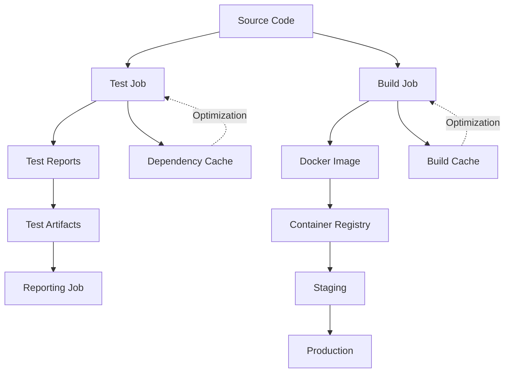

# 06- Artifacts and Caching Questions

## Overview

GitHub Actions artifacts and caches solve different problems in CI/CD.

**Artifacts preserve outputs from workflow execution. Caches accelerate repeated work.**

That distinction becomes critical in production pipelines because confusing the two can lead to:

- Missing build outputs.
- Incorrect deployment behavior.
- Cache fragmentation.
- Stale dependencies.
- Excessive storage consumption.
- Slow CI pipelines.
- Security vulnerabilities.
- Difficult rollback procedures.

For a senior backend engineer, the important design question is not simply how to upload an artifact or configure a cache. It is:

> What data must remain a trustworthy workflow output, and what data is only an optimization that can safely disappear and be regenerated?

A typical production pipeline should look like:

```text
Pull Request
    ↓
Lint
    ↓
Unit Tests
    ↓
Integration Tests
    ↓
Security Scan
    ↓
Build
    ↓
Immutable Artifact
    ↓
Registry / Artifact Store
    ↓
Staging
    ↓
Approval
    ↓
Production
```

Caches support the pipeline by reducing repeated work:

```text
Dependency Definition
        ↓
     Cache Key
        ↓
 ┌──────┴──────┐
Hit            Miss
 ↓               ↓
Restore       Rebuild
 ↓               ↓
Continue       Save Cache
```

Artifacts and caches should therefore be designed as separate reliability boundaries.

---

## Artifacts vs Caches

| Property | Artifacts | Caches |
|---|---|---|
| Primary purpose | Preserve workflow outputs | Accelerate repeated work |
| Represents | Output/result | Reusable intermediate state |
| Required for correctness | Often | No |
| Can be regenerated | Sometimes | Yes |
| Typical lifetime | Release/report/debug retention | Dependency/cache lifecycle |
| Examples | Test reports, binaries, packages | Python dependencies, npm cache |
| Deployment usage | Common | Should generally not be authoritative |
| Failure impact | May block downstream workflow | Should normally only slow the workflow |
| Security model | Output integrity matters | Treat as untrusted optimization state |
| Typical producer | Build/test job | Dependency/build step |
| Typical consumer | Later job/release | Future workflow execution |

The simplest rule is:

> **Artifacts are outputs. Caches are optimizations.**

---

## Artifact Lifecycle

A typical artifact lifecycle is:

```text
Generate
   ↓
Validate
   ↓
Upload
   ↓
Store
   ↓
Download
   ↓
Verify / Consume
   ↓
Retain / Expire
```

For example:

```text
pytest
  ↓
JUnit XML
  ↓
Upload Artifact
  ↓
Reporting Job
  ↓
Test Report
```

Or:

```text
Docker Build
  ↓
Image
  ↓
Registry
  ↓
Deployment
```

For production Docker deployments, the registry image is generally the deployment artifact rather than a GitHub Actions cache.

---

## Artifact Types

Common CI/CD artifacts include:

- JUnit test reports.
- Coverage reports.
- Python packages.
- Build archives.
- Frontend bundles.
- Generated documentation.
- Debug logs.
- Screenshots.
- Selenium/Playwright traces.
- SBOMs.
- Security reports.
- Release packages.

Backend examples include:

```text
Django
 → wheel
 → test reports
 → coverage

FastAPI
 → package
 → integration reports
 → Docker image metadata

Microservice
 → Docker image
 → SBOM
 → provenance
```

---

## Uploading an Artifact

A basic example:

```yaml
- name: Run tests
  run: pytest --junitxml=reports/junit.xml

- name: Upload test report
  if: ${{ !cancelled() }}
  uses: actions/upload-artifact@v4
  with:
    name: test-report
    path: reports/junit.xml
```

The artifact can then be consumed by another job.

---

## Artifact Paths

The most common artifact problem is an incorrect path.

Example:

```yaml
- name: Upload report
  uses: actions/upload-artifact@v4
  with:
    name: reports
    path: reports/
```

Before uploading, verify the directory exists:

```bash
pwd
find reports -maxdepth 2 -type f -print
```

A successful test command does not guarantee that the expected report file exists.

For example:

```text
pytest succeeds
        ↓
Coverage/report generation skipped
        ↓
reports/ does not exist
        ↓
Artifact upload fails or uploads nothing useful
```

---

## Artifact Naming

Artifact names should be:

- Unique where required.
- Predictable.
- Traceable.
- Independent of secrets.
- Useful during incident investigation.

For matrix jobs:

```yaml
- name: Upload test report
  uses: actions/upload-artifact@v4
  with:
    name: test-report-${{ matrix.python }}-${{ matrix.database }}
    path: reports/
```

This produces artifacts such as:

```text
test-report-3.11-postgres
test-report-3.12-postgres
test-report-3.13-postgres
```

---

## Matrix Artifact Design

A matrix produces multiple independent executions:

```text
Python 3.11 ──→ report
Python 3.12 ──→ report
Python 3.13 ──→ report
```

Do not make the artifact identity ambiguous.

Prefer:

```yaml
name: coverage-${{ matrix.python }}
```

over:

```yaml
name: coverage
```

when multiple matrix jobs independently generate reports.

For multiple dimensions:

```yaml
name: coverage-${{ matrix.python }}-${{ matrix.database }}
```

---

## Artifact Retention

Artifacts consume storage.

Configure retention deliberately:

```yaml
- name: Upload reports
  uses: actions/upload-artifact@v4
  with:
    name: test-reports
    path: reports/
    retention-days: 14
```

Retention should reflect the purpose of the artifact.

Examples:

| Artifact | Typical Retention Strategy |
|---|---|
| PR test report | Short |
| Debug logs | Short to moderate |
| Nightly reports | Moderate |
| Release package | Longer |
| Compliance evidence | Based on organizational requirements |
| Production deployment metadata | Based on operational/audit requirements |

Do not keep every large CI artifact indefinitely.

---

## Artifact Storage Cost

Large artifacts can become expensive operationally.

Common sources of unnecessary storage include:

- Full dependency directories.
- Docker build directories.
- Large test datasets.
- Browser binaries.
- Duplicate reports.
- Uncompressed logs.
- Multiple identical build outputs.

Upload only what downstream jobs or operators actually need.

---

## Artifact Compression

Some outputs compress well:

```text
Source archives
Text reports
Logs
JSON
XML
```

Binary files may already be compressed.

Do not blindly compress everything multiple times.

For large build outputs, evaluate:

```text
Compression CPU cost
vs
Storage and transfer savings
```

---

## Passing Data Between Jobs

Jobs execute on separate runners.

Therefore, this does not work:

```text
Job A
  creates build/
      ↓
Job B
  expects build/
```

The filesystem is not automatically shared.

Use artifacts:

```yaml
jobs:
  build:
    runs-on: ubuntu-latest

    steps:
      - run: ./build.sh

      - name: Upload build
        uses: actions/upload-artifact@v4
        with:
          name: application-build
          path: build/

  test:
    needs: build
    runs-on: ubuntu-latest

    steps:
      - name: Download build
        uses: actions/download-artifact@v4
        with:
          name: application-build
          path: build/
```

---

## Artifacts vs Job Outputs

Not every value should become an artifact.

Use job outputs for small structured metadata:

```yaml
jobs:
  build:
    runs-on: ubuntu-latest

    outputs:
      image_tag: ${{ steps.meta.outputs.image_tag }}

    steps:
      - id: meta
        run: echo "image_tag=${GITHUB_SHA}" >> "$GITHUB_OUTPUT"
```

Then:

```yaml
deploy:
  needs: build

  steps:
    - run: echo "Deploying ${{ needs.build.outputs.image_tag }}"
```

Use artifacts for larger files.

---

## Outputs vs Artifacts vs Caches

| Mechanism | Best For |
|---|---|
| `$GITHUB_OUTPUT` | Small structured values |
| Job outputs | Small values between jobs |
| Workflow outputs | Values exposed by reusable workflows |
| Artifacts | Files/results/build outputs |
| Cache | Regenerable intermediate state |
| Registry | Immutable deployable artifacts |

A useful rule:

```text
Small value → Output
File → Artifact
Reusable optimization → Cache
Production image/package → Registry
```

---

## Artifact Download

A later job can download an artifact:

```yaml
- name: Download build
  uses: actions/download-artifact@v4
  with:
    name: application-build
    path: build/
```

Then:

```bash
find build -maxdepth 2 -type f -print
```

Use explicit paths to avoid accidental assumptions about where files were extracted.

---

## Downloading Multiple Artifacts

For a matrix pipeline, an aggregation job may download multiple artifacts.

Conceptually:

```text
Matrix
 ├── report-python311
 ├── report-python312
 └── report-python313
        ↓
Aggregation
        ↓
Combined report
```

Each artifact should have a predictable identity.

---

## Artifact Aggregation

A fan-in job can collect matrix results:

```yaml
jobs:
  test:
    strategy:
      matrix:
        python:
          - "3.11"
          - "3.12"

    steps:
      - run: pytest --junitxml="reports/${{ matrix.python }}.xml"

      - uses: actions/upload-artifact@v4
        with:
          name: junit-${{ matrix.python }}
          path: reports/

  report:
    needs: test
    if: ${{ !cancelled() }}
    runs-on: ubuntu-latest

    steps:
      - name: Download reports
        uses: actions/download-artifact@v4
        with:
          pattern: junit-*
          path: reports
          merge-multiple: true

      - run: find reports -type f -print
```

This separates:

```text
Parallel production
```

from:

```text
Central aggregation
```

---

## Artifact Integrity

For important artifacts, the consuming job should know what it received.

Useful metadata includes:

```text
Commit SHA
Build ID
Workflow run ID
Version
Artifact name
Build timestamp
Dependency version
Image digest
```

For production deployments, stronger integrity mechanisms can include:

- Checksums.
- SBOMs.
- Provenance.
- Attestations.
- Digital signatures.
- Registry digests.

---

## Artifact Promotion

A production pipeline should prefer:

```text
Build Once
    ↓
Immutable Artifact
    ↓
Staging
    ↓
Approval
    ↓
Production
```

rather than:

```text
Build for Staging
    ↓
Rebuild
    ↓
Build for Production
```

The second model can introduce differences between what was tested and what was deployed.

---

## Docker Artifact Promotion

For Docker:

```text
Source
 ↓
Docker Buildx
 ↓
Image
 ↓
ECR
 ↓
Image Digest
 ↓
Staging
 ↓
Production
```

Example:

```text
123456789012.dkr.ecr.ap-south-1.amazonaws.com/orders@sha256:abc123...
```

The digest identifies the exact image content.

---

## Commit SHA Tags

A useful Docker tagging pattern is:

```text
orders:<commit-sha>
```

For example:

```text
orders:7d4e2a1...
```

The tag provides human-readable traceability.

For deployment correctness, the image digest remains the stronger immutable identity.

---

## Artifact Retention vs Production Rollback

GitHub Actions artifact retention should not be the only mechanism for production rollback.

Production rollback should preferably rely on:

```text
Container registry
+
Immutable image digest
+
Release metadata
+
Deployment history
```

For example:

```text
Production
 ↓
Current image digest
 ↓
Previous known-good digest
 ↓
Rollback
```

This is more reliable than depending on a temporary CI artifact.

---

## Artifact Security

Never upload secrets as artifacts.

Avoid:

```yaml
path: .
```

when the workspace may contain:

```text
.env
credentials.json
tokens
private keys
```

Instead:

```yaml
path: |
  reports/
  dist/
```

Review generated files before upload:

```bash
find . -type f -maxdepth 3
```

---

## Artifact Secret Leakage

Common accidental leakage:

```text
pytest logs
Django settings dumps
environment files
debug traces
AWS CLI output
Docker configuration
dependency configuration
```

A failed test may expose sensitive values if the application logs them.

Artifact review is therefore part of CI security.

---

## Artifacts from Pull Requests

Pull request workflows can execute untrusted code.

Treat generated artifacts as potentially untrusted.

A malicious test or build step could generate:

```text
malicious binary
modified script
poisoned package
fake report
```

Do not automatically execute downloaded artifacts from untrusted workflows in privileged jobs.

Separate:

```text
Untrusted validation
```

from:

```text
Privileged deployment
```

---

## Artifact Poisoning

Artifact poisoning occurs when a workflow consumes an artifact whose origin or integrity is not adequately controlled.

Example:

```text
Untrusted PR
 ↓
Build artifact
 ↓
Privileged workflow
 ↓
Production deployment
```

This is dangerous.

Prefer:

```text
Trusted release workflow
 ↓
Build
 ↓
Sign / attest
 ↓
Immutable registry artifact
 ↓
Protected promotion
```

---

## Artifact Provenance

Provenance answers:

```text
Where did this artifact come from?
```

Useful provenance information includes:

- Repository.
- Commit.
- Workflow.
- Workflow run.
- Builder identity.
- Source revision.
- Build parameters.
- Dependencies.

This becomes important for production software supply-chain security.

---

## SBOM and Artifacts

An SBOM describes the software components contained in an artifact.

For a Python service:

```text
Application
 ├── Django
 ├── DRF
 ├── psycopg
 ├── Redis client
 └── Other dependencies
```

An SBOM can be stored as an artifact and associated with the release.

Example:

```text
orders-image
orders-image.sbom.json
orders-image.provenance.json
```

---

## Artifact Signing

Signing provides stronger integrity guarantees than a simple filename or tag.

Conceptually:

```text
Build
 ↓
Artifact
 ↓
Digest
 ↓
Signature
 ↓
Verification
 ↓
Deployment
```

A deployment system can verify that the artifact is the one produced by the trusted build process.

---

## Cache Fundamentals

A cache stores data that can be reused in a future workflow execution.

Example:

```text
requirements.lock
      ↓
   Cache Key
      ↓
Python dependency cache
```

If the cache is available:

```text
Restore
 ↓
Install remaining dependencies
```

If not:

```text
Install dependencies
 ↓
Save cache
```

The workflow must remain correct even when the cache is empty.

---

## Cache as an Optimization

The most important cache rule:

> A cache miss must not make the pipeline incorrect.

If:

```text
Cache exists
```

the workflow should be faster.

If:

```text
Cache does not exist
```

the workflow should still succeed.

Therefore:

```text
Cache failure
≠
Build correctness failure
```

unless the workflow was incorrectly designed.

---

## Cache Key

A cache key identifies the dependency state.

Example:

```yaml
key: ${{ runner.os }}-python-${{ matrix.python }}-${{ hashFiles('**/requirements.lock') }}
```

The lock file hash changes when dependency definitions change.

Therefore:

```text
Same lock file
→ same logical dependency cache

Changed lock file
→ new cache
```

---

## `hashFiles()`

Example:

```yaml
key: ${{ runner.os }}-pip-${{ hashFiles('**/requirements.lock') }}
```

`hashFiles()` creates a content-based value from matching files.

This is generally better than:

```yaml
key: dependencies-v1
```

because the key does not automatically change when dependency definitions change.

---

## Restore Keys

Restore keys allow partial cache matching.

Example:

```yaml
restore-keys: |
  ${{ runner.os }}-python-${{ matrix.python }}-
  ${{ runner.os }}-python-
```

This can allow an older compatible cache to be restored when an exact cache is unavailable.

However, broader restore keys should be chosen carefully.

---

## Exact Cache Hit vs Partial Restore

Conceptually:

```text
Exact key
 ↓
Exact cache

No exact key
 ↓
Restore key
 ↓
Related cache
```

A restored cache may contain older dependencies.

Your package manager should still reconcile the environment with the current dependency definition.

Do not assume:

```text
Cache restored
=
Dependencies are correct
```

---

## Python Dependency Caching

A common approach:

```yaml
- name: Set up Python
  uses: actions/setup-python@v6
  with:
    python-version: "3.12"
    cache: pip
    cache-dependency-path: requirements.lock
```

This is often preferable to manually implementing cache paths when the setup action supports the desired package manager and dependency-file behavior.

---

## Manual Python Cache

A manual cache can be useful when the dependency layout is non-standard:

```yaml
- name: Get pip cache directory
  id: pip-cache
  shell: bash
  run: echo "dir=$(pip cache dir)" >> "$GITHUB_OUTPUT"

- name: Cache pip
  uses: actions/cache@v4
  with:
    path: ${{ steps.pip-cache.outputs.dir }}
    key: ${{ runner.os }}-pip-${{ hashFiles('**/requirements.lock') }}
    restore-keys: |
      ${{ runner.os }}-pip-
```

Use manual caching when you need control that built-in caching does not provide.

---

## Node Dependency Caching

For a Node-based component:

```yaml
- name: Setup Node
  uses: actions/setup-node@v6
  with:
    node-version: 24
    cache: npm
    cache-dependency-path: package-lock.json
```

The cache should be tied to the dependency definition.

---

## Docker Layer Caching

Docker builds can use BuildKit caching.

Example:

```yaml
- name: Build image
  uses: docker/build-push-action@v7
  with:
    context: .
    push: false
    tags: example/app:${{ github.sha }}
    cache-from: type=gha
    cache-to: type=gha,mode=max
```

The cache stores reusable build layers.

It does not replace the final Docker image.

---

## Docker Cache vs Docker Artifact

This distinction is critical:

```text
Docker cache
=
Intermediate build layers

Docker image
=
Deployable artifact
```

A cache miss means:

```text
Build takes longer
```

An unavailable production image means:

```text
Deployment cannot use that artifact
```

Therefore, production deployment should use the image stored in a registry, not rely on a GitHub Actions build cache.

---

## Docker Layer Ordering

Docker caching becomes more effective when stable layers occur earlier.

Example:

```dockerfile
FROM python:3.12-slim

WORKDIR /app

COPY requirements.lock .

RUN pip install --no-cache-dir -r requirements.lock

COPY . .

CMD ["gunicorn", "config.wsgi:application"]
```

Changing application source does not invalidate the dependency installation layer.

This reduces repeated work.

---

## `.dockerignore`

A good `.dockerignore` improves Docker builds:

```text
.git
.github
__pycache__
.pytest_cache
.venv
.env
*.pyc
coverage.xml
htmlcov
```

Benefits include:

- Smaller build context.
- Faster uploads to the builder.
- Better cache behavior.
- Lower risk of accidentally including secrets.

---

## Cache Key Design

A good cache key should represent the data being cached.

For Python dependencies:

```text
OS
+
Python version
+
dependency lock state
```

For npm:

```text
OS
+
Node version
+
package-lock.json state
```

For Docker:

```text
Build context
+
Dockerfile
+
dependency definitions
```

Do not add unrelated dimensions merely because they are available.

---

## Cache Fragmentation

Suppose:

```yaml
key: ${{ runner.os }}-${{ matrix.python }}-${{ matrix.database }}-${{ github.sha }}
```

This may create a unique cache for every:

```text
OS
Python version
Database
Commit
```

The result can be poor cache reuse.

For a Python dependency cache, the database dimension is generally irrelevant.

The commit SHA may also be unnecessarily restrictive.

---

## Cache Poisoning

Caches can become a supply-chain concern.

If untrusted workflow execution can influence cached state that a privileged workflow later trusts, an attacker may attempt to inject malicious content.

Avoid treating cache contents as trusted release inputs.

For privileged workflows:

```text
Source
 ↓
Trusted build
 ↓
Verified dependencies
 ↓
Immutable artifact
```

not:

```text
Untrusted cache
 ↓
Production
```

---

## Cache and Fork Pull Requests

Forked pull requests require particular care.

The workflow may execute code from an untrusted repository state.

Do not assume cached content is trustworthy merely because it comes from a cache key.

Separate:

```text
Untrusted PR execution
```

from:

```text
Trusted release execution
```

and avoid privileged secrets or deployment credentials in untrusted workflows.

---

## Cache and Secrets

Never put secrets into cache paths.

Bad:

```text
~/.aws
.env
credentials/
```

A cache can persist beyond the current job.

Cache only intended dependency/build state.

---

## Cache and `$GITHUB_ENV`

Do not use a cache to persist runtime configuration.

Use:

```yaml
$GITHUB_ENV
```

for values that need to persist between steps within the same job.

Use:

```yaml
$GITHUB_OUTPUT
```

for explicit step/job data flow.

Use artifacts for files that must cross job boundaries.

Use caches only for reusable optimizations.

---

## Data Transfer Model

GitHub Actions data movement can be modeled as:

```text
Within Step
    ↓
Shell variables

Between Steps
    ↓
GITHUB_ENV / GITHUB_OUTPUT / GITHUB_PATH

Between Jobs
    ↓
Job Outputs / Artifacts

Across Workflow Executions
    ↓
Caches / External Artifact Stores / Registries
```

Choosing the wrong mechanism often creates unnecessary complexity.

---

## Artifact and Cache Architecture



Artifacts and registries represent outputs.

Caches accelerate the process.

---

## Artifact Storage vs External Registry

For production applications, GitHub artifacts are not always the ideal long-term distribution mechanism.

Examples:

| Output | Appropriate Store |
|---|---|
| Test report | GitHub Artifact |
| Coverage report | GitHub Artifact |
| Debug logs | GitHub Artifact |
| Python release package | Package registry |
| Docker image | ECR/Container Registry |
| Terraform module/package | Appropriate artifact/package registry |
| Production deployment image | ECR/Container Registry |
| Long-term release package | Release/package storage |

The storage system should match the artifact's lifecycle and consumers.

---

## AWS ECR Integration

A typical Docker deployment flow:

```text
GitHub Actions
      ↓
OIDC
      ↓
AWS STS
      ↓
IAM Role
      ↓
ECR
      ↓
Image Digest
      ↓
ECS / EKS / EC2
```

GitHub Actions should preferably use short-lived OIDC credentials rather than long-lived AWS access keys stored as secrets.

---

## Artifact Promotion with ECR

Example architecture:

```text
Build
 ↓
Push Image
 ↓
ECR
 ↓
Record Digest
 ↓
Deploy Staging
 ↓
Validate
 ↓
Approval
 ↓
Deploy Production
```

The same image digest should be promoted.

Do not rebuild the application for production simply because the target environment changed.

---

## Artifact Metadata

Useful deployment metadata can include:

```json
{
  "version": "2.4.0",
  "commit": "7d4e2a1",
  "workflow_run": "123456789",
  "image_digest": "sha256:abc123...",
  "environment": "staging"
}
```

This helps incident response answer:

```text
What was deployed?
From which commit?
Which workflow built it?
Which artifact was promoted?
```

---

## Cache Performance

Caching improves performance when:

```text
Cache restore cost
<
Work required to regenerate data
```

A cache can hurt performance when:

- The cache is very large.
- Restore time is high.
- Hit rate is low.
- Cache keys are fragmented.
- Data is cheap to regenerate.
- Compression/decompression is expensive.

Measure cache effectiveness rather than assuming caching is always beneficial.

---

## Cache Hit Rate

Monitor:

```text
Cache hits
Cache misses
Restore duration
Save duration
Cache size
Build duration
```

If a cache rarely hits, investigate its key design.

For example:

```text
Cache hit rate = 8%
```

may indicate excessive key fragmentation.

---

## Cache Versioning

When cache contents or layout changes, introduce a version component:

```yaml
key: ${{ runner.os }}-pip-v2-${{ hashFiles('**/requirements.lock') }}
```

This can invalidate incompatible historical cache entries.

Use version components intentionally rather than changing keys arbitrarily.

---

## Cache Invalidation

A cache should be invalidated when its underlying assumptions change.

Examples:

```text
Dependency lock file changed
Python version changed
OS image changed
Build configuration changed
Cache directory layout changed
```

The hardest problem in caching is often not storing data.

It is knowing when that data is no longer valid.

---

## Cache Restoration Safety

A restored cache should be considered potentially stale.

The application build process should still run the package manager or build validation needed to establish correctness.

For example:

```bash
pip install -r requirements.lock
```

should remain the source of dependency correctness.

The cache accelerates downloads.

It should not redefine the dependency contract.

---

## Cache and Reproducibility

Reproducible builds should not depend on cache contents.

The same source and dependency definitions should be capable of producing the same output with:

```text
Cache hit
```

or:

```text
Cache miss
```

If output differs depending on cache state, the cache has become a correctness dependency.

That is a design smell.

---

## Cache and CI Reliability

A robust workflow treats cache failure as recoverable.

Conceptually:

```text
Cache unavailable
      ↓
Download dependencies normally
      ↓
Build/test
      ↓
Workflow succeeds
```

The cache improves speed but should not become a single point of failure.

---

## Artifact Reliability

Artifacts have stronger correctness implications.

If a build job produces:

```text
application.tar.gz
```

and the deployment job cannot retrieve it, deployment cannot safely continue.

Therefore:

```text
Artifact failure
→ Investigate and fail safely
```

Do not silently substitute an unrelated artifact.

---

## Artifact Verification

Before deployment, validate:

```text
Artifact exists
Artifact identity matches expected commit
Artifact version matches release
Artifact checksum/digest is correct
Artifact came from trusted workflow
```

For Docker:

```text
Image tag
+
Image digest
+
Commit SHA
```

should be traceable.

---

## Artifact vs Cache Failure Strategy

| Failure | Correct Response |
|---|---|
| Cache miss | Rebuild/regenerate |
| Cache unavailable | Continue if possible |
| Test artifact missing | Investigate |
| Release artifact missing | Block deployment |
| Image digest missing | Block deployment |
| Cache contains stale data | Recreate |
| Artifact integrity mismatch | Block consumption |
| Artifact upload failure | Fail relevant workflow stage |

---

## Debugging Artifact Upload Failures

### Symptom

Artifact upload fails or contains no useful files.

### Possible Causes

- Incorrect path.
- File was never generated.
- Previous step failed.
- Conditional step skipped.
- Permissions or storage issue.
- Unexpected working directory.

### Isolation

Run:

```bash
pwd
find . -maxdepth 4 -type f -print
```

Then verify the exact path.

### Prevention

Generate artifacts into predictable directories:

```text
reports/
dist/
build/
```

and explicitly upload those paths.

---

## Debugging Artifact Download Failures

### Symptom

A downstream job cannot find an artifact.

### Possible Causes

- Incorrect artifact name.
- Missing `needs`.
- Producer job failed.
- Artifact upload was skipped.
- Wrong download path.
- Workflow/run boundary misunderstanding.

### Isolation

Inspect the producer run:

```bash
gh run view <run-id>
```

Verify artifact availability before debugging the consumer.

---

## Debugging Cache Misses

### Symptom

Every workflow appears to rebuild dependencies.

### Possible Causes

- Key changes every run.
- Lock file path is wrong.
- Matrix dimensions create unique keys.
- Cache scope does not match the workflow.
- Dependency file is not being hashed.

### Isolation

Inspect the effective cache key and compare it across runs.

For example:

```text
Expected:
ubuntu-python-3.12-<lock-hash>

Actual:
ubuntu-python-3.12-<commit-sha>
```

The second key may intentionally or accidentally eliminate reuse.

---

## Debugging Cache Corruption

### Symptom

A cache restores successfully but builds fail unexpectedly.

### Possible Causes

- Incompatible cache contents.
- Changed runtime.
- Changed dependency layout.
- Partial or stale data.
- Build tooling incompatibility.

### Corrective Action

Invalidate the cache by changing the cache version:

```yaml
key: ${{ runner.os }}-pip-v2-${{ hashFiles('**/requirements.lock') }}
```

Then regenerate the cache.

---

## Debugging Matrix Artifact Collisions

### Symptom

Matrix jobs overwrite or conflict around output artifacts.

### Cause

Artifact naming does not encode the matrix identity.

Bad:

```yaml
name: test-results
```

Better:

```yaml
name: test-results-${{ matrix.python }}-${{ matrix.database }}
```

The same principle applies to generated files.

---

## Artifact and Cache Troubleshooting Model

For either system:

```text
Symptom
   ↓
Identify Data Type
   ↓
Artifact or Cache?
   ↓
Inspect Producer
   ↓
Inspect Path / Key
   ↓
Inspect Consumer
   ↓
Verify Identity
   ↓
Check Permissions / Storage
   ↓
Correct
   ↓
Prevent Recurrence
```

The first question should often be:

> Is this data supposed to be an artifact or a cache?

---

## Common Beginner Mistakes

### Treating a Cache as an Artifact

A cache is not a reliable release mechanism.

### Treating an Artifact as a Cache

Large reports and binaries should not be stored as reusable dependency caches.

### Using `path: .`

This can accidentally upload secrets and unnecessary files.

### Using One Artifact Name for Every Matrix Job

This makes output identification difficult.

### Using Commit SHA in Every Cache Key

This can destroy cache reuse.

### Ignoring Lock Files

Dependency caches should normally reflect dependency definitions.

### Sharing Mutable Integration State

Matrix jobs should not unexpectedly share one database or Redis instance.

---

## Production Pitfalls

### Cache Correctness Dependency

If the workflow only succeeds when the cache exists, the cache has become a hidden dependency.

### Artifact Rebuild Drift

Rebuilding for every environment can produce artifacts different from what was tested.

### Untrusted Artifact Consumption

A privileged job should not blindly consume output generated by untrusted code.

### Excessive Retention

Large artifacts can accumulate significant storage.

### Cache Fragmentation

Overly specific keys can create many low-value caches.

### Missing Artifact Identity

Without commit/version/digest metadata, rollback becomes difficult.

---

## Security Checklist

### Artifacts

- [ ] Upload only required paths.
- [ ] Exclude `.env` and credentials.
- [ ] Review generated logs.
- [ ] Treat untrusted workflow artifacts carefully.
- [ ] Record artifact provenance.
- [ ] Verify production artifact identity.
- [ ] Use immutable registry digests for container deployment.

### Caches

- [ ] Never cache secrets.
- [ ] Do not treat caches as trusted release inputs.
- [ ] Use dependency-based keys.
- [ ] Avoid unnecessary key dimensions.
- [ ] Version cache layouts when required.
- [ ] Ensure cache misses remain safe.
- [ ] Consider cache poisoning in privileged workflows.

---

## Production CI/CD Example

```yaml
name: CI/CD

on:
  pull_request:
  push:
    branches:
      - main

jobs:
  test:
    runs-on: ubuntu-latest

    strategy:
      fail-fast: false
      matrix:
        python:
          - "3.11"
          - "3.12"

    steps:
      - name: Checkout
        uses: actions/checkout@v5

      - name: Setup Python
        uses: actions/setup-python@v6
        with:
          python-version: ${{ matrix.python }}
          cache: pip
          cache-dependency-path: requirements.lock

      - name: Install dependencies
        run: pip install -r requirements.lock

      - name: Run tests
        run: |
          mkdir -p reports
          pytest \
            --junitxml="reports/junit-${{ matrix.python }}.xml"

      - name: Upload test report
        if: ${{ !cancelled() }}
        uses: actions/upload-artifact@v4
        with:
          name: junit-${{ matrix.python }}
          path: reports/

  build:
    needs: test
    runs-on: ubuntu-latest

    permissions:
      contents: read

    steps:
      - name: Checkout
        uses: actions/checkout@v5

      - name: Build application
        run: |
          mkdir -p dist
          tar -czf dist/application.tar.gz .

      - name: Upload build artifact
        uses: actions/upload-artifact@v4
        with:
          name: application-build
          path: dist/application.tar.gz
          retention-days: 7

  deploy:
    needs: build
    runs-on: ubuntu-latest

    environment:
      name: production

    permissions:
      contents: read
      id-token: write

    steps:
      - name: Download build artifact
        uses: actions/download-artifact@v4
        with:
          name: application-build
          path: dist/

      - name: Verify artifact
        run: |
          test -f dist/application.tar.gz
          sha256sum dist/application.tar.gz

      - name: Deploy
        run: ./scripts/deploy.sh dist/application.tar.gz
```

The important architecture is:

```text
Matrix Tests
     ↓
Build
     ↓
Immutable Artifact
     ↓
Protected Deployment
```

The test dependency cache is independent from the application artifact.

---

## Docker Production Pipeline

For containerized applications:

```text
Pull Request
     ↓
Matrix Tests
     ↓
Security Scan
     ↓
Docker Buildx
     ↓
Image
     ↓
ECR
     ↓
Digest
     ↓
Staging
     ↓
Approval
     ↓
Production
```

The cache participates during the build:

```text
Docker Buildx
     ↓
Build Cache
```

The resulting image participates in deployment:

```text
Docker Image
     ↓
ECR
     ↓
Production
```

These are fundamentally different objects.

---

## Senior Architecture Decision

When deciding whether to use an artifact or cache, ask:

```text
Can this data be safely regenerated?
```

If yes:

```text
Consider a cache.
```

If no, or if it represents a workflow output:

```text
Use an artifact or external artifact store.
```

Then ask:

```text
Does production consume this data?
```

If yes, consider a durable artifact repository or registry with:

- Immutable identity.
- Provenance.
- Retention policy.
- Access control.
- Integrity verification.
- Rollback support.

---

## Artifact and Cache Decision Table

| Requirement | Mechanism |
|---|---|
| Pass small value between steps | `GITHUB_OUTPUT` |
| Pass environment value between steps | `GITHUB_ENV` |
| Pass small value between jobs | Job output |
| Pass test report between jobs | Artifact |
| Pass build archive between jobs | Artifact |
| Store coverage report | Artifact |
| Store debugging logs | Artifact |
| Speed up pip installation | Cache |
| Speed up npm installation | Cache |
| Speed up Docker builds | Build cache |
| Store production Docker image | Container registry |
| Promote production image | Registry digest |
| Preserve release package | Artifact/package registry |
| Persist deployment state | Durable external system |

---

## Senior Interview Questions

### What Is the Difference Between an Artifact and a Cache?

A strong answer:

> An artifact is a workflow output intended for later consumption, debugging, reporting, release, or deployment. A cache stores reusable intermediate data to reduce repeated work. A cache must be optional from a correctness perspective, while an important artifact may be required for downstream workflow execution.

---

### Why Should You Not Use a Cache for Production Docker Images?

Because a cache is an optimization mechanism and does not represent the authoritative deployable artifact.

Production images should be stored in a container registry with immutable identity, preferably using a digest:

```text
ECR
 ↓
sha256:<digest>
```

The cache can accelerate image construction but should not define production state.

---

### How Would You Pass a Build Between Two Jobs?

Use an artifact:

```text
Build Job
 ↓
upload-artifact
 ↓
download-artifact
 ↓
Deployment Job
```

For small metadata such as:

```text
image_tag
version
digest
```

use job outputs instead.

---

### How Would You Cache Python Dependencies?

Use the package-manager-aware caching provided by the setup action when appropriate:

```yaml
- uses: actions/setup-python@v6
  with:
    python-version: "3.12"
    cache: pip
    cache-dependency-path: requirements.lock
```

The dependency definition should determine cache invalidation.

---

### Why Use `hashFiles()` in Cache Keys?

Because the cache should change when the dependency definition changes.

Example:

```yaml
key: ${{ runner.os }}-pip-${{ hashFiles('**/requirements.lock') }}
```

This makes the cache key content-aware rather than manually maintained.

---

### What Happens When a Cache Misses?

The workflow should regenerate the required data.

For example:

```text
Cache miss
 ↓
pip downloads dependencies
 ↓
Tests execute
 ↓
Cache may be saved
```

A cache miss should normally affect performance, not correctness.

---

### Why Can a Cache Key Be Too Specific?

Suppose:

```yaml
key: ${{ runner.os }}-${{ matrix.python }}-${{ github.sha }}
```

Because every commit has a different SHA, each execution may create a new cache.

This can produce:

```text
Low hit rate
+
Storage growth
+
Poor reuse
```

Cache keys should include only dimensions relevant to the cached data.

---

### How Would You Design Artifacts for a Matrix?

Include matrix identity:

```yaml
name: report-${{ matrix.python }}-${{ matrix.database }}
```

Then use a fan-in job to aggregate the reports.

This keeps each output traceable and avoids ambiguity.

---

### How Do Artifacts Help With Build Once, Deploy Many?

The build job produces one immutable artifact:

```text
Build
 ↓
Artifact
```

The same artifact is then promoted:

```text
Staging
 ↓
Production
```

without rebuilding.

This reduces configuration drift between environments.

---

### How Would You Protect Artifacts From Tampering?

Use multiple layers:

- Trusted build workflows.
- Least-privilege permissions.
- Immutable artifact identity.
- Registry digests.
- Provenance.
- SBOMs.
- Attestations.
- Digital signatures where required.
- Protected deployment environments.
- Verification before deployment.

---

### What Is Cache Poisoning?

Cache poisoning occurs when malicious or unintended content is inserted into a cache and later consumed by another execution.

It becomes particularly dangerous when:

```text
Untrusted workflow
 ↓
Cache
 ↓
Privileged workflow
```

The privileged workflow should not treat cache contents as trusted release input.

---

### How Do You Debug an Artifact Upload Failure?

Start with:

```bash
pwd
find . -maxdepth 4 -type f -print
```

Then verify:

```text
Producer step succeeded
Artifact path exists
Expected files were generated
Upload condition executed
Artifact name is correct
```

---

### How Do You Debug a Cache Miss?

Check:

```text
Effective cache key
Lock-file path
Hash value
OS
Runtime
Matrix dimensions
Restore keys
Cache scope
```

If the key changes every run, the cache cannot be reused effectively.

---

### Should Every Matrix Job Upload an Artifact?

No.

Upload an artifact only when the matrix execution produces a useful output.

For example:

```text
Unit test matrix
 → JUnit report
```

may justify per-combination artifacts.

But:

```text
Security scan
```

that produces identical source-level results does not necessarily need one artifact per Python version.

---

### How Should Artifacts Be Retained?

Retention should be based on operational purpose.

Short-lived PR reports can have short retention.

Release artifacts and compliance evidence may require longer retention or an external durable store.

Do not use unlimited retention by default.

---

### How Would You Design Artifact Handling for a Django Application?

A practical pipeline:

```text
Django Source
 ↓
Lint
 ↓
Unit Matrix
 ↓
PostgreSQL/Redis Integration Tests
 ↓
Security Scan
 ↓
Build
 ↓
Docker Image
 ↓
ECR
 ↓
Staging
 ↓
Approval
 ↓
Production
```

Test reports are GitHub artifacts.

The production Docker image is stored in ECR.

Dependency downloads use caches.

---

### How Would You Design Artifact Handling for FastAPI?

The same separation applies:

```text
FastAPI
 ↓
pytest
 ↓
Coverage Artifact
 ↓
Docker Buildx
 ↓
ECR
 ↓
Immutable Digest
 ↓
ECS / Kubernetes
```

The cache accelerates Python dependency and Docker build operations.

The registry image is the production artifact.

---

## Senior Interview Scenario: Build Artifact Is Different in Production

Scenario:

> The staging environment was tested successfully, but production was rebuilt separately and behaves differently.

Likely architectural problem:

```text
Build for staging
+
Separate build for production
```

Preferred design:

```text
Build once
 ↓
Immutable artifact
 ↓
Staging
 ↓
Approval
 ↓
Production
```

Environment-specific configuration should be injected during deployment without rebuilding the application artifact.

---

## Senior Interview Scenario: Cache Misses Increased After Matrix Expansion

Suppose:

```text
Before:
3 Python versions

After:
3 Python versions
×
3 databases
```

Cache hit rate drops significantly.

Investigate whether the cache key unnecessarily includes:

```text
database
```

If the cached data is only Python dependency state, the database dimension is irrelevant.

The cache should represent the data being cached, not the entire job matrix.

---

## Senior Interview Scenario: Artifact Contains Credentials

Scenario:

```text
CI artifact
 ↓
Downloaded by another job
 ↓
Contains .env
```

Immediate actions:

1. Stop consuming the artifact.
2. Determine whether credentials were exposed.
3. Rotate affected credentials.
4. Review logs and artifact access.
5. Remove the unsafe artifact where supported.
6. Correct artifact paths.
7. Add automated secret scanning.
8. Review the workflow's security boundary.

Prevention:

```yaml
path: |
  reports/
  dist/
```

instead of:

```yaml
path: .
```

---

## Senior Interview Scenario: Production Deployment Cannot Find Artifact

Investigate:

```text
Producer run
 ↓
Artifact upload
 ↓
Artifact name
 ↓
Artifact retention
 ↓
Consumer run
 ↓
Download path
```

If the artifact is missing, deployment should fail safely.

Do not silently rebuild a different artifact and deploy it as though it were the original release.

---

## Senior Interview Scenario: Cache Is Unavailable

Correct behavior:

```text
Cache unavailable
 ↓
Regenerate dependencies/build layers
 ↓
Continue
```

Do not design:

```text
Cache unavailable
 ↓
Production deployment with unknown state
```

The cache should optimize execution, not define correctness.

---

## Operational Checklist

### Artifacts

- [ ] Artifact paths are explicit.
- [ ] Artifact names are deterministic.
- [ ] Matrix artifacts include matrix identity.
- [ ] Retention is intentional.
- [ ] Sensitive files are excluded.
- [ ] Build outputs contain version/commit metadata where appropriate.
- [ ] Production artifacts have immutable identity.
- [ ] Important artifacts have provenance.
- [ ] Artifact consumers validate identity.

### Caching

- [ ] Cache keys represent cached data.
- [ ] Lock files participate in dependency cache invalidation.
- [ ] Cache misses remain safe.
- [ ] Cache keys do not contain unnecessary dimensions.
- [ ] Cache versioning is available when layouts change.
- [ ] Secrets are never cached.
- [ ] Cache contents are not treated as release artifacts.
- [ ] Cache performance is monitored.

### Matrix

- [ ] Matrix artifact names are unique.
- [ ] Matrix cache keys are intentional.
- [ ] Cache fragmentation is monitored.
- [ ] Expensive artifacts are not duplicated unnecessarily.
- [ ] Integration infrastructure is isolated.
- [ ] Downstream service capacity is considered.

### Production

- [ ] Build once, promote many is preferred.
- [ ] Docker images use immutable identity.
- [ ] ECR or another registry stores deployable images.
- [ ] Deployment uses verified artifact identity.
- [ ] OIDC is used for AWS authentication where appropriate.
- [ ] Deployment does not depend on CI cache availability.
- [ ] Rollback can reference a previous immutable artifact.

---

## Key Takeaways

- **Artifacts preserve workflow outputs such as test reports, build packages, and deployment inputs; caches accelerate regenerable work such as Python dependencies and Docker build layers.**
- **A cache miss should normally make CI slower, not incorrect, while loss or integrity failure of a required production artifact should block safe consumption.**
- **Design artifact names, paths, retention, and metadata deliberately, especially for matrix jobs, so outputs remain traceable to the runtime, database, commit, and workflow that produced them.**
- **Cache keys should represent the actual data being cached; unnecessary matrix dimensions, commit-specific keys, and poor invalidation strategies create fragmentation and low cache reuse.**
- **Production pipelines should build immutable artifacts once, verify their identity and provenance, and promote the same artifact through staging and production rather than rebuilding for each environment.**