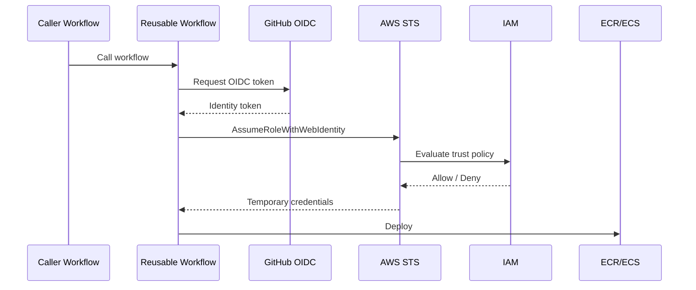
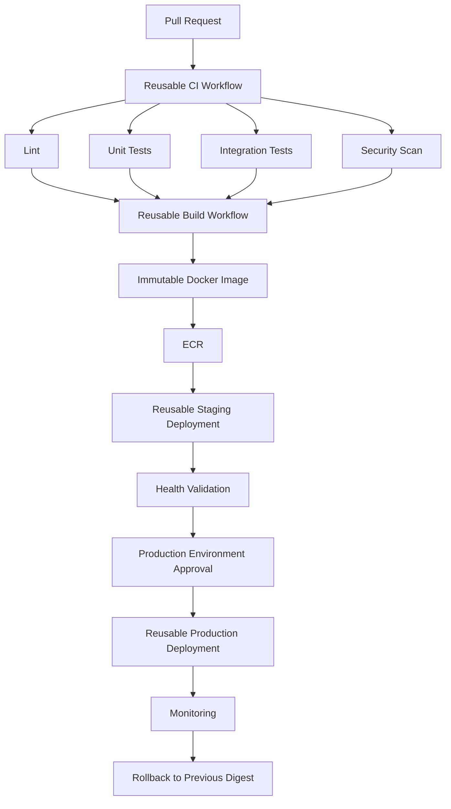

# 07- Reusable Workflow Questions

## Overview

Reusable workflows are one of the primary mechanisms for building maintainable GitHub Actions platforms across repositories.

A reusable workflow turns a workflow into a callable CI/CD component with an explicit interface:

```text
Caller Workflow
      ↓
workflow_call
      ↓
Reusable Workflow
      ↓
Jobs
 ┌────┼────┐
 ↓    ↓    ↓
Lint Test Build
      ↓
   Outputs
```

This is different from a composite action. A reusable workflow can orchestrate multiple jobs, runners, matrices, environments, approvals, permissions, and deployment stages. A composite action packages multiple steps that execute within a single calling job.

For senior backend engineers, reusable workflow design is primarily an architecture problem:

- How should responsibilities be shared?
- What should the workflow API expose?
- Where should permissions be granted?
- How should secrets cross workflow boundaries?
- How should versions be managed?
- How should environments and deployments be protected?
- How can changes be rolled out without breaking dozens of repositories?

---

## What Is a Reusable Workflow?

A reusable workflow is a workflow that can be called by another workflow using:

```yaml
on:
  workflow_call:
```

Example:

```yaml
name: Reusable Python CI

on:
  workflow_call:
    inputs:
      python-version:
        required: true
        type: string

jobs:
  test:
    runs-on: ubuntu-latest

    steps:
      - uses: actions/checkout@v5

      - uses: actions/setup-python@v6
        with:
          python-version: ${{ inputs.python-version }}

      - run: pip install -r requirements.txt
      - run: pytest
```

A caller can invoke it:

```yaml
name: CI

on:
  pull_request:

jobs:
  test:
    uses: organization/ci-workflows/.github/workflows/python-ci.yml@v1
    with:
      python-version: "3.12"
```

The caller provides inputs.

The reusable workflow owns the implementation.

---

## Why Reusable Workflows Exist

Without reusable workflows, repositories often duplicate:

```text
checkout
setup Python
install dependencies
lint
test
security scan
build
upload reports
```

Across many repositories, duplication creates:

```text
Repository A ── CI copy
Repository B ── CI copy
Repository C ── CI copy
Repository D ── CI copy
```

Eventually:

```text
A → updated
B → outdated
C → modified differently
D → broken
```

Reusable workflows centralize common orchestration:

```text
                 ┌── Repository A
                 │
Reusable CI ─────┼── Repository B
                 │
                 ├── Repository C
                 │
                 └── Repository D
```

This provides consistency while creating a new dependency: consumers now depend on the reusable workflow's contract and version.

---

## Reusable Workflow vs Composite Action

This is one of the most important interview distinctions.

| Capability | Reusable Workflow | Composite Action |
|---|---|---|
| Entry point | `workflow_call` | `action.yml` |
| Multiple jobs | Yes | No |
| Multiple runners | Yes | No |
| Job dependencies | Yes | No |
| Matrix orchestration | Yes | Limited to caller job |
| Environments | Yes | Not as workflow orchestration |
| Deployment orchestration | Yes | Usually not |
| Packages steps | Yes, at workflow level | Yes |
| Runs inside caller job | No | Yes |
| Best use | Pipeline architecture | Reusable step sequence |

A useful mental model:

```text
Reusable Workflow
=
Pipeline / orchestration abstraction

Composite Action
=
Step / implementation abstraction
```

For example:

```text
Reusable Workflow
 ├── lint job
 ├── unit test job
 ├── integration test job
 └── build job
```

while:

```text
Composite Action
 ├── setup Python
 ├── install dependencies
 └── configure tooling
```

---

## The Reusable Workflow Contract

A reusable workflow should be treated like an API.

Its contract consists of:

```text
Inputs
Secrets
Permissions
Outputs
Behavior
Version
Compatibility expectations
```

Example:

```yaml
on:
  workflow_call:
    inputs:
      python-version:
        type: string
        required: true

      run-integration-tests:
        type: boolean
        required: false
        default: true

    secrets:
      database-password:
        required: true

    outputs:
      artifact-name:
        description: Name of the generated artifact
        value: ${{ jobs.build.outputs.artifact-name }}
```

A consumer should not need to understand the internal implementation.

---

## Inputs

Inputs allow callers to customize behavior without duplicating implementation.

Example:

```yaml
on:
  workflow_call:
    inputs:
      python-version:
        type: string
        required: true

      environment:
        type: string
        required: false
        default: staging
```

Caller:

```yaml
jobs:
  ci:
    uses: organization/ci/.github/workflows/python.yml@v1
    with:
      python-version: "3.12"
      environment: staging
```

Inputs should represent meaningful configuration rather than exposing every internal implementation detail.

---

## Input Types

Supported reusable workflow input types should be selected deliberately:

```yaml
type: string
```

```yaml
type: boolean
```

```yaml
type: number
```

Example:

```yaml
on:
  workflow_call:
    inputs:
      run-security-scan:
        type: boolean
        required: false
        default: true

      worker-count:
        type: number
        required: false
        default: 2
```

Use typed inputs to make the contract explicit.

---

## Boolean Inputs

Avoid treating booleans as arbitrary strings.

Prefer:

```yaml
with:
  run-integration-tests: true
```

and:

```yaml
if: ${{ inputs.run-integration-tests }}
```

rather than designing a string-based interface such as:

```yaml
with:
  run-integration-tests: "yes"
```

Typed contracts reduce ambiguity.

---

## Required vs Optional Inputs

Required:

```yaml
python-version:
  required: true
  type: string
```

Optional:

```yaml
environment:
  required: false
  type: string
  default: staging
```

Make an input required when the workflow cannot safely operate without it.

Do not make everything required merely to expose configuration.

---

## Avoid Over-Parameterized Workflows

A common anti-pattern is:

```yaml
inputs:
  run-lint:
  run-tests:
  run-security:
  run-build:
  run-docker:
  run-deploy:
  use-cache:
  use-redis:
  use-postgres:
  use-kafka:
  custom-command:
  ...
```

Eventually the reusable workflow becomes a generic programming language.

Prefer focused contracts:

```text
Python CI workflow
Docker build workflow
Deployment workflow
```

rather than:

```text
One workflow that can do everything
```

---

## Secrets

Reusable workflows can explicitly declare secrets:

```yaml
on:
  workflow_call:
    secrets:
      deployment-token:
        required: true
```

The caller supplies the secret:

```yaml
jobs:
  deploy:
    uses: organization/cd/.github/workflows/deploy.yml@v1
    secrets:
      deployment-token: ${{ secrets.DEPLOYMENT_TOKEN }}
```

Secrets should be passed only when the called workflow genuinely needs them.

---

## `secrets: inherit`

For supported same-organization or same-enterprise reusable workflow scenarios, a caller can use:

```yaml
jobs:
  deploy:
    uses: organization/cd/.github/workflows/deploy.yml@v1
    secrets: inherit
```

This reduces repetitive secret mapping, but it also broadens the secret boundary.

Prefer explicit secret interfaces when practical, particularly for security-sensitive workflows.

---

## Secret Boundary

A reusable workflow should not implicitly assume access to every caller secret.

A better design is:

```text
Caller
  ↓
Explicit Secret
  ↓
Reusable Workflow
  ↓
Specific Deployment Step
```

rather than:

```text
Caller
  ↓
All Secrets
  ↓
Reusable Workflow
  ↓
Any Internal Step
```

The second model increases blast radius.

---

## Permissions

Permissions should be designed as part of the reusable workflow contract.

Example:

```yaml
permissions:
  contents: read
```

A deployment workflow may require:

```yaml
permissions:
  contents: read
  id-token: write
```

The `id-token: write` permission is commonly required for GitHub OIDC authentication with AWS.

Grant only what the workflow needs.

---

## Permission Propagation

Reusable workflow permissions are subject to the permissions available from the caller.

A reusable workflow should not be designed around an assumption that it can automatically escalate privileges.

Think of the boundary as:

```text
Caller permissions
       ↓
Reusable workflow
       ↓
Job permissions
       ↓
Step/action
```

Use job-level permissions when only one job requires elevated access.

---

## AWS OIDC in Reusable Workflows

A deployment workflow can authenticate to AWS using OIDC.

Architecture:



Caller:

```yaml
jobs:
  deploy:
    uses: organization/cd/.github/workflows/aws-deploy.yml@v1
    permissions:
      contents: read
      id-token: write
    with:
      environment: staging
```

The reusable workflow can then perform AWS operations without long-lived AWS credentials stored as GitHub secrets.

---

## OIDC Trust Policy Design

The AWS trust policy should restrict the GitHub identity.

Conceptually:

```text
GitHub repository
+
Branch / environment
+
OIDC audience
        ↓
IAM role
        ↓
AWS account
```

Do not make an OIDC role broadly assumable by every repository in an organization unless that is intentionally required.

---

## Reusable Workflow Outputs

A reusable workflow can expose outputs to the caller.

Example:

```yaml
on:
  workflow_call:
    outputs:
      image-digest:
        description: Docker image digest
        value: ${{ jobs.build.outputs.image-digest }}
```

The underlying job:

```yaml
jobs:
  build:
    runs-on: ubuntu-latest

    outputs:
      image-digest: ${{ steps.meta.outputs.digest }}

    steps:
      - id: meta
        run: |
          echo "digest=sha256:abc123" >> "$GITHUB_OUTPUT"
```

Caller:

```yaml
jobs:
  build:
    uses: organization/ci/.github/workflows/build.yml@v1

  deploy:
    needs: build
    runs-on: ubuntu-latest

    steps:
      - run: echo "${{ needs.build.outputs.image-digest }}"
```

---

## Output Design

Good outputs are:

```text
Small
Stable
Meaningful
Machine-readable
```

Examples:

```text
image-digest
artifact-name
version
release-id
environment
```

Avoid exposing internal implementation details such as:

```text
temporary-directory
internal-step-output
runner-specific-path
```

A reusable workflow's output should represent a useful contract.

---

## Structured JSON Outputs

Complex metadata can be serialized as JSON.

Example:

```yaml
- id: metadata
  run: |
    metadata='{"image":"orders","environment":"staging","version":"2.4.0"}'
    echo "metadata=$metadata" >> "$GITHUB_OUTPUT"
```

The caller can consume the structured value using expression functions where appropriate.

This is useful for:

- Dynamic matrices.
- Deployment metadata.
- Multi-service pipelines.
- Build plans.
- Environment promotion.

Do not use JSON merely to avoid designing a clean output interface.

---

## Dynamic Matrices

Reusable workflows can participate in dynamic matrix architectures.

A planning workflow might produce:

```json
["3.11", "3.12", "3.13"]
```

Then:

```yaml
strategy:
  matrix:
    python: ${{ fromJSON(needs.plan.outputs.python-versions) }}
```

Architecture:

```text
Planning Job
     ↓
JSON Output
     ↓
Matrix
 ┌───┼───┐
 ↓   ↓   ↓
3.11 3.12 3.13
```

This allows repositories to share workflow logic while varying their test matrix.

---

## Reusable Workflow Matrix Invocation

A caller can invoke a reusable workflow from matrix jobs:

```yaml
jobs:
  test:
    strategy:
      matrix:
        python:
          - "3.11"
          - "3.12"

    uses: organization/ci/.github/workflows/python-test.yml@v1
    with:
      python-version: ${{ matrix.python }}
```

This can produce consistent testing behavior across repositories.

---

## Reusable Workflows and `needs`

Reusable workflow calls participate in the caller's job graph.

Example:

```yaml
jobs:
  test:
    uses: organization/ci/.github/workflows/test.yml@v1

  build:
    needs: test
    uses: organization/ci/.github/workflows/build.yml@v1

  deploy:
    needs: build
    uses: organization/cd/.github/workflows/deploy.yml@v1
```

The resulting architecture is:

```text
Test
 ↓
Build
 ↓
Deploy
```

The caller controls high-level orchestration.

The reusable workflows encapsulate implementation.

---

## Fan-Out and Fan-In

Reusable workflows can be used within larger dependency graphs.

Example:

```text
             ┌── Python tests
             │
             ├── Security scan
Planning ────┼── Integration tests
             │
             └── Docker build
                    ↓
                Aggregation
                    ↓
                 Deploy
```

The architecture should keep independent operations parallel whenever practical.

---

## Workflow-Level Concurrency

Reusable deployment workflows should consider concurrency.

Example:

```yaml
concurrency:
  group: production-deployment
  cancel-in-progress: false
```

This prevents two production deployments from running simultaneously.

For PR validation:

```yaml
concurrency:
  group: pr-${{ github.event.pull_request.number }}
  cancel-in-progress: true
```

The correct policy depends on the operation.

---

## Production Deployment Concurrency

Consider:

```text
Commit A → Production deployment
Commit B → Production deployment
```

If both run simultaneously, they can race.

Possible outcomes:

```text
A starts
B starts
B finishes
A finishes
```

Production may end up running A even though B was newer.

A deployment concurrency group can serialize production deployments.

---

## Cancellation Strategy

For PR CI:

```yaml
cancel-in-progress: true
```

can reduce wasted compute when newer commits supersede older validation.

For production:

```yaml
cancel-in-progress: false
```

is often safer because terminating a deployment halfway through may leave infrastructure or application state in an undesirable condition.

The correct choice depends on deployment design and rollback guarantees.

---

## Environment Protection

Reusable deployment workflows can target environments:

```yaml
jobs:
  deploy:
    environment:
      name: production
```

The environment can provide:

- Required reviewers.
- Environment-specific secrets.
- Environment-specific variables.
- Deployment protection.
- Deployment history.

A reusable workflow can centralize deployment mechanics while the environment controls production access.

---

## Approval Architecture

A robust deployment model is:

```text
Build
 ↓
Immutable Artifact
 ↓
Staging
 ↓
Validation
 ↓
Production Environment
 ↓
Required Approval
 ↓
Production Deployment
```

The reusable workflow should not bypass environment protection simply because it is centrally maintained.

---

## Branch Restrictions

Production environments can restrict which branches or tags are allowed to deploy.

A useful policy may be:

```text
Production
  ↓
Release branch / approved tag
```

while:

```text
Staging
  ↓
Main branch
```

The exact policy depends on release strategy.

---

## Cross-Repository Reusable Workflows

A central repository may contain:

```text
platform-ci/
└── .github/
    └── workflows/
        ├── python-ci.yml
        ├── docker-build.yml
        └── aws-deploy.yml
```

Application repositories can consume these workflows.

```text
Repository A ──┐
Repository B ──┼──→ platform-ci
Repository C ──┤
Repository D ──┘
```

This is useful for organization-wide standards.

---

## Versioning Reusable Workflows

Never treat a shared workflow as an invisible implementation detail.

Consumers need predictable versions.

Example:

```yaml
uses: organization/platform-ci/.github/workflows/python-ci.yml@v1
```

A major version can represent a compatibility boundary.

For higher integrity requirements, pinning to an immutable commit SHA can provide stronger supply-chain guarantees.

---

## Versioning Strategies

| Reference | Stability | Maintenance |
|---|---|---|
| Branch | Low | Easy |
| Major tag | Good compatibility boundary | Moderate |
| Exact tag | High | Explicit upgrades |
| Commit SHA | Strong immutability | Manual updates |

For organization-wide reusable workflows, a deliberate versioning strategy should be established.

---

## Breaking Changes

Suppose version `v1` exposes:

```yaml
python-version
```

and version `v2` changes the interface to:

```yaml
runtime-version
```

Changing the existing workflow in place can break many repositories.

Prefer:

```text
v1 → existing consumers

v2 → migrated consumers
```

Then deprecate v1 through an explicit migration process.

---

## Reusable Workflow Governance

A central workflow repository should have:

- CODEOWNERS.
- Protected branches.
- Required reviews.
- Automated tests.
- Versioning.
- Release notes.
- Consumer documentation.
- Security review.
- Deprecation policy.

A reusable workflow can have a large blast radius.

A small change can affect dozens or hundreds of repositories.

---

## Testing Reusable Workflows

Test at multiple levels.

### Syntax

Validate YAML and workflow structure.

### Unit-Level Logic

Test scripts and custom actions independently.

### Integration

Execute representative workflows against test repositories or controlled fixtures.

### Contract

Verify:

```text
Inputs
Secrets
Outputs
Permissions
Expected behavior
```

### Consumer Compatibility

Test representative repositories before releasing a breaking change.

---

## Reusable Workflow Testing Repository

A useful architecture is:

```text
platform-workflows
    ↓
workflow implementation

workflow-fixtures
    ↓
consumer-like repositories

CI
    ↓
validate contracts
```

This prevents testing the reusable workflow only in isolation.

---

## Security Boundary

A reusable workflow may execute with significant privileges.

Therefore:

```text
Caller
 ↓
Reusable Workflow
 ↓
Third-party action
 ↓
Runner
```

forms a trust chain.

A malicious or compromised action inside the reusable workflow may inherit the workflow's permissions and secrets.

Keep privileged steps narrow.

---

## Third-Party Actions

A reusable workflow should minimize unnecessary third-party actions.

Where actions are required:

- Use trusted sources.
- Pin versions deliberately.
- Consider SHA pinning.
- Review dependencies.
- Minimize permissions.
- Avoid passing secrets unnecessarily.

Central workflows are especially important supply-chain boundaries because one compromised action can affect many repositories.

---

## Untrusted Pull Requests

Reusable workflows must not automatically turn untrusted PR code into privileged execution.

Risky architecture:

```text
Fork PR
 ↓
Privileged reusable workflow
 ↓
Secrets
 ↓
AWS deployment role
```

The reusable workflow does not magically make untrusted input safe.

Use appropriate event boundaries, permissions, environments, and workflow separation.

---

## `pull_request` vs `pull_request_target`

`pull_request` generally evaluates the workflow in the context of the pull request.

`pull_request_target` executes the workflow from the base repository context and therefore requires particular caution.

The dangerous combination is:

```text
pull_request_target
+
checkout attacker-controlled code
+
execute that code
+
secrets
```

A reusable workflow should preserve the same security boundaries as a direct workflow.

---

## Shell Injection in Reusable Workflows

A reusable workflow may receive values such as:

```text
branch name
PR title
repository input
workflow input
```

Do not directly interpolate untrusted values into shell code.

Risky:

```yaml
- run: echo "PR title: ${{ github.event.pull_request.title }}"
```

Prefer passing the value through an environment variable:

```yaml
- name: Process PR title
  env:
    PR_TITLE: ${{ github.event.pull_request.title }}
  run: |
    printf '%s\n' "$PR_TITLE"
```

The same principle applies to reusable workflow inputs when callers are not fully trusted.

---

## Secrets and Untrusted Inputs

Do not combine:

```text
untrusted input
+
shell execution
+
privileged secrets
```

A reusable workflow should validate inputs and separate trusted deployment jobs from untrusted validation jobs.

---

## Containerized Reusable Workflows

A reusable workflow can orchestrate jobs that use containers and service containers.

Example:

```yaml
jobs:
  integration:
    runs-on: ubuntu-latest

    container:
      image: python:3.12-slim

    services:
      postgres:
        image: postgres:16
        env:
          POSTGRES_USER: app
          POSTGRES_PASSWORD: test
          POSTGRES_DB: app_test
```

This is useful for standardized Django or FastAPI integration pipelines.

---

## PostgreSQL and Redis

A reusable integration workflow can standardize:

```text
Python
 ↓
Django / FastAPI
 ↓
PostgreSQL
 ↓
Redis
 ↓
pytest
 ↓
Coverage
 ↓
Artifacts
```

Each repository can provide configuration while the reusable workflow provides the execution model.

---

## Service Readiness

A service container being started does not necessarily mean the application is ready.

For PostgreSQL or Redis, the workflow should account for readiness.

Possible approaches include:

```text
health checks
retry loops
application-level connection checks
```

For example:

```bash
until pg_isready -h postgres -U app; do
  sleep 2
done
```

This prevents race conditions between service startup and integration tests.

---

## Docker Build Reusable Workflow

A central workflow can standardize Docker builds:

```yaml
jobs:
  build:
    uses: organization/platform/.github/workflows/docker-build.yml@v1
    with:
      image-name: orders
      push: true
```

Internally it may handle:

```text
Buildx
 ↓
Layer cache
 ↓
Image metadata
 ↓
SBOM
 ↓
Provenance
 ↓
Registry push
```

Consumers only provide the required contract.

---

## Build Once, Deploy Many

A reusable deployment architecture should favor:

```text
Build Workflow
      ↓
Immutable Image
      ↓
ECR
      ↓
Digest
      ↓
Staging Workflow
      ↓
Production Workflow
```

Do not rebuild the Docker image separately for staging and production unless there is a deliberate architectural reason.

---

## Reusable Deployment Workflow

A deployment workflow may expose:

```yaml
on:
  workflow_call:
    inputs:
      environment:
        type: string
        required: true

      image-digest:
        type: string
        required: true
```

Caller:

```yaml
jobs:
  deploy-staging:
    uses: organization/platform/.github/workflows/deploy.yml@v1
    with:
      environment: staging
      image-digest: ${{ needs.build.outputs.image-digest }}
```

The same artifact can later be promoted to production.

---

## Reusable Workflow Architecture for Microservices

For a microservice organization:

```text
                    Platform Workflows
                           │
         ┌─────────────────┼─────────────────┐
         ↓                 ↓                 ↓
      Python CI        Docker Build      AWS Deploy
         │                 │                 │
     ┌───┼───┐             │                 │
     ↓   ↓   ↓             ↓                 ↓
   svc-a svc-b svc-c      ECR              ECS
```

This creates consistent engineering standards while allowing service-specific inputs.

---

## Reusable Workflow vs Monolithic Workflow

### Monolithic

```text
One repository
    ↓
One huge workflow
    ↓
Every possible feature
```

Problems:

- Hard to understand.
- Hard to test.
- Large blast radius.
- Difficult versioning.
- Excessive conditional logic.

### Composable

```text
Python CI
Docker Build
Security
Deployment
Release
```

Each component has a clearer responsibility.

---

## Failure Domains

Reusable workflows should preserve failure isolation.

For example:

```text
Lint Failure
   ↓
No Build

Build Failure
   ↓
No Deployment

Staging Failure
   ↓
No Production

Approval Rejected
   ↓
No Production
```

Do not hide failures through excessive `continue-on-error` or unconditional execution.

---

## Reusable Workflow Troubleshooting

### Workflow Cannot Be Called

**Symptom**

The caller cannot invoke the workflow.

**Possible causes**

- Incorrect repository path.
- Incorrect workflow filename.
- Missing `workflow_call`.
- Invalid reference.
- Access restrictions.

**Isolation**

Verify:

```yaml
on:
  workflow_call:
```

and the `uses` reference.

---

### Input Validation Failure

**Symptom**

The called workflow behaves unexpectedly.

**Possible causes**

- Incorrect input name.
- Wrong input type.
- Missing required input.
- Caller assumes a default that does not exist.

**Isolation**

Compare the caller with the reusable workflow contract.

---

### Output Is Empty

**Symptom**

Caller receives no output.

**Possible causes**

- Step output was never written.
- Job output references the wrong step.
- Reusable workflow output references the wrong job.
- Job was skipped.

Trace:

```text
Step output
 ↓
Job output
 ↓
Workflow output
 ↓
Caller needs.*.outputs
```

---

### Secrets Are Missing

**Symptom**

A called workflow cannot access a required secret.

**Possible causes**

- Secret not declared.
- Secret not passed.
- Incorrect secret name.
- Environment boundary.
- Incorrect inheritance assumptions.

Treat the secret interface as part of the workflow API.

---

### Permission Failure

**Symptom**

AWS, GitHub API, package registry, or repository operation returns an authorization error.

Check:

```yaml
permissions:
  contents: read
  id-token: write
```

Then verify job-level permissions and AWS IAM policies where applicable.

---

## OIDC Troubleshooting

Typical failure domains:

```text
Missing id-token: write
        ↓
OIDC token unavailable

Wrong trust policy
        ↓
STS AccessDenied

Wrong subject restriction
        ↓
Role assumption denied

Wrong AWS account
        ↓
Resource not found / AccessDenied

Wrong IAM permission
        ↓
AssumeRole succeeds
but AWS API fails
```

Separate:

```text
OIDC authentication
```

from:

```text
AWS authorization
```

They are different failure domains.

---

## Reusable Workflow Version Failure

### Symptom

A previously working repository starts failing after a central workflow update.

### Possible Cause

A mutable reference changed.

For example:

```yaml
uses: organization/platform/.github/workflows/python.yml@main
```

The caller implicitly consumes future changes.

A versioned reference:

```yaml
uses: organization/platform/.github/workflows/python.yml@v1
```

creates a clearer compatibility boundary.

---

## Deployment Failure

Use the failure chain:

```text
Caller
 ↓
Reusable workflow
 ↓
Input validation
 ↓
Permissions
 ↓
Authentication
 ↓
Artifact resolution
 ↓
Deployment
 ↓
Health validation
```

Do not immediately assume the deployment command itself is broken.

---

## GitHub CLI for Reusable Workflows

Useful operational commands include:

```bash
gh workflow list
```

```bash
gh workflow run <workflow.yml>
```

```bash
gh run list
```

```bash
gh run view <run-id>
```

```bash
gh run view <run-id> --log
```

```bash
gh run rerun <run-id>
```

For repository-level investigation:

```bash
gh repo view
```

The CLI should be used to inspect workflow state rather than turning the workflow document into a generic GitHub CLI reference.

---

## Operational Debugging Flow

```text
Identify Caller
      ↓
Identify Reusable Workflow Version
      ↓
Inspect Inputs
      ↓
Inspect Secrets
      ↓
Inspect Permissions
      ↓
Inspect Called Jobs
      ↓
Inspect Outputs
      ↓
Inspect Environment
      ↓
Inspect Artifacts
      ↓
Inspect Deployment
```

This prevents debugging only the final failed command while ignoring the workflow contract.

---

## Performance Considerations

Reusable workflows can improve engineering efficiency, but centralization does not automatically make execution faster.

Consider:

- Number of jobs.
- Runner startup time.
- Matrix size.
- Dependency caching.
- Docker caching.
- Artifact transfer.
- Cross-repository workflow latency.
- Repeated setup steps.
- Large artifacts.
- Self-hosted runner capacity.

A reusable workflow should optimize both maintainability and execution efficiency.

---

## Scalability

At organizational scale:

```text
10 repositories
```

and:

```text
500 repositories
```

require different governance.

A centralized workflow can reduce duplication, but it becomes a platform dependency.

Important controls include:

- Versioning.
- Consumer inventory.
- Release process.
- Compatibility testing.
- Change communication.
- Rollback.
- Ownership.
- Monitoring.

---

## Blast Radius

Suppose:

```text
Reusable Workflow
      ↓
200 repositories
```

A breaking change can potentially affect all 200 consumers.

Therefore, central workflow changes should be treated similarly to changes in a shared backend library.

Use:

```text
Version
→ Test
→ Release
→ Migrate
→ Deprecate
```

rather than:

```text
Edit main
→ Hope every consumer survives
```

---

## High Availability and Failure Handling

GitHub-hosted runners provide infrastructure abstraction, but reusable workflow architecture still needs failure isolation.

Avoid designing one central workflow repository as an operational single point of failure.

Use:

- Stable released versions.
- Backward-compatible contracts.
- Clear rollback versions.
- Tested deployment workflows.
- Minimal coupling.
- Documented emergency procedures.

---

## Cost Considerations

Reusable workflows can reduce duplicated engineering work but may increase CI consumption if the shared workflow runs unnecessary stages.

For example:

```text
Every repository
 ↓
Full integration test matrix
 ↓
Every PR
```

may be unnecessarily expensive.

Use appropriate policies:

```text
PR
 → lint
 → unit
 → targeted integration

Main
 → full integration
 → security

Release
 → full validation
 → build
 → deployment
```

The reusable workflow can support these modes through carefully designed inputs or separate workflows.

---

## Reliability Patterns

Prefer:

```text
Deterministic inputs
+
Pinned dependencies
+
Explicit outputs
+
Least privilege
+
Immutable artifacts
+
Controlled concurrency
+
Protected environments
```

Avoid:

```text
Implicit secrets
+
Mutable workflow references
+
Unbounded permissions
+
Hidden side effects
+
Shared mutable state
```

---

## Reusable Workflow Production Checklist

### Contract

- [ ] Inputs are explicit.
- [ ] Input types are appropriate.
- [ ] Required inputs are genuinely required.
- [ ] Outputs are documented.
- [ ] Secrets are explicit where practical.
- [ ] Implementation details are not exposed unnecessarily.

### Security

- [ ] Permissions use least privilege.
- [ ] Secrets are scoped.
- [ ] OIDC is used instead of long-lived AWS credentials where appropriate.
- [ ] Untrusted PRs cannot reach privileged deployment paths.
- [ ] Third-party actions are reviewed and pinned appropriately.
- [ ] Shell injection risks are controlled.

### Reliability

- [ ] Workflow versions are controlled.
- [ ] Breaking changes have migration paths.
- [ ] Deployment concurrency is defined.
- [ ] Artifacts are immutable.
- [ ] Rollback is possible.
- [ ] Failures are observable.

### Operations

- [ ] Central workflow ownership is defined.
- [ ] Consumer repositories are identifiable.
- [ ] Workflow changes are tested.
- [ ] Release notes are maintained.
- [ ] Deprecated versions have a migration plan.
- [ ] GitHub CLI diagnostics are available.

---

## Common Mistakes

### Using `main` as a Permanent Workflow Dependency

```yaml
uses: organization/platform/.github/workflows/ci.yml@main
```

This silently consumes future changes.

### Exposing Too Many Inputs

A workflow with dozens of toggles becomes difficult to understand and maintain.

### Passing All Secrets

```yaml
secrets: inherit
```

can be broader than necessary.

### Granting Excessive Permissions

A reusable workflow that only runs tests should not automatically have:

```yaml
id-token: write
```

or write access to repository resources.

### Rebuilding for Every Environment

This breaks build-once/deploy-many principles.

### Hiding Deployment Concurrency

Multiple consumers may invoke the same deployment workflow simultaneously.

### Treating the Workflow as an Implementation Detail

A central reusable workflow is an API dependency and should be versioned accordingly.

---

## Senior Design Principles

### Treat Workflows as APIs

```text
Input
+
Secret
+
Permission
+
Output
=
Workflow Contract
```

### Separate Orchestration From Implementation

```text
Reusable Workflow
→ jobs and environments

Composite Action
→ reusable steps
```

### Minimize Privilege

Grant permissions at the narrowest useful scope.

### Prefer Immutable Promotion

```text
Build
 ↓
Artifact
 ↓
Staging
 ↓
Production
```

### Design for Failure

Assume:

```text
Runner failure
Action failure
AWS failure
Registry failure
Network failure
Artifact failure
Approval delay
```

will eventually occur.

### Minimize Blast Radius

Use versioning and staged rollout for shared workflow changes.

---

## Production Reference Architecture



The reusable workflow boundaries are:

```text
CI Workflow
Build Workflow
Staging Deployment Workflow
Production Deployment Workflow
```

while the caller controls the overall dependency graph.

---

## Interview Questions

### What Is a Reusable Workflow?

A workflow invoked using `workflow_call` that allows organizations to package and standardize multi-job CI/CD orchestration behind a defined interface.

---

### How Is a Reusable Workflow Different From a Composite Action?

A reusable workflow can orchestrate multiple jobs, runners, matrices, environments, approvals, and deployment stages.

A composite action packages reusable steps executed inside a job.

---

### When Would You Use a Composite Action Instead?

Use a composite action when the problem is primarily:

```text
"These steps should be reused together."
```

For example:

```text
Setup Python
Install tooling
Configure environment
```

Use a reusable workflow when the problem is:

```text
"These jobs and pipeline stages should be standardized."
```

---

### How Do You Pass Inputs to a Reusable Workflow?

Define them under:

```yaml
on:
  workflow_call:
    inputs:
```

and consume them using:

```yaml
${{ inputs.<name> }}
```

---

### How Do You Return Data From a Reusable Workflow?

Use:

```text
Step output
 ↓
Job output
 ↓
Workflow output
 ↓
Caller needs.<job>.outputs.<name>
```

---

### How Do Secrets Work in Reusable Workflows?

The called workflow can declare secrets under `workflow_call`, and the caller can pass them explicitly or use supported inheritance.

For security-sensitive workflows, explicit secret interfaces provide clearer boundaries.

---

### Can a Reusable Workflow Request More Permissions Than the Caller?

A reusable workflow should not be designed around automatic privilege escalation.

The effective permission model is constrained by the caller's available permissions and the permissions configured within the called workflow.

---

### How Would You Design a Shared CI Workflow for 100 Python Repositories?

Expose a small contract:

```text
Python version
Dependency configuration
Optional integration-test mode
Optional test matrix
```

Internally standardize:

```text
Checkout
Setup Python
Dependency caching
Lint
Unit tests
Integration tests
Coverage
Security scanning
Artifacts
```

Version the workflow and provide a migration path for breaking changes.

---

### How Would You Prevent One Repository From Breaking Every Consumer?

Use:

```text
Versioned reusable workflows
+
Compatibility testing
+
Controlled releases
+
Backward-compatible changes
+
Migration documentation
```

Avoid making all consumers depend directly on a mutable development branch.

---

### How Would You Deploy to AWS Without Long-Lived Credentials?

Use GitHub OIDC:

```text
GitHub Workflow
 ↓
OIDC Token
 ↓
AWS STS
 ↓
IAM Role
 ↓
ECR / ECS / EC2 / S3
```

The workflow needs:

```yaml
permissions:
  id-token: write
  contents: read
```

and the IAM trust policy should restrict the permitted GitHub identity.

---

### How Would You Prevent Concurrent Production Deployments?

Use a production concurrency group:

```yaml
concurrency:
  group: production-deployment
  cancel-in-progress: false
```

Then combine it with:

```text
Environment protection
+
Approvals
+
Immutable artifacts
+
Health checks
+
Rollback
```

---

### How Would You Promote the Same Docker Image From Staging to Production?

Build once:

```text
Source
 ↓
Buildx
 ↓
ECR
 ↓
Image digest
```

Then pass the digest between deployment stages:

```text
Digest
 ↓
Staging
 ↓
Approval
 ↓
Production
```

Do not rebuild the image for production.

---

### What Happens If the Reusable Workflow Changes Its Input Contract?

If the change is breaking, release a new major version or otherwise establish a clear compatibility boundary.

Existing consumers should remain on the compatible version until migrated.

---

### How Would You Debug an Empty Reusable Workflow Output?

Trace the complete chain:

```text
Step
 ↓
Step ID
 ↓
$GITHUB_OUTPUT
 ↓
Job output
 ↓
Workflow output
 ↓
Caller needs.*.outputs.*
```

A failure at any layer can produce an empty final value.

---

### How Would You Secure a Reusable Workflow Used by Many Repositories?

Use:

- Least-privilege permissions.
- Explicit secret contracts.
- OIDC for AWS.
- Trusted and pinned actions.
- Protected workflow repository.
- CODEOWNERS.
- Versioning.
- Automated tests.
- Security review.
- Controlled release process.
- Consumer compatibility testing.

---

## Senior Scenario: Shared Deployment Workflow

> Twenty microservices use one deployment workflow. The platform team wants to change how ECS deployments work. How would you approach the change?

A production-oriented approach:

```text
Current workflow v1
        ↓
Implement v2
        ↓
Contract tests
        ↓
Representative service testing
        ↓
Release v2
        ↓
Migrate selected services
        ↓
Monitor
        ↓
Migrate remaining services
        ↓
Deprecate v1
```

Do not modify a central deployment workflow and assume every consumer is compatible.

---

## Senior Scenario: Reusable Workflow Requires AWS Credentials

> A reusable deployment workflow needs AWS access. Should AWS credentials be passed as secrets?

Prefer short-lived OIDC-based authentication where supported.

Architecture:

```text
GitHub
 ↓
OIDC
 ↓
STS
 ↓
IAM Role
 ↓
AWS
```

The role trust policy should restrict the allowed repository, branch, tag, or environment as appropriate.

---

## Senior Scenario: Production Deployment Race

> Two repositories trigger a shared production deployment workflow at nearly the same time.

The reusable deployment workflow should establish an appropriate concurrency policy around the shared production target.

For example:

```yaml
concurrency:
  group: production
  cancel-in-progress: false
```

The broader design should also address:

- Immutable artifacts.
- Idempotency.
- Deployment state.
- Health validation.
- Rollback.

Concurrency alone does not make a deployment safe.

---

## Senior Scenario: Untrusted PR Calls a Privileged Workflow

> A forked pull request can cause a reusable workflow to execute with AWS permissions.

Investigate:

```text
Trigger
 ↓
Caller workflow
 ↓
Reusable workflow
 ↓
Permissions
 ↓
Secrets
 ↓
Environment
 ↓
AWS role
```

The critical requirement is that untrusted code must not gain access to privileged deployment credentials or privileged execution paths.

Separate validation from deployment.

---

## Senior Scenario: Reusable Workflow Becomes Too Generic

> A shared workflow has 30 inputs and dozens of conditional branches.

This is usually a sign that multiple responsibilities have been combined.

Refactor toward focused workflows:

```text
python-ci.yml
docker-build.yml
security.yml
deploy.yml
release.yml
```

Then compose them from the caller.

The goal is reuse without creating a configuration language that nobody can reason about.

---

## Key Takeaways

- **A reusable workflow is a versioned CI/CD API: its inputs, secrets, permissions, outputs, and behavior form a contract that consumers depend on.**
- **Reusable workflows orchestrate multiple jobs, runners, matrices, environments, approvals, and deployments; composite actions are better suited to reusable step sequences within a single job.**
- **Security must cross the workflow boundary deliberately: use least-privilege permissions, explicit secret contracts, protected environments, trusted action dependencies, and OIDC for short-lived AWS credentials.**
- **Treat shared workflows like production libraries: version them, test consumer compatibility, control breaking changes, and minimize blast radius through staged releases.**
- **For production delivery, separate orchestration from implementation and prefer immutable build-once/promote-many pipelines with deployment concurrency, environment protection, health validation, and rollback.**