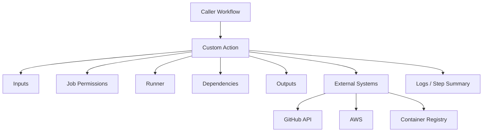
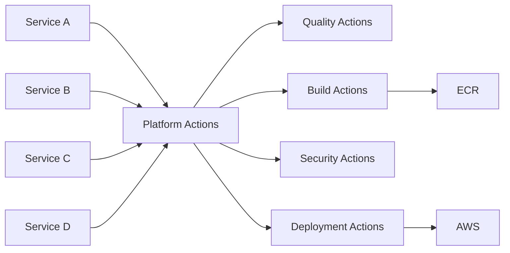

# 08- Custom Actions Questions

## Overview

Custom GitHub Actions allow engineering teams to package repeatable CI/CD behavior behind a stable interface.

The three primary custom action types are:

| Type | Execution model | Best suited for |
|---|---|---|
| Composite action | Executes reusable steps inside a job | Shell commands, setup, common step sequences |
| JavaScript action | Runs JavaScript using the GitHub Actions runtime | GitHub API integration, complex logic, reusable automation |
| Docker action | Executes logic inside a Docker container | Isolated tooling and custom runtime dependencies |

A senior engineer should not choose a custom action merely because several steps are duplicated. The design question is whether the behavior should become a reusable abstraction with a stable interface, controlled security boundary, versioning strategy, and operational ownership.

The most important architectural distinction is:

```text
Composite Action
    ↓
Reusable steps inside one job

JavaScript Action
    ↓
Programmatic automation

Docker Action
    ↓
Containerized action runtime

Reusable Workflow
    ↓
Multi-job CI/CD orchestration
```

---

## GitHub Actions Execution Model

A useful model is:

```text
Workflow
   ↓
Job
   ↓
Runner
   ↓
Steps
   ↓
Actions / Shell Commands
```

A custom action is consumed by a step:

```yaml
steps:
  - uses: organization/actions/setup-python@v1
```

The action executes within the context of the caller's job and runner.

This means custom actions inherit important properties of the calling job:

- Runner environment.
- Workspace.
- Environment variables.
- Available filesystem.
- Network access.
- Job permissions.
- Potential access to secrets.
- Toolchain installed on the runner.

A custom action therefore becomes part of the workflow's trust boundary.

---

## What Is a Custom Action?

A custom action is reusable GitHub Actions functionality defined by an `action.yml` or `action.yaml` metadata file.

A minimal structure:

```text
setup-backend/
├── action.yml
└── scripts/
    └── setup.sh
```

The metadata defines the public interface.

Example:

```yaml
name: Setup Backend

description: Configure the Python backend environment

inputs:
  python-version:
    description: Python version
    required: true

runs:
  using: composite
  steps:
    - name: Setup Python
      uses: actions/setup-python@v6
      with:
        python-version: ${{ inputs.python-version }}

    - name: Install dependencies
      shell: bash
      run: pip install -r requirements.txt
```

The caller only needs to know:

```yaml
- uses: organization/actions/setup-backend@v1
  with:
    python-version: "3.12"
```

---

## Why Custom Actions Exist

Custom actions solve repeated implementation problems.

For example, multiple Python repositories may repeatedly need:

```text
Setup Python
Install dependencies
Configure pip cache
Install internal tooling
Run standard validation
```

Instead of duplicating those steps:

```text
Repository A ── duplicated setup
Repository B ── duplicated setup
Repository C ── duplicated setup
```

package the behavior:

```text
             ┌── Repository A
             │
Custom Action ── Repository B
             │
             └── Repository C
```

The abstraction should be meaningful enough to justify its maintenance cost.

---

## Custom Action vs Reusable Workflow

This is a common interview question.

| Question | Custom Action | Reusable Workflow |
|---|---|---|
| Packages reusable steps? | Yes | Yes |
| Runs within a job? | Yes | No |
| Multiple jobs? | No | Yes |
| Job dependency graph? | No | Yes |
| Multiple runners? | No | Yes |
| Matrix orchestration? | Caller-controlled | Yes |
| Deployment orchestration? | Usually no | Yes |
| Environment approvals? | Not its primary purpose | Yes |
| Best abstraction | Implementation | Pipeline orchestration |

Use a custom action when the abstraction is:

```text
"These steps belong together."
```

Use a reusable workflow when the abstraction is:

```text
"These jobs and stages belong together."
```

---

## The `action.yml` Contract

The metadata file defines the action's interface.

Common fields include:

```yaml
name:
description:
inputs:
outputs:
runs:
```

Example:

```yaml
name: Docker Metadata

description: Generate standardized Docker image metadata

inputs:
  image-name:
    description: Docker image name
    required: true

outputs:
  image-tag:
    description: Generated image tag
    value: ${{ steps.metadata.outputs.tag }}

runs:
  using: composite
  steps:
    - id: metadata
      shell: bash
      env:
        IMAGE_NAME: ${{ inputs.image-name }}
      run: |
        echo "tag=${IMAGE_NAME}:${GITHUB_SHA}" >> "$GITHUB_OUTPUT"
```

The interface should remain stable even if the internal implementation changes.

---

## Action Inputs

Inputs are the primary configuration mechanism.

Example:

```yaml
inputs:
  environment:
    description: Deployment environment
    required: true

  region:
    description: AWS region
    required: false
    default: ap-south-1
```

Caller:

```yaml
- uses: organization/actions/aws-deploy@v1
  with:
    environment: staging
    region: ap-south-1
```

Good inputs expose business-level configuration rather than internal implementation details.

Prefer:

```text
environment
image-digest
service-name
python-version
```

over:

```text
shell-command
internal-directory
temporary-file-name
implementation-specific-flag
```

---

## Action Outputs

Outputs communicate data from an action to subsequent steps.

Example:

```yaml
outputs:
  image-digest:
    description: Immutable image digest
    value: ${{ steps.build.outputs.digest }}
```

A composite action can write an output:

```yaml
- id: build
  shell: bash
  run: |
    digest="sha256:abc123"
    echo "digest=${digest}" >> "$GITHUB_OUTPUT"
```

The caller can consume it:

```yaml
- uses: organization/actions/docker-build@v1
  id: docker

- name: Deploy
  run: |
    echo "${{ steps.docker.outputs.image-digest }}"
```

Prefer outputs that represent meaningful information:

```text
artifact-name
image-digest
version
deployment-id
```

---

## `$GITHUB_OUTPUT`

The supported mechanism for setting step outputs is:

```bash
echo "name=value" >> "$GITHUB_OUTPUT"
```

Example:

```yaml
- id: version
  shell: bash
  run: |
    VERSION="2.4.0"
    echo "version=${VERSION}" >> "$GITHUB_OUTPUT"
```

Consume it:

```yaml
- run: echo "${{ steps.version.outputs.version }}"
```

Avoid obsolete workflow-command patterns for new implementations.

---

## Multiline Outputs

For multiline values, use the documented multiline environment-file syntax carefully.

Example:

```yaml
- id: metadata
  shell: bash
  run: |
    {
      echo 'config<<EOF'
      echo '{"environment":"staging","region":"ap-south-1"}'
      echo 'EOF'
    } >> "$GITHUB_OUTPUT"
```

For complex structured data, JSON is generally easier to validate and consume than arbitrary multiline text.

---

## Composite Actions

Composite actions package multiple steps.

Example structure:

```text
python-quality/
├── action.yml
└── scripts/
    └── quality.sh
```

Example:

```yaml
name: Python Quality

description: Run standard Python quality checks

inputs:
  python-version:
    description: Python version
    required: true

runs:
  using: composite

  steps:
    - name: Setup Python
      uses: actions/setup-python@v6
      with:
        python-version: ${{ inputs.python-version }}

    - name: Install dependencies
      shell: bash
      run: pip install -r requirements.txt

    - name: Run Ruff
      shell: bash
      run: ruff check .
```

The caller remains responsible for the job.

---

## Composite Action Limitations

Composite actions are excellent for step reuse but are not workflow orchestration.

They should not be treated as a substitute for:

- Multiple jobs.
- Job-level dependencies.
- Environment promotion.
- Production approval orchestration.
- Workflow-level concurrency.
- Multi-job matrices.

Those concerns belong naturally in reusable workflows.

---

## Composite Action Shell Selection

Composite actions should specify the shell for `run` steps.

Example:

```yaml
- name: Run tests
  shell: bash
  run: pytest
```

This makes execution behavior explicit.

Do not assume every runner provides identical shell behavior.

---

## Composite Actions and Environment Variables

Inputs can be mapped to environment variables:

```yaml
- name: Run deployment
  shell: bash
  env:
    ENVIRONMENT: ${{ inputs.environment }}
  run: |
    ./deploy.sh "$ENVIRONMENT"
```

This is preferable when the value may contain characters that should not become part of shell source code.

---

## JavaScript Actions

JavaScript actions are useful when an action needs programmatic logic.

Typical use cases include:

- GitHub API interaction.
- Complex validation.
- Repository metadata processing.
- Pull request automation.
- Artifact or release automation.
- Structured API integrations.

Typical structure:

```text
release-metadata/
├── action.yml
├── package.json
├── package-lock.json
├── src/
│   └── main.js
└── dist/
    └── index.js
```

---

## JavaScript Action Metadata

Example:

```yaml
name: Release Metadata

description: Generate release metadata

inputs:
  release-type:
    description: Release type
    required: true

outputs:
  version:
    description: Generated version

runs:
  using: node24
  main: dist/index.js
```

The runtime version should be selected according to the currently supported GitHub Actions runtime and the action's compatibility requirements.

---

## `@actions/core`

The Actions toolkit provides utilities for interacting with the workflow runtime.

Example:

```javascript
const core = require("@actions/core");

const environment = core.getInput("environment", {
  required: true,
});

core.setOutput("environment", environment);
```

Useful capabilities include:

- Inputs.
- Outputs.
- Environment variables.
- Logging.
- Warnings.
- Errors.
- Secrets masking.
- Grouped logs.

---

## `@actions/github`

The GitHub toolkit can provide an authenticated GitHub client.

Example:

```javascript
const core = require("@actions/core");
const github = require("@actions/github");

const token = core.getInput("token", { required: true });
const octokit = github.getOctokit(token);

const { data } = await octokit.rest.repos.get({
  owner: process.env.GITHUB_REPOSITORY.split("/")[0],
  repo: process.env.GITHUB_REPOSITORY.split("/")[1],
});

core.setOutput("default-branch", data.default_branch);
```

The token should receive only the permissions required by the action.

---

## JavaScript Action Packaging

JavaScript actions commonly bundle dependencies into the distributable action.

A typical workflow is:

```text
src/
 ↓
npm install
 ↓
Build / bundle
 ↓
dist/
 ↓
Commit or publish distributable
 ↓
Consumer executes action
```

The exact packaging approach depends on the action tooling and repository policy.

Consumers should not need to run:

```bash
npm install
npm build
```

during action execution.

---

## `dist` and Action Reliability

A JavaScript action consumed directly from a repository generally needs its executable distribution available at the referenced revision.

A common mistake is:

```text
Source changed
 ↓
dist not regenerated
 ↓
Action executes stale code
```

Release automation should validate that the distributable matches the source.

---

## JavaScript Action Error Handling

Use explicit failures.

Example:

```javascript
try {
  const result = await performDeployment();
  core.setOutput("deployment-id", result.id);
} catch (error) {
  core.setFailed(`Deployment failed: ${error.message}`);
}
```

Do not swallow exceptions and allow the workflow to continue as though the action succeeded.

---

## API Retry Design

A JavaScript action interacting with APIs should distinguish:

```text
Transient failure
Permanent failure
Authentication failure
Validation failure
Rate limiting
Timeout
```

Retry only failures that are plausibly transient.

Use bounded retries and backoff rather than infinite loops.

---

## Docker Actions

Docker actions execute their logic inside a Docker container.

Typical structure:

```text
custom-deployer/
├── action.yml
├── Dockerfile
└── entrypoint.sh
```

Metadata:

```yaml
name: Custom Deployer

description: Deploy application

inputs:
  environment:
    description: Deployment environment
    required: true

runs:
  using: docker
  image: Dockerfile
  entrypoint: /entrypoint.sh
```

---

## Docker Action Runtime

Execution flow:

```text
GitHub Runner
    ↓
Build / obtain action container
    ↓
Start container
    ↓
Pass inputs/environment
    ↓
Execute entrypoint
    ↓
Produce outputs / exit status
```

The container provides runtime isolation and dependency control.

---

## Docker Action Advantages

Docker actions are useful when the action requires:

- Specialized Linux tooling.
- A controlled runtime.
- System packages.
- Native binaries.
- A predictable dependency environment.

They can be particularly useful when the required tooling would otherwise be difficult to install consistently on runners.

---

## Docker Action Limitations

Consider:

- Container startup overhead.
- Linux-centric execution requirements.
- Filesystem behavior.
- Workspace mounting.
- Network access.
- Runtime maintenance.
- Base image vulnerabilities.
- Image build and distribution costs.

A Docker action should not be chosen merely because Docker is familiar.

---

## Custom Action Type Selection

| Requirement | Recommended abstraction |
|---|---|
| Reuse 3–8 shell/setup steps | Composite |
| GitHub API automation | JavaScript |
| Complex custom programmatic logic | JavaScript |
| Specialized Linux runtime | Docker |
| Multi-job CI pipeline | Reusable workflow |
| Deployment orchestration | Reusable workflow |
| Environment approval | Reusable workflow |

The architectural boundary should follow responsibility rather than implementation preference.

---

## Action Versioning

Custom actions should be versioned deliberately.

Example:

```yaml
uses: organization/actions/python-quality@v1
```

Possible strategies:

```text
Branch
Tag
Semantic version
Major version
Commit SHA
```

A production organization should define how action versions are released and consumed.

---

## Semantic Versioning

For a reusable action API:

```text
MAJOR
MINOR
PATCH
```

A breaking input/output contract change may require a major version.

A backward-compatible feature may be minor.

A backward-compatible bug fix may be patch.

Example:

```text
v1.2.0
v1.2.1
v1.3.0
v2.0.0
```

The exact release strategy should be documented and consistently applied.

---

## Marketplace Actions

Marketplace actions are external dependencies.

Before adopting one, evaluate:

- Source repository.
- Maintainer trust.
- Release history.
- Dependency chain.
- Required permissions.
- Secret requirements.
- Security posture.
- Update frequency.
- License.
- Runtime compatibility.

Do not assume Marketplace publication means the action is appropriate for production.

---

## SHA Pinning

A mutable reference:

```yaml
uses: vendor/action@v1
```

provides convenience and upgradeability.

An immutable SHA:

```yaml
uses: vendor/action@<commit-sha>
```

reduces the risk that the referenced code changes unexpectedly.

For high-security environments, SHA pinning can be combined with controlled dependency-update automation.

---

## Internal Actions

Organizations may maintain:

```text
platform-actions/
├── python-quality
├── docker-build
├── security-scan
└── deployment
```

Internal actions can standardize engineering practices across repositories.

They should still have:

- Owners.
- Documentation.
- Versioning.
- Testing.
- Security review.
- Release management.

Internal does not mean automatically trusted.

---

## Private Actions

Private repositories can host actions used within permitted organizational boundaries.

Consider:

- Repository access.
- Organization policies.
- Consumer permissions.
- Version references.
- Dependency availability.
- Private package registries.
- Runner network access.

The action's availability must be validated from the perspective of the consumer workflow.

---

## Action Security Model

A custom action executes code inside a CI/CD trust boundary.

Its security depends on:

```text
Workflow
+
Permissions
+
Secrets
+
Runner
+
Action source
+
Dependencies
+
Inputs
```

An action with:

```yaml
permissions:
  contents: write
  id-token: write
```

has substantially more potential impact than a read-only linting action.

---

## Least Privilege

Do not give a custom action access to resources it does not require.

For example:

```yaml
permissions:
  contents: read
```

may be sufficient for a metadata action.

An AWS deployment action may need:

```yaml
permissions:
  contents: read
  id-token: write
```

and the AWS IAM role should separately restrict what AWS resources it can access.

---

## Secret Handling

Avoid unnecessary secret access.

Bad architecture:

```text
Generic Action
 ↓
All repository secrets
```

Better:

```text
Deployment Action
 ↓
Specific deployment credential
```

Prefer OIDC for AWS authentication where supported instead of long-lived access keys.

---

## Secret Exposure Through Arguments

Avoid:

```yaml
run: ./deploy.sh "${{ secrets.API_KEY }}"
```

Secrets can accidentally become visible through process arguments, debugging output, or tooling behavior.

Prefer environment variables when a tool supports them:

```yaml
env:
  API_KEY: ${{ secrets.API_KEY }}
run: ./deploy.sh
```

The receiving program should also avoid printing the value.

---

## Untrusted Inputs

Inputs may originate from:

- Pull request titles.
- Branch names.
- Commit messages.
- Manual workflow inputs.
- Repository dispatch payloads.
- External API data.

Do not insert untrusted values directly into shell source.

Risky:

```yaml
- run: echo "Branch is ${{ github.ref_name }}"
```

Safer:

```yaml
- name: Print branch
  env:
    BRANCH_NAME: ${{ github.ref_name }}
  run: |
    printf 'Branch is %s\n' "$BRANCH_NAME"
```

This separates data from shell syntax.

---

## Python-Based Custom Tooling

A custom action does not have to be written in Python simply because the organization's backend stack is Python.

If Python logic is required, consider whether it belongs in:

- A repository script.
- A Python package.
- A Docker action.
- A JavaScript action.
- A composite action invoking Python.

The decision should consider runtime availability, packaging, startup time, portability, and maintenance.

---

## Python Backend Example

A composite action can standardize Python quality checks:

```yaml
name: Python Quality

description: Run backend quality checks

inputs:
  python-version:
    description: Python version
    required: false
    default: "3.12"

runs:
  using: composite
  steps:
    - uses: actions/setup-python@v6
      with:
        python-version: ${{ inputs.python-version }}

    - shell: bash
      run: |
        python -m pip install --upgrade pip
        pip install ruff pytest

    - shell: bash
      run: ruff check .

    - shell: bash
      run: pytest
```

This can be consumed by Django and FastAPI repositories.

---

## Django Integration

A reusable action can standardize application validation:

```text
Install dependencies
 ↓
Run migrations check
 ↓
Collect static validation
 ↓
Ruff
 ↓
pytest
```

For example:

```yaml
- name: Validate Django project
  shell: bash
  run: |
    python manage.py check
    python manage.py makemigrations --check --dry-run
```

Application-specific behavior should remain configurable rather than hidden behind excessive action logic.

---

## FastAPI Integration

A FastAPI repository might use a custom quality action for:

```text
Python setup
 ↓
Dependency installation
 ↓
Lint
 ↓
Type checking
 ↓
pytest
```

The action should not unnecessarily understand FastAPI internals unless that behavior is intentionally part of its contract.

---

## Docker Build Action

A reusable Docker action may standardize:

```text
Buildx setup
 ↓
Metadata
 ↓
Cache
 ↓
Build
 ↓
Scan
 ↓
Push
 ↓
Digest output
```

Example consumer interface:

```yaml
- name: Build image
  id: image
  uses: organization/actions/docker-build@v1
  with:
    image-name: orders-api
    push: true
```

The output might be:

```yaml
${{ steps.image.outputs.digest }}
```

---

## AWS Deployment Action

A deployment action may encapsulate a focused operation such as:

```text
Validate image digest
 ↓
Authenticate through OIDC
 ↓
Update ECS service
 ↓
Wait for deployment
 ↓
Validate health
 ↓
Return deployment ID
```

However, approval gates and multi-environment orchestration generally belong in a reusable workflow rather than inside one custom action.

---

## Custom Actions and ECR

A Docker build action can publish an immutable image:

```text
Git SHA
 ↓
Docker Buildx
 ↓
ECR
 ↓
Image Digest
```

The digest can then be returned:

```yaml
echo "digest=${DIGEST}" >> "$GITHUB_OUTPUT"
```

The caller can promote that exact digest between environments.

---

## Custom Actions and ECS

A deployment workflow may call an action:

```yaml
- name: Deploy ECS service
  uses: organization/actions/ecs-deploy@v1
  with:
    cluster: production
    service: orders
    image-digest: ${{ needs.build.outputs.image-digest }}
```

The action should focus on deployment mechanics.

The workflow should own:

```text
Approval
Concurrency
Environment
Promotion
Rollback orchestration
```

---

## Action Testing

Test custom actions before broad adoption.

### Contract Tests

Verify:

```text
Inputs
Outputs
Required configuration
Failure behavior
```

### Integration Tests

Run the action in a real or controlled GitHub Actions environment.

### Security Tests

Verify:

- Permissions.
- Secret handling.
- Untrusted inputs.
- Dependency behavior.
- Failure handling.

### Compatibility Tests

Test supported:

- Runner operating systems.
- Runtime versions.
- Action versions.
- Repository configurations.

---

## Failure Semantics

A custom action should clearly define:

```text
Success
Failure
Retryable failure
Invalid input
Unsupported configuration
```

A deployment action should not silently report success after an API failure.

Example JavaScript:

```javascript
try {
  await deploy();
} catch (error) {
  core.setFailed(`Deployment failed: ${error.message}`);
}
```

---

## Retries

Retries are appropriate for transient failures such as:

```text
Temporary network failure
HTTP 429
Transient 5xx response
Temporary registry failure
```

Do not blindly retry:

```text
Invalid credentials
Invalid configuration
Authorization failure
Malformed request
Application validation failure
```

Use bounded retries with backoff.

---

## Timeouts

Long-running actions should have clear timeout behavior.

A deployment action should not wait indefinitely for an external system.

Model:

```text
Start
 ↓
Poll
 ↓
Success → Exit
 ↓
Transient → Retry
 ↓
Timeout → Fail
```

The workflow should be able to distinguish timeout from successful completion.

---

## Idempotency

Production actions should be safe to retry where possible.

For deployment operations:

```text
Same request
+
Same artifact
=
Same desired state
```

An action should prefer declarative desired state over unsafe repeated imperative mutations.

---

## Logging

Logs should provide enough information to diagnose failures without exposing secrets.

Good:

```text
Deploying service orders
Environment: staging
Image digest: sha256:...
Waiting for ECS deployment
```

Avoid:

```text
AWS_ACCESS_KEY_ID=...
DATABASE_PASSWORD=...
API_TOKEN=...
```

Use structured and meaningful logs.

---

## Step Summaries

For operational workflows, important results can be written to:

```text
$GITHUB_STEP_SUMMARY
```

Example:

```bash
{
  echo "## Deployment"
  echo ""
  echo "- Environment: staging"
  echo "- Image: $IMAGE_DIGEST"
  echo "- Status: successful"
} >> "$GITHUB_STEP_SUMMARY"
```

This provides an operator-friendly result without searching through thousands of log lines.

---

## Custom Action Observability

Production actions should expose useful operational information:

- Start/end status.
- Deployment identifier.
- Artifact identity.
- Environment.
- Duration.
- External API failure.
- Retry count.
- Failure category.

Avoid logging secrets or unnecessary sensitive metadata.

---

## Runner Considerations

Custom actions execute on runners.

The action may depend on:

```text
Operating system
Installed tools
Docker
Network access
Filesystem
CPU
Memory
```

A composite action that assumes:

```bash
jq
```

exists on every runner is less portable than one that explicitly establishes the dependency.

---

## Self-Hosted Runner Considerations

Self-hosted runners may have:

- Private network access.
- Internal registries.
- AWS VPC access.
- Custom certificates.
- Internal tools.

This increases capability but also increases blast radius.

A malicious or compromised action may inherit access to the same private network.

Treat third-party actions carefully on privileged self-hosted runners.

---

## Ephemeral Runners

Ephemeral runners can reduce persistent-state risk.

Architecture:

```text
Provision Runner
      ↓
Execute Job
      ↓
Destroy Runner
```

This is useful for workloads involving:

- Sensitive build environments.
- Private networks.
- Deployment credentials.
- Untrusted build dependencies.

Ephemeral runners do not replace least privilege or action trust controls.

---

## Docker Socket Risk

A self-hosted runner exposing:

```text
/var/run/docker.sock
```

to untrusted workloads can create a significant privilege boundary.

A custom action capable of interacting with the Docker daemon may gain more host control than expected.

Avoid giving untrusted workflows unnecessary Docker privileges.

---

## Private Network Actions

Some internal actions may need access to:

```text
Private package registry
Internal API
Private PostgreSQL
Redis
Kafka
AWS private endpoints
```

Use dedicated runner groups and network segmentation where appropriate.

Do not give every CI job access to the entire production network.

---

## Action Dependency Chain

A custom action may depend on:

```text
Custom Action
 ↓
Third-party Action
 ↓
npm package
 ↓
Transitive dependency
```

or:

```text
Docker Action
 ↓
Base Image
 ↓
OS Package
 ↓
Application Dependency
```

The security boundary includes the dependency chain.

---

## Supply Chain Security

Production custom actions should consider:

- SHA pinning.
- Dependency review.
- Dependabot.
- Lock files.
- SBOM generation.
- Provenance.
- Artifact attestations.
- Signing.
- Trusted build environments.
- Release integrity.

An internal action is still software supply chain infrastructure.

---

## Action Allowlisting

Enterprise environments may restrict which actions repositories can execute.

A governance model can define:

```text
Approved Marketplace Actions
Approved Internal Actions
Approved Versions
Approved SHA
Approved Maintainers
```

This reduces uncontrolled CI/CD dependencies.

---

## Custom Action Repository Structure

A larger action repository might use:

```text
platform-actions/
├── python-quality/
│   ├── action.yml
│   └── scripts/
├── docker-build/
│   ├── action.yml
│   └── src/
├── ecs-deploy/
│   ├── action.yml
│   └── src/
└── README.md
```

Ownership should be clear at both repository and action level.

---

## Monorepo vs Separate Action Repositories

| Model | Advantages | Limitations |
|---|---|---|
| Single action repository | Central governance | Larger release surface |
| One repository per action | Independent versioning | More repositories |
| Platform repository with multiple actions | Balanced organization | Requires stronger structure |

Choose based on:

- Number of actions.
- Ownership.
- Release cadence.
- Consumer count.
- Security requirements.

---

## Documentation for Custom Actions

Every production action should document:

```text
Purpose
Inputs
Outputs
Required permissions
Secrets
Supported runners
Examples
Failure behavior
Versioning
Security considerations
```

Example:

```markdown
## Inputs

| Name | Required | Description |
|---|---|---|
| environment | Yes | Deployment environment |
| image-digest | Yes | Immutable image digest |

## Permissions

```yaml
permissions:
  contents: read
  id-token: write
```
```

Documentation is part of the action's API contract.

---

## Troubleshooting Custom Actions

### Action Not Found

**Symptom**

```text
Unable to resolve action
```

**Possible causes**

- Incorrect repository.
- Incorrect path.
- Incorrect version.
- Repository access restriction.
- Action metadata missing.

**Checks**

```bash
git ls-remote <repository>
```

Verify the exact:

```text
owner/repository/path@ref
```

---

### `action.yml` Not Found

**Symptom**

GitHub cannot determine how to execute the action.

**Possible causes**

- Incorrect action path.
- Missing metadata file.
- Incorrect repository layout.

Expected:

```text
my-action/
└── action.yml
```

or:

```text
my-action/
└── action.yaml
```

---

### Input Is Empty

**Symptom**

The action receives no expected input.

**Possible causes**

- Incorrect input name.
- Caller omitted required input.
- Incorrect expression.
- Input contract changed.

Trace:

```text
Caller
 ↓
with:
 ↓
action.yml
 ↓
inputs.<name>
```

---

### Output Is Empty

**Symptom**

The following step receives an empty value.

**Isolation**

Verify:

```text
Step ID
 ↓
$GITHUB_OUTPUT
 ↓
Action output definition
 ↓
steps.<id>.outputs.<name>
```

Do not assume the output is automatically propagated.

---

### Composite Action Fails on Windows

**Possible causes**

- Bash-specific commands.
- Unix paths.
- Shell assumptions.
- Missing tooling.

If cross-platform support is required, explicitly design and test the action for each supported runner.

---

### JavaScript Action Fails at Runtime

Check:

```text
action.yml
 ↓
runtime version
 ↓
dist/
 ↓
dependencies
 ↓
API authentication
 ↓
permissions
```

A stale or missing distribution artifact is a common release problem.

---

### Docker Action Fails to Start

Check:

```text
Dockerfile
 ↓
Base image
 ↓
Entrypoint
 ↓
Executable permissions
 ↓
Architecture
 ↓
Network
```

Also verify that the action's runtime assumptions match the runner environment.

---

### API Returns 403

A `403` does not necessarily mean the action code is broken.

Check:

```text
GITHUB_TOKEN
 ↓
Workflow permissions
 ↓
Job permissions
 ↓
Repository policy
 ↓
Target resource permissions
```

For AWS:

```text
OIDC
 ↓
STS
 ↓
IAM trust policy
 ↓
IAM permissions
 ↓
AWS resource policy
```

---

## Failure-Domain Troubleshooting Model

For production incidents use:

```text
Symptom
  ↓
Possible Causes
  ↓
Isolation Strategy
  ↓
Commands / Checks
  ↓
Root Cause
  ↓
Corrective Action
  ↓
Prevention
```

This prevents random configuration changes from becoming the debugging strategy.

---

## GitHub CLI Diagnostics

Useful commands include:

```bash
gh workflow list
```

```bash
gh run list
```

```bash
gh run view <run-id>
```

```bash
gh run view <run-id> --log
```

```bash
gh run rerun <run-id>
```

For repository information:

```bash
gh repo view
```

For workflow-specific debugging, combine GitHub CLI output with the action's own logs and step summaries.

---

## Custom Action Production Architecture



The security boundary includes the runner, action implementation, dependencies, permissions, and external systems.

---

## Enterprise Custom Action Architecture



The platform team owns the shared action layer.

Application teams consume versioned interfaces.

---

## Custom Actions and Reusable Workflows Together

A mature architecture may use both:

```text
Reusable Workflow
      ↓
 ┌────┼─────┐
 ↓    ↓     ↓
Lint Build Deploy
      ↓
Custom Actions
      ↓
Reusable Implementation
```

For example:

```text
Reusable CI Workflow
 ├── Python Quality Action
 ├── Security Action
 └── Docker Build Action
```

and:

```text
Reusable Deployment Workflow
 └── ECS Deployment Action
```

This separates orchestration from implementation.

---

## Production Pipeline Example

```yaml
name: Backend CI/CD

on:
  pull_request:
  push:
    branches:
      - main

jobs:
  test:
    runs-on: ubuntu-latest

    steps:
      - uses: actions/checkout@v5

      - name: Python quality
        uses: organization/actions/python-quality@v1
        with:
          python-version: "3.12"

  build:
    needs: test
    runs-on: ubuntu-latest

    steps:
      - uses: actions/checkout@v5

      - name: Build image
        id: image
        uses: organization/actions/docker-build@v1
        with:
          image-name: orders-api
          push: true

      - name: Export digest
        run: |
          echo "Image: ${{ steps.image.outputs.digest }}"
```

A deployment workflow can then consume the immutable image digest.

---

## Production Deployment Architecture

```text
Pull Request
    ↓
Reusable CI
    ↓
Custom Quality Actions
    ↓
Integration Tests
    ↓
Security Scan
    ↓
Reusable Build Workflow
    ↓
Docker Build Action
    ↓
ECR
    ↓
Immutable Digest
    ↓
Staging
    ↓
Approval
    ↓
Production
    ↓
Health Validation
    ↓
Monitoring
    ↓
Rollback
```

This architecture allows:

```text
Workflow
=
Orchestration

Custom Action
=
Implementation

Artifact
=
Deployment Identity
```

---

## Performance Considerations

Custom actions introduce execution overhead.

Consider:

- Action startup time.
- Docker image startup time.
- Dependency installation.
- API calls.
- Network latency.
- Repeated setup.
- Runner provisioning.
- Artifact transfers.

For frequently executed actions, reducing unnecessary initialization can materially reduce CI duration.

---

## Scalability Considerations

An action used by hundreds of repositories becomes shared infrastructure.

Consider:

```text
Consumer count
+
Invocation frequency
+
Runner capacity
+
External API rate limits
+
Registry traffic
```

A GitHub API action called thousands of times can encounter rate limits even if every individual invocation is correct.

Use caching, batching, and bounded concurrency where appropriate.

---

## Reliability Considerations

Production actions should be:

- Deterministic.
- Idempotent where possible.
- Explicit about failures.
- Bounded by timeouts.
- Careful with retries.
- Observable.
- Versioned.

Do not make an action "reliable" by retrying every failure indefinitely.

---

## High Availability and Disaster Recovery

Actions themselves are usually not the application runtime, but they can become critical deployment infrastructure.

Protect against action failures through:

- Versioned releases.
- Previous known-good versions.
- Tested rollback.
- Multiple supported workflow versions.
- Reproducible builds.
- Clear ownership.

If a deployment action is unavailable, the organization should still have an operational recovery path.

---

## Cost Optimization

Reduce unnecessary action execution through:

```text
Path filtering
+
Selective workflows
+
Caching
+
Matrix control
+
Reusable setup
+
Appropriate runner sizing
```

Do not optimize CI cost by removing critical validation blindly.

Optimize duplicated work first.

---

## Common Senior-Level Mistakes

### Building a Custom Action for Every Script

Not every script needs an action.

If behavior is repository-specific and unlikely to be reused, a normal script may be simpler.

### Putting Workflow Orchestration Inside an Action

Approvals, multi-job dependencies, and environment promotion belong in workflows.

### Giving Actions Excessive Permissions

A reusable action should not automatically receive deployment privileges.

### Treating Internal Actions as Trusted by Default

Internal code can still contain vulnerabilities or dependencies with security issues.

### Ignoring Action Versioning

Consumers need predictable behavior.

### Hiding Secrets Inside Actions

An action should document exactly what secrets it requires and why.

### Logging Sensitive Data

Never assume masking makes arbitrary secret handling safe.

### Using Mutable Dependencies Without Governance

`@main` and unpinned dependencies can create unexpected behavior.

---

## Interview Questions

### What Are the Three Types of Custom GitHub Actions?

The major types are:

```text
Composite
JavaScript
Docker
```

Composite actions package steps, JavaScript actions provide programmatic automation, and Docker actions provide a containerized execution environment.

---

### When Would You Choose a Composite Action?

Use a composite action when multiple steps should be reused together inside a job.

Example:

```text
Setup Python
Install dependencies
Run lint
```

---

### When Would You Choose a JavaScript Action?

Choose JavaScript when the action needs programmatic logic or GitHub API integration.

Examples:

```text
Create release metadata
Inspect repository state
Update pull requests
Interact with GitHub APIs
```

---

### When Would You Choose a Docker Action?

Choose Docker when the action requires a specialized Linux runtime or system dependencies that are easier to package into a container.

---

### Why Not Put Everything in a Composite Action?

Composite actions cannot replace multi-job workflow orchestration.

If the design requires:

```text
Test
 ↓
Build
 ↓
Approval
 ↓
Deploy
```

use a workflow.

---

### What Should `action.yml` Define?

At minimum, it describes:

```text
Name
Description
Inputs
Outputs
Execution model
Entry point / implementation
```

It is effectively the action's public interface.

---

### How Do You Pass Data From a Custom Action to the Next Step?

Use an output.

The action writes to:

```text
$GITHUB_OUTPUT
```

and exposes the output through its metadata.

The caller consumes:

```yaml
${{ steps.<id>.outputs.<name> }}
```

---

### How Would You Secure a Custom Action?

Use:

- Least-privilege permissions.
- Explicit secrets.
- Trusted dependencies.
- SHA pinning where appropriate.
- Dependency scanning.
- Input validation.
- Safe shell handling.
- Protected releases.
- Versioning.
- Minimal runner privileges.

---

### What Is the Main Security Risk of a Custom Action on a Self-Hosted Runner?

The action executes code on infrastructure that may have access to private networks, credentials, internal systems, or persistent resources.

A compromised action can therefore have a significantly larger blast radius than on an isolated environment.

---

### How Would You Design an AWS Deployment Action?

Keep the action focused on deployment mechanics:

```text
Input image digest
 ↓
OIDC authentication
 ↓
AWS API
 ↓
Deploy
 ↓
Wait for health
 ↓
Return deployment metadata
```

Keep environment approval, concurrency, and promotion orchestration in the workflow.

---

### How Do You Prevent a Custom Action From Leaking Secrets?

Use:

```text
Minimal secret scope
+
Environment variables
+
No secret interpolation into shell source
+
No secret logging
+
Least-privilege permissions
```

Also review dependencies because the action itself executes with the privileges available to it.

---

### What Happens If a Custom Action Fails?

The action should return a non-zero failure state or explicitly mark the action failed.

The workflow can then use status-aware conditions:

```yaml
if: ${{ failure() }}
```

for appropriate diagnostics or cleanup.

---

### How Would You Version a Shared Internal Action?

A reasonable lifecycle is:

```text
Develop
 ↓
Test
 ↓
Release
 ↓
Version
 ↓
Consume
 ↓
Monitor
 ↓
Deprecate
```

Breaking interface changes should receive a clear compatibility boundary.

---

## Senior Scenario: Design a Shared Python Action

> One hundred Python repositories need the same quality checks. How would you design the action?

A reasonable design is:

```text
Composite Action
    ↓
Python setup
    ↓
Dependency/tool setup
    ↓
Ruff
    ↓
Pytest
    ↓
Coverage
```

Expose only meaningful inputs:

```text
python-version
test-command
coverage-threshold
```

Avoid exposing every shell command as an input.

Version the action and test it against representative repositories.

---

## Senior Scenario: Custom Action Needs AWS Access

> A deployment action needs AWS access. Would you store AWS access keys as repository secrets?

Prefer GitHub OIDC with short-lived AWS credentials where supported.

Architecture:

```text
GitHub Actions
 ↓
OIDC Token
 ↓
AWS STS
 ↓
IAM Role
 ↓
Deployment
```

Restrict the IAM trust policy to the intended repository and branch/environment identity.

---

## Senior Scenario: Action Executes Untrusted Input

> A custom action receives a pull request title and executes a shell command using that value.

The input should be treated as untrusted.

Avoid:

```yaml
run: tool "${{ github.event.pull_request.title }}"
```

Prefer:

```yaml
env:
  PR_TITLE: ${{ github.event.pull_request.title }}
run: |
  tool "$PR_TITLE"
```

Then validate the input according to the application's requirements.

---

## Senior Scenario: Action Is Too Large

> A deployment action now handles AWS authentication, approvals, traffic shifting, rollback, monitoring, and notifications.

This is a strong indication that orchestration and implementation have been mixed.

Refactor toward:

```text
Reusable Deployment Workflow
 ├── Environment / Approval
 ├── Concurrency
 ├── Deployment
 ├── Health Validation
 └── Rollback

Custom Actions
 ├── AWS authentication/deployment mechanics
 ├── Traffic operations
 └── Deployment metadata
```

Each abstraction should have a focused responsibility.

---

## Senior Scenario: Compromised Third-Party Dependency

> A custom JavaScript action depends on a compromised npm package.

The action may execute with the workflow's permissions and access to available secrets.

Mitigations include:

- Lock files.
- Dependency scanning.
- Dependabot.
- Dependency review.
- SHA-pinned action dependencies.
- Minimal permissions.
- Limited secrets.
- Protected releases.
- Provenance and attestations.
- Ephemeral runners where appropriate.

The objective is to reduce both compromise probability and blast radius.

---

## Senior Scenario: Production Rollback

> A custom deployment action successfully deploys an image but the application fails health checks.

The action should return deployment status rather than silently succeeding.

The surrounding deployment workflow should handle:

```text
Health failure
 ↓
Deployment failure
 ↓
Rollback decision
 ↓
Previous immutable image digest
 ↓
Rollback
 ↓
Health validation
```

The rollback mechanism should be designed before the deployment action is considered production-ready.

---

## Production Checklist

### Action Design

- [ ] Responsibility is clearly defined.
- [ ] Composite, JavaScript, or Docker type is intentional.
- [ ] `action.yml` defines a stable contract.
- [ ] Inputs are minimal and meaningful.
- [ ] Outputs are explicit.
- [ ] Failure behavior is documented.

### Security

- [ ] Permissions follow least privilege.
- [ ] Secrets are minimized.
- [ ] Untrusted input is handled safely.
- [ ] Third-party dependencies are reviewed.
- [ ] Actions are versioned or SHA-pinned according to policy.
- [ ] Self-hosted runner exposure is understood.
- [ ] AWS uses OIDC where appropriate.

### Reliability

- [ ] Transient failures are retried selectively.
- [ ] Retries are bounded.
- [ ] Timeouts exist for long-running operations.
- [ ] Deployment operations are idempotent where possible.
- [ ] Logs provide useful diagnostics.
- [ ] Step summaries expose important results.

### Operations

- [ ] Action ownership is documented.
- [ ] Releases are versioned.
- [ ] Consumer compatibility is tested.
- [ ] Breaking changes have a migration strategy.
- [ ] Rollback is possible.
- [ ] Security incidents can be investigated.

### Production Integration

- [ ] Immutable Docker artifacts are preferred.
- [ ] Artifact digests can be propagated.
- [ ] Environment protection remains in the workflow.
- [ ] Deployment concurrency is defined.
- [ ] Health checks are explicit.
- [ ] Monitoring and rollback are integrated.

---

## Key Takeaways

- **Choose the action type based on the abstraction: composite actions package reusable steps, JavaScript actions handle programmatic automation, Docker actions provide specialized runtimes, and reusable workflows orchestrate multi-job pipelines.**
- **Treat `action.yml` as a production API contract with explicit inputs, outputs, permissions, secrets, failure behavior, and versioning.**
- **Custom actions execute inside the caller's security boundary, so least privilege, safe input handling, dependency trust, SHA pinning, secret minimization, and runner isolation are essential.**
- **Keep actions focused on implementation and let reusable workflows own orchestration concerns such as environments, approvals, concurrency, promotion, and rollback.**
- **Production-grade actions should be versioned, tested, observable, idempotent where possible, bounded by retries and timeouts, and designed with failure recovery and blast radius in mind.**