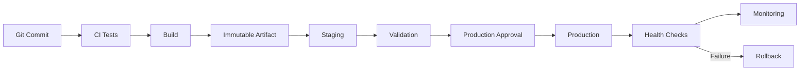

# 10- Environments and Deployment Questions

## Overview

GitHub Actions environments provide a controlled boundary around deployments and environment-specific configuration.

For production CI/CD, an environment should not be treated merely as a variable collection. It can represent a deployment boundary with:

- Environment-specific secrets.
- Environment-specific variables.
- Required reviewers.
- Deployment protection rules.
- Branch or tag restrictions.
- Deployment history.
- Controlled access to production credentials.
- Integration with concurrency and release workflows.

A typical production pipeline is:

```text
Pull Request
    ↓
Lint
    ↓
Unit Tests
    ↓
Integration Tests
    ↓
Security Scan
    ↓
Build Immutable Artifact
    ↓
Staging
    ↓
Validation
    ↓
Production Approval
    ↓
Production
    ↓
Health Validation
    ↓
Monitoring
    ↓
Rollback if Required
```

The senior-level problem is designing environments so that the same tested artifact moves through controlled boundaries without introducing configuration drift, deployment races, credential exposure, or unsafe promotion paths.

---

## What Is a GitHub Actions Environment?

A GitHub Actions environment represents a named deployment target such as:

```text
development
staging
production
```

A job can target an environment:

```yaml
jobs:
  deploy:
    runs-on: ubuntu-latest
    environment: production

    steps:
      - name: Deploy
        run: ./scripts/deploy.sh
```

The environment can provide:

- Environment variables.
- Environment secrets.
- Required reviewers.
- Deployment protection rules.
- Deployment history.
- Branch/tag deployment restrictions.

The important architectural point is that the environment becomes part of the deployment control plane.

---

## Why Environments Exist

Without explicit environment boundaries, a workflow can easily evolve into:

```text
Build
 ↓
Deploy wherever variables happen to point
```

This makes it difficult to answer:

- Which workflow can deploy to production?
- Which credentials are available?
- Who approved the deployment?
- Which branch is allowed to deploy?
- Which artifact was deployed?
- When was the deployment performed?
- Can two production deployments execute simultaneously?

Environments provide mechanisms for answering these questions.

---

## Environment as a Security Boundary

A useful mental model is:

```text
Repository
    │
    ├── CI
    │
    ├── Staging Environment
    │       └── Staging secrets
    │
    └── Production Environment
            ├── Production secrets
            ├── Reviewers
            └── Deployment restrictions
```

Production credentials should not be available to ordinary CI jobs.

For example:

```yaml
jobs:
  test:
    runs-on: ubuntu-latest
    steps:
      - run: pytest
```

should generally not target:

```text
production
```

unless the job is actually performing a protected production deployment.

---

## Environment Configuration

A typical model is:

| Environment | Purpose | Typical access |
|---|---|---|
| Development | Developer validation | Broad |
| Staging | Production-like validation | Controlled |
| Production | Live system | Highly restricted |

The exact number of environments should follow the organization's deployment lifecycle.

Do not create environments simply because they sound architecturally complete.

---

## Environment Variables

Environment-level variables can hold non-sensitive configuration.

Examples:

```text
AWS_REGION
ECR_REPOSITORY
ECS_CLUSTER
ECS_SERVICE
API_BASE_URL
```

Sensitive configuration should use environment secrets instead.

For example:

```text
Variable:
AWS_REGION=ap-south-1

Secret:
DATABASE_PASSWORD=...
```

Do not use variables as a replacement for secrets.

---

## Environment Secrets

Production secrets should be scoped to the production environment.

Conceptually:

```text
Repository
├── CI secrets
│
├── Staging environment
│   └── staging secrets
│
└── Production environment
    └── production secrets
```

This prevents a staging deployment from automatically gaining access to production credentials.

---

## Environment Protection

A production environment can require additional controls before deployment.

A typical flow is:

```text
Deployment Job
      ↓
Production Environment
      ↓
Protection Rules
      ↓
Required Approval
      ↓
Deployment
```

This is especially useful for systems where production changes require human authorization.

---

## Required Reviewers

A production deployment can require designated reviewers.

Example architecture:

```text
Developer
   ↓
PR merged
   ↓
Deployment workflow
   ↓
Production environment
   ↓
Required reviewer
   ↓
Deployment
```

The approval should be treated as a security and operational control, not merely a notification mechanism.

---

## Approval Does Not Replace Validation

A reviewer should not be expected to determine whether the deployment is technically healthy by inspecting a large workflow manually.

A better pipeline is:

```text
Automated Tests
    ↓
Security Checks
    ↓
Artifact Validation
    ↓
Staging Deployment
    ↓
Staging Health Checks
    ↓
Production Approval
    ↓
Production Deployment
```

Human approval should complement automated validation.

---

## Branch Restrictions

Production deployment should generally be restricted to trusted branches or release references.

For example:

```text
main
release/*
```

may be allowed to deploy to production while arbitrary feature branches are not.

The exact branch strategy depends on the repository's release model.

---

## Environment Deployment Rules

A mature deployment system should answer:

```text
Who can deploy?
From where?
Using which artifact?
To which environment?
With which credentials?
After which validations?
```

These are architectural questions, not merely YAML questions.

---

## Environment Promotion

Environment promotion means moving a validated artifact through deployment stages.

Example:

```text
Build
 ↓
Artifact
 ↓
Development
 ↓
Staging
 ↓
Production
```

The important principle is:

```text
Promote the artifact
```

rather than:

```text
Rebuild for each environment
```

---

## Build Once, Deploy Many

Consider a Docker image:

```text
orders-api:8f3a2c1
```

CI builds it once:

```text
Source
 ↓
Docker Buildx
 ↓
orders-api:8f3a2c1
 ↓
ECR
```

The same image is then deployed:

```text
ECR
 ↓
Staging
 ↓
Production
```

This reduces the possibility that staging and production receive different binaries.

---

## Why Rebuilding Is Dangerous

Suppose:

```text
Staging build
    ↓
Dependency version A
```

and later:

```text
Production build
    ↓
Dependency version B
```

Even though both builds originate from the same Git commit, they may not be byte-for-byte equivalent.

Differences can come from:

- Base image updates.
- Package resolution.
- Build tools.
- Generated files.
- External dependencies.
- Build timestamps.
- Compiler versions.

Build once and promote the immutable artifact instead.

---

## Artifact Identity

A production deployment should have a stable artifact identity.

For Docker:

```text
Git SHA tag
```

is useful:

```text
orders-api:8f3a2c1
```

A registry digest is stronger:

```text
orders-api@sha256:...
```

A deployment system should record the identity actually deployed.

---

## Environment Promotion Architecture



The artifact remains constant while the deployment target changes.

---

## Environment-Specific Configuration

The application artifact should remain environment-neutral where practical.

For example:

```text
Docker Image
    ↓
Same application binary
```

Environment-specific values can be injected at runtime:

```text
Staging:
DATABASE_HOST=staging-db

Production:
DATABASE_HOST=production-db
```

This avoids building separate images for each environment.

---

## Configuration vs Artifact

| Concern | Artifact | Environment |
|---|---|---|
| Application code | Yes | No |
| Python dependencies | Yes | No |
| OS dependencies | Yes | No |
| Docker image | Yes | No |
| Database hostname | No | Yes |
| AWS account | No | Yes |
| Secrets | No | Yes |
| API endpoint | Usually no | Yes |
| Runtime feature flags | Usually no | Yes |

The exact split depends on the application, but the goal is to minimize environment-specific builds.

---

## Django Environment Promotion

A Django application might use:

```text
Same Docker image
        ↓
Staging
        ↓
Production
```

with different runtime configuration:

```text
DJANGO_SETTINGS_MODULE
DATABASE_URL
REDIS_URL
ALLOWED_HOSTS
AWS_REGION
```

Secrets should remain outside the image.

Never bake production credentials into the Docker image.

---

## FastAPI Environment Promotion

FastAPI follows the same principle:

```text
FastAPI Image
     ↓
Staging
     ↓
Production
```

Configuration is injected through:

```text
Environment variables
Secrets manager
Runtime configuration
```

The API binary should not need to be rebuilt merely because the database endpoint changed.

---

## AWS Environment Architecture

A strong production design often separates AWS environments.

For example:

```text
AWS Account: Development
        ↓
AWS Account: Staging
        ↓
AWS Account: Production
```

Alternatively, organizations may use separate VPCs or carefully separated resources within an account.

Separate accounts provide stronger isolation for high-risk production resources.

---

## GitHub OIDC and Environment Security

GitHub Actions can authenticate to AWS through OIDC:

```text
GitHub Actions
      ↓
GitHub OIDC Token
      ↓
AWS STS
      ↓
IAM Role
      ↓
AWS Resource
```

The production deployment job can target:

```yaml
environment: production
```

and assume a production-specific IAM role.

---

## Example AWS Deployment Permissions

A deployment job may use:

```yaml
permissions:
  contents: read
  id-token: write
```

Then authenticate using OIDC.

The IAM trust policy should restrict which GitHub workflow identities can assume the role.

For example, production should not accept arbitrary repository branches merely because they can request an OIDC token.

---

## Environment and IAM Separation

A useful model is:

```text
Staging Environment
    ↓
Staging IAM Role
    ↓
Staging AWS Account/Resources

Production Environment
    ↓
Production IAM Role
    ↓
Production AWS Account/Resources
```

This reduces blast radius.

Compromising a staging deployment should not automatically provide production credentials.

---

## Environment Secrets vs OIDC

For AWS authentication:

```text
Long-lived AWS Access Keys
```

are generally less desirable than:

```text
GitHub OIDC
 ↓
Short-lived AWS credentials
```

Environment protection can control when the deployment job receives access to the protected environment.

OIDC then provides short-lived AWS credentials for the actual deployment.

---

## Deployment Concurrency

Production deployments should generally not execute concurrently against the same deployment target.

Example:

```yaml
concurrency:
  group: production-deployment
  cancel-in-progress: false
```

This prevents:

```text
Deployment A
    ↓
Production

Deployment B
    ↓
Production
```

from modifying the same environment simultaneously.

---

## Why Deployment Concurrency Matters

Without concurrency control:

```text
Commit A
 ↓
Deploying

Commit B
 ↓
Deploying simultaneously
```

Possible results include:

- Race conditions.
- Unexpected final version.
- Conflicting migrations.
- Rollback ambiguity.
- Incorrect deployment metadata.
- Health-check confusion.

Concurrency should be designed around the deployment resource being protected.

---

## Production Concurrency Policy

For production, cancelling an active deployment is often dangerous.

A common policy is:

```yaml
concurrency:
  group: production
  cancel-in-progress: false
```

This serializes deployments while allowing the active deployment to finish.

For PR validation, a different policy may be appropriate:

```yaml
concurrency:
  group: pr-${{ github.event.pull_request.number }}
  cancel-in-progress: true
```

The policy depends on the failure semantics of the workload.

---

## Environment Promotion With Reusable Workflows

A reusable deployment workflow can standardize environment handling.

Example caller:

```yaml
jobs:
  deploy-staging:
    uses: company/platform/.github/workflows/deploy.yml@v1
    with:
      environment: staging
      image: ${{ needs.build.outputs.image }}
    secrets: inherit
```

Then production can use the same workflow contract:

```yaml
jobs:
  deploy-production:
    uses: company/platform/.github/workflows/deploy.yml@v1
    with:
      environment: production
      image: ${{ needs.build.outputs.image }}
    secrets: inherit
```

The reusable workflow should validate the environment and artifact inputs rather than blindly trusting caller-provided values.

---

## Environment Promotion and Reusable Workflows

Reusable workflows are useful for enforcing:

```text
Standard deployment steps
+
Standard permissions
+
Standard logging
+
Standard health checks
+
Standard rollback behavior
```

The caller should primarily supply:

```text
Environment
Artifact
Deployment parameters
```

This reduces repository-specific deployment drift.

---

## Environment Promotion and Artifacts

A strong pipeline uses workflow outputs to pass artifact identity.

Example:

```yaml
jobs:
  build:
    runs-on: ubuntu-latest
    outputs:
      image: ${{ steps.image.outputs.image }}

    steps:
      - id: image
        run: echo "image=123456789.dkr.ecr.ap-south-1.amazonaws.com/orders:${GITHUB_SHA}" >> "$GITHUB_OUTPUT"
```

A deployment job can consume:

```yaml
needs.build.outputs.image
```

This is safer than reconstructing image names independently in multiple jobs.

---

## Staging Environment

Staging should provide enough production similarity to validate important behavior.

Typical components:

```text
Application
PostgreSQL
Redis
Kafka
Load Balancer
Monitoring
```

The exact topology depends on the application.

Staging does not need to be identical to production in every detail, but important deployment assumptions should be validated there.

---

## Production Environment

Production should have stronger controls:

- Restricted deployment sources.
- Protected secrets.
- Required approvals where appropriate.
- Deployment concurrency.
- Health validation.
- Monitoring.
- Rollback.
- Auditability.
- Restricted runner access.

Production deployment should be treated as an operational change.

---

## Rolling Deployment

A rolling deployment replaces instances gradually.

```text
Version A
A A A A

Deploy B

A A B B

Then:

A B B B

Finally:

B B B B
```

Advantages:

- Lower infrastructure overhead.
- Gradual replacement.
- Common for ECS and Kubernetes.

Risks:

- Two application versions may coexist.
- Schema compatibility becomes important.
- Rollback may not be instantaneous.

---

## Blue-Green Deployment

Blue-green maintains two environments:

```text
Blue  → Current production
Green → New version
```

Deploy to Green:

```text
Blue:  v1
Green: v2
```

Validate Green, then switch traffic:

```text
Traffic → Green
```

Rollback can switch traffic back to Blue.

This can provide a clean deployment boundary but requires additional infrastructure capacity.

---

## Canary Deployment

Canary releases expose the new version to a controlled portion of traffic.

Example:

```text
95% → v1
5%  → v2
```

Observe:

- Error rate.
- Latency.
- Resource usage.
- Business metrics.
- Logs.

Then increase traffic:

```text
90/10
75/25
50/50
100/0
```

Canary deployment requires meaningful observability and defined promotion criteria.

---

## Zero-Downtime Deployment

Zero downtime requires more than deployment concurrency.

Consider:

- Readiness checks.
- Graceful shutdown.
- Connection draining.
- Load balancer behavior.
- Database compatibility.
- Background workers.
- Long-running requests.
- Message consumers.

For Django/FastAPI:

```text
New application instance
 ↓
Ready
 ↓
Traffic begins
 ↓
Old instance drains
 ↓
Old instance terminates
```

---

## Database Migration Strategy

Database changes can break deployments when application versions overlap.

Avoid:

```text
Deploy new application
 ↓
Immediately remove old database columns
```

Prefer an expand-contract approach.

### Expand

Add compatible schema:

```text
Add new column
```

### Migrate

Deploy application capable of using both schemas.

### Contract

After old versions are gone:

```text
Remove obsolete column
```

This supports rolling and zero-downtime deployment.

---

## Django Migration Considerations

Django migrations should be treated as production changes.

Potential concerns:

- Long-running migrations.
- Table locks.
- Large data migrations.
- Backward compatibility.
- Rollback complexity.

Do not automatically assume:

```bash
python manage.py migrate
```

is safe to execute during every production deployment.

Migration strategy should be part of the deployment architecture.

---

## Celery and Deployment

Background workers introduce another version boundary.

Example:

```text
API v2
Worker v1
```

may be incompatible if task payloads changed.

Prefer backward-compatible task contracts during rolling deployments.

Consider:

```text
API deployment
+
Worker deployment
+
Task compatibility
```

as one release design problem.

---

## Kafka and Deployment

Kafka consumers may process messages generated by multiple application versions.

Deployment should account for:

- Event schema compatibility.
- Consumer compatibility.
- Producer/consumer rollout order.
- Consumer group behavior.
- Replay behavior.

Do not assume that deploying the API automatically makes the event system compatible.

---

## Redis and Deployment

Redis may hold:

- Cache entries.
- Sessions.
- Locks.
- Celery state.
- Temporary data.

A new application version should not assume that Redis is empty.

For schema-like cached objects, use versioning when necessary:

```text
user:v2:<id>
```

rather than assuming every cache entry matches the latest application structure.

---

## API and gRPC Compatibility

Environment promotion can expose API compatibility issues.

For REST:

```text
Old client
 ↓
New server
```

For gRPC:

```text
Old client
 ↔
New server
```

Use backward-compatible contract evolution where rolling deployment requires old and new versions to coexist.

---

## Nginx and Environment Promotion

Nginx may act as:

```text
Client
 ↓
Nginx
 ↓
Application
```

During deployment, traffic routing can be controlled through:

- Upstream configuration.
- Load balancer integration.
- Blue-green routing.
- Canary routing.

Configuration changes should be validated before traffic switching.

---

## Environment Drift

A major production problem is:

```text
Staging ≠ Production
```

Examples:

```text
Different environment variables
Different IAM permissions
Different database versions
Different container runtime
Different network policies
Different dependency versions
```

This can make staging validation misleading.

Use infrastructure as code and standardized deployment workflows to reduce drift.

---

## Infrastructure as Code

Environment resources should ideally be managed through:

- Terraform.
- CloudFormation.

For example:

```text
Terraform
 ├── Development
 ├── Staging
 └── Production
```

The exact state and account strategy should be designed carefully.

Do not use a single shared state file carelessly across independent production environments.

---

## Terraform and Environment Promotion

A typical flow:

```text
Pull Request
 ↓
terraform fmt
 ↓
terraform validate
 ↓
terraform plan
 ↓
Review
 ↓
Apply staging
 ↓
Validate
 ↓
Apply production
```

Production infrastructure changes should have appropriate concurrency and approval controls.

---

## CloudFormation and Environments

CloudFormation can separate environments through:

```text
Stacks
Parameters
Accounts
Regions
```

For example:

```text
orders-staging
orders-production
```

Change sets can provide visibility before production changes are applied.

---

## Environment-Specific AWS Resources

A mature architecture may use:

```text
Development
 ├── ECR
 ├── ECS
 ├── RDS
 └── Redis

Staging
 ├── ECR
 ├── ECS
 ├── RDS
 └── Redis

Production
 ├── ECR
 ├── ECS
 ├── RDS
 └── Redis
```

The deployment workflow should explicitly identify the target environment rather than relying on accidental defaults.

---

## Approval Gates

A production approval gate is useful when:

```text
Automated validation is complete
```

but:

```text
Human authorization is still required
```

A good approval boundary occurs after meaningful validation:

```text
Build
 ↓
Security
 ↓
Integration
 ↓
Staging
 ↓
Health Checks
 ↓
Approval
 ↓
Production
```

Approving before staging validation provides weaker evidence.

---

## Stale Approvals

Approval should correspond to the artifact being deployed.

Potential race:

```text
Artifact A
 ↓
Approved

Artifact B
 ↓
Production deployment
```

The deployment system should ensure that the approved artifact is the artifact actually deployed.

This is one reason immutable artifact identity is important.

---

## Deployment Race Conditions

Consider:

```text
Deployment A → waiting for approval
Deployment B → waiting for approval
```

If both can later deploy, production state becomes difficult to reason about.

Use:

```text
Concurrency
+
Immutable artifacts
+
Environment protection
+
Clear deployment ownership
```

to control the promotion process.

---

## Rollback

Rollback should operate on a known-good artifact.

Example:

```text
Production
   ↓
v42

Deploy v43
   ↓
Health failure

Rollback
   ↓
v42
```

If v42 is immutable and still available in the registry, rollback is straightforward.

If deployment requires rebuilding v42, rollback becomes slower and less deterministic.

---

## Automatic Rollback

Automatic rollback can be useful when health signals are clear.

For example:

```text
Deploy
 ↓
Health check
 ↓
Error rate threshold exceeded
 ↓
Rollback
```

However, poor health signals can cause rollback loops.

Use explicit:

- Thresholds.
- Observation windows.
- Retry limits.
- Cooldowns.
- Maximum rollback attempts.

---

## Monitoring After Deployment

Deployment completion is not the end of the workflow.

Monitor:

```text
Error rate
Latency
Throughput
CPU
Memory
Database health
Queue depth
Kafka lag
Redis health
Application logs
```

A deployment can technically succeed while introducing application-level failures.

---

## Deployment Health Model

A useful model is:

```text
Deployment API success
        ↓
Infrastructure health
        ↓
Application readiness
        ↓
HTTP smoke tests
        ↓
Business metrics
        ↓
Stable production state
```

Each layer validates a different failure mode.

---

## Environment Observability

Track:

- Deployment ID.
- Git commit SHA.
- Docker image digest.
- Environment.
- Deployment actor.
- Approval information.
- Start/end timestamps.
- Health-check results.
- Rollback events.

This provides an operational history of what changed.

---

## Environment Auditability

A useful production question is:

> Which version of the application is currently running in production?

The answer should be obtainable from:

```text
Deployment system
+
Git commit
+
Artifact registry
+
Runtime metadata
```

Do not rely solely on manually maintained spreadsheets.

---

## Environment Cost

Separate environments can significantly increase AWS costs.

Typical cost drivers include:

- ECS/EC2.
- RDS.
- Redis.
- NAT gateways.
- Load balancers.
- ECR storage.
- Logging.
- Data transfer.

For non-production environments, cost can sometimes be reduced through:

- Smaller instances.
- Scheduled shutdown.
- Ephemeral environments.
- Reduced replica counts.
- Shorter retention.
- Shared non-production infrastructure where appropriate.

Production capacity should not be compromised merely to optimize staging cost.

---

## Ephemeral Environments

An ephemeral environment can be created for a PR:

```text
PR
 ↓
Create environment
 ↓
Deploy application
 ↓
Run tests
 ↓
Review
 ↓
Destroy environment
```

Useful for:

- E2E testing.
- Preview environments.
- Feature validation.

Costs and lifecycle cleanup must be controlled.

---

## Environment Cleanup

Ephemeral environments require reliable cleanup.

If cleanup fails repeatedly:

```text
PR environments
 ↓
Resources accumulate
 ↓
Cost increases
```

Use lifecycle automation and resource tagging.

---

## Environment Security Checklist

Production deployment should have:

- [ ] Restricted deployment branches.
- [ ] Protected secrets.
- [ ] Least-privilege permissions.
- [ ] OIDC for AWS where appropriate.
- [ ] Restricted IAM trust policy.
- [ ] Required approval where appropriate.
- [ ] Deployment concurrency.
- [ ] Immutable artifact identity.
- [ ] Health validation.
- [ ] Rollback capability.
- [ ] Auditability.
- [ ] Restricted runner access.

---

## Common Environment Mistakes

### Using Production Secrets in CI

A test job should not need production credentials.

### Rebuilding for Every Environment

This weakens artifact consistency.

### Using Mutable Docker Tags

A tag such as:

```text
latest
```

can point to different images over time.

### No Deployment Concurrency

Two deployments can race against each other.

### Approval Before Validation

Human approval is stronger when staging and automated checks have already provided evidence.

### Environment Variables Containing Secrets

Use protected secret mechanisms instead.

### Environment Drift

If staging and production differ substantially, staging may fail to detect production-specific issues.

### No Rollback Artifact

A deployment system that cannot identify and retrieve a known-good artifact has a weak rollback model.

---

## Interview Questions

### What Is a GitHub Actions Environment?

A named deployment boundary that can provide environment-specific configuration and deployment controls such as secrets, variables, approvals, protection rules, and deployment history.

---

### Why Should Production Use a Separate Environment?

It provides an explicit control boundary for:

- Production credentials.
- Deployment permissions.
- Approvals.
- Branch restrictions.
- Deployment history.

It also makes the intended deployment target explicit in the workflow.

---

### What Is the Difference Between Repository Secrets and Environment Secrets?

Repository secrets are available according to repository-level access rules.

Environment secrets are associated with a specific deployment environment and can be protected by environment controls.

Production credentials should generally be scoped as narrowly as possible.

---

### Why Should You Build Once and Deploy Many?

Because rebuilding for each environment can produce different artifacts.

The preferred model is:

```text
Source
 ↓
Build
 ↓
Immutable artifact
 ↓
Staging
 ↓
Production
```

The same artifact is promoted rather than rebuilt.

---

### How Would You Prevent Two Production Deployments From Running Simultaneously?

Use a production concurrency group:

```yaml
concurrency:
  group: production
  cancel-in-progress: false
```

The exact policy depends on the deployment semantics, but production deployments should normally serialize changes to the same target.

---

### Why Is `cancel-in-progress: true` Potentially Dangerous for Production?

Cancelling an active deployment can leave infrastructure in an intermediate state.

For production, allowing the active deployment to finish is often safer than abruptly cancelling it.

---

### How Would You Design Staging and Production?

A typical architecture:

```text
CI
 ↓
Immutable Artifact
 ↓
Staging
 ↓
Automated Validation
 ↓
Production Approval
 ↓
Production
```

Staging and production should have controlled but environment-specific configuration.

---

### Should Staging and Production Use the Same Docker Image?

Yes, when the goal is build-once/promote-many.

The image should remain immutable while runtime configuration changes by environment.

---

### How Do You Keep Production Credentials Out of Staging?

Use separate environment secrets and preferably separate AWS accounts or IAM roles.

For AWS:

```text
Staging
 → staging IAM role

Production
 → production IAM role
```

The roles should have independent trust and permissions.

---

### How Does OIDC Improve Environment Security?

GitHub Actions can exchange a short-lived OIDC identity for AWS credentials through STS rather than storing long-lived AWS access keys.

The IAM trust policy can restrict which repository, branch, tag, or environment may assume the role.

---

### What Is the Difference Between Rolling, Blue-Green, and Canary Deployment?

| Strategy | Traffic model | Main characteristic |
|---|---|---|
| Rolling | Gradually replaces instances | Low additional capacity |
| Blue-Green | Switches between environments | Fast rollback |
| Canary | Gradually increases traffic to new version | Progressive exposure |

The appropriate strategy depends on application architecture, traffic routing, observability, cost, and rollback requirements.

---

### How Would You Handle Database Migrations During Zero-Downtime Deployment?

Use backward-compatible schema evolution.

A common strategy is:

```text
Expand
 ↓
Deploy compatible application
 ↓
Migrate data
 ↓
Switch application behavior
 ↓
Contract
```

Avoid destructive schema changes while old application versions may still be running.

---

### How Would You Roll Back a Failed Deployment?

Prefer:

```text
Known-good immutable artifact
 ↓
Redeploy previous version
 ↓
Validate health
 ↓
Monitor
```

For blue-green deployments, rollback may instead mean switching traffic back to the previous environment.

---

### What Happens If the Application Is Healthy but Kafka Consumers Are Not?

Deployment health must include the relevant background processing layer.

Check:

```text
Consumer health
 ↓
Consumer group state
 ↓
Kafka lag
 ↓
Message processing errors
```

HTTP health alone may not prove that the entire deployment is healthy.

---

### How Would You Handle Celery During Deployment?

Consider:

- Worker version compatibility.
- Task payload compatibility.
- In-flight tasks.
- Graceful worker shutdown.
- Queue draining where appropriate.
- Rollback compatibility.

The API and worker should be treated as coordinated release components when they share task contracts.

---

### How Do You Prevent a Stale Production Approval From Deploying the Wrong Artifact?

Bind deployment authorization to the deployment job and immutable artifact identity.

For example:

```text
Artifact A
 ↓
Staging validation
 ↓
Approval
 ↓
Deploy Artifact A
```

Do not approve one artifact and independently reconstruct a different image reference later.

---

### What Is Environment Drift?

Environment drift occurs when supposedly equivalent environments differ in infrastructure, configuration, permissions, software versions, or networking.

Examples:

```text
Staging PostgreSQL 15
Production PostgreSQL 16
```

or:

```text
Staging IAM permissions
≠
Production IAM permissions
```

Infrastructure as code and standardized workflows reduce drift.

---

## Senior Architecture Scenario: Production Deployment

> Design a GitHub Actions pipeline for a Django application deployed to AWS ECS.

A strong architecture is:

```text
Pull Request
    ↓
Lint
    ↓
Unit Tests
    ↓
PostgreSQL + Redis Integration Tests
    ↓
Security Scan
    ↓
Docker Buildx
    ↓
Immutable Image
    ↓
ECR
    ↓
Staging ECS
    ↓
Health Validation
    ↓
Production Approval
    ↓
Production ECS
    ↓
Health Validation
    ↓
Monitoring
    ↓
Rollback if Required
```

Authentication:

```text
GitHub Actions
 ↓
OIDC
 ↓
STS
 ↓
Environment-specific IAM Role
 ↓
ECR / ECS
```

Deployment control:

```text
Production Environment
+
Required Reviewers
+
Concurrency
+
Immutable Artifact
```

---

## Senior Architecture Scenario: Two Production Deployments

> Deployment A is running while Deployment B is triggered.

The deployment system should define a deterministic policy.

For production:

```yaml
concurrency:
  group: production
  cancel-in-progress: false
```

Then:

```text
Deployment A
 ↓
Active

Deployment B
 ↓
Waits
```

The organization should also decide whether Deployment B should use:

```text
latest approved artifact
```

or:

```text
the exact requested release
```

This is a release-management decision, not merely a concurrency setting.

---

## Senior Architecture Scenario: Failed Staging Validation

> Artifact `v42` passes CI but fails staging health validation.

The production environment should not receive `v42`.

The lifecycle is:

```text
Build v42
 ↓
CI
 ↓
Staging
 ↓
Health Failure
 ↓
Stop Promotion
```

The artifact remains available for investigation, but production promotion is blocked.

---

## Senior Architecture Scenario: Failed Production Deployment

> Version `v43` passes staging but causes production errors.

A mature deployment architecture should provide:

```text
Production v43
 ↓
Error-rate alert
 ↓
Deployment health failure
 ↓
Rollback to v42
 ↓
Health validation
 ↓
Monitoring
```

The rollback should use the previously deployed immutable artifact rather than rebuilding it.

---

## Senior Architecture Scenario: Multi-Environment AWS

A larger organization may use:

```text
GitHub Organization
        │
        ├── Development
        │       ↓
        │   AWS Dev Account
        │
        ├── Staging
        │       ↓
        │   AWS Staging Account
        │
        └── Production
                ↓
            AWS Production Account
```

Each environment can have:

```text
GitHub Environment
        ↓
Environment protection
        ↓
OIDC trust
        ↓
Environment-specific IAM role
        ↓
Environment-specific AWS resources
```

This creates clear trust boundaries.

---

## Senior Design Principles

A production environment strategy should follow these principles:

### Immutable Artifacts

Build once and promote the same artifact.

### Explicit Environment Boundaries

Do not rely on implicit variables to determine production.

### Least Privilege

Environment-specific jobs should receive only the permissions they require.

### Short-Lived Credentials

Prefer OIDC and STS for AWS authentication rather than long-lived access keys.

### Controlled Promotion

Use automated validation and appropriate approval gates.

### Deployment Serialization

Prevent conflicting production changes.

### Observable Releases

Record artifact, commit, environment, deployment actor, and health results.

### Reversible Deployments

Maintain a known-good artifact and a tested rollback path.

---

## Production Deployment Checklist

### Build

- [ ] Source commit is identifiable.
- [ ] Dependencies are reproducible.
- [ ] Docker image is immutable.
- [ ] Image digest is recorded.
- [ ] SBOM/security checks are performed where required.

### Staging

- [ ] Same artifact is deployed.
- [ ] Environment configuration is isolated.
- [ ] Health checks run.
- [ ] Integration/smoke tests pass.
- [ ] Logs and metrics are available.

### Production

- [ ] Production environment is protected.
- [ ] Deployment source is restricted.
- [ ] Approval requirements are configured where needed.
- [ ] Production IAM role is separate.
- [ ] OIDC is used where appropriate.
- [ ] Deployment concurrency is configured.
- [ ] Artifact identity is verified.
- [ ] Health validation runs.
- [ ] Monitoring is active.
- [ ] Rollback artifact is available.

### Operations

- [ ] Deployment history is auditable.
- [ ] Rollback procedure is documented.
- [ ] Database migration strategy is compatible with deployment strategy.
- [ ] Celery/Kafka consumers are considered.
- [ ] Environment drift is monitored.
- [ ] Cost is reviewed.
- [ ] Disaster recovery implications are understood.

---

## Key Takeaways

- **GitHub Actions environments are deployment control boundaries, not merely collections of variables; use them to separate staging and production configuration, credentials, approvals, and deployment history.**
- **Build immutable artifacts once and promote the same artifact across environments; rebuilding separately for staging and production weakens reproducibility and rollback confidence.**
- **Production deployment should combine environment protection, least-privilege permissions, OIDC-based AWS authentication, concurrency control, health validation, observability, and a known-good rollback artifact.**
- **Zero-downtime and multi-version deployments require backward-compatible database, REST/gRPC, Celery, Kafka, and Redis changes; deployment strategy must account for the entire backend system, not only the application container.**
- **Senior-level environment design is about controlling trust boundaries, artifact identity, promotion flow, configuration drift, deployment races, failure recovery, and operational evidence—not simply writing deployment YAML.**