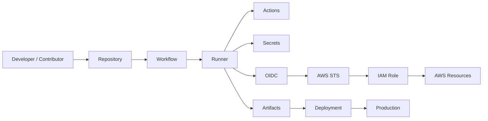
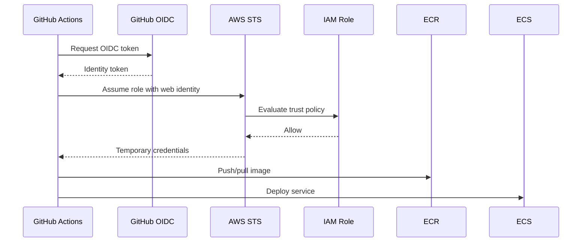
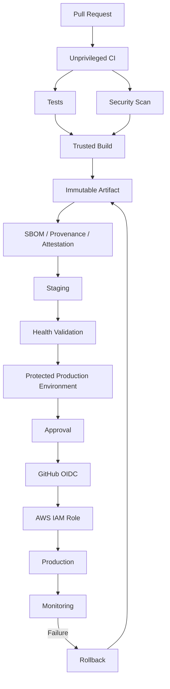

# 12- Security Questions

## Overview

GitHub Actions security is primarily a trust-boundary and privilege-management problem.

A production CI/CD system executes code from multiple sources:

```text
Developer
    ↓
Git repository
    ↓
Workflow definition
    ↓
Third-party actions
    ↓
Runner
    ↓
Secrets / credentials
    ↓
Cloud resources
    ↓
Production systems
```

Every boundary introduces security questions:

- Who controls the code being executed?
- What permissions does the workflow receive?
- Which secrets are available?
- Can untrusted input reach a shell?
- Can a pull request access production credentials?
- Can a compromised action access AWS?
- Can a self-hosted runner access internal systems?
- Can an attacker modify an artifact after it passes CI?
- Can a deployment workflow be triggered from an untrusted branch?
- Can the CI system prove which source produced a production artifact?

For a senior backend engineer, GitHub Actions security should therefore be approached as a layered system:

```text
Least Privilege
      +
Trust Boundaries
      +
Secret Protection
      +
Untrusted Input Handling
      +
Action Supply-Chain Security
      +
Runner Isolation
      +
Artifact Integrity
      +
Cloud Identity
      +
Environment Protection
      +
Monitoring and Recovery
```

---

## GitHub Actions Security Model

A useful security model is:



Each arrow represents a possible trust boundary.

Security failures often occur when an attacker can move from a lower-trust component to a higher-trust component.

---

## What Makes CI/CD Security Different?

A normal backend application usually has a relatively stable execution path:

```text
Client
 ↓
API
 ↓
Application
 ↓
Database
```

CI/CD is different because the system itself frequently executes code that is being changed.

For example:

```text
Pull Request
 ↓
Checkout code
 ↓
Install dependencies
 ↓
Run tests
 ↓
Execute scripts
```

The pull request may therefore influence the commands executed by the CI runner.

This creates a fundamental principle:

> CI/CD pipelines must treat source-controlled workflow inputs and repository code according to their trust level.

---

## Workflow Security Boundaries

Important trust boundaries include:

| Boundary | Security Question |
|---|---|
| Pull request → workflow | Is the source trusted? |
| Workflow → runner | What can the runner access? |
| Workflow → secret | Should this job receive the secret? |
| Workflow → AWS | Which IAM role can it assume? |
| Action → repository | What permissions does the action receive? |
| Action → network | What systems can it reach? |
| Build → artifact | Can artifact integrity be verified? |
| Staging → production | What controls promotion? |
| Self-hosted runner → VPC | Can untrusted code reach private resources? |

---

## `GITHUB_TOKEN`

GitHub Actions provides a `GITHUB_TOKEN` to workflows.

It allows workflows to interact with GitHub resources according to the permissions granted to it.

A secure workflow should explicitly define permissions.

Example:

```yaml
permissions:
  contents: read
```

This is preferable to relying on broad defaults.

---

## Least Privilege

Least privilege means a workflow receives only the permissions required for its operation.

For example, a test workflow may only need:

```yaml
permissions:
  contents: read
```

An AWS deployment workflow may need:

```yaml
permissions:
  contents: read
  id-token: write
```

The workflow should not automatically receive write permissions to unrelated GitHub resources.

---

## Workflow-Level Permissions

Example:

```yaml
name: CI

on:
  pull_request:

permissions:
  contents: read

jobs:
  test:
    runs-on: ubuntu-latest

    steps:
      - uses: actions/checkout@v4
      - run: pytest
```

This creates an explicit baseline.

---

## Job-Level Permissions

Different jobs may require different privileges.

Example:

```yaml
jobs:
  test:
    permissions:
      contents: read

    runs-on: ubuntu-latest

    steps:
      - uses: actions/checkout@v4
      - run: pytest

  deploy:
    permissions:
      contents: read
      id-token: write

    runs-on: ubuntu-latest

    steps:
      - run: ./deploy.sh
```

This limits the privileged scope to the deployment job.

---

## Why Job-Level Permissions Matter

Consider:

```text
Lint
Unit Tests
Security Scan
Build
Deploy
```

Only the deployment job may require AWS authentication.

Giving every job:

```yaml
id-token: write
```

increases the blast radius if one job is compromised.

Prefer:

```text
Unprivileged jobs
       ↓
Minimal permissions

Privileged deployment job
       ↓
Specific additional permissions
```

---

## Common `GITHUB_TOKEN` Permissions

Frequently relevant permissions include:

| Permission | Typical use |
|---|---|
| `contents` | Repository contents |
| `actions` | Actions/workflow management |
| `packages` | Package registry |
| `pull-requests` | PR operations |
| `issues` | Issue operations |
| `checks` | Check runs |
| `deployments` | Deployment APIs |
| `id-token` | OIDC identity token |

Grant only what the workflow requires.

---

## Secrets

GitHub Actions supports secrets at different scopes:

- Repository.
- Organization.
- Environment.

Sensitive values include:

```text
Database passwords
API tokens
Private keys
Cloud credentials
Webhook secrets
Signing keys
```

Secrets should not be treated as ordinary environment variables.

---

## Environment Secrets

Production credentials should generally be associated with the production environment rather than exposed globally.

Conceptually:

```text
Repository
 ├── CI secrets
 │
 ├── Staging
 │   └── staging secrets
 │
 └── Production
     └── production secrets
```

This creates a stronger deployment boundary.

---

## Secret Masking

GitHub Actions attempts to mask registered secret values in logs.

However, masking is not a guarantee that arbitrary transformations of a secret are safe.

For example:

```bash
echo "$SECRET"
```

may be masked, but derived values, encoded values, substrings, or transformed secrets may not be reliably protected.

Never intentionally print secrets.

---

## Avoid Secrets in Command Arguments

Avoid:

```yaml
- run: curl -H "Authorization: Bearer ${{ secrets.API_TOKEN }}" https://example.com
```

Command arguments may be exposed through process listings, debugging output, or tooling behavior.

Prefer environment variables where appropriate:

```yaml
- name: Call API
  env:
    API_TOKEN: ${{ secrets.API_TOKEN }}
  run: |
    curl \
      -H "Authorization: Bearer $API_TOKEN" \
      https://example.com
```

Even with this pattern, ensure the invoked command does not echo the environment.

---

## Secrets in Artifacts

Never accidentally package secrets into:

```text
Build artifacts
Coverage reports
Debug logs
Screenshots
Docker images
Test reports
Configuration bundles
```

A workflow may correctly mask logs while still uploading an unmasked secret-containing file as an artifact.

---

## Secrets in Docker Builds

Avoid:

```dockerfile
ARG AWS_SECRET_ACCESS_KEY
```

for sensitive credentials.

Build arguments can become part of build metadata or image history depending on how they are used.

Use BuildKit-supported secret mounts for build-time secrets when a secret is genuinely required during a build.

Prefer eliminating the need for build-time credentials altogether.

---

## Long-Lived AWS Credentials

Avoid storing:

```text
AWS_ACCESS_KEY_ID
AWS_SECRET_ACCESS_KEY
```

as permanent GitHub secrets for deployment when OIDC is available.

A stronger model is:

```text
GitHub Actions
 ↓
OIDC token
 ↓
AWS STS
 ↓
Short-lived credentials
 ↓
IAM role
```

---

## GitHub Actions OIDC

OIDC allows GitHub Actions to establish workload identity with AWS without storing long-lived AWS access keys.

The workflow requires:

```yaml
permissions:
  contents: read
  id-token: write
```

The AWS trust relationship then determines which GitHub identity can assume the role.

---

## OIDC Trust Boundary

The trust model should be:

```text
GitHub Repository
       ↓
Specific Workflow Identity
       ↓
OIDC Token
       ↓
AWS STS
       ↓
Restricted IAM Role
       ↓
Specific AWS Resources
```

Do not configure the IAM trust policy to accept arbitrary repositories or branches when a narrower condition is possible.

---

## OIDC and Environments

Environment-specific roles can provide stronger separation:

```text
GitHub staging environment
        ↓
Staging IAM role
        ↓
Staging AWS resources

GitHub production environment
        ↓
Production IAM role
        ↓
Production AWS resources
```

This limits the blast radius of a compromised staging workflow.

---

## IAM Least Privilege

The AWS role should have only the permissions required by the deployment.

For example, a deployment that updates ECS should not automatically receive:

```text
AdministratorAccess
```

Prefer narrowly scoped permissions for:

```text
ECR
ECS
S3
CloudFormation
Lambda
```

depending on the deployment architecture.

---

## `pull_request` Security

For:

```yaml
on:
  pull_request:
```

the workflow is associated with the pull request event and should be designed with untrusted repository code in mind.

A forked pull request may contain attacker-controlled code.

Therefore:

```text
PR code
 ↓
Runner
```

should not automatically imply:

```text
PR code
 ↓
Production secrets
```

---

## Fork Pull Requests

Fork pull requests require particular care because contributors may control the source repository.

A malicious PR could modify:

```text
Python code
Shell scripts
Tests
Build scripts
Package configuration
```

and cause CI to execute those changes.

Never assume that:

```text
"the workflow is in our repository"
```

means:

```text
"the code being executed is trusted."
```

---

## `pull_request_target`

`pull_request_target` executes in the context of the base repository.

This can provide access to repository-level resources that ordinary pull request workflows do not have.

That makes it powerful and dangerous.

The unsafe pattern is conceptually:

```text
pull_request_target
    ↓
Checkout attacker-controlled PR
    ↓
Execute PR code
    ↓
Access secrets
```

This can expose privileged credentials.

---

## Safe `pull_request_target` Principle

Treat `pull_request_target` as a privileged workflow.

Avoid executing untrusted PR code within its privileged context.

If the workflow needs information from a PR, prefer processing metadata safely rather than checking out and executing arbitrary contributor code.

---

## Untrusted Input

GitHub exposes user-controlled values through contexts.

Examples include:

- PR titles.
- Branch names.
- Commit messages.
- Issue content.
- Workflow inputs.
- Repository dispatch payloads.

These values should be considered untrusted unless their provenance is explicitly controlled.

---

## Shell Injection

Dangerous pattern:

```yaml
- name: Comment
  run: |
    echo "${{ github.event.pull_request.title }}"
```

A malicious title may contain shell metacharacters.

The expression is expanded before the shell executes the command.

This can transform data into executable shell syntax.

---

## Safer Shell Handling

Prefer passing untrusted values through environment variables:

```yaml
- name: Process title
  env:
    PR_TITLE: ${{ github.event.pull_request.title }}
  run: |
    printf '%s\n' "$PR_TITLE"
```

The shell sees the value as data rather than interpolated command syntax.

---

## Python Subprocess Security

The same principle applies to Python.

Avoid:

```python
import subprocess

subprocess.run(f"deploy {user_input}", shell=True)
```

Prefer:

```python
import subprocess

subprocess.run(
    ["deploy", user_input],
    check=True,
)
```

Better still, validate the value against an allowlist when the input represents a constrained domain.

---

## Branch Name Injection

Avoid:

```yaml
run: git checkout ${{ github.ref_name }}
```

if the value is not safely handled.

Prefer:

```yaml
env:
  BRANCH_NAME: ${{ github.ref_name }}
run: |
  git checkout -- "$BRANCH_NAME"
```

Also consider whether checking out an arbitrary branch is actually required.

---

## Workflow Inputs

Manual workflow inputs can be constrained using typed inputs.

Example:

```yaml
on:
  workflow_dispatch:
    inputs:
      environment:
        description: Deployment environment
        required: true
        type: choice
        options:
          - staging
          - production
```

This is safer than accepting arbitrary strings for security-sensitive decisions.

---

## Validate Security-Sensitive Inputs

Do not trust:

```text
environment
account
region
service
image
deployment strategy
```

merely because they came from a workflow input.

Use allowlists.

Example:

```bash
case "$ENVIRONMENT" in
  staging|production)
    ;;
  *)
    echo "Unsupported environment" >&2
    exit 1
    ;;
esac
```

---

## Dynamic Matrices and Security

Dynamic matrices commonly use JSON:

```yaml
strategy:
  matrix: ${{ fromJSON(needs.plan.outputs.matrix) }}
```

The data source must be trusted or validated.

A compromised planning step could potentially alter:

- Runner labels.
- Commands.
- Environment names.
- Deployment targets.
- Test scope.

Treat generated workflow configuration as security-sensitive data.

---

## `$GITHUB_OUTPUT` Security

Outputs are commonly used to transfer data between jobs:

```bash
echo "image=$IMAGE" >> "$GITHUB_OUTPUT"
```

Do not blindly place untrusted multiline data into outputs that later become:

```text
Shell commands
Matrix definitions
File paths
Deployment parameters
```

Validate output values before using them in privileged jobs.

---

## `$GITHUB_ENV` Security

`GITHUB_ENV` changes environment variables for later steps.

Example:

```bash
echo "IMAGE=$IMAGE" >> "$GITHUB_ENV"
```

This is convenient but should not be treated as a trusted data boundary.

A malicious value can become dangerous if later interpreted by a shell or tool.

---

## Third-Party Actions

Third-party actions are dependencies.

Example:

```yaml
- uses: some-org/some-action@v4
```

The action may execute code inside the workflow environment.

Therefore:

```text
Third-party action
=
Executable dependency
```

Treat it similarly to an external software dependency.

---

## Malicious vs Compromised Actions

These are different threat models.

### Malicious Action

The action itself is intentionally designed to perform harmful behavior.

### Compromised Action

A previously trusted action becomes compromised because:

- Maintainer credentials are stolen.
- Repository is compromised.
- Release process is compromised.
- Dependency is compromised.

Both require supply-chain controls.

---

## Action Pinning

Mutable references such as:

```yaml
uses: some-org/action@main
```

can change without changing your workflow.

Version references are better:

```yaml
uses: some-org/action@v4
```

SHA pinning provides stronger immutability:

```yaml
uses: some-org/action@<commit-sha>
```

Organizations may choose different governance policies, but high-trust workflows should consider immutable references.

---

## SHA Pinning

SHA pinning binds an action reference to a specific commit.

Conceptually:

```text
v4
 ↓
Mutable reference

SHA
 ↓
Specific repository state
```

Benefits:

- Reduced unexpected version changes.
- Stronger supply-chain integrity.
- Better reproducibility.

Operationally, SHA pinning requires an update process so security fixes are not ignored indefinitely.

---

## Action Dependencies

An action may depend on:

```text
Other actions
Node packages
Python packages
Docker images
Operating system packages
External APIs
```

Therefore:

```text
Trusted action
```

does not necessarily mean:

```text
Trusted entire dependency graph
```

Supply-chain security must consider transitive dependencies.

---

## Action Allowlists

Organizations can restrict which actions repositories may use.

A governance model may define:

```text
Approved:
- actions/checkout
- actions/setup-python
- Internal deployment actions

Restricted:
- Unreviewed Marketplace actions
- Unpinned actions
- Unknown external actions
```

Allowlist policies should include an exception and update process.

---

## Internal Actions

Internal actions can standardize:

- Python setup.
- Dependency installation.
- Security scanning.
- Docker builds.
- Deployment.
- AWS authentication.

However, internal actions are still executable code.

They require:

- Code ownership.
- Versioning.
- Testing.
- Security review.
- Release controls.

---

## Reusable Workflows and Security

Reusable workflows can centralize security controls.

For example:

```text
Repository
    ↓
Reusable CI workflow
    ↓
Standard permissions
    ↓
Standard security scanning
    ↓
Standard artifact generation
```

This reduces duplicated security configuration.

---

## Reusable Workflow Trust

A caller should not automatically receive every privilege of a reusable workflow.

Review:

- `permissions`.
- Secrets.
- OIDC.
- Environment access.
- Runner selection.
- Inputs.
- Outputs.

The reusable workflow becomes part of the trusted CI/CD platform.

---

## Secrets and Reusable Workflows

A reusable workflow may accept explicit secrets:

```yaml
on:
  workflow_call:
    secrets:
      DEPLOY_TOKEN:
        required: true
```

A caller can provide it:

```yaml
secrets:
  DEPLOY_TOKEN: ${{ secrets.DEPLOY_TOKEN }}
```

Use explicit secret contracts when practical.

`secrets: inherit` is convenient but should be used with an understanding of the trust relationship between caller and reusable workflow.

---

## Artifact Security

Artifacts are another security boundary.

A production artifact should have:

- Stable identity.
- Integrity information.
- Controlled access.
- Appropriate retention.
- Provenance.
- Promotion controls.

Do not assume:

```text
Artifact exists
```

means:

```text
Artifact is trustworthy.
```

---

## Artifact Poisoning

Artifact poisoning occurs when an attacker causes a malicious artifact to be promoted or consumed as though it were trusted.

Example:

```text
Compromised build
 ↓
Malicious Docker image
 ↓
Staging
 ↓
Production
```

Controls include:

```text
Immutable artifact
+
Trusted build workflow
+
SBOM
+
Provenance
+
Attestation
+
Scanning
+
Controlled promotion
```

---

## Build Once, Promote Many

A secure deployment lifecycle is:

```text
Source
 ↓
Trusted CI
 ↓
Build
 ↓
Artifact
 ↓
Scan
 ↓
Attest
 ↓
Staging
 ↓
Approval
 ↓
Production
```

The artifact should not be rebuilt between staging and production.

---

## Docker Security

Docker builds introduce additional attack surfaces:

- Dockerfile.
- Base image.
- Build context.
- Dependencies.
- Build arguments.
- Build secrets.
- Docker daemon.
- Registry.
- Runtime configuration.

---

## Docker Build Context

Avoid unnecessarily large build contexts.

Use:

```text
.dockerignore
```

to exclude:

```text
.git
.env
credentials
local databases
build output
temporary files
```

This reduces accidental secret exposure and build size.

---

## Docker Base Images

Base images should be:

- Maintained.
- Scanned.
- Version-controlled.
- Appropriately minimal.

Avoid blindly using:

```dockerfile
FROM python:latest
```

for production.

A predictable base-image strategy improves reproducibility and vulnerability management.

---

## Docker Build Secrets

If a build genuinely requires credentials, use supported secret mechanisms rather than:

```dockerfile
ARG SECRET
```

Do not bake credentials into image layers.

The preferred architecture is usually to remove the need for credentials during image creation.

---

## Container Runtime Security

The container should not receive credentials it does not need.

For example:

```text
Application container
 ↓
Runtime IAM identity
```

is preferable to baking cloud credentials into the image.

For AWS workloads, use the runtime identity mechanisms appropriate to ECS, EC2, EKS, or Lambda.

---

## Runner Security

A runner executes workflow code.

Therefore:

```text
Runner compromise
=
Potential workflow compromise
```

Runner security is particularly important when the runner can access:

- Production networks.
- AWS resources.
- Internal APIs.
- Databases.
- Deployment credentials.

---

## GitHub-Hosted Runners

GitHub-hosted runners provide managed execution environments with stronger isolation from the user's infrastructure than persistent self-hosted runners.

They are generally useful for untrusted CI workloads when those workloads do not need private network access.

---

## Self-Hosted Runner Risks

Self-hosted runners can have access to:

```text
Private VPC
Internal APIs
Databases
Deployment systems
Persistent filesystem
Docker socket
Cloud credentials
```

If untrusted code executes on such a runner, the blast radius can be much larger.

---

## Persistent vs Ephemeral Runners

### Persistent Runner

```text
Runner
 ↓
Job A
 ↓
Job B
 ↓
Job C
```

Potential risks:

- Workspace residue.
- Credential residue.
- Modified tooling.
- Malware persistence.
- Cache poisoning.

### Ephemeral Runner

```text
Provision
 ↓
Register
 ↓
One job
 ↓
Destroy
```

Ephemeral runners reduce persistence risk.

---

## Self-Hosted Runner Isolation

Production deployment runners should ideally be separated from untrusted CI runners.

Example:

```text
Untrusted CI
    ↓
GitHub-hosted runners

Trusted deployment
    ↓
Restricted runner group
    ↓
Private network
```

Do not give arbitrary PR workflows access to production deployment runners.

---

## Runner Groups

Runner groups can help restrict which repositories can access specific runners.

Example:

```text
Public CI runners
    ↓
Many repositories

Production runners
    ↓
Deployment repository/workflows only
```

This reduces the blast radius of a compromised workflow.

---

## Private Network Access

Self-hosted runners may be required when CI needs to access:

```text
Private PostgreSQL
Private Redis
Internal APIs
Private package registry
Internal Kubernetes API
```

But private network access increases the impact of runner compromise.

Use network segmentation and least privilege.

---

## Network Egress

Do not assume outbound traffic is harmless.

A compromised workflow could attempt to exfiltrate:

```text
Secrets
Tokens
Source code
Environment variables
Cloud credentials
Artifacts
```

Where practical, restrict network egress for privileged runners.

---

## GitHub Actions and AWS Architecture

A secure AWS deployment can look like:



The IAM trust policy and role permissions determine what the workflow can do.

---

## IAM Trust Policy Security

A trust policy should constrain:

- Repository.
- Organization.
- Branch or tag where appropriate.
- Environment where appropriate.
- OIDC audience.

Avoid broad trust such as:

```text
Any repository in the ecosystem
```

when a specific repository identity is sufficient.

---

## STS Temporary Credentials

AWS STS credentials are temporary.

This reduces the persistence of stolen credentials compared with permanent access keys.

However, temporary credentials are still sensitive while active.

A compromised workflow can use them until they expire or are revoked through the applicable mechanisms.

Least privilege remains essential.

---

## Environment Protection

Production environments can provide:

- Required reviewers.
- Deployment restrictions.
- Environment secrets.
- Environment variables.
- Deployment history.

A typical security boundary is:

```text
CI
 ↓
Staging
 ↓
Validation
 ↓
Production Environment
 ↓
Approval
 ↓
Production IAM Role
 ↓
AWS
```

---

## Branch Restrictions

Production deployment should not be available from arbitrary branches.

For example:

```text
main
release/*
```

may be authorized while:

```text
feature/*
```

is not.

The exact policy depends on the organization's release model.

---

## Deployment Concurrency

Production deployment should usually be serialized.

Example:

```yaml
concurrency:
  group: production
  cancel-in-progress: false
```

This protects against:

```text
Deployment A
+
Deployment B
```

changing production simultaneously.

---

## Why `cancel-in-progress: false` Is Common for Production

Cancelling a deployment in the middle of a state transition can leave infrastructure inconsistent.

A safer model is:

```text
Deployment A
    ↓
Finish
    ↓
Deployment B
```

CI validation may use:

```yaml
cancel-in-progress: true
```

because older validation runs can often be safely discarded.

---

## Supply Chain Security

CI/CD dependencies include:

```text
Source code
Dependencies
GitHub Actions
Docker images
Build tools
Runner images
Cloud APIs
Artifacts
```

A secure pipeline protects the complete chain rather than only application dependencies.

---

## Dependency Review

Dependency review can identify dependency changes that introduce known security risks.

For Python projects, consider:

```text
requirements.txt
poetry.lock
uv.lock
pyproject.toml
```

depending on the package-management strategy.

Lock dependencies where appropriate and establish a process for updating vulnerable versions.

---

## Dependabot

Dependabot can help automate dependency update proposals.

This applies to:

- Application dependencies.
- GitHub Actions dependencies.

For example:

```yaml
uses: actions/checkout@v4
```

should be maintained as part of the repository's dependency lifecycle.

---

## SBOM

A Software Bill of Materials describes software components contained in an artifact.

For a Python service:

```text
Application
 ├── Django
 ├── FastAPI
 ├── psycopg
 ├── Redis client
 └── Other dependencies
```

For containers, the SBOM can also include OS-level packages.

---

## Artifact Provenance

Provenance answers questions such as:

```text
Where was this artifact built?
Which source revision produced it?
Which workflow produced it?
Which builder produced it?
```

This helps establish a chain:

```text
Source Commit
 ↓
Workflow
 ↓
Build
 ↓
Artifact
```

---

## Artifact Attestations

Attestations can provide signed metadata about an artifact.

Useful information may include:

- Source repository.
- Source revision.
- Build workflow.
- Builder identity.
- Build metadata.

This strengthens artifact verification.

---

## Artifact Signing

Signing provides a mechanism for verifying artifact integrity and authenticity.

Conceptually:

```text
Build
 ↓
Artifact
 ↓
Sign
 ↓
Registry
 ↓
Verify before deployment
```

The exact signing system depends on the organization's tooling and registry architecture.

---

## Trusted Build Pipeline

Artifact security depends on the build pipeline itself.

If the build runner is compromised:

```text
Trusted source
+
Compromised runner
=
Potentially malicious artifact
```

Therefore artifact signing alone is not sufficient.

Protect:

```text
Source
Workflow
Actions
Runner
Credentials
Build environment
Artifact registry
```

---

## Production CI/CD Security Architecture



---

## Build Once, Promote Many Security Model

A secure promotion model is:

```text
Source
 ↓
Trusted build
 ↓
Scan
 ↓
Attest
 ↓
Immutable artifact
 ↓
Staging
 ↓
Approval
 ↓
Production
```

Do not rebuild the application for production after staging validation.

The production artifact should be the artifact that passed the earlier controls.

---

## Artifact Registry Security

For ECR or another registry:

- Restrict push permissions.
- Restrict pull permissions.
- Use repository policies carefully.
- Enable appropriate scanning.
- Track image digests.
- Configure lifecycle policies.
- Avoid unnecessary mutable tags.
- Restrict cross-account access.

---

## Production Image Identity

Prefer:

```text
orders-api@sha256:...
```

or an immutable commit-derived tag:

```text
orders-api:8f3a2c1
```

over:

```text
orders-api:latest
```

for production promotion.

---

## Release Security

A release workflow should establish:

```text
Source version
 ↓
Build
 ↓
Artifact
 ↓
Release metadata
 ↓
Promotion
```

Git tags and semantic versions can provide human-readable release identities.

Artifact digests provide stronger artifact identity.

---

## Security and Semantic Versioning

A release such as:

```text
v2.4.1
```

is useful for human communication.

But production deployment should not rely solely on the mutable meaning of a tag.

Prefer:

```text
v2.4.1
+
immutable image digest
```

when possible.

---

## Security and Docker Layer Caching

Docker caching improves performance but introduces security considerations.

A compromised cache can potentially influence future builds if trust boundaries are poorly designed.

Separate cache usage from artifact trust.

```text
Cache
 ↓
Build acceleration

Artifact
 ↓
Production release
```

Do not treat cache contents as inherently trusted.

---

## Cache Poisoning

Cache poisoning occurs when malicious or incorrect content is stored in a cache and later consumed by another workflow.

Potential targets include:

- Package caches.
- Docker build caches.
- Generated dependencies.
- Build outputs.

Use appropriate cache scope and avoid allowing untrusted workflows to populate privileged caches.

---

## Fork PR Cache Security

Fork workflows should not be treated as trusted producers of data that privileged workflows later consume.

Be particularly careful when:

```text
Untrusted PR
 ↓
Produces cache/artifact
 ↓
Privileged workflow consumes it
```

The trust boundary must be explicit.

---

## Artifact vs Cache Security

| Property | Artifact | Cache |
|---|---|---|
| Primary purpose | Transfer/store build output | Accelerate repeated work |
| Release identity | Important | Not authoritative |
| Production promotion | Yes | No |
| Integrity requirements | High | Performance-oriented |
| Rollback use | Yes | No |
| Reproducibility | Important | Secondary |

---

## Security and Containers in CI

A job container may isolate application tooling, but the underlying runner remains part of the security boundary.

A containerized job does not automatically make untrusted code safe if the workflow also has:

```text
Secrets
+
Cloud credentials
+
Docker socket
+
Private network
```

---

## Docker Socket Risk

Mounting the host Docker socket into a container can provide powerful control over the host Docker daemon.

Conceptually:

```text
Container
   ↓
/var/run/docker.sock
   ↓
Host Docker daemon
```

A compromised workflow may potentially gain capabilities far beyond the intended container boundary.

Avoid unnecessary Docker socket exposure.

---

## Kubernetes Security

For Kubernetes deployments, GitHub Actions may interact with:

```text
Kubernetes API
```

through credentials or workload identity.

Do not provide cluster-admin permissions when the deployment only needs access to a specific namespace and resource types.

Prefer:

```text
Dedicated service identity
+
Namespace-scoped permissions
```

where appropriate.

---

## Nginx and Deployment Security

Nginx configuration changes can affect:

- Routing.
- TLS.
- Authentication.
- Headers.
- Upstream access.

Treat configuration deployment as privileged infrastructure change.

Validate configuration before applying it:

```bash
nginx -t
```

---

## PostgreSQL Security in CI

Integration-test databases should not use production credentials.

Prefer:

```text
Ephemeral PostgreSQL
+
Temporary credentials
+
Isolated network
```

For example:

```yaml
services:
  postgres:
    image: postgres:17
    env:
      POSTGRES_USER: test
      POSTGRES_PASSWORD: test
      POSTGRES_DB: app_test
```

The credentials have no production value.

---

## Redis Security in CI

Use isolated Redis instances for tests.

Avoid pointing PR tests at a production Redis cluster.

A compromised test could otherwise:

```text
Delete keys
Read sensitive data
Acquire locks
Modify application state
```

---

## Kafka Security in CI

Integration tests should use isolated Kafka environments or appropriately isolated topics and identities.

Do not provide production Kafka credentials to untrusted PR workflows.

---

## Django and FastAPI Security

A backend CI pipeline should distinguish:

```text
Unit Test Job
```

from:

```text
Privileged Deployment Job
```

The unit test job generally should not need:

```text
Production database credentials
AWS production role
Production Redis
Production Kafka
```

The deployment job receives only the credentials required for deployment.

---

## Security and Test Coverage

Coverage tools can generate reports containing:

- File paths.
- Source excerpts.
- Environment metadata.

Do not assume test artifacts are harmless.

Review artifact access and retention for sensitive repositories.

---

## Security and Logs

Logs may contain:

```text
URLs
Tokens
Stack traces
Database errors
Environment information
Cloud resource identifiers
```

Avoid logging:

```text
Passwords
Access keys
Private keys
Authorization headers
Session tokens
```

Use safe diagnostic output.

---

## Safe Debugging

Avoid dumping entire contexts:

```yaml
- run: echo '${{ toJSON(github) }}'
```

The context can contain sensitive metadata.

Instead, print only the fields required for diagnosis.

For example:

```yaml
- name: Debug workflow
  env:
    REF: ${{ github.ref }}
    SHA: ${{ github.sha }}
  run: |
    printf 'ref=%s\n' "$REF"
    printf 'sha=%s\n' "$SHA"
```

---

## Production Monitoring

Security monitoring should cover:

- Workflow changes.
- Permission changes.
- Secret changes.
- Environment changes.
- Runner registration.
- Runner lifecycle.
- Action changes.
- Deployment events.
- IAM role usage.
- AWS CloudTrail events.
- Artifact publication.
- Registry access.

---

## Incident Response

If a workflow or runner is suspected to be compromised:

```text
Stop affected workflow
        ↓
Identify exposed credentials
        ↓
Revoke / rotate credentials
        ↓
Inspect workflow changes
        ↓
Inspect runner
        ↓
Inspect artifacts
        ↓
Inspect cloud audit logs
        ↓
Determine blast radius
        ↓
Restore trusted pipeline
```

Do not assume the incident is limited to the failing workflow.

---

## AWS Incident Investigation

For AWS deployments, investigate:

- CloudTrail.
- STS role assumptions.
- IAM activity.
- ECR operations.
- ECS changes.
- S3 access.
- Lambda changes.
- Security group modifications.

The objective is to determine:

```text
Who
+
What
+
When
+
From which identity
+
Against which resource
```

---

## Runner Compromise Response

For a persistent self-hosted runner:

```text
Do not simply restart it.
```

A compromised runner may contain persistent malware or modified tooling.

A safer approach can be:

```text
Remove runner from service
 ↓
Preserve required evidence
 ↓
Revoke credentials
 ↓
Destroy / rebuild runner
 ↓
Rotate sensitive credentials
 ↓
Validate runner image
 ↓
Return to service
```

---

## Secret Compromise Response

If a secret is exposed:

1. Identify the secret.
2. Determine where it was exposed.
3. Revoke or rotate it.
4. Inspect access logs.
5. Determine whether the secret was used.
6. Search artifacts and logs for additional exposure.
7. Remove the vulnerable workflow path.
8. Restore secure configuration.

Never assume that masking means the secret was never exposed.

---

## Supply Chain Incident Response

If a third-party action is compromised:

```text
Identify affected action version
 ↓
Stop affected workflows
 ↓
Pin/revert to trusted version
 ↓
Review workflow logs
 ↓
Review exposed permissions
 ↓
Rotate credentials if required
 ↓
Inspect generated artifacts
 ↓
Verify production artifacts
```

Artifact provenance can significantly improve this investigation.

---

## Production Security Failure Domains

| Failure Domain | Example | Primary Control |
|---|---|---|
| Workflow | Malicious workflow change | Review + branch protection |
| Permissions | Excessive token permissions | Least privilege |
| Secrets | Credential exposure | Environment secrets/OIDC |
| Input | Shell injection | Safe parameter handling |
| Action | Compromised dependency | Pinning + allowlist |
| Runner | Persistent compromise | Ephemeral isolation |
| Artifact | Poisoned image | Provenance + immutable identity |
| Cloud | Excessive IAM | Least-privilege roles |
| Deployment | Unauthorized production release | Environment protection |
| Network | Private resource exposure | Segmentation |
| Supply chain | Dependency compromise | Scanning + provenance |

---

## Security Troubleshooting Methodology

Use:

```text
Symptom
 ↓
Possible Causes
 ↓
Isolation Strategy
 ↓
Commands / Checks
 ↓
Root Cause
 ↓
Corrective Action
 ↓
Prevention
```

---

## Workflow Has Unexpected Permissions

### Symptom

A job can modify resources it should not access.

### Possible Causes

- Broad `permissions`.
- Organization defaults.
- Job-level permissions.
- Reusable workflow permissions.
- Excessive action privileges.

### Isolation

Inspect workflow and job permission blocks.

### Corrective Action

Set explicit minimal permissions.

Example:

```yaml
permissions:
  contents: read
```

### Prevention

Review permissions as part of workflow code review.

---

## Secret Is Missing

### Symptom

A workflow receives an empty secret.

### Possible Causes

- Wrong scope.
- Environment not selected.
- Fork workflow.
- Secret not passed to reusable workflow.
- Incorrect secret name.

### Isolation

Check:

```text
Repository secrets
Organization secrets
Environment secrets
Reusable workflow contract
```

Never print the secret itself.

### Prevention

Document secret ownership and scope.

---

## Secret Appears in Logs

### Symptom

Sensitive information appears in workflow output.

### Possible Causes

- Explicit `echo`.
- Command-line arguments.
- Debug output.
- Tool logging.
- Derived/encoded secret.
- Artifact contents.

### Corrective Action

Rotate the secret if exposure is real.

Remove the unsafe logging path.

### Prevention

Use environment variables, safe tooling, and minimal logging.

---

## OIDC Authentication Fails

### Symptom

AWS role assumption returns `AccessDenied`.

### Possible Causes

- Missing `id-token: write`.
- Incorrect IAM trust policy.
- Wrong repository.
- Wrong branch.
- Wrong environment.
- Wrong audience.
- Wrong AWS account.
- Incorrect role ARN.

### Checks

```bash
aws sts get-caller-identity
```

Inspect the workflow permissions and IAM trust policy.

### Prevention

Keep OIDC trust policies explicit and version-controlled.

---

## Third-Party Action Behaves Unexpectedly

### Symptom

A previously trusted action changes behavior.

### Possible Causes

- Mutable tag.
- Compromised release.
- Dependency compromise.
- Maintainer account compromise.

### Corrective Action

Pin to a verified commit and investigate the affected version.

### Prevention

Use SHA pinning and action governance.

---

## PR Workflow Exposes a Secret

### Symptom

A pull request appears able to access privileged credentials.

### Possible Causes

- Inappropriate `pull_request_target`.
- Secrets available to untrusted code.
- Untrusted checkout.
- Excessive permissions.
- Self-hosted runner exposure.

### Corrective Action

Immediately review the workflow and rotate exposed credentials.

### Prevention

Separate:

```text
Untrusted CI
```

from:

```text
Privileged deployment
```

---

## Self-Hosted Runner Compromise

### Symptom

A runner behaves unexpectedly or executes unauthorized processes.

### Isolation

Investigate:

```text
Runner process state
Filesystem
Network connections
Workflow history
Installed tools
Cloud activity
```

### Corrective Action

Remove and rebuild the runner when compromise is suspected.

### Prevention

Use ephemeral runners for untrusted or sensitive workloads.

---

## Artifact Integrity Failure

### Symptom

The production image differs from the expected build.

### Possible Causes

- Mutable tag.
- Rebuild between environments.
- Registry overwrite.
- Compromised build.
- Artifact promotion bug.

### Corrective Action

Verify:

```text
Git SHA
Image digest
Build metadata
Registry history
```

### Prevention

Use immutable artifact identities and provenance.

---

## GitHub CLI Security Operations

Inspect workflows:

```bash
gh workflow list
```

Run a workflow:

```bash
gh workflow run deploy.yml
```

List runs:

```bash
gh run list
```

Inspect a run:

```bash
gh run view RUN_ID
```

View logs:

```bash
gh run view RUN_ID --log
```

Watch execution:

```bash
gh run watch RUN_ID
```

Cancel a run:

```bash
gh run cancel RUN_ID
```

List repository secrets metadata:

```bash
gh secret list
```

List variables:

```bash
gh variable list
```

List environments:

```bash
gh api repos/OWNER/REPO/environments
```

The CLI should be used to inspect and operate CI/CD resources, not as a replacement for security architecture.

---

## Security Architecture for a Python Backend

Consider a Django or FastAPI service:

```text
Developer
    ↓
Pull Request
    ↓
Unprivileged CI
    ├── Lint
    ├── Unit tests
    ├── Integration tests
    └── Security scan
            ↓
        Trusted Build
            ↓
        Docker Image
            ↓
        ECR
            ↓
        Staging
            ↓
        Health Validation
            ↓
        Production Approval
            ↓
        OIDC
            ↓
        Production IAM Role
            ↓
        ECS
```

The important security boundary is:

```text
Untrusted application code
        ≠
Production deployment authority
```

---

## Production Security Reference Workflow

```yaml
name: Secure Production Deployment

on:
  workflow_dispatch:
    inputs:
      image:
        description: Immutable image reference
        required: true
        type: string

permissions:
  contents: read

concurrency:
  group: production
  cancel-in-progress: false

jobs:
  deploy:
    runs-on: ubuntu-latest

    permissions:
      contents: read
      id-token: write

    environment:
      name: production

    steps:
      - name: Validate image reference
        env:
          IMAGE: ${{ inputs.image }}
        run: |
          test -n "$IMAGE"
          printf 'Deploying immutable artifact: %s\n' "$IMAGE"

      - name: Configure AWS credentials
        uses: aws-actions/configure-aws-credentials@v4
        with:
          role-to-assume: ${{ vars.AWS_DEPLOY_ROLE_ARN }}
          aws-region: ${{ vars.AWS_REGION }}

      - name: Deploy
        env:
          IMAGE: ${{ inputs.image }}
        run: |
          ./scripts/deploy.sh "$IMAGE"

      - name: Validate deployment
        run: |
          ./scripts/healthcheck.sh
```

Security properties include:

- Minimal workflow permissions.
- Job-level OIDC permission.
- Protected production environment.
- Environment-specific configuration.
- Immutable image input.
- Serialized production deployment.
- No long-lived AWS access key.
- Explicit health validation.

---

## Security Design for CI and CD Separation

A strong architecture separates:

```text
CI
```

from:

```text
CD
```

### CI

Should generally have:

```text
Read-only repository access
+
Test infrastructure
+
No production credentials
```

### CD

Should have:

```text
Protected environment
+
Specific deployment permissions
+
OIDC
+
Production IAM role
+
Immutable artifact
```

This limits the blast radius of compromised CI code.

---

## Privilege Zoning

A useful production model is:

```text
Zone 1: Untrusted CI
    ↓
Zone 2: Trusted Build
    ↓
Zone 3: Artifact Registry
    ↓
Zone 4: Staging
    ↓
Zone 5: Production Deployment
    ↓
Zone 6: Production Runtime
```

Each zone should have progressively stronger controls.

---

## Security and Reliability

Security controls should not make the deployment system impossible to operate.

For example:

```text
SHA pinning
```

improves integrity but requires an update process.

```text
Ephemeral runners
```

improve isolation but increase provisioning complexity.

```text
Production approvals
```

improve change control but can introduce deployment delays.

Senior engineering involves balancing:

```text
Security
+
Reliability
+
Velocity
+
Operational Complexity
```

without weakening critical trust boundaries.

---

## Disaster Recovery Considerations

CI/CD security also affects disaster recovery.

A production recovery plan should identify:

- Trusted artifact registry.
- Known-good artifacts.
- Deployment workflow.
- AWS IAM roles.
- OIDC configuration.
- Infrastructure as code.
- Required secrets.
- Environment configuration.
- Runner availability.
- Rollback procedure.

Do not make the production recovery process depend on a single developer's laptop.

---

## High Availability CI/CD

For critical systems, the deployment platform should avoid becoming an operational bottleneck.

Consider:

```text
GitHub-hosted runners
+
Ephemeral self-hosted runners
+
Reusable workflows
+
Multiple deployment paths
+
Immutable artifacts
+
Infrastructure as code
```

The CI/CD platform should be reproducible enough that another authorized engineer can operate it during an incident.

---

## Cost Considerations

Security controls can affect cost:

- Ephemeral runner provisioning.
- Private networking.
- NAT gateways.
- Artifact retention.
- Security scanning.
- SBOM generation.
- Additional environments.
- Isolated staging infrastructure.

Optimize implementation details without weakening the security boundary.

---

## Common Security Mistakes

### Granting `write-all` Permissions

```yaml
permissions: write-all
```

creates unnecessary privilege.

### Storing AWS Access Keys

Use OIDC where appropriate.

### Executing PR Code in `pull_request_target`

This can cross a critical trust boundary.

### Using Untrusted Input in Shell Commands

Expression interpolation can become shell injection.

### Trusting Marketplace Actions Blindly

Actions are executable dependencies.

### Using Persistent Production Runners for Untrusted Code

A compromised job may persist beyond its intended execution.

### Using Mutable Production Image Tags

Tags such as `latest` weaken artifact identity.

### Rebuilding Between Staging and Production

The production artifact may differ from the tested artifact.

### Printing Debug Contexts

Context dumps can expose sensitive metadata.

### Treating Masking as Encryption

Masking is a logging feature, not a comprehensive secret-protection mechanism.

---

## Security Interview Questions

### What Is the Most Important Security Principle in GitHub Actions?

Treat every workflow execution according to its trust level and grant the minimum privileges required for that execution.

---

### Why Should `GITHUB_TOKEN` Permissions Be Explicit?

Because broad permissions increase the blast radius of a compromised workflow or action.

---

### What Is the Difference Between Authentication and Authorization?

Authentication answers:

```text
Who are you?
```

Authorization answers:

```text
What are you allowed to do?
```

For AWS:

```text
OIDC
 ↓
Identity
```

and:

```text
IAM policy
 ↓
Authorization
```

---

### Why Is `pull_request_target` Dangerous?

It runs with the base repository context and can have access to privileges unavailable to ordinary pull request workflows.

Executing attacker-controlled PR code within that privileged context can expose secrets or permissions.

---

### How Would You Secure a Fork PR?

Use an unprivileged `pull_request` workflow, avoid production secrets, minimize token permissions, use GitHub-hosted or appropriately isolated runners, and do not execute untrusted code inside a privileged deployment context.

---

### Why Is Shell Injection Possible in GitHub Actions?

Because GitHub expressions can be expanded before the shell executes the resulting command.

For example:

```yaml
run: echo "${{ github.event.pull_request.title }}"
```

can transform attacker-controlled text into shell syntax.

Pass untrusted values through environment variables and quote them appropriately.

---

### Why Is a Third-Party Action a Supply-Chain Risk?

An action executes code with the permissions and access available to the workflow.

A compromised action can potentially access:

```text
GITHUB_TOKEN
Secrets
Filesystem
Network
Cloud credentials
```

depending on the workflow configuration.

---

### Why Is SHA Pinning Useful?

It binds an action reference to a specific commit, reducing the risk that a mutable tag silently points to changed code.

---

### Does SHA Pinning Make an Action Safe?

No.

The pinned commit itself may contain vulnerable or malicious code.

SHA pinning improves immutability and reproducibility; it does not replace action review and governance.

---

### How Would You Secure AWS Credentials in GitHub Actions?

Prefer:

```text
GitHub OIDC
 ↓
AWS STS
 ↓
Short-lived credentials
 ↓
Least-privilege IAM role
```

instead of storing long-lived AWS access keys.

---

### What Should the IAM Trust Policy Restrict?

Depending on the deployment model, restrict:

- Repository.
- Organization.
- Branch/tag.
- Environment.
- OIDC audience.

The trust relationship should be narrower than "any GitHub workflow."

---

### How Do You Protect Production Credentials?

Use:

```text
Protected production environment
+
Environment secrets where required
+
OIDC for AWS
+
Least privilege
+
Restricted deployment source
+
Approval controls
```

---

### Why Are Self-Hosted Runners Riskier?

They may have persistent state and access to private infrastructure.

A compromised workflow can potentially access:

```text
Internal network
Cloud credentials
Filesystem
Docker daemon
Private services
```

Ephemeral runners and runner groups can reduce the blast radius.

---

### Why Are Ephemeral Runners More Secure?

They reduce persistent state between jobs.

A typical lifecycle is:

```text
Provision
 ↓
Register
 ↓
Execute one job
 ↓
Destroy
```

This limits persistence from one workflow to another.

---

### How Would You Secure a Docker Build?

Use:

- Trusted and maintained base images.
- `.dockerignore`.
- Multi-stage builds.
- BuildKit secret mounts where required.
- No credentials in Dockerfile `ARG`.
- Dependency scanning.
- SBOM.
- Provenance.
- Immutable image identity.
- Controlled registry permissions.

---

### What Is Artifact Provenance?

It provides information about how an artifact was produced, such as:

```text
Source
Workflow
Builder
Revision
Build metadata
```

This helps establish trust between source and deployment artifact.

---

### What Is the Difference Between SBOM and Provenance?

SBOM describes:

```text
What is inside the artifact?
```

Provenance describes:

```text
How and where was the artifact produced?
```

They address different parts of supply-chain security.

---

### Why Is Build Once, Promote Many a Security Pattern?

It ensures the artifact validated in staging is the same artifact promoted to production.

```text
Build
 ↓
Scan
 ↓
Attest
 ↓
Staging
 ↓
Production
```

No production rebuild is required.

---

### How Would You Secure a Kubernetes Deployment?

Use a dedicated deployment identity with only the required Kubernetes permissions.

Prefer:

```text
Namespace-scoped access
+
Limited verbs/resources
+
Short-lived identity where supported
```

rather than broad cluster-admin permissions.

---

### How Would You Handle a Compromised Third-Party Action?

```text
Stop affected workflows
 ↓
Identify affected version
 ↓
Pin/revert to trusted version
 ↓
Review logs
 ↓
Identify exposed credentials
 ↓
Rotate credentials
 ↓
Inspect artifacts
 ↓
Verify production deployments
 ↓
Restore trusted pipeline
```

---

### What Would You Do If a Production Secret Appeared in Logs?

Treat it as potentially compromised.

```text
Stop exposure
 ↓
Rotate/revoke secret
 ↓
Determine exposure scope
 ↓
Inspect access logs
 ↓
Fix workflow
 ↓
Review artifacts
 ↓
Document incident
```

Do not rely solely on log masking.

---

## Senior System Design Question

> Design a secure GitHub Actions pipeline for a FastAPI application deployed to AWS ECS.

A strong architecture should separate trust zones:

```text
Pull Request
    ↓
Unprivileged CI
    ├── Lint
    ├── Unit Tests
    ├── Integration Tests
    └── Security Scan
            ↓
        Trusted Build
            ↓
        Docker Image
            ↓
      SBOM / Provenance
            ↓
           ECR
            ↓
         Staging
            ↓
      Health Validation
            ↓
   Protected Production
            ↓
          Approval
            ↓
        GitHub OIDC
            ↓
        AWS STS
            ↓
   Production IAM Role
            ↓
           ECS
            ↓
        Monitoring
            ↓
        Rollback
```

Security controls:

```text
Least-privilege GITHUB_TOKEN
+
Minimal job permissions
+
Protected environments
+
OIDC
+
Restricted IAM trust
+
Immutable image digest
+
Action pinning
+
Untrusted input protection
+
Runner isolation
+
Artifact provenance
+
Deployment concurrency
```

---

## Senior Incident Scenario

> A third-party GitHub Action used by production workflows is discovered to be compromised.

Investigate in this order:

### Scope

Identify:

```text
Which repositories use it?
Which workflows use it?
Which versions?
Which time period?
```

### Privilege

Determine:

```text
GITHUB_TOKEN permissions
Secrets
OIDC permissions
AWS roles
Runner access
Network access
```

### Artifact Impact

Determine:

```text
Which artifacts were produced?
Which images were pushed?
Which releases were promoted?
```

### Cloud Impact

Inspect:

```text
AWS STS
CloudTrail
ECR
ECS
S3
Lambda
```

### Recovery

```text
Disable affected workflow
 ↓
Pin trusted action
 ↓
Rotate credentials
 ↓
Inspect artifacts
 ↓
Rebuild from trusted pipeline
 ↓
Redeploy verified artifact
 ↓
Monitor
```

---

## Senior Design Principles

### Treat Workflows as Production Code

Review them like application code.

### Treat Actions as Dependencies

Third-party actions can execute arbitrary code with workflow privileges.

### Separate Trust Zones

Untrusted PR code should not automatically reach deployment credentials.

### Minimize Privileges

Use workflow- and job-level permissions.

### Prefer Short-Lived Cloud Identity

Use OIDC and STS instead of long-lived cloud credentials where supported.

### Protect Production Environments

Use approvals, restrictions, and environment-scoped credentials where appropriate.

### Isolate Runners

Do not expose privileged infrastructure to untrusted workflows.

### Protect Artifact Integrity

Use immutable identifiers, provenance, SBOMs, attestations, and controlled promotion.

### Design for Incident Recovery

Assume credentials, actions, runners, or artifacts can eventually be compromised.

---

## Production Security Checklist

### Workflow

- [ ] Workflow permissions are explicit.
- [ ] Job permissions are minimized.
- [ ] Untrusted inputs are safely handled.
- [ ] Shell interpolation is reviewed.
- [ ] `pull_request_target` is used only when justified.
- [ ] Workflow changes are reviewed.

### Secrets

- [ ] Production secrets are environment-scoped where appropriate.
- [ ] Secrets are not printed.
- [ ] Secrets are not embedded in artifacts.
- [ ] Secrets are not baked into Docker images.
- [ ] Long-lived cloud credentials are avoided where OIDC is available.

### Actions

- [ ] Third-party actions are reviewed.
- [ ] Action references are appropriately pinned.
- [ ] SHA pinning is considered for high-trust workflows.
- [ ] Action dependencies are reviewed.
- [ ] Approved action policies exist where appropriate.

### Runners

- [ ] Untrusted workloads use appropriately isolated runners.
- [ ] Production runners are restricted.
- [ ] Persistent runners are hardened.
- [ ] Ephemeral runners are used where appropriate.
- [ ] Runner network access is minimized.
- [ ] Docker socket access is restricted.

### AWS

- [ ] OIDC is configured.
- [ ] IAM trust policies are narrow.
- [ ] IAM permissions are least privilege.
- [ ] Separate environment roles are used where appropriate.
- [ ] CloudTrail monitoring is available.

### Artifacts

- [ ] Artifacts have stable identity.
- [ ] Production images use immutable references.
- [ ] SBOM is generated where required.
- [ ] Provenance is available where required.
- [ ] Artifact attestations/signing are considered.
- [ ] Staging and production use the same artifact.

### Deployment

- [ ] Production environment is protected.
- [ ] Deployment concurrency is configured.
- [ ] Health validation is performed.
- [ ] Rollback is supported.
- [ ] Deployment history is auditable.
- [ ] Production deployment credentials are isolated.

### Operations

- [ ] Security incidents have a documented response process.
- [ ] Credentials can be rotated quickly.
- [ ] Runners can be removed and rebuilt.
- [ ] Artifact integrity can be verified.
- [ ] AWS activity can be investigated.
- [ ] Security controls are periodically reviewed.

---

## Key Takeaways

- **GitHub Actions security is fundamentally about trust boundaries and privilege isolation: untrusted pull-request code, workflow dependencies, runners, secrets, cloud identities, artifacts, and production environments must not automatically inherit the same level of trust.**
- **Use least-privilege `GITHUB_TOKEN` permissions, job-level privilege separation, protected environments, and OIDC-based short-lived AWS credentials instead of broad permissions and long-lived cloud keys.**
- **Treat shell input, `pull_request_target`, third-party actions, self-hosted runners, Docker builds, caches, and artifacts as security-sensitive boundaries; safe handling requires defense in depth rather than a single configuration setting.**
- **Secure the software supply chain from source through deployment using action governance, dependency controls, immutable artifacts, SBOMs, provenance, attestations, artifact integrity, and build-once/promote-many deployment.**
- **A production security design must include incident response: compromised actions, runners, credentials, artifacts, and cloud identities should be detectable, containable, revocable, and recoverable without depending on a single operator.**