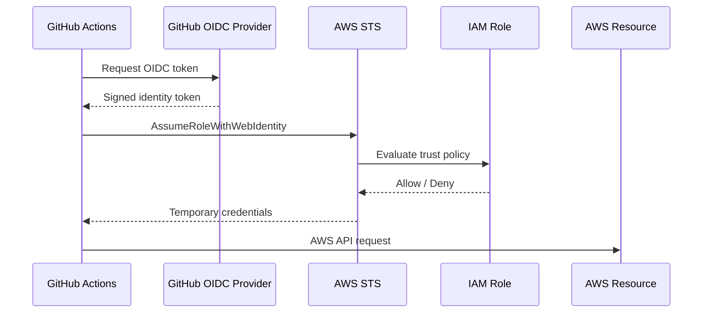
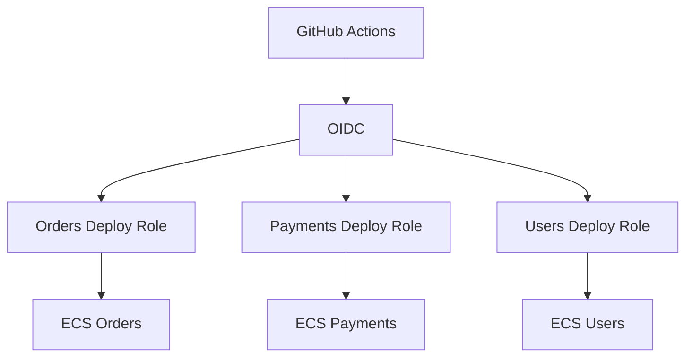

# 14- OIDC and AWS Questions

## Overview

GitHub Actions OpenID Connect (OIDC) provides a way for workflows to authenticate to AWS without storing long-lived AWS access keys in GitHub secrets.

The production security model is:

```text
GitHub Actions
      ↓
GitHub OIDC
      ↓
OIDC identity token
      ↓
AWS STS
      ↓
IAM trust policy
      ↓
IAM role
      ↓
Temporary AWS credentials
      ↓
AWS resources
```

OIDC solves the **authentication and credential-lifecycle problem**. It does not automatically solve authorization.

A secure AWS deployment therefore requires all of the following:

```text
OIDC
+
Correct GitHub workflow permissions
+
Restrictive IAM trust policy
+
Least-privilege IAM permissions
+
Protected GitHub environments
+
Restricted deployment sources
+
Immutable artifacts
+
Runner isolation
```

For a senior backend engineer, the important question is not simply:

> "How do I configure OIDC?"

It is:

> "How do I establish a verifiable identity from a GitHub workflow, restrict exactly which workflows can assume an AWS role, and minimize what that role can do?"

---

## GitHub Actions OIDC Architecture

OIDC allows GitHub Actions to obtain an identity token representing the workflow execution.

AWS can validate that identity and exchange it for temporary credentials through AWS STS.



There are two major authorization decisions:

```text
GitHub workflow
    ↓
Can it request an OIDC token?

AWS IAM
    ↓
Can that identity assume this role?

IAM permissions
    ↓
What can the role do?
```

---

## Why OIDC Exists

Traditional CI/CD pipelines often store long-lived cloud credentials:

```text
AWS_ACCESS_KEY_ID
AWS_SECRET_ACCESS_KEY
```

as CI secrets.

This creates a persistent credential that must be:

- Stored.
- Protected.
- Rotated.
- Revoked.
- Audited.
- Replaced after compromise.

OIDC changes the model:

```text
No permanent AWS key
        ↓
GitHub proves workflow identity
        ↓
AWS STS issues temporary credentials
        ↓
Credentials expire
```

This reduces long-lived credential exposure.

---

## OIDC vs Long-Lived AWS Keys

| Property | Long-Lived AWS Keys | GitHub OIDC |
|---|---|---|
| Permanent credential | Yes | No |
| Stored in GitHub secrets | Usually | No AWS access key required |
| Rotation | Required | Temporary credentials |
| Credential lifetime | Potentially long | Short-lived |
| Repository identity | Indirect | Can be represented in token claims |
| IAM trust conditions | Not based on GitHub OIDC | Yes |
| Operational overhead | Higher | Lower after setup |
| Blast radius | Depends on key permissions | Depends on role permissions |

OIDC is not a replacement for IAM least privilege. It changes how the workflow obtains AWS credentials.

---

## GitHub Workflow Permission

A workflow must be allowed to request an OIDC identity token.

Example:

```yaml
permissions:
  contents: read
  id-token: write
```

The important permission is:

```yaml
id-token: write
```

This does **not** mean:

```text
The workflow can modify AWS resources.
```

It means:

```text
The workflow can request an OIDC identity token.
```

AWS still decides whether that identity can assume a particular role.

---

## Why `id-token: write` Is Named `write`

The permission name can be misleading.

It does not grant write access to AWS.

Instead, it permits the workflow to request an OIDC token from GitHub.

The authorization chain is:

```text
id-token: write
        ↓
OIDC token
        ↓
AWS STS
        ↓
IAM trust policy
        ↓
IAM role
        ↓
IAM permissions
```

---

## Minimal OIDC Permissions

A deployment job might use:

```yaml
jobs:
  deploy:
    permissions:
      contents: read
      id-token: write

    runs-on: ubuntu-latest

    steps:
      - uses: actions/checkout@v4

      - name: Configure AWS credentials
        uses: aws-actions/configure-aws-credentials@v4
        with:
          role-to-assume: arn:aws:iam::123456789012:role/github-actions-production
          aws-region: ap-south-1
```

The rest of the workflow does not need `id-token: write` unless it independently requires OIDC.

---

## Job-Level OIDC Permissions

Prefer:

```yaml
permissions:
  contents: read

jobs:
  test:
    permissions:
      contents: read

  deploy:
    permissions:
      contents: read
      id-token: write
```

rather than:

```yaml
permissions:
  contents: read
  id-token: write
```

for the entire workflow when only deployment requires AWS authentication.

This reduces the number of jobs that can request an AWS identity token.

---

## OIDC Identity Token

The OIDC token contains claims describing the workflow identity.

Important claims can include information associated with:

- Repository.
- Organization.
- Repository owner.
- Ref.
- Commit.
- Environment.
- Workflow identity.
- Audience.

AWS IAM conditions can use relevant claims to restrict role assumption.

The exact claims and trust-policy design should match the GitHub event and deployment model.

---

## Audience

AWS OIDC integrations commonly use:

```text
sts.amazonaws.com
```

as the intended audience.

A trust policy can constrain the expected audience.

Conceptually:

```text
OIDC token
    ↓
aud = sts.amazonaws.com
    ↓
AWS STS
```

This helps ensure that the token is intended for the AWS STS integration.

---

## Subject (`sub`) Claim

The `sub` claim is particularly important for AWS trust policies.

It can represent the GitHub workflow identity in a way that allows AWS to restrict which repository or environment can assume a role.

Conceptually:

```text
GitHub identity
    ↓
sub
    ↓
IAM trust condition
```

A production role should not generally trust arbitrary GitHub identities.

---

## Repository-Based Trust

A trust relationship can be restricted to a particular repository.

Conceptually:

```text
Organization
    ↓
Repository
    ↓
GitHub Actions
    ↓
Production IAM role
```

This is safer than granting a production role to arbitrary repositories.

---

## Branch-Based Trust

A deployment role may be restricted to workflows associated with an approved branch.

Conceptually:

```text
main
 ↓
production role
```

while:

```text
feature/*
 ↓
no production role
```

The exact implementation depends on the GitHub OIDC subject and whether environments are used.

---

## Environment-Based Trust

For production deployments, environments provide a stronger logical boundary.

A useful model is:

```text
GitHub Repository
      ↓
Production Environment
      ↓
OIDC identity
      ↓
Production IAM role
      ↓
Production AWS account/resources
```

This can be combined with environment approvals and deployment restrictions.

---

## Why Environments Matter for OIDC

Without environment separation, a deployment workflow may rely primarily on branch conditions.

With environments:

```text
Staging
    ↓
Staging secrets
    ↓
Staging IAM role

Production
    ↓
Production approval
    ↓
Production IAM role
```

This makes the promotion boundary easier to reason about.

---

## Separate AWS Roles by Environment

Prefer:

```text
GitHub staging
    ↓
AWS staging role
    ↓
Staging account/resources

GitHub production
    ↓
AWS production role
    ↓
Production account/resources
```

rather than one highly privileged role that can operate across all environments.

---

## Separate AWS Accounts

For larger systems, stronger isolation can use separate AWS accounts:

```text
GitHub
  ├── Staging identity → Staging AWS account
  │
  └── Production identity → Production AWS account
```

This creates a stronger blast-radius boundary than merely separating resource names inside one account.

---

## IAM Trust Policy vs Permissions Policy

An IAM role has two conceptually different security controls.

### Trust Policy

Determines:

```text
Who can assume the role?
```

### Permissions Policy

Determines:

```text
What can the role do after assumption?
```

Therefore:

```text
GitHub OIDC token
       ↓
Trust policy
       ↓
IAM role
       ↓
Permissions policy
       ↓
AWS resources
```

Both policies must be restrictive.

---

## Example Trust Policy Structure

A conceptual trust relationship may look like:

```json
{
  "Version": "2012-10-17",
  "Statement": [
    {
      "Effect": "Allow",
      "Principal": {
        "Federated": "arn:aws:iam::123456789012:oidc-provider/token.actions.githubusercontent.com"
      },
      "Action": "sts:AssumeRoleWithWebIdentity",
      "Condition": {
        "StringEquals": {
          "token.actions.githubusercontent.com:aud": "sts.amazonaws.com"
        },
        "StringLike": {
          "token.actions.githubusercontent.com:sub": "repo:example-org/example-api:*"
        }
      }
    }
  ]
}
```

This is only a structural example. Production conditions should be narrowed to the organization's actual repository, branch, tag, and environment model.

---

## `StringEquals` vs `StringLike`

These operators have different security implications.

### `StringEquals`

Useful when an exact value is expected.

```json
"StringEquals": {
  "token.actions.githubusercontent.com:aud": "sts.amazonaws.com"
}
```

### `StringLike`

Useful when a controlled pattern is required.

```json
"StringLike": {
  "token.actions.githubusercontent.com:sub": "repo:example-org/example-api:*"
}
```

Avoid unnecessarily broad wildcards.

---

## Wildcard Risk

This is potentially broad:

```text
repo:*:* 
```

because it may allow many repositories to assume the role.

Prefer narrow conditions such as:

```text
repo:example-org/example-api:...
```

and further restrict the workflow identity where appropriate.

---

## OIDC and `pull_request`

A pull request workflow can execute code from a contributor-controlled branch.

If that workflow can request OIDC:

```text
pull_request
    ↓
id-token: write
    ↓
OIDC token
```

the AWS trust policy must ensure that the resulting identity cannot assume a privileged production role unless the workflow's trust boundary explicitly permits it.

Production OIDC roles should not blindly trust all pull request executions.

---

## OIDC and Forks

Fork pull requests are a major security boundary.

Conceptually:

```text
External fork
    ↓
Pull request
    ↓
Workflow
    ↓
Potentially untrusted code
```

Do not allow such workflows to obtain production AWS credentials merely because they can execute GitHub Actions.

Use protected deployment workflows and narrow trust policies.

---

## `pull_request_target` and OIDC

`pull_request_target` requires particular caution because it executes in the base repository context.

Dangerous architecture:

```text
pull_request_target
      ↓
Checkout attacker PR
      ↓
Execute PR code
      ↓
Request OIDC token
      ↓
Assume production role
```

This combines:

```text
Untrusted code
+
Privileged workflow
+
Cloud identity
```

Avoid this pattern.

---

## Secure Pull Request Architecture

Prefer:

```text
Pull Request
    ↓
Unprivileged CI
    ├── Lint
    ├── Unit Tests
    ├── Integration Tests
    └── Security Scan

Trusted main/release branch
    ↓
Protected deployment workflow
    ↓
Environment approval
    ↓
OIDC
    ↓
Production IAM role
```

This separates code validation from cloud deployment authority.

---

## OIDC and Third-Party Actions

A third-party action inside a job with:

```yaml
permissions:
  id-token: write
```

may execute with the ability to request an OIDC identity token.

Therefore:

```text
Third-party action
+
id-token: write
```

should be treated as a sensitive combination.

Use:

- Trusted actions.
- SHA pinning where appropriate.
- Minimal job permissions.
- Dedicated privileged jobs.
- Restricted environments.

---

## Privileged Deployment Job

A good design is:

```text
Test jobs
    ↓
No OIDC

Build jobs
    ↓
No OIDC

Deployment job
    ↓
id-token: write
    ↓
Trusted deployment logic
```

This reduces the number of places where cloud identity can be requested.

---

## AWS STS

AWS Security Token Service provides temporary credentials.

For GitHub OIDC, the relevant conceptual operation is:

```text
AssumeRoleWithWebIdentity
```

The flow is:

```text
OIDC token
    ↓
AWS STS
    ↓
IAM trust policy
    ↓
Temporary AWS credentials
```

The credentials have a limited lifetime.

---

## Why STS Matters

STS avoids the need for permanent AWS credentials inside GitHub.

Instead of:

```text
Permanent key
    ↓
Stored in GitHub
    ↓
Used indefinitely until rotated
```

the model becomes:

```text
Verified workflow
    ↓
Temporary identity
    ↓
Temporary credentials
    ↓
Expiration
```

---

## Temporary Credentials Are Not Automatically Safe

If an attacker compromises the deployment job while temporary credentials are active, they may still use those credentials.

Therefore:

```text
Short-lived
```

does not mean:

```text
Harmless
```

Least-privilege IAM permissions remain essential.

---

## IAM Permissions for Deployment

A deployment role should have only the permissions required by the deployment.

For ECS, this may include permissions related to:

```text
ECS services
ECS task definitions
ECR
IAM PassRole where required
CloudFormation where applicable
Load balancers where applicable
```

Do not grant:

```text
AdministratorAccess
```

merely because the deployment script is difficult to configure.

---

## `iam:PassRole`

ECS, Lambda, and other AWS services may require a deployment workflow to pass an IAM role to a service.

For example:

```text
GitHub Actions
    ↓
ECS deployment
    ↓
ECS task role
```

This may involve:

```text
iam:PassRole
```

`iam:PassRole` should itself be narrowly scoped to the specific role(s) that the deployment is allowed to pass.

---

## OIDC and ECR

A common container deployment architecture is:

```text
GitHub Actions
    ↓
OIDC
    ↓
AWS STS
    ↓
ECR permissions
    ↓
Docker login
    ↓
Build / Push
    ↓
ECR
```

Example:

```yaml
- name: Configure AWS credentials
  uses: aws-actions/configure-aws-credentials@v4
  with:
    role-to-assume: arn:aws:iam::123456789012:role/github-actions-ecr
    aws-region: ap-south-1

- name: Login to ECR
  id: login-ecr
  uses: aws-actions/amazon-ecr-login@v2
```

The role should be restricted to the intended ECR repository operations.

---

## OIDC and ECS

A deployment can use:

```text
GitHub Actions
    ↓
OIDC
    ↓
IAM role
    ↓
ECS
```

The pipeline may:

1. Build the image.
2. Push the image to ECR.
3. Register or update the task definition.
4. Update the ECS service.
5. Wait for deployment stabilization.
6. Validate application health.

The production role should have only the permissions required for those operations.

---

## OIDC and EC2

For EC2 deployments, GitHub Actions may use OIDC to authenticate to AWS and then use:

```text
SSM
```

or other AWS-native deployment mechanisms.

A preferred architecture is often:

```text
GitHub
 ↓
OIDC
 ↓
AWS role
 ↓
SSM
 ↓
EC2
```

rather than storing permanent SSH private keys in GitHub.

---

## OIDC and S3

For deployments involving S3:

```text
GitHub Actions
    ↓
OIDC
    ↓
IAM role
    ↓
S3 permissions
```

The role should be restricted to the required bucket and prefixes.

Avoid granting broad access such as:

```text
s3:*
Resource: *
```

when the workflow only needs a deployment bucket.

---

## OIDC and Lambda

Lambda deployment may require permissions such as:

```text
lambda:UpdateFunctionCode
lambda:UpdateFunctionConfiguration
```

depending on the deployment mechanism.

Restrict permissions to the specific functions and accounts where possible.

---

## OIDC and CloudFormation

Infrastructure deployment can use:

```text
GitHub
 ↓
OIDC
 ↓
CloudFormation deployment role
 ↓
CloudFormation
```

Separate infrastructure permissions from application deployment permissions where practical.

---

## OIDC and Terraform

Terraform running in GitHub Actions can use OIDC rather than static AWS keys.

Architecture:

```text
GitHub Actions
    ↓
OIDC
    ↓
AWS STS
    ↓
Terraform
    ↓
AWS APIs
```

The Terraform role should be carefully scoped because infrastructure-as-code pipelines can have extremely broad impact.

---

## Terraform Security Boundary

A Terraform workflow may modify:

```text
IAM
VPC
EC2
ECS
S3
RDS
Security Groups
Load Balancers
```

Therefore Terraform deployment workflows should normally be treated as highly privileged.

Recommended controls include:

```text
Protected environment
+
Approval
+
Restricted branch
+
OIDC
+
Dedicated IAM role
+
Plan review
+
State protection
+
Concurrency
```

---

## OIDC and Kubernetes

For Kubernetes deployments hosted in AWS, authentication can use workload identity mechanisms appropriate to the cluster.

The broader principle remains:

```text
GitHub identity
    ↓
Short-lived cloud identity
    ↓
Limited Kubernetes authorization
```

Avoid giving the CI identity unrestricted cluster-admin access when namespace-scoped deployment permissions are sufficient.

---

## Build Once, Deploy Many

A secure production pipeline should separate:

```text
Build identity
```

from:

```text
Deployment identity
```

Example:

```text
Build
 ↓
Docker image
 ↓
ECR
 ↓
Staging
 ↓
Approval
 ↓
Production
```

The production job should promote the already-built image rather than rebuilding it.

---

## OIDC and Immutable Artifacts

A strong architecture is:

```text
Git commit
 ↓
Build
 ↓
Image digest
 ↓
ECR
 ↓
Staging
 ↓
Approval
 ↓
Production
```

The OIDC deployment identity should operate on a known artifact rather than an ambiguous mutable tag.

---

## Image Tags vs Digests

A tag:

```text
orders-api:1.5.0
```

is human-readable but may be mutable depending on registry policy.

A digest:

```text
orders-api@sha256:...
```

identifies a specific image.

For production promotion, prefer immutable artifact identity.

---

## OIDC and GitHub Environments

A deployment job can use:

```yaml
environment:
  name: production
```

This can combine:

```text
Required reviewers
+
Environment secrets
+
Deployment history
+
Branch restrictions
+
OIDC trust conditions
```

The environment becomes part of the deployment security boundary.

---

## Production Deployment Flow


---

## Production OIDC Workflow

```yaml
name: Deploy Production

on:
  workflow_dispatch:
    inputs:
      image:
        description: Immutable ECR image reference
        required: true
        type: string

permissions:
  contents: read

concurrency:
  group: production
  cancel-in-progress: false

jobs:
  deploy:
    runs-on: ubuntu-latest

    environment:
      name: production

    permissions:
      contents: read
      id-token: write

    steps:
      - name: Validate image
        env:
          IMAGE: ${{ inputs.image }}
        run: |
          test -n "$IMAGE"
          printf 'Deploying %s\n' "$IMAGE"

      - name: Configure AWS credentials
        uses: aws-actions/configure-aws-credentials@v4
        with:
          role-to-assume: ${{ vars.AWS_PRODUCTION_ROLE_ARN }}
          aws-region: ${{ vars.AWS_REGION }}

      - name: Verify AWS identity
        run: |
          aws sts get-caller-identity

      - name: Deploy
        env:
          IMAGE: ${{ inputs.image }}
        run: |
          ./scripts/deploy.sh "$IMAGE"

      - name: Validate deployment
        run: |
          ./scripts/healthcheck.sh
```

This separates:

```text
Workflow permissions
+
Environment protection
+
AWS authentication
+
Artifact identity
+
Deployment concurrency
```

---

## Verify AWS Identity

After assuming the role, use:

```bash
aws sts get-caller-identity
```

This is one of the most useful diagnostics for AWS authentication.

It confirms which AWS identity the workflow is actually using.

---

## Verify AWS Region

A deployment may authenticate successfully but operate against the wrong region.

Inspect:

```bash
aws configure get region
```

or:

```bash
echo "$AWS_REGION"
```

A successful OIDC authentication does not guarantee that the deployment target is correct.

---

## Credential Source Confusion

AWS tooling can receive credentials from several sources.

Potential sources include:

```text
Environment variables
AWS credential files
OIDC-generated credentials
EC2 instance profile
ECS task role
Other SDK credential providers
```

In CI, unexpected credential sources can produce confusing failures.

A useful diagnostic is:

```bash
aws sts get-caller-identity
```

before the deployment operation.

---

## OIDC Failure: Missing `id-token: write`

### Symptom

The workflow cannot obtain an OIDC token.

### Possible Causes

- Missing permission.
- Permission configured at the wrong level.
- Job-level permissions override workflow permissions.

### Check

```yaml
jobs:
  deploy:
    permissions:
      contents: read
      id-token: write
```

### Prevention

Keep OIDC permission explicit at the privileged job level.

---

## OIDC Failure: AWS `AccessDenied`

### Symptom

Role assumption fails.

### Possible Causes

- IAM trust policy mismatch.
- Incorrect repository condition.
- Incorrect branch condition.
- Incorrect environment condition.
- Incorrect audience.
- Wrong AWS account.
- Wrong role ARN.

### Isolation Strategy

Check:

```text
GitHub workflow
 ↓
OIDC permission
 ↓
Role ARN
 ↓
IAM trust policy
 ↓
AWS account
```

### Diagnostic

```bash
aws sts get-caller-identity
```

If role assumption itself fails, inspect the trust policy before debugging resource permissions.

---

## OIDC Failure: Wrong Repository

### Symptom

A workflow from the expected repository cannot assume the role.

### Possible Causes

The trust policy may reference a different repository identity.

### Check

Review the `sub` condition.

Conceptually:

```text
Expected:
repo:example-org/example-api:...

Configured:
repo:example-org/other-api:...
```

### Prevention

Keep OIDC trust policies version-controlled and reviewed.

---

## OIDC Failure: Wrong Branch

### Symptom

Deployment works from one branch but fails from another.

### Possible Cause

The IAM trust policy restricts the identity to a particular branch or environment.

### Corrective Action

Determine whether the intended deployment source is:

```text
main
release/*
tag
environment
```

and align the trust policy with the actual release model.

Do not simply broaden the trust policy to make the error disappear.

---

## OIDC Failure: Wrong Audience

### Symptom

AWS rejects the identity token.

### Possible Cause

The trust policy expects an audience that does not match the token.

### Check

Ensure the AWS OIDC integration uses the expected STS audience:

```text
sts.amazonaws.com
```

---

## OIDC Failure: Wrong AWS Account

### Symptom

The workflow assumes a role successfully but deploys into the wrong account.

### Isolation

Run:

```bash
aws sts get-caller-identity
```

Inspect:

```text
Account
Arn
UserId
```

### Prevention

Use explicit environment/account configuration and separate roles.

---

## IAM Permission Failure

### Symptom

OIDC role assumption succeeds but deployment returns:

```text
AccessDenied
```

This indicates a different failure domain.

The identity was authenticated successfully.

Now inspect:

```text
IAM permissions policy
+
Resource policy
+
SCP
+
Permissions boundary
+
Resource ownership
```

---

## Trust Failure vs Permission Failure

| Failure | Meaning |
|---|---|
| Cannot assume role | Trust relationship problem |
| Role assumed successfully | Authentication succeeded |
| AWS API returns `AccessDenied` | Authorization/resource policy problem |

This distinction dramatically speeds up troubleshooting.

---

## `iam:PassRole` Failure

### Symptom

ECS or another service reports insufficient permissions while deploying a task or function.

### Possible Cause

The deployment role needs `iam:PassRole`.

### Security Requirement

Restrict it to the exact role(s) the deployment can pass.

Avoid:

```text
Resource: *
```

when a specific role ARN is sufficient.

---

## ECR Permission Failure

### Symptom

Docker push fails.

### Possible Causes

- Missing ECR permissions.
- Wrong repository.
- Wrong AWS account.
- Wrong region.
- Authentication failure.

### Diagnostics

```bash
aws sts get-caller-identity
aws ecr describe-repositories --repository-names orders-api
```

Then inspect Docker authentication and ECR permissions.

---

## ECS Deployment Failure

Authentication may succeed while ECS deployment fails.

Check:

```bash
aws ecs describe-services \
  --cluster production \
  --services orders-api
```

Inspect:

- Task definition.
- Service events.
- Deployment status.
- Health checks.
- Target group.
- Security groups.
- IAM roles.

OIDC only establishes the AWS identity; it does not guarantee that the ECS deployment is valid.

---

## CloudFormation Failure

For CloudFormation:

```bash
aws cloudformation describe-stack-events \
  --stack-name production
```

Distinguish:

```text
GitHub authentication
```

from:

```text
CloudFormation authorization
```

and:

```text
CloudFormation resource failure
```

---

## Terraform Failure

Terraform can authenticate successfully and still fail because:

```text
IAM permission
+
state lock
+
resource policy
+
resource dependency
```

is incorrect.

Useful diagnostics include:

```bash
terraform plan
terraform validate
aws sts get-caller-identity
```

Do not expand IAM permissions blindly to fix Terraform failures.

---

## OIDC and Concurrency

Production deployments should normally be serialized:

```yaml
concurrency:
  group: production
  cancel-in-progress: false
```

This prevents:

```text
Deployment A
+
Deployment B
```

from changing production simultaneously.

OIDC controls identity; concurrency controls deployment coordination.

They solve different problems.

---

## OIDC and Rollback

Rollback should use the same controlled deployment identity.

Example:

```text
Known-good image
    ↓
Production deployment workflow
    ↓
Protected environment
    ↓
OIDC
    ↓
Production IAM role
    ↓
Rollback
```

Do not create a separate permanent administrator credential merely for emergencies.

---

## OIDC and Break-Glass Access

Emergency access may require a separate controlled path.

A break-glass model should have:

```text
Explicit ownership
+
Strong authentication
+
Auditability
+
Limited use
+
Credential rotation
+
Incident review
```

Do not solve normal deployment problems by making the standard GitHub deployment role an administrator role.

---

## OIDC Monitoring

Monitor:

- STS role assumptions.
- IAM role usage.
- GitHub deployment activity.
- Environment approvals.
- Workflow changes.
- Workflow permission changes.
- Production deployments.
- ECR pushes.
- ECS changes.

AWS CloudTrail is particularly useful for investigating role usage.

---

## CloudTrail Investigation

For a suspicious deployment, investigate:

```text
Which role was assumed?
When?
Which account?
Which source?
Which API operations?
Which resources?
```

A typical investigation path is:

```text
GitHub workflow
 ↓
OIDC identity
 ↓
STS role assumption
 ↓
CloudTrail
 ↓
AWS API calls
```

---

## OIDC Incident Response

If an OIDC deployment role is suspected to be compromised:

```text
Stop affected workflows
        ↓
Identify affected role
        ↓
Review CloudTrail
        ↓
Restrict or disable trust
        ↓
Inspect affected resources
        ↓
Rotate other exposed credentials if required
        ↓
Verify artifacts
        ↓
Restore trusted deployment path
```

Because OIDC uses temporary credentials, there may be no permanent AWS key to rotate, but the IAM trust and permissions still need investigation.

---

## OIDC Security and Supply Chain

OIDC does not eliminate supply-chain risk.

Consider:

```text
Compromised third-party action
        ↓
Deployment job
        ↓
id-token: write
        ↓
OIDC token
        ↓
Production IAM role
```

This is why high-privilege deployment jobs should minimize third-party action usage and use trusted, reviewed, appropriately pinned actions.

---

## OIDC Security and Docker

A secure container pipeline is:

```text
GitHub Actions
    ↓
OIDC
    ↓
AWS STS
    ↓
ECR role
    ↓
Docker build
    ↓
Image
    ↓
ECR
```

The image should not contain AWS credentials.

Authentication should happen at the workflow/registry boundary.

---

## Docker Build Security

Avoid:

```dockerfile
ARG AWS_SECRET_ACCESS_KEY
```

and:

```dockerfile
ENV AWS_SECRET_ACCESS_KEY=...
```

Credentials should not become part of image layers or runtime configuration.

Use OIDC for the CI-to-AWS boundary and runtime IAM mechanisms for AWS workloads.

---

## Production Role Separation

A mature architecture may use:

```text
GitHub
 ├── CI role
 │    └── Minimal read/scan capabilities
 │
 ├── ECR publishing role
 │    └── Image push capabilities
 │
 ├── Staging deployment role
 │    └── Staging resources
 │
 └── Production deployment role
      └── Production resources
```

This reduces blast radius compared with one role shared across the entire pipeline.

---

## OIDC Role Separation by Repository

For multiple services:

```text
orders-api
    ↓
orders-production-role

payments-api
    ↓
payments-production-role

users-api
    ↓
users-production-role
```

A compromise of one service's deployment workflow should not automatically grant deployment authority over every service.

---

## OIDC in a Microservices Architecture

For a microservice platform:



Each role can be restricted to its corresponding resources.

This creates service-level deployment boundaries.

---

## OIDC and Reusable Deployment Workflows

A reusable deployment workflow can centralize:

```text
AWS authentication
+
Environment selection
+
Deployment validation
+
Health checks
+
Rollback
```

Example caller:

```yaml
jobs:
  deploy:
    uses: example-org/platform/.github/workflows/aws-deploy.yml@v1
    with:
      environment: production
      image: ${{ needs.build.outputs.image }}
    secrets: inherit
```

The reusable workflow should have a clear security contract.

---

## Reusable Workflow Permission Design

Do not assume that centralization automatically means security.

Review:

```text
Caller permissions
+
Reusable workflow permissions
+
Secrets
+
Environment
+
Runner
+
OIDC trust
```

A reusable deployment workflow is part of the trusted CI/CD platform.

---

## OIDC and Action Versioning

Production deployment actions should use controlled versions.

For example:

```yaml
uses: aws-actions/configure-aws-credentials@v4
```

For higher-assurance environments, organizations may pin to a verified commit SHA.

The important operational requirement is to maintain an update process so security fixes are not missed.

---

## OIDC and Artifact Provenance

A strong production chain is:

```text
Git commit
 ↓
GitHub workflow
 ↓
Build
 ↓
SBOM
 ↓
Provenance
 ↓
Attestation
 ↓
ECR
 ↓
Staging
 ↓
Production
```

OIDC establishes the cloud identity of the workflow.

Artifact provenance establishes how the artifact was produced.

These controls complement each other.

---

## Common OIDC Mistakes

### Storing AWS Access Keys Anyway

This defeats much of the credential-lifecycle benefit of OIDC.

### Giving Every Job `id-token: write`

This unnecessarily expands the number of jobs that can request cloud identity tokens.

### Trusting Every Repository

A production role should not broadly trust unrelated repositories.

### Using Broad IAM Permissions

OIDC does not make:

```text
AdministratorAccess
```

safe.

### Ignoring Forks

Fork workflows may execute untrusted code.

### Trusting `pull_request_target` With a Checkout

Privileged workflows should not execute attacker-controlled code.

### Using One AWS Role Everywhere

Environment and service separation reduces blast radius.

### Ignoring `iam:PassRole`

Some AWS deployments require it, but it should be tightly scoped.

### Debugging AWS Authorization Before Identity

First determine:

```bash
aws sts get-caller-identity
```

Then debug resource authorization.

---

## OIDC Troubleshooting Decision Tree

```text
Deployment fails
      ↓
Can workflow request OIDC token?
      ├── No → Check id-token: write
      │
      └── Yes
           ↓
Can AWS assume role?
      ├── No → Check trust policy
      │          repository
      │          branch/environment
      │          audience
      │
      └── Yes
           ↓
Which identity?
      ↓
aws sts get-caller-identity
      ↓
AWS API fails?
      ├── Yes → Check IAM/resource permissions
      │
      └── No
           ↓
Deployment/runtime failure
           ↓
Debug ECS/EC2/Lambda/ECR/etc.
```

---

## General OIDC Troubleshooting Model

### Symptom

What exactly failed?

```text
Token request
Role assumption
AWS API
Deployment
Runtime
```

### Possible Causes

Classify the failure before changing configuration.

### Isolation Strategy

Separate:

```text
Identity
```

from:

```text
Authorization
```

and:

```text
Resource operation
```

### Commands / Checks

Useful commands include:

```bash
aws sts get-caller-identity
aws configure list
aws ecr describe-repositories
aws ecs describe-services --cluster production --services orders-api
aws cloudformation describe-stack-events --stack-name production
```

### Root Cause

Identify the exact trust or permission mismatch.

### Corrective Action

Change the narrowest possible configuration.

### Prevention

Add:

```text
Tests
+
IaC
+
Policy review
+
Monitoring
+
Documentation
```

---

## GitHub CLI Diagnostics

List workflows:

```bash
gh workflow list
```

List runs:

```bash
gh run list
```

Inspect a run:

```bash
gh run view RUN_ID
```

View logs:

```bash
gh run view RUN_ID --log
```

Watch a run:

```bash
gh run watch RUN_ID
```

Run a workflow manually:

```bash
gh workflow run deploy.yml
```

Cancel a run:

```bash
gh run cancel RUN_ID
```

The GitHub CLI is useful for inspecting workflow behavior before moving into AWS-specific diagnostics.

---

## AWS CLI Diagnostics

Confirm identity:

```bash
aws sts get-caller-identity
```

Check region:

```bash
aws configure get region
```

Inspect ECR:

```bash
aws ecr describe-repositories \
  --repository-names orders-api
```

Inspect ECS:

```bash
aws ecs describe-services \
  --cluster production \
  --services orders-api
```

Inspect CloudFormation:

```bash
aws cloudformation describe-stack-events \
  --stack-name production
```

These commands help establish whether the problem is:

```text
Authentication
Authorization
Resource state
```

---

## OIDC and High Availability

OIDC itself is part of the deployment identity path, so the deployment platform should avoid unnecessary single points of failure.

Use:

```text
Managed GitHub runners
+
Reusable workflows
+
Infrastructure as code
+
Immutable artifacts
+
Documented recovery process
```

The goal is to ensure that deployment does not depend on one manually configured machine or credential.

---

## OIDC and Disaster Recovery

A recovery plan should preserve:

- OIDC provider configuration.
- IAM trust policies.
- IAM permission policies.
- GitHub environments.
- Deployment workflows.
- Artifact registry.
- Infrastructure-as-code.
- Known-good artifacts.

A production recovery process should not require recreating undocumented IAM configuration manually.

---

## OIDC and Cost

OIDC can reduce operational overhead associated with:

```text
Credential rotation
Credential storage
Credential replacement
```

However, production deployment architecture may still incur costs from:

- Staging environments.
- ECR storage.
- Build runners.
- Security scanning.
- NAT/private networking.
- Monitoring.
- Multi-account infrastructure.

Security architecture should be cost-aware without weakening identity boundaries.

---

## Senior Interview Questions

### What problem does GitHub Actions OIDC solve?

It allows GitHub Actions to establish a federated identity with AWS and obtain temporary credentials without storing long-lived AWS access keys in GitHub.

---

### What does `id-token: write` actually grant?

It allows a workflow job to request an OIDC identity token. It does not directly grant AWS permissions.

---

### Does OIDC replace IAM?

No.

OIDC establishes identity federation.

IAM still controls:

```text
Who can assume the role?
```

and:

```text
What can the role do?
```

---

### What is the difference between an IAM trust policy and permissions policy?

Trust policy:

```text
Who can assume this role?
```

Permissions policy:

```text
What can the assumed role do?
```

---

### Why is `aws sts get-caller-identity` useful?

It identifies the AWS identity currently being used by the workflow.

It helps distinguish:

```text
Wrong identity
```

from:

```text
Correct identity but insufficient permissions
```

---

### What should an AWS OIDC trust policy restrict?

Depending on the deployment model:

```text
Repository
+
Organization
+
Branch/tag
+
Environment
+
Audience
```

The exact conditions should be as narrow as practical.

---

### Why is a broad OIDC trust policy dangerous?

If many repositories or workflow identities can assume a production role, compromising any one of those identities can potentially provide access to the role.

---

### Why should deployment roles be separated?

A compromised staging workflow should not automatically gain the ability to modify production.

Separate roles reduce blast radius.

---

### Why use different AWS accounts?

Separate accounts provide stronger isolation for:

```text
Development
Staging
Production
```

and reduce the impact of an account-level or role-level compromise.

---

### Does short-lived STS credentialing eliminate compromise risk?

No.

An attacker who compromises an active deployment job may use the temporary credentials until they expire or are otherwise invalidated.

Least privilege and job isolation remain necessary.

---

### Why should only the deployment job have `id-token: write`?

Because it reduces the number of workflow jobs capable of requesting cloud identity credentials.

This follows least privilege.

---

### Why is a third-party action in an OIDC-enabled job a concern?

The action executes in the job's security context.

If compromised, it may potentially access:

```text
OIDC capability
+
Secrets
+
GITHUB_TOKEN
+
Filesystem
+
Network
```

depending on the job configuration.

---

### Why is `pull_request_target` dangerous with OIDC?

A privileged `pull_request_target` workflow can potentially combine:

```text
Attacker-controlled PR code
+
OIDC token capability
+
Production IAM trust
```

Executing untrusted code in that context can create a cloud credential compromise path.

---

### How would you design GitHub Actions → ECR → ECS securely?

```text
Build
 ↓
Immutable Docker image
 ↓
ECR
 ↓
Protected staging
 ↓
Validation
 ↓
Production approval
 ↓
OIDC
 ↓
Production IAM role
 ↓
ECS
```

Use least-privilege permissions, immutable image identity, deployment concurrency, health checks, and rollback.

---

### How would you troubleshoot `AccessDenied`?

First determine whether role assumption succeeded:

```bash
aws sts get-caller-identity
```

If identity cannot be established, inspect:

```text
OIDC permission
Trust policy
Audience
Repository
Branch/environment
Role ARN
```

If identity is correct, inspect:

```text
IAM permissions
Resource policy
SCP
Permissions boundary
Resource configuration
```

---

## Senior Scenario: AWS Credentials Must Not Be Stored in GitHub

### Requirement

Deploy a Django application to ECS without storing permanent AWS keys.

### Architecture

```text
GitHub Actions
    ↓
id-token: write
    ↓
GitHub OIDC
    ↓
AWS STS
    ↓
Production deployment IAM role
    ↓
ECS
```

### Controls

```text
Protected production environment
+
Restricted branch
+
Narrow OIDC trust policy
+
Least-privilege IAM
+
Immutable ECR image
+
Concurrency
+
Health validation
```

---

## Senior Scenario: Production Deployment Can Be Triggered From Any Branch

### Problem

Any branch can potentially request a production deployment.

### Security Risks

```text
feature branch
    ↓
OIDC
    ↓
production IAM role
```

### Controls

Use:

```text
Protected environment
+
Branch restrictions
+
OIDC trust conditions
+
Manual approval
+
Immutable artifact
```

The key is to prevent a low-trust workflow identity from obtaining a high-trust AWS identity.

---

## Senior Scenario: Staging Works, Production Fails

Suppose:

```text
Staging deployment → success
Production deployment → AccessDenied
```

Do not assume the application is the problem.

Compare:

```text
AWS account
IAM role
OIDC trust policy
IAM permissions
Environment
Artifact
```

A common architectural difference is:

```text
Staging role
    ≠
Production role
```

The production role may intentionally have stricter trust or permissions.

---

## Senior Scenario: OIDC Works but ECS Deployment Fails

If:

```bash
aws sts get-caller-identity
```

succeeds, authentication is working.

Next inspect:

```text
IAM permissions
ECS service
Task definition
ECR image
IAM PassRole
Load balancer
Health checks
Security groups
```

Do not keep modifying the OIDC configuration once identity has been established.

---

## Senior Scenario: Terraform Needs Production Access

Treat the Terraform workflow as highly privileged.

Recommended model:

```text
Protected production environment
        ↓
Approval
        ↓
OIDC
        ↓
Dedicated Terraform IAM role
        ↓
Restricted AWS permissions
        ↓
Remote state
        ↓
Infrastructure
```

Add:

```text
Plan review
+
State locking
+
Concurrency
+
Audit logs
```

---

## Senior Scenario: Compromised Deployment Action

Suppose a deployment job uses:

```yaml
permissions:
  contents: read
  id-token: write
```

and one action is compromised.

The action may have access to the OIDC capability.

Therefore mitigation includes:

```text
Reduce third-party action usage
+
Pin trusted actions
+
Isolate deployment job
+
Minimize IAM permissions
+
Restrict trust policy
+
Use protected environment
```

No single control should be relied upon.

---

## Production OIDC Checklist

### GitHub

- [ ] `id-token: write` is explicitly configured.
- [ ] OIDC permission is limited to required jobs.
- [ ] Repository and branch/environment boundaries are reviewed.
- [ ] Fork workflows cannot reach production deployment authority.
- [ ] `pull_request_target` usage is carefully reviewed.

### IAM

- [ ] OIDC provider is configured correctly.
- [ ] Trust policy is restrictive.
- [ ] Audience is restricted appropriately.
- [ ] Repository identity is restricted.
- [ ] Branch/environment identity is restricted where applicable.
- [ ] Permissions policy is least privilege.
- [ ] `iam:PassRole` is restricted where required.

### AWS

- [ ] Separate roles are used for environments where appropriate.
- [ ] Separate accounts are considered for strong isolation.
- [ ] CloudTrail is available.
- [ ] ECR permissions are restricted.
- [ ] ECS/EC2/Lambda permissions are restricted.
- [ ] S3 access is restricted to required resources.

### Pipeline

- [ ] Production environment is protected.
- [ ] Deployment approval is configured where required.
- [ ] Production deployment concurrency is enabled.
- [ ] Immutable artifacts are promoted.
- [ ] Health validation exists.
- [ ] Rollback is documented.

### Supply Chain

- [ ] Third-party actions are reviewed.
- [ ] High-trust actions are pinned appropriately.
- [ ] Build provenance is available where required.
- [ ] SBOM/attestation controls are considered.
- [ ] Production artifacts are traceable to source.

### Operations

- [ ] `aws sts get-caller-identity` is part of troubleshooting procedures.
- [ ] IAM trust failures are distinguished from permission failures.
- [ ] CloudTrail supports incident investigation.
- [ ] Deployment roles can be restricted during incidents.
- [ ] Recovery workflows are documented and tested.

---

## Key Takeaways

- **GitHub Actions OIDC replaces the need for long-lived AWS access keys by allowing a workflow to exchange a GitHub identity token for short-lived AWS STS credentials.**
- **OIDC authentication and AWS authorization are separate controls: `id-token: write` enables token acquisition, IAM trust policies determine who can assume a role, and IAM permissions determine what that role can do.**
- **Production deployments should use narrow repository/environment trust, least-privilege IAM roles, protected environments, isolated privileged jobs, and separate roles or accounts where stronger blast-radius boundaries are required.**
- **OIDC does not eliminate CI/CD supply-chain risk; compromised actions, untrusted pull requests, self-hosted runners, excessive permissions, and malicious artifacts can still compromise a deployment path.**
- **For troubleshooting, first establish identity with `aws sts get-caller-identity`, then distinguish OIDC/trust failures from IAM authorization failures and finally from AWS resource or deployment failures.**