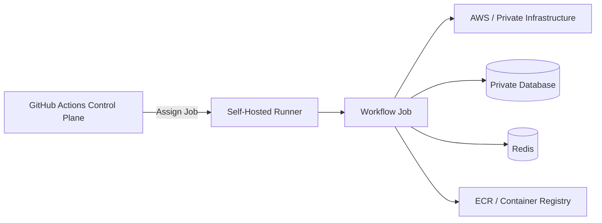
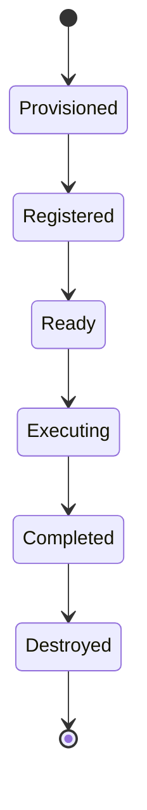
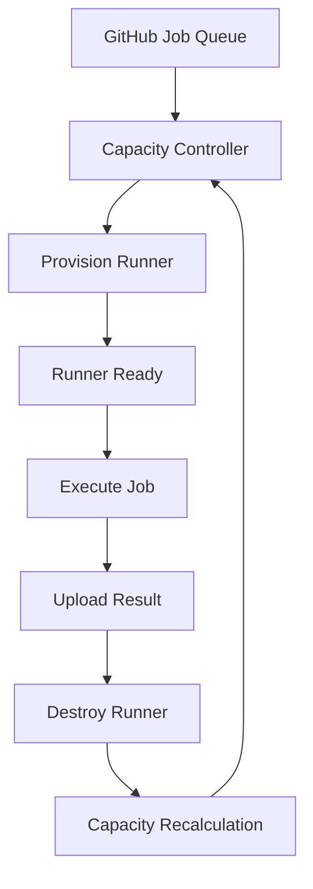
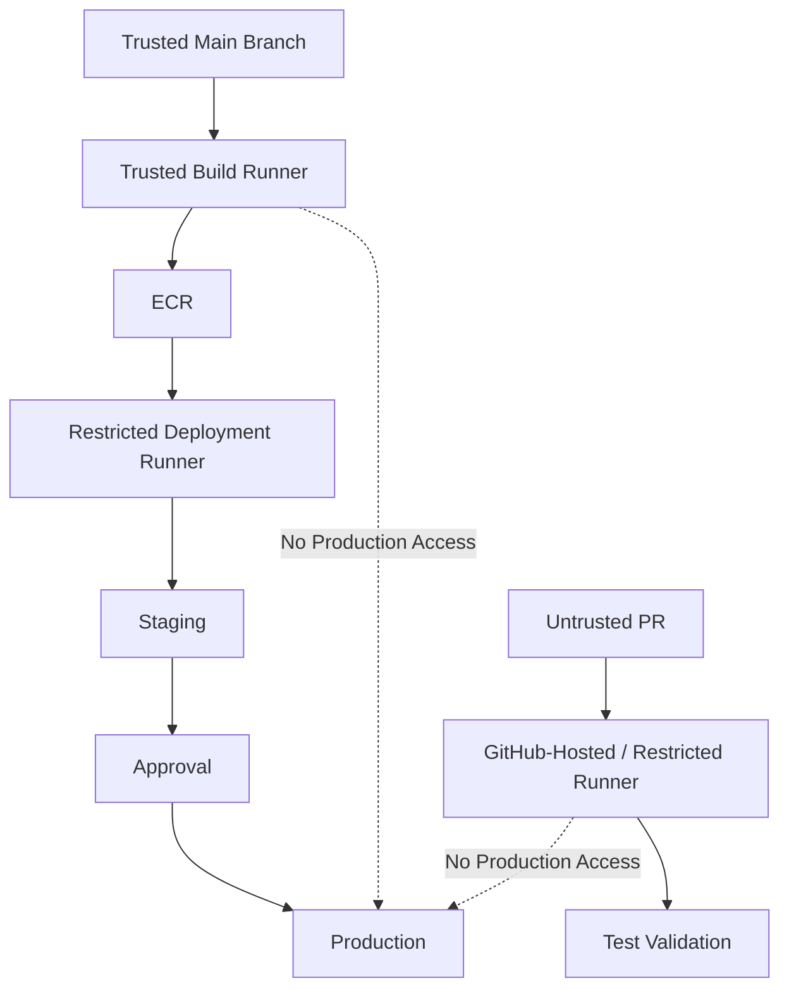
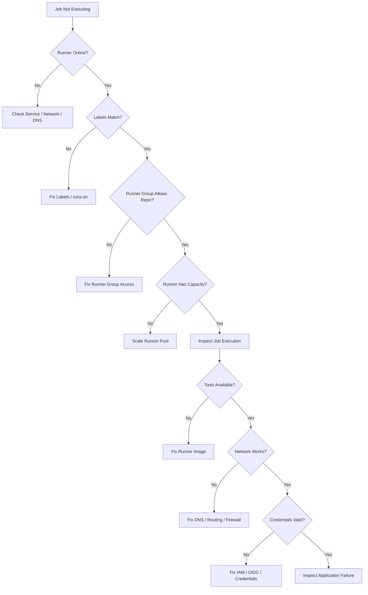

# 16- Self Hosted Runner Questions

## Overview

Self-hosted runners allow GitHub Actions jobs to execute on infrastructure controlled by the organization instead of GitHub-hosted runner infrastructure.

They are useful when CI/CD workloads require:

- Private network access
- Custom operating systems or software
- Specialized hardware
- Persistent build environments
- Access to internal databases or services
- Large local caches
- Custom networking
- GPU or architecture-specific workloads
- Deployment access to private infrastructure

They also introduce a significantly larger security and operational responsibility.

A GitHub-hosted runner is generally disposable infrastructure managed by GitHub. A self-hosted runner is part of your infrastructure and therefore becomes part of your CI/CD attack surface.

A senior backend engineer should understand the complete lifecycle:

```text
Runner Image
    ↓
Provisioning
    ↓
Registration
    ↓
Labels / Groups
    ↓
Job Scheduling
    ↓
Workflow Execution
    ↓
Network / Credentials
    ↓
Cleanup
    ↓
Monitoring
    ↓
Replacement / Retirement
```

The central design question is not:

> "How do I register a self-hosted runner?"

It is:

> "How do I safely operate CI/CD workloads on infrastructure that my organization owns?"

---

## Self-Hosted Runner Architecture

A simplified architecture is:



The GitHub Actions control plane schedules the job.

The runner:

1. Receives the job.
2. Downloads the required workflow instructions and actions.
3. Executes the steps locally.
4. Sends logs and job status back to GitHub.
5. Produces artifacts or deployment results.

The runner therefore sits at the boundary between GitHub-controlled workflow execution and organization-controlled infrastructure.

---

## Why Use Self-Hosted Runners?

Self-hosted runners exist primarily because GitHub-hosted runners cannot satisfy every infrastructure requirement.

Common reasons include:

| Requirement | Self-hosted Runner Benefit |
|---|---|
| Private VPC access | Can execute inside the private network |
| Internal database | Direct network connectivity |
| Custom dependencies | Install organization-specific tooling |
| Large local cache | Persistent or specialized storage |
| GPU workloads | Attach specialized hardware |
| ARM workloads | Run on ARM infrastructure |
| Compliance | Greater infrastructure control |
| Internal package registry | Private network access |
| Deployment infrastructure | Direct access to private systems |
| Specialized OS | Full host control |

However, self-hosting should not be treated as automatically better.

If a workload works safely and efficiently on GitHub-hosted runners, self-hosting may add unnecessary operational complexity.

---

## GitHub-Hosted vs Self-Hosted Runners

| Area | GitHub-Hosted | Self-Hosted |
|---|---|---|
| Infrastructure management | GitHub | Organization |
| OS customization | Limited | Full |
| Private network access | Limited by architecture | Strong |
| Maintenance | Low | High |
| Security responsibility | Shared with platform | Much greater |
| Persistent state | Generally ephemeral | Depends on design |
| Hardware choice | Available hosted options | Organization-controlled |
| Autoscaling | Managed | Must design/manage |
| Patching | Managed | Organization responsibility |
| Cost model | Runner usage | Infrastructure + operations |
| Blast radius | Generally smaller | Potentially larger |

The operational trade-off is important.

Self-hosting gives control at the cost of responsibility.

---

## Runner Scopes

Self-hosted runners can be associated with different administrative scopes.

Typical levels include:

```text
Repository
    ↓
Organization
    ↓
Enterprise
```

The broader the scope, the larger the potential consumer base and blast radius.

A repository-specific runner can be easier to isolate.

An organization-level runner can reduce infrastructure duplication.

Enterprise-scale runner infrastructure requires stronger governance.

---

## Runner Registration

A runner must be registered with GitHub before it can accept jobs.

A typical Linux setup involves:

```text
Download runner
    ↓
Configure runner
    ↓
Authenticate registration
    ↓
Assign labels/groups
    ↓
Start runner service
```

A registration token should be treated as sensitive operational material.

Do not:

- Commit registration tokens.
- Put tokens in source control.
- Bake long-lived registration credentials into images.
- Print tokens in logs.

---

## Runner Registration Lifecycle

Conceptually:

```text
Provision Host
     ↓
Install Runner
     ↓
Register
     ↓
Validate Connectivity
     ↓
Apply Labels / Group
     ↓
Start Runner
     ↓
Accept Jobs
```

For ephemeral runners:

```text
Provision
    ↓
Register
    ↓
Execute Job
    ↓
Deregister / Destroy
```

The second model substantially reduces persistent state.

---

## Linux Runner Setup

A typical Linux runner can be installed under a dedicated account.

Example:

```bash
sudo useradd --create-home --shell /bin/bash github-runner
sudo su - github-runner
```

After downloading and extracting the runner package, configuration follows the GitHub-provided runner setup procedure.

The runner should generally not operate as `root` unless a specific requirement justifies it.

---

## Runner Service

For persistent Linux runners, run the runner through an operating-system service rather than an interactive terminal.

Conceptually:

```text
systemd
   ↓
GitHub Actions Runner
   ↓
Job Execution
```

Check the service:

```bash
sudo systemctl status actions.runner.*
```

Restart:

```bash
sudo systemctl restart actions.runner.*
```

The exact generated service name depends on the runner registration.

---

## Runner User

A dedicated operating-system user limits accidental privilege exposure.

For example:

```text
github-runner
```

should have only the permissions necessary to perform the jobs assigned to that runner.

Be especially careful with:

```text
sudo
Docker socket
SSH keys
AWS credentials
Cloud credentials
Private registry credentials
```

A runner that can obtain unrestricted root access is effectively a privileged CI execution environment.

---

## Runner Labels

Labels determine which jobs can target a runner.

Example:

```yaml
jobs:
  deploy:
    runs-on:
      - self-hosted
      - linux
      - production-deploy
```

A runner might have:

```text
self-hosted
linux
x64
production-deploy
```

Labels should describe stable capabilities rather than temporary state.

Good:

```text
linux
arm64
docker
private-network
```

Potentially problematic:

```text
busy
available-now
deployment-123
```

because scheduling becomes difficult to reason about.

---

## Labels vs Runner Groups

Labels answer:

> What capabilities does this runner have?

Runner groups answer:

> Which repositories or workflows are allowed to use this runner pool?

For example:

```text
Runner Group:
production-deployment

Allowed repositories:
payments-api
orders-api
identity-api
```

Within that group:

```text
Labels:
linux
x64
private-network
```

This separates capability from access control.

---

## Runner Groups

Runner groups are particularly useful in larger organizations.

Example:

```text
Enterprise
│
├── CI Runners
│   ├── Linux
│   └── Windows
│
├── Private Integration Runners
│   ├── PostgreSQL
│   └── Internal APIs
│
└── Production Deployment Runners
    ├── ECS
    ├── EC2
    └── Private VPC
```

Production deployment runners should generally have a smaller trust boundary than general-purpose CI runners.

---

## Runner Scheduling

GitHub Actions selects an available runner matching the job's requirements.

For example:

```yaml
runs-on:
  - self-hosted
  - linux
  - private-network
```

The runner must satisfy the requested labels.

If no matching runner is available:

```text
Job queued
    ↓
No matching runner
    ↓
Job remains waiting
```

Therefore runner capacity is part of CI/CD reliability.

---

## Runner Capacity

Capacity planning should consider:

```text
Concurrent workflows
×
Average job duration
×
Peak workload
```

Large matrices can create substantial bursts.

For example:

```text
5 Python versions
×
3 databases
×
4 operating systems
=
60 jobs
```

A runner pool that normally handles 10 concurrent jobs may become saturated.

---

## Runner Autoscaling

For variable workloads, static runners may be inefficient.

A scalable architecture is:

```text
Workflow Queue
      ↓
Capacity Controller
      ↓
Provision Runners
      ↓
Execute Jobs
      ↓
Destroy Idle Runners
```

Ephemeral runners work particularly well with autoscaling.

---

## Persistent vs Ephemeral Runners

| Property | Persistent | Ephemeral |
|---|---|---|
| Reused across jobs | Yes | No |
| Local cache | Strong | Limited unless externalized |
| Startup latency | Low | Higher |
| State leakage risk | Higher | Lower |
| Maintenance | Higher over time | Image-driven |
| Isolation | Weaker | Stronger |
| Scaling | More complex | Natural fit |
| Security | Requires cleanup | Better isolation |

For untrusted or high-risk workloads, ephemeral infrastructure is generally easier to isolate.

---

## Persistent Runner Risk

Suppose:

```text
Job A
    ↓
Creates malicious file
    ↓
Runner remains alive
    ↓
Job B executes
```

If the runner filesystem is not cleaned correctly, Job B may inherit state from Job A.

Potential leakage includes:

- Source code
- Build artifacts
- Credentials
- Docker layers
- Temporary files
- SSH keys
- Package caches

Persistent runners require deliberate cleanup.

---

## Ephemeral Runner Lifecycle



The runner should be considered disposable.

If a job fails, the infrastructure should still be capable of being safely destroyed.

---

## Immutable Runner Images

An effective ephemeral runner architecture uses immutable machine images.

For example:

```text
Golden Image
    ├── OS
    ├── Python
    ├── Docker
    ├── AWS CLI
    ├── Git
    └── Required Build Tools
```

Runner provisioning then becomes:

```text
Golden Image
    ↓
New Instance
    ↓
Registration
    ↓
Job
    ↓
Destroy
```

This is generally easier to audit than manually modifying long-lived machines.

---

## Runner Drift

Persistent runners can gradually diverge:

```text
Runner A:
Python 3.12
Docker 27

Runner B:
Python 3.11
Docker 26

Runner C:
Missing package
```

This causes:

```text
Works on runner A
Fails on runner B
```

Prevent drift through:

- Immutable images
- Configuration management
- Automated provisioning
- Version validation
- Regular replacement
- Runner inventory

---

## Runner Software

Typical backend CI dependencies include:

```text
Git
Python
pip
Docker
Docker Buildx
Node.js
AWS CLI
Terraform
kubectl
jq
curl
```

Do not install every possible tool on every runner.

Create runner classes based on actual workload requirements.

---

## Runner Classes

Example:

```text
ci-python
    Python
    pytest
    Docker

docker-build
    Docker
    Buildx
    Registry tooling

aws-deploy
    AWS CLI
    Terraform
    Deployment tooling

k8s-deploy
    kubectl
    Helm
    Cloud tooling
```

This limits unnecessary privileges and software.

---

## Docker on Self-Hosted Runners

Docker is a common reason to use self-hosted runners.

However, access to the Docker daemon can be highly privileged.

For example:

```bash
docker ps
```

may appear harmless, but membership in the Docker group can provide effectively elevated control over the host.

Treat Docker access as a privileged capability.

---

## Docker Socket Risk

The following should receive careful security review:

```text
-v /var/run/docker.sock:/var/run/docker.sock
```

A container with Docker daemon access may be able to manipulate host-level resources.

Do not expose the Docker socket to untrusted jobs unless the architecture explicitly accounts for the risk.

---

## Docker-in-Docker on Runners

Docker-in-Docker may be appropriate for some isolated CI architectures.

Trade-offs include:

- Privileged execution
- Additional daemon
- Storage overhead
- Networking complexity
- Debugging complexity
- Security considerations

The preferred solution depends on the workload and isolation model.

---

## Private Network Access

One of the strongest reasons for self-hosted runners is access to private infrastructure.

Example:

```text
GitHub
   ↓
Self-Hosted Runner
   ↓
Private VPC
   ├── PostgreSQL
   ├── Redis
   ├── Internal APIs
   ├── Kafka
   └── ECS / EC2
```

A GitHub-hosted runner may not have direct access to these private resources.

---

## AWS VPC Runner Architecture

A typical AWS design is:

```text
GitHub Actions
      ↓
Self-Hosted Runner
      ↓
Private Subnet
      ├── Internal API
      ├── PostgreSQL
      ├── Redis
      └── Kafka
```

Outbound connectivity may use:

```text
NAT Gateway
```

or:

```text
VPC Endpoints
```

depending on the required AWS services.

---

## Network Segmentation

Do not place every runner in the same unrestricted network.

Consider separate zones:

```text
General CI
    ↓
Restricted Network

Integration Testing
    ↓
Test VPC

Production Deployment
    ↓
Production VPC
```

The runner's network access should match its job responsibilities.

---

## Private Database Access

A self-hosted runner may execute:

```bash
pytest
```

against a private PostgreSQL instance.

The network path becomes:

```text
Runner
 ↓
Security Group
 ↓
PostgreSQL
```

The runner should use a dedicated test database or isolated environment.

Do not point general PR validation directly at production databases.

---

## Redis and Kafka Access

Private runners can also support integration tests against:

```text
Redis
Kafka
gRPC services
Internal REST APIs
```

The same principle applies:

```text
Minimum network access
+
Test-specific credentials
+
Environment isolation
```

Private network access is not a substitute for authentication.

---

## Network Egress

Self-hosted runners need outbound connectivity for tasks such as:

- GitHub communication
- Dependency installation
- Container registry access
- AWS APIs
- Package repositories

Restrict egress where practical.

A highly permissive outbound policy can make compromised CI jobs significantly more dangerous.

---

## Proxy Environments

Enterprise environments may require:

```text
HTTP proxy
HTTPS proxy
No-proxy configuration
Internal DNS
Private package mirrors
```

Validate that the runner can reach:

```text
GitHub
Package registry
Container registry
AWS endpoints
Internal services
```

before diagnosing application failures.

---

## DNS Troubleshooting

A private-network runner may fail because DNS is incorrect rather than because the target service is unavailable.

Useful checks:

```bash
getent hosts internal-api.example.local
nslookup internal-api.example.local
```

and:

```bash
curl -v https://internal-api.example.local/health
```

Distinguish:

```text
DNS failure
```

from:

```text
Routing failure
```

and:

```text
Application failure
```

---

## Security Model

A self-hosted runner executes workflow code.

Therefore:

```text
Workflow code
    ↓
Runner process
    ↓
Operating system
    ↓
Network
    ↓
Credentials
```

must all be treated as part of the security boundary.

A malicious workflow can potentially use every capability available to the runner.

---

## GITHUB_TOKEN on Self-Hosted Runners

`GITHUB_TOKEN` permissions should remain minimal.

Example:

```yaml
permissions:
  contents: read
```

For deployment jobs:

```yaml
permissions:
  contents: read
  id-token: write
```

Do not grant:

```yaml
permissions: write-all
```

without a specific requirement.

Self-hosting does not reduce the importance of GitHub permission controls.

---

## AWS OIDC on Self-Hosted Runners

A common deployment architecture is:

```text
GitHub Actions
    ↓
OIDC Token
    ↓
AWS STS
    ↓
IAM Role
    ↓
ECR / ECS / EC2
```

The AWS role should be scoped to the exact repository, branch, or environment requirements.

Avoid storing long-lived AWS access keys on the runner.

---

## Instance Profiles

When a runner is hosted on AWS, an EC2 instance profile may provide AWS credentials to processes on the host.

This can be convenient, but it creates a significant trust boundary.

Any workflow able to access those credentials may potentially use the associated AWS permissions.

Therefore:

```text
General CI Runner
```

should not automatically receive:

```text
Production AWS permissions
```

---

## OIDC vs Instance Profile

| Approach | Main Characteristic |
|---|---|
| GitHub OIDC | Identity originates from GitHub workflow |
| EC2 Instance Profile | Identity originates from runner infrastructure |
| Long-lived access keys | Persistent credentials |

For deployment workflows, OIDC can provide stronger workload-level identity separation when the trust policy is correctly designed.

---

## Self-Hosted Runner and Pull Requests

This is one of the most important interview topics.

Suppose an external contributor submits a PR containing:

```bash
rm -rf /
```

or another malicious command.

If the workflow executes that code on a production-connected persistent runner, the attacker may gain access to whatever that runner can access.

Therefore:

```text
Untrusted PR
    ↓
Restricted runner
```

should be separated from:

```text
Trusted deployment
    ↓
Production runner
```

---

## `pull_request` vs `pull_request_target`

`pull_request` is generally the safer default for validating untrusted pull request code because the workflow executes in the pull request context.

`pull_request_target` executes with the base repository's workflow context and can access permissions/secrets that require additional caution.

The dangerous pattern is:

```text
pull_request_target
+
checkout PR code
+
execute PR-controlled code
+
secrets
+
self-hosted runner
```

This can collapse the intended trust boundary.

---

## Production Runner Isolation

A strong production architecture separates runner pools:

```text
                 Runner Groups
                      │
        ┌─────────────┼─────────────┐
        ↓             ↓             ↓
    General CI    Integration   Production
        │             │             │
    No prod AWS    Test VPC       Prod VPC
    No secrets     Test creds     Restricted IAM
```

The goal is to minimize blast radius.

---

## Runner Groups and Production

A production deployment runner group can restrict access to:

```text
Approved repositories
+
Approved workflows
+
Approved teams
```

This provides an additional organizational boundary beyond job-level permissions.

---

## Runner Security Checklist

A production runner should generally have:

- Dedicated OS user
- Minimal sudo
- Minimal network access
- Minimal AWS permissions
- No unnecessary credentials
- Regular patching
- Centralized logging
- Monitoring
- Controlled software versions
- Runner group restrictions
- Appropriate labels
- Ephemeral lifecycle where practical

---

## Persistent Runner Hardening

For persistent runners:

```text
Patch OS
+
Patch runner
+
Patch Docker
+
Rotate credentials
+
Clean workspace
+
Clean temporary files
+
Monitor disk
+
Monitor processes
+
Review access
```

Runner hardening is an ongoing operational responsibility.

---

## Workspace Cleanup

A persistent runner should not assume that the workspace is clean after every job.

Potential leftovers include:

```text
.env
build/
dist/
coverage/
node_modules/
Docker credentials
SSH configuration
temporary files
```

Use explicit cleanup or disposable runners.

---

## Credential Cleanup

Avoid storing credentials in:

```text
$HOME
workspace
temporary files
Docker configuration
shell history
```

If a job must authenticate to a registry or service, use the shortest possible credential lifetime.

---

## SSH on Self-Hosted Runners

SSH access to production systems can be useful but creates credential management challenges.

Prefer:

```text
AWS Systems Manager
```

or workload identity mechanisms where appropriate instead of distributing persistent private SSH keys.

If SSH is required:

- Protect the private key.
- Restrict its target.
- Use dedicated credentials.
- Avoid broad production access.
- Rotate credentials.

---

## Runner Monitoring

Monitor:

### Availability

```text
Online
Offline
Busy
Idle
```

### Capacity

```text
Queue length
Concurrent jobs
Job duration
CPU
Memory
Disk
```

### Health

```text
Runner service
Network
Docker daemon
Filesystem
Process limits
```

### Security

```text
Unexpected processes
Unexpected outbound connections
Credential access
Configuration changes
```

---

## Runner Disk Management

Docker builds can consume large amounts of disk space.

Check:

```bash
df -h
docker system df
```

Clean carefully.

Avoid blindly running:

```bash
docker system prune -a
```

on a shared runner without understanding what other jobs depend on.

For ephemeral runners, destroying the host is usually cleaner than aggressive long-lived cleanup.

---

## Runner Resource Limits

Monitor:

```bash
free -h
nproc
df -h
ulimit -a
```

CPU and memory pressure can manifest as:

```text
Slow builds
Test timeouts
Docker failures
Process termination
Runner disconnections
```

---

## File Descriptor Limits

High-concurrency backend tests can consume many file descriptors.

Check:

```bash
ulimit -n
```

and system-level limits where relevant.

This matters for workloads involving:

- Kafka
- PostgreSQL
- Redis
- HTTP clients
- Parallel test execution

---

## Process Limits

A runner executing large matrices or container workloads can hit:

```text
PID limits
Process limits
Memory limits
```

Resource sizing should reflect actual CI workload characteristics.

---

## Windows Self-Hosted Runners

Windows runners may be required for:

- .NET builds
- Windows-specific software
- PowerShell workflows
- UI automation
- Windows-only dependencies

The same security principles apply:

```text
Isolation
+
Least privilege
+
Patch management
+
Credential protection
+
Ephemeral infrastructure where practical
```

---

## Linux vs Windows Runners

| Area | Linux | Windows |
|---|---|---|
| Common backend CI | Very common | Specialized |
| Docker ecosystem | Strong | More environment-specific |
| Shell tooling | Bash/native Unix tools | PowerShell/cmd |
| Private infrastructure | Strong | Strong |
| Cost/operational simplicity | Often simpler | Depends on workload |
| Use case | Python, containers, Kubernetes | Windows-specific workloads |

Choose based on workload requirements rather than preference.

---

## Runner Autoscaling Architecture



The autoscaler should account for:

- Pending jobs
- Runner startup time
- Maximum capacity
- Minimum capacity
- Workload class
- Cloud quotas
- IP availability
- Cost

---

## Cold Start Trade-Off

Ephemeral runners have a startup cost:

```text
Provision VM
 ↓
Install / bootstrap
 ↓
Register
 ↓
Execute job
```

If provisioning takes several minutes, short CI jobs become inefficient.

Possible strategies include:

- Golden images
- Warm pools
- Preinstalled dependencies
- Larger reusable runner pools

The security and cost trade-off must be evaluated.

---

## Runner Autoscaling Failure Modes

Common failures include:

```text
No runner provisioned
Provisioning timeout
Registration failure
Cloud quota exceeded
Subnet IP exhaustion
Runner starts but never connects
Runner registers with wrong labels
Runner remains orphaned
Runner cleanup fails
```

Autoscaling itself becomes a production system and requires observability.

---

## High Availability

A single self-hosted runner is a single point of failure.

Bad architecture:

```text
All deployment jobs
       ↓
Runner-01
```

Better:

```text
Deployment Pool
 ├── Runner-01
 ├── Runner-02
 └── Runner-03
```

For critical workloads, distribute runners across infrastructure failure domains.

---

## Disaster Recovery

For self-hosted runners, recovery should focus on rebuilding infrastructure rather than preserving individual machines.

A good DR model is:

```text
Infrastructure as Code
+
Golden Runner Image
+
Runner Bootstrap
+
Runner Registration Automation
+
Central Configuration
```

Then:

```text
Runner failure
    ↓
Provision replacement
    ↓
Register
    ↓
Validate
    ↓
Resume workload
```

---

## Runner Configuration as Code

Runner infrastructure should ideally be reproducible through:

- Terraform
- CloudFormation
- Packer
- Ansible
- Cloud-init
- AWS Systems Manager

Avoid undocumented manual configuration.

---

## Golden Image Strategy

A golden image can contain:

```text
OS
Docker
Buildx
Python
Node
AWS CLI
Terraform
kubectl
jq
Monitoring agent
Security tooling
```

Version the image.

Example:

```text
runner-image-v2026.10.01
```

Replacing runners becomes:

```text
Old image
    ↓
New image
    ↓
Validation
    ↓
Gradual replacement
```

---

## Runner Updates

Runner software should be updated regularly.

A controlled update process is:

```text
New runner version
    ↓
Test runner pool
    ↓
Canary workload
    ↓
Observe
    ↓
Roll out
    ↓
Retire old runners
```

Avoid changing every production runner simultaneously.

---

## Runner Lifecycle Management

A production runner inventory should track:

```text
Runner ID
Name
Repository / Organization
Group
Labels
OS
Architecture
Image version
Runner version
IP / network
Created date
Last seen
Current state
Owner
```

This helps identify:

- Orphaned runners
- Stale runners
- Unpatched machines
- Unexpected runners
- Capacity problems

---

## Orphaned Runners

A runner can become orphaned when:

```text
Infrastructure destroyed
```

but:

```text
GitHub registration remains
```

Or the reverse:

```text
GitHub registration removed
```

while:

```text
Infrastructure remains
```

Both states should be detected and reconciled.

---

## Runner Registration Security

Registration credentials should be:

```text
Short-lived
+
Protected
+
Not committed
+
Not logged
```

Automated provisioning should retrieve registration material securely.

Do not create a golden image containing an active registration token.

---

## Runner Network Security Groups

For AWS-hosted runners, security groups should allow only required traffic.

Avoid:

```text
0.0.0.0/0
```

for internal services unless explicitly justified.

The runner should have only the network paths needed for:

```text
GitHub
+
Required AWS services
+
Required internal systems
```

---

## Private Package Registries

Self-hosted runners may access:

```text
Private PyPI
Private npm registry
Internal Maven repository
Private container registry
```

Credentials should be injected securely and scoped to the job.

Do not permanently configure broad credentials in the runner image.

---

## Self-Hosted Runner and Docker Registry

A Docker build runner may need:

```text
Docker Hub
ECR
GHCR
Private Registry
```

Authentication should be temporary where possible.

For AWS:

```text
OIDC
 ↓
STS
 ↓
ECR
```

rather than storing permanent access keys on the host.

---

## Self-Hosted Runner and Kubernetes

A Kubernetes deployment runner may require:

```text
kubectl
Helm
Cluster credentials
AWS authentication
```

Do not give every runner unrestricted cluster-admin access.

Prefer:

```text
Runner Group
+
Dedicated Deployment Identity
+
Namespace-scoped Permissions
```

where the platform allows it.

---

## Self-Hosted Runner and Terraform

Terraform runners can be powerful because they can modify infrastructure.

Separate:

```text
Plan
```

from:

```text
Apply
```

where appropriate.

A production runner should not automatically be able to destroy the entire AWS environment unless that capability is explicitly required.

---

## Production Runner Separation

A strong organization might define:

```text
ci-standard
    ↓
Lint / Unit Tests

ci-private
    ↓
Internal Integration Tests

build-secure
    ↓
Trusted Artifact Builds

deploy-staging
    ↓
Staging Infrastructure

deploy-production
    ↓
Production Infrastructure
```

Each pool can have different:

- Network access
- AWS role
- Secrets
- Repository access
- Labels
- Runner groups

---

## Runner Blast Radius

Consider a compromised runner.

If it can access:

```text
Production AWS
+
Production database
+
Production Kubernetes
+
All repository secrets
```

the blast radius is extremely large.

A better architecture reduces capabilities:

```text
Runner
 ├── Read source
 ├── Build artifact
 └── Push ECR

Separate deployment runner
 ├── Read approved artifact
 ├── Assume deployment role
 └── Deploy
```

This is privilege zoning.

---

## Build Runner vs Deployment Runner

| Capability | Build Runner | Deployment Runner |
|---|---|---|
| Source access | Yes | Usually |
| Docker build | Yes | Usually unnecessary |
| ECR push | Yes | Maybe |
| Production AWS | No | Yes |
| Production DB | No | No unless required |
| Private network | Limited | Required if deployment needs it |
| Untrusted PRs | Potentially | No |
| Production secrets | No | Restricted |

Separating these responsibilities can significantly reduce blast radius.

---

## Artifact Promotion with Self-Hosted Runners

A secure pipeline can use:

```text
Build Runner
    ↓
Build Image
    ↓
Push ECR
    ↓
Artifact Digest
    ↓
Deployment Runner
    ↓
Staging
    ↓
Approval
    ↓
Production
```

The deployment runner does not need to rebuild the image.

---

## Self-Hosted Runner Security Architecture



The architecture deliberately separates trust levels.

---

## Security Mistakes

### Using Production Runners for PR Validation

This allows untrusted code to execute in a privileged environment.

### Giving All Runners Production AWS Access

This creates unnecessary blast radius.

### Persistent Runner with Docker Socket

A compromised job may obtain host-level control.

### Storing AWS Keys on the Runner

Long-lived credentials increase credential theft risk.

### No Runner Cleanup

Secrets and source code can persist across jobs.

### Installing Every Tool on Every Runner

This increases attack surface and maintenance burden.

### Shared Runner for Unrelated Teams

One compromised repository can potentially affect another workload.

### No Runner Inventory

Unknown or stale runners can remain active.

---

## Troubleshooting Self-Hosted Runners

Troubleshoot by failure domain:

```text
Registration
    ↓
Connectivity
    ↓
Scheduling
    ↓
Execution
    ↓
OS / Resources
    ↓
Network
    ↓
Credentials
    ↓
Application
```

Use:

```text
Symptom
→ Possible Causes
→ Isolation Strategy
→ Commands / Checks
→ Root Cause
→ Corrective Action
→ Prevention
```

---

## Runner Registration Failure

### Symptom

Runner does not appear online.

### Possible Causes

- Invalid registration process
- Network failure
- Incorrect configuration
- Runner service not running
- Registration token issue

### Checks

```bash
systemctl status actions.runner.*
```

Check outbound connectivity to GitHub.

Inspect runner service logs.

### Prevention

Automate provisioning and validate runner health before adding it to production capacity.

---

## Runner Offline

### Symptom

GitHub shows the runner as offline.

### Possible Causes

```text
Host stopped
Runner service stopped
Network failure
DNS failure
Firewall
Process crash
OS resource exhaustion
```

### Checks

```bash
systemctl status actions.runner.*
ping -c 3 github.com
df -h
free -h
```

Then inspect service logs.

---

## Runner Online but Job Does Not Start

### Possible Causes

- Label mismatch
- Runner group restriction
- Runner busy
- Workflow repository not authorized
- No available matching runner

### Check Workflow

```yaml
runs-on:
  - self-hosted
  - linux
  - production-deploy
```

Compare the labels exactly with the runner configuration.

---

## Runner Job Starts but Fails Immediately

Investigate:

```text
Shell
Working directory
Permissions
Installed tools
Environment variables
PATH
Python version
Docker
AWS CLI
```

Check:

```bash
which python
python --version
which docker
docker version
aws --version
```

---

## Docker Failure on Runner

Check:

```bash
systemctl status docker
docker version
docker info
```

Then inspect:

```bash
docker ps
docker system df
```

Common causes include:

- Docker daemon stopped
- Permission denied
- Disk full
- Corrupted state
- Resource exhaustion

---

## Disk Full

### Symptom

Docker or builds fail with storage errors.

### Checks

```bash
df -h
docker system df
du -sh /home/github-runner/*
```

### Corrective Action

For persistent runners:

- Clean stale workspaces.
- Apply Docker cleanup policies.
- Increase disk capacity.
- Replace runners periodically.

For ephemeral runners:

- Destroy and replace the host.

---

## Memory Exhaustion

### Symptom

Build or test process terminates unexpectedly.

### Checks

```bash
free -h
dmesg | tail -n 50
```

Investigate OOM events.

Do not assume the application itself is defective until runner resource pressure has been eliminated.

---

## CPU Saturation

Check:

```bash
top
uptime
nproc
```

If many matrix jobs execute simultaneously, capacity may be insufficient.

Control parallelism at the workflow level when appropriate.

---

## Network Failure

Test progressively:

```bash
getent hosts github.com
curl -I https://github.com
curl -I https://registry-1.docker.io
```

For AWS:

```bash
aws sts get-caller-identity
```

For private services:

```bash
getent hosts internal-service
curl -v https://internal-service/health
```

This helps isolate DNS, routing, authentication, and application failures.

---

## AWS Authentication Failure

Check:

```bash
aws sts get-caller-identity
```

Expected output should identify the intended account and role.

If authentication fails, investigate:

```text
OIDC permission
IAM trust policy
Role ARN
Repository/branch conditions
AWS account
Region
Environment restrictions
Credential precedence
```

---

## Credential Source Confusion

A self-hosted AWS runner may have credentials available through:

```text
Environment variables
AWS CLI configuration
EC2 instance profile
OIDC
Credential helper
```

This can cause confusing behavior.

A deployment expected to use OIDC may accidentally use a runner's existing credentials.

Explicitly understand the credential resolution path.

---

## Runner Environment Variable Leakage

Inspecting the environment carelessly can expose secrets.

Avoid:

```bash
env
```

in production debugging when sensitive environment variables may exist.

Prefer targeted checks:

```bash
echo "$AWS_REGION"
```

for non-sensitive values.

Never print secrets for debugging.

---

## Runner Process Investigation

Useful commands:

```bash
ps aux
top
ss -lntp
```

Investigate unexpected processes or listening ports on security-sensitive runners.

---

## Runner Log Investigation

Collect:

```text
Runner service logs
Workflow logs
OS logs
Docker logs
Application logs
CloudTrail
AWS service events
```

Correlate by:

```text
Timestamp
Workflow run
Runner
Repository
Commit
Deployment
```

This is especially important for production incidents.

---

## GitHub CLI Operations

GitHub CLI is useful for runner and workflow operations.

Authenticate:

```bash
gh auth status
```

List workflows:

```bash
gh workflow list
```

Run a workflow:

```bash
gh workflow run deploy.yml
```

List recent runs:

```bash
gh run list
```

Inspect a run:

```bash
gh run view <run-id>
```

View logs:

```bash
gh run view <run-id> --log
```

Rerun:

```bash
gh run rerun <run-id>
```

The exact available command options depend on the installed GitHub CLI version.

---

## Runner Management with GitHub CLI

GitHub CLI can also support Actions administration where the installed version and permissions expose the required commands.

Useful command discovery:

```bash
gh help actions
```

or:

```bash
gh help
```

Use CLI commands for operational tasks rather than treating the CLI as a replacement for infrastructure-as-code.

Runner infrastructure should still be reproducible.

---

## Repository and Workflow Investigation

Useful commands:

```bash
gh repo view
gh workflow list
gh run list
gh run view <run-id>
gh run view <run-id> --log
```

For a production incident, combine GitHub evidence with:

```bash
aws sts get-caller-identity
```

and relevant infrastructure diagnostics.

---

## Runner Failure Decision Tree



---

## Production Runner Architecture

A mature organization can use:

```text
                    GitHub Actions
                         │
          ┌──────────────┼──────────────┐
          ↓              ↓              ↓
     Standard CI    Private CI      Deployment
       Pool            Pool            Pool
          │              │              │
     GitHub-hosted    Private VPC     Private VPC
          │              │              │
       Tests         PostgreSQL       AWS APIs
                    Redis/Kafka       ECS/EC2
          │              │              │
          └──────────────┴──────────────┘
                         │
                   Central Monitoring
```

Each pool has an explicit trust boundary.

---

## High-Scale Runner Architecture

At enterprise scale:

```text
Enterprise
   ↓
Runner Governance
   ↓
Runner Groups
   ├── Standard CI
   ├── Secure Build
   ├── Integration
   ├── Staging Deploy
   └── Production Deploy
          ↓
   Autoscaling Controller
          ↓
   Ephemeral Runner Fleet
          ↓
   Immutable Runner Images
```

This model provides:

- Isolation
- Scalability
- Reproducibility
- Controlled access
- Automated replacement

---

## Governance

Self-hosted runner governance should define:

### Ownership

Who owns:

- Runner images
- Runner infrastructure
- Security patches
- Capacity
- Monitoring
- Incident response

### Access

Which repositories can use:

```text
Runner
Runner Group
Production Deployment Pool
```

### Software

Which versions of:

```text
OS
Docker
Python
Node
AWS CLI
Terraform
kubectl
```

are approved.

### Security

Define:

```text
Allowed workflows
Network boundaries
IAM roles
Credential policy
Runner isolation
Patch requirements
```

---

## Runner Naming

Use predictable names.

Example:

```text
prod-deploy-ap-south-1-01
prod-deploy-ap-south-1-02
ci-python-ap-south-1-01
integration-private-ap-south-1-01
```

Avoid names that contain temporary state.

Runner names should support inventory and incident investigation.

---

## Runner Ownership

Each runner pool should have an owner.

Example:

| Pool | Owner | Purpose |
|---|---|---|
| CI Standard | Platform Team | General builds |
| Private Integration | Backend Platform | Private integration tests |
| Secure Build | DevSecOps | Trusted artifact builds |
| Production Deploy | Platform/SRE | Production deployment |

Without ownership, runner infrastructure tends to accumulate technical debt.

---

## Runner Cost Optimization

Major cost drivers include:

- Always-on instances
- Oversized machines
- Idle capacity
- Large Docker builds
- Excessive matrix parallelism
- Long-running integration tests

Optimization strategies:

```text
Ephemeral runners
+
Autoscaling
+
Right-sized instances
+
Warm pools where justified
+
Build caching
+
Controlled matrix parallelism
```

Do not reduce cost by sacrificing required isolation.

---

## Spot Instances

Spot capacity can reduce runner infrastructure cost for interruption-tolerant workloads.

Suitable workloads often include:

```text
Unit tests
Builds
Non-critical integration tests
```

Production deployment runners may require stronger availability guarantees.

CI jobs should tolerate interruption through reruns and idempotent execution.

---

## Reliability Principles

A reliable self-hosted runner platform should have:

```text
No single runner dependency
+
Automated provisioning
+
Automated replacement
+
Health monitoring
+
Capacity management
+
Immutable images
+
Failure isolation
```

A failed runner should not become a manual infrastructure incident every time.

---

## Common Reliability Anti-Patterns

Avoid:

```text
One production runner
```

```text
Manually configured runners
```

```text
Permanent production credentials
```

```text
Unbounded matrix execution
```

```text
No disk monitoring
```

```text
No runner replacement strategy
```

```text
Shared runner for trusted and untrusted workloads
```

---

## Self-Hosted Runner Interview Questions

### Fundamentals

1. What is a self-hosted GitHub Actions runner?
2. Why would an organization use one?
3. How does it differ from a GitHub-hosted runner?
4. What happens when a job is assigned to a self-hosted runner?
5. What are runner labels?
6. What are runner groups?
7. How does GitHub select a runner?
8. What happens if no matching runner is available?
9. What is the difference between persistent and ephemeral runners?
10. What are the operational responsibilities of self-hosted runners?

---

## Architecture Questions

1. How would you design self-hosted runners for a large organization?
2. How would you separate CI runners from production deployment runners?
3. How would you provide private VPC access?
4. How would you autoscale runners?
5. How would you avoid a single runner becoming a single point of failure?
6. How would you design disaster recovery?
7. How would you manage runner images?
8. How would you prevent configuration drift?
9. How would you monitor runner health?
10. How would you control runner access across repositories?

---

## Security Questions

1. Why are self-hosted runners dangerous for untrusted pull requests?
2. Why should production deployment runners not execute arbitrary PR code?
3. What is the risk of a persistent runner?
4. Why is Docker socket access sensitive?
5. How would you isolate production runners?
6. How would you use OIDC with self-hosted runners?
7. How would you prevent a compromised runner from accessing production?
8. Why are ephemeral runners safer?
9. How would you restrict network access?
10. How would you handle a compromised runner?

---

## AWS Questions

1. How would you run self-hosted runners inside an AWS VPC?
2. How would the runner access private PostgreSQL?
3. How would the runner authenticate with AWS?
4. OIDC vs EC2 instance profile: what are the trade-offs?
5. How would you restrict ECR permissions?
6. How would you deploy to ECS from a private runner?
7. How would you provide private AWS service access?
8. How would you design runner security groups?
9. How would you monitor runner instances?
10. How would you recover from runner instance failure?

---

## Docker Questions

1. How do you run Docker builds on a self-hosted runner?
2. Why is Docker socket access dangerous?
3. What is Docker-in-Docker?
4. How would you cache Docker layers?
5. How would you prevent Docker credentials from leaking?
6. How would you build multi-platform images?
7. How would you scan images?
8. How would you sign images?
9. How would you promote an image without rebuilding?
10. How would you rollback a Docker deployment?

---

## Troubleshooting Questions

1. A runner is offline. How do you investigate?
2. A runner is online but jobs remain queued. Why?
3. A job starts and immediately fails. What do you check?
4. Docker builds suddenly fail because disk is full. How do you respond?
5. Private PostgreSQL is unreachable. How do you isolate the failure?
6. AWS authentication works locally but fails on the runner. Why?
7. A runner has the correct label but cannot receive a job. What else do you check?
8. Multiple jobs suddenly become slow. What metrics do you inspect?
9. A runner becomes CPU-saturated. How do you determine the cause?
10. A production runner may have been compromised. What is your response?

---

## Senior Scenario: Private Integration Testing

### Requirement

A FastAPI service requires:

```text
PostgreSQL
Redis
Kafka
Private internal APIs
```

The services are inside an AWS VPC.

### Design

Use a dedicated integration runner group:

```text
GitHub Actions
    ↓
Private Integration Runner
    ↓
AWS VPC
    ├── PostgreSQL
    ├── Redis
    ├── Kafka
    └── Internal APIs
```

The runner should have:

```text
Test credentials
+
Test network access
+
No production AWS permissions
```

This is safer than allowing a general production runner to execute integration tests.

---

## Senior Scenario: Production Deployment

Requirement:

```text
Docker image → ECS
```

A strong architecture is:

```text
Trusted Build Runner
    ↓
Build Image
    ↓
ECR
    ↓
Image Digest
    ↓
Production Deployment Runner
    ↓
OIDC
    ↓
AWS IAM
    ↓
ECS
```

The production runner should not rebuild the application.

It should promote and deploy an already validated artifact.

---

## Senior Scenario: Untrusted PR

Requirement:

```text
External contributor submits PR
```

Do not execute it on:

```text
Production-connected self-hosted runner
```

Prefer:

```text
GitHub-hosted runner
```

or a strongly isolated ephemeral runner with:

```text
No production credentials
+
Restricted network
+
Minimal permissions
```

---

## Senior Scenario: Runner Compromise

Suppose a production deployment runner is compromised.

Immediate concerns include:

```text
AWS credentials
GitHub token
Repository access
Network access
Deployment credentials
Filesystem contents
Docker daemon
```

Response should include:

```text
Isolate runner
    ↓
Stop accepting jobs
    ↓
Revoke / rotate affected credentials
    ↓
Inspect GitHub activity
    ↓
Inspect AWS CloudTrail
    ↓
Validate deployed artifacts
    ↓
Destroy runner
    ↓
Provision trusted replacement
    ↓
Review root cause
```

Do not simply restart the compromised machine and continue using it.

---

## Senior Scenario: Scaling from 20 to 500 Repositories

A centralized runner architecture should introduce:

```text
Runner Groups
+
Reusable Workflows
+
Golden Images
+
Ephemeral Runners
+
Autoscaling
+
Central Monitoring
+
Access Governance
```

Avoid manually creating a runner per repository.

Use workload classes instead.

---

## Senior Scenario: Production Deployment Must Not Race

Combine:

```text
Runner Groups
+
Environment Protection
+
Concurrency
+
Immutable Artifact
```

Example:

```yaml
concurrency:
  group: production-deployment
  cancel-in-progress: false
```

Then:

```text
Build once
 ↓
Immutable image
 ↓
Approval
 ↓
Serialized production deployment
```

This prevents overlapping deployment operations from corrupting release state.

---

## Senior Scenario: Runner Works for Months Then Fails

Likely causes include:

```text
Software drift
Disk growth
Docker cache accumulation
OS updates
Dependency changes
Credential expiry
Resource exhaustion
Network changes
Runner version changes
```

The long-term solution is not endless manual repair.

Use:

```text
Immutable image
+
Automated provisioning
+
Ephemeral lifecycle
+
Monitoring
+
Replacement
```

---

## Senior Scenario: Private Runner Cannot Reach GitHub

Investigate:

```text
DNS
Routing
Firewall
Proxy
NAT
Outbound security rules
TLS inspection
Corporate proxy
```

A runner must maintain the required connectivity with GitHub's services.

The fact that private application services are reachable does not prove GitHub connectivity is correct.

---

## Senior Scenario: Multiple Teams Need Runners

Do not necessarily create one giant shared pool.

Partition by trust and workload:

```text
Standard CI
Private Integration
Secure Build
Staging Deployment
Production Deployment
```

Use runner groups to control repository access.

Use labels to express capabilities.

---

## Production Readiness Checklist

### Architecture

- [ ] Runner pools have clearly defined purposes.
- [ ] Production runners are separated from general CI.
- [ ] High-availability capacity exists.
- [ ] Failure domains are understood.
- [ ] Autoscaling is available where required.

### Security

- [ ] Untrusted PRs cannot access production runners.
- [ ] Runner permissions are least privilege.
- [ ] AWS authentication uses appropriate workload identity.
- [ ] Production IAM permissions are restricted.
- [ ] Docker access is controlled.
- [ ] Secrets are not permanently stored on runners.
- [ ] Network access is restricted.

### Infrastructure

- [ ] Runner images are versioned.
- [ ] Provisioning is automated.
- [ ] Configuration is reproducible.
- [ ] Drift is detected.
- [ ] Runner replacement is automated.
- [ ] Registration is automated.

### Operations

- [ ] Runner availability is monitored.
- [ ] CPU is monitored.
- [ ] Memory is monitored.
- [ ] Disk is monitored.
- [ ] Network health is monitored.
- [ ] Runner logs are retained appropriately.
- [ ] Orphaned runners are detected.

### Reliability

- [ ] No critical workflow depends on one runner.
- [ ] Capacity is planned for matrix bursts.
- [ ] Jobs are retryable where appropriate.
- [ ] Ephemeral runners are used for sensitive workloads where practical.
- [ ] Disaster recovery can recreate runner infrastructure.

### Deployment

- [ ] Build and deployment runners are separated where appropriate.
- [ ] Production deployments use immutable artifacts.
- [ ] Deployment concurrency is controlled.
- [ ] Production environments have protection rules.
- [ ] Rollback uses a known-good artifact.

---

## Key Takeaways

- **Self-hosted runners provide control over networking, software, hardware, and infrastructure, but they also make the organization responsible for security, patching, capacity, monitoring, and lifecycle management.**
- **Separate runner pools by trust level and workload; production deployment runners should not execute arbitrary untrusted pull request code or carry unnecessary production privileges.**
- **Ephemeral runners with immutable images and automated provisioning reduce state leakage, configuration drift, and long-term maintenance compared with persistent manually configured runners.**
- **Treat Docker access, AWS credentials, private-network access, and runner permissions as high-value capabilities; use least privilege, OIDC, runner groups, network segmentation, and workload-specific identities to reduce blast radius.**
- **A production-grade runner platform must be highly available, observable, reproducible, autoscalable where required, and recoverable through infrastructure-as-code rather than depending on individual runner machines.**