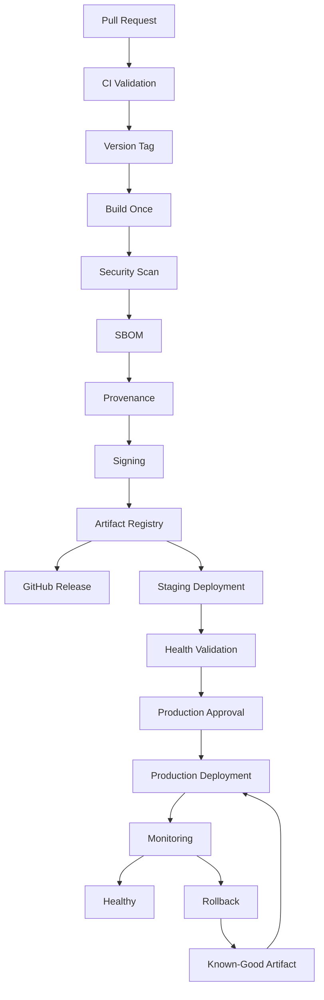

# 18- Release Automation Questions

## Overview

Release automation is the CI/CD layer responsible for turning validated source code into a controlled, traceable, repeatable software release.

A production release process typically connects:

```text
Pull Request
    ↓
Validation
    ↓
Build
    ↓
Artifact
    ↓
Version
    ↓
Release
    ↓
Environment Promotion
    ↓
Deployment
    ↓
Verification
    ↓
Monitoring
    ↓
Rollback
```

For GitHub Actions, release automation combines:

- Git events
- Tags
- Semantic versioning
- GitHub Releases
- Changelog generation
- Release artifacts
- Docker images
- Registries such as Amazon ECR
- Environment promotion
- Deployment approvals
- OIDC and AWS IAM
- Deployment concurrency
- Rollback
- Provenance and signing
- Release observability

The senior-level concern is not simply:

> "How do I create a release automatically?"

It is:

> "How do I design a release system that is reproducible, secure, auditable, recoverable, and safe to operate at scale?"

---

## Release Automation Fundamentals

### What is release automation?

Release automation automates the controlled transition from a validated software state to a versioned release.

A release may contain:

```text
Git commit
+
Version
+
Source archive
+
Python package
+
Docker image
+
Changelog
+
SBOM
+
Provenance
+
Release metadata
```

A deployment is related but not identical.

| Concept | Purpose |
|---|---|
| Build | Produce software artifacts |
| Release | Declare and package a software version |
| Promotion | Move an artifact between environments |
| Deployment | Run the artifact in an environment |
| Rollback | Restore a previously known-good version |

A release does not necessarily mean immediate production deployment.

---

## Why Automate Releases?

Manual release processes introduce:

- Human error
- Inconsistent versioning
- Missing artifacts
- Incorrect deployment targets
- Poor auditability
- Forgotten changelog updates
- Inconsistent Docker tags
- Difficult rollback

Automation provides:

```text
Repeatability
+
Consistency
+
Traceability
+
Auditability
+
Reduced manual work
```

Automation does not remove the need for controls.

Production releases may still require:

- Reviews
- Approvals
- Security checks
- Environment protection
- Deployment gates

---

## Release Lifecycle

A practical lifecycle is:

```mermaid
flowchart LR
    COMMIT[Source Commit] --> CI[CI Validation]
    CI --> BUILD[Build]
    BUILD --> ARTIFACT[Immutable Artifact]
    ARTIFACT --> VERSION[Version]
    VERSION --> RELEASE[GitHub Release]
    RELEASE --> STAGING[Staging]
    STAGING --> VERIFY[Verification]
    VERIFY --> APPROVAL[Production Approval]
    APPROVAL --> PROD[Production]
    PROD --> MONITOR[Monitoring]
    MONITOR --> ROLLBACK[Rollback]
```



The same artifact should ideally move through the environments.

---

## Release Sources

Common release triggers include:

- Git tags
- GitHub Releases
- Manual `workflow_dispatch`
- Release events
- Merge to a protected release branch
- Scheduled release processes
- External release orchestration

For production systems, tag-driven releases are often useful because the tag provides a stable source reference.

---

## Tag-Driven Releases

A workflow can trigger when a version tag is pushed.

Example:

```yaml
name: Release

on:
  push:
    tags:
      - "v*.*.*"

jobs:
  release:
    runs-on: ubuntu-latest
    steps:
      - name: Checkout
        uses: actions/checkout@<pinned-sha>

      - name: Display version
        run: echo "Release ${GITHUB_REF_NAME}"
```

A tag such as:

```text
v2.4.1
```

can become the release version.

---

## Why Use Git Tags?

Tags provide a stable reference to a specific Git object.

For example:

```text
v2.4.1
   ↓
commit abc123
```

This allows the release system to answer:

> Which exact source revision produced this release?

Tags are therefore useful for:

- Release traceability
- Versioning
- Reproducibility
- GitHub Releases
- Package versions
- Docker metadata

---

## Annotated vs Lightweight Tags

Git supports different tag types.

Annotated tags contain metadata and are generally preferable for formal releases.

Example:

```bash
git tag -a v2.4.1 -m "Release v2.4.1"
git push origin v2.4.1
```

The release workflow can then consume the tagged commit.

---

## Semantic Versioning

Semantic Versioning uses:

```text
MAJOR.MINOR.PATCH
```

Example:

```text
2.4.1
```

The intended semantics are:

| Component | Typical Meaning |
|---|---|
| MAJOR | Breaking API or contract changes |
| MINOR | Backward-compatible functionality |
| PATCH | Backward-compatible fixes |

Semantic versioning is a convention, not a substitute for compatibility testing.

---

## Pre-Releases

Pre-release versions can communicate release maturity.

Examples:

```text
2.5.0-alpha.1
2.5.0-beta.2
2.5.0-rc.1
```

Typical flow:

```text
Development
   ↓
Alpha
   ↓
Beta
   ↓
Release Candidate
   ↓
Stable
```

The exact lifecycle should be defined by the engineering organization.

---

## Version Source of Truth

A project should avoid maintaining conflicting versions in multiple places.

Potential version sources include:

```text
Git tag
pyproject.toml
package metadata
Docker tag
GitHub Release
API response
```

For a Python application, the version may be maintained in package metadata while the Git tag identifies the release.

The release workflow should validate that these values agree when the project requires strict consistency.

---

## Release Version Validation

A release workflow can validate the tag before publishing.

Example:

```yaml
- name: Validate version
  shell: bash
  run: |
    set -euo pipefail

    version="${GITHUB_REF_NAME#v}"

    if [[ ! "$version" =~ ^[0-9]+\.[0-9]+\.[0-9]+$ ]]; then
      echo "Invalid release version: $version"
      exit 1
    fi
```

Validation prevents malformed release tags from reaching downstream systems.

---

## Release Automation Architecture

A production release workflow should separate concerns:

```text
Release Workflow
├── Validate release
├── Build artifacts
├── Test artifacts
├── Generate metadata
├── Generate SBOM
├── Generate provenance
├── Publish artifacts
├── Create GitHub Release
├── Promote artifact
└── Deploy
```

Do not put the entire release process into one large step.

Separate jobs make:

- Permissions clearer
- Failure isolation easier
- Reruns safer
- Logs easier to understand
- Job dependencies explicit

---

## Build Once, Release Many

A strong release architecture is:

```text
Source
  ↓
Build
  ↓
Immutable Artifact
  ↓
Release
  ↓
Staging
  ↓
Production
```

Avoid:

```text
Build staging artifact
      ↓
Build production artifact
```

because two builds can produce different outputs.

The preferred model is:

```text
One artifact
    ↓
Many environments
```

---

## Immutable Artifact Identity

For Docker:

```text
repository
+
tag
+
digest
```

Example:

```text
123456789012.dkr.ecr.us-east-1.amazonaws.com/backend-api@sha256:...
```

The digest is the strongest artifact identity because it identifies the exact image content.

For Python packages:

```text
package name
+
version
+
distribution checksum
```

---

## Docker Release Automation

A backend release may build:

```text
Django/FastAPI application
        ↓
Docker image
        ↓
ECR
        ↓
ECS/Kubernetes/EC2
```

A production workflow should separate:

```text
Build
```

from:

```text
Deployment
```

where practical.

---

## Docker Image Tags

Useful tags include:

```text
backend-api:2.4.1
backend-api:git-8f31a21
backend-api:release-2.4.1
```

However, production deployment should preferably reference the immutable digest.

A useful metadata model is:

```text
Human-readable tag → navigation
Digest → exact artifact identity
Commit SHA → source identity
Release version → business/release identity
```

---

## Docker Build Example

```yaml
- name: Build image
  run: |
    docker build \
      --tag "$IMAGE_NAME:${GITHUB_REF_NAME}" \
      --tag "$IMAGE_NAME:${GITHUB_SHA}" \
      .
```

A production pipeline should additionally consider:

- Buildx
- Multi-stage builds
- Layer caching
- Vulnerability scanning
- SBOM
- Provenance
- Signing
- Registry permissions

---

## Amazon ECR Release Flow

A typical AWS flow is:

```text
GitHub Actions
      ↓
OIDC
      ↓
AWS STS
      ↓
IAM Role
      ↓
ECR
      ↓
Immutable Image
```

Avoid storing long-lived AWS access keys when OIDC is suitable.

---

## GitHub Actions OIDC

A deployment job may require:

```yaml
permissions:
  contents: read
  id-token: write
```

The IAM trust policy should restrict:

```text
Repository
+
Branch or tag
+
Environment
+
Audience
```

The build job should not automatically receive the deployment role.

---

## Release vs Deployment

A release can exist without immediate production deployment.

For example:

```text
v2.4.1
   ↓
GitHub Release
   ↓
Artifact published
   ↓
Staging
   ↓
Manual approval
   ↓
Production
```

This separation provides a useful control boundary.

---

## GitHub Releases

A GitHub Release typically associates:

```text
Tag
+
Release metadata
+
Description
+
Release artifacts
```

A release can serve as the human-readable record of what was shipped.

Useful information includes:

- Version
- Changes
- Breaking changes
- Security fixes
- Migration requirements
- Artifact references
- Deployment status

---

## Automated Changelog Generation

A release workflow can generate release notes from:

- Commit messages
- Pull requests
- Labels
- Conventional Commits
- Previous release metadata

A useful release structure is:

```text
Features
Bug Fixes
Breaking Changes
Security
Infrastructure
Dependencies
```

The exact format should be standardized.

---

## Conventional Commits

A common convention is:

```text
feat: add invoice API
fix: handle duplicate events
docs: update deployment guide
refactor: simplify repository layer
```

Breaking changes can be explicitly marked according to the chosen convention.

Conventional Commits can support automated release tooling, but the organization should define how commit types map to version changes.

---

## Changelog Quality

Automated changelogs should not merely dump every commit.

A production changelog should prioritize:

- User-visible changes
- API changes
- Breaking changes
- Security fixes
- Operational changes
- Migration requirements

Low-level implementation commits may not be useful to release consumers.

---

## Release Artifacts

A release may include:

```text
Source archive
Python wheel
Python source distribution
Docker image
SBOM
Provenance
Checksums
Deployment metadata
```

Artifact naming should be deterministic.

Example:

```text
backend-api-2.4.1-py3-none-any.whl
backend-api-2.4.1.tar.gz
backend-api-2.4.1.sbom.json
```

---

## Artifact Retention

Release artifacts should remain available for the period required by:

- Rollback
- Compliance
- Incident investigation
- Reproduction
- Customer support

Do not choose retention solely based on storage cost.

Balance:

```text
Retention
+
Storage cost
+
Recovery requirements
+
Compliance
```

---

## Release Metadata

Useful release metadata includes:

```text
Version
Commit SHA
Build ID
Workflow Run ID
Artifact Digest
Builder
Timestamp
Environment
Deployment ID
```

This allows an operator to trace:

```text
Production
    ↓
Deployment
    ↓
Artifact
    ↓
Workflow
    ↓
Commit
```

---

## Release Provenance

A release should ideally answer:

```text
What source produced it?
Which workflow built it?
Which runner built it?
Which dependencies were used?
Which artifact was published?
Which identity published it?
```

This is particularly important for security investigations.

---

## SBOM in Release Automation

An SBOM provides component visibility.

A release pipeline can produce:

```text
Application
   ↓
Build
   ↓
SBOM
   ↓
Artifact
```

The SBOM can be stored alongside the release or associated with the artifact.

---

## Artifact Signing

A stronger pipeline can use:

```text
Build
  ↓
Scan
  ↓
SBOM
  ↓
Provenance
  ↓
Sign
  ↓
Publish
```

Deployment systems can then verify artifact integrity before deployment.

---

## Release Security Boundary

A production release should not automatically inherit all CI privileges.

A useful model is:

```text
PR CI
  ↓
Build
  ↓
Artifact
```

then:

```text
Release
  ↓
Approval
  ↓
Deployment Identity
  ↓
Production
```

This separates validation from production authority.

---

## Environment Promotion

A common release lifecycle is:

```text
Development
    ↓
Staging
    ↓
Production
```

The same immutable artifact should move through the environments.

Environment-specific values should remain outside the artifact.

For example:

```text
Docker Image
    +
Staging configuration
```

versus:

```text
Docker Image
    +
Production configuration
```

The image remains unchanged.

---

## GitHub Environments

GitHub Environments can provide:

- Environment secrets
- Environment variables
- Required reviewers
- Deployment protection
- Deployment history

Typical environments:

```text
development
staging
production
```

Production should have stricter protection than development.

---

## Deployment Approvals

A production release can require an approval gate:

```text
Build
 ↓
Staging
 ↓
Validation
 ↓
Production Approval
 ↓
Production
```

Approval should occur after sufficient evidence exists.

Useful evidence includes:

- Test results
- Security scan
- Artifact digest
- Staging health
- Migration status
- Change summary

---

## Release Concurrency

Production deployments should generally not race each other.

Example:

```yaml
concurrency:
  group: production-deployment
  cancel-in-progress: false
```

This prevents simultaneous production deployments from competing for the same environment.

For pull requests, a different policy may be appropriate:

```yaml
concurrency:
  group: pr-${{ github.event.pull_request.number }}
  cancel-in-progress: true
```

The policy should match the operation.

---

## Release Race Condition

Consider:

```text
Release A → production deployment
Release B → production deployment
```

If both run simultaneously:

```text
A starts
B starts
A finishes
B finishes
```

The final production version may not correspond to the release an operator expected.

Deployment concurrency prevents this class of race.

---

## Release Idempotency

A release operation should be safe to retry.

For example:

```text
Create release
```

should not produce duplicate or inconsistent releases when retried.

Similarly:

```text
Publish artifact
Deploy artifact
Update release metadata
```

should have predictable retry behavior.

---

## Release Retry Strategy

Retries are appropriate for transient failures:

```text
Network timeout
Registry availability
Temporary API failure
Cloud API throttling
```

Retries are not a substitute for fixing:

```text
Invalid credentials
Invalid configuration
Broken artifact
Permission denial
Schema incompatibility
```

Use bounded retries with appropriate backoff.

---

## Release Workflow Example

```yaml
name: Release

on:
  push:
    tags:
      - "v*.*.*"

permissions:
  contents: read

concurrency:
  group: release-${{ github.ref }}
  cancel-in-progress: false

jobs:
  validate:
    runs-on: ubuntu-latest

    steps:
      - name: Checkout
        uses: actions/checkout@<pinned-sha>

      - name: Validate release
        run: |
          set -euo pipefail

          version="${GITHUB_REF_NAME#v}"

          [[ "$version" =~ ^[0-9]+\.[0-9]+\.[0-9]+$ ]] || {
            echo "Invalid version: $version"
            exit 1
          }

  build:
    needs: validate
    runs-on: ubuntu-latest

    steps:
      - name: Checkout
        uses: actions/checkout@<pinned-sha>

      - name: Build
        run: |
          python -m build

      - name: Upload artifacts
        uses: actions/upload-artifact@<pinned-sha>
        with:
          name: release-artifacts
          path: dist/

  release:
    needs: build
    runs-on: ubuntu-latest

    permissions:
      contents: write

    steps:
      - name: Checkout
        uses: actions/checkout@<pinned-sha>

      - name: Create release
        env:
          GH_TOKEN: ${{ github.token }}
        run: |
          gh release create "$GITHUB_REF_NAME" \
            --generate-notes \
            --verify-tag
```

The actual action references should be pinned according to the organization's supply chain policy.

---

## Release Workflow with Docker and AWS

A production-oriented architecture may look like:

```yaml
jobs:
  test:
    runs-on: ubuntu-latest

    steps:
      - uses: actions/checkout@<pinned-sha>

      - name: Run tests
        run: pytest

  build:
    needs: test
    runs-on: ubuntu-latest

    steps:
      - uses: actions/checkout@<pinned-sha>

      - name: Build image
        run: |
          docker build \
            --tag "$IMAGE_NAME:$GITHUB_SHA" \
            .

  publish:
    needs: build
    runs-on: ubuntu-latest

    permissions:
      contents: read
      id-token: write

    steps:
      - name: Configure AWS
        uses: aws-actions/configure-aws-credentials@<pinned-sha>
        with:
          role-to-assume: ${{ vars.AWS_RELEASE_ROLE }}
          aws-region: ${{ vars.AWS_REGION }}

      - name: Publish image
        run: ./scripts/publish-image.sh

  production:
    needs: publish
    runs-on: ubuntu-latest
    environment: production

    permissions:
      contents: read
      id-token: write

    steps:
      - name: Deploy immutable artifact
        run: ./scripts/deploy.sh
```

The important design point is privilege separation between validation, publishing, and production deployment.

---

## Release Branches

Some organizations use:

```text
main
release/*
hotfix/*
```

A release branch can stabilize a release while development continues on `main`.

Trade-offs include:

| Benefit | Cost |
|---|---|
| Stabilization window | Branch maintenance |
| Controlled release changes | Merge complexity |
| Predictable release candidate | Potential divergence |
| Dedicated QA | More workflow complexity |

Use release branches only when the development model requires them.

---

## Release Candidates

A release candidate can be promoted through staging before production.

Example:

```text
v2.5.0-rc.1
```

Lifecycle:

```text
Commit
 ↓
RC Build
 ↓
Staging
 ↓
Validation
 ↓
Production Decision
 ↓
Stable Release
```

The organization should define whether the exact RC artifact is promoted or whether a final artifact is produced from the same source.

For strict build-once systems, the artifact itself should remain the identity being promoted.

---

## Hotfix Releases

A hotfix should follow the same security and traceability controls as normal releases.

Example:

```text
Production v2.4.1
        ↓
Critical bug
        ↓
Hotfix branch
        ↓
Validation
        ↓
v2.4.2
        ↓
Release
        ↓
Production
```

Avoid bypassing the pipeline simply because the change is urgent.

Emergency procedures should be explicitly designed rather than improvised.

---

## Release Rollback

Rollback should reference a known-good artifact.

Example:

```text
Production
    ↓
v2.4.2
    ↓
Incident
    ↓
Rollback
    ↓
v2.4.1
```

For Docker:

```text
backend-api@sha256:KNOWN_GOOD
```

is preferable to:

```text
backend-api:latest
```

because the exact artifact is known.

---

## Database Migration and Releases

Database schema changes make rollback more complicated.

A deployment such as:

```text
Application v2
+
Database schema v2
```

may not be safely reversible if the application has already written data using the new schema.

Prefer expand-and-contract migrations.

```text
Expand
  ↓
Deploy compatible application
  ↓
Migrate data
  ↓
Switch application behavior
  ↓
Contract
```

This reduces release rollback risk.

---

## Django Release Automation

A Django deployment may require:

```text
Build
 ↓
pytest
 ↓
collectstatic
 ↓
Migration validation
 ↓
Docker image
 ↓
ECR
 ↓
ECS/EC2/Kubernetes
 ↓
Health check
```

Avoid blindly running destructive migrations as an implicit part of every rollback.

Database changes should be designed for forward and backward compatibility.

---

## FastAPI Release Automation

A FastAPI release commonly includes:

```text
pytest
+
API integration tests
+
OpenAPI contract checks
+
Docker build
+
Security scan
+
ECR
+
Deployment
```

If the service communicates through gRPC or REST with other services, release validation should consider API compatibility.

---

## Microservice Release Automation

For multiple services:

```text
Service A
Service B
Service C
Service D
```

avoid rebuilding and deploying every service for every release unless required.

Use change detection where appropriate:

```text
Changed service
      ↓
Relevant tests
      ↓
Relevant artifact
      ↓
Relevant deployment
```

However, dependency relationships must be understood before selectively releasing services.

---

## API Compatibility

Release automation should account for:

- REST API compatibility
- gRPC contracts
- Event schemas
- Kafka message formats
- Database schema
- External API dependencies

A deployment can be technically successful while breaking consumers.

---

## Kafka Release Considerations

For Kafka consumers/producers, release automation should consider:

```text
Message schema compatibility
Consumer compatibility
Producer compatibility
Deployment order
Rollback behavior
```

If a new producer emits data that the previous consumer cannot process, an application rollback may not restore system compatibility.

---

## Celery Release Considerations

Celery deployments may involve:

```text
Web workers
Celery workers
Celery Beat
Redis/RabbitMQ
```

A release should consider task compatibility.

If old workers may process tasks created by new workers, task payloads should remain backward compatible during rolling deployments.

---

## Redis Release Considerations

If Redis stores:

- Cache
- Sessions
- Locks
- Queues
- Application state

the release should understand which data is compatible across versions.

Cache invalidation may sometimes be safer than attempting to migrate incompatible cached structures.

---

## Release Observability

A release pipeline should expose:

```text
Release version
Commit SHA
Artifact digest
Deployment target
Deployment start time
Deployment duration
Deployment result
Health status
Rollback status
```

Useful metrics include:

- Deployment frequency
- Lead time for changes
- Change failure rate
- Time to restore
- Deployment duration
- Rollback frequency

These metrics help evaluate delivery reliability.

---

## Release Notifications

Useful notifications include:

```text
Release created
Staging deployed
Approval required
Production deployed
Deployment failed
Rollback executed
```

Notifications should contain actionable context:

```text
Service
Version
Commit
Environment
Status
Run URL
Artifact
```

Avoid sending sensitive information through notifications.

---

## Release Auditability

A production release should be traceable:

```text
GitHub Release
      ↓
Git Tag
      ↓
Commit
      ↓
Workflow Run
      ↓
Artifact
      ↓
Deployment
      ↓
Production
```

This chain is valuable during:

- Incidents
- Audits
- Rollbacks
- Customer investigations
- Security investigations

---

## Release Storage Strategy

A mature release system may use:

```text
GitHub
 ├── Source
 ├── Tags
 └── Releases

Artifact Registry
 └── Docker Images

Package Registry
 └── Python Packages

Object Storage
 └── Release Metadata / Reports
```

Each system should have a clear responsibility.

---

## Release Retention and Cost

Keeping every artifact indefinitely may increase storage costs.

However, deleting old artifacts too aggressively can make rollback and investigation difficult.

Define:

```text
Hot retention
+
Rollback retention
+
Compliance retention
+
Archive policy
```

For production systems, retain enough known-good versions to support realistic recovery scenarios.

---

## Release Failure Domains

| Failure | Example | Recovery |
|---|---|---|
| Validation | Tests fail | Fix source |
| Build | Docker build fails | Fix build |
| Publish | ECR push fails | Retry/fix credentials |
| Release | GitHub API fails | Retry |
| Staging | Health check fails | Investigate |
| Approval | Reviewer unavailable | Escalate |
| Production | Deployment fails | Rollback |
| Runtime | Service unhealthy | Rollback/incident response |

This classification prevents operators from applying the wrong remediation.

---

## Troubleshooting Release Automation

### Release Did Not Trigger

**Symptom**

The release tag was created but the workflow did not run.

**Possible Causes**

- Tag pattern mismatch
- Workflow file not present on the expected ref
- Incorrect event configuration
- Repository policy
- Tag not pushed

**Checks**

```bash
git tag
git ls-remote --tags origin
gh workflow list
gh run list
```

**Prevention**

Test the tag pattern with representative version values.

---

### Wrong Version Released

**Symptom**

The GitHub Release contains the wrong version.

**Possible Causes**

- Version source mismatch
- Incorrect tag parsing
- Manual version override
- Stale generated metadata

**Isolation**

Compare:

```text
Git tag
Git commit
Package version
Docker tag
GitHub Release
```

**Prevention**

Validate version consistency before publishing.

---

### Docker Image Does Not Match Release

**Symptom**

The release says `v2.4.1`, but production runs a different image.

**Checks**

```text
Release tag
Commit SHA
Image tag
Image digest
Deployment configuration
```

**Corrective Action**

Deploy the image identified by the expected digest.

**Prevention**

Record the digest in release metadata and promote the same digest.

---

### Release Was Published but Deployment Failed

Do not automatically delete the release.

A release and deployment are separate lifecycle states.

Example:

```text
Release: successful
Staging: successful
Production: failed
```

The correct response may be:

```text
Investigate
    ↓
Fix deployment issue
    ↓
Redeploy same artifact
```

rather than rebuilding.

---

### Two Releases Deployed Simultaneously

**Possible Cause**

Missing or incorrect concurrency configuration.

**Corrective Action**

Use a production deployment concurrency group.

```yaml
concurrency:
  group: production
  cancel-in-progress: false
```

The exact policy should reflect the organization's release model.

---

### Rollback Uses the Wrong Artifact

**Possible Cause**

Rollback is based on mutable tags.

Bad:

```text
service:latest
```

Better:

```text
service@sha256:...
```

Maintain a release history that maps versions to immutable artifacts.

---

## GitHub CLI for Release Operations

List releases:

```bash
gh release list
```

View a release:

```bash
gh release view v2.4.1
```

Create a release:

```bash
gh release create v2.4.1 --generate-notes
```

List workflow runs:

```bash
gh run list
```

Inspect a workflow run:

```bash
gh run view <run-id>
```

View logs:

```bash
gh run view <run-id> --log
```

Rerun a workflow:

```bash
gh run rerun <run-id>
```

The CLI is particularly useful for operational diagnosis and release management.

---

## Release Management Through `gh`

A practical incident workflow can be:

```bash
gh release view v2.4.1
gh run list
gh run view <run-id>
gh run view <run-id> --log
```

Then correlate the workflow with:

```text
Commit
Artifact
Deployment
Environment
```

---

## Release Automation Security Checklist

- [ ] Release workflows use least-privilege permissions.
- [ ] Production deployment uses a dedicated identity.
- [ ] GitHub Actions are trusted and pinned according to policy.
- [ ] Untrusted PR code cannot access production credentials.
- [ ] AWS authentication uses OIDC where appropriate.
- [ ] IAM trust policies are restrictive.
- [ ] Release tags are validated.
- [ ] Artifacts are immutable.
- [ ] Docker images are identified by digest.
- [ ] SBOMs are generated where required.
- [ ] Provenance is recorded.
- [ ] Artifacts can be verified.
- [ ] Production requires appropriate protection.
- [ ] Release history is auditable.
- [ ] Rollback artifacts are retained.

---

## Release Automation Reliability Checklist

- [ ] Release jobs are idempotent.
- [ ] Transient failures have bounded retries.
- [ ] Production deployment concurrency is controlled.
- [ ] Health checks validate deployments.
- [ ] Rollback is documented and tested.
- [ ] Database migrations are rollback-aware.
- [ ] Release metadata is preserved.
- [ ] Artifact retention supports recovery.
- [ ] Failed releases do not require unnecessary rebuilds.
- [ ] Deployment status is observable.
- [ ] Critical release failures generate actionable notifications.

---

## Senior Interview Questions

### How would you design an automated release pipeline for a Django service?

A strong design would be:

```text
Pull Request
    ↓
Lint
    ↓
Unit Tests
    ↓
Integration Tests
    ↓
Security Scan
    ↓
Merge
    ↓
Version Tag
    ↓
Build Docker Image
    ↓
Scan
    ↓
SBOM / Provenance
    ↓
ECR
    ↓
Staging
    ↓
Health Validation
    ↓
Production Approval
    ↓
Production
    ↓
Monitoring
    ↓
Rollback if Required
```

The key design principle is that the same immutable artifact is promoted.

---

### How would you prevent production from being deployed twice simultaneously?

Use a production-specific concurrency group:

```yaml
concurrency:
  group: production-deployment
  cancel-in-progress: false
```

Then combine it with:

- Environment protection
- Idempotent deployment
- Health checks
- Immutable artifacts

---

### How would you release a Docker image without rebuilding it for production?

Build once:

```text
Build
 ↓
Digest
 ↓
ECR
```

Deploy the digest to staging:

```text
ECR digest
 ↓
Staging
```

Then deploy the exact same digest:

```text
ECR digest
 ↓
Production
```

Do not execute a second Docker build.

---

### How would you implement automatic versioning?

One approach is:

```text
Conventional Commits
        ↓
Determine version
        ↓
Create Git tag
        ↓
Build
        ↓
Create GitHub Release
        ↓
Publish artifacts
```

The organization must define how commit types map to MAJOR, MINOR, and PATCH releases.

---

### How would you handle a failed production release?

First determine whether:

```text
Artifact is bad
```

or:

```text
Deployment mechanism is bad
```

If the artifact is known-good but deployment infrastructure failed, retrying the deployment may be appropriate.

If the application is unhealthy:

```text
Stop promotion
    ↓
Rollback to known-good artifact
    ↓
Validate health
    ↓
Investigate
```

Do not automatically rebuild unless the artifact itself needs to change.

---

## Senior Interview Scenario: Release Rollback

### Scenario

Version `v3.1.0` has been deployed to production and causes elevated API errors.

### Reasoning

First:

```text
Confirm impact
```

Then:

```text
Check health metrics
Check logs
Check deployment metadata
Identify previous known-good artifact
Verify digest
Rollback
Validate
Monitor
```

After stabilization:

```text
Determine root cause
Create fix
Test
Release new version
```

A rollback is an operational recovery mechanism, not a substitute for root-cause analysis.

---

## Senior Interview Scenario: Database Migration

### Scenario

A release contains an application change and database schema migration.

The critical question is:

> Can the old and new application versions safely operate against the database during the deployment window?

If not, a simple rolling deployment may be unsafe.

Prefer:

```text
Expand schema
    ↓
Deploy compatible application
    ↓
Migrate data
    ↓
Switch behavior
    ↓
Contract schema
```

This makes rolling and rollback strategies safer.

---

## Senior Interview Scenario: Release Artifact Compromise

### Scenario

A production Docker image may have been modified after release.

Do not rely on the tag alone.

Verify:

```text
Image digest
+
Registry history
+
Release metadata
+
Provenance
+
Signature
```

If integrity cannot be established, deploy a newly verified artifact.

---

## Senior Interview Scenario: Self-Hosted Release Runner

### Scenario

Production deployment requires access to a private AWS network.

A self-hosted runner is introduced.

The design should consider:

```text
Runner group
+
Restricted labels
+
Private subnet
+
Security groups
+
Ephemeral lifecycle
+
Minimal IAM
+
Environment protection
+
Deployment concurrency
+
Monitoring
```

The runner should not be reused for untrusted pull request execution.

---

## Release Architecture Trade-Offs

| Strategy | Benefits | Trade-offs |
|---|---|---|
| Tag-driven | Traceable | Requires tag discipline |
| Manual release | Explicit control | Human error |
| Automatic release | Fast | Requires strong safeguards |
| Build on deployment | Simple | Weak reproducibility |
| Build once/promote | Strong traceability | Requires artifact management |
| Rolling | Lower infrastructure overhead | Rollback can be gradual |
| Blue/Green | Fast rollback | Higher infrastructure cost |
| Canary | Progressive exposure | More routing/observability complexity |

The correct design depends on service risk, infrastructure, traffic characteristics, and organizational controls.

---

## Release Strategy for Microservices

For a large microservice platform:

```text
Repository
   ↓
Change Detection
   ↓
Service CI
   ↓
Artifact Build
   ↓
Security Validation
   ↓
Registry
   ↓
Service-specific Promotion
```

Avoid coupling unrelated services into one global release unless there is a real compatibility requirement.

For tightly coupled services, release orchestration may still be required.

---

## High Availability Considerations

Release automation should avoid creating a single point of failure.

Consider:

- Multiple runner capacity pools
- Reliable artifact storage
- Redundant deployment infrastructure
- Health checks
- Rollback capability
- Deployment concurrency
- Registry availability
- Cloud API retry handling

The release system should not become the availability bottleneck for the application platform.

---

## Disaster Recovery

A release process should support recovery after:

- Registry failure
- Runner failure
- GitHub workflow failure
- Deployment failure
- Region failure
- Artifact corruption
- Credential compromise

Retain:

```text
Known-good artifacts
+
Release metadata
+
Deployment configuration
+
Infrastructure definitions
```

DR depends on being able to reconstruct or redeploy a known-good system.

---

## Cost Considerations

Release automation consumes:

- Runner minutes
- Storage
- Registry storage
- Artifact storage
- Network bandwidth
- Security scanning resources

Optimize using:

- Dependency caching
- Docker layer caching
- Appropriate test matrices
- Selective builds
- Artifact retention policies
- Ephemeral environments where justified
- Parallel execution where it reduces total delivery time

Do not optimize cost by removing controls required for production safety.

---

## Common Mistakes

### Rebuilding for Production

```text
Staging build ≠ Production build
```

This weakens artifact consistency.

### Using `latest` as the Rollback Mechanism

Mutable tags make rollback ambiguous.

### Putting Deployment Credentials in CI Jobs

Build jobs should not automatically have production access.

### Allowing Untrusted PR Code to Run With Secrets

This creates a serious trust-boundary violation.

### No Release Concurrency

Multiple production releases can race.

### No Release Metadata

Without commit, digest, workflow, and deployment information, investigations become difficult.

### Treating GitHub Release Creation as Deployment

A release can be created successfully while deployment still fails.

### Relying on Manual Rollback

Rollback should be tested and operationally executable under pressure.

---

## Production Release Reference Architecture



---

## Production Release Checklist

### Versioning

- [ ] Version format is defined.
- [ ] Tags are validated.
- [ ] Version source of truth is clear.
- [ ] Pre-release strategy is defined.
- [ ] Release naming is consistent.

### Build

- [ ] CI completes successfully.
- [ ] Artifact is immutable.
- [ ] Docker image has a digest.
- [ ] Dependencies are controlled.
- [ ] Build metadata is recorded.

### Security

- [ ] Actions are trusted and pinned appropriately.
- [ ] Permissions are least privilege.
- [ ] Secrets are scoped.
- [ ] OIDC is used where appropriate.
- [ ] Artifact security checks pass.
- [ ] SBOM/provenance requirements are satisfied.

### Promotion

- [ ] Staging uses the release artifact.
- [ ] Production uses the same artifact.
- [ ] Approval gates are configured.
- [ ] Deployment concurrency is configured.
- [ ] Health validation runs after deployment.

### Operations

- [ ] Release metadata is searchable.
- [ ] Logs are available.
- [ ] Monitoring is connected.
- [ ] Rollback is documented.
- [ ] Known-good artifacts are retained.
- [ ] Incident response procedures exist.

---

## Key Takeaways

- **Release automation should create a traceable chain from a versioned Git commit to an immutable artifact, release, deployment, and production state.**
- **Build once and promote the same artifact across environments; use immutable identifiers such as Docker digests rather than mutable tags for production deployment and rollback.**
- **Separate CI validation, artifact publishing, and production deployment privileges using least-privilege permissions, GitHub Environments, concurrency controls, and OIDC-based AWS identity where appropriate.**
- **Production release automation must account for database compatibility, health validation, observability, idempotency, and rollback rather than treating deployment as a simple final workflow step.**
- **A senior release design is reproducible, auditable, secure, recoverable, and capable of explaining exactly which source, workflow, artifact, and deployment produced the current production state.**