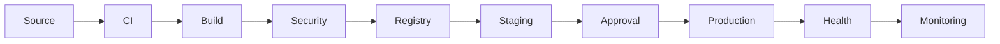
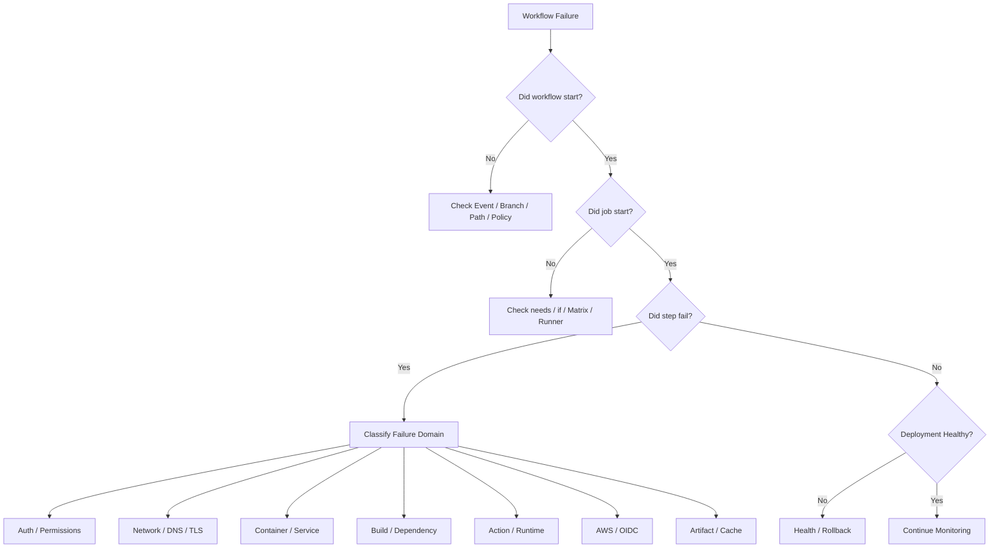
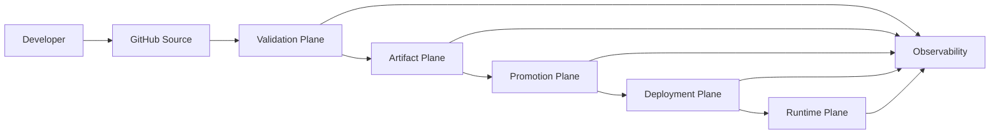

# 19- Troubleshooting Questions

## Overview

GitHub Actions troubleshooting is an engineering discipline rather than a process of repeatedly rerunning failed workflows.

A production CI/CD failure can originate from multiple layers:

```text
GitHub Event
    ↓
Workflow YAML
    ↓
Expression / Context
    ↓
Job Graph
    ↓
Runner
    ↓
Step / Action
    ↓
Container / Service
    ↓
Network
    ↓
Cloud Authentication
    ↓
Artifact / Registry
    ↓
Deployment
    ↓
Application
```

A useful troubleshooting model is:

```text
Symptom
  ↓
Possible Causes
  ↓
Isolation Strategy
  ↓
Commands / Checks
  ↓
Root Cause
  ↓
Corrective Action
  ↓
Prevention
```

Senior engineers should diagnose failures by narrowing the failure domain rather than changing multiple configuration variables simultaneously.

---

## Troubleshooting Mental Model

### Start With the First Meaningful Failure

A workflow can produce many secondary failures.

For example:

```text
PostgreSQL startup fails
        ↓
Integration tests fail
        ↓
Coverage job is skipped
        ↓
Artifact upload is skipped
        ↓
Release job is skipped
```

The first meaningful failure is:

```text
PostgreSQL startup
```

Do not begin by debugging the coverage or release jobs.

---

## Failure Domains

| Failure Domain | Typical Symptoms |
|---|---|
| Workflow syntax | Workflow never loads |
| Trigger | Workflow does not start |
| Filters | Expected branch/path does not execute |
| Expressions | Incorrect conditional behavior |
| Context | Empty or unexpected values |
| Permissions | `403`, `Resource not accessible` |
| Secrets | Empty/missing credentials |
| Matrix | Missing or duplicated jobs |
| Outputs | Downstream jobs receive incorrect values |
| Artifacts | Missing files or download failures |
| Cache | Slow builds or stale dependencies |
| Containers | Commands fail inside container |
| Services | Database/Redis unavailable |
| Actions | Action cannot execute |
| Runner | Job cannot start or tools are missing |
| OIDC | AWS role assumption fails |
| Docker | Build or push failure |
| Registry | Authentication or authorization failure |
| Deployment | Application does not become healthy |
| Concurrency | Releases race or cancel unexpectedly |
| Security | Workflow is blocked or exposes trust boundaries |

---

## First Response to a CI/CD Incident

Use a consistent sequence:

```text
1. Identify the failing workflow
2. Identify the failing job
3. Identify the first failed step
4. Capture the exact error
5. Classify the failure domain
6. Reproduce the smallest failing operation
7. Inspect configuration and context
8. Apply one corrective change
9. Rerun
10. Verify downstream behavior
11. Document the root cause
```

Avoid changing five things and then rerunning the pipeline.

You may get a green build without knowing why it became green.

---

## GitHub CLI Diagnostics

List workflows:

```bash
gh workflow list
```

List recent runs:

```bash
gh run list
```

Inspect a run:

```bash
gh run view <run-id>
```

View logs:

```bash
gh run view <run-id> --log
```

Inspect failed logs:

```bash
gh run view <run-id> --log-failed
```

Rerun a failed workflow:

```bash
gh run rerun <run-id>
```

Run a workflow manually:

```bash
gh workflow run release.yml
```

List releases:

```bash
gh release list
```

View a release:

```bash
gh release view <tag>
```

The CLI is particularly useful when diagnosing workflows without navigating through the GitHub UI.

---

## Workflow Syntax Failures

### Symptom

The workflow cannot be parsed or does not appear as a valid workflow.

### Possible Causes

- Invalid YAML
- Incorrect indentation
- Invalid key
- Incorrect expression syntax
- Unsupported configuration
- Incorrect data type

### Isolation Strategy

Validate the workflow before investigating runtime behavior.

```bash
git diff -- .github/workflows/
```

Use repository linting or YAML validation where available.

### Root Cause

The workflow definition itself is invalid.

### Corrective Action

Reduce the workflow to the smallest valid structure and incrementally restore configuration.

### Prevention

- Keep workflows modular.
- Use reusable workflows for repeated orchestration.
- Review YAML changes carefully.
- Avoid unnecessarily complex expressions.

---

## YAML Indentation Problems

This is invalid:

```yaml
jobs:
build:
  runs-on: ubuntu-latest
```

Correct:

```yaml
jobs:
  build:
    runs-on: ubuntu-latest
```

YAML indentation changes structure rather than merely formatting.

---

## Trigger Problems

### Symptom

A workflow does not run after a Git event.

### Possible Causes

- Incorrect event
- Branch filter mismatch
- Path filter mismatch
- Tag filter mismatch
- Workflow file not available on the expected branch
- Repository Actions policy
- Event-specific behavior

### Checks

```bash
gh workflow list
gh run list
git branch --show-current
git log -1 --oneline
git ls-remote --heads origin
```

Review:

```yaml
on:
  push:
    branches:
      - main
```

A push to:

```text
feature/payment-refactor
```

does not match this trigger.

---

## Branch Filter Troubleshooting

Example:

```yaml
on:
  push:
    branches:
      - main
      - release/**
```

Verify:

```text
Actual branch
Expected pattern
Event type
```

Common mistake:

```yaml
branches:
  - master
```

while the repository uses:

```text
main
```

---

## Path Filter Problems

Example:

```yaml
on:
  push:
    paths:
      - "backend/**"
```

A change only under:

```text
frontend/
```

does not satisfy the path filter.

For monorepos, path filters should be designed alongside dependency relationships.

A service may depend on shared code outside its own directory.

---

## Tag Filter Problems

Example:

```yaml
on:
  push:
    tags:
      - "v*.*.*"
```

This matches release-style tags such as:

```text
v2.4.1
```

but not necessarily:

```text
release-2.4.1
```

Verify the actual tag:

```bash
git tag --points-at HEAD
git ls-remote --tags origin
```

---

## Duplicate Workflow Runs

A common production problem is unintentionally triggering multiple workflows.

For example:

```text
push
+
pull_request
+
workflow_run
```

may create overlapping executions.

Investigate:

```bash
gh run list
```

Look at:

- Event
- Branch
- Commit
- Workflow
- Concurrency group

Use concurrency where appropriate.

---

## Manual Workflow Problems

For:

```yaml
on:
  workflow_dispatch:
```

verify that the workflow exists on the branch/ref from which you are invoking it.

Example:

```bash
gh workflow run deploy.yml --ref main
```

If inputs are required:

```bash
gh workflow run deploy.yml \
  --ref main \
  -f environment=staging
```

Validate the input value before using it in deployment commands.

---

## Expression Problems

GitHub Actions expressions use:

```yaml
${{ expression }}
```

Shell commands use:

```bash
$VARIABLE
```

They are evaluated at different stages.

Example:

```yaml
run: echo "${{ github.ref }}"
```

versus:

```yaml
run: echo "$GITHUB_REF"
```

Both can expose similar information, but they do not represent the same evaluation mechanism.

---

## Expression Evaluation Timing

A common mistake is assuming that a shell variable exists while the workflow expression is being evaluated.

Example:

```yaml
env:
  VERSION: "${{ github.ref_name }}"

steps:
  - run: echo "$VERSION"
```

The expression is evaluated by GitHub Actions, while `$VERSION` is interpreted by the shell.

Understand the boundary:

```text
GitHub expression evaluation
        ↓
Environment construction
        ↓
Shell execution
```

---

## Context Troubleshooting

Important contexts include:

| Context | Typical Information |
|---|---|
| `github` | Event, repository, ref, SHA |
| `env` | Environment variables |
| `vars` | Configuration variables |
| `secrets` | Secret values |
| `steps` | Previous step outputs |
| `needs` | Completed dependency jobs |
| `job` | Current job information |
| `runner` | Runner information |
| `matrix` | Current matrix values |
| `strategy` | Matrix strategy |
| `inputs` | Workflow/action inputs |

When troubleshooting, inspect non-sensitive metadata rather than dumping entire contexts.

Example:

```yaml
- name: Debug metadata
  run: |
    echo "Repository: $GITHUB_REPOSITORY"
    echo "Ref: $GITHUB_REF"
    echo "SHA: $GITHUB_SHA"
    echo "Run ID: $GITHUB_RUN_ID"
```

Do not print secrets.

---

## `if` Condition Problems

Consider:

```yaml
if: success()
```

A step normally runs only when previous required steps have succeeded.

For failure handling:

```yaml
if: failure()
```

For cleanup/reporting:

```yaml
if: always()
```

For cancellation-sensitive cleanup or reporting:

```yaml
if: ${{ !cancelled() }}
```

Use status functions intentionally.

---

## `always()` Pitfall

`always()` is frequently misunderstood.

It means the step is eligible to run regardless of previous step success/failure, but cancellation semantics still matter operationally.

Do not use:

```yaml
if: always()
```

as a universal cleanup mechanism without considering cancellation and whether the operation should run after an aborted workflow.

For important post-processing, define the desired behavior explicitly.

---

## `continue-on-error` Problems

Example:

```yaml
continue-on-error: true
```

allows a failure to be tolerated rather than immediately failing the job.

This is useful for controlled scenarios such as:

- Experimental matrix entries
- Non-blocking diagnostics
- Optional compatibility checks

It is dangerous when used to hide real production failures.

Avoid:

```yaml
continue-on-error: true
```

on critical validation or deployment steps without an explicit reason.

---

## Job Dependency Problems

Example:

```yaml
jobs:
  test:
    runs-on: ubuntu-latest

  deploy:
    needs: test
    runs-on: ubuntu-latest
```

If `test` fails, `deploy` will not normally execute.

If a downstream job unexpectedly skips, inspect:

```text
needs
if
status functions
upstream job result
```

---

## Matrix Problems

### Symptom

Expected matrix jobs are missing or unexpected combinations execute.

### Possible Causes

- Incorrect matrix dimensions
- `include` misuse
- `exclude` mismatch
- Dynamic JSON generation failure
- `fromJSON()` parsing problem
- `max-parallel`
- `fail-fast`

Example:

```yaml
strategy:
  matrix:
    python: ["3.11", "3.12"]
    database: ["postgres", "mysql"]
```

This creates:

```text
3.11 + postgres
3.11 + mysql
3.12 + postgres
3.12 + mysql
```

---

## Dynamic Matrix Troubleshooting

A planning job may produce JSON:

```yaml
jobs:
  plan:
    runs-on: ubuntu-latest
    outputs:
      matrix: ${{ steps.generate.outputs.matrix }}

    steps:
      - id: generate
        run: |
          echo 'matrix={"python":["3.11","3.12"]}' >> "$GITHUB_OUTPUT"
```

The downstream job:

```yaml
strategy:
  matrix: ${{ fromJSON(needs.plan.outputs.matrix) }}
```

If the matrix fails, inspect the exact output first.

Do not assume `fromJSON()` is the root cause.

---

## Matrix Failure Isolation

Check:

```text
Planning job
   ↓
Step output
   ↓
Job output
   ↓
needs.<job>.outputs
   ↓
fromJSON()
   ↓
Matrix expansion
```

A failure can originate at any stage.

---

## `fail-fast` Problems

Example:

```yaml
strategy:
  fail-fast: true
```

One matrix failure may cause other in-progress or queued matrix jobs to be cancelled according to matrix behavior.

Use:

```yaml
fail-fast: false
```

when complete compatibility information is more valuable than immediate cancellation.

For expensive release pipelines, balance:

```text
Feedback speed
+
Runner cost
+
Diagnostic completeness
```

---

## Artifact Problems

### Symptom

A later job cannot find an artifact.

### Possible Causes

- Upload step failed
- Incorrect artifact name
- Incorrect path
- Job never executed
- Artifact was uploaded conditionally
- Wrong workflow run
- Artifact retention expired

Example:

```yaml
- uses: actions/upload-artifact@<pinned-sha>
  with:
    name: test-report
    path: reports/
```

Later:

```yaml
- uses: actions/download-artifact@<pinned-sha>
  with:
    name: test-report
```

The names must match.

---

## Empty Artifact Problems

An artifact can exist but contain no useful files.

Check:

```bash
find reports -type f -maxdepth 3 -print
```

Before uploading:

```yaml
- name: Inspect reports
  if: always()
  run: |
    find reports -type f -print || true
```

This distinguishes:

```text
Upload failure
```

from:

```text
Nothing existed to upload
```

---

## Artifact vs Cache Troubleshooting

| Artifact | Cache |
|---|---|
| Build/test output | Reusable dependencies |
| Intended for transfer | Intended for speed |
| Explicitly produced | Reconstructable |
| Release/debugging | Performance optimization |
| Can support promotion | Should not define artifact identity |

Never use a dependency cache as the source of truth for a production release artifact.

---

## Cache Problems

### Symptom

Build is unexpectedly slow or appears to use stale dependencies.

### Possible Causes

- Cache miss
- Incorrect cache key
- Lock file not included
- Incorrect restore keys
- Cache invalidation
- Different OS/runtime
- Cache corruption

For Python:

```yaml
- uses: actions/setup-python@<pinned-sha>
  with:
    python-version: "3.12"
    cache: pip
    cache-dependency-path: requirements.lock
```

The dependency lock file should participate in cache invalidation.

---

## Cache Key Design

A useful cache identity may include:

```text
OS
+
Python version
+
Dependency lock hash
```

For example:

```text
Linux
Python 3.12
requirements.lock hash
```

Avoid excessively broad cache keys that allow incompatible dependencies to share state.

---

## Container Job Problems

### Symptom

A command works locally but fails in a GitHub Actions container.

Possible causes:

- Missing system packages
- Wrong working directory
- Different shell
- Missing environment variables
- Incorrect file permissions
- Different Python version
- Network configuration

Example:

```yaml
container:
  image: python:3.12-slim
```

The job now executes inside the specified container rather than directly on the host runner.

---

## Runner vs Container Networking

A major source of confusion is:

```text
Runner networking
```

versus:

```text
Container networking
```

When a job runs inside a container and uses service containers, the networking model differs from a normal host-based job.

Always determine:

```text
Where is the test process?
Where is PostgreSQL?
Where is Redis?
What hostname should be used?
```

Do not assume `localhost` is always correct.

---

## Service Container Problems

### Symptom

Django or FastAPI integration tests cannot connect to PostgreSQL.

Possible causes:

- Wrong hostname
- Wrong port
- Service not ready
- Wrong credentials
- Incorrect database name
- Container networking mismatch
- Database initialization failure

Example service:

```yaml
services:
  postgres:
    image: postgres:16
    env:
      POSTGRES_USER: app
      POSTGRES_PASSWORD: app
      POSTGRES_DB: app_test
    options: >-
      --health-cmd="pg_isready -U app -d app_test"
      --health-interval=10s
      --health-timeout=5s
      --health-retries=5
```

---

## PostgreSQL Diagnostics

From a suitable environment:

```bash
pg_isready -h postgres -U app -d app_test
```

Inspect environment configuration:

```bash
env | sort
```

Do not print secret values.

Check the database connection configuration used by Django or pytest.

---

## Redis Service Problems

Test connectivity:

```bash
redis-cli -h redis ping
```

Expected:

```text
PONG
```

Common causes:

- Wrong hostname
- Incorrect port
- Service unavailable
- Authentication mismatch
- Application configured for `localhost`

---

## MySQL Service Problems

Check:

```bash
mysqladmin ping \
  -h mysql \
  -u app \
  -p
```

Avoid placing passwords directly in shell history or command lines when possible.

---

## Service Readiness vs Container Startup

A container being started does not necessarily mean the service is ready.

```text
Container started
      ≠
Application ready
```

Use health checks and application-level readiness validation where appropriate.

---

## Custom Action Failures

### Symptom

A custom action fails even though the calling workflow appears correct.

Inspect:

```text
action.yml
Inputs
Outputs
Runtime
Shell
Dependencies
Working directory
Permissions
```

For composite actions:

```yaml
runs:
  using: composite
  steps:
    - shell: bash
      run: ./scripts/build.sh
```

The shell and execution environment matter.

---

## JavaScript Action Problems

For JavaScript actions inspect:

```text
action.yml
package.json
lock file
src/
dist/
Node runtime
```

A common production mistake is changing source code without regenerating the packaged `dist/` output expected by the action.

---

## Docker Action Problems

Docker-based actions have their own runtime environment.

Check:

```text
Dockerfile
ENTRYPOINT
Input handling
Environment variables
Mounted workspace
Runtime dependencies
```

Do not assume a Docker action behaves exactly like a composite or JavaScript action.

---

## Reusable Workflow Problems

### Symptom

A calling workflow cannot invoke a reusable workflow or receives incorrect inputs.

Check:

```text
workflow_call
inputs
secrets
outputs
permissions
repository/ref
```

Example:

```yaml
on:
  workflow_call:
    inputs:
      environment:
        required: true
        type: string
```

Caller:

```yaml
jobs:
  deploy:
    uses: org/platform/.github/workflows/deploy.yml@v2
    with:
      environment: production
```

---

## Reusable Workflow Permission Problems

Permissions do not become magically broader because a workflow is reusable.

Inspect:

```text
Caller permissions
Reusable workflow permissions
Job-level permissions
Environment protection
OIDC permission
```

For AWS OIDC, the deployment job may need:

```yaml
permissions:
  contents: read
  id-token: write
```

---

## Environment and Variable Problems

Distinguish:

```text
env
vars
secrets
```

They serve different purposes.

Common debugging questions:

- Is the variable defined?
- At what scope?
- Is an environment selected?
- Is the expected environment being used?
- Is a repository variable shadowing an assumption?
- Is a secret available to this event?

---

## `$GITHUB_ENV` Problems

To make a variable available to later steps:

```bash
echo "APP_VERSION=2.4.1" >> "$GITHUB_ENV"
```

Do not expect the variable to magically change the current shell process in ways unrelated to the supported environment-file mechanism.

---

## `$GITHUB_OUTPUT` Problems

Step outputs require an `id`.

```yaml
- id: version
  run: |
    echo "value=2.4.1" >> "$GITHUB_OUTPUT"
```

Reference:

```yaml
${{ steps.version.outputs.value }}
```

Common mistake:

```text
No step ID
```

or:

```text
Wrong output name
```

---

## Multiline Output Problems

Multiline values require the supported delimiter format.

For structured data, JSON is often safer.

Example:

```bash
{
  echo 'matrix<<EOF'
  cat matrix.json
  echo 'EOF'
} >> "$GITHUB_OUTPUT"
```

Be careful with untrusted content when constructing output values.

---

## Secret Problems

### Symptom

A secret appears empty.

Possible causes:

- Wrong secret scope
- Environment not selected
- Fork workflow
- Incorrect secret name
- Reusable workflow did not receive the secret
- Secret unavailable for the event

Check metadata, not the secret itself.

Bad:

```bash
echo "$SECRET"
```

Good:

```bash
if [[ -z "${SECRET:-}" ]]; then
  echo "Required secret is unavailable"
  exit 1
fi
```

---

## Secret Masking Limitations

Masking should not be treated as a guarantee that arbitrary sensitive data is safe to print.

Avoid:

```bash
set -x
```

around commands containing secrets.

Avoid passing secrets as command-line arguments when a safer environment or configuration mechanism exists.

---

## `secrets: inherit` Problems

Reusable workflows can receive secrets explicitly or through supported inheritance.

Example:

```yaml
jobs:
  deploy:
    uses: org/platform/.github/workflows/deploy.yml@v2
    secrets: inherit
```

Use inheritance only when the reusable workflow genuinely needs the available secrets.

Prefer explicit secret interfaces for sensitive reusable workflows where practical.

---

## Fork Pull Request Problems

Forked pull requests create a trust boundary.

Do not assume that:

```text
Repository code
```

and:

```text
Fork contribution
```

have equivalent trust.

Avoid giving untrusted pull request code access to:

- Production secrets
- Cloud credentials
- Deployment environments
- Highly privileged tokens
- Sensitive private networks

---

## `pull_request` vs `pull_request_target`

`pull_request` executes in the pull request context and is generally the safer model for untrusted validation.

`pull_request_target` runs in the base repository context and therefore requires particular caution.

Dangerous design:

```text
pull_request_target
+
checkout attacker-controlled code
+
execute code
+
production secrets
```

This can turn a pull request into a credential-exfiltration path.

---

## Script Injection Problems

Untrusted GitHub metadata can become shell code if interpolated unsafely.

Dangerous pattern:

```yaml
run: echo "${{ github.event.pull_request.title }}"
```

A malicious title can affect shell parsing.

Prefer passing data through environment variables:

```yaml
env:
  PR_TITLE: ${{ github.event.pull_request.title }}

run: |
  printf '%s\n' "$PR_TITLE"
```

The same principle applies to:

- Branch names
- Commit messages
- Issue content
- Workflow inputs
- Repository dispatch payloads

---

## Python Subprocess Problems

Avoid:

```python
subprocess.run(
    f"docker tag {user_input}",
    shell=True,
    check=True,
)
```

Prefer argument arrays:

```python
subprocess.run(
    ["docker", "tag", image, target],
    check=True,
)
```

Validate values before passing them to external commands.

---

## Permissions Problems

### Symptom

An action receives:

```text
403
Resource not accessible
Permission denied
```

Check:

```yaml
permissions:
  contents: read
```

and determine whether the operation requires something more.

For example:

```yaml
permissions:
  contents: write
```

may be required for a release operation.

Do not immediately grant:

```yaml
permissions: write-all
```

That hides the actual authorization requirement and increases blast radius.

---

## GITHUB_TOKEN Troubleshooting

Determine:

```text
Which job is executing?
Which event triggered it?
What permissions were configured?
Is a fork involved?
Is the operation repository-scoped?
```

A permission that exists in one job does not automatically mean every job has the same permission.

Prefer job-level permissions for privileged operations.

---

## OIDC Failure Troubleshooting

### Symptom

AWS role assumption fails with:

```text
AccessDenied
```

or similar STS errors.

### Check

```text
id-token: write
OIDC provider
AWS account
IAM role ARN
Trust policy
Subject claim
Audience
Repository
Branch/tag
Environment
```

GitHub Actions job:

```yaml
permissions:
  contents: read
  id-token: write
```

AWS identity check:

```bash
aws sts get-caller-identity
```

---

## IAM Trust Policy Problems

A GitHub OIDC trust policy may restrict:

```text
repo:ORG/REPO:ref:refs/heads/main
```

or an environment-based subject.

If the workflow runs from:

```text
release/v2
```

while the trust policy allows only:

```text
main
```

role assumption can fail even though the IAM permission policy is correct.

Separate:

```text
Trust policy
```

from:

```text
Permission policy
```

when debugging.

---

## AWS Credential Source Confusion

A workflow may unexpectedly use credentials from:

- Environment variables
- AWS credential files
- OIDC
- Instance roles
- Container credentials

Run:

```bash
aws sts get-caller-identity
```

before performing a sensitive AWS operation.

This establishes the identity actually being used.

---

## ECR Authentication Problems

Typical failure domains:

```text
AWS authentication
Repository permissions
ECR login
Registry URL
Region
Image tag
Network
```

Diagnostics:

```bash
aws sts get-caller-identity
aws ecr describe-repositories --repository-names backend-api
aws ecr get-login-password --region "$AWS_REGION"
```

Do not debug Docker credentials before confirming the AWS identity.

---

## Docker Build Failures

### Symptom

Docker build fails in CI but works locally.

Check:

```text
Docker version
Build context
.dockerignore
Base image
Architecture
Network
Build arguments
Secrets
Dependency availability
```

Inspect the context:

```bash
docker build --progress=plain .
```

Use BuildKit output when diagnosing layer failures.

---

## Docker Build Context Problems

A common failure is:

```dockerfile
COPY requirements.txt .
```

while:

```text
requirements.txt
```

is excluded by `.dockerignore`.

Inspect:

```text
Dockerfile
.dockerignore
Build context
```

Do not assume a file visible locally is necessarily included in the build context.

---

## Docker Layer Cache Problems

If a dependency layer is invalidated unnecessarily, builds become slow.

Bad ordering:

```dockerfile
COPY . .
RUN pip install -r requirements.txt
```

A source-code change invalidates the dependency layer.

Better:

```dockerfile
COPY requirements.txt .
RUN pip install --no-cache-dir -r requirements.txt

COPY . .
```

This improves cache reuse.

---

## Multi-Platform Build Problems

A build may succeed for:

```text
linux/amd64
```

but fail for:

```text
linux/arm64
```

or the resulting image may contain incompatible native dependencies.

Check:

```text
Target platforms
Base image support
Python wheels
Native packages
Buildx configuration
```

---

## Registry Failures

### Symptom

Docker push fails.

Possible causes:

- Authentication
- IAM permissions
- Repository missing
- Incorrect registry URL
- Region mismatch
- Network failure
- Tag problem
- Registry quota/storage issue

Isolate:

```text
AWS identity
   ↓
Repository existence
   ↓
Registry authentication
   ↓
Docker tag
   ↓
Docker push
```

---

## Deployment Failures

A successful workflow does not guarantee a healthy application.

Deployment validation should check:

```text
Process started
+
Health endpoint
+
Readiness
+
Dependencies
+
Application metrics
```

For a FastAPI service:

```text
/health
/readiness
```

can provide operational signals when designed appropriately.

---

## Kubernetes Deployment Problems

Useful checks:

```bash
kubectl get pods
kubectl get deployments
kubectl describe deployment <name>
kubectl describe pod <name>
kubectl logs <pod>
```

Look for:

- Image pull failures
- Readiness probe failures
- Crash loops
- Resource limits
- Configuration errors
- Secret/config problems

---

## ECS Deployment Problems

Useful checks:

```bash
aws ecs describe-services \
  --cluster production \
  --services backend-api
```

Then inspect:

- Desired count
- Running count
- Pending count
- Deployment state
- Task failures
- Health checks

If the image is wrong, verify the deployed digest rather than only the tag.

---

## EC2 Deployment Problems

Check:

```text
systemd
application process
Nginx
security groups
disk
memory
CPU
environment configuration
deployment directory
release symlink
```

Useful commands:

```bash
systemctl status backend.service
journalctl -u backend.service -n 200
df -h
free -m
```

For Django/FastAPI deployments, verify both the application process and the reverse proxy path.

---

## Nginx Troubleshooting

If deployment succeeds but the API is unavailable:

```text
Client
 ↓
Nginx
 ↓
Gunicorn/Uvicorn
 ↓
Application
 ↓
Database/Redis
```

Check:

```bash
nginx -t
systemctl status nginx
journalctl -u nginx -n 200
```

Then verify the upstream application independently.

---

## Database Migration Failures

A migration failure can leave deployment partially complete.

Determine:

```text
Was application deployed?
Was migration executed?
Was migration transactional?
Did schema change partially apply?
Are old application versions still running?
```

Do not immediately rerun migrations blindly.

Inspect the database state first.

---

## Concurrency Problems

### Symptom

Two deployments interfere with each other.

Possible causes:

- Missing concurrency group
- Incorrect group key
- `cancel-in-progress: true` on production
- Multiple workflows deploying the same environment
- Manual and automated deployment paths

Use:

```yaml
concurrency:
  group: production-deployment
  cancel-in-progress: false
```

for a serialized production deployment model.

---

## Race Conditions in Promotion

Consider:

```text
Release A → staging
Release B → staging
Release A → production
Release B → production
```

If staging state is shared, release A may be validated against a state different from what reaches production.

Promotion systems should associate validation evidence with the immutable artifact being promoted.

---

## Security-Related Failures

Security controls can intentionally cause a workflow to fail.

Examples:

```text
Action blocked by policy
Insufficient permissions
OIDC trust rejected
Secret unavailable
Artifact verification failed
Environment approval missing
Self-hosted runner restricted
```

Do not immediately bypass the security control.

Determine:

```text
What control blocked execution?
Why did it block execution?
Is the workflow configuration wrong?
Is the requested operation actually unauthorized?
```

---

## Third-Party Action Failure

Check:

```text
Action version
Commit SHA
Runtime
Inputs
Permissions
Marketplace/repository availability
Dependency changes
```

If an action recently changed, compare the previous known-good version.

For security-sensitive actions, pinning and controlled upgrades reduce unexpected changes.

---

## Self-Hosted Runner Failures

### Symptom

A job remains queued or fails immediately.

Check:

```text
Runner online status
Labels
Runner group
Repository access
Runner version
OS
Capacity
Network
```

CLI and repository settings should be inspected before modifying the workflow.

---

## Runner Capacity Problems

If jobs remain queued:

```text
Requested label
      ↓
Runner group
      ↓
Eligible runners
      ↓
Available capacity
```

A runner can be online but still not be eligible because:

- Label mismatch
- Group restriction
- Repository restriction
- Busy runner
- Offline runner
- Capacity exhaustion

---

## Ephemeral Runner Failures

For ephemeral runners inspect:

```text
Provisioning
 ↓
Registration
 ↓
Job assignment
 ↓
Execution
 ↓
Cleanup
```

A failure can occur before the workflow even begins.

Collect:

- Provisioning logs
- Runner registration logs
- Cloud instance/container logs
- Runner service logs

---

## Runner Resource Failures

Check:

```bash
df -h
free -m
nproc
ulimit -a
```

Common symptoms:

- Disk full
- Out of memory
- Process limits
- File descriptor exhaustion
- CPU starvation

Persistent runners are particularly susceptible to state accumulation.

---

## Private Network Failures

A self-hosted runner accessing private services may encounter:

```text
DNS
Routing
Security groups
NACLs
Proxy
Firewall
TLS
VPC endpoints
```

Troubleshoot in order:

```text
DNS resolution
 ↓
Network connectivity
 ↓
Port reachability
 ↓
TLS
 ↓
Authentication
 ↓
Application protocol
```

Do not debug application credentials when the TCP connection cannot be established.

---

## Network Diagnostics

Useful commands include:

```bash
getent hosts database.internal
curl -v https://service.internal/health
nc -vz database.internal 5432
```

Use commands appropriate to the runner environment.

Avoid exposing credentials in verbose output.

---

## DNS vs Application Failure

If:

```bash
getent hosts api.internal
```

fails, investigate DNS.

If DNS works but:

```bash
curl -v https://api.internal/health
```

fails, investigate:

```text
Routing
Firewall
TLS
Load balancer
Application
```

Always isolate the network layer before changing application code.

---

## Production CI/CD Failure

A production pipeline should be modeled as multiple independent failure domains:



A failure in one stage should not be confused with a failure in another.

---

## Production Deployment Failed After Approval

Do not automatically rebuild.

First determine:

```text
Artifact identity
Deployment target
Deployment mechanism
Infrastructure state
Health status
```

If the artifact is known-good:

```text
Retry deployment
```

may be appropriate.

If the application itself is defective:

```text
Rollback
```

may be required.

---

## Failed Deployment With Healthy Application

Sometimes the deployment command reports failure while the application is actually healthy.

For example:

```text
Deployment API timeout
```

does not necessarily mean:

```text
Application deployment failed
```

Check actual state before retrying.

Blind retries can create duplicate or conflicting deployments.

---

## Idempotency During Troubleshooting

Before rerunning a failed deployment, ask:

```text
Is this operation idempotent?
```

For example:

```text
Create resource
Update resource
Deploy artifact
Run migration
Publish release
```

may have different retry characteristics.

Understand the current state before repeating side effects.

---

## Release Rollback Troubleshooting

A rollback should identify:

```text
Current artifact
Known-good artifact
Deployment target
Configuration
Database compatibility
External dependencies
```

A rollback is not safe if:

```text
Old application
```

cannot operate with:

```text
Current database schema
```

or:

```text
Current event/message format
```

---

## Debugging Django Applications

Useful CI checks:

```bash
python manage.py check
python manage.py showmigrations
pytest -q
```

For deployment:

```text
Application startup
Database connectivity
Migration state
Static assets
Environment configuration
Redis connectivity
Celery compatibility
```

---

## Debugging FastAPI Applications

Useful checks:

```bash
pytest -q
```

and a local health check:

```bash
curl -f http://127.0.0.1:8000/health
```

For production:

```text
Uvicorn/Gunicorn
Nginx/load balancer
Readiness
Database
Redis
External dependencies
```

---

## Debugging Celery

Check:

```text
Broker availability
Worker process
Task registration
Task payload compatibility
Queue routing
Worker version
```

A release can appear healthy at the HTTP layer while background processing is broken.

---

## Debugging Kafka

Check:

```text
Broker connectivity
Topic
Consumer group
Partition assignment
Schema compatibility
Consumer lag
Producer errors
```

A successful application deployment does not prove event processing is healthy.

---

## Failure Evidence

Capture:

```text
Workflow URL
Run ID
Commit SHA
Branch/tag
Failed job
Failed step
Exact error
Runner
Environment
Artifact
Deployment target
Relevant logs
```

Do not rely on memory during production incidents.

---

## Step Summary for Diagnostics

GitHub Actions step summaries can provide concise operational information.

Example:

```yaml
- name: Write diagnostic summary
  if: failure()
  run: |
    {
      echo "## Deployment Diagnostics"
      echo ""
      echo "- Commit: $GITHUB_SHA"
      echo "- Ref: $GITHUB_REF_NAME"
      echo "- Run: $GITHUB_RUN_ID"
    } >> "$GITHUB_STEP_SUMMARY"
```

Never put secrets into summaries.

---

## Debug Logging

GitHub Actions provides debugging mechanisms that can provide additional execution information.

Use them selectively.

Debug logging can expose more operational detail, so ensure sensitive values are not accidentally emitted.

Avoid leaving unnecessary verbose debugging enabled permanently in production workflows.

---

## Troubleshooting Decision Tree



---

## Troubleshooting by Layer

| Layer | First Question |
|---|---|
| Event | Did the workflow trigger? |
| Workflow | Is the YAML valid? |
| Job graph | Why was this job skipped? |
| Expression | What value was evaluated? |
| Runner | Where did execution occur? |
| Step | What exact command failed? |
| Container | What environment executed it? |
| Network | Can the target be reached? |
| Auth | Which identity is being used? |
| Artifact | Is the expected artifact present? |
| Deployment | Did the target actually change? |
| Application | Is the service healthy? |

---

## Troubleshooting Commands Reference

| Problem | Command |
|---|---|
| List workflows | `gh workflow list` |
| List runs | `gh run list` |
| Inspect run | `gh run view <id>` |
| View logs | `gh run view <id> --log` |
| Failed logs | `gh run view <id> --log-failed` |
| Rerun | `gh run rerun <id>` |
| AWS identity | `aws sts get-caller-identity` |
| ECR repositories | `aws ecr describe-repositories` |
| Docker build | `docker build --progress=plain .` |
| PostgreSQL readiness | `pg_isready` |
| Redis readiness | `redis-cli ping` |
| DNS | `getent hosts <host>` |
| TCP connectivity | `nc -vz <host> <port>` |
| HTTP diagnostics | `curl -v <url>` |
| Disk | `df -h` |
| Memory | `free -m` |
| CPU count | `nproc` |
| Nginx validation | `nginx -t` |
| systemd status | `systemctl status <service>` |
| Kubernetes pods | `kubectl get pods` |
| Kubernetes logs | `kubectl logs <pod>` |

---

## Troubleshooting Anti-Patterns

### Random Configuration Changes

Changing:

```text
permissions
+
secrets
+
runner
+
Dockerfile
```

simultaneously destroys diagnostic clarity.

### Blind Reruns

A rerun can be useful for transient failures, but it should not replace diagnosis.

### Overusing `continue-on-error`

This can convert a real failure into a misleading green pipeline.

### Printing Secrets

Never debug authentication by printing credentials.

### Giving Everything Write Permission

`write-all` may hide the actual authorization problem and increase risk.

### Rebuilding Instead of Reusing

If a deployment fails, do not automatically rebuild a supposedly immutable artifact.

### Ignoring the First Failure

Secondary failures often obscure the root cause.

### Assuming `localhost`

Containerized CI frequently changes networking semantics.

---

## Production Troubleshooting Runbook

When a production deployment fails:

```text
1. Freeze further deployments if necessary.
2. Identify the exact release and artifact.
3. Check deployment state.
4. Check application health.
5. Check infrastructure health.
6. Check logs and metrics.
7. Determine whether the artifact or deployment mechanism failed.
8. Roll back if the application is unhealthy.
9. Verify recovery.
10. Preserve evidence.
11. Identify root cause.
12. Implement prevention.
```

The goal is:

```text
Restore service
    ↓
Preserve evidence
    ↓
Understand failure
    ↓
Prevent recurrence
```

---

## Troubleshooting and Observability

CI/CD observability should connect:

```text
Workflow
 ↓
Build
 ↓
Artifact
 ↓
Deployment
 ↓
Runtime
```

Useful identifiers include:

```text
Commit SHA
Workflow Run ID
Release Version
Artifact Digest
Deployment ID
Environment
```

These identifiers should be available in logs and operational metadata.

---

## Reliability Improvements After Incidents

After resolving a failure, ask:

- Can the failure be detected earlier?
- Can the failure be isolated?
- Can the operation be retried safely?
- Can the pipeline provide better diagnostics?
- Can the same failure be prevented?
- Should a health gate be added?
- Should permissions be narrowed?
- Should the artifact become immutable?
- Should deployment concurrency change?
- Should a test cover the failure mode?

The best troubleshooting outcome is not merely a successful rerun.

It is a pipeline that is less likely to fail in the same way.

---

## Architecture: Production CI/CD Troubleshooting

A mature architecture separates:

```text
Validation Plane
    ↓
Artifact Plane
    ↓
Promotion Plane
    ↓
Deployment Plane
    ↓
Runtime Plane
```

Each plane has different failure modes and permissions.



This separation reduces blast radius and makes troubleshooting more systematic.

---

## Senior Interview Questions

### How would you troubleshoot a workflow that never starts?

Investigate:

```text
Event
 ↓
Branch/tag/path filters
 ↓
Workflow availability
 ↓
Repository Actions policy
 ↓
Event permissions
```

Use:

```bash
gh workflow list
gh run list
```

Do not begin by debugging job steps that never executed.

---

### A Job Is Skipped. What Do You Check?

Check:

```text
needs
if
upstream result
matrix
event context
environment protection
```

Then determine whether the job was:

```text
Skipped intentionally
```

or:

```text
Skipped unexpectedly
```

---

### Tests Work Locally but Fail in GitHub Actions. What Do You Check?

Compare:

```text
Python version
OS
Environment variables
Dependencies
Database
Redis
Network
Filesystem
Time zone
External services
```

Then reproduce the smallest failing test in the CI-equivalent environment.

---

### PostgreSQL Is Running but Tests Cannot Connect. What Do You Do?

Check:

```text
Where tests execute
Where PostgreSQL executes
Hostname
Port
Credentials
Database name
Health status
Network
```

Do not assume `localhost`.

---

### AWS OIDC Authentication Fails. What Do You Check?

Check:

```text
id-token: write
OIDC provider
Role ARN
Trust policy
Subject
Audience
Repository
Branch/tag/environment
AWS account
```

Then run:

```bash
aws sts get-caller-identity
```

after successful authentication to confirm identity.

---

### A Docker Build Works Locally but Fails in CI. What Is Your Process?

Check:

```text
Build context
.dockerignore
Base image
Architecture
Dependency availability
Network
Build arguments
Build secrets
Build cache
Docker/Buildx versions
```

Use:

```bash
docker build --progress=plain .
```

to expose build-stage diagnostics.

---

### Production Deployment Failed After the Image Was Published. Would You Rebuild?

Not automatically.

First determine whether:

```text
Image is defective
```

or:

```text
Deployment mechanism failed
```

If the artifact is valid, reuse the same immutable artifact.

---

### How Would You Prevent a Troubleshooting Rerun From Deploying Twice?

Use:

```text
Concurrency
+
Idempotent deployment
+
Immutable artifact identity
+
Environment protection
```

A rerun should have predictable side effects.

---

### How Would You Troubleshoot a Third-Party Action That Suddenly Started Failing?

Check:

```text
Action version
Commit SHA
Release changes
Runtime
Inputs
Permissions
Dependencies
```

Compare the current action reference with the last known-good reference.

---

### How Would You Debug a Security Failure Without Weakening Security?

Do not bypass the control immediately.

Determine:

```text
Which control failed?
Why did it fail?
What trust boundary is involved?
What minimum permission is required?
```

Then correct the configuration while preserving least privilege.

---

## Senior Scenario: Production Deployment Race

### Scenario

Two engineers merge changes close together and both releases attempt production deployment.

### Investigation

Check:

```text
Workflow runs
Release versions
Concurrency groups
Deployment timestamps
Artifact digests
Environment history
```

### Corrective Design

Use:

```yaml
concurrency:
  group: production-deployment
  cancel-in-progress: false
```

and associate each deployment with an immutable artifact.

---

## Senior Scenario: Compromised Runner

### Scenario

A self-hosted runner may have executed untrusted code.

Treat the runner as potentially compromised.

Actions may include:

```text
Stop scheduling work
 ↓
Isolate runner
 ↓
Revoke credentials
 ↓
Inspect evidence
 ↓
Replace runner
 ↓
Rebuild trusted image
 ↓
Validate runner configuration
 ↓
Resume workloads
```

Persistent runners increase the importance of cleanup and isolation.

---

## Senior Scenario: Artifact and Deployment Mismatch

### Scenario

Production reports version `2.7.0`, but the deployed Docker image appears to contain code from another commit.

Trace:

```text
Production deployment
 ↓
Image digest
 ↓
ECR image
 ↓
Release metadata
 ↓
Workflow run
 ↓
Commit SHA
```

If the chain cannot be reconstructed, the release system lacks sufficient artifact traceability.

---

## Senior Scenario: Intermittent CI Failure

### Scenario

The same test fails approximately one out of twenty runs.

Do not simply increase retries.

Investigate:

```text
Shared state
Race conditions
Timing
External dependencies
Database isolation
Parallelism
Resource exhaustion
Test ordering
Network
Randomness
```

Retries can reduce visibility into flaky behavior.

The long-term goal is deterministic testing.

---

## Senior Scenario: Pipeline Is Too Slow

Profile:

```text
Queue time
Dependency installation
Test execution
Matrix cardinality
Docker build
Docker push
Security scanning
Artifact upload
Deployment
```

Possible improvements:

- Dependency caching
- Docker layer caching
- Parallel jobs
- Test sharding
- Selective matrix dimensions
- Change detection
- Reusable workflows
- Better runner capacity

Do not optimize blindly.

Measure where time is actually being spent.

---

## Senior Scenario: CI Is Expensive

Analyze:

```text
Runner minutes
Matrix size
Repeated builds
Docker builds
Cache hit rate
Artifact storage
Integration test duration
E2E frequency
```

Possible controls:

```text
PR → fast validation
Nightly → broad matrix
Release → full validation
Production → protected deployment
```

The objective is to align validation cost with risk.

---

## Troubleshooting Checklist

### Workflow

- [ ] Workflow syntax is valid.
- [ ] Trigger is correct.
- [ ] Branch/path/tag filters match.
- [ ] Repository policy permits execution.

### Job Graph

- [ ] `needs` is correct.
- [ ] `if` conditions are correct.
- [ ] Matrix is correct.
- [ ] Required runners are available.

### Runtime

- [ ] Correct runner.
- [ ] Correct Python/runtime version.
- [ ] Dependencies installed.
- [ ] Working directory correct.
- [ ] Required tools available.

### Containers

- [ ] Correct image.
- [ ] Correct networking.
- [ ] Services are ready.
- [ ] Ports are correct.
- [ ] Environment variables are correct.

### Security

- [ ] Permissions are sufficient but minimal.
- [ ] Secrets are available.
- [ ] Secrets are not printed.
- [ ] Untrusted input is handled safely.
- [ ] Third-party actions are trusted and appropriately pinned.

### AWS

- [ ] OIDC permission exists.
- [ ] Correct role is assumed.
- [ ] Trust policy matches.
- [ ] AWS account is correct.
- [ ] Resource permissions are sufficient.

### Deployment

- [ ] Correct artifact.
- [ ] Correct digest.
- [ ] Correct environment.
- [ ] Concurrency is controlled.
- [ ] Health checks pass.
- [ ] Rollback is available.

### Operations

- [ ] Logs preserved.
- [ ] Run ID recorded.
- [ ] Artifact identity recorded.
- [ ] Incident evidence preserved.
- [ ] Root cause documented.
- [ ] Prevention action identified.

---

## Key Takeaways

- **Troubleshoot GitHub Actions by failure domain and isolate the first meaningful failure instead of reacting to secondary errors or repeatedly rerunning the workflow.**
- **Always distinguish workflow configuration, job execution, runner environment, containers, networking, authentication, artifacts, deployment, and runtime failures before changing configuration.**
- **Production troubleshooting should preserve security boundaries, use least privilege, verify actual identities and immutable artifacts, and avoid unsafe debugging such as printing secrets or bypassing controls.**
- **A reliable CI/CD system makes failures observable and recoverable through structured logs, metadata, health checks, concurrency controls, idempotent operations, and tested rollback procedures.**
- **Senior troubleshooting focuses not only on restoring the failed run but also on identifying root cause and improving the pipeline so the same failure is detected earlier or prevented entirely.**