# 20- Architecture Questions

## Overview

GitHub Actions architecture is the design of the complete automation system around workflows, runners, artifacts, environments, security boundaries, deployment targets, and operational controls.

A production CI/CD architecture should not be treated as a collection of YAML files. It is a distributed execution system with:

- Event-driven workflow execution
- Ephemeral or persistent compute
- Dependency graphs
- Artifact generation and promotion
- Authentication and authorization
- Environment boundaries
- Deployment orchestration
- Concurrency control
- Observability
- Failure recovery
- Governance

A senior backend engineer should be able to reason from:

```text
Developer Change
      ↓
GitHub Event
      ↓
CI Workflow
      ↓
Validation
      ↓
Immutable Artifact
      ↓
Registry
      ↓
Environment Promotion
      ↓
Deployment
      ↓
Health Validation
      ↓
Monitoring
      ↓
Rollback
```

The architecture should make failures diagnosable, deployments reproducible, credentials short-lived, and production changes controlled.

---

## GitHub Actions Architecture

### Core Execution Model

The fundamental relationship is:

```text
Workflow
   ↓
Job
   ↓
Step
   ↓
Action / Shell Command
   ↓
Runner
```

A workflow defines the automation.

A job defines an execution unit and its dependencies.

A step performs an individual operation.

An action packages reusable functionality.

A runner provides the execution environment.

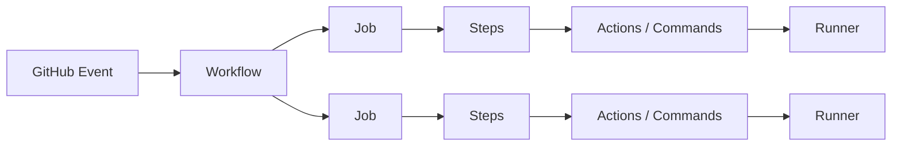

The important architectural distinction is that the workflow describes orchestration while runners perform execution.

---

## Workflow Architecture

A production workflow usually has four layers:

```text
Trigger
  ↓
Planning
  ↓
Execution
  ↓
Reporting / Promotion
```

Example:

```yaml
name: Backend CI

on:
  pull_request:
  push:
    branches:
      - main

permissions:
  contents: read

jobs:
  lint:
    runs-on: ubuntu-latest
    steps:
      - uses: actions/checkout@<pinned-sha>

      - uses: actions/setup-python@<pinned-sha>
        with:
          python-version: "3.12"

      - run: pip install -r requirements-dev.txt
      - run: ruff check .

  test:
    needs: lint
    runs-on: ubuntu-latest
    steps:
      - uses: actions/checkout@<pinned-sha>
      - run: pytest
```

The architecture should make dependencies explicit rather than hiding orchestration inside shell scripts.

---

## Workflow, Job, Step, and Action Responsibilities

| Component | Primary Responsibility |
|---|---|
| Workflow | Event and pipeline orchestration |
| Job | Execution boundary and dependency unit |
| Step | Individual operation |
| Action | Reusable packaged functionality |
| Runner | Execution environment |
| Artifact | Durable output of execution |
| Environment | Deployment/security boundary |
| Registry | Durable artifact storage |

A common architectural mistake is putting too much orchestration inside a single shell script.

Prefer:

```text
GitHub workflow
    ↓
Jobs
    ↓
Actions/scripts
```

instead of:

```text
One job
    ↓
1000-line shell script
```

---

## CI Architecture

Continuous Integration validates source changes before they become deployable artifacts.

A production backend CI pipeline commonly looks like:

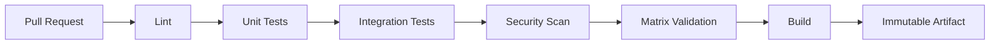

Typical components:

- Python linting
- Type checking
- Unit tests
- PostgreSQL integration tests
- Redis integration tests
- API tests
- Dependency scanning
- Container build
- SBOM generation
- Artifact publication

---

## CI Fan-Out and Fan-In

A useful architecture separates independent validation:

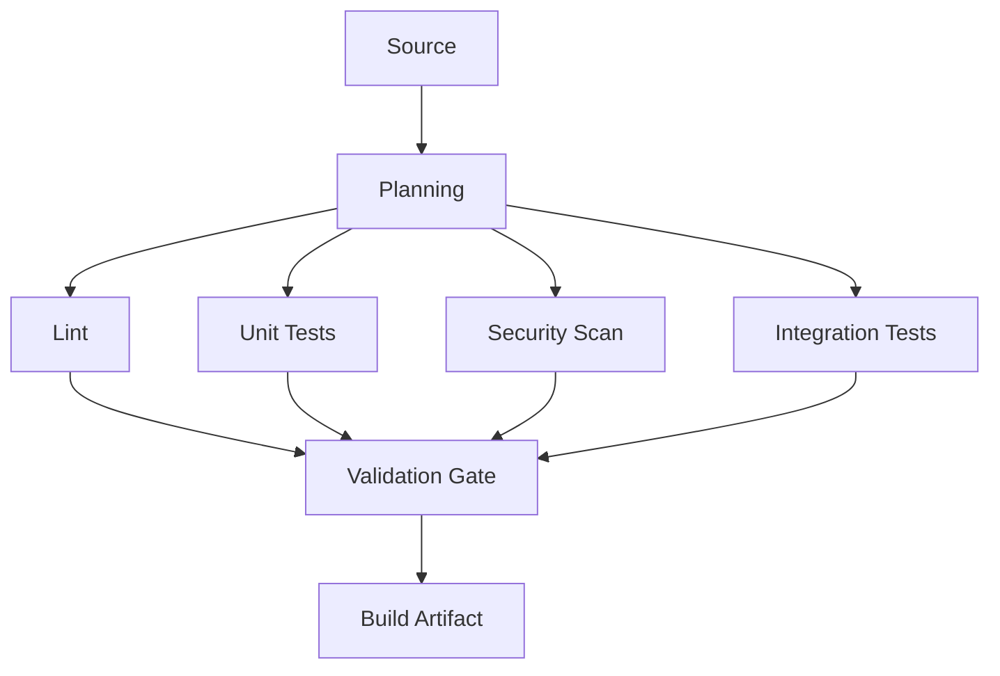

This is fan-out followed by fan-in.

### Why It Exists

Independent jobs can execute in parallel.

Benefits:

- Lower wall-clock time
- Failure isolation
- Better observability
- Independent scaling

Trade-off:

```text
More parallelism
    ↓
More runner usage
    ↓
Higher cost
```

---

## Dependency Graph Architecture

Use `needs` to explicitly represent dependencies.

```yaml
jobs:
  lint:
    runs-on: ubuntu-latest

  unit:
    runs-on: ubuntu-latest

  integration:
    runs-on: ubuntu-latest

  build:
    needs:
      - lint
      - unit
      - integration
    runs-on: ubuntu-latest
```

This creates:

```text
lint ──────────┐
unit ──────────┼──→ build
integration ───┘
```

Avoid unnecessary sequential dependencies such as:

```text
lint → unit → integration → security
```

when these operations can safely run independently.

---

## CI Matrix Architecture

Matrices are useful when compatibility must be validated across dimensions.

Example:

```yaml
strategy:
  fail-fast: false
  matrix:
    python-version:
      - "3.11"
      - "3.12"
    database:
      - postgres
      - mysql
```

This creates four combinations.

```text
Python 3.11 + PostgreSQL
Python 3.11 + MySQL
Python 3.12 + PostgreSQL
Python 3.12 + MySQL
```

### Senior Design Consideration

Do not create every theoretically possible combination.

Matrix size grows multiplicatively:

```text
Python versions × database versions × OS × architecture
```

Large matrices increase:

- Runtime
- Cost
- Queue pressure
- Failure noise
- Diagnostic complexity

Use a smaller PR matrix and a broader scheduled/release matrix when appropriate.

---

## Dynamic Matrix Architecture

For large repositories, determine test scope dynamically.

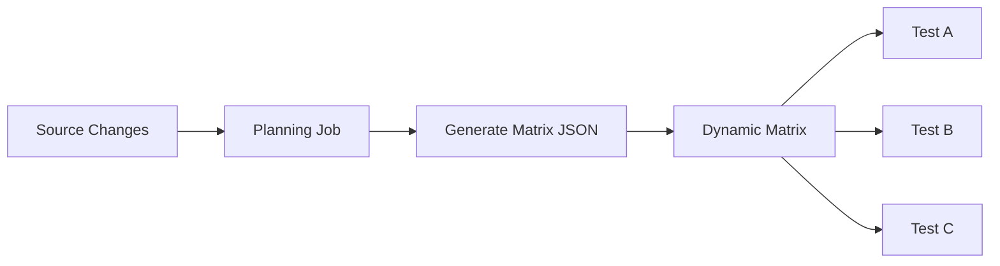

Planning jobs can produce structured JSON through `$GITHUB_OUTPUT`.

Example:

```yaml
- id: matrix
  run: |
    echo 'matrix={"service":["users","payments"]}' >> "$GITHUB_OUTPUT"
```

Downstream:

```yaml
strategy:
  matrix: ${{ fromJSON(needs.plan.outputs.matrix) }}
```

This is powerful for monorepos but introduces another failure boundary:

```text
Change detection
→ JSON generation
→ Job output
→ Matrix parsing
→ Matrix execution
```

---

## CD Architecture

Continuous Delivery moves a validated artifact through controlled environments.

A production architecture should prefer:

```text
Build Once
    ↓
Immutable Artifact
    ↓
Staging
    ↓
Validation
    ↓
Approval
    ↓
Production
```

rather than:

```text
Build for Staging
    ↓
Build for Production
```

Rebuilding creates the possibility that the artifact tested in staging differs from the artifact deployed to production.

---

## Build Once, Deploy Many

The central artifact-promotion model is:

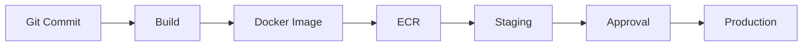

The same image digest should move through environments.

Example:

```text
Image:
backend-api@sha256:abc123...
```

rather than relying solely on:

```text
backend-api:latest
```

---

## Artifact Identity

A production artifact should be traceable to:

```text
Repository
+
Commit SHA
+
Workflow Run
+
Build Metadata
+
Artifact Digest
+
Release Version
```

For Docker:

```text
Tag → human-readable reference
Digest → immutable content identity
```

A deployment system should retain the digest actually deployed.

---

## Artifact Promotion Architecture

```text
Build
  ↓
Scan
  ↓
Publish
  ↓
Staging
  ↓
Validate
  ↓
Approve
  ↓
Production
```

The artifact should not be modified between environments.

Environment-specific values should come from:

- Environment variables
- Secrets
- Configuration
- External secret stores
- Deployment configuration

The binary/image itself should remain unchanged.

---

## Environment Promotion

Typical environments:

```text
Development
    ↓
Test
    ↓
Staging
    ↓
Production
```

Each environment may have:

- Different AWS account
- Different database
- Different secrets
- Different network
- Different approval policy
- Different capacity

The artifact should remain the same.

---

## Environment Architecture

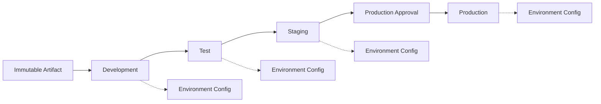

The key distinction is:

```text
Artifact identity
≠
Environment configuration
```

---

## GitHub Environments

GitHub Environments can provide:

- Environment-scoped secrets
- Environment variables
- Required reviewers
- Deployment protection
- Deployment history
- Branch/tag restrictions

Example:

```yaml
jobs:
  deploy:
    environment:
      name: production
```

A production deployment should not receive production credentials simply because a workflow is running.

The environment boundary should be part of the deployment architecture.

---

## Approval Architecture

A controlled production flow is:

```text
Build
 ↓
Scan
 ↓
Publish
 ↓
Staging
 ↓
Health Validation
 ↓
Production Approval
 ↓
Production Deployment
```

Approval should authorize promotion of a known artifact, not authorize an unknown rebuild.

---

## Deployment Concurrency

Production deployment must usually be serialized.

```yaml
concurrency:
  group: production-deployment
  cancel-in-progress: false
```

This prevents two workflows from simultaneously changing the same production environment.

For pull requests, a different policy may be appropriate:

```yaml
concurrency:
  group: pr-${{ github.workflow }}-${{ github.event.pull_request.number }}
  cancel-in-progress: true
```

The architecture should distinguish:

```text
Feedback optimization
```

from:

```text
Production safety
```

---

## Deployment Strategies

| Strategy | Main Property | Typical Use |
|---|---|---|
| Rolling | Replace instances gradually | Standard services |
| Blue/Green | Two environments | Fast rollback |
| Canary | Gradual traffic exposure | Risk-controlled releases |
| Recreate | Replace all instances | Simple/non-HA systems |
| Zero downtime | Preserve availability during transition | Customer-facing APIs |

The correct strategy depends on:

- Application architecture
- Traffic model
- Database compatibility
- Capacity
- Rollback requirements
- Operational maturity

---

## Rolling Deployment Architecture

```text
Current:
A A A A

Deploy:
A A A B

Then:
A A B B

Then:
A B B B

Finally:
B B B B
```

Requires:

- Readiness checks
- Graceful shutdown
- Connection draining
- Capacity planning
- Backward-compatible changes

---

## Blue/Green Architecture

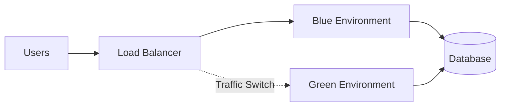

Deployment flow:

```text
Blue = Current
Green = New
       ↓
Deploy Green
       ↓
Health Check
       ↓
Switch Traffic
       ↓
Monitor
       ↓
Rollback to Blue if necessary
```

Blue/green improves rollback speed but requires additional capacity.

---

## Canary Architecture

```text
Traffic
   ↓
Load Balancer
   ├── 95% → Stable
   └── 5%  → Canary
```

The canary should be evaluated against defined signals:

- Error rate
- Latency
- Saturation
- Application metrics
- Business metrics

Do not define canary success as merely:

```text
Container started successfully
```

---

## Zero-Downtime Architecture

Zero-downtime deployment requires coordination between:

```text
Application
Database
Load Balancer
Workers
Queues
Connections
Deployment Controller
```

For Django/FastAPI services:

```text
New application
    ↓
Readiness check
    ↓
Traffic
    ↓
Old application drains
    ↓
Old application terminates
```

Long-lived connections and background workers require additional handling.

---

## Database Migration Architecture

Database changes are often the hardest part of zero-downtime deployment.

Prefer:

```text
Expand
  ↓
Deploy compatible application
  ↓
Migrate data
  ↓
Switch application behavior
  ↓
Contract
```

Avoid tightly coupling:

```text
Destructive schema change
+
Application deployment
```

when old and new application versions may coexist.

---

## Django Deployment Architecture

A production Django deployment might look like:

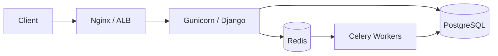

CI/CD should validate:

```text
Django checks
Unit tests
Integration tests
Migrations
Static assets
Container build
Application health
Worker compatibility
```

---

## FastAPI Deployment Architecture

```text
Client
  ↓
ALB / Nginx
  ↓
Gunicorn/Uvicorn
  ↓
FastAPI
  ├── PostgreSQL
  ├── Redis
  └── External APIs
```

The deployment pipeline should validate both:

```text
HTTP application health
```

and:

```text
Dependency health
```

where appropriate.

---

## Celery Deployment Architecture

Celery introduces another deployment dimension.

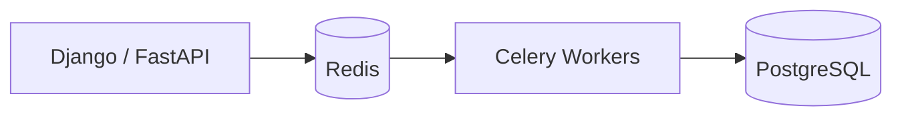

Application and worker versions must remain compatible.

A deployment that updates the API but leaves workers running incompatible code can cause:

- Task deserialization errors
- Missing task names
- Payload incompatibility
- Duplicate processing

---

## Kafka Deployment Architecture

Kafka introduces compatibility concerns between:

```text
Producer
Consumer
Schema
Topic
Consumer Group
```

A production deployment should consider:

```text
Old producer
+
New producer
+
Old consumer
+
New consumer
```

when rolling deployments temporarily create mixed versions.

Schema evolution should therefore be part of release architecture.

---

## Docker CI/CD Architecture

A production Docker pipeline:

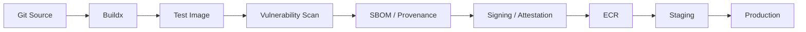

Important principles:

- Multi-stage builds
- Small runtime image
- Locked dependencies
- `.dockerignore`
- Build cache
- Immutable artifact identity
- Vulnerability scanning
- SBOM
- Provenance
- Signing/attestation where required

---

## Docker Layer Cache Architecture

Docker build performance can be improved through:

```text
Dockerfile layer ordering
+
BuildKit
+
GitHub Actions cache
+
Registry cache
```

Dependency installation should be separated from frequently changing application source where practical.

Example:

```dockerfile
FROM python:3.12-slim

WORKDIR /app

COPY requirements.txt .
RUN pip install --no-cache-dir -r requirements.txt

COPY . .

CMD ["gunicorn", "config.wsgi:application"]
```

Caching is an optimization, not an artifact source of truth.

---

## AWS Deployment Architecture

A common AWS architecture is:

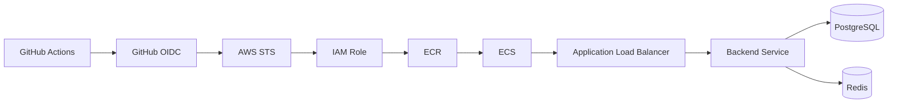

The pipeline should not store long-lived AWS access keys when OIDC can provide short-lived role credentials.

---

## AWS OIDC Architecture

The trust chain is:

```text
GitHub Actions
      ↓
GitHub OIDC Token
      ↓
AWS STS
      ↓
IAM Role
      ↓
Temporary Credentials
      ↓
AWS API
```

Workflow permission:

```yaml
permissions:
  contents: read
  id-token: write
```

The IAM trust policy should restrict:

- Repository
- Branch/tag
- Environment
- Audience
- Other relevant claims

Use separate roles for separate privilege boundaries.

---

## AWS Account Separation

For stronger production isolation:

```text
Development Account
        ↓
Staging Account
        ↓
Production Account
```

GitHub Environments can map to different AWS roles.

Example:

```text
staging
    ↓
AWS Staging Role

production
    ↓
AWS Production Role
```

This reduces the blast radius of CI compromise.

---

## ECR Architecture

ECR should be the durable image registry.

A typical flow:

```text
Git SHA
 ↓
Docker Buildx
 ↓
Scan
 ↓
Push ECR
 ↓
Record Digest
 ↓
Deploy Digest
```

Prefer:

```text
backend-api@sha256:...
```

over:

```text
backend-api:latest
```

for deployment identity.

---

## ECS Architecture

A typical ECS deployment:

```text
GitHub Actions
      ↓
ECR Image
      ↓
Task Definition
      ↓
ECS Service
      ↓
ALB
      ↓
Application
```

Deployment validation should inspect:

- Desired tasks
- Running tasks
- Task health
- ALB target health
- Deployment state
- Application logs

---

## EC2 Deployment Architecture

A controlled EC2 deployment can use:

```text
GitHub Actions
      ↓
Artifact
      ↓
S3 / Registry
      ↓
SSM / Deployment Mechanism
      ↓
EC2
      ↓
Release Directory
      ↓
Atomic Symlink Switch
      ↓
systemd
      ↓
Nginx
```

A release directory structure might be:

```text
/opt/backend/releases/
├── 20261001-120000/
├── 20261001-130000/
└── 20261001-140000/

current -> /opt/backend/releases/20261001-140000/
```

Rollback can then switch the active release pointer after validating compatibility.

---

## Lambda Deployment Architecture

For Lambda:

```text
Source
 ↓
Build
 ↓
Package / Container Image
 ↓
Artifact
 ↓
Lambda Version
 ↓
Alias
 ↓
Traffic
```

Aliases can support controlled promotion patterns.

The important architectural principle remains:

```text
Immutable version
+
Controlled traffic
```

---

## Infrastructure as Code Architecture

CI/CD may deploy infrastructure through:

- Terraform
- CloudFormation

The pipeline should separate:

```text
Infrastructure lifecycle
```

from:

```text
Application artifact lifecycle
```

when appropriate.

For example:

```text
Infrastructure pipeline
    ↓
VPC / IAM / ECS / ECR

Application pipeline
    ↓
Docker image / deployment
```

This reduces unnecessary infrastructure changes during application releases.

---

## Terraform Pipeline Architecture

A production Terraform flow commonly resembles:

```text
Pull Request
 ↓
fmt
 ↓
validate
 ↓
security/policy checks
 ↓
plan
 ↓
review
 ↓
apply
```

The saved plan should be associated with the exact source revision and should not silently become detached from the reviewed configuration.

---

## CloudFormation Architecture

A CloudFormation pipeline can use:

```text
Template
 ↓
Validate
 ↓
Change Set
 ↓
Review
 ↓
Deploy
 ↓
Monitor
```

Change sets provide visibility into infrastructure changes before execution.

---

## Reusable Workflow Architecture

Reusable workflows are appropriate when multiple repositories share orchestration.

Example:

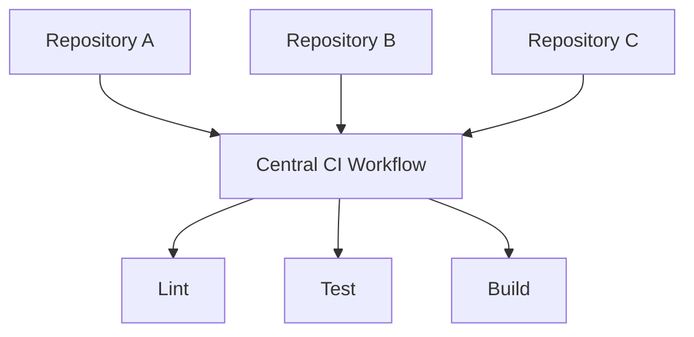

This centralizes:

- Security controls
- Standard test patterns
- Runner configuration
- Artifact handling
- Deployment conventions

---

## Reusable Workflow vs Composite Action

| Capability | Reusable Workflow | Composite Action |
|---|---|---|
| Orchestrate jobs | Yes | No |
| Multiple jobs | Yes | No |
| `needs` graph | Yes | No |
| Package steps | No | Yes |
| Called from job | Yes | Yes, as a step |
| Environment/deployment orchestration | Yes | Limited |
| Best for | Pipeline architecture | Reusable step groups |

Do not force complex multi-job orchestration into a composite action.

---

## Cross-Repository Workflow Architecture

A central platform repository may provide:

```text
Reusable CI
Reusable security checks
Reusable Docker build
Reusable deployment
```

Consumer repositories call versioned workflow references.

The architecture should include:

- Versioning
- Backward compatibility
- Ownership
- Testing
- Release process
- Consumer migration
- Deprecation

A central workflow has a potentially large blast radius.

---

## Enterprise GitHub Actions Architecture

A large organization may use:

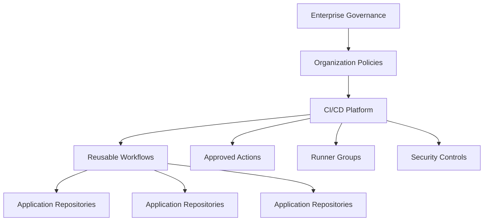

Governance should cover:

- Action allowlists
- SHA pinning
- Permissions
- Runner groups
- Environments
- Secrets
- Reusable workflows
- Deployment controls
- Artifact provenance

---

## Runner Architecture

### GitHub-Hosted Runners

Useful for:

- Standard CI
- Disposable workloads
- Publicly accessible dependencies
- Low operational overhead

Advantages:

- Managed lifecycle
- Clean execution environments
- Easy scaling

Limitations:

- Less control
- Private network access may require different architecture
- Custom tooling may require setup

---

## Self-Hosted Runner Architecture

Self-hosted runners are useful for:

- Private network access
- Specialized tooling
- Custom hardware
- Internal services
- Private registries

But they introduce operational responsibility:

```text
Patch management
Security
Isolation
Capacity
Monitoring
Lifecycle
Credentials
Network controls
```

---

## Persistent vs Ephemeral Runners

| Model | Advantages | Risks |
|---|---|---|
| Persistent | Fast startup, local caches | State leakage, drift |
| Ephemeral | Clean state, stronger isolation | Provisioning overhead |
| Autoscaled ephemeral | Scalable and isolated | More infrastructure complexity |

For sensitive workloads, ephemeral runners can significantly reduce persistent-state risk.

---

## Runner Group Architecture

Runner groups can separate workloads:

```text
CI Runners
    ↓
Integration Runners
    ↓
Private Network Runners
    ↓
Production Deployment Runners
```

A deployment workflow should not automatically have access to every runner.

---

## Private Network Architecture

A private runner may access:

```text
Runner
 ├── RDS
 ├── ElastiCache
 ├── Internal APIs
 ├── Private ECR endpoints
 └── Internal Kafka
```

Network architecture should include:

- VPC
- Subnets
- Security groups
- DNS
- Routing
- NAT/VPC endpoints
- Firewall controls

Do not solve a networking problem by broadly opening inbound access.

---

## Runner Autoscaling

Autoscaling architecture:

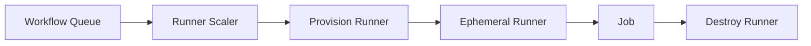

Important metrics:

- Queue depth
- Job duration
- Provisioning latency
- Runner utilization
- Failure rate
- Maximum capacity

Runner scaling must also consider downstream dependencies such as PostgreSQL, Redis, Kafka, and external APIs.

---

## Security Architecture

Security should be layered:

```text
Source Trust
    ↓
Workflow Trust
    ↓
Action Trust
    ↓
Runner Isolation
    ↓
Token Permissions
    ↓
Secret Protection
    ↓
Artifact Integrity
    ↓
Deployment Protection
    ↓
Runtime Security
```

No single control should be treated as sufficient.

---

## GITHUB_TOKEN Architecture

Use minimum required permissions.

Example:

```yaml
permissions:
  contents: read
```

Privileged jobs can request narrowly scoped permissions:

```yaml
jobs:
  release:
    permissions:
      contents: write
```

This limits the blast radius if another job is compromised.

---

## Third-Party Action Architecture

Third-party actions are executable dependencies.

Treat them similarly to production dependencies.

Controls can include:

- Trusted sources
- SHA pinning
- Dependency review
- Version review
- Action allowlists
- Minimal permissions
- Restricted secrets
- Isolated runners

Do not assume Marketplace availability means the action should automatically be trusted.

---

## Supply Chain Architecture

A secure artifact pipeline can be:

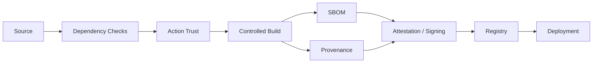

The objective is to establish:

```text
What was built?
From what source?
Using which workflow?
With which dependencies?
Where was it built?
Was it modified?
What artifact was deployed?
```

---

## Secret Architecture

Secrets should exist at the narrowest appropriate boundary.

Prefer:

```text
Environment Secret
```

over:

```text
Organization-wide Secret
```

when only production needs the credential.

For AWS:

```text
GitHub OIDC
→ STS
→ Temporary credentials
```

is preferable to storing long-lived access keys in GitHub secrets when supported by the target architecture.

---

## Production Security Boundary

A strong architecture separates:

```text
Untrusted PR Validation
```

from:

```text
Trusted Deployment
```

For example:

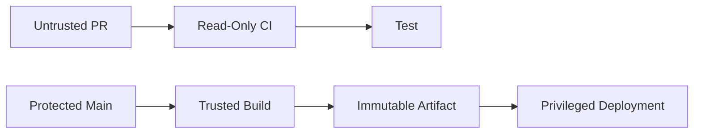

Production credentials should not be exposed to arbitrary pull request code.

---

## Artifact Security

Artifacts should have:

- Immutable identity
- Provenance
- SBOM
- Integrity metadata
- Retention policy
- Access controls

For container deployments:

```text
Tag
+
Digest
+
Commit SHA
+
Release
```

should be traceable.

---

## High Availability CI/CD Architecture

CI/CD itself can become a production dependency.

For critical organizations, consider:

```text
Multiple runner pools
+
Autoscaling
+
Multiple availability zones
+
Reusable workflows
+
Artifact registry redundancy
+
External monitoring
+
Break-glass procedures
```

The pipeline should not create a single point of failure for application operations.

---

## CI/CD Failure Domains

Separate:

```text
GitHub Control Plane
Runner Plane
Build Plane
Artifact Plane
Cloud Authentication Plane
Deployment Plane
Application Plane
```

Example:

```text
GitHub unavailable
```

is different from:

```text
ECR unavailable
```

which is different from:

```text
ECS deployment unhealthy
```

Different failure domains require different recovery strategies.

---

## Recovery Architecture

A mature pipeline should support:

```text
Detection
 ↓
Isolation
 ↓
Rollback / Recovery
 ↓
Validation
 ↓
Incident Analysis
```

Recovery mechanisms can include:

- Previous image digest
- Previous release directory
- Previous Lambda version
- Blue environment
- Previous Kubernetes ReplicaSet
- Database-compatible rollback
- Feature flag disablement

---

## Rollback Architecture

A rollback flow:

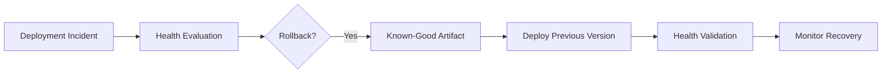

Rollback should not depend on rebuilding source code during the incident.

---

## Disaster Recovery Considerations

CI/CD recovery should account for:

- Artifact availability
- Registry availability
- Runner availability
- IAM/OIDC availability
- Infrastructure state
- Deployment metadata
- Previous release references
- Environment configuration
- Database compatibility

A backup of source code alone is not enough to guarantee release recovery.

---

## Monitoring Architecture

Monitor both:

```text
Pipeline Health
```

and:

```text
Application Health
```

Pipeline metrics can include:

- Workflow duration
- Queue time
- Failure rate
- Rerun rate
- Runner utilization
- Cache hit rate
- Deployment frequency
- Deployment failure rate

Deployment metrics can include:

- Startup time
- Error rate
- Latency
- Health check status
- Rollback rate

---

## Deployment Observability

A deployment should emit enough metadata to answer:

```text
What version is running?
What commit produced it?
What image digest is deployed?
Which workflow deployed it?
When was it deployed?
Who approved it?
Which environment was targeted?
```

This is essential during production incidents.

---

## Cost Architecture

CI/CD cost usually comes from:

```text
Runner compute
+
Matrix expansion
+
Docker builds
+
Artifact storage
+
Cache storage
+
Egress
+
Self-hosted infrastructure
```

Optimization strategies:

- Cache dependencies
- Cache Docker layers
- Reduce unnecessary matrix combinations
- Use selective CI
- Parallelize appropriate work
- Avoid rebuilding identical artifacts
- Retain artifacts according to operational requirements
- Autoscale self-hosted runners

Do not optimize by removing security or production validation.

---

## Scalable CI Architecture

A scalable architecture should avoid a single giant workflow.

Prefer:

```text
Reusable building blocks
+
Parallel validation
+
Dynamic matrices
+
Reusable workflows
+
Ephemeral runners
+
Artifact promotion
```

A monolithic workflow becomes difficult to:

- Debug
- Version
- Test
- Reuse
- Govern

---

## Monorepo Architecture

For a backend monorepo:

```text
services/
├── users/
├── payments/
├── orders/
└── notifications/
```

A planning job can determine affected services.

```text
Git diff
   ↓
Change Detection
   ↓
Affected Services
   ↓
Dynamic Matrix
   ↓
Service-specific CI
```

This avoids rebuilding unrelated services for every change.

---

## Microservice CI/CD Architecture

For multiple services:

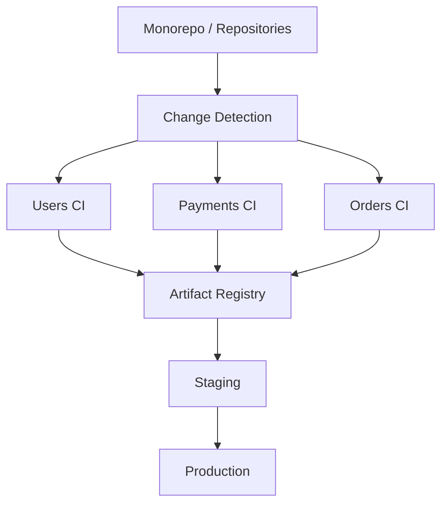

Each service should have independent artifact identity and deployment state.

---

## Shared Dependency Architecture

When services depend on:

```text
PostgreSQL
Redis
Kafka
gRPC APIs
```

CI should test compatibility rather than only isolated service behavior.

For example:

```text
Service A
   ↓
gRPC
   ↓
Service B
```

A change to the API contract should trigger appropriate downstream validation.

---

## API Compatibility

For REST and gRPC systems, deployment architecture should consider:

```text
Old client
+
New server
```

and:

```text
New client
+
Old server
```

during rolling deployments.

Backward compatibility is often a deployment requirement, not merely an API design concern.

---

## Production Reference Architecture

A mature backend CI/CD architecture can look like:

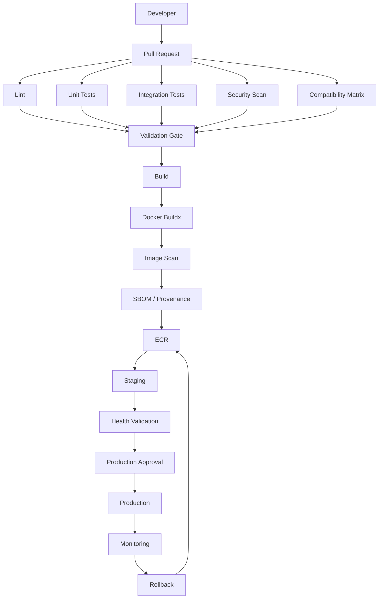

This architecture provides clear boundaries between:

```text
Validation
Build
Artifact
Promotion
Deployment
Runtime
Recovery
```

---

## Architecture Trade-Offs

| Decision | Option A | Option B | Main Trade-Off |
|---|---|---|---|
| Runner | Hosted | Self-hosted | Control vs operational burden |
| Runner lifecycle | Persistent | Ephemeral | Speed vs isolation |
| Deployment | Rolling | Blue/Green | Cost vs rollback simplicity |
| Deployment | Canary | Rolling | Risk control vs complexity |
| Workflow | Centralized | Repository-local | Governance vs autonomy |
| Build | Per environment | Build once | Simplicity vs reproducibility |
| Matrix | Broad | Selective | Coverage vs cost |
| AWS auth | Long-lived keys | OIDC | Simplicity vs security |
| Cache | Minimal | Aggressive | Simplicity vs performance |
| CI architecture | Monolithic | Modular | Initial simplicity vs maintainability |

---

## Architecture Questions

### How Would You Design CI/CD for a Django Application?

A reasonable architecture:

```text
Pull Request
 ↓
Lint
 ↓
Unit Tests
 ↓
PostgreSQL Integration Tests
 ↓
Redis/Celery Tests
 ↓
Security Scan
 ↓
Docker Build
 ↓
Image Scan
 ↓
ECR
 ↓
Staging
 ↓
Health Validation
 ↓
Approval
 ↓
Production
 ↓
Monitoring
```

Key design concerns:

- Database migration compatibility
- Celery worker compatibility
- Immutable Docker image
- AWS OIDC
- Deployment concurrency
- Rollback

---

### How Would You Design CI/CD for FastAPI?

Consider:

```text
FastAPI
+
PostgreSQL
+
Redis
+
External APIs
```

Pipeline:

```text
Lint
 ↓
Unit
 ↓
Integration
 ↓
API Tests
 ↓
Security
 ↓
Docker
 ↓
ECR
 ↓
Staging
 ↓
Production
```

Health validation should distinguish:

```text
Process alive
```

from:

```text
Application ready
```

---

### How Would You Prevent Production Deployment From Running Twice?

Use:

```yaml
concurrency:
  group: production-deployment
  cancel-in-progress: false
```

Combine this with:

- Immutable artifact identity
- Environment protection
- Idempotent deployment operations
- Health validation
- Rollback

---

### How Would You Share CI Across 50 Repositories?

Use reusable workflows.

Centralize:

```text
Lint
Testing
Security
Docker build
Artifact publishing
```

But keep application-specific configuration in the consuming repository.

Avoid centralizing every application decision.

---

### How Would You Secure Production AWS Access?

Use:

```text
GitHub OIDC
    ↓
AWS STS
    ↓
Environment-specific IAM Role
```

Use separate roles for:

```text
Development
Staging
Production
```

and restrict trust policies to appropriate repository/environment identities.

---

### How Would You Promote a Docker Image Without Rebuilding?

Build once:

```text
Commit
 ↓
Build
 ↓
Push ECR
 ↓
Digest
```

Promote:

```text
Digest
 ↓
Staging
 ↓
Approval
 ↓
Production
```

Do not rebuild production from the same source commit.

---

### How Would You Design CI for PostgreSQL and Redis?

Use service containers for integration testing:

```text
Job
 ├── PostgreSQL
 └── Redis
```

Validate readiness before running tests.

Use matrices when compatibility across database versions is important.

---

### How Would You Handle a Private Database?

Use a runner with appropriate private network access:

```text
GitHub
 ↓
Self-hosted ephemeral runner
 ↓
Private VPC
 ↓
PostgreSQL
```

Control access using:

- Security groups
- Routing
- DNS
- Runner groups
- IAM
- Network segmentation

Do not expose the database publicly merely to simplify CI.

---

### How Would You Design a Secure Enterprise Actions Platform?

Separate:

```text
Governance
 ↓
Reusable Workflows
 ↓
Approved Actions
 ↓
Runner Platform
 ↓
Security Controls
 ↓
Application Repositories
```

Enforce:

- Least privilege
- Action policies
- SHA pinning
- OIDC
- Environment protection
- Runner isolation
- Artifact provenance
- Auditability

---

### How Would You Handle a Compromised Third-Party Action?

Immediately consider:

```text
Action execution
 ↓
Token permissions
 ↓
Secrets
 ↓
Runner
 ↓
Network
 ↓
Artifacts
 ↓
Cloud credentials
```

Containment may include:

- Disable/remove action reference
- Restrict permissions
- Revoke credentials
- Rotate exposed secrets
- Isolate affected runners
- Inspect artifacts
- Review workflow logs
- Determine blast radius
- Rebuild trusted artifacts

---

### How Would You Design Rollback?

Store immutable deployment references:

```text
Release
Commit
Image digest
Deployment metadata
```

Then:

```text
Detect failure
 ↓
Select known-good artifact
 ↓
Deploy
 ↓
Health validation
 ↓
Monitor
```

The rollback path should be tested before it is needed.

---

### How Would You Design for Zero Downtime?

Combine:

```text
Backward-compatible changes
+
Readiness checks
+
Graceful shutdown
+
Connection draining
+
Rolling/blue-green/canary deployment
+
Deployment concurrency
+
Health validation
```

Database migrations should use an expand/contract strategy when necessary.

---

### How Would You Design Disaster Recovery for CI/CD?

Preserve:

```text
Source
+
Artifacts
+
Image digests
+
Infrastructure state
+
Deployment metadata
+
Environment configuration
```

Ensure the organization can identify and redeploy a known-good artifact even after a pipeline failure.

---

## Interview Reasoning Framework

For architecture questions, answer in this order:

```text
1. Requirements
2. Trust boundaries
3. Workflow architecture
4. Dependency graph
5. Artifact strategy
6. Environment strategy
7. Authentication
8. Deployment strategy
9. Failure handling
10. Observability
11. Scalability
12. Cost
13. Disaster recovery
14. Trade-offs
```

This is more useful than memorizing YAML syntax.

---

## Senior-Level Architecture Traps

### Treating GitHub Actions as Only YAML

The real system includes:

```text
GitHub
+
Runners
+
Cloud
+
Registry
+
Artifacts
+
Secrets
+
Environments
+
Applications
```

### Rebuilding Per Environment

This weakens reproducibility.

### Using Mutable Image Tags

Tags can move.

### Using Long-Lived AWS Credentials

OIDC can reduce credential lifetime and secret-management burden.

### One Runner for Everything

This creates excessive blast radius.

### One Workflow for Everything

This creates maintenance and failure-isolation problems.

### Giving Every Job Write Permissions

This violates least privilege.

### Using Production Secrets in PR Validation

This crosses a dangerous trust boundary.

### No Rollback Path

A deployment architecture without a tested recovery path is incomplete.

### Ignoring Database Compatibility

Application rollback may not be safe after incompatible schema changes.

---

## Architecture Review Checklist

### Workflow

- [ ] Triggers are intentional.
- [ ] Jobs represent meaningful execution boundaries.
- [ ] Dependencies use `needs`.
- [ ] Matrix dimensions are justified.
- [ ] Concurrency is explicitly designed.

### CI

- [ ] Linting exists.
- [ ] Unit tests exist.
- [ ] Integration tests exist where required.
- [ ] Security scanning exists.
- [ ] Test artifacts are retained appropriately.

### Artifact

- [ ] Build happens once.
- [ ] Artifact is immutable.
- [ ] Docker digest is recorded.
- [ ] SBOM/provenance requirements are addressed.
- [ ] Artifact promotion does not rebuild.

### Security

- [ ] Least-privilege permissions.
- [ ] No long-lived cloud credentials where OIDC is appropriate.
- [ ] Secrets are scoped.
- [ ] Untrusted PR code is isolated.
- [ ] Third-party actions are governed.

### Deployment

- [ ] Environment protection exists.
- [ ] Production concurrency exists.
- [ ] Health validation exists.
- [ ] Rollback is documented.
- [ ] Database compatibility is considered.

### Operations

- [ ] Runner capacity is monitored.
- [ ] Workflow failures are observable.
- [ ] Deployment metadata is traceable.
- [ ] Artifact retention is defined.
- [ ] Disaster recovery is considered.

---

## Architecture Design Example

A production Python backend can use:

```text
GitHub
  │
  ├── Pull Request
  │      ├── Ruff
  │      ├── Pytest
  │      ├── PostgreSQL
  │      ├── Redis
  │      └── Security Scan
  │
  └── Main
         │
         ├── Build Docker Image
         ├── Generate SBOM
         ├── Scan
         ├── Publish ECR
         └── Record Digest
                  │
                  ▼
              Staging
                  │
             Health Check
                  │
             Approval
                  │
                  ▼
             Production
                  │
             Monitoring
                  │
              Rollback
```

This architecture is appropriate for backend systems where reproducibility, controlled deployment, and operational recovery matter more than simply achieving a green workflow.

---

## Key Takeaways

- **GitHub Actions architecture is a distributed CI/CD system consisting of workflows, jobs, runners, artifacts, environments, registries, cloud authentication, deployment targets, and operational controls.**
- **Production pipelines should build once, produce immutable artifacts, and promote the same artifact through staging and production rather than rebuilding for each environment.**
- **Security architecture should separate untrusted CI from privileged deployment, use least-privilege permissions and OIDC for AWS, isolate runners appropriately, and treat actions and dependencies as supply-chain components.**
- **Reliable deployment architecture combines concurrency control, health validation, backward-compatible database changes, observability, and a tested rollback path.**
- **Senior-level CI/CD architecture decisions should explicitly evaluate reliability, scalability, security, cost, failure domains, governance, maintainability, and disaster recovery rather than focusing only on YAML configuration.**