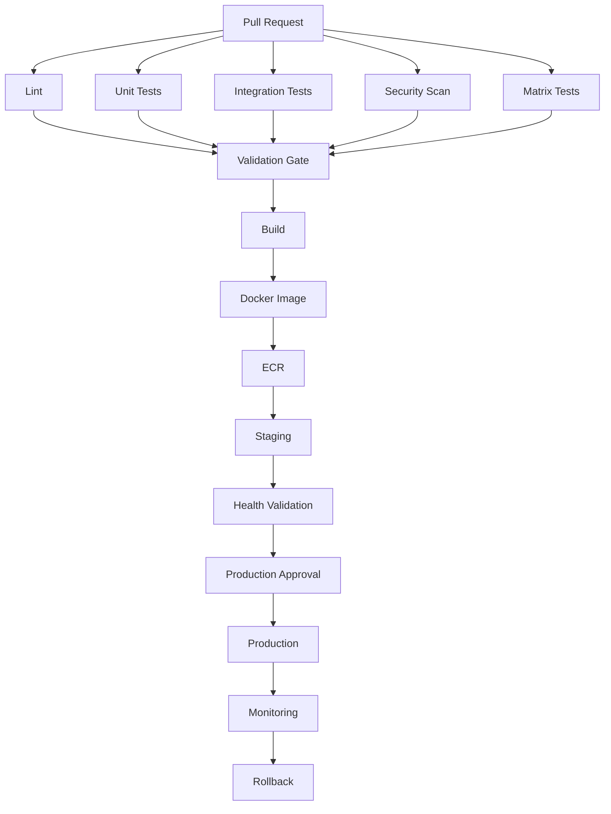
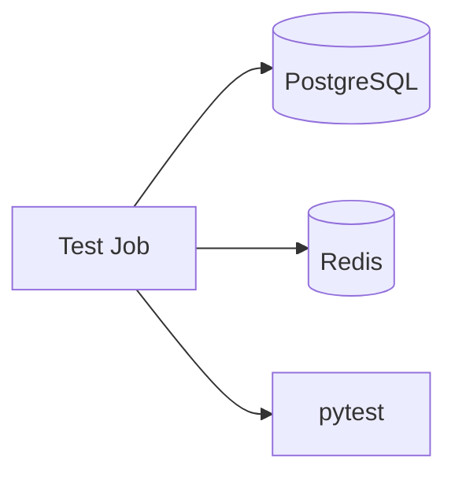
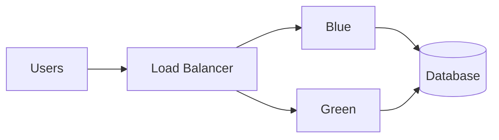
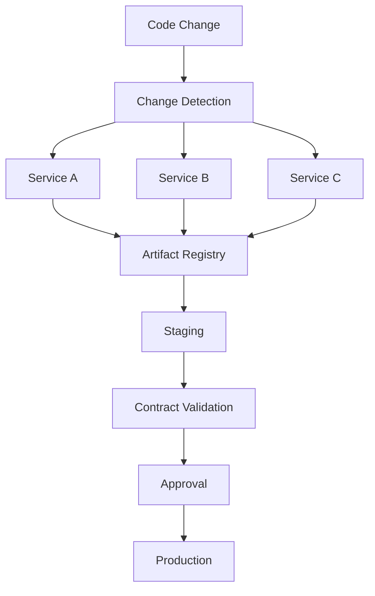
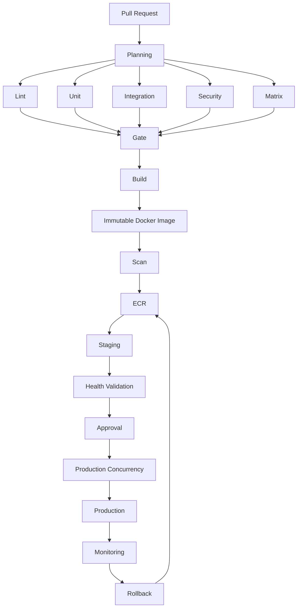
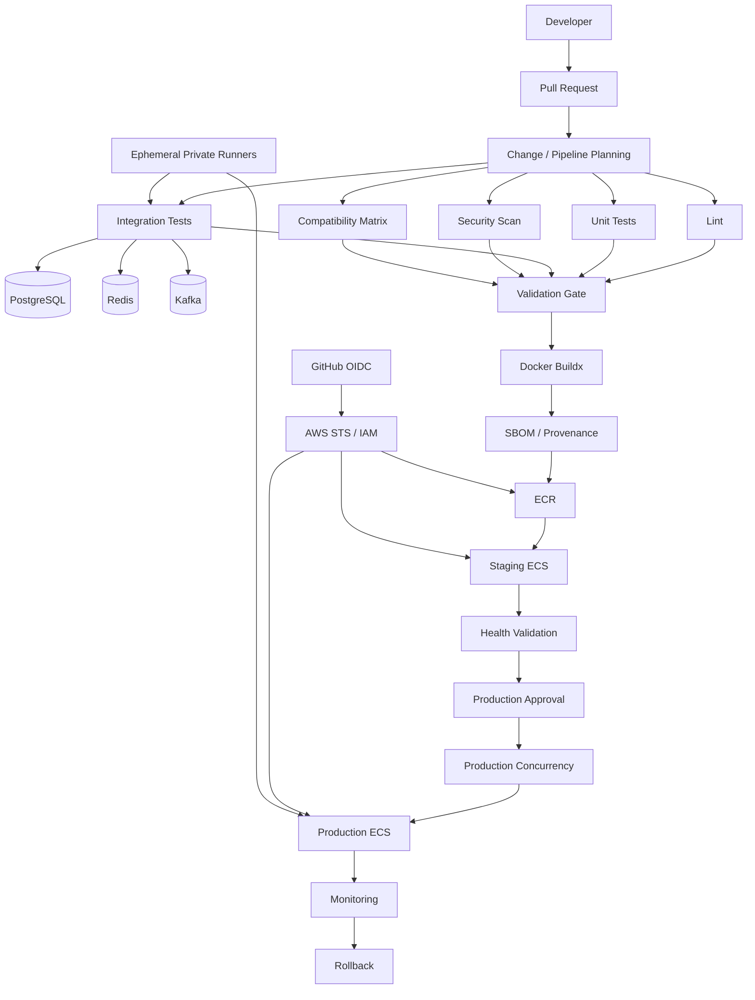

# 21- Scenario Based Questions

## Overview

GitHub Actions scenario-based interview questions test whether an engineer can design, secure, troubleshoot, and operate CI/CD systems rather than merely remember YAML syntax.

Senior-level interviews typically present a production problem and expect reasoning across:

- Workflow architecture
- Job dependencies
- Runners
- Matrix execution
- Artifacts and caching
- Reusable workflows
- Security boundaries
- Secrets and permissions
- Docker
- AWS OIDC
- Environment promotion
- Deployment strategies
- Concurrency
- Rollback
- Reliability
- Observability
- Governance
- Cost

A strong answer should explain:

```text
Requirements
    ↓
Architecture
    ↓
Security Boundaries
    ↓
Execution Model
    ↓
Artifact Strategy
    ↓
Deployment Strategy
    ↓
Failure Handling
    ↓
Observability
    ↓
Trade-offs
```

The goal is not to produce the shortest YAML configuration. The goal is to design a system that remains secure, reproducible, maintainable, and operable under real production conditions.

---

## How to Approach Scenario Questions

Before proposing implementation details, identify the constraints.

### Requirements

Clarify:

- What triggers the pipeline?
- What must happen on pull requests?
- What must happen on merges?
- Which environments exist?
- What is being deployed?
- Where does it run?
- What dependencies are required?
- What requires approval?
- What is the rollback requirement?
- What security boundary exists?
- What availability requirement exists?
- What is the expected deployment frequency?

### Architecture

Then determine:

```text
Trigger
→ Planning
→ Validation
→ Build
→ Artifact
→ Promotion
→ Deployment
→ Validation
→ Monitoring
→ Rollback
```

### Security

Always ask:

- Which code is trusted?
- Which code is untrusted?
- Which job needs secrets?
- Which job needs write permissions?
- Which job needs AWS access?
- Which runner can access private infrastructure?
- Can a compromised action reach production?

### Reliability

Consider:

- Duplicate deployments
- Partial failures
- Runner failures
- Dependency failures
- Registry failures
- Cloud authentication failures
- Deployment failures
- Rollback failures

---

## Scenario: Design a Production CI/CD Pipeline for a Python Backend

### Problem

You have a Django or FastAPI backend.

The pipeline must perform:

```text
Pull Request
→ Lint
→ Unit Tests
→ Integration Tests
→ Security Scan
→ Matrix Tests
→ Build
→ Docker Image
→ ECR
→ Staging
→ Approval
→ Production
→ Monitoring
→ Rollback
```

### Architecture



### Senior Design Points

Use independent jobs where work can execute in parallel.

Use `needs` only where a true dependency exists.

Build the Docker image once.

Promote the same immutable artifact through environments.

Use GitHub Environments for production protection.

Use OIDC for AWS authentication.

Use concurrency for production deployments.

Record the image digest deployed to each environment.

### Interview Trap

Do not say:

> Build the application separately for staging and production.

That breaks the build-once/promote-many model and can produce environment-specific artifacts.

---

## Scenario: Production Deployment Must Never Run Twice Simultaneously

### Problem

Two merges occur within a short period. Both workflows reach production deployment.

How do you prevent concurrent production deployments?

### Solution

Use deployment concurrency.

```yaml
concurrency:
  group: production-deployment
  cancel-in-progress: false
```

This serializes deployments targeting the same production environment.

### Why `cancel-in-progress: false`?

For production, canceling an active deployment can leave infrastructure or application state partially changed.

A safer model is usually:

```text
Deployment A
    ↓
Complete
    ↓
Deployment B
```

rather than:

```text
Deployment A
    ↓
Cancel
    ↓
Deployment B
```

The exact policy depends on deployment idempotency and the deployment platform.

### Senior Consideration

Concurrency is not a replacement for idempotency.

A deployment operation should still tolerate safe retries.

---

## Scenario: Pull Request Workflows Are Too Expensive

### Problem

A repository runs:

```text
Python 3.10
Python 3.11
Python 3.12
Python 3.13
PostgreSQL
MySQL
Ubuntu
Windows
```

Every pull request executes the full matrix.

Pipeline costs and queue time have increased significantly.

### Reasoning

Matrix size is multiplicative.

```text
4 Python versions
×
2 databases
×
2 operating systems
=
16 jobs
```

### Better Architecture

Use different validation policies.

Pull requests:

```text
Python supported versions
+
Primary database
+
Linux
```

Nightly/release:

```text
Full compatibility matrix
```

Example:

```yaml
strategy:
  fail-fast: false
  matrix:
    python-version:
      - "3.11"
      - "3.12"
      - "3.13"
```

### Senior Trade-Off

The objective is not maximum matrix size.

The objective is sufficient compatibility coverage for the risk and cost.

---

## Scenario: PostgreSQL and Redis Are Required for Integration Tests

### Problem

A FastAPI application requires PostgreSQL and Redis during integration testing.

How should the pipeline be designed?

### Architecture



Use service containers when they match the test requirements.

Example:

```yaml
jobs:
  integration:
    runs-on: ubuntu-latest

    services:
      postgres:
        image: postgres:16
        env:
          POSTGRES_USER: test
          POSTGRES_PASSWORD: test
          POSTGRES_DB: app_test
        ports:
          - 5432:5432

      redis:
        image: redis:7
        ports:
          - 6379:6379

    steps:
      - uses: actions/checkout@<pinned-sha>

      - uses: actions/setup-python@<pinned-sha>
        with:
          python-version: "3.12"

      - run: pip install -r requirements-dev.txt
      - run: pytest tests/integration
```

### Important Consideration

A container being started does not necessarily mean the service is ready.

Use health/readiness checks where required.

### Interview Trap

Do not automatically use `localhost` for every container configuration.

Networking differs depending on whether the job itself runs in a container or directly on the runner.

---

## Scenario: AWS Credentials Must Not Be Stored as Long-Lived Secrets

### Problem

A GitHub Actions workflow must publish Docker images to ECR and deploy to ECS.

The security team prohibits long-lived AWS access keys in GitHub Secrets.

### Architecture

Use GitHub OIDC.

```text
GitHub Actions
      ↓
OIDC Token
      ↓
AWS STS
      ↓
IAM Role
      ↓
Temporary Credentials
      ↓
ECR / ECS
```

Workflow permissions:

```yaml
permissions:
  contents: read
  id-token: write
```

The IAM trust policy should restrict the identities allowed to assume the role.

For example, use conditions based on:

- Repository
- Branch
- Environment
- Audience
- Relevant OIDC claims

### Senior Design

Separate roles:

```text
CI Role
Staging Deployment Role
Production Deployment Role
```

Avoid giving a single role permissions for the entire AWS account.

---

## Scenario: Docker Image Must Be Promoted Without Rebuilding

### Problem

A Docker image is built and tested in CI.

The organization requires the exact same image to be deployed to staging and production.

### Correct Architecture

```text
Source
 ↓
Build
 ↓
Scan
 ↓
Push ECR
 ↓
Record Digest
 ↓
Staging
 ↓
Approval
 ↓
Production
```

Example identity:

```text
123456789012.dkr.ecr.region.amazonaws.com/backend@sha256:abc...
```

The digest represents immutable image content.

### Avoid

```text
Build → staging
Build → production
```

Even if both builds use the same commit, differences can arise from:

- Dependency resolution
- Base image changes
- Build-time inputs
- External package availability
- Build environment differences

---

## Scenario: Production Requires Manual Approval

### Problem

Every production deployment must be approved by an authorized reviewer.

### Architecture

```text
Build
 ↓
Staging
 ↓
Health Check
 ↓
Production Environment
 ↓
Required Reviewer
 ↓
Production Deployment
```

Use a GitHub Environment configured with protection rules.

Workflow:

```yaml
jobs:
  deploy-production:
    environment:
      name: production

    runs-on: ubuntu-latest

    steps:
      - name: Deploy
        run: ./scripts/deploy.sh
```

### Senior Consideration

The approval should authorize deployment of a known immutable artifact.

It should not trigger an unrelated rebuild.

---

## Scenario: A Compromised Third-Party Action Is Discovered

### Problem

A third-party action used in CI is discovered to be compromised.

The action had access to:

```text
GITHUB_TOKEN
Repository secrets
AWS credentials
```

### Immediate Reasoning

Determine:

```text
What did the action execute?
        ↓
What permissions did it have?
        ↓
Which secrets could it access?
        ↓
Which runners executed it?
        ↓
Which artifacts did it produce?
        ↓
Could it access AWS?
        ↓
What production resources were reachable?
```

### Containment

Potential actions include:

- Remove or disable the action
- Replace it with a trusted implementation
- Pin trusted action references
- Revoke exposed credentials
- Rotate secrets
- Inspect workflow logs
- Inspect generated artifacts
- Isolate affected persistent runners
- Rebuild trusted artifacts
- Review AWS audit logs

### Prevention

Use:

```text
Least privilege
+
SHA pinning
+
Action allowlists
+
Ephemeral runners
+
OIDC
+
Scoped secrets
+
Artifact provenance
```

---

## Scenario: A Pull Request Can Execute Arbitrary Code

### Problem

A repository accepts pull requests from external contributors.

A workflow checks out pull request code and executes tests.

The workflow also has access to sensitive credentials.

### Risk

The pull request code is untrusted.

If the workflow provides privileged credentials to that code, the contributor may potentially use the workflow execution environment to access them.

### Safer Architecture

```text
Untrusted PR
    ↓
Read-only validation
    ↓
No production secrets
    ↓
No privileged cloud access
```

Privileged deployment should happen only from a trusted source and controlled environment.

---

## Scenario: `pull_request_target` Is Being Used Everywhere

### Problem

A team changed:

```yaml
on:
  pull_request:
```

to:

```yaml
on:
  pull_request_target:
```

because they needed repository secrets.

### Risk

`pull_request_target` operates with a different security context.

The critical question becomes:

```text
Are we executing untrusted pull request code
while operating with trusted repository privileges?
```

That combination can create a dangerous trust boundary.

### Senior Answer

Do not use `pull_request_target` merely as a convenient mechanism for accessing secrets.

Separate:

```text
Untrusted validation
```

from:

```text
Privileged operations
```

---

## Scenario: A Workflow Is Not Triggering

### Problem

A developer pushes to a branch but the workflow does not run.

### Troubleshooting Model

```text
Symptom
  ↓
Possible Causes
  ↓
Isolation
  ↓
Checks
  ↓
Root Cause
  ↓
Correction
  ↓
Prevention
```

Check:

- Workflow file location
- YAML syntax
- Event
- Branch filter
- Path filter
- Tag filter
- Repository Actions policy
- Workflow disabled state
- Event context
- Default branch requirements for certain events

Example:

```yaml
on:
  push:
    branches:
      - main
```

A push to:

```text
feature/payment-api
```

will not trigger this workflow.

### Interview Trap

Do not immediately assume the runner is broken.

A workflow that never started has a different failure domain from a workflow whose job failed.

---

## Scenario: A Job Is Skipped

### Problem

A job appears as skipped even though a previous job succeeded.

Example:

```yaml
jobs:
  deploy:
    needs: test
    if: github.ref == 'refs/heads/main'
```

### Possible Causes

- `needs` dependency failed
- Upstream job was skipped
- `if` evaluated to false
- Event context is different than expected
- Status function behavior
- Branch/tag mismatch

### Diagnostic Approach

Inspect:

```text
Event
→ Ref
→ needs result
→ if expression
→ job status
```

Use step summaries or safe diagnostic output rather than exposing secrets.

---

## Scenario: A Job Needs to Run After Failure for Reporting

### Problem

Tests fail, but the team still wants test reports uploaded.

Use appropriate status conditions.

Example:

```yaml
- name: Upload test report
  if: ${{ !cancelled() }}
  uses: actions/upload-artifact@<pinned-sha>
```

The distinction between:

```text
failure()
always()
cancelled()
```

matters.

A reporting operation should not blindly use `always()` when cancellation semantics make that inappropriate.

### Senior Consideration

Reporting should preserve useful diagnostics without turning a canceled workflow into an uncontrolled execution path.

---

## Scenario: A Secret Is Empty

### Problem

A deployment step expects:

```yaml
${{ secrets.DEPLOY_TOKEN }}
```

but receives an empty value.

### Possible Causes

- Secret does not exist
- Wrong scope
- Environment secret not attached
- Environment protection not reached
- Reusable workflow did not receive the secret
- Incorrect secret name
- Forked PR restrictions

### Check the Boundary

```text
Repository Secret
Organization Secret
Environment Secret
Reusable Workflow Secret
```

For reusable workflows, explicitly define required secrets or use inheritance where appropriate.

Never print the secret while debugging.

---

## Scenario: A Workflow Has Too Many Permissions

### Problem

Every job starts with:

```yaml
permissions: write-all
```

### Risk

A compromised action in any job can potentially abuse excessive token privileges.

### Better Architecture

Start restrictive:

```yaml
permissions:
  contents: read
```

Then grant additional permissions only to the job that needs them.

Example:

```yaml
jobs:
  test:
    permissions:
      contents: read

  release:
    permissions:
      contents: write
```

### Senior Principle

Permission boundaries should align with job responsibilities.

---

## Scenario: A Docker Build Is Extremely Slow

### Problem

A Python Docker build takes several minutes on every commit.

### Investigation

Check:

- Dockerfile layer ordering
- Dependency installation
- `.dockerignore`
- Build context size
- BuildKit
- GitHub Actions cache
- Registry cache
- Base image size

Example:

```dockerfile
COPY requirements.txt .
RUN pip install --no-cache-dir -r requirements.txt

COPY . .
```

This can allow dependency layers to remain reusable when application source changes.

### Senior Consideration

Caching should accelerate builds without becoming a source of trust or artifact integrity problems.

---

## Scenario: Docker Build Cache Is Poisoned

### Problem

A cache is shared across workflows, and a build consumes unexpected cached content.

### Security Boundary

Cache should not automatically be treated as trusted artifact storage.

Consider:

```text
Untrusted PR
      ↓
Cache write
      ↓
Trusted build
      ↓
Cache reuse
```

This can create a supply-chain concern.

Use appropriate cache scopes and trust boundaries.

---

## Scenario: Artifact Is Missing

### Problem

A build job succeeds, but a deployment job cannot download the artifact.

### Troubleshooting

Check:

- Upload step executed
- Upload path exists
- Artifact name
- Job dependency
- Artifact retention
- Workflow run
- Download path
- Permissions

Example:

```yaml
- name: Upload build
  uses: actions/upload-artifact@<pinned-sha>
  with:
    name: backend-build
    path: dist/
```

Downstream:

```yaml
- name: Download build
  uses: actions/download-artifact@<pinned-sha>
  with:
    name: backend-build
```

### Interview Trap

Artifacts and caches have different semantics.

Artifacts are intended for durable workflow outputs.

Caches are intended to accelerate repeated computation.

---

## Scenario: A Cache Never Hits

### Problem

Python dependencies are downloaded every time.

### Check

- Cache key
- Lock file
- `hashFiles()`
- Dependency path
- Runner OS
- Python version

Example:

```yaml
key: ${{ runner.os }}-python-${{ hashFiles('**/requirements*.txt') }}
```

If the dependency definition changes, the cache key should change.

### Senior Consideration

Do not sacrifice reproducibility merely to maximize cache hits.

---

## Scenario: Dynamic Matrix Generation Fails

### Problem

A planning job produces JSON, but the downstream matrix fails.

### Data Flow

```text
Planning Job
    ↓
$GITHUB_OUTPUT
    ↓
Job Output
    ↓
needs.plan.outputs.matrix
    ↓
fromJSON()
    ↓
Matrix
```

Example:

```yaml
jobs:
  plan:
    runs-on: ubuntu-latest
    outputs:
      matrix: ${{ steps.generate.outputs.matrix }}

    steps:
      - id: generate
        run: |
          echo 'matrix={"service":["users","orders"]}' >> "$GITHUB_OUTPUT"
```

Downstream:

```yaml
strategy:
  matrix: ${{ fromJSON(needs.plan.outputs.matrix) }}
```

### Common Failure Points

- Invalid JSON
- Incorrect output name
- Wrong job dependency
- Incorrect expression
- Empty matrix
- Shell escaping

---

## Scenario: Reusable Workflow Works in One Repository but Not Another

### Problem

A centralized reusable workflow works for Repository A but fails for Repository B.

### Investigate

- Workflow reference
- Inputs
- Secrets
- `secrets: inherit`
- Permissions
- Repository access
- Environment configuration
- Runner labels
- Version of reusable workflow

### Architecture

```text
Consumer Repository
        ↓
Reusable Workflow
        ↓
Jobs
        ↓
Actions
        ↓
Runner
```

Treat the reusable workflow as an API.

Changes should preserve its contract or use explicit versioning.

---

## Scenario: A Self-Hosted Runner Cannot Reach PostgreSQL

### Problem

Integration tests fail because the runner cannot connect to a private database.

### Troubleshooting

Check:

```text
Runner
 ↓
Subnet
 ↓
Route
 ↓
Security Group
 ↓
DNS
 ↓
Database Listener
```

Useful diagnostics:

```bash
getent hosts database.internal
nc -vz database.internal 5432
```

For PostgreSQL:

```bash
psql "$DATABASE_URL"
```

### Common Causes

- Wrong subnet
- Security group
- DNS failure
- Route table
- Network ACL
- Database listener
- Incorrect port
- TLS configuration

Do not immediately modify the database to make CI work.

---

## Scenario: Self-Hosted Runner Has Become Unstable

### Problem

Jobs randomly fail with:

- Disk full
- Memory pressure
- Missing tools
- Old dependencies
- Dirty workspace
- Network failures

### Root Cause

The runner has accumulated state.

### Better Architecture

Prefer:

```text
Immutable Runner Image
        ↓
Ephemeral Runner
        ↓
One Job
        ↓
Destroy
```

Persistent runners can still be appropriate, but require strong lifecycle management.

---

## Scenario: Production Deployment Is Successful but Application Is Broken

### Problem

The deployment command exits successfully, but users receive errors.

### Important Distinction

```text
Deployment command success
≠
Application health
```

Validate:

- Process health
- Readiness
- Load balancer health
- HTTP status
- Error rate
- Latency
- Dependency health
- Application logs

A production deployment pipeline should have post-deployment health validation.

---

## Scenario: Deployment Health Check Fails

### Architecture

```text
Deploy
 ↓
Readiness Check
 ↓
Application Health
 ↓
Traffic
```

If validation fails:

```text
Stop Promotion
       ↓
Rollback / Recover
```

Do not automatically continue to production because the deployment command itself succeeded.

---

## Scenario: Database Migration Breaks Rollback

### Problem

Version `v2` adds a destructive database change.

Deployment fails and the team attempts to roll back to `v1`.

The old application no longer works with the new schema.

### Root Cause

Application rollback and database rollback are not always independent.

### Better Design

Use expand/contract:

```text
Expand schema
 ↓
Deploy compatible application
 ↓
Backfill
 ↓
Switch application behavior
 ↓
Contract old schema
```

This allows multiple application versions to coexist during deployment.

---

## Scenario: Celery Workers Break During Deployment

### Problem

The API is updated but existing Celery workers still execute the old code.

### Risks

- Task name changes
- Payload incompatibility
- Serialization errors
- Missing fields
- Duplicate execution

### Solution

Design task contracts for compatibility.

A deployment may require:

```text
Deploy compatible API
 ↓
Deploy compatible workers
 ↓
Drain old workers
 ↓
Remove old compatibility
```

---

## Scenario: Kafka Consumers Break After Deployment

### Problem

A producer changes an event schema while older consumers remain active.

### Senior Reasoning

During rolling deployments:

```text
Old Producer
+
New Producer
+
Old Consumer
+
New Consumer
```

may coexist.

Therefore event schemas should evolve compatibly.

CI should validate important producer/consumer compatibility where practical.

---

## Scenario: Production Deployment Needs Zero Downtime

### Requirements

Users should not experience downtime while the application is upgraded.

### Architecture

Use:

```text
Readiness
+
Graceful Shutdown
+
Connection Draining
+
Rolling / Blue-Green / Canary
+
Backward-Compatible Database Changes
+
Health Validation
```

For long-running requests and WebSocket/gRPC connections, deployment behavior requires additional connection-draining considerations.

---

## Scenario: Blue/Green Deployment Is Required

### Architecture



Deployment:

```text
Blue = Current
Green = New
       ↓
Deploy Green
       ↓
Validate
       ↓
Switch Traffic
       ↓
Monitor
```

Rollback is generally a traffic switch rather than a rebuild.

### Trade-Off

Blue/green requires additional capacity because two environments may exist simultaneously.

---

## Scenario: Canary Deployment Is Required

### Architecture

```text
100% Traffic
     ↓
Stable

Then:

95% → Stable
5%  → Canary
```

Promotion should use measurable criteria.

Possible signals:

- HTTP error rate
- p95/p99 latency
- CPU
- Memory
- Application exceptions
- Queue lag
- Business metrics

A canary is not useful if traffic is not representative of real production behavior.

---

## Scenario: Release Automation Is Required

### Problem

The organization wants releases generated from Git tags.

### Architecture

```text
Git Tag
 ↓
Release Workflow
 ↓
Validate Version
 ↓
Build
 ↓
Test
 ↓
Publish Artifact
 ↓
Create Release
 ↓
Promote
```

Semantic versioning can provide:

```text
MAJOR.MINOR.PATCH
```

Use immutable artifact identity alongside the human-readable release version.

---

## Scenario: A Deployment Is Stuck Waiting for Approval

### Possible Causes

- Environment reviewer not available
- Required reviewer configuration
- Branch restriction
- Deployment policy
- Workflow waiting state
- Incorrect environment name

### Diagnostic Approach

```text
Workflow
 ↓
Job
 ↓
Environment
 ↓
Protection Rule
 ↓
Reviewer
```

Do not bypass production protection simply because the pipeline is waiting.

---

## Scenario: Two Releases Race With Each Other

### Problem

Release A is older but takes longer.

Release B starts later and finishes staging first.

Without careful control:

```text
Release A → Production
Release B → Production
Release A → Production
```

The older release may overwrite the newer deployment.

### Solution

Use:

- Concurrency
- Artifact identity
- Release ordering
- Idempotent deployment
- Environment protection

For critical systems, explicitly define whether an older queued release should still be promoted.

---

## Scenario: GitHub Actions Costs Are Increasing

### Problem

Runner costs have doubled.

### Investigation

Measure:

```text
Workflow duration
×
Runner count
×
Execution frequency
```

Then inspect:

- Large matrices
- Duplicate workflows
- Repeated dependency downloads
- Docker rebuilds
- Unnecessary jobs
- Excessive E2E testing
- Poor cache utilization
- Idle self-hosted capacity

### Optimization

Use:

```text
Selective CI
+
Parallel execution
+
Caching
+
Build once
+
Right-sized matrices
+
Ephemeral autoscaling
```

Do not remove important security or production validation merely to reduce cost.

---

## Scenario: CI Pipeline Is Too Slow

### Problem

A pull request takes 45 minutes.

### Diagnose the Critical Path

```text
Workflow Graph
      ↓
Identify Sequential Jobs
      ↓
Measure Each Job
      ↓
Optimize Critical Path
```

If:

```text
Lint → Unit → Integration → Security → Build
```

are independent, consider parallelizing them.

Then:

```text
Lint ────────┐
Unit ────────┤
Integration ─┤
Security ────┘
       ↓
     Build
```

The goal is to reduce wall-clock time, not merely individual job duration.

---

## Scenario: Security Scan Takes Too Long

### Problem

Security scanning adds significant latency.

### Architecture

Separate fast PR checks from deeper scheduled checks.

```text
PR
 ↓
Fast Security Checks
```

and:

```text
Nightly
 ↓
Deep Dependency / Container / Supply Chain Analysis
```

The correct split depends on organizational risk requirements.

---

## Scenario: A Workflow Uses Untrusted Branch Names

### Problem

A workflow executes:

```yaml
run: echo "${{ github.head_ref }}"
```

inside a shell command.

### Risk

GitHub metadata can be attacker-controlled in certain workflows.

Avoid directly interpolating untrusted data into shell source.

Prefer passing values through environment variables and treating them as data:

```yaml
env:
  BRANCH_NAME: ${{ github.head_ref }}
run: |
  printf '%s\n' "$BRANCH_NAME"
```

Even then, validate the value if it is later used as:

- A file path
- Command argument
- Docker tag
- AWS resource name
- SQL fragment
- Deployment parameter

---

## Scenario: A User-Controlled Input Becomes a Docker Tag

### Problem

A workflow constructs:

```text
docker build -t app:${{ github.event... }}
```

from untrusted input.

### Risk

Malformed or malicious input can cause unexpected command behavior.

### Better Design

Normalize and validate the value before using it.

Prefer trusted identifiers such as:

```text
Git commit SHA
```

when possible.

---

## Scenario: Workflow Needs a Production Secret but Also Runs on Pull Requests

### Problem

The same workflow contains:

```text
Tests
+
Production deployment
```

and runs on pull requests.

### Architectural Problem

One workflow has two different trust levels.

### Better Architecture

Separate:

```text
PR Validation Workflow
```

from:

```text
Trusted Deployment Workflow
```

This creates a clearer security boundary.

---

## Scenario: Need to Run Deployment After CI Completes

### Problem

The deployment workflow should start only after a successful CI workflow.

Use an event such as:

```text
workflow_run
```

where appropriate.

Architecture:

```text
CI Workflow
    ↓
Successful Completion
    ↓
Deployment Workflow
```

Be careful with trust boundaries when transferring artifacts and workflow metadata between workflows.

---

## Scenario: Need Manual Production Deployment

Use:

```text
workflow_dispatch
```

with controlled inputs.

Example:

```yaml
on:
  workflow_dispatch:
    inputs:
      environment:
        required: true
        type: choice
        options:
          - staging
          - production
```

Inputs should not replace environment protection.

A manually selected `production` value should still enter a protected production environment.

---

## Scenario: Need Scheduled Security Validation

Use:

```yaml
on:
  schedule:
    - cron: "0 2 * * *"
```

Scheduled workflows are useful for:

- Dependency checks
- Compatibility testing
- Security scans
- Full matrix testing

They should complement rather than replace pull request validation.

---

## Scenario: Workflow Uses a Shared Composite Action

### Problem

Several repositories duplicate:

```text
Python setup
Dependency installation
Linting
```

A composite action can package those steps.

Use a composite action when the reusable unit belongs inside one job.

Use a reusable workflow when the reusable unit requires multiple jobs or pipeline orchestration.

---

## Scenario: Custom JavaScript Action Calls GitHub APIs

A JavaScript action can use:

```text
@actions/core
@actions/github
```

It should:

- Validate inputs
- Handle API failures
- Respect permissions
- Avoid leaking tokens
- Implement sensible retries
- Produce structured outputs
- Be versioned

Treat the action as production software rather than a YAML convenience.

---

## Scenario: Deployment Action Is Reused Across Repositories

### Risk

A deployment action can become a high-value privilege boundary.

It may have:

```text
AWS permissions
+
Secrets
+
Production access
```

Therefore:

- Minimize permissions
- Validate inputs
- Pin dependencies
- Version releases
- Test consumers
- Document the contract
- Maintain ownership
- Provide rollback

---

## Scenario: Artifact Is Correct but Deployment Uses the Wrong Version

### Investigation

Trace:

```text
Commit
 ↓
Workflow Run
 ↓
Build
 ↓
Artifact
 ↓
Registry
 ↓
Digest
 ↓
Deployment
```

Do not debug only the deployment command.

The problem may be artifact selection.

Record the exact artifact identity at every promotion stage.

---

## Scenario: ECR Push Succeeds but ECS Deployment Fails

### Failure Domains

Separate:

```text
GitHub
 ↓
OIDC
 ↓
AWS STS
 ↓
ECR
 ↓
ECS
 ↓
ALB
 ↓
Application
```

Check:

- AWS identity
- ECR repository
- Image digest
- Task definition
- Execution role
- Task role
- Security groups
- Subnets
- Task health
- ALB target health
- Application logs

### Interview Trap

Do not assume a successful ECR push means ECS can successfully run the image.

---

## Scenario: ECS Deployment Is Healthy but Traffic Still Fails

Check:

```text
ECS Task
 ↓
Container Port
 ↓
Task Security Group
 ↓
ALB Target Group
 ↓
Listener
 ↓
Route
```

A running container does not guarantee that the load balancer can reach it.

---

## Scenario: Production Rollback Is Required

### Problem

A deployment increases error rates.

### Architecture

```text
Monitoring
 ↓
Alert
 ↓
Deployment Identification
 ↓
Known-Good Artifact
 ↓
Rollback
 ↓
Health Validation
 ↓
Monitoring
```

The rollback artifact should already exist.

Avoid:

```text
Incident
 ↓
Rebuild old source
 ↓
Deploy
```

when an immutable previous artifact is available.

---

## Scenario: Rollback Is Unsafe Because of Database Changes

### Problem

The previous application version cannot operate against the current schema.

### Senior Answer

Rollback must be designed together with schema evolution.

Use:

```text
Backward-Compatible Schema
+
Expand/Contract Migration
+
Application Compatibility
```

A deployment strategy is incomplete if the application can roll back but the database cannot.

---

## Scenario: Need a Private Runner for Production Deployment

### Problem

The deployment target exists inside a private VPC.

### Architecture

```text
GitHub
 ↓
Self-Hosted Ephemeral Runner
 ↓
Private VPC
 ↓
Deployment Target
```

Control access through:

- Runner groups
- Labels
- Network segmentation
- Security groups
- IAM
- Ephemeral lifecycle
- Least-privilege credentials

Do not give every workflow access to the private deployment runner.

---

## Scenario: Runner Is Compromised

### Persistent Runner

Risk:

```text
Job A
 ↓
Persistent Files
 ↓
Job B
```

State can survive between jobs.

### Ephemeral Runner

```text
Provision
 ↓
Register
 ↓
Run One Job
 ↓
Destroy
```

This reduces persistence and improves isolation.

For sensitive workloads, ephemeral execution can significantly reduce the blast radius of malicious or compromised code.

---

## Scenario: CI Needs Access to Private Kafka

### Architecture

```text
GitHub Actions
      ↓
Private Runner
      ↓
VPC
      ↓
Kafka
```

Consider:

- DNS
- Security groups
- TLS
- Authentication
- Network routes
- Kafka broker reachability
- Consumer group isolation
- Test data isolation

Avoid connecting integration tests to production Kafka.

---

## Scenario: Need Integration Testing Without Touching Production

Use isolated infrastructure:

```text
CI
 ↓
Ephemeral PostgreSQL
 ↓
Ephemeral Redis
 ↓
Test Kafka
```

or dedicated non-production infrastructure.

The test environment should not share production credentials or production data unless explicitly required and protected.

---

## Scenario: Workflow Reliability Is Poor

### Symptoms

- Flaky tests
- Random runner failures
- Intermittent network errors
- Duplicate deployments
- Inconsistent Docker builds

### Improve Reliability

Use:

```text
Pinned dependencies
+
Deterministic builds
+
Explicit readiness checks
+
Bounded retries
+
Timeouts
+
Concurrency controls
+
Immutable artifacts
+
Ephemeral runners
```

Retries should target transient failures rather than hiding deterministic failures.

---

## Scenario: A Test Is Flaky

### Problem

The team solves every failure by rerunning the workflow.

### Risk

Retries can hide real defects.

### Better Approach

Track:

```text
Failure rate
Test identity
Runner
Environment
Dependency
Timing
```

Determine whether the root cause is:

- Race condition
- Timing dependency
- External service
- Shared state
- Test isolation
- Resource exhaustion

Retries can be a temporary mitigation, not the permanent solution.

---

## Scenario: CI Depends on External APIs

### Problem

Integration tests call external APIs.

Failures occur because the API is temporarily unavailable.

### Options

Depending on the requirement:

```text
Mock
Contract Test
Sandbox
Dedicated Test Environment
Controlled Retry
```

Avoid making the entire CI pipeline depend on an unreliable external production service.

---

## Scenario: Need to Validate API Compatibility

For REST APIs:

```text
Consumer
+
Provider
```

For gRPC:

```text
Client
+
Server
+
Protocol Definition
```

CI can validate:

- Schema compatibility
- Contract compatibility
- Backward compatibility
- Error behavior

This becomes increasingly important in microservice architectures.

---

## Scenario: Enterprise Wants to Restrict Marketplace Actions

### Problem

Developers can add arbitrary third-party actions.

### Risk

Actions execute code with workflow privileges.

### Governance

Use:

```text
Approved Action Registry
+
Action Allowlist
+
SHA Pinning
+
Ownership
+
Review Process
+
Periodic Revalidation
```

Exceptions should be explicit and auditable.

---

## Scenario: Central Reusable Workflow Has a Breaking Change

### Problem

One shared workflow is consumed by 100 repositories.

A change breaks multiple consumers.

### Root Cause

The reusable workflow behaves like a shared API.

### Better Architecture

Use:

```text
Versioned Workflow
+
Compatibility Contract
+
Consumer Testing
+
Controlled Migration
```

For example:

```text
ci/v1
ci/v2
```

can allow controlled migration.

---

## Scenario: A Workflow Is Too Large

### Problem

A single YAML file contains:

```text
Lint
Test
Build
Docker
Terraform
Staging
Production
Rollback
Release
```

### Risk

- Hard to understand
- Hard to test
- Large blast radius
- Difficult debugging
- Complex permissions

### Better Architecture

Separate concerns:

```text
CI Workflow
Deployment Workflow
Infrastructure Workflow
Release Workflow
```

Use reusable workflows where common orchestration exists.

---

## Scenario: Need a Production Deployment Gate

A production gate should validate:

```text
Artifact exists
+
Artifact was scanned
+
Artifact identity is known
+
Staging succeeded
+
Health checks passed
+
Required approval exists
```

Then:

```text
Deploy
```

This creates a meaningful promotion boundary.

---

## Scenario: Need to Reduce Workflow Duplication

Use the appropriate abstraction.

| Repetition | Preferred Mechanism |
|---|---|
| Repeated shell steps | Composite action |
| Repeated multi-job pipeline | Reusable workflow |
| Repeated application library | Repository code/package |
| Repeated deployment orchestration | Reusable deployment workflow |
| Repeated CI conventions | Central reusable workflow |

Do not create an abstraction merely because two files share a few lines.

---

## Scenario: Need to Debug an Intermittent OIDC Failure

Check:

```text
Workflow permissions
 ↓
id-token: write
 ↓
OIDC token
 ↓
AWS trust policy
 ↓
Subject claim
 ↓
Audience
 ↓
STS AssumeRole
 ↓
AWS identity
```

Useful command after authentication:

```bash
aws sts get-caller-identity
```

This establishes which AWS principal the workflow is actually using.

---

## Scenario: Deployment Works Locally but Fails in GitHub Actions

Compare:

```text
Runtime
Environment variables
Filesystem
Network
Credentials
Python version
Dependencies
Docker version
AWS identity
```

Local success does not guarantee CI success because the execution environment is different.

The correct approach is to identify the environmental assumption that differs.

---

## Scenario: Workflow Works on GitHub-Hosted Runner but Fails on Self-Hosted Runner

Compare:

- OS
- Architecture
- Installed tools
- Docker
- Permissions
- Environment variables
- Network
- DNS
- Disk
- Memory
- Workspace state
- Runner labels

Self-hosted runners have an additional operational state that GitHub-hosted runners generally do not expose in the same way.

---

## Scenario: Artifact Storage Is Growing Rapidly

Review:

- Artifact retention
- Build frequency
- Duplicate artifacts
- Debug logs
- Test reports
- Release artifacts

Keep artifacts required for:

- Auditing
- Debugging
- Release recovery
- Compliance

Do not retain every temporary artifact indefinitely.

---

## Scenario: Cache Storage Is Growing Rapidly

Caches should be treated as performance infrastructure rather than permanent storage.

Review:

```text
Cache key cardinality
Cache size
Cache frequency
Cache usefulness
Invalidation strategy
```

Avoid embedding unnecessary high-cardinality values into cache keys.

---

## Scenario: A Production Deployment Needs Immediate Rollback

A good architecture should make this path short:

```text
Detect
 ↓
Identify Current Artifact
 ↓
Identify Known-Good Artifact
 ↓
Deploy
 ↓
Validate
 ↓
Monitor
```

Rollback should not require reconstructing the previous build.

---

## Scenario: Need to Support Multiple Deployment Strategies

Use a deployment abstraction with strategy-specific implementation:

```text
Deploy Workflow
      ↓
Deployment Strategy
 ┌────┼───────┐
 │    │       │
Rolling BlueGreen Canary
```

The artifact contract remains stable.

Only the traffic/deployment mechanism changes.

---

## Scenario: CI/CD Must Support High Availability

Consider failure of:

```text
Runner
GitHub workflow
Registry
AWS authentication
Deployment target
Availability zone
Dependency
```

Use:

- Multiple runner capacity pools
- Autoscaling
- Immutable artifacts
- Multiple deployment targets
- Health validation
- Automated rollback where safe
- Documented break-glass procedures

---

## Scenario: CI/CD Must Support Disaster Recovery

A DR plan should answer:

```text
Where is the source?
Where is the artifact?
How do we identify the last known-good release?
How do we authenticate to AWS?
How do we recreate infrastructure?
How do we recover deployment metadata?
How do we validate the recovered environment?
```

A source repository alone does not constitute a complete deployment recovery strategy.

---

## Scenario: A Deployment Fails Halfway Through

### Example

```text
Instance 1 → New Version
Instance 2 → New Version
Instance 3 → Old Version
Instance 4 → Old Version
```

The system is temporarily mixed-version.

The application must tolerate that state.

This is why:

- API compatibility
- Database compatibility
- Message compatibility
- Graceful deployment
- Readiness checks

matter.

---

## Scenario: Production Requires Canary Promotion

A mature canary workflow can be:

```text
Build
 ↓
Scan
 ↓
Deploy 5%
 ↓
Observe
 ↓
Promote 25%
 ↓
Observe
 ↓
Promote 50%
 ↓
Observe
 ↓
Promote 100%
```

Promotion criteria should be explicit.

Example:

```text
Error rate < threshold
AND
Latency < threshold
AND
Health checks passing
```

Automated promotion should have bounded failure behavior and an explicit rollback path.

---

## Scenario: Need to Handle Production Incident During Deployment

The first objective is containment.

```text
Detect
 ↓
Stop Further Promotion
 ↓
Identify Deployment
 ↓
Assess Impact
 ↓
Rollback / Mitigate
 ↓
Validate
 ↓
Monitor
```

Do not continue an automated promotion while production health is deteriorating.

---

## Scenario: A Deployment Is Repeatedly Rolling Back

Repeated rollback is a signal, not a resolution.

Investigate:

- Application defects
- Health-check configuration
- Dependency availability
- Database compatibility
- Capacity
- Environment configuration
- Deployment sequencing

A rollback loop can become an availability problem itself.

---

## Scenario: Need to Choose GitHub-Hosted vs Self-Hosted Runners

### GitHub-Hosted

Use when:

- Standard environments are sufficient
- Publicly accessible dependencies are acceptable
- Minimal infrastructure management is desired

### Self-Hosted

Use when:

- Private network access is required
- Specialized tooling is required
- Custom hardware is required
- Internal systems must be reached

### Senior Trade-Off

Self-hosted runners are not automatically faster or better.

They exchange managed infrastructure for operational ownership.

---

## Scenario: Need to Design CI/CD for a Microservice Platform

A scalable design might be:



Each service should have:

- Independent artifact identity
- Independent deployment state
- Clear ownership
- Appropriate compatibility testing

---

## Scenario: Need to Deploy a Python Service and Celery Workers Together

Use compatible release versions.

```text
Application Image
Worker Image
```

may share the same source version while having different runtime commands.

Example:

```text
API:
gunicorn config.wsgi:application

Worker:
celery -A config worker
```

The pipeline should record both artifacts and deploy compatible versions.

---

## Scenario: Need to Release Infrastructure and Application Together

Avoid coupling them unnecessarily.

Prefer:

```text
Infrastructure Pipeline
        ↓
Infrastructure Ready

Application Pipeline
        ↓
Artifact Promotion
        ↓
Deployment
```

If application and infrastructure changes must be coordinated, define the dependency explicitly.

---

## Scenario: Terraform Deployment Is Part of CI/CD

A production flow might be:

```text
Terraform Format
 ↓
Validate
 ↓
Security / Policy Checks
 ↓
Plan
 ↓
Review
 ↓
Apply
```

Application deployment can then consume infrastructure outputs.

Avoid allowing every application PR to automatically modify production infrastructure without appropriate controls.

---

## Scenario: CloudFormation Deployment Is Part of CI/CD

Use:

```text
Validate
 ↓
Change Set
 ↓
Review
 ↓
Deploy
 ↓
Monitor
```

Consider:

- Stack rollback
- Drift
- Termination protection
- IAM permissions
- Environment separation

---

## Scenario: Need to Debug a Production Workflow From the CLI

GitHub CLI can be used for operational inspection.

List workflows:

```bash
gh workflow list
```

Run a workflow:

```bash
gh workflow run deploy.yml
```

List runs:

```bash
gh run list
```

Inspect a run:

```bash
gh run view <run-id>
```

View logs:

```bash
gh run view <run-id> --log
```

Rerun:

```bash
gh run rerun <run-id>
```

The CLI should complement the GitHub UI and workflow logs rather than replace proper observability.

---

## Scenario: Need to Inspect Artifacts

Use:

```bash
gh run view <run-id>
```

and inspect artifacts associated with the workflow run.

Artifacts should be named predictably, especially for matrix jobs.

Example:

```text
test-report-python-3.12
test-report-python-3.13
```

---

## Scenario: Need to Manage Workflow Secrets Operationally

Use GitHub CLI where organizational policy permits.

For example:

```bash
gh secret list
```

The important architectural principle is that operational access to secrets should itself be controlled and auditable.

Never expose secret values through debugging commands.

---

## Scenario: Need to Design an Enterprise CI/CD Platform

A platform team can provide:

```text
Reusable CI
Reusable Security
Reusable Docker Build
Reusable Deployment
Approved Actions
Runner Platform
OIDC Integration
Artifact Governance
```

Application teams should primarily provide:

```text
Application-specific configuration
Tests
Dockerfile
Deployment metadata
Service ownership
```

This balances standardization with application autonomy.

---

## Scenario: Central Workflow Becomes a Single Point of Failure

Centralization improves consistency but increases blast radius.

If every repository depends on one workflow:

```text
Central Workflow Failure
        ↓
Many Repositories Broken
```

Mitigate with:

- Versioned workflows
- Backward compatibility
- Controlled rollout
- Testing
- Canary releases
- Rollback
- Clear ownership

---

## Scenario: Need to Design a Secure Release Pipeline

A strong architecture:

```text
Protected Main
      ↓
CI
      ↓
Security
      ↓
Build
      ↓
SBOM
      ↓
Provenance
      ↓
Signing / Attestation
      ↓
Registry
      ↓
Staging
      ↓
Approval
      ↓
Production
```

This creates multiple trust boundaries rather than relying on a single deployment step.

---

## Scenario: Need to Explain Why Build Once Matters

The key property is reproducibility.

If staging runs:

```text
Artifact A
```

and production runs:

```text
Artifact B
```

then production was not actually tested with the exact artifact being deployed.

Build once means:

```text
Source
 ↓
Artifact A
 ↓
Staging
 ↓
Production
```

This improves:

- Traceability
- Rollback
- Reproducibility
- Incident investigation
- Compliance

---

## Scenario: Need to Design a Complete Senior-Level Pipeline

A strong answer can be structured as:

```text
1. Trigger
2. Trust boundary
3. Planning
4. Parallel validation
5. Integration infrastructure
6. Security checks
7. Matrix strategy
8. Build
9. Artifact identity
10. Registry
11. Staging
12. Health validation
13. Approval
14. Production concurrency
15. Deployment strategy
16. Monitoring
17. Rollback
18. Governance
19. Disaster recovery
```

Example:



---

## Senior Interview Questions

### Fundamentals

1. What is the execution relationship between a workflow, job, step, action, and runner?
2. When would you use `push` versus `pull_request`?
3. When would `workflow_dispatch` be appropriate?
4. What are the major limitations of GitHub-hosted runners?
5. How does the GitHub Actions job lifecycle work?

### Workflow Design

6. How would you design a CI workflow for a Django application?
7. How would you minimize the critical path of a CI pipeline?
8. When should jobs run in parallel?
9. How do `needs` dependencies affect execution?
10. How would you design a dynamic matrix?
11. How would you prevent an unnecessarily large matrix?
12. How do you pass structured data between jobs?

### Security

13. What permissions does `GITHUB_TOKEN` provide?
14. How do you apply least privilege?
15. Why is `pull_request_target` dangerous when used incorrectly?
16. How do you protect secrets from untrusted pull requests?
17. How do you secure third-party actions?
18. Why is SHA pinning useful?
19. How do you reduce the blast radius of a compromised action?
20. When should self-hosted runners be avoided?

### AWS

21. How does GitHub Actions authenticate with AWS using OIDC?
22. What should an AWS IAM trust policy restrict?
23. How would you separate staging and production AWS access?
24. What is the difference between authentication and authorization in the OIDC flow?
25. How would you troubleshoot an AWS `AccessDenied` error?
26. How would you securely publish images to ECR?
27. How would you deploy the same image to ECS staging and production?

### Docker

28. How would you optimize Docker build time?
29. How does BuildKit caching work?
30. Why should production deployments use image digests?
31. How would you build a multi-stage Python image?
32. How would you integrate image scanning and SBOM generation?
33. How would you promote an image without rebuilding it?

### Deployment

34. How do you prevent concurrent production deployments?
35. When would you choose rolling deployment?
36. When would blue/green be useful?
37. When would canary deployment be appropriate?
38. How would you achieve zero-downtime deployment?
39. How would you design rollback?
40. How do database migrations affect rollback?
41. How would you deploy Celery workers safely?
42. How would you handle Kafka producer/consumer compatibility?

### Runners

43. GitHub-hosted versus self-hosted runners?
44. Persistent versus ephemeral runners?
45. How would you design runners that need private VPC access?
46. How would you autoscale self-hosted runners?
47. How would you secure a production deployment runner?
48. How would you troubleshoot a runner that randomly fails jobs?

### Architecture

49. How would you design CI/CD for 100 repositories?
50. How would you build a central reusable workflow platform?
51. How would you prevent a central reusable workflow from becoming a single point of failure?
52. How would you design CI/CD for a microservice monorepo?
53. How would you separate infrastructure deployment from application deployment?
54. How would you design disaster recovery for CI/CD?
55. How would you design CI/CD for high availability?

---

## Production Scenario Interview Questions

### Scenario: Double Production Deployment

> Two GitHub Actions workflows are attempting to deploy production simultaneously. How would you prevent this?

Expected discussion:

- Concurrency groups
- `cancel-in-progress`
- Idempotency
- Environment protection
- Artifact identity
- Deployment ordering

---

### Scenario: Expensive Matrix

> A Python project tests five Python versions, three databases, two operating systems, and three architectures on every pull request. The pipeline takes over an hour. What would you change?

Expected discussion:

- Matrix cardinality
- PR vs nightly matrix
- Selective compatibility testing
- `max-parallel`
- Critical path
- Cost
- Coverage trade-offs

---

### Scenario: AWS Credentials

> Security prohibits AWS access keys in GitHub Secrets. The workflow must deploy to ECS. Design the authentication architecture.

Expected discussion:

```text
OIDC
→ STS
→ IAM Role
→ Temporary Credentials
→ ECR/ECS
```

Also discuss:

- Trust policy
- `id-token: write`
- Environment separation
- Least privilege

---

### Scenario: Compromised Action

> A third-party GitHub Action used by your organization is compromised. How do you contain the incident?

Expected discussion:

- Action inventory
- SHA pinning
- Permissions
- Secrets
- OIDC
- Runner isolation
- Artifact integrity
- Credential rotation
- Cloud audit logs
- Blast-radius analysis

---

### Scenario: Production Rollback

> A deployment passes CI but causes a production error-rate increase. How do you roll it back?

Expected discussion:

```text
Monitor
→ Identify Release
→ Select Known-Good Artifact
→ Roll Back
→ Validate
→ Monitor
```

Also discuss:

- Database compatibility
- Deployment strategy
- Artifact digests
- Rollback automation
- Incident response

---

### Scenario: Private Network

> Integration tests require a PostgreSQL database inside a private AWS VPC. GitHub-hosted runners cannot directly reach it. What architecture would you use?

Expected discussion:

- Self-hosted runners
- Ephemeral runners
- Private subnets
- Security groups
- DNS
- Routing
- Runner groups
- Network isolation
- Test data isolation

---

### Scenario: Zero Downtime

> You must deploy a Django application without dropping requests. The application uses PostgreSQL, Redis, and Celery. What would you consider?

Expected discussion:

- Readiness
- Graceful shutdown
- Connection draining
- Rolling/blue-green/canary
- Database expand/contract
- Celery compatibility
- Redis compatibility
- Health checks
- Rollback

---

### Scenario: Monorepo

> A monorepo contains 30 backend services. A change to one service should not trigger every service's complete pipeline. How would you design CI?

Expected discussion:

```text
Git Diff
→ Change Detection
→ Dynamic Matrix
→ Affected Services
→ Parallel CI
```

Also consider:

- Shared libraries
- Dependency graph
- Contract testing
- Artifact identity
- Selective deployment

---

### Scenario: Enterprise Governance

> An organization has hundreds of repositories and wants to prevent developers from using arbitrary Marketplace actions.

Expected discussion:

- Enterprise policies
- Organization policies
- Action allowlists
- SHA pinning
- Approved action registry
- Reusable workflows
- Runner governance
- Permissions governance
- Exceptions
- Auditability

---

### Scenario: Central Workflow Breaking Hundreds of Repositories

> A platform team changes a reusable workflow and unexpectedly breaks many repositories. What would you change?

Expected discussion:

- Versioning
- Backward compatibility
- Contract testing
- Canary rollout
- Consumer testing
- Release process
- Rollback
- Deprecation

---

## Scenario Answer Template

For a senior interview, use this structure:

```text
Requirement
    ↓
Constraints
    ↓
Trust Boundary
    ↓
Architecture
    ↓
Implementation
    ↓
Security
    ↓
Reliability
    ↓
Observability
    ↓
Failure Handling
    ↓
Trade-offs
```

Example:

> "First I would clarify whether the deployment is production-critical, whether zero downtime is required, and whether the artifact must be immutable. I would then separate CI from privileged deployment, build the artifact once, publish it to ECR, promote the same digest through staging and production, protect production with an environment approval, serialize production deployments with concurrency, validate application health after deployment, and retain the previous digest for rollback."

This demonstrates engineering reasoning instead of YAML memorization.

---

## Common Interview Mistakes

### Focusing Only on YAML

Senior interviews usually evaluate system design, not syntax recall.

### Ignoring Trust Boundaries

Always identify:

```text
Trusted Code
Untrusted Code
Privileged Jobs
Secrets
Cloud Credentials
```

### Treating Successful Deployment as Successful Release

Deployment success must be followed by application health validation.

### Ignoring Rollback

Every production deployment strategy should have a recovery path.

### Rebuilding for Production

Prefer promoting the same immutable artifact.

### Giving Every Job Broad Permissions

Use job-level least privilege.

### Ignoring Database Compatibility

Application and schema versions may coexist during rolling deployments.

### Treating Caches as Artifacts

Caches optimize computation. Artifacts represent outputs.

### Using Persistent Runners Without Controls

Persistent state can create security and reliability problems.

### Using Retries to Hide Failures

Retries should address transient failures, not deterministic defects.

---

## Senior-Level Evaluation Criteria

A strong candidate should demonstrate understanding of:

| Area | What Interviewer Looks For |
|---|---|
| Workflow Design | Clear dependency graph |
| CI | Parallel, deterministic validation |
| CD | Controlled artifact promotion |
| Security | Least privilege and trust boundaries |
| AWS | OIDC, IAM, STS |
| Docker | Immutable images and Buildx |
| Runners | Isolation and lifecycle |
| Deployment | Safe rollout strategy |
| Reliability | Retries, timeouts, idempotency |
| Rollback | Known-good artifact recovery |
| Database | Backward-compatible migrations |
| Observability | Health and deployment signals |
| Scalability | Matrix and runner management |
| Cost | Right-sized execution |
| Governance | Central controls with repository autonomy |
| Architecture | Explicit trade-offs and failure domains |

---

## Final Production Scenario

### Requirement

Design a production CI/CD platform for a Python microservice organization.

Requirements:

- Multiple repositories
- Django and FastAPI services
- PostgreSQL and Redis
- Kafka for asynchronous events
- Docker
- AWS ECR
- ECS
- Private services
- Multiple Python versions
- Production approval
- Zero-downtime deployment
- Rollback
- Security scanning
- Artifact provenance
- Central CI standards

### Architecture



### Expected Design

The platform should use:

```text
Reusable workflows
+
Approved actions
+
Least-privilege permissions
+
OIDC
+
Ephemeral runners
+
Private network controls
+
Immutable Docker images
+
ECR
+
Environment protection
+
Concurrency
+
Health validation
+
Rollback
+
Observability
```

The important engineering decision is not whether every repository has identical YAML. It is whether every repository follows the same secure and reliable architectural contract while retaining enough flexibility for its application-specific requirements.

---

## Key Takeaways

- **Senior GitHub Actions interviews evaluate system reasoning: identify trust boundaries, dependency graphs, artifact flow, deployment constraints, failure domains, and operational requirements before discussing YAML.**
- **Production CI/CD should build immutable artifacts once, promote the same artifact through environments, protect privileged deployments, and retain a known-good artifact for rollback.**
- **Security scenarios require least-privilege permissions, separation of untrusted PR execution from privileged workflows, secure third-party action usage, ephemeral runner isolation where appropriate, and OIDC-based AWS authentication.**
- **Reliable deployment design must account for concurrency, health validation, database compatibility, background workers, message schemas, observability, and recovery—not merely whether the deployment command succeeds.**
- **Strong architecture answers explicitly discuss trade-offs across security, reliability, scalability, maintainability, cost, governance, and disaster recovery.**