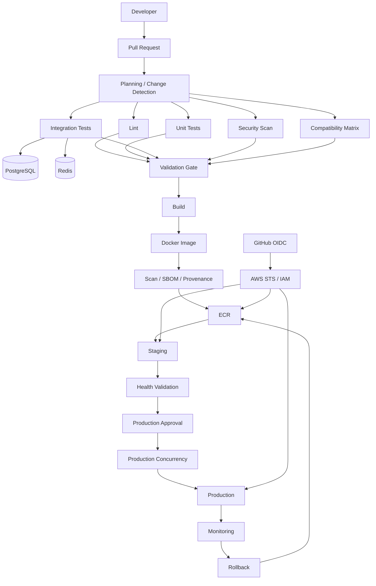
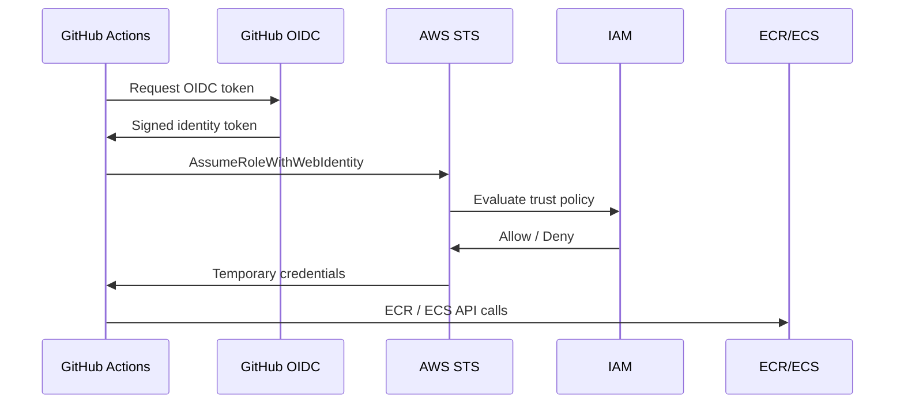
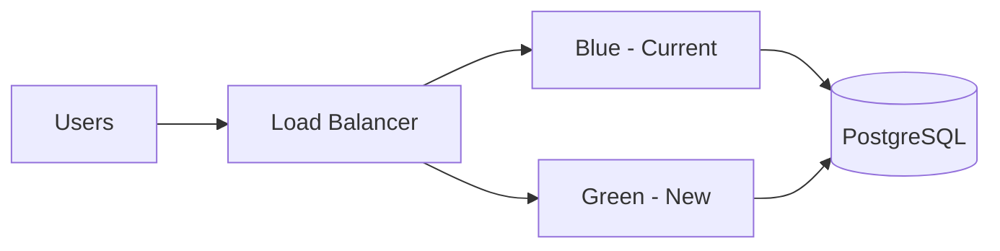
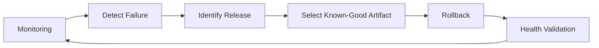
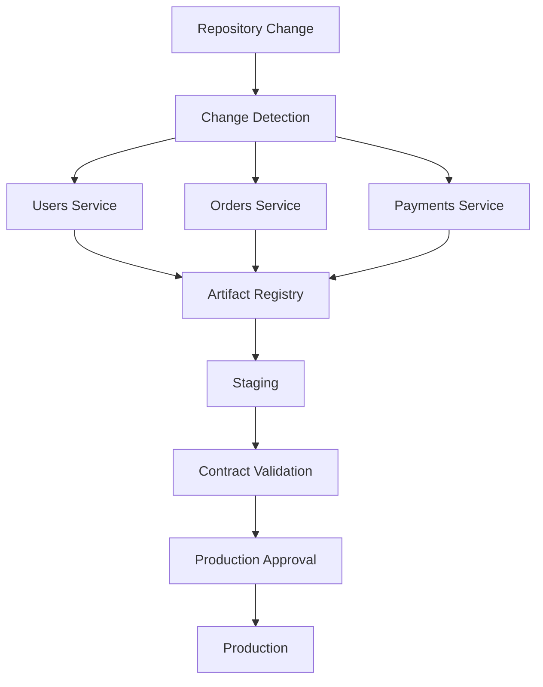

# 22- Production CI CD Scenarios

## Overview

Production CI/CD scenarios evaluate whether an engineer can design and operate a delivery system under real operational constraints.

The focus is not YAML syntax. The important questions are:

- How does code move from commit to production?
- Where are the trust boundaries?
- How is the artifact identified and protected?
- Which jobs can run in parallel?
- Where are approvals required?
- How are credentials obtained?
- How are deployments serialized?
- How are failures detected?
- How is rollback performed?
- How does the platform scale?
- How is the system governed across many repositories?

A production-oriented GitHub Actions architecture should generally separate:

```text
Source Validation
        ↓
Artifact Creation
        ↓
Artifact Verification
        ↓
Artifact Promotion
        ↓
Deployment
        ↓
Health Validation
        ↓
Monitoring
        ↓
Rollback / Recovery
```

The core principle is to treat GitHub Actions as an execution and orchestration platform rather than simply a YAML-based automation mechanism.

---

## Production CI/CD Reference Architecture

A mature backend pipeline can be modeled as:



A senior engineer should be able to explain every transition in this diagram.

---

## Production Scenario: Design CI/CD for a Django or FastAPI Application

### Scenario

A Python backend must use:

- Django or FastAPI
- PostgreSQL
- Redis
- Docker
- AWS ECR
- ECS
- GitHub Actions

The required pipeline is:

```text
Pull Request
→ Lint
→ Unit Tests
→ Integration Tests
→ Security Scan
→ Matrix Testing
→ Build
→ Docker Image
→ ECR
→ Staging
→ Approval
→ Production
→ Monitoring
→ Rollback
```

### Recommended Design

Separate validation from deployment.

```text
PR
 ↓
Parallel Validation
 ├── Lint
 ├── Unit Tests
 ├── Integration Tests
 ├── Security
 └── Matrix
 ↓
Validation Gate
 ↓
Build
 ↓
Immutable Artifact
 ↓
Staging
 ↓
Health Validation
 ↓
Production Approval
 ↓
Production
```

### Why This Structure?

Independent validation jobs can run concurrently, reducing the critical path.

Deployment remains dependent on successful validation.

The production job should not rebuild the application.

---

## Production Scenario: Prevent Two Production Deployments From Running Simultaneously

### Scenario

Two pull requests are merged within seconds of each other.

Both workflows eventually reach production.

The organization does not want concurrent production deployments.

### Solution

Use deployment concurrency.

```yaml
concurrency:
  group: production-deployment
  cancel-in-progress: false
```

This establishes a serialization boundary.

```text
Deployment A
     ↓
Production
     ↓
Complete
     ↓
Deployment B
```

### Why Not Cancel the Running Deployment?

For production, canceling an active deployment may leave:

- Partially updated infrastructure
- Mixed application versions
- Incomplete migrations
- Unhealthy instances
- Partially updated traffic routing

`cancel-in-progress: false` is often safer for production deployments.

The exact policy depends on whether the deployment system is safely interruptible and idempotent.

### Senior Consideration

Concurrency prevents overlapping executions, but it does not make deployment operations idempotent.

Both properties are required.

---

## Production Scenario: Build Once and Promote the Same Artifact

### Scenario

The security team requires that the exact artifact tested in staging is deployed to production.

### Incorrect Model

```text
Source
 ├── Build → Staging
 └── Build → Production
```

The two builds may differ.

### Preferred Model

```text
Source
 ↓
Build
 ↓
Immutable Artifact
 ↓
Staging
 ↓
Approval
 ↓
Production
```

For Docker:

```text
Image
 ↓
Digest
 ↓
Staging
 ↓
Production
```

Example:

```text
123456789012.dkr.ecr.region.amazonaws.com/backend@sha256:abc123...
```

### Why This Matters

It provides:

- Reproducibility
- Traceability
- Easier rollback
- Stronger auditability
- Consistent staging and production behavior

---

## Production Scenario: Production Requires Manual Approval

### Scenario

Production deployment requires an authorized reviewer.

### Architecture

```text
Build
 ↓
ECR
 ↓
Staging
 ↓
Health Check
 ↓
Production Environment
 ↓
Required Reviewer
 ↓
Production Deployment
```

A GitHub Environment can act as the protection boundary.

```yaml
jobs:
  deploy-production:
    environment:
      name: production

    runs-on: ubuntu-latest

    steps:
      - name: Deploy
        run: ./scripts/deploy.sh
```

The approval should authorize deployment of a known artifact.

It should not trigger a new build.

### Production Principle

```text
Approval
    ↓
Known Artifact
    ↓
Deployment
```

rather than:

```text
Approval
    ↓
Rebuild
    ↓
Deployment
```

---

## Production Scenario: AWS Credentials Must Not Be Stored as Long-Lived Secrets

### Scenario

GitHub Actions must publish images to ECR and deploy ECS workloads.

Long-lived AWS access keys are prohibited.

### Architecture



Workflow permissions:

```yaml
permissions:
  contents: read
  id-token: write
```

### IAM Design

Separate roles where practical:

```text
CI Role
Staging Deployment Role
Production Deployment Role
```

Avoid one role with unrestricted access to every AWS resource.

### Trust Policy Considerations

Restrict the role based on relevant GitHub OIDC claims such as:

- Repository
- Branch
- Environment
- Audience
- Subject

---

## Production Scenario: Production Deployment Uses ECR and ECS

### Architecture

```text
GitHub Actions
      ↓
OIDC
      ↓
AWS STS
      ↓
IAM Role
      ↓
ECR
      ↓
ECS Task Definition
      ↓
ECS Service
      ↓
ALB
      ↓
Users
```

### Artifact Flow

```text
Docker Build
 ↓
Image Scan
 ↓
Push ECR
 ↓
Record Digest
 ↓
Update ECS Task Definition
 ↓
Deploy
```

The deployment should reference the intended image identity rather than relying only on mutable tags.

---

## Production Scenario: ECR Push Succeeds but ECS Deployment Fails

### Failure Domains

Do not treat the problem as one generic AWS failure.

Separate:

```text
GitHub Actions
 ↓
OIDC
 ↓
STS
 ↓
IAM
 ↓
ECR
 ↓
ECS
 ↓
Task
 ↓
ALB
 ↓
Application
```

### Diagnostic Checks

AWS identity:

```bash
aws sts get-caller-identity
```

ECR:

```bash
aws ecr describe-repositories \
  --repository-names backend
```

ECS:

```bash
aws ecs describe-services \
  --cluster production \
  --services backend
```

Task:

```bash
aws ecs describe-tasks \
  --cluster production \
  --tasks <task-arn>
```

### Possible Causes

- Incorrect image reference
- Incorrect task definition
- Missing execution-role permissions
- Container startup failure
- Security group configuration
- Subnet/network failure
- Secrets injection failure
- Health-check failure
- Insufficient capacity

---

## Production Scenario: ECS Tasks Start but Health Checks Fail

### Important Distinction

```text
Container running
≠
Application healthy
```

Validate:

```text
Container
 ↓
Application Process
 ↓
Container Port
 ↓
Target Group
 ↓
ALB
 ↓
Health Check
```

For Django/FastAPI, a dedicated health endpoint can be used:

```text
GET /health
```

A production health check should be cheap and deterministic.

Avoid making health endpoints depend on expensive business operations.

---

## Production Scenario: Zero-Downtime Deployment

### Requirements

The application must continue serving requests while a new version is deployed.

Consider:

- Readiness
- Graceful shutdown
- Connection draining
- Rolling deployment
- Blue/green deployment
- Canary deployment
- Database compatibility
- Background worker compatibility
- Health validation

### Deployment Flow

```text
Build
 ↓
Deploy New Version
 ↓
Wait for Readiness
 ↓
Shift Traffic
 ↓
Monitor
 ↓
Remove Old Version
```

### Backend Considerations

Django/FastAPI:

- Graceful process shutdown
- Connection handling
- Readiness checks

PostgreSQL:

- Backward-compatible schema changes

Celery:

- Compatible task contracts

Kafka:

- Compatible event schemas

Redis:

- Compatible key/data structures

---

## Production Scenario: Database Migration Breaks Rollback

### Scenario

Version `v2` adds a database column and later removes an old column.

Deployment fails after the destructive migration.

Rolling back the application to `v1` now fails.

### Problem

Application rollback and database rollback are not independent.

### Safer Migration Strategy

Use expand/contract.

```text
Expand
 ↓
Deploy Compatible Application
 ↓
Backfill
 ↓
Switch Application
 ↓
Remove Legacy Structure
```

This allows multiple application versions to coexist during deployment.

### Interview Trap

A rollback strategy that ignores database compatibility is incomplete.

---

## Production Scenario: Celery Workers Must Be Deployed With the API

### Scenario

A Django application uses Celery.

The API version changes the task payload format.

Old workers may still process tasks.

### Risk

```text
New API
 +
Old Worker
 =
Incompatible Task
```

### Safer Strategy

Design task contracts for compatibility.

```text
Deploy Compatible API
 ↓
Deploy Compatible Workers
 ↓
Drain Old Workers
 ↓
Remove Old Compatibility
```

The CI/CD pipeline should treat worker compatibility as part of deployment design.

---

## Production Scenario: Kafka Schema Changes During Deployment

### Scenario

A producer changes an event schema while older consumers are still running.

During a rolling deployment:

```text
Old Producer
New Producer
Old Consumer
New Consumer
```

may coexist.

### Requirement

Event contracts should support compatible evolution.

CI can include:

- Schema validation
- Contract testing
- Producer/consumer compatibility testing

The deployment strategy must account for mixed-version operation.

---

## Production Scenario: Blue/Green Deployment

### Architecture



### Lifecycle

```text
Blue = Active
Green = Standby
       ↓
Deploy Green
       ↓
Validate Green
       ↓
Switch Traffic
       ↓
Monitor
       ↓
Keep Blue Available for Rollback
```

### Advantages

- Fast traffic switch
- Straightforward rollback
- Strong isolation between versions

### Limitations

- Additional capacity
- More infrastructure
- Database compatibility still required
- Stateful workloads require careful design

---

## Production Scenario: Canary Deployment

### Scenario

A high-risk production release should initially receive only a small percentage of traffic.

```text
95% → Stable
5%  → Canary
```

If healthy:

```text
75% → Stable
25% → Canary
```

Then:

```text
50% → Stable
50% → Canary
```

Finally:

```text
100% → New Version
```

### Promotion Signals

Use measurable signals:

- Error rate
- p95/p99 latency
- Application exceptions
- CPU
- Memory
- Queue lag
- Dependency failures
- Business-specific metrics

### Important Requirement

Canary traffic should be representative of real production traffic.

---

## Production Scenario: Rolling Deployment

### Architecture

```text
Instance 1 → New
Instance 2 → Old
Instance 3 → Old
Instance 4 → Old

Then:

Instance 1 → New
Instance 2 → New
Instance 3 → Old
Instance 4 → Old

Then:

All → New
```

### Critical Requirement

Old and new versions must be compatible while they coexist.

This affects:

- Database schema
- API contracts
- Redis structures
- Kafka events
- Celery tasks
- External APIs

---

## Production Scenario: Production Rollback

### Desired Flow



### Key Principle

The previous artifact should already exist.

Avoid:

```text
Incident
 ↓
Checkout Old Commit
 ↓
Rebuild
 ↓
Deploy
```

Prefer:

```text
Incident
 ↓
Select Known-Good Artifact
 ↓
Deploy
```

This makes rollback faster and more deterministic.

---

## Production Scenario: Automated Rollback

### Scenario

A deployment increases the error rate above a defined threshold.

Potential automation:

```text
Deploy
 ↓
Health Check
 ↓
Monitor
 ↓
Failure Threshold
 ↓
Stop Promotion
 ↓
Rollback
 ↓
Validate
```

### Risk

Automatic rollback can itself create an incident if:

- Metrics are noisy
- Health checks are incorrect
- Rollback artifact is incompatible
- Rollback triggers repeatedly
- Database changes are irreversible

Automated rollback should therefore have bounded behavior and explicit success criteria.

---

## Production Scenario: Production Deployment Race Condition

### Scenario

Release A starts first but takes longer.

Release B starts later and reaches production earlier.

Without controls:

```text
Release A → Production
Release B → Production
Release A → Production
```

The older release may overwrite the newer release.

### Controls

Use:

- Concurrency
- Artifact identity
- Release ordering
- Environment protection
- Idempotent deployment
- Explicit promotion policy

Concurrency should be applied to the actual deployment resource.

---

## Production Scenario: Pull Requests Are Executing Privileged Code

### Scenario

A public repository accepts external pull requests.

The workflow checks out PR code and provides:

```text
AWS Credentials
Repository Secrets
Write Permissions
```

### Security Boundary

The pull request code is untrusted.

Do not allow untrusted code to execute with production privileges.

Prefer:

```text
Untrusted PR
 ↓
Read-only CI
 ↓
No Production Secrets
 ↓
No Production AWS Role
```

Privileged deployment should occur only from a trusted workflow context.

---

## Production Scenario: `pull_request_target` Is Used to Access Secrets

### Scenario

A developer changes:

```yaml
on:
  pull_request:
```

to:

```yaml
on:
  pull_request_target:
```

because secrets are required.

### Problem

The trigger has a different security model.

The danger arises when trusted workflow privileges are combined with execution of untrusted pull request content.

### Better Architecture

Separate:

```text
Untrusted Validation
```

from:

```text
Privileged Deployment
```

Do not use `pull_request_target` simply as a shortcut for accessing secrets.

---

## Production Scenario: Third-Party Action Is Compromised

### Scenario

A Marketplace action used by hundreds of repositories is compromised.

### Incident Response

Determine:

```text
Which workflows used it?
        ↓
Which commits executed it?
        ↓
Which permissions did it receive?
        ↓
Which secrets were accessible?
        ↓
Which AWS roles were accessible?
        ↓
Which runners executed it?
        ↓
Which artifacts were produced?
```

### Containment

Potential actions:

- Remove the action
- Replace it
- Pin a trusted version
- Rotate exposed secrets
- Revoke cloud credentials where required
- Inspect runner state
- Inspect artifacts
- Review audit logs
- Rebuild trusted artifacts

### Prevention

Use:

```text
SHA Pinning
+
Action Allowlists
+
Least Privilege
+
OIDC
+
Scoped Secrets
+
Ephemeral Runners
+
Artifact Provenance
```

---

## Production Scenario: Self-Hosted Runner Needs Private Network Access

### Scenario

The deployment target is inside an AWS VPC.

GitHub-hosted runners cannot directly access the private service.

### Architecture

```text
GitHub Actions
      ↓
Runner Group
      ↓
Ephemeral Runner
      ↓
Private VPC
 ┌────┼─────────┐
 ↓    ↓         ↓
ECS  RDS      Redis
```

### Network Requirements

Check:

- Subnet
- Route table
- Security groups
- Network ACLs
- DNS
- Proxy
- TLS
- Egress
- Private endpoints

### Security

Do not allow every workflow to use the production runner group.

Restrict access using:

- Runner groups
- Repository policies
- Labels
- Workflow permissions
- Environment protection

---

## Production Scenario: Persistent Runner Becomes Contaminated

### Problem

One workflow leaves files or credentials on a persistent runner.

A later job can access them.

### Risk Model

```text
Job A
 ↓
Persistent Filesystem
 ↓
Job B
```

### Safer Model

```text
Provision
 ↓
Register
 ↓
Execute One Job
 ↓
Destroy
```

Ephemeral runners reduce persistent state and improve isolation.

---

## Production Scenario: Runner Autoscaling

### Scenario

CI load varies significantly throughout the day.

Fixed runners cause either:

- Queueing during peaks
- Idle capacity during quiet periods

### Architecture

```text
Workflow Queue
      ↓
Capacity Controller
      ↓
Runner Provisioning
      ↓
Ephemeral Runners
      ↓
Jobs
      ↓
Runner Destruction
```

### Consider

- Maximum runner count
- Minimum capacity
- Cold-start time
- Image provisioning
- AWS quotas
- IP availability
- Docker capacity
- Downstream database capacity
- Cost

Scaling runners does not help if PostgreSQL, Redis, Kafka, or the deployment target becomes the bottleneck.

---

## Production Scenario: CI Pipeline Is Too Slow

### Scenario

A pull request takes 45 minutes.

### First Step

Analyze the dependency graph.

```text
Lint
Unit
Integration
Security
     ↓
Validation Gate
     ↓
Build
```

If these validation stages are independent, execute them concurrently.

### Optimization Areas

- Parallel jobs
- Matrix size
- Dependency caching
- Docker layer caching
- Build context
- Test partitioning
- Selective CI
- Reusable workflow overhead

Optimize the critical path rather than blindly optimizing every job.

---

## Production Scenario: Matrix Has Become Too Large

### Example

```text
4 Python versions
×
2 databases
×
2 operating systems
×
2 architectures
=
32 jobs
```

### Better Strategy

Pull request:

```text
Primary Python Versions
+
Primary Database
+
Linux
```

Nightly/release:

```text
Full Compatibility Matrix
```

### Matrix Controls

Use:

```yaml
strategy:
  fail-fast: false
  max-parallel: 8
```

Use `include` and `exclude` to model meaningful combinations rather than generating every Cartesian product.

---

## Production Scenario: Integration Tests Require PostgreSQL and Redis

### Architecture

```text
Python Test Job
 ├── PostgreSQL
 ├── Redis
 └── pytest
```

Example:

```yaml
jobs:
  integration:
    runs-on: ubuntu-latest

    services:
      postgres:
        image: postgres:16
        env:
          POSTGRES_USER: test
          POSTGRES_PASSWORD: test
          POSTGRES_DB: app_test
        ports:
          - 5432:5432

      redis:
        image: redis:7
        ports:
          - 6379:6379

    steps:
      - uses: actions/checkout@<pinned-sha>

      - uses: actions/setup-python@<pinned-sha>
        with:
          python-version: "3.12"

      - run: pip install -r requirements-dev.txt
      - run: pytest tests/integration
```

### Important Consideration

Service startup does not necessarily mean application readiness.

Use health checks or explicit readiness checks where required.

---

## Production Scenario: Docker Build Is Slow

### Investigation

Check:

- Dockerfile layer order
- `.dockerignore`
- Build context size
- Dependency installation
- BuildKit
- Cache configuration
- Base image
- Multi-stage build

Example:

```dockerfile
COPY requirements.txt .
RUN pip install --no-cache-dir -r requirements.txt

COPY . .
```

Changing application source should not unnecessarily invalidate the dependency installation layer.

---

## Production Scenario: Docker Cache Becomes a Security Risk

### Scenario

An untrusted workflow can influence a cache later consumed by a trusted build.

### Risk

```text
Untrusted Build
      ↓
Cache
      ↓
Trusted Build
```

Caches are performance mechanisms, not automatically trusted release artifacts.

Use appropriate scopes and trust boundaries.

---

## Production Scenario: Artifact Is Missing

### Symptoms

Build succeeds but deployment cannot find the artifact.

### Failure Domains

Check:

```text
Upload Step
 ↓
Artifact Path
 ↓
Artifact Name
 ↓
Job Dependency
 ↓
Artifact Retention
 ↓
Download Step
```

Example:

```yaml
- name: Upload build
  uses: actions/upload-artifact@<pinned-sha>
  with:
    name: backend-build
    path: dist/
```

Download:

```yaml
- name: Download build
  uses: actions/download-artifact@<pinned-sha>
  with:
    name: backend-build
```

### Important Distinction

| Mechanism | Primary Purpose |
|---|---|
| Artifact | Workflow output |
| Cache | Reuse expensive computation |
| Job output | Small structured data |
| Environment variable | Runtime/job configuration |

---

## Production Scenario: Dynamic Matrix Is Generated From Changed Services

### Scenario

A monorepo contains:

```text
services/
  users/
  orders/
  payments/
```

Only changed services should run.

### Architecture

```text
Git Diff
 ↓
Planning Job
 ↓
Changed Services
 ↓
JSON
 ↓
Job Output
 ↓
fromJSON()
 ↓
Dynamic Matrix
```

Conceptually:

```yaml
strategy:
  matrix: ${{ fromJSON(needs.plan.outputs.matrix) }}
```

### Failure Points

- Invalid JSON
- Incorrect output
- Missing `needs`
- Empty matrix
- Incorrect shell escaping
- Incorrect path detection

---

## Production Scenario: Reusable Workflow Shared Across Repositories

### Scenario

100 repositories need the same CI standards.

### Architecture

```text
Repository A ─┐
Repository B ─┤
Repository C ─┼→ Reusable CI Workflow
Repository D ─┤
Repository E ─┘
```

Use reusable workflows for multi-job orchestration.

Use composite actions for reusable steps inside a job.

### API Contract

A reusable workflow should have explicit:

- Inputs
- Outputs
- Secrets
- Permissions
- Versioning expectations

Treat it like a shared API.

---

## Production Scenario: Central Workflow Breaking Many Repositories

### Problem

A central workflow change breaks dozens of consumers.

### Better Approach

Use:

```text
Versioned Workflow
+
Compatibility Contract
+
Consumer Testing
+
Canary Rollout
+
Controlled Migration
+
Rollback
```

For example:

```text
ci/v1
ci/v2
```

allows repositories to migrate deliberately.

Centralization improves consistency but increases blast radius.

---

## Production Scenario: Production Pipeline Needs Security Scanning

### Recommended Flow

```text
Source
 ↓
Dependency Scan
 ↓
Build
 ↓
Container Scan
 ↓
SBOM
 ↓
Provenance
 ↓
Artifact
 ↓
Staging
 ↓
Production
```

Security checks should be positioned according to their purpose.

Fast checks can run early.

Artifact-specific checks must run against the actual release artifact.

---

## Production Scenario: Need Artifact Provenance

### Scenario

Security requires proof of:

```text
Which source produced this artifact?
Which workflow produced it?
Which commit produced it?
Which build environment was used?
```

### Architecture

```text
Source Commit
      ↓
Workflow Run
      ↓
Build
      ↓
Artifact
      ↓
Provenance
      ↓
Promotion
```

Record:

- Commit SHA
- Workflow run
- Repository
- Artifact digest
- Build metadata
- Release version

This improves incident investigation and release traceability.

---

## Production Scenario: Release Workflow

### Scenario

Production releases are created from Git tags.

```text
Git Tag
 ↓
Validate Version
 ↓
Build
 ↓
Test
 ↓
Scan
 ↓
Publish Artifact
 ↓
Create Release
 ↓
Promote
```

Semantic versioning can be represented as:

```text
MAJOR.MINOR.PATCH
```

Pre-releases can use identifiers such as:

```text
2.4.0-rc.1
```

The release version should not replace immutable artifact identity.

---

## Production Scenario: Deployment Is Successful but Users See Errors

### Important Distinction

```text
Deployment Command Succeeded
≠
Release Succeeded
```

Validate:

- HTTP health
- Error rate
- Latency
- Application logs
- Dependency health
- Queue health
- Load balancer health
- Database connectivity

The production pipeline should include post-deployment validation.

---

## Production Scenario: Production Health Check Fails

### Model

```text
Deploy
 ↓
Readiness
 ↓
Health Validation
 ↓
Traffic
```

If validation fails:

```text
Stop Promotion
 ↓
Rollback / Recover
```

Do not continue promoting an unhealthy release.

---

## Production Scenario: Workflow Fails Intermittently

### Symptoms

- Random network errors
- Random test failures
- Runner instability
- Dependency download failures

### Investigate

```text
Failure Frequency
 ↓
Failure Pattern
 ↓
Environment
 ↓
Dependency
 ↓
Resource Usage
 ↓
Root Cause
```

Retries should be:

- Bounded
- Targeted
- Observable

Avoid unlimited retries.

---

## Production Scenario: Test Is Flaky

### Bad Response

> Just rerun the workflow.

### Better Approach

Capture:

- Test identity
- Runner
- Python version
- Database
- Timing
- Logs
- Resource usage
- Failure frequency

Investigate:

- Race conditions
- Shared state
- Timing assumptions
- External services
- Test isolation
- Resource exhaustion

Retries can mitigate transient failures but should not hide deterministic defects.

---

## Production Scenario: CI Depends on External APIs

### Problem

Integration tests call a third-party API that occasionally fails.

### Options

Depending on the purpose of the test:

```text
Mock
Contract Test
Sandbox
Dedicated Test Environment
Controlled Retry
```

Do not make the entire CI system dependent on an unreliable external production service unless that dependency is itself the thing being validated.

---

## Production Scenario: Private Kafka Is Required for Integration Testing

### Architecture

```text
Ephemeral / Private Runner
        ↓
Private Network
        ↓
Kafka
```

Check:

- DNS
- Routing
- Security groups
- TLS
- Authentication
- Broker availability
- Topic isolation
- Consumer groups

Never accidentally connect CI integration tests to production Kafka.

---

## Production Scenario: GitHub Actions Must Access a Private Database

### Architecture

```text
GitHub Actions
      ↓
Self-Hosted Runner
      ↓
Private VPC
      ↓
PostgreSQL
```

Diagnostics:

```bash
getent hosts database.internal
```

```bash
nc -vz database.internal 5432
```

PostgreSQL:

```bash
psql "$DATABASE_URL"
```

Investigate:

```text
DNS
Route
Security Group
NACL
Port
TLS
Database Listener
Credentials
```

---

## Production Scenario: Deployment Pipeline Has a Long Critical Path

### Example

```text
Lint
 ↓
Unit
 ↓
Integration
 ↓
Security
 ↓
Build
```

If the stages are independent, this unnecessarily serializes work.

Prefer:

```text
Lint ────────┐
Unit ────────┤
Integration ─┤
Security ────┘
       ↓
     Build
```

The objective is to reduce total wall-clock time without weakening validation.

---

## Production Scenario: CI Cost Is Increasing

### Measure

```text
Execution Time
×
Runner Usage
×
Workflow Frequency
```

Investigate:

- Large matrices
- Duplicate workflows
- Repeated dependency installation
- Docker rebuilds
- E2E frequency
- Cache effectiveness
- Idle self-hosted capacity

### Optimization

Use:

```text
Selective CI
+
Parallel Execution
+
Caching
+
Build Once
+
Right-Sized Matrix
+
Ephemeral Autoscaling
```

Cost optimization should not remove required security or production controls.

---

## Production Scenario: Need Separate Fast PR CI and Full Nightly CI

### PR

```text
Lint
Unit
Core Integration
Fast Security
Primary Compatibility
```

### Nightly

```text
Full Matrix
Extended Integration
Broader Compatibility
Deep Security Scans
```

This provides faster developer feedback while preserving deeper validation.

---

## Production Scenario: Environment Promotion

A controlled environment model might be:

```text
Development
    ↓
Staging
    ↓
Production
```

Each environment can have:

- Variables
- Secrets
- Deployment protections
- Branch restrictions
- Reviewers
- Deployment history

The artifact should remain the same while environment-specific configuration changes.

---

## Production Scenario: Environment Drift

### Problem

Staging and production behave differently.

Possible causes:

- Different environment variables
- Different database versions
- Different infrastructure
- Different dependency configuration
- Different network topology
- Manual infrastructure changes

### Better Strategy

Use infrastructure as code where appropriate:

```text
Terraform
CloudFormation
```

and continuously validate important environment assumptions.

---

## Production Scenario: Need High Availability for CI/CD

Consider failure of:

```text
Runner
Registry
Cloud Authentication
Deployment Target
Availability Zone
Dependency
```

Use:

- Multiple runner capacity
- Autoscaling
- Immutable artifacts
- Redundant deployment targets
- Health checks
- Rollback
- Recovery procedures

CI/CD availability should not become a hidden dependency that prevents production recovery.

---

## Production Scenario: CI/CD Disaster Recovery

A recovery plan should answer:

```text
Where is source?
Where is the last known-good artifact?
How is the artifact identified?
How is AWS authentication performed?
How is infrastructure recreated?
How is deployment state recovered?
How is the restored environment validated?
```

A Git repository alone does not provide complete deployment recovery.

---

## Production Scenario: Enterprise Action Governance

### Problem

Developers can use arbitrary Marketplace actions.

### Risk

Third-party actions execute code inside privileged workflows.

### Governance Model

```text
Action Registry
 ↓
Approval
 ↓
Version / SHA Pinning
 ↓
Security Review
 ↓
Usage Monitoring
 ↓
Periodic Revalidation
```

Use enterprise or organization policies where appropriate.

Exceptions should be explicit and auditable.

---

## Production Scenario: Need to Minimize GITHUB_TOKEN Permissions

Start restrictive:

```yaml
permissions:
  contents: read
```

Then grant additional permissions only where needed.

Example:

```yaml
jobs:
  test:
    permissions:
      contents: read

  release:
    permissions:
      contents: write
```

### Principle

```text
Job Responsibility
        ↓
Required Permission
        ↓
Minimum Scope
```

Avoid broad permissions across the entire workflow when only one job requires them.

---

## Production Scenario: Untrusted Input Is Used in Shell Commands

### Risk

Values such as:

- Pull request titles
- Branch names
- Commit messages
- Issue content
- Workflow inputs

may be attacker-controlled.

Avoid directly inserting untrusted values into shell source.

Prefer passing them as environment data:

```yaml
env:
  BRANCH_NAME: ${{ github.head_ref }}

run: |
  printf '%s\n' "$BRANCH_NAME"
```

Validate values before using them as:

- File paths
- Docker tags
- AWS resource identifiers
- Command arguments
- Configuration values

---

## Production Scenario: Docker Tag Comes From User Input

### Problem

A workflow constructs:

```text
docker build -t app:<user-input>
```

### Risk

Untrusted values can cause malformed commands or unexpected behavior.

### Safer Strategy

Prefer trusted identifiers:

```text
Commit SHA
```

or validate and normalize the value before using it.

A release version can be used as metadata, while the digest remains the strongest artifact identity.

---

## Production Scenario: Need to Separate CI From CD

### CI Responsibility

```text
Validate Source
 ↓
Test
 ↓
Scan
 ↓
Build
 ↓
Publish Artifact
```

### CD Responsibility

```text
Select Artifact
 ↓
Promote
 ↓
Deploy
 ↓
Validate
 ↓
Rollback
```

Separating the concerns makes security boundaries and operational ownership clearer.

---

## Production Scenario: Need Deployment After Successful CI

A deployment workflow can be triggered from a completed CI workflow where appropriate.

Conceptually:

```text
CI Workflow
     ↓
Successful Completion
     ↓
Deployment Workflow
```

When using workflow-to-workflow mechanisms, carefully validate:

- Artifact identity
- Source workflow
- Commit
- Trust context
- Permissions

Do not blindly trust arbitrary workflow metadata.

---

## Production Scenario: Manual Deployment

A manually triggered workflow can use:

```yaml
on:
  workflow_dispatch:
    inputs:
      environment:
        required: true
        type: choice
        options:
          - staging
          - production
```

The selected environment should still enforce environment protection.

Manual input is not a replacement for authorization.

---

## Production Scenario: Scheduled Validation

Scheduled workflows can perform:

- Full compatibility matrices
- Deep dependency scans
- Extended integration tests
- Security validation
- Infrastructure checks

Example:

```yaml
on:
  schedule:
    - cron: "0 2 * * *"
```

Scheduled workflows complement event-driven CI rather than replacing it.

---

## Production Scenario: Need to Debug a Failed Workflow

### Troubleshooting Model

```text
Symptom
 ↓
Possible Causes
 ↓
Isolation Strategy
 ↓
Commands / Checks
 ↓
Root Cause
 ↓
Corrective Action
 ↓
Prevention
```

Always identify the failure domain before changing configuration.

---

## Workflow Failure Domains

| Failure Domain | First Checks |
|---|---|
| Syntax | YAML structure, workflow parser |
| Trigger | Event, branch, path, tag |
| Job | `needs`, `if`, status |
| Step | Exit code, command, working directory |
| Expression | Context, syntax, type |
| Secret | Scope, name, environment |
| Permission | `permissions`, token scope |
| Matrix | JSON, dimensions, exclusions |
| Artifact | Path, name, upload/download |
| Cache | Key, path, restore behavior |
| Container | Image, networking, filesystem |
| Service | Readiness, port, DNS |
| Runner | Labels, tools, disk, memory |
| OIDC | Token permission, trust policy |
| AWS | STS, IAM, region, resource policy |
| Docker | Context, layers, Buildx, cache |
| Registry | Authentication, repository, image |
| Deployment | Task health, network, configuration |
| Concurrency | Group, cancellation, race |
| Security | Trust boundary, permissions, secrets |

---

## Production Scenario: Workflow Is Not Triggering

### Symptom

A developer pushes a commit but no workflow starts.

### Possible Causes

- Incorrect event
- Branch filter
- Path filter
- Tag filter
- Workflow disabled
- Invalid YAML
- Repository Actions policy

### Isolation

Check:

```text
Workflow File
 ↓
Event
 ↓
Branch
 ↓
Path
 ↓
Repository Policy
```

Do not begin by debugging runners if the workflow never started.

---

## Production Scenario: Job Is Skipped

### Possible Causes

- `needs` dependency
- `if` condition
- Branch condition
- Upstream skipped job
- Status function
- Event context

Inspect:

```text
needs.<job>.result
```

and the relevant event context.

---

## Production Scenario: Secret Is Empty

### Check

```text
Secret Name
 ↓
Repository Scope
 ↓
Organization Scope
 ↓
Environment Scope
 ↓
Reusable Workflow Contract
 ↓
Fork Restrictions
```

Never print the value while debugging.

Use safe metadata such as:

```text
Secret configured: yes/no
```

where appropriate, without exposing the secret.

---

## Production Scenario: Artifact Upload Succeeds but Download Fails

Check:

- Artifact name
- Upload path
- Download name
- Job dependency
- Workflow run
- Retention
- Conditional execution

Example:

```yaml
- name: Upload report
  uses: actions/upload-artifact@<pinned-sha>
  with:
    name: pytest-report
    path: reports/
```

Downstream:

```yaml
- name: Download report
  uses: actions/download-artifact@<pinned-sha>
  with:
    name: pytest-report
```

---

## Production Scenario: OIDC Authentication Fails

### Troubleshooting Flow

```text
id-token: write
      ↓
OIDC Token
      ↓
AWS Trust Policy
      ↓
Subject / Audience
      ↓
STS
      ↓
Temporary Credentials
      ↓
AWS API
```

Check:

```yaml
permissions:
  id-token: write
```

Then:

```bash
aws sts get-caller-identity
```

### Common Causes

- Missing `id-token: write`
- Wrong role ARN
- Wrong AWS account
- Trust policy mismatch
- Incorrect subject claim
- Incorrect audience
- Environment mismatch
- Branch mismatch

---

## Production Scenario: AWS `AccessDenied`

Separate:

```text
Authentication
```

from:

```text
Authorization
```

A successful OIDC exchange does not mean the role can perform every AWS operation.

Investigate:

- IAM identity policy
- Trust policy
- Resource policy
- Permission boundary
- Service control policy
- `iam:PassRole`
- Resource ARN
- Region

---

## Production Scenario: Docker Registry Authentication Fails

### Troubleshooting

Check:

```text
AWS Identity
 ↓
ECR Repository
 ↓
ECR Login
 ↓
Docker Credential
 ↓
Push Permission
```

Useful command:

```bash
aws sts get-caller-identity
```

Then verify repository existence:

```bash
aws ecr describe-repositories \
  --repository-names backend
```

The AWS identity used by the workflow should be explicitly known.

---

## Production Scenario: Deployment Failure Is Caused by a Runner

### Symptoms

- Docker unavailable
- Disk full
- Missing binary
- Network failure
- Memory pressure
- Old dependencies

Check:

```bash
df -h
```

```bash
free -h
```

```bash
docker version
```

```bash
python --version
```

```bash
uname -a
```

The exact commands depend on the runner operating system.

---

## Production Scenario: Need to Inspect GitHub Actions From CLI

GitHub CLI provides useful operational commands.

List workflows:

```bash
gh workflow list
```

Run a workflow:

```bash
gh workflow run deploy.yml
```

List runs:

```bash
gh run list
```

Inspect a run:

```bash
gh run view <run-id>
```

View logs:

```bash
gh run view <run-id> --log
```

Rerun:

```bash
gh run rerun <run-id>
```

These commands are useful during operational troubleshooting and release management.

---

## Production Scenario: Workflow Needs Operational Metadata

Record information such as:

```text
Commit SHA
Workflow Run ID
Artifact Digest
Environment
Deployment Time
Release Version
Runner
AWS Account
Deployment Result
```

This allows an engineer to answer:

> Which exact artifact is running in production?

without reconstructing the deployment manually.

---

## Production Scenario: Need Observability Around Deployments

Track:

- Deployment duration
- Deployment frequency
- Failure rate
- Rollback rate
- Time to recovery
- Health-check failures
- Runner failures
- Queue time
- Workflow duration
- Artifact build duration

The CI/CD platform itself should be observable.

---

## Production Scenario: Need CI/CD Governance Across Hundreds of Repositories

A platform team can standardize:

```text
Reusable CI
Reusable Security
Reusable Docker Build
Reusable Deployment
Approved Actions
Runner Platform
OIDC
Artifact Standards
Environment Standards
```

Application teams retain responsibility for:

```text
Tests
Application Configuration
Dockerfile
Service Metadata
Ownership
```

This balances platform standardization with application autonomy.

---

## Production Scenario: Central Workflow Becomes a Single Point of Failure

### Problem

Hundreds of repositories depend on one workflow.

If it breaks:

```text
Central Workflow
      ↓
Many Repositories
      ↓
CI/CD Disrupted
```

### Mitigation

Use:

- Versioned reusable workflows
- Backward compatibility
- Consumer testing
- Canary rollout
- Controlled migration
- Rollback
- Clear ownership

Centralization reduces duplication but increases blast radius.

---

## Production Scenario: Need a Microservice CI/CD Architecture

### Architecture



Each service should have:

- Independent artifact identity
- Independent deployment state
- Clear ownership
- Appropriate contract testing
- Independent rollback capability

---

## Production Scenario: Monorepo With Selective CI

### Problem

A monorepo contains dozens of services.

A change to one service should not execute every service's full pipeline.

### Architecture

```text
Git Diff
 ↓
Changed Files
 ↓
Dependency Graph
 ↓
Affected Services
 ↓
Dynamic Matrix
 ↓
Parallel Validation
```

Be careful with shared libraries.

A change to:

```text
shared/auth/
```

may affect multiple services.

---

## Production Scenario: Infrastructure and Application Deployment

Avoid unnecessary coupling.

Prefer:

```text
Infrastructure Pipeline
        ↓
Infrastructure Ready
        ↓
Application Pipeline
        ↓
Artifact Promotion
        ↓
Deployment
```

When coordination is necessary, make the dependency explicit.

Use:

- Terraform
- CloudFormation
- GitHub Environments
- Reusable workflows
- Artifact metadata

where appropriate.

---

## Production Scenario: Terraform in Production CI/CD

A production infrastructure pipeline can use:

```text
Format
 ↓
Validate
 ↓
Security / Policy Checks
 ↓
Plan
 ↓
Review
 ↓
Apply
```

Keep infrastructure permissions separate from application deployment permissions where practical.

A normal application CI job should not automatically have unrestricted production infrastructure permissions.

---

## Production Scenario: CloudFormation in Production CI/CD

A controlled flow:

```text
Validate
 ↓
Change Set
 ↓
Review
 ↓
Deploy
 ↓
Monitor
```

Consider:

- Stack rollback
- Drift
- IAM permissions
- Termination protection
- Environment separation
- Multi-account architecture

---

## Production Scenario: Release Artifact Is Suspected of Being Compromised

### Investigation

Trace:

```text
Source Commit
 ↓
Workflow Run
 ↓
Runner
 ↓
Build Dependencies
 ↓
Docker Image
 ↓
Registry
 ↓
Deployment
```

Check:

- SBOM
- Provenance
- Attestation
- Image digest
- Workflow changes
- Action versions
- Dependency changes
- Runner integrity

If artifact integrity cannot be established, do not assume the artifact is trustworthy.

---

## Production Scenario: Need to Design for Supply-Chain Security

A mature pipeline can use:

```text
Trusted Source
 ↓
Protected Workflow
 ↓
Pinned Actions
 ↓
Least-Privilege Permissions
 ↓
Dependency Controls
 ↓
Secure Build
 ↓
SBOM
 ↓
Provenance
 ↓
Attestation / Signing
 ↓
Immutable Artifact
 ↓
Controlled Promotion
```

Each stage protects a different part of the supply chain.

---

## Production Scenario: Need to Protect Against Artifact Poisoning

Artifact integrity requires:

- Immutable artifact identity
- Digest verification
- Controlled artifact producers
- Restricted artifact publishing
- Provenance
- Trusted promotion workflows

Do not allow an untrusted workflow to overwrite a production artifact reference.

---

## Production Scenario: Need to Design for Disaster Recovery

A mature deployment platform should preserve enough information to recover from:

- GitHub workflow failures
- Runner failures
- Registry failures
- Infrastructure failures
- Deployment failures
- Application failures

Recovery should have:

```text
Known-Good Artifact
+
Infrastructure Definition
+
Deployment Metadata
+
Authentication Path
+
Recovery Runbook
```

---

## Production Scenario: Need to Reduce Runner Cost

Use autoscaling when workload is bursty.

Consider:

```text
Minimum Capacity
Maximum Capacity
Cold Start
Warm Pool
Job Duration
Queue Time
Runner Cost
```

Do not scale runners indefinitely if downstream services cannot handle the increased concurrency.

---

## Production Scenario: Need to Protect a Private Production Runner

Use multiple layers:

```text
Repository Access
+
Runner Group
+
Labels
+
Environment Protection
+
Workflow Permissions
+
Network Segmentation
+
Ephemeral Lifecycle
```

A private network is not itself an authorization mechanism.

---

## Production Scenario: Need to Handle a Failed Deployment Mid-Rollout

Example:

```text
Instance 1 → New
Instance 2 → New
Instance 3 → Old
Instance 4 → Old
```

The application may temporarily run mixed versions.

Therefore the application must tolerate mixed-version operation.

This affects:

- API contracts
- Database schema
- Redis
- Kafka
- Celery
- External APIs

---

## Production Scenario: Need to Validate a Deployment Before Traffic Shift

Use:

```text
Deploy
 ↓
Readiness
 ↓
Smoke Tests
 ↓
Health Checks
 ↓
Traffic Shift
```

Smoke tests can validate critical paths such as:

```text
GET /health
POST /authentication
GET /critical-resource
```

Keep them deterministic and safe.

---

## Production Scenario: Need to Protect Production From Stale Releases

If multiple releases are queued, define a release policy.

Possible considerations:

- Serialize deployments
- Cancel obsolete queued work where safe
- Require current artifact validation
- Prevent older artifacts from overriding newer production state
- Preserve rollback artifacts

The policy should match the deployment mechanism and release model.

---

## Production Scenario: Need to Handle a Failed Approval

If production approval is delayed:

```text
Artifact
 ↓
Staging
 ↓
Health Validation
 ↓
Approval Pending
```

The artifact should remain identifiable.

Do not silently rebuild while waiting for approval.

If artifacts expire or become invalid, the promotion must fail explicitly rather than deploying an unverified replacement.

---

## Production Scenario: Need to Design CI/CD for High Availability

A production-oriented CI/CD platform should avoid unnecessary single points of failure.

Consider:

- Runner capacity
- Registry availability
- AWS control-plane dependencies
- Deployment target capacity
- Artifact availability
- Infrastructure-as-code recovery
- Rollback capability

The deployment mechanism itself should not become the reason a known-good release cannot be restored.

---

## Production Scenario: Need to Design a Complete Production Pipeline

A strong final design is:

```text
Pull Request
 ↓
Planning / Change Detection
 ↓
Lint ────────────────┐
Unit Tests ──────────┤
Integration Tests ───┤
Security Scan ───────┤
Matrix Tests ────────┘
 ↓
Validation Gate
 ↓
Docker Buildx
 ↓
Security Scan
 ↓
SBOM / Provenance
 ↓
Immutable Image
 ↓
ECR
 ↓
Staging
 ↓
Health Validation
 ↓
Production Approval
 ↓
Production Concurrency
 ↓
Rolling / Blue-Green / Canary
 ↓
Health Validation
 ↓
Monitoring
 ↓
Rollback if Required
```

### Security Boundaries

```text
Untrusted PR
      ↓
Read-only validation

Trusted Build
      ↓
Artifact creation

Privileged Deployment
      ↓
OIDC
      ↓
AWS IAM Role
      ↓
Production
```

### Artifact Flow

```text
Commit SHA
    ↓
Build
    ↓
Image Digest
    ↓
ECR
    ↓
Staging
    ↓
Production
```

The artifact identity must remain consistent across promotion.

---

## Production Scenario Interview Questions

### CI Architecture

1. Design a GitHub Actions pipeline for a Django application deployed to ECS.
2. How would you minimize the critical path of the pipeline?
3. Which jobs should execute in parallel?
4. How would you design a workflow dependency graph?
5. How would you separate CI and CD?
6. How would you design CI for a monorepo?
7. How would you implement selective testing?

### Matrix Design

8. How would you test multiple Python versions?
9. How would you test multiple databases?
10. When should a full compatibility matrix run?
11. How do `fail-fast` and `max-parallel` affect matrix execution?
12. How would you generate a matrix dynamically?

### Security

13. How would you secure pull request workflows?
14. Why is `pull_request_target` dangerous?
15. How would you prevent secrets from reaching untrusted code?
16. How would you secure third-party actions?
17. Why should actions be SHA-pinned?
18. How would you minimize `GITHUB_TOKEN` permissions?
19. How would you respond to a compromised action?
20. How would you design a secure self-hosted runner?

### AWS

21. Explain GitHub Actions OIDC authentication with AWS.
22. What should the IAM trust policy contain?
23. How would you separate staging and production IAM roles?
24. How would you troubleshoot an `AccessDenied` error?
25. How would you securely push Docker images to ECR?
26. How would you deploy an ECR image to ECS?
27. How would you separate CI and deployment AWS permissions?

### Docker

28. How would you optimize Docker build performance?
29. How would you use Buildx?
30. How would you implement layer caching?
31. Why should production use image digests?
32. How would you generate an SBOM?
33. How would you prevent cache poisoning?
34. How would you promote a Docker image without rebuilding it?

### Deployment

35. How would you prevent concurrent production deployments?
36. How would you implement deployment approval?
37. Explain rolling deployment.
38. Explain blue/green deployment.
39. Explain canary deployment.
40. How would you achieve zero downtime?
41. How would you design automated rollback?
42. How do database migrations affect rollback?
43. How would you deploy Celery workers safely?
44. How would you manage Kafka schema compatibility?

### Runners

45. GitHub-hosted versus self-hosted runners?
46. Persistent versus ephemeral runners?
47. How would a self-hosted runner access a private VPC?
48. How would you autoscale runners?
49. How would you secure a deployment runner?
50. How would you diagnose runner instability?

### Reliability

51. How would you design CI/CD for high availability?
52. How would you make deployments idempotent?
53. Where should retries be used?
54. How would you identify flaky tests?
55. How would you design disaster recovery for CI/CD?
56. How would you prevent deployment races?
57. How would you recover from a failed deployment halfway through?

### Governance

58. How would you govern GitHub Actions across hundreds of repositories?
59. How would you create an approved action registry?
60. How would you version reusable workflows?
61. How would you prevent a central workflow from becoming a single point of failure?
62. How would you balance platform standardization with application-team autonomy?

---

## Senior Design Answer Framework

When answering a production CI/CD scenario, use this structure:

```text
Requirements
    ↓
Constraints
    ↓
Trust Boundaries
    ↓
Architecture
    ↓
Execution Model
    ↓
Artifact Strategy
    ↓
Security
    ↓
Deployment Strategy
    ↓
Observability
    ↓
Failure Handling
    ↓
Rollback
    ↓
Scalability
    ↓
Cost
    ↓
Trade-offs
```

A strong answer should explain not only what would be configured, but why.

For example:

> "I would first separate untrusted pull request validation from privileged deployment. CI would run linting, unit tests, integration tests, security checks, and the required compatibility matrix in parallel. Once validation succeeds, I would build the Docker image once, generate its security metadata, publish the immutable image to ECR, and promote the same digest to staging and production. Production would use a protected environment, OIDC-based AWS authentication, deployment concurrency, health validation, and a known-good artifact for rollback."

---

## Production CI/CD Checklist

### Workflow

- [ ] Correct trigger
- [ ] Correct branch/path filters
- [ ] Explicit job dependencies
- [ ] Parallel execution where appropriate
- [ ] Controlled matrix size
- [ ] Reusable workflows where appropriate

### Security

- [ ] Least-privilege `GITHUB_TOKEN`
- [ ] Secrets scoped appropriately
- [ ] No secrets in logs
- [ ] Untrusted input handled safely
- [ ] Pull request trust boundary understood
- [ ] Third-party actions reviewed
- [ ] Actions pinned appropriately
- [ ] Self-hosted runners isolated

### Build

- [ ] Deterministic dependencies
- [ ] Docker Buildx
- [ ] Multi-stage image where appropriate
- [ ] `.dockerignore`
- [ ] Layer caching
- [ ] Image scanning
- [ ] SBOM
- [ ] Provenance
- [ ] Immutable artifact identity

### AWS

- [ ] OIDC configured
- [ ] IAM trust policy restricted
- [ ] Separate deployment roles
- [ ] ECR permissions minimized
- [ ] ECS permissions minimized
- [ ] AWS identity verified during troubleshooting

### Deployment

- [ ] Environment protection
- [ ] Approval where required
- [ ] Deployment concurrency
- [ ] Health validation
- [ ] Zero-downtime strategy
- [ ] Database compatibility
- [ ] Worker compatibility
- [ ] Message compatibility

### Rollback

- [ ] Known-good artifact retained
- [ ] Artifact digest recorded
- [ ] Rollback procedure documented
- [ ] Database rollback limitations understood
- [ ] Automated rollback bounded
- [ ] Post-rollback validation available

### Operations

- [ ] Workflow logs available
- [ ] Deployment metadata recorded
- [ ] Monitoring integrated
- [ ] Runner health monitored
- [ ] Artifact retention defined
- [ ] Cache strategy defined
- [ ] Cost monitored
- [ ] Disaster recovery documented

---

## Key Takeaways

- **Production CI/CD is an end-to-end system: validate source, create an immutable artifact, verify it, promote it, deploy it safely, observe it, and maintain a deterministic rollback path.**
- **Security boundaries must be explicit: separate untrusted pull requests from privileged workflows, minimize permissions, use OIDC for AWS, protect production environments, and isolate sensitive runners.**
- **Deployment reliability depends on more than GitHub Actions: database compatibility, Celery tasks, Kafka schemas, Redis state, health checks, concurrency, and rollback must all be considered.**
- **Scalable CI/CD uses parallel validation, controlled matrices, reusable workflows, ephemeral runners, caching, selective testing, and artifact promotion without unnecessary rebuilding.**
- **Senior-level design requires explicit reasoning about failure domains, observability, recovery, governance, security, scalability, cost, and the trade-offs of each deployment strategy.**