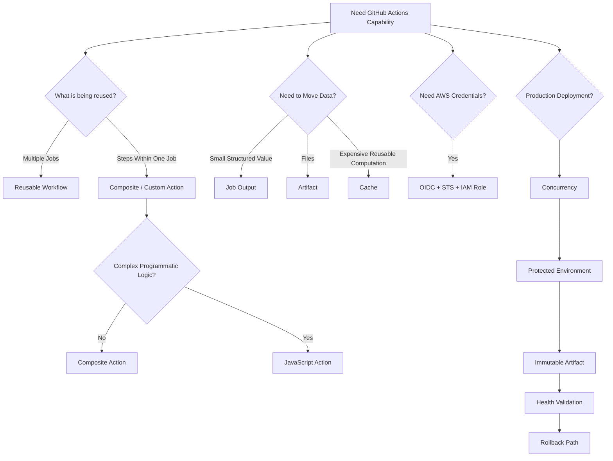

# 23- Comparison Questions

## Overview

Comparison questions in GitHub Actions interviews test whether an engineer understands **why two mechanisms exist, where their responsibilities differ, and what trade-offs apply in production**.

A senior backend engineer should avoid answers based only on definitions. A strong comparison explains:

```text
What differs
    ↓
Why the distinction exists
    ↓
When each option is appropriate
    ↓
Security implications
    ↓
Performance / scalability
    ↓
Operational impact
    ↓
Production trade-offs
```

The comparisons below focus on GitHub Actions as a production CI/CD platform and use Python, Django, FastAPI, Docker, AWS, PostgreSQL, Redis, Kafka, and Celery examples where they clarify the decision.

---

## GitHub Actions vs Generic CI/CD

| Aspect | GitHub Actions | Generic CI/CD |
|---|---|---|
| Platform | Integrated into GitHub | May be independent of source-control platform |
| Workflow definition | YAML workflows | Depends on platform |
| Source integration | Native GitHub events and contexts | Usually configured through integrations |
| Runners | GitHub-hosted or self-hosted | Platform-dependent |
| Reusable workflows | Native | Platform-dependent |
| GitHub security context | Native | Usually externalized |
| AWS OIDC | Native integration pattern | Depends on provider |
| Best fit | GitHub-centric engineering platforms | Multi-platform or organization-specific CI/CD |

### Interview Point

GitHub Actions is not simply "YAML automation."

It provides:

- Event-driven execution
- Workflow orchestration
- Job dependencies
- Matrix execution
- Environments
- Secrets
- Permissions
- Runners
- Artifacts
- Reusable workflows
- Deployment controls

---

## Workflow vs Job vs Step vs Action vs Runner

| Component | Responsibility |
|---|---|
| Workflow | Complete automation definition |
| Job | Execution unit with dependencies and isolation |
| Step | Individual operation within a job |
| Action | Reusable implementation used by a step |
| Runner | Machine/environment executing the job |

Relationship:

```text
Workflow
   ↓
Job
   ↓
Step
   ↓
Action
   ↓
Runner
```

A workflow may contain many jobs.

A job executes on one runner.

A job contains multiple steps.

An action is one possible implementation used by a step.

---

## Job vs Step

### Job

Use a job when you need:

- Separate runner execution
- Parallelism
- Independent permissions
- Different environments
- Job dependencies
- Different execution environments

### Step

Use a step when operations belong to the same execution context.

Example:

```yaml
jobs:
  test:
    runs-on: ubuntu-latest

    steps:
      - uses: actions/checkout@<pinned-sha>

      - name: Install dependencies
        run: pip install -r requirements.txt

      - name: Run tests
        run: pytest
```

These steps share the same job workspace and runner environment.

### Production Trade-off

Too many jobs can increase orchestration overhead.

Too many steps can create an overly coupled execution unit.

Use jobs to represent meaningful execution boundaries.

---

## GitHub-Hosted Runner vs Self-Hosted Runner

| Aspect | GitHub-hosted | Self-hosted |
|---|---|---|
| Management | GitHub-managed | Organization-managed |
| Infrastructure | Provisioned for jobs | Must be operated |
| Private network access | Limited by architecture | Full control possible |
| Custom software | More constrained | Full control |
| Isolation | Strong ephemeral model | Depends on implementation |
| Maintenance | Low | Higher |
| Cost model | Usage-based GitHub capacity | Infrastructure + operations |
| Scaling | Platform-managed | Must design scaling |
| Security responsibility | Lower infrastructure responsibility | Higher |

### Use GitHub-Hosted When

- Standard toolchains are sufficient
- Jobs can access required services publicly or through supported architecture
- Minimal infrastructure management is desired

### Use Self-Hosted When

- Private VPC access is required
- Specialized hardware is required
- Custom software is mandatory
- Network topology requires private connectivity

### Senior Consideration

Self-hosted runners are not simply "faster runners."

They introduce an additional security boundary.

---

## Persistent Runner vs Ephemeral Runner

| Aspect | Persistent | Ephemeral |
|---|---|---|
| Lifetime | Multiple jobs | Usually one job |
| Startup | Fast | Higher startup cost |
| State | May persist | Fresh environment |
| Contamination risk | Higher | Lower |
| Isolation | Lower | Higher |
| Maintenance | Requires cleanup | Replaced regularly |
| Security | More difficult | Stronger isolation |
| Autoscaling | Possible | Natural fit |

### Production Pattern

For sensitive workloads:

```text
Provision
 ↓
Register
 ↓
Execute Job
 ↓
Collect Results
 ↓
Destroy
```

Ephemeral runners reduce cross-job state leakage and runner contamination.

---

## Runner Labels vs Runner Groups

| Aspect | Labels | Runner Groups |
|---|---|---|
| Purpose | Select compatible runners | Control runner access |
| Example | `linux`, `docker`, `gpu` | `production-deployers` |
| Security boundary | Weak by themselves | Stronger access control |
| Scheduling | Yes | Yes |
| Governance | Limited | Stronger |

A common production design is:

```text
Runner Group
    ↓
Repository Access
    ↓
Labels
    ↓
Specific Runner Selection
```

Labels describe capabilities.

Runner groups help control who can use the runners.

---

## `push` vs `pull_request`

| Aspect | `push` | `pull_request` |
|---|---|---|
| Trigger | Branch push | Pull request activity |
| Typical purpose | Branch/release CI | PR validation |
| Trust model | Depends on repository contributors | Especially important for fork PRs |
| Secrets | Repository context rules apply | Fork restrictions matter |
| Use case | Branch CI, release | Validation before merge |

Typical PR pipeline:

```text
Pull Request
 ↓
Lint
 ↓
Unit Tests
 ↓
Integration Tests
 ↓
Security
```

---

## `pull_request` vs `pull_request_target`

This is primarily a **security boundary comparison**.

| Aspect | `pull_request` | `pull_request_target` |
|---|---|---|
| Execution context | Pull request context | Base repository context |
| Typical use | Validate PR code | Trusted operations requiring base context |
| Fork handling | Stronger isolation model | Requires careful design |
| Secrets | Restricted for fork PRs | More access may be available |
| Risk | Lower privileged execution risk | Higher if untrusted code is executed |
| Typical mistake | Assuming all PRs have normal secrets | Checking out and executing attacker-controlled code with privileges |

### Critical Rule

Do not use `pull_request_target` merely because a workflow needs secrets.

The dangerous pattern is:

```text
Trusted Workflow Context
        +
Untrusted PR Code
        +
Secrets / Write Permissions
```

Separate untrusted validation from privileged operations.

---

## `workflow_dispatch` vs `schedule`

| Aspect | `workflow_dispatch` | `schedule` |
|---|---|---|
| Trigger | Manual | Time-based |
| Inputs | Supported | No interactive user input |
| Typical use | Manual deployment | Nightly validation |
| Timing | User-controlled | Cron-based |
| Example | Production deployment | Full test matrix |

Manual execution:

```yaml
on:
  workflow_dispatch:
    inputs:
      environment:
        required: true
        type: choice
        options:
          - staging
          - production
```

Scheduled validation:

```yaml
on:
  schedule:
    - cron: "0 2 * * *"
```

---

## `workflow_call` vs `workflow_run`

| Aspect | `workflow_call` | `workflow_run` |
|---|---|---|
| Purpose | Reusable workflow invocation | React to another workflow run |
| Input contract | Explicit inputs/secrets/outputs | Trigger based on workflow completion |
| Typical use | Shared CI/CD | Post-CI deployment or follow-up |
| Architecture | Library/API-like reuse | Event-driven chaining |

Use `workflow_call` when designing a reusable workflow.

Use `workflow_run` when another workflow's completion is itself the event.

---

## `workflow_call` vs Composite Action

| Aspect | Reusable Workflow | Composite Action |
|---|---|---|
| Scope | Multiple jobs | Steps within one job |
| `jobs` | Yes | No |
| Job dependencies | Yes | No |
| Matrix orchestration | Yes | No direct job orchestration |
| Environment/deployment boundaries | Yes | Limited |
| Reuse level | Pipeline | Step group |
| Typical use | Shared CI/CD | Reusable setup or command sequence |

### Example

Reusable workflow:

```text
Repository
 ↓
Reusable CI
 ├── Lint
 ├── Unit
 ├── Integration
 └── Security
```

Composite action:

```text
Job
 ↓
Setup Python
 ↓
Install Dependencies
 ↓
Configure Environment
```

### Interview Trap

A composite action is not a lightweight reusable workflow.

A reusable workflow orchestrates jobs.

A composite action packages steps.

---

## Composite Action vs JavaScript Action

| Aspect | Composite | JavaScript |
|---|---|---|
| Implementation | YAML steps | JavaScript/Node.js |
| Complexity | Low to medium | Medium to high |
| External APIs | Through contained steps | Native API libraries |
| Logic | Shell/YAML-oriented | Programmatic |
| Runtime | Runner shell/tools | Node runtime |
| Best use | Reusable command sequences | Complex programmatic behavior |

Use composite actions for straightforward orchestration.

Use JavaScript actions when substantial programmatic logic is required.

---

## JavaScript Action vs Docker Action

| Aspect | JavaScript Action | Docker Action |
|---|---|---|
| Runtime | Node.js | Container |
| Startup | Usually faster | Container startup overhead |
| Environment | Runner environment | Containerized |
| Custom dependencies | npm ecosystem | Container image |
| OS portability | Strong within supported runtime | Linux container model |
| Best use | API and GitHub integration | Specialized Linux tooling |

Docker actions provide stronger dependency encapsulation but introduce container startup and platform constraints.

---

## Action vs Script

| Aspect | Action | Script |
|---|---|---|
| Reuse | High | Usually repository-local |
| Interface | Inputs/outputs | Arguments/environment |
| Distribution | Can be shared | Usually local |
| Versioning | Explicit action versioning | Git repository version |
| Encapsulation | Higher | Lower |

For organization-wide standards, an action can provide a stable contract.

For repository-specific logic, a script may be simpler.

---

## Action Version vs SHA Pinning

| Approach | Benefit | Risk |
|---|---|---|
| Branch/tag | Convenient | Mutable reference risk |
| Semantic version | Easier maintenance | Tag can move |
| Commit SHA | Strong immutability | Harder to update manually |

Example:

```yaml
uses: actions/checkout@<commit-sha>
```

SHA pinning improves supply-chain integrity.

It should be combined with:

- Action ownership
- Dependency review
- Update process
- Trusted sources
- Least privilege

---

## Artifacts vs Caches

| Aspect | Artifact | Cache |
|---|---|---|
| Purpose | Preserve outputs | Speed up repeated work |
| Reliability expectation | Release/test output | Optimization |
| Example | Docker metadata, reports | Python dependencies |
| Lifecycle | Explicit workflow output | Key-based reuse |
| Promotion | Yes | No |
| Security role | Must be trusted | Must be scoped carefully |

### Rule

```text
Artifact = Output
Cache    = Optimization
```

Do not use caches as the authoritative source of a production artifact.

---

## Job Outputs vs Artifacts

| Aspect | Job Output | Artifact |
|---|---|---|
| Data size | Small structured data | Files/directories |
| Purpose | Job-to-job communication | File transfer/storage |
| Mechanism | `$GITHUB_OUTPUT` | Upload/download |
| Example | Matrix JSON | Test report |
| Typical use | Control flow | Build output |

Example output:

```bash
echo 'matrix={"service":["users","orders"]}' >> "$GITHUB_OUTPUT"
```

Downstream:

```yaml
matrix: ${{ fromJSON(needs.plan.outputs.matrix) }}
```

---

## `$GITHUB_OUTPUT` vs `$GITHUB_ENV`

| Mechanism | Purpose |
|---|---|
| `$GITHUB_OUTPUT` | Pass step output to later steps/jobs |
| `$GITHUB_ENV` | Set environment variables for later steps |
| `$GITHUB_PATH` | Modify executable search path |

Example:

```bash
echo "IMAGE_TAG=${GITHUB_SHA}" >> "$GITHUB_ENV"
```

Output:

```bash
echo "image_tag=${GITHUB_SHA}" >> "$GITHUB_OUTPUT"
```

Use the mechanism that matches the data flow.

---

## Environment Variables vs Repository Variables

| Aspect | `env` | `vars` |
|---|---|---|
| Definition | Workflow/job/step configuration | Repository/org/environment variable |
| Scope | YAML-defined scope | GitHub configuration |
| Dynamic | Easy | Managed externally |
| Secret | No | No |
| Typical use | Runtime/job configuration | Shared configuration |

Neither mechanism should be treated as a secret store.

---

## Variables vs Secrets

| Aspect | Variables | Secrets |
|---|---|---|
| Sensitive data | No | Yes |
| Visibility | Generally inspectable | Masked in logs when supported |
| Example | Environment name | Database password |
| Protection | Configuration governance | Secret access controls |

Do not store credentials in variables merely because they are hidden from normal code review.

---

## Repository Secrets vs Environment Secrets

| Aspect | Repository Secret | Environment Secret |
|---|---|---|
| Scope | Repository | Environment |
| Approval boundary | Not inherently deployment-specific | Can be combined with environment protection |
| Best use | Shared CI secret | Production deployment secret |

Production credentials are often better aligned with the production environment boundary.

---

## `env` vs `secrets` Context

`env` represents environment variables.

`secrets` represents GitHub-managed secrets.

Example:

```yaml
env:
  APP_ENV: staging

steps:
  - run: ./deploy.sh
    env:
      AWS_REGION: ${{ vars.AWS_REGION }}
      DATABASE_PASSWORD: ${{ secrets.DATABASE_PASSWORD }}
```

Do not place sensitive values into `env` through unsafe shell construction or log them.

---

## `github` Context vs `env` Context

| Context | Provides |
|---|---|
| `github` | Workflow/event/repository/run metadata |
| `env` | Environment variables |
| `vars` | Configuration variables |
| `secrets` | Secret values |
| `steps` | Step outputs/results |
| `needs` | Upstream job outputs/results |
| `matrix` | Current matrix values |
| `runner` | Runner metadata |
| `inputs` | Workflow/action inputs |

A common senior-level mistake is assuming every context is available everywhere.

Context availability depends on where the expression is evaluated.

---

## Expressions vs Shell Commands

GitHub expression:

```yaml
if: ${{ github.ref == 'refs/heads/main' }}
```

Shell:

```bash
if [[ "$ENVIRONMENT" == "production" ]]; then
  ./deploy.sh
fi
```

Expressions are evaluated by GitHub Actions.

Shell commands execute on the runner.

### Security Importance

Do not assume that GitHub expression evaluation provides shell escaping.

Treat externally influenced GitHub data as untrusted when inserted into commands.

---

## `if` vs `continue-on-error`

| Aspect | `if` | `continue-on-error` |
|---|---|---|
| Purpose | Decide whether execution occurs | Allow failure without failing controlling execution |
| Timing | Before execution | During/after failure |
| Example | Run deployment only on main | Allow experimental matrix entry |

Example:

```yaml
if: ${{ github.ref == 'refs/heads/main' }}
```

versus:

```yaml
continue-on-error: true
```

Do not use `continue-on-error` to hide failures that should block a release.

---

## `success()` vs `failure()` vs `always()` vs `cancelled()`

| Function | Meaning |
|---|---|
| `success()` | Relevant preceding dependencies succeeded |
| `failure()` | Relevant failure occurred |
| `always()` | Attempts evaluation regardless of normal success/failure flow |
| `cancelled()` | Execution was cancelled |

### Important Production Distinction

`always()` does not mean "safe to execute regardless of circumstances."

A cleanup operation that must not run after cancellation may require a more precise condition.

Use status functions intentionally.

---

## `always()` vs `!cancelled()`

For reporting or cleanup, the distinction matters.

Example:

```yaml
if: ${{ !cancelled() }}
```

means the step can run after success or failure, but not after cancellation.

This is often useful for failure-aware reporting.

Avoid using `always()` everywhere because it can make cancellation behavior harder to reason about.

---

## `needs` vs `concurrency`

| Aspect | `needs` | `concurrency` |
|---|---|---|
| Purpose | Dependency ordering | Mutual exclusion |
| Example | Build requires tests | Only one production deploy |
| Controls | Execution graph | Concurrent execution |
| Scope | Job dependencies | Workflow/job concurrency |

Example:

```yaml
needs:
  - lint
  - test
```

does not prevent two workflow runs from deploying simultaneously.

Use concurrency for that.

---

## Matrix vs Parallel Jobs

A matrix is a compact way to express repeated job configurations.

```yaml
strategy:
  matrix:
    python-version: ["3.11", "3.12", "3.13"]
```

Without a matrix, you might define separate jobs.

### Matrix Advantages

- Less duplication
- Easy dimension changes
- Built-in parallelism
- Better compatibility testing

### Separate Jobs Are Better When

- Job behavior differs substantially
- Permissions differ
- Deployment targets differ
- Execution logic is not parameterized naturally

---

## Matrix `include` vs `exclude`

`exclude` removes invalid or unnecessary combinations.

```yaml
exclude:
  - python-version: "3.11"
    database: mysql
```

`include` adds custom combinations:

```yaml
include:
  - python-version: "3.13"
    database: postgres
    experimental: true
```

Use them to represent real compatibility requirements rather than blindly generating every combination.

---

## `fail-fast` vs `continue-on-error`

| Aspect | `fail-fast` | `continue-on-error` |
|---|---|---|
| Scope | Matrix strategy | Job/step failure behavior |
| Purpose | Stop queued matrix work after failure | Allow known failure |
| Typical use | Fast PR feedback | Experimental compatibility |
| Production caution | Can hide useful matrix results | Can hide release blockers |

For a security or release validation matrix, carefully consider whether early cancellation loses useful diagnostic information.

---

## `max-parallel` vs Runner Autoscaling

| Aspect | `max-parallel` | Autoscaling |
|---|---|---|
| Controls | Workflow concurrency | Infrastructure capacity |
| Scope | Matrix execution | Runner fleet |
| Purpose | Limit pressure | Add/remove capacity |
| Example | Max 8 matrix jobs | Scale runners from 2 to 20 |

These solve different problems.

You may need both:

```text
Matrix
 ↓
max-parallel = 8
 ↓
Runner Autoscaling
```

---

## Cache vs Docker Layer Cache

A dependency cache can store package-manager data:

```text
pip
npm
```

Docker layer caching stores reusable Docker build layers.

They optimize different parts of the pipeline.

```text
Dependency Cache
 → Faster dependency installation

Docker Layer Cache
 → Faster image build
```

Do not assume a Python dependency cache automatically makes Docker builds fast.

---

## Cache Hit vs Cache Miss

A cache hit reuses matching data.

A miss causes the workflow to rebuild or download dependencies.

Use deterministic keys such as:

```yaml
key: ${{ runner.os }}-python-${{ hashFiles('**/requirements.lock') }}
```

Cache keys should represent the inputs that affect the cached result.

---

## Build Cache vs Artifact

| Build Cache | Artifact |
|---|---|
| Speeds up future builds | Represents produced output |
| May be safely discarded | Often required for promotion |
| Key-based | Explicit identity |
| Optimization | Delivery output |

A production Docker image should be an artifact, not merely a cache.

---

## Docker Tag vs Docker Digest

| Aspect | Tag | Digest |
|---|---|---|
| Human-friendly | Yes | Less friendly |
| Mutable | Potentially | Content-addressed |
| Strong artifact identity | Weaker | Stronger |
| Promotion | Possible | Preferred for immutable promotion |
| Rollback | Requires tag history | Exact content identity |

Example tag:

```text
backend:1.8.2
```

Digest:

```text
backend@sha256:abc123...
```

For production promotion, digest-based identity provides stronger guarantees.

---

## Commit SHA Tag vs Semantic Version Tag

| Aspect | Commit SHA | Semantic Version |
|---|---|---|
| Uniqueness | Strong | Release-oriented |
| Human readability | Lower | Higher |
| Traceability | Excellent | Good |
| Mutable | Can be avoided | Depends on tagging policy |
| Typical use | Build identity | Release identity |

A useful model is:

```text
backend:<commit-sha>
backend:1.8.2
backend@sha256:<digest>
```

The digest remains the strongest artifact identity.

---

## Docker Build vs Docker Buildx

Buildx provides advanced BuildKit-based functionality such as:

- Improved caching
- Multi-platform builds
- BuildKit features
- More flexible build workflows

A production pipeline may use:

```text
Dockerfile
 ↓
Buildx
 ↓
Cache
 ↓
Scan
 ↓
Push
```

---

## Multi-Stage Docker Build vs Single-Stage Build

| Aspect | Multi-stage | Single-stage |
|---|---|---|
| Final image size | Usually smaller | Usually larger |
| Build dependencies | Can remain in builder | Often remain |
| Security | Smaller attack surface | Larger surface |
| Complexity | Higher | Lower |

Typical Python pattern:

```text
Builder
 ↓
Install/build dependencies
 ↓
Runtime image
 ↓
Copy required artifacts
```

---

## ECR vs S3 for Container Artifacts

| Aspect | ECR | S3 |
|---|---|---|
| Container registry | Yes | No |
| Docker images | Native | Manual/object storage |
| Image metadata | Native | Object metadata |
| ECS integration | Native | Indirect |
| Best use | Container images | Files, packages, deployment bundles |

Use ECR for container image distribution.

Use S3 for object-based deployment artifacts where appropriate.

---

## ECR vs Docker Hub

| Aspect | ECR | Docker Hub |
|---|---|---|
| AWS integration | Native | External |
| IAM | AWS IAM | Docker authentication model |
| Private VPC architecture | Strong AWS integration | Requires external connectivity |
| ECS integration | Native | Possible |
| Enterprise AWS environment | Common fit | External dependency |

The correct choice depends on organizational architecture and trust boundaries.

---

## OIDC vs Long-Lived AWS Access Keys

| Aspect | OIDC | Long-Lived Keys |
|---|---|---|
| Credential lifetime | Temporary | Long-lived |
| Storage | No AWS key secret required | Secret storage required |
| Rotation | Reduced key rotation burden | Required |
| Trust | Identity claims + IAM | Access key |
| Blast radius | Can be tightly scoped | Depends on key permissions |
| Recommended production pattern | Yes | Generally avoid when OIDC is suitable |

OIDC changes the authentication model from:

```text
Stored Credential
```

to:

```text
Workload Identity
 ↓
Temporary AWS Credentials
```

---

## IAM Trust Policy vs IAM Permissions Policy

| Aspect | Trust Policy | Permissions Policy |
|---|---|---|
| Answers | Who may assume/use the role? | What may the role do? |
| Used for | Role assumption | Resource/API access |
| Example | GitHub OIDC subject | ECR push |
| Security role | Authentication boundary | Authorization boundary |

Both must be correct.

A correct trust policy does not automatically grant ECR permissions.

---

## IAM Role vs IAM User for GitHub Actions

For CI/CD:

```text
GitHub OIDC
 ↓
IAM Role
 ↓
Temporary Credentials
```

is generally preferable to creating a dedicated IAM user with permanent access keys.

The role can be restricted by:

- Repository
- Branch
- Environment
- Action permissions
- AWS account

---

## ECR Push Permissions vs ECS Deployment Permissions

These are separate responsibilities.

```text
Build Job
 ↓
ECR Push Role
```

and:

```text
Deployment Job
 ↓
ECS Deployment Role
```

Separating roles reduces blast radius.

A build job does not inherently need permission to modify production ECS services.

---

## ECS vs EC2 Deployment

| Aspect | ECS | EC2 |
|---|---|---|
| Container orchestration | Native | Application-managed |
| Infrastructure management | Lower | Higher |
| Deployment model | Task/service | Host/process |
| Scaling | ECS service/autoscaling | ASG or custom |
| OS management | Reduced with Fargate | Required |
| Control | Lower | Higher |
| Operational burden | Lower | Higher |

For containerized applications, ECS abstracts more runtime operations.

EC2 provides greater host-level control.

---

## ECS Fargate vs ECS on EC2

| Aspect | Fargate | ECS EC2 |
|---|---|---|
| Server management | AWS-managed | Customer-managed |
| Capacity | Task-based | Instance-based |
| Control | Lower | Higher |
| Custom host requirements | Limited | Strong |
| Operational burden | Lower | Higher |
| Cost model | Task resource usage | EC2 capacity + ECS |

Choose based on workload characteristics, control requirements, cost, and operational model.

---

## Rolling vs Blue/Green Deployment

| Aspect | Rolling | Blue/Green |
|---|---|---|
| Capacity | Lower additional capacity | Usually requires additional capacity |
| Traffic transition | Gradual replacement | Switch between environments |
| Rollback | More involved | Usually faster |
| Mixed versions | Common | Can be isolated |
| Complexity | Lower | Higher |
| Cost | Lower | Higher |

Rolling deployments are operationally simpler.

Blue/green provides stronger release isolation at additional infrastructure cost.

---

## Blue/Green vs Canary

| Aspect | Blue/Green | Canary |
|---|---|---|
| Initial traffic | Usually 0% or 100% | Small percentage |
| Risk exposure | Switch-level | Gradual |
| Rollback | Traffic switch | Reduce/revert traffic |
| Observability requirement | High | Very high |
| Traffic analysis | Less granular | Central to strategy |
| Capacity | Higher | Depends on implementation |

Canary is useful when gradual risk exposure is more important than deployment simplicity.

---

## Canary vs Rolling

| Aspect | Canary | Rolling |
|---|---|---|
| Traffic control | Explicit | Usually instance replacement |
| Risk exposure | Controlled subset | Depends on topology |
| Analysis | Usually explicit | Less granular |
| Promotion | Progressive | Instance-by-instance |
| Complexity | Higher | Lower |

Canary requires meaningful production telemetry.

Without reliable metrics, automated canary promotion can become unsafe.

---

## Zero Downtime vs High Availability

These concepts are related but different.

### Zero Downtime

The deployment does not intentionally interrupt service.

### High Availability

The system remains available despite component failures.

A system can support zero-downtime deployments but still have poor availability if a single database or network component can cause a full outage.

---

## Deployment Approval vs Branch Protection

| Aspect | Deployment Approval | Branch Protection |
|---|---|---|
| Controls | Deployment | Code integration |
| Timing | Before deployment | Before merge |
| Scope | Environment | Branch |
| Example | Production reviewer | Required PR review |

They solve different problems and can be used together.

```text
PR Review
 ↓
Merge
 ↓
CI
 ↓
Production Approval
 ↓
Deployment
```

---

## Environment vs Branch

A branch represents source-control state.

An environment represents a deployment target and its operational controls.

Example:

```text
main branch
    ↓
staging environment

release/main
    ↓
production environment
```

Environment-specific controls can include:

- Secrets
- Variables
- Reviewers
- Branch restrictions
- Deployment history

---

## Production Environment vs Staging Environment

| Aspect | Staging | Production |
|---|---|---|
| Purpose | Validate release | Serve users |
| Access | More permissive | Highly restricted |
| Secrets | Staging | Production |
| Approval | Often lower | Often required |
| Monitoring | Validation-focused | Full operational monitoring |
| Rollback | Testable | Operationally critical |

Staging should be representative enough to catch important production failures.

---

## Environment Secrets vs Repository Secrets

Use environment secrets when the secret belongs to a deployment boundary.

For example:

```text
staging:
  AWS_ROLE
  DATABASE_URL

production:
  AWS_ROLE
  DATABASE_URL
```

This reduces accidental cross-environment access.

---

## Reusable Workflow vs Copy-Pasted Workflow

| Aspect | Reusable Workflow | Copy-Paste |
|---|---|---|
| Duplication | Low | High |
| Consistency | High | Lower |
| Central changes | Easy | Hard |
| Blast radius | Higher | Lower |
| Versioning | Important | Implicit |
| Governance | Strong | Weak |

Reusable workflows should be treated as shared platform APIs.

---

## Reusable Workflow vs Shared Script

A shared script usually handles implementation logic.

A reusable workflow can orchestrate:

- Multiple jobs
- Matrices
- Environments
- Approvals
- Permissions
- Artifacts
- Deployment stages

Use the smallest abstraction that provides the required reuse.

---

## Artifact Promotion vs Rebuild

| Approach | Build Once / Promote | Rebuild per Environment |
|---|---|---|
| Artifact identity | Stable | Changes |
| Reproducibility | Stronger | Weaker |
| Environment consistency | Stronger | Weaker |
| Rollback | Easier | More complex |
| Build cost | Lower after initial build | Higher |
| Auditability | Stronger | Weaker |

Preferred production model:

```text
Source
 ↓
Build
 ↓
Immutable Artifact
 ↓
Staging
 ↓
Production
```

---

## Artifact vs Source Commit

A source commit identifies code.

An artifact identifies what was actually built and deployed.

```text
Commit
 ↓
Build Inputs
 ↓
Artifact
```

The same commit can theoretically produce different outputs if:

- Dependencies change
- Base images change
- Build tools change
- External resources change

Artifact identity therefore matters independently of commit identity.

---

## Artifact Digest vs Semantic Version

A semantic version communicates release intent.

A digest identifies exact content.

Use both when appropriate:

```text
Version: 2.4.0
Commit: abc123
Digest: sha256:def456...
```

This provides both human readability and strong technical traceability.

---

## SBOM vs Artifact Provenance

| Aspect | SBOM | Provenance |
|---|---|---|
| Describes | Components/dependencies | How artifact was produced |
| Answers | What is inside? | How was it built? |
| Security use | Vulnerability analysis | Build trust |
| Example | Python package list | Source + workflow + builder |

They complement each other.

```text
Artifact
 ├── SBOM
 └── Provenance
```

---

## Signing vs Hashing

A hash provides integrity information:

```text
Artifact
 ↓
SHA-256
```

A signature adds authenticity through a signing identity.

```text
Artifact
 ↓
Digest
 ↓
Signature
 ↓
Verification
```

A hash alone does not establish who produced the artifact.

---

## Buildx Cache vs Dependency Cache

| Cache | Optimizes |
|---|---|
| Python dependency cache | Package downloads/install |
| npm cache | Node dependency downloads |
| Docker layer cache | Image build layers |
| BuildKit cache mount | Build-time package/tool caches |

Use each cache according to the operation it accelerates.

---

## Job Output vs Environment Variable

| Requirement | Preferred Mechanism |
|---|---|
| Pass value to later step | `$GITHUB_ENV` |
| Pass value as step/job output | `$GITHUB_OUTPUT` |
| Pass files | Artifact |
| Pass large build output | Artifact |
| Dynamic matrix definition | Job output + `fromJSON()` |

The data's lifecycle should determine the mechanism.

---

## Step Output vs Job Output

A step output is scoped to the job.

A job output exposes selected data to downstream jobs.

Example:

```yaml
jobs:
  plan:
    outputs:
      matrix: ${{ steps.generate.outputs.matrix }}
```

Then:

```yaml
needs: plan
```

and:

```yaml
matrix: ${{ fromJSON(needs.plan.outputs.matrix) }}
```

This creates explicit data flow.

---

## Workflow Output vs Job Output

A reusable workflow can expose outputs from jobs to its caller.

Conceptually:

```text
Step Output
 ↓
Job Output
 ↓
Reusable Workflow Output
 ↓
Caller Workflow
```

Each layer creates an explicit contract.

---

## Docker Image vs Build Artifact

A Docker image is a deployable artifact.

A generic build artifact could be:

- Python wheel
- ZIP package
- Static bundle
- Migration package

For containerized production workloads:

```text
Source
 ↓
Docker Image
 ↓
Registry
 ↓
Deployment
```

For other deployment models:

```text
Source
 ↓
Package
 ↓
Object Storage / Artifact Store
 ↓
Deployment
```

---

## GitHub Actions Artifacts vs ECR Images

| Aspect | GitHub Artifact | ECR Image |
|---|---|---|
| Purpose | Workflow file exchange | Container distribution |
| Deployment integration | Generic | ECS/EKS-native |
| Identity | Artifact name/version | Tag/digest |
| Typical lifecycle | CI workflow | Release lifecycle |
| Example | Test reports | Backend image |

Use GitHub artifacts for workflow outputs.

Use ECR for container images.

---

## GitHub Cache vs ECR

A cache accelerates computation.

ECR stores release artifacts.

Never design production deployment around the assumption that a cache is the authoritative image registry.

---

## Unit Testing vs Integration Testing

| Aspect | Unit | Integration |
|---|---|---|
| Dependencies | Mocked/isolated | Real dependencies |
| Speed | Fast | Slower |
| Scope | Component | Multiple components |
| Database | Usually mocked | Often real |
| Redis | Usually mocked | Often real |
| Failure diagnosis | Easier | More complex |

Typical pipeline:

```text
Unit Tests
 ↓
Integration Tests
```

They solve different validation problems.

---

## Integration Testing vs End-to-End Testing

| Aspect | Integration | E2E |
|---|---|---|
| Scope | Selected components | Complete user/system flow |
| Speed | Faster | Slower |
| Environment | Controlled | More realistic |
| Failure diagnosis | Easier | Harder |
| Frequency | Higher | More selective |

For a Django/FastAPI service:

```text
Integration
→ API + PostgreSQL + Redis

E2E
→ Client + API + Database + External Components
```

---

## PostgreSQL Service Container vs External Test Database

| Aspect | Service Container | External Database |
|---|---|---|
| Isolation | High | Depends |
| Setup | Workflow-local | Infrastructure required |
| Reproducibility | High | Lower |
| Network complexity | Lower | Higher |
| Production similarity | Lower | Potentially higher |

Service containers are effective for deterministic CI integration tests.

External environments are useful when testing infrastructure-specific behavior.

---

## PostgreSQL vs MySQL Matrix Testing

If an application claims compatibility with both databases:

```yaml
strategy:
  matrix:
    database:
      - postgres
      - mysql
```

This is valuable only if both databases are supported products.

Do not create matrices merely because GitHub Actions makes them easy.

---

## Redis Service Container vs Managed Redis

| Aspect | Service Redis | Managed Redis |
|---|---|---|
| Isolation | High | Depends |
| CI setup | Easy | More infrastructure |
| Real production topology | Lower | Higher |
| Cost | Low | Higher |
| Use | Integration tests | Environment/infrastructure validation |

---

## Docker Container Job vs Service Container

| Aspect | Container Job | Service Container |
|---|---|---|
| Purpose | Run the job itself | Provide dependency |
| Example | Python test environment | PostgreSQL |
| Executes steps | Yes | No |
| Lifecycle | Job lifecycle | Job dependency lifecycle |

Typical architecture:

```text
Job Container
 ├── pytest
 └── application code

Service Containers
 ├── PostgreSQL
 └── Redis
```

---

## Docker Compose vs GitHub Service Containers

| Aspect | Service Containers | Docker Compose |
|---|---|---|
| GitHub integration | Native | Script-driven |
| Complexity | Lower | Higher |
| Multi-service topology | Moderate | Strong |
| Local/CI parity | Depends | Strong |
| Custom networking | Limited relative to Compose | Strong |

Use service containers for straightforward CI dependencies.

Use Compose when the test environment itself is a complex multi-container system.

---

## Matrix Testing vs Selective Testing

Matrix testing answers:

> Which supported combinations are compatible?

Selective testing answers:

> Which combinations are relevant to this change?

A mature monorepo may use both:

```text
Pull Request
 → Selective Matrix

Nightly
 → Full Matrix
```

---

## Parallel Testing vs Sequential Testing

| Aspect | Parallel | Sequential |
|---|---|---|
| Speed | Faster | Slower |
| Resource usage | Higher | Lower |
| Isolation | Required | Easier |
| Failure diagnosis | Potentially harder | Simpler |
| Best use | Independent tests | Dependent stages |

Parallelize independent work.

Keep genuinely dependent operations sequential.

---

## Fan-Out vs Fan-In

### Fan-Out

```text
Planning
 ├── Lint
 ├── Unit
 ├── Integration
 └── Security
```

### Fan-In

```text
Lint ────────┐
Unit ────────┤
Integration ─┤
Security ────┘
       ↓
Validation Gate
```

This pattern is fundamental to efficient CI architecture.

---

## Concurrency vs Matrix Parallelism

Matrix parallelism intentionally increases concurrency.

Deployment concurrency intentionally limits concurrency.

They are not contradictory.

Example:

```text
Test Matrix
 ├── Python 3.11
 ├── Python 3.12
 ├── PostgreSQL
 └── MySQL

Parallel
```

Then:

```text
Production Deployment
 └── One at a time
```

The correct concurrency policy depends on the resource being protected.

---

## Workflow Concurrency vs Job Concurrency

Workflow-level concurrency can prevent multiple workflow runs from overlapping.

Job-level concurrency can isolate a specific resource.

For example:

```text
Entire PR Workflow
 → Cancel obsolete runs

Production Deployment Job
 → Serialize deployments
```

Different resources may require different concurrency policies.

---

## `cancel-in-progress: true` vs `false`

| Scenario | Typical Policy |
|---|---|
| PR validation | Often `true` |
| Formatting/linting | Often `true` |
| Production deployment | Often `false` |
| Long-running safe deployment | Depends |
| Non-interruptible migration | Usually avoid cancellation |

The correct setting depends on whether interruption is safe.

---

## Rollback vs Roll Forward

| Aspect | Rollback | Roll Forward |
|---|---|---|
| Action | Return to known-good version | Fix forward |
| Speed | Often faster if prepared | Depends |
| Database compatibility | Critical | Often easier |
| Use case | Immediate mitigation | Defect correction |
| Risk | Old version may be incompatible | New change may introduce more risk |

A mature organization should support both.

---

## Application Rollback vs Database Rollback

Application rollback:

```text
v2 → v1
```

Database rollback may not be safe:

```text
Schema v2 → Schema v1
```

Destructive migrations can make application rollback impossible.

Use expand/contract migrations to maintain compatibility.

---

## Release vs Deployment

A release represents a versioned software artifact.

A deployment places an artifact into an environment.

```text
Release
 ↓
Artifact
 ↓
Staging Deployment
 ↓
Production Deployment
```

One release may be deployed multiple times.

---

## Git Tag vs GitHub Release

A Git tag identifies a point in Git history.

A GitHub Release provides release-oriented metadata and distribution around a tag.

They can be used together:

```text
Git Tag
 ↓
GitHub Release
 ↓
Release Artifacts
```

---

## Semantic Versioning vs Commit SHA

Semantic versioning communicates compatibility and release intent.

Commit SHA identifies a specific source state.

A production artifact can carry both:

```text
Version = 2.4.0
Commit = abc123
Digest = sha256:...
```

---

## Production Deployment vs Infrastructure Deployment

| Application Deployment | Infrastructure Deployment |
|---|---|
| Application artifact | Infrastructure definition |
| Docker/ECS/EC2 | Terraform/CloudFormation |
| Frequent | Often less frequent |
| Runtime behavior | Resource topology |
| Rollback | Artifact-based | State/change-based |

Do not grant application CI unrestricted infrastructure modification permissions simply because both use GitHub Actions.

---

## Terraform vs CloudFormation

| Aspect | Terraform | CloudFormation |
|---|---|---|
| Provider model | Multi-cloud | AWS-native |
| State | Explicit state | AWS-managed stack state |
| Language | HCL | YAML/JSON |
| Ecosystem | Broad | AWS-native |
| AWS integration | Strong | Native |
| Multi-cloud | Strong | No |
| Drift | Terraform workflows | CloudFormation drift detection |

The correct choice depends on organizational standards, cloud scope, state architecture, and operational requirements.

---

## ECS vs Kubernetes

| Aspect | ECS | Kubernetes |
|---|---|---|
| Operational complexity | Lower | Higher |
| AWS integration | Native | Strong through EKS |
| Control | Lower | Higher |
| Ecosystem | AWS-centric | Broad |
| Scheduling | ECS | Kubernetes |
| Deployment patterns | Rolling/blue-green/canary | Extensive ecosystem |
| Platform overhead | Lower | Higher |

Do not choose Kubernetes solely because it provides more features.

Choose based on platform requirements and operational capability.

---

## Nginx vs AWS Load Balancer

Nginx is commonly used as:

- Reverse proxy
- API gateway
- Local routing layer
- Edge component

AWS load balancers provide managed infrastructure-level traffic distribution.

A production architecture may use both:

```text
Internet
 ↓
ALB
 ↓
Nginx
 ↓
Application
```

but each layer should have a clear responsibility.

---

## GitHub Actions vs Jenkins

| Aspect | GitHub Actions | Jenkins |
|---|---|---|
| GitHub integration | Native | Plugin-based |
| Hosting | Managed/self-hosted runners | Self-managed |
| Pipeline definition | YAML workflows | Jenkinsfile/plugins |
| Plugin ecosystem | Actions | Large plugin ecosystem |
| Operational burden | Lower when hosted | Higher |
| Governance | GitHub-native | Jenkins-centric |

The decision depends on organizational ecosystem, control requirements, existing investment, and platform strategy.

---

## GitHub Actions vs GitLab CI

| Aspect | GitHub Actions | GitLab CI |
|---|---|---|
| Source platform | GitHub | GitLab |
| Workflow model | Workflows/jobs/steps | Pipelines/jobs/stages |
| Reuse | Actions/reusable workflows | Templates/components/includes |
| Runner model | Hosted/self-hosted | Hosted/self-managed |
| Repository integration | Native GitHub | Native GitLab |

The key engineering principles remain similar:

- Reproducibility
- Least privilege
- Artifact promotion
- Secure credentials
- Deployment protection
- Observability
- Rollback

---

## GitHub Actions vs AWS CodePipeline

| Aspect | GitHub Actions | AWS CodePipeline |
|---|---|---|
| Primary platform | GitHub | AWS |
| Source integration | GitHub-native | AWS integrations |
| Workflow flexibility | High | AWS pipeline model |
| AWS integration | Strong | Native |
| Repository context | Rich GitHub context | External source integration |
| Runner model | GitHub/self-hosted | AWS service integrations |

GitHub Actions is often suitable when source control and CI/CD are GitHub-centric.

AWS-native pipelines may be appropriate when deployment governance is deeply AWS-integrated.

---

## Secrets vs OIDC

| Aspect | Secrets | OIDC |
|---|---|---|
| Credential storage | Required for static credentials | No long-lived cloud credential |
| Lifetime | Potentially long | Temporary |
| Rotation | Required | Reduced key-rotation burden |
| Trust | Secret possession | Identity claims |
| AWS use | Possible | Preferred modern pattern |

OIDC does not eliminate IAM authorization.

It changes how authentication credentials are obtained.

---

## OIDC Authentication vs IAM Authorization

```text
GitHub
 ↓
OIDC Identity
 ↓
STS
 ↓
IAM Role
 ↓
IAM Authorization
 ↓
AWS Resource
```

Authentication answers:

> Who is this workload?

Authorization answers:

> What can it do?

Both layers must be correctly configured.

---

## Production CI vs Production CD

| CI | CD |
|---|---|
| Validate | Deliver |
| Test | Deploy |
| Scan | Promote |
| Build | Operate |
| Produce artifact | Consume artifact |

CI creates confidence in the artifact.

CD controls how that artifact reaches environments.

---

## CI Pipeline vs Deployment Pipeline

### CI

```text
Code
 ↓
Lint
 ↓
Tests
 ↓
Security
 ↓
Build
 ↓
Artifact
```

### Deployment

```text
Artifact
 ↓
Environment
 ↓
Approval
 ↓
Deployment
 ↓
Health
 ↓
Rollback
```

This separation simplifies security and operational reasoning.

---

## Production CI/CD Comparison Matrix

| Requirement | Recommended Mechanism |
|---|---|
| Shared multi-job pipeline | Reusable workflow |
| Reusable steps | Composite action |
| Complex programmatic action | JavaScript action |
| Specialized Linux action | Docker action |
| Small job-to-job value | Job output |
| File transfer | Artifact |
| Dependency reuse | Cache |
| AWS authentication | OIDC |
| Production serialization | Concurrency |
| Production authorization | Environment protection |
| Exact release identity | Artifact digest |
| Container registry | ECR |
| Gradual traffic | Canary |
| Fast traffic switch | Blue/green |
| Instance replacement | Rolling |
| Private network CI | Self-hosted runner |
| Strong runner isolation | Ephemeral runner |
| Broad compatibility | Matrix |
| Change-focused validation | Selective CI |
| Application rollback | Known-good artifact |
| Database compatibility | Expand/contract |
| Shared enterprise CI | Versioned reusable workflow |

---

## Comparison-Based Interview Scenarios

### Scenario: You Need to Share Five CI Jobs Across 50 Repositories

Compare:

- Copy-paste workflows
- Composite action
- Reusable workflow

Expected reasoning:

```text
Multiple Jobs
    ↓
Reusable Workflow
```

A composite action cannot orchestrate the complete multi-job pipeline.

---

### Scenario: You Need to Reuse Python Setup Across Jobs

A composite action may help package the repeated steps, but remember that each job has its own runner and execution environment.

A composite action does not make the environment persistent across jobs.

---

### Scenario: You Need to Store a Test Report

Use an artifact.

Do not use:

- Job output
- Cache
- Environment variable

The report is a file that must be transferred or retained.

---

### Scenario: You Need to Pass a Dynamic Matrix

Use:

```text
Planning Job
 ↓
GITHUB_OUTPUT
 ↓
Job Output
 ↓
fromJSON()
 ↓
Matrix
```

Do not upload a JSON file as an artifact when a small structured job output is sufficient.

---

### Scenario: You Need to Speed Up Dependency Installation

Use dependency caching.

Do not treat the cache as a production artifact.

---

### Scenario: You Need to Ensure Production Uses Exactly What Was Tested

Use:

```text
Build Once
 ↓
Immutable Artifact
 ↓
Staging
 ↓
Production
```

Prefer image digest identity for containers.

---

### Scenario: You Need AWS Access From GitHub Actions

Compare:

```text
Long-Lived Access Key
```

with:

```text
OIDC → STS → IAM Role
```

For modern AWS CI/CD, workload identity through OIDC avoids storing long-lived AWS credentials.

---

### Scenario: Production Deployments Must Never Overlap

Use deployment concurrency.

Do not attempt to solve the problem using `needs`.

`needs` controls dependencies.

Concurrency controls mutual exclusion.

---

### Scenario: You Need Fast Rollback

Compare:

```text
Rebuild Old Commit
```

with:

```text
Redeploy Known-Good Artifact
```

The second model is generally more deterministic because the artifact already exists.

---

### Scenario: You Need Private PostgreSQL Access

Compare:

```text
GitHub-hosted runner
```

with:

```text
Self-hosted runner in private network
```

If the database is private and cannot safely be exposed to the runner, private runner infrastructure may be appropriate.

---

### Scenario: You Need Strong Isolation Between Jobs

Compare:

```text
Persistent Runner
```

with:

```text
Ephemeral Runner
```

Ephemeral execution reduces residual state and contamination risk.

---

### Scenario: You Need Gradual Production Risk

Compare:

```text
Rolling
Blue/Green
Canary
```

Use:

- Rolling for incremental replacement
- Blue/green for isolated environments and rapid traffic switching
- Canary for progressive traffic exposure and measurement

---

## Senior-Level Comparison Questions

1. Reusable workflow vs composite action: where should each abstraction live?
2. `pull_request` vs `pull_request_target`: how does the trust boundary change?
3. OIDC vs long-lived AWS credentials: what security property changes?
4. Artifacts vs caches: why must they be treated differently?
5. Job outputs vs artifacts: when should data become a file?
6. Job dependencies vs concurrency: why are they different?
7. Matrix testing vs selective testing: how would you combine them?
8. Persistent vs ephemeral runners: what security trade-off changes?
9. GitHub-hosted vs self-hosted runners: what operational responsibilities move to the organization?
10. Rolling vs blue/green deployment: what failure modes differ?
11. Blue/green vs canary: when is progressive traffic exposure more useful?
12. Application rollback vs database rollback: why can one succeed while the other fails?
13. Docker tag vs digest: which should production deployment trust?
14. Commit SHA vs semantic version: why use both?
15. SBOM vs provenance: what security questions does each answer?
16. Hashing vs signing: why does integrity differ from authenticity?
17. Environment secrets vs repository secrets: where should production credentials live?
18. `if` vs `continue-on-error`: why are they not interchangeable?
19. `always()` vs `!cancelled()`: how does cancellation affect cleanup and reporting?
20. `fail-fast` vs `continue-on-error`: how do they change matrix behavior?
21. `max-parallel` vs runner autoscaling: what resource does each control?
22. Docker layer caching vs dependency caching: what part of the pipeline does each optimize?
23. ECR vs S3: which should store a Docker image and why?
24. ECS vs EC2: which operational responsibilities differ?
25. Fargate vs ECS on EC2: where does infrastructure responsibility move?
26. GitHub Actions vs Jenkins: which platform assumptions change?
27. GitHub Actions vs GitLab CI: which concepts are platform-specific?
28. Terraform vs CloudFormation: how does state management differ?
29. Infrastructure deployment vs application deployment: why should permissions differ?
30. Release vs deployment: why are they not the same event?

---

## How to Answer Comparison Questions in Interviews

A strong answer should not begin with:

> "A is better than B."

Instead use:

```text
A is designed for X.
B is designed for Y.

If the requirement is X, A fits naturally.
If the requirement is Y, B is more appropriate.

The production trade-off is Z.
```

### Example

**Question:** Reusable workflow vs composite action?

**Strong answer:**

> A reusable workflow is appropriate when I need to reuse or standardize multiple jobs, dependencies, matrices, environments, or deployment orchestration. A composite action is appropriate when I want to package multiple steps into a reusable unit inside one job. For example, a company-wide Python CI pipeline would be a reusable workflow, while a shared "setup Python and install dependencies" sequence could be a composite action. The key distinction is the orchestration boundary: reusable workflows operate at the job/workflow level, while composite actions operate within a job.

---

## Comparison Decision Framework

When two GitHub Actions mechanisms appear interchangeable, evaluate them across these dimensions:

| Dimension | Questions |
|---|---|
| Execution | Where does it execute? |
| Scope | Workflow, job, step, runner, environment? |
| Data flow | How does information move? |
| Security | What trust boundary changes? |
| Permissions | What credentials are required? |
| Reuse | What exactly is being reused? |
| Isolation | Does state persist? |
| Performance | Does it reduce or increase critical-path time? |
| Scalability | What happens at 10× workload? |
| Reliability | What happens when it fails? |
| Cost | What infrastructure or execution cost changes? |
| Operations | Who maintains it? |
| Governance | Can usage be standardized? |
| Rollback | Can the operation be reversed safely? |
| Blast radius | How many consumers can be affected? |

This framework is more valuable than memorizing isolated feature differences.

---

## Production Decision Tree



---

## Common Comparison Mistakes

### Comparing Features Without Comparing Responsibilities

Bad:

> "Artifacts are better than caches."

Better:

> Artifacts preserve workflow outputs, while caches accelerate repeatable computation. They serve different lifecycle requirements.

### Ignoring Security

A technically correct feature comparison can still be incomplete if the feature changes:

- Secrets
- Permissions
- Runner access
- AWS credentials
- Untrusted code execution

### Ignoring Operational Ownership

Self-hosted runners provide capabilities that GitHub-hosted runners may not, but the organization now owns:

- Patching
- Scaling
- Security
- Monitoring
- Capacity
- Network access
- Incident response

### Ignoring Failure Modes

Every comparison should ask:

```text
What happens when this mechanism fails?
```

### Choosing the Most Powerful Option

The most powerful mechanism is not automatically the best abstraction.

Prefer the smallest mechanism that satisfies the requirement.

---

## Senior Interview Evaluation Criteria

A strong senior-level answer demonstrates:

- Clear responsibility boundaries
- Security-aware reasoning
- Correct GitHub Actions terminology
- Explicit trade-offs
- Understanding of execution context
- Awareness of failure domains
- Artifact identity awareness
- Deployment safety
- AWS authentication knowledge
- Runner security knowledge
- Scalability reasoning
- Operational ownership
- Rollback awareness
- Maintainability considerations

A weak answer usually:

- Lists definitions
- Memorizes syntax
- Ignores security
- Confuses artifacts and caches
- Confuses actions and workflows
- Treats `needs` as concurrency control
- Uses long-lived AWS credentials
- Ignores database compatibility
- Assumes successful deployment equals healthy application
- Ignores rollback and recovery

---

## Key Takeaways

- **GitHub Actions comparisons should be answered by responsibility, execution scope, data flow, security boundary, and operational trade-offs rather than by feature definitions alone.**
- **The most important distinctions include reusable workflows vs actions, artifacts vs caches, `needs` vs concurrency, `pull_request` vs `pull_request_target`, and OIDC vs long-lived credentials.**
- **Production deployment comparisons must account for immutable artifacts, environment protection, deployment concurrency, health validation, database compatibility, and rollback.**
- **Senior-level answers connect GitHub Actions features to real backend systems such as Django/FastAPI, PostgreSQL, Redis, Celery, Kafka, Docker, ECR, ECS, and private AWS networks.**
- **The correct choice is requirement-dependent: evaluate security, scalability, reliability, cost, maintainability, governance, failure modes, and blast radius before selecting an implementation.**