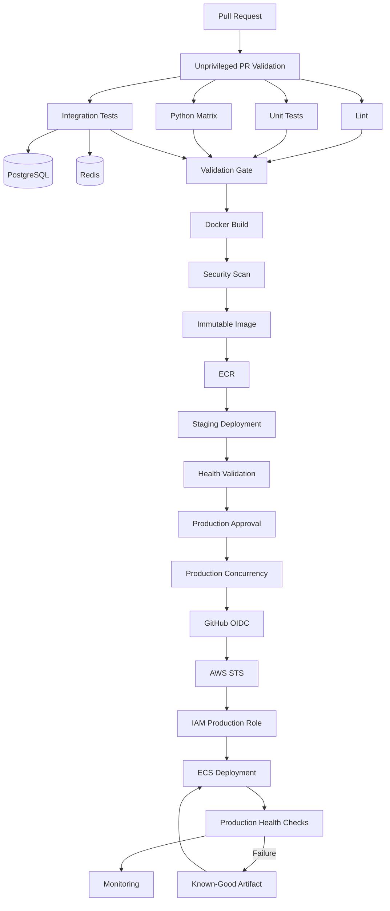

# 24- Common Interview Traps

## Overview

GitHub Actions interview traps usually appear when a candidate knows the YAML syntax but does not understand the execution model, security boundaries, data flow, or production consequences.

Senior-level interviews frequently test whether you can distinguish concepts that look similar:

- `needs` vs `concurrency`
- Artifacts vs caches
- `pull_request` vs `pull_request_target`
- Reusable workflows vs composite actions
- Secrets vs variables
- OIDC authentication vs IAM authorization
- Tags vs immutable digests
- CI validation vs deployment
- Rolling vs blue/green vs canary
- Runner capability vs runner trust boundary

The safest interview approach is to answer from the **engineering requirement first**, then explain the GitHub Actions mechanism that satisfies it.

```text
Requirement
    ↓
Execution model
    ↓
Security boundary
    ↓
Data flow
    ↓
Failure behavior
    ↓
Operational trade-off
    ↓
GitHub Actions implementation
```

---

## Trap: Treating GitHub Actions as "Just YAML"

### The Trap

A candidate describes GitHub Actions primarily as a YAML syntax for running shell commands.

### Correct Model

GitHub Actions is an execution platform with:

```text
Workflow
    ↓
Jobs
    ↓
Steps
    ↓
Actions / Commands
    ↓
Runner
```

A production workflow also involves:

- Events
- Permissions
- Secrets
- Environments
- Artifacts
- Caches
- Concurrency
- Runners
- Deployment controls
- External systems such as AWS

### Interview Answer

> GitHub Actions is an event-driven CI/CD platform. YAML defines the workflow, but the important engineering concerns are execution boundaries, dependency graphs, credentials, runners, artifacts, environments, concurrency, and failure handling.

---

## Trap: Confusing a Workflow, Job, Step, and Action

| Concept | Correct Meaning |
|---|---|
| Workflow | Complete automation definition |
| Job | Execution unit |
| Step | Operation inside a job |
| Action | Reusable implementation used by a step |
| Runner | Execution environment |

### Common Incorrect Statement

> "Every action is a job."

Incorrect.

An action normally executes as part of a step.

```yaml
steps:
  - uses: actions/checkout@<pinned-sha>
```

The job executes on a runner and the step invokes the action.

---

## Trap: Assuming Steps Run on Different Machines

Steps in the same job normally execute within the same job execution environment.

```text
Job
 ├── Step 1
 ├── Step 2
 └── Step 3
       ↓
   Same Runner
```

Separate jobs have separate execution contexts.

This distinction matters when discussing:

- Filesystem state
- Environment variables
- Installed packages
- Docker state
- Local services
- Workspace files

---

## Trap: Assuming Jobs Automatically Share Files

They do not.

This is a common mistake:

```text
build job
    ↓
file exists
    ↓
test job
```

A different job should not be assumed to have that file.

Use an artifact when a file must move between jobs.

```text
Build Job
   ↓
Upload Artifact
   ↓
Download Artifact
   ↓
Deployment Job
```

---

## Trap: Confusing `needs` with Concurrency

`needs` establishes a dependency:

```yaml
deploy:
  needs: build
```

It means:

```text
build
  ↓
deploy
```

It does **not** prevent another workflow run from executing another deployment simultaneously.

For that:

```yaml
concurrency:
  group: production-deployment
  cancel-in-progress: false
```

### Interview Answer

> `needs` controls the dependency graph. `concurrency` controls mutual exclusion. I use `needs` when one job requires another job's result, and concurrency when I need to prevent competing executions from operating on the same resource.

---

## Trap: Using `needs` to Prevent Duplicate Production Deployments

Consider:

```text
Run A:
build → deploy

Run B:
build → deploy
```

Each run can satisfy its own `needs` dependency.

Nothing prevents both deployment jobs from running.

The correct production model is:

```text
Run A ──┐
        ├── Production Deployment Lock
Run B ──┘
```

Use concurrency.

---

## Trap: Assuming `cancel-in-progress: true` Is Always Better

For pull requests, cancelling obsolete runs is often useful.

For production deployment, cancellation can be dangerous.

Example:

```yaml
concurrency:
  group: production
  cancel-in-progress: false
```

A deployment may have already:

- Changed infrastructure
- Started migrations
- Shifted traffic
- Drained connections
- Modified service state

Blindly cancelling it can leave the system in an intermediate state.

---

## Trap: Confusing Artifacts and Caches

This is one of the most common GitHub Actions interview traps.

### Artifact

Used to preserve or transfer workflow output.

Examples:

- Test reports
- Coverage reports
- Build packages
- Deployment bundles
- Diagnostic files

### Cache

Used to accelerate repeated computation.

Examples:

- Python packages
- npm dependencies
- Docker build layers

```text
Artifact = Output
Cache    = Optimization
```

### Interview Answer

> I would never treat a cache as the authoritative source for a production deployment artifact. The artifact needs explicit identity and lifecycle; the cache can be discarded and regenerated.

---

## Trap: Using a Cache to Store a Production Docker Image

A Docker build cache improves build performance.

It should not become the release system.

Preferred:

```text
Source
 ↓
Docker Build
 ↓
Immutable Image
 ↓
ECR
 ↓
Staging
 ↓
Production
```

Not:

```text
Docker Cache
 ↓
Production
```

The production deployment should identify an exact image or artifact.

---

## Trap: Confusing Docker Tag With Docker Digest

A tag is human-friendly:

```text
backend:1.8.0
```

A digest identifies exact image content:

```text
backend@sha256:...
```

A production pipeline should retain immutable artifact identity.

A useful metadata model is:

```text
Release: 1.8.0
Commit: abc123
Image Digest: sha256:def456...
```

This makes rollback and auditability much easier.

---

## Trap: Rebuilding for Every Environment

A weak pipeline might do:

```text
Build → Staging

Build Again → Production
```

This can produce different artifacts.

A stronger model is:

```text
Source
 ↓
Build Once
 ↓
Immutable Artifact
 ↓
Staging
 ↓
Approval
 ↓
Production
```

The artifact promoted to production should be the same artifact validated in staging.

---

## Trap: Thinking a Commit SHA Guarantees Identical Artifacts

A commit identifies source state.

It does not automatically guarantee reproducible builds.

Build output can change because of:

- Dependency changes
- Base image changes
- Toolchain changes
- External downloads
- Non-deterministic build steps

Therefore:

```text
Commit Identity
+
Build Reproducibility
+
Artifact Identity
```

provide stronger release traceability.

---

## Trap: Treating Semantic Versioning as an Immutable Artifact Identifier

Semantic versions communicate release intent:

```text
2.4.0
```

But registry tags can be mutable unless organizational controls prevent mutation.

For exact deployment identity, retain the digest:

```text
2.4.0
    ↓
sha256:...
```

---

## Trap: Confusing `pull_request` and `pull_request_target`

This is one of the most important security traps.

### `pull_request`

Designed for pull request workflows operating in the PR context.

### `pull_request_target`

Runs with the base repository context and therefore requires particular care.

The dangerous pattern is:

```text
Trusted workflow
    +
Untrusted PR code
    +
Secrets
    +
Write permissions
```

For example, checking out an attacker-controlled PR and executing it in a privileged `pull_request_target` workflow can create a credential or repository compromise path.

### Interview Answer

> `pull_request_target` should not be treated as a convenient way to get secrets into PR workflows. If privileged operations are required, I separate untrusted validation from trusted operations and avoid executing attacker-controlled code with privileged credentials.

---

## Trap: Assuming Fork Pull Requests Have Normal Secret Access

Fork-based pull requests require a different trust model.

You should assume that code in the PR may be untrusted.

Avoid designs where:

```text
Fork PR
 ↓
Secret
 ↓
Shell command
```

Instead:

```text
Untrusted PR
 ↓
Restricted Validation
 ↓
Trusted Workflow
 ↓
Privileged Operation
```

The exact mechanism depends on the workflow requirement.

---

## Trap: Saying "Secrets Are Safe Because GitHub Masks Them"

Masking is not equivalent to complete secret protection.

Secrets can be exposed through:

- Command arguments
- Artifacts
- Generated files
- Debug output
- Encoded values
- Application logs
- Docker layers
- Third-party actions
- External systems

Do not rely on masking as the primary security control.

---

## Trap: Putting Secrets in Command Arguments

Avoid patterns where credentials become part of the process command line.

Prefer environment variables where the consuming tool supports them:

```yaml
- name: Deploy
  env:
    API_TOKEN: ${{ secrets.API_TOKEN }}
  run: ./deploy.sh
```

Still ensure the script does not print the variable.

---

## Trap: Confusing Secrets With Variables

| Mechanism | Sensitive? | Typical Use |
|---|---:|---|
| `env` | No | Workflow/job configuration |
| `vars` | No | Managed configuration |
| `secrets` | Yes | Credentials |

A value does not become secure merely because it is referenced through an environment variable.

---

## Trap: Assuming Environment Secrets Are Automatically Available

Environment secrets are associated with an environment.

A job normally needs to target that environment:

```yaml
jobs:
  deploy:
    environment: production
```

Environment protection can then enforce controls such as:

- Required reviewers
- Branch restrictions
- Environment-specific secrets
- Deployment history

---

## Trap: Confusing Environment With Branch

A branch represents source state.

An environment represents deployment state and controls.

```text
main
 ↓
CI
 ↓
staging
 ↓
production
```

A single branch can potentially be deployed to multiple environments.

---

## Trap: Assuming Required Reviewers Are the Same as PR Reviewers

A pull request approval controls code integration.

An environment approval controls deployment access.

They protect different stages:

```text
Code Review
    ↓
Merge
    ↓
CI
    ↓
Deployment Approval
    ↓
Production
```

---

## Trap: Giving Every Job Full `GITHUB_TOKEN` Permissions

A common anti-pattern is:

```yaml
permissions: write-all
```

or relying on broad defaults.

Prefer least privilege.

For example:

```yaml
permissions:
  contents: read
```

Then grant additional permissions only where required.

For AWS OIDC:

```yaml
permissions:
  id-token: write
  contents: read
```

---

## Trap: Confusing Authentication and Authorization

Authentication:

> Who are you?

Authorization:

> What are you allowed to do?

AWS example:

```text
GitHub OIDC
 ↓
STS
 ↓
IAM Role
 ↓
IAM Policy
 ↓
ECR
```

OIDC establishes workload identity.

IAM policies determine permitted AWS operations.

---

## Trap: Thinking `id-token: write` Means AWS Access

This permission:

```yaml
permissions:
  id-token: write
```

allows the workflow to request an OIDC identity token.

It does not automatically grant:

- ECR permissions
- S3 permissions
- ECS permissions
- EC2 permissions

AWS IAM trust and permissions must also allow the operation.

---

## Trap: Using Long-Lived AWS Credentials Because They Are Easier

A common design is:

```text
AWS_ACCESS_KEY_ID
AWS_SECRET_ACCESS_KEY
```

stored as GitHub secrets.

A modern workload identity model is:

```text
GitHub Actions
 ↓
OIDC
 ↓
STS AssumeRole
 ↓
Temporary Credentials
```

This avoids storing long-lived AWS credentials in GitHub.

---

## Trap: Confusing IAM Trust Policy With IAM Permissions Policy

### Trust Policy

Controls who can assume the role.

### Permissions Policy

Controls what the role can do.

For GitHub OIDC:

```text
GitHub Identity
 ↓
Trust Policy
 ↓
Assume Role
 ↓
Permissions Policy
 ↓
AWS API
```

Both layers matter.

---

## Trap: Assuming OIDC Works Without Correct Subject Conditions

A secure OIDC trust policy should restrict the workload identity appropriately.

Potential conditions can include:

- Repository
- Branch
- Environment
- Organization

Do not use overly broad trust conditions merely to make authentication work.

---

## Trap: Giving the Build Job Production Permissions

A build job usually needs:

- Source checkout
- Dependency installation
- Tests
- Image build
- Possibly ECR push

It does not automatically need:

- Production ECS update
- Production database access
- Production secrets
- Infrastructure destruction permissions

Separate privileges:

```text
Build
 ↓
Build Role

Deploy
 ↓
Production Deploy Role
```

This reduces blast radius.

---

## Trap: Assuming `GITHUB_TOKEN` Is an AWS Credential

`GITHUB_TOKEN` authenticates workflow operations against GitHub.

It does not authenticate to AWS.

AWS access should use an appropriate mechanism such as:

```text
OIDC → STS → IAM Role
```

---

## Trap: Confusing `needs` With Data Transfer

`needs` gives dependency and access to upstream job outputs.

It does not automatically transfer files.

For files:

```text
Upload Artifact
 ↓
Download Artifact
```

For small structured values:

```text
Job Output
 ↓
needs.<job>.outputs.<name>
```

---

## Trap: Using Environment Variables to Pass Large Data Between Jobs

Environment variables are poor mechanisms for large structured payloads.

Prefer:

| Data | Mechanism |
|---|---|
| Small value | Job output |
| Structured small JSON | Job output + `fromJSON()` |
| File | Artifact |
| Dependency data | Cache |

---

## Trap: Assuming `$GITHUB_ENV` Works Across Jobs

`$GITHUB_ENV` modifies the environment for later steps in the same job.

It is not a cross-job state store.

For cross-job communication:

```text
Job A
 ↓
Job Output / Artifact
 ↓
Job B
```

---

## Trap: Confusing `$GITHUB_OUTPUT` and `$GITHUB_ENV`

```text
$GITHUB_ENV
    ↓
Environment variable
```

```text
$GITHUB_OUTPUT
    ↓
Step output
    ↓
Job output
    ↓
Downstream job
```

Choose based on the required scope.

---

## Trap: Assuming Dynamic Matrices Are Static

A matrix can be generated dynamically.

Typical pattern:

```text
Planning Job
 ↓
Generate JSON
 ↓
GITHUB_OUTPUT
 ↓
fromJSON()
 ↓
Matrix Job
```

Example:

```yaml
strategy:
  matrix: ${{ fromJSON(needs.plan.outputs.matrix) }}
```

This is useful for:

- Monorepos
- Changed services
- Supported versions
- Environment-specific testing

---

## Trap: Creating Huge Matrices Without Considering Cost

If you have:

```text
4 Python versions
× 3 databases
× 2 operating systems
× 5 services
```

you already have:

```text
120 combinations
```

The matrix can become the dominant CI cost.

Senior design should consider:

- Cardinality
- `max-parallel`
- Selective testing
- Nightly full matrices
- Compatibility boundaries
- Runner capacity

---

## Trap: Assuming `fail-fast` Means All Matrix Jobs Immediately Stop

`fail-fast` controls matrix cancellation behavior, but it does not mean every already-running job is magically terminated at the exact same moment.

Understand the distinction between:

- Queued jobs
- Running jobs
- Cancelled jobs
- Failed jobs
- Independent workflow runs

Interviewers often use this to test execution-model understanding.

---

## Trap: Using `continue-on-error` to Hide Production Failures

`continue-on-error` has legitimate uses for:

- Experimental matrix entries
- Non-blocking validation
- Known compatibility checks

It should not be used to turn an actual release blocker into a successful pipeline.

Bad:

```yaml
continue-on-error: true
```

on the only production deployment validation.

---

## Trap: Assuming `always()` Means "Always Safe"

`always()` can cause a step or job to be considered regardless of normal success/failure flow.

That does not mean the operation is safe during cancellation or partial failure.

For example, a deployment cleanup action might need:

```yaml
if: ${{ !cancelled() }}
```

instead of:

```yaml
if: ${{ always() }}
```

The condition should represent the actual operational requirement.

---

## Trap: Confusing `failure()` With "Previous Step Failed"

At job level, status functions interact with job dependencies and execution conditions.

Do not explain them as if they were simple Python booleans attached only to the immediately preceding line.

Think in terms of workflow execution state.

---

## Trap: Assuming Skipped Jobs Are Failures

A job can be skipped because its condition evaluates to false.

That is different from:

```text
Failed
```

This matters when designing:

- Deployment gates
- Failure reporting
- Notifications
- Fan-in jobs

Always reason about:

```text
success
failure
skipped
cancelled
```

as distinct states.

---

## Trap: Using `always()` for Every Reporting Job

A reporting job may need to run after failure but not after cancellation.

A more precise condition can be:

```yaml
if: ${{ !cancelled() }}
```

The correct condition depends on the reporting requirement.

---

## Trap: Confusing Cache Miss With Pipeline Failure

A cache miss is normally an optimization failure, not a correctness failure.

Example:

```text
Cache Hit
 → Fast Build

Cache Miss
 → Download Dependencies
 → Build Still Succeeds
```

A mature pipeline should remain correct when the cache is empty.

---

## Trap: Treating Cache Data as Trusted Production State

Caches may be:

- Evicted
- Rebuilt
- Missed
- Invalidated

They should not become the only source of:

- Release binaries
- Production images
- Deployment configuration
- Migration packages

---

## Trap: Ignoring Cache Poisoning

Caches cross execution boundaries depending on the workflow design.

Security-sensitive workflows must consider whether untrusted code can influence cached content consumed by trusted workflows.

Especially evaluate:

```text
Untrusted PR
 ↓
Cache Write
 ↓
Privileged Workflow
 ↓
Cache Restore
```

The cache becomes part of the supply-chain boundary.

---

## Trap: Trusting Third-Party Actions Because They Are Popular

Popularity is not a security guarantee.

Evaluate:

- Source repository
- Maintainer
- Release process
- Dependencies
- Permissions
- Inputs
- Script execution
- Network access
- Version pinning
- SHA pinning
- Security history

An action executes with the permissions available to its job.

---

## Trap: Assuming SHA Pinning Solves All Supply-Chain Problems

SHA pinning protects against mutable references moving unexpectedly.

It does not solve:

- Malicious code already present at that SHA
- Compromised dependencies
- Excessive workflow permissions
- Secret exposure
- Unsafe shell commands
- Vulnerable runner infrastructure

Defense in depth is still required.

---

## Trap: Giving Third-Party Actions Broad Permissions

Bad design:

```yaml
permissions: write-all
```

followed by:

```yaml
- uses: third-party/action@<sha>
```

The action now operates in a highly privileged context.

Prefer:

```text
Minimal Job Permissions
+
Trusted Action
+
SHA Pinning
+
No Unnecessary Secrets
```

---

## Trap: Running Untrusted Code on Persistent Self-Hosted Runners

Persistent runners can retain:

- Files
- Credentials
- Docker state
- Temporary data
- Tool caches
- Processes

If untrusted code executes there, residual state can become a security problem.

Ephemeral runners provide stronger isolation.

---

## Trap: Assuming Self-Hosted Means More Secure

Self-hosted means more control.

It also means more responsibility.

You own:

- OS patching
- Runner updates
- Network security
- Credentials
- Isolation
- Monitoring
- Cleanup
- Capacity
- Incident response

---

## Trap: Using a Self-Hosted Runner Merely Because It Is Faster

The primary reason should be a real requirement such as:

- Private network access
- Specialized hardware
- Custom software
- Internal infrastructure

If standard GitHub-hosted runners meet the requirement, operational simplicity can be valuable.

---

## Trap: Confusing Runner Labels With Security Controls

Labels such as:

```text
production
linux
docker
```

help select runners.

They are not sufficient as the complete security boundary.

Use runner groups, repository restrictions, environments, permissions, and network isolation where required.

---

## Trap: Assuming Containers Automatically Provide Security

Running a job in a container does not automatically eliminate:

- Host risks
- Secret exposure
- Malicious dependencies
- Docker socket risks
- Network access
- Privileged operations

Containerization improves isolation in specific dimensions but is not a complete CI security model.

---

## Trap: Confusing Job Containers With Service Containers

A job container runs the job.

A service container provides a dependency.

Example:

```text
Python Job Container
      |
      +---- PostgreSQL Service
      |
      +---- Redis Service
```

This is common for Django/FastAPI integration tests.

---

## Trap: Assuming `localhost` Always Means the Service Container

Networking differs depending on whether the job itself runs in a container or directly on the runner.

The correct hostname and port model depends on the execution topology.

Always ask:

```text
Where does the test process run?
Where does PostgreSQL run?
Where does Redis run?
What network connects them?
```

---

## Trap: Assuming Service Container Readiness Equals Process Startup

A container being started does not necessarily mean the application inside is ready.

Database services may need:

- Health checks
- Startup wait logic
- Retry loops
- Connection checks

Example:

```text
Container Started
      ↓
Database Initializing
      ↓
Database Ready
      ↓
Tests
```

Do not start integration tests merely because the container exists.

---

## Trap: Running Integration Tests Without Isolation

Parallel tests can interfere through shared:

- Database tables
- Redis keys
- Kafka topics
- Files
- Ports

Use appropriate isolation:

```text
Worker 1 → DB/schema A
Worker 2 → DB/schema B
```

or another controlled isolation strategy.

---

## Trap: Assuming Unit Tests Are Enough

Unit tests validate isolated logic.

Integration tests validate interactions.

E2E tests validate broader workflows.

A production pipeline often needs:

```text
Lint
 ↓
Unit
 ↓
Integration
 ↓
Security
 ↓
E2E / Smoke
```

Not every pull request needs the full E2E suite, but the validation strategy should be intentional.

---

## Trap: Running the Entire E2E Suite on Every Pull Request

This can produce:

- Slow feedback
- High infrastructure cost
- More flaky tests
- Poor developer experience

A mature strategy can use:

```text
PR
 → Unit
 → Integration
 → Targeted E2E

Nightly / Release
 → Full E2E
```

---

## Trap: Treating Code Coverage as Code Quality

Coverage measures executed code paths.

It does not guarantee:

- Correct assertions
- Good test design
- Production behavior
- Security
- Performance

A 95% coverage number can still represent weak tests.

Use coverage as a signal, not the entire quality model.

---

## Trap: Failing a Pipeline Only Because an External Service Is Temporarily Down

External dependencies can introduce flaky CI.

Consider:

- Mocking for unit tests
- Controlled integration environments
- Retries for transient operations
- Timeouts
- Dedicated test infrastructure

Retries should not hide persistent failures.

---

## Trap: Blindly Retrying Every Test

Retries can mask:

- Race conditions
- Shared-state bugs
- Resource exhaustion
- Network instability
- Real application defects

Use retries selectively and measure retry frequency.

---

## Trap: Confusing Retry With Idempotency

A retry is safe only when repeating the operation is safe.

For deployment:

```text
Retry
 ↓
Same desired state
```

is preferable to:

```text
Retry
 ↓
Duplicate side effect
```

Deployment scripts should be designed to be idempotent where possible.

---

## Trap: Assuming a Successful Deployment Means a Healthy Application

A deployment command can succeed while the application is broken.

Production deployment should include:

```text
Deploy
 ↓
Health Check
 ↓
Smoke Test
 ↓
Metrics
 ↓
Promotion / Rollback
```

Examples:

- HTTP health endpoint
- Readiness check
- Error-rate check
- Latency check
- Dependency connectivity

---

## Trap: Checking Only Process Health

A process being alive does not mean the application is healthy.

A Django/FastAPI application may be running while:

- PostgreSQL is unreachable
- Redis is unavailable
- Kafka consumers are failing
- Migrations are incomplete
- External APIs are unavailable

Health checks should represent meaningful application readiness.

---

## Trap: Rolling Deployment Automatically Means Zero Downtime

Rolling deployment can still produce downtime due to:

- Insufficient capacity
- Poor readiness checks
- Connection draining problems
- Database incompatibility
- Startup failures
- Incorrect termination order

Zero downtime is an operational property, not simply the name of a deployment strategy.

---

## Trap: Ignoring Database Compatibility During Deployment

Suppose version 2 requires a new database column.

If deployment order is:

```text
New Application
 ↓
Old Database Schema
```

the application may fail.

Use expand/contract:

```text
Expand
 ↓
Deploy Compatible Application
 ↓
Migrate Usage
 ↓
Contract
```

This also improves rollback safety.

---

## Trap: Assuming Application Rollback Means Database Rollback

You may be able to roll:

```text
Application v2 → v1
```

while safely keeping the database at the newer compatible schema.

This is why backward-compatible migrations are important.

---

## Trap: Treating Redis as Durable Application State

Redis may be used for:

- Cache
- Session data
- Rate limiting
- Celery broker
- Short-lived state

The CI/CD design should understand what role Redis plays before deciding how deployment and rollback affect it.

---

## Trap: Ignoring Celery During Deployment

A new application version can be incompatible with old queued tasks.

Consider:

```text
Producer v2
 ↓
Queue
 ↓
Worker v1
```

The task payload or behavior may no longer be compatible.

Deployment planning should account for:

- Worker/application compatibility
- Task versioning
- Queue draining
- Rolling worker replacement
- Retry behavior

---

## Trap: Ignoring Kafka Compatibility

Kafka introduces asynchronous compatibility concerns.

A producer and consumer may be deployed at different times.

Prefer backward-compatible event schema evolution.

A deployment pipeline should not assume:

```text
Deploy Producer
 ↓
Immediately Deploy Consumer
```

is always safe.

---

## Trap: Treating Deployment as a Single Command

Production deployment is a lifecycle:

```text
Validate
 ↓
Build
 ↓
Publish
 ↓
Promote
 ↓
Approve
 ↓
Deploy
 ↓
Validate
 ↓
Observe
 ↓
Rollback if required
```

The deployment command is only one step.

---

## Trap: Confusing Build, Release, and Deployment

```text
Build
 → Produce artifact

Release
 → Version and publish artifact

Deployment
 → Place artifact into environment
```

Separating these concepts improves:

- Auditability
- Rollback
- Promotion
- Reproducibility

---

## Trap: Assuming Production Approval Makes a Pipeline Secure

Manual approval is one control.

It does not replace:

- Least privilege
- Artifact integrity
- Secret protection
- OIDC
- Action pinning
- Environment restrictions
- Branch protection
- Monitoring

Approval should be a deployment gate, not the entire security model.

---

## Trap: Assuming Approval Means the Deployment Is Safe

An approver should have enough evidence to make the approval meaningful.

Useful evidence includes:

- Commit
- Artifact digest
- Tests
- Security scan
- Deployment target
- Change summary
- Previous deployment
- Rollback procedure

Approval without evidence becomes a procedural checkbox.

---

## Trap: Allowing Stale Approval to Authorize a Different Artifact

Consider:

```text
Artifact A
 ↓
Approval
 ↓
Artifact B
 ↓
Production
```

This is a dangerous design.

The approval should correspond to the artifact being deployed.

Immutable artifact identity helps maintain that relationship.

---

## Trap: Treating Blue/Green and Canary as Synonyms

Blue/green generally maintains two release environments or versions and switches traffic.

Canary progressively exposes a subset of traffic to the new version.

```text
Blue/Green:
Old 100% → New 100%

Canary:
Old 100% → New 5% → 25% → 50% → 100%
```

The traffic-management model is different.

---

## Trap: Choosing Canary Without Observability

Canary requires meaningful signals.

Examples:

- Error rate
- Latency
- Saturation
- Request success
- Business metrics

Without reliable telemetry, a canary can simply delay detection.

---

## Trap: Assuming Blue/Green Is Free

Blue/green can require:

- Additional capacity
- Duplicate application resources
- Additional networking
- More infrastructure
- Traffic-switching logic

The operational simplicity of rollback comes with capacity and cost implications.

---

## Trap: Assuming Rollback Is Always Possible

Rollback can fail when:

- Database schema is incompatible
- Events are incompatible
- External APIs changed
- Infrastructure changed irreversibly
- Data migrations were destructive
- Secrets/configuration changed

A rollback strategy must be designed before deployment.

---

## Trap: Using Git Revert as the Only Rollback Strategy

Reverting source code creates a new commit.

It does not necessarily restore:

- Deployed artifact
- Database
- Infrastructure
- External state

Production rollback should generally operate against known-good deployment artifacts and explicit recovery procedures.

---

## Trap: Confusing Rollback With Disaster Recovery

Rollback:

```text
Recent bad release
 ↓
Known-good release
```

Disaster recovery:

```text
Major system failure
 ↓
Restore service/data/infrastructure
```

Rollback is one operational recovery mechanism.

It is not a substitute for DR.

---

## Trap: Assuming Terraform Apply Is a Safe Deployment Rollback

Terraform manages desired infrastructure state.

Application rollback and infrastructure rollback are different concerns.

A production system may need:

```text
Application Artifact Rollback
+
Infrastructure State Management
+
Database Recovery
```

Do not treat all three as the same operation.

---

## Trap: Ignoring Terraform State Concurrency

Two infrastructure deployments can race:

```text
Run A → terraform apply
Run B → terraform apply
```

State locking and CI concurrency should be considered together.

---

## Trap: Giving Every Workflow Access to Production Infrastructure

A production AWS role should be restricted to workflows and environments that genuinely require it.

Prefer:

```text
PR CI
 → No production role

Staging Deployment
 → Staging role

Production Deployment
 → Production role
```

This limits blast radius.

---

## Trap: Assuming Repository-Level Permissions Are Enough

Security can exist at multiple layers:

```text
Organization
 ↓
Repository
 ↓
Workflow
 ↓
Job
 ↓
Environment
 ↓
AWS IAM
```

A secure production pipeline uses defense in depth.

---

## Trap: Confusing Repository Secrets With External Secret Managers

GitHub secrets may be sufficient for many CI/CD cases.

Highly sensitive production environments may also use dedicated secret-management systems.

The important design question is:

> Where should the source of truth for runtime secrets live?

Do not duplicate sensitive values unnecessarily across systems.

---

## Trap: Logging Secrets During Debugging

Debugging often leads engineers to add:

```bash
env
```

or:

```bash
set -x
```

This can expose sensitive data.

Prefer targeted diagnostics:

```bash
echo "AWS_REGION=$AWS_REGION"
aws sts get-caller-identity
```

Never print credentials.

---

## Trap: Assuming Debug Logging Is Safe in Production

Debug logging can expose:

- Context
- Environment
- Commands
- File paths
- Internal metadata

Enable detailed diagnostics only when necessary and avoid exposing secrets.

---

## Trap: Debugging the Wrong Failure Domain

A senior engineer should classify the failure first.

```text
Trigger
 ↓
Workflow
 ↓
Job
 ↓
Step
 ↓
Action
 ↓
Runner
 ↓
Network
 ↓
External Service
```

For AWS:

```text
OIDC
 ↓
STS
 ↓
IAM
 ↓
AWS Resource
```

For Docker:

```text
Dockerfile
 ↓
Build Context
 ↓
BuildKit
 ↓
Cache
 ↓
Registry
```

Do not change random YAML until the failure domain is identified.

---

## Trap: Debugging From the Last Error Message Only

The final error may be a downstream symptom.

Example:

```text
Deployment Failed
```

could actually be:

```text
Wrong Artifact
    ↓
Wrong Image
    ↓
Bad Application
    ↓
Health Check Failed
    ↓
Deployment Reported Failure
```

Find the earliest meaningful failure.

---

## Trap: Ignoring Trigger Configuration

A workflow that "does not run" may be correctly behaving according to:

- Branch filters
- Path filters
- Event type
- Repository settings
- Workflow permissions
- Fork behavior
- Disabled workflows

First verify the trigger.

---

## Trap: Assuming `push` and `pull_request` Have the Same Context

They represent different events.

The values of:

- Branch
- Commit
- SHA
- Ref
- PR metadata

can differ.

Do not blindly reuse expressions between event types.

---

## Trap: Using Branch Names Directly in Shell Commands

Unsafe pattern:

```yaml
run: ./deploy.sh "${{ github.head_ref }}"
```

GitHub metadata can be influenced by external users in some event contexts.

Safer design:

```yaml
env:
  BRANCH_NAME: ${{ github.head_ref }}

run: ./deploy.sh "$BRANCH_NAME"
```

Then validate the value inside the script.

Even better, avoid passing untrusted branch names to shell commands when they are not actually required.

---

## Trap: Believing Shell Quoting Solves Every Injection Problem

Quoting reduces shell parsing problems.

It does not automatically make untrusted input appropriate for:

- File paths
- Docker tags
- SQL
- URLs
- AWS CLI parameters
- Configuration templates

Validate according to the target domain.

---

## Trap: Passing User Input Directly Into Docker Tags

Bad conceptual design:

```text
User Input
 ↓
Docker Tag
 ↓
Registry
```

Normalize and validate identifiers before using them.

Prefer trusted identifiers such as:

```text
Git commit SHA
```

for machine-level artifact identity.

---

## Trap: Using `eval` in CI Scripts

Avoid:

```bash
eval "$USER_INPUT"
```

This turns data into executable shell code.

Prefer direct argument passing and strict validation.

---

## Trap: Assuming Third-Party Actions Cannot Read Secrets

An action runs within the job's execution context.

If the job has access to:

- Secrets
- Token permissions
- AWS credentials

the action may be able to access them depending on how they are exposed and what it executes.

The correct security boundary is the job.

---

## Trap: Giving Deployment Secrets to Test Jobs

A test job should not normally need:

```text
Production AWS Role
+
Production Secrets
```

Separate jobs by trust level.

```text
Untrusted CI
 ↓
No Production Credentials

Trusted Deployment
 ↓
Production Credentials
```

---

## Trap: Assuming `workflow_run` Automatically Makes a Workflow Safe

A workflow triggered by another workflow may operate with different privileges and contexts.

Treat workflow chaining as a security boundary.

Do not blindly transfer untrusted artifacts or code into privileged workflows.

---

## Trap: Confusing `workflow_dispatch` Inputs With Trusted Data

Manual inputs are user-provided data.

Validate them.

For example:

```yaml
inputs:
  environment:
    type: choice
    options:
      - staging
      - production
```

Prefer constrained input types and explicit allowlists where available.

---

## Trap: Using `schedule` for Time-Critical Production Operations

Scheduled workflows are useful for:

- Nightly security scans
- Maintenance
- Periodic tests
- Reports

They should not automatically be treated as precise production schedulers.

For critical timing requirements, use an architecture designed for that operational guarantee.

---

## Trap: Assuming GitHub Actions Is Your Monitoring System

GitHub Actions can provide:

- Workflow logs
- Job results
- Deployment history
- Summaries
- Artifacts

It is not a complete runtime observability platform.

Production applications still need:

- Metrics
- Logs
- Traces
- Alerts
- Health checks

---

## Trap: Treating CI Success as Production Success

CI answers:

> Did our validation pass?

Production monitoring answers:

> Is the running system healthy?

These are different signals.

```text
CI
 ↓
Artifact Confidence

Runtime Monitoring
 ↓
Operational Confidence
```

---

## Trap: Ignoring Cost

A pipeline can be technically correct but economically poor.

Cost drivers include:

- Large matrices
- Long-running E2E tests
- Excessive parallelism
- Self-hosted infrastructure
- Large Docker builds
- Ineffective caching
- Repeated builds
- Excessive artifact retention

Optimize the critical path without sacrificing required validation.

---

## Trap: Maximizing Parallelism Without Considering Downstream Capacity

Suppose 50 CI jobs simultaneously connect to PostgreSQL.

The runner fleet may scale successfully while PostgreSQL becomes the bottleneck.

This is a classic distributed-system failure:

```text
Runner Autoscaling
        ↓
More Concurrent Tests
        ↓
Database Connection Spike
        ↓
PostgreSQL Saturation
```

CI scalability must consider dependent services.

---

## Trap: Assuming More Runners Always Make CI Faster

More runners help only when the workload can use them.

Bottlenecks may exist in:

- Database
- Docker registry
- Package registry
- Network
- GitHub API
- AWS quotas
- Internal services

Scale the actual bottleneck.

---

## Trap: Ignoring Artifact Retention

Keeping every:

- Test report
- Build artifact
- Debug archive
- Release package

forever increases storage and governance cost.

Define retention based on:

- Debugging needs
- Compliance
- Release lifecycle
- Rollback requirements

---

## Trap: Treating Logs as Permanent Audit Storage

Workflow logs are useful operational evidence.

They should not automatically become the organization's only long-term audit system.

Critical deployment records should integrate with appropriate audit and observability systems.

---

## Trap: Ignoring Action Versioning

A workflow can unexpectedly change behavior when dependencies move.

Production pipelines should use a deliberate versioning strategy:

```text
Trusted Action
 ↓
Version / SHA
 ↓
Controlled Update
 ↓
Validation
 ↓
Rollout
```

Do not blindly update every action during unrelated application changes.

---

## Trap: Assuming Semantic Versioning Means No Breaking Changes

SemVer is a versioning convention, not a guarantee enforced by GitHub Actions.

For internal reusable workflows and actions, maintain:

- Compatibility expectations
- Changelogs
- Consumer testing
- Deprecation process
- Controlled rollout

---

## Trap: Treating a Reusable Workflow as "Free Abstraction"

Reusable workflows centralize behavior.

That is useful, but creates blast radius.

```text
Central Workflow
       ↓
50 Repositories
```

A breaking change can affect all consumers.

Version reusable workflows and test consumer compatibility.

---

## Trap: Copying a Giant Workflow Instead of Designing Boundaries

A huge workflow can become difficult to:

- Test
- Review
- Debug
- Secure
- Reuse
- Maintain

Prefer clear boundaries:

```text
CI Workflow
 ↓
Build Workflow
 ↓
Deployment Workflow
```

or reusable workflows for stable platform capabilities.

---

## Trap: Over-Abstraction

The opposite mistake is creating:

```text
Workflow
 ↓
Reusable Workflow
 ↓
Composite Action
 ↓
Script
 ↓
Another Script
```

for trivial operations.

Abstraction should reduce complexity, not move it elsewhere.

---

## Trap: Confusing Reusable Workflows With Composite Actions

This is worth memorizing:

```text
Reusable Workflow
→ Multiple Jobs
→ Pipeline Orchestration

Composite Action
→ Multiple Steps
→ Reusable Step Logic
```

If the interview question is about job orchestration, think reusable workflow.

If it is about packaging steps, think composite action.

---

## Trap: Confusing Composite Actions With Scripts

A script can implement logic.

A composite action provides a reusable GitHub Actions interface around one or more steps.

Use the abstraction that gives the required contract without unnecessary complexity.

---

## Trap: Assuming Custom Actions Are Automatically Secure

Custom actions can contain:

- Shell commands
- Network calls
- Dependencies
- GitHub API calls
- AWS operations
- Docker execution

They need:

- Input validation
- Least privilege
- Dependency management
- Versioning
- Testing
- Documentation
- Security review

---

## Trap: Ignoring Docker Build Context

A Docker build can become slow because too much data is sent as build context.

Use `.dockerignore`.

For a Python backend:

```text
.git
.venv
__pycache__
.pytest_cache
.coverage
.env
```

Avoid sending unnecessary files to BuildKit.

---

## Trap: Optimizing Docker Layers Without Understanding Dependency Changes

A common Python pattern is:

```dockerfile
COPY requirements.txt .
RUN pip install -r requirements.txt

COPY . .
```

This allows dependency installation to remain cached when application source changes without changing the dependency file.

The principle is:

```text
Stable Inputs
    ↓
Earlier Layers

Frequently Changing Inputs
    ↓
Later Layers
```

---

## Trap: Assuming Docker Cache Is Always Safe to Share

Cache contents can be influenced by the build context and workflow trust model.

Consider:

- Fork PRs
- Untrusted code
- Registry caches
- Shared builders
- Cache scopes

A performance optimization can become a supply-chain risk if trust boundaries are ignored.

---

## Trap: Confusing Registry Authentication With Registry Authorization

Logging into ECR establishes authentication.

It does not guarantee the role has permission to:

- Push
- Pull
- Delete
- Describe repositories

Check IAM permissions separately.

---

## Trap: Assuming ECR Push Permissions Equal ECS Deployment Permissions

They are separate permission sets.

```text
ECR Push
≠
ECS Update
```

Separate deployment roles where appropriate.

---

## Trap: Ignoring AWS Region and Account Context

A successful AWS authentication does not guarantee that the workflow is operating against the intended:

- Account
- Region
- ECR repository
- ECS cluster

A useful diagnostic is:

```bash
aws sts get-caller-identity
aws configure get region
```

Then verify resource identity.

---

## Trap: Debugging AWS AccessDenied Without Checking the Trust Policy

For OIDC, investigate in order:

```text
GitHub Permissions
 ↓
OIDC Token
 ↓
IAM OIDC Provider
 ↓
Trust Policy
 ↓
STS AssumeRole
 ↓
IAM Permissions
 ↓
Resource Policy / SCP / Boundary
```

Do not immediately modify the permissions policy if the role cannot even be assumed.

---

## Trap: Assuming IAM Policy Alone Determines Access

AWS authorization can involve:

- Identity policies
- Resource policies
- Trust policies
- Service control policies
- Permission boundaries
- Session policies

Senior troubleshooting considers the complete authorization chain.

---

## Trap: Treating a Failed Deployment as an Application Bug

Deployment failures can originate from:

- Workflow configuration
- Permissions
- Runner
- Docker
- Registry
- Network
- AWS
- Infrastructure
- Application
- Database
- Health checks

Use failure-domain isolation.

---

## Trap: Assuming a Green Build Means the Artifact Is Safe

A green build means the configured checks passed.

It does not inherently prove:

- No vulnerable dependency exists
- Artifact was produced by a trusted workflow
- Image is signed
- Provenance is valid
- Secrets were not leaked
- Runtime configuration is correct

Security should be layered.

---

## Trap: Confusing SBOM With Vulnerability Scanning

An SBOM describes components.

A vulnerability scanner evaluates those components against vulnerability data.

```text
Artifact
 ↓
SBOM
 ↓
Component Inventory
 ↓
Vulnerability Analysis
```

An SBOM is an input to security analysis, not the same thing as the analysis itself.

---

## Trap: Confusing Provenance With Signing

Provenance explains how an artifact was built.

Signing provides authenticity/integrity verification through a cryptographic identity.

They complement each other.

---

## Trap: Assuming a Signed Artifact Is Automatically Safe

A signature can establish that an artifact corresponds to a signing identity.

It does not prove that:

- The source was secure
- Dependencies were safe
- The build process was uncompromised
- The application has no vulnerabilities

Trust the complete supply chain.

---

## Trap: Ignoring Artifact Provenance During Promotion

A strong deployment process should be able to answer:

```text
Which source produced this artifact?
Which workflow built it?
Which commit produced it?
Which dependencies were included?
Which artifact was deployed?
Where was it deployed?
Who approved it?
```

This is operational traceability.

---

## Trap: Using Production Secrets During Build

If possible, keep runtime secrets out of the build stage.

Prefer:

```text
Build
 ↓
Immutable Artifact

Deployment
 ↓
Environment Credentials
```

This prevents build infrastructure from unnecessarily receiving production credentials.

---

## Trap: Embedding Secrets in Docker Images

Never bake secrets into image layers.

Bad:

```dockerfile
ENV DATABASE_PASSWORD=secret
```

The image itself becomes a secret-bearing artifact.

Instead inject runtime configuration through the deployment environment or appropriate secret-management mechanism.

---

## Trap: Assuming `.env` Is Safe Because It Is in `.gitignore`

`.gitignore` prevents accidental Git tracking.

It does not prevent:

- Docker build-context exposure
- Artifact upload
- Log output
- Workspace access
- Malicious commands

Use `.dockerignore` and explicit secret-handling controls as well.

---

## Trap: Running `git diff` or `git log` Without Considering Untrusted Content

Commit messages, branch names, and file content can contain attacker-controlled strings.

Do not pass them directly into shell evaluation.

Treat repository metadata as data.

---

## Trap: Assuming Pull Request Code Is Trusted Because It Comes From GitHub

Source control hosting does not imply code trust.

A pull request can contain malicious code.

The correct question is:

> What privileges does this workflow give the code being executed?

---

## Trap: Giving Fork PRs Access to Private Network Runners

A self-hosted runner may have access to:

- Internal APIs
- Databases
- AWS private endpoints
- Redis
- Kafka
- Deployment infrastructure

Running untrusted fork code there can expose the private network.

Use strict runner selection and trust boundaries.

---

## Trap: Mixing CI and Deployment Credentials

A common anti-pattern is:

```text
Every Workflow
 ↓
Production Credentials
```

Prefer privilege zoning:

```text
PR CI
 → Read-only

Build
 → Registry permissions

Staging
 → Staging deployment role

Production
 → Production deployment role
```

---

## Trap: Assuming Environment Protection Replaces Concurrency

Approval controls who can authorize deployment.

Concurrency controls whether competing deployments can execute simultaneously.

You often need both:

```text
Environment Protection
+
Concurrency
```

---

## Trap: Assuming Concurrency Automatically Makes Deployment Idempotent

Concurrency prevents certain races.

It does not make the deployment itself safe to retry.

Deployment operations should still be idempotent where possible.

---

## Trap: Ignoring External State

CI/CD does not operate in isolation.

Deployments interact with:

- Databases
- Queues
- Kafka
- Redis
- AWS resources
- External APIs
- DNS
- Load balancers

A deployment strategy must consider these dependencies.

---

## Trap: Assuming a Failed Deployment Leaves No Changes

A deployment can fail halfway through.

For example:

```text
Update Service
 ↓
Some Tasks Updated
 ↓
Health Check Failure
 ↓
Deployment Stops
```

The system may now be partially changed.

Production deployment design must include recovery behavior.

---

## Trap: Ignoring Connection Draining

Zero-downtime deployments can fail if old instances are terminated while active requests still depend on them.

Graceful shutdown and connection draining are important for:

- HTTP
- WebSockets
- gRPC
- Long-running requests
- Worker processes

---

## Trap: Assuming Stateless Applications Have No Deployment State

Even stateless application instances interact with stateful systems:

- Database
- Redis
- Kafka
- Object storage
- External APIs

Deployment compatibility must include these dependencies.

---

## Trap: Treating Kafka Consumers Like Stateless HTTP Servers

Kafka consumers have:

- Consumer groups
- Offsets
- Partition ownership
- Message compatibility
- Replay behavior

Rolling a consumer deployment requires compatibility and graceful shutdown considerations.

---

## Trap: Treating Celery Workers Like Web Servers

Celery workers process asynchronous tasks.

During deployment, consider:

- Existing tasks
- Task payload compatibility
- Worker shutdown
- Retry behavior
- Queue backlog
- Duplicate processing

---

## Trap: Assuming Health Checks Are Binary

A health check can be:

```text
Process alive
```

or:

```text
Application ready
```

or:

```text
Application healthy under real dependency conditions
```

Use the level appropriate for the deployment gate.

---

## Trap: Making Production Health Checks Too Strict

A deployment can fail unnecessarily if a health check depends on an optional external service.

Separate:

- Liveness
- Readiness
- Dependency health
- Business health

Use each for the appropriate purpose.

---

## Trap: Ignoring Rollback Testing

A rollback strategy that exists only in documentation is not necessarily operationally usable.

Test:

```text
Deploy
 ↓
Detect Failure
 ↓
Rollback
 ↓
Validate
```

Include database and dependency compatibility in rollback exercises.

---

## Trap: Treating Disaster Recovery as "We Have Backups"

Backups are one part of DR.

A production DR design also considers:

- Restore procedure
- RTO
- RPO
- Infrastructure recreation
- Secrets
- DNS
- Dependencies
- Validation

---

## Trap: Assuming GitHub Actions Is Highly Available by Itself

CI/CD reliability includes dependencies outside the workflow:

```text
GitHub
 ↓
Runner
 ↓
Registry
 ↓
AWS
 ↓
Database
 ↓
Application
```

A failure in any critical dependency can block delivery.

Design recovery paths accordingly.

---

## Trap: Ignoring GitHub Actions Quotas and Limits

Large workflows can encounter platform constraints involving:

- Concurrent jobs
- API requests
- Storage
- Artifact size
- Workflow execution
- Runner availability

Senior design considers platform limits before scaling a workflow architecture.

---

## Trap: Treating GitHub Actions as an Infinite Compute Cluster

A matrix with thousands of combinations is technically expressible but operationally questionable.

Before scaling execution, consider:

```text
Matrix Cardinality
+
Runner Capacity
+
Dependency Capacity
+
GitHub Limits
+
Cost
```

---

## Trap: Ignoring Repository and Organization Governance

Enterprise GitHub Actions should consider:

- Approved actions
- SHA pinning
- Permissions standards
- Required workflows
- Runner groups
- Environment protection
- Reusable workflow governance
- Security policies

Central governance reduces repeated security mistakes.

---

## Trap: Allowing Every Marketplace Action

An enterprise allowlist can restrict action usage to approved sources.

The goal is not to eliminate third-party actions.

The goal is to control:

```text
Trust
Version
Ownership
Permissions
Lifecycle
```

---

## Trap: Treating Action Allowlists as a Complete Security Solution

Allowlisting does not eliminate:

- Vulnerable versions
- Excessive permissions
- Unsafe inputs
- Compromised dependencies
- Secret exposure

It is one layer of supply-chain governance.

---

## Trap: Assuming Reusable Workflows Automatically Enforce Security

A reusable workflow can standardize:

- Permissions
- Testing
- Deployment
- Security scanning

But consumers and callers still need appropriate repository, environment, and trust controls.

Treat shared workflows as platform APIs with explicit security contracts.

---

## Trap: Ignoring Blast Radius

Consider:

```text
Shared Workflow
 ↓
100 Repositories
```

A breaking change can affect all consumers.

A senior engineer asks:

- How is it versioned?
- Can consumers pin versions?
- How are changes tested?
- Is rollback possible?
- Can adoption be gradual?
- What is the blast radius?

---

## Trap: Using a Single Giant Production Role

One IAM role with:

```text
ECR
+
ECS
+
EC2
+
S3
+
CloudFormation
+
Terraform
```

may have excessive privileges.

Prefer role separation where boundaries justify it.

---

## Trap: Confusing AWS Authentication Failure With Authorization Failure

### Authentication failure

The workflow cannot establish AWS identity.

Example:

```text
AssumeRoleWithWebIdentity failed
```

### Authorization failure

The role is authenticated but lacks permission.

Example:

```text
AccessDenied
```

This distinction drastically reduces troubleshooting time.

---

## Trap: Debugging ECR Before Verifying AWS Identity

Start with:

```bash
aws sts get-caller-identity
```

Then verify:

```text
Account
Role
Region
Repository
Permissions
```

Only then investigate the ECR operation itself.

---

## Trap: Assuming Docker Build Failure Means Dockerfile Syntax

Build failures can originate from:

- Build context
- Network
- Registry
- Base image
- Dependency installation
- Cache
- Architecture
- Build secrets
- Resource exhaustion

Classify the failure before changing the Dockerfile.

---

## Trap: Ignoring Multi-Architecture Builds

A Docker image built for:

```text
linux/amd64
```

may not run on:

```text
linux/arm64
```

If the production architecture differs from the CI architecture, explicitly consider multi-platform builds.

Buildx is useful for this scenario.

---

## Trap: Assuming Buildx Automatically Solves Multi-Architecture Deployment

Buildx can build multi-platform images, but the rest of the deployment system must support the target architecture.

Verify:

- Base images
- Native dependencies
- Runtime platform
- Registry manifest
- ECS/EC2/Kubernetes architecture
- Application binaries

---

## Trap: Ignoring Python Native Dependencies

Python applications may depend on:

- `psycopg`
- `mysqlclient`
- `cryptography`
- OS packages
- C libraries

CI containers and production images need compatible build/runtime environments.

This is especially important when using slim or minimal base images.

---

## Trap: Assuming Tests Run Against the Same Environment as Production

CI may use:

```text
Ubuntu runner
PostgreSQL service
Redis service
```

while production uses:

```text
AWS ECS
RDS
ElastiCache
```

Tests validate application behavior, not necessarily complete production infrastructure parity.

Use staging and infrastructure-level validation for environment-specific risks.

---

## Trap: Using E2E Tests to Validate Every Infrastructure Property

E2E tests are valuable but expensive.

Infrastructure-specific properties may be better validated through:

- Infrastructure tests
- Health checks
- Integration tests
- Smoke tests
- Deployment validation

Use the appropriate test layer.

---

## Trap: Assuming CI Failure Means the Code Is Wrong

CI can fail because of:

- Runner outage
- Dependency registry outage
- GitHub issue
- Network failure
- Service container readiness
- Authentication
- Permission changes
- Resource exhaustion

A senior engineer distinguishes code failure from infrastructure failure.

---

## Trap: Retrying Infrastructure Failures Without Recording Them

Retries can recover transient failures, but repeated retries should be observable.

Track:

- Retry count
- Failure category
- Duration
- Dependency
- Final result

Otherwise a degraded CI system can appear healthy because retries hide instability.

---

## Trap: Treating Workflow Logs as the Only Debugging Tool

Use structured diagnostics:

```text
Workflow UI
 ↓
Job Logs
 ↓
Step Summary
 ↓
Artifacts
 ↓
GitHub CLI
 ↓
AWS CLI
 ↓
Docker CLI
 ↓
External Service Logs
```

For production failures, correlate deployment IDs and artifact identities across systems.

---

## Useful GitHub CLI Diagnostics

List workflows:

```bash
gh workflow list
```

List recent runs:

```bash
gh run list
```

Inspect a run:

```bash
gh run view <run-id>
```

View logs:

```bash
gh run view <run-id> --log
```

Rerun:

```bash
gh run rerun <run-id>
```

List artifacts:

```bash
gh run download <run-id>
```

The CLI is especially useful when debugging CI/CD operationally rather than interactively through the browser.

---

## Trap: Rerunning a Failed Deployment Without Understanding State

A rerun may repeat a partially completed operation.

Before rerunning, ask:

```text
What changed before failure?
Is the operation idempotent?
Did traffic move?
Did the database change?
Did infrastructure change?
Is the same artifact being used?
```

A rerun is not automatically a rollback.

---

## Trap: Assuming Manual Rerun Uses the Same Context in Every Situation

Workflow reruns should be evaluated with respect to:

- Event
- Commit
- Inputs
- Permissions
- Environment
- Secrets
- Artifact identity

Production operations should make these assumptions explicit.

---

## Trap: Deploying From a Mutable Branch Reference

A deployment should have clear source/artifact identity.

Prefer:

```text
Commit SHA
+
Immutable Artifact
```

over an ambiguous moving branch state.

---

## Trap: Using `latest` as the Production Image

`latest` is convenient but ambiguous.

A safer model is:

```text
backend:<commit-sha>
backend:<version>
backend@sha256:<digest>
```

Production should resolve to an exact artifact identity.

---

## Trap: Assuming a Tag Cannot Change

Registry policies can prevent mutable tags, but a tag is conceptually a reference.

Do not confuse:

```text
Name
```

with:

```text
Content Identity
```

Digest-based references provide stronger immutability.

---

## Trap: Ignoring Artifact Retention for Rollback

If the organization needs to roll back to version N, that artifact must still exist.

Retention policy should account for:

- Deployment history
- Rollback requirements
- Compliance
- Release cadence

---

## Trap: Treating Rollback as "Deploy Previous Commit"

A previous commit may not correspond to the exact artifact previously deployed.

Prefer recording:

```text
Release
Commit
Artifact Digest
Environment
Deployment Time
Approver
```

Then rollback can reference the known-good artifact directly.

---

## Trap: Assuming Production Deployments Should Always Be Fully Automatic

Automation can safely handle much of deployment.

High-risk environments may require explicit controls such as:

- Environment approvals
- Change windows
- Risk gates
- Automated health checks

The important point is that the gate should be tied to a clear operational risk.

---

## Trap: Assuming Manual Approval Means Poor Automation

A mature deployment can still be highly automated:

```text
Build
 ↓
Test
 ↓
Scan
 ↓
Publish
 ↓
Staging
 ↓
Automated Validation
 ↓
Approval
 ↓
Production
 ↓
Automated Health Validation
```

The approval is one control within an otherwise automated pipeline.

---

## Trap: Ignoring Deployment Concurrency Across Repositories

If multiple repositories deploy the same shared infrastructure, repository-level concurrency may not be enough.

Example:

```text
Repository A ──┐
               ├── Shared Production Resource
Repository B ──┘
```

The concurrency design must correspond to the actual resource being protected.

---

## Trap: Assuming One Concurrency Group Fits Everything

Different resources may require separate groups:

```text
PR CI
Production API
Production Worker
Terraform State
Database Migration
```

Concurrency should protect the resource whose concurrent modification would be unsafe.

---

## Trap: Treating Database Migrations Like Normal Deployment Steps

Migrations can:

- Lock tables
- Change schemas
- Take significant time
- Affect backward compatibility
- Prevent rollback

For production systems, migrations deserve explicit sequencing and observability.

---

## Trap: Deploying Incompatible Application and Database Versions

Avoid:

```text
Deploy v2
 ↓
Destructive Schema Change
 ↓
Rollback to v1
```

if v1 cannot operate with the new schema.

Use backward-compatible schema transitions.

---

## Trap: Ignoring Long-Lived Connections

Applications using:

- WebSockets
- gRPC streams
- Long polling
- Long-running HTTP requests

need graceful termination.

A deployment strategy that only considers short HTTP requests may still cause visible interruption.

---

## Trap: Assuming Nginx or ALB Automatically Guarantees Zero Downtime

Traffic routing infrastructure cannot compensate for:

- Bad readiness checks
- Insufficient capacity
- Broken application startup
- Database incompatibility
- Improper shutdown

Zero downtime requires coordination across layers.

---

## Trap: Confusing Deployment Strategy With Traffic Strategy

Rolling, blue/green, and canary describe different deployment/traffic behaviors.

The actual architecture may combine:

```text
ECS
+
ALB
+
Blue/Green
+
Canary Traffic
```

Think in terms of system behavior rather than labels alone.

---

## Trap: Ignoring Monitoring During Canary Promotion

A canary should have explicit promotion criteria.

Example:

```text
5%
 ↓
Observe
 ↓
25%
 ↓
Observe
 ↓
50%
 ↓
Observe
 ↓
100%
```

Metrics should determine whether promotion continues.

---

## Trap: Assuming Automated Rollback Is Always Better

Automatic rollback can be dangerous when:

- Metrics are noisy
- Health checks are wrong
- Failures are transient
- Rollback itself is unsafe
- Database changes are irreversible

Automated rollback requires reliable signals and a safe rollback path.

---

## Trap: Confusing Reliability With Speed

A faster pipeline is not automatically a better pipeline.

Optimize:

```text
Feedback Time
+
Reliability
+
Security
+
Cost
```

not speed alone.

---

## Trap: Removing Security Checks Because They Are Slow

Instead consider:

- Parallel execution
- Incremental scanning
- Dependency caching
- Changed-file analysis
- Separate PR and release depth
- Scheduled full scans

Do not remove important controls without understanding the risk.

---

## Trap: Running Security Scans Only After Production Deployment

Security validation should happen before promotion where possible.

A stronger model is:

```text
Code
 ↓
Dependency Security
 ↓
Static Analysis
 ↓
Build
 ↓
Image Scan
 ↓
Artifact
 ↓
Deployment
```

Runtime security remains necessary as well.

---

## Trap: Assuming a Green Security Scan Means Zero Risk

Security tools have:

- Coverage limitations
- False positives
- False negatives
- Database freshness issues
- Configuration dependencies

Security scanning is one layer of defense.

---

## Trap: Ignoring Dependency Lock Files

Without deterministic dependency resolution, two builds can resolve different versions.

Use appropriate lock mechanisms and controlled dependency updates.

This improves:

- Reproducibility
- Security review
- Rollback confidence

---

## Trap: Updating Dependencies Inside Production Deployment

Dependency installation should normally happen during the build stage.

Production deployment should consume the immutable artifact.

Avoid:

```text
Deploy
 ↓
pip install latest
```

Prefer:

```text
Build
 ↓
Install exact dependencies
 ↓
Test
 ↓
Package
 ↓
Deploy artifact
```

---

## Trap: Installing Dependencies From Untrusted Input

Do not construct package names or repository URLs directly from untrusted PR metadata.

Dependency installation itself is code execution.

Treat dependency sources as part of the supply chain.

---

## Trap: Assuming Private Packages Are Automatically Trusted

Private package registries still require:

- Authentication
- Version control
- Dependency review
- Integrity controls
- Availability planning

A private dependency can still be compromised.

---

## Trap: Ignoring Network Dependencies in CI

CI can depend on:

- PyPI
- npm
- Docker Hub
- ECR
- AWS APIs
- Private registries
- Internal APIs

Network outages can appear as application failures.

Use caching and dependency mirrors where justified.

---

## Trap: Assuming Cache Eliminates Network Dependency

A cache miss still requires the dependency source.

Design for cache misses.

---

## Trap: Treating CI as a Fully Deterministic Environment Without Pinning

Reproducibility can be affected by:

- Action versions
- Python versions
- Dependencies
- Base images
- OS packages
- External services

Pin important inputs according to their stability and security requirements.

---

## Trap: Overlooking Time and Timezone Dependencies

Scheduled workflows and tests can behave differently based on timing.

Backend systems should avoid assuming local runner timezone behavior.

Production scheduling should use explicit timezone assumptions and deterministic timestamps.

---

## Trap: Assuming the Runner Has Every Tool Installed

GitHub-hosted runners provide many tools, but production workflows should not blindly depend on undocumented or accidental availability.

Pin or install required tooling deliberately.

---

## Trap: Ignoring Runner Disk Exhaustion

Large Docker builds, artifacts, caches, and test outputs can consume runner storage.

Symptoms may include:

```text
No space left on device
```

Diagnostics:

```bash
df -h
docker system df
du -sh "$GITHUB_WORKSPACE"/* 2>/dev/null
```

Clean unnecessary data and control artifact/build sizes.

---

## Trap: Ignoring CPU and Memory Pressure

Parallel tests and Docker builds can exhaust resources.

Symptoms include:

- Slow builds
- OOM kills
- Timeouts
- Failed containers

Do not solve every performance issue by adding retries.

Measure resource usage first.

---

## Trap: Assuming Self-Hosted Runners Automatically Scale

Self-hosted runners require an explicit capacity strategy.

Possible models:

```text
Fixed Pool
```

or:

```text
Ephemeral + Autoscaling
```

Autoscaling should account for:

- Queue depth
- Provisioning latency
- Maximum capacity
- Cloud quotas
- Network setup
- Cost

---

## Trap: Ignoring Runner Lifecycle

Production runner fleets need:

```text
Provision
 ↓
Register
 ↓
Validate
 ↓
Serve Jobs
 ↓
Drain
 ↓
Retire
```

Do not allow abandoned runners to accumulate indefinitely.

---

## Trap: Treating Runner Registration Tokens as Permanent Credentials

Runner registration involves temporary or scoped credentials.

Protect them during bootstrap and avoid exposing them in logs or images.

---

## Trap: Ignoring Runner Image Drift

Persistent runners can gradually diverge:

```text
Runner A → Python 3.12
Runner B → Python 3.13
Runner C → Old Docker
```

This causes non-deterministic CI failures.

Immutable runner images and regular replacement reduce drift.

---

## Trap: Assuming CI/CD Governance Is Only an Enterprise Problem

Even small teams benefit from:

- Least privilege
- Action pinning
- Environment controls
- Artifact identity
- Deployment concurrency
- Clear ownership
- Rollback procedures

Enterprise governance adds scale, not entirely different principles.

---

## Trap: Overusing Manual Processes

A mature pipeline automates repeatable decisions where safe.

Examples:

- Test execution
- Artifact creation
- Image scanning
- Deployment validation
- Health checks

Manual approval should be reserved for meaningful risk boundaries.

---

## Trap: Over-Automating Risky Decisions

The opposite problem is blindly automating:

- Production promotion
- Destructive migrations
- Infrastructure deletion
- Security exceptions

Automation should encode safe, observable decisions.

---

## Trap: Answering "Which Is Better?" Without Defining the Requirement

This is a classic senior interview trap.

Instead of:

> "Blue/green is better."

Answer:

> "The choice depends on the deployment requirement. Blue/green provides isolated environments and fast traffic switching but generally requires additional capacity. Canary provides progressive traffic exposure but requires stronger telemetry and promotion criteria."

This demonstrates engineering judgment rather than memorization.

---

## Trap: Giving a Feature Comparison Without Discussing Failure Modes

A strong comparison includes:

```text
Advantages
+
Limitations
+
Failure Modes
+
Security
+
Operations
```

For example, self-hosted runners provide private network access but increase operational and security responsibility.

---

## Trap: Ignoring Cost in Architecture Answers

A senior engineer should recognize cost trade-offs.

Example:

```text
Blue/Green
→ More capacity
→ Faster rollback

Canary
→ More traffic-management complexity
→ Potentially less simultaneous capacity

Rolling
→ Lower additional capacity
→ More mixed-version behavior
```

There is no universal strategy independent of constraints.

---

## Trap: Designing for the Happy Path Only

A production workflow should answer:

- What happens when tests fail?
- What happens when AWS authentication fails?
- What happens when ECR is unavailable?
- What happens when deployment partially succeeds?
- What happens when health checks fail?
- What happens when two deployments start?
- What happens when rollback is incompatible?
- What happens when the runner disappears?

This is where senior-level reasoning becomes visible.

---

## Trap: Giving a Pipeline Without Security Boundaries

A weak answer:

```text
PR
 ↓
Test
 ↓
Build
 ↓
Deploy
```

A stronger answer:

```text
PR
 ↓
Unprivileged Validation
 ↓
Security
 ↓
Build
 ↓
Immutable Artifact
 ↓
Staging
 ↓
Protected Environment
 ↓
OIDC
 ↓
Production Role
 ↓
Deployment
 ↓
Health Validation
 ↓
Rollback
```

The second design communicates trust boundaries.

---

## Trap: Forgetting the Complete Production Pipeline

A strong senior-level answer can describe:

```text
Pull Request
 ↓
Lint
 ↓
Unit Tests
 ↓
Integration Tests
 ↓
Security Scan
 ↓
Matrix Testing
 ↓
Build
 ↓
Docker Image
 ↓
ECR
 ↓
Staging
 ↓
Approval
 ↓
Production
 ↓
Monitoring
 ↓
Rollback
```

Then explain:

- Data flow
- Artifact identity
- Permissions
- Secrets
- OIDC
- Concurrency
- Runner architecture
- Health checks
- Failure recovery

---

## Senior Interview Trap Checklist

Before finalizing an answer, ask:

| Question | Why It Matters |
|---|---|
| What executes where? | Execution model |
| What is trusted? | Security |
| What is untrusted? | Attack surface |
| What credentials are required? | Least privilege |
| How does data move? | Workflow design |
| What persists? | State management |
| What is immutable? | Release integrity |
| What can run concurrently? | Race prevention |
| What happens on failure? | Reliability |
| Can it be rolled back? | Recovery |
| What is the bottleneck? | Scalability |
| What does it cost? | Operations |
| Who maintains it? | Governance |
| What happens at 10× scale? | Architecture |

---

## Quick Reference: Most Common Traps

| Trap | Correct Principle |
|---|---|
| `needs` prevents duplicate deployments | `needs` controls dependencies; concurrency controls overlap |
| Cache is an artifact | Cache accelerates; artifact represents output |
| `pull_request_target` is for secrets | It creates a privileged trust boundary and requires caution |
| OIDC grants AWS access | OIDC authenticates; IAM authorizes |
| `GITHUB_TOKEN` authenticates to AWS | It authenticates to GitHub |
| Environment equals branch | Environment is a deployment boundary |
| Secret masking makes secrets safe | Prevent exposure at the source |
| Self-hosted means secure | It means more control and more responsibility |
| More runners always improve speed | Downstream systems may be bottlenecks |
| More matrix combinations are better | Matrix size must match supported compatibility |
| `continue-on-error` handles failures safely | It can hide failures if used incorrectly |
| `always()` is always correct | Cancellation and failure semantics matter |
| Successful deployment means healthy app | Runtime health must be validated |
| Rollback means Git revert | Rollback should target a known-good deployed artifact |
| Application rollback includes DB rollback | Database compatibility must be designed separately |
| Docker tag is immutable | Digest provides stronger content identity |
| SHA pinning solves supply-chain security | It is one layer of defense |
| Approval makes deployment secure | Approval is one control among many |
| Blue/green and canary are the same | Their traffic and risk models differ |
| CI success means production success | Runtime monitoring validates production behavior |

---

## How Senior Candidates Should Frame Trade-offs

Use this structure when the interviewer asks for a choice:

```text
1. Define the requirement.

2. Identify the execution and trust boundary.

3. Compare the available mechanisms.

4. Explain the security implications.

5. Explain operational and scalability implications.

6. State the failure modes.

7. Explain rollback or recovery.

8. Choose the mechanism that matches the requirement.
```

Example:

> If I need to share a multi-job CI pipeline across repositories, I would use a reusable workflow rather than a composite action. The reusable workflow can orchestrate multiple jobs, matrices, permissions, artifacts, and deployment boundaries. A composite action would be appropriate if the reusable unit is a collection of steps inside one job. I would version the reusable workflow, keep permissions minimal, and treat it as a shared platform API because changes can affect many repositories.

---

## Final Senior-Level Interview Scenario

### Question

Design a production GitHub Actions pipeline for a Python/FastAPI application that:

- Runs on pull requests
- Tests multiple Python versions
- Requires PostgreSQL and Redis
- Builds a Docker image
- Pushes to ECR
- Deploys to staging
- Requires production approval
- Deploys to ECS
- Must never run two production deployments simultaneously
- Must not store long-lived AWS credentials
- Must support rollback
- Must protect against untrusted PR code

### Expected Architecture



### What the Interviewer Is Testing

The interviewer is not primarily testing whether you remember YAML.

They are testing whether you understand:

- Trust boundaries
- Matrix execution
- Service containers
- Artifact identity
- Docker build strategy
- ECR integration
- OIDC
- IAM
- Environment protection
- Concurrency
- ECS deployment
- Health validation
- Rollback
- Production security
- Failure handling

A strong answer explains the **reasoning behind each boundary**.

---

## Key Takeaways

- **Most GitHub Actions interview traps come from confusing similar mechanisms; answer by execution scope, data flow, trust boundary, failure behavior, and operational responsibility.**
- **Security boundaries are critical: untrusted PR code, `pull_request_target`, third-party actions, self-hosted runners, secrets, `GITHUB_TOKEN`, and AWS OIDC must be reasoned about together.**
- **Production CI/CD should use immutable artifacts, least-privilege credentials, protected environments, deployment concurrency, health validation, and an explicit rollback strategy.**
- **Senior answers account for real backend dependencies such as PostgreSQL, Redis, Celery, Kafka, Docker, ECR, ECS, database migrations, private networks, and downstream capacity.**
- **Do not optimize for the most powerful or fastest mechanism; choose the smallest architecture that satisfies the reliability, security, scalability, cost, and operational requirements.**