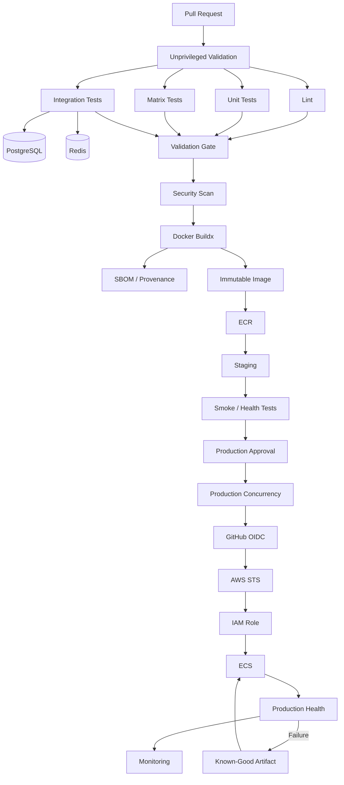

# 25- Senior Level Questions

## Overview

Senior GitHub Actions interviews are less about remembering YAML syntax and more about demonstrating that you can design, secure, troubleshoot, and operate a production CI/CD platform.

At senior level, expect questions around:

- Workflow architecture
- Execution and dependency graphs
- Matrix strategy
- Reusable workflows
- Custom actions
- Artifacts and caches
- Security boundaries
- `GITHUB_TOKEN`
- Secrets and environments
- `pull_request` vs `pull_request_target`
- OIDC and AWS IAM
- Docker and ECR
- Deployment strategies
- Runners and private networking
- Concurrency and race conditions
- Reliability and rollback
- Enterprise governance
- Production incident reasoning

The strongest answers explain **why** a design is appropriate, identify its failure modes, and describe how it behaves under scale and failure.

A useful senior-level answer pattern is:

```text
Requirement
    ↓
Architecture
    ↓
Trust Boundary
    ↓
Data Flow
    ↓
Failure Modes
    ↓
Operational Controls
    ↓
Trade-offs
```

---

## Senior-Level Question Framework

Before answering an architecture or scenario question, establish:

| Area | Questions to Ask |
|---|---|
| Trigger | What starts the workflow? |
| Trust | Is the source code trusted? |
| Execution | Where does the code run? |
| Dependencies | What services are required? |
| Data | What must move between jobs? |
| Artifact | What exactly is being promoted? |
| Credentials | Which permissions are required? |
| Concurrency | Can multiple executions overlap? |
| Deployment | How is the artifact promoted? |
| Validation | How is success determined? |
| Failure | What happens when something fails? |
| Recovery | How is rollback performed? |
| Scale | What happens under higher load? |
| Governance | Who owns and controls the workflow? |

---

## GitHub Actions Architecture Questions

### Question: Explain the complete GitHub Actions execution model.

A strong answer should describe:

```text
Event
 ↓
Workflow
 ↓
Jobs
 ↓
Needs / Dependency Graph
 ↓
Runner
 ↓
Steps
 ↓
Actions / Shell Commands
 ↓
Artifacts / Outputs / External Systems
```

Important distinctions:

- A workflow defines automation.
- A job is an execution boundary.
- A step is an operation within a job.
- An action packages reusable functionality.
- A runner provides the execution environment.

The key senior-level point is that each boundary affects:

- Filesystem state
- Environment state
- Permissions
- Credentials
- Network access
- Failure behavior
- Parallelism

---

### Question: What is the difference between CI/CD architecture and workflow syntax?

A YAML workflow is an implementation.

CI/CD architecture is the system design behind it.

For example:

```text
PR
 ↓
Validation
 ↓
Artifact
 ↓
Staging
 ↓
Approval
 ↓
Production
```

The YAML expresses this architecture, but the architecture must first define:

- Trust boundaries
- Artifact identity
- Deployment strategy
- Environment boundaries
- Rollback
- Security
- Reliability

A senior engineer should be able to design the architecture before writing the YAML.

---

### Question: How would you design a production CI/CD architecture for a Python backend?

A production pipeline could be:

```text
Pull Request
 ↓
Lint
 ↓
Unit Tests
 ↓
Integration Tests
 ↓
Security Scan
 ↓
Matrix Compatibility Tests
 ↓
Docker Build
 ↓
Image Scan
 ↓
Publish Immutable Image
 ↓
Staging
 ↓
Smoke Tests
 ↓
Production Approval
 ↓
Production Deployment
 ↓
Health Validation
 ↓
Monitoring
 ↓
Rollback if Required
```

For a Django/FastAPI backend, integration testing may include:

```text
Application
 ├── PostgreSQL
 └── Redis
```

Production may additionally involve:

```text
ECR
ECS
RDS
ElastiCache
ALB
CloudWatch
IAM
OIDC
```

---

### Question: What makes a GitHub Actions pipeline production-ready?

A strong answer should cover:

- Deterministic builds
- Immutable artifacts
- Least-privilege permissions
- Secure secret handling
- OIDC for AWS
- Protected environments
- Deployment concurrency
- Automated validation
- Observability
- Rollback
- Artifact retention
- Runner security
- Dependency/action pinning
- Failure isolation
- Governance

A pipeline is not production-ready simply because it successfully deploys an application.

---

## Workflow Design Questions

### Question: When would you use `needs`?

Use `needs` to express dependencies between jobs.

```yaml
test:
  runs-on: ubuntu-latest
  steps:
    - run: pytest

build:
  needs: test
  runs-on: ubuntu-latest
  steps:
    - run: docker build .
```

This creates:

```text
test
 ↓
build
```

`needs` is about **dependency ordering and dependency state**, not resource locking.

---

### Question: What is the difference between `needs` and `concurrency`?

| Mechanism | Purpose |
|---|---|
| `needs` | Job dependency |
| `concurrency` | Prevent competing executions |
| `matrix` | Parallelize combinations |
| `if` | Conditional execution |

Example:

```yaml
deploy:
  needs: build
```

means:

> Do not start this job until `build` satisfies the required dependency condition.

Whereas:

```yaml
concurrency:
  group: production
  cancel-in-progress: false
```

means:

> Do not allow competing executions in the same concurrency group to deploy simultaneously.

---

### Question: How would you prevent two production deployments from running simultaneously?

Use deployment concurrency:

```yaml
concurrency:
  group: production-deployment
  cancel-in-progress: false
```

The important reasoning is:

```text
Run A ────────┐
              ├── Production Resource
Run B ────────┘
```

Without concurrency control, both runs may independently satisfy their `needs` dependencies.

---

### Question: Would you use `cancel-in-progress: true` for production?

Usually, production deployments require more careful handling.

For PR validation:

```yaml
concurrency:
  group: pr-${{ github.event.pull_request.number }}
  cancel-in-progress: true
```

For production:

```yaml
concurrency:
  group: production
  cancel-in-progress: false
```

The reason is that a production deployment may already have:

- Modified infrastructure
- Started a migration
- Shifted traffic
- Replaced instances
- Changed service state

Blind cancellation can leave the system in an intermediate state.

---

### Question: How do you prevent a deployment race condition?

Use multiple controls:

```text
Immutable Artifact
+
Environment Protection
+
Concurrency
+
Idempotent Deployment
+
Health Validation
```

Concurrency prevents competing executions.

Idempotency makes retries safer.

Artifact identity prevents one deployment from accidentally promoting a different build.

---

## Matrix Strategy Questions

### Question: How would you test a Python backend against multiple Python versions?

```yaml
strategy:
  matrix:
    python-version:
      - "3.11"
      - "3.12"
      - "3.13"

steps:
  - uses: actions/setup-python@<pinned-sha>
    with:
      python-version: ${{ matrix.python-version }}

  - run: pytest
```

This creates independent jobs for each matrix combination.

---

### Question: What happens when a matrix becomes too large?

Consider:

```text
4 Python versions
× 3 databases
× 2 operating systems
× 5 services
```

That creates:

```text
120 jobs
```

The consequences include:

- Higher cost
- Longer queue times
- Greater downstream load
- More runner consumption
- More database connections
- More flaky interactions

A senior solution might use:

```text
PR
 → Targeted Matrix

Nightly
 → Full Compatibility Matrix

Release
 → Production-Support Matrix
```

---

### Question: Explain `fail-fast` and `max-parallel`.

`fail-fast` controls whether matrix execution should cancel remaining matrix jobs when a failure occurs.

`max-parallel` limits the number of matrix jobs executing concurrently.

Example:

```yaml
strategy:
  fail-fast: true
  max-parallel: 4
  matrix:
    python-version:
      - "3.11"
      - "3.12"
      - "3.13"
```

These controls address different problems:

```text
fail-fast
→ Failure propagation

max-parallel
→ Resource/capacity control
```

---

### Question: How would you generate a dynamic matrix?

A planning job can generate JSON:

```yaml
jobs:
  plan:
    runs-on: ubuntu-latest
    outputs:
      matrix: ${{ steps.plan.outputs.matrix }}
    steps:
      - id: plan
        shell: bash
        run: |
          echo 'matrix={"service":["users","orders","payments"]}' >> "$GITHUB_OUTPUT"

  test:
    needs: plan
    runs-on: ubuntu-latest
    strategy:
      matrix: ${{ fromJSON(needs.plan.outputs.matrix) }}
    steps:
      - run: echo "Testing ${{ matrix.service }}"
```

This is useful for:

- Monorepos
- Changed-service detection
- Dynamic test selection
- Environment-specific pipelines

The planning job should carefully validate any data derived from untrusted input.

---

## Expressions and Context Questions

### Question: What is the difference between a GitHub expression and a shell command?

GitHub expression:

```yaml
${{ github.ref }}
```

is evaluated by GitHub Actions.

Shell command:

```bash
echo "$BRANCH"
```

is evaluated by the shell running on the runner.

The lifecycle is conceptually:

```text
Workflow YAML
 ↓
GitHub Expression Evaluation
 ↓
Rendered Step
 ↓
Shell Execution
```

This distinction becomes especially important for security.

---

### Question: What is the difference between `github`, `env`, `vars`, `secrets`, `steps`, and `needs`?

| Context | Purpose |
|---|---|
| `github` | Event/repository/workflow metadata |
| `env` | Environment variables |
| `vars` | Non-sensitive configuration variables |
| `secrets` | Sensitive values |
| `steps` | Outputs from earlier steps |
| `needs` | Outputs/results from dependent jobs |
| `matrix` | Current matrix combination |
| `runner` | Runner metadata |
| `inputs` | Workflow/action inputs |

The important interview point is understanding **scope and trust**, not memorizing context names.

---

### Question: What is the difference between `$GITHUB_ENV` and `$GITHUB_OUTPUT`?

```text
GITHUB_ENV
→ Environment value for later steps in the job
```

```text
GITHUB_OUTPUT
→ Step output
→ Job output
→ Potential downstream job input
```

Example:

```bash
echo "VERSION=1.2.3" >> "$GITHUB_ENV"
```

For an output:

```bash
echo "version=1.2.3" >> "$GITHUB_OUTPUT"
```

---

### Question: How would you pass structured data between jobs?

Generate JSON as a job output:

```yaml
jobs:
  plan:
    runs-on: ubuntu-latest
    outputs:
      config: ${{ steps.generate.outputs.config }}
    steps:
      - id: generate
        run: |
          echo 'config={"services":["api","worker"]}' >> "$GITHUB_OUTPUT"
```

Then consume it:

```yaml
deploy:
  needs: plan
  runs-on: ubuntu-latest
  steps:
    - run: echo '${{ needs.plan.outputs.config }}'
```

For large files, use artifacts rather than outputs.

---

## Status Function Questions

### Question: Explain `success()`, `failure()`, `cancelled()`, and `always()`.

They represent workflow execution state.

Typical use:

```yaml
if: ${{ failure() }}
```

for failure-specific behavior.

```yaml
if: ${{ cancelled() }}
```

for cancellation-specific behavior.

```yaml
if: ${{ !cancelled() }}
```

for cleanup/reporting that should continue through normal failure but should not run after cancellation.

`always()` should be used deliberately.

It does not mean:

> This operation is safe regardless of workflow state.

---

### Question: Why can `always()` be dangerous?

Because it may cause work to execute during failure or cancellation scenarios where the operation is unsafe.

For example, a destructive cleanup or deployment action should not necessarily run merely because:

```yaml
if: ${{ always() }}
```

is true.

Ask:

```text
Should it run after failure?
Should it run after cancellation?
Does it require upstream artifacts?
Is the environment still valid?
```

Then choose the condition.

---

## Secrets and Environment Questions

### Question: What is the difference between secrets, variables, and environment variables?

| Mechanism | Typical Purpose |
|---|---|
| Secrets | Sensitive credentials |
| Variables | Managed non-sensitive configuration |
| `env` | Runtime environment values |

An environment variable is not automatically secret.

For example:

```yaml
env:
  DATABASE_PASSWORD: ${{ secrets.DATABASE_PASSWORD }}
```

The value is secret because its source is a secret, not because it is stored in `env`.

---

### Question: Where should production secrets be stored?

For GitHub Actions-specific deployment credentials, GitHub environment secrets can be appropriate.

For broader runtime secret management, an external secret-management system may be preferable.

The important design principles are:

- Least privilege
- Environment separation
- Rotation
- Avoid duplication
- No logging
- No embedding into artifacts

---

### Question: How would you protect production secrets?

Use:

```text
Production Environment
 ↓
Environment Secrets
 ↓
Protected Deployment Job
 ↓
Required Reviewers
 ↓
OIDC / Temporary Credentials
```

Do not expose production secrets to:

- PR validation jobs
- Untrusted code
- Unnecessary test jobs
- Third-party actions

---

### Question: Is secret masking enough?

No.

Masking helps reduce accidental log exposure but does not prevent a workflow from intentionally or indirectly exposing a secret.

Secrets can leak through:

- Artifacts
- Docker layers
- Files
- Command arguments
- External services
- Application logs
- Debug output

The better principle is:

> Prevent unnecessary access rather than relying on masking after access has already been granted.

---

## Security Questions

### Question: What are the most important GitHub Actions security risks?

A strong answer includes:

- Excessive `GITHUB_TOKEN` permissions
- Secret exposure
- Untrusted PR execution
- `pull_request_target` misuse
- Third-party action compromise
- Shell injection
- Self-hosted runner compromise
- Dependency compromise
- Cache poisoning
- Artifact poisoning
- Long-lived cloud credentials
- Unsafe deployment workflows

---

### Question: Why is `pull_request_target` dangerous?

`pull_request_target` executes with the base repository context and can have access to privileges unavailable to ordinary PR workflows.

The dangerous pattern is:

```text
Untrusted PR
+
Privileged Workflow
+
Checkout PR Code
+
Secrets / Write Permissions
```

The workflow may unintentionally execute attacker-controlled code with privileged access.

Use separate trust boundaries:

```text
Untrusted Validation
        ↓
Restricted Permissions
        ↓
Trusted Workflow
        ↓
Privileged Operation
```

---

### Question: How would you safely handle untrusted PRs?

Keep untrusted validation separate from privileged operations.

For example:

```text
PR
 ↓
Lint
 ↓
Unit Tests
 ↓
Integration Tests
 ↓
Security Checks
```

with minimal permissions and no production credentials.

Then:

```text
Trusted Branch / Release
 ↓
Build
 ↓
Publish
 ↓
Deploy
```

The exact architecture depends on whether the workflow must execute code from the PR.

---

### Question: How can shell injection happen in GitHub Actions?

GitHub metadata can contain attacker-controlled data.

Examples include:

- PR title
- Branch name
- Commit message
- Issue content
- Workflow input

Unsafe conceptual pattern:

```yaml
run: echo "${{ github.event.pull_request.title }}"
```

A safer pattern is to pass data through an environment variable:

```yaml
env:
  PR_TITLE: ${{ github.event.pull_request.title }}
run: |
  printf '%s\n' "$PR_TITLE"
```

Then validate the value according to its intended use.

---

### Question: Is environment-variable passing enough to prevent injection?

No.

It reduces shell interpolation risks, but the value may still be dangerous when passed to:

- Docker
- SQL
- Filesystem paths
- URLs
- Other command interpreters

Validation must match the target system.

---

## GITHUB_TOKEN Questions

### Question: What is `GITHUB_TOKEN`?

It is a workflow-provided token used to authenticate GitHub API and repository operations.

Its permissions determine what it can do.

Use explicit permissions:

```yaml
permissions:
  contents: read
```

Then grant only what is required.

---

### Question: How would you secure `GITHUB_TOKEN`?

Use:

```yaml
permissions:
  contents: read
```

at workflow level and override only specific jobs when necessary.

For example:

```yaml
jobs:
  release:
    permissions:
      contents: write
```

This limits the blast radius of other jobs.

---

### Question: Why use job-level permissions?

Different jobs have different trust and access requirements.

For example:

```text
Test Job
 → contents: read

Release Job
 → contents: write

AWS Deployment Job
 → id-token: write
```

This is better than granting every job the union of all permissions.

---

## Third-Party Action Questions

### Question: How would you evaluate a third-party GitHub Action?

Check:

- Source repository
- Maintainer
- Release history
- Dependencies
- Security posture
- Permissions
- Inputs
- Network behavior
- Versioning
- SHA pinning
- Community/organizational trust

Do not treat Marketplace availability as proof of trust.

---

### Question: Why is SHA pinning useful?

A mutable reference such as:

```yaml
uses: vendor/action@v1
```

can potentially point to different commits over time.

A SHA:

```yaml
uses: vendor/action@<commit-sha>
```

binds the workflow to a specific commit.

This improves reproducibility and reduces mutable-reference risk.

It does not eliminate all supply-chain risks.

---

### Question: What if the action pinned by SHA is compromised?

SHA pinning cannot protect against malicious code that already exists at that commit.

Additional controls include:

- Trusted sources
- Dependency review
- Security scanning
- Action allowlists
- Internal actions
- SBOM
- Provenance
- Attestations
- Minimal permissions
- Controlled updates

---

## Reusable Workflow Questions

### Question: When would you use a reusable workflow?

Use a reusable workflow when multiple repositories need the same job-level orchestration.

For example:

```text
Repository A ──┐
Repository B ──┼── Shared CI Workflow
Repository C ──┘
```

It can standardize:

- Linting
- Testing
- Security
- Builds
- Deployment
- Permissions

---

### Question: Reusable workflow or composite action?

| Requirement | Prefer |
|---|---|
| Multiple jobs | Reusable workflow |
| Job orchestration | Reusable workflow |
| Matrix pipeline | Reusable workflow |
| Deployment pipeline | Reusable workflow |
| Reusable steps | Composite action |
| Step-level abstraction | Composite action |

A composite action runs within a job.

A reusable workflow can orchestrate multiple jobs.

---

### Question: What is the biggest risk of centralized reusable workflows?

Blast radius.

If:

```text
Shared Workflow
 ↓
100 Repositories
```

a breaking change can affect all consumers.

Use:

- Versioning
- Consumer testing
- Changelogs
- Controlled rollout
- Deprecation
- Rollback

Treat reusable workflows like platform APIs.

---

## Artifact and Cache Questions

### Question: Explain the difference between an artifact and a cache.

```text
Artifact
→ Workflow output

Cache
→ Build acceleration
```

Artifacts can contain:

- Test reports
- Coverage
- Deployment packages
- Build outputs

Caches can contain:

- Python packages
- npm packages
- Docker build layers

A production deployment should not depend on a cache being available.

---

### Question: How would you implement build-once/deploy-many?

```text
Build
 ↓
Immutable Image
 ↓
Registry
 ↓
Staging
 ↓
Approval
 ↓
Production
```

The production deployment should reference the exact artifact validated in staging.

For Docker:

```text
Image Tag
+
Image Digest
```

should be recorded.

---

### Question: Why are Docker digests important?

Tags can be mutable.

A digest identifies image content:

```text
image@sha256:...
```

This provides stronger artifact identity.

A deployment record might contain:

```text
Release: 2.4.1
Commit: abc123
Image: sha256:def456
Environment: production
```

---

### Question: How would you optimize Docker builds?

Use:

- Multi-stage builds
- `.dockerignore`
- Correct layer ordering
- Dependency caching
- BuildKit/Buildx
- Appropriate base images
- Registry cache when justified

For Python:

```dockerfile
COPY requirements.txt .
RUN pip install --no-cache-dir -r requirements.txt

COPY . .
```

This allows dependency layers to remain cached when application source changes independently.

---

## AWS OIDC Questions

### Question: How would GitHub Actions authenticate with AWS without long-lived credentials?

Use OIDC:

```text
GitHub Actions
      ↓
OIDC Token
      ↓
AWS STS
      ↓
IAM Role
      ↓
Temporary Credentials
      ↓
AWS API
```

The workflow needs:

```yaml
permissions:
  id-token: write
  contents: read
```

The IAM role trust policy must restrict the GitHub workload appropriately.

---

### Question: What is the difference between IAM trust policy and permissions policy?

Trust policy:

```text
Who may assume this role?
```

Permissions policy:

```text
What may the role do?
```

The flow is:

```text
GitHub OIDC
 ↓
Trust Policy
 ↓
Assume Role
 ↓
Permissions Policy
 ↓
AWS Resource
```

---

### Question: How would you restrict a GitHub OIDC role?

Use conditions based on appropriate GitHub identity claims, such as:

- Organization
- Repository
- Branch
- Environment

Avoid overly broad conditions such as allowing every repository in an organization to assume a production role unless that is intentionally required.

---

### Question: How would you troubleshoot AWS OIDC authentication?

Use this sequence:

```text
Workflow Permission
 ↓
OIDC Token Availability
 ↓
AWS OIDC Provider
 ↓
IAM Trust Policy
 ↓
STS AssumeRole
 ↓
IAM Permissions
 ↓
Resource Policy / SCP / Boundary
```

Start with:

```bash
aws sts get-caller-identity
```

once credentials are established.

Do not immediately modify IAM permissions when the actual problem is role assumption.

---

## Docker and ECR Questions

### Question: Design a secure Docker-to-ECR pipeline.

```text
PR / Release
 ↓
Tests
 ↓
Docker Buildx
 ↓
Security Scan
 ↓
SBOM / Provenance
 ↓
ECR
 ↓
Staging
 ↓
Production
```

Use:

- OIDC
- Temporary AWS credentials
- Least-privilege IAM
- Immutable artifact identity
- Image scanning
- Controlled tagging
- Digest-based promotion

---

### Question: What is the difference between ECR authentication and ECR authorization?

Authentication establishes AWS identity.

Authorization determines whether that identity can perform operations such as:

- Push
- Pull
- Describe
- Delete

Successful authentication does not imply successful ECR access.

---

### Question: How would you troubleshoot an ECR push failure?

Start with:

```bash
aws sts get-caller-identity
```

Then verify:

```text
AWS Account
AWS Region
ECR Repository
IAM Permissions
ECR Login
Docker Build
Image Tag
```

A useful diagnostic sequence is:

```text
AWS Identity
 ↓
Repository
 ↓
Authentication
 ↓
Authorization
 ↓
Docker Image
 ↓
Push
```

---

## Deployment Architecture Questions

### Question: Compare rolling, blue/green, and canary deployments.

| Strategy | Core Idea | Main Trade-off |
|---|---|---|
| Rolling | Replace instances incrementally | Mixed versions |
| Blue/Green | Maintain old/new environments | Higher capacity |
| Canary | Gradually expose traffic | Requires strong observability |

The correct choice depends on:

- Traffic management
- Capacity
- Rollback requirements
- Compatibility
- Observability
- Cost
- Operational complexity

---

### Question: How would you design a zero-downtime deployment?

Consider:

```text
Compatible Schema
 ↓
New Instances
 ↓
Readiness Checks
 ↓
Traffic Shift
 ↓
Connection Draining
 ↓
Old Instances Removed
```

Also account for:

- Long-lived connections
- gRPC
- WebSockets
- Celery workers
- Kafka consumers
- Database migrations

---

### Question: How would you implement a blue/green deployment?

```text
                 ┌── Blue
Load Balancer ───┤
                 └── Green
```

Deploy the new version to the inactive environment.

Then:

```text
Deploy Green
 ↓
Health Validation
 ↓
Traffic Switch
 ↓
Monitor
 ↓
Retain Blue for Rollback
```

The main trade-off is additional infrastructure capacity.

---

### Question: What does a safe canary deployment require?

At minimum:

- Controlled traffic percentage
- Representative traffic
- Health signals
- Error-rate monitoring
- Latency monitoring
- Promotion criteria
- Rollback criteria

Example:

```text
5%
 ↓
Observe
 ↓
25%
 ↓
Observe
 ↓
50%
 ↓
Observe
 ↓
100%
```

Without reliable telemetry, canary deployment loses much of its value.

---

## Database Deployment Questions

### Question: How do you handle database migrations during zero-downtime deployment?

Use backward-compatible migration strategies such as expand/contract.

```text
Expand
 ↓
Deploy Compatible Application
 ↓
Migrate Application Usage
 ↓
Contract
```

Avoid:

```text
Destructive Migration
 ↓
Deploy New Application
```

if the previous application version cannot operate against the new schema.

---

### Question: Why is database rollback difficult?

Application code can often be replaced quickly.

Database changes may be:

- Destructive
- Long-running
- Irreversible
- Data-transforming

Therefore, production rollback should not assume that database rollback is equivalent to application rollback.

---

### Question: How would you deploy a Django application safely?

Consider:

```text
Build
 ↓
Unit Tests
 ↓
Integration Tests
 ↓
Migration Compatibility
 ↓
Docker Image
 ↓
ECR
 ↓
Staging
 ↓
Migration Validation
 ↓
Production
 ↓
Health Check
```

Django-specific considerations include:

- `manage.py migrate`
- Static assets
- Database compatibility
- Gunicorn/Uvicorn process management
- Celery workers
- Redis
- Background task compatibility

---

## Celery and Kafka Questions

### Question: What can go wrong when deploying Celery workers?

A new application version may change task payloads or behavior.

For example:

```text
Producer v2
 ↓
Queue
 ↓
Worker v1
```

The worker may not understand the new task format.

Use backward-compatible task contracts and controlled worker rollout.

---

### Question: What deployment issues can Kafka introduce?

Kafka consumers and producers can be upgraded independently.

Consider:

- Event schema compatibility
- Consumer groups
- Offset behavior
- Partition ownership
- Replay
- Duplicate processing
- Graceful shutdown

Do not assume all microservices can be upgraded atomically.

---

## Runner Questions

### Question: GitHub-hosted or self-hosted runner?

Use GitHub-hosted runners when standard execution environments satisfy the requirements.

Self-hosted runners are appropriate when you need:

- Private network access
- Specialized hardware
- Custom software
- Internal infrastructure

The trade-off is increased operational responsibility.

---

### Question: What are the risks of persistent self-hosted runners?

Persistent runners may retain:

- Workspace files
- Credentials
- Docker state
- Dependency caches
- Temporary files
- Processes

If untrusted code executes there, residual state can become an attack vector.

---

### Question: Why use ephemeral runners?

Ephemeral runners can provide:

```text
Provision
 ↓
Register
 ↓
Execute One Workload
 ↓
Destroy
```

This reduces:

- State persistence
- Workspace contamination
- Cross-job credential exposure
- Configuration drift

They are especially useful for sensitive or untrusted workloads.

---

### Question: How would you design autoscaling self-hosted runners?

Consider:

```text
Queued Jobs
 ↓
Capacity Controller
 ↓
Provision Runner
 ↓
Bootstrap
 ↓
Register
 ↓
Execute Job
 ↓
Destroy
```

Control:

- Minimum capacity
- Maximum capacity
- Provisioning latency
- Cloud quotas
- IP availability
- Cost
- Warm pools
- Resource classes

Runner autoscaling should not blindly scale faster than downstream dependencies can handle.

---

### Question: How would you give a runner access to a private AWS network?

Possible architecture:

```text
GitHub
 ↓
Self-Hosted Runner
 ↓
Private VPC
 ├── RDS
 ├── ElastiCache
 ├── Kafka
 └── Internal APIs
```

Controls should include:

- Private subnets
- Security groups
- Routing
- DNS
- Runner groups
- Restricted repository access
- Ephemeral runners
- Least-privilege credentials

Do not place untrusted PR execution on a runner with unrestricted production-network access.

---

## Troubleshooting Questions

### Question: A workflow is not running. How do you troubleshoot it?

Use:

```text
Trigger
 ↓
Repository Policy
 ↓
Branch Filter
 ↓
Path Filter
 ↓
Event Context
 ↓
Workflow Status
```

Check:

```bash
gh workflow list
gh run list
```

Then inspect the workflow configuration and event conditions.

Do not immediately assume the YAML syntax is broken.

---

### Question: A job is skipped. What do you check?

Check:

- `if`
- `needs`
- Upstream job status
- Branch conditions
- Matrix conditions
- Environment conditions
- Status functions

A skipped job is not necessarily a failure.

---

### Question: A failure-reporting job did not run. Why?

Possible causes include:

- Incorrect `if`
- Failed `needs`
- Status function semantics
- Cancellation
- Job dependency behavior

For reporting that should execute after failure but not cancellation:

```yaml
if: ${{ !cancelled() }}
```

may be more appropriate than an unconditional `always()`.

---

### Question: An artifact is missing. How do you troubleshoot?

Use:

```text
Producer Job
 ↓
Was File Created?
 ↓
Upload Path Correct?
 ↓
Upload Step Executed?
 ↓
Artifact Name Correct?
 ↓
Consumer Downloaded Correct Artifact?
 ↓
Correct Run?
```

Remember that job files do not automatically persist between jobs.

---

### Question: A cache is missing. Is that a pipeline failure?

Usually no.

A cache miss should cause the workflow to regenerate the data.

For example:

```text
Cache Miss
 ↓
Install Dependencies
 ↓
Build
```

The pipeline should remain correct without the cache.

---

### Question: Docker builds suddenly became slow. How do you investigate?

Check:

- Dockerfile layer ordering
- Build context size
- `.dockerignore`
- Dependency changes
- Cache hit rate
- Base image changes
- Registry latency
- Buildx configuration
- Runner resources

Use:

```bash
docker system df
```

and inspect BuildKit output.

---

### Question: Integration tests intermittently fail against PostgreSQL.

Use the failure-domain model:

```text
Container
 ↓
Process
 ↓
Readiness
 ↓
Network
 ↓
Credentials
 ↓
Database Initialization
 ↓
Migration
 ↓
Test Isolation
```

Check health/readiness before test execution.

Also investigate:

- Connection limits
- Parallel test workers
- Shared state
- Transaction behavior

---

### Question: AWS authentication suddenly fails. What do you check?

```text
id-token: write
 ↓
OIDC Provider
 ↓
Trust Policy
 ↓
Subject Conditions
 ↓
STS
 ↓
IAM Permissions
```

Then verify:

```bash
aws sts get-caller-identity
```

when authentication succeeds.

---

## Reliability Questions

### Question: How do you make CI reliable?

Use:

- Deterministic dependencies
- Pinned action versions
- Stable runner environments
- Explicit service readiness
- Controlled retries
- Timeouts
- Failure isolation
- Artifact identity
- Concurrency controls
- Observability
- Regular maintenance

Do not solve reliability problems by blindly adding retries.

---

### Question: How do you distinguish flaky tests from infrastructure failures?

Record:

- Test identity
- Runner
- Environment
- Dependency status
- Retry count
- Execution duration
- Failure category

Repeated failures with the same test suggest a test problem.

Random failures correlated with infrastructure signals may indicate an environmental problem.

The distinction should be evidence-based.

---

### Question: What should happen when a production health check fails?

A strong deployment architecture should:

```text
Deployment
 ↓
Health Check
 ↓
Failure
 ↓
Stop Promotion
 ↓
Rollback / Recovery
 ↓
Validate
 ↓
Alert
```

The exact rollback mechanism depends on deployment strategy.

---

## Release Management Questions

### Question: How would you design a Git tag-driven release pipeline?

```text
Merge
 ↓
Create Version
 ↓
Git Tag
 ↓
Release Workflow
 ↓
Build
 ↓
Test
 ↓
Scan
 ↓
Publish Artifact
 ↓
Create Release
 ↓
Promote
```

Use immutable artifact identity and record the source commit.

---

### Question: Where should the application version come from?

Avoid maintaining unrelated versions in multiple places.

Possible source-of-truth approaches include:

- Git tag
- Package metadata
- Release metadata

The important requirement is consistency.

For example:

```text
Git Tag
 ↓
Version
 ↓
Docker Tag
 ↓
Release
```

---

### Question: How do you support pre-releases?

Use explicit release identifiers such as:

```text
2.5.0-alpha.1
2.5.0-beta.1
2.5.0-rc.1
```

Pre-release artifacts should not accidentally become production releases.

---

## Governance Questions

### Question: What should enterprise GitHub Actions governance cover?

At minimum:

- Action allowlists
- SHA pinning
- Permission standards
- Reusable workflows
- Runner groups
- Environment protection
- Secrets policies
- OIDC standards
- Artifact security
- Workflow ownership
- Security reviews
- Exceptions
- Auditability

---

### Question: How would you govern third-party actions across an organization?

Use an approved-action model:

```text
Requested Action
 ↓
Security Review
 ↓
Ownership Assigned
 ↓
Version / SHA Recorded
 ↓
Approved Registry
 ↓
Controlled Updates
```

Track:

- Action owner
- Version
- SHA
- Consumers
- Update history
- Security findings

---

### Question: How would you prevent a compromised action from affecting every repository?

Use layered controls:

```text
Action Allowlist
+
SHA Pinning
+
Minimal Permissions
+
Job Isolation
+
No Unnecessary Secrets
+
Reusable Workflow Controls
+
Runner Isolation
```

Do not rely on a single security mechanism.

---

## Architecture Scenario Questions

### Question: Design a production CI/CD system for 50 Python microservices.

A reasonable architecture is:

```text
                    ┌── Service A
                    │
PR ── Shared CI ────┼── Service B
                    │
                    └── Service C

                 ↓

          Immutable Artifact
                 ↓
               ECR
                 ↓
              Staging
                 ↓
           Validation
                 ↓
        Protected Production
                 ↓
               ECS
```

Shared platform capabilities can include:

- Reusable CI workflow
- Security workflow
- Docker build workflow
- Deployment workflow
- Standard permissions
- OIDC
- Artifact metadata
- Monitoring

Service-specific behavior should remain configurable.

---

### Question: How would you avoid a central workflow becoming a bottleneck?

Use:

- Versioned reusable workflows
- Explicit inputs
- Stable contracts
- Consumer testing
- Backward compatibility
- Controlled rollout

Avoid changing shared behavior without understanding downstream consumers.

---

### Question: How would you design CI/CD for a monorepo?

A planning stage can identify changed components:

```text
Commit
 ↓
Change Detection
 ↓
Affected Services
 ↓
Dynamic Matrix
 ↓
Targeted Tests
 ↓
Build Affected Artifacts
```

However, dependency relationships must be considered.

A change to a shared library may require testing multiple services.

---

### Question: How would you design CI/CD for microservices?

Prefer independent deployment boundaries where possible:

```text
Service A
 → Build
 → Test
 → Image
 → Deploy

Service B
 → Build
 → Test
 → Image
 → Deploy
```

Shared platform workflows can standardize mechanics without coupling every service into one deployment pipeline.

---

### Question: What would you do if one service depends on another service's API?

Consider:

- API compatibility
- Versioning
- Contract tests
- Backward-compatible deployments
- Consumer/provider relationships

Avoid requiring synchronized production deployments unless the system genuinely requires atomic changes.

---

## Production Incident Scenarios

### Scenario: Production deployment succeeded, but the application is returning 500 errors.

Investigate:

```text
Deployment Status
 ↓
Running Image
 ↓
Application Logs
 ↓
Environment Configuration
 ↓
Database
 ↓
Redis
 ↓
External Dependencies
 ↓
Health Metrics
```

Verify the exact deployed artifact.

If a known-good artifact exists and rollback is safe:

```text
Current Release
 ↓
Rollback
 ↓
Health Validation
```

---

### Scenario: ECS deployment is stuck.

Investigate:

- Task definition
- ECR image
- IAM execution role
- Security groups
- Subnets
- Service health
- Target group health
- Container startup
- Application logs
- CPU/memory
- Deployment circuit breaker

Do not assume the GitHub Actions workflow itself is the root cause.

---

### Scenario: Two production deployments were triggered simultaneously.

Potential consequences:

- Conflicting releases
- Race conditions
- Migration conflicts
- Traffic instability
- Incorrect artifact promotion

Prevent with:

```yaml
concurrency:
  group: production
  cancel-in-progress: false
```

Then make deployment operations idempotent.

---

### Scenario: A production deployment failed after database migration.

Do not immediately roll back application code.

First determine:

```text
Is the schema backward compatible?
Is the migration reversible?
Did data change?
Can the previous application version operate?
```

This is why expand/contract migration patterns are important.

---

### Scenario: A third-party action is discovered to be compromised.

A senior response should include:

```text
Stop / Isolate
 ↓
Identify Consumers
 ↓
Determine Versions / SHAs
 ↓
Rotate Exposed Credentials
 ↓
Review Workflow Logs
 ↓
Review Artifacts
 ↓
Replace / Remove Action
 ↓
Rebuild Trusted Artifacts
 ↓
Redeploy
 ↓
Audit
```

If AWS credentials were potentially exposed, rotate or invalidate the affected credentials and investigate CloudTrail activity.

---

## Senior Design Questions

### Question: What should be immutable in a production CI/CD system?

Important candidates include:

- Source commit identity
- Build artifact
- Docker image digest
- Release metadata
- Provenance
- Deployment record

Immutability makes:

- Rollback
- Audit
- Debugging
- Reproducibility

more reliable.

---

### Question: Where should configuration live?

Separate artifact from environment-specific configuration:

```text
Artifact
 ↓
Environment Configuration
 ↓
Runtime
```

Avoid rebuilding an application merely because staging and production configuration differs.

---

### Question: What should happen when a cache is unavailable?

The pipeline should continue through normal dependency/build steps.

A cache should improve:

```text
Performance
```

not determine:

```text
Correctness
```

---

### Question: What should happen when a runner disappears during deployment?

The deployment architecture should support:

- Rerun
- Idempotent deployment
- Artifact identity
- Deployment state inspection
- Concurrency protection
- External deployment status

Do not assume the runner's failure means the remote deployment stopped.

---

### Question: What is the biggest mistake engineers make in CI/CD architecture?

Treating the pipeline as a collection of commands rather than a distributed system.

A production pipeline interacts with:

```text
GitHub
Runners
Registries
Cloud APIs
Databases
Queues
Containers
Networks
Deployment Platforms
Monitoring Systems
```

Therefore, it has:

- Failure domains
- State
- Security boundaries
- Concurrency
- Dependencies
- Capacity constraints
- Recovery requirements

---

## Senior-Level Rapid-Fire Questions

### Architecture

**Q: What is the difference between CI and CD?**

CI validates and produces trusted artifacts. CD promotes those artifacts into environments.

**Q: Why build once and deploy many?**

To ensure the same validated artifact is promoted across environments.

**Q: Why immutable artifacts?**

For reproducibility, rollback, auditability, and release integrity.

**Q: Why use concurrency?**

To prevent unsafe concurrent operations on shared resources.

**Q: Why use reusable workflows?**

To standardize multi-job pipeline behavior.

**Q: Why use composite actions?**

To package reusable step-level logic.

---

### Security

**Q: What is the most important GitHub Actions security principle?**

Least privilege combined with clear trust boundaries.

**Q: Why avoid long-lived AWS credentials?**

They increase credential lifetime and compromise impact.

**Q: Why use OIDC?**

It allows short-lived AWS credentials based on workload identity.

**Q: Why pin actions?**

To reduce mutable dependency risk and improve reproducibility.

**Q: Why are self-hosted runners risky?**

They may expose internal systems and retain state.

---

### Artifacts

**Q: Artifact or cache for a Docker image?**

Use a registry-backed image artifact for deployment; cache is for accelerating builds.

**Q: Tag or digest for exact deployment identity?**

Digest.

**Q: Can a cache miss break a correct pipeline?**

It should not.

---

### Deployment

**Q: How do you prevent duplicate production deployments?**

Concurrency.

**Q: How do you prevent deploying a different build after approval?**

Bind approval and deployment to an immutable artifact identity.

**Q: How do you validate deployment success?**

Health checks, smoke tests, and runtime observability.

**Q: What makes rollback difficult?**

Database, event, external-system, and infrastructure compatibility.

---

## Complete Senior Interview Question Bank

### Fundamentals

1. What is GitHub Actions?
2. Explain Workflow → Job → Step → Action → Runner.
3. What happens when a workflow starts?
4. What is the lifecycle of a job?
5. What is the lifecycle of a step?
6. What are GitHub-hosted runners?
7. What are the major workflow limitations?
8. How does a runner execute a job?
9. What state persists between steps?
10. What state persists between jobs?

### Workflow Configuration

11. Explain `push`.
12. Explain `pull_request`.
13. Explain `pull_request_target`.
14. Explain `workflow_dispatch`.
15. Explain `schedule`.
16. Explain `workflow_call`.
17. Explain `workflow_run`.
18. Explain `repository_dispatch`.
19. Explain release triggers.
20. How do branch filters work?
21. How do path filters work?
22. How do tag filters work?
23. How do workflow inputs work?
24. How does expression evaluation work?
25. How do expressions differ from shell commands?

### Contexts

26. Explain the `github` context.
27. Explain the `env` context.
28. Explain `vars`.
29. Explain `secrets`.
30. Explain `steps`.
31. Explain `needs`.
32. Explain `job`.
33. Explain `runner`.
34. Explain `matrix`.
35. Explain `strategy`.
36. Explain `inputs`.

### Conditions

37. Explain `if`.
38. Explain `success()`.
39. Explain `failure()`.
40. Explain `cancelled()`.
41. Explain `always()`.
42. Explain `continue-on-error`.
43. What happens when a job is skipped?
44. How do skipped jobs affect downstream jobs?
45. When should `always()` be avoided?

### Matrix

46. How does matrix execution work?
47. Explain multiple matrix dimensions.
48. Explain `include`.
49. Explain `exclude`.
50. Explain `fail-fast`.
51. Explain `max-parallel`.
52. How do matrix jobs interact with `needs`?
53. How do you generate a dynamic matrix?
54. How would you optimize a 200-job matrix?
55. How would you test multiple Python/database combinations?

### Outputs and State

56. What is `$GITHUB_OUTPUT`?
57. What is `$GITHUB_ENV`?
58. What is `$GITHUB_PATH`?
59. How do you pass values between steps?
60. How do you pass values between jobs?
61. How do you pass JSON between jobs?
62. How do you build a dynamic matrix from JSON?
63. When should you use artifacts instead of outputs?

### Artifacts and Caches

64. What is an artifact?
65. What is a cache?
66. Artifact vs cache?
67. How do artifact retention policies work?
68. How do you pass build outputs between jobs?
69. What happens after a cache miss?
70. How do you design cache keys?
71. How does `hashFiles()` help caching?
72. How can caches create security risks?
73. How do you cache Python dependencies?
74. How do you optimize Docker caching?

### Reusable Workflows

75. What is `workflow_call`?
76. How do reusable workflow inputs work?
77. How do reusable workflow outputs work?
78. How do secrets work with reusable workflows?
79. What does `secrets: inherit` mean?
80. How do cross-repository reusable workflows work?
81. How should reusable workflows be versioned?
82. What are the risks of central reusable workflows?

### Custom Actions

83. What is a composite action?
84. What is a JavaScript action?
85. What is a Docker action?
86. When should you use each?
87. How do action inputs work?
88. How do action outputs work?
89. How do you version actions?
90. How do you secure custom actions?
91. How do you test custom actions?

### Security

92. What is `GITHUB_TOKEN`?
93. How does the permissions model work?
94. What does least privilege mean in GitHub Actions?
95. How do you secure secrets?
96. What is secret masking?
97. Why is masking insufficient by itself?
98. What is shell injection?
99. How can branch names cause injection?
100. How can PR titles cause injection?
101. Why is `pull_request_target` dangerous?
102. How do fork PRs affect secrets?
103. How do you secure third-party actions?
104. What is SHA pinning?
105. What is supply-chain security?
106. What is an SBOM?
107. What is artifact provenance?
108. What are artifact attestations?
109. What is artifact signing?
110. How do you secure self-hosted runners?

### AWS

111. How does GitHub OIDC work?
112. What does `id-token: write` mean?
113. What is an IAM trust policy?
114. What is an IAM permissions policy?
115. How does STS fit into OIDC?
116. How do you restrict an OIDC role?
117. How do you troubleshoot `AccessDenied`?
118. How do you authenticate to ECR?
119. How do you deploy to ECS?
120. How would you deploy to EC2?
121. How would GitHub Actions deploy Lambda?
122. How would you deploy CloudFormation?
123. How would you deploy Terraform?
124. How do you separate staging and production AWS roles?

### Docker

125. How do you build Docker images in GitHub Actions?
126. What is Buildx?
127. What are multi-stage builds?
128. How does Docker layer caching work?
129. How do you reduce Docker build time?
130. What is a Docker image digest?
131. Why avoid `latest` in production?
132. How do you scan images?
133. How do you generate an SBOM?
134. How do you promote an image without rebuilding?
135. How do you support multi-platform images?

### Testing

136. Unit vs integration testing?
137. How do service containers work?
138. How do job containers differ from service containers?
139. How do you run PostgreSQL in CI?
140. How do you run Redis in CI?
141. How do you handle service readiness?
142. How do you test Django?
143. How do you test FastAPI?
144. How do you publish coverage?
145. How do you publish test reports?
146. How do you isolate parallel integration tests?
147. How do you handle flaky tests?

### Deployment

148. How do you design environment promotion?
149. What is build-once/deploy-many?
150. How do you protect production?
151. How do deployment approvals work?
152. How do deployment concurrency controls work?
153. How do you perform a rolling deployment?
154. How do you perform blue/green deployment?
155. How do you perform canary deployment?
156. What does zero downtime actually require?
157. How do you validate a deployment?
158. How do you implement rollback?
159. How do database migrations affect rollback?

### Runners

160. GitHub-hosted vs self-hosted?
161. What are self-hosted runner risks?
162. What are ephemeral runners?
163. How do runner groups work?
164. How do runner labels work?
165. How do you register a runner?
166. How do you secure runner registration?
167. How do you autoscale runners?
168. How do runners access private networks?
169. How do you manage runner drift?
170. How do you monitor runner health?

### Operations

171. How do you troubleshoot workflow failures?
172. How do you troubleshoot trigger failures?
173. How do you troubleshoot expression failures?
174. How do you troubleshoot permission failures?
175. How do you troubleshoot OIDC?
176. How do you troubleshoot Docker builds?
177. How do you troubleshoot ECR?
178. How do you troubleshoot service containers?
179. How do you troubleshoot artifacts?
180. How do you troubleshoot caches?
181. How do you troubleshoot self-hosted runners?
182. How do you investigate deployment failures?

### Architecture

183. Design CI/CD for a Django application.
184. Design CI/CD for a FastAPI application.
185. Design CI/CD for 50 microservices.
186. Design CI/CD for a monorepo.
187. Design a secure AWS deployment pipeline.
188. Design a zero-downtime deployment system.
189. Design a blue/green deployment.
190. Design a canary deployment.
191. Design a reusable enterprise CI platform.
192. Design a scalable self-hosted runner platform.
193. Design build-once/deploy-many.
194. Design a secure production promotion system.

---

## Scenario-Based Senior Questions

### Scenario: Production must never receive two simultaneous deployments.

Explain:

- Concurrency group
- Artifact identity
- Idempotency
- Environment protection
- Health validation
- Rollback

---

### Scenario: Production requires manual approval.

Explain:

- GitHub Environment
- Required reviewers
- Protected branch/release strategy
- Artifact identity
- Approval evidence
- Deployment concurrency
- Auditability

---

### Scenario: Multiple Python versions must be tested.

Explain:

- Matrix
- `max-parallel`
- `fail-fast`
- Dependency caching
- Test artifacts
- Matrix size

---

### Scenario: PostgreSQL and Redis are required for integration tests.

Explain:

- Service containers
- Networking
- Environment variables
- Health/readiness
- Database initialization
- Test isolation

---

### Scenario: AWS credentials must not be stored as long-lived secrets.

Explain:

```text
GitHub OIDC
 ↓
STS
 ↓
IAM Role
 ↓
Temporary Credentials
```

Then discuss:

- Trust policy
- Subject restrictions
- Job permissions
- Role permissions

---

### Scenario: A reusable CI pipeline is shared across repositories.

Explain:

- `workflow_call`
- Inputs
- Outputs
- Secrets
- Versioning
- Consumer compatibility
- Blast radius

---

### Scenario: A third-party action is compromised.

Explain:

- Immediate containment
- Consumer inventory
- SHA/version identification
- Credential rotation
- Log review
- Artifact review
- Replacement
- Rebuild
- Redeployment
- Governance improvements

---

### Scenario: A Docker image must be promoted from staging to production without rebuilding.

Explain:

```text
Build
 ↓
Image
 ↓
Digest
 ↓
ECR
 ↓
Staging
 ↓
Approval
 ↓
Same Digest
 ↓
Production
```

The central concept is immutable artifact promotion.

---

### Scenario: A self-hosted runner requires access to a private database.

Explain:

- Private VPC
- Security groups
- DNS
- Runner groups
- Labels
- Ephemeral runners
- Repository restrictions
- Secrets
- OIDC
- Untrusted PR isolation

---

### Scenario: The CI pipeline takes 45 minutes.

Investigate:

```text
Queue Time
 ↓
Dependency Installation
 ↓
Matrix Cardinality
 ↓
Test Runtime
 ↓
Docker Build
 ↓
Security Scans
 ↓
Artifact Upload
```

Then optimize the actual bottleneck rather than blindly increasing parallelism.

---

## What Interviewers Look for in Senior Answers

### Strong Candidate

A strong candidate:

- Defines assumptions
- Explains architecture
- Understands trust boundaries
- Uses least privilege
- Understands failure modes
- Considers concurrency
- Understands artifact identity
- Thinks about rollback
- Discusses operational trade-offs
- Considers cost
- Considers scale
- Uses realistic backend examples

### Weak Candidate

A weak answer usually:

- Focuses only on YAML
- Memorizes syntax
- Gives one-size-fits-all solutions
- Ignores security
- Ignores rollback
- Treats deployment as a shell command
- Uses broad permissions
- Stores long-lived credentials
- Treats caches as artifacts
- Ignores runner security
- Ignores database compatibility

---

## Senior Interview Answer Template

For architecture and scenario questions, use:

```text
1. Clarify the requirement.

2. Define the trust boundary.

3. Describe the workflow architecture.

4. Explain job dependencies.

5. Explain data and artifact flow.

6. Define permissions and credentials.

7. Explain concurrency.

8. Explain deployment strategy.

9. Explain health validation.

10. Explain failure handling.

11. Explain rollback.

12. Discuss scalability and cost.

13. Discuss monitoring and governance.

14. Mention important trade-offs.
```

This structure prevents answers from becoming simple YAML walkthroughs.

---

## Production Reference Architecture



The important design properties are:

```text
Untrusted PR
    ↓
Restricted Permissions

Trusted Build
    ↓
Immutable Artifact

AWS Deployment
    ↓
OIDC + Least Privilege

Production
    ↓
Environment Protection
+
Concurrency
+
Health Validation
+
Rollback
```

---

## Final Senior-Level Evaluation Checklist

Before considering a GitHub Actions design production-ready, verify:

### Architecture

- [ ] Workflow boundaries are clear.
- [ ] Jobs have explicit dependencies.
- [ ] Parallelism is intentional.
- [ ] Reusable components have stable contracts.
- [ ] Failure domains are understood.

### Security

- [ ] `GITHUB_TOKEN` permissions are minimal.
- [ ] Secrets are scoped appropriately.
- [ ] Untrusted PR code is isolated.
- [ ] `pull_request_target` is used cautiously.
- [ ] Third-party actions are controlled.
- [ ] Actions are appropriately pinned.
- [ ] Self-hosted runners are isolated.
- [ ] AWS uses OIDC where appropriate.

### Artifacts

- [ ] Builds are reproducible.
- [ ] Artifacts are immutable.
- [ ] Docker digests are recorded.
- [ ] Artifacts are promoted rather than rebuilt.
- [ ] Provenance is available where required.
- [ ] Rollback artifacts are retained.

### Deployment

- [ ] Environments are protected.
- [ ] Production deployments use concurrency.
- [ ] Health checks validate real readiness.
- [ ] Database migrations are compatible.
- [ ] Rollback is explicitly designed.
- [ ] Deployment state is observable.

### Operations

- [ ] Runner capacity is understood.
- [ ] Cache misses do not break correctness.
- [ ] Artifact retention is intentional.
- [ ] Workflow costs are measured.
- [ ] Logs and diagnostics are available.
- [ ] GitHub CLI can be used for operational debugging.

---

## Key Takeaways

- **Senior GitHub Actions interviews test system design, security, reliability, and operational reasoning more than YAML syntax.**
- **Production pipelines should establish clear trust boundaries, least-privilege permissions, immutable artifact identity, protected environments, and controlled deployment concurrency.**
- **Build-once/deploy-many, OIDC-based AWS authentication, reusable workflows, secure runners, and explicit rollback strategies are core senior-level patterns.**
- **For scenario questions, always explain data flow, failure modes, scalability, security, observability, and recovery rather than describing only the happy path.**
- **The strongest answers connect GitHub Actions to real backend systems such as Python, Django/FastAPI, PostgreSQL, Redis, Celery, Kafka, Docker, ECR, ECS, and AWS IAM.**