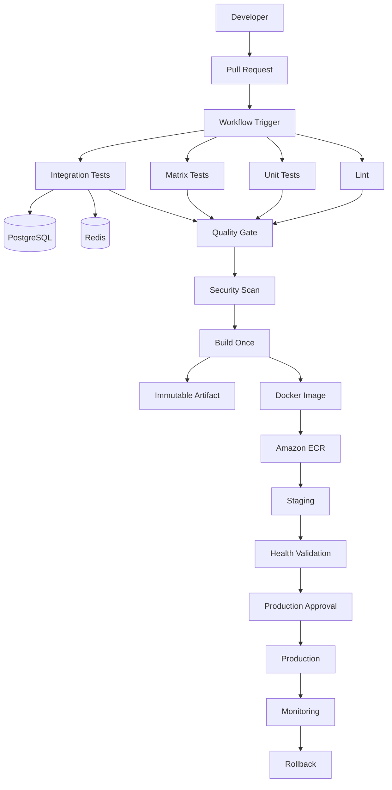

# README

## Overview

This directory contains the **GitHub Actions CI/CD** section of the Backend Engineering Playbook.

The material is designed to take a backend engineer from GitHub Actions fundamentals through production-grade CI/CD architecture, workflow configuration, security, containerized testing, AWS deployment, runners and operations, troubleshooting, architecture design, CLI operations, and senior-level interview preparation.

The focus is not on YAML syntax alone. The objective is to understand how a CI/CD system behaves as a production engineering platform:

```text
Source Code
    ↓
Pull Request
    ↓
Validation
    ↓
Testing
    ↓
Security
    ↓
Build
    ↓
Immutable Artifact
    ↓
Release
    ↓
Environment Promotion
    ↓
Deployment
    ↓
Monitoring
    ↓
Rollback / Recovery
```

The examples and architecture patterns are primarily relevant to:

- Python
- Django
- FastAPI
- REST APIs
- Docker
- PostgreSQL
- Redis
- AWS
- GitHub Actions

## Navigation

| # | File | Description |
|---|---|---|
| 01 | [01- Fundamentals](./01-%20Fundamentals/) | Foundational GitHub Actions knowledge: workflows, events, jobs, steps, runners, actions, execution model, and platform limits. |
| 02 | [02- Workflow Configuration](./02-%20Workflow%20Configuration/) | Workflow configuration layer: expressions, contexts, conditions, secrets, environments, matrices, outputs, artifacts, and dependency caching. |
| 03 | [03- Advanced Workflows](./03-%20Advanced%20Workflows/) | Production-grade workflow patterns: reusable workflows, dynamic matrices, concurrency, parallelism control, and advanced workflow design. |
| 04 | [04- Custom Actions](./04-%20Custom%20Actions/) | Custom action design: composite, JavaScript, and Docker actions; inputs, outputs, versioning, marketplace, and reusable action architecture. |
| 05 | [05- Containers and Testing](./05-%20Containers%20and%20Testing/) | Containerized CI: job containers, service containers, PostgreSQL, MySQL, Redis, unit/integration/API/E2E testing pipelines, and coverage reports. |
| 06 | [06- Security](./06-%20Security/) | CI/CD security: GITHUB_TOKEN, least privilege, secrets, OIDC, supply chain, SHA pinning, runner isolation, and artifact attestations. |
| 07 | [07- CI CD and Deployment](./07-%20CI%20CD%20and%20Deployment/) | CI/CD and deployment pipelines: artifact promotion, Docker, ECR, ECS, EC2, Lambda, OIDC, blue-green, canary, rolling, and rollback strategies. |
| 08 | [08- Runners and Operations](./08-%20Runners%20and%20Operations/) | Runner management and platform operations: GitHub-hosted and self-hosted runners, autoscaling, monitoring, cost optimization, and enterprise governance. |
| 09 | [09- Troubleshooting](./09-%20Troubleshooting/) | Systematic CI/CD troubleshooting: workflow errors, trigger issues, OIDC failures, Docker problems, deployment failures, and diagnostic techniques. |
| 10 | [10- Architecture](./10-%20Architecture/) | CI/CD system architecture: production, enterprise, Docker, AWS, artifact promotion, environment promotion, HA design, and failure domain patterns. |
| 11 | [11- CLI](./11-%20CLI/) | GitHub Actions operations via the GitHub CLI: workflow inspection, execution, reruns, artifact management, secrets, environments, and releases. |
| 12 | [12- Interview Questions](./12-%20Interview%20Questions/) | Senior-level interview preparation: conceptual, scenario-based, architecture, security, troubleshooting, and production CI/CD design questions. |
| 13 | [13- Projects](./13-%20Projects/) | Hands-on runnable projects: Python CI, Django, FastAPI, Docker, ECR, OIDC, multi-environment deployment, and a production CI/CD capstone. |

---

## What This Section Covers

This section treats GitHub Actions as a complete production engineering platform rather than a collection of YAML files.

| Area | Focus |
|---|---|
| Fundamentals | Workflows, events, jobs, steps, runners, actions, execution model, limits |
| Workflow Configuration | Expressions, contexts, conditions, environments, secrets, matrices, outputs, caching |
| Advanced Workflows | Reusable workflows, dynamic matrices, concurrency, parallelism, advanced patterns |
| Custom Actions | Composite, JavaScript, Docker actions; versioning, testing, security |
| Containers and Testing | Job containers, service containers, unit/integration/E2E testing, coverage |
| Security | GITHUB_TOKEN, OIDC, supply chain, SHA pinning, runner isolation, attestations |
| CI/CD and Deployment | Artifact promotion, Docker, AWS deployment, deployment strategies, rollback |
| Runners and Operations | Runner lifecycle, autoscaling, monitoring, cost optimization, governance |
| Troubleshooting | Failure diagnosis across triggers, jobs, runners, Docker, AWS, deployments |
| Architecture | Production, enterprise, HA, and scalable CI/CD system design |
| CLI | Operational GitHub Actions management through the GitHub CLI |
| Interview Questions | Senior-level preparation across all CI/CD engineering topics |
| Projects | Hands-on runnable implementations of CI/CD patterns |

---

## Learning Path

The recommended progression through this section is:

```text
01- Fundamentals
        ↓
02- Workflow Configuration
        ↓
03- Advanced Workflows
        ↓
04- Custom Actions
        ↓
05- Containers and Testing
        ↓
06- Security
        ↓
07- CI CD and Deployment
        ↓
08- Runners and Operations
        ↓
09- Troubleshooting
        ↓
10- Architecture
        ↓
11- CLI
        ↓
12- Interview Questions
        ↓
13- Projects
```

This progression is intentional. Each section builds on the execution model, configuration knowledge, and security controls established by previous sections. Understanding deployment strategies without first understanding artifact identity, concurrency, environments, and rollback leads to incomplete production designs.

---

## Core CI/CD Architecture

A production CI/CD pipeline should separate validation, artifact creation, promotion, and deployment.



The critical production principle is:

```text
Build Once
    ↓
Produce Immutable Artifact
    ↓
Promote the Same Artifact Through Environments
```

---

## Core Production Principles

### Build Once, Deploy Many

A deployable artifact should be built exactly once. The same artifact is then promoted unchanged from staging to production. This ensures:

- What was tested is what is deployed.
- Rollback restores a previously validated artifact.
- Deployment is deterministic and traceable.

### Least Privilege

Every workflow job should declare only the permissions it requires.

```yaml
permissions:
  contents: read
```

Grant additional permissions only when explicitly required. For AWS OIDC authentication:

```yaml
permissions:
  contents: read
  id-token: write
```

### Protect Production Deployments

Production deployments should require:

- Environment protection rules
- Required reviewer approval
- Deployment concurrency controls
- Immutable artifact identity
- Health validation after deployment
- Rollback capability

### Make Caches Optional

A cache miss should slow a workflow, not break it. Workflows must succeed whether a cache hit occurs or not.

### Control Parallelism

More parallel jobs do not automatically mean faster CI. Use matrix strategies, `max-parallel`, and concurrency groups to control runner consumption and prevent queue saturation.

---

## Security Boundaries

CI/CD systems are code execution infrastructure and must be secured accordingly.

Important trust boundaries:

```text
Pull Request
     |
     ↓
Untrusted Repository Data
     |
     ↓
Workflow Evaluation
     |
     ↓
Runner
     |
     ├── Secrets
     |
     ├── GITHUB_TOKEN
     |
     ├── AWS OIDC
     |
     └── Deployment Systems
```

Untrusted data from pull requests — including titles, branch names, commit messages, and issue content — must never be directly interpolated into shell commands.

---

## Common Mistakes

| Mistake | Problem |
|---|---|
| Treating workflows as shell scripts | Ignores jobs, dependencies, contexts, and execution boundaries |
| Putting everything into one job | Reduces parallelism and makes failure isolation harder |
| Rebuilding the artifact for each environment | Breaks traceability and makes rollback unreliable |
| Using `latest` as the only image identifier | Weakens traceability and rollback |
| Using artifacts as caches | Mixes persistence and optimization semantics |
| Using caches as deployment sources | Caches are not authoritative artifacts |
| Granting broad `GITHUB_TOKEN` permissions | Increases workflow blast radius |
| Storing long-lived AWS credentials in secrets | Creates avoidable credential-management risk; use OIDC instead |
| Running every workflow on every event | Increases execution time and cost |
| Creating huge matrices without `max-parallel` | Increases runner demand and failure surface |
| Printing environment variables during debugging | Can expose secrets in workflow logs |
| Using `pull_request_target` without understanding its security boundary | Can expose privileged workflow capabilities to untrusted code |

---

## Senior-Level Perspective

At the senior engineering level, GitHub Actions should be evaluated as a distributed CI/CD execution system.

The important design questions are:

- Where should work execute?
- Which jobs can run in parallel?
- Which jobs must depend on other jobs?
- What information crosses job boundaries?
- What should be cached versus what should become an immutable artifact?
- Which permissions does each job require?
- Which workflows can execute untrusted code?
- How should production deployments be serialized?
- How should runner capacity scale?
- What happens when a runner disappears mid-job?
- What happens when AWS authentication fails?
- How can the deployment be rolled back to the previous version?
- How can the pipeline remain maintainable across multiple repositories?

---

## Key Takeaways

- GitHub Actions is a distributed CI/CD execution platform built around workflows, jobs, steps, actions, and runners. Understanding execution boundaries is more important than memorizing YAML syntax.
- Events determine when workflows execute; jobs, dependency graphs, matrices, and concurrency groups determine how work is scheduled and coordinated.
- Artifacts, caches, outputs, contexts, environments, and secrets solve different problems and must be used according to their intended lifecycle and security boundary.
- Production CI/CD requires controlled permissions, immutable artifacts, bounded parallelism, protected deployments, reliable rollback, and observable failure handling.
- The material in this section provides the complete execution model, configuration knowledge, security controls, and architecture patterns required to design and operate scalable GitHub Actions pipelines for Python, Docker, AWS, Django, FastAPI, and distributed backend systems.
