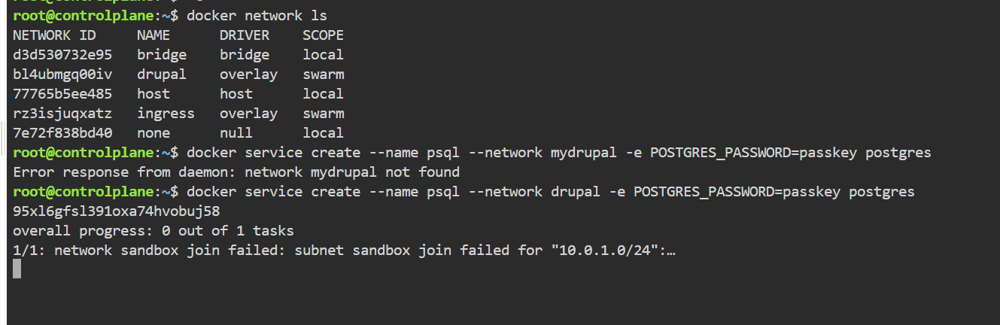

# Overlay Network Sandbox Initialization Failure in Swarm

## The Issue

The Swarm network exists correctly, but the service fails because the overlay network sandbox could not initialize properly.

## Solution

1. Remove Failed Service
2. Remove Overlay Network
3. Recreate Overlay Network
4. Verify Network
5. Create the Service
6. Verify Service
7. Check Service Tasks
