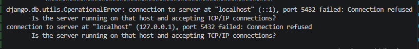
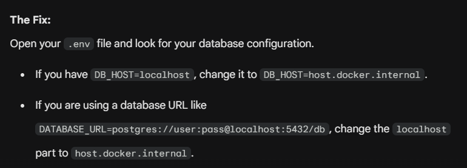
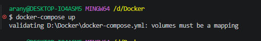

# Docker Notes

Created by: aranya majumdar

---

# Problem Statement - 1

### Docker database issue



#### Option 1: Your database is running on your Windows machine

If you already have PostgreSQL installed and running natively on your local computer, you just need to tell Docker how to reach outside the container and talk to your host machine.

Docker has a special DNS name specifically for this: `host.docker.internal`.



#### Option 2: Containerize the Database


```yaml
services:
  web:
    build: .
    command: "python manage.py runserver 0.0.0.0:8000"
    volumes:
      - .:/app
    ports:
      - "8000:8000"
    env_file:
      - .env
    environment:
      - DEBUG=1
    depends_on:
      - db # This tells Docker to start the DB first

  db:
    image: postgres:15-alpine
    environment:
      - POSTGRES_DB=my_database_name
      - POSTGRES_USER=my_database_user
      - POSTGRES_PASSWORD=my_secure_password
    ports:
      - "5432:5432"
```

-----

# Problem Statement - 2

### DRF CSS Styling Missing in Docker

**The Problem Statement**

When containerizing a Django Rest Framework (DRF) application, the browsable API and Django Admin interfaces often lose their CSS styling, rendering as plain, unformatted HTML.

This happens because of the "Static Files Disconnect." Django does not inherently serve static files (like CSS, JavaScript, and images) in a production or containerized environment. While the `runserver` command magically handles static files during standard local development, it drops this functionality when containerized or when `DEBUG` is set to `False` for security and performance reasons.

#### The Quick Fix (Development Only)

To fix this temporarily in a Dockerized development environment, you must force Django to gather all the DRF and Admin CSS files into a single directory, and then start the server.

This is done by chaining commands in the `Dockerfile` or `docker-compose.yml`:

```docker
# Gathers all static files into the STATIC_ROOT directory, then starts the server
CMD python manage.py collectstatic --noinput && python manage.py runserver 0.0.0.0:8000
```

---

# Problem Statement - 3

### Docker container is stopped after creation

```docker
docker run -d --name ubuntu ubuntu:14.04
```

### Why It Happens

Starts the container, but Ubuntu has no foreground process to keep it alive, so it exits immediately.

We need to keep it alive but running a process inside the container.

Docker containers stay alive only while a foreground process is running.

In this case:

- Ubuntu image starts
- No active foreground process exists
- Container exits immediately

### Solution 1 — Run Ubuntu Interactively

```docker
docker run -it --name ubuntu ubuntu:14.04 /bin/bash
```

## What Happens

- `i` → interactive mode
- `t` → terminal access
- `/bin/bash` → keeps container alive

Now you are inside the container.

### Solution 2 — Run in Detached Mode

```docker
docker run -dit --name ubuntu ubuntu:14.04 bash
```

## What Happens

- `d` → detached/background mode
- `i` → interactive
- `t` → terminal
- `bash` → foreground process

Container keeps running.

---

# **Problem Statement - 4**



### Docker Compose file with issue

```docker
services:
  drupal:
    image: drupal
    ports:
      - "8080:80"
    volumes:
      - drupal-modules:/var/www/html/modules
      - drupal-profiles:/var/www/html/profiles
      - drupal-sites:/var/www/html/sites
      - drupal-themes:/var/www/html/themes
      
  postgres:
    image: postgres
    environment:
      - POSTGRESS_PASSWORD=password

volumes:
  - drupal-modules:
  - drupal-profiles:
  - drupal-sites:
  - drupal-themes:
```

The error **"volumes must be a mapping"** is happening because of how the top-level `volumes` are defined at the very end of your `docker-compose.yml` file.

In YAML, the hyphen (`-`) creates a list (or array), but Docker Compose expects top-level named volumes to be defined as a mapping (a dictionary/object).

### Corrected Code

```docker
services:
  drupal:
    image: drupal
    ports:
      - "8080:80"
    volumes:
      - drupal-modules:/var/www/html/modules
      - drupal-profiles:/var/www/html/profiles
      - drupal-sites:/var/www/html/sites
      - drupal-themes:/var/www/html/themes
      
  postgres:
    image: postgres
    environment:
      - POSTGRES_PASSWORD=passwor

volumes:
  drupal-modules:  # Removed the hyphens here
  drupal-profiles:
  drupal-sites:
  drupal-themes:
```

---