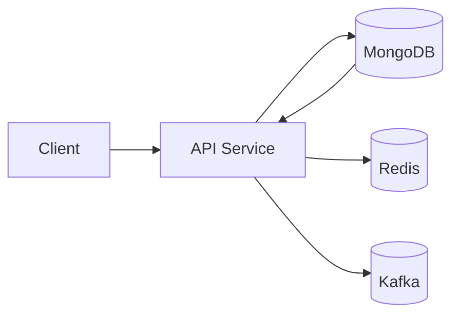
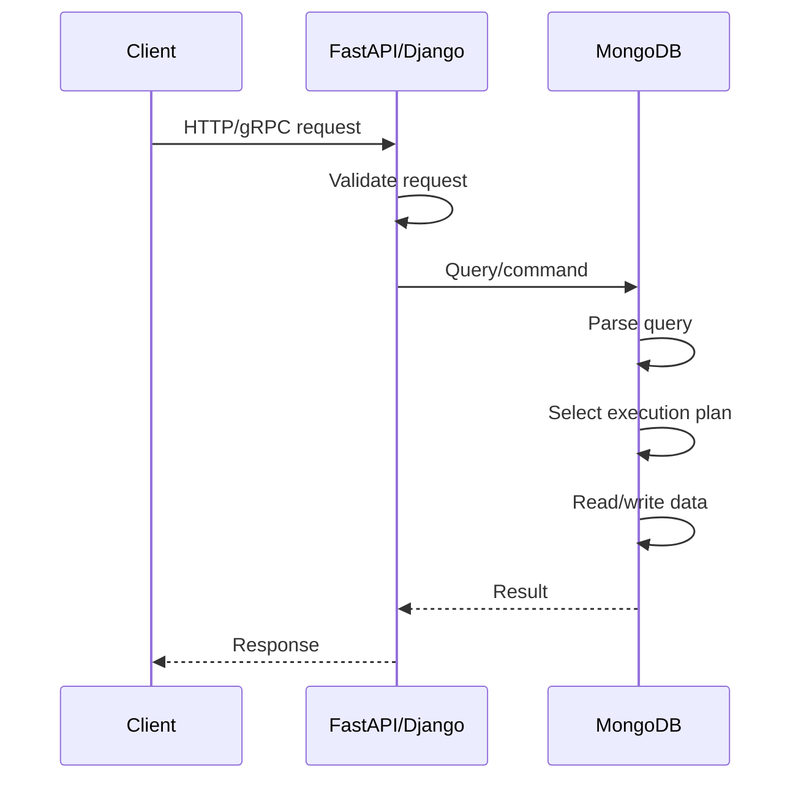
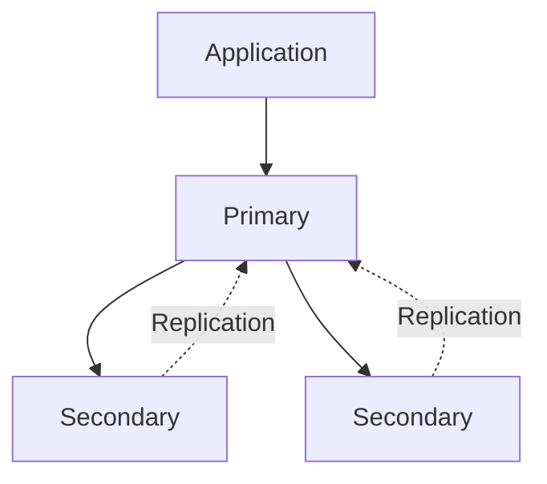
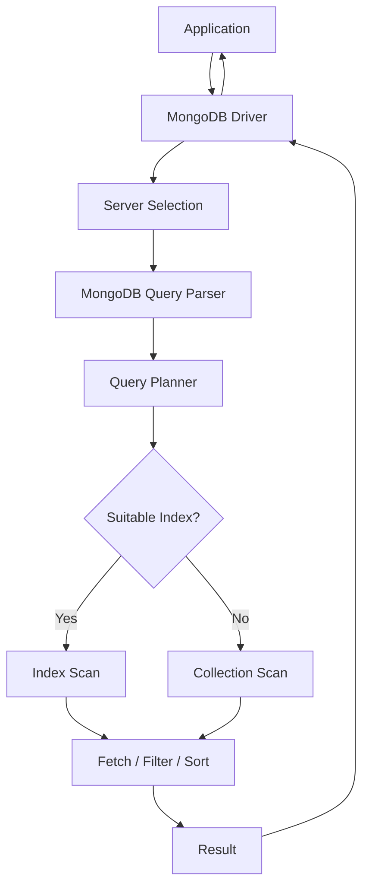
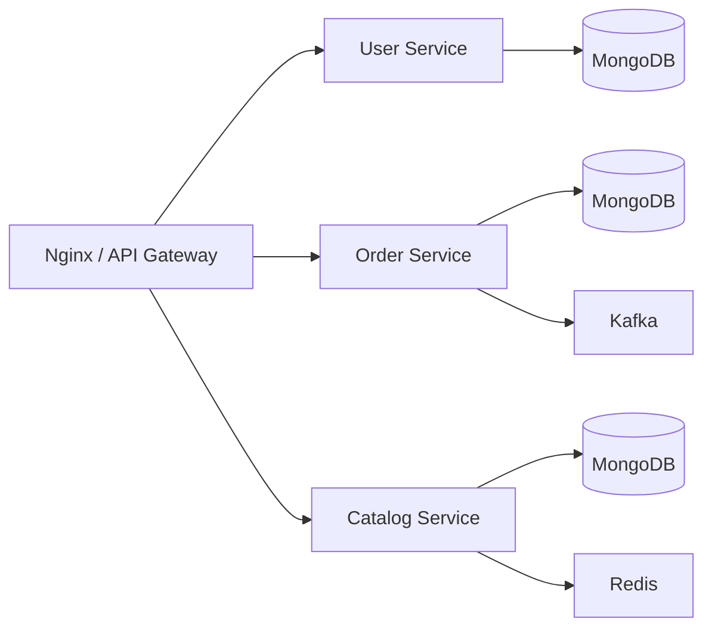

Yes. For a **senior-backend-oriented MongoDB playbook**, I would add a few areas to make the structure more complete.

The biggest missing areas are **deployment, performance, backup/recovery, advanced MongoDB architecture, and Python-specific production patterns**.

I would evolve the structure toward this:

```
MongoDB/
    concepts/
        01- MongoDB Fundamentals.md
        02- Databases Collections and Documents.md
        03- BSON Data Types.md
        04- Embedded Documents.md
        05- Arrays.md
        06- Data Modeling Relationships.md
        07- Schema Validation.md
        08- CRUD Operations.md
        09- Query Operators.md
        10- Projection and Cursors.md
        11- Update Operators.md
        12- Aggregation Framework.md
        13- Aggregation Pipeline.md
        14- Aggregation Operators.md
        15- Indexes.md
        16- Query Planner and Explain.md
        17- Transactions.md
        18- Write Concerns and Read Concerns.md
        19- Read Preference.md
        20- Replica Sets.md
        21- Change Streams.md
        22- Time Series Collections.md
        23- Capped Collections.md
        24- MongoDB Limits and Constraints.md
        README.md

    architecture/
        01- MongoDB Architecture.md
        02- Data Modeling Patterns.md
        03- Embedded vs Referenced Documents.md
        04- One-to-One Relationships.md
        05- One-to-Many Relationships.md
        06- Many-to-Many Relationships.md
        07- Replica Set Architecture.md
        08- High Availability Architecture.md
        09- Sharding Architecture.md
        10- Production MongoDB Architecture.md
        11- Python Application Architecture with MongoDB.md
        README.md

    security/
        01- Security Overview.md
        02- Authentication.md
        03- Users and Roles.md
        04- Authorization and Access Control.md
        05- Network Security.md
        06- TLS and Encryption.md
        07- Auditing and Security Monitoring.md
        08- Security Best Practices.md
        README.md

    integration/
        01- Python and MongoDB Integration.md
        02- PyMongo.md
        03- MongoEngine.md
        04- FastAPI and MongoDB.md
        05- Django and MongoDB.md
        06- MongoDB Compass.md
        07- JSON and CSV Import Export.md
        08- Connection Pooling.md
        09- Transactions in Python.md
        10- Change Streams in Python.md
        11- MongoDB in Background Workers.md
        12- MongoDB Integration Patterns.md
        README.md

    cli/
        01- MongoDB Shell Basics.md
        02- Database and Collection Commands.md
        03- CRUD Commands.md
        04- Query and Projection Commands.md
        05- Update and Array Commands.md
        06- Aggregation Commands.md
        07- Index Management Commands.md
        08- Query Analysis Commands.md
        09- User and Authentication Commands.md
        10- Database Inspection Commands.md
        11- Import and Export Commands.md
        12- Backup and Restore Commands.md
        13- Operational Commands.md
        README.md

    performance/
        01- MongoDB Performance Fundamentals.md
        02- Query Performance.md
        03- Indexing Strategies.md
        04- Compound Indexes.md
        05- Index Selection and ESR Rule.md
        06- Explain Plans.md
        07- Aggregation Performance.md
        08- Write Performance.md
        09- Read Performance.md
        10- Connection Pool Performance.md
        11- Working Set and Memory.md
        12- Performance Optimization Workflow.md
        README.md

    operations/
        01- Database Inspection and Statistics.md
        02- Index Management.md
        03- Query Performance Analysis.md
        04- Monitoring and Observability.md
        05- Logging.md
        06- Replica Set Operations.md
        07- Backup and Restore Operations.md
        08- Data Lifecycle Management.md
        09- Capacity Planning.md
        10- Service Limits and Quotas.md
        11- Production Best Practices.md
        README.md

    backup-recovery/
        01- Backup Fundamentals.md
        02- mongodump and mongorestore.md
        03- Logical vs Physical Backups.md
        04- Point in Time Recovery.md
        05- Backup Validation.md
        06- Disaster Recovery.md
        07- Recovery Procedures.md
        08- Recovery Testing.md
        README.md

    deployment/
        01- Local MongoDB Deployment.md
        02- MongoDB Atlas Deployment.md
        03- Docker MongoDB Deployment.md
        04- Production Configuration.md
        05- Environment Configuration.md
        06- High Availability Deployment.md
        07- Deployment and Rollback Strategies.md
        README.md

    troubleshooting/
        01- Troubleshooting Methodology.md
        02- Connection and Authentication Issues.md
        03- Query and Filter Issues.md
        04- Update and Array Operation Issues.md
        05- Schema Validation Issues.md
        06- Index and Query Performance Issues.md
        07- Aggregation Issues.md
        08- Transaction Issues.md
        09- Replica Set Issues.md
        10- Import and Export Issues.md
        11- Python Integration Issues.md
        12- Connection Pool Issues.md
        13- Production Failure Scenarios.md
        14- Diagnostic Commands.md
        README.md

    projects/
        01- Python MongoDB CRUD Application/
            src/
                __init__.py
                main.py
                config/
                    __init__.py
                    settings.py
                database/
                    __init__.py
                    connection.py
                    indexes.py
                models/
                    __init__.py
                    user.py
                repositories/
                    __init__.py
                    user_repository.py
                services/
                    __init__.py
                    user_service.py
            tests/
                __init__.py
                test_connection.py
                test_user_repository.py
                test_user_service.py
            .env.example
            .gitignore
            requirements.txt
            README.md

        02- FastAPI MongoDB REST API/
            src/
                __init__.py
                main.py
                config/
                    __init__.py
                    settings.py
                database/
                    __init__.py
                    connection.py
                    indexes.py
                models/
                    __init__.py
                    user.py
                schemas/
                    __init__.py
                    user.py
                repositories/
                    __init__.py
                    user_repository.py
                services/
                    __init__.py
                    user_service.py
                api/
                    __init__.py
                    routes/
                        __init__.py
                        users.py
            tests/
                __init__.py
                test_users.py
            .env.example
            .gitignore
            requirements.txt
            README.md

        03- Django MongoDB Application/
            src/
                manage.py
                config/
                    __init__.py
                    settings.py
                    urls.py
                    asgi.py
                    wsgi.py
                users/
                    __init__.py
                    admin.py
                    apps.py
                    models.py
                    serializers.py
                    urls.py
                    views.py
                    migrations/
                        __init__.py
            tests/
                __init__.py
                test_users.py
            .env.example
            .gitignore
            requirements.txt
            README.md

        04- MongoDB Data Modeling Application/
            src/
                __init__.py
                main.py
                config/
                    __init__.py
                    settings.py
                database/
                    __init__.py
                    connection.py
                    indexes.py
                models/
                    __init__.py
                    customer.py
                    order.py
                    product.py
                repositories/
                    __init__.py
                    customer_repository.py
                    order_repository.py
                    product_repository.py
                services/
                    __init__.py
                    customer_service.py
                    order_service.py
                    product_service.py
                seed/
                    __init__.py
                    seed_data.py
            tests/
                __init__.py
                test_customer_model.py
                test_order_model.py
                test_relationships.py
            .env.example
            .gitignore
            requirements.txt
            README.md

        05- MongoDB Aggregation Analytics API/
            src/
                __init__.py
                main.py
                config/
                    __init__.py
                    settings.py
                database/
                    __init__.py
                    connection.py
                schemas/
                    __init__.py
                    analytics.py
                repositories/
                    __init__.py
                    analytics_repository.py
                services/
                    __init__.py
                    analytics_service.py
                api/
                    __init__.py
                    routes/
                        __init__.py
                        analytics.py
                seed/
                    __init__.py
                    seed_data.py
            tests/
                __init__.py
                test_aggregation.py
                test_analytics_api.py
            .env.example
            .gitignore
            requirements.txt
            README.md

        06- MongoDB Query Performance Optimization/
            src/
                __init__.py
                main.py
                config/
                    __init__.py
                    settings.py
                database/
                    __init__.py
                    connection.py
                    indexes.py
                queries/
                    __init__.py
                    unoptimized.py
                    optimized.py
                analysis/
                    __init__.py
                    explain.py
                    statistics.py
                seed/
                    __init__.py
                    generate_data.py
                    load_data.py
            tests/
                __init__.py
                test_queries.py
                test_indexes.py
            .env.example
            .gitignore
            requirements.txt
            README.md

        07- MongoDB Data Import and Processing Pipeline/
            src/
                __init__.py
                config/
                    __init__.py
                    settings.py
                database/
                    __init__.py
                    connection.py
                pipeline/
                    __init__.py
                    extract.py
                    transform.py
                    validate.py
                    load.py
                processors/
                    __init__.py
                    json_processor.py
                    csv_processor.py
                main.py
            tests/
                __init__.py
                test_processors.py
                test_pipeline.py
            data/
                raw/
                processed/
            .env.example
            .gitignore
            requirements.txt
            README.md

        08- MongoDB Transactions Application/
            src/
                __init__.py
                main.py
                config/
                    __init__.py
                    settings.py
                database/
                    __init__.py
                    connection.py
                repositories/
                    __init__.py
                    account_repository.py
                services/
                    __init__.py
                    transfer_service.py
                models/
                    __init__.py
                    account.py
            tests/
                __init__.py
                test_transactions.py
                test_rollback.py
            .env.example
            .gitignore
            requirements.txt
            README.md

        09- MongoDB Change Streams Application/
            src/
                __init__.py
                main.py
                config/
                    __init__.py
                    settings.py
                database/
                    __init__.py
                    connection.py
                consumers/
                    __init__.py
                    change_stream.py
                handlers/
                    __init__.py
                    event_handler.py
                services/
                    __init__.py
                    event_service.py
            tests/
                __init__.py
                test_change_stream.py
                test_event_handler.py
            .env.example
            .gitignore
            requirements.txt
            README.md

        10- MongoDB Schema Validation Application/
            src/
                __init__.py
                main.py
                config/
                    __init__.py
                    settings.py
                database/
                    __init__.py
                    connection.py
                    validators.py
                schemas/
                    __init__.py
                    customer.py
                    product.py
                    order.py
                repositories/
                    __init__.py
                    customer_repository.py
                    product_repository.py
                    order_repository.py
            tests/
                __init__.py
                test_schema_validation.py
                test_invalid_documents.py
                test_valid_documents.py
            .env.example
            .gitignore
            requirements.txt
            README.md

        11- MongoDB Background Worker Integration/
            src/
                __init__.py
                config/
                    __init__.py
                    settings.py
                database/
                    __init__.py
                    connection.py
                workers/
                    __init__.py
                    tasks.py
                services/
                    __init__.py
                    processing_service.py
                main.py
            tests/
                __init__.py
                test_tasks.py
                test_processing_service.py
            .env.example
            .gitignore
            requirements.txt
            README.md

        README.md

    interview/
        01- Core MongoDB Interview Questions.md
        02- CRUD and Query Questions.md
        03- Data Modeling Questions.md
        04- Aggregation Questions.md
        05- Indexing and Query Performance Questions.md
        06- Transactions Questions.md
        07- Schema Validation Questions.md
        08- Security and Authentication Questions.md
        09- Replica Set and High Availability Questions.md
        10- Python and MongoDB Questions.md
        11- FastAPI and MongoDB Questions.md
        12- Django and MongoDB Questions.md
        13- Scenario Based Questions.md
        14- Troubleshooting Questions.md
        15- Architecture Questions.md
        16- Comparison and Design Questions.md
        17- Common Interview Traps.md
        18- Senior Level Questions.md
        README.md

    README.md
```
```
# MongoDB Topic Guidance

## 1. Documentation Objective

Build a production-oriented MongoDB engineering playbook for an intermediate-to-senior backend engineer.

The documentation should teach MongoDB from fundamentals through advanced backend engineering usage, with strong emphasis on:

- Data modeling
- CRUD and query design
- Aggregation
- Indexing
- Transactions
- Performance
- Replication
- High availability
- Security
- Python integration
- FastAPI and Django integration
- Operational practices
- Troubleshooting
- Backup and recovery
- Production architecture
- Interview preparation

The documentation must focus on practical engineering decisions rather than simply documenting MongoDB commands.

---

# 2. Core Concepts

Cover MongoDB fundamentals thoroughly.

Include:

- What MongoDB is
- Document-oriented database model
- NoSQL concepts
- MongoDB architecture
- Databases
- Collections
- Documents
- Fields
- BSON
- BSON data types
- ObjectId
- Embedded documents
- Arrays
- Nested documents
- Schema flexibility
- Schema-on-read vs schema-on-write
- MongoDB limits and constraints
- MongoDB terminology
- MongoDB server and client architecture

Explain how MongoDB differs conceptually from relational databases where useful.

---

# 3. CRUD Operations

Document CRUD behavior from both conceptual and practical perspectives.

Cover:

- Insert one
- Insert many
- Find
- Find one
- Update one
- Update many
- Replace one
- Delete one
- Delete many
- Upsert
- Bulk writes
- Write results
- Atomicity of individual document operations
- Query filters
- Comparison operators
- Logical operators
- Element operators
- Evaluation operators
- Array operators
- Projection
- Sorting
- Pagination
- Skip
- Limit
- Cursors

Explain when each operation should be used and common mistakes.

---

# 4. Data Modeling

Treat MongoDB data modeling as a major senior-level topic.

Cover:

- Modeling for access patterns
- Embedding vs referencing
- One-to-one relationships
- One-to-many relationships
- Many-to-many relationships
- Parent-child relationships
- Arrays of documents
- Denormalization
- Controlled duplication
- Document growth
- Large documents
- Hot documents
- Cardinality
- Read-heavy models
- Write-heavy models
- Query-driven schema design
- Schema evolution
- Anti-patterns

Include practical examples showing how the same business model could be represented using different MongoDB designs.

---

# 5. Schema Validation

Cover:

- Why schema validation is useful
- JSON Schema validation
- Validation rules
- Required fields
- BSON type validation
- Nested validation
- Array validation
- Validation levels
- Validation actions
- Schema evolution
- Validation with application-level validation
- Validation limitations

Explain how MongoDB's flexible schema can still be controlled in production systems.

---

# 6. Querying

Cover MongoDB query behavior deeply.

Include:

- Query selectors
- Comparison operators
- Logical operators
- Array queries
- Embedded document queries
- Regex queries
- Exists
- Type queries
- Element queries
- Expression queries
- Geospatial queries where relevant
- Query composition
- Projection
- Sorting
- Pagination
- Cursor behavior

Explain how queries interact with indexes and the query planner.

---

# 7. Aggregation Framework

Treat aggregation as a major topic.

Cover:

- Aggregation pipeline
- Pipeline execution model
- `$match`
- `$project`
- `$set`
- `$unset`
- `$group`
- `$sort`
- `$limit`
- `$skip`
- `$unwind`
- `$lookup`
- `$facet`
- `$count`
- `$bucket`
- `$bucketAuto`
- `$replaceWith`
- `$replaceRoot`
- `$unionWith`
- `$merge`
- `$out`
- Aggregation expressions
- Accumulators
- Conditional expressions
- Array expressions
- Date expressions
- String expressions

Also cover:

- Aggregation optimization
- Pipeline ordering
- `$match` early filtering
- Index usage
- Memory considerations
- Large aggregation workloads
- Aggregation anti-patterns

---

# 8. Indexes

Treat indexing as one of the most important MongoDB performance topics.

Cover:

- Why indexes exist
- Default `_id` index
- Single-field indexes
- Compound indexes
- Multikey indexes
- Unique indexes
- Sparse indexes
- Partial indexes
- TTL indexes
- Text indexes
- Geospatial indexes
- Index intersection
- Index selectivity
- Cardinality
- Compound index ordering
- ESR guideline
- Sort and index interaction
- Covered queries
- Index size
- Index maintenance cost
- Write overhead
- Over-indexing
- Index lifecycle

Include practical examples of selecting indexes from actual query patterns.

---

# 9. Query Planner and Explain

Cover:

- Query planner
- Winning plan
- Rejected plans
- `explain()`
- Query planner stages
- COLLSCAN
- IXSCAN
- FETCH
- SORT
- LIMIT
- Execution statistics
- `nReturned`
- `totalKeysExamined`
- `totalDocsExamined`
- Execution time
- Detecting inefficient queries
- Detecting unused indexes
- Query optimization workflow

Teach how a senior engineer should diagnose a slow MongoDB query.

---

# 10. Transactions

Cover:

- Single-document atomicity
- Multi-document transactions
- Session
- Transaction lifecycle
- Commit
- Abort
- Read concern
- Write concern
- Read preference
- Retry behavior
- Transaction limitations
- Transaction performance
- When transactions are appropriate
- When transactions should be avoided
- Transaction design in Python

Explain MongoDB transactions in comparison with relational database transactions where useful.

---

# 11. Read and Write Concerns

Cover:

- Read concern
- Write concern
- Read preference
- Acknowledged writes
- Unacknowledged writes
- Majority writes
- Durability
- Consistency
- Availability trade-offs
- Replica-set interaction
- Transaction interaction

Explain how these settings affect real production behavior.

---

# 12. Replica Sets

Cover:

- Replica set architecture
- Primary
- Secondary
- Elections
- Replication
- Oplog
- Heartbeats
- Failover
- Election process
- Read preference
- Write concern
- Majority
- Rollback
- Initial sync
- Secondary lag
- Hidden members
- Priority
- Arbiter considerations
- Replica-set operational commands

Explain how replica sets provide high availability.

---

# 13. Sharding

Treat sharding as an advanced architecture topic.

Cover:

- Why sharding exists
- Horizontal scaling
- Sharded cluster architecture
- Shard
- Config servers
- Mongos
- Shard key
- Hashed shard keys
- Ranged shard keys
- Cardinality
- Frequency
- Monotonically increasing keys
- Query targeting
- Scatter-gather queries
- Chunk concepts
- Balancing
- Resharding
- Hot shards
- Sharding anti-patterns
- Production shard-key selection

Include practical shard-key design reasoning.

---

# 14. Change Streams

Cover:

- What change streams are
- Change events
- Insert events
- Update events
- Replace events
- Delete events
- Resume tokens
- Resuming streams
- Full document lookup
- Replica-set requirements
- Event-driven architecture
- Python change stream consumers
- Failure handling
- Idempotency

---

# 15. Security

Cover MongoDB security comprehensively.

Include:

- Authentication
- Authorization
- Users
- Roles
- Built-in roles
- Custom roles
- Least privilege
- Database-level permissions
- Collection-level permissions
- Network restrictions
- TLS
- Encryption
- Encryption at rest
- Encryption in transit
- Auditing
- Security monitoring
- Credential management
- Secret management
- Production security best practices

Avoid treating security as a single generic topic.

---

# 16. Python Integration

Make Python integration a major section.

Cover:

- PyMongo
- MongoDB connection strings
- MongoClient
- Database access
- Collection access
- CRUD from Python
- BSON handling
- ObjectId
- Query construction
- Projection
- Sorting
- Pagination
- Bulk writes
- Aggregation from Python
- Transactions from Python
- Sessions
- Connection pooling
- Timeouts
- Retry behavior
- Error handling
- Repository pattern
- Service-layer integration
- Configuration management
- Environment variables

Use production-quality Python examples.

---

# 17. FastAPI Integration

Cover:

- FastAPI + PyMongo
- Application startup
- Database lifecycle
- Dependency injection
- Pydantic models
- ObjectId serialization
- CRUD endpoints
- Pagination
- Aggregation endpoints
- Error handling
- Connection management
- Async considerations
- Repository pattern
- Service layer
- Production configuration

Distinguish synchronous PyMongo usage from async MongoDB drivers where relevant and current.

---

# 18. Django Integration

Cover:

- Django + MongoDB architecture
- PyMongo integration
- MongoEngine where appropriate
- Repository pattern
- Django service layer
- Model considerations
- Serialization
- Querying
- Transactions
- Connection management
- Configuration
- Testing
- Production considerations

Do not incorrectly imply that MongoDB behaves like Django's native relational ORM.

---

# 19. MongoDB Compass

Cover practical Compass workflows:

- Connecting to MongoDB
- Browsing databases
- Browsing collections
- Creating documents
- Editing documents
- Running queries
- Aggregation pipeline builder
- Index inspection
- Schema analysis
- Importing JSON
- Importing CSV
- Exporting data
- Query testing
- Troubleshooting connections

---

# 20. CLI

Cover MongoDB Shell and relevant MongoDB CLI tooling.

Include:

- `mongosh`
- Connection commands
- Database inspection
- Collection inspection
- CRUD
- Aggregation
- Index management
- Explain
- User management
- Authentication
- Statistics
- Import/export
- Backup/restore
- Operational inspection
- Filtering
- Output formatting

Keep this MongoDB-specific rather than creating a generic shell tutorial.

---

# 21. Performance

Create a dedicated performance area.

Cover:

- Query performance
- Index selection
- Compound index design
- ESR guideline
- Aggregation performance
- Write performance
- Read performance
- Connection pooling
- Working set
- Memory
- Large collections
- Large documents
- Hot documents
- Slow queries
- Explain plans
- Performance measurement
- Performance regression
- Optimization workflow

Include before/after optimization examples.

---

# 22. Operations

Cover production operations.

Include:

- Monitoring
- Metrics
- Logging
- Database statistics
- Collection statistics
- Index statistics
- Query performance
- Replica-set health
- Replication lag
- Capacity planning
- Storage growth
- Connection monitoring
- Production best practices
- Service limits
- Operational runbooks

---

# 23. Backup and Recovery

Treat backup and recovery separately from normal operations.

Cover:

- Backup strategy
- Logical backups
- `mongodump`
- `mongorestore`
- Physical backups
- Cloud/managed backups
- Point-in-time recovery
- Restore procedures
- Backup validation
- Recovery testing
- RPO
- RTO
- Disaster recovery
- Failure scenarios
- Recovery runbooks

---

# 24. Deployment

Cover deployment approaches relevant to backend engineers.

Include:

- Local MongoDB
- MongoDB Atlas
- Docker
- Environment configuration
- Connection strings
- Production configuration
- Replica-set deployment
- High availability
- Deployment strategies
- Rollback
- Configuration management
- Secret management

Avoid turning this into a generic Docker or cloud deployment guide.

---

# 25. Troubleshooting

Use a structured troubleshooting methodology.

For each major problem category use:

```text
Symptom
    ↓
Possible causes
    ↓
Isolation strategy
    ↓
Diagnostic commands
    ↓
Root cause
    ↓
Corrective action
    ↓
Prevention
```

Cover:

* Connection failures
* Authentication failures
* Authorization failures
* Query failures
* Incorrect query results
* Update failures
* Schema validation failures
* Aggregation failures
* Slow queries
* Missing indexes
* Incorrect indexes
* Connection pool exhaustion
* Transaction failures
* Replica-set failures
* Replication lag
* Import/export failures
* Python integration failures
* Production failures

---

# 26. Python Projects

Projects must be **complete runnable Python projects**, not documentation-only exercises.

Every project should contain real executable code.

Projects should generally include:

* `src/`
* Python package structure
* Configuration
* Database connection
* Application/service logic
* Tests
* `.env.example`
* `.gitignore`
* `requirements.txt`
* `README.md`

Projects should use MongoDB realistically rather than creating toy examples.

Recommended projects:

1. Python MongoDB CRUD Application
2. FastAPI MongoDB REST API
3. Django MongoDB Application
4. MongoDB Data Modeling Application
5. MongoDB Aggregation Analytics API
6. MongoDB Query Performance Optimization
7. MongoDB Data Import and Processing Pipeline
8. MongoDB Transactions Application
9. MongoDB Change Streams Application
10. MongoDB Schema Validation Application
11. MongoDB Background Worker Integration

Each project should demonstrate a distinct MongoDB engineering concept.

Avoid creating multiple projects that merely repeat CRUD.

---

# 27. Interview Preparation

Interview material should target senior backend engineering roles.

Cover:

* Core MongoDB questions
* CRUD questions
* Query questions
* Data modeling
* Aggregation
* Indexing
* Query optimization
* Transactions
* Read/write concerns
* Replica sets
* High availability
* Sharding
* Security
* Python integration
* FastAPI integration
* Django integration
* Scenario-based questions
* Troubleshooting scenarios
* Architecture questions
* Comparison questions
* Common misconceptions
* Interview traps
* Senior-level reasoning

Emphasize:

* Why?
* When?
* Trade-offs?
* Failure modes?
* Alternatives?
* Production implications?

Avoid simple memorization-oriented questions.

---

# 28. Senior Backend Engineering Focus

Throughout the entire playbook, emphasize:

* Access-pattern-driven data modeling
* Correct index design
* Query performance
* Consistency vs availability trade-offs
* Transaction boundaries
* Failure handling
* Idempotency
* Connection management
* Scalability
* High availability
* Observability
* Security
* Backup and recovery
* Operational safety
* Production debugging
* Python integration
* API architecture
* Maintainability
* Cost awareness

The goal is not merely to teach MongoDB syntax.

The goal is to teach how an experienced backend engineer designs, integrates, operates, troubleshoots, and optimizes MongoDB-backed systems.

```
# MongoDB Topic Guidance

## 1. Documentation Objective

Build a production-oriented MongoDB engineering playbook for an intermediate-to-senior backend engineer.

The documentation should teach MongoDB from fundamentals through advanced backend engineering usage, with strong emphasis on:

- Data modeling
- CRUD and query design
- Aggregation
- Indexing
- Transactions
- Performance
- Replication
- High availability
- Security
- Python integration
- FastAPI and Django integration
- Operational practices
- Troubleshooting
- Backup and recovery
- Production architecture
- Interview preparation

The documentation must focus on practical engineering decisions rather than simply documenting MongoDB commands.

---

# 2. Core Concepts

Cover MongoDB fundamentals thoroughly.

Include:

- What MongoDB is
- Document-oriented database model
- NoSQL concepts
- MongoDB architecture
- Databases
- Collections
- Documents
- Fields
- BSON
- BSON data types
- ObjectId
- Embedded documents
- Arrays
- Nested documents
- Schema flexibility
- Schema-on-read vs schema-on-write
- MongoDB limits and constraints
- MongoDB terminology
- MongoDB server and client architecture

Explain how MongoDB differs conceptually from relational databases where useful.

---

# 3. CRUD Operations

Document CRUD behavior from both conceptual and practical perspectives.

Cover:

- Insert one
- Insert many
- Find
- Find one
- Update one
- Update many
- Replace one
- Delete one
- Delete many
- Upsert
- Bulk writes
- Write results
- Atomicity of individual document operations
- Query filters
- Comparison operators
- Logical operators
- Element operators
- Evaluation operators
- Array operators
- Projection
- Sorting
- Pagination
- Skip
- Limit
- Cursors

Explain when each operation should be used and common mistakes.

---

# 4. Data Modeling

Treat MongoDB data modeling as a major senior-level topic.

Cover:

- Modeling for access patterns
- Embedding vs referencing
- One-to-one relationships
- One-to-many relationships
- Many-to-many relationships
- Parent-child relationships
- Arrays of documents
- Denormalization
- Controlled duplication
- Document growth
- Large documents
- Hot documents
- Cardinality
- Read-heavy models
- Write-heavy models
- Query-driven schema design
- Schema evolution
- Anti-patterns

Include practical examples showing how the same business model could be represented using different MongoDB designs.

---

# 5. Schema Validation

Cover:

- Why schema validation is useful
- JSON Schema validation
- Validation rules
- Required fields
- BSON type validation
- Nested validation
- Array validation
- Validation levels
- Validation actions
- Schema evolution
- Validation with application-level validation
- Validation limitations

Explain how MongoDB's flexible schema can still be controlled in production systems.

---

# 6. Querying

Cover MongoDB query behavior deeply.

Include:

- Query selectors
- Comparison operators
- Logical operators
- Array queries
- Embedded document queries
- Regex queries
- Exists
- Type queries
- Element queries
- Expression queries
- Geospatial queries where relevant
- Query composition
- Projection
- Sorting
- Pagination
- Cursor behavior

Explain how queries interact with indexes and the query planner.

---

# 7. Aggregation Framework

Treat aggregation as a major topic.

Cover:

- Aggregation pipeline
- Pipeline execution model
- `$match`
- `$project`
- `$set`
- `$unset`
- `$group`
- `$sort`
- `$limit`
- `$skip`
- `$unwind`
- `$lookup`
- `$facet`
- `$count`
- `$bucket`
- `$bucketAuto`
- `$replaceWith`
- `$replaceRoot`
- `$unionWith`
- `$merge`
- `$out`
- Aggregation expressions
- Accumulators
- Conditional expressions
- Array expressions
- Date expressions
- String expressions

Also cover:

- Aggregation optimization
- Pipeline ordering
- `$match` early filtering
- Index usage
- Memory considerations
- Large aggregation workloads
- Aggregation anti-patterns

---

# 8. Indexes

Treat indexing as one of the most important MongoDB performance topics.

Cover:

- Why indexes exist
- Default `_id` index
- Single-field indexes
- Compound indexes
- Multikey indexes
- Unique indexes
- Sparse indexes
- Partial indexes
- TTL indexes
- Text indexes
- Geospatial indexes
- Index intersection
- Index selectivity
- Cardinality
- Compound index ordering
- ESR guideline
- Sort and index interaction
- Covered queries
- Index size
- Index maintenance cost
- Write overhead
- Over-indexing
- Index lifecycle

Include practical examples of selecting indexes from actual query patterns.

---

# 9. Query Planner and Explain

Cover:

- Query planner
- Winning plan
- Rejected plans
- `explain()`
- Query planner stages
- COLLSCAN
- IXSCAN
- FETCH
- SORT
- LIMIT
- Execution statistics
- `nReturned`
- `totalKeysExamined`
- `totalDocsExamined`
- Execution time
- Detecting inefficient queries
- Detecting unused indexes
- Query optimization workflow

Teach how a senior engineer should diagnose a slow MongoDB query.

---

# 10. Transactions

Cover:

- Single-document atomicity
- Multi-document transactions
- Session
- Transaction lifecycle
- Commit
- Abort
- Read concern
- Write concern
- Read preference
- Retry behavior
- Transaction limitations
- Transaction performance
- When transactions are appropriate
- When transactions should be avoided
- Transaction design in Python

Explain MongoDB transactions in comparison with relational database transactions where useful.

---

# 11. Read and Write Concerns

Cover:

- Read concern
- Write concern
- Read preference
- Acknowledged writes
- Unacknowledged writes
- Majority writes
- Durability
- Consistency
- Availability trade-offs
- Replica-set interaction
- Transaction interaction

Explain how these settings affect real production behavior.

---

# 12. Replica Sets

Cover:

- Replica set architecture
- Primary
- Secondary
- Elections
- Replication
- Oplog
- Heartbeats
- Failover
- Election process
- Read preference
- Write concern
- Majority
- Rollback
- Initial sync
- Secondary lag
- Hidden members
- Priority
- Arbiter considerations
- Replica-set operational commands

Explain how replica sets provide high availability.

---

# 13. Sharding

Treat sharding as an advanced architecture topic.

Cover:

- Why sharding exists
- Horizontal scaling
- Sharded cluster architecture
- Shard
- Config servers
- Mongos
- Shard key
- Hashed shard keys
- Ranged shard keys
- Cardinality
- Frequency
- Monotonically increasing keys
- Query targeting
- Scatter-gather queries
- Chunk concepts
- Balancing
- Resharding
- Hot shards
- Sharding anti-patterns
- Production shard-key selection

Include practical shard-key design reasoning.

---

# 14. Change Streams

Cover:

- What change streams are
- Change events
- Insert events
- Update events
- Replace events
- Delete events
- Resume tokens
- Resuming streams
- Full document lookup
- Replica-set requirements
- Event-driven architecture
- Python change stream consumers
- Failure handling
- Idempotency

---

# 15. Security

Cover MongoDB security comprehensively.

Include:

- Authentication
- Authorization
- Users
- Roles
- Built-in roles
- Custom roles
- Least privilege
- Database-level permissions
- Collection-level permissions
- Network restrictions
- TLS
- Encryption
- Encryption at rest
- Encryption in transit
- Auditing
- Security monitoring
- Credential management
- Secret management
- Production security best practices

Avoid treating security as a single generic topic.

---

# 16. Python Integration

Make Python integration a major section.

Cover:

- PyMongo
- MongoDB connection strings
- MongoClient
- Database access
- Collection access
- CRUD from Python
- BSON handling
- ObjectId
- Query construction
- Projection
- Sorting
- Pagination
- Bulk writes
- Aggregation from Python
- Transactions from Python
- Sessions
- Connection pooling
- Timeouts
- Retry behavior
- Error handling
- Repository pattern
- Service-layer integration
- Configuration management
- Environment variables

Use production-quality Python examples.

---

# 17. FastAPI Integration

Cover:

- FastAPI + PyMongo
- Application startup
- Database lifecycle
- Dependency injection
- Pydantic models
- ObjectId serialization
- CRUD endpoints
- Pagination
- Aggregation endpoints
- Error handling
- Connection management
- Async considerations
- Repository pattern
- Service layer
- Production configuration

Distinguish synchronous PyMongo usage from async MongoDB drivers where relevant and current.

---

# 18. Django Integration

Cover:

- Django + MongoDB architecture
- PyMongo integration
- MongoEngine where appropriate
- Repository pattern
- Django service layer
- Model considerations
- Serialization
- Querying
- Transactions
- Connection management
- Configuration
- Testing
- Production considerations

Do not incorrectly imply that MongoDB behaves like Django's native relational ORM.

---

# 19. MongoDB Compass

Cover practical Compass workflows:

- Connecting to MongoDB
- Browsing databases
- Browsing collections
- Creating documents
- Editing documents
- Running queries
- Aggregation pipeline builder
- Index inspection
- Schema analysis
- Importing JSON
- Importing CSV
- Exporting data
- Query testing
- Troubleshooting connections

---

# 20. CLI

Cover MongoDB Shell and relevant MongoDB CLI tooling.

Include:

- `mongosh`
- Connection commands
- Database inspection
- Collection inspection
- CRUD
- Aggregation
- Index management
- Explain
- User management
- Authentication
- Statistics
- Import/export
- Backup/restore
- Operational inspection
- Filtering
- Output formatting

Keep this MongoDB-specific rather than creating a generic shell tutorial.

---

# 21. Performance

Create a dedicated performance area.

Cover:

- Query performance
- Index selection
- Compound index design
- ESR guideline
- Aggregation performance
- Write performance
- Read performance
- Connection pooling
- Working set
- Memory
- Large collections
- Large documents
- Hot documents
- Slow queries
- Explain plans
- Performance measurement
- Performance regression
- Optimization workflow

Include before/after optimization examples.

---

# 22. Operations

Cover production operations.

Include:

- Monitoring
- Metrics
- Logging
- Database statistics
- Collection statistics
- Index statistics
- Query performance
- Replica-set health
- Replication lag
- Capacity planning
- Storage growth
- Connection monitoring
- Production best practices
- Service limits
- Operational runbooks

---

# 23. Backup and Recovery

Treat backup and recovery separately from normal operations.

Cover:

- Backup strategy
- Logical backups
- `mongodump`
- `mongorestore`
- Physical backups
- Cloud/managed backups
- Point-in-time recovery
- Restore procedures
- Backup validation
- Recovery testing
- RPO
- RTO
- Disaster recovery
- Failure scenarios
- Recovery runbooks

---

# 24. Deployment

Cover deployment approaches relevant to backend engineers.

Include:

- Local MongoDB
- MongoDB Atlas
- Docker
- Environment configuration
- Connection strings
- Production configuration
- Replica-set deployment
- High availability
- Deployment strategies
- Rollback
- Configuration management
- Secret management

Avoid turning this into a generic Docker or cloud deployment guide.

---

# 25. Troubleshooting

Use a structured troubleshooting methodology.

For each major problem category use:

```text
Symptom
    ↓
Possible causes
    ↓
Isolation strategy
    ↓
Diagnostic commands
    ↓
Root cause
    ↓
Corrective action
    ↓
Prevention
```
```
# 01- MongoDB Fundamentals

## Overview

MongoDB is a document-oriented NoSQL database designed around storing and querying data as BSON documents inside collections. Unlike a relational database, MongoDB does not require every record in a collection to conform to a rigid table schema. This flexibility is useful for applications whose data models evolve frequently or whose access patterns benefit from storing related data together.

For backend engineers, MongoDB is best understood as a **query- and access-pattern-driven database**, not simply as a schema-less alternative to PostgreSQL. Good MongoDB design requires deliberate decisions about document boundaries, embedding, indexes, consistency, transactions, replication, and operational behavior.

MongoDB is commonly used for:

- REST and gRPC backend services
- Content and catalog systems
- Event and activity data
- User profiles
- Product and inventory data
- Metadata-heavy applications
- High-volume operational workloads
- Applications requiring flexible document structures
- Event-driven systems using change streams

A typical backend architecture may look like:



MongoDB should not automatically replace a relational database. The correct choice depends on data relationships, transaction requirements, query patterns, consistency requirements, operational constraints, and team expertise.

---

## What MongoDB Is

MongoDB is a distributed document database that stores records as BSON documents.

The basic hierarchy is:

```text
MongoDB deployment
    Database
        Collection
            Document
                Field
```

For example:

```json
{
  "_id": "665c1e5d4f8e2a0012345678",
  "name": "Aranya",
  "email": "aranya@example.com",
  "roles": [
    "backend-engineer",
    "team-lead"
  ],
  "address": {
    "city": "Kolkata",
    "country": "India"
  }
}
```

The document contains fields, nested documents, and arrays. MongoDB stores this structure internally as BSON rather than plain JSON.

### Why MongoDB Exists

Traditional relational databases organize data primarily around tables and relationships. MongoDB instead makes the document a first-class storage and query unit.

This allows an application to represent related information together:

```json
{
  "order_id": "ORD-1001",
  "customer": {
    "id": "CUS-100",
    "name": "John"
  },
  "items": [
    {
      "product_id": "P-10",
      "name": "Keyboard",
      "quantity": 2
    }
  ]
}
```

A relational design might require separate `orders`, `customers`, and `order_items` tables.

MongoDB's document model can reduce joins when the application's access pattern naturally requires the related data together.

The trade-off is that denormalization introduces duplication and requires deliberate schema design.

---

## MongoDB as a Backend Database

A typical Python backend uses MongoDB through a driver such as PyMongo.



The application remains responsible for:

- Request validation
- Authentication and authorization
- Business rules
- Transaction boundaries
- Error handling
- API contracts
- Observability
- Configuration
- Retry policies

MongoDB is responsible for:

- Persisting documents
- Query execution
- Index maintenance
- Atomic document operations
- Transactions
- Replication
- Storage
- Query planning
- Database-level consistency mechanisms

---

## MongoDB Architecture

At a high level, a MongoDB deployment consists of clients connecting to MongoDB server processes.

A simple deployment can be:

```text
Application
     |
     v
MongoDB Server
     |
     +-- Database
     |     |
     |     +-- Collection
     |           |
     |           +-- Document
     |
     +-- Indexes
     |
     +-- Storage Engine
```

Production deployments commonly use replica sets:



The primary generally accepts writes, while secondaries replicate data from the primary and can serve reads depending on read preference.

Larger deployments can introduce sharding:

```text
Application
    |
    v
mongos
    |
    +-------------------+
    |                   |
    v                   v
Shard 1              Shard 2
Replica Set          Replica Set
```

Sharding should be introduced because the workload requires horizontal scaling, not simply because the database is growing.

---

## Databases, Collections, and Documents

### Database

A MongoDB database logically groups collections.

For example:

```text
company_db
    users
    orders
    products
    payments
```

A MongoDB deployment can contain multiple databases.

### Collection

A collection is analogous to a table at a high level, but it is not equivalent to a relational table.

A collection contains documents:

```text
users
    document 1
    document 2
    document 3
```

Collections can contain documents with different fields.

### Document

A document is MongoDB's primary unit of storage and many database operations.

Example:

```json
{
  "_id": "user-100",
  "name": "Alice",
  "active": true,
  "roles": ["admin", "developer"]
}
```

Documents can contain:

- Scalars
- Arrays
- Nested documents
- Dates
- Binary values
- ObjectIds
- Other BSON types

---

## BSON

BSON means **Binary JSON**.

MongoDB uses BSON because it provides a binary representation with additional data types and efficient traversal characteristics.

JSON supports a relatively small set of data types:

```text
string
number
boolean
null
object
array
```

BSON additionally represents types such as:

- ObjectId
- Date
- Binary data
- Decimal128
- Int32
- Int64
- Timestamp
- Regular expression

For example:

```json
{
  "name": "Product A",
  "price": 1499.99,
  "created_at": "2026-09-20T10:00:00Z"
}
```

Internally, the date can be represented using a BSON date type rather than a string.

This distinction matters because BSON type affects:

- Query behavior
- Sorting
- Indexing
- Serialization
- Application-driver behavior

---

## Important BSON Types

| Type | Typical use |
|---|---|
| String | Text |
| Boolean | Flags |
| Int32 | Small integers |
| Int64 | Large integer values |
| Double | Floating-point numbers |
| Decimal128 | Precise decimal values |
| Date | Timestamps |
| ObjectId | MongoDB identifiers |
| Array | Ordered collections |
| Embedded document | Nested structured data |
| Binary | Binary payloads |
| Null | Explicit null values |
| Regex | Pattern-based matching |

For financial values, avoid casually storing currency amounts as floating-point values. Decimal128 or integer minor units are generally safer choices depending on the application's requirements.

---

## ObjectId

MongoDB commonly uses `ObjectId` as the default `_id` type.

Example:

```python
from bson import ObjectId

user_id = ObjectId("665c1e5d4f8e2a0012345678")
```

An ObjectId is designed to be unique and contains information derived from its generation context.

Example document:

```json
{
  "_id": {
    "$oid": "665c1e5d4f8e2a0012345678"
  },
  "name": "Alice"
}
```

ObjectId is useful because the database and drivers can generate identifiers without requiring a centralized ID-generation service.

### Common Mistake

Do not assume that every MongoDB application must use ObjectId.

Applications may intentionally use:

```text
UUID
ULID
Business identifiers
Composite application identifiers
```

The important requirement is that identifiers are unique, stable, and appropriate for the application's access patterns.

---

## Embedded Documents

MongoDB supports nesting documents directly inside other documents.

```json
{
  "name": "Alice",
  "address": {
    "street": "Park Street",
    "city": "Kolkata",
    "country": "India"
  }
}
```

Embedding is useful when the nested data:

- Belongs strongly to the parent
- Is usually read with the parent
- Has bounded growth
- Does not need independent lifecycle management

For example, an address may naturally belong to a user.

### Advantages

- Fewer queries
- No application-side join required
- Related data is stored together
- Atomic updates can often be performed on one document

### Limitations

- Document size growth
- Duplication
- More difficult independent updates
- Potentially expensive rewrites for frequently changing large documents

---

## Arrays

Documents can contain arrays of scalar values:

```json
{
  "name": "Alice",
  "roles": [
    "developer",
    "team-lead"
  ]
}
```

They can also contain arrays of documents:

```json
{
  "order_id": "ORD-1001",
  "items": [
    {
      "product_id": "P1",
      "quantity": 2
    },
    {
      "product_id": "P2",
      "quantity": 1
    }
  ]
}
```

Arrays are powerful, but unbounded arrays are a common MongoDB modeling problem.

Avoid continuously growing arrays such as:

```json
{
  "user": "123",
  "all_events": [
    "... potentially millions of events ..."
  ]
}
```

Large arrays can cause:

- Large documents
- Expensive updates
- Increased memory pressure
- Index growth
- Document-size constraints

For high-volume event data, separate documents are usually more appropriate.

---

## Schema Flexibility

MongoDB is often described as "schema-less."

A more accurate description is **schema-flexible**.

These documents can exist in the same collection:

```json
{
  "name": "Alice",
  "email": "alice@example.com"
}
```

```json
{
  "name": "Bob",
  "email": "bob@example.com",
  "department": "Engineering"
}
```

This flexibility can be useful during schema evolution.

However, unrestricted schema variation can become a production problem.

A collection containing:

```text
document A -> email is string
document B -> email is array
document C -> email is missing
document D -> email is nested object
```

becomes difficult to query, validate, index, and maintain.

MongoDB's flexibility should therefore be paired with application-level conventions and, where appropriate, database-level schema validation.

---

## Schema-on-Read vs Schema-on-Write

A traditional relational database generally enforces much of the schema at write time.

MongoDB allows more flexibility:

```text
Application
    |
    v
MongoDB
    |
    +-- Flexible document structure
```

But production systems can still enforce rules.

For example:

```text
Application validation
        +
MongoDB JSON Schema validation
        +
Code-level types
        +
API contracts
```

This provides multiple layers of protection.

The important distinction is:

> Flexible schema does not mean absence of schema design.

---

## MongoDB vs Relational Databases

MongoDB and relational databases solve overlapping but different classes of problems.

| Concern | MongoDB | PostgreSQL |
|---|---|---|
| Primary model | Documents | Relations |
| Schema | Flexible | Strongly defined |
| Relationships | Embedded/referenced | Foreign keys/joins |
| Joins | `$lookup` and modeling patterns | Native relational joins |
| Transactions | Supported | Strong transactional model |
| Horizontal scaling | Native sharding | Usually requires additional architecture |
| Nested data | Natural | Usually normalized or JSON/JSONB |
| Query model | Document-oriented | SQL |
| Schema evolution | Flexible | Explicit migrations |
| Typical design focus | Access patterns | Relations and constraints |

Neither model is universally superior.

A system with complex relational integrity and highly interconnected transactional data may fit PostgreSQL naturally.

A system whose primary access patterns revolve around retrieving complete aggregate documents may fit MongoDB naturally.

---

## MongoDB Terminology

| Term | Meaning |
|---|---|
| Document | BSON record |
| Collection | Group of documents |
| Database | Group of collections |
| BSON | Binary representation used by MongoDB |
| ObjectId | Common MongoDB identifier type |
| Index | Data structure used to accelerate queries |
| Replica set | Group of MongoDB nodes maintaining replicated data |
| Primary | Replica-set member that normally accepts writes |
| Secondary | Replica-set member replicating data |
| Oplog | Replication operation log |
| Shard | Logical partition of a sharded cluster |
| mongos | Routing process for sharded deployments |
| mongosh | MongoDB shell |
| Aggregation pipeline | Sequence of document transformations |
| Change stream | API for consuming database change events |

---

## MongoDB Server and Client Architecture

Applications normally communicate with MongoDB through a database driver.

For Python:

```text
FastAPI / Django
       |
       v
PyMongo
       |
       v
MongoDB Server
```

The driver handles important client-side responsibilities such as:

- Connection establishment
- Connection pooling
- BSON serialization
- BSON deserialization
- Server selection
- Network communication
- Retry behavior where configured and supported
- Sessions
- Transactions

The application should not create a new database connection for every request.

A better production model is:

```text
Application Process
        |
        v
Long-lived MongoClient
        |
        +---- Connection Pool
        |
        +---- MongoDB
```

For example:

```python
from pymongo import MongoClient

client = MongoClient(
    "mongodb://localhost:27017",
    serverSelectionTimeoutMS=5000,
    connectTimeoutMS=5000,
)

db = client["backend_app"]
users = db["users"]
```

The client should generally have an application-level lifecycle rather than being instantiated inside every repository method.

---

## Connection Pooling

MongoDB drivers use connection pools to avoid repeatedly establishing TCP connections.

A simplified request flow is:

```text
HTTP Request
    |
    v
Backend Worker
    |
    v
MongoClient
    |
    v
Connection Pool
    |
    v
Available MongoDB Connection
    |
    v
MongoDB
```

Creating clients repeatedly can lead to:

- Excessive connection establishment
- Increased latency
- Connection exhaustion
- Increased CPU usage
- Unnecessary load on MongoDB

For a web application, initialize a long-lived client during application startup and close it during application shutdown.

---

## Database and Collection Design

MongoDB collections should be designed around application access patterns.

Consider an order service.

A naive relational-style model might create:

```text
customers
orders
order_items
products
```

A MongoDB model might instead store:

```json
{
  "_id": "ORD-1001",
  "customer_id": "CUS-10",
  "items": [
    {
      "product_id": "P-1",
      "name": "Keyboard",
      "price": 1499,
      "quantity": 2
    }
  ],
  "status": "paid"
}
```

This design is attractive if the application normally needs the entire order with its line items.

However, duplicating product information introduces a consistency decision.

If the product name changes, should historical orders retain the old name?

For many order systems, retaining the historical value is desirable.

This illustrates an important MongoDB principle:

> Model documents around the business operation and its read patterns, not around normalized tables.

---

## Access-Pattern-Driven Design

MongoDB schema design should begin with questions such as:

- What queries will run most frequently?
- Which fields are filtered?
- Which fields are sorted?
- Which data is always read together?
- Which data changes together?
- Which data grows without bound?
- Which data requires independent lifecycle management?
- Which data requires transactional consistency?
- Which fields require indexes?
- Which queries must remain efficient as data grows?

For example:

```text
Requirement:
Retrieve a user's recent orders.

Potential model:
users
orders

Query:
orders.find(
    {"customer_id": customer_id}
).sort(
    {"created_at": -1}
).limit(20)
```

This access pattern immediately suggests a potential compound index:

```text
{ customer_id: 1, created_at: -1 }
```

Schema design and index design therefore cannot be treated as completely independent activities.

---

## Document Atomicity

MongoDB provides atomicity at the single-document level.

For example:

```json
{
  "_id": "account-1",
  "balance": 1000,
  "status": "active"
}
```

Updating both fields within one document can be performed atomically.

This is one reason MongoDB encourages modeling data that must change together inside the same document where practical.

However, operations involving multiple documents may require transactions.

For example:

```text
Account A
Account B
Transaction record
```

If money is transferred between two accounts, updating multiple documents may require a multi-document transaction depending on the application's consistency requirements.

---

## MongoDB Storage and Indexes

MongoDB stores documents using a storage engine and maintains indexes separately from the logical document model.

Conceptually:

```text
Collection
    |
    +-- Documents
    |
    +-- _id Index
    |
    +-- Application Indexes
```

Indexes improve read performance by allowing MongoDB to avoid scanning every document.

Without an appropriate index:

```text
Query
  |
  v
COLLSCAN
  |
  v
Many documents examined
```

With an appropriate index:

```text
Query
  |
  v
IXSCAN
  |
  v
Relevant keys/documents
```

Indexes have a cost.

They consume:

- Memory
- Disk space
- Write time
- Maintenance resources

Therefore:

> An index should exist because a workload needs it, not because indexing every field appears safer.

Detailed index design belongs in the dedicated indexing and performance documentation, but the relationship should be understood from the beginning.

---

## MongoDB Request Lifecycle

A simplified query lifecycle is:



The actual internal implementation is more complex, but this model is useful when diagnosing query performance.

A query that looks simple at the application layer may still involve:

- Server selection
- Network latency
- Query parsing
- Query planning
- Index traversal
- Document fetching
- Sorting
- Aggregation
- BSON serialization
- Network transfer

This is why application-level latency alone is not enough to diagnose database performance.

---

## MongoDB Limits and Constraints

MongoDB has limits that influence schema design.

Important considerations include:

- Maximum BSON document size
- Index constraints
- Collection and namespace considerations
- Array growth
- Aggregation resource consumption
- Transaction constraints
- Replica-set configuration
- Sharding constraints

The exact limits should be verified against the MongoDB version being deployed rather than copied blindly from older documentation.

A particularly important design constraint is document size.

Do not use a single document as an unbounded container for historical events, logs, or user activity.

Prefer:

```text
events
    event 1
    event 2
    event 3
    ...
```

over:

```text
user
    events: [
        event 1,
        event 2,
        event 3,
        ...
    ]
```

when the array has no practical upper bound.

---

## Production Considerations

MongoDB should be treated as a production database, not simply as a JSON storage layer.

### Reliability

For production systems, evaluate:

- Replica-set topology
- Write concern
- Read concern
- Read preference
- Failover behavior
- Backup strategy
- Recovery procedures

### Performance

Monitor:

- Query latency
- Documents examined
- Keys examined
- Slow operations
- Index usage
- Connection pool utilization
- Working set
- Storage growth

### Security

Use:

- Authentication
- Least-privilege roles
- TLS
- Secure credentials
- Network restrictions
- Secret management
- Auditing where required

Never expose a production MongoDB deployment directly to the public internet without appropriate security controls.

### Scalability

Scale based on actual bottlenecks.

Potential scaling dimensions include:

```text
Vertical scaling
    CPU
    Memory
    Storage

Read scaling
    Replica-set secondaries
    Read preference

Horizontal scaling
    Sharding
```

Do not introduce sharding merely because the database has become moderately large. Sharding increases operational and architectural complexity.

---

## MongoDB with Python Backends

MongoDB integrates naturally with Python backend services.

A typical architecture is:

```text
                    +----------------+
                    |   REST Client  |
                    +-------+--------+
                            |
                            v
                    +---------------+
                    |    FastAPI    |
                    +-------+-------+
                            |
                    +-------v-------+
                    | Service Layer |
                    +-------+-------+
                            |
                    +-------v-------+
                    |  Repository   |
                    +-------+-------+
                            |
                    +-------v-------+
                    |    PyMongo    |
                    +-------+-------+
                            |
                    +-------v-------+
                    |   MongoDB     |
                    +---------------+
```

A repository can isolate database-specific behavior:

```python
from pymongo import MongoClient


class UserRepository:
    def __init__(self, client: MongoClient) -> None:
        self.collection = client["backend_app"]["users"]

    def find_by_email(self, email: str) -> dict | None:
        return self.collection.find_one({"email": email})
```

The service layer can then contain business logic rather than MongoDB-specific implementation details.

This separation makes testing, maintenance, and future database changes easier.

---

## Common Production Mistakes

### Treating MongoDB as a schema-less dump

Flexible documents without conventions eventually create inconsistent data.

Use:

- Application schemas
- Validation
- Consistent field types
- Controlled schema evolution

### Designing tables first and translating them into collections

Directly converting every relational table into a MongoDB collection often produces inefficient access patterns.

Start with:

```text
Business operations
        |
        v
Access patterns
        |
        v
Document boundaries
        |
        v
Indexes
```

### Creating unbounded arrays

Large arrays can create large documents and expensive updates.

Use separate collections when the child data grows without a practical bound.

### Indexing every field

Indexes consume resources and increase write cost.

Create indexes based on actual query patterns.

### Creating MongoClient per request

This defeats connection pooling and can exhaust resources.

Use a long-lived client.

### Storing dates as strings without a reason

Dates should normally use MongoDB's date type so that sorting and date queries behave correctly.

### Using floating-point values for financial data

Floating-point representation can introduce precision problems.

Use Decimal128 or integer minor units according to the application's financial model.

### Assuming MongoDB transactions are free

Transactions provide consistency but introduce additional coordination and operational overhead.

Prefer document-level atomicity when the data model allows it.

### Ignoring query performance until production

A query that works against 1,000 documents may behave very differently against 100 million documents.

Validate query plans and indexes using realistic data volumes.

---

## When MongoDB Is a Good Fit

MongoDB can be a strong choice when:

- Data naturally maps to documents
- Access patterns are document-oriented
- Schema evolution is frequent
- Nested data is common
- Horizontal scaling is required
- Application teams are comfortable with document modeling
- Joins are not the dominant workload
- The consistency model fits the application

Examples include:

- Product catalogs
- Content management
- User profiles
- Event/activity data
- Metadata services
- Configuration systems
- Operational APIs

---

## When a Relational Database May Be a Better Fit

MongoDB may not be the natural choice when the system heavily depends on:

- Complex relational joins
- Extensive foreign-key constraints
- Strong relational integrity
- Highly normalized financial data
- Complex SQL analytics
- Existing relational infrastructure
- Mature relational reporting workflows

For example, a financial ledger with extensive relational constraints may be better served by PostgreSQL or another relational database.

The correct decision should be based on workload characteristics rather than database popularity.

---

## MongoDB in a Microservices Architecture

MongoDB can be used as a service-owned database.

A common architecture is:



A service should generally own its data rather than allowing unrelated services to directly modify its collections.

For example:

```text
Order Service
    |
    +-- owns orders collection

Catalog Service
    |
    +-- owns products collection
```

If another service needs information, use an API or event-driven integration rather than tightly coupling services to another service's database schema.

---

## MongoDB and Caching

MongoDB and Redis solve different problems.

```text
Application
    |
    +---- Redis
    |      Fast transient/cache data
    |
    +---- MongoDB
           Durable document data
```

Do not automatically cache every MongoDB query.

Caching introduces:

- Cache invalidation
- Stale data
- Memory cost
- Additional operational complexity

Use Redis when the workload actually benefits from caching or other Redis capabilities.

---

## MongoDB and Kafka

MongoDB can participate in event-driven architectures using change streams or application-level event publishing.

A conceptual architecture is:

```text
MongoDB
    |
    v
Change Stream
    |
    v
Event Consumer
    |
    v
Kafka
    |
    +--> Search Service
    +--> Analytics Service
    +--> Notification Service
```

Event processing should account for:

- Idempotency
- Duplicate delivery
- Consumer failures
- Resume tokens
- Ordering requirements
- Retry behavior

Database changes should not automatically be treated as business events without considering the semantic difference.

---

## MongoDB and PostgreSQL

Using MongoDB and PostgreSQL in the same organization is not inherently a problem.

For example:

```text
PostgreSQL
    |
    +-- Financial transactions
    +-- Strong relational integrity

MongoDB
    |
    +-- Product metadata
    +-- Flexible catalog documents
```

The important concern is operational complexity.

Running multiple databases means maintaining:

- Monitoring
- Backups
- Security
- Access controls
- Client libraries
- Operational expertise
- Disaster recovery procedures

Use polyglot persistence deliberately.

---

## Production Checklist

Before deploying a MongoDB-backed backend service, verify:

### Data Modeling

- Documents are designed around access patterns.
- Unbounded arrays are avoided.
- Document growth is understood.
- Embedded vs referenced data is deliberate.
- Schema evolution is defined.

### Application

- MongoClient lifecycle is managed correctly.
- Connection pooling is configured appropriately.
- Timeouts are configured.
- Errors are handled explicitly.
- ObjectId serialization is handled correctly.
- Transactions are used only where required.

### Performance

- Critical queries have appropriate indexes.
- Query plans have been inspected.
- Pagination is bounded.
- Large result sets are not loaded unnecessarily.
- Aggregation pipelines are tested with realistic data.

### Security

- Authentication is enabled.
- Least-privilege access is used.
- Credentials are not committed to source control.
- TLS is used where required.
- Network access is restricted.
- Secrets are managed securely.

### Reliability

- Replica-set strategy is defined.
- Backup strategy exists.
- Recovery procedures are documented.
- RPO and RTO requirements are understood.
- Failure scenarios have been tested.

### Operations

- Monitoring exists.
- Slow queries can be identified.
- Replication health is monitored.
- Storage growth is tracked.
- Connection usage is monitored.
- Operational runbooks exist.

---

## Interview Perspective

A strong MongoDB interview answer should go beyond syntax.

For example, instead of saying:

> "I would create an index on `customer_id`."

Explain:

> "I would first inspect the access pattern. If the dominant query filters by `customer_id` and sorts by `created_at`, I would evaluate a compound index such as `{customer_id: 1, created_at: -1}` and validate it with `explain()`. I would also consider selectivity, write overhead, index size, and whether the index supports the query's sort."

This demonstrates engineering reasoning rather than command memorization.

Common senior-level discussion areas include:

- Why embed instead of reference?
- When should you use transactions?
- How would you diagnose a slow query?
- How would you select a compound index?
- How would you model an order?
- How would you handle an unbounded child collection?
- How do replica sets provide availability?
- When does sharding become appropriate?
- What happens when a primary fails?
- How do read and write concerns affect consistency?
- How would you integrate MongoDB into FastAPI?
- How would you manage MongoClient lifecycle?
- How would you design MongoDB for a high-throughput microservice?

---

## Key Takeaways

- MongoDB is a document database, but production MongoDB systems still require deliberate schema, access-pattern, consistency, and indexing decisions.
- Document boundaries should be designed around how data is read and modified, with careful consideration of embedding, referencing, document growth, and atomicity.
- MongoDB performance depends heavily on query shape, indexes, working set, connection management, and query-plan behavior rather than simply database hardware.
- Production deployments require deliberate security, replication, backup, recovery, monitoring, and failure-handling strategies.
- For backend engineers, MongoDB is most valuable when combined with sound Python integration, API architecture, data modeling, operational discipline, and production-oriented performance analysis.
```