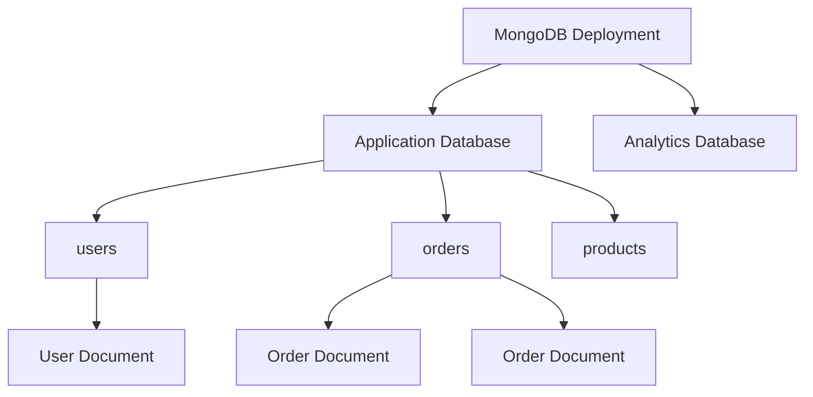
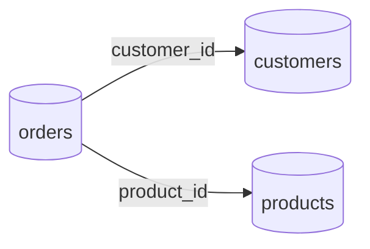
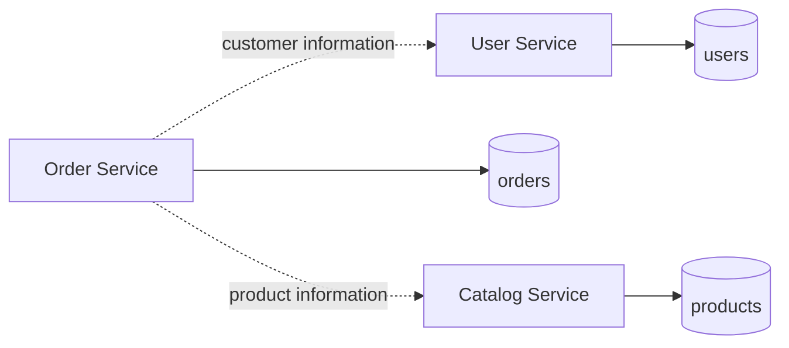

# 02- Databases Collections and Documents

## Overview

MongoDB organizes data into **databases, collections, and documents** rather than relational tables and rows.

The logical hierarchy is:

```text
MongoDB deployment
    └── Database
        └── Collection
            └── Document
                └── Field
```

The important engineering difference is that a MongoDB document is not merely a row equivalent. A document can contain nested documents and arrays, allowing related data to be stored together when the application's access pattern benefits from that design.

A production MongoDB schema therefore starts with questions such as:

- What data belongs together?
- What is normally read together?
- What changes together?
- What grows independently?
- Which data requires independent lifecycle management?
- Which fields will be queried or sorted?
- Which relationships justify references instead of embedding?
- What document growth and indexing implications will the design create?

Understanding these boundaries is foundational to effective MongoDB data modeling.

---

## MongoDB's Logical Data Hierarchy

A MongoDB deployment can contain multiple databases. Each database can contain multiple collections, and each collection contains documents.



At the application level:

```text
Database
    Collection
        Document
            Field
                Value
```

For example:

```text
commerce
    users
        user document
    products
        product document
    orders
        order document
```

This hierarchy is simple, but the design decisions inside each level have significant production consequences.

---

## Databases

### What Is a Database?

A MongoDB database is a logical container for collections and database-level configuration.

For example:

```text
commerce
    users
    products
    orders
```

The database name identifies the logical application data domain.

MongoDB can host multiple databases in one deployment:

```text
MongoDB Server
    |
    +-- commerce
    +-- analytics
    +-- reporting
```

### When to Use Multiple Databases

Multiple databases can be useful when there is a genuine isolation boundary.

Examples include:

- Separate application domains
- Different security requirements
- Separate operational ownership
- Independent data lifecycle requirements
- Multi-tenant isolation requirements in specific architectures
- Separate testing or development environments

Do not create a database for every logical entity.

This:

```text
commerce
    users
    orders
    products
```

is generally more natural than:

```text
users_db
orders_db
products_db
```

unless there is a strong architectural reason for the separation.

---

## Database Selection in Python

With PyMongo:

```python
from pymongo import MongoClient

client = MongoClient(
    "mongodb://localhost:27017",
    serverSelectionTimeoutMS=5000,
)

db = client["commerce"]
```

Collections can then be accessed through the database object:

```python
users = db["users"]
orders = db["orders"]
products = db["products"]
```

A common production pattern is to create one long-lived `MongoClient` per application process rather than constructing a new client for every request.

```text
Application Process
        |
        v
   MongoClient
        |
        v
 Connection Pool
        |
        v
     MongoDB
```

The client manages connections to the MongoDB deployment.

---

## Creating Databases

MongoDB does not require an explicit database-creation command in the same way some relational databases do.

A database generally becomes visible after data is written.

For example:

```javascript
use commerce

db.users.insertOne({
    name: "Alice",
    email: "alice@example.com"
})
```

The write creates the collection if necessary and persists the database.

In production systems, however, database initialization should normally be handled through controlled application or deployment procedures rather than arbitrary manual shell commands.

---

## Database Naming

Use stable, predictable names.

For example:

```text
commerce
orders
identity
catalog
analytics
```

Avoid names that encode temporary environments directly into application logic:

```text
commerce_prod_final
commerce_new
commerce_test2
```

Environment-specific configuration should normally determine the database name.

For example:

```python
import os

database_name = os.environ["MONGODB_DATABASE"]
```

This allows the same application artifact to run against:

```text
commerce_dev
commerce_staging
commerce
```

without changing source code.

---

## Collections

### What Is a Collection?

A collection is a logical grouping of MongoDB documents.

Conceptually, it is similar to a relational table, but the similarity should not be taken too far.

A relational table usually has a relatively stable schema:

```text
users
--------------------------------
id | name | email | created_at
```

A MongoDB collection contains documents:

```json
{
  "_id": "user-1",
  "name": "Alice",
  "email": "alice@example.com"
}
```

and potentially:

```json
{
  "_id": "user-2",
  "name": "Bob",
  "email": "bob@example.com",
  "department": "Engineering"
}
```

The second document can contain fields that the first document does not.

That flexibility is useful, but uncontrolled variation is dangerous.

---

## Collection Design

A collection should normally represent a meaningful aggregate of documents that share:

- Similar access patterns
- Similar lifecycle
- Similar operational characteristics
- Similar security requirements
- Similar indexing requirements

For example:

```text
orders
```

is a natural collection when an application frequently queries orders independently.

A collection containing unrelated entities is usually harder to maintain:

```text
application_data
    users
    orders
    payments
    logs
    products
```

Avoid creating a generic collection merely because MongoDB allows heterogeneous documents.

---

## Creating Collections

Collections can be created explicitly:

```javascript
use commerce

db.createCollection("users")
```

They can also be created implicitly when a document is inserted:

```javascript
db.users.insertOne({
    name: "Alice",
    email: "alice@example.com"
})
```

Explicit collection creation can be useful when you need collection-specific configuration or validation.

For example:

```javascript
db.createCollection("users", {
    validator: {
        $jsonSchema: {
            bsonType: "object",
            required: ["email", "name"],
            properties: {
                email: {
                    bsonType: "string"
                },
                name: {
                    bsonType: "string"
                }
            }
        }
    }
})
```

This allows MongoDB itself to enforce part of the expected document structure.

---

## Collection Types

Most backend applications primarily use normal collections.

MongoDB also provides specialized collection capabilities such as:

- Capped collections
- Time series collections
- Collections participating in sharded deployments

The correct collection type depends on workload characteristics.

For example, time-series workloads have different access patterns from normal transactional documents.

Do not choose a specialized collection simply because it sounds optimized. Validate that its semantics match the workload.

---

## Documents

### What Is a Document?

A document is MongoDB's primary data unit.

Example:

```json
{
  "_id": "ORD-1001",
  "customer_id": "CUS-100",
  "status": "paid",
  "total": 2999,
  "created_at": "2026-09-20T10:30:00Z"
}
```

Unlike a relational row, the document can contain nested structures:

```json
{
  "_id": "ORD-1001",
  "customer": {
    "id": "CUS-100",
    "name": "Alice"
  },
  "items": [
    {
      "product_id": "P-100",
      "name": "Keyboard",
      "quantity": 2
    }
  ]
}
```

This is one of MongoDB's most important design capabilities.

---

## Fields

Fields are named values inside a document.

```json
{
  "name": "Alice",
  "active": true,
  "age": 32
}
```

The fields are:

```text
name
active
age
```

Fields can contain scalar values:

```json
{
  "name": "Alice"
}
```

Nested documents:

```json
{
  "address": {
    "city": "Kolkata",
    "country": "India"
  }
}
```

Arrays:

```json
{
  "roles": [
    "developer",
    "team-lead"
  ]
}
```

Arrays of documents:

```json
{
  "orders": [
    {
      "id": "ORD-1",
      "total": 1000
    },
    {
      "id": "ORD-2",
      "total": 2000
    }
  ]
}
```

This hierarchical structure is central to MongoDB's document model.

---

## Nested Documents

Nested documents allow related information to be stored directly inside a parent document.

```json
{
  "_id": "user-100",
  "name": "Alice",
  "profile": {
    "department": "Engineering",
    "location": {
      "city": "Kolkata",
      "country": "India"
    }
  }
}
```

The nested fields can be queried directly:

```javascript
db.users.find({
    "profile.location.city": "Kolkata"
})
```

The dot notation identifies nested fields.

Nested documents are especially useful when the child information:

- Belongs to the parent
- Is usually read with the parent
- Has bounded size
- Has no independent lifecycle

---

## Arrays

Arrays represent ordered collections of values.

```json
{
  "name": "Alice",
  "roles": [
    "developer",
    "team-lead"
  ]
}
```

Arrays can contain documents:

```json
{
  "name": "Alice",
  "skills": [
    {
      "name": "Python",
      "level": "advanced"
    },
    {
      "name": "MongoDB",
      "level": "intermediate"
    }
  ]
}
```

Arrays are powerful because MongoDB can query their contents without requiring a separate collection.

However, arrays must be modeled carefully.

---

## Bounded vs Unbounded Arrays

This distinction is critical.

A bounded array might be:

```json
{
  "roles": [
    "developer",
    "team-lead"
  ]
}
```

The number of roles is naturally small.

An unbounded array might be:

```json
{
  "events": [
    "... thousands or millions of events ..."
  ]
}
```

The document can eventually become excessively large.

For high-volume events, prefer:

```text
users
events
```

rather than:

```text
users
    events[]
```

when events grow independently.

### Engineering Rule

> Embed bounded child data when it benefits the access pattern; avoid embedding unbounded collections.

---

## The `_id` Field

Every MongoDB document normally has an `_id` field that uniquely identifies it within its collection.

Example:

```json
{
  "_id": "user-100",
  "name": "Alice"
}
```

If an application does not provide `_id`, the MongoDB driver commonly generates an ObjectId.

Example:

```python
from bson import ObjectId

document = {
    "name": "Alice",
    "email": "alice@example.com",
}

result = db.users.insert_one(document)

print(result.inserted_id)
```

The `_id` field has an index by default.

This allows efficient lookup:

```javascript
db.users.findOne({
    _id: ObjectId("665c1e5d4f8e2a0012345678")
})
```

---

## Choosing an Identifier Strategy

MongoDB does not require applications to use ObjectId.

Possible identifiers include:

| Identifier | Characteristics |
|---|---|
| ObjectId | MongoDB-native, compact, convenient |
| UUID | Standardized globally unique identifier |
| ULID | Sortable identifier with useful temporal characteristics |
| Business ID | Meaningful domain identifier |
| Numeric ID | Simple but requires careful uniqueness management |

For example:

```json
{
  "_id": "ORD-2026-000001"
}
```

may be appropriate for an order identifier if the application explicitly needs a business-facing ID.

A common pattern is to separate internal and external identifiers:

```json
{
  "_id": ObjectId("665c1e5d4f8e2a0012345678"),
  "order_number": "ORD-2026-000001"
}
```

This keeps database identity separate from business identity.

---

## Document Identity and Idempotency

Stable document identifiers are particularly important in backend systems.

Suppose an API receives:

```text
POST /payments
```

and the client retries because of a network timeout.

If the operation can safely be retried, an idempotency key can be associated with a document:

```json
{
  "_id": "payment-request-abc123",
  "order_id": "ORD-1001",
  "amount": 5000,
  "status": "completed"
}
```

A unique index can then prevent accidental duplicate creation.

This illustrates how MongoDB document identity can participate in application-level reliability patterns.

---

## Embedding Documents

Consider a user profile:

```json
{
  "_id": "user-100",
  "name": "Alice",
  "address": {
    "city": "Kolkata",
    "country": "India"
  }
}
```

Embedding is often appropriate when the address is:

- Owned by the user
- Retrieved with the user
- Updated as part of the user profile
- Bounded in size
- Not independently referenced by many other entities

The document becomes a natural aggregate.

---

## Referencing Documents

Instead of embedding, documents can reference other documents.

Users:

```json
{
  "_id": "user-100",
  "name": "Alice"
}
```

Orders:

```json
{
  "_id": "order-100",
  "customer_id": "user-100",
  "total": 5000
}
```

References are useful when:

- Child data grows independently
- Data is shared by many documents
- Child data has an independent lifecycle
- Duplication would be excessive
- The application frequently accesses the child independently

MongoDB supports references at the application modeling level and can also join data using aggregation features such as `$lookup`.

---

## Embedding vs Referencing

| Consideration | Embed | Reference |
|---|---|---|
| Read parent + child together | Excellent | Requires additional access |
| Child has independent lifecycle | Less suitable | Suitable |
| Child data is shared | Poor fit | Suitable |
| Bounded child data | Suitable | Suitable |
| Unbounded child data | Risky | Usually preferable |
| Duplication | Possible | Lower |
| Atomic update of aggregate | Strong | More complex |
| Document size growth | Risk | Lower |
| Independent querying | Less convenient | Better |

There is no universal rule.

The correct decision depends on:

```text
Access patterns
+
Data ownership
+
Cardinality
+
Growth
+
Update frequency
+
Consistency requirements
```

---

## Collection Boundaries and Aggregates

A useful way to reason about MongoDB collections is through business aggregates.

For an e-commerce application:

```text
Customer
    |
    +-- Profile

Order
    |
    +-- Customer reference
    +-- Order items
    +-- Payment state
```

An order may be a natural aggregate because its items and status are frequently accessed together.

The product catalog may remain a separate collection because products have an independent lifecycle.



This does not mean every application should use exactly this structure. The model must follow actual access patterns.

---

## Access-Pattern-Driven Collection Design

MongoDB modeling should start from operations rather than tables.

Suppose the application frequently performs:

```text
Get order by order ID
Get recent orders for customer
Get order with all line items
Update order status
```

A useful document might be:

```json
{
  "_id": "ORD-1001",
  "customer_id": "CUS-100",
  "status": "paid",
  "created_at": "2026-09-20T10:00:00Z",
  "items": [
    {
      "product_id": "P-10",
      "name": "Keyboard",
      "price": 1499,
      "quantity": 2
    }
  ]
}
```

The design supports the dominant order access patterns without requiring an additional query for each line item.

---

## Document Growth

Document growth should be considered before production.

A document may begin as:

```json
{
  "_id": "user-100",
  "name": "Alice",
  "sessions": []
}
```

If the application continuously appends sessions:

```json
{
  "_id": "user-100",
  "sessions": [
    {},
    {},
    {},
    "... thousands more ..."
  ]
}
```

the document becomes increasingly expensive to maintain.

Potential consequences include:

- Larger document reads
- Larger writes
- Increased memory consumption
- Larger indexes if the array is indexed
- Increased contention around frequently modified documents
- Approaching MongoDB's document size limit

A better model may be:

```text
users
sessions
```

with:

```json
{
  "_id": "session-1001",
  "user_id": "user-100",
  "created_at": "2026-09-20T10:00:00Z"
}
```

---

## Hot Documents

A hot document is a document that receives unusually frequent reads or writes.

For example:

```json
{
  "_id": "global-counter",
  "count": 98273421
}
```

If thousands of concurrent workers update the same document, that document can become a contention point.

Possible strategies include:

- Partitioning counters
- Bucketing
- Aggregating asynchronously
- Redesigning write patterns
- Using Redis for appropriate transient counters
- Using event streams for high-volume processing

Do not assume that moving a workload into MongoDB automatically removes contention.

---

## Schema Evolution

MongoDB's flexible schema makes gradual schema evolution possible.

Suppose older documents contain:

```json
{
  "name": "Alice"
}
```

and newer documents contain:

```json
{
  "name": "Alice",
  "status": "active"
}
```

The application may temporarily support both forms:

```python
status = document.get("status", "active")
```

However, indefinite compatibility logic creates technical debt.

A production migration strategy should consider:

```text
Old schema
    |
    v
Compatibility period
    |
    v
Backfill / migration
    |
    v
New schema
    |
    v
Remove legacy behavior
```

Schema evolution should therefore be treated as an explicit engineering process.

---

## Schema Validation

Flexible documents do not mean validation should be abandoned.

MongoDB can enforce validation rules using JSON Schema.

Example:

```javascript
db.createCollection("users", {
  validator: {
    $jsonSchema: {
      bsonType: "object",
      required: ["name", "email"],
      properties: {
        name: {
          bsonType: "string"
        },
        email: {
          bsonType: "string"
        }
      }
    }
  }
})
```

Application-level validation can complement database validation:

```text
HTTP Request
    |
    v
Pydantic / Serializer
    |
    v
Business Validation
    |
    v
MongoDB Schema Validation
    |
    v
Storage
```

This provides defense in depth.

---

## Collection-Level Indexing

Indexes belong to collections.

For example:

```javascript
db.orders.createIndex({
  customer_id: 1,
  created_at: -1
})
```

This index is designed around a specific query pattern:

```javascript
db.orders.find({
  customer_id: "CUS-100"
}).sort({
  created_at: -1
})
```

This illustrates why collection design, query design, and indexing cannot be separated completely.

A collection should be modeled with its expected access patterns and indexes in mind.

---

## Collection and Document Security

MongoDB authorization can operate at database and collection scopes depending on the role configuration.

For example:

```text
Application Service
        |
        v
MongoDB User
        |
        +-- commerce.orders
        +-- commerce.customers
```

A service should generally receive only the permissions it requires.

For microservices:

```text
Order Service
    |
    +-- orders access

Catalog Service
    |
    +-- products access
```

Avoid giving every application component unrestricted access to every database and collection.

---

## Collections in Microservices

A service-owned database or collection boundary can help maintain service ownership.

For example:



A service should generally avoid directly modifying another service's collections.

If the Order Service needs product information, appropriate patterns include:

- API calls
- Events
- Replicated read models
- Deliberate denormalization

Direct database coupling between services makes independent deployment and schema evolution more difficult.

---

## MongoDB Collections vs PostgreSQL Tables

The conceptual differences are useful when moving between databases.

| Concept | MongoDB | PostgreSQL |
|---|---|---|
| Logical container | Collection | Table |
| Record | Document | Row |
| Attribute | Field | Column |
| Nested structure | Embedded document | Composite/JSON structure |
| Array | Array field | Array/related rows |
| Identifier | `_id` | Primary key |
| Relationship | Embedded/reference | Foreign key |
| Schema enforcement | Flexible + optional validation | Strong schema |
| Join | `$lookup` or application logic | SQL JOIN |
| Index | Collection index | Table index |

The important point is that a MongoDB collection should not automatically be treated as a table with JSON columns.

The document model changes how data should be modeled.

---

## Practical Python Example

A repository can expose collection access without leaking MongoDB configuration throughout the application:

```python
from pymongo import MongoClient
from pymongo.collection import Collection


class MongoDatabase:
    def __init__(self, client: MongoClient, database_name: str) -> None:
        self.database = client[database_name]

    @property
    def users(self) -> Collection:
        return self.database["users"]

    @property
    def orders(self) -> Collection:
        return self.database["orders"]
```

Application code can then work with the repository or database abstraction:

```python
result = mongo.users.insert_one(
    {
        "name": "Alice",
        "email": "alice@example.com",
        "roles": ["developer"],
    }
)

print(result.inserted_id)
```

The application does not need to repeatedly construct:

```python
client["commerce"]["users"]
```

throughout the codebase.

---

## FastAPI Application Lifecycle

For a FastAPI application, MongoClient should generally have an application-level lifecycle.

A simplified example:

```python
from contextlib import asynccontextmanager

from fastapi import FastAPI
from pymongo import MongoClient

client = MongoClient(
    "mongodb://localhost:27017",
    serverSelectionTimeoutMS=5000,
)


@asynccontextmanager
async def lifespan(app: FastAPI):
    client.admin.command("ping")
    yield
    client.close()


app = FastAPI(lifespan=lifespan)
```

The exact application architecture can be more elaborate, but the important principle is that the client should be long-lived and shared appropriately within the application process.

---

## Operational Considerations

### Database Size

Monitor:

- Database size
- Collection size
- Index size
- Document growth
- Storage utilization

### Collection Growth

Track rapidly growing collections such as:

```text
events
logs
audit_records
sessions
```

These may require:

- Retention policies
- TTL indexes
- Archival
- Partitioning strategies
- Separate operational databases

### Document Size

Large documents can increase:

- Network transfer
- Memory consumption
- Read latency
- Write cost

Keep documents focused on the data needed by their access patterns.

### Index Growth

An indexed collection can consume significantly more storage than its raw document data.

Monitor index size and remove indexes that provide no meaningful workload benefit.

---

## Common Mistakes

### Treating Collections as Tables

Bad approach:

```text
One relational table = One MongoDB collection
```

This may work for simple migrations but often fails to exploit MongoDB's document model.

Start with access patterns instead.

### Embedding Everything

Embedding reduces additional queries, but it can create oversized documents.

Do not embed data merely because embedding is supported.

### Referencing Everything

The opposite mistake is recreating normalized relational schemas inside MongoDB.

If data is always retrieved together and has bounded growth, excessive references can introduce unnecessary application-side joins.

### Unbounded Arrays

Avoid arrays whose size grows indefinitely.

### Inconsistent Field Types

Do not allow the same field to represent different types:

```json
{ "status": "active" }
```

and:

```json
{ "status": 1 }
```

Inconsistent types make queries, indexes, validation, and application logic harder to reason about.

### Overusing Multiple Databases

Creating many databases without a real isolation requirement adds operational complexity.

### Sharing Collections Across Microservices

Direct collection access by unrelated services creates tight coupling to another service's persistence model.

### Creating Indexes Without Query Requirements

Every index should have a workload justification.

### Ignoring Document Growth

A document can start small and become problematic months later.

Model for long-term growth rather than today's dataset.

---

## Design Decision Checklist

Before creating a new collection, ask:

| Question | Why it matters |
|---|---|
| What entity or aggregate does this represent? | Defines ownership |
| What are the primary read patterns? | Drives document structure |
| What are the primary write patterns? | Determines update boundaries |
| What data is always read together? | Candidate for embedding |
| What data grows independently? | Candidate for referencing |
| Is the child collection bounded? | Prevents document-growth problems |
| Which fields are queried? | Drives index design |
| Which fields are sorted? | Influences compound indexes |
| What changes atomically? | Helps define document boundaries |
| Who owns this data? | Important for service architecture |
| How will the schema evolve? | Prevents migration debt |
| What happens at 10x current volume? | Tests scalability |

---

## Production Design Example

Consider an order system.

### Requirements

The system needs to:

- Retrieve an order by ID
- Retrieve recent orders for a customer
- Display order items with the order
- Update order status
- Preserve historical item information
- Handle a large number of orders

A possible model is:

```json
{
  "_id": "ORD-1001",
  "customer_id": "CUS-100",
  "status": "paid",
  "created_at": "2026-09-20T10:00:00Z",
  "items": [
    {
      "product_id": "P-100",
      "name": "Keyboard",
      "unit_price": 1499,
      "quantity": 2
    }
  ],
  "total": 2998
}
```

Potential index:

```javascript
db.orders.createIndex({
  customer_id: 1,
  created_at: -1
})
```

The design intentionally:

- Embeds bounded order items
- References the customer
- Stores historical product information
- Keeps the order as an independently retrievable aggregate
- Supports customer order-history queries through an appropriate index

This is a more MongoDB-oriented model than creating separate collections for every nested concept simply because relational databases would normally use multiple tables.

---

## Key Takeaways

- MongoDB organizes data into databases, collections, and documents, with documents supporting nested objects and arrays as first-class structures.
- Collection and document boundaries should be driven by access patterns, lifecycle, cardinality, growth, and consistency requirements rather than by mechanically translating relational tables.
- Embedding is effective for bounded data that is frequently accessed and modified with its parent; referencing is generally better for independently growing, shared, or independently managed data.
- Document growth, unbounded arrays, inconsistent field types, and uncontrolled schema flexibility are common sources of long-term MongoDB problems.
- Database, collection, document, index, and service boundaries should be designed together so that application architecture, security, performance, and operational behavior remain aligned.