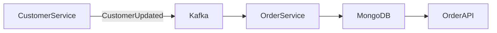

# 04- Embedded Documents

## Overview

Embedded documents are one of MongoDB's primary data-modeling mechanisms. Instead of storing related data in separate collections and joining it at query time, related data can be stored directly inside the parent document.

For example:

```json
{
  "_id": "ORD-1001",
  "customer": {
    "id": "CUS-1001",
    "name": "Alice",
    "email": "alice@example.com"
  },
  "shipping_address": {
    "line1": "12 Park Street",
    "city": "Kolkata",
    "country": "India"
  },
  "status": "confirmed"
}
```

The order contains the customer snapshot and shipping address as embedded documents.

Embedded documents are not simply a convenient JSON feature. They are a deliberate data-modeling choice based on access patterns, cardinality, update frequency, document growth, consistency requirements, and operational constraints.

The central design question is:

> Should related data be read and updated together often enough that storing it together produces a better operational model?

When the answer is yes, embedding is often appropriate.

---

## What Is an Embedded Document?

An embedded document is a BSON document stored as a field inside another MongoDB document.

Example:

```json
{
  "_id": "USR-1001",
  "name": "Alice",
  "profile": {
    "department": "Engineering",
    "location": {
      "city": "Kolkata",
      "country": "India"
    }
  }
}
```

Here:

```text
users
  |
  +-- document
       |
       +-- name
       |
       +-- profile
            |
            +-- department
            |
            +-- location
                 |
                 +-- city
                 +-- country
```

The embedded document is stored as part of the same BSON document.

There is no separate database-level identity for `profile` unless the application explicitly creates one.

---

## Why MongoDB Supports Embedding

Relational database design commonly separates related entities into tables:

```text
users
orders
addresses
order_items
```

and reconstructs relationships using joins.

MongoDB allows the same business model to be represented around access patterns.

For example, if an order is almost always retrieved together with its shipping address, the address can be embedded:

```json
{
  "_id": "ORD-1001",
  "shipping_address": {
    "line1": "12 Park Street",
    "city": "Kolkata",
    "postal_code": "700016"
  }
}
```

A single document read can retrieve the complete order representation.

This can reduce:

- Application-side joins
- Multiple database round trips
- Cross-service coordination
- Query complexity
- Latency for common read paths

Embedding is therefore primarily a **data-access optimization and consistency design decision**, not merely a storage preference.

---

## Embedding vs Referencing

MongoDB generally provides two broad approaches for modeling relationships:

```text
Embedding
    |
    +-- Store related data inside the parent document

Referencing
    |
    +-- Store an identifier pointing to another document
```

Example embedding:

```json
{
  "_id": "USR-1001",
  "address": {
    "city": "Kolkata",
    "country": "India"
  }
}
```

Example referencing:

```json
{
  "_id": "USR-1001",
  "address_id": "ADDR-5001"
}
```

with another document:

```json
{
  "_id": "ADDR-5001",
  "city": "Kolkata",
  "country": "India"
}
```

The correct choice depends on how the data is used.

---

## When to Embed

Embedding is generally attractive when:

- Parent and child data are usually read together.
- The child data has bounded growth.
- The child belongs strongly to the parent.
- The child does not need independent lifecycle management.
- Updates normally happen together.
- Atomic updates across the related data are useful.
- Duplication is acceptable.
- The document remains comfortably below MongoDB's BSON document-size limit.

Typical examples include:

- User profile settings
- Shipping addresses stored as order snapshots
- Product specifications
- Configuration objects
- Contact information
- Small preference collections
- Invoice metadata
- Bounded arrays of line items

---

## When Not to Embed

Embedding becomes problematic when:

- The embedded array can grow without a practical bound.
- Child records are independently queried frequently.
- Child records have their own lifecycle.
- The same child is shared by many parents.
- The child is updated independently at high frequency.
- The parent becomes a hot document.
- Document growth causes excessive write amplification.
- The embedded structure approaches MongoDB's document-size limit.

In these cases, referencing or a separate collection may be more appropriate.

---

## Embedded Document Lifecycle

An embedded document generally shares the lifecycle of its parent.

For example:

```json
{
  "_id": "USR-1001",
  "profile": {
    "phone": "+91-9000000000",
    "city": "Kolkata"
  }
}
```

Deleting the user naturally removes the embedded profile because there is no separate profile document.

This provides a useful ownership model:

```text
User
 |
 +-- Profile
 +-- Preferences
 +-- Settings
```

If those components have no meaningful independent lifecycle, embedding often expresses the domain more directly.

---

## One-to-One Relationships

One-to-one relationships are often strong candidates for embedding.

Suppose a customer has one profile:

```json
{
  "_id": "CUS-1001",
  "name": "Alice",
  "profile": {
    "timezone": "Asia/Kolkata",
    "language": "en",
    "marketing_opt_in": true
  }
}
```

This is often preferable to:

```text
customers
profiles
```

when the profile:

- Is always retrieved with the customer
- Is not shared
- Has bounded size
- Has no independent access pattern

---

## One-to-Many Relationships

One-to-many relationships require more careful analysis.

A bounded relationship can often be embedded.

Example:

```json
{
  "_id": "USR-1001",
  "email": "alice@example.com",
  "addresses": [
    {
      "type": "home",
      "city": "Kolkata"
    },
    {
      "type": "office",
      "city": "Bengaluru"
    }
  ]
}
```

This works well when the number of addresses is naturally bounded.

However, an unbounded relationship such as:

```text
user -> millions of events
```

should generally not be embedded into one user document.

Prefer:

```text
users
events
```

with an indexed reference such as:

```json
{
  "user_id": "USR-1001",
  "created_at": "..."
}
```

---

## Arrays of Embedded Documents

Arrays are one of the most common forms of embedding.

Example:

```json
{
  "_id": "ORD-1001",
  "items": [
    {
      "product_id": "PROD-100",
      "name": "Keyboard",
      "quantity": 2,
      "unit_price": 1499.99
    },
    {
      "product_id": "PROD-200",
      "name": "Mouse",
      "quantity": 1,
      "unit_price": 799.00
    }
  ]
}
```

This model is effective because an order's items are normally read together with the order.

It also captures an important business requirement: the order can preserve a historical snapshot of the product information and price at the time of purchase.

---

## Embedding and Historical Snapshots

Embedding can deliberately duplicate data.

Consider an order:

```json
{
  "_id": "ORD-1001",
  "customer": {
    "id": "CUS-1001",
    "name": "Alice",
    "email": "alice@example.com"
  }
}
```

The customer's current profile may later change.

The order can intentionally preserve the original values:

```text
Customer collection
    |
    +-- Current customer state

Order document
    |
    +-- Historical customer snapshot
```

This is **controlled denormalization**.

It is appropriate when historical correctness is more important than avoiding duplication.

For financial records, invoices, audit records, and orders, preserving historical state is often more important than maintaining a single canonical copy of every descriptive field.

---

## Embedding and Controlled Denormalization

Denormalization means intentionally storing duplicate information to optimize access patterns.

For example:

```json
{
  "_id": "POST-100",
  "author": {
    "id": "USR-100",
    "name": "Alice"
  },
  "title": "MongoDB Data Modeling"
}
```

The canonical user document may also contain:

```json
{
  "_id": "USR-100",
  "name": "Alice"
}
```

Now the author's name exists in two places.

This is acceptable if:

- The duplicated field changes infrequently.
- The read path benefits significantly.
- Eventual consistency is acceptable.
- The application has a clear update strategy.

Denormalization becomes dangerous when duplication is accidental rather than intentional.

---

## Data Ownership

A useful senior-level question is:

> Who owns this embedded data?

For:

```json
{
  "_id": "ORD-1001",
  "shipping_address": {
    "line1": "12 Park Street",
    "city": "Kolkata"
  }
}
```

the order owns the shipping address snapshot.

The address does not necessarily represent the customer's current address.

This distinction matters.

Compare:

```text
Customer current address
```

with:

```text
Order shipping address at purchase time
```

They may have similar fields but different ownership and lifecycle semantics.

Embedding is often the right choice when the child is a value belonging to the aggregate rather than an independently managed entity.

---

## Embedded Documents and Aggregate Boundaries

MongoDB's document boundary can be treated as an important application-level aggregate boundary.

For example:

```text
Order
 |
 +-- Customer snapshot
 +-- Shipping address
 +-- Billing address
 +-- Items
 +-- Payment summary
```

If these values need to be updated atomically as one business operation, keeping them in the same document can simplify consistency.

This aligns naturally with MongoDB's single-document atomicity.

A useful design principle is:

> Model a document around the data that should commonly be read and modified together.

This does not mean every business entity must become one MongoDB document. The aggregate boundary should be based on actual access and consistency requirements.

---

## Nested Documents and Querying

Embedded fields can be queried using dot notation.

Example:

```javascript
db.orders.find({
  "shipping_address.city": "Kolkata"
})
```

Nested fields can also be projected:

```javascript
db.orders.find(
  {},
  {
    "shipping_address.city": 1,
    "shipping_address.postal_code": 1
  }
)
```

And indexed:

```javascript
db.orders.createIndex({
  "shipping_address.city": 1
})
```

The nested structure therefore remains queryable without requiring application-side traversal.

---

## Querying Arrays of Embedded Documents

Consider:

```json
{
  "_id": "ORD-1001",
  "items": [
    {
      "product_id": "PROD-100",
      "quantity": 2,
      "price": 1499
    },
    {
      "product_id": "PROD-200",
      "quantity": 1,
      "price": 799
    }
  ]
}
```

A query such as:

```javascript
db.orders.find({
  "items.product_id": "PROD-100"
})
```

can find orders containing the product.

When multiple conditions must apply to the same array element, use `$elemMatch`:

```javascript
db.orders.find({
  items: {
    $elemMatch: {
      product_id: "PROD-100",
      quantity: {
        $gte: 2
      }
    }
  }
})
```

This is important because independently matching conditions against an array can produce results where the conditions are satisfied by different array elements.

---

## Indexing Embedded Fields

Embedded fields can be indexed directly.

Example:

```javascript
db.users.createIndex({
  "profile.department": 1
})
```

For embedded arrays, MongoDB may create a multikey index.

Example:

```javascript
db.orders.createIndex({
  "items.product_id": 1
})
```

Before creating the index, verify the actual query pattern.

An index should exist because a production workload requires it, not merely because a field exists.

---

## Embedded Documents and Compound Indexes

Suppose the common query is:

```javascript
db.orders.find({
  status: "confirmed",
  "shipping_address.city": "Kolkata"
})
```

A compound index may be appropriate:

```javascript
db.orders.createIndex({
  status: 1,
  "shipping_address.city": 1
})
```

The exact index should be validated with `explain()` against real workloads.

Index design should follow:

```text
Access pattern
      |
      v
Query shape
      |
      v
Index design
      |
      v
Explain plan
      |
      v
Production measurement
```

Do not blindly create indexes for every nested field.

---

## Document Growth

One of the biggest risks of embedding is uncontrolled document growth.

Consider:

```json
{
  "_id": "USR-1001",
  "events": [
    {},
    {},
    {},
    "... millions of entries ..."
  ]
}
```

This design becomes problematic because the parent document continuously grows.

Potential consequences include:

- Larger reads
- Larger writes
- Increased memory pressure
- Increased network payload
- More expensive document rewrites
- Larger index entries
- Hot-document contention
- Risk of exceeding MongoDB's BSON document-size limit

A bounded embedded collection is generally safer.

---

## Bounded vs Unbounded Arrays

This distinction is fundamental.

### Bounded

```text
User
 └── addresses
      ├── home
      ├── office
      └── billing
```

The number of entries has a practical upper bound.

Embedding is often reasonable.

### Unbounded

```text
User
 └── events
      ├── event 1
      ├── event 2
      ├── ...
      └── event N
```

There is no practical bound.

A separate collection is usually safer.

A useful rule is:

> If an array can grow indefinitely, do not embed it merely because it is currently small.

---

## Hot Documents

A hot document is a document that receives a disproportionately high number of concurrent reads or writes.

Example:

```json
{
  "_id": "COUNTER-1",
  "count": 100000000
}
```

If thousands of workers repeatedly update the same document:

```text
Worker 1 ----\
Worker 2 -----\
Worker 3 ------> same document
Worker N -----/
```

the document becomes a contention point.

Embedding more frequently updated data into the same document can make the problem worse.

Potential solutions include:

- Splitting frequently updated data
- Using separate counter documents
- Bucketing
- Queue-based aggregation
- Redis for appropriate transient counters
- Event-based aggregation
- Redesigning the access pattern

Embedding should not force unrelated high-frequency updates into one document.

---

## Write Amplification

Suppose a document contains:

```json
{
  "_id": "USER-1001",
  "profile": {},
  "preferences": {},
  "settings": {},
  "large_embedded_array": []
}
```

A small update to one part of the document can still create operational overhead because the logical unit being modified is the parent document.

Embedding many independently changing datasets into one document can therefore increase write amplification and contention.

If components have very different update frequencies, consider separating them.

For example:

```text
users
user_preferences
user_activity
```

may be preferable to putting all three into one constantly changing document.

---

## Read Performance

Embedding can make read paths very efficient.

Instead of:

```text
GET /orders/1001
      |
      +-- Query orders
      |
      +-- Query customer
      |
      +-- Query address
      |
      +-- Query items
```

one document can provide the complete response:

```text
GET /orders/1001
      |
      v
MongoDB
      |
      v
Order document
      |
      +-- Customer snapshot
      +-- Address
      +-- Items
```

This can reduce round trips and simplify service logic.

However, the benefit disappears if the embedded document becomes unnecessarily large and every query retrieves fields that are not required.

Projection still matters.

---

## Projection with Embedded Documents

Suppose the document is:

```json
{
  "_id": "USR-1001",
  "name": "Alice",
  "profile": {
    "bio": "... large content ...",
    "preferences": {},
    "location": {
      "city": "Kolkata"
    }
  }
}
```

If an endpoint only needs the city:

```javascript
db.users.find(
  {
    _id: "USR-1001"
  },
  {
    "profile.location.city": 1
  }
)
```

Returning only required fields can reduce:

- Network transfer
- Driver decoding work
- Application memory
- API serialization overhead

---

## Embedding and Atomicity

MongoDB provides atomicity at the single-document level.

This is a major advantage of embedding.

Suppose an order contains:

```json
{
  "_id": "ORD-1001",
  "status": "confirmed",
  "payment": {
    "status": "paid"
  }
}
```

A business operation can update related fields within the same document atomically.

For example:

```javascript
db.orders.updateOne(
  { _id: "ORD-1001" },
  {
    $set: {
      status: "confirmed",
      "payment.status": "paid"
    }
  }
)
```

This can avoid a multi-document transaction.

That does not mean embedding eliminates all consistency concerns. External systems such as payment providers, Kafka, Redis, or other microservices still introduce distributed consistency problems.

---

## Embedding vs Transactions

A useful modeling sequence is:

```text
Can related data live in one document?
        |
       Yes
        |
        v
Can the operation remain single-document atomic?
        |
       Yes
        |
        v
Embedding may simplify the design
```

If data must remain in separate documents because of cardinality, ownership, or independent lifecycle requirements, transactions may sometimes be appropriate.

Do not introduce transactions merely because two pieces of data are conceptually related.

First determine whether the data should have been modeled as one aggregate.

---

## Embedding in Microservices

Embedding is particularly useful when the embedded data belongs to the service's aggregate boundary.

For example, an Order Service might own:

```text
orders
 |
 +-- order metadata
 +-- line items
 +-- shipping snapshot
 +-- billing snapshot
```

The Customer Service may own:

```text
customers
 |
 +-- current customer profile
```

The order should not necessarily query Customer Service every time it needs to render historical order details.

Instead, the Order Service can store the required snapshot.

This reduces runtime coupling:

```text
Order API
   |
   v
Order Service
   |
   v
MongoDB
```

rather than:

```text
Order API
   |
   v
Order Service
   |
   +------> Customer Service
   |
   +------> Address Service
   |
   +------> Product Service
```

However, duplicated data creates synchronization responsibilities. Those responsibilities should be explicit.

---

## Embedding and Event-Driven Synchronization

When denormalized embedded data must reflect changes from another service, events can be used.

Example:



For example:

```text
CustomerUpdated
      |
      v
Kafka
      |
      v
Order Service
      |
      v
Update embedded customer summary
```

This creates eventual consistency.

The consumer must be:

- Idempotent
- Retry-safe
- Observable
- Able to handle duplicate events
- Able to tolerate out-of-order events where necessary

Embedding does not remove distributed-systems problems when duplicated data crosses service boundaries.

---

## Embedding and Schema Evolution

Embedded documents evolve over time.

Initial version:

```json
{
  "profile": {
    "name": "Alice"
  }
}
```

Later:

```json
{
  "profile": {
    "name": "Alice",
    "timezone": "Asia/Kolkata"
  }
}
```

MongoDB's schema flexibility makes gradual evolution possible.

An application may need to support both:

```text
profile.timezone exists
profile.timezone missing
```

during migration.

For important fields, schema validation can gradually enforce the new structure.

A safe migration often looks like:

```text
Deploy backward-compatible application
        |
        v
Backfill existing documents
        |
        v
Validate data
        |
        v
Enable stronger validation
        |
        v
Remove legacy application behavior
```

Avoid assuming that all documents can be migrated instantly in a large production collection.

---

## Schema Validation for Embedded Documents

MongoDB can validate nested document structure.

Example:

```javascript
db.createCollection("users", {
  validator: {
    $jsonSchema: {
      bsonType: "object",
      required: ["profile"],
      properties: {
        profile: {
          bsonType: "object",
          required: ["department"],
          properties: {
            department: {
              bsonType: "string"
            },
            location: {
              bsonType: "object",
              properties: {
                city: {
                  bsonType: "string"
                },
                country: {
                  bsonType: "string"
                }
              }
            }
          }
        }
      }
    }
  }
})
```

Application-level validation should still exist where business rules require richer validation.

Database validation provides a storage-level safety boundary rather than replacing domain validation.

---

## Embedded Documents vs Relational Normalization

Consider an order and address.

### Relational approach

```text
orders
    |
    +-- shipping_address_id
              |
              v
        addresses
```

The application may perform a join.

### Embedded approach

```json
{
  "_id": "ORD-1001",
  "shipping_address": {
    "line1": "12 Park Street",
    "city": "Kolkata",
    "postal_code": "700016"
  }
}
```

The choice depends on the business semantics.

If the address is a historical snapshot belonging to the order, embedding is often natural.

If addresses are independently managed entities shared across many records, referencing may be more appropriate.

---

## Practical Modeling Example: E-Commerce Order

A production-oriented order document might look like:

```json
{
  "_id": "ORD-1001",
  "customer_id": "CUS-1001",
  "status": "confirmed",
  "currency": "INR",
  "shipping_address": {
    "name": "Alice",
    "line1": "12 Park Street",
    "city": "Kolkata",
    "postal_code": "700016",
    "country": "IN"
  },
  "items": [
    {
      "product_id": "PROD-100",
      "name": "Mechanical Keyboard",
      "quantity": 2,
      "unit_price": 4999
    },
    {
      "product_id": "PROD-200",
      "name": "Wireless Mouse",
      "quantity": 1,
      "unit_price": 1999
    }
  ],
  "totals": {
    "subtotal": 11997,
    "tax": 2159,
    "grand_total": 14156
  }
}
```

This design embeds data that is:

- Naturally owned by the order
- Normally read with the order
- Bounded
- Useful for historical snapshots
- Suitable for atomic order-level updates

The current product catalog should remain independently managed.

---

## Alternative Modeling of the Same Order

The same domain could be represented with references:

```json
{
  "_id": "ORD-1001",
  "customer_id": "CUS-1001",
  "shipping_address_id": "ADDR-5001",
  "item_ids": [
    "ITEM-1",
    "ITEM-2"
  ]
}
```

with separate collections:

```text
orders
addresses
order_items
customers
```

This may be preferable if:

- Order items are independently queried.
- Items have an independent lifecycle.
- The same address entity is intentionally shared.
- Relationships are extremely large.
- Different services own the related entities.

The correct model is determined by access patterns and ownership rather than by a universal MongoDB rule.

---

## Large Embedded Documents

Large embedded documents can create multiple problems.

### Read Amplification

A query that needs one small field may retrieve a large document.

### Write Amplification

Small logical changes may involve a large document.

### Network Cost

Large documents consume more bandwidth.

### Cache Pressure

Large documents consume more memory in application and database caches.

### Replication Cost

Large writes are replicated across replica-set members.

### Operational Risk

Documents approaching the BSON size limit leave little room for future growth.

For these reasons, document size should be treated as a production design metric.

---

## Embedded Documents and Replication

MongoDB replica sets replicate writes through the oplog.

If a frequently changing large document is updated repeatedly, the resulting write workload can increase:

- Replication traffic
- Storage consumption
- Secondary processing
- Replication lag

This is another reason to avoid putting unrelated high-frequency updates into one large document.

A document model should consider not only application reads but also the downstream operational cost of writes.

---

## Embedded Documents and Change Streams

Change streams can observe updates to documents containing embedded data.

For example:

```text
Order document
    |
    +-- status
    +-- shipping_address
    +-- items
```

A change stream consumer can react when the order changes.

However, downstream consumers may need to determine exactly which nested field changed and whether the update should trigger an external action.

Event design should therefore distinguish between:

```text
Document changed
```

and:

```text
Business event occurred
```

A raw MongoDB change event is not automatically equivalent to a domain event.

---

## Embedded Documents in Python

PyMongo naturally maps embedded documents to Python dictionaries.

Example:

```python
from pymongo import MongoClient

client = MongoClient(
    "mongodb://localhost:27017",
    serverSelectionTimeoutMS=5_000,
)

db = client["shop"]
orders = db["orders"]

order = {
    "_id": "ORD-1001",
    "customer": {
        "id": "CUS-1001",
        "name": "Alice",
    },
    "shipping_address": {
        "city": "Kolkata",
        "country": "IN",
    },
}

orders.insert_one(order)
```

Nested fields can be updated without replacing the entire document:

```python
orders.update_one(
    {"_id": "ORD-1001"},
    {
        "$set": {
            "shipping_address.city": "Bengaluru",
        }
    },
)
```

This is generally preferable to reading the entire document, modifying it in Python, and writing the entire document back.

---

## Avoid Read-Modify-Write for Simple Nested Updates

Avoid:

```python
order = orders.find_one({"_id": "ORD-1001"})

order["shipping_address"]["city"] = "Bengaluru"

orders.replace_one(
    {"_id": "ORD-1001"},
    order,
)
```

when the operation can be expressed atomically in MongoDB.

Prefer:

```python
orders.update_one(
    {"_id": "ORD-1001"},
    {
        "$set": {
            "shipping_address.city": "Bengaluru",
        }
    },
)
```

The operator-based update:

- Reduces network transfer
- Avoids unnecessary replacement
- Better expresses intent
- Preserves unrelated concurrent changes more safely
- Uses MongoDB's atomic document update semantics

---

## FastAPI Repository Pattern

A repository can encapsulate embedded-document operations.

```python
from pymongo.collection import Collection


class OrderRepository:
    def __init__(self, collection: Collection):
        self.collection = collection

    def update_shipping_city(
        self,
        order_id: str,
        city: str,
    ) -> bool:
        result = self.collection.update_one(
            {"_id": order_id},
            {
                "$set": {
                    "shipping_address.city": city,
                }
            },
        )

        return result.modified_count == 1
```

The API layer should not need to understand MongoDB's storage representation beyond the repository contract.

---

## Embedded Documents and API Design

Do not automatically expose the exact MongoDB document structure as the public API.

Database:

```json
{
  "_id": "ORD-1001",
  "customer_snapshot": {
    "id": "CUS-1001",
    "display_name": "Alice"
  }
}
```

API:

```json
{
  "id": "ORD-1001",
  "customer": {
    "id": "CUS-1001",
    "name": "Alice"
  }
}
```

The API contract should represent business semantics rather than expose internal persistence decisions.

This gives the database model room to evolve without unnecessarily breaking clients.

---

## Embedded Documents and Security

Embedding sensitive data can increase the amount of data returned by ordinary document queries.

For example:

```json
{
  "profile": {
    "name": "Alice",
    "email": "alice@example.com",
    "internal_notes": "..."
  }
}
```

A broad query may retrieve fields that an API should never expose.

Use projection and explicit serialization:

```javascript
db.users.find(
  { _id: "USR-1001" },
  {
    "profile.name": 1,
    "profile.email": 1
  }
)
```

Security should be enforced at:

- Database permissions
- Repository/query layer
- Service layer
- API serialization layer

Do not rely on document structure alone for authorization.

---

## Common Mistakes

### Embedding Unbounded Arrays

Bad:

```json
{
  "_id": "USER-1",
  "activity": [
    "... indefinitely growing ..."
  ]
}
```

Use a separate collection or another bounded storage strategy.

### Embedding Shared Entities

If thousands of documents embed a frequently changing canonical entity, every update may require widespread synchronization.

### Embedding Frequently Updated Data

Putting independently changing data into one document can create contention and write amplification.

### Treating Duplication as Automatically Bad

Controlled duplication can be a deliberate and useful design decision.

The problem is **uncontrolled duplication**, not duplication itself.

### Treating Duplication as Automatically Safe

Duplicated data requires an explicit consistency strategy.

### Over-Nesting

Deeply nested documents can become difficult to query, validate, migrate, and understand.

### Ignoring Document Growth

A document that is small today may become dangerous as embedded arrays grow.

### Replacing Entire Documents Unnecessarily

Prefer targeted update operators when only specific nested fields change.

### Ignoring API Boundaries

Do not expose MongoDB's persistence structure directly when it creates an unstable API contract.

---

## Production Design Checklist

Before embedding a document or array, ask:

| Question | Desired answer |
|---|---|
| Are the fields normally read together? | Yes |
| Do they share the same lifecycle? | Yes |
| Is the embedded data bounded? | Yes |
| Does the parent naturally own the data? | Yes |
| Do updates normally occur together? | Yes |
| Is controlled duplication acceptable? | Yes |
| Can the document remain comfortably sized? | Yes |
| Will the document avoid becoming a hot write target? | Yes |
| Can the query patterns be indexed efficiently? | Yes |
| Is the consistency model understood? | Yes |

If several answers are "no", referencing or splitting the model deserves serious consideration.

---

## Troubleshooting Embedded Document Problems

A useful production workflow is:

```text
Symptom
↓
Possible causes
↓
Isolation strategy
↓
Diagnostic commands
↓
Root cause
↓
Corrective action
↓
Prevention
```

### Large Document Performance

```text
Symptom
↓
High latency / large network payloads
↓
Possible causes
↓
Large embedded arrays or unnecessary fields
↓
Isolation strategy
↓
Measure document size and inspect projections
↓
Root cause
↓
Unbounded or oversized embedded data
↓
Corrective action
↓
Split collection, bound arrays, or reduce payload
↓
Prevention
↓
Schema review + document-size monitoring
```

### Concurrent Update Contention

```text
Symptom
↓
High write latency / contention
↓
Possible causes
↓
Hot document with frequently updated embedded fields
↓
Isolation strategy
↓
Inspect write patterns and update frequency
↓
Root cause
↓
Unrelated high-frequency writes share one document
↓
Corrective action
↓
Separate frequently updated data
↓
Prevention
↓
Model by ownership and update frequency
```

### Inconsistent Embedded Data

```text
Symptom
↓
Different documents contain different versions of duplicated data
↓
Possible causes
↓
Missing synchronization or incomplete migration
↓
Isolation strategy
↓
Compare embedded snapshots with canonical data
↓
Root cause
↓
Undefined consistency strategy
↓
Corrective action
↓
Backfill and establish event-driven or transactional update rules
↓
Prevention
↓
Document ownership and synchronization contracts
```

---

## Interview Perspective

Senior MongoDB interviews often focus less on whether an engineer knows how to create an embedded document and more on whether they understand the trade-offs.

Common questions include:

- When should you embed instead of reference?
- Why are unbounded arrays dangerous?
- How does embedding improve atomicity?
- When does embedding create write amplification?
- How would you model an order and its line items?
- Would you embed a user's activity history?
- How would you model historical customer information on an invoice?
- What happens when embedded data changes independently?
- How does embedding affect indexing?
- How does embedding interact with replica-set replication?
- When would a microservice intentionally duplicate another service's data?
- How would you migrate an embedded schema in production?

A strong design answer should usually start with:

```text
Access patterns
        +
Ownership
        +
Cardinality
        +
Update frequency
        +
Document growth
        +
Consistency requirements
```

rather than starting with "MongoDB prefers embedding."

---

## Key Takeaways

- Embed data when it has a strong ownership relationship with the parent, is commonly read together, has bounded growth, and benefits from single-document atomicity.
- Avoid embedding unbounded arrays, independently managed entities, or high-frequency updates that can turn the parent into a large hot document.
- Controlled denormalization is often valuable in MongoDB, especially for historical snapshots and read-heavy access patterns, but duplicated data requires an explicit consistency strategy.
- Design embedded structures around real access patterns, cardinality, update frequency, document growth, indexing, and API requirements rather than simply mirroring relational entities.
- Treat the MongoDB document boundary as an important aggregate boundary and use targeted update operators, schema validation, monitoring, and migration strategies to keep embedded data operationally safe.