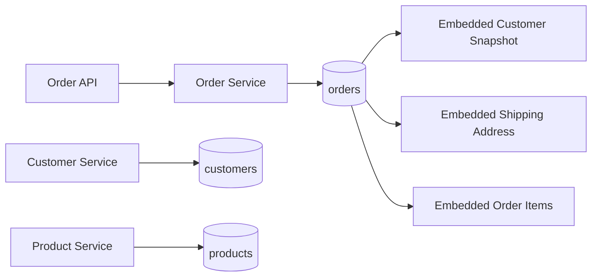
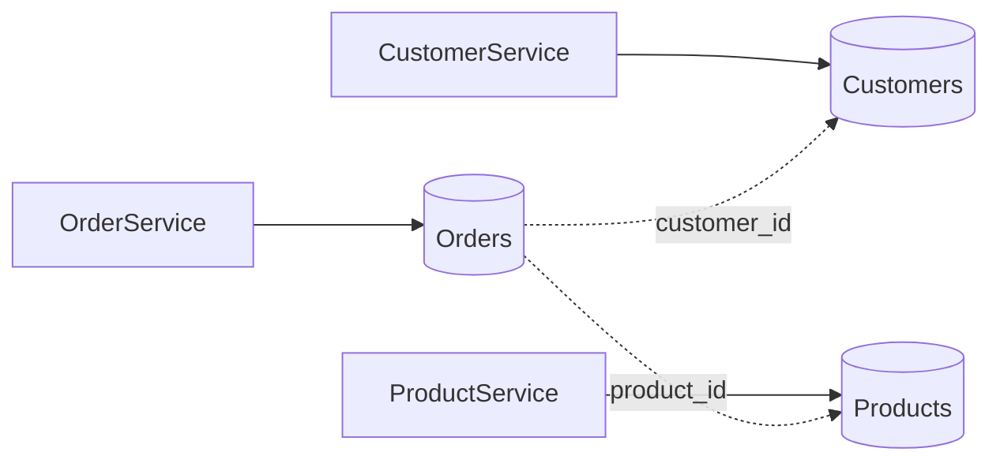
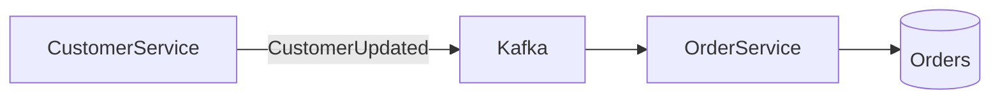

# 06- Data Modeling Relationships

## Overview

MongoDB relationships describe how logically related pieces of data are represented across documents and collections.

Unlike a relational database, MongoDB does not require every relationship to be represented through normalized tables and foreign keys. A relationship can be modeled using:

- Embedded documents
- Embedded arrays
- References
- Application-managed identifiers
- Controlled denormalization
- Aggregation with `$lookup`
- Hybrid models

The key engineering decision is not:

> "How do I represent this relational relationship in MongoDB?"

It is:

> "How will this data be accessed, updated, owned, and scaled in production?"

MongoDB data modeling is therefore **access-pattern-driven**.

A good model should make common operations efficient while keeping:

- Document growth predictable
- Updates manageable
- Consistency requirements explicit
- Indexes practical
- Service boundaries clear
- Transactions limited to cases where they are actually required

---

## Relationships in MongoDB

Common relationship types include:

| Relationship | Example | Common MongoDB strategy |
|---|---|---|
| One-to-one | User → Profile | Embed |
| One-to-one independent entities | User → Identity record | Reference |
| One-to-many, bounded | Order → Items | Embed |
| One-to-many, unbounded | User → Events | Reference |
| Many-to-many, small/bounded | User → Roles | Embed identifiers or controlled references |
| Many-to-many, large | Students → Courses | Reference |
| Parent-child hierarchy | Organization → Departments | Embed or reference based on depth and access |
| Historical snapshot | Order → Customer details | Embed |
| Shared entity | Products → Orders | Reference |
| Cross-service data | Order → Customer Service | Reference + controlled denormalization |

There is no universal mapping.

The same business relationship can legitimately use different MongoDB models depending on workload requirements.

---

## Access Patterns First

A MongoDB schema should start with the application's queries and commands.

For example, an e-commerce system may require:

```text
GET /orders/{id}
    -> order
    -> customer snapshot
    -> shipping address
    -> line items

GET /customers/{id}/orders
    -> customer's recent orders

GET /products/{id}/orders
    -> orders containing product
```

These access patterns suggest different storage decisions.

A possible model is:



The order document owns the information required to render an order, while the canonical customer and product records remain independently managed.

---

## Embedding vs Referencing

The fundamental relationship decision is whether related data should live:

```text
inside the same document
```

or:

```text
in another document referenced by an identifier
```

### Embedding

```json
{
  "_id": "ORD-1001",
  "shipping_address": {
    "city": "Kolkata",
    "postal_code": "700016"
  }
}
```

### Referencing

```json
{
  "_id": "ORD-1001",
  "shipping_address_id": "ADDR-5001"
}
```

with:

```json
{
  "_id": "ADDR-5001",
  "city": "Kolkata",
  "postal_code": "700016"
}
```

Embedding generally favors:

- Local reads
- Atomic updates
- Strong ownership
- Bounded data

Referencing generally favors:

- Independent lifecycle
- Large or unbounded relationships
- Shared entities
- Independent query patterns

---

## When to Embed

Embedding is generally appropriate when:

- Related data is usually read with the parent.
- The child belongs strongly to the parent.
- The child has bounded cardinality.
- The child does not need independent lifecycle management.
- Updates commonly occur together.
- Single-document atomicity is valuable.
- Controlled duplication is acceptable.

Example:

```json
{
  "_id": "ORD-1001",
  "items": [
    {
      "product_id": "PROD-100",
      "quantity": 2,
      "unit_price": 4999
    }
  ]
}
```

Order items naturally belong to the order and are usually retrieved together.

---

## When to Reference

References are generally preferable when:

- Related data is independently managed.
- Cardinality can grow without a practical bound.
- Multiple parents share the same entity.
- The child has its own access patterns.
- The child is updated independently.
- The child document is large.
- Different services own the related entities.

Example:

```json
{
  "_id": "ORD-1001",
  "customer_id": "CUS-1001"
}
```

The customer remains independently managed.

---

## One-to-One Relationships

A one-to-one relationship can often be embedded.

Example:

```json
{
  "_id": "USR-1001",
  "name": "Alice",
  "profile": {
    "timezone": "Asia/Kolkata",
    "language": "en",
    "marketing_opt_in": true
  }
}
```

This works well when the profile:

- Is small
- Is bounded
- Belongs exclusively to the user
- Is commonly read with the user

### Referenced One-to-One

A reference may be better when the related entity has independent ownership.

Example:

```json
{
  "_id": "USR-1001",
  "identity_id": "IDENTITY-1001"
}
```

This can be useful for authentication or compliance records that have separate security and lifecycle requirements.

---

## One-to-Many Relationships

One-to-many relationships require cardinality analysis.

### Bounded One-to-Many

Example:

```text
User
 |
 +-- home address
 +-- office address
 +-- billing address
```

Embedding is usually reasonable:

```json
{
  "_id": "USR-1001",
  "addresses": [
    {
      "type": "home",
      "city": "Kolkata"
    },
    {
      "type": "office",
      "city": "Bengaluru"
    }
  ]
}
```

### Unbounded One-to-Many

Example:

```text
User
 |
 +-- millions of events
```

Do not embed the entire history.

Use:

```text
users
events
```

with:

```json
{
  "_id": "EVT-1001",
  "user_id": "USR-1001",
  "type": "login",
  "created_at": "..."
}
```

and an index such as:

```javascript
db.events.createIndex({
  user_id: 1,
  created_at: -1
})
```

---

## Many-to-Many Relationships

Many-to-many relationships require particular care.

Example:

```text
Users <-> Roles
```

A small bounded set of roles can be embedded:

```json
{
  "_id": "USR-1001",
  "roles": [
    "developer",
    "reviewer"
  ]
}
```

For large or independently managed relationships, use references.

Example:

```json
{
  "_id": "USER-ROLE-1001",
  "user_id": "USR-1001",
  "role_id": "ROLE-ADMIN"
}
```

with indexes:

```javascript
db.user_roles.createIndex({
  user_id: 1,
  role_id: 1
}, {
  unique: true
})
```

and:

```javascript
db.user_roles.createIndex({
  role_id: 1,
  user_id: 1
})
```

This supports both directions:

```text
user -> roles
role -> users
```

---

## Many-to-Many: Embedding vs References

Consider:

```text
Students <-> Courses
```

If a student can take:

```text
3–10 courses
```

and course membership is primarily accessed with the student, embedding course identifiers may be reasonable:

```json
{
  "_id": "STUDENT-100",
  "course_ids": [
    "COURSE-101",
    "COURSE-201"
  ]
}
```

But if:

- Students can take hundreds of courses.
- Courses are independently managed.
- Course membership is queried from both directions.
- Membership has metadata.
- Membership changes frequently.

A separate relationship collection is usually more appropriate:

```json
{
  "_id": "ENROLLMENT-1001",
  "student_id": "STUDENT-100",
  "course_id": "COURSE-101",
  "enrolled_at": "2026-09-21T10:00:00Z",
  "status": "active"
}
```

The relationship itself has become a first-class entity.

---

## Relationship Documents

A relationship deserves its own document when the relationship has meaningful attributes.

For example:

```text
User
  |
  +-- follows --> Organization
                    |
                    +-- followed_at
                    +-- notification_level
                    +-- status
```

Instead of:

```json
{
  "user_id": "USR-1001",
  "organization_ids": [
    "ORG-100"
  ]
}
```

use:

```json
{
  "_id": "FOLLOW-1001",
  "user_id": "USR-1001",
  "organization_id": "ORG-100",
  "followed_at": "2026-09-21T10:00:00Z",
  "notification_level": "important"
}
```

The relationship now has its own lifecycle and business semantics.

---

## Parent-Child Relationships

Hierarchical relationships include:

- Organization → Department
- Category → Subcategory
- Folder → File
- Comment → Reply
- Manager → Employee

The model depends heavily on hierarchy depth and access patterns.

### Embedded Parent-Child

Suitable for small, bounded hierarchies:

```json
{
  "_id": "CAT-100",
  "name": "Backend",
  "children": [
    {
      "name": "Databases",
      "children": [
        {
          "name": "MongoDB"
        }
      ]
    }
  ]
}
```

This provides convenient retrieval of the entire tree.

But deeply nested structures can become difficult to update and query.

---

## Referenced Parent-Child Model

A flatter structure may be easier to operate:

```json
{
  "_id": "CAT-300",
  "name": "MongoDB",
  "parent_id": "CAT-200"
}
```

with:

```text
CAT-100 Backend
    |
    +-- CAT-200 Databases
            |
            +-- CAT-300 MongoDB
```

Index:

```javascript
db.categories.createIndex({
  parent_id: 1
})
```

This is often more practical for:

- Deep hierarchies
- Independent node updates
- Large trees
- Tree traversal
- Administrative interfaces

---

## Tree Modeling Considerations

Hierarchical data can use several MongoDB patterns.

| Pattern | Best suited for |
|---|---|
| Embedded tree | Small bounded hierarchy |
| Parent reference | Simple parent-child traversal |
| Child references | Direct child lookup |
| Materialized path | Ancestor/descendant queries |
| Separate relationship collection | Complex graph-like relationships |

The choice should be driven by required operations such as:

```text
Get direct children
Get all descendants
Get all ancestors
Move a subtree
Count descendants
Delete subtree
```

Do not choose a tree model without first identifying these operations.

---

## Self-Referencing Relationships

A document can reference another document in the same collection.

Example:

```json
{
  "_id": "EMP-100",
  "name": "Alice",
  "manager_id": "EMP-50"
}
```

This models:

```text
EMP-50
   |
   +-- EMP-100
```

An index is usually required:

```javascript
db.employees.createIndex({
  manager_id: 1
})
```

This pattern works well for large employee hierarchies where each employee has one manager.

---

## Polymorphic Relationships

MongoDB's flexible document structure allows documents in the same collection to have different shapes.

For example:

```json
{
  "_id": "PAY-100",
  "type": "card",
  "card": {
    "last4": "1234"
  }
}
```

and:

```json
{
  "_id": "PAY-101",
  "type": "bank_transfer",
  "bank_transfer": {
    "bank_reference": "REF-100"
  }
}
```

This can be useful when multiple related entity variants share a common lifecycle.

However, polymorphism should still have an explicit schema contract.

Use:

```text
type
+
variant-specific fields
```

rather than uncontrolled document shape variation.

---

## References Are Not Foreign Keys

MongoDB references are application-level relationships.

Example:

```json
{
  "customer_id": "CUS-1001"
}
```

MongoDB does not automatically provide the same referential-integrity guarantees associated with relational foreign keys.

The application must handle:

- Missing referenced documents
- Deleted referenced documents
- Invalid identifiers
- Lifecycle ordering
- Cleanup
- Consistency

For example:

```text
orders.customer_id
        |
        v
customers._id
```

does not automatically guarantee that the customer exists.

This must be enforced by application architecture, workflows, validation, or transactions where appropriate.

---

## `$lookup`

MongoDB can combine documents from different collections using `$lookup`.

Example:

```javascript
db.orders.aggregate([
  {
    $lookup: {
      from: "customers",
      localField: "customer_id",
      foreignField: "_id",
      as: "customer"
    }
  }
])
```

The result contains:

```json
{
  "_id": "ORD-1001",
  "customer_id": "CUS-1001",
  "customer": [
    {
      "_id": "CUS-1001",
      "name": "Alice"
    }
  ]
}
```

`$lookup` can be useful, but it should not automatically be treated as equivalent to designing a relational schema and joining everything at query time.

---

## `$lookup` and Performance

A `$lookup` can become expensive when:

- The foreign collection is large.
- The join field is not indexed appropriately.
- The query returns many source documents.
- The join creates large intermediate results.
- Multiple `$lookup` stages are chained.

A typical optimization is to filter early:

```javascript
db.orders.aggregate([
  {
    $match: {
      status: "confirmed"
    }
  },
  {
    $lookup: {
      from: "customers",
      localField: "customer_id",
      foreignField: "_id",
      as: "customer"
    }
  }
])
```

Rather than joining a much larger input set first.

---

## `$lookup` vs Embedding

| Requirement | Embedding | `$lookup` / Reference |
|---|---|---|
| Read parent and child together | Strong fit | Possible |
| Independent child lifecycle | Weak fit | Strong fit |
| Unbounded child count | Weak fit | Strong fit |
| Single-document atomicity | Strong fit | Requires transaction for multi-document updates |
| Shared child | Weak fit | Strong fit |
| Historical snapshot | Strong fit | Usually unnecessary |
| Large child records | Weak fit | Strong fit |
| Frequent child-only queries | May be inefficient | Strong fit |
| Simple parent retrieval | Strong fit | Adds join work |

The existence of `$lookup` does not mean every relationship should be normalized.

---

## Referential Integrity

When using references, define what happens when a referenced document changes or is deleted.

For example:

```text
Customer deleted
      |
      +-- What happens to orders?
```

Possible strategies:

### Restrict

Prevent deletion while dependent records exist.

### Cascade

Delete dependent records.

### Preserve Snapshot

Keep historical embedded information.

### Soft Delete

Mark the referenced entity inactive.

Example:

```json
{
  "_id": "CUS-1001",
  "status": "deleted",
  "deleted_at": "2026-09-21T10:00:00Z"
}
```

The correct strategy depends on the domain.

---

## Relationship Consistency

A referenced model can create temporary inconsistency.

For example:

```text
Create Order
     |
     +-- customer_id = CUS-1001
     |
     +-- Customer service unavailable
```

The order may exist before the customer data is available locally.

In microservices, this is often an eventual-consistency problem rather than a database problem.

Possible solutions include:

- Synchronous validation
- Transactional workflows
- Outbox pattern
- Kafka events
- Retry queues
- Idempotent consumers
- Reconciliation jobs

Do not solve distributed consistency problems by blindly adding database transactions across service boundaries.

---

## Controlled Denormalization

MongoDB often benefits from duplicating small pieces of related data.

Example:

```json
{
  "_id": "ORD-1001",
  "customer_id": "CUS-1001",
  "customer": {
    "name": "Alice",
    "email": "alice@example.com"
  }
}
```

The canonical customer remains:

```json
{
  "_id": "CUS-1001",
  "name": "Alice",
  "email": "alice@example.com"
}
```

This provides:

```text
Fast order reads
+
Historical or presentation snapshot
```

The duplication must have an explicit synchronization policy.

---

## Snapshot vs Reference

A useful distinction is:

```text
Reference
    -> "What is the entity now?"

Snapshot
    -> "What was the entity when this record was created?"
```

For example, an invoice should generally preserve:

```json
{
  "billing_address": {
    "line1": "12 Park Street",
    "city": "Kolkata"
  }
}
```

rather than relying on the customer's current address.

The invoice is a historical record.

Embedding expresses that semantic ownership clearly.

---

## Relationship Cardinality

Cardinality is one of the strongest indicators for MongoDB relationship design.

Consider:

```text
User -> Roles
```

Typical cardinality:

```text
1 -> 5
```

Embedding is easy.

Now:

```text
User -> Events
```

Typical cardinality:

```text
1 -> millions
```

Referencing is usually more appropriate.

Now:

```text
Users <-> Roles
```

If both sides are large and independently queried, a relationship collection may be required.

Always estimate:

- Minimum cardinality
- Typical cardinality
- Maximum practical cardinality
- Growth rate

Do not design only for today's dataset.

---

## Read-Heavy Models

Embedding often performs well in read-heavy systems.

Example:

```text
GET /orders/{id}
```

can retrieve:

```text
Order
+
Items
+
Shipping address
+
Customer snapshot
```

with one document read.

This can reduce:

- Database round trips
- Application joins
- Network latency
- Service dependencies

For read-heavy APIs, embedding can be a significant architectural advantage.

---

## Write-Heavy Models

Write-heavy relationships require more care.

Suppose thousands of workers continuously modify:

```json
{
  "_id": "USER-100",
  "events": []
}
```

The user document becomes a write hotspot.

Separating the events:

```text
users
events
```

allows writes to be distributed across many documents.

Write frequency can therefore be more important than conceptual ownership.

---

## Hot Document Risk

A relationship can be logically correct but operationally poor.

For example:

```text
Organization
 |
 +-- members: [millions]
```

Every membership update modifies the same parent document.

Potential consequences:

- Write contention
- Large document updates
- Replication traffic
- Large index entries
- Increased latency
- Document growth

A separate membership collection may be better:

```json
{
  "_id": "MEMBER-1001",
  "organization_id": "ORG-100",
  "user_id": "USR-1001",
  "role": "developer"
}
```

---

## Many-to-Many Relationship Collection

For large relationships, create a dedicated collection.

Example:

```json
{
  "_id": "MEMBERSHIP-1001",
  "organization_id": "ORG-100",
  "user_id": "USR-1001",
  "role": "developer",
  "created_at": "2026-09-21T10:00:00Z"
}
```

Recommended indexes:

```javascript
db.memberships.createIndex(
  {
    organization_id: 1,
    user_id: 1
  },
  {
    unique: true
  }
)

db.memberships.createIndex({
  user_id: 1,
  organization_id: 1
})
```

This supports both directions efficiently.

---

## Relationship Metadata

If the relationship contains business data, model it explicitly.

Example:

```text
User -> Organization
```

with:

- Role
- Joined date
- Status
- Permissions
- Invitation source
- Last activity

This should become:

```json
{
  "_id": "MEMBERSHIP-1001",
  "user_id": "USR-1001",
  "organization_id": "ORG-100",
  "role": "admin",
  "status": "active",
  "joined_at": "2026-01-10T10:00:00Z"
}
```

Trying to encode this inside arrays of identifiers quickly becomes difficult to query and update.

---

## Relationship Index Design

References only become useful when their query patterns are indexed appropriately.

For:

```json
{
  "customer_id": "CUS-1001",
  "created_at": "..."
}
```

a common query might be:

```javascript
db.orders.find({
  customer_id: "CUS-1001"
}).sort({
  created_at: -1
})
```

A compound index can support this pattern:

```javascript
db.orders.createIndex({
  customer_id: 1,
  created_at: -1
})
```

The index should be derived from actual access patterns rather than from the existence of the relationship alone.

---

## Bidirectional References

Consider:

```text
User -> Organizations
Organization -> Users
```

It may be tempting to store both:

```json
{
  "_id": "USR-1001",
  "organization_ids": [
    "ORG-100"
  ]
}
```

and:

```json
{
  "_id": "ORG-100",
  "user_ids": [
    "USR-1001"
  ]
}
```

This duplicates the same relationship.

Every membership change now requires maintaining two documents.

This creates consistency risk:

```text
User says membership exists
Organization says membership does not exist
```

Prefer a relationship collection when both directions need to be queried frequently.

---

## Avoiding Dual-Write Consistency Problems

A common anti-pattern is:

```text
Update User
     |
     +-- Update Organization
```

with no transactional or event-driven consistency strategy.

If the second update fails:

```text
User -> updated
Organization -> stale
```

The system becomes inconsistent.

Better approaches include:

- Single source of truth
- Relationship collection
- Multi-document transaction when appropriate
- Outbox pattern
- Kafka-based synchronization
- Reconciliation jobs

The choice depends on consistency requirements and service ownership.

---

## Transactions and Relationships

Transactions can be appropriate when multiple documents must change atomically.

Example:

```text
Create membership
+
Update organization statistics
```

A transaction can ensure both changes succeed or fail together.

However, if the relationship can instead be represented as a single document:

```json
{
  "_id": "MEMBERSHIP-1001",
  "user_id": "USR-1001",
  "organization_id": "ORG-100"
}
```

a transaction may not be necessary.

Use document modeling to reduce transactional scope where practical.

---

## Cross-Service Relationships

Microservices complicate relationships because different services may own different collections.

Example:



The Order Service should not assume it can perform arbitrary database joins across another service's database.

Instead, it can maintain the data it needs:

```json
{
  "_id": "ORD-1001",
  "customer_id": "CUS-1001",
  "customer_snapshot": {
    "name": "Alice"
  },
  "items": [
    {
      "product_id": "PROD-100",
      "name": "Keyboard",
      "unit_price": 4999
    }
  ]
}
```

This reduces runtime coupling.

---

## Event-Driven Relationship Synchronization

When duplicated relationship data must be updated asynchronously:



The consumer should be:

- Idempotent
- Retry-safe
- Observable
- Version-aware where necessary

For example:

```json
{
  "event_type": "customer.updated",
  "event_id": "EVT-1001",
  "customer_id": "CUS-1001",
  "version": 17,
  "name": "Alice"
}
```

The consumer can reject stale versions if ordering guarantees are not sufficient.

---

## Relationship Modeling and API Design

Database relationships should not automatically dictate API structure.

A database may contain:

```text
orders
customers
memberships
products
```

while the API may expose:

```text
GET /orders/{id}
GET /users/{id}/organizations
GET /organizations/{id}/members
```

The API contract should be optimized for client needs and service boundaries.

Avoid exposing database-specific concepts such as:

```text
$lookup
ObjectId
collection names
internal reference structure
```

through public APIs unless intentionally part of the contract.

---

## Relationship Modeling with Python

A repository layer can hide persistence details.

Example:

```python
from pymongo.collection import Collection


class OrderRepository:
    def __init__(self, collection: Collection):
        self.collection = collection

    def find_by_customer(
        self,
        customer_id: str,
        limit: int = 50,
    ) -> list[dict]:
        cursor = (
            self.collection
            .find(
                {"customer_id": customer_id},
                {
                    "_id": 1,
                    "status": 1,
                    "created_at": 1,
                    "totals": 1,
                },
            )
            .sort("created_at", -1)
            .limit(limit)
        )

        return list(cursor)
```

The service layer can then reason in terms of business concepts rather than collection implementation details.

---

## Relationship Modeling in FastAPI

FastAPI response models should represent API semantics rather than database relationships directly.

Example:

```python
from pydantic import BaseModel


class CustomerSummary(BaseModel):
    id: str
    name: str


class OrderResponse(BaseModel):
    id: str
    status: str
    customer: CustomerSummary
```

The underlying MongoDB document might use:

```json
{
  "_id": "ORD-1001",
  "customer_id": "CUS-1001",
  "customer_snapshot": {
    "name": "Alice"
  }
}
```

The service layer maps the persistence model to the API model.

This keeps database evolution independent from client contracts.

---

## Relationship Modeling in Django

When Django is used with MongoDB through PyMongo or a MongoDB-oriented ODM, relationships should not be assumed to behave like Django's native relational ORM.

For example, a MongoDB reference:

```json
{
  "customer_id": "CUS-1001"
}
```

is not automatically equivalent to:

```python
ForeignKey(Customer)
```

in Django's relational ORM.

The application must explicitly manage:

- Reference validation
- Fetching
- Serialization
- Deletion semantics
- Consistency
- Transactions

A repository/service layer is often useful for keeping this behavior explicit.

---

## Schema Validation for Relationships

MongoDB schema validation can enforce the shape and type of references.

Example:

```javascript
db.createCollection("orders", {
  validator: {
    $jsonSchema: {
      bsonType: "object",
      required: [
        "customer_id",
        "status"
      ],
      properties: {
        customer_id: {
          bsonType: "string"
        },
        status: {
          bsonType: "string"
        }
      }
    }
  }
})
```

This verifies that:

```text
customer_id exists
+
customer_id has the expected BSON type
```

It does not automatically verify that the customer document exists.

Referential integrity remains an application-level or workflow-level responsibility.

---

## Relationship Evolution

Relationships change over time.

For example:

```text
Order -> Customer
```

may initially store:

```json
{
  "customer_id": "CUS-1001"
}
```

Later, the application may require a historical snapshot:

```json
{
  "customer_id": "CUS-1001",
  "customer_snapshot": {
    "name": "Alice",
    "email": "alice@example.com"
  }
}
```

A safe migration can be incremental:

```text
Deploy backward-compatible application
        |
        v
Write new documents with both representations
        |
        v
Backfill existing documents
        |
        v
Validate migration
        |
        v
Switch reads
        |
        v
Remove legacy representation when safe
```

Large collections should not be migrated with an uncontrolled one-shot operation.

---

## Common Relationship Anti-Patterns

### Embedding Unbounded Children

```text
User
 └── millions of events
```

This causes document growth and operational problems.

### Referencing Everything

A model can technically reference every entity but still produce excessive database round trips.

Avoid turning every API request into:

```text
Query A
Query B
Query C
Query D
Query E
```

when the data naturally belongs together.

### Mirroring Relational Tables

Creating one MongoDB collection for every relational table often misses the benefits of document modeling.

### Bidirectional Duplicated References

Maintaining:

```text
A -> B
B -> A
```

creates synchronization responsibilities.

### Unindexed References

A relationship field without an appropriate index can produce expensive queries.

### Treating References as Foreign Keys

MongoDB references do not automatically enforce relational integrity.

### Using `$lookup` Everywhere

A successful `$lookup` does not mean the underlying model is optimal.

### Overusing Transactions

Transactions should solve genuine multi-document consistency requirements, not compensate for poor document modeling.

### Ignoring Ownership

If no service or document clearly owns a piece of data, consistency responsibilities become ambiguous.

### Embedding Frequently Changing Shared Data

This can create large synchronization workloads and write amplification.

---

## Relationship Design Decision Matrix

| Requirement | Preferred approach |
|---|---|
| Small, bounded child data | Embed |
| Child belongs exclusively to parent | Embed |
| Child always read with parent | Embed |
| Historical snapshot | Embed |
| Unbounded child collection | Reference |
| Child independently managed | Reference |
| Shared entity | Reference |
| Relationship has significant metadata | Relationship collection |
| Large many-to-many relationship | Relationship collection |
| High-frequency child updates | Separate collection |
| Both directions queried heavily | Relationship collection |
| Small read-heavy relationship | Embed or controlled references |
| Cross-service relationship | Reference + controlled denormalization |
| Strong multi-document consistency | Transaction where appropriate |

---

## Production Modeling Workflow

A senior engineer can use the following workflow when designing relationships:

```text
Business requirements
        |
        v
Access patterns
        |
        v
Cardinality analysis
        |
        v
Ownership and lifecycle
        |
        v
Embed vs reference
        |
        v
Query and index design
        |
        v
Consistency model
        |
        v
Document growth analysis
        |
        v
Performance testing
        |
        v
Operational validation
```

Do not stop after deciding whether to embed or reference.

A production-ready model also needs:

- Query indexes
- Update semantics
- Migration strategy
- Monitoring
- Capacity planning
- Failure handling
- API boundaries
- Security rules

---

## Production Checklist

Before implementing a MongoDB relationship, verify:

- What is the primary access pattern?
- What is the expected cardinality?
- What is the maximum practical cardinality?
- Who owns each piece of data?
- Do parent and child share the same lifecycle?
- Is the child independently queried?
- Is the child independently updated?
- Is the relationship shared?
- Does the relationship have its own metadata?
- Can embedding create a hot document?
- Can document growth become unbounded?
- Will the relationship require a multikey index?
- Are reference fields indexed?
- Are duplicated fields intentionally denormalized?
- What happens when the referenced entity is deleted?
- What consistency model is required?
- Is a transaction actually necessary?
- Could an event-driven workflow be more appropriate?
- Does the API need a snapshot or current state?
- How will the model evolve?

---

## Troubleshooting Relationship Problems

Use a structured workflow:

```text
Symptom
↓
Possible causes
↓
Isolation strategy
↓
Diagnostic commands
↓
Root cause
↓
Corrective action
↓
Prevention
```

### Excessive Query Count

```text
Symptom
↓
API latency increases with relationship depth
↓
Possible causes
↓
Over-normalized model or excessive application-side joins
↓
Isolation strategy
↓
Trace database calls per request
↓
Diagnostic commands
↓
Application tracing + MongoDB profiler/monitoring + explain()
↓
Root cause
↓
Too many dependent reads
↓
Corrective action
↓
Embed bounded data or introduce controlled denormalization
↓
Prevention
↓
Design APIs and schemas around access patterns
```

### Stale References

```text
Symptom
↓
Referenced document does not exist or contains stale data
↓
Possible causes
↓
Deleted entity, failed synchronization, eventual consistency
↓
Isolation strategy
↓
Check reference lifecycle and synchronization events
↓
Diagnostic commands
↓
Targeted queries + application/event logs
↓
Root cause
↓
Undefined ownership or consistency strategy
↓
Corrective action
↓
Define lifecycle, cleanup, reconciliation, or event-driven synchronization
↓
Prevention
↓
Explicit relationship contract
```

### Large Parent Documents

```text
Symptom
↓
Increasing read/write latency
↓
Possible causes
↓
Growing embedded relationships
↓
Isolation strategy
↓
Measure document size and relationship cardinality
↓
Diagnostic commands
↓
Collection/document statistics + query explain plans
↓
Root cause
↓
Relationship incorrectly modeled as embedded
↓
Corrective action
↓
Move high-cardinality children to a separate collection
↓
Prevention
↓
Document growth limits and schema reviews
```

---

## Interview Perspective

Senior MongoDB interviews commonly evaluate whether an engineer can reason about relationships without defaulting to relational normalization.

Typical questions include:

- When would you embed versus reference?
- How would you model one-to-one data?
- How would you model a bounded one-to-many relationship?
- How would you model millions of child records?
- When should a many-to-many relationship become its own collection?
- What is controlled denormalization?
- How would you preserve historical customer information on an invoice?
- Why can bidirectional references create consistency problems?
- When should `$lookup` be used?
- Why is `$lookup` not a reason to normalize everything?
- How do you handle references across microservices?
- How would you handle deletion of a referenced document?
- When is a transaction appropriate?
- How does cardinality affect embedding decisions?
- How can relationship modeling create hot documents?

A strong senior-level answer should reason through:

```text
Access pattern
+
Cardinality
+
Ownership
+
Lifecycle
+
Update frequency
+
Consistency
+
Document growth
+
Indexing
+
Service boundaries
```

rather than simply saying:

```text
MongoDB prefers embedding.
```

---

## Key Takeaways

- MongoDB relationship design should begin with access patterns, cardinality, ownership, lifecycle, and update frequency rather than relational-table structure.
- Embed bounded, parent-owned data that is commonly read together; reference independently managed, shared, large, or unbounded data.
- Use dedicated relationship collections when relationships are large, independently queried, bidirectional, or contain meaningful metadata.
- References do not provide automatic foreign-key integrity, so deletion semantics, consistency, synchronization, and ownership must be explicitly designed.
- Production relationship modeling requires more than choosing embed vs reference: indexes, document growth, transactions, API boundaries, migrations, and operational behavior must all be considered.