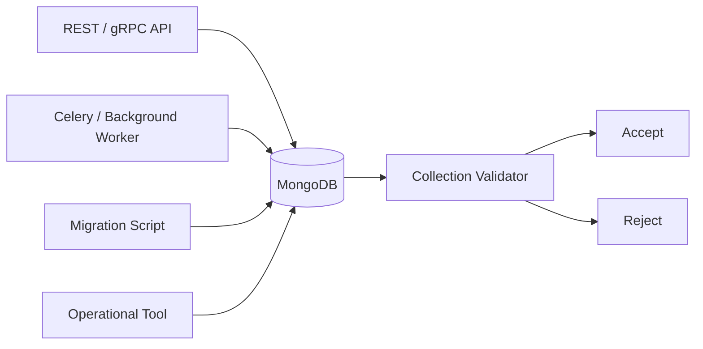
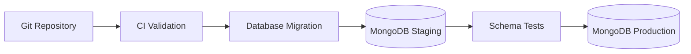

# 07- Schema Validation

## Overview

MongoDB is schema-flexible, but schema flexibility does not mean that production collections should accept arbitrary document structures.

Schema validation provides a database-level mechanism for enforcing structural and type constraints while retaining MongoDB's document model.

A production application commonly uses multiple validation layers:

```text
API validation
     ↓
Application/domain validation
     ↓
MongoDB schema validation
     ↓
Storage
```

Each layer has a different responsibility.

Application validation provides domain-specific behavior and user-facing errors. MongoDB validation protects the database from malformed writes coming from any client, script, migration, background worker, or operational tool.

Schema validation is particularly important when:

- Multiple services write to the same collection.
- Data is written by batch jobs or scripts.
- MongoDB is accessed outside the primary application.
- Schemas evolve over time.
- Collections contain business-critical data.
- Type consistency is important for queries and indexes.

---

## Schema Flexibility vs Schema Validation

MongoDB allows documents in the same collection to have different fields and structures.

For example:

```json
{
  "_id": "USR-1001",
  "name": "Alice",
  "email": "alice@example.com"
}
```

and:

```json
{
  "_id": "USR-1002",
  "name": "Bob",
  "phone": "+919999999999"
}
```

can technically coexist.

This flexibility is useful during development and for legitimate polymorphic data models, but uncontrolled variation can create operational problems.

Typical consequences include:

- Inconsistent field types
- Broken queries
- Difficult migrations
- Unexpected application errors
- Poor data quality
- Inconsistent indexes
- Complicated analytics
- Difficult debugging

Schema validation allows the database to enforce the parts of the schema that must remain stable.

---

## Schema-on-Read vs Schema-on-Write

MongoDB is commonly described as supporting a flexible or schema-on-read model.

The application determines how fields are interpreted when documents are read.

Schema validation introduces controlled schema-on-write behavior:

```text
Application
    |
    v
Document
    |
    v
MongoDB Validator
    |
    +---- valid ----> Store
    |
    +---- invalid --> Reject
```

This provides a useful hybrid model:

```text
Flexible schema
+
Explicit invariants
=
Controlled schema evolution
```

The goal is not to make MongoDB behave exactly like a relational database.

The goal is to enforce the constraints that matter while retaining document-oriented modeling.

---

## JSON Schema Validation

MongoDB supports JSON Schema-based validation through `$jsonSchema`.

A basic example:

```javascript
db.createCollection("users", {
  validator: {
    $jsonSchema: {
      bsonType: "object",
      required: [
        "name",
        "email"
      ],
      properties: {
        name: {
          bsonType: "string"
        },
        email: {
          bsonType: "string"
        }
      }
    }
  }
})
```

This requires:

```text
name -> string
email -> string
```

and rejects documents that do not satisfy those requirements.

---

## Why Use Database-Level Validation?

Application-level validation alone is insufficient in many production systems.

Consider:

```text
FastAPI service
    |
    +---- MongoDB
    |
Celery worker
    |
    +---- MongoDB
    |
Data migration
    |
    +---- MongoDB
    |
Admin script
    |
    +---- MongoDB
```

If validation exists only in the FastAPI service, another writer can bypass it.

Database-level validation provides a final storage boundary:



This is especially valuable in multi-service environments.

---

## Validation Scope

MongoDB validation can be applied to a collection.

Example:

```javascript
db.runCommand({
  collMod: "users",
  validator: {
    $jsonSchema: {
      bsonType: "object",
      required: ["name", "email"],
      properties: {
        name: {
          bsonType: "string"
        },
        email: {
          bsonType: "string"
        }
      }
    }
  }
})
```

`collMod` is useful when changing validation rules for an existing collection.

---

## Required Fields

Use `required` for fields that must exist.

Example:

```javascript
validator: {
  $jsonSchema: {
    bsonType: "object",
    required: [
      "customer_id",
      "status",
      "created_at"
    ]
  }
}
```

A document without `customer_id` is rejected under the configured validation action.

This is different from specifying a property type.

For example:

```javascript
properties: {
  customer_id: {
    bsonType: "string"
  }
}
```

means:

> If `customer_id` exists, it must be a string.

It does not necessarily mean:

> `customer_id` must exist.

To require existence, use:

```javascript
required: ["customer_id"]
```

---

## BSON Type Validation

MongoDB validation uses BSON types.

Common types include:

| BSON type | Typical backend usage |
|---|---|
| `string` | Names, identifiers, statuses |
| `objectId` | MongoDB ObjectId identifiers |
| `object` | Embedded documents |
| `array` | Lists and collections |
| `bool` | Flags |
| `date` | Timestamps |
| `int` | Integer values |
| `long` | Large integer values |
| `double` | Floating-point values |
| `decimal` | Exact decimal monetary values |
| `null` | Explicit null value |

Example:

```javascript
{
  created_at: {
    bsonType: "date"
  },
  active: {
    bsonType: "bool"
  },
  retry_count: {
    bsonType: "int"
  }
}
```

Be deliberate about numeric types.

A field containing:

```text
int
long
double
decimal
```

interchangeably can create application and aggregation inconsistencies.

---

## String Validation

A basic string constraint:

```javascript
{
  bsonType: "string"
}
```

can be combined with `minLength` and `maxLength`.

Example:

```javascript
{
  bsonType: "string",
  minLength: 1,
  maxLength: 255
}
```

This is useful for fields such as:

- Names
- Status values
- External identifiers
- Descriptions

However, schema validation should not become a substitute for domain validation.

For example, validating a complex password policy or business rule is usually better handled in the application layer.

---

## Nested Document Validation

Nested objects can be validated recursively.

Example:

```javascript
{
  bsonType: "object",
  required: ["shipping_address"],
  properties: {
    shipping_address: {
      bsonType: "object",
      required: [
        "city",
        "postal_code"
      ],
      properties: {
        city: {
          bsonType: "string"
        },
        postal_code: {
          bsonType: "string"
        }
      }
    }
  }
}
```

A valid document could be:

```json
{
  "shipping_address": {
    "city": "Kolkata",
    "postal_code": "700016"
  }
}
```

This is useful for embedded documents that have a stable internal structure.

---

## Array Validation

Arrays can be constrained with `items`.

Example:

```javascript
{
  roles: {
    bsonType: "array",
    items: {
      bsonType: "string"
    }
  }
}
```

Valid:

```json
{
  "roles": [
    "admin",
    "developer"
  ]
}
```

Invalid:

```json
{
  "roles": [
    "admin",
    42
  ]
}
```

Array validation is particularly useful for:

- Tags
- Roles
- Identifiers
- Embedded documents
- Configuration lists

---

## Arrays of Embedded Documents

A common production pattern is an array of structured objects.

Example:

```javascript
{
  items: {
    bsonType: "array",
    items: {
      bsonType: "object",
      required: [
        "product_id",
        "quantity",
        "unit_price"
      ],
      properties: {
        product_id: {
          bsonType: "string"
        },
        quantity: {
          bsonType: "int",
          minimum: 1
        },
        unit_price: {
          bsonType: "decimal"
        }
      }
    }
  }
}
```

This enforces consistency inside every array element.

---

## Validation of ObjectId References

Suppose an order contains:

```json
{
  "_id": "ObjectId(...)",
  "customer_id": "ObjectId(...)"
}
```

The schema can enforce the BSON type:

```javascript
{
  customer_id: {
    bsonType: "objectId"
  }
}
```

However, this only verifies the identifier's type.

It does not verify:

```text
customer_id -> customers._id
```

exists.

MongoDB schema validation is therefore not a foreign-key constraint.

---

## Validation of Dates

Use BSON `date` for timestamps.

Example:

```javascript
{
  created_at: {
    bsonType: "date"
  },
  updated_at: {
    bsonType: "date"
  }
}
```

Prefer actual BSON dates over strings such as:

```json
{
  "created_at": "2026-09-21T10:00:00Z"
}
```

BSON dates provide better support for:

- Sorting
- Range queries
- Aggregation
- Date operators
- TTL indexes

---

## Validation of Enumerated Values

A field can be restricted using `enum`.

Example:

```javascript
{
  status: {
    bsonType: "string",
    enum: [
      "pending",
      "confirmed",
      "cancelled"
    ]
  }
}
```

This is useful for controlled state values.

However, be careful with rapidly evolving business states.

If a new status requires a deployment, migration, and validator change, schema validation becomes part of the application's release process.

That may be desirable for strict contracts, but it must be intentional.

---

## Conditional Validation

Some documents have different fields depending on a discriminator.

Example:

```json
{
  "type": "card",
  "card": {
    "last4": "1234"
  }
}
```

versus:

```json
{
  "type": "bank_transfer",
  "bank_transfer": {
    "reference": "REF-100"
  }
}
```

For polymorphic documents, validation can use schema composition such as `oneOf`.

Conceptually:

```text
type = card
    -> card fields required

type = bank_transfer
    -> bank_transfer fields required
```

This provides structure without requiring separate collections for every variant.

Complex conditional schemas should be tested carefully because validator complexity can become difficult to maintain.

---

## Validation Levels

MongoDB provides validation levels that control which documents are subject to validation.

Common modes include:

| Level | Behavior |
|---|---|
| `strict` | Validate inserts and updates normally |
| `moderate` | Apply validation while allowing certain existing non-conforming documents to remain usable |

`strict` is generally appropriate for collections where the schema is already clean and validation should be consistently enforced.

`moderate` can be useful during migrations when an existing collection contains legacy documents that do not satisfy the new validator.

---

## Validation Actions

MongoDB supports validation actions that determine what happens when a document fails validation.

| Action | Behavior |
|---|---|
| `error` | Reject the write |
| `warn` | Allow the write but report a validation warning |

For production invariants, `error` is normally the safer choice.

`warn` can be useful during rollout or investigation when the goal is to measure non-conforming writes before enforcing the rule.

---

## Gradual Validator Rollout

A production schema migration can use:

```text
Existing collection
       |
       v
Analyze existing documents
       |
       v
Identify violations
       |
       v
Deploy application-compatible validator
       |
       v
Use moderate/warn during transition when appropriate
       |
       v
Backfill invalid documents
       |
       v
Enable strict/error enforcement
```

This avoids introducing a validator that immediately breaks legitimate legacy writes.

---

## Schema Validation and Application Validation

The two layers have different responsibilities.

| Responsibility | Application | MongoDB |
|---|---:|---:|
| Required fields | Yes | Yes |
| BSON types | Yes | Yes |
| API error messages | Yes | No |
| Business rules | Yes | Limited |
| Cross-document existence | Yes | No |
| Authorization | Yes | No |
| Storage-level invariant | Optional | Yes |
| Client-specific validation | Yes | No |
| Database protection | Limited | Yes |

Example:

```text
quantity > 0
```

is suitable for both application and database validation.

But:

```text
customer can purchase this product under their subscription
```

belongs primarily in the service/domain layer.

---

## Validation and Pydantic

FastAPI applications commonly use Pydantic models for request validation.

Example:

```python
from pydantic import BaseModel, Field


class CreateOrderItem(BaseModel):
    product_id: str
    quantity: int = Field(gt=0)
```

This provides API-level validation.

MongoDB can independently enforce:

```javascript
{
  quantity: {
    bsonType: "int",
    minimum: 1
  }
}
```

The two layers are complementary:

```text
HTTP request
    |
    v
Pydantic
    |
    v
Service validation
    |
    v
Repository
    |
    v
MongoDB validator
    |
    v
Storage
```

The database validator protects the collection even when the write does not originate from the HTTP API.

---

## Validation with PyMongo

A PyMongo write may fail because of schema validation.

Example:

```python
from pymongo import MongoClient
from pymongo.errors import WriteError

client = MongoClient(
    "mongodb://localhost:27017",
    serverSelectionTimeoutMS=5000,
)

collection = client.app.users

try:
    collection.insert_one({
        "name": "Alice",
        "email": 12345,
    })
except WriteError as exc:
    print(f"MongoDB rejected the document: {exc}")
```

The application should translate storage validation failures into appropriate domain or API errors rather than exposing raw database errors to clients.

---

## Validation and Update Operations

Validation applies to writes, including updates that modify documents.

For example:

```javascript
db.users.updateOne(
  { _id: ObjectId("64f000000000000000000001") },
  {
    $set: {
      email: 12345
    }
  }
)
```

If `email` is required to be a string, MongoDB rejects the update under an enforcing validator.

This matters because validation must protect both:

```text
insert paths
+
update paths
```

A collection can otherwise become inconsistent through update operations even if all inserts are valid.

---

## Validation and Replacement Updates

Replacement operations deserve particular attention.

Example:

```javascript
db.users.replaceOne(
  { _id: ObjectId("64f000000000000000000001") },
  {
    name: "Alice",
    email: "alice@example.com"
  }
)
```

Unlike modifier-based updates such as `$set`, replacement writes replace the document contents except for the identifier behavior managed by MongoDB.

If the validator requires fields that are omitted from the replacement document, the operation can fail.

Production code should therefore distinguish carefully between:

```text
partial update
```

and:

```text
full document replacement
```

---

## Validation and Upserts

Upserts combine update and insert semantics.

Example:

```javascript
db.users.updateOne(
  { email: "alice@example.com" },
  {
    $set: {
      name: "Alice"
    }
  },
  {
    upsert: true
  }
)
```

When no matching document exists, MongoDB creates a document.

The resulting document must satisfy the collection's validation rules.

This is important for idempotent write workflows because the upsert path must be tested against the same schema as normal inserts.

---

## Validation and Bulk Writes

Bulk operations can contain multiple writes:

```python
from pymongo import InsertOne, UpdateOne

operations = [
    InsertOne({
        "name": "Alice",
        "email": "alice@example.com",
    }),
    UpdateOne(
        {"email": "bob@example.com"},
        {"$set": {"name": "Bob"}},
    ),
]

collection.bulk_write(
    operations,
    ordered=False,
)
```

Validation failures can occur for individual operations.

Production bulk workflows should:

- Capture failed operations.
- Log sufficient context.
- Avoid logging sensitive document contents.
- Retry only retryable failures.
- Separate invalid data from transient infrastructure failures.
- Make retry behavior idempotent.

---

## Schema Validation and Indexes

Validation and indexing solve different problems.

Validation answers:

```text
Is this document structurally valid?
```

Indexes answer:

```text
Can I find this document efficiently?
```

For example:

```javascript
validator: {
  $jsonSchema: {
    required: ["customer_id"]
  }
}
```

does not make:

```javascript
db.orders.find({
  customer_id: "CUS-1001"
})
```

fast.

You may still need:

```javascript
db.orders.createIndex({
  customer_id: 1
})
```

Do not confuse data integrity with query performance.

---

## Schema Validation and Schema Evolution

Schema validation must support controlled evolution.

A typical lifecycle is:

```text
Schema v1
   |
   v
Introduce optional field
   |
   v
Deploy readers that understand v1 + v2
   |
   v
Backfill documents
   |
   v
Make field required
   |
   v
Remove legacy representation
```

Avoid introducing a new required field and immediately deploying a validator that rejects every existing document that lacks it.

Large MongoDB collections should generally be migrated incrementally.

---

## Backward-Compatible Schema Changes

Suppose version 1 contains:

```json
{
  "name": "Alice"
}
```

Version 2 requires:

```json
{
  "name": "Alice",
  "status": "active"
}
```

A safer deployment is:

### Application release

Readers understand both:

```text
status exists
status missing
```

### Writer release

New writes include:

```json
{
  "status": "active"
}
```

### Backfill

Existing documents are updated in controlled batches.

### Validator update

`status` becomes required.

This approach reduces deployment-order failures.

---

## Schema Validation and Microservices

Shared MongoDB collections across microservices require special care.

Consider:

```text
Order Service
       |
       v
orders collection
       ^
       |
Reporting Service
```

If multiple services write the same collection, changes to the validator can affect multiple deployment pipelines.

Prefer:

```text
One logical owner
        |
        v
Collection
```

Other services should generally interact through:

- APIs
- Events
- Read models
- Explicit integration contracts

If shared writes are unavoidable, establish schema ownership and compatibility rules explicitly.

---

## Schema Validation and Security

Validation is not an authorization mechanism.

A validator can enforce:

```text
role -> string
status -> enum
created_at -> date
```

but it cannot determine whether:

```text
this user is allowed to modify this document
```

Authorization belongs in the application/security layer.

A production system should therefore separate:

```text
Authentication
    ↓
Authorization
    ↓
Business validation
    ↓
Schema validation
    ↓
Storage
```

Database credentials should also use least privilege.

---

## Schema Validation and Sensitive Data

Validators can verify the shape of sensitive fields but do not protect their confidentiality.

For example:

```javascript
{
  ssn: {
    bsonType: "string"
  }
}
```

does not encrypt the value.

Sensitive information may require:

- Encryption at rest
- Encryption in transit
- Client-side field-level encryption where applicable
- Access controls
- Secret management
- Auditing
- Data minimization

Schema validation should be treated as one security control, not a complete data-security mechanism.

---

## Schema Validation Configuration Example

A production-oriented collection might use:

```javascript
db.createCollection("orders", {
  validator: {
    $jsonSchema: {
      bsonType: "object",
      required: [
        "customer_id",
        "status",
        "items",
        "created_at"
      ],
      properties: {
        customer_id: {
          bsonType: "objectId"
        },
        status: {
          bsonType: "string",
          enum: [
            "pending",
            "confirmed",
            "cancelled"
          ]
        },
        items: {
          bsonType: "array",
          minItems: 1,
          items: {
            bsonType: "object",
            required: [
              "product_id",
              "quantity"
            ],
            properties: {
              product_id: {
                bsonType: "objectId"
              },
              quantity: {
                bsonType: "int",
                minimum: 1
              }
            }
          }
        },
        created_at: {
          bsonType: "date"
        }
      }
    }
  },
  validationLevel: "strict",
  validationAction: "error"
})
```

This establishes a useful storage contract without attempting to encode the entire business domain in the database.

---

## Inspecting Validation Rules

Use `listCollections()` to inspect collection metadata:

```javascript
db.getCollectionInfos({
  name: "orders"
})
```

This can be useful when troubleshooting:

- Unexpected validation failures
- Migration problems
- Environment differences
- Configuration drift

For production operations, schema configuration should ideally be managed through version-controlled deployment or migration tooling rather than manual console changes.

---

## Updating a Validator

Use `collMod` to modify an existing collection's validator.

Example:

```javascript
db.runCommand({
  collMod: "orders",
  validator: {
    $jsonSchema: {
      bsonType: "object",
      required: [
        "customer_id",
        "status",
        "created_at"
      ],
      properties: {
        customer_id: {
          bsonType: "objectId"
        },
        status: {
          bsonType: "string"
        },
        created_at: {
          bsonType: "date"
        }
      }
    }
  },
  validationLevel: "strict",
  validationAction: "error"
})
```

Validator changes should be treated like database schema migrations.

---

## Testing Schema Validation

Do not rely only on the validator definition.

Test:

### Valid documents

```javascript
db.orders.insertOne({
  customer_id: ObjectId(),
  status: "pending",
  created_at: new Date()
})
```

### Missing required fields

```javascript
db.orders.insertOne({
  status: "pending"
})
```

### Invalid BSON type

```javascript
db.orders.insertOne({
  customer_id: "not-an-object-id",
  status: "pending",
  created_at: new Date()
})
```

### Invalid enum value

```javascript
db.orders.insertOne({
  customer_id: ObjectId(),
  status: "unknown",
  created_at: new Date()
})
```

### Invalid nested structure

Test malformed array elements and nested documents as well.

---

## CI/CD Integration

Schema validators should be managed alongside application code.

A typical deployment pipeline is:



A migration should:

- Be version-controlled.
- Be repeatable or safely guarded.
- Be tested against representative data.
- Account for existing documents.
- Be observable.
- Have a rollback or recovery strategy where practical.

Avoid making undocumented manual validator changes in production.

---

## Performance Considerations

Schema validation adds work to writes because MongoDB must evaluate the validator.

For normal API workloads, this overhead is generally much less significant than poor indexing or inefficient queries, but high-throughput systems should still measure it.

Pay particular attention to:

- Large nested documents
- Large arrays
- Complex validation expressions
- High write throughput
- Bulk ingestion
- ETL workloads

Keep validators focused on important invariants.

Avoid turning the validator into an unnecessarily complex business-rule engine.

---

## Operational Considerations

Monitor validation failures as data-quality signals.

Useful telemetry includes:

- Validation error counts
- Failing collection
- Application/service producing failures
- Deployment version
- Bulk operation failures
- Migration-related failures

A sudden increase in validation failures may indicate:

```text
Application deployment
        ↓
Schema contract mismatch
        ↓
Write failures
        ↓
Increased API errors
```

Validation errors should therefore be observable rather than silently ignored.

---

## Common Mistakes

### Treating MongoDB as Completely Schema-Free

Flexible schema does not mean uncontrolled schema.

Use validation for important storage invariants.

### Relying Only on Application Validation

Background jobs, scripts, migrations, and other services can bypass application-level validation.

### Making Every Field Required

Overly strict schemas can make legitimate evolution difficult.

Require fields that are truly part of the stable contract.

### Encoding Business Logic in Validators

Complex domain rules belong primarily in application/service logic.

### Assuming Validation Enforces Foreign Keys

A validator can ensure:

```text
customer_id -> objectId
```

but not:

```text
customer_id exists in customers
```

### Forgetting Updates

Validation protects writes, not just inserts. Test:

- Inserts
- Updates
- Replacements
- Upserts
- Bulk writes

### Changing Validators Without Migration Planning

A stricter validator can immediately break existing applications or data pipelines.

### Using `warn` Permanently

Warning mode is useful for transition and analysis, but it should not become an excuse to leave critical invariants unenforced.

### Ignoring Legacy Documents

Existing documents may not satisfy a newly introduced validator.

Analyze and migrate them before enforcing strict rules.

### Treating Validation as Security

Schema validation does not replace:

- Authentication
- Authorization
- Encryption
- Network controls
- Auditing

---

## Troubleshooting Validation Failures

Use a structured workflow:

```text
Symptom
↓
Write rejected with validation error
↓
Possible causes
↓
Missing required field, invalid BSON type, invalid nested structure, enum violation, or validator mismatch
↓
Isolation strategy
↓
Inspect the failing document and current collection validator
↓
Diagnostic commands
↓
db.getCollectionInfos({ name: "orders" })
↓
Root cause
↓
Application schema and database validator are incompatible
↓
Corrective action
↓
Fix the writer, migrate the validator, or backfill existing data
↓
Prevention
↓
Version-controlled schema migrations + CI validation tests
```

---

## Production Recommendations

For production MongoDB systems:

- Define stable collection contracts.
- Validate important BSON types.
- Require critical fields.
- Validate nested structures where necessary.
- Validate array element types.
- Use enums for stable state machines.
- Keep business rules in application/domain layers.
- Use application validation for client-facing errors.
- Use MongoDB validation as a final storage boundary.
- Version schema changes.
- Test validators in CI.
- Plan migrations before tightening validation.
- Monitor validation failures.
- Avoid validators that are unnecessarily complex.
- Treat validator changes as database migrations.
- Maintain compatibility during rolling deployments.

---

## Interview Traps

### "MongoDB is schemaless."

More accurately, MongoDB is schema-flexible.

Applications can impose schemas, and MongoDB supports collection-level validation.

### "JSON Schema guarantees referential integrity."

It does not.

It can validate:

```text
customer_id is an ObjectId
```

but cannot by itself guarantee:

```text
customers._id contains that ObjectId
```

### "Pydantic validation is enough."

Not when multiple writers can access the database.

Database-level validation provides an additional protection boundary.

### "All business validation belongs in MongoDB."

No.

Database validators should enforce durable storage invariants. Domain rules generally belong in application/service logic.

### "A stricter validator is always better."

Not necessarily.

An overly restrictive validator can make schema evolution and rolling deployments unnecessarily difficult.

---

## Key Takeaways

- MongoDB's flexible schema should be treated as a design capability, not as permission to store arbitrary document structures.
- `$jsonSchema` can enforce required fields, BSON types, nested structures, arrays, enums, and other important storage-level invariants.
- Application validation and MongoDB validation are complementary: application layers handle domain and client semantics, while database validation protects the storage boundary.
- Validator changes must be treated as schema migrations, with compatibility planning, backfills, CI tests, and production observability.
- Schema validation does not provide foreign-key integrity, authorization, encryption, or complete business-rule enforcement; those responsibilities belong to the appropriate architectural layers.