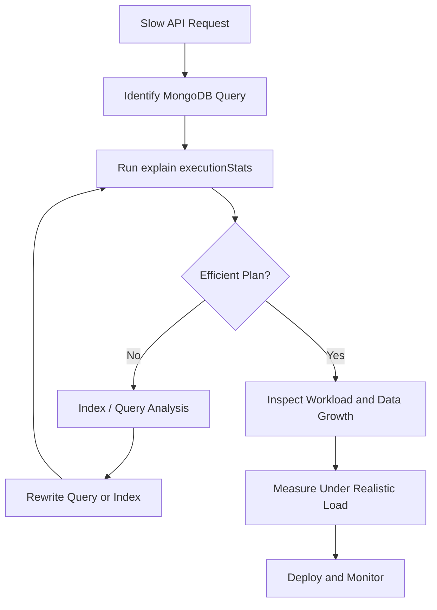

# 09- Query Operators

## Overview

MongoDB query operators define how documents are selected, compared, filtered, and evaluated.

A MongoDB query is typically composed of:

```text
Query Filter
    |
    +-- Field selectors
    |
    +-- Comparison operators
    |
    +-- Logical operators
    |
    +-- Array operators
    |
    +-- Element operators
    |
    +-- Evaluation operators
    |
    +-- Expression operators
    |
    +-- Geospatial operators
```

For example:

```javascript
db.orders.find({
  status: {
    $in: ["pending", "confirmed"]
  },
  total: {
    $gte: 1000
  },
  "items": {
    $elemMatch: {
      quantity: {
        $gte: 2
      }
    }
  }
})
```

Query operators are important because MongoDB does not have a separate SQL-style `WHERE` language. The filter document itself represents the query predicate.

Senior-level MongoDB query design requires understanding more than operator syntax. The important questions are:

- Can the query use an index?
- Does the predicate match the intended documents?
- Does it behave correctly with missing fields and `null`?
- Does it work correctly with arrays?
- Is the query selective enough?
- Does it scale with collection growth?
- Can user input safely be mapped into it?
- What does the query planner actually execute?

---

## Query Filter Structure

A basic query uses field equality:

```javascript
db.users.find({
  status: "active"
})
```

Multiple fields are implicitly combined with logical AND:

```javascript
db.users.find({
  status: "active",
  country: "IN"
})
```

Conceptually:

```text
status = "active"
AND
country = "IN"
```

Operators can be applied to individual fields:

```javascript
db.orders.find({
  total: {
    $gte: 1000
  }
})
```

Or at the top level:

```javascript
db.orders.find({
  $or: [
    { status: "pending" },
    { total: { $gte: 10000 } }
  ]
})
```

---

## Query Operator Categories

| Category | Important operators | Primary purpose |
|---|---|---|
| Comparison | `$eq`, `$ne`, `$gt`, `$gte`, `$lt`, `$lte`, `$in`, `$nin` | Compare values |
| Logical | `$and`, `$or`, `$nor`, `$not` | Combine predicates |
| Element | `$exists`, `$type` | Inspect field presence/type |
| Evaluation | `$regex`, `$expr`, `$jsonSchema`, `$mod` | Evaluate expressions or values |
| Array | `$all`, `$elemMatch`, `$size` | Query arrays |
| Geospatial | `$near`, `$geoWithin`, `$geoIntersects` | Spatial queries |
| Bitwise | `$bitsAllSet`, `$bitsAnySet`, `$bitsAllClear`, `$bitsAnyClear` | Bit-level matching |

The operator should match the access pattern. Avoid using a complex operator simply because it can express a query when a simpler and more index-friendly predicate exists.

## Comparison Operators

Comparison operators compare a field against one or more values.

| Operator | Meaning |
|---|---|
| `$eq` | Equal |
| `$ne` | Not equal |
| `$gt` | Greater than |
| `$gte` | Greater than or equal |
| `$lt` | Less than |
| `$lte` | Less than or equal |
| `$in` | Matches any supplied value |
| `$nin` | Matches none of the supplied values |

---

## `$eq`

`$eq` matches an exact value.

```javascript
db.users.find({
  status: {
    $eq: "active"
  }
})
```

For simple equality, the shorter form is usually preferred:

```javascript
db.users.find({
  status: "active"
})
```

Both express the same basic predicate.

### Production Considerations

Equality predicates are commonly index-friendly.

For example:

```javascript
db.users.createIndex({
  status: 1
})
```

can support queries filtering by `status`, although actual usefulness depends on selectivity and workload.

---

## `$ne`

`$ne` matches values that are not equal to the specified value.

```javascript
db.users.find({
  status: {
    $ne: "deleted"
  }
})
```

Be careful with `$ne`.

A predicate such as:

```javascript
{
  status: {
    $ne: "deleted"
  }
}
```

may match a large percentage of a collection.

Low-selectivity negative predicates are often less useful for efficient index-driven retrieval than highly selective positive predicates.

Also remember that missing-field behavior matters. If the application means "field exists and is not deleted", `$ne` alone may not express the intended contract.

A more explicit query can be:

```javascript
db.users.find({
  status: {
    $exists: true,
    $ne: "deleted"
  }
})
```

---

## `$gt`

Matches values greater than the specified value.

```javascript
db.orders.find({
  total: {
    $gt: 5000
  }
})
```

Useful for:

- Numeric ranges
- Dates
- Versions
- Metrics
- Threshold queries

Example with dates:

```javascript
db.orders.find({
  created_at: {
    $gt: ISODate("2026-09-01T00:00:00Z")
  }
})
```

---

## `$gte`

Matches values greater than or equal to a value.

```javascript
db.orders.find({
  total: {
    $gte: 1000
  }
})
```

Range queries frequently appear in production pagination and reporting workloads.

---

## `$lt`

Matches values less than a value.

```javascript
db.products.find({
  price: {
    $lt: 1000
  }
})
```

---

## `$lte`

Matches values less than or equal to a value.

```javascript
db.products.find({
  price: {
    $lte: 1000
  }
})
```

---

## Range Queries

A common production pattern combines two comparison operators:

```javascript
db.orders.find({
  total: {
    $gte: 1000,
    $lt: 5000
  }
})
```

This means:

```text
1000 <= total < 5000
```

Date ranges are similarly common:

```javascript
db.events.find({
  created_at: {
    $gte: ISODate("2026-09-01T00:00:00Z"),
    $lt: ISODate("2026-10-01T00:00:00Z")
  }
})
```

Using an exclusive upper bound is often convenient for time-window queries because adjacent ranges do not overlap.

---

## `$in`

`$in` matches any value from a supplied list.

```javascript
db.orders.find({
  status: {
    $in: [
      "pending",
      "confirmed",
      "processing"
    ]
  }
})
```

It is useful when a bounded set of values is known.

For example:

```text
API request
   ↓
Allowed status values
   ↓
$in query
   ↓
MongoDB
```

### Production Considerations

Avoid constructing enormous `$in` arrays from unbounded API input.

Instead:

- Validate input size.
- Enforce maximum request sizes.
- Consider batching.
- Use appropriate indexes.
- Measure query performance.

---

## `$nin`

`$nin` matches values not present in the specified list.

```javascript
db.orders.find({
  status: {
    $nin: [
      "cancelled",
      "deleted"
    ]
  }
})
```

Like `$ne`, `$nin` can have low selectivity.

If most documents satisfy the condition, the query may still require substantial work.

---

## Logical Operators

Logical operators combine query predicates.

| Operator | Purpose |
|---|---|
| `$and` | All conditions must match |
| `$or` | At least one condition must match |
| `$nor` | None of the conditions may match |
| `$not` | Negates a field-level condition |

---

## `$and`

Explicit AND:

```javascript
db.users.find({
  $and: [
    { status: "active" },
    { country: "IN" }
  ]
})
```

For ordinary field predicates, implicit AND is simpler:

```javascript
db.users.find({
  status: "active",
  country: "IN"
})
```

Explicit `$and` becomes more useful when multiple predicates target the same field.

```javascript
db.products.find({
  $and: [
    { price: { $gte: 100 } },
    { price: { $lte: 1000 } }
  ]
})
```

---

## `$or`

Matches documents satisfying at least one predicate.

```javascript
db.orders.find({
  $or: [
    { status: "pending" },
    { priority: "high" }
  ]
})
```

`$or` can still use indexes, but each branch and the resulting plan should be evaluated with `explain()` for performance-sensitive workloads.

Potential index strategy:

```javascript
db.orders.createIndex({
  status: 1
})

db.orders.createIndex({
  priority: 1
})
```

Whether this is optimal depends on the actual workload and query plan.

---

## `$nor`

Matches documents that satisfy none of the specified predicates.

```javascript
db.users.find({
  $nor: [
    { status: "deleted" },
    { status: "suspended" }
  ]
})
```

Negative queries should be evaluated carefully because they can have poor selectivity.

---

## `$not`

`$not` negates a field-level operator.

```javascript
db.products.find({
  price: {
    $not: {
      $gt: 1000
    }
  }
})
```

Prefer a positive predicate when the business requirement can be expressed clearly that way.

Negative predicates often make index behavior and selectivity less favorable.

---

## Element Operators

Element operators inspect the existence or BSON type of fields.

| Operator | Purpose |
|---|---|
| `$exists` | Checks whether a field exists |
| `$type` | Matches a BSON type |

---

## `$exists`

Example:

```javascript
db.users.find({
  phone: {
    $exists: true
  }
})
```

This is useful for:

- Schema migrations
- Optional fields
- Legacy documents
- Data-quality analysis

To find documents where a field does not exist:

```javascript
db.users.find({
  phone: {
    $exists: false
  }
})
```

### Missing vs `null`

These are different concepts.

A query such as:

```javascript
db.users.find({
  phone: null
})
```

can match documents where `phone` is `null` and documents where the field is missing.

If the application needs to distinguish them, use `$exists` explicitly.

For example:

```javascript
db.users.find({
  phone: {
    $exists: true,
    $eq: null
  }
})
```

---

## `$type`

`$type` matches documents based on BSON type.

```javascript
db.users.find({
  age: {
    $type: "int"
  }
})
```

It is useful for detecting schema inconsistencies.

For example:

```text
Expected:
age -> int

Existing data:
age -> int
age -> string
age -> null
age -> missing
```

A `$type` query can identify incompatible documents before a migration or validator rollout.

---

## Evaluation Operators

Evaluation operators evaluate values, expressions, or patterns.

Important operators include:

- `$regex`
- `$expr`
- `$mod`
- `$jsonSchema`
- `$text`
- `$where`

Some operators have specialized indexing and operational behavior and should not be treated as interchangeable.

---

## `$regex`

Regex matching:

```javascript
db.users.find({
  email: {
    $regex: "^alice",
    $options: "i"
  }
})
```

### Prefix Regex

A prefix pattern such as:

```text
^alice
```

can be more index-friendly than an arbitrary substring search.

### Substring Search

This:

```javascript
{
  name: {
    $regex: "lic"
  }
}
```

generally requires substantially more work than a selective prefix query.

For production search functionality, consider:

- Properly designed indexes
- Text search where appropriate
- MongoDB Search where applicable
- Dedicated search infrastructure for advanced requirements

Do not use arbitrary regex queries as a general-purpose search engine.

---

## `$expr`

`$expr` allows aggregation expressions inside a query predicate.

Example:

```javascript
db.orders.find({
  $expr: {
    $gt: [
      "$total",
      "$discount"
    ]
  }
})
```

This compares two fields within the same document.

Another example:

```javascript
db.accounts.find({
  $expr: {
    $lt: [
      "$balance",
      "$credit_limit"
    ]
  }
})
```

`$expr` is powerful for document-level calculations, but expression-based predicates can be less straightforward to optimize than simple field comparisons.

Use `explain()` for performance-sensitive `$expr` queries.

---

## `$mod`

`$mod` matches numeric values using a modulus operation.

```javascript
db.users.find({
  account_number: {
    $mod: [2, 0]
  }
})
```

This finds values divisible by 2.

It is useful for specialized data-processing queries but is not usually a primary production query pattern.

---

## `$jsonSchema`

`$jsonSchema` allows query-time validation-style matching.

Example:

```javascript
db.users.find({
  $jsonSchema: {
    required: [
      "email"
    ],
    properties: {
      email: {
        bsonType: "string"
      }
    }
  }
})
```

This can be useful for data-quality inspection.

It should not be confused with collection-level schema validation. Collection validation protects writes; `$jsonSchema` in a query selects documents matching a schema.

---

## Array Query Operators

MongoDB arrays require special care because matching semantics differ from scalar fields.

Important operators include:

- `$all`
- `$elemMatch`
- `$size`

---

## Array Equality and Membership

Suppose:

```json
{
  "tags": [
    "mongodb",
    "backend",
    "python"
  ]
}
```

This query:

```javascript
db.posts.find({
  tags: "mongodb"
})
```

matches documents where the array contains `"mongodb"`.

This is useful for simple membership queries.

---

## `$all`

`$all` requires all specified values to appear in an array.

```javascript
db.posts.find({
  tags: {
    $all: [
      "mongodb",
      "python"
    ]
  }
})
```

The array may contain additional values.

Conceptually:

```text
Required:
mongodb
python

Actual:
mongodb
python
backend
```

Result:

```text
match
```

---

## `$elemMatch`

`$elemMatch` is essential when multiple conditions must apply to the same array element.

Consider:

```json
{
  "items": [
    {
      "product_id": "PRD-1001",
      "quantity": 2,
      "price": 500
    },
    {
      "product_id": "PRD-1002",
      "quantity": 10,
      "price": 100
    }
  ]
}
```

Query:

```javascript
db.orders.find({
  items: {
    $elemMatch: {
      quantity: {
        $gte: 5
      },
      price: {
        $lt: 200
      }
    }
  }
})
```

This requires one array element to satisfy both conditions.

This distinction is important.

Without `$elemMatch`, conditions against array fields can have different matching semantics and may match values from different elements.

---

## `$size`

`$size` matches an exact array length.

```javascript
db.users.find({
  roles: {
    $size: 3
  }
})
```

`$size` is useful for data-quality checks and specialized queries.

It is generally not a good primary access pattern when the array size is highly variable because the predicate is not typically served by a normal index in the same way as an equality predicate.

---

## Nested Array Queries

Example:

```json
{
  "profile": {
    "skills": [
      "python",
      "mongodb"
    ]
  }
}
```

Query:

```javascript
db.users.find({
  "profile.skills": "mongodb"
})
```

Nested array queries can use dot notation.

For arrays of documents:

```javascript
db.users.find({
  skills: {
    $elemMatch: {
      name: "python",
      level: "advanced"
    }
  }
})
```

Use `$elemMatch` when multiple conditions must apply to the same embedded array object.

---

## Querying Embedded Documents

Suppose:

```json
{
  "address": {
    "city": "Kolkata",
    "country": "India"
  }
}
```

Dot notation:

```javascript
db.users.find({
  "address.city": "Kolkata"
})
```

An exact embedded-document comparison is different:

```javascript
db.users.find({
  address: {
    city: "Kolkata",
    country: "India"
  }
})
```

Exact embedded-document matching can depend on the complete structure and field ordering semantics.

For production queries, dot notation is often clearer when the requirement is to match specific nested fields.

---

## Querying Nested Fields with Comparison Operators

```javascript
db.users.find({
  "profile.age": {
    $gte: 30
  }
})
```

Nested fields can be indexed:

```javascript
db.users.createIndex({
  "profile.age": 1
})
```

This is useful when the nested field is a stable access pattern.

---

## Query Composition

Real production queries often combine several operator categories.

Example:

```javascript
db.orders.find({
  customer_id: ObjectId("64f000000000000000000001"),
  status: {
    $in: [
      "pending",
      "confirmed"
    ]
  },
  total: {
    $gte: 1000
  },
  "items": {
    $elemMatch: {
      quantity: {
        $gte: 2
      }
    }
  }
})
```

This query combines:

```text
Equality
+
$in
+
Range
+
$elemMatch
```

A senior engineer should evaluate the complete query shape rather than optimizing each operator independently.

---

## Projection Operators

Projection is part of query design because it controls the result shape.

Example:

```javascript
db.orders.find(
  {
    status: "confirmed"
  },
  {
    customer_id: 1,
    total: 1,
    created_at: 1
  }
)
```

Projection can reduce application-side processing and network transfer.

Some projection operators are especially useful with arrays.

### `$slice`

```javascript
db.users.find(
  {
    _id: ObjectId("64f000000000000000000001")
  },
  {
    recent_orders: {
      $slice: 10
    }
  }
)
```

This can limit how much of an array is returned.

Projection does not change the stored document.

---

## Sorting and Query Operators

A query operator determines matching documents, while `sort()` determines their order.

Example:

```javascript
db.orders.find({
  customer_id: ObjectId("64f000000000000000000001"),
  status: "confirmed"
})
.sort({
  created_at: -1
})
.limit(20)
```

A matching index could be:

```javascript
db.orders.createIndex({
  customer_id: 1,
  status: 1,
  created_at: -1
})
```

The exact index should be confirmed using real query plans.

---

## Query Operators and Indexes

Operators have different performance characteristics.

| Operator | Typical index considerations |
|---|---|
| Equality | Usually highly index-friendly |
| Range | Often index-friendly |
| `$in` | Can use indexes; cost depends on list size |
| `$ne` | Often low selectivity |
| `$nin` | Often low selectivity |
| `$or` | Can use suitable indexes per branch |
| `$exists` | Depends on index and field distribution |
| `$regex` | Prefix patterns can be more index-friendly |
| `$expr` | Depends heavily on expression |
| `$size` | Generally not a normal index-driven array-size lookup |
| `$elemMatch` | Can work with multikey indexes |
| Geospatial operators | Require appropriate geospatial indexes |

Never assume that using an index means the query is efficient.

Measure the actual plan.

---

## Query Planner

MongoDB's query planner evaluates possible execution strategies.

A query may produce stages such as:

```text
IXSCAN
  ↓
FETCH
  ↓
SORT
```

or:

```text
COLLSCAN
  ↓
FILTER
```

For production diagnostics:

```javascript
db.orders.find({
  status: "confirmed"
}).explain("executionStats")
```

Important values include:

- `nReturned`
- `totalKeysExamined`
- `totalDocsExamined`
- `executionTimeMillis`

A common warning sign is:

```text
nReturned = 20
totalDocsExamined = 500000
```

This indicates that MongoDB examined far more documents than the application needed.

---

## Query Selectivity

Selectivity describes how effectively a predicate narrows the candidate set.

Consider:

```text
status = "active"
```

If 99% of documents are active, the predicate has low selectivity.

Compare:

```text
order_id = unique identifier
```

which is highly selective.

This matters because an index on a low-selectivity field may provide limited benefit for some workloads.

Senior-level index design considers:

```text
Predicate selectivity
+
Sort requirements
+
Result size
+
Query frequency
+
Write overhead
```

---

## Equality, Sort, Range and ESR

The ESR guideline is a useful starting point for compound index design:

```text
Equality
Sort
Range
```

Suppose the query is:

```javascript
db.orders.find({
  customer_id: ObjectId("64f000000000000000000001"),
  status: "confirmed",
  total: {
    $gte: 1000
  }
})
.sort({
  created_at: -1
})
```

A candidate index might be:

```javascript
db.orders.createIndex({
  customer_id: 1,
  status: 1,
  created_at: -1,
  total: 1
})
```

The exact ordering should be validated against the workload and MongoDB's current planner behavior.

ESR is a guideline, not a mechanical rule.

---

## Covered Queries

A query can sometimes be answered entirely from an index without fetching the full documents.

For example:

```javascript
db.users.createIndex({
  email: 1,
  status: 1
})
```

Query:

```javascript
db.users.find(
  {
    email: "alice@example.com"
  },
  {
    _id: 0,
    email: 1,
    status: 1
  }
)
```

If the query and projection are compatible with the index, MongoDB may avoid fetching the full document.

Covered queries can reduce I/O, but indexes should not be created solely to force coverage without measuring the trade-offs.

---

## Geospatial Operators

MongoDB supports geospatial queries for location-aware applications.

Common operators include:

- `$near`
- `$nearSphere`
- `$geoWithin`
- `$geoIntersects`

A typical GeoJSON document:

```json
{
  "location": {
    "type": "Point",
    "coordinates": [
      88.3639,
      22.5726
    ]
  }
}
```

Coordinates are:

```text
[longitude, latitude]
```

not:

```text
[latitude, longitude]
```

Create a geospatial index:

```javascript
db.restaurants.createIndex({
  location: "2dsphere"
})
```

Then query nearby locations using `$near`.

Geospatial workloads are highly dependent on correct coordinate modeling and indexing.

---

## Bitwise Operators

MongoDB supports bitwise query operators:

| Operator | Meaning |
|---|---|
| `$bitsAllSet` | All specified bits are set |
| `$bitsAnySet` | At least one specified bit is set |
| `$bitsAllClear` | All specified bits are clear |
| `$bitsAnyClear` | At least one specified bit is clear |

These are useful for specialized compact flag representations.

Example:

```javascript
db.devices.find({
  capabilities: {
    $bitsAllSet: 3
  }
})
```

Use bitwise representations only when they genuinely simplify storage or query behavior. They can make APIs and debugging less readable.

---

## Query Operators in Python

PyMongo uses Python dictionaries to represent MongoDB filters.

Example:

```python
query = {
    "status": {
        "$in": ["pending", "confirmed"]
    },
    "total": {
        "$gte": 1000
    },
}

cursor = orders.find(query)
```

Nested queries:

```python
query = {
    "customer.address.city": "Kolkata"
}
```

Array query:

```python
query = {
    "items": {
        "$elemMatch": {
            "product_id": "PRD-1001",
            "quantity": {
                "$gte": 2
            },
        }
    }
}
```

The same query semantics apply regardless of whether the query originates from `mongosh`, PyMongo, FastAPI, or another MongoDB client.

---

## Safe Query Construction in Python

Do not expose raw MongoDB operators directly to untrusted API clients.

Unsafe conceptual design:

```json
{
  "filter": {
    "$where": "..."
  }
}
```

Instead, define an API-level filter model:

```python
from pydantic import BaseModel


class OrderFilter(BaseModel):
    status: str | None = None
    minimum_total: float | None = None
```

Then explicitly map it:

```python
def build_order_query(filters: OrderFilter) -> dict:
    query = {}

    if filters.status is not None:
        query["status"] = filters.status

    if filters.minimum_total is not None:
        query["total"] = {
            "$gte": filters.minimum_total
        }

    return query
```

This provides:

- Input validation
- Operator allowlisting
- Predictable query shapes
- Better security
- Easier performance analysis

---

## Query Operators and REST APIs

An API should generally expose domain-level filtering rather than MongoDB syntax.

Prefer:

```http
GET /orders?status=confirmed&min_total=1000
```

over:

```http
GET /orders?filter={"total":{"$gte":1000}}
```

The service layer can translate:

```text
HTTP parameters
      ↓
Pydantic validation
      ↓
Domain filter
      ↓
MongoDB query
```

This prevents database-specific operators from becoming part of the public API contract.

---

## Query Operators and gRPC

The same principle applies to gRPC.

A protobuf message might contain:

```text
status
minimum_total
created_after
created_before
```

rather than an arbitrary serialized MongoDB filter.

This keeps the API contract independent from the persistence implementation.

---

## Query Operators and Aggregation

Some operators are query predicates, while aggregation expressions belong to aggregation pipelines.

For example:

```javascript
db.orders.find({
  total: {
    $gte: 1000
  }
})
```

is a query predicate.

An aggregation can use:

```javascript
db.orders.aggregate([
  {
    $match: {
      total: {
        $gte: 1000
      }
    }
  },
  {
    $group: {
      _id: "$status",
      total_revenue: {
        $sum: "$total"
      }
    }
  }
])
```

`$match` is particularly important because it can reduce the number of documents entering later aggregation stages.

---

## Query Operator Anti-Patterns

### Arbitrary Client-Supplied Filters

Allowing clients to submit raw MongoDB queries creates security and operational risks.

Use explicit filter models and operator allowlists.

### Large `$in` Lists

A request containing thousands or millions of values can become expensive.

Enforce bounded input sizes and consider batch processing.

### Excessive `$or`

Complex `$or` predicates can produce expensive plans.

Measure each branch and consider whether the data model should change.

### Broad Negative Queries

Queries using:

```text
$ne
$nin
$nor
$not
```

may match most of the collection.

Check selectivity and execution statistics.

### Unbounded Regex

Avoid arbitrary user-controlled regex queries.

They can consume significant database resources and create latency spikes.

### `$where` for Normal Queries

Prefer native operators and expressions.

### `$expr` Everywhere

`$expr` is powerful, but simple field predicates are usually easier to optimize and reason about.

### `$size` as a Primary Access Pattern

If the application frequently needs to query by collection size, reconsider the document model or maintain a derived count.

### Ignoring Missing Fields

`null` and missing fields can have different semantics.

Make the intended behavior explicit with `$exists`.

---

## Query Security

Query construction is an application security boundary.

Potential risks include:

- Operator injection
- Expensive regex queries
- Unbounded result sets
- Large `$in` arrays
- Arbitrary field access
- Unauthorized filtering
- Sensitive-field exposure
- Resource exhaustion

Production APIs should enforce:

```text
Authentication
     ↓
Authorization
     ↓
Input validation
     ↓
Allowed filters
     ↓
Maximum page size
     ↓
Query execution
```

Do not allow clients to choose arbitrary collection names, fields, operators, or projections unless the system is explicitly designed for that use case.

---

## Query Performance Workflow

When a query becomes slow, use a repeatable process:



The process should be:

1. Capture the actual query.
2. Reproduce it with representative data.
3. Run `explain("executionStats")`.
4. Inspect `nReturned`.
5. Compare `totalKeysExamined`.
6. Compare `totalDocsExamined`.
7. Inspect sort stages.
8. Review existing indexes.
9. Test candidate indexes.
10. Measure before and after.
11. Monitor production behavior.

---

## Query Performance Example

Initial query:

```javascript
db.orders.find({
  customer_id: ObjectId("64f000000000000000000001"),
  status: "confirmed"
})
.sort({
  created_at: -1
})
.limit(20)
```

Suppose the execution statistics show:

```text
nReturned: 20
totalKeysExamined: 150000
totalDocsExamined: 150000
```

The query is returning only 20 documents while examining a much larger candidate set.

A candidate compound index:

```javascript
db.orders.createIndex({
  customer_id: 1,
  status: 1,
  created_at: -1
})
```

should then be tested with:

```javascript
db.orders.find({
  customer_id: ObjectId("64f000000000000000000001"),
  status: "confirmed"
})
.sort({
  created_at: -1
})
.limit(20)
.explain("executionStats")
```

The goal is not simply "use an index".

The goal is to reduce unnecessary work while considering:

- Read latency
- Index size
- Write overhead
- Memory usage
- Other query patterns
- Production traffic

---

## Query Operators and Data Modeling

Query operators cannot compensate indefinitely for a poor document model.

Suppose the application repeatedly queries:

```javascript
{
  "customer_id": "...",
  "items.product_id": "...",
  "items.quantity": {
    "$gte": 5
  }
}
```

If the `items` array grows without bounds, the problem may not be the query operator.

The underlying issue may be:

```text
Unbounded array
+
Growing document
+
High write frequency
=
Poor long-term model
```

Possible alternatives include:

- Separate child collection
- Bucket pattern
- Controlled embedding
- Precomputed fields
- Dedicated read model

Query design and data modeling must be evaluated together.

---

## Query Operators and Pagination

A production pagination query commonly combines:

```text
Equality
+
Range
+
Sort
+
Limit
```

Example:

```javascript
db.orders.find({
  customer_id: ObjectId("64f000000000000000000001"),
  created_at: {
    $lt: ISODate("2026-09-21T10:00:00Z")
  }
})
.sort({
  created_at: -1,
  _id: -1
})
.limit(20)
```

A corresponding index might be:

```javascript
db.orders.createIndex({
  customer_id: 1,
  created_at: -1,
  _id: -1
})
```

This is generally more scalable than deep `skip()` pagination for large collections.

---

## Query Operators and Transactions

Operators remain the same inside transactions, but transaction semantics change the operational context.

Example:

```python
with client.start_session() as session:
    with session.start_transaction():
        orders.update_one(
            {"_id": order_id},
            {
                "$set": {
                    "status": "confirmed"
                }
            },
            session=session,
        )

        payments.update_one(
            {"order_id": order_id},
            {
                "$set": {
                    "status": "captured"
                }
            },
            session=session,
        )
```

Transactions should not be used simply to group unrelated reads and writes.

They introduce additional coordination and can increase latency and resource usage.

---

## Query Operators and Replica Sets

Reads may be directed according to read preference.

For example:

```text
Primary
  |
  +---- Secondary
  |
  +---- Secondary
```

A query sent to a secondary may observe data that is behind the primary if replication has not caught up.

Therefore:

```text
Read scalability
+
Read freshness
+
Consistency requirements
```

must be considered together.

For workflows requiring read-after-write guarantees, blindly routing reads to secondaries can create correctness problems.

---

## Query Operators and Sharding

In a sharded cluster, query shape affects routing.

A query containing the shard key can often be targeted:

```javascript
{
  tenant_id: "TENANT-1001",
  status: "active"
}
```

A query without the shard key may require scatter-gather behavior:

```text
mongos
  |
  +---- shard 1
  +---- shard 2
  +---- shard 3
  +---- shard 4
```

This makes query operators part of distributed-system performance.

When designing a sharded application, evaluate:

- Shard-key inclusion
- Query targeting
- Cardinality
- Frequency
- Hot partitions
- Scatter-gather frequency

---

## Common Operator Reference

| Operator | Example | Typical use |
|---|---|---|
| `$eq` | `{status: {$eq: "active"}}` | Equality |
| `$ne` | `{status: {$ne: "deleted"}}` | Negative equality |
| `$gt` | `{total: {$gt: 1000}}` | Greater-than range |
| `$gte` | `{total: {$gte: 1000}}` | Inclusive lower bound |
| `$lt` | `{total: {$lt: 1000}}` | Upper bound |
| `$lte` | `{total: {$lte: 1000}}` | Inclusive upper bound |
| `$in` | `{status: {$in: [...]}}` | Set membership |
| `$nin` | `{status: {$nin: [...]}}` | Negative set membership |
| `$and` | `{$and: [...]}` | All predicates |
| `$or` | `{$or: [...]}` | Any predicate |
| `$nor` | `{$nor: [...]}` | None of predicates |
| `$not` | `{price: {$not: {$gt: 100}}}` | Negation |
| `$exists` | `{email: {$exists: true}}` | Field presence |
| `$type` | `{age: {$type: "int"}}` | BSON type |
| `$regex` | `{name: {$regex: "^Ali"}}` | Pattern matching |
| `$expr` | `{$expr: {$gt: ["$a", "$b"]}}` | Field/expression comparison |
| `$all` | `{tags: {$all: [...]}}` | Array contains all values |
| `$elemMatch` | `{items: {$elemMatch: {...}}}` | Match one array element |
| `$size` | `{tags: {$size: 3}}` | Exact array length |
| `$mod` | `{value: {$mod: [2, 0]}}` | Modulo condition |
| `$geoWithin` | `{location: {$geoWithin: ...}}` | Geographic containment |
| `$near` | `{location: {$near: ...}}` | Nearby locations |

---

## Interview Traps

### `$eq` vs Equality Syntax

These are generally equivalent:

```javascript
{
  status: "active"
}
```

and:

```javascript
{
  status: {
    $eq: "active"
  }
}
```

The first is usually more concise.

### `$ne` Does Not Mean "Field Exists and Is Different"

Missing fields can affect matching behavior.

Use `$exists` when field presence matters.

### `$elemMatch` Is Not Optional for Every Array Query

It becomes critical when multiple conditions must apply to the same embedded array element.

### `$in` Is Not Always Cheap

A very large `$in` list can be expensive even with an index.

### Index Usage Does Not Automatically Mean Good Performance

A query can use an index and still examine far too many keys or documents.

### `$or` Does Not Automatically Mean Collection Scan

MongoDB can use suitable indexes for branches of an `$or`, but the actual plan must be measured.

### `$regex` Is Not General-Purpose Search

Arbitrary regex patterns can be expensive and difficult to scale.

### Query Operators Do Not Replace Data Modeling

A sophisticated query cannot permanently compensate for unbounded arrays, poor cardinality decisions, or inappropriate document boundaries.

---

## Production Checklist

Before deploying a new MongoDB query:

- Confirm the query matches the intended documents.
- Test missing-field and `null` behavior.
- Test array semantics explicitly.
- Validate user-provided filters.
- Restrict supported operators.
- Enforce maximum `$in` list sizes.
- Enforce maximum API page sizes.
- Avoid arbitrary regex from untrusted clients.
- Review the expected index.
- Run `explain("executionStats")`.
- Compare documents returned with documents examined.
- Check sort behavior.
- Test with production-scale data.
- Consider replica-set read behavior.
- Consider shard targeting when applicable.
- Monitor latency and error rates after deployment.

## Key Takeaways

- MongoDB query operators are the building blocks of document selection, but production query design requires understanding matching semantics, indexing, selectivity, concurrency, and data growth.
- Comparison, logical, element, evaluation, array, and geospatial operators should be chosen according to the access pattern rather than merely syntactic convenience.
- Array queries require particular care: `$elemMatch` is critical when multiple predicates must apply to the same embedded array element, while `$all` and `$size` serve different semantics.
- Query security requires explicit API-level filtering and operator allowlisting; arbitrary client-supplied MongoDB filters can create injection and resource-exhaustion risks.
- Always validate performance with real data and `explain("executionStats")`; an apparently correct query can still be operationally expensive.