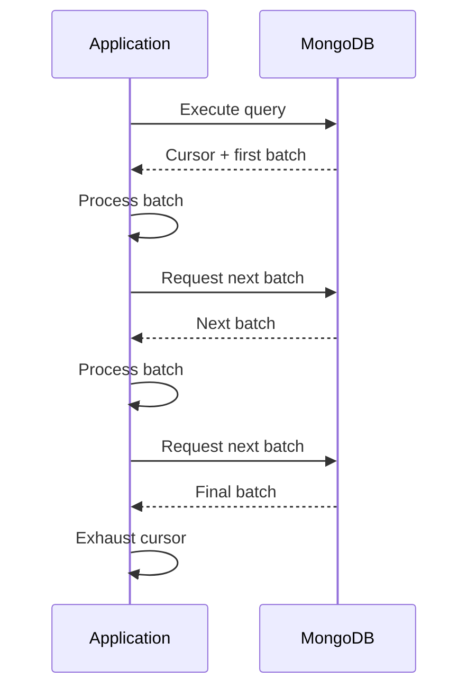

# 10- Projection and Cursors

## Overview

MongoDB query performance is influenced not only by how documents are matched, but also by how results are returned.

Two fundamental mechanisms are:

- **Projection** — controls which fields are returned from matching documents.
- **Cursors** — provide an iterator over query results rather than requiring the application to materialize the entire result set at once.

They are closely related to production API design:

```text
Client
  |
  v
FastAPI / Django
  |
  v
Repository
  |
  v
MongoDB Query
  |
  +---- Filter
  |
  +---- Projection
  |
  +---- Sort
  |
  +---- Limit
  |
  v
Cursor
  |
  v
Application serialization
  |
  v
HTTP / gRPC response
```

Projection primarily controls **result shape and data transfer**.

Cursors primarily control **result traversal and batching**.

Neither mechanism automatically makes a query efficient. Query predicates, indexes, sorting, document size, result cardinality, network behavior, and application processing must still be considered together.

## Projection

Projection specifies which fields MongoDB should return from matching documents.

Suppose a document contains:

```json
{
  "_id": "ObjectId(...)",
  "name": "Alice",
  "email": "alice@example.com",
  "phone": "+919999999999",
  "address": {
    "city": "Kolkata",
    "country": "India"
  },
  "preferences": {
    "notifications": true
  },
  "internal_metadata": {
    "source": "migration"
  }
}
```

An API that only needs:

```text
name
email
city
```

should not necessarily retrieve the entire document.

Projection:

```javascript
db.users.find(
  {
    status: "active"
  },
  {
    name: 1,
    email: 1,
    "address.city": 1
  }
)
```

can reduce the amount of document data passed from MongoDB to the application.

## Why Projection Matters

Without projection:

```text
MongoDB
   |
   | Large document
   v
Network
   |
   v
Application memory
   |
   v
Serialization
   |
   v
HTTP response
```

With appropriate projection:

```text
MongoDB
   |
   | Required fields
   v
Network
   |
   v
Application
   |
   v
Response
```

This can reduce:

- Network bandwidth
- Application memory usage
- BSON decoding work
- Serialization work
- API response size
- Latency for large documents

Projection becomes especially valuable when documents contain large embedded structures or internal metadata that clients do not need.

## Inclusion Projection

Inclusion projection explicitly selects fields.

```javascript
db.users.find(
  {
    status: "active"
  },
  {
    name: 1,
    email: 1,
    status: 1
  }
)
```

The returned document contains the selected fields.

By default, `_id` is still included unless explicitly excluded.

To exclude `_id`:

```javascript
db.users.find(
  {
    status: "active"
  },
  {
    _id: 0,
    name: 1,
    email: 1
  }
)
```

Result:

```json
{
  "name": "Alice",
  "email": "alice@example.com"
}
```

## Exclusion Projection

Projection can instead specify fields to exclude.

```javascript
db.users.find(
  {
    status: "active"
  },
  {
    password_hash: 0,
    internal_metadata: 0
  }
)
```

This returns the document without the excluded fields.

Exclusion projection can be convenient when the document contains a small number of fields that must always be omitted.

## Inclusion vs Exclusion

| Pattern | Example | Use case |
|---|---|---|
| Inclusion | `{name: 1, email: 1}` | API response with known fields |
| Exclusion | `{password_hash: 0}` | Remove a small set of sensitive/internal fields |
| Exclude `_id` | `{_id: 0, name: 1}` | Clean API response |
| Nested inclusion | `{"profile.city": 1}` | Return selected nested fields |
| Nested exclusion | `{"internal.audit": 0}` | Remove internal nested data |

Do not mix inclusion and exclusion arbitrarily.

The main exception is `_id`, which can be explicitly excluded while using inclusion projection.

## Nested Field Projection

Nested fields can be projected using dot notation.

```javascript
db.users.find(
  {},
  {
    _id: 0,
    name: 1,
    "profile.city": 1,
    "profile.country": 1
  }
)
```

This is useful when embedded documents contain substantially more information than the API requires.

Example document:

```json
{
  "name": "Alice",
  "profile": {
    "city": "Kolkata",
    "country": "India",
    "date_of_birth": "1990-01-01",
    "internal_notes": "..."
  }
}
```

Projection can return only:

```json
{
  "name": "Alice",
  "profile": {
    "city": "Kolkata",
    "country": "India"
  }
}
```

## Array Projection

Arrays often require specialized projection.

Suppose:

```json
{
  "name": "Alice",
  "orders": [
    {
      "order_id": "ORD-1001",
      "status": "confirmed"
    },
    {
      "order_id": "ORD-1002",
      "status": "pending"
    }
  ]
}
```

The `$slice` projection operator can limit the number of returned array elements.

```javascript
db.users.find(
  {
    name: "Alice"
  },
  {
    orders: {
      $slice: 5
    }
  }
)
```

This returns only a subset of the array.

It is useful when the stored array is bounded but contains more elements than the API needs to display.

## `$slice` Projection

`$slice` can return:

- The first N elements
- The last N elements
- A specific window of elements

Examples:

```javascript
{
  orders: {
    $slice: 5
  }
}
```

First five elements.

```javascript
{
  orders: {
    $slice: -5
  }
}
```

Last five elements.

```javascript
{
  orders: {
    $slice: [10, 5]
  }
}
```

Five elements starting from offset 10.

For large or unbounded arrays, `$slice` should not be treated as a substitute for correct data modeling. An ever-growing array can still create large documents and expensive updates.

## Positional Array Projection

When a query identifies an array element, projection can sometimes return the matching array element using the positional projection operator.

Example:

```javascript
db.orders.find(
  {
    "items.product_id": "PRD-1001"
  },
  {
    "items.$": 1
  }
)
```

This is useful for retrieving a matching array element without returning the entire array.

For more complex array transformations, aggregation operators such as `$filter` may be more appropriate.

## Projection with `$elemMatch`

Projection can also use `$elemMatch` for array selection.

```javascript
db.orders.find(
  {
    customer_id: "CUS-1001"
  },
  {
    items: {
      $elemMatch: {
        product_id: "PRD-1001"
      }
    }
  }
)
```

This can return the first array element matching the specified condition.

For complex response shaping, prefer an aggregation pipeline when the projection logic becomes difficult to express or maintain with normal `find()` projection.

## Projection and Security

Projection should not be considered a complete authorization mechanism.

This is dangerous:

```javascript
db.users.find(
  {
    _id: user_id
  },
  {
    password_hash: 0
  }
)
```

The exclusion is useful, but security should not depend only on developers remembering to exclude sensitive fields.

A stronger design is to define explicit response models.

For FastAPI:

```python
from pydantic import BaseModel


class UserResponse(BaseModel):
    id: str
    name: str
    email: str
```

Then map database documents into the response model.

The architecture becomes:

```text
MongoDB document
      |
      v
Repository projection
      |
      v
Domain/service object
      |
      v
API response model
      |
      v
Client
```

This provides defense in depth.

## Projection and Covered Queries

Projection can contribute to a covered query.

Suppose:

```javascript
db.users.createIndex({
  email: 1,
  status: 1
})
```

Query:

```javascript
db.users.find(
  {
    email: "alice@example.com"
  },
  {
    _id: 0,
    email: 1,
    status: 1
  }
)
```

If the query predicate and required projected fields can be satisfied entirely from the index, MongoDB may avoid fetching the full documents.

Conceptually:

```text
Query
  |
  v
Index
  |
  +---- email
  +---- status
  |
  v
Result
```

instead of:

```text
Query
  |
  v
Index
  |
  v
Document FETCH
  |
  v
Result
```

Covered queries can reduce document I/O, but they should be treated as an optimization rather than the default reason to create indexes.

## Projection Does Not Replace Indexing

This query:

```javascript
db.orders.find(
  {
    status: "confirmed"
  },
  {
    _id: 0,
    order_id: 1
  }
)
```

may return only one small field, but if `status` is not efficiently indexed, MongoDB may still scan a large number of documents.

Projection reduces returned data.

Indexes reduce the work required to locate matching documents.

These are separate optimization mechanisms.

```text
Filter
  ↓
Index design
  ↓
Candidate documents
  ↓
Projection
  ↓
Result payload
```

## Projection and Query Planner Behavior

A senior engineer should inspect both filtering and projection when diagnosing performance.

Use:

```javascript
db.orders.find(
  {
    customer_id: ObjectId("64f000000000000000000001"),
    status: "confirmed"
  },
  {
    _id: 0,
    order_id: 1,
    total: 1
  }
).explain("executionStats")
```

Inspect:

- `nReturned`
- `totalKeysExamined`
- `totalDocsExamined`
- `executionTimeMillis`
- Winning plan
- Whether a `FETCH` stage exists
- Whether the projection is index-covered

The goal is to understand where the work occurs.

## Cursors

A cursor represents an iterable result set returned by a MongoDB query.

For example:

```javascript
const cursor = db.orders.find({
  status: "confirmed"
})
```

The cursor can then be iterated:

```javascript
cursor.forEach(doc => {
  print(doc.order_id)
})
```

Conceptually:

```text
Query
  |
  v
MongoDB query execution
  |
  v
Cursor
  |
  +---- Batch 1
  +---- Batch 2
  +---- Batch 3
  +---- ...
```

A cursor does not mean that MongoDB has necessarily loaded the entire result set into application memory.

The driver fetches results in batches.

## Why Cursors Exist

Returning millions of documents as one materialized collection would create significant memory and network pressure.

A cursor enables incremental processing:

```text
MongoDB
   |
   v
Batch
   |
   v
Application
   |
   v
Process
   |
   v
Next batch
```

This is particularly important for:

- ETL
- Batch jobs
- Data migrations
- Analytics processing
- Administrative scripts
- Large exports
- Background workers

## Cursor Lifecycle

A simplified lifecycle is:



The exact wire protocol behavior is driver-managed, but the important architectural idea is that result retrieval can happen incrementally.

## Cursor in PyMongo

A typical PyMongo query returns a cursor:

```python
cursor = collection.find(
    {"status": "confirmed"},
    {
        "_id": 1,
        "order_id": 1,
        "total": 1,
    },
)

for order in cursor:
    process_order(order)
```

The application does not need to create a Python list containing every matching document.

Avoid:

```python
orders = list(
    collection.find({
        "status": "confirmed"
    })
)
```

when the result set can be large.

`list()` materializes the complete result set in application memory.

## Cursor Batches

MongoDB drivers retrieve query results in batches.

PyMongo allows batch sizing:

```python
cursor = collection.find(
    {"status": "confirmed"}
).batch_size(500)
```

Batch size affects how results are transferred between the database and application.

A larger batch can reduce network round trips but increases memory usage and can delay the processing of individual batches.

A smaller batch can reduce memory usage but may increase network overhead.

There is no universally optimal value.

Measure using the actual workload.

## Batch Size Is Not a Result Limit

This distinction is important.

```python
cursor = collection.find(
    {"status": "confirmed"}
).batch_size(500)
```

does not mean:

```text
Return only 500 documents.
```

It means approximately:

```text
Retrieve results in batches around this size.
```

To limit total results:

```python
cursor = collection.find(
    {"status": "confirmed"}
).limit(500)
```

The two controls serve different purposes.

| Feature | Purpose |
|---|---|
| `limit()` | Maximum number of results |
| `batch_size()` | Result transfer batching |
| `skip()` | Offset within result set |
| `sort()` | Result ordering |
| Cursor iteration | Incremental consumption |

## Cursor Lifetime

A cursor may remain open while the application is consuming results.

Production applications should avoid unnecessarily long-lived cursors.

Potential problems include:

- Resource consumption
- Abandoned cursors
- Long-running operations
- Network failures
- Application crashes
- Operational difficulty

For large batch jobs, process results efficiently and close resources appropriately.

PyMongo cursors support explicit closing:

```python
cursor = collection.find({
    "status": "confirmed"
})

try:
    for document in cursor:
        process_document(document)
finally:
    cursor.close()
```

A context manager can also be used where appropriate.

## Cursor Timeout

MongoDB cursors can have timeout behavior for inactive cursors.

For long-running administrative or batch workloads, applications should understand cursor lifetime and server-side timeout behavior.

A cursor that remains inactive for too long may no longer be available.

Do not solve every long-running workload by blindly disabling cursor timeout.

Instead ask:

- Why is the cursor idle?
- Can processing be made faster?
- Can the workload be partitioned?
- Should the operation use a batch job?
- Can the query be narrowed?

## `no_cursor_timeout`

For specific long-running workloads, PyMongo supports:

```python
cursor = collection.find(
    {"status": "pending"},
    no_cursor_timeout=True,
)
```

This should be used carefully.

A cursor that is never closed can consume server-side resources.

If this option is used, the application must have strong lifecycle management:

```text
Open cursor
   ↓
Process
   ↓
Exception?
   ↓
Cleanup
   ↓
Close cursor
```

Do not use `no_cursor_timeout=True` as a generic performance setting.

## Cursor and Large Data Processing

For a large migration:

```python
cursor = collection.find(
    {"migration_version": {"$lt": 2}},
    {
        "_id": 1,
        "migration_version": 1,
    },
).batch_size(500)

for document in cursor:
    migrate(document)
```

A production migration should also consider:

- Batch size
- Retry behavior
- Idempotency
- Write rate
- Replication lag
- Lock/resource pressure
- Error handling
- Progress tracking
- Restartability

A cursor makes processing incremental, but it does not make an expensive migration inherently cheap.

## Cursor and Pagination

Cursors are also related to API pagination, but a database cursor should not normally be exposed directly to an HTTP client.

Instead:

```text
MongoDB cursor
      |
      v
Application pagination logic
      |
      v
Opaque API cursor
      |
      v
Client
```

For example, an API can return:

```json
{
  "items": [
    {
      "id": "ORD-1001"
    }
  ],
  "next_cursor": "eyJjcmVhdGVkX2F0Ijoi...\""
}
```

The client sends the opaque token back.

The server converts it into a MongoDB range query.

## Offset Pagination

A simple API implementation may use:

```javascript
db.orders.find({
  customer_id: "CUS-1001"
})
.sort({
  created_at: -1
})
.skip(100)
.limit(20)
```

This is easy to implement.

However, deep offsets can become expensive because MongoDB must advance through skipped results.

For large collections, prefer keyset or cursor-based pagination.

## Keyset Pagination

Suppose the ordering is:

```javascript
{
  created_at: -1,
  _id: -1
}
```

First page:

```javascript
db.orders.find({
  customer_id: "CUS-1001"
})
.sort({
  created_at: -1,
  _id: -1
})
.limit(20)
```

The application records the last document:

```json
{
  "created_at": "2026-09-21T10:00:00Z",
  "_id": "ObjectId(...)"
}
```

The next query uses that value as the cursor boundary:

```javascript
db.orders.find({
  customer_id: "CUS-1001",
  $or: [
    {
      created_at: {
        $lt: ISODate("2026-09-21T10:00:00Z")
      }
    },
    {
      created_at: ISODate("2026-09-21T10:00:00Z"),
      _id: {
        $lt: ObjectId("64f000000000000000000001")
      }
    }
  ]
})
.sort({
  created_at: -1,
  _id: -1
})
.limit(20)
```

A suitable index might be:

```javascript
db.orders.createIndex({
  customer_id: 1,
  created_at: -1,
  _id: -1
})
```

The `_id` component provides deterministic ordering when timestamps are identical.

## Database Cursor vs API Cursor

These concepts should not be confused.

| Database cursor | API pagination cursor |
|---|---|
| MongoDB driver/server mechanism | Application-level contract |
| Represents database query results | Represents pagination position |
| Usually short-lived | Can survive across HTTP requests |
| Managed by driver | Encoded and managed by application |
| Not suitable for client exposure | Designed for client use |
| Tied to query execution | Usually represents a stable sort boundary |

A database cursor generally should not be serialized into a REST response.

## Stable Pagination Ordering

Cursor-based pagination requires deterministic ordering.

Avoid relying only on:

```javascript
.sort({
  created_at: -1
})
```

when multiple documents can have identical timestamps.

Prefer:

```javascript
.sort({
  created_at: -1,
  _id: -1
})
```

The second field provides a deterministic tie-breaker.

The cursor should encode both values.

## Cursor Tokens

An API cursor can encode:

```json
{
  "created_at": "2026-09-21T10:00:00Z",
  "id": "64f000000000000000000001"
}
```

The server can serialize this into an opaque token.

Example conceptual implementation:

```python
from base64 import urlsafe_b64encode
import json


def encode_cursor(created_at: str, object_id: str) -> str:
    payload = {
        "created_at": created_at,
        "id": object_id,
    }

    raw = json.dumps(
        payload,
        separators=(",", ":"),
    ).encode()

    return urlsafe_b64encode(raw).decode()
```

In production, cursor tokens should be:

- Opaque
- Validated
- Bounded in size
- Protected against tampering where necessary
- Versioned if the pagination contract may evolve

Do not expose internal query structures unnecessarily.

## Cursor-Based API Example

A FastAPI-style endpoint can conceptually use:

```python
from fastapi import APIRouter, Query

router = APIRouter()


@router.get("/orders")
def list_orders(
    customer_id: str,
    limit: int = Query(default=20, ge=1, le=100),
    cursor: str | None = None,
):
    query = {
        "customer_id": customer_id,
    }

    if cursor is not None:
        query.update(decode_cursor(cursor))

    documents = (
        orders.find(
            query,
            {
                "_id": 1,
                "status": 1,
                "total": 1,
                "created_at": 1,
            },
        )
        .sort(
            [
                ("created_at", -1),
                ("_id", -1),
            ]
        )
        .limit(limit + 1)
    )

    results = list(documents)

    has_more = len(results) > limit
    items = results[:limit]

    return {
        "items": items,
        "next_cursor": (
            create_cursor(items[-1])
            if has_more and items
            else None
        ),
    }
```

The extra document allows the application to determine whether another page exists without issuing a separate count query.

The cursor decoding logic must validate the cursor structure and types before constructing the MongoDB query.

## Why Use `limit + 1`

Suppose the API asks for:

```text
20 items
```

Querying:

```text
limit(20)
```

does not tell the application whether there is a 21st item.

Instead:

```text
limit(21)
```

allows the application to determine:

```text
21 returned
    ↓
has_more = true
    ↓
return first 20
```

This avoids a separate:

```javascript
countDocuments()
```

for every page.

A count query may be substantially more expensive than simply fetching one additional document.

## Counting Results

MongoDB provides count operations such as:

```javascript
db.orders.countDocuments({
  status: "confirmed"
})
```

For APIs, avoid automatically running a full count for every paginated request.

Ask whether the client actually needs:

```text
total_count
```

If the API only needs:

```text
items
+
has_more
+
next_cursor
```

a count may be unnecessary.

## `estimatedDocumentCount()`

For an approximate collection-level count:

```javascript
db.orders.estimatedDocumentCount()
```

This is different from:

```javascript
db.orders.countDocuments({
  status: "confirmed"
})
```

`estimatedDocumentCount()` is intended for estimating the total number of documents in a collection and does not provide filtered counts.

Do not use it when the API requires an exact filtered count.

## Cursors and Projection Together

Projection and cursors work particularly well together for large reads.

Example:

```python
cursor = (
    orders.find(
        {
            "status": "confirmed",
        },
        {
            "_id": 1,
            "order_id": 1,
            "customer_id": 1,
            "total": 1,
        },
    )
    .sort("created_at", -1)
    .batch_size(500)
)
```

This provides:

```text
Selective filter
      +
Useful projection
      +
Stable ordering
      +
Controlled batching
      =
Efficient large-result processing
```

The query still requires appropriate indexes.

## Large Export Workflow

For a large export:

```text
MongoDB
   |
   v
Indexed filter
   |
   v
Projection
   |
   v
Cursor
   |
   +---- batch
   +---- batch
   +---- batch
   |
   v
Streaming writer
   |
   v
Object storage / file
```

Example:

```python
cursor = collection.find(
    {"created_at": {"$gte": start_date}},
    {
        "_id": 1,
        "customer_id": 1,
        "total": 1,
        "created_at": 1,
    },
).batch_size(1000)

for document in cursor:
    write_to_output(document)
```

Do not construct:

```python
all_documents = list(cursor)
```

for an unbounded export.

## Projection and Network Cost

Suppose an average document is:

```text
200 KB
```

and an endpoint returns:

```text
100 documents
```

A full-document query could transfer roughly:

```text
200 KB × 100 = 20 MB
```

before considering protocol overhead.

If projection reduces each response document to:

```text
10 KB
```

the corresponding payload is approximately:

```text
10 KB × 100 = 1 MB
```

The actual savings depend on BSON representation, compression, driver behavior, and response serialization, but the principle is important:

```text
Large document
    ↓
Projection
    ↓
Smaller result
    ↓
Less data transferred and processed
```

## Projection and Compression

Network compression can reduce transferred bytes, but compression does not eliminate the cost of:

- BSON decoding
- Memory allocation
- Application serialization
- CPU processing
- API response generation

Do not treat compression as a replacement for sensible projection.

## Projection and Working Set

Projection does not necessarily mean MongoDB avoids reading the complete underlying document from storage.

If the query requires a `FETCH` stage, MongoDB may still need to retrieve the document after using an index.

The strongest I/O reduction can occur when the query is covered by an index.

Therefore:

```text
Projection alone
```

and:

```text
Projection + covering index
```

are different optimization scenarios.

Measure both.

## Cursor Performance

Cursor performance depends on:

- Query selectivity
- Index design
- Result count
- Document size
- Projection
- Batch size
- Network latency
- Application processing speed
- MongoDB server resources

A cursor does not make a bad query good.

For example:

```javascript
db.orders.find({
  status: "active"
})
```

with millions of matching documents remains an expensive operation even when consumed through a cursor.

The cursor only changes how the results are consumed.

## Cursor Backpressure

For streaming or batch-processing applications, application throughput can be slower than MongoDB result production.

Conceptually:

```text
MongoDB
   |
   | Fast
   v
Cursor
   |
   v
Application processing
   |
   | Slow
   v
External API / Kafka / S3
```

The application should process results at a sustainable rate.

For Celery workers, ETL pipelines, or Kafka consumers, consider:

- Batch size
- Worker concurrency
- Database load
- External service rate limits
- Retry behavior
- Checkpointing
- Memory usage

Do not maximize cursor batch size without measuring downstream capacity.

## Cursor and Connection Pooling

Each application instance may maintain a MongoDB connection pool.

A cursor uses a connection while database operations are being performed.

Large numbers of concurrent long-running operations can increase:

- Pool utilization
- Server connections
- Memory usage
- Latency
- Queueing

A typical backend architecture should configure:

```text
MongoClient
    |
    +---- Connection pool
            |
            +---- Request 1
            +---- Request 2
            +---- Request 3
```

Create a shared `MongoClient` rather than constructing one per request.

Example:

```python
from pymongo import MongoClient

client = MongoClient(
    MONGODB_URI,
    maxPoolSize=100,
    minPoolSize=10,
    serverSelectionTimeoutMS=5000,
)
```

Pool values should be sized according to application concurrency and MongoDB capacity rather than copied blindly.

## Cursor and Transactions

Cursors can also be used within transactional workflows, but transaction lifetime should remain short.

Avoid:

```text
Start transaction
    ↓
Open large cursor
    ↓
Process thousands of documents
    ↓
Call external API
    ↓
Wait
    ↓
Commit
```

Long-running transactions increase resource usage and can create operational pressure.

Prefer short, bounded transactions and move long-running processing outside transactional boundaries where the business model allows it.

## Cursor and Read Preference

When a cursor reads from a replica set, its behavior is affected by the selected read preference.

For example:

```text
Primary
  |
  +---- Secondary A
  |
  +---- Secondary B
```

Reading from secondaries may improve read scalability, but secondary lag can affect freshness.

For pagination, consistency requirements should be considered carefully.

If data changes significantly between requests, page boundaries can shift.

Cursor-based pagination reduces some problems associated with offset pagination, but it does not create snapshot isolation across separate API requests.

## Pagination Under Concurrent Writes

Suppose the first page is:

```text
ORD-100
ORD-099
ORD-098
```

A new document is inserted before the second request.

With offset pagination:

```text
skip(3)
```

the new document can shift the result set and cause duplicates or skipped records.

Cursor-based pagination uses a value boundary instead:

```text
created_at < last_seen_created_at
```

This makes pagination more stable for append-oriented datasets.

For strict snapshot semantics across multiple pages, a more sophisticated design is required.

## Common Projection Mistakes

### Returning Entire Documents by Default

Large documents increase network and serialization costs.

Use explicit projections for performance-sensitive endpoints.

### Assuming Projection Always Avoids Document Reads

A projection may still require a document fetch.

Use `explain()` to determine whether the query is covered.

### Exposing Sensitive Fields

Do not rely solely on exclusion projection.

Use explicit response models and authorization.

### Overusing Nested Projection

Extremely complex projections can become difficult to maintain.

Move complicated response shaping into aggregation or application logic when appropriate.

### Treating `$slice` as a Data-Modeling Solution

Limiting returned array elements does not solve unbounded document growth.

## Common Cursor Mistakes

### Converting Large Cursors to Lists

Avoid:

```python
documents = list(
    collection.find({})
)
```

for large collections.

Process incrementally instead.

### Confusing `batch_size()` with `limit()`

`batch_size()` controls transfer behavior.

`limit()` controls result count.

### Keeping Cursors Open Unnecessarily

Long-lived cursors consume resources.

Process data efficiently and close cursors.

### Disabling Cursor Timeout Without Cleanup

`no_cursor_timeout=True` requires explicit lifecycle management.

### Using Database Cursors as API Tokens

A MongoDB cursor is not a durable HTTP pagination token.

Create an application-level opaque cursor.

### Using Offset Pagination at Massive Scale

Deep `skip()` pagination can become expensive.

Prefer keyset/cursor-based pagination.

## Interview Traps

### "Projection means MongoDB only reads those fields from disk."

Not necessarily.

If the query is not covered, MongoDB may still fetch the complete document and then apply projection.

### "A cursor loads all results into memory."

Not normally.

Drivers retrieve results incrementally in batches.

### "`batch_size(100)` means only 100 results."

No.

It controls batching, not the total result count.

### "Cursor pagination and MongoDB cursors are the same thing."

They are related concepts but not the same abstraction.

Database cursors represent query-result traversal. API cursors represent a stable pagination position.

### "Projection automatically improves query performance."

Not necessarily.

Projection can reduce result payload and application work, but the query may still scan a large number of documents.

### "`skip()` is always bad."

No.

Offset pagination is often perfectly reasonable for small datasets and shallow pages.

The concern is scalability at large offsets and high-volume workloads.

## Production Checklist

Before deploying a projection or cursor-based query:

- Return only fields required by the application.
- Exclude sensitive fields defensively.
- Prefer explicit response models for public APIs.
- Check whether projection enables a covered query.
- Run `explain("executionStats")`.
- Verify `totalDocsExamined`.
- Verify `totalKeysExamined`.
- Use indexes matching the actual filter and sort.
- Enforce maximum API page sizes.
- Prefer cursor-based pagination for large datasets.
- Use deterministic sort keys.
- Include `_id` as a tie-breaker when appropriate.
- Treat API cursors as opaque tokens.
- Validate and protect cursor contents.
- Do not materialize unbounded result sets.
- Tune cursor batch sizes based on measurements.
- Close long-running cursors reliably.
- Avoid unnecessary long-lived database cursors.
- Monitor connection-pool utilization.
- Consider replica lag for secondary reads.
- Test pagination behavior under concurrent writes.

## Troubleshooting

### Large API Response

```text
Symptom
↓
API response is larger and slower than expected
↓
Possible causes
↓
Full documents returned, large embedded arrays, unnecessary fields, large result set
↓
Isolation strategy
↓
Inspect the MongoDB projection and serialized API response size
↓
Diagnostic commands
↓
Run the query with and without projection and inspect execution statistics
↓
Root cause
↓
Endpoint returns fields that clients do not require
↓
Corrective action
↓
Add explicit projection and response-model filtering
↓
Prevention
↓
Define response contracts and review document payload sizes
```

### High Memory Usage During Batch Processing

```text
Symptom
↓
Worker memory grows continuously during a MongoDB read
↓
Possible causes
↓
Cursor materialized into a list, excessive batch size, application buffering
↓
Isolation strategy
↓
Inspect cursor consumption and application memory usage
↓
Diagnostic commands
↓
Review Python cursor usage and batch configuration
↓
Root cause
↓
Application materializes too many documents before processing
↓
Corrective action
↓
Iterate over the cursor incrementally and tune batch_size()
↓
Prevention
↓
Streaming/batch-processing patterns and memory tests
```

### Deep Pagination Becomes Slow

```text
Symptom
↓
Later API pages have significantly higher latency
↓
Possible causes
↓
Large skip offsets, inefficient sort, missing compound index
↓
Isolation strategy
↓
Compare shallow and deep page execution plans
↓
Diagnostic commands
↓
Run explain("executionStats") for representative page positions
↓
Root cause
↓
MongoDB must advance through a large number of skipped results
↓
Corrective action
↓
Move to keyset/cursor-based pagination with a supporting index
↓
Prevention
↓
Use cursor pagination for high-volume collections
```

### Pagination Produces Duplicates

```text
Symptom
↓
Items appear on multiple API pages
↓
Possible causes
↓
Unstable sort order, concurrent inserts/updates, offset pagination
↓
Isolation strategy
↓
Inspect the ordering fields and page-boundary logic
↓
Diagnostic commands
↓
Compare page queries and sort keys
↓
Root cause
↓
Pagination depends on a non-deterministic or shifting offset
↓
Corrective action
↓
Use a deterministic compound sort and cursor boundary
↓
Prevention
↓
Pagination tests with concurrent writes
```

## Key Takeaways

- Projection controls the shape of MongoDB query results and can reduce network, memory, decoding, and serialization costs, but it does not automatically make the underlying query efficient.
- Cursors allow result sets to be consumed incrementally; use them for large workloads instead of materializing unbounded query results into application memory.
- `batch_size()` controls result-transfer batching while `limit()` controls the total number of results; these are separate concerns.
- For large APIs, prefer deterministic keyset/cursor-based pagination with an appropriate compound index instead of deep `skip()` pagination.
- Database cursors, API pagination cursors, projection, and indexes solve different problems and should be designed together as part of the complete query and API architecture.